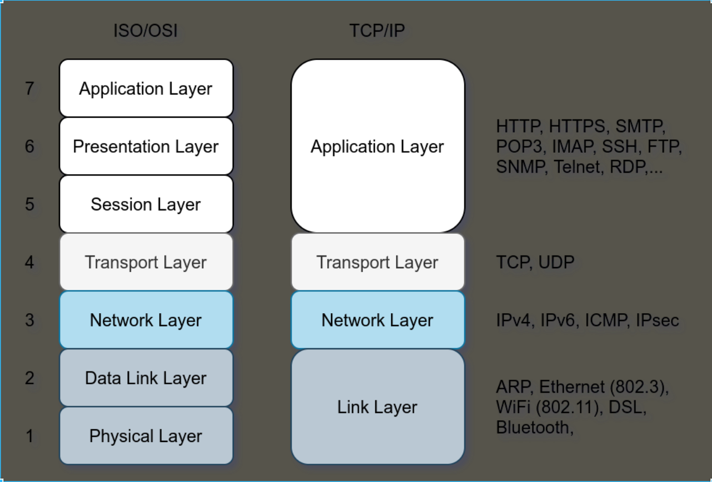
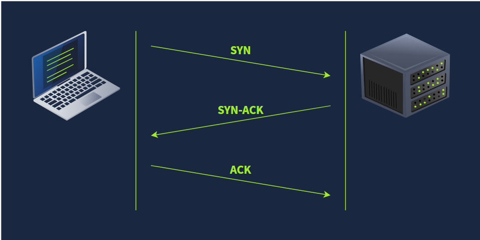
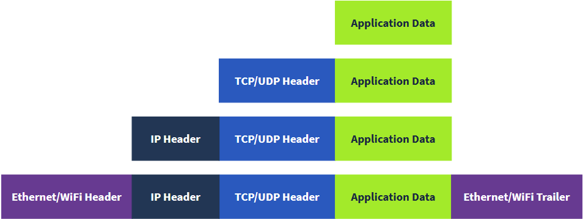

# 网络

## OSI7层模型图

1. 物理层，也称为第一层，负责设备之间的物理连接;这包括介质，如导线，以及二进制数字0和1的定义。数据传输可以通过电气信号、光信号或无线信号进行。因此，我们需要数据电缆或天线，具体取决于我们的物理媒介。
2. 数据链路层，也就是第 2 层，代表了一种协议，**它让同一网段内的节点（设备）之间能够传输数据**。 让我们说得更简单一点：数据链路层描述了同一网段内不同系统之间关于“如何交流”的一种约定。 所谓的“网段”，指的是一组通过共享介质或信道来传输信息的联网设备。 举个例子：想象一个公司办公室，里面有 10 台电脑都连在同一台交换机 (Switch) 上；这 10 台电脑就组成了一个网段。第 2 层协议的典型例子包括 以太网 (Ethernet, 802.3) 和 WiFi (802.11)。 以太网和 WiFi 的地址长度都是 6 个字节。 这种地址被称为 MAC 地址，其中 MAC 代表 介质访问控制 (Media Access Control)。 它们通常用十六进制格式表示.
3. 数据链路层专注于在同一网络段的两个节点之间传输数据。网络层，即第3层，**负责在不同网络之间传输数据**。从更技术层讲，网络层负责逻辑寻址和路由，即寻找传输网络数据包的路径。网络层的例子包括互联网协议（IP）、互联网控制消息协议（ICMP）以及虚拟专用网络（VPN）协议，如 IPSec 和 SSL/TLSVPN。
4. 传输层（Layer 4）的核心作用是**实现不同主机上运行的应用程序之间的端到端通信**，其功能依赖具体协议实现：TCP 协议作为面向连接的传输层协议，支持流量控制（滑动窗口）、数据分段（适配 MTU 限制）和错误恢复（重传机制），保证数据传输的可靠性；而 UDP 协议作为无连接协议，仅支持端到端通信和数据分段，不提供流量控制和纠错功能，更适合对实时性要求高于可靠性的场景（如视频流、DNS 查询.
5. 会话层负责建立、维护和同步运行在不同主机上的应用程序之间的通信。建立会话意味着启动应用程序之间的通信并协商会话所需的参数。数据同步确保数据按正确顺序传输，并在传输失败时提供恢复机制。
6. 展示层确保数据以应用层能够理解的形式传递。第 6 层负责数据编码、压缩和加密。编码的一个例子是字符编码，如 ASCII 或 Unicode。
7. 应用层直接向终端用户应用提供网络服务。你的网页浏览器会使用 HTTP 协议来请求文件、提交表单或上传文件。

## IP地址

IPv4 地址是一个 32位（32-bit） 的二进制整数，通常用**点分十进制（Dotted Decimal）**表示（如 192.168.1.1）。

### 子网掩码 (Subnet Mask)

子网掩码用于界定 IP 地址中哪部分是网络位，哪部分是主机位。

原理：计算机通过将“IP 地址”与“子网掩码”进行二进制的 与运算 (AND Operation) 来计算出该 IP 所属的网段（Network Address）。

规则：掩码中对应“1”的位表示网络位，对应“0”的位表示主机位。

IP: 192.168.1.10

Mask: 255.255.255.0 (二进制前 24 位全为 1)

结论：前 3 字节 (192.168.1) 是网络 ID，最后 1 字节 (.10) 是主机 ID。

在任何一个子网中，都有两个地址是保留不可用的：

网络地址 (Network Address)：

主机位全为 0 的地址。

作用：标识整个网段本身（例如 192.168.1.0），用于路由表中的条目。

广播地址 (Broadcast Address)：

主机位全为 1 的地址。

作用：向该网段内所有主机发送数据（例如 192.168.1.255）。

## CIDR

传统的 IP 分类（A类、B类、C类）已基本被淘汰，现代网络使用 CIDR 记法（斜线记法）。表示法：IP地址 / 掩码中“1”的个数示例：192.168.1.10/24/24 等同于子网掩码 255.255.255.0。这意味着前 24 位是网络位，剩下的 8 位 (32-24) 是主机位。该子网可用主机数计算公式：$2^{\text{主机位}} - 2$ （即 $2^8 - 2 = 254$ 个）。

## 网段（Network Segment）

网段（Network Segment），在 TCP/IP 协议中通常被称为子网（Subnet）。

从逻辑和技术角度来看，它是通过IP 地址和子网掩码划分出的一个逻辑区域。在这个区域内的设备，被视为“在同一条物理线路上”，具有特殊的通信权限。

同网段通信 (Layer 2 直连)
当源主机计算发现目标 IP 与自己在同一网段时：

* 不经过路由器：流量不需要网关（Gateway）参与。
* ARP 解析：源主机直接发送 ARP 广播，询问目标 IP 的 MAC 地址。
* 交换机转发：通过 Layer 2 交换机直接交换数据帧。

跨网段通信 (Layer 3 路由)
当源主机计算发现目标 IP 与自己在不同网段时：

* 必须经过路由器：源主机无法直接找到目标（广播传不过去）。
* 封装给网关：源主机将数据包发送给本网段的默认网关（Default Gateway）。注意：此时数据帧的目标 MAC 是网关的 MAC，但 IP 头的目标 IP 是最终服务器的 IP。
* 路由转发：网关（路由器）接收数据，根据路由表将其转发到下一个网段。

## 公网 IP 与 私有 IP (RFC 1918)

* 10.0.0.0 - 10.255.255.255 (10/8)
* 172.16.0.0 - 172.31.255.255 (172.16/12)
* 192.168.0.0 - 192.168.255.255 (192.168/16)

公共 IP 地址就像你的家庭邮政地址。私有 IP 地址则不同;最初的想法是，它无法到达或被外界接触。它就像一个孤立的城市或一个院落，所有房屋和公寓都有系统编号，可以轻松互通邮件，但无法与外界通信。为了让私有 IP 地址访问互联网，路由器必须拥有公共 IP 地址，并且必须支持网络地址转换（NAT）。

## UDP和TCP

网络层的 IP 协议通过 IP 地址**实现主机到主机的跨网络寻址与路由，但其仅能定位目标主机，无法区分同一主机上的多个应用进程**。

为实现应用程序间的端到端通信，传输层提供了 UDP 和 TCP 两种核心协议：二者基于 IP 协议进行底层数据传输，通过端口号（Port）标识主机上的具体应用进程，其中 TCP 协议提供可靠传输（含重传、流量控制等机制），UDP 协议提供轻量级无连接传输，适用于对实时性要求较高的场景。

有效的端口号范围在 1 到 65535 之间，因为它使用2字节，且端口 0 是保留的。

TCP 连接通过所谓的三次握手建立。使用两个标志：SYN（同步）和 ACK（确认）。数据包的发送方式如下：

1. SYN 数据包：客户端通过向服务器发送 SYN 数据包来发起连接。该数据包包含客户端随机选择的初始序列号。
2. SYN-ACK 数据包：服务器用 SYN-ACK 数据包响应 SYN 数据包，该数据包会随机添加初始序列号。
3. ACK 包：当客户端发送 ACK 包以确认收到 SYN-ACK 包时，三次握手完成。

## 封装

封装是一个关键概念，因为它让每一层都能专注于其预期功能。在下图中，我们有以下四个步骤：

1. 应用数据 ：一切始于用户输入他们想发送到应用中的数据。例如，你写邮件或即时消息后按下发送按钮。应用程序对这些数据进行格式化，并根据所使用的应用协议开始发送，使用其下层传输层。
2. 传输协议段或数据报 ：传输层，如 TCP 或 UDP，添加适当的头部信息并创建 TCP 段 （或 UDP 数据报 ）。该段被发送到其下层，即网络层。
3. 网络分组 ：网络层，即 互联网层，会在收到的 TCP 段或 UDP 数据报中添加 IP 头部。然后，这个 IP 包被发送到其下一层，即数据链路层。网络数据包.
4. 数据链路帧 ：以太网或 WiFi 接收 IP 包后添加合适的头部和尾部，形成帧 。

## DHCP协议

DHCP（动态主机配置协议）是一种运行在 应用层、基于 UDP 协议（客户端端口 68，服务器端口 67）的网络管理协议，核心功能是为局域网（LAN）内的终端设备（如电脑、手机、服务器）自动分配网络配置参数，

1. 自动分配 IPv4/IPv6 地址
2. 分配子网掩码（Subnet Mask）
3. 分配默认网关（Default Gateway）
4. 分配 DNS 服务器地址

DHCP 采用「客户端 - 服务器（C/S）架构」，终端设备接入网络后的配置流程称为「DHCP 四步握手」，

1. 发现阶段（DHCP Discover）终端设备（DHCP 客户端）接入网络后，因无 IP 地址，通过 广播包（目标 IP：255.255.255.255）发送 DHCP Discover 请求，寻找局域网内的 DHCP 服务器。
2. 提供阶段（DHCP Offer）DHCP 服务器监听广播后，向客户端发送 DHCP Offer 响应（含服务器分配的 IP 地址、子网掩码、网关、DNS、租约期等参数），同样通过广播发送（客户端未分配 IP 时）。
3. 选择阶段（DHCP Request）若存在多个 DHCP 服务器，客户端会接收多个 Offer，通常选择 最先收到的 Offer，并通过广播发送 DHCP Request，告知所有 DHCP 服务器 “已选择某台服务器的配置”（其他服务器回收未被选中的 IP）。
4. 确认阶段（DHCP Acknowledge）被选中的 DHCP 服务器发送 DHCP ACK 确认包，正式确认 IP 分配，客户端接收后即可使用该配置接入网络。

## ARP协议

地址解析协议（ ARP ）是一种网络协议。用于将网络层（第 3 层）的 IP 地址解析为链路层（第 2 层）的 MAC 地址。它将主机的 IP 地址映射到其对应的 MAC 地址，以促进局域网（ LAN ）上设备之间的通信。当**局域网**上的一个设备想要与另一个设备通信时，它会发送一个包含目标 IP 地址和自身 MAC 地址的广播消息。具有匹配 IP 地址的设备会响应其自身的 MAC 地址，然后这两个设备就可以使用它们的 MAC 地址直接通信。这个过程被称为 ARP 解析。

当发起 ARP 请求（ARP Request） 时，设备会在网络中广播（Broadcast） 一条报文，查询特定 IP 地址所对应的 MAC 地址。

网络中的其他设备在接收到该广播报文后，仅当自身的 IP 地址与查询目标一致时，才会做出响应，并发送一条包含自身 MAC 地址的 ARP 应答（ARP Reply）。请求方收到应答后，会将此 IP-MAC 映射关系（Mapping） 存储在本地的 ARP 缓存表（ARP Cache） 中，以供后续通信直接调用。

## ICMP协议

ICMP 是一种用于**网络诊断**和**错误报告**的协议。它不传输应用数据（如网页或文件），而是负责传输网络状态信息。它通常被认为是 IP 协议的“辅助协议”，ICMP 报文是被**封装在 IP 数据包**内部传输的。

两个流行的命令依赖 ICMP，它们在网络故障排除和网络安全中起着关键作用。命令如下：

1. **ping**：该命令使用 ICMP 测试与目标系统的连接，并测量往返时间（RTT）。换句话说，它可以用来了解目标是否还活着，并且它的回复能够传达到我们的系统。
   ping 命令发送 ICMP echo请求（ICMP 类型 8）。下面的截图显示了 IP 包中的 ICMP 消息。
   接收端的计算机会以 ICMP 回声回复（ICMP 类型 0）进行响应。
2. **traceroute**：在 Linux 和类 UNIX 系统中，该命令称为 traceroute，在 MS Windows 系统中称为 tracert。它利用 ICMP 来发现从主机到目标的路由。
   互联网协议有一个称为“存活时间”（Time-to-Live，TTL）字段，表示数据包在丢弃前可通过的最大路由器数量。路由器在发送数据包之前，会将数据包的 TTL 减少 1。当 TTL 归零时，路由器丢弃数据包并发送 ICMP 逾时消息（ICMP 类型 11）。（在此语境中，“时间”是以路由器数量计量，而非秒数。）

## DNS服务

DNS（域名系统，Domain Name System）是一个层次化、分散化的互联网连接资源命名系统。DNS 维护着一个域名列表以及与之相关联的资源（例如 IP 地址）。

DNS 最突出的功能是将易于记忆的域名（例如 mozilla.org）翻译成为数字化的 IP 地址（例如 192.0.2.172）；这一从域名到 IP 地址的映射过程被称为DNS 查询（DNS lookup）。与之对应，DNS 反向查询（rDNS）用来找到与 IP 地址对应的域名。

DNS 在应用层工作，即 ISO OSI 模型的第 7 层。

DNS 流量默认使用 UDP 端口 53，TCP 端口 53 作为默认的备用。

[https://howdns.works/zh-hans/]( "DNS如何工作的")

| col1 | col2                                     | col3                    | col4              | col4                                                                                                                             |
| ---- | ---------------------------------------- | ----------------------- | ----------------- | -------------------------------------------------------------------------------------------------------------------------------- |
| 0    | Stub Resolver (存根解析器)          | 本机 OS                 | 发起递归查询      | 检查本机 /etc/hosts 文件。 检查本机 DNS 缓存。 向配置的 DNS 服务器 (如 8.8.8.8) 发送请求：“请直接告诉我 IP 是多少”。 |
| 1    | Recursive Resolver(递归解析器)           | ISP DNS或 公共DNS服务器 | 接收递归,发起迭代 | 它负责替你“跑腿”，向全球各个层级的服务器进行迭代查询，并将最终结果缓存下来。                                                   |
| 2    | Root Name Server(根域名服务器)           | (全球共13组)            | 响应迭代查询      | 它不存储域名 IP。它只回复：“我不知道 www.example.com 的 IP，但你应该去问 .com 的顶级域服务器 (TLD)，IP 是 x.x.x.x”。           |
| 3    | TLD Name Server(顶级域名服务器)          | (托管 .com .cn .net等) | 响应迭代查询      | 它回复：“我不知道 www 的 IP，但 example.com 这家公司的权威服务器在哪里，IP 是 y.y.y.y”。                                       |
| 4    | Authoritative Name Server权威名称服务器) |                         | 响应权威回答      | 它是域名的真正持有者。它查询自己的配置文件，明确回复：“www.example.com 的 A 记录 IP 是 93.184.216.34”。                        |

DNS 记录有多种类型:

* **A 记录:**
  A（地址）记录将主机名映射到一个或多个 IPv4 地址。例如，你可以将 example.com 设置为解析为 172.17.2.172。
* **AAAA 记录 ：**
  AAAA 记录类似于 A 记录，但它适用于 IPv6。
* **CNAME 记录 ：**
  CNAME（规范名称）记录将一个域名映射到另一个域名。例如，www.example.com 可以映射到 example.com 甚至 example.org。
* **MX 记录 ：**
  MX（邮件交换）记录指定负责处理域名邮件的邮件服务器。
* NS 记录:

  Name Server Record（名称服务器记录),用于 指定负责解析某一域名（及子域名）的权威名称服务器（Authoritative Name Server）

  1. 主域的 NS 记录：指定主域的权威服务器
     当你注册一个域名（如 example.com）时，需在域名注册商处配置 NS 记录，指向你选择的权威服务器（如阿里云 DNS、Cloudflare 的服务器）；
     作用：告诉顶级域服务器（如 .com 服务器）：“example.com 的权威解析由这些服务器负责”，DNS 查询到这一步时，会自动转向这些权威服务器获取最终解析结果。
  2. 子域的 NS 记录：实现子域授权（大规模子域名管理核心）
     当你有大量子域名（如 blog.example.com、dev.example.com、api.example.com）时，可通过子域的 NS 记录将子域 “授权” 给独立的权威服务器管理；
     作用：
     分担主域服务器负载：不同子域由不同服务器解析，避免单台服务器承载所有查询压力；
     权限分离：子域可由不同团队独立管理（如技术部管 dev.example.com，市场部管 marketing.example.com）；
     故障隔离：某子域的权威服务器故障，不影响其他子域的解析。

## whois查询

WHOIS 是一种用于查询“域名和 IP 资源注册信息”的查询协议和数据库体系。

## HTTP（S）协议

当你启动浏览器时，主要使用 HTTP 和 HTTPS 协议。HTTP 代表超文本传输协议;HTTPS 中的 S 代表安全。该协议依赖于 TCP，定义浏览器与网络服务器的通信方式

HTTP 和 HTTPS 通常分别使用 TCP 端口 80 和 443，较少使用其他端口如 8080 和 8443。

详细介绍和文档:https://developer.mozilla.org/zh-CN/docs/Web/HTTP/Guides/Overview

## FTP协议

文件传输协议（FTP）是用于传输文件的。因此，FTP 在文件传输方面非常高效，当所有条件相同时，它可以达到比 HTTP 更高的速度。

FTP 服务器默认监听 TCP 端口 21;数据传输通过客户端到服务器的另一条连接进行。
