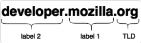
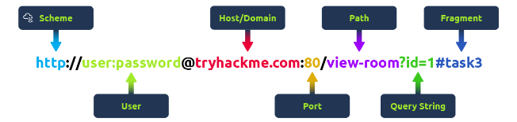
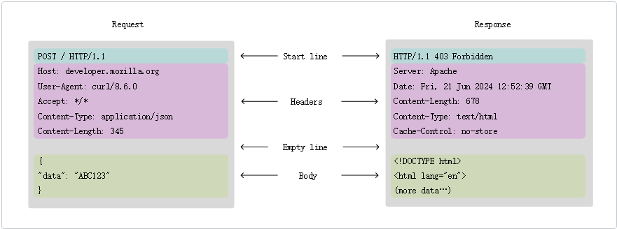
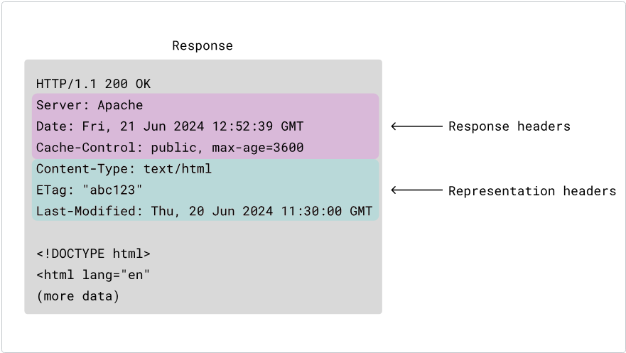

# WEB基础知识

## 域名  domain names

### 域名的结构



* Top-Level Domain顶级域名（TLD）
  顶级域名（TLD）是互联网分层域名系统（DNS）中最通用的域名 。顶级域名是域名的最后一个组成部分，例如 developer.mozilla.org 中的“org”。
* 位于顶级域名前方的标签也称为二级域 （SLD）

## URL

URL（统一资源定位码）是互联网上唯一资源的地址。它是浏览器检索已发布资源（如 HTML 页面、CSS 文档、图片等）的关键机制之一。

URL的组成部分:



Scheme:指导使用哪种协议访问资源，比如 HTTP、HTTPS、FTP（文件传输协议）。

User:访问使用 HTTP 认证安全机制的网站时，可以在 URL 中包含用户名和密码，从而立即登录网站，绕过用户名/密码对话框，否则会显示输入你的凭证

Host:你想访问服务器的域名或 IP 地址。

Port:你要连接的端口通常是 HTTP80，HTTPS 为 443，但它可以托管在 1 到 65535 之间的任意端口上。通常会省略该接口。否则就是强制的。

Path:你试图访问的资源的文件名或位置。

Query String:也叫做查询参数,提供给 Web 服务器的额外参数。这些参数是用 & 符号分隔的键值对列表 (例如？key1=value1&key2=value2)。Web 服务器可以利用这些参数在返回资源前做额外的作。每个 Web 服务器都有自己的参数规则，唯一可靠的方式是询问 Web 服务器所有者是否处理参数。

Fragment:: 是资源本身另一部分的锚点。锚点代表资源内部的一种“书签”，向浏览器指示显示该“书签”位置的内容。例如，在 HTML 文档中，浏览器会滚动到定义锚点的位置;在视频或音频文档中，浏览器会尝试跳转到锚点所代表的时间点。值得注意的是，#之后的部分，也称为片段标识符，****不**能随请求发送到服务器。**

## HTTP

### 概述

HTTP（超文本传输协议）是用于在 Web 上传输数据的应用层协议。它通常运行在 TCP 80 端口上。
HTTP 具有以下核心特点：
• 无状态性：协议本身不保存状态信息，每个请求都是独立的。
• 结构化请求：由请求行（包含方法、URL 和版本）、请求标头（元数据）和消息正文（实际数据）组成。
• 安全性：其加密版本 HTTPS 运行在 443 端口，通过 SSL/TLS 提供安全保障。

### HTTP 报文

有两种 HTTP 报文的类型，请求与响应

请求（request）——由客户端发送用来触发一个服务器上的动作；

响应（response）——来自服务器的应答。

#### 报文结构

下图展示了 HTTP/1.1 中的消息样式：

1. 起始行是描述 HTTP 版本以及请求方法或请求结果的单行。
2. 一组可选的 HTTP 头部，包含描述报文的元数据。例如，对资源的请求可能包含该资源允许的格式，而响应则可能包含头部以指示实际返回的格式。
3. 空行表示报文元数据已完成。
4. 包含与消息关联数据的可选主体 。这可能是用于发送给服务器的 POST 数据，或是响应中返回给客户端的资源。消息是否包含正文由起始行和 HTTP 头决定。

HTTP 请求报文的起始行和头部统称为请求的头部(head)，之后包含其内容的部分称为正文(body) 。

示例:

```http
POST /users HTTP/1.1
Host: example.com
Content-Type: application/x-www-form-urlencoded
Content-Length: 49

name=FirstName+LastName&email=bsmth%40example.com
```

##### 请求行结构

HTTP/1.x 请求中的起始行（如上例中为 POST /users HTTP/1.1）称为“请求行”，由三部分组成：

```http
<method> <request-target> <protocol>
```

1. **method 请求的方法**

HTTP 方法 （也称为 HTTP 动词 ）是一组定义词语中的一个，用于描述请求的含义和期望的结果。例如，GET 表示客户端希望接收服务器资源，POST 表示客户端正在向服务器发送数据。

2. **request-target请求的目标**

| 请求目标类型                   | 格式示例                      | 支持的 HTTP 方法         | 核心场景                         | 学术关键表述                                                                 |
| ------------------------------ | ----------------------------- | ------------------------ | -------------------------------- | ---------------------------------------------------------------------------- |
| Origin Form（绝对路径形式）    | /path?query=xxx               | GET、POST、HEAD、OPTIONS | 直接访问目标服务器（日常访问）   | 最常用的请求目标类型，依赖 Host 头部拼接完整资源地址，支持查询字符串参数传递 |
| Absolute Form（完整 URL 形式） | https://domain/path?query=xxx | GET                      | 通过代理服务器访问目标资源       | 包含完整协议和权威机构信息，代理服务器基于该 URL 完成请求转发                |
| Authority Form（权威机构形式） | domain:port                   | CONNECT                  | 建立 HTTP 隧道（HTTPS 前置步骤） | 仅包含域名和端口，用于隧道建立，后续数据通过隧道透明传输                     |
| Asterisk Form（星号形式）      | *                             | OPTIONS                  | 查询服务器支持的 HTTP 方法       | 以星号表示整个服务器，用于获取服务器的方法支持列表，无具体资源指向           |

3. protocal 协议

HTTP 版本用于定义后续报文的结构，同时作为服务器在生成响应时应使用的协议版本指示符。该版本几乎总是 HTTP/1.1，因为 HTTP/0.9 和 HTTP/1.0 已经被弃用。在 HTTP/2 及更高版本中，协议版本号不再包含在具体报文中，而是通过连接建立阶段进行协商并达成一致。

##### 请求头  Request headers

头部是请求中发送到起始行之后、正文之前的元数据。在上述表单提交示例中，它们是消息的以下行：

```http
Host: example.com
Content-Type: application/x-www-form-urlencoded
Content-Length: 49
```

在 HTTP/1.x 中，每个头部是一个不区分大小写的字符串，后面跟一个冒号（：）和一个格式取决于头部的值。整个头部，包括值，由一行组成。在某些情况下，这行可能相当长.

有些头部仅用于请求，而另一些则可以同时发送在请求和响应中，或者有更具体的分类：

* 请求头为请求提供了额外的上下文，或为服务器应如何处理请求（例如条件请求 ）增加了额外的逻辑。
* 如果消息有正文，表示头会在请求中发送，描述消息数据的原始形式及所应用的编码。这使接收方能够理解如何重建资源在传输前的状态。

##### 请求体  Request body

请求体是请求中传递信息给服务器的部分。只有 PATCH、POST 和 PUT 请求有正体。在表单提交示例中，这部分是正文：

```http
name=FirstName+LastName&email=bsmth%40example.com
```

##### HTTP 响应  HTTP responses

响应是服务器回复请求时发送的 HTTP 消息。回复会让客户知道请求的结果。这是一个 HTTP/1.1 对创建新用户的 POST 请求的回应示例：

```http
HTTP/1.1 201 Created
Content-Type: application/json
Location: http://example.com/users/123

{
  "message": "New user created",
  "user": {
    "id": 123,
    "firstName": "Example",
    "lastName": "Person",
    "email": "bsmth@example.com"
  }
}
```

##### 状态行

响应报文中的起始行（如上所示的 HTTP/1.1 201 Created）称为“状态行（status line）”，由三个部分组成：

```http
<protocol> <status-code> <reason-phrase>
```

1. HTTP 版本
2. 一个数字状态代码 ，表示请求是否成功或失败。常见的状态代码为 200、404 或 302
3. 状态代码后的可选文本是简短、纯信息性的状态描述，帮助人类理解请求的结果。理由短语有时会在括号内加上（例如“201 (Created)”），以表示其为可选。

##### 响应头  Response headers

响应头是随响应发送的元数据。在 HTTP/1.x 中，每个头是一个不区分大小写的字符串，后面跟一个冒号（：）和一个根据所用头部格式变化的值。



与请求头类似，响应中可能出现许多不同的头部，它们被分类为：

* 响应头部提供消息的额外上下文，或为客户端后续请求添加额外逻辑。例如， 像 Server 这样的头包含服务器软件的信息，而 Date 则包含响应生成的时间。还包含返回资源的信息，如内容类型（Content-Type）或缓存方式（Cache-Control）。
* 表示首部 如果消息有正文，它们描述了消息数据的形式以及所应用的编码。例如，同一资源可能被格式化为特定媒体类型，如 XML 或 JSON，本地化为特定书面语言或地理区域，和/或压缩或以其他方式编码以便传输。这使接收方能够理解如何重建传输前的资源。

##### 响应体  Response body

响应的最后一部分是主体。不是所有的响应都有主体：具有状态码（如 201 或 204）的响应，通常不会有主体。

主体大致可分为三类：

单资源（Single-resource）主体，由已知长度的单个文件组成。该类型主体由两个标头定义：Content-Type 和 Content-Length。
单资源（Single-resource）主体，由未知长度的单个文件组成。通过将 Transfer-Encoding 设置为 chunked 来使用分块编码。
多资源（Multiple-resource）主体，由多部分 body 组成，每部分包含不同的信息段。但这是比较少见的。
