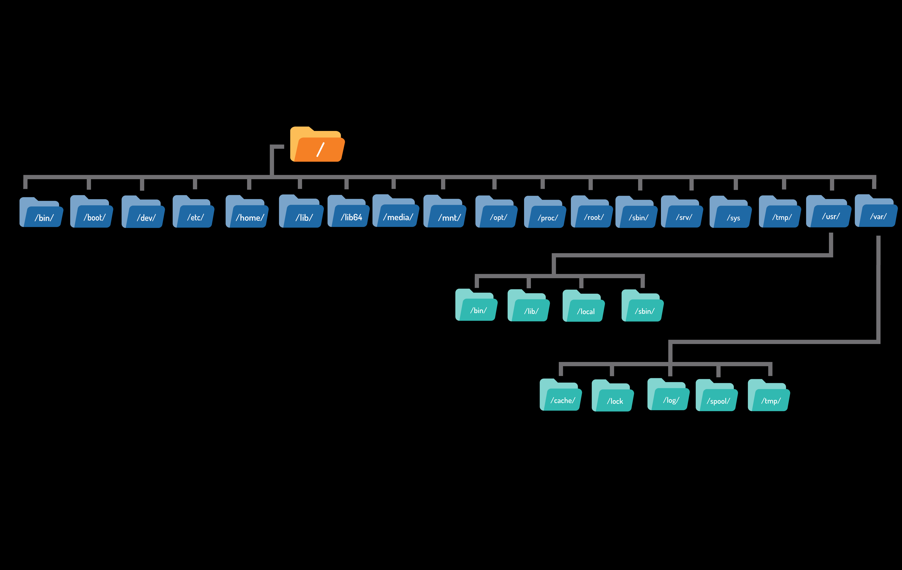
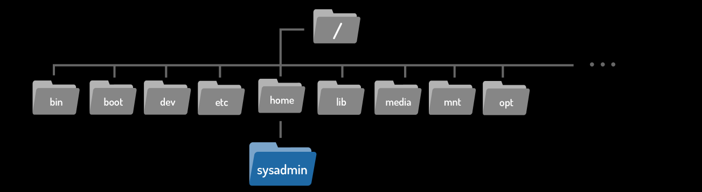
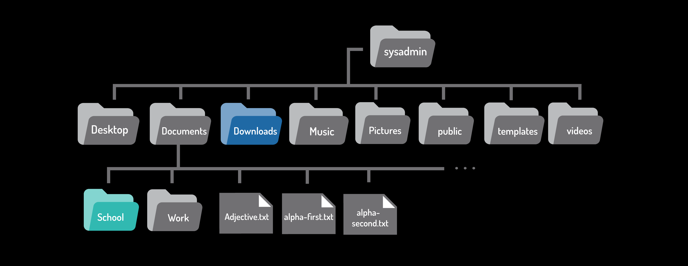
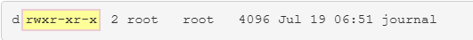
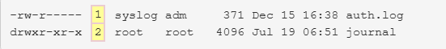
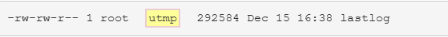
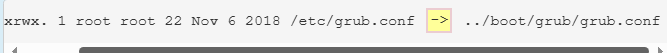
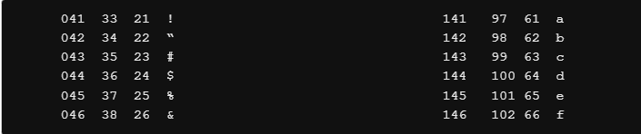

# 3.bash

## 变量

变量是一种允许用户或 shell 存储数据的功能。这些数据可用于提供关键的系统信息，或改变 Bash shell（或其他命令）的行为。变量会被赋予名称并临时存储在内存中。Bash shell 中使用两种类型的变量： 本地变量和环境变量 。

### 局部变量

局部变量或 shell 变量仅存在于当前 shell 中，不会影响其他命令或应用程序。当用户关闭终端窗口或 shell 时，所有变量都会丢失。它们通常与用户执行的任务相关联，并且按照惯例使用小写字母。

`variable=value`

```
sysadmin@localhost:~$ variable1='Something'
sysadmin@localhost:~$ echo $variable1                           
Something
```

### 环境变量

环境变量 （也称为全局变量 ）在系统范围内可用，Bash 在解释命令和执行任务时会使用所有 shell。系统会在打开新 shell 时自动重新创建环境变量。例如， PATH 、 HOME 和 HISTSIZE 变量 HISTSIZE 变量定义了历史记录列表中要存储多少条先前的命令。以下示例中的命令显示了 HISTSIZE 变量的值：

```
sysadmin@localhost:~$ echo $HISTSIZE
1000
```

要修改现有变量的值，请使用赋值表达式：

```bash
sysadmin@localhost:~$ HISTSIZE=500                                    
sysadmin@localhost:~$ echo $HISTSIZE                      
500  
```

不带参数运行 env 命令时，它会输出环境变量列表。由于 env 命令的输出可能很长，以下示例使用文本搜索来过滤输出结果。

```bash
sysadmin@localhost:~$ env | grep variable1  
```

export 命令用于将局部变量转换为环境变量。

`export variable`

导出 variable1 后，它现在是一个环境变量。现在可以在环境变量的搜索结果中找到它：

```bash
sysadmin@localhost:~$ export variable1                          
sysadmin@localhost:~$ env | grep variable1
variable1=Something
```

export 命令还可以通过在创建变量时使用赋值表达式作为参数，将变量设为环境变量：

```bash
sysadmin@localhost:~$ export variable2='Else'                   
sysadmin@localhost:~$ env | grep variable2                     
variable2=Else
```

要更改环境变量的值，请使用赋值表达式：

```bash
sysadmin@localhost:~$ variable1=$variable1' '$variable2        
sysadmin@localhost:~$ echo $variable1                           
Something Else
```

可以使用 unset 命令删除已导出的变量：

```bash
sysadmin@localhost:~$ unset variable2
```

### PATH变量

理解 Bash shell 中最重要的变量之一是 PATH 变量。它包含一个列表，定义了 shell 在查找命令时会搜索哪些目录。如果输入了一个有效的命令，但 shell 返回“命令未找到”错误，则表示 Bash shell 无法在 PATH 中包含的任何目录中找到该名称的命令。以下命令显示当前 shell 的路径：

```bash
sysadmin@localhost:~$ echo $PATH                                
/home/sysadmin/bin:/usr/local/sbin:/usr/local/bin:/usr/sbin:/usr/bin:/sbin:/bin:/usr/games
sysadmin@localhost:~$
```

列表中的每个目录都用冒号 `: `分隔。根据前面的输出，该路径包含以下目录。shell 将按照列表顺序检查这些目录：

```txt
/home/sysadmin/bin
/usr/local/sbin
/usr/local/bin
/usr/sbin
/usr/bin
/sbin
/bin
/usr/games
```

如果系统上安装了自定义软件，可能需要修改 PATH ，以便更轻松地执行这些命令。例如，以下命令会将 /usr/bin/custom 目录添加到 PATH 变量中并进行验证：

```bash
sysadmin@localhost:~$ PATH=/usr/bin/custom:$PATH                
sysadmin@localhost:~$ echo $PATH                               
/usr/bin/custom:/home/sysadmin/bin:/usr/local/sbin:/usr/local/bin:/usr/sbin:/usr/bin:/sbin:/bin:/usr/games                                      

```

#### 更新PATH变量

修改 PATH 的标准、唯一正确写法必须带 export：

```bash
export PATH=/home/soft:$PATH
```

## 命令类型

了解命令的一种方法是查看它的来源。可以使用 type 命令来确定命令类型信息。

`type command`

CLI 的 shell 中有几种不同的命令来源，包括内部命令 、 外部命令 、 别名和函数 。

### 内部命令

内部命令也称为内置命令，它们内置于 shell 本身。例如， cd （更改目录）命令就是 Bash shell 的一部分。当用户输入 cd 命令时，Bash shell 已经启动并知道如何解释该命令，无需启动任何其他程序。

type 命令将 cd 命令标识为内部命令：

```bash
sysadmin@localhost:~$ type cd                             
cd is a shell builtin
```

### 外部命令

外部命令是存储在 shell 会搜索的目录中的二进制可执行文件。如果用户输入 ls 命令，shell 会搜索 PATH 变量中列出的目录，尝试找到名为 ls 的可执行文件。

如果某个命令的行为不符合预期，或者某个本应可访问的命令却无法访问，那么了解 shell 在哪里找到该命令或它正在使用的版本就很有帮助。手动查找 PATH 变量中列出的每个目录会非常繁琐。因此，可以使用 which 命令来显示相关命令的完整路径：

`which command`

which 命令通过搜索 PATH 变量来查找命令的位置。

```bash
sysadmin@localhost:~$ which ls                               
/bin/ls                                                       
sysadmin@localhost:~$ which cal                                
/usr/bin/cal
```

对于外部命令， type 命令会显示命令的位置：

```bash
sysadmin@localhost:~$ type cal                              
cal is /usr/bin/cal
```

### 别名

别名可以将较长的命令映射到较短的按键序列。当 shell 检测到正在执行别名时，它会先用别名替换较长的按键序列，然后再解释命令。

例如， ls -l 命令通常被别名为 l 或 ll 。由于这些较小的命令更容易输入，因此运行 ls -l 命令行会更快。

要确定当前 shell 中设置了哪些别名，请使用 alias 命令：

```bash
sysadmin@localhost:~$ alias                                     
alias egrep='egrep --color=auto'                               
alias fgrep='fgrep --color=auto'                                
alias grep='grep --color=auto'                                  
alias l='ls -CF'                                               
alias la='ls -A'                                               
alias ll='ls -alF'                                             
alias ls='ls --color=auto'
```

可以使用以下格式创建新别名，其中 name 是要赋予别名的名称， command 是运行别名时要执行的命令。

`alias name=command`

### 函数

也可以使用现有命令来构建函数，从而创建新命令，或覆盖 shell 内置命令或存储在文件中的命令。别名和函数通常在 shell 首次启动时从初始化文件中加载。

函数比别名更高级，通常用于 Bash shell 脚本中。函数通常用于执行多个命令。要创建函数，请使用以下语法：

```bash
function_name ()
{
commands
}
```

在上面的格式中， function_name 可以是管理员想要调用该函数的任何名称。管理员想要执行的命令可以替换 commands 占位符。请注意格式，特别是圆括号 () 和花括号 {} 的位置，以及使用制表符使函数更易于阅读的约定。

函数非常有用，因为它们允许一次执行一组命令，而无需重复输入每个命令。在下面的示例中，创建了一个名为 my_report 的函数来执行 ls 、 date 和 echo 命令。

```bash
sysadmin@localhost:~$ my_report () {                                    
> ls Documents                                                          
> date                                                                  
> echo "Document directory report"                                      
> }   
```

创建函数时，会出现 > 字符作为提示符，要求输入函数命令。花括号 {} 用于告知 shell 函数何时开始和结束，以便退出 > 提示符。

函数创建完成后，即可在 BASH 提示符下调用函数名来执行该函数：

## 引号

在 Linux 管理和大多数计算机编程语言中，引号被广泛使用，用于告知系统引号内的信息应该被忽略或以不同于通常方式的方式处理。对于 Bash shell 而言，有三种引号具有特殊意义：双引号 " 、单引号 ' 和反引号 ` 。每组引号都会提醒 shell 不要以常规方式处理引号内的文本。

### 双引号

双引号可以阻止 shell 解释某些元字符（特殊字符），包括 通配符。

在双引号内，星号就是星号，问号就是问号，以此类推，这在你想在屏幕上显示通常对 shell 来说是特殊字符的内容时非常有用。在下面的 echo 命令中，Bash shell 不会将 glob 模式转换为与该模式匹配的文件名：

```bash
sysadmin@localhost:~$ echo "The glob characters are *, ? and [ ]"  
The glob characters are *, ? and [ ]
```

双引号仍然允许命令替换 、 变量替换 ，并且支持一些尚未讨论的其他 shell 元字符。以下演示表明， PATH 变量的值仍然会显示出来：

```bas
sysadmin@localhost:~$ echo "The path is $PATH"                  
The path is /usr/bin/custom:/home/sysadmin/bin
```

### 单引号

单引号会阻止 shell 对特殊字符进行任何解释，包括通配符、变量、命令替换和其他尚未讨论过的元字符。

例如，要使 \$ 符号只表示字符的意思，而不是作为 shell 查找变量值的指示符，请执行下面显示的第二个命令：

```bash
sysadmin@localhost:~$ echo The car costs $100                   
The car costs 00                                                
sysadmin@localhost:~$ echo 'The car costs $100'                
The car costs $100
```

### 反斜杠

还有一种替代方法，本质上就是用单引号将单个字符括起来。

如果将此句放在双引号中，` $PATH`   `$1`被视为变量。

```bash
sysadmin@localhost:~$ echo "The service costs $1 and the path is $PATH"

‌⁠⁠The service costs  and the path is /usr/bin/custom:/home
```

`请在美元符号 $ 前面使用反斜杠 \ 字符，以防止 shell 将其解释`

### 反引号

反引号 （或反引号 ）用于在命令中指定另一个命令，这个过程称为命令替换 。

虽然听起来可能有点令人困惑，但一个例子应该能让你更清楚地理解。首先，请注意 date 命令的输出：

```bash
sysadmin@localhost:~$ date                                   
Mon Nov  4 03:35:50 UTC 2018
```

现在，请注意 echo 命令的输出：

```bash
sysadmin@localhost:~$ echo Today is date                       
Today is date
```

在之前的命令中， date 这个词被视为普通文本，shell 会将 date 传递给 echo 命令。要执行 date 命令并将该命令的输出发送给 echo 命令，请将 date 命令放在两个反引号字符之间：

```bash
sysadmin@localhost:~$ echo Today is `date`                 
Today is Mon Nov 4 03:40:04 UTC 2018
```

## 控制语句

控制语句允许您同时使用多个命令，或者根据先前命令的成功与否运行其他命令。通常，这些控制语句用于脚本中，但也可以在命令行中使用。

### 分号

> command1; command2; command3

分号 ( ; ) 可用于依次运行多个命令。每个命令独立且连续地运行；无论第一个命令的结果如何，第二个命令都会在第一个命令完成后运行，然后是第三个命令，依此类推。

### 双 & 符号

> command1 && command2

双 && 符号表示逻辑“与”关系；如果第一个命令执行成功，则第二个命令也会执行。如果第一个命令执行失败，则第二个命令不会执行。

### 双竖线 ||

双竖线 || 表示逻辑“或”。根据第一个命令的执行结果，第二个命令要么执行，要么跳过。

使用双竖线，如果第一个命令执行成功，则跳过第二个命令；如果第一个命令执行失败，则执行第二个命令。

## 通配符

通配符 (glob) 功能强大，因为它允许您指定匹配目录中文件名的模式。这样，您无需一次操作单个文件，即可轻松执行影响多个文件的命令。例如，通过使用通配符，您可以操作所有具有特定扩展名或特定文件名长度的文件。

与 shell 执行的命令或 shell 传递给命令的选项和参数不同，glob 字符由 shell 在尝试执行任何命令之前自行解释。因此，glob 字符可以与任何命令一起使用。

### 星号 * 字符

星号 * 用于表示文件名中零个或多个任意字符。例如，要显示 /etc 目录中所有以字母 t 开头的文件：

```bash
sysadmin@localhost:~$ echo /etc/t*                        
/etc/terminfo /etc/timezone /etc/tmpfiles.d
```

### 问号？字符

问号“ ? ”代表任意单个字符。每个问号都对应一个字符，不多也不少。

假设你想显示 /etc 目录中所有以字母 t 开头且 t 字符后正好有 7 个字符的文件：

```bash
sysadmin@localhost:~$ echo /etc/t???????  
/etc/terminfo /etc/timezone
```

星号和问号也可以一起使用，通过 /etc/*.??? 模式查找具有三个字母扩展名的文件：

```bash
sysadmin@localhost:~$ echo /etc/*.???          
/etc/issue.net /etc/locale.gen
```

### 方括号 [ ] 字符

方括号 [ ] 用于匹配单个字符，它表示一个可能的匹配字符范围。例如， /etc/[gu]* 模式匹配任何以 g 或 u 字符开头且包含零个或多个其他字符的文件：

```bash
sysadmin@localhost:~$ echo /etc/[gu]*                        
/etc/gai.conf /etc/groff /etc/group /etc/group- /etc/gshadow /etc/gshadow- /etc/
gss /etc/ucf.conf /etc/udev /etc/ufw /etc/update-motd.d /etc/updatedb.conf       
```

方括号也可以用来表示一系列字符。例如， /etc/[ad]* 模式匹配所有以 a 到 d 之间（含 a 和 d）的任何字母开头的文件：

```bash
$ echo /etc/[a-d]*
/etc/adduser.conf /etc/alternatives /etc/apparmor
```

该范围基于 ASCII 文本表。该表定义了一个字符列表，并按照特定的标准顺序排列。如果提供的顺序无效，则不会找到匹配项。

### 感叹号！字符

感叹号 ! 字符与方括号一起使用，用于否定一个范围。

例如，模式 /etc/[!DP]* 匹配任何不以 D 或 P 开头的文件。

```bash
sysadmin@localhost:~$ echo /etc/[!a-t]*
/etc/X11 /etc/ucf.conf /etc/udev /etc/ufw /etc/update-motd.d /etc/updatedb.conf 
/etc/vim /etc/vtrgb /etc/wgetrc /etc/xdg
```


# 2.文件系统和权限

在 Linux 系统中，一切皆文件。 文件用于存储文本、图形和程序等数据。 目录也是一种文件类型，用于存储其他文件；Windows 和 Mac OS X 用户通常称之为文件夹 。无论如何，目录都用于提供层级式的组织结构。然而，这种结构可能会因所使用的系统类型而略有不同。

## 目录结构

下图展示了一个典型的 Linux 文件系统的可视化表示：

### 家目录

在 /home 目录下，系统中的每个用户都有一个目录。目录名称与用户名相同，因此名为 sysadmin 的用户将拥有一个名为 /home/sysadmin 主目录。



用户主目录是一个重要的目录。首先，当用户打开 shell 时，应该自动进入他们的主目录，因为通常情况下，他们的大部分工作都是在这里完成的。

此外，用户主目录是少数几个用户拥有完全控制权的目录之一，用户可以创建和删除其他文件和目录。在大多数 Linux 发行版中，只有系统所有者和管理员才能访问用户主目录中的文件。Linux 文件系统中的大多数其他目录都受到文件权限的保护。

用户主目录使用一个特殊符号来表示：波浪号 ~ 字符。因此，如果 sysadmin 用户已登录，则可以使用波浪号 ~ 字符来代替 /home/sysadmin 目录。

也可以使用波浪号 ~ 字符后跟用户帐户名来引用其他用户的主目录。例如， ~bob 等同于 /home/bob 。

### 当前目录

要确定用户当前在文件系统中的位置，可以使用 pwd （print working directory）命令：

```bash
sysadmin@localhost:~$ pwd
/home/sysadmin
```

## 路径

路径有两种类型： 绝对路径和相对路径 。

### 绝对路径

绝对路径允许用户指定目录的确切位置。它始终从根目录开始，因此始终以斜杠 / 开头。路径 /home/sysadmin 就是一个绝对路径；它告诉系统从根目录 / 开始，进入 home 目录，然后进入 sysadmin 目录。

如果将路径 /home/sysadmin 作为 cd 命令的参数，则会将用户移动到 sysadmin 用户的主目录。

### 相对路径

相对路径从当前目录开始。相对路径指向文件系统中相对于当前位置的文件。它们不以斜杠“/”开头，而是以目录名开头。更具体地说，相对路径以当前目录下某个子目录的名称开头。

### 快捷符号

无论用户当前位于哪个目录，两个句点 .. ”始终表示相对于当前目录的上一级目录，有时也称为父目录 。要从 Art 目录返回 School 目录：

```bash
sysadmin@localhost:~/Documents/School/Art$ cd ..
sysadmin@localhost:~/Documents/School$ 
```

双点号也可以用于更长的路径。以下相对路径可用于从 School 目录跳转到 Downloads 目录（下图高亮显示）：



```bash
sysadmin@localhost:~/Documents/School$ cd ../../Downloads
sysadmin@localhost:~/Downloads$
```

无论用户当前位于哪个目录，单个句点 . 始终代表当前目录。

## 列出目录中的文件

ls 命令还可以用来列出文件系统中任何目录的内容。将目录路径作为参数提供即可：

```bash
sysadmin@localhost:~$ ls /var                                             
backups  cache  lib  local  lock  log  mail  opt  run  spool  tmp 
```

彩色输出并非 ls 命令的默认行为，而是 --color 选项的效果。ls ls 似乎会自动进行着色，因为 ls 命令有一个别名，所以它会在启用 --color 选项的情况下运行。

```bash
sysadmin@localhost:~$ type ls
ls is aliased to `ls --color=auto'
```

要避免使用别名，请在命令前加上反斜杠字符 \ ：

```bash
sysadmin@localhost:~$ ls
Desktop  Documents  Downloads  Music  Pictures  Public  Templates  Videos 
sysadmin@localhost:~$ \ls
Desktop  Documents  Downloads  Music  Pictures  Public  Templates  Videos
```

### 列出隐藏文件

使用 ls 命令显示目录内容时，并非所有文件都会自动显示。ls 命令默认会忽略隐藏文件。隐藏文件是指以点号 `.`开头的任何文件（或目录）。

要显示所有文件（包括隐藏文件），请使用 ls 命令的 -a 选项：

### 长显示列表

每个文件都关联着一些称为元数据的详细信息。这些信息包括文件大小、所有权或时间戳等。要查看这些信息，请使用 ls 命令的 -l 选项。下面以 /var/log 目录为例，因为它会输出各种不同的信息：

```bash
sysadmin@localhost:~$ ls -l /var/log/
total 900                                                                 
-rw-r--r-- 1 root   root  15322 Dec 10 21:33 alternatives.log
drwxr-xr-x 1 root   root   4096 Jul 19 06:52 apt
-rw-r----- 1 syslog adm     371 Dec 15 16:38 auth.log
-rw-r--r-- 1 root   root  35330 May 26  2018 bootstrap.log
-rw-rw---- 1 root   utmp      0 May 26  2018 btmp
-rw-r----- 1 syslog adm     197 Dec 15 16:38 cron.log
-rw-r--r-- 1 root   adm   85083 Dec 10 21:33 dmesg
-rw-r--r-- 1 root   root 351960 Jul 19 06:52 dpkg.log
-rw-r--r-- 1 root   root  32064 Dec 10 21:33 faillog
drwxr-xr-x 2 root   root   4096 Jul 19 06:51 journal
-rw-rw-r-- 1 root   utmp 292584 Dec 15 16:38 lastlog
-rw-r----- 1 syslog adm   14185 Dec 15 16:38 syslog
-rw------- 1 root   root  64128 Dec 10 21:33 tallylog
-rw-rw-r-- 1 root   utmp    384 Dec 15 16:38 wtmp
```

上面的输出中，每一行都显示了单个文件的元数据。以下内容描述了 ls -l 命令输出中的每个数据字段：

#### 文件类型

每行的第一个字符表示文件类型。文件类型包括：

| 符号 | 文件类型       | 说明                                               |
| ---- | -------------- | -------------------------------------------------- |
| d    | directory      | 目录，用于存放其他文件                             |
| -    | regular file   | 普通文件，包括文本文件、图片、二进制文件、压缩包等 |
| l    | symbolic link  | 符号链接（软链接），指向另一个文件                 |
| s    | socket         | 套接字，用于进程间通信                             |
| p    | pipe           | 管道，用于进程间通信                               |
| b    | block file     | 块设备文件，用于与硬件交互                         |
| c    | character file | 字符设备文件，用于与硬件交互                       |

#### 权限

接下来的九个字符表示文件的权限。权限指示特定用户如何访问文件。



#### 硬链接计数



这个数字表示有多少个硬链接指向该文件。

#### 用户所有者


每个文件都归某个用户帐户所有。这一点很重要，因为所有者有权设置文件的权限。

组所有者



指示哪个组拥有此文件。这一点很重要，因为该组的任何成员都拥有对该文件的特定权限。

#### 文件大小


显示文件大小（以字节为单位）。

对于目录而言，此值并非描述目录的总大小，而是描述用于跟踪目录中文件名的预留字节数。换句话说，对于目录，请忽略此字段。

#### 时间戳


表示文件内容最后修改的时间。对于目录，此时间戳表示最后一次向目录中添加或删除文件的时间。

#### 文件名


最后一个字段包含文件或目录的名称。

对于符号链接 ，会显示链接名称、箭头以及原始文件的路径名。



### 列出目录详情

使用 -d 选项时，它指的是当前目录，而不是目录中的内容。

```bash
sysadmin@localhost:~$ ls -ld                                     
drwxr-xr-x 1 sysadmin sysadmin 224 Nov  7 17:07 .
```

请注意长列表末尾的单个句点。这表示列出的是当前目录，而不是目录内容。

### 递归列表

有时，您可能需要显示目录中的所有文件以及该目录下所有子目录中的所有文件。这称为递归列表 。

要执行递归列表，请使用 ls 命令的 -R 选项：

```bash
sysadmin@localhost:~$ ls -R /etc/ppp
/etc/ppp:
ip-down.d  ip-up.d   

/etc/ppp/ip-down.d:
bind9

/etc/ppp/ip-up.d:
bind9
```

请注意，在前面的示例中，首先列出了 /etc/ppp 目录中的文件。之后，列出了其子目录 /etc/ppp/ip-down.d 和 /etc/ppp/ip-up.d 的内容。

### 对列表进行排序

默认情况下， ls 命令按文件名字母顺序对文件进行排序。有时，可能需要使用其他条件对文件进行排序。

要按文件大小排序，我们可以使用 -S 选项

-t 选项会根据文件的修改时间对其进行排序。它会将最近修改的文件列在最前面。此选项可以单独使用，但通常与 -l 选项结合使用效果更佳：

```
需要注意的是，目录的修改日期表示最后一次向该目录添加或从中删除文件的时间。
```

如果目录中的文件在数天或数月前被修改，则可能难以准确判断其修改时间，因为对于较旧的文件，仅提供日期信息。要获取更详细的修改时间信息，可以使用 --full-time 选项来显示完整的时间戳（包括小时、分钟和秒）。该选项会自动假定使用了 -l 选项。

可以使用 -r 选项执行反向排序。它可以单独使用，也可以与 -S 或 -t 选项组合使用。以下命令将按文件大小从小到大排序：

```bash
sysadmin@localhost:~$ ls -lrS /etc/ssh
total 580
-rw-r--r-- 1 root root     99 Jul 19 06:52 ssh_host_ed25519_key.pub
-rw-r--r-- 1 root root    179 Jul 19 06:52 ssh_host_ecdsa_key.pub
-rw------- 1 root root    227 Jul 19 06:52 ssh_host_ecdsa_key
-rw-r--r-- 1 root root    338 Jul 19 06:52 ssh_import_id
-rw-r--r-- 1 root root    399 Jul 19 06:52 ssh_host_rsa_key.pub
-rw------- 1 root root    411 Jul 19 06:52 ssh_host_ed25519_key
-rw-r--r-- 1 root root   1580 Feb 10  2018 ssh_config
-rw------- 1 root root   1679 Jul 19 06:52 ssh_host_rsa_key
-rw-r--r-- 1 root root   3264 Feb 10  2018 sshd_config
-rw-r--r-- 1 root root 553122 Feb 10  2018 moduli 
```

# 文件操作

## 常用命令

### cp

#### 复制文件

当目标位置为目录时，生成的新文件将与原文件同名。要为新文件指定不同的名称，请在目标位置中提供新名称

如果目标文件已存在， cp 命令可能会破坏现有数据。在这种情况下， cp 命令会将源文件的内容覆盖现有文件的内容。

-i 选项要求您对每个可能覆盖现有文件内容的复制操作回答 y 或 n 。

要自动对每个提示回答 n ，请使用 -n 选项。它表示不覆盖 (no clobber) 或不重写 (no overwrite) 。

#### 复制目录

默认情况下， cp 命令不会复制目录；任何尝试复制目录的行为都会导致错误消息：

但是， 递归的 -r 选项允许 cp 命令复制文件和目录。

### mv

文件移动操作是指将文件从原位置移除并放置到新位置。在 Linux 系统中移动文件可能比较棘手，因为用户需要特定的权限才能从目录中删除文件。如果没有正确的权限，系统会返回 Permission denied 错误信息。

mv 命令不仅用于移动文件，还用于重命名文件。如果 mv 命令的目标位置是目录，则文件会被移动到指定的目录。只有当同时指定目标文件名时，文件名才会改变。

如果未指定目标目录，则文件将使用目标文件名重命名，并保留在源目录中。

### rm

为安全起见，用户在删除多个文件时应使用 -i 选项：

```bash
sysadmin@localhost:~$ rm -i *.txt                               
rm: remove regular empty file `example.txt'? y                   
rm: remove regular empty file `sample.txt'? n                    
rm: remove regular empty file `test.txt'? y   
```

rm 命令删除目录。但是， rm 命令的默认行为（不带任何选项）是不删除目录的：

要使用 rm 命令删除目录，请使用 -r 递归选项：

您也可以使用 rmdir 命令删除目录，但前提是该目录为空。

### mkdir

要创建目录，请使用 mkdir 命令：

```bash
sysadmin@localhost:~$ ls                                         
Desktop  Documents  Downloads  Music  Pictures  Public  Templates  sample.txt
sysadmin@localhost:~$ mkdir test                                 
sysadmin@localhost:~$ ls                                         
Desktop    Downloads  Pictures  Templates   test                 
Documents  Music      Public    sample.txt
```

## 归档和压缩

Archiving归档 ：将多个文件合并为一个文件，从而消除单个文件的开销，使文件更容易传输。

Compression压缩 ：通过删除冗余信息来减小文件大小。

文件可以单独压缩，也可以将多个文件合并到一个压缩包中，然后再进行压缩。后一种方法仍然称为归档。

### gzip

扩展名以 `.gz `来识别

压缩

```bash
sysadmin@localhost:~/Documents$ gzip longfile.txt
sysadmin@localhost:~/Documents$ ls -l longfile*
-rw-r--r-- 1 sysadmin sysadmin 341 Dec 20  2017 longfile.txt.gz
```

解压

```bash
sysadmin@localhost:~/Documents$ gunzip longfile.txt.gz
sysadmin@localhost:~/Documents$ ls -l longfile*
-rw-r--r-- 1 sysadmin sysadmin 66540 Dec 20  2017 longfile.txt
```

### tar

tar 命令有三种模式，熟悉这些模式很有帮助：

* Create创建： 将一系列文件创建一个新的归档文件。
* Extract提取： 从压缩文件中提取一个或多个文件。
* List列表： 显示压缩包的内容而不解压。

#### 创建归档

使用 tar 命令创建归档文件需要两个命名选项：

```bash
tar -c [-f ARCHIVE] [OPTIONS] [FILE...]
```

| 选项       | 功能                                    |
| ---------- | --------------------------------------- |
| -c         | 创建归档文件                            |
| -f ARCHIVE | 参数 ARCHIVE 将是生成的归档文件的名称。 |

其余所有参数均视为输入文件名，可以是通配符、文件列表或两者兼有。

以下示例展示了如何从多个文件创建 tar 文件 （也称为 tarball ）。第一个参数创建一个名为 alpha_files.tar 的归档文件。通配符选项 * 用于将所有以 alpha 开头的文件包含在归档文件中：

```bash
sysadmin@localhost:~/Documents$ tar -cf alpha_files.tar alpha*
sysadmin@localhost:~/Documents$ ls -l alpha_files.tar
-rw-rw-r-- 1 sysadmin sysadmin 10240 Oct 31 17:07 alpha_files.tar
```

最终生成的 alpha_files.tar 文件大小为 10240 字节。通常情况下，由于需要重新创建原始文件，tar 压缩包会比合并后的输入文件略大。为了便于传输，可以对 tar 压缩包进行压缩，方法是使用 gzip 压缩文件，或者使用 tar 命令的 -z 选项进行压缩。

-z 使用 gzip 命令压缩（或解压缩）存档。

下一个示例显示了与上一个示例相同的命令，但添加了 -z 选项。

```bash
sysadmin@localhost:~/Documents$ tar -czf alpha_files.tar.gz alpha*
sysadmin@localhost:~/Documents$ ls -l alpha_files.tar.gz
-rw-rw-r-- 1 sysadmin sysadmin 417 Oct 31 17:15 alpha_files.tar.gz
```

虽然文件扩展名不会影响文件的处理方式，但惯例是使用 .tar 表示 tar 包，使用 .tar.gz 或 .tgz 表示压缩的 tar 包。

可以通过将 -j 选项替换为 -z 选项，并使用 .tar.bz2 、 .tbz 或 .tbz2 作为文件扩展名，来使用 bzip2 压缩代替 gzip 压缩。

| 选项 | 功能                                                        |
| ---- | ----------------------------------------------------------- |
| -j   | 使用 bzip2 命令对归档文件**压缩**（或**解压**） |

例如，要归档和压缩 School 目录：

```bash
sysadmin@localhost:~/Documents$ tar -cjf folders.tbz School
```

#### 列表模式

给定一个 tar 归档文件（无论是否压缩），您可以使用 -t 选项查看其内容。以下示例使用了三个选项：

| 选项           | 功能                                                            |
| -------------- | --------------------------------------------------------------- |
| `-t`         | 列出归档文件**内部包含的文件**（只查看，不解压）          |
| `-j`         | 配合 `bzip2` 工具处理压缩包（解压 / 识别 .tbz/.tar.bz2 格式） |
| `-f ARCHIVE` | 指定要操作的**归档文件名称**                              |

用于列出 folders.tbz 这个归档文件的内部内容

```bash
sysadmin@localhost:~/Documents$ tar -tjf folders.tbz
School/
School/Engineering/
School/Engineering/hello.sh
School/Art/
School/Art/linux.txt
School/Math/
School/Math/numbers.txt
```

#### 提取模式

```bash
sysadmin@localhost:~/Downloads$ tar -xjf folders.tbz
sysadmin@localhost:~/Downloads$ ls -l
total 8
drwx------ 5 sysadmin sysadmin 4096 Dec 20  2017 School
-rw-rw-r-- 1 sysadmin sysadmin  413 Oct 31 18:37 folders.tbz
```

可以使用 –x 选项解压缩。以下示例使用与之前类似的模式，指定操作、压缩方式和要操作的文件名。

| 选项       | 功能                           |
| ---------- | ------------------------------ |
| -x         | 从归档文件中**解压**文件 |
| -j         | 使用 bzip2 命令进行解压        |
| -f ARCHIVE | 对指定的归档文件进行操作       |

原始文件保持不变，新目录已创建。新目录内包含原始目录和文件。

添加 –v 标志，即可获得已处理文件的详细输出，从而更容易跟踪正在发生的事情

务必将 –f 标志放在命令末尾，因为 tar 会假定该选项后面的内容是文件名。在下一个示例中， –f 和 –v 标志的位置互换了，导致 tar 将该命令解释为对名为 v 的文件执行操作，而该文件并不存在。

```bash
sysadmin@localhost:~/Downloads$ tar -xjfv folders.tbz 
tar (child): v: Cannot open: No such file or directory
tar (child): Error is not recoverable: exiting now
tar: Child returned status 2
tar: Error is not recoverable: exiting now
```

如果仅想从归档文件中解压指定的部分文件，在命令末尾直接添加这些文件的名称即可；默认情况下，文件名必须与归档内的文件名完全精确匹配，也可以使用通配符模式批量匹配。
以下示例使用了前文的归档文件，仅解压 School/Art/linux.txt 这一个文件。命令的输出（因使用 -v 参数开启了详细模式）会显示仅解压了这一个文件。

```bash
sysadmin@localhost:~/Downloads$ tar -xjvf folders.tbz School/Art/linux.txt
School/Art/linux.txt
```

### ZIP 文件

zip 的默认模式是将文件添加到存档中并进行压缩。

```bash
zip [OPTIONS] [zipfile [file…]]
```

第一个参数 zipfile 是要创建的压缩文件的名称，之后是要添加的文件列表。以下示例展示了如何创建一个名为 alpha_files.zip 的压缩文件：

```bash
sysadmin@localhost:~/Documents$ zip alpha_files.zip alpha*
  adding: alpha-first.txt (deflated 32%)
  adding: alpha-second.txt (deflated 36%)
  adding: alpha-third.txt (deflated 48%)
  adding: alpha.txt (deflated 53%)
  adding: alpha_files.tar.gz (stored 0%) 
```

需要注意的是：tar 命令必须使用 -f 选项来指定tar 压缩包的名字；而 zip 和 unzip 命令直接跟文件名即可，无需额外用参数声明。
zip 命令默认不会递归进入子目录（这与 tar 命令的行为不同）。也就是说，仅指定目录名 School 时，只会打包一个空目录，不会包含目录下的文件。如果想实现和 tar 一样的递归打包效果，必须使用 -r 选项 开启递归功能。

unzip 命令的 –l 选项会列出 .zip 压缩包中的文件：

```bash
sysadmin@localhost:~/Documents$ unzip -l School.zip
Archive:  School.zip
  Length      Date    Time    Name
---------  ---------- -----   ----
        0  2017-12-20 16:46   School/
        0  2018-10-31 17:47   School/Engineering/
      647  2018-10-31 17:47   School/Engineering/hello.sh
        0  2018-10-31 19:31   School/Art/
       83  2018-10-31 17:45   School/Art/linux.txt
        0  2018-10-31 17:46   School/Math/
       10  2018-10-31 17:46   School/Math/numbers.txt
       51  2018-10-31 19:31   School/Art/red.txt
       67  2018-10-31 19:30   School/Art/hidden.txt
       42  2018-10-31 19:31   School/Art/animals.txt
---------                     -------
      900                     10 files
        0  2018-10-31 17:46   School/Math/
       10  2018-10-31 17:46   School/Math/numbers.txt
---------                     -------
      740                     7 files
```

解压缩文件与创建压缩文件类似，因为 unzip 命令的默认操作就是解压缩。它会提供几个选项，用于判断解压缩的文件是否会覆盖现有文件：

```bash
sysadmin@localhost:~/Documents$ unzip School.zip
Archive:  School.zip
replace School/Engineering/hello.sh? [y]es, [n]o, [A]ll, [N]one, [r]ename: n
replace School/Art/linux.txt? [y]es, [n]o, [A]ll, [N]one, [r]ename: n
replace School/Math/numbers.txt? [y]es, [n]o, [A]ll, [N]one, [r]ename: n
replace School/Art/red.txt? [y]es, [n]o, [A]ll, [N]one, [r]ename: n
replace School/Art/hidden.txt? [y]es, [n]o, [A]ll, [N]one, [r]ename: n
replace School/Art/animals.txt? [y]es, [n]o, [A]ll, [N]one, [r]ename: n
```

将目录组件与文件名一起传递，这样就只提取了该文件

```bash
sysadmin@localhost:~/Documents/tmp$ unzip School.zip School/Math/numbers.txt
Archive:  School.zip
 extracting: School/Math/numbers.txt
```

# 文本处理

## cat

```bash
sysadmin@localhost:~/Documents$ cat food.txt 
Food is good.
```

虽然终端是此命令的默认输出，但也可以通过使用重定向字符，将 cat 命令用于将文件内容重定向到其他文件或作为另一个命令的输入。

默认情况下， cut 命令期望输入以制表符分隔，但 -d 选项可以指定其他分隔符，例如冒号或逗号。

-f 选项可以指定要显示的字段，可以是连字符分隔的范围，也可以是逗号分隔的列表。以下示例显示了 mypasswd 数据库文件中的第一、第五、第六和第七个字段：

```bash
sysadmin@localhost:~$ cut -d: -f1,5-7 mypasswd
root:root:/root:/bin/bash
daemon:daemon:/usr/sbin:/usr/sbin/nologin
bin:bin:/bin:/usr/sbin/nologin
sys:sys:/dev:/usr/sbin/nologin
sync:sync:/bin:/bin/sync
```

cut 命令还可以使用 -c 选项根据字符位置提取文本列——这在处理固定宽度的数据库文件或命令输出时非常有用。

例如， ls -l 命令的各个字段始终位于相同的字符位置。以下命令将仅显示文件类型（第 1 个字符）、权限（第 2-10 个字符）、空格（第 11 个字符）和文件名（第 50 个字符及之后）：

```bash
sysadmin@localhost:~$ ls -l | cut -c1-11,50-
total 44
drwxr-xr-x Desktop
drwxr-xr-x Documents
drwxr-xr-x Downloads
drwxr-xr-x Music
drwxr-xr-x Pictures
drwxr-xr-x Public
drwxr-xr-x Templates
drwxr-xr-x Videos
-rw-rw-r-- all.txt
-rw-rw-r-- example.txt
-rw-rw-r-- mypasswd
-rw-rw-r-- new.txt
```


## less

要使用 less 命令查看文件，请将文件名作为参数传递：

```bash
sysadmin@localhost:~/Documents$ less words
```

| 按键               | 功能       |
| ------------------ | ---------- |
| 空格键（Spacebar） | 翻下一页   |
| B                  | 翻上一页   |
| 回车键（Enter）    | 滚动下一行 |
| Q                  | 退出 less  |
| H                  | 查看帮助   |

在使用 less 作为分页查看器时，向前翻一页最简单的方法就是按空格键。

less 命令有两种搜索方式：从当前位置向下搜索或向上搜索。

要从当前位置向下搜索，请使用斜杠键。然后，输入要匹配的文本或模式，并按 Enter 键。

```bash
Abdul
Abdul's
Abe
/frog
```

要从当前位置向后搜索，请按问号 “？” 键，然后输入要匹配的文本或模式，再按回车键。光标将向后移动到找到的第一个匹配项，或者提示找不到该模式。

如果搜索可以找到多个匹配项，则使用 n 键移动到下一个匹配项，使用 Shift + N 键组合移动到上一个匹配项。

## Head Tail

head 和 tail 命令分别用于显示文件的前几行或后几行（或者，当与管道一起使用时，显示前一个命令的输出）。默认情况下， head 和 tail 命令会显示作为参数提供的文件的前十行。

传递一个数字作为选项，将使 head 和 tail 命令输出指定行数，而不是标准的十行。例如，要显示 /etc/sysctl.conf 文件的最后五行，请使用 -5 选项：

```bash
sysadmin@localhost:~$ tail -5 /etc/sysctl.conf
# Protects against creating or following links under certain conditions
# Debian kernels have both set to 1 (restricted)
# See https://www.kernel.org/doc/Documentation/sysctl/fs.txt
#fs.protected_hardlinks=0
#fs.protected_symlinks=0
```

-n 选项还可以用于指定要输出的行数。将一个数字作为参数传递给该选项：

```bash
sysadmin@localhost:~$ head -n 3 /etc/sysctl.conf
#
# /etc/sysctl.conf - Configuration file for setting system variables
# See /etc/sysctl.d/ for additional system variables
```

在传统的 UNIX 系统中，输出行数通常作为命令的选项指定，例如 -3 表示显示三行。对于 tail 命令， -3 或 -n -3 仍然表示显示三行。

然而，GNU 版本的 head 命令将 -n -3 识别为显示除最后三行之外的所有行 ，但 head 命令仍然将选项 -3 识别为显示前三行。

GNU 版本的 tail 命令允许以不同的方式指定要打印的行数。如果使用 -n 选项，并在数字前加上加号 (+)，则 tail 命令会将其识别为从指定行开始一直显示到末尾的内容。

例如，以下命令显示 /etc/passwd 文件从第 25 行到文件末尾的内容：

```bash
sysadmin@localhost:~$ nl /etc/passwd | tail -n +25
    25  sshd:x:103:65534::/var/run/sshd:/usr/sbin/nologin
    26  operator:x:1000:37::/root:/bin/sh
    27  sysadmin:x:1001:1001:System Administrator,,,,:/home/sysadmin:/bin/bash
```

可以使用 tail 命令的 -f 选项查看文件的实时更改——当您想要查看文件正在发生的变化时，这非常有用。


# 输入输出重向

输入/输出 (I/O) 重定向允许将命令行信息传递到不同的流。在讨论重定向之前，了解标准流非常重要。

标准输入 （ STDIN ）是指用户通常通过键盘输入的信息。当命令提示 shell 输入数据时，shell 允许用户输入命令，这些命令随后会作为 STDIN 发送给该命令。

标准输出 （ STDOUT ）是命令的正常输出。当命令正确执行（无错误）时，其产生的输出称为标准输出。默认情况下，标准输出显示在执行命令的终端窗口中。标准输出也称为1号流或通道 1。

标准错误（Standard error，简称 STDERR），是由命令产生的错误信息。默认情况下，STDERR 会显示在执行命令的终端窗口中。STDERR 也被称为2 号流（stream）或 2 号通道（channel）。

I/O 重定向允许用户对标准输入（STDIN）、标准输出（STDOUT）和标准错误（STDERR）进行重定向：
让标准输入不再从键盘读取，而是从文件读取数据；
让标准输出 / 标准错误不再打印到屏幕，而是输出到文件中。
重定向通过使用尖括号符号 < 和 > 来实现。

## STDOUT

标准输出（STDOUT）可以定向到文件。首先，观察以下 echo 命令的输出，该命令会将内容显示在屏幕上：

```bash
sysadmin@localhost:~$ echo "Line 1"
Line 1
```

使用 > 字符，可以将输出重定向到文件：

```bash
sysadmin@localhost:~$ echo "Line 1" > example.txt
```

此命令没有输出，因为标准输出 (STDOUT) 被写入了文件 example.txt 而不是屏幕。您可以通过 ls 命令的输出查看新文件。

需要注意的是，单箭头命令会覆盖现有文件的任何内容：

```bash
sysadmin@localhost:~$ cat example.txt
Line 1
sysadmin@localhost:~$ echo "New line 1" > example.txt
sysadmin@localhost:~$ cat example.txt
New line 1
```

文件原有内容已丢失，被新的 echo 命令的输出结果所取代。

也可以通过追加内容的方式来保留现有文件的内容。使用两个箭头符号 >> 即可追加内容到文件而不是覆盖它：

```bash
sysadmin@localhost:~$ cat example.txt
New line 1
sysadmin@localhost:~$ echo "Another line" >> example.txt
sysadmin@localhost:~$ cat example.txt
New line 1
Another line
```

echo 命令的输出不会被覆盖，而是添加到文件的末尾。

## STDERR

STDERR 可以像 STDOUT 一样进行重定向。使用箭头字符进行重定向时，默认使用流 #1（STDOUT），除非指定了其他流。因此，重定向 STDERR 时必须指定流 #2，方法是在箭头 > 字符前添加数字 2 。

为了演示如何重定向 STDERR，首先观察以下命令，该命令会产生错误，因为指定的目录不存在：

```bash
sysadmin@localhost:~$ ls /fake
ls: cannot access /fake: No such file or directory
```

请注意，上面的示例中没有任何内容暗示输出是 STDERR。输出显然是错误消息，但如何判断它被发送到了 STDERR 呢？一个简单的方法是重定向 STDOUT：

```bash
sysadmin@localhost:~$ ls /fake > output.txt
ls: cannot access /fake: No such file or directory
```

在上面的例子中，STDOUT 被重定向到了 output.txt 文件。因此，显示的输出不可能是 STDOUT，因为它会被写入 output.txt 文件而不是终端。由于所有命令输出要么是 STDOUT，要么是 STDERR，所以上面显示的输出一定是 STDERR。

命令的 STDERR 输出可以发送到文件：

```bash
sysadmin@localhost:~$ ls /fake 2> error.txt
```

在本例中， 2> 表示所有错误消息都应发送到文件 error.txt ，这可以通过 cat 命令进行确认：

```bash
sysadmin@localhost:~$ cat error.txt
ls: cannot access /fake: No such file or directory
```

## 重定向多个流

可以同时指定命令的标准输出 (STDOUT) 和标准错误输出 (STDERR)。以下命令会同时产生标准输出和标准错误输出，因为其中一个指定的目录存在，而另一个不存在：

```bash
sysadmin@localhost:~$ ls /fake /etc/ppp
ls: cannot access /fake: No such file or directory
/etc/ppp:
ip-down.d  ip-up.d
```

如果仅将标准输出 (STDOUT) 发送到文件，则标准错误输出 (STDERR) 仍会打印到屏幕上：

```bash
sysadmin@localhost:~$ ls /fake /etc/ppp > example.txt
ls: cannot access /fake: No such file or directory
sysadmin@localhost:~$ cat example.txt
/etc/ppp:
ip-down.d
ip-up.d
```

如果只将标准错误输出 (STDERR) 发送到文件，标准输出 (STDOUT) 仍然会打印到屏幕上：

```bash
sysadmin@localhost:~$ ls /fake /etc/ppp 2> error.txt
/etc/ppp:
ip-down.d
ip-up.d
sysadmin@localhost:~$ cat error.txt
ls: cannot access /fake: No such file or directory
```

可以通过在箭头 > 字符前使用 & 符号将 STDOUT 和 STDERR 输出到文件。 &> 字符集同时表示 1> 和 2> 。

```bash
sysadmin@localhost:~$ ls /fake /etc/ppp &> all.txt
sysadmin@localhost:~$ cat all.txt
ls: cannot access /fake: No such file or directory
/etc/ppp:
ip-down.d
ip-up.d
```

请注意，当您使用 &> 时，输出将以 STDERR 消息位于文件顶部、STDOUT 消息位于 STDERR 消息下方的形式显示在文件中：

```bash
sysadmin@localhost:~$ ls /fake /etc/ppp /junk /etc/sound &> all.txt
sysadmin@localhost:~$ cat all.txt
ls: cannot access '/fake': No such file or directory
ls: cannot access '/junk': No such file or directory
ls: cannot access '/etc/sound': No such file or directory
/etc/ppp:
ip-down.d
ip-up.d
```

如果您不希望 STDERR 和 STDOUT 同时输出到同一个文件，可以使用 > 和 2> 将它们重定向到不同的文件。例如，要将 STDOUT 重定向到 example.txt ，将 STDERR 重定向到 error.txt ，请执行以下操作：

```
sysadmin@localhost:~$ ls /fake /etc/ppp > example.txt 2> error.txt
sysadmin@localhost:~$ cat error.txt
ls: cannot access /fake: No such file or directory
sysadmin@localhost:~$ cat example.txt
/etc/ppp:
ip-down.d
ip-up.d
```

> 流的指定顺序无关紧要。

## STDIN

重定向标准输入 (STDIN) 的概念比较复杂，因为很难理解为什么要重定向 STDIN。而标准输出 (STDOUT) 和标准错误输出 (STDERR) 的用途则很明确：有时将输出保存到文件中以便将来使用会很有帮助。

大多数 Linux 用户最终都会经常重定向 STDOUT，偶尔重定向 STDERR，而很少重定向 STDIN。

很少有命令需要重定向 STDIN，因为大多数命令如果要从文件中读取数据到命令中，都可以将文件名指定为命令的参数。

对于某些命令，如果不指定文件名作为参数，它们会默认使用标准输入 (STDIN) 获取数据。例如，考虑以下 cat 命令：\

```bash
sysadmin@localhost:~$ cat
hello
hello‌⁠⁠ 
how are you?
how are you?
goodbye
goodbye
```

在前面的例子中， cat 命令没有接受文件名作为参数。因此，它会从标准输入（STDIN）读取要显示在屏幕上的数据。用户输入 hello ，然后 ` cat 命令会在屏幕上显示 hello 。虽然这有点意思，但并没有什么实际用途。

但是，如果将 cat 命令的输出重定向到文件，则此方法既可以用于向现有文件添加文本，也可以用于向新文件添加文本。

下面示例中的第一条命令将 cat 命令的输出重定向到一个名为 new.txt 的新文件。接下来，将 new.txt 文件作为参数传递给 cat 命令，以便在标准输出 (STDOUT) 中显示重定向的文本。

```bash
sysadmin@localhost:~$ cat > new.txt
Hello
How are you?
Goodbye
sysadmin@localhost:~$ cat new.txt                           
Hello
How are you?
Goodbye
```

前面的例子展示了重定向标准输出 (STDOUT) 的另一个优势，但它并没有说明为什么以及如何重定向标准输入 (STDIN)。为了理解这一点，我们来看一个名为 tr 的新命令。该命令接受一组字符，并将其转换为另一组字符。

例如，要将一行文本的首字母大写，请使用 tr 命令，如下所示：

```bash
sysadmin@localhost:~$ tr 'a-z' 'A-Z'
watch how this works
WATCH HOW THIS WORKS
```

tr 命令从键盘接收 STDIN，并将所有小写字母转换为小写，然后向屏幕发送 STDOUT。

看来 tr 命令更好的用途应该是对文件进行翻译，而不是对键盘输入进行翻译。然而， tr 命令不支持文件名参数：

```bash
sysadmin@localhost:~$ cat example.txt
/etc/ppp:
ip-down.d
ip-up.d
sysadmin@localhost:~$ tr 'a-z' 'A-Z' example.txt
tr: extra operand `example.txt'
Try `tr --help' for more information
```

但是，可以使用 < 字符告诉 shell 从文件而不是键盘获取标准输入：

```bash
sysadmin@localhost:~$ tr 'a-z' 'A-Z' < example.txt
/ETC/PPP:
IP-DOWN.D
IP-UP.D
```

大多数命令都接受文件名作为参数，因此这种用法相对少见。但是，对于那些不支持文件名的命令，可以使用此方法让 shell 从文件中读取内容，而无需依赖命令本身具备此功能。

最后一点，为了保存输出结果，请将其重定向到另一个文件：

```bash
sysadmin@localhost:~$ tr 'a-z' 'A-Z' < example.txt > newexample.txt
sysadmin@localhost:~$ cat newexample.txt
/ETC/PPP:
IP-DOWN.D
IP-UP.D
```

## 对文件或输入进行排序

sort 命令可用于按字典顺序或数字顺序重新排列文件或输入内容的行。以下示例创建一个小文件，使用 head 命令抓取 /etc/passwd 文件的前 5 行，并将输出发送到名为 mypasswd 的文件。

```bash
sysadmin@localhost:~$ head -5 /etc/passwd > mypasswd
sysadmin@localhost:~$ cat mypasswd
root:x:0:0:root:/root:/bin/bash
daemon:x:1:1:daemon:/usr/sbin:/usr/sbin/nologin
bin:x:2:2:bin:/bin:/usr/sbin/nologin
sys:x:3:3:sys:/dev:/usr/sbin/nologin
sync:x:4:65534:sync:/bin:/bin/sync
```

现在我们将对 mypasswd 文件 sort ：

```bash
sysadmin@localhost:~$ sort mypasswd
bin:x:2:2:bin:/bin:/usr/sbin/nologin
daemon:x:1:1:daemon:/usr/sbin:/usr/sbin/nologin
root:x:0:0:root:/root:/bin/bash
sync:x:4:65534:sync:/bin:/bin/sync
sys:x:3:3:sys:/dev:/usr/sbin/nologin
```

仔细观察前面示例的输出，可以看到 sort 命令已将文件中的行按字母顺序排列。请将此输出与之前的 cat 命令的输出进行比较。

### 字段和排序选项

sort 命令可以根据一个或多个字段的内容重新排列输出。字段由每行中包含的字段分隔符确定。在计算机领域，分隔符是用于分隔文本或数据字符串的字符；它默认是空白字符，例如空格或制表符。

下面这条命令可以用来对 mypasswd 文件的第三个字段做数值排序。要实现这种排序，会用到三个参数：

```
sysadmin@localhost:~$ sort -t: -n -k3 mypasswd
root:x:0:0:root:/root:/bin/bash
daemon:x:1:1:daemon:/usr/sbin:/usr/sbin/nologin
bin:x:2:2:bin:/bin:/usr/sbin/nologin
sys:x:3:3:sys:/dev:/usr/sbin/nologin
sync:x:4:65534:sync:/bin:/bin/sync
```

| 选项    | 作用                                                                                                                                 |
| ------- | ------------------------------------------------------------------------------------------------------------------------------------ |
| `-t:` | `-t` 用来指定**字段分隔符**。如果文件不是用空格 / 制表符分隔，而是用逗号、冒号这类符号分隔，就用 `-t` 后面跟分隔符来指定。 |
| `-k3` | `-k` 用来指定**按第几个字段排序**，字段从 **1 开始数**。这里 `-k3` 就是按**第三个字段**排序。                  |
| `-n`  | 指定按**数字**排序，而不是按文字 / 字符排序。                                                                                  |

拆开看：
-t: 分隔符是冒号 :
-k3 按第 3 列排序
-n 按数字大小排序
mypasswd 要排序的文件

sort 命令的另一个常用选项是 -r 选项，用于执行反向排序。以下示例展示了与上一个示例相同的命令，但添加了 -r 选项，使得第三个字段中较大的数字显示在输出结果的顶部：

```bash
sysadmin@localhost:~$ sort -t: -n -r -k3 mypasswd
sync:x:4:65534:sync:/bin:/bin/sync 
sys:x:3:3:sys:/dev:/usr/sbin/nologin  
bin:x:2:2:bin:/bin:/usr/sbin/nologin  
daemon:x:1:1:daemon:/usr/sbin:/usr/sbin/nologin
root:x:0:0:root:/root:/bin/bash   
```

最后，您可能需要执行更复杂的排序操作，例如先按主字段排序，然后再按辅助字段排序。例如，考虑以下逗号分隔值文件，其中逗号字符是字段分隔符:

要先按操作系统（字段 #2）排序，再按年份（字段 #1）排序，最后按姓氏（字段 #3）排序，请使用以下命令：

```bash
sysadmin@localhost:~/Documents$ sort -t, -k2 -k1n -k3 os.csv
1991,Linux,Torvalds
1987,Minix,Tanenbaum
1970,Unix,Richie
1970,Unix,Thompson
```

## 查看文件统计信息

wc 命令提供文件的行数、字数和字节数（文本文件中 1 字节 = 1 个字符），如果指定了多个文件，则还会提供总行数。默认情况下， wc 命令允许为每个提供的文件打印最多三个统计信息，如果提供了多个文件名，还会打印这些统计信息的总和：

```bash
sysadmin@localhost:~$ wc /etc/passwd /etc/passwd-
  35   56 1710 /etc/passwd
  34   55 1665 /etc/passwd-
  69  111 3375 total   
```

上例的输出结果有四列：

1. 行数
2. 字数
3. 字节数
4. 文件名

也可以只查看特定的统计信息，例如使用 -l 选项只显示行数，使用 -w 选项只显示字数，使用 -c 选项只显示字节数，或者使用这些选项的任意组合。


## 筛选文件内容

grep 命令可用于过滤文件中或另一个命令输出中与指定模式匹配的行。该模式可以很简单，例如您要匹配的确切文本，也可以更复杂，例如使用正则表达式。

例如，要查找所有可以使用 BASH shell 登录系统的用户，可以使用 grep 命令过滤 /etc/passwd 文件中包含模式 bash 行：

```bash
sysadmin@localhost:~$ grep bash /etc/passwd
root:x:0:0:root:/root:/bin/bash
sysadmin:x:1001:1001:System Administrator,,,,:/home/sysadmin:/bin/bash
```

在某些情况下，重要的可能不是找到与模式匹配的具体行，而是有多少行与模式匹配。 -c 选项可以提供匹配行的数量统计：

```bash
sysadmin@localhost:~$ grep -c bash /etc/passwd
2
```

grep 命令的 -n 选项将显示原始行号。要显示 /etc/passwd 文件中包含模式 bash 的所有行及其行号：

```bash
sysadmin@localhost:~$ grep -n bash /etc/passwd                      
1:root:x:0:0:root:/root:/bin/bash                                   
27:sysadmin:x:1001:1001:System Administrator,,,,:/home/sysadmin:/bin/bash
```

-v 选项会反转匹配结果，输出所有不包含指定模式的行。要显示 /etc/passwd 文件中所有不包含 nologin 行：

```bash
sysadmin@localhost:~$ grep -v nologin /etc/passwd
root:x:0:0:root:/root:/bin/bash
sync:x:4:65534:sync:/bin:/bin/sync
operator:x:1000:37::/root:/bin/sh
sysadmin:x:1001:1001:System Administrator,,,,:/home/sysadmin:/bin/bash

```

-i 选项忽略大小写差异。以下命令在 newhome.txt 文件中搜索模式 the ，允许每个字符为大写或小写：

```bash
sysadmin@localhost:~/Documents$ grep -i the newhome.txt
There are three bathrooms.
**Beware** of the ghost in the bedroom.
The kitchen is open for entertaining.
**Caution** the spirits don't like guests.
```

-w 选项仅返回包含构成完整单词的匹配项的行。要构成一个单词，字符串的开头和结尾必须都是非单词字符。单词字符包括字母、数字和下划线字符。


# 基本正则表达式

正则表达式 （也称 regex ）是一组普通字符和特殊字符的集合，分别用于在文件中查找简单或复杂的模式。这些字符用于在搜索中执行特定的匹配功能。

普通字符是指字母数字字符，它们可以匹配自身。例如，字母 a 可以匹配字母 a 。 特殊字符在 grep 等命令的模式匹配中具有特殊含义。它们的行为更为复杂，并且不能匹配自身。

Linux 系统中存在两种正则表达式：基本正则表达式 （适用于多种 Linux 命令）和扩展正则表达式 （适用于更高级的 Linux 命令）。基本正则表达式包括以下内容：

| 符号     | 含义                                                                              |
| -------- | --------------------------------------------------------------------------------- |
| `.`    | 匹配**任意 1 个字符**（字母、数字、符号都可以）                             |
| `[ ]`  | 匹配**括号里的任意 1 个字符**                                               |
| `[^ ]` | 括号内**开头加 ^**  匹配**不在括号里的字符**例：`[^0-9]` 匹配非数字 |
| `*`    | 匹配**它前面的字符**，出现**0 次或无数次**                            |
| `^`    | 写在**正则最前面** → 匹配**一行的开头**不写在最前面 = 普通字符 ^     |
| `$`    | 写在**正则最后面** → 匹配**一行的结尾**不写在最后 = 普通字符 $       |

> 虽然有些正则表达式不必要地用单引号括起来，但将正则表达式用单引号括起来是一种良好的做法，可以防止 shell 尝试从中解释特殊含义。

最常用的表达式之一是 点 ( . ) 字符。它可以匹配除换行符之外的任何字符。请看 ~/Documents/red.txt 文件中未经过滤的内容：

```bash
sysadmin@localhost:~/Documents$ cat red.txt
red
reef
rot
reeed
rd
rod
roof
reed
root
reel
read 
```

模式 r..f 将查找包含字母 r 后跟两个字符以及字母 f 的任何行：

```bash
sysadmin@localhost:~/Documents$ grep 'r..f' red.txt
reef
roof
```

该行不必完全匹配，只需包含该模式即可，如这里所示，当在 /etc/passwd 文件中搜索 r..t 时：

```bash
sysadmin@localhost:~/Documents$ grep 'r..t' /etc/passwd
root:x:0:0:root:/root:/bin/bash
operator:x:1000:37::/root:
```

句点可以重复使用任意次数。要查找所有至少包含四个字符的单词，可以使用以下模式：

```bash
sysadmin@localhost:~/Documents$ grep '....' red.txt
reef
reeed
roof
reed
root
reel
read
```

使用句点 . 字符时， 任何字符都可能与之匹配。但在某些情况下，您需要精确指定要匹配的字符，例如小写字母或数字。

```bash
sysadmin@localhost:~/Documents$ cat profile.txt
Hello my name is Joe.
I am 37 years old.
3121991
My favorite food is avocados.
I have 2 dogs.
123456789101112
```

要查找 profile.txt 中所有包含数字的行，请使用模式 [0123456789] 或 [0-9] ：

```bash
sysadmin@localhost:~/Documents$ grep '[0-9]' profile.txt
I am 37 years old.
3121991
I have 2 dogs.
123456789101112
```

请注意，每个可能的字符都可以列出来 [abcd] ，也可以用范围 [a-d] 表示，只要范围顺序正确即可。例如， [d-a] 是无效的，因为它不是一个有效的范围：

```bash
sysadmin@localhost:~/Documents$ grep '[d-a]' profile.txt
grep: Invalid range end
```

字符范围由称为 ASCII 表的标准规定。该表按特定顺序列出了所有可打印字符。您可以使用 ascii 命令查看 ASCII 表。以下是一个小示例：



字母 a 的 ASCII 值为 97 ，字母 d 的值为 100 由于 97 小于 100 ，因此范围 a - d ( 97 - 100 ) 是一个有效范围。

那么如何排除某些字符呢？例如，匹配一个除了 x 、 y 或 z 之外的任何字符？提供一个包含除 x 、 y 或 z 之外的所有字符的集合效率很低。

要匹配不在列表字符列表中的字符，请在括号内以 ^ 符号开头。要查找包含任何非数字字符的所有行，请在括号内的第一个字符插入 ^ 。此字符用于否定列表中列出的字符。

```bash
sysadmin@localhost:~/Documents$ grep '[^0-9]' profile.txt
Hello my name is Joe.
I am 37 years old.
My favorite food is avocados.
I have 2 dogs.
```

> 不要将 [^0-9] 误认为是匹配不包含数字的行。它实际上匹配的是包含非数字字符的行。查看原始文件即可看出区别。第三行和第六行只包含数字，不包含非数字字符，因此这两行不匹配。

星号 * 用于匹配它前面的那个字符或模式出现零次或多次。例如，e* 会匹配字母 e 出现零次或多次的情况。

```bash
sysadmin@localhost:~/Documents$ cat red.txt
red
reef
rot
reeed
rd
rod
roof
reed
root
reel
read
sysadmin@localhost:~/Documents$ grep 're*d' red.txt
red
reeed
rd
reed
```

也可以使用方括号匹配零个或多个字符。以下示例中的模式 [oe]* 匹配零个或多个字符 o 或 e ：

```bash
sysadmin@localhost:~/Documents$ grep 'r[oe]*d' red.txt
red
reeed
rd
rod
reed
```

当仅与其他一个字符一起使用时，星号 (\*) *的作用不大。以下任何一种模式都会匹配文件中的每个字符串或行： '.*' 'e*' 'b*' 'z*' 因为星号 ( * ) 可以匹配零次出现的模式。

```bash
sysadmin@localhost:~/Documents$ grep 'z*' red.txt
red
reef
rot
reeed
rd
rod
roof
reed
root
reel
read
```

执行模式匹配时，匹配点可能出现在行中的任何位置。 锚点字符是正则表达式用于缩小搜索结果范围的方法之一。它们用于指定匹配点是在行首还是行尾。

例如， /etc/passwd 文件中多次出现 root 模式：

```bash
sysadmin@localhost:~/Documents$ grep 'root' /etc/passwd
root:x:0:0:root:/root:/bin/bash
operator:x:1000:37::/root:
```

插入符号（抑扬符） ^ 用于确保模式出现在行首。例如，要查找 /etc/passwd 中所有以 root 开头的行，请使用模式 ^root 。请注意， ^ 必须是模式中的第一个字符才能生效：

```bash
sysadmin@localhost:~/Documents$ grep '^root' /etc/passwd
root:x:0:0:root:/root:/bin/bash
```

第二个\$可用于确保模式出现在行尾，从而有效地缩小搜索结果范围。要在alpha−first.txt文件中查找以r结尾的行，请使用模式r\$ ：

```bash
sysadmin@localhost:~/Documents$ cat alpha-first.txt
A is for Animal
B is for Bear
C is for Cat
D is for Dog
E is for Elephant
F is for Flower
sysadmin@localhost:~/Documents$ grep 'r$' alpha-first.txt
B is for Bear
F is for Flower
```

再次强调，这个字符的位置很重要。\$ 必须是模式中的最后一个字符，才能作为锚点有效。

### 反斜杠\\ 字符

在某些情况下，您可能需要匹配一个特殊的正则表达式字符。例如，考虑以下情况：

```bash
sysadmin@localhost:~/Documents$ cat newhome.txt
Thanks for purchasing your new home!!

**Warning** it may be haunted.

There are three bathrooms.

**Beware** of the ghost in the bedroom.

The kitchen is open for entertaining.

**Caution** the spirits don't like guests.

Good luck!!!
sysadmin@localhost:~/Documents$ grep 're*' newhome.txt
Thanks for purchasing your new home!!
**Warning** it may be haunted.
There are three bathrooms.
**Beware** of the ghost in the bedroom.
The kitchen is open for entertaining.
**Caution** the spirits don't like guests.
```

在上面的 grep 命令输出中，搜索 re* 匹配了所有包含字母 r 后跟零个或多个字母 e 的行。要查找真正的星号 * 字符，请在星号 * 字符前添加反斜杠 \ 字符：

```bash
sysadmin@localhost:~/Documents$ grep 're\*' newhome.txt
**Beware** of the ghost in the bedroom.
```

## 扩展正则表达式 

使用扩展正则表达式通常需要为命令提供一个特殊选项才能识别它们。历史上曾有一个名为 egrep 的命令，它类似于 grep ，但可以识别扩展正则表达式。现在， egrep 命令已被弃用，建议使用带有 -E 选项的 grep 命令。


| 字符 | 含义                                           |
| :--- | :--------------------------------------------- |
| ?    | 匹配前一个字符零次或一次，表示该字符为可选字符 |
| +    | 匹配前一个字符重复出现一次或多次               |
| \|   | 选择匹配，作用类似于逻辑“或”运算符           |

要匹配 colo 后跟零个或一个 u 字符，再后跟一个 r 字符：

```bash
sysadmin@localhost:~/Documents$ grep -E 'colou?r' spelling.txt
American English: Do you consider gray to be a color or a shade?
British English: Do you consider grey to be a colour or a shade?
```

匹配一个或多个 e 字符：

```bash
sysadmin@localhost:~/Documents$ grep -E 'e+' red.txt
red
reef
reeed
reed
reel
read   
```

匹配 gray 或 grey ：

```bash
sysadmin@localhost:~/Documents$ grep -E 'gray|grey' spelling.txt
American English: Do you consider gray to be a color or a shade?
British English: Do you consider grey to be a colour or a shade?
```

# 编写脚本

Shell 脚本是一个包含可执行命令的文本文件。当该文件运行时，每个命令都会被执行。Shell 脚本可以访问 shell 的所有命令，包括逻辑。因此，脚本可以检测文件是否存在，或者查找特定的输出，并据此改变自身的行为。您可以编写脚本来自动化工作中重复性的部分，从而节省时间并确保每次使用脚本时结果的一致性。例如，如果您每天都要运行相同的五个命令，您可以将它们转换为一个 shell 脚本，从而将您的工作简化为一个命令。

脚本可以很简单，只需要一条命令：

```bash
echo "Hello, World!"
```

脚本 test.sh 只有一行代码，它会在控制台打印字符串 Hello, World! 。

运行脚本可以通过两种方式实现：一是将脚本作为参数传递给 shell，二是直接运行脚本。

```bash
sysadmin@localhost:~$ sh test.sh
Hello, World!
sysadmin@localhost:~$ ./test.sh
-bash: ./test.sh: Permission denied
sysadmin@localhost:~$ chmod +x ./test.sh
sysadmin@localhost:~$ ./test.sh
Hello, World!
```

在上面的示例中，首先是将脚本作为 Shell 的参数来运行；接下来是直接在 Shell 中运行该脚本。当前目录通常不会出现在系统的可执行文件搜索路径 $PATH 中，因此需要在脚本名前加上 ./ 前缀，用来表示应从当前目录下执行该脚本。

Permission denied 错误表示脚本未被标记为可执行文件。只需运行 chmod 命令即可更改脚本权限，脚本就能正常运行。

有很多 shell，它们各自拥有不同的语法。因此，更复杂的脚本会通过在第一行指定解释器的绝对路径（以 #! 为前缀）来指示所使用的 shell，如下所示：

```bash
#!/bin/sh
echo "Hello, World!"
```

或者

```bash
#!/bin/bash
echo "Hello, World!"
```

这两个字符 #! 传统上分别被称为井号和感叹号，当它们用于脚本开头时，就形成了缩写形式 “shebang” 。

## 使用nano

输入 nano test.sh ，你会看到类似这样的屏幕：

```bash
GNU nano 2.2.6              File: test.sh                         modified

#!/bin/sh

echo "Hello, World!"
echo -n "the time is "
date
                                
                                                                            
                                                                            
                                                                            
                                                                            
                                                                            
                                                                            
^G Get Help  ^O WriteOut  ^R Read File ^Y Prev Page ^K Cut Text  ^C Cur Po 
^X Exit      ^J Justify   ^W Where Is  ^V Next Page ^U UnCut Text^T To Spell
```

为了熟悉编辑器，请在 nano 编辑器中输入一个简单的 shell 脚本：

```bash
GNU nano 2.2.6              File: test.sh                         modified

#!/bin/sh

echo "Hello, World!"
echo -n "the time is "
date
                                
                                                                            
                                                                                                                                                            
                                                                                                                                                        
                                                                            
^G Get Help  ^O WriteOut  ^R Read File ^Y Prev Page ^K Cut Text  ^C Cur Po 
^X Exit      ^J Justify   ^W Where Is  ^V Next Page ^U UnCut Text^T To Spell
```

注意，左下角的选项是 " ^X Exit  ”，意思是“按 Ctrl 和 X 退出”。同时按下 Ctrl 和 X ，底部会发生变化：

```bash
Save modified buffer (ANSWERING "No" WILL DESTROY CHANGES) ?             
 Y Yes                                                                   
 N No           ^C Cancel
```

此时，您可以按 N 键退出程序而不保存，或者按 Y 键先保存。默认情况下，文件将以当前文件名保存。您可以按 Enter 键保存并退出。

保存后，您将返回到 shell 提示符。返回编辑器。这次同时按下 Ctrl 和 O 键即可保存您的工作，而无需退出编辑器。提示符基本相同，只是您已返回编辑器。

这次使用方向键将光标移动到包含 "The time is” 的那一行。按两次 Control 和 K 键，将最后两行剪切到复制缓冲区。将光标移动到剩余的行，然后按一次 Control 和 U 键，将复制缓冲区的内容粘贴到当前位置。这样，脚本会在问候你之前回显当前时间，从而避免你重新输入这些行。

| 命令                      | 说明                             |
| :------------------------ | :------------------------------- |
| Ctrl + W                  | 搜索文档                         |
| Ctrl + W，然后按 Ctrl + R | 查找并替换                       |
| Ctrl + G                  | 显示所有可用命令                 |
| Ctrl + Y / Ctrl + V       | 向上翻页 / 向下翻页              |
| Ctrl + C                  | 显示当前在文件中的位置及文件大小 |

## 变量

变量是任何编程语言的关键组成部分。下面展示了一个非常简单的变量用法：

```bash
#!/bin/bash

ANIMAL="penguin"
echo "My favorite animal is a $ANIMAL"
```

变量名、等号和要赋值给变量的值之间不能有空格。如果有空格，就会出现类似“ command not found ”的错误。变量名首字母大写并非强制要求，但这种做法有助于将变量与要执行的命令区分开来。

所以记住：要给变量赋值，只需使用变量名即可。要访问变量的内容，请在变量名前加上美元符号（\$）。这里，我们展示了如何将另一个变量的内容赋值给一个变量！

```bash
#!/bin/bash

ANIMAL=penguin
SOMETHING=$ANIMAL
echo "My favorite animal is a $SOMETHING"
```

ANIMAL 包含字符串 penguin （因为其中没有空格；本例中展示了不使用引号的替代语法）。然后， SOMETHING 被赋值为 ANIMAL 的内容（因为 ANIMAL 前面有美元符号）。

如果你愿意，可以将插值后的字符串赋值给一个变量。这在大型脚本中很常见，因为你可以构建一个更大的命令并执行它！

另一种给变量赋值的方法是，将另一个命令的输出作为变量的内容，方法是将该命令用反引号括起来：

```bash
#!/bin/bash
CURRENT_DIRECTORY=`pwd`
echo "You are in $CURRENT_DIRECTORY"
```

这种模式常用于处理文本。你可以从一个变量或输入文件 sed 读取文本，然后通过 sed 或 awk 等命令提取特定部分，并将结果保存在一个变量中。sed 命令用于编辑流（标准输入）， awk 命令用于编写脚本。

可以通过 read 命令从脚本用户那里获取输入并将其赋值给一个变量：

```bash
#!/bin/bash

echo -n "What is your name? "
read NAME
echo "Hello $NAME!"
```

read 命令可以直接从键盘接收字符串，也可以像你在上一章中学到的那样，作为命令重定向的一部分接收字符串。

除了你设置的变量之外，还有一些特殊变量。你可以向脚本传递参数：

```bash
#!/bin/bash
echo "Hello $1"
```

美元符号 \$ 后跟数字 N 表示传递给脚本的第 N 个参数。如果您使用 ./test.sh World 调用上面的示例，则输出将是 Hello World 。变量 \$0 包含脚本本身的名称。

程序运行完毕后，无论是二进制文件还是脚本，都会返回一个介于 0 到 255 之间的整数退出代码 。您可以通过 `$?` 变量来测试之前的命令是否成功完成。

```bash
sysadmin@localhost:~$ grep -q root /etc/passwd
sysadmin@localhost:~$ echo $?
0
sysadmin@localhost:~$ grep -q slartibartfast /etc/passwd
sysadmin@localhost:~$ echo $?
1
```

grep 命令用于在文件中查找字符串，并使用了 –q 标志，即“静默”模式。在静默模式下， grep 如果找到字符串则返回 0 ，否则返回 1 此信息可用于条件语句，根据另一个命令的输出执行相应的操作。

同样，您可以使用 exit 命令设置脚本的退出代码：

```bash
#!/bin/bash
# Something bad happened!
exit 1
```

上面的示例显示了注释 # 。井号 (#) 后面的所有内容都会被忽略，这可以帮助程序员添加注释。`exit 1 `会向调用者返回退出代码 1 即使在 shell 中，如果从命令行运行此脚本，然后输入 `echo $?` 您会看到它返回 1 。\

按照惯例，退出代码 0 表示“一切正常”。任何大于 0 退出代码都表示发生了某种错误，具体错误取决于程序本身。如上所示， grep 使用 1 表示未找到指定的字符串。

## 条件语句

一个基本的 if 语句如下所示：

```
if somecommand; then
  # do this if somecommand has an exit code of 0
fi
```

下一个示例会执行命令 somecommand（实际上会执行分号之前的所有命令）；
如果该命令的退出码为 0（代表执行成功），那么从分号之后到 fi 结束之前的所有代码都会被执行。

结合你已经掌握的 grep 命令知识，现在你可以编写一个脚本：根据系统密码文件（/etc/passwd）中是否包含某个字符串，来执行不同的操作。

```bash
#!/bin/bash

if grep -q root /etc/passwd; then
  echo root is in the password file
else
  echo root is missing from the password file
fi
```

从之前的例子你可能还记得，如果找到字符串， grep 的退出代码为 0 上面的例子在一行代码中利用了这一点，如果 root 出现在密码文件中，则打印一条消息；如果 root 不在密码文件中，则打印另一条消息。不同之处在于，这里没有使用 fi 来结束 if 代码块，而是使用了 else 。这样，如果条件为真，则执行一个操作；如果条件为假，则执行另一个操作。else块仍然必须用 fi 关键字结束。

### test

test 命令让你可以便捷地使用比较运算符和文件测试运算符。例如：

| 命令                           | 说明                                                     |
| ------------------------------ | -------------------------------------------------------- |
| `test –f /dev/ttyS0`        | 若文件存在，返回退出码 0（条件成立）                     |
| `test ! –f /dev/ttyS0`      | 若文件**不存在**，返回退出码 0（条件成立）         |
| `test –d /tmp`              | 若目录存在，返回退出码 0（条件成立）                     |
| `test –x \`which ls``       | 先获取 `ls` 命令的路径，再测试当前用户是否拥有执行权限 |
| `test 1 –eq 1`              | 若数值比较结果为真，返回退出码 0                         |
| `test ! 1 –eq 1`            | 逻辑非：若比较结果**不成立**，返回退出码 0         |
| `test 1 –ne 1`              | 更简便的数值**不相等**判断                         |
| `test “a” = “a”`         | 若字符串比较结果为真，返回退出码 0                       |
| `test “a” != “a”`        | 若字符串**不相同**，返回退出码 0                   |
| `test 1 –eq 1 –o 2 –eq 2` | `-o` 代表逻辑**或**：任意一个条件成立即可        |
| `test 1 –eq 1 –a 2 –eq 2` | `-a` 代表逻辑**且**：所有条件必须同时成立        |

需要重点注意：test 命令对整数比较和字符串比较的处理规则完全不同。在数值比较中，01 和 1 是相等的；但在字符串比较中，二者并不相等。你必须时刻明确自己要处理的输入类型。
test 命令还有更多测试选项，例如 -gt（表示大于）、检测一个文件是否比另一个文件更新等。更多用法请查阅 test 命令的手册页。
对于这个高频使用的命令来说，test 的写法略显繁琐，因此它有一个别名叫做 [（左方括号）。用方括号包裹条件，和执行 test 命令的效果完全一致。因此，以下两种写法是完全等价的。

```bash
if test –f /tmp/foo; then
if [ -f /tmp/foo]; then
```

虽然后一种形式最常用，但需要注意的是，方括号本身就是一个命令，其操作方式与 test 类似，只是它需要右方括号。

if 语句有一个最终形式，可以使用 elif （ else if 缩写）一次进行多个比较。

```bash
#!/bin/bash

if [ "$1" = "hello" ]; then
  echo "hello yourself"
elif [ "$1" = "goodbye" ]; then
  echo "nice to have met you"
  echo "I hope to see you again"
else
  echo "I didn't understand that"
fi
```

上面的代码比较传递给脚本的第一个参数。如果参数是 `hello` ，则执行第一个代码块。否则，脚本会检查参数是否为 `goodbye` ，如果是， 则输出另一条消息。否则，发送第三条消息。请注意，变量 `$1` 被加了引号，并且使用了字符串比较运算符（ `-eq` ）而不是数值比较运算符。

if / elif / else 语句可能会变得非常冗长复杂。case case 提供了一种更简便的方法来编写多个测试。

```bash
#!/bin/bash

case "$1" in
hello|hi)
  echo "hello yourself"
  ;;
goodbye)
  echo "nice to have met you"
  echo "I hope to see you again"
  ;;
*)
  echo "I didn't understand that"
esac
```

`case` 语句以对被测试表达式的描述开始： `case EXPRESSION in` 。这里的表达式是带引号的 `$1` 。

接下来，每组测试都以模式匹配的形式执行，并以右括号结尾。前面的例子首先查找 hello 或 hi ；多个选项之间用竖线 | 分隔，竖线“|”在许多编程语言中是“或”运算符。接下来是模式匹配成功时要执行的命令，这些命令以两个分号结尾。模式重复执行。

\* 模式与 else 模式相同，因为它匹配任何值。case case 的行为类似于 if / elif / else 语句，即在匹配到第一个值后处理就会停止。如果其他选项均未匹配，则 * 确保最后一个选项匹配成功。

## 循环

循环允许代码重复执行。它们在许多情况下都非常有用，例如，当你想对目录中的每个文件运行相同的命令，或者重复执行某个操作 100 次时。shell 脚本中有两种主要的循环： for 循环和 while 循环。

当您需要遍历一个有限的集合时，例如文件列表或服务器名称列表，可以使用 for 循环：

```bash
#!/bin/bash

SERVERS="servera serverb serverc"
for S in $SERVERS; do
  echo "Doing something to $S"
done
```

脚本首先设置一个变量，其中包含以空格分隔的服务器名称列表。然后， for 语句循环遍历服务器列表，每次都将变量 S 设置为当前服务器名称。选择 S 是任意的，但请注意， S 没有美元符号，而 $SERVERS 有，这表明 $SERVERS 会被展开为服务器列表。列表不一定是变量。此示例还展示了传递列表的另外两种方法。

```bash
#!/bin/bash

for NAME in Sean Jon Isaac David; do
  echo "Hello $NAME"
done

for S in *; do
  echo "Doing something to $S"
done
```

第一个循环在功能上与前一个示例相同，区别在于列表是直接传递给 for 循环的，而不是使用变量。使用变量有助于提高脚本的清晰度，因为用户可以轻松地修改变量，而无需查看循环代码。

第二个循环使用了 * ，这是一个文件通配符 。shell 会将其展开为当前目录中的所有文件。

另一种循环类型， while 循环，处理的是一个大小未知的列表。它的作用是不断运行，每次迭代都会执行一个 test ，以确定是否需要再次运行。你可以把它理解为“当某个条件为真时，执行某些操作”。

```bash
#!/bin/bash

i=0
while [ $i -lt 10 ]; do
  echo $i
  i=$(( $i + 1))
done
echo “Done counting”
```

上面的例子展示了一个从 0 计数到 9 的 while 循环。计数器变量 i 初始化为 0 然后运行一个 while 循环， test 是“ \$i 是否小于 10 ？”。请注意， while 循环使用的语法与 if 语句相同！

在 while 循环中， 首先输出 i 的当前值，然后通过 $(( arithmetic )) 命令将 1 加到 i 上，并将结果赋值给 i 。当 i 变为 10 时， while 语句返回 false，循环结束后程序继续执行。
