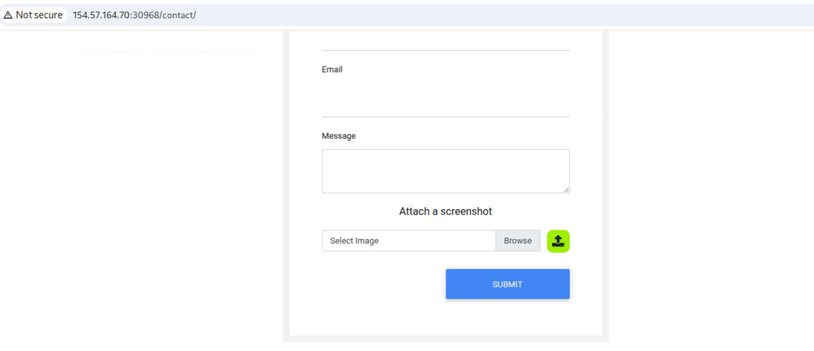
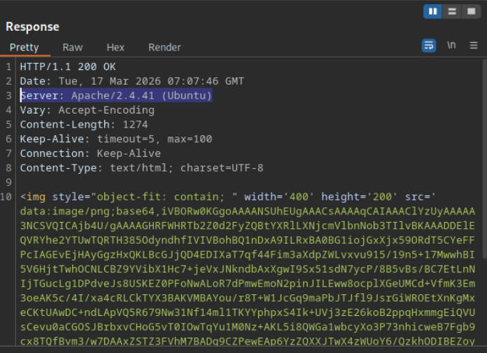

# 技能评估

您受聘对一家公司的电子商务网站应用程序进行渗透测试。该网站应用程序尚处于早期阶段，因此您只会测试您能找到的任何文件上传表单。

尝试运用你在本模块中学到的知识，了解上传表单的工作原理以及如何绕过各种验证（如果有的话），从而在后端服务器上获得远程代码执行权限。

尝试运用你在本模块中学到的知识，了解上传表单的工作原理以及如何绕过各种验证（如果有的话），从而在后端服务器上获得远程代码执行权限。

尝试利用上传表单读取根目录“/”中的标志

尝试模糊测试，检查文件扩展名是否在黑名单中，以及是否包含允许的内容类型标头。如果找不到上传的文件，请尝试阅读源代码，查找上传目录和命名规则。

# 过程

## 初步尝试

发现该应用存在一个上传文件点,`http://IP:PORT/contact/`



尝试上传图片内容后,但是无法获取到文件的上传目录,

尝试目录文件模糊测试

```shell
$ ffuf -w directory-list-2.3-medium.txt -u http://154.57.164.70:30968/FUZZ -ic

        /'___\  /'___\           /'___\   
       /\ \__/ /\ \__/  __  __  /\ \__/   
       \ \ ,__\\ \ ,__\/\ \/\ \ \ \ ,__\  
        \ \ \_/ \ \ \_/\ \ \_\ \ \ \ \_/  
         \ \_\   \ \_\  \ \____/  \ \_\   
          \/_/    \/_/   \/___/    \/_/   

       v2.1.0-dev
________________________________________________

 :: Method           : GET
 :: URL              : http://154.57.164.70:30968/FUZZ
 :: Wordlist         : FUZZ: /usr/share/seclists/Discovery/Web-Content/directory-list-2.3-medium.txt
 :: Follow redirects : false
 :: Calibration      : false
 :: Timeout          : 10
 :: Threads          : 40
 :: Matcher          : Response status: 200-299,301,302,307,401,403,405,500
________________________________________________

contact                 [Status: 301, Size: 325, Words: 20, Lines: 10, Duration: 3431ms]
                        [Status: 200, Size: 9104, Words: 3045, Lines: 247, Duration: 3437ms]
                        [Status: 200, Size: 9104, Words: 3045, Lines: 247, Duration: 159ms]
server-status           [Status: 403, Size: 281, Words: 20, Lines: 10, Duration: 161ms]
:: Progress: [220547/220547] :: Job [1/1] :: 252 req/sec :: Duration: [0:14:48] :: Errors: 0 ::

```

找不到文件位置,即使上传了php代码,也访问不到该文件


### 步骤 3：上传尝试和观察结果

Press enter or click to view image in full size


上传 `shell.jpg 后 Burp Suite 的请求/响应`

标准的 `.jpg` 文件被接受并通过 Base64 内联渲染，确认了基本的文件处理，但没有执行。

### 第四步：准备绕过过滤器


Burp Suite 有效载荷编码部分

为了了解和绕过文件过滤器，我使用 **Burp Intruder** 和 **PayloadsAllTheThings** 来测试扩展名过滤。

Press enter or click to view image in full size


入侵者模糊测试常见 PHP 扩展

我们测试了 `.jpg.php` 、 `.php5` 、 `.pht` 和 `.phar.jpg` 等扩展名。

Press enter or click to view image in full size


`phar.jpg` 具有更大的响应尺寸

`.phar.jpg` 有效载荷因其不同的响应长度而显得突出，这表明它绕过了文件扩展名检查。

### 步骤 5：绕过内容类型过滤器

Press enter or click to view image in full size


发现 `image/svg+xml` 为可接受的内容类型

对 `Content-Type` 标头进行模糊测试发现， `image/svg+xml` 是可以接受的，从而可以进行**基于 XXE 的攻击** 。

### 步骤 6：利用 SVG 有效载荷攻击 XXE

Press enter or click to view image in full size


XXE 读取 `/etc/passwd`

我使用 `.svg` 有效载荷成功执行了 **XXE 攻击** ，窃取了 `/etc/passwd` 。

Press enter or click to view image in full size


XXE 使用 php://filter 泄露 `upload.php`

然后，我使用 `php://filter/convert.base64-encode` 对 `upload.php` 进行了编码和读取。

### 步骤 7：分析源代码逻辑

解码后的源代码揭示了三个重要的过滤器：

- **黑名单** ：阻止 `.ph(p|ps|tml)` 扩展名。
- **白名单** ：强制执行 `.[az]{2,3}g$` （例如， `.jpg` 、 `.png` ）。
- **MIME 验证** ：确保 `image/*g` 模式匹配。

由此，出现了两个有效的扩展：

```
.phar.jpg
```

[](https://medium.com/download-app?source=promotion_paragraph---post_body_banner_better_screentime--2c2895bba6df---------------------------------------)

```
.phz.jpg
```

### 步骤 8：实现远程代码执行 (RCE)

Press enter or click to view image in full size


PHP shell 最初被阻止

由于 MIME 检查，上传纯 PHP shell 被阻止。

Press enter or click to view image in full size


带有 JPEG 标头的修改版 shell

我通过在文件前添加**伪造的 JPEG 签名** ，欺骗了 MIME 过滤器。

Press enter or click to view image in full size


修改后的文件通过了所有检查，并显示为有效图像。

Press enter or click to view image in full size


打开已上传的有效载荷

我在浏览器中打开了该路径以测试执行情况。

从 `upload.php` 源代码中，我们发现上传路径为 `user_feedback_submissions` 。我们还观察到，上传的文件在存储到该目录之前，会先以 `YearMonthDay_` 为前缀，后跟原始文件名。

```
<?php
require_once('./common-functions.php');

// uploaded files directory
$target_dir = "./user_feedback_submissions/";

// rename before storing
$fileName = date('ymd') . '_' . basename($_FILES["uploadFile"]["name"]);
$target_file = $target_dir . $fileName;

// get content headers
$contentType = $_FILES['uploadFile']['type'];
$MIMEtype = mime_content_type($_FILES['uploadFile']['tmp_name']);

// blacklist test
if (preg_match('/.+\.ph(p|ps|tml)/', $fileName)) {
    echo "Extension not allowed";
    die();
}

// whitelist test
if (!preg_match('/^.+\.[a-z]{2,3}g$/', $fileName)) {
    echo "Only images are allowed";
    die();
}

// type test
foreach (array($contentType, $MIMEtype) as $type) {
    if (!preg_match('/image\/[a-z]{2,3}g/', $type)) {
        echo "Only images are allowed";
        die();
    }
}

// size test
if ($_FILES["uploadFile"]["size"] > 500000) {
    echo "File too large";
    die();
}

if (move_uploaded_file($_FILES["uploadFile"]["tmp_name"], $target_file)) {
    displayHTMLImage($target_file);
} else {
    echo "File failed to upload";
}
/contact/user_feedback_submissions/250526_shell.phar.jpg?cmd=id
```

Press enter or click to view image in full size


通过 `?cmd=id 进行远程代码执行`

使用 `?cmd=id` ，我确认了服务器上的命令执行情况。

Press enter or click to view image in full size


ls 命令输出

我列举了目录中的文件。

Press enter or click to view image in full size


pwd 显示上传位置

已确认的工作目录： `/var/www/html/contact/user_feedback_submissions`

Press enter or click to view image in full size


pwd 显示 / 遍历后

使用目录遍历（ `cd ../../../..` ）到达系统根目录。

Press enter or click to view image in full size


在根目录下运行 ls 命令，显示 flag 文件

已在 `/` 中找到标志文件。

Press enter or click to view image in full size


旗帜

使用以下方法读取标志：

```
cat flag_Not-The-Real-Path.txt
```

旗帜： `HTB{Not_The_Real_Flag}`

### 结论

本次技能评估展示了：

- 扩展和 MIME 类型绕过
- XXE 用于源代码和文件披露
- 手动调试滤波器
- 通过精心构造的有效载荷进行远程代码执行
- 目录遍历以提升权限范围

它表明，小缺陷的累积最终会导致彻底的妥协。


upload.php

```php
<?php
require_once('./common-functions.php');

// uploaded files directory
$target_dir = "./user_feedback_submissions/";

// rename before storing
$fileName = date('ymd') . '_' . basename($_FILES["uploadFile"]["name"]);
$target_file = $target_dir . $fileName;

// get content headers
$contentType = $_FILES['uploadFile']['type'];
$MIMEtype = mime_content_type($_FILES['uploadFile']['tmp_name']);

// blacklist test
if (preg_match('/.+\.ph(p|ps|tml)/', $fileName)) {
    echo "Extension not allowed";
    die();
}

// whitelist test
if (!preg_match('/^.+\.[a-z]{2,3}g$/', $fileName)) {
    echo "Only images are allowed";
    die();
}

// type test
foreach (array($contentType, $MIMEtype) as $type) {
    if (!preg_match('/image\/[a-z]{2,3}g/', $type)) {
        echo "Only images are allowed";
        die();
    }
}

// size test
if ($_FILES["uploadFile"]["size"] > 500000) {
    echo "File too large";
    die();
}

if (move_uploaded_file($_FILES["uploadFile"]["tmp_name"], $target_file)) {
    displayHTMLImage($target_file);
} else {
    echo "File failed to upload";
}

```


common-functions.php

```php
<?php

function displayHTMLImage($imageFile)
{
    $type = mime_content_type($imageFile);

    switch ($type) {
        case 'image/jpg':
            echo "";
            break;
        case 'image/jpeg':
            echo "";
            break;
        case 'image/png':
            echo "";
            break;
        case 'image/gif':
            echo "";
            break;
        case 'image/svg+xml':
            libxml_disable_entity_loader(false);
            $doc = new DOMDocument();
            $doc->loadXML(file_get_contents($imageFile), LIBXML_NOENT | LIBXML_DTDLOAD);
            $svg = $doc->getElementsByTagName('svg');
            echo $svg->item(0)->C14N();
            break;
        default:
            echo "Image type not recognized";
    }

```
