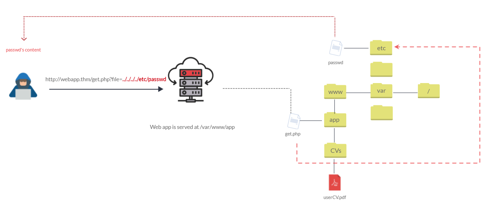
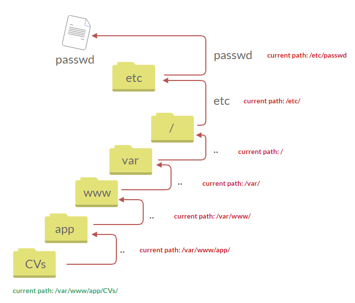
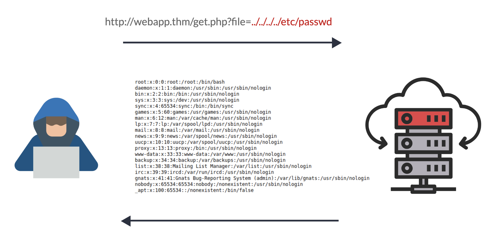

# 什么是路径遍历？

目录遍历 (Directory traversal) 是一种网络安全漏洞，允许攻击者读取操作系统资源，例如运行应用程序的服务器上的本地文件。攻击者通过操纵和滥用 Web 应用程序的 URL 来利用此漏洞，从而定位和访问存储在应用程序根目录之外的文件或目录。在某些情况下，攻击者可能能够写入服务器上的任意文件，从而允许他们修改应用程序数据或行为，并最终完全控制服务器。

# 通过路径遍历读取任意文件

## 案例1

下图展示了 Web 应用程序如何在 /var/www/app 目录下存储文件。正常流程是：用户从指定路径 /var/www/app/CVs 请求 userCV.pdf 文件的内容。



我们可以通过向 URL 参数添加攻击载荷（payload）来测试，观察 Web 应用的反应。
路径遍历攻击（也称为点点斜杠攻击）利用../（双点 + 斜杠）向上切换一级目录。如果攻击者找到入口点
（本例中为`get.php?file=`），就可能发送如下请求：
`http://webapp.thm/get.php?file=../../../../etc/passwd`
假设应用未做输入校验，它就不会从`/var/www/app/CVs`读取 PDF 文件，而是去其他目录读取文件 —— 本例中就是/etc/passwd。每一个`../`都会向上跳转一级目录，直到到达根目录/，再进入/etc目录并读取passwd文件。



因此，网络应用程序将文件内容发送回用户。



## 案例2


一个展示在售商品图片的购物应用。它可能会使用如下 HTML 代码加载图片：

```html

```

`loadImage` 这个 URL 接收一个 `filename` 参数，并返回指定文件的内容。图片文件存储在服务器磁盘的 `/var/www/images/` 目录下。为了返回图片，应用会将请求的文件名拼接到这个基础目录后，再使用文件系统 API 读取文件内容。
换句话说，应用会从以下路径读取文件：

```
/var/www/images/218.png
```

该应用**没有实现任何防范路径遍历攻击**的措施。因此，攻击者可以通过请求以下 URL，从服务器文件系统中读取 `/etc/passwd` 文件：

```http
https://insecure-website.com/loadImage?filename=../../../etc/passwd
```

这会导致应用从以下路径读取文件：

```
/var/www/images/../../../etc/passwd
```

`../` 序列在文件路径中是合法的，表示在目录结构中**向上跳转一级**。连续三个 `../` 会从 `/var/www/images/` 跳转到文件系统根目录，因此实际读取的文件是：

```
/etc/passwd
```

在类 Unix 操作系统中，这是一个存储服务器上已注册用户详细信息的标准文件。攻击者还可以使用相同的手段读取其他**任意文件**。

在 Windows 系统中，`../` 和 `..\` 都是合法的路径遍历序列。下面是针对 Windows 服务器的等效攻击示例：

```
https://insecure-website.com/loadImage?filename=..\..\..\windows\win.ini
```

# 过滤和突破

## 使用绝对路径绕过

可以直接使用从文件系统根目录开始的绝对路径，例如 filename=/etc/passwd，无需使用任何遍历字符即可直接引用文件。

## 使用嵌套遍历字符

例如 ....// 或 ....\/\。当内部的遍历字符被去除时，它们会还原为普通的遍历序列。

## 编码绕过

在某些场景下（例如 URL 路径或 multipart/form-data 请求的 filename 参数），Web 服务器在将输入传递给应用之前，可能会先去除所有路径遍历序列。
你有时可以通过 URL 编码甚至双重 URL 编码 ../ 字符来绕过这类净化处理，分别得到 %2e%2e%2f 和 %252e%252e%252f。
各种非标准编码，例如 ..%c0%af 或 ..%ef%bc%8f 也可能生效。
对于 Burp Suite Professional 用户，Burp Intruder 提供了预定义载荷列表 Fuzzing - path traversal，其中包含一些可尝试使用的编码后路径遍历序列。

## 文件名前缀绕过

应用可能会要求用户提供的文件名以预期的基础文件夹开头，例如 /var/www/images。
这种情况下，可以先传入要求的基础文件夹，再跟上合适的遍历序列。
例如：
filename=/var/www/images/../../../etc/passwd

## 附加扩展名绕过

应用可能会要求用户提供的文件名以预期的文件扩展名结尾，例如 .png。
这种情况下，可以使用空字节在要求的扩展名之前有效终止文件路径。
例如：
filename=../../../etc/passwd%00.png
