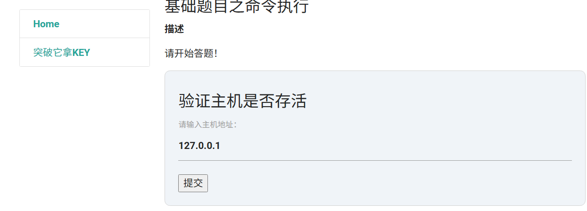
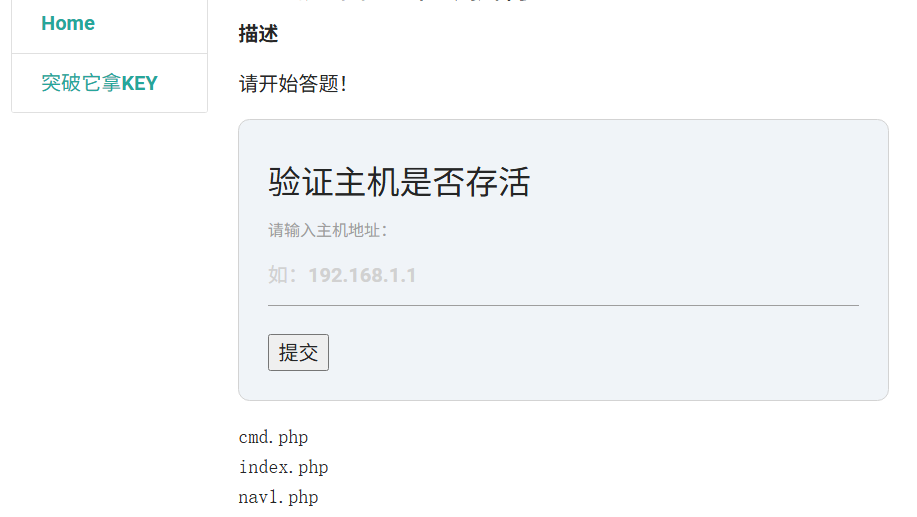
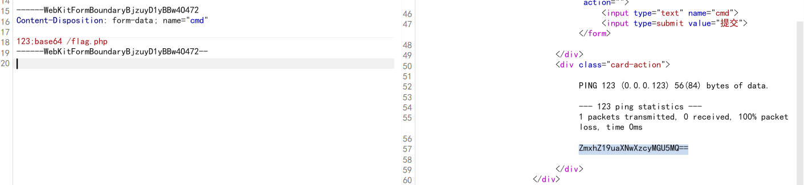
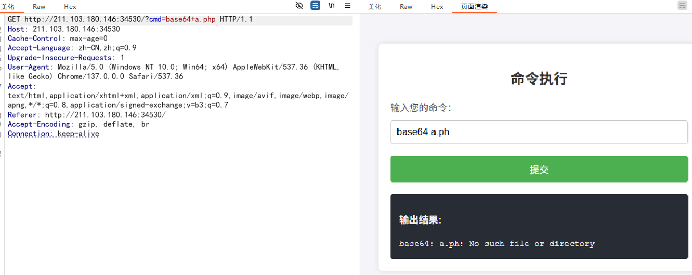
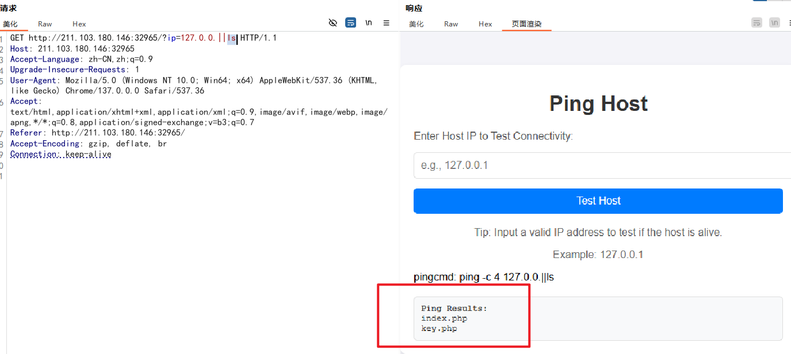
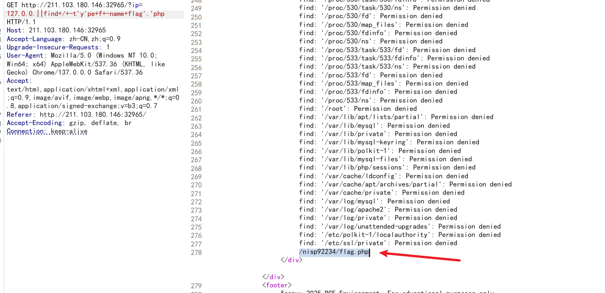

# 第一题

命令执行是指攻击者通过浏览器或者其他客户端软件提交一些cmd命令（或者bash命令）至服务器程序，服务器程序通过system、eval、exec等函数直接活着的间接地调用cmd.exe执行攻击者提交的命令。

通过你所学到的知识，通过执行Linux命令获取webshell，答案就在根目录下key.flag文件中。

## write up



尝试不同的命令拼接符号:

* ;
* &&
* ||
* \n
* |
* ``
* $()

发现|| 可用,比如 `127||ls`



发现很多命令用不了,比如 cat head less tail  最后用base64 命令 把 cmd.php 源码读出来

```php

<!DOCTYPE html>
<html>
<head>
    <meta charset="gb2312">
    <title>命令执行</title>
    <link rel="stylesheet" href="../css/materialize.min.css">

</head>
<body>
<div class="container">


    <!-- Navbar goes here -->

    <!-- Page Layout here -->
    <div class="row">

        <div class="col s3">
            <?php
            include("nav1.php");
            ?>
        </div>

        <div class="col s9">
            <h5>基础题目之命令执行</h5>
            <b>描述</b>
            <p>请开始答题！</p>
            <div style="background-color: #f0f4f8; border: 1px solid #d3d3d3; padding: 20px; border-radius: 8px;">
                <h5>验证主机是否存活</h5>
                <form method="POST" action="">
                    <div>
                        <label for="host">请输入主机地址：</label>
                        <input type="text" id="host" name="ip" placeholder="如：192.168.1.1">
                    </div>
                    <div>
                        <button type="submit" name="Submit" class="btn-small">提交</button>
                    </div>
                </form>
            </div>

            <?php
            if (isset($_POST['Submit'])) {
                // 获取输入
                $target = $_REQUEST['ip'];

                // 设置黑名单
                $substitutions = array(
                    '&&' => '',
                    ';'  => '',
                    'cat'  => '',
                );

                // 移除黑名单中的字符
                $target = str_replace(array_keys($substitutions), $substitutions, $target);

                // 判断操作系统并执行 ping 命令
                if (stristr(php_uname('s'), 'Windows NT')) {
                    // Windows 系统
                    $cmd = shell_exec('ping ' . $target);
                } else {
                    // *nix 系统
                    $cmd = shell_exec('ping -c 4 ' . $target);
                }

                // 用户反馈
                echo "<pre>{$cmd}</pre>";
            }
            ?>
        </div>


    </div>

</div>

</body>
</html>


```

发现还是自己错了,注意他们这里描述的根,其实key.flag 根本不在操作系统的根,而是web服务器的根

可以使用cacatt双写绕过,或用其他的命令都行

# 第二题

命令执行是指攻击者通过浏览器或者其他客户端软件提交一些cmd命令（或者bash命令）至服务器程序，服务器程序通过system、eval、exec等函数直接或者间接地调用cmd.exe执行攻击者提交的命令。

通过你所学到的知识，通过执行Linux命令获取位于服务器根目录下的flag.php文件内容。

## write up

直接base64秒杀



看看源码:

fun1.php

```php

<!DOCTYPE html>
<html>
  <head>
    <meta charset="UTF-8">
    <title>基础题目之命令执行</title>
    <link rel="stylesheet" href="../css/materialize.min.css">

  </head>
  <body>
<div class="container">

 

<!-- Navbar goes here -->

   <!-- Page Layout here -->
   <div class="row">

     <div class="col s3">
       <?php 
     		include("nav1.php"); 
   
         	include("function.php"); 
         ?>
     </div>

     <div class="col s9">
       <h5>基础题目之命令执行</h5>
       <b>描述</b>
       <p>请开始答题</p>
       <div class="card  teal lighten-1">
            <div class="card-content white-text">
              <span class="card-title">验证主机是否存活</span>
        
              <form method=POST enctype="multipart/form-data" action="">
                      <input type="text" name="cmd">
                      <input type=submit value="提交"></form>

            </div>
            <div class="card-action">
      
                 <?php 
                 	 
                 	 $cmd = $_POST["cmd"];
                 	 
                 	 if (filter($cmd) || filterip($cmd) || empty($cmd))
                 	 {
                 	 	echo shell_exec("ping -c 1 $cmd"); 
                 	 }
                 	 else
                 	 {
                 	 	 echo "你输入的命令包含敏感字符！请检查命令是否填写正确！";
                 	 }
                  ?>
                 	 
            </div>
          </div>

     </div>

   </div>

</div>
  </body>
</html>


```

function.php

```php
<?php


function filter($cmd)
{
	$cmdarrays = array("cat", "less", "more","tac","head","tail","od","cp","mv","nl","vi","vim");

	foreach ($cmdarrays as &$value )
	{
		if  (stristr($cmd, $value))
		{
			return false;
		}
	}
	return true;
}

function filterip($ip)
{
	if(filter_var($ip, FILTER_VALIDATE_IP))
	 {
         return true;
     }

     return false;
  
}

?>
```

# 第三题

命令执行,flag.php存放在根目录中。

## write up

不让写 `.php`这几个字在命令行中,好些命令不让用,但是可以用''包裹着用

直接base64 梭哈,不要管其他,`base64+index'.'php`

源码如下:

```


<!DOCTYPE html>
<html lang="en">
<head>
    <meta charset="UTF-8">
    <meta name="viewport" content="width=device-width, initial-scale=1.0">
    <title>命令执行</title>
    <style>
        body {
            font-family: Arial, sans-serif;
            background-color: #f4f4f9;
            margin: 0;
            padding: 0;
        }
        .container {
            max-width: 500px;
            margin: 50px auto;
            background-color: #ffffff;
            padding: 20px;
            border-radius: 8px;
            box-shadow: 0 0 10px rgba(0, 0, 0, 0.1);
        }
        h2 {
            text-align: center;
            color: #333;
        }
        label {
            font-size: 16px;
            color: #555;
            display: block;
            margin-bottom: 10px;
        }
        input[type="text"] {
            width: 100%;
            padding: 10px;
            font-size: 16px;
            margin-bottom: 20px;
            border: 1px solid #ccc;
            border-radius: 4px;
            box-sizing: border-box;
        }
        input[type="submit"] {
            background-color: #4CAF50;
            color: white;
            padding: 10px 20px;
            font-size: 16px;
            border: none;
            border-radius: 4px;
            cursor: pointer;
            width: 100%;
        }
        input[type="submit"]:hover {
            background-color: #45a049;
        }
        .output {
            background-color: #282c34;
            color: #f1f1f1;
            padding: 15px;
            border-radius: 4px;
            font-size: 14px;
            line-height: 1.5;
            margin-top: 20px;
            box-sizing: border-box;
            max-height: 300px;
            overflow-y: auto;
            white-space: pre-wrap;
        }
        .output code {
            font-family: "Courier New", Courier, monospace;
        }
    </style>
</head>
<body>
    <div class="container">
        <h2>命令执行</h2>
        <form method="get">
            <label for="cmd">输入您的命令：</label>
            <input type="text" id="cmd" name="cmd" placeholder="输入命令..." value="<?php echo isset($_GET['cmd']) ? htmlspecialchars($_GET['cmd']) : ''; ?>">
            <input type="submit" value="提交">
        </form>
    
        <?php
if (isset($_GET['cmd'])) {
    $cmd = $_GET['cmd'];

    // 过滤非法符号和危险命令
    if (preg_match('/[|;]|\.php/i', $cmd)) {
        echo '<div class="output"><h3>非法命令输入</h3></div>';
        exit;
    }

    // 使用正则表达式过滤敏感命令
    $blockedCommandsPattern = '/\b(cat|head|tail|more|less|ls|grep|vi|vim|nano)\b/i';
    if (preg_match($blockedCommandsPattern, $cmd)) {
        echo '<div class="output"><h3>该命令被禁止执行</h3></div>';
        exit;
    }

    // 过滤含有特殊字符（如单引号）的命令
    if (preg_match('/[\"`$]/', $cmd)) {
        echo '<div class="output"><h3>命令包含非法字符</h3></div>';
        exit;
    }

    // 检查输入是否为有效的IP地址
    if (filter_var($cmd, FILTER_VALIDATE_IP)) {
        // 如果是IP地址，默认执行 ping 命令 3 次
        $cmd = "ping -c 3 " . escapeshellarg($cmd);
    }

    // 允许多个命令通过 "&&" 连接
    $commands = explode('&&', $cmd);  // 分割多个命令

    // 执行每个命令
    $output = '';
    foreach ($commands as $command) {
        // 去除多余的空格
        $command = trim($command);
    
        // 使用 escapeshellarg() 防止命令注入
        $output .= shell_exec($command . " 2>&1"); // 捕获错误输出
    }

    // 输出结果
    if ($output) {
        echo '<div class="output"><h3>输出结果:</h3><code>' . htmlspecialchars($output) . '</code></div>';
    } else {
        echo '<div class="output"><h3>无输出或命令无效</h3></div>';
    }
}
?>


    </div>
</body>
</html>


```


# 第四题

启动环境，找找看，flag在flag.php中，flag格式为：flag_nisp_xxxxxx，他隐藏的不浅啊


## write up



看看源代码:

```php
<!DOCTYPE html>
<html lang="en">
<head>
    <meta charset="UTF-8">
    <meta name="viewport" content="width=device-width, initial-scale=1.0">
    <title>Ping Host - RCE Environment</title>
    <style>
        body {
            font-family: Arial, sans-serif;
            background-color: #f4f4f9;
            margin: 0;
            padding: 0;
        }
        .container {
            max-width: 600px;
            margin: 50px auto;
            background: #ffffff;
            padding: 20px;
            box-shadow: 0 4px 8px rgba(0, 0, 0, 0.1);
            border-radius: 8px;
        }
        h1 {
            text-align: center;
            color: #333;
        }
        form {
            display: flex;
            flex-direction: column;
            gap: 15px;
        }
        label {
            font-size: 16px;
            color: #555;
        }
        input[type="text"] {
            width: 100%;
            padding: 10px;
            font-size: 16px;
            border: 1px solid #ddd;
            border-radius: 5px;
        }
        button {
            padding: 10px;
            font-size: 16px;
            background-color: #007bff;
            color: white;
            border: none;
            border-radius: 5px;
            cursor: pointer;
            transition: background-color 0.3s ease;
        }
        button:hover {
            background-color: #0056b3;
        }
        .message {
            margin-top: 20px;
            text-align: center;
            color: #666;
        }
        .result {
            margin-top: 20px;
            padding: 10px;
            background: #f8f9fa;
            border: 1px solid #ddd;
            border-radius: 5px;
            color: #333;
            font-family: monospace;
            white-space: pre-wrap;
        }
        footer {
            margin-top: 20px;
            text-align: center;
            font-size: 14px;
            color: #aaa;
        }
    </style>
</head>
<body>
    <div class="container">
        <h1>Ping Host</h1>
        <form method="GET" action="">
            <label for="ip">Enter Host IP to Test Connectivity:</label>
            <input type="text" id="ip" name="ip" placeholder="e.g., 127.0.0.1" required>
            <button type="submit">Test Host</button>
        </form>
        <div class="message">
            <p>Tip: Input a valid IP address to test if the host is alive.</p>
            <p>Example: 127.0.0.1</p>
        </div>

        <?php
        header("Content-Type: text/html; charset=UTF-8");
        $ok=0;
                if (isset($_GET['ip'])) {
            $ip = $_GET['ip'];
            $blacklist = array("type","cat","less", "tail", "head", "sed", ".php","whoami","rm");
            foreach ($blacklist as $word) {
                if (stripos($ip, $word) !== false) {
                    $ok=1;
                    break;
                }
            }
            //没有被过滤，可以输出
            if ($ok === 0){
                $output = [];
                $result = 0;
                //exec("ping " . $ip, $output, $result);
		$ping_cmd = strtoupper(substr(PHP_OS, 0, 3)) === 'WIN' ? "ping -n 4 " . $ip:"ping -c 4 " . $ip;
		echo "pingcmd: " .$ping_cmd."<br>";
		exec($ping_cmd . " 2>&1", $output, $result);
		//$cmd = "ping -c 1 '" . escapeshellarg($ip) . "' && diff /etc/hostname dd.tx*";
		//echo "Executing: " . $cmd . "<br>"; // 打印命令
		//exec($cmd, $output, $result);
		//echo "Result Code: " . $result . "<br>"; // 调试：打印返回值
                //echo "Output:<br>";
                //print_r($output); // 调试：打印输出
		foreach ($output as &$line) {
                    $line = mb_convert_encoding($line, 'UTF-8', 'GBK');
                }
                //print_r($output);
                if ($result === 0|| $result===1) {
                    echo '<div class="result"><strong>Ping Results:</strong><br>' . implode("\n", $output) . '</div>';
                } else {
                    echo '<div class="result"><strong>Error:</strong> Unable to reach the host.</div>';
                }
            }   
            else {     //被过滤出来含有非法字符
                echo '<div class="result"><strong>Error: </strong> 非法字符.</div>';
            }
        }
        else{
            echo '<div class="result"><strong>Error: </strong> 输入为空.</div>';
        }
        ?>
    </div>
    <footer>
        © 2025 RCE Environment. For educational purposes only.
    </footer>
</body>
</html>

```

是哟个find命令来查找:



# 总结:

单引号解决字符过滤 或命令不让执行, base64 梭哈一切
