# 一、识别 OAuth 身份验证

识别应用程序是否使用 OAuth 身份验证相对简单。如果您看到可以使用其他网站的帐户登录的选项，这强烈表明该应用程序正在使用 OAuth。

识别 OAuth 身份验证最可靠的方法是使用 Burp 代理流量，并在使用此登录选项时检查相应的 HTTP 消息。无论使用哪种 OAuth 授权类型，流程中的第一个请求始终是对 `/authorization` 端点的请求，其中包含一些专门用于 OAuth 的查询参数。尤其要注意  `client_id` 、 `redirect_uri` 和 `response_type` 参数。例如，授权请求通常如下所示：

```http
GET /authorization?client_id=12345&redirect_uri=https://client-app.com/callback&response_type=token&scope=openid%20profile&state=ae13d489bd00e3c24 HTTP/1.1 Host: oauth-authorization-server.com
```

例如我们可以查看 portswigger的[练习](https://portswigger.net/web-security/oauth/lab-oauth-authentication-bypass-via-oauth-implicit-flow)，当我们在页面点击登录时，

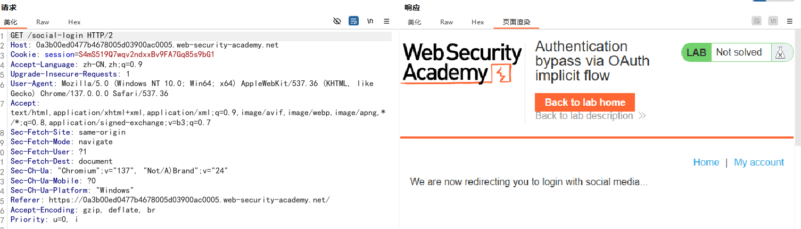

我们重定向到一个登录界面：

> [!NOTE]
>
>
> 注意response_type 和scope 参数的值，这是什么类型的授权呢？scope 参数又有什么意义呢？

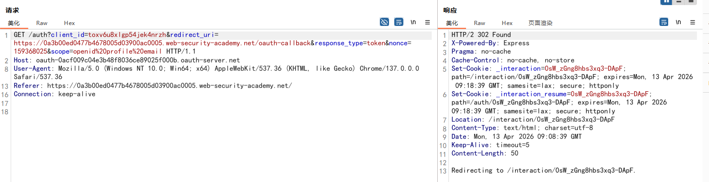

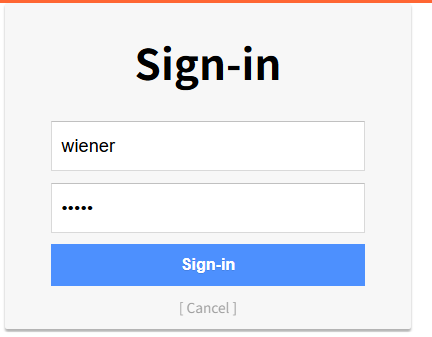

登录完成后，我门需要授权：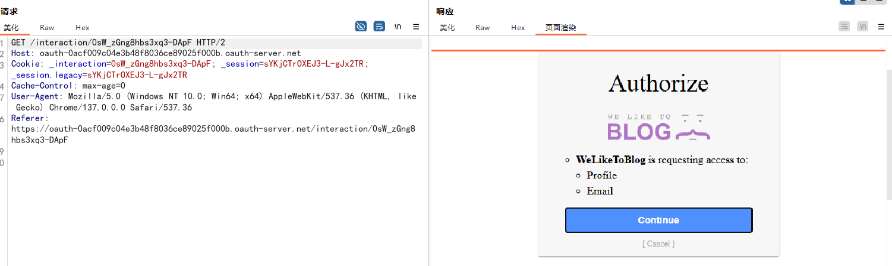

完成授权后，我们可以看到请求中有如下的302跳转：

```http
HTTP/2 302 Found
X-Powered-By: Express
Pragma: no-cache
Cache-Control: no-cache, no-store
...
Location: https://0a3b00ed0477b4678005d03900ac0005.web-security-academy.net/oauth-callback#access_token=d1TH7s7JkohX-VeXTxNglap_EIQk7LPLusBEYqYFaWM&expires_in=3600&token_type=Bearer&scope=openid%20profile%20email

```

浏览器将访问重定向URI ，并通过 URI 片段的方式给出了access_token

> [!NOTE]
>
> 这是什么类型的授权呢？

之后浏览器访问/oauth-callback 端点，获得一个js脚本：

```javascript
<script>
// 1. 解析 URL 片段（Fragment），提取访问令牌
// window.location.hash 获取地址栏中 # 及其后面的全部内容
// .substr(1) 去掉开头的 # 号，得到纯查询字符串格式的内容
// new URLSearchParams() 将其解析为可方便读取的键值对对象
const urlSearchParams = new URLSearchParams(window.location.hash.substr(1));

// 2. 从解析后的参数中获取 access_token 的值
// 这就是隐式流程中，授权服务器放在 URL # 后面的核心凭证
const token = urlSearchParams.get('access_token');

// 3. 第一次 fetch 请求：用 access_token 向 OAuth 服务端索取用户信息
// 目标地址是 OAuth 服务的 /me 端点（标准的用户信息接口）
fetch('https://oauth-0acf009c04e3b48f8036ce89025f000b.oauth-server.net/me', {
    method: 'GET', // 使用 GET 方法请求数据
    headers: {
        // 关键：在请求头中放入 Bearer Token，证明自己有权限访问
        'Authorization': 'Bearer ' + token,
        'Content-Type': 'application/json'
    }
})
// 4. 处理 OAuth 服务端的响应
// .then(r => r.json()) 将响应体解析为 JSON 格式的 JavaScript 对象
// 这个对象 j 里通常包含 email、sub（用户ID）、用户名等信息
.then(r => r.json())
.then(j => 
    // 5. 第二次 fetch 请求：将用户信息和令牌发送给“自己的”后端服务器
    // 目标地址是当前应用的 /authenticate 端点，用于完成最终登录
    fetch('/authenticate', {
        method: 'POST', // 使用 POST 方法提交数据
        headers: {
            'Accept': 'application/json',
            'Content-Type': 'application/json'
        },
        // 6. 构建请求体，把从 OAuth 拿到的用户数据打包发给自己的服务器
        body: JSON.stringify({
            email: j.email,      // 从 OAuth 用户信息中取邮箱
            username: j.sub,     // j.sub 是 OpenID Connect 标准里的用户唯一标识
            token: token         // 也把 access_token 发给自己的服务器存起来
        })
    })
    // 7. 登录完成，跳转首页
    // 当自己的服务器处理完认证后，将浏览器重定向到网站根目录 /
    .then(r => document.location = '/'))
</script>
```

通过js脚本，带上前一步返回访问令牌 ，成功访问资源服务器/me端点，并返回了用户数据：

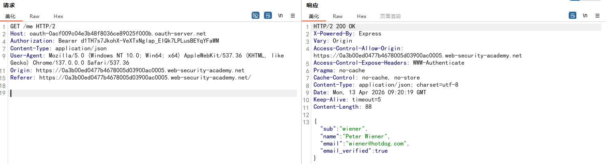

将用户数据发送给 client 后，client 更新了会话值，我们成功登录了：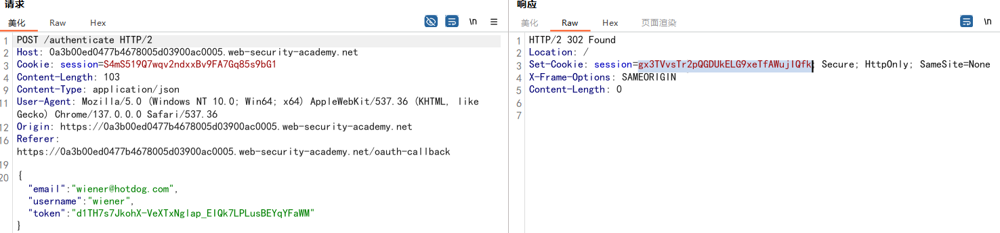

# 二、侦察

对所使用的 OAuth 服务进行一些基本的侦察，可以帮助你找到识别漏洞的正确方向。毋庸置疑，您应该仔细研究构成 OAuth 流程的各种 HTTP 交互——我们稍后会详细介绍一些需要注意的具体事项。如果使用了外部 OAuth 服务，您应该能够根据授权请求发送到的主机名来识别具体的提供商。由于这些服务提供公共 API，因此通常会有详细的文档，其中包含各种有用的信息，例如端点的确切名称以及正在使用的配置选项。

一旦您知道了授权服务器的主机名，就应该始终尝试向以下标准端点发送 `GET` 请求：

- `/.well-known/oauth-authorization-server`
- `/.well-known/openid-configuration`

这些命令通常会返回一个 JSON 配置文件，其中包含关键信息，例如可能支持的其他功能的详细信息。这有时能让你了解到更广泛的攻击面以及文档中可能未提及的支持功能。

# 三、利用 OAuth 身份验证漏洞

漏洞可能出现在客户端应用程序对 OAuth 的实现中，也可能出现在 OAuth 服务本身的配置中。在本节中，我们将向您展示如何利用这两种情况下一些最常见的漏洞。

客户端应用程序中的漏洞：

- [ ] [隐式授权类型 ](https://portswigger.net/web-security/oauth#improper-implementation-of-the-implicit-grant-type)的实现不当
- [ ] [有缺陷的 CSRF 保护](https://portswigger.net/web-security/oauth#flawed-csrf-protection)

OAuth 服务中的漏洞：

- [ ] [泄露授权码和访问令牌](https://portswigger.net/web-security/oauth#leaking-authorization-codes-and-access-tokens)
- [ ] [scope 验证存在缺陷](https://portswigger.net/web-security/oauth#flawed-scope-validation)
- [ ] [未经核实的用户注册](https://portswigger.net/web-security/oauth#unverified-user-registration)

## 1. client 中的漏洞

客户端应用程序通常会使用信誉良好、久经考验的 OAuth 服务，这种服务能够有效抵御常见的漏洞攻击。然而，它们自身的实现部分可能安全性较低。正如我们之前提到的，OAuth 规范的定义相对宽松。这一点在客户端应用程序的实现方面尤为突出。OAuth 流程包含许多环节，每种授权类型都有许多可选参数和配置设置，这意味着很容易出现配置错误。

#### 1.1 隐式授权类型的实现不当

由于通过浏览器发送访问令牌存在风险，[ 隐式授权类型](https://portswigger.net/web-security/oauth/grant-types#implicit-grant-type)主要推荐用于单页应用程序。然而，由于其相对简单，它也常用于传统的客户端-服务器 Web 应用程序中。

在这个流程中，OAuth 服务会将访问令牌以 URL 片段的形式通过用户的浏览器发送到客户端应用程序。然后，客户端应用程序使用 JavaScript 访问该令牌。问题在于，如果应用程序希望在用户关闭页面后保持会话，则需要将当前用户数据（通常是用户 ID 和访问令牌）存储在某个地方。

为解决这一问题，客户端应用通常会通过 **POST 请求**将这些数据提交到服务器，随后为用户分配一个会话 Cookie，从而完成实际的登录操作。该请求大致等同于传统密码登录流程中可能发送的表单提交请求。但在这种场景下，服务器没有任何密钥或密码可与提交的数据进行比对，这意味着服务器会**隐式信任**这些数据。

> [!NOTE]
>
> 回忆  [1.身份和访问管理.md](..\..\THMpaths\2.渗透测试员\2.网络基础知识\OWASP_TOP_10\1.身份和访问管理.md)  中的IAAA模型，这种实现只完成了Identification(身份标识)，如果我门知道其他用户的信息，我们完全可以伪造成其他的用户进行登录

在隐式请求流程中，攻击者可以 重放 访问此 `POST` 请求。因此，如果客户端应用程序没有正确检查访问令牌是否与请求中的其他数据匹配，则此行为可能导致严重的安全漏洞。在这种情况下，攻击者可以简单地更改发送到服务器的参数，从而冒充任何用户。

> [!NOTE]
>
> 这里说的与其他数据匹配，意思是说client 认为 既然你能发给我这份资料，那你肯定已经通过了资源服务器的验证。”它没有意识到，**这中间隔着一个可以被用户篡改的请求**，如果处理不当，例如没有校验token 是不是真的属于当前登录的用户，那么久可以冒充任何用户。

##### 案例：

在身份认证阶段，我们使用自己的账号登录，并完成授权：

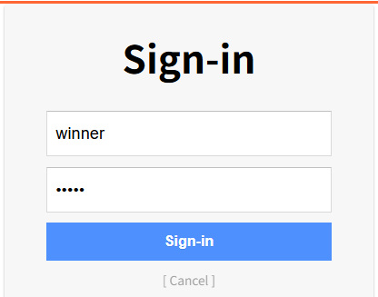

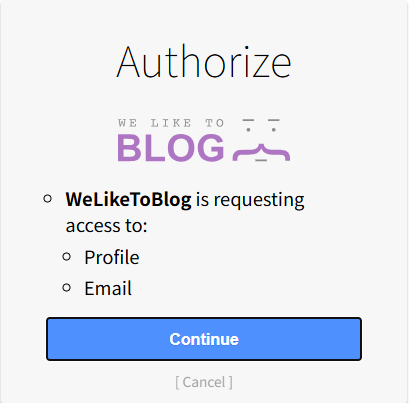

认证服务器返回 **access-token** 给浏览器：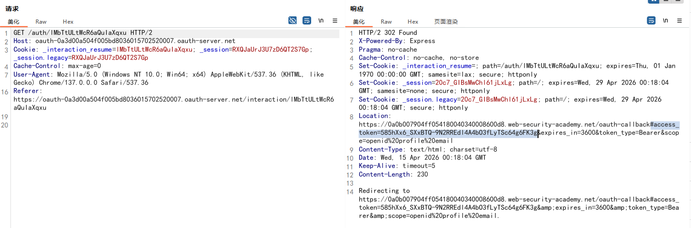

浏览器随后跟随跳转 访问**重定向uri** ，后端返回js代码：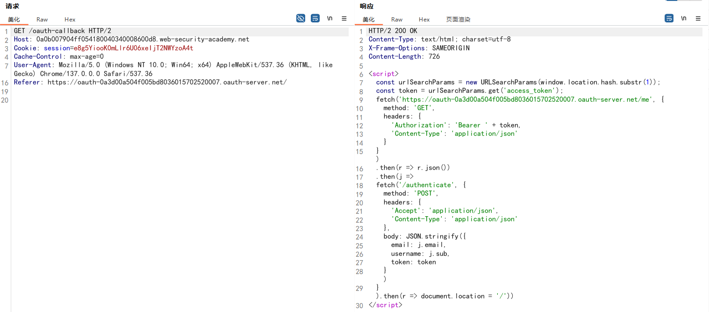

js代码运行，将access-token 组装到http头部中，并访问资源服务器，获得授权许可的信息：

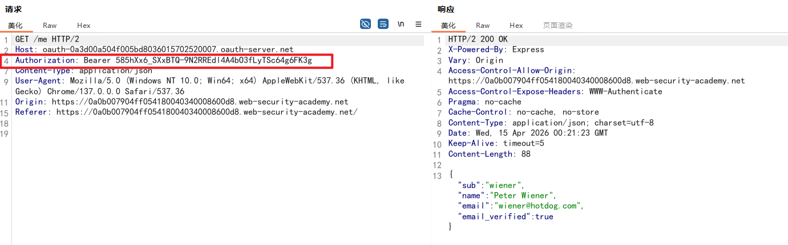

随后携带获取到的用户信息和 access-token 发送到 client ，以便完成cilent的认证：

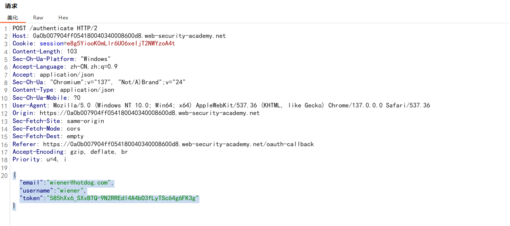

此时我们修改 email和username字段为另外一个用户carlos，token字段不变：

```json
{
	"email":"carlos@carlos-montoya.net",
	"username":"carlos",
	"token":"585hXx6_SXxBTQ-9N2RREdl4A4bO3fLyTSc64g6FK3g"
}
```

client 下发了新的会话session：

```http
HTTP/2 302 Found
Location: /
Set-Cookie: session=QsX6HBhnjGULfHHnwOqpkUpGzUHEhcxY; Secure; HttpOnly; SameSite=None
X-Frame-Options: SAMEORIGIN
Content-Length: 0
```

至此，我们完成了水平身份提升：

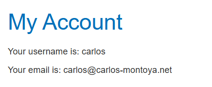


#### 1.2. CSRF 保护存在缺陷

尽管 OAuth 流程中的许多组件都是可选的，但除非有重要原因，否则强烈建议使用其中一些组件。例如， `state` 参数就是一个可选组件。

理想情况下， `state` 参数应该包含一个无法猜测的值，例如用户首次发起 OAuth 流程时与其会话关联的哈希值。该值随后会在客户端应用程序和 OAuth 服务之间来回传递，作为客户端应用程序的一种 CSRF 令牌。因此，如果您发现授权请求没有发送 `state` 参数，这对于攻击者来说就非常值得关注。这可能意味着他们可以自行发起 OAuth 流程，然后再诱骗用户的浏览器完成该流程，类似于传统的 CSRF 攻击。这可能会造成严重的后果，具体取决于客户端应用程序如何使用 OAuth。

假设有一个网站，允许用户使用传统的密码登录方式，或者通过 OAuth 将账户与社交媒体账号关联登录。在这种情况下，如果应用程序未能正确使用 `state` 参数，攻击者就有可能通过将受害者用户的账户绑定到自己的社交媒体账号，从而劫持受害者在客户端应用程序上的账户。

请注意，如果网站仅允许用户通过 OAuth 登录，则 `state` 参数的重要性可能较低。但是，不使用 `state` 参数仍然可能使攻击者能够构建登录 CSRF 攻击，诱骗用户登录到攻击者的帐户。


## 2. OAuth 服务中的漏洞

或许最臭名昭著的基于 OAuth 的漏洞是，当 OAuth 服务本身的配置允许攻击者窃取与其他用户帐户关联的授权码或访问令牌时。通过窃取有效的授权码或令牌，攻击者可能能够访问受害者的数据。最终，这可能会完全危及受害者的帐户安全——攻击者有可能以受害者用户的身份登录到任何已注册到此 OAuth 服务的客户端应用程序。

#### 2.1 泄露授权码和访问令牌

根据授权类型的不同，系统会通过受害者的浏览器，将授权码或令牌发送至授权请求中 `redirect_uri` 参数所指定的 `/callback` 回调端点。如果 OAuth 服务未能正确验证该 URI，攻击者就有可能构造出类似 CSRF 的攻击，**诱骗受害者的浏览器启动 OAuth 流程**，从而将授权码或令牌发送到攻击者控制的重定向 URI 上。

 在授权码流程场景下，攻击者有可能在授权码被使用前将其窃取。随后，攻击者可将该授权码发送至客户端应用程序合法的 `/callback` 端点（原始重定向 URI），从而获取用户账户的访问权限。在此攻击场景中，攻击者甚至无需知晓客户端密钥或最终生成的访问令牌。只要受害者与 OAuth 服务存在有效会话，客户端应用程序就会直接代攻击者完成授权码与令牌的交换流程，随后以受害者身份登录其账户。 需要注意的是，使用 `state` 或 `nonce` 防护措施并不一定能防范此类攻击，因为攻击者可在自己的浏览器中生成新的对应值。

> [!NOTE]
>
> `redirect_uri` 参数在 OAuth 流程中指定，用于指示授权服务器在授权后应将令牌发送到哪里。此 URI 必须预先在应用程序设置中注册，以防止开放重定向漏洞。在 OAuth 过程中，服务器会检查提供的 `redirect_uri` 是否与已注册的 URI 之一匹配。

例如如下案例，在发起OAuth认证流程时，浏览器发起请求：

```http
GET /auth?client_id=nkx1y8wmo06n6vqlgrtzl&redirect_uri=https://web-security-academy.net/oauth-callback&response_type=code&scope=openid%20profile%20email HTTP/1.1
Host: oauth-server.net
```

授权后，浏览器发出如下的请求，client 会通过 授权码和 OAuth服务器交换access-token：

```http
GET /oauth-callback?code=fLcS5_lnEVuf38rmTut8hMS71I9KA99u4lBixZhxXXR HTTP/2
Host: web-security-academy.net
```

作为攻击者，如果`redirect_uri`不受任何限制，只需要将此参数设计为漏洞利用服务器的url，当受害者完成授权时，受害者的浏览器将会重定向到漏洞利用服务器，并携带 code，此时攻击者只要使用该code ，访问正确的原始重定向URI，攻击就成功了

安全性更高的授权服务器，还会要求在**兑换授权码**时一并提交 `redirect_uri` 参数。随后服务器会校验该 URI 与初始授权请求中收到的地址是否一致，若不一致则拒绝此次兑换。 由于这一过程是通过安全的后端信道完成**服务器对服务器**请求，攻击者无法控制第二个 `redirect_uri` 参数。


#### 2.2 redirect_uri 验证存在缺陷

鉴于前一个实验中出现的各类攻击行为，客户端应用在 OAuth 服务端完成注册时，**将自身合法的回调 URI 加入白名单**属于最佳实践。这样一来，当 OAuth 服务端接收到新请求时，就能对照该白名单校验 `redirect_uri` 参数。这种情况下，若提交外部 URI 基本会触发报错。不过，攻击者往往仍有办法绕过此类验证。

在审计 OAuth 流程时，你应当尝试修改 `redirect_uri` 参数，摸清其验证逻辑。例如：

- 部分实现方式仅校验字符串是否以合规字符开头（即已授权的域名），便允许匹配一系列子目录。你可以尝试删减或添加任意路径、查询参数与片段，看看在不触发报错的前提下能修改哪些内容。
  若你能在默认的 `redirect_uri` 参数后追加额外内容，或许可以利用 OAuth 服务不同组件对 URI 解析的差异实现攻击。例如，可尝试以下技巧：

  ```http
  https://default-host.com&@foo.evil-user.net#@bar.evil-user.net/
  ```

  如果你不熟悉这类技巧，建议阅读我们关于**如何绕过常见 SSRF 防护与 CORS 限制**的相关内容。
  

- 你偶尔还会遇到服务端参数污染漏洞。为保险起见，可以尝试提交重复的 `redirect_uri` 参数，示例如下：

  ```http
  https://oauth-authorization-server.com/?client_id=123&redirect_uri=client-app.com/callback&redirect_uri=evil-user.net
  ```

  

- 部分服务端会对 [localhost](https://localhost) 类型的 URI 特殊处理，因为这类地址常在开发阶段使用。某些场景下，生产环境中会意外放行所有以 [localhost](https://localhost) 开头的重定向 URI。攻击者可借此注册类似 `localhost.evil-user.net` 的域名，绕过验证。
  

需要重点注意的是，**切勿仅单独测试 `redirect_uri` 这一个参数**。在实际环境中，通常需要组合修改多个参数进行尝试。有时修改一个参数会影响其他参数的验证逻辑。例如，将 `response_mode` 从 `query` 改为 `fragment`，有时会彻底改变 `redirect_uri` 的解析规则，从而提交原本会被拦截的 URI。同理，若发现服务支持 `web_message` 响应模式，该模式通常允许 `redirect_uri` 使用更多子域名。

> [!NOTE]
>
> response_mode (响应模式)
>
> 它决定了数据（授权码或 Token）以何种**技术方式**附着在 URL 上。
>
> 常见的模式包括：
>
> - **`query` (默认值)**：
>   - 数据附在 URL 的查询字符串中：`https://example.com`
>   - **特点**：数据会被发送到后端服务器，且会留在浏览器历史记录和服务器日志中。
> - **`fragment` (锚点模式)**：
>   - 数据附在 URL 的哈希部分：`https://example.com`
>   - **特点**：`#` 之后的内容**不会**发送给服务器，只能由客户端的 JavaScript 读取。常用于单页应用（SPA）。
> - **`web_message` (Web 消息模式)**：
>   - 这是一种较新的模式，不通过传统的 URL 跳转，而是利用 HTML5 的 `window.postMessage` API。
>   - **特点**：认证页面会在一个 iframe 或弹出窗口中打开，完成后通过“推”消息的方式把数据传回父窗口。


#### 2.3 通过代理页面窃取授权码和访问令牌

面对更强大的目标，您可能会发现无论您尝试什么方法，都无法成功提交外部域名作为 `redirect_uri` 。但是，这并不意味着您应该放弃。

到这一步，你应该已经对可以篡改 URI 的哪些部分有了比较清晰的了解。现在的关键是利用这些知识，尝试访问客户端应用程序本身更广泛的攻击面。换句话说，尝试弄清楚是否可以更改 `redirect_uri` 参数，使其指向白名单域中的任何其他页面。

尝试找到能够成功访问不同子域或路径的方法。例如，默认 URI 通常位于 OAuth 特定的路径上，例如 `/oauth/callback` ，该路径不太可能包含任何有用的子目录。但是，您或许可以使用目录遍历技巧来提供域上的任意路径。例如：

```http
https://client-app.com/oauth/callback/../../example/path
```

后端可能解释为：

```http
https://client-app.com/example/path
```

一旦确定了可以设置为重定向 URI 的其他页面，就应该对它们进行审核，查找可能用于泄露授权码或令牌的其他漏洞。对于[授权码流程 ](https://portswigger.net/web-security/oauth/grant-types#authorization-code-grant-type)，你需要找到可以访问查询参数的漏洞；而对于[隐式授权类型 ](https://portswigger.net/web-security/oauth/grant-types#implicit-grant-type)，你需要提取 URL 片段。

为此，最有用的漏洞之一是开放重定向漏洞。您可以利用此漏洞作为代理，将受害者及其代码或令牌转发到攻击者控制的域，并在该域上托管任何恶意脚本。

请注意，对于隐式授权类型，窃取访问令牌不仅仅能让您登录到客户端应用程序上受害者的帐户。由于整个隐式流程都是通过浏览器完成的，您还可以使用该令牌向 OAuth 服务的资源服务器发出自己的 API 调用。这可能使您能够获取通常无法从客户端应用程序 Web UI 访问的敏感用户数据。

除了开放重定向之外，您还应该查找其他任何允许您提取代码或令牌并将其发送到外部域的漏洞。一些典型的例子包括：

- **处理查询参数和 URL 片段的危险 JavaScript 代码**
  例如，不安全的网络消息传递脚本非常适合这种用途。在某些情况下，您可能需要找到一个更长的工具链，以便将令牌传递给一系列脚本，最终将其泄露到您的外部域。
- **XSS 漏洞**
  尽管 XSS 攻击本身就可能造成巨大影响，但攻击者通常只能在用户关闭标签页或离开页面之前短暂访问用户的会话。由于 `HTTPOnly` 属性通常用于会话 cookie，攻击者通常也无法直接使用 XSS 访问这些 cookie。然而，通过窃取 OAuth 代码或令牌，攻击者可以在用户的浏览器中访问其帐户。这给了攻击者更多的时间来探索用户数据并执行恶意操作，从而显著增加 XSS 漏洞的严重性。
- **HTML 注入漏洞**
  在某些情况下，例如由于内容安全策略 (CSP) 限制或严格过滤，您无法注入 JavaScript，但您仍然可以使用简单的 HTML 注入来窃取授权码。如果您可以将 `redirect_uri` 参数指向一个可以注入自定义 HTML 内容的页面，则可以通过 `Referer` 标头泄露授权码。例如，考虑以下 `img` 元素： `` 。尝试获取此图像时，某些浏览器（例如 Firefox）会在请求的 `Referer` 标头中发送完整的 URL，包括查询字符串。

#### 2.4  scope 验证存在缺陷

在任何 OAuth 流程中，用户必须根据授权请求中定义的`scope`批准所请求的访问权限。生成的令牌仅允许客户端应用程序访问用户已批准的范围。但在某些情况下，攻击者可能由于 OAuth 服务的验证缺陷，通过“升级”访问令牌（无论是窃取的还是通过恶意客户端应用程序获得的）来获得额外的权限。具体操作取决于授权类型。

##### scope升级：授权码流程

使用[授权码授权方式](https://portswigger.net/web-security/oauth/grant-types#authorization-code-grant-type)时，用户数据通过安全的服务器间通信进行请求和发送，第三方攻击者通常无法直接篡改。但是，攻击者仍然可以通过向 OAuth 服务注册自己的客户端应用程序来达到同样的目的。

例如，假设攻击者的恶意客户端应用最初请求获取用户的电子邮箱地址，并使用了 `openid email` 作用域（scope）。在用户批准该请求后，恶意客户端应用会接收到一个授权码（authorization code）。由于攻击者完全控制着自己的客户端应用，他们可以在随后的授权码/令牌交换请求（code/token exchange request）中，额外添加一个包含 `profile` 作用域的 `scope` 参数：

```http
POST /token
Host: oauth-authorization-server.com
…
client_id=12345&client_secret=SECRET&redirect_uri=https://client-app.com/callback&grant_type=authorization_code&code=a1b2c3d4e5f6g7h8&scope=openid%20email%20profile
```

如果服务器没有根据初始授权请求中的作用域验证此权限，有时会使用新的作用域生成访问令牌，并将其发送给攻击者的客户端应用程序：

```json
{
    "access_token": "z0y9x8w7v6u5",
    "token_type": "Bearer",
    "expires_in": 3600,
    "scope": "openid email profile",
    …
}
```

攻击者随后可以使用他们的应用程序发出必要的 API 调用来访问用户的个人资料数据。

------

##### scope升级：隐式流程

对于[隐式授权类型 ](https://portswigger.net/web-security/oauth/grant-types#implicit-grant-type)，访问令牌是通过浏览器发送的，这意味着攻击者可以窃取与无辜客户端应用程序关联的令牌并直接使用它们。一旦窃取了访问令牌，他们就可以向 OAuth 服务的 ` /userinfo` 端点发送普通的基于浏览器的请求，并在过程中手动添加一个新的 `scope` 参数。

理想情况下，OAuth 服务应该将此 `scope` 值与生成令牌时使用的范围值进行比对，但实际情况并非总是如此。只要调整后的权限不超过之前授予此客户端应用程序的访问级别，攻击者就有可能在无需用户进一步授权的情况下访问更多数据。


#### 2.5 未经核实的用户注册

通过 OAuth 进行用户身份验证时，客户端应用程序会隐含地假设 OAuth 提供商存储的信息是正确的。这种假设可能很危险。

一些提供 OAuth 服务的网站允许用户在未验证全部详细信息的情况下注册账号，在某些情况下甚至不需要验证电子邮箱地址。攻击者可以利用这一点，使用与目标用户相同的详细信息（例如已知的邮箱地址）在 OAuth 提供商处注册一个账号。随后，客户端应用程序可能会允许攻击者通过这个在 OAuth 提供商处创建的虚假账号，以受害者的身份进行登录。

这种攻击之所以奏效，是因为认证流程中存在**信任链的断裂**：

1. **OAuth 提供商的疏忽**：
   - 允许“未经验证”的邮箱注册账号。
   - 在返回给客户端应用的 ID Token 或用户信息中，声明（Claim）了该邮箱，但没有明确标注 `email_verified: false`。
2. **客户端应用（Client App）的盲目信任**：
   客户端应用在处理 OAuth 回调时，直接将 OAuth 提供商返回的 `email` 字段作为用户的**唯一标识符**。
   它假设：“既然用户能从 Google/GitHub/某个平台登录回来，且邮箱是 `user@example.com`，那他一定就是系统中那个 `user@example.com` 的主人。”

