# 一. 网络攻击简介

随着 Web 应用程序的普及和广泛应用，保护它们免受恶意攻击的重要性也日益凸显。现代 Web 应用程序的复杂性和先进性不断提升，针对它们的攻击类型也随之演变。这导致如今大多数企业面临着巨大的攻击面，因此 Web 攻击成为企业最常见的攻击类型。保护 Web 应用程序正成为所有 IT 部门的首要任务之一。

攻击面向外部的 Web 应用程序可能会导致企业内部网络遭到入侵，最终可能导致资产被盗或服务中断，甚至可能给公司造成严重的财务灾难。即使公司没有面向外部的 Web 应用程序，它们也可能使用内部 Web 应用程序或面向外部的 API 接口，而这两者都容易受到相同类型的攻击，并可能被利用来实现相同的目的。

本模块将介绍三种可能存在于任何 Web 应用程序中并导致系统被入侵的 Web 攻击。我们将讨论如何检测、利用和防御这三种攻击。

## 1. HTTP 方法篡改(Verb Tampering)

本模块讨论的第一个网络攻击是 [HTTP 动词篡改](https://owasp.org/www-project-web-security-testing-guide/v41/4-Web_Application_Security_Testing/07-Input_Validation_Testing/03-Testing_for_HTTP_Verb_Tampering) 。HTTP 动词篡改攻击利用 Web 服务器接受大量 HTTP 动词和方法的漏洞。
攻击者可以通过发送使用非预期方法的恶意请求来利用这一点，从而绕过 Web 应用程序的授权机制，甚至绕过其针对其他网络攻击的安全控制。HTTP 动词篡改攻击只是众多可用于通过发送恶意 HTTP 请求来利用 Web 服务器配置的 HTTP 攻击之一。

## 2.不安全直接对象引用 (IDOR)

第二种攻击是 “[不安全直接对象引用”（IDOR）](https://owasp.org/www-project-web-security-testing-guide/latest/4-Web_Application_Security_Testing/05-Authorization_Testing/04-Testing_for_Insecure_Direct_Object_References)“ 。IDOR 是最常见的 Web 漏洞之一，可导致攻击者访问本不应访问的数据。
这种攻击如此普遍的原因本质上是后端缺乏可靠的访问控制系统。Web 应用程序存储用户的文件和信息时，通常会使用顺序编号或用户 ID 来标识每个项目。假设 Web 应用程序缺乏强大的访问控制机制，并暴露了对文件和资源的直接引用。在这种情况下，我们只需猜测或计算文件 ID 即可访问其他用户的文件和信息。

## 3.XML 外部实体（XXE）注入

我们将讨论的第三种也是最后一种网络攻击是 [XML 外部实体注入 (XXE) ](https://owasp.org/www-community/vulnerabilities/XML_External_Entity_(XXE)_Processing)。许多 Web 应用程序在其功能中都会处理 XML 数据。
假设某个 Web 应用程序使用过时的 XML 库来解析和处理来自前端用户的 XML 输入数据，那么攻击者就有可能发送恶意 XML 数据来泄露存储在后端服务器上的本地文件。这些文件可能是包含密码等敏感信息的配置文件，甚至是 Web 应用程序的源代码。这将使我们能够对 Web 应用程序执行白盒渗透测试，从而发现更多漏洞。XXE 攻击甚至可以被用来窃取托管服务器的凭据，从而危及整个服务器的安全，并允许远程代码执行。

# 二. HTTP 方法篡改

HTTP 协议的工作方式是：在 HTTP 请求的开头接收各类HTTP 方法（HTTP methods）作为请求动词。
根据Web 服务器配置的不同，Web 应用在编写时会设定只接受某些 HTTP 方法来实现各自的功能，并根据请求类型执行对应的特定操作。

虽然程序员主要考虑最常用的两种 HTTP 方法：`GET`和 POST ，但任何客户端都可以在其 HTTP 请求中发送其他方法，然后观察 Web 服务器如何处理这些方法。

假设 Web 应用程序和后端 Web 服务器都配置为仅接受 `GET` 和 POST 请求。在这种情况下，发送其他类型的请求会导致 Web 服务器显示错误页面，这本身并不是一个严重的漏洞（除了会造成糟糕的用户体验并可能导致信息泄露之外）。

另一方面，如果 Web 服务器的配置**并未限制**为仅接受其所需的 HTTP 方法（例如 `GET` / `POST` ），并且 Web 应用程序也没有针对其他类型的 HTTP 请求（例如 `HEAD `、 `PUT `）进行开发，那么我们就可以利用这种不安全的配置来访问我们原本无权访问的功能，甚至绕过某些安全控制。

## 1. http请求方法介绍

要理解 HTTP Verb Tampering ，我们首先必须了解 HTTP 协议接受的不同方法。HTTP 协议有[ 9 种不同的请求方法](https://developer.mozilla.org/en-US/docs/Web/HTTP/Methods) ，可以被 Web 服务器接受为 HTTP 方法。除了 GET 和 POST 之外，以下是一些常用的 HTTP 动词：

| Verb（方法）      | Description（说明）                                              |
| ----------------- | ---------------------------------------------------------------- |
| **HEAD**    | 与**GET** 请求完全相同，但响应仅包含头部信息，不返回响应体 |
| **PUT**     | 将请求报文内容写入指定位置                                       |
| **DELETE**  | 删除指定位置的资源                                               |
| **OPTIONS** | 显示 Web 服务器支持的各类选项，例如所支持的 HTTP 方法            |
| **PATCH**   | 对指定位置的资源执行局部修改                                     |

正如您所想，上述某些方法可以执行非常敏感的功能，例如向后端服务器的 Web 根目录写入（ PUT ）或删除（ DELETE ）文件。正如 Web 请求模块中所述，如果 Web 服务器未安全配置以管理这些方法，我们可以利用它们来控制后端服务器。然而，HTTP 动词篡改攻击之所以更常见（因而也更严重），是因为它们是由后端 Web 服务器或 Web 应用程序的配置错误引起的，而这两者都可能导致漏洞。

## 2.产生漏洞原因

### 2.1不安全的配置

不安全的 Web 服务器配置会导致第一类 HTTP 动词篡改漏洞。Web 服务器的身份验证配置可能仅限于特定的 HTTP 方法，这会导致某些 HTTP 方法无需身份验证即可访问。例如，系统管理员可以使用以下配置来要求对特定网页进行身份验证：

```xml
<Limit GET POST>
    Require valid-user
</Limit>

```

正如我们所见，即使配置中同时指定了 `GET` 和 `POST `请求作为身份验证方法，攻击者仍然可以使用其他 HTTP 方法（例如 HEAD ）来完全绕过此身份验证机制，我们将在下一节中详细介绍。这最终会导致身份验证被绕过，并允许攻击者访问他们本不应访问的网页和域名。

### 2.2.不安全的编码

不安全的编码实践会导致另一种类型的 HTTP 动词篡改漏洞（尽管有些人可能不认为这是动词篡改）。这种情况可能发生在 Web 开发人员应用特定过滤器来缓解特定漏洞，但并未用该过滤器覆盖所有 HTTP 方法时。例如，如果发现某个网页存在 SQL 注入漏洞，而后端开发人员通过应用以下输入清理过滤器来缓解该漏洞：

```php
$pattern = "/^[A-Za-z\s]+$/";

if(preg_match($pattern, $_GET["code"])) {
    $query = "Select * from ports where port_code like '%" . $_REQUEST["code"] . "%'";
    ...SNIP...
}

```

我们可以发现，过滤器 仅对 GET 参数 进行了检测。如果 GET 请求中不包含任何恶意字符（bad characters），查询语句就会被执行。
然而，在执行查询时，代码使用的是 `$_REQUEST["code"] `参数，该参数同时会接收 `POST `参数，这就导致了 HTTP 方法（HTTP Verbs） 使用上的不一致性。
在这种场景下，攻击者可以使用 `POST `请求 发起 SQL 注入（SQL Injection）；此时 `GET `参数为空（不包含任何恶意字符），请求会顺利通过安全过滤器，最终导致该函数仍然存在 SQL 注入漏洞。

虽然上述两种漏洞都已公开出现，但第二种漏洞更为常见，因为它通常是由于代码错误造成的；而第一种漏洞通常可以通过安全的 Web 服务器配置来避免，相关文档也经常对此提出警告。在接下来的章节中，我们将看到这两种漏洞的示例以及如何利用它们。

## 3. 利用

利用 HTTP 动词篡改漏洞通常是一个相对简单的过程。我们只需要尝试不同的 HTTP 方法，看看 Web 服务器和 Web 应用程序如何处理它们。虽然许多自动化漏洞扫描工具能够持续识别由不安全的服务器配置导致的 HTTP 动词篡改漏洞，但它们通常会漏掉由不安全代码导致的 HTTP 篡改漏洞。这是因为前者一旦绕过身份验证页面就很容易识别，而后者则需要主动测试才能确定是否可以绕过现有的安全过滤器。

### 3.1 绕过身份验证

第一种 HTTP 动词篡改漏洞主要由 Insecure Web Server Configurations 引起，利用此漏洞可以绕过某些页面上的 HTTP 基本身份验证提示。

我们看到一个基本的 File Manager Web 应用程序，我们可以通过输入文件名并按回车 enter 来添加新文件：

但是，假设我们尝试点击红色 Reset 按钮删除所有文件。在这种情况下，我们会发现此功能似乎仅限已认证用户使用，因为我们会看到以下` HTTP Basic Auth` 提示：


由于我们没有任何凭证，我们将收到` 401 Unauthorized `页面：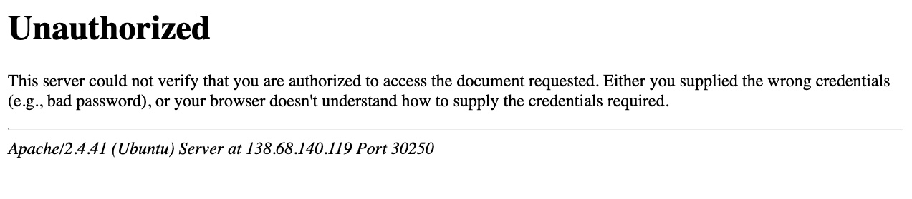

那么，我们来看看能否通过 HTTP 动词篡改攻击绕过这个限制。

为此，我们需要确定哪些页面受到此身份验证的限制。如果我们检查点击“重置”按钮后的 HTTP 请求，或者查看点击按钮后跳转到的 URL，会发现它是 /admin/reset.php 。因此，要么整个 /admin 目录都仅限已认证用户访问，要么只有 /admin/reset.php 页面受到限制。我们可以通过访问 /admin 目录来确认这一点，并且确实会提示我们重新登录。这意味着整个 /admin 目录都受到了限制。

为了尝试利用该页面漏洞，我们需要确定 Web 应用程序使用的 HTTP 请求方法。我们可以使用 Burp Suite 拦截该请求并进行分析：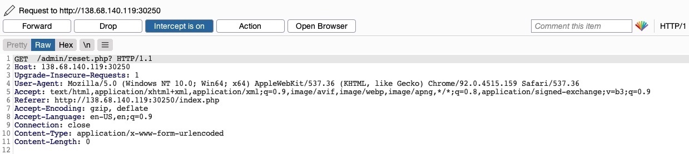

由于该页面使用的是 GET 请求，我们可以发送一个 POST 请求，看看该网页是否允许 POST 请求（即，身份验证是否涵盖 POST 请求）。为此，我们可以右键单击 Burp 中拦截到的请求，然后选择 Change Request Method ，它会自动将请求更改为 POST 请求：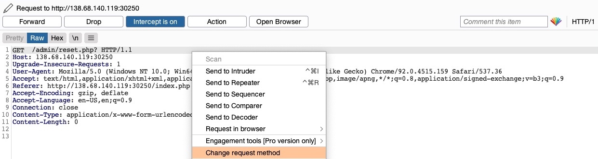

完成上述操作后，我们可以点击 Forward ，并在浏览器中查看页面。遗憾的是，系统仍然会提示我们登录，如果我们不提供登录凭据，则会看到 401 Unauthorized 页面：

看来 Web 服务器配置确实涵盖了 GET 和 POST 请求。但是，正如我们之前所学，我们还可以使用许多其他 HTTP 方法，最值得注意的是 HEAD 方法。HEAD 方法与 GET 请求相同，但不会返回 HTTP 响应体。如果 HEAD 请求成功，我们可能不会收到任何输出，但 reset 函数仍然应该被执行，这正是我们的主要目标。

要查看服务器是否接受 HEAD 请求，我们可以向其发送 OPTIONS 请求，查看它接受哪些 HTTP 方法，如下所示：

```http
$ curl -i -X OPTIONS http://SERVER_IP:PORT/

HTTP/1.1 200 OK
Date: 
Server: Apache/2.4.41 (Ubuntu)
Allow: POST,OPTIONS,HEAD,GET
Content-Length: 0
Content-Type: httpd/unix-directory
```

正如我们所见，响应显示` Allow: POST,OPTIONS,HEAD,GET `，这意味着 Web 服务器确实接受 `HEAD` 请求，这也是许多 Web 服务器的默认配置。因此，让我们再次尝试拦截 reset 请求，这次使用 `HEAD `请求，看看 Web 服务器如何处理：

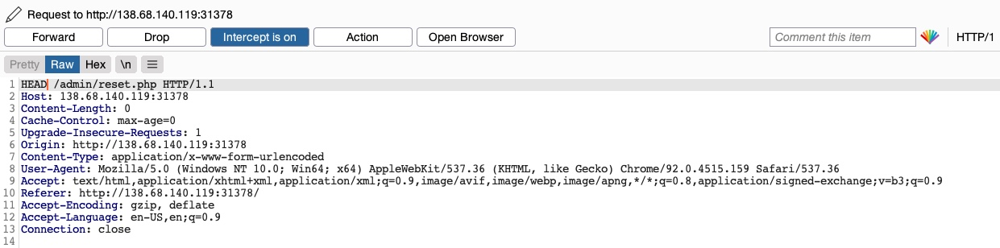

我们将 POST 请求改为 HEAD 请求并转发后，会发现不再出现登录提示或 401 Unauthorized 页面，而是像 HEAD 请求一样返回空输出。返回 File Manager Web 应用程序后，会发现所有文件确实已被删除，这意味着我们无需管理员权限或任何凭据即可成功触发 Reset 功能。


### 3.2 绕过过滤器

另一种更常见的 HTTP 动词篡改漏洞是由 Web 应用程序开发过程中出现的 Insecure Coding 错误引起的，这些错误导致 Web 应用程序在某些功能中未能覆盖所有 HTTP 方法。
这种情况常见于检测恶意请求的安全过滤器中。例如，如果一个安全过滤器用于检测注入漏洞，并且仅检查 POST 参数（例如 `$_POST['parameter'] `）中的注入，那么只需将请求方法更改为 GET 即可绕过该过滤器。

在 File Manager Web 应用程序中，如果我们尝试创建一个文件名中包含特殊字符的新文件（例如 test; ），则会收到以下消息：

此消息表明，Web 应用程序在后端使用某些过滤器来识别注入尝试，并阻止任何恶意请求。无论我们尝试什么，Web 应用程序都能正确阻止我们的请求，并能有效抵御注入尝试。但是，我们可以尝试 HTTP 动词篡改攻击，看看是否能够完全绕过安全过滤器。

为了尝试利用这个漏洞，让我们在 Burp Suite (Burp) 中拦截请求，然后使用 `Change Request Method `将其更改为另一种方法：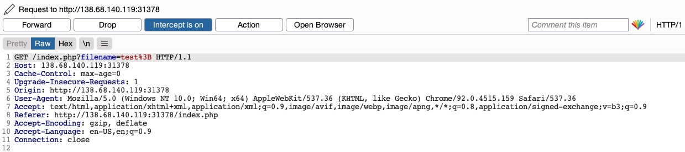

这次我们没有收到 Malicious Request Denied! 的消息，文件创建成功了：

为了确认是否绕过了安全过滤器，我们需要尝试利用该过滤器所保护的漏洞：在本例中，是命令注入漏洞。因此，我们可以注入一个创建两个文件的命令，然后检查这两个文件是否都已创建。为此，我们将在攻击中使用以下文件名（ file1; touch file2; ）：

然后，我们可以再次将请求方法更改为 GET 请求：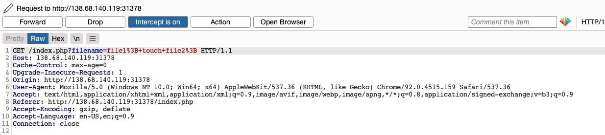

发送请求后，我们看到这次 file1 和 file2 都已创建：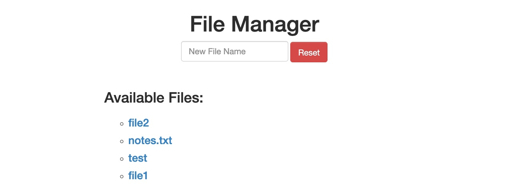

这表明我们成功地利用 HTTP 动词篡改漏洞绕过了过滤器，实现了命令注入。如果没有 HTTP 动词篡改漏洞，该 Web 应用程序或许能够抵御命令注入攻击，而正是这个漏洞让我们得以完全绕过现有的过滤器。

## 4. 漏洞防范

在了解了几种利用动词篡改漏洞的方法之后，让我们来看看如何通过预防动词篡改来保护自己免受此类攻击。不安全的配置和不安全的编码通常是导致动词篡改漏洞的原因。在本节中，我们将查看一些存在漏洞的代码和配置示例，并讨论如何修复它们。

### 4.1 修复不安全配置

HTTP 动词篡改漏洞可能存在于大多数现代 Web 服务器中，包括 Apache 、 Tomcat 和 ASP.NET 。这种漏洞通常发生在我们将页面授权限制为一组特定的 HTTP 动词/方法时，这会导致其他剩余方法未受保护。

以下是 Apache Web 服务器的一个易受攻击的配置示例，该配置位于站点配置文件（例如 000-default.conf ）或 .htaccess 网页配置文件中：

```xml
<Directory "/var/www/html/admin">
    AuthType Basic
    AuthName "Admin Panel"
    AuthUserFile /etc/apache2/.htpasswd
    <Limit GET>
        Require valid-user
    </Limit>
</Directory>

```

如我们所见，此配置设置了 admin Web 目录的授权配置。但是，由于使用了 <Limit GET> 关键字， Require valid-user 设置仅适用于 GET 请求，页面仍然可以通过 POST 请求访问。即使同时指定了 GET 和 POST 请求，页面仍然可以通过其他方法（例如 HEAD 或 OPTIONS 访问。

以下示例展示了 Tomcat Web 服务器配置中存在的相同漏洞，该漏洞位于某个 Java Web 应用程序的 web.xml 文件中：

```xml
security-constraint>
    <web-resource-collection>
        <url-pattern>/admin/*</url-pattern>
        <http-method>GET</http-method>
    </web-resource-collection>
    <auth-constraint>
        <role-name>admin</role-name>
    </auth-constraint>
</security-constraint>
```

我们可以看到，授权仅限于使用 http-method 的 GET 方法，这使得可以通过其他 HTTP 方法访问该页面。

最后，以下是 Web 应用程序 web.config 文件中的一个 ASP.NET 配置示例：

```xml
<system.web>
    <authorization>
        <allow verbs="GET" roles="admin">
            <deny verbs="GET" users="*">
        </deny>
        </allow>
    </authorization>
</system.web>
```

再次强调， allow 和 deny 范围仅限于 GET 方法，这使得 Web 应用程序可以通过其他 HTTP 方法访问。

以上示例表明，将授权配置限制于特定的 HTTP 动词是不安全的。因此，我们应该始终避免将授权限制于特定的 HTTP 方法，而应该始终允许/拒绝所有 HTTP 动词和方法。

如果我们想要指定一个方法，我们可以使用安全的关键字，例如 Apache 中的 LimitExcept 、Tomcat 中的 http-method-omission 以及 ASP.NET 中的 add / remove ，它们涵盖了除指定动词之外的所有动词。

最后，为了避免类似的攻击，我们通常应该 consider disabling/denying all HEAD requests ，除非 Web 应用程序明确要求。

### 4.2 修复不安全的编码

识别和修复不安全的 Web 服务器配置相对容易，但修复不安全的代码则更具挑战性。这是因为要识别代码中的这种漏洞，我们需要查找不同函数之间 HTTP 参数使用上的不一致之处，因为在某些情况下，这可能导致某些功能和过滤器未受保护。

让我们来看一下 File Manager 练习中的以下 PHP 代码：

```php
if (isset($_REQUEST['filename'])) {
    if (!preg_match('/[^A-Za-z0-9. _-]/', $_POST['filename'])) {
        system("touch " . $_REQUEST['filename']);
    } else {
        echo "Malicious Request Denied!";
    }
}

```

如果仅考虑命令注入漏洞，我们会认为这段代码是安全的。preg_match 会正确检查是否存在特殊字符，如果发现任何特殊字符，则不允许将输入传递给命令。然而，此案例中的致命错误并非由命令注入引起，而是由 `inconsistent use of HTTP methods` 导致。

我们看到， preg_match 过滤器仅使用 `$_POST['filename']` 检查 POST 参数中的特殊字符。然而，最终的 system 命令使用的是 `$_REQUEST['filename']` 变量，该变量同时涵盖了 GET 和 POST 参数。因此，在上一节中，当我们通过 GET 请求发送恶意输入时，由于 POST 参数为空，不包含任何特殊字符，所以它没有被 preg_match 函数拦截。但是，一旦到达 system 函数，它就会使用请求中找到的任何参数，而我们的 GET 参数也被用于命令中，最终导致了命令注入。

这个简单的例子向我们展示了 HTTP 方法使用中的细微不一致如何导致严重的安全漏洞。在生产环境中的 Web 应用程序中，这类漏洞不会如此显而易见。它们可能分散在整个 Web 应用程序中，而不会像这里一样出现在连续的两行代码中。相反，Web 应用程序通常会有一个专门的函数用于检查注入漏洞，另一个函数用于创建文件。这种代码分离使得这类不一致难以被发现，因此它们可能会在生产环境中继续存在。

为避免代码中出现漏洞，我们必须统一使用 HTTP 方法，并确保 Web 应用中每项特定功能始终采用固定的 HTTP 方法。建议扩大安全过滤器的检测范围，对所有请求参数执行安全校验。我们可以通过以下函数和变量实现该防护逻辑：

| Language 语言 | Function 功能                     |
| ------------- | --------------------------------- |
| PHP           | `$_REQUEST['param']`            |
| Java          | `request.getParameter('param')` |
| C#            | `Request['param']`              |


# 三. IDOR

Insecure Direct Object References (IDOR) 漏洞是最常见的 Web 漏洞之一，会对易受攻击的 Web 应用程序造成重大影响。
当 Web 应用程序直接暴露对某个对象（例如文件或数据库资源）的引用时，就会发生 IDOR 漏洞。
最终用户可以直接控制该引用，从而访问其他类似对象。如果由于缺乏可靠的访问控制系统，任何用户都可以访问任何资源，则该系统被认为存在漏洞。

构建一个稳健的访问控制系统极具挑战性，这也是 IDOR 漏洞普遍存在的原因。此外，自动化识别访问控制系统中的弱点也相当困难，这可能导致这些漏洞在投入生产环境之前都无法被发现。

例如，如果用户请求访问他们最近上传的文件，他们可能会收到一个指向该文件的链接，例如 ( download.php?file_id=123 )。由于该链接直接指向文件 ( file_id=123 )，如果我们尝试访问另一个文件（该文件可能不属于我们），例如 ( download.php?file_id=124 )，会发生什么情况？如果 Web 应用程序后端没有完善的访问控制系统，我们可能只需发送包含 file_id 的请求即可访问任何文件。在很多情况下，我们会发现文件 id 很容易猜测，这使得我们可以获取许多根据我们权限本不应该访问的文件或资源。


## 1. 什么导致了IDOR漏洞

仅仅暴露 **内部对象或资源的直接引用（direct reference）**本身并不构成漏洞。

但是，这种做法可能会导致另一种漏洞被利用：**薄弱的访问控制体系（weak access control system）**。

许多 Web 应用会通过限制用户访问能够获取对应资源的页面、功能与 API，来阻止用户访问资源。

然而，如果用户通过某种方式（例如通过被分享的 / 被猜测到的链接）获得了这些页面的访问权限，会发生什么？

他们是否只需要拥有访问链接，就可以继续访问对应的资源？

如果 Web 应用后端**没有一套访问控制体系**，来将用户的 **身份认证信息（authentication）**与**资源的访问权限列表**进行比对，那么用户就有可能**越权**访问这些资源。

实现可靠的 Web 应用程序访问控制系统的方法有很多，例如基于角色的访问控制（RBAC）系统。关键在于，**IDOR 漏洞主要源于后端访问控制失效**。如果用户直接访问了缺乏访问控制的 Web 应用程序中的对象，攻击者就有可能查看或修改其他用户的数据。

许多开发者忽略了构建访问控制系统；因此，大多数 Web 应用程序和移动应用程序的后端都缺乏保护。在这样的应用程序中，所有用户都可以随意访问后端所有其他用户的数据。唯一阻止用户访问其他用户数据的机制是应用程序的前端实现，而前端的设计目的仅仅是为了显示用户的数据。在这种情况下，手动篡改 HTTP 请求可能会暴露所有用户都拥有对所有数据的完全访问权限，从而导致攻击成功。

所有这些都使得 IDOR 漏洞成为任何 Web 或移动应用程序最关键的漏洞之一，这不仅是因为它暴露了直接对象引用，更主要的原因是缺乏健全的访问控制系统。即使是开发一个基本的访问控制系统也并非易事。而开发一个能够覆盖整个 Web 应用程序且不干扰其功能的全面访问控制系统则更加困难。正因如此，即使在像 Facebook 、 Instagram 和 Twitter 这样的大型 Web 应用程序中，也发现了 IDOR/访问控制漏洞。

## 2.IDOR 漏洞的影响

如前所述，IDOR 漏洞会对 Web 应用造成严重危害。IDOR 漏洞最基础的一类场景，是访问其他用户本不应被我们访问的私密文件与资源，例如个人文件或信用卡数据，这类漏洞被称为**IDOR 信息泄露漏洞（IDOR Information Disclosure Vulnerabilities）**。
根据被暴露的直接引用对象的类型不同，该漏洞甚至可能允许攻击者修改或删除其他用户的数据，进而导致账号完全接管（Account Takeover）。

一旦攻击者识别出直接引用（可能是数据库 ID 或 URL 参数），他们就可以开始测试特定模式，看看是否可以访问任何数据，并最终了解如何为任何任意用户提取或修改数据。

IDOR 漏洞还可通过IDOR 不安全函数调用（IDOR Insecure Function Calls），实现从普通用户到管理员的权限提升（Privilege Escalation）。

例如，许多 Web 应用会在前端代码中暴露仅管理员可用功能的 URL 参数或 API，并对非管理员用户屏蔽这些功能。但如果我们能获取到这类参数或 API，就可以用普通账号直接调用它们。假设后端没有显式拒绝非管理员调用这些功能，我们就能够执行未授权的管理操作，比如修改他人密码、为用户分配特定角色，最终可能导致整个 Web 应用被完全接管。

## 3. 识别IDOR

利用 IDOR 漏洞的第一步是识别直接对象引用 (Direct Object References)。

### 3.1 检查HTTP请求中的参数

每当我们收到特定文件或资源时，都应该检查 HTTP 请求，查找包含对象引用的 URL 参数或 API（例如 ?uid=1 或 ?filename=file_1.pdf ）。

这些引用通常存在于 URL 参数或 API 中，但也可能存在于其他 HTTP 标头中，例如 cookie。

在最基本的情况下，我们可以尝试递增对象引用的值来检索其他数据，例如 ( ?uid=2 ) 或 ( ?filename=file_2.pdf )。我们还可以使用模糊测试应用程序尝试数千种变体，看看它们是否返回任何数据。任何成功访问非我们自己文件的情况都表明存在 IDOR 漏洞。

### 3.2 检查js代码

我们还可以识别前端代码中未使用的参数或 API，例如 JavaScript AJAX 调用。一些使用 JavaScript 框架开发的 Web 应用程序可能会将所有函数调用都放在前端，并根据用户角色使用相应的函数，这种做法并不安全。

例如，如果没有管理员账户，则只能使用用户级功能，而管理员功能将被禁用。但是，我们可以通过查看前端 JavaScript 代码来找到管理员功能，并识别出包含直接对象引用的特定端点或 API 的 AJAX 调用。如果我们在 JavaScript 代码中识别出直接对象引用，就可以对其进行 IDOR 漏洞测试。

当然，这种问题并非仅存在于管理员功能中；任何无法通过监控 HTTP 请求发现的函数或调用，都可能出现这类情况。下方示例展示了一个基础的 AJAX 调用：

```js
function changeUserPassword() {
    $.ajax({
        url:"change_password.php",
        type: "post",
        dataType: "json",
        data: {uid: user.uid, password: user.password, is_admin: is_admin},
        success:function(result){
            //
        }
    });
}
```

当我们以非管理员用户身份使用 Web 应用程序时，上述函数可能永远不会被调用。但是，如果我们在前端代码中找到它，我们可以通过不同的方式测试它，看看是否可以调用它来执行更改，这表明它存在 IDOR 漏洞。如果我们有权限访问后端代码（例如，开源 Web 应用程序），也可以对其进行相同的测试。

### 3.3  理解哈希/编码

某些 Web 应用程序可能不会使用简单的顺序编号作为对象引用，而是对引用进行编码或哈希处理。如果我们发现此类参数使用了编码或哈希值，并且后端没有访问控制系统，我们仍然有可能利用它们进行攻击。

假设引用使用常见的编码器（例如 base64 ）进行编码。在这种情况下，我们可以对其进行解码，查看对象引用的明文，修改其值，然后再对其进行编码以访问其他数据。例如，如果我们看到类似 ( ?filename=ZmlsZV8xMjMucGRm ) 的引用，我们可以立即推测文件名是 base64 编码的（根据其字符集），我们可以对其进行解码以获得原始对象引用 ( file_123.pdf )。然后，我们可以尝试对另一个对象引用 (例如 file_124.pdf ) 进行编码，并尝试使用编码后的对象引用 ( ?filename=ZmlsZV8xMjQucGRm ) 访问它，如果我们能够检索到任何数据，这可能暴露出 IDOR 漏洞。

另一方面，对象引用可能经过哈希处理，例如 ( download.php?filename=c81e728d9d4c2f636f067f89cc14862c )。乍一看，我们可能会认为这是一个安全的对象引用，因为它没有使用任何明文或简单的编码。然而，如果我们查看源代码，就会发现 API 调用之前被哈希处理的内容：

```js
$.ajax({
    url:"download.php",
    type: "post",
    dataType: "json",
    data: {filename: CryptoJS.MD5('file_1.pdf').toString()},
    success:function(result){
        //
    }
});
```

在这种情况下，我们可以看到代码使用了 filename ，并使用 CryptoJS.MD5 对其进行哈希处理，这使得我们可以轻松计算其他潜在文件的 filename 。否则，我们可以手动尝试识别所使用的哈希算法（例如，使用哈希识别工具），然后对文件名进行哈希处理，以查看其是否与所使用的哈希值匹配。一旦我们能够计算其他文件的哈希值，我们就可以尝试下载它们，如果我们能够下载任何不属于我们的文件，则可能会暴露出 IDOR 漏洞。

### 3.4 比较用户角色

如果我们想要执行更高级的 IDOR 攻击，可能需要注册多个用户并比较他们的 HTTP 请求和对象引用。这可以帮助我们了解 URL 参数和唯一标识符的计算方式，然后计算其他用户的相应参数和标识符，从而收集他们的数据。

例如，如果我们有两个不同的用户，其中一个用户可以通过以下 API 调用查看自己的薪资：

```json
{
  "attributes" : 
    {
      "type" : "salary",
      "url" : "/services/data/salaries/users/1"
    },
  "Id" : "1",
  "Name" : "User1"

}

```

第二个用户可能没有所有这些 API 参数来复现调用，因此不应该能够发出与 User1 相同的调用。但是，有了这些信息，我们可以尝试以 User2 身份登录后重复相同的 API 调用，看看 Web 应用程序是否返回任何内容。如果 Web 应用程序仅要求有效的登录会话即可发出 API 调用，而后端没有访问控制来将调用者的会话与被调用的数据进行比较，那么这种情况可能有效。

如果情况属实，并且我们能够计算出其他用户的 API 参数，那么这就是一个 IDOR 漏洞。即使我们无法计算出其他用户的 API 参数，我们仍然可以识别出后端访问控制系统中的一个漏洞，并可以开始寻找其他可利用的对象引用。

## 4. 利用案例

在某些情况下，利用 IDOR 漏洞很容易，但在另一些情况下则极具挑战性。一旦我们识别出潜在的 IDOR 漏洞，就可以使用基本技术对其进行测试，看看它是否会泄露其他数据。至于更高级的 IDOR 攻击，我们需要更深入地了解 Web 应用程序的工作原理、对象引用的计算方式以及访问控制系统的运作方式，才能执行基本技术可能无法利用的高级攻击。

让我们开始讨论利用 IDOR 漏洞的各种技术，从基本枚举到大规模数据收集，再到用户权限提升。

### 4.1 查找漏洞点

我们先来看一个简单的例子，它展示了典型的 IDOR 漏洞。下面的示例是一个 Employee Manager Web 应用程序，用于托管员工记录：


为了简化操作，我们的 Web 应用程序假定我们以员工身份登录，用户 ID uid=1 。在实际的 Web 应用程序中，这需要我们使用凭据登录，但攻击的其余步骤是相同的。点击 Documents 后，我们会被重定向到/documents.php:

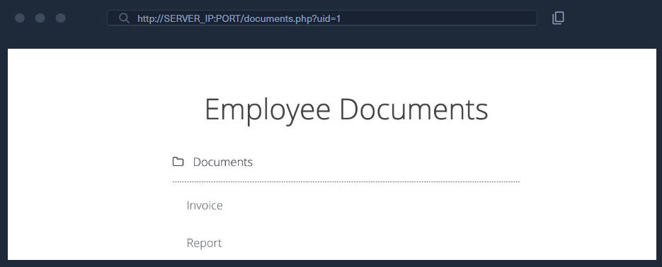

进入 Documents 页面后，我们可以看到属于我们用户的多个文档。这些文档可能是用户上传的，也可能是其他部门（例如人力资源部）为我们指定的。查看文件链接，我们发现它们都有各自的名称：

```html
/documents/Invoice_1_09_2021.pdf
/documents/Report_1_10_2021.pdf
```

我们发现这些文件具有可预测的命名模式，文件名似乎使用了用户 uid 和月份/年份作为文件名的一部分，这可能使我们能够模糊测试其他用户的文件。这是最基本的 IDOR 漏洞类型，称为 static file IDOR 。然而，为了成功模糊测试其他文件，我们需要假设它们都以 Invoice 或 Report 开头，这或许可以暴露部分文件，但并非全部。因此，让我们寻找更可靠的 IDOR 漏洞。

我们看到页面在 URL 中使用 GET 参数设置了我们的 uid ，例如 ( documents.php?uid=1 )。如果 Web 应用程序将此 uid GET 参数直接引用到它应该显示的员工记录，那么我们只需更改此值即可查看其他员工的文档。如果 Web 应用程序的后端 does 有完善的访问控制系统，我们会收到 Access Denied 之类的错误。然而，鉴于 Web 应用程序以明文形式直接传递我们的 uid ，这可能表明 Web 应用程序设计不佳，导致可以随意访问员工记录。

当我们尝试将 uid 更改为 ?uid=2 ，我们没有注意到页面输出有任何变化，因为我们仍然得到相同的文档列表，因此可以认为它仍然返回我们自己的文档：

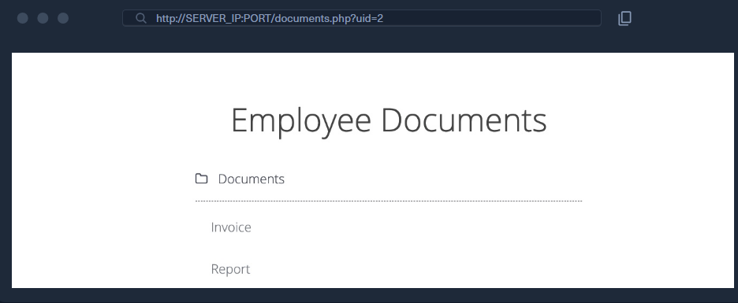


然而，在任何 Web 渗透测试过程中，我们都必须留意页面细节，并且时刻关注源代码与页面大小。如果我们查看这些关联文件，或是点击打开它们，就会发现这些确实是不同的文件，显然属于 uid=2 这名员工的文档：

```html
/documents/Invoice_2_08_2020.pdf
/documents/Report_2_12_2020.pdf
```

这是存在 IDOR 漏洞的 Web 应用程序中常见的错误，因为它们将控制显示哪些用户文档的参数置于我们控制之下，而后端却没有相应的访问控制系统。另一个例子是使用筛选参数仅显示特定用户的文档（例如 uid_filter=1 ），但该参数也可以被篡改以显示其他用户的文档，甚至可以完全移除以一次性显示所有文档。

我们可以尝试手动访问其他员工的文档，例如使用 uid=3 、 uid=4 等。然而，在拥有成百上千名员工的实际工作环境中，手动访问文件效率低下。因此，我们可以使用 Burp Intruder 或 ZAP Fuzzer 之类的工具来检索所有文件，或者编写一个简单的 bash 脚本来下载所有文件，而这正是我们将要采用的方法。

在 Firefox 中，我们可以按 CTRL+SHIFT+C 启用 element inspector ，然后点击任意链接查看其 HTML 源代码，我们将得到以下内容：

```html
<li class='pure-tree_link'><a href='/documents/Invoice_3_06_2020.pdf' target='_blank'>Invoice</a></li>
<li class='pure-tree_link'><a href='/documents/Report_3_01_2020.pdf' target='_blank'>Report</a></li>
```

我们可以选择任何唯一的单词来 grep 文件的链接。在本例中，我们发现每个链接都以 <li class='pure-tree_link'> 开头，因此我们可以 curl 页面并 grep 这一行，如下所示：

```bash
$ curl -s "http://SERVER_IP:PORT/documents.php?uid=3" | grep "<li class='pure-tree_link'>"

<li class='pure-tree_link'><a href='/documents/Invoice_3_06_2020.pdf' target='_blank'>Invoice</a></li>
<li class='pure-tree_link'><a href='/documents/Report_3_01_2020.pdf' target='_blank'>Report</a></li>
```

如我们所见，我们已成功获取文档链接。现在我们可以使用特定的 bash 命令来去除多余的部分，只保留输出中的文档链接。然而，更好的做法是使用 Regex 模式来匹配 /document 和 .pdf 之间的字符串，我们可以将其与 grep 结合使用，以仅获取文档链接，如下所示：

```bash
$ curl -s "http://SERVER_IP:PORT/documents.php?uid=3" | grep -oP "\/documents.*?.pdf"

/documents/Invoice_3_06_2020.pdf
/documents/Report_3_01_2020.pdf
```

现在，我们可以使用一个简单的 for 循环来遍历 uid 参数并返回所有员工的文档，然后使用 wget 下载每个文档的链接：

```bash
#!/bin/bash

url="http://SERVER_IP:PORT"

for i in {1..10}; do
        for link in $(curl -s "$url/documents.php?uid=$i" | grep -oP "\/documents.*?.pdf"); do
                wget -q $url/$link
        done
done
```

运行此脚本后，它将下载所有 uids 为 1 到 10 的员工的所有文档，从而成功利用 IDOR 漏洞批量枚举所有员工的文档。此脚本是实现相同目标的一个示例。您可以尝试使用 Burp Intruder 或 ZAP Fuzzer 等工具，或者编写另一个 Bash 或 PowerShell 脚本来下载所有文档。

### 4.2 绕过编码引用

在上一节中，我们看到了一个使用明文员工 UID 的 IDOR 示例，这使得枚举变得容易。在某些情况下，Web 应用程序会对其对象引用进行哈希处理或编码，这会增加枚举的难度，但仍然有可能实现。

让我们回到 Employee Manager 网页应用程序，测试一下 Contracts 功能：

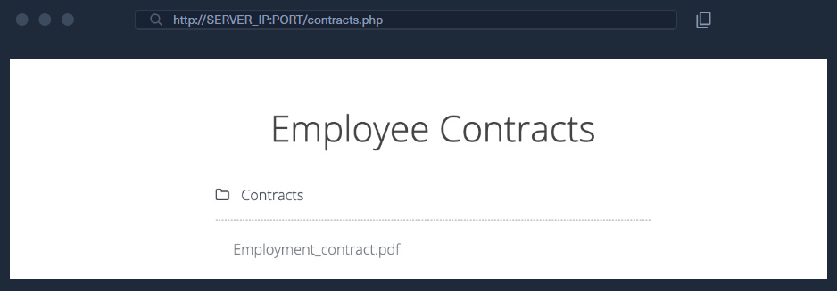

如果我们点击 Employment_contract.pdf 文件，它就会开始下载该文件。在 Burp 中拦截到的请求如下所示：

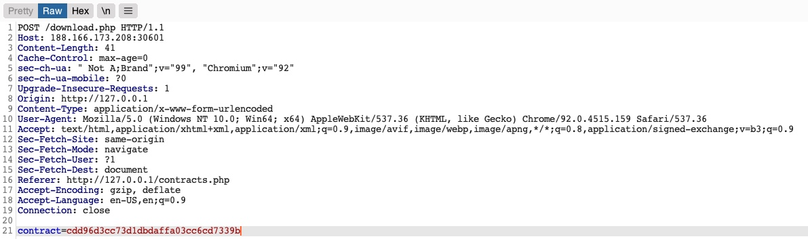

我们看到它向 download.php 发送了一个 POST 请求，其中包含以下数据：

```http
contract=cdd96d3cc73d1dbdaffa03cc6cd7339b
```

使用 download.php 脚本下载文件是一种常见的做法，可以避免直接提供文件链接，因为直接链接容易受到多种网络攻击。在本例中，Web 应用程序并没有以明文形式发送文件链接，而是似乎将其哈希处理成了 md5 格式。哈希值是单向函数，因此我们无法解码查看其原始值。

我们可以尝试对各种值（例如 uid 、 username 、 filename 等）进行哈希运算，并查看它们的 md5 哈希值是否与上述值匹配。如果找到匹配项，我们可以对其他用户复制此操作并收集他们的文件。例如，让我们尝试比较我们 uid 的 md5 哈希值，看看它是否与上述哈希值匹配：

```bash
$ echo -n 1 | md5sum

c4ca4238a0b923820dcc509a6f75849b -
```

遗憾的是，这些哈希值并不匹配。我们可以尝试用其他各种字段进行比对，但没有一个能和我们的哈希值对应上。
在更复杂的场景中，我们还可以使用 Burp Comparer，对各种值进行模糊测试（fuzz），再将结果逐一与目标哈希比对，看是否能找到匹配项。
在本例中，这个 MD5 哈希 可能对应某个唯一值，或是多个值的组合，很难被猜解出来，这就让这个直接引用看上去像是安全直接对象引用（Secure Direct Object Reference）。

### 4.3 敏感功能查找

由于大多数现代 Web 应用程序都是使用 JavaScript 框架（例如 Angular 、 React 或 Vue.js ）开发的，许多 Web 开发人员可能会犯一个错误，即在前端执行敏感功能，这会将他们暴露给攻击者。例如，如果上述哈希值是在前端计算的，我们可以研究该函数，然后复制其操作来计算相同的哈希值。幸运的是，这种情况在这个 Web 应用程序中正是如此。

如果我们查看源代码中的链接，会发现它调用了一个带有参数 javascript:downloadContract('1') 的 JavaScript 函数。查看源代码中的 downloadContract() 函数，我们看到以下内容：

```js
function downloadContract(uid) {
    $.redirect("/download.php", {
        contract: CryptoJS.MD5(btoa(uid)).toString(),
    }, "POST", "_self");
}
```

这个函数似乎发送了一个带有 contract 参数的 POST 请求，这与我们之前看到的一致。它发送的值是使用 CryptoJS 库生成的 md5 哈希值，这也与我们之前看到的请求相符。因此，剩下的唯一问题就是被哈希的值是什么。

在本例中，被进行哈希计算的值是 btoa(uid)，也就是函数入参 uid 变量经过 Base64 编码后的字符串。
回到之前调用该函数的链接，我们可以看到它执行的是：downloadContract('1')。因此，POST 请求中最终使用的值，就是对数字 1 先做 Base64 编码，再进行 MD5 哈希后的结果。

我们可以通过对 uid=1 进行 base64 编码，然后使用 md5 对其进行哈希处理来验证这一点，如下所示：

```bash
$ echo -n 1 | base64 -w 0 | md5sum

cdd96d3cc73d1dbdaffa03cc6cd7339b -
```

> 提示： 我们使用 echo 的 -n 标志和 base64 的 -w 0 标志来避免添加换行符，以便能够计算同一值的 md5 哈希值，而不会对换行符进行哈希处理，因为那样会改变最终的 md5 哈希值。

正如我们所见，该哈希值与我们请求中的哈希值完全匹配，这意味着我们成功逆向破解了对象引用所使用的哈希算法，将原本看似安全的引用转化为了可利用的 IDOR 漏洞。
借此，我们可以使用上述相同的哈希方法，枚举其他员工的合同文件。

### 4.4 大规模枚举

让我们再次编写一个简单的 Bash 脚本来检索所有员工合同。通常情况下，这是利用 IDOR 漏洞枚举数据和文件的最简单、最有效的方法。在更高级的情况下，我们可以使用 Burp Intruder 或 ZAP Fuzzer 等工具，但对于我们的练习来说，一个简单的 Bash 脚本应该是最佳选择。

我们可以先使用与之前相同的命令计算前十名员工的哈希值，同时使用 tr -d 删除末尾的 - 字符，如下所示：

```bash
$ for i in {1..10}; do echo -n $i | base64 -w 0 | md5sum | tr -d ' -'; done

cdd96d3cc73d1dbdaffa03cc6cd7339b
```

接下来，我们可以向 download.php 发送 POST 请求，并将上述每个哈希值作为 contract 值，这样就能得到最终的脚本：

```bash
#!/bin/bash

for i in {1..10}; do
    for hash in $(echo -n $i | base64 -w 0 | md5sum | tr -d ' -'); do
        curl -sOJ -X POST -d "contract=$hash" http://SERVER_IP:PORT/download.php
    done
done

```

这样，我们就可以运行脚本了，它应该会下载员工 1-10 的所有合同

## 5.不安全 API 中的 IDOR

到目前为止，我们仅利用 IDOR 漏洞 访问了超出当前用户权限的文件与资源。

但 IDOR 漏洞同样可能存在于函数调用与 API 中，利用这类漏洞可以让我们以其他用户身份执行各类操作。

IDOR 信息泄露漏洞 允许我们读取各类资源，而 IDOR 不安全函数调用 则能让我们以其他用户身份调用 API 或执行函数。这类函数与 API 可被用于修改他人隐私信息、重置他人密码，甚至利用他人支付信息购买商品。
在许多场景下，我们会先通过信息泄露类 IDOR 获取特定信息，再结合 IDOR 不安全函数调用漏洞加以利用 —— 这一点会在本模块后续内容中详细讲解。

### 5.1 识别不安全的API

回到我们的 Employee Manager Web 应用程序，我们可以开始测试 Edit Profile 页面是否存在 IDOR 漏洞：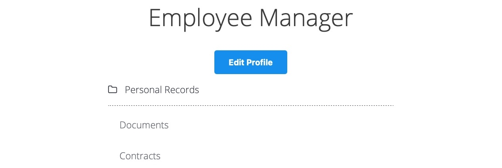

当我们点击 Edit Profile 按钮时，我们会进入一个页面来编辑我们的用户个人资料信息，即 Full Name 、 Email 和 About Me ，这是许多网络应用程序中的常见功能：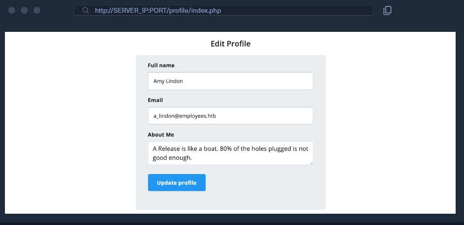

我们可以修改个人资料中的任何信息，然后点击 Update profile ，我们会看到这些信息会更新并保持刷新状态，这意味着它们会在某个数据库中更新。让我们在 Burp 中拦截 Update 请求并查看一下：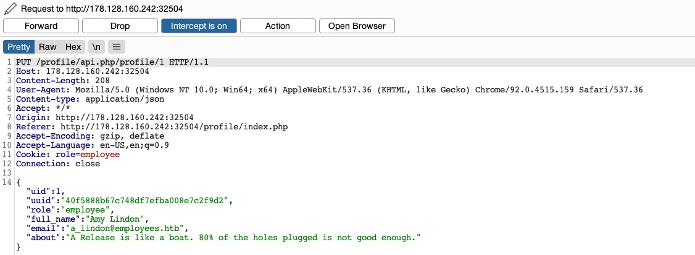

我们看到页面正在向 /profile/api.php/profile/1  端点发送 PUT 请求。PUT 请求通常用于 API 中更新项目详情，而 POST 用于创建新项目， DELETE 用于删除项目， GET 用于检索项目详情。因此， Update profile 功能需要发送 PUT 请求。有趣的是它发送的 JSON 参数：

```json
{
    "uid": 1,
    "uuid": "40f5888b67c748df7efba008e7c2f9d2",
    "role": "employee",
    "full_name": "Amy Lindon",
    "email": "a_lindon@employees.htb",
    "about": "A Release is like a boat. 80% of the holes plugged is not good enough."
}
```

我们发现 PUT 请求包含一些隐藏参数，例如 uid 、 uuid ，以及最值得关注的 role ，其值为 employee 应用程序似乎还在客户端设置了用户访问权限（例如 role ），具体形式是通过 Cookie: `role=employee` ，该 cookie 反映了为我们用户指定的 role 。这是一个常见的安全问题。访问控制权限作为客户端 HTTP 请求的一部分发送，无论是通过 cookie 还是 JSON 请求，都处于客户端的控制之下，因此可能被篡改以获取更多权限。

所以，除非这个网络应用程序在后台有一个稳固的访问控制系统，否则我们应该能够为我们的用户设置任意角色，这可能赋予我们更多的权限。然而，我们如何知道其他角色存在呢？

### 5.2 利用不安全的 API

我们知道可以修改 full_name 、 email 和 about 几个参数，因为这些参数在 /profile 网页的 HTML 表单中是我们可以控制的。那么，让我们尝试修改其他参数。

我们可以尝试以下几种方法：

1. 将我们的 uid 更改为其他用户的 uid ，以便我们能够接管他们的帐户。
2. 更改其他用户的详细信息，这可能使我们能够执行多种网络攻击
3. 创建具有任意详细信息的新用户，或删除现有用户
4. 将我们的角色更改为权限更高的角色（例如 admin ），以便能够执行更多操作

我们先尝试将我们的 uid 更改为另一个用户的 uid （例如 "uid": 2 ）。但是，如果我们设置除我们自身 uid 之外的任何数字，都会收到 uid mismatch 的响应：

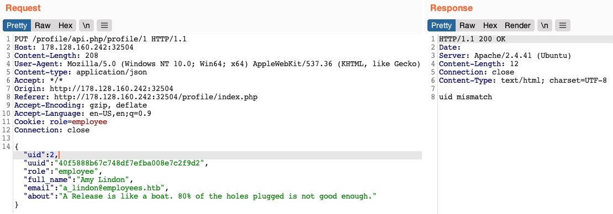

该 Web 应用会将请求中的 uid 与 API 端点（/1）进行比对。这意味着后端采用了某种访问控制机制，阻止我们随意修改部分 JSON 参数，这种机制通常用于避免应用崩溃或返回错误。

或许我们可以尝试修改其他用户的详细信息。我们将 API 端点更改为 /profile/api.php/profile/2 ，并将 "uid": 2 以避免之前 uid mismatch 。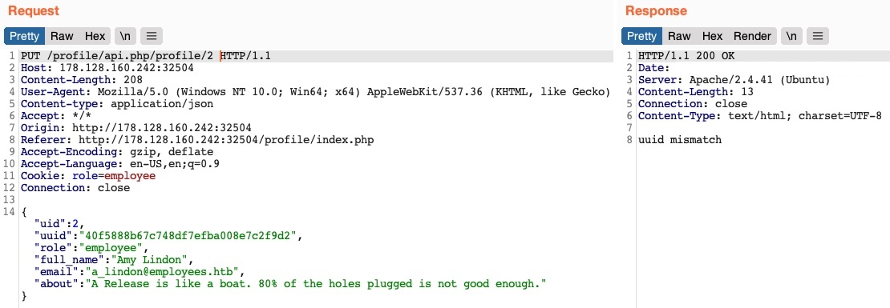

可以看到，这次我们收到了一条错误提示：uuid mismatch（UUID 不匹配）。
该 Web 应用会检查我们提交的 uuid 是否与对应用户的 UUID 一致。由于我们提交的是自己的 UUID，请求因此失败。这显然是另一种访问控制形式，用于防止用户修改其他用户的信息。

接下来，我们来看看能否通过向 API 端点发送 POST 请求来创建一个新用户。我们可以将请求方法改为 POST ，将 uid 改为一个新的 uid ，然后将请求发送到新 uid 对应的 API 端点：

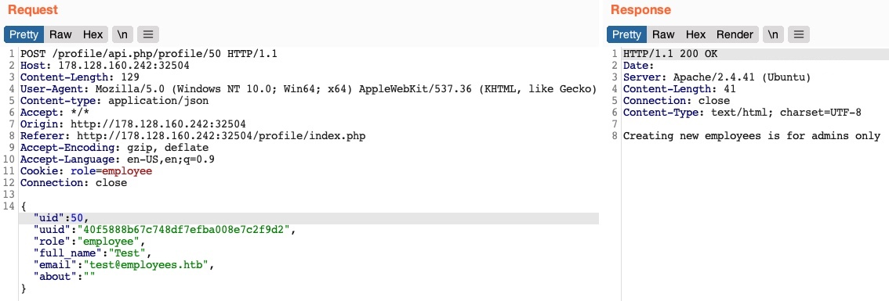

我们收到错误信息 Creating new employees is for admins only 。发送 Delete 请求时也会出现同样的情况，收到错误信息 Deleting employees is for admins only 。Web 应用程序可能正在通过 role=employee cookie 检查我们的授权，因为这似乎是 HTTP 请求中唯一的授权方式。

最后，我们尝试将 role 更改为 admin / administrator 以获得更高的权限。遗憾的是，由于不知道有效的 role 名称，我们在 HTTP 响应中收到 Invalid role ， role 无法更新：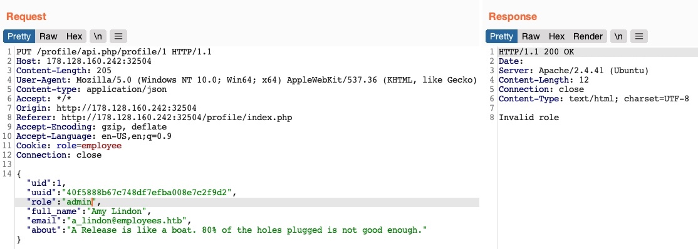

可见，我们的所有尝试似乎都失败了。我们无法创建或删除用户，因为无法修改自己的角色。我们无法修改自身的 uid，因为后端存在我们无法绕过的防护措施；出于同样原因，我们也无法修改其他用户的资料。
那么，这款 Web 应用真的能够防御 IDOR 攻击 吗？

到目前为止，我们只测试了IDOR 不安全函数调用漏洞。但我们还没有针对该 API 的 GET 请求，测试是否存在IDOR 信息泄露漏洞。
如果应用没有部署完善的访问控制体系，我们就有可能读取到其他用户的详细信息，而这些信息可以帮助我们继续实施之前尝试过的攻击。

试通过发送 GET 请求 获取其他用户的详细信息，以此测试该 API 是否存在 IDOR 信息泄露漏洞。如果该 API 存在漏洞，我们就可以泄露其他用户的信息，随后利用这些信息完成对函数调用的 IDOR 攻击。

### 5.3  IDOR 漏洞利用链

通常情况下，向 API 端点发送 GET 请求应该会返回所请求用户的详细信息，因此我们可以尝试调用该 API 端点，看看能否检索到用户的详细信息。我们还注意到，页面加载后，它会通过向同一 API 端点发送 GET 请求来获取用户详细信息：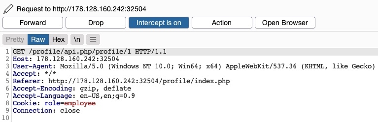

如前所述，我们的 HTTP 请求中唯一的授权形式是 role=employee cookie，因为 HTTP 请求不包含任何其他形式的用户特定授权，例如 JWT 令牌。即使存在令牌，除非后端访问控制系统主动将其与请求的对象详细信息进行比较，否则我们仍然可能获取其他用户的详细信息。

让我们使用另一个 uid 发送一个 GET 请求：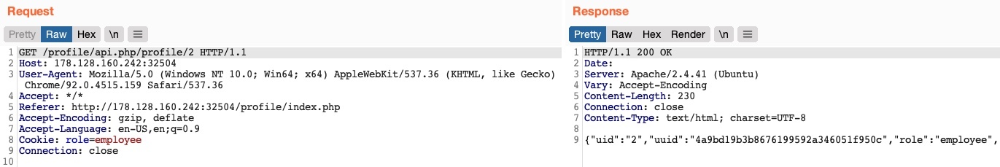

正如我们所见，这返回了另一个用户的详细信息，包括他们自己的 uuid 和 role ，证实了IDOR 信息泄露漏洞 ：

```json
{
    "uid": "2",
    "uuid": "4a9bd19b3b8676199592a346051f950c",
    "role": "employee",
    "full_name": "Iona Franklyn",
    "email": "i_franklyn@employees.htb",
    "about": "It takes 20 years to build a reputation and few minutes of cyber-incident to ruin it."
}
```

这为我们提供了新的详细信息，最值得注意的是 uuid ，这是我们以前无法计算的，因此也无法更改其他用户的详细信息。

现在，有了用户的 uuid ，我们可以通过向 /profile/api.php/profile/2 发送 PUT 请求来更改该用户的详细信息，请求中包含上述详细信息以及我们所做的任何修改，如下所示：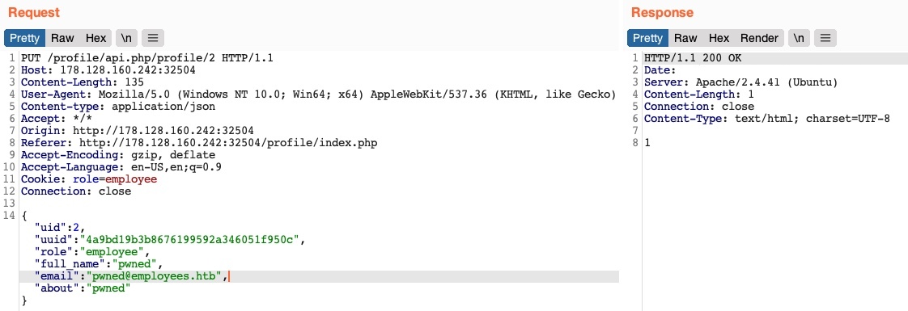

这次我们没有收到任何访问控制错误消息，当我们再次尝试 GET 用户详细信息时，我们发现我们确实已经更新了他们的详细信息：

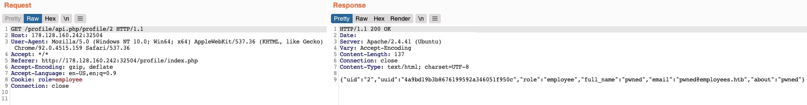

除了能让我们查看潜在的敏感信息外，修改其他用户资料的能力还能让我们发起多种后续攻击。
一种攻击方式是：修改目标用户的邮箱地址，然后申请密码重置链接 —— 该链接会发送到我们指定的邮箱，从而让我们接管对方账号。
另一种可行的攻击是：在个人简介（about）字段中植入 XSS Payload，一旦用户访问编辑资料页面，Payload 就会执行，使我们能够以多种方式对该用户实施攻击。

既然我们已经发现了一处IDOR 信息泄露漏洞，我们还可以借此枚举所有用户，并查找其他角色（理想情况下是管理员角色）。请尝试编写一段脚本来枚举所有用户，实现方式与我们之前的操作类似。

枚举所有用户后，我们将找到一个管理员用户，其详细信息如下：

```json
{
    "uid": "X",
    "uuid": "a36fa9e66e85f2dd6f5e13cad45248ae",
    "role": "web_admin",
    "full_name": "administrator",
    "email": "webadmin@employees.htb",
    "about": "{FLAG}"
}

```

我们可以修改管理员的资料，随后利用上述任意一种攻击方式接管其账号。不过，既然我们已经知道了管理员角色名称（web_admin），就可以直接将我们自己的用户角色设置为管理员，从而实现创建新用户、删除现有用户的操作。
要做到这一点，我们只需在点击「更新资料」按钮时拦截请求，并将自身角色修改为 web_admin 即可：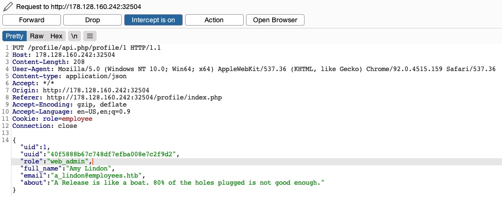

这次，我们没有收到 Invalid role 错误消息，也没有收到任何访问控制错误消息，这意味着后端没有设置任何访问控制措施来限制我们可以为用户设置的角色。如果我们 GET 用户详细信息，可以看到我们的 role 确实已被设置为 web_admin ：

```json
{
    "uid": "1",
    "uuid": "40f5888b67c748df7efba008e7c2f9d2",
    "role": "web_admin",
    "full_name": "Amy Lindon",
    "email": "a_lindon@employees.htb",
    "about": "A Release is like a boat. 80% of the holes plugged is not good enough."
}

```

现在，我们可以刷新页面来更新 cookie，或者手动将其设置为 Cookie: role=web_admin ，然后拦截创建新用户的 Update 请求，看看我们是否被允许这样做：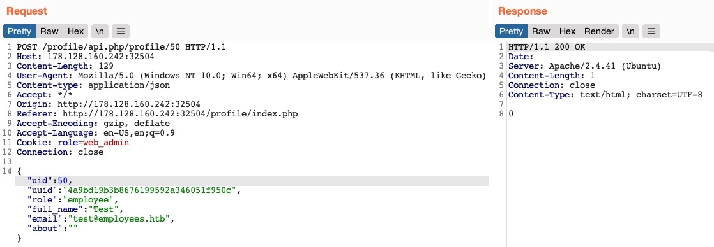

这次我们没有收到错误信息。如果我们发送一个 GET 请求来创建新用户，可以看到用户已成功创建：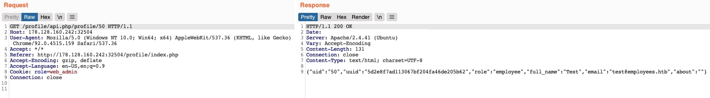

通过将从IDOR 信息泄露漏洞中获取的信息，结合对 API 端点发起的IDOR 不安全函数调用攻击，我们可以绕过已有的各类访问控制校验，修改其他用户的资料，并创建 / 删除用户。
在很多场景下，通过 IDOR 漏洞泄露的信息还能被用于其他攻击（如 IDOR 或 XSS），从而形成更复杂的攻击链，或是绕过现有的安全机制。

## 6. 预防IDOR

我们学习了识别和利用网页、Web 函数和 API 调用中 IDOR 漏洞的各种方法。现在，我们应该已经明白，IDOR 漏洞主要是由后端服务器访问控制不当造成的。为了防止此类漏洞，我们首先需要构建对象级访问控制系统，然后在存储和调用对象时使用安全引用。

### 6.1 对象级访问控制

访问控制系统应是任何 Web 应用程序的核心，因为它会影响应用程序的整体设计和结构。为了有效控制 Web 应用程序的各个区域，其设计必须支持以集中方式划分角色和权限。然而，访问控制是一个庞大的主题，因此我们将仅关注其在 IDOR 漏洞中的作用，特别是 Object-Level 访问控制机制。

用户角色和权限是任何访问控制系统的重要组成部分，而基于角色的访问控制 (RBAC) 系统则充分实现了这一点。为了避免利用 IDOR 漏洞，我们必须将 RBAC 映射到所有对象和资源。后端服务器可以根据请求者的角色是否拥有访问该对象或资源的足够权限，来允许或拒绝每个请求。

一旦实施基于角色的访问控制（RBAC），每个用户都会被分配一个具有特定权限的角色。每当用户发出请求时，系统都会检查其角色和权限，以确定其是否拥有访问所请求对象的权限。只有拥有相应权限的用户才能访问该对象。

实现基于角色的访问控制 (RBAC) 系统并将其映射到 Web 应用程序的对象和资源的方法有很多，而将其融入 Web 应用程序的核心结构进行设计则是一门需要精益求精的艺术。以下示例代码展示了 Web 应用程序如何将用户角色与对象进行比较，从而允许或拒绝访问控制：

```javascript
match /api/profile/{userId} {
    allow read, write: if user.isAuth == true
    && (user.uid == userId || user.roles == 'admin');
}
```

上面的示例使用了用户令牌，该令牌可通过向基于角色的访问控制（RBAC）系统发起的 HTTP 请求完成映射，从而获取用户的各类角色与权限。
随后，系统仅会在RBAC 系统中的用户 uid 与请求的 API 端点中的 uid 完全匹配时，才授予该用户读写权限。此外，如果用户在后端 RBAC 系统中的角色为管理员，系统也会直接授予其读写权限。

在之前的攻击案例中，我们发现用户角色会被存储在用户资料或 Cookie 中 —— 这两类数据都由用户可控，可被恶意篡改以实现权限提升。而上述示例展示了一种**更安全的用户角色映射方案**：用户权限**不会通过 HTTP 请求传输**，而是后端基于角色的访问控制系统（RBAC），以用户的登录会话令牌作为身份验证凭据，直接完成权限映射。

访问控制系统与 RBAC 机制的设计复杂度极高，是 Web 安全中最具挑战性的模块之一。不过，本段内容足以让我们理解：应当如何管控用户对 Web 应用内对象与资源的访问权限。

IDOR 漏洞的**核心根源是访问控制失效**，而**直接对象引用**机制，让攻击者能够枚举并利用这类访问控制漏洞。我们并非完全不能使用直接对象引用，**前提是必须部署一套完善的访问控制系统**。

即便搭建了可靠的访问控制体系，也**绝对不能使用明文或简单规律的对象引用**（例如 `uid=1`）。我们必须采用高强度、唯一的引用标识，比如**加盐哈希**或**UUID**。

举例：我们可以使用 UUID V4 为任意元素生成强随机唯一标识（格式如：`89c9b29b-d19f-4515-b2dd-abb6e693eb20`），在后端数据库中建立该 UUID 与对应对象的映射关系；当请求携带该 UUID 时，后端数据库就能精准匹配并返回目标对象。

下方这段 PHP 代码是**错误示范**（明文拼接 UID 查询，存在高危漏洞）：

```php
$uid = intval($_REQUEST['uid']);
$query = "SELECT url FROM documents where uid=" . $uid;
$result = mysqli_query($conn, $query);
$row = mysqli_fetch_array($result);
echo "<a href='" . $row['url'] . "' target='_blank'></a>";
```

除此之外，正如本模块前文所述，**绝对不能在前端计算哈希值**。正确做法是：在对象创建时由后端生成哈希 / UUID，存储在数据库中，并建立对象与引用标识的映射表，实现快速关联查询。

最后需要重点注意：使用 UUID 会增加 IDOR 漏洞的检测难度，导致漏洞难以被发现。因此，**高强度对象引用是部署强访问控制系统后的第二步防护手段**。

# 四. XXE注入
