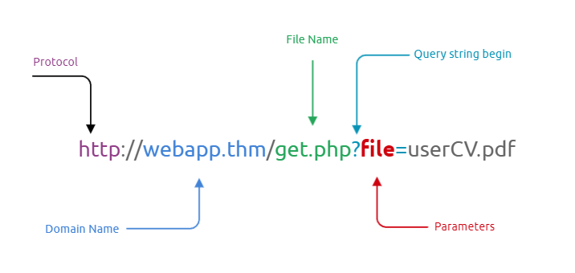
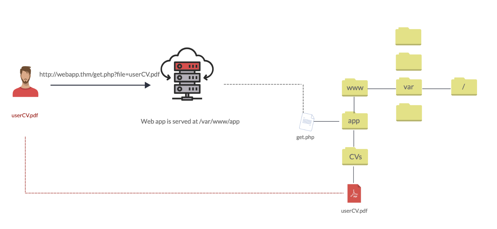
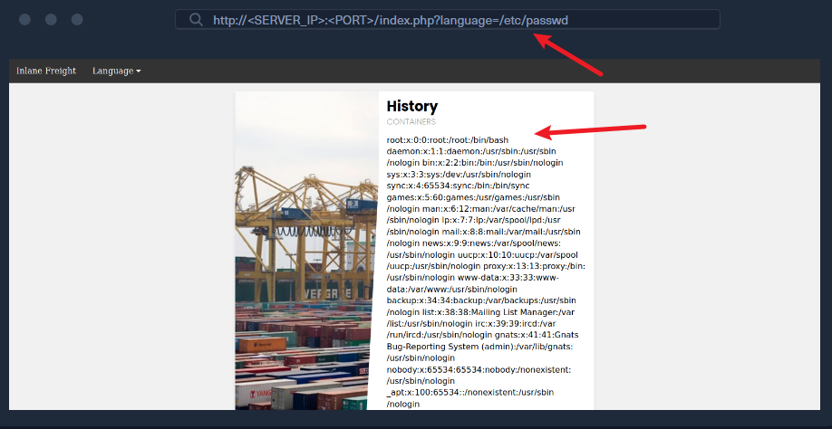

# 简介

许多现代后端语言（如 PHP、JavaScript、Java）都会通过 HTTP 参数来指定网页展示的内容，这既可以实现动态网页，又能减小脚本整体体积、简化代码。
在这种机制下，参数用于指定页面要加载的资源。如果这类功能没有安全编码，攻击者就可以恶意篡改这些参数，读取服务器上任意本地文件的内容，从而造成本地文件包含（LFI）漏洞。

在某些场景下，Web 应用程序会通过参数来请求访问指定系统上的文件，包括图片、静态文本等。参数是附加在 URL 中的查询参数字符串，可用于根据用户输入获取数据或执行操作。下图对 URL 的基本组成部分进行了分解。



例如，Google 搜索就会使用参数，通过 GET 请求将用户输入传递给搜索引擎，如链接：https://www.google.com/search?q=TryHackMe。

我们来讨论一下用户请求访问 Web 服务器上的文件的场景。首先，用户向 Web 服务器发送一个包含要显示的文件的 HTTP 请求。例如，如果用户想要在 Web 应用程序中访问并显示他们的简历，则请求可能如下所示： http : //webapp.thm/get.php ?file= userCV.pdf ，其中 file 是参数， userCV.pdf 是要访问的文件。



# 易受攻击代码示例

让我们来看一些存在文件包含漏洞的代码示例，以便了解此类漏洞是如何产生的。如前所述，文件包含漏洞可能出现在许多流行的 Web 服务器和开发框架中，例如 PHP 、 NodeJS 、 Java 、 .Net 等等。它们各自包含本地文件的方式略有不同，但它们都有一个共同点：从指定路径加载文件。

这类文件可以是动态页头，也可以是根据用户指定语言展示的不同内容。例如，页面会携带?language这个 GET 参数；当用户通过下拉菜单切换语言时，页面本身不变，但会带上不同的语言参数（如?language=es）。
这种情况下，切换语言会改变 Web 应用加载页面的目录（如/en/或/es/）。如果我们能控制加载路径，就可利用该漏洞读取其他文件，甚至进一步实现远程代码执行。

## PHP

在 PHP 中，我们加载页面时可能会使用` include()` 函数来加载本地文件或远程文件。如果传递给 include() 的**路径**来自用户可控的参数（例如 `GET `参数），且代码未对用户输入进行显式的过滤和净化，那么这段代码就会存在文件包含漏洞。以下代码片段展示了该场景的示例：

```php
if (isset($_GET['language'])) {
    include($_GET['language']);
}
```

我们看到 language 参数直接传递给了 include() 函数。因此，我们通过 language 参数传递的任何路径都会加载到页面上，包括后端服务器上的任何本地文件。这并非 include() 函数独有的问题，许多其他 PHP 函数如果能够控制传递给它们的路径，也会导致同样的漏洞。这些函数包括` include_once() `、` require()` 、`require_once()` 、 file_get_contents() 等等。

> 注意： 在本模块中，我们将主要关注在 Linux 后端服务器上运行的 PHP Web 应用程序。但是，大多数技术和攻击也适用于大多数其他框架，因此我们的示例对于使用其他语言编写的 Web 应用程序也同样适用。

## NodeJS

与 PHP 类似，NodeJS Web 服务器也可以根据 HTTP 参数加载内容。以下是一个使用 GET 参数 language 来控制写入页面的数据的基本示例：

```js
if(req.query.language) {
    fs.readFile(path.join(__dirname, req.query.language), function (err, data) {
        res.write(data);
    });
}
```

正如我们所见，无论从 URL 传递什么参数， readfile 函数都会使用它们，然后将文件内容写入 HTTP 响应。另一个例子是 Express.js 框架中的 render() 函数。以下示例展示了如何使用 language 参数来确定从哪个目录拉取 about.html 页面：

```js
app.get("/about/:language", function(req, res) {
    res.render(`/${req.params.language}/about.html`);
});
```

与之前示例中在 URL 中使用问号 ( ? ) 指定 GET 参数不同，上述示例直接从 URL 路径（例如 /about/en 或 /about/es ）获取参数。由于该参数直接在 render() 函数中用于指定渲染的文件，因此我们可以更改 URL 以显示不同的文件。

## Java

同样的道理也适用于许多其他类型的 Web 服务器。以下示例展示了 Java Web 服务器的 Web 应用程序如何使用 include 函数，根据指定的参数包含本地文件：

```jsp
<c:if test="${not empty param.language}">
    <jsp:include file="<%= request.getParameter('language') %>" />
</c:if>
```

include 函数可接收文件路径或页面 URL 作为参数，随后将目标内容渲染至前端模板中 —— 这与我们此前在 NodeJS 中见到的类似用法一致。import 函数同样可用于渲染本地文件或 URL，例如以下示例：

```jsp
<c:import url= "<%= request.getParameter('language') %>"/>
```

## .NET

最后，我们以.NET Web 应用程序为例，说明文件包含漏洞可能如何产生。Response.WriteFile函数的工作原理与我们之前看到的所有示例极为相似：它接收文件路径作为输入参数，并将该文件的内容写入响应中。为了实现动态加载内容，这个文件路径可能会从 GET 参数中获取，示例如下：

```cs
@if (!string.IsNullOrEmpty(HttpContext.Request.Query['language'])) {
    <% Response.WriteFile("<% HttpContext.Request.Query['language'] %>"); %> 
}

```

此外，还可以使用 @Html.Partial() 函数将指定的文件渲染为前端模板的一部分，类似于我们之前看到的那样：

```cs
@Html.Partial(HttpContext.Request.Query['language'])
```

最后， include 函数可用于渲染本地文件或远程 URL，并且还可以执行指定的文件：

```cs
<!--#include file="<% HttpContext.Request.Query['language'] %>"-->
```

## 读文件和执行代码函数

从以上所有示例中我们可以看出，**文件包含漏洞**可能出现在任何 Web 服务器和任何开发框架中，因为它们都提供了加载动态内容和处理前端模板的功能。

需要牢记的最重要一点是：上述某些函数**仅读取**指定文件的内容，而另一些则还会**执行**指定文件。此外，其中一些允许指定远程 URL，而另一些仅能处理后端服务器上的本地文件。

下表展示了哪些函数可以执行文件，哪些仅读取文件内容：

| 函数                     | 读取内容 | 执行 | 远程 URL |
| ------------------------ | -------- | ---- | -------- |
| **PHP**            |          |      |          |
| include()/include_once() | ✅       | ✅   | ✅       |
| require()/require_once() | ✅       | ✅   | ❌       |
| file_get_contents()      | ✅       | ❌   | ✅       |
| fopen()/file()           | ✅       | ❌   | ❌       |
| **NodeJS**         |          |      |          |
| fs.readFile()            | ✅       | ❌   | ❌       |
| fs.sendFile()            | ✅       | ❌   | ❌       |
| res.render()             | ✅       | ✅   | ❌       |
| **Java**           |          |      |          |
| include                  | ✅       | ❌   | ❌       |
| import                   | ✅       | ✅   | ✅       |
| **.NET**           |          |      |          |
| @Html.Partial()          | ✅       | ❌   | ❌       |
| @Html.RemotePartial()    | ✅       | ❌   | ✅       |
| Response.WriteFile()     | ✅       | ❌   | ❌       |
| include                  | ✅       | ✅   | ✅       |

这是一个需要注意的重大区别，因为**执行文件**可能使我们能够调用函数并最终导致**代码执行**，而仅读取文件内容则只能让我们查看源代码，无法执行代码。
此外，如果在白盒测试或代码审计中能够查看源代码，了解这些行为有助于我们识别潜在的文件包含漏洞，尤其是当这些函数接收**用户可控输入**时。

在所有情况下，文件包含漏洞都是高危漏洞，最终可能导致整个后端服务器被攻陷。即便我们只能读取 Web 应用的源代码，也依然可能实现入侵——因为源码可能暴露出其他前文提到的漏洞，同时还可能包含数据库密钥、管理员凭证或其他敏感信息。

# 本地文件包含 (LFI)

现在我们已经了解了文件包含漏洞是什么以及它们是如何发生的，我们可以开始学习如何在不同的场景中利用这些漏洞来读取后端服务器上本地文件的内容。

本节末尾的练习向我们展示了一个 Web 应用程序的示例，该应用程序允许用户将其语言设置为英语或西班牙语：

如果我们点击选择一种语言（例如 Spanish ），我们会看到内容文本变为西班牙语：

我们还注意到，URL 中包含一个 language 参数，该参数现在已设置为我们选择的语言（ es.php ）。有几种方法可以更改内容以匹配我们指定的语言。它可能根据指定的参数从不同的数据库表中提取内容，或者加载完全不同的 Web 应用程序版本。但是，如前所述，使用模板引擎加载部分页面是最简单、最常用的方法。

因此，如果 Web 应用程序确实正在拉取一个文件并将其包含在页面中，我们可以更改拉取的文件，使其读取另一个本地文件的内容。大多数后端服务器上都有两个常见的可读文件：Linux 上的` /etc/passwd` 和 Windows 上的 `C:\Windows\boot.ini `。所以，让我们将参数从` es` 更改为` /etc/passwd` ：



正如我们所看到的，该页面确实存在漏洞，我们可以读取 passwd 文件的内容，并识别后端服务器上存在的用户。

## 路径遍历

在前面的例子中，我们通过指定文件的 **绝对路径** （例如 /etc/passwd ）来读取文件。如果将整个输入直接用于 include() 函数而不做任何修改，这种方法是有效的，如下例所示：

```php
include($_GET['language']);

```

### 文件夹前缀绕过

在这种情况下，如果我们尝试读取 /etc/passwd，include() 函数会直接获取该文件。但在很多场景中，Web 开发者可能会给 language 参数 拼接一段前缀或后缀。例如，**language 参数可能被用作文件名，并拼接在某个目录后面**，如下所示：

```php
include("./languages/" . $_GET['language']);
```

在这种情况下，如果我们尝试读取 `/etc/passwd` ，那么传递给 include() 路径将是 ( `./languages//etc/passwd` )，由于该文件不存在，我们将无法读取任何内容：

正如预期的那样，返回的详细错误信息显示了传递给 include() 函数的字符串，表明 languages 目录中没有 /etc/passwd 。

> Note： 我们仅出于教学目的在此 Web 应用程序中启用 PHP 错误，以便我们能够正确理解 Web 应用程序如何处理我们的输入。对于生产环境的 Web 应用程序，此类错误不应该显示。此外，我们所有的攻击都应该在不出现错误的情况下进行，因为它们不依赖于错误。


我们可以通过**相对路径**进行目录遍历，轻松绕过这种限制。具体做法是在文件名前加上 ` ../`，它表示上一级目录。
例如，如果 languages 目录的完整路径是 ` /var/www/html/languages/`，
那么使用 `../index.php`就会指向上一级目录下的 index.php 文件（即 `/var/www/html/index.php`）。

因此，我们可以使用这个技巧返回到根目录（即 / ），然后指定绝对文件路径（例如 ../../../../etc/passwd ），这样文件就应该存在了：

正如我们看到的，这一次无论当前处于哪个目录，我们都能成功读取文件。
这个技巧在在绝对路径里(没有前缀的情况下)也依然有效，所以我们可以默认使用这种方法，它在两种情况下都能生效。
此外，如果我们已经在根目录 /，再使用 ../ 仍然会停留在根目录。

所以，如果我们不确定 Web 应用程序所在的目录，我们可以多次添加 ../ ，路径也不会被破坏（即使添加一百次！）。

> [!NOTE]
>
> 保持简洁高效、不重复添加多余的 ../ 总是很有用的，尤其是在编写报告或漏洞利用脚本时。因此，尽量找到能生效的最少 ../ 数量并使用它。你也可以计算出当前目录距离根目录的层级，然后使用对应次数的 ../。例如，目录 /var/www/html/ 距离根目录有 3 层，因此可以使用 3 次 ../（即 ../../../）。

### 文件名前缀绕过

在之前的示例中，我们在目录后使用了` language `参数，以便遍历路径读取 passwd 文件。有时，我们的输入可能会附加在其他字符串之后。例如，它可以与**前缀**一起使用以获取完整的文件名，如下例所示：

```php
include("lang_" . $_GET['language']);
```

在这种情况下，如果我们尝试使用 `../../../etc/passwd `遍历目录，最终得到的字符串将是 `lang_../../../etc/passwd` ，这是**无效**的：


> [!NOTE]
>
