# 基础知识

## 术语

DBMS:Database Management System数据库管理系统

SQL:Structured Query Language结构化查询语言

## 数据库的类型

### 关系型数据库(SQL)

严格的结构化模式 (Schema)： 数据必须以表格（Table）的形式存储，由行（Row/Record）和列（Column/Field）组成。在写入数据之前，必须明确预定义每列的名称、数据类型和长度约束。

数据关联性 (Relationships)： 表与表之间通过主键 (Primary Key) 和外键 (Foreign Key) 建立强关联。这种设计减少了数据冗余，保证了引用完整性。

ACID 事务特性： 遵循原子性 (Atomicity)、一致性 (Consistency)、隔离性 (Isolation) 和持久性 (Durability)。确保在发生系统故障或并发操作时，数据不会出现部分更新或逻辑错误（常见于金融交易系统）。

标准查询语言： 统一使用 SQL (Structured Query Language) 作为交互接口，语法标准化程度高。

常见的数据库软件:MySQL,PostgreSQL,Microsoft SQL Server (MSSQL),Oracle

#### 表(table)

关系型数据库中存储的所有数据都将存储在表中；例如，书店库存的书籍集合可能存储在名为“Books”的表中。


创建表(table)时,需要定义表所需的信息，例如“id”、“Name”和“Published_date”。这些就是***列(colume)***。定义列时,需要定义准备存储在列中的值的数据类型，如果尝试将记录插入数据类型不匹配的数据库，则会被拒绝。可定义的数据类型可能因您使用的数据库而异，但所有数据库使用的核心数据类型包括字符串（单词和字符的集合）、整数（数字）、浮点数/小数（带小数点的数字）和时间/日期。

创建完表并定义好列后，第一条记录将被插入数据库。例如，一本书名为《Android Security Internals》，其 ID 为“1”，出版日期为“2014-10-14”。插入后，该记录将以一***行(row)***的形式呈现。

#### 主键和外键(Primary and Foreign Keys)

Primary Keys：:主键用于确保在某一列中收集的数据是唯一的。也就是说，需要有一种方法来标识存储在表中的每条记录，该记录具有唯一的值，并且不会与该表中的任何其他记录重复。想想大学的入学编号；这些是分配给学生的号码，因此他们可以在记录中唯一地标识（因为有时学生可能有相同的名字）。必须在每个表中选择一列作为主键；在我们的例子中，“id”是最有意义的，因为为每本书创建了一个唯一的 id，因为书籍可以具有相同的出版日期或（在较少见的情况下）书名。请注意，一个表中只能有一个主键列。

Foreign Keys：是指数据库中一个表中的一列（或多列），该列也存在于另一个表中，从而在两个表之间建立关联。在我们的示例中，假设在“Books”表中添加一个“author_id”字段；该字段将充当外键，因为“Books”表中的 author_id 对应于 author 表中的“id”列。外键用于在关系数据库中建立不同表之间的关系。请注意，一个表中可以有多个外键列。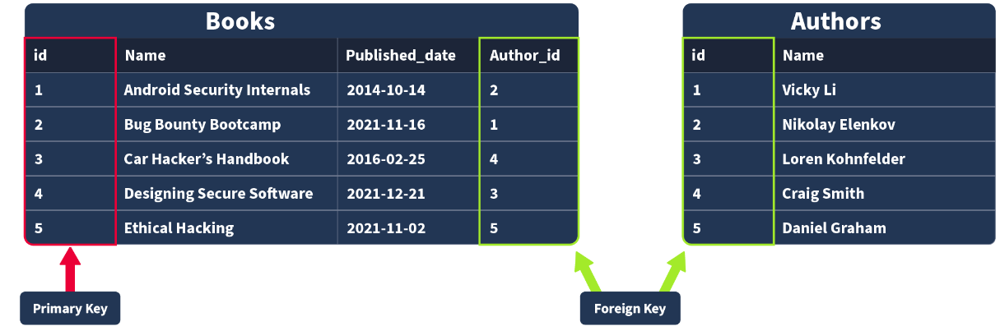

### 非关系型数据库(NoSQL)

非关系型数据库旨在解决大规模数据并发、灵活存储以及分布式架构的需求。
动态/无模式结构 (Schema-less)： 不需要预先定义严格的表结构。同一集合（Collection）内的不同记录可以拥有完全不同的字段组合，对快速迭代的开发非常友好。
多样化的数据模型： 根据应用场景，主要分为四种存储结构：文档型 (Document)： 数据以类似 JSON 或 BSON 的格式存储（如 MongoDB），适合存储复杂的层级数据。
键值对 (Key-Value)： 数据以键值映射形式存在（如 Redis、Memcached），读写速度极快，常用于缓存。
列族 (Column-Family)： 按列而非按行存储数据（如 HBase、Cassandra），适合海量数据的聚合分析。
图数据库 (Graph)： 以节点和边存储数据（如 Neo4j），专门用于处理复杂的网状关系（如社交网络）。
高扩展性与最终一致性： 通常采用分布式架构，极易进行横向扩展（增加服务器节点）。为了追求高可用性和分区容错性（CAP定理），通常牺牲强一致性，采用“最终一致性”模型 (BASE 原则)。定制化查询 API： 没有统一的 SQL 语法标准，每种 NoSQL 数据库都有自己的专属查询语言或 API（例如 MongoDB 使用 JSON 格式构造查询条件）。

常见的数据库软件:MongoDB,Redis,Cassandra

## sql命令和语法

### 注意事项

#### 大小写

SQL 关键字（如 SELECT, select, SeLeCt）不区分大小写。

表名区分大小写（视操作系统而定）：

* Windows 下的 MySQL，表名通常不区分大小写。
* Linux 下的 MySQL，表名默认区分大小写。在未知操作系统时，猜解表名要尽量精准，或者全部转为小写/大写测试。

#### 注释符

标准 SQL 的单行注释是 --，但在 MySQL 中，-- 后面必须紧跟至少一个空格，否则会被当作减号运算而报错。在浏览器 URL 中直接输入空格会被吃掉或解析错误，所以在传参时通常写为 --+（+ 在 URL 编码中代表空格）或者直接使用 URL 编码 --%20。

#也是 MySQL 的单行注释。但在 HTTP GET 请求的 URL 中，# 是前端的锚点符，不会被发送到后端服务器，必须将其 URL 编码为 %23（如 id=1' %23）。。

#### 弱类型与隐式转换 (MySQL 特性)

MySQL 在比较不同类型的数据时，会尝试进行隐式转换。例如 SELECT * FROM users WHERE id = '1abc'，MySQL 会截取开头的数字，将其当作 id = 1 执行。这在某些特定的逻辑绕过题目中是关键考点。

mySQL 中数据类型的完整列表可[在此处](https://dev.mysql.com/doc/refman/8.0/en/data-types.html)找到

### 命令分类

1. DQL (Data Query Language) - 数据查询语言

   核心动作：查。用于从数据库中检索数据。
   代表命令：SELECT。渗透视角：这是渗透测试和 SQL 注入的绝对核心。遇到的大部分注入（联合注入、盲注、报错注入）都发生在这个阶段。攻击者的目标是利用业务自身的 SELECT 语句，顺带查出系统账号密码。
2. DML (Data Manipulation Language) - 数据操作语言
   核心动作：增、删、改。用于修改表中的实际数据。代表命令：INSERT、UPDATE、DELETE。
   渗透视角：通常发生在用户注册、修改个人资料、清空购物车等功能处。这类注入较难直接回显数据，常用于二次注入（把恶意代码存入数据库等管理员触发）、越权（在 UPDATE 语句中闭合并顺带修改其他用户的密码）或报错注入。
3. DDL (Data Definition Language) - 数据定义语言
   核心动作：建、删、改结构。用于定义或修改数据库的逻辑结构（如建库、建表、修改字段属性），而不是操作具体数据。
   代表命令：CREATE、DROP、ALTER。
   渗透视角：在常规 Web 注入中极少用到。只有当攻击者获得了 DBA（数据库管理员）的极高权限，且环境允许执行多条语句（堆叠注入）时，才可能用到它来创建后门表或直接删库。
4. DCL (Data Control Language) - 数据控制语言
   核心动作：控制权限。用于管理数据库用户的访问权限和安全级别。
   代表命令：GRANT（授权）、REVOKE（撤销权限）。
   渗透视角：属于内网渗透或后渗透阶段的操作。当你拿到数据库高权限账号后，可能会用它给自己创建一个隐藏的后门账号。

### sql命令

#### 基础命令

| 命令语法                                         | 用途                                                                     |
| :----------------------------------------------- | ------------------------------------------------------------------------ |
| CREATE DATABASE 库名;                            | 创建数据库                                                               |
| USE 库名;                                        | 切换到指定数据库                                                         |
| CREATE TABLE 表名 (字段1 类型, 字段2 类型,...);  | 创建表                                                                   |
| DESC 表名;`/`DESCRIBE 表名;                    | 查看表的字段结构（字段名、类型、约束）                                   |
| SHOW DATABASES;                                  | 列出所有数据库                                                           |
| SHOW TABLES;                                     | 列出当前库的所有表                                                       |
| SHOW COLUMNS FROM 表名;                          | 列出指定表的所有字段                                                     |
| ALTER TABLE 表名 ADD 字段 类型;                  | 给表新增字段                                                             |
| DROP TABLE 表名;                                 | 删除表                                                                   |
| INSERT INTO 表名 (字段1,字段2) VALUES (值1,值2); | 插入数据                                                                 |
| INSERT IGNORE INTO 表名 ...;                     | 插入数据时忽略唯一键冲突                                                 |
| UPDATE 表名 SET 字段=值 WHERE 条件;              | 更新数据                                                                 |
| DELETE FROM 表名 WHERE 条件;                     | 删除数据                                                                 |
| SELECT 字段1,字段2 FROM 表名;                    | 提取指定字段数据                                                         |
| SELECT * FROM 表名;                              | 提取表中所有字段                                                         |
| SELECT 字段 FROM 表名 LIMIT N;                   | 仅提取前 N 行数据                                                        |
| SELECT 字段 FROM 表名 LIMIT 起始行,N;            | 分页提取数据<br />如 `LIMIT 0,10`取前 10 条，`LIMIT 10,10`取下 10 条 |

#### WHERE

为了筛选出不包含某些结果的数据，我们需要在查询中使用 WHERE 子句。该子句会应用于每一行数据，检查特定列的值，以确定该行数据是否应包含在结果中。

在cms数据库中, cms_user表数据如下:

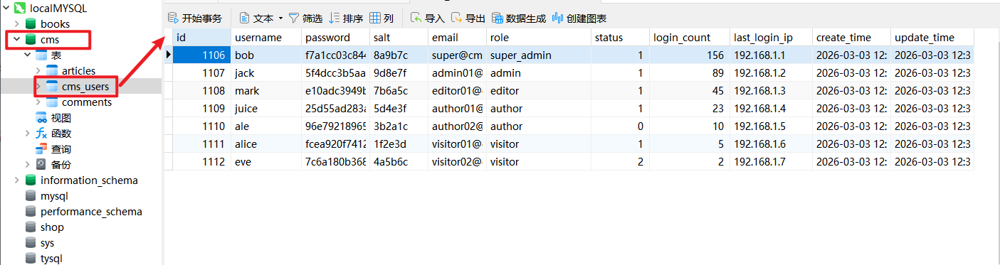

假设我们现在准备登陆这个网站,我们输入用户名bob,后端进行如下的校验,如果存在数据,则继续校验密码,如果没有数据,说明用户不存在:

```sql
mysql> select username from cms_users where username='bob';
+----------+
| username |
+----------+
| bob      |
+----------+
1 row in set (0.01 sec)

mysql> select username from cms_users where username='hack';
Empty set

```

如果可以使用逻 辑运算 构造更复杂的字句,比如查找用户名为 bob ,并且 密码为xxx,并且 规则为super_admin的数据 :

```sql
mysql> SELECT id FROM cms_users WHERE  username="bob" AND `password`='f7a1cc03c84457769946569893f7e368' AND role='super_admin';
+------+
| id   |
+------+
| 1106 |
+------+
1 row in set (0.04 sec)
```

> 记住优先级顺序: NOT AND OR 从高优先级到低优先级

#### 排序结果

使用 [ORDER BY](https://dev.mysql.com/doc/refman/8.0/en/order-by-optimization.html) 并指定要排序的列对任何查询的结果进行排序：

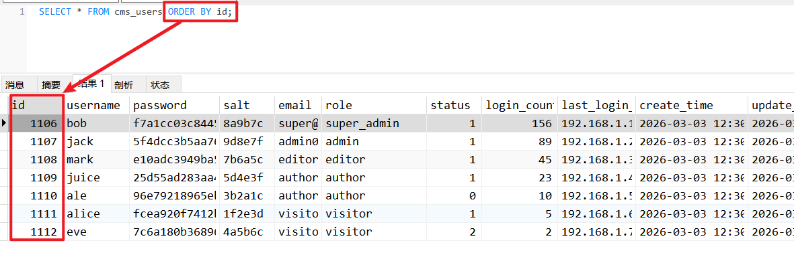

添加关键字**DESC** ,可以按照降序 排列:

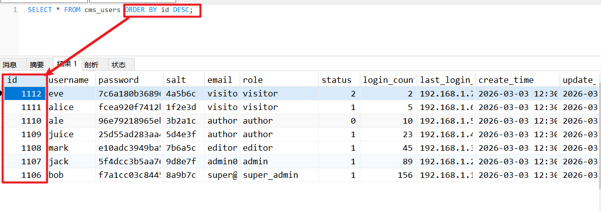

指定多个列进行排序,如下所示:

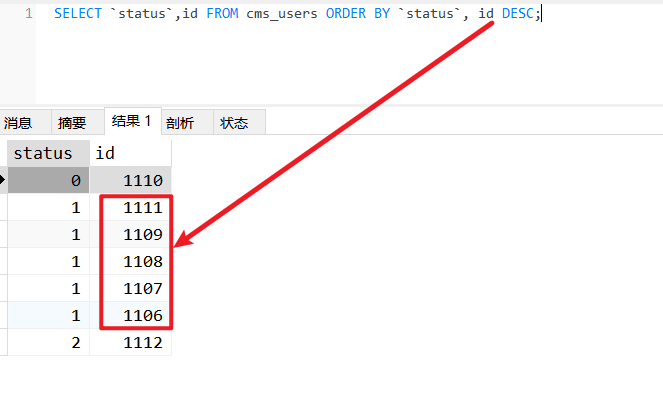

还可以指定列的序号进行排序,当超过查询出的数据的列数时,将会报错,这很关键:

```sql
mysql> SELECT `status`,id FROM cms_users ORDER BY 1, 2 DESC;
+-------+------+
| status | id   |
+-------+------+
|     0 | 1110 |
|     1 | 1111 |
|     1 | 1109 |
|     1 | 1108 |
|     1 | 1107 |
|     1 | 1106 |
|     2 | 1112 |
+-------+------+
7 rows in set (0.03 sec)

mysql> SELECT `status`,id FROM cms_users ORDER BY 1, 2 DESC,3;
1054 - Unknown column '3' in 'order clause'
```

#### **LIKE**

[LIKE](https://dev.mysql.com/doc/refman/8.0/en/pattern-matching.html) ，它允许通过匹配特定模式来选择记录。_ 匹配 1 个字符，% 匹配任意字符（包括 0 个）模式匹配必须用LIKE/NOT LIKE，不能用=/<>，MySQL 默认大小写不敏感

```sql
mysql> SELECT username,role FROM cms_users WHERE username LIKE '%B';
+----------+-------------+
| username | role         |
+----------+-------------+
| bob      | super_admin |
+----------+-------------+
1 row in set (0.04 sec)
```

#### NOT AND OR 运算符

`AND` 运算符接受两个条件并根据其评估返回 `true` 或 `false` ：当且仅当 `condition1` 和 `condition2` 都为 `true` 时， `AND` 运算的结果才为 `true`

`OR` 运算符也接受两个表达式，当其中至少一个表达式的计算结果为 `true` 时，返回 `true`

`NOT` 运算符只是切换 `boolean` 值“即将 `true` 转换为 `false` ，反之亦然”

`AND` 、 `OR` 和 `NOT` 运算符也可以分别表示为 `&&` 、 `||` 和 `!`

#### 多运算符优先级

- 除法 ( `/` )、乘法 ( `*` ) 和模数 ( `%` )
- 加法（ `+` ）和减法（ `-` ）
- 比较（ `=` 、 `>` 、 `<` 、 `<=` 、 `>=` 、 `!=` 、 `LIKE` ）
- NOT (`!`)
- AND (`&&`)
- OR (`||`)

列表顶部的操作先于列表底部的操作

#### 聚合函数

无 GROUP BY 时，作用于整张表；有 GROUP BY 时，作用于每个分组；

| 函数语法                 | 核心用途                                                 |
| ------------------------ | -------------------------------------------------------- |
| `COUNT(*)`             | 统计表 / 分组中的总行数（包含 NULL 值）                  |
| `COUNT(字段名)`        | 统计指定字段非 NULL 值的行数                             |
| `SUM(数值字段)`        | 计算指定数值字段的所有值之和                             |
| `AVG(数值字段)`        | 计算指定数值字段的平均值                                 |
| `MAX(字段名)`          | 获取指定字段的最大值（支持数值、字符串、时间类型）       |
| `MIN(字段名)`          | 获取指定字段的最小值（支持数值、字符串、时间类型）       |
| `GROUP_CONCAT(字段名)` | 将分组内指定字段的所有值拼接成一个字符串（默认以逗号分隔 |

将用户名字段的所有值拼接到成一个字符串

```sql
mysql> SELECT GROUP_CONCAT(username) FROM cms_users ;
+-----------------------------------+
| GROUP_CONCAT(username)            |
+-----------------------------------+
| ale,alice,bob,eve,jack,juice,mark |
+-----------------------------------+
1 row in set (0.04 sec)
```

#### GROUP BY

将指定列中具有相同值的行分组。使用role 字段进行分组后,为如下情况

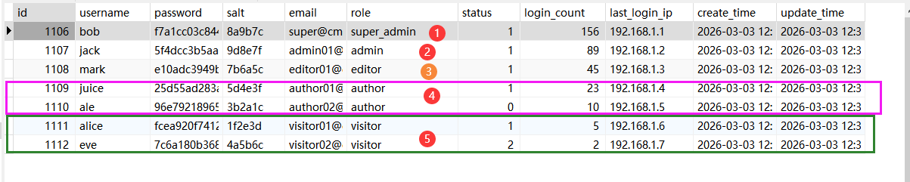

之后使用GROUP_CONCAT 函数将组中指定的字段拼接为一个字符串,如果组中某个字段有多个数据,那么默认为 `,`进行分割

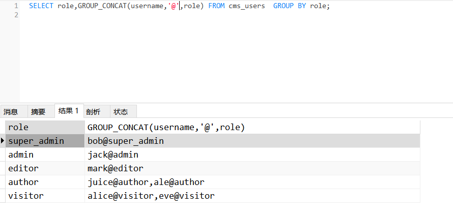

#### HAVING子句

GROUP BY 子句在 WHERE 子句（用于筛选要分组的行）之后执行，HAVING该子句专门与 GROUP BY 子句一起使用，允许我们从结果集中筛选分组行。

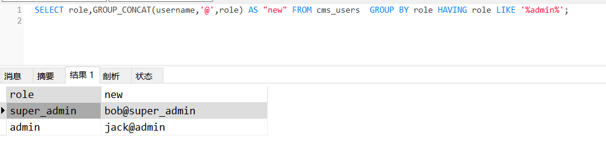

#### CONCAT()函数

将两个或多个字符串相加。它对于合并不同列的文本非常有用。

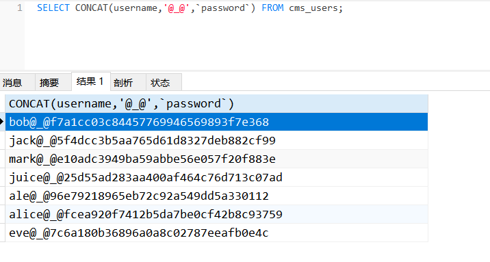

#### SUBSTRING()函数

SUBSTRING(string, position, length)此函数将从查询中的字符串中检索子字符串，从指定位置开始。此子字符串的长度也可以指定。`SUBSTRING(string, position, length) `

SUBSTRING() 函数返回一个子字符串。如果任何参数（string、position 和 length）为 NULL，它将返回 NULL。

```sql
mysql> SELECT username FROM cms_users WHERE SUBSTRING(username,1,1)='a' OR 1=0;
+----------+
| username |
+----------+
| ale      |
| alice     |
+----------+
2 rows in set (0.01 sec)

mysql> SELECT username FROM cms_users WHERE SUBSTRING(username,1,1)='C' OR 1=0;
Empty set

```

#### LENGTH() 函数

函数返回字符串中的字符数。这包括空格和标点符号。`LENGTH(string)`

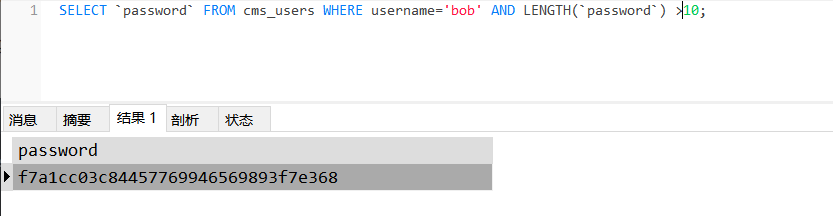

#### UNION组合查询

[查看此教程](https://sqltutorial.cn/sql-union/)

#### 执行顺序

FROM/JOIN → 2. WHERE → 3. GROUP BY → 4. HAVING → 5. SELECT → 6. DISTINCT → 7. ORDER BY → 8. LIMIT

## 重要的系统数据库

在 MySQL 和 PostgreSQL（以及很多其他关系型数据库）中，默认存储所有数据库名、表名和列名的内置数据库叫做：[information_schema](https://dev.mysql.com/doc/refman/8.4/en/information-schema-table-reference.html) 数据库

### [information_schema](https://dev.mysql.com/doc/refman/8.4/en/information-schema-table-reference.html) 数据库

#### 获取数据库名

> information_schema.SCHEMATA表

作用：记录当前数据库管理系统 (DBMS) 中所有的数据库信息。

关键字段：schema_name（数据库名称）。

实战目的：用于查询/爆出当前服务器上存在的所有数据库名称。

```sql
mysql> SELECT SCHEMA_NAME FROM information_schema.SCHEMATA;
+--------------------+
| SCHEMA_NAME        |
+--------------------+
| mysql              |
| information_schema |
| performance_schema |
| sys                |
| shop               |
| tysql              |
| books              |
| cms                |
+--------------------+
8 rows in set (0.03 sec)
```

#### 获取表名

> information_schema.TABLES 表

作用：记录数据库中的所有表信息。

关键字段：

table_schema（该表所属的数据库名称）

table_name（表名称）

实战目的：在确定了目标数据库后，用于查询该数据库下有哪些表（例如寻找名为 users, admin, accounts 的敏感表）。

```sql
mysql> SELECT TABLE_NAME FROM information_schema.`TABLES` WHERE TABLE_SCHEMA='cms';
+--------------+
| TABLE_NAME   |
+--------------+
| articles     |
| cms_users    |
| comments     |
+--------------+
3 rows in set (0.03 sec)
```

#### 获取列名

> information_schema.COLUMNS 表

作用：记录数据库中所有的列（字段）信息。

关键字段：

table_schema（所属数据库名称）

table_name（所属表名称）

column_name（列名称）

column_type（列数据类型）

实战目的：在确定了敏感表之后，用于查询该表中有哪些列（例如寻找 username, password, email 等字段），为最终拉取数据做准备。

```sql
mysql> SELECT COLUMN_NAME ,COLUMN_TYPE FROM information_schema.COLUMNS WHERE TABLE_NAME='cms_users';
+---------------+-------------------------------------------+
| COLUMN_NAME | COLUMN_TYPE                             |
+---------------+-------------------------------------------+
| id            | int unsigned                                |
| username      | varchar(50)                                |
| password     | varchar(100)                               |
| salt           | varchar(32)                                |
| email          | varchar(100)                               |
| role           | enum('super_admin','admin','editor','author','visitor') |
| status         | tinyint                                     |
| login_count    | int unsigned                                |
| last_login_ip    | varchar(16)                                |
| create_time    | datetime                                   |
| update_time    | datetime                                   |
+---------------+-------------------------------------------+
11 rows in set (0.03 sec)

```

### mysql 数据库

#### user表

User 和 Host

作用：组合起来决定了“谁可以从哪里登录”。例如，User='root' 且 Host='localhost' 表示 root 只能在本地登录；如果 Host='%'，则表示允许该账号远程登录。

实战价值：用于收集数据库系统的用户名字典，或者判断是否可以从公网直接用工具（如 Navicat）爆破/直连数据库。

authentication_string (在较老版本如 MySQL 5.6 及以前叫 Password)

作用：存储数据库用户的密码哈希值。数据库不会明文存储密码，而是存储经过加密运算后的 Hash。

实战价值：脱裤的首要目标之一。攻击者通过注入拉取这个哈希值，然后放到本地使用 Hashcat 或 John the Ripper 等工具进行离线暴力破解，从而获取真实的数据库密码。

File_priv

作用：这是一个权限标志位，值为 Y (Yes) 或 N (No)。它决定了该用户是否有权限在服务器操作系统上读取或写入文件。

实战价值：这是判断能否 Getshell 的核心指标。如果查出当前用户的 File_priv 为 Y，意味着你可以使用之前提到的 LOAD_FILE() 读敏感文件，或者用 INTO OUTFILE 直接写入一句话木马。

Super_priv

作用：超级管理员权限标志（Y 或 N），决定用户能否执行高级管理命令。


```sql
mysql> select User,Host ,File_priv,Super_priv FROM mysql.user;
+-----------------+----------+---------+--------------+
| User            | Host     | File_priv | Super_priv |
+-----------------+----------+---------+--------------+
| bookrama        | %       | N          | N          |
| bookrama        | localhost | N        | N          |
| mysql.infoschema | localhost | N       | N          |
| mysql.session    | localhost | N       | Y          |
| mysql.sys       | localhost | N        | N          |
| root            | localhost | Y        | Y          |
+-----------------+----------+---------+--------------+
6 rows in set (0.03 sec)
```


## 动手实践

##### 登陆mysql

```sql
 mysql -u root -p #使用 root 账户（MySQL 最高权限账户）发起登录请求，并以 “交互式输入密码” 的方式验证身份，最终进入 MySQL 的命令行交互界面
```

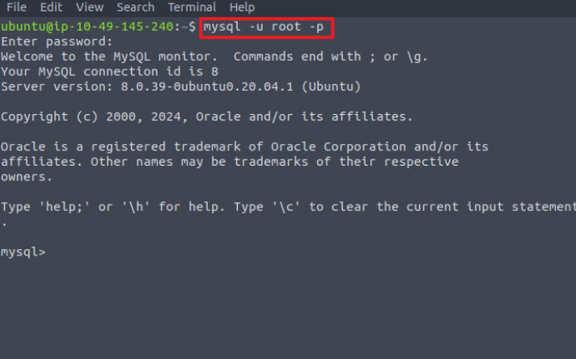

##### 显示已有数据库

```sql
mysql> SHOW DATABASES;
+-----------------------------------------------+
| Database                                      |
+-----------------------------------------------+
| information_schema                            |
| mysql                                         |
| performance_schema                            |
| sys                                           |
| tools_db                                      |
+-----------------------------------------------+
5 rows in set (0.01 sec)
```

##### 创建数据库

```sql
mysql> create database try;
Query OK, 1 row affected (0.01 sec)

mysql> SHOW DATABASES;
+-----------------------------------------------+
| Database                                      |
+-----------------------------------------------+
| information_schema                            |
| mysql                                         |
| performance_schema                            |
| sys                                           |
| tools_db                                      |
| try                                           |
+-----------------------------------------------+
6 rows in set (0.01 sec)

```

##### 使用数据库

```sql
mysql> USE try;
Database changed
mysql> 
```

删除数据库

```sql
mysql> DROP database try;
Query OK, 0 rows affected (0.01 sec)
```

##### 创建表

```sql
mysql> CREATE TABLE example (
    -> id INT AUTO_INCREMENT PRIMARY KEY,
    -> name VARCHAR(255) NOT NULL,
    -> date DATE
    -> );
Query OK, 0 rows affected (0.04 sec)

```

##### 显示所有表(当前数据库)

```sql
mysql> SHOW TABLES;
+---------------+
| Tables_in_try |
+---------------+
| example       |
+---------------+
1 row in set (0.01 sec)

```

##### 查看表的详细结构

```sql
mysql> DESCRIBE example;
+-------+--------------+------+-----+---------+----------------+
| Field | Type         | Null | Key | Default | Extra          |
+-------+--------------+------+-----+---------+----------------+
| id    | int          | NO   | PRI | NULL    | auto_increment |
| name  | varchar(255) | NO   |     | NULL    |                |
| date  | date         | YES  |     | NULL    |                |
+-------+--------------+------+-----+---------+----------------+
3 rows in set (0.00 sec)

mysql> DESC try.example;
+-------+--------------+------+-----+---------+----------------+
| Field | Type         | Null | Key | Default | Extra          |
+-------+--------------+------+-----+---------+----------------+
| id    | int          | NO   | PRI | NULL    | auto_increment |
| name  | varchar(255) | NO   |     | NULL    |                |
| date  | date         | YES  |     | NULL    |                |
+-------+--------------+------+-----+---------+----------------+
3 rows in set (0.00 sec)

mysql> DESC try.example id;
+-------+------+------+-----+---------+----------------+
| Field | Type | Null | Key | Default | Extra          |
+-------+------+------+-----+---------+----------------+
| id    | int  | NO   | PRI | NULL    | auto_increment |
+-------+------+------+-----+---------+----------------+
1 row in set (0.00 sec)


```

##### 修改表

```sql
mysql> ALTER TABLE example ADD count INT;
Query OK, 0 rows affected (0.04 sec)
Records: 0  Duplicates: 0  Warnings: 0

mysql> DESC try.example;
+-------+--------------+------+-----+---------+----------------+
| Field | Type         | Null | Key | Default | Extra          |
+-------+--------------+------+-----+---------+----------------+
| id    | int          | NO   | PRI | NULL    | auto_increment |
| name  | varchar(255) | NO   |     | NULL    |                |
| date  | date         | YES  |     | NULL    |                |
| count | int          | YES  |     | NULL    |                |
+-------+--------------+------+-----+---------+----------------+
4 rows in set (0.00 sec)


```

##### 删除表

```sql

mysql> DROP TABLE example;
Query OK, 0 rows affected (0.03 sec)

mysql> SHOW TABLES;
Empty set (0.00 sec)

```

##### 数据的增删改查(CURD)

* 插入数据

  ```sql
  mysql> INSERT INTO example (id,name,date,description) VALUE (1,"LearnSQL",
      -> "2000-1-1", "good good study" );
  Query OK, 1 row affected (0.00 sec)

  mysql> SELECT * FROM examples;
  ERROR 1146 (42S02): Table 'try.examples' doesn't exist
  mysql> SELECT * FROM example;
  +----+----------+------------+-----------------+
  | id | name     | date       | description     |
  +----+----------+------------+-----------------+
  |  1 | LearnSQL | 2000-01-01 | good good study |
  +----+----------+------------+-----------------+
  1 row in set (0.00 sec)

  ```
* 读取数据

  ```sql
  mysql> SELECT * FROM example;
  +----+----------+------------+-----------------+
  | id | name     | date       | description     |
  +----+----------+------------+-----------------+
  |  1 | LearnSQL | 2000-01-01 | good good study |
  |  2 | bbq      | 2000-01-01 | day day up      |
  +----+----------+------------+-----------------+
  2 rows in set (0.00 sec)

  mysql> select id from example;
  +----+
  | id |
  +----+
  |  1 |
  |  2 |
  +----+
  2 rows in set (0.00 sec)

  ```
* 更新数据
* 删除数据

### 非关系型数据库(NoSQL)

非关系型数据库旨在解决大规模数据并发、灵活存储以及分布式架构的需求。
动态/无模式结构 (Schema-less)： 不需要预先定义严格的表结构。同一集合（Collection）内的不同记录可以拥有完全不同的字段组合，对快速迭代的开发非常友好。
多样化的数据模型： 根据应用场景，主要分为四种存储结构：文档型 (Document)： 数据以类似 JSON 或 BSON 的格式存储（如 MongoDB），适合存储复杂的层级数据。
键值对 (Key-Value)： 数据以键值映射形式存在（如 Redis、Memcached），读写速度极快，常用于缓存。
列族 (Column-Family)： 按列而非按行存储数据（如 HBase、Cassandra），适合海量数据的聚合分析。
图数据库 (Graph)： 以节点和边存储数据（如 Neo4j），专门用于处理复杂的网状关系（如社交网络）。
高扩展性与最终一致性： 通常采用分布式架构，极易进行横向扩展（增加服务器节点）。为了追求高可用性和分区容错性（CAP定理），通常牺牲强一致性，采用“最终一致性”模型 (BASE 原则)。定制化查询 API： 没有统一的 SQL 语法标准，每种 NoSQL 数据库都有自己的专属查询语言或 API（例如 MongoDB 使用 JSON 格式构造查询条件）。

常见的数据库软件:MongoDB,Redis,Cassandra
