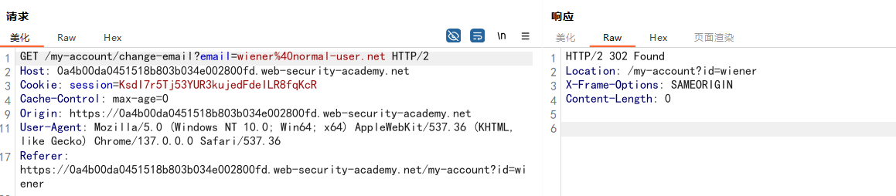

# 一、什么是CSRF？

**跨站请求伪造**（Cross-site request forgery ）是一种利用“信任”的攻击手段。攻击者通过伪造一个合法的请求，诱导**已登录**的用户在不知情的情况下点击，利用用户的浏览器自动携带 **Cookie** 的特性，冒充用户向服务器发送指令。服务器误以为这是用户本人的操作，从而执行了非用户意愿的操作（如：转账、改密码、发邮件）。

要使 CSRF 攻击成为可能，必须满足三个关键条件：

1. **存在有价值的操作** 

   这可能是特权操作（例如修改其他用户的权限），也可能是对用户特定数据的任何操作（例如更改用户自己的密码）

2.  **纯 Cookie 会话管理**
   执行操作涉及发出一个或多个 HTTP 请求，应用程序仅依赖会话 Cookie 来识别发出请求的用户。没有其他机制来跟踪会话或验证用户请求。

3. **没有不可预测的参数**
   行操作的请求不包含任何攻击者无法确定或猜测其值的参数。例如，当攻击者需要知道现有密码的值才能使用户更改密码时，该功能不存在安全漏洞。

例如，假设一个应用程序包含一个允许用户更改其帐户电子邮件地址的功能。当用户执行此操作时，他们会发出如下所示的 HTTP 请求：

```http
POST /email/change HTTP/1.1
Host: vulnerable-website.com
Content-Type: application/x-www-form-urlencoded
Content-Length: 30
Cookie: session=yvthwsztyeQkAPzeQ5gHgTvlyxHfsAfE

email=wiener@normal-user.com
```

这符合 CSRF 的必要条件：

- 攻击者会关注用户账户电子邮件地址的更改行为。在此操作之后，攻击者通常能够触发密码重置，并完全控制用户的账户。
- 该应用程序使用会话 cookie 来识别发出请求的用户。没有其他令牌或机制来跟踪用户会话。
- 攻击者可以很容易地确定执行该操作所需的请求参数值。

在这些条件下，攻击者可以构建一个包含以下 HTML 代码的网页：

```html
<html>
    <body>
        <form action="https://vulnerable-website.com/email/change" method="POST">
            <input type="hidden" name="email" value="pwned@evil-user.net" />
        </form>
        <script>
            document.forms[0].submit();
        </script>
    </body>
</html>
```

如果受害用户访问攻击者的网页，将会发生以下情况：

1. 攻击者的页面将触发向存在漏洞的网站发出 HTTP 请求。
2. 如果用户已登录到存在漏洞的网站，则其浏览器会自动将会话 cookie 包含在请求中（假设未使用 [SameSite cookie](https://portswigger.net/web-security/csrf#common-defences-against-csrf) ）。
3. 存在漏洞的网站会按正常方式处理请求，将其视为受害用户发出的请求，并更改其电子邮件地址。

> [!NOTE]
>
> **CSRF 的本质不是“Cookie 漏洞”，而是“浏览器自动填充凭证”的机制问题**，除了我们常说的 Cookie，以下两种自动认证方式也会触发 CSRF：
> HTTP 基本认证 (HTTP Basic Authentication)
> 基于证书的认证 (Certificate-based Authentication)

# 二、实施 CSRF 攻击

跨站请求伪造攻击的传播机制与反射型跨站脚本攻击（XSS）基本相同。通常，攻击者会将恶意 HTML 代码植入他们控制的网站上，然后诱使受害者访问该网站。这可以通过向用户提供网站链接、电子邮件或社交媒体消息来实现。或者，如果攻击代码被植入到热门网站（例如，用户评论中），攻击者可能只需等待用户访问该网站即可。

请注意，一些简单的 CSRF 攻击利用了 GET 方法，并且仅需易受攻击网站上的单个 URL 即可完成。在这种情况下，攻击者可能无需借助外部网站，即可直接向受害者提供易受攻击域上的恶意 URL。在前面的示例中，如果更改电子邮件地址的请求可以使用 GET 方法执行，那么一个独立的攻击可能如下所示：

```html

```

还可以利用的标签有：

```html
<script src="https://social-media.com"></script>
<link rel="stylesheet" href="https://example.com">
<iframe src="https://vulnerable-website.com" style="display:none;"></iframe>
<video src="https://example.com"></video>
//css
.hidden-trigger {
    background-image: url("https://example.com");
}
```

> [!NOTE]
>
> 虽然上述标签在历史上非常有效，但现在它们面临一个巨大的障碍：cookie的**SameSite 属性**。
>
> - **SameSite=Strict**：这些标签发起的跨站请求**完全不带** Cookie。
> - **SameSite=Lax (现代浏览器默认值)**：
>   - ``、`<iframe>`、`<script>` 等发起的 **GET 请求不会携带 Cookie**。
>   - **只有**当用户进行了“顶级导航”（比如直接点击 `<a>` 链接，或者通过 `window.location` 跳转）时，才会携带 Cookie。
>

# 三、XSS 与 CSRF

[跨站脚本攻击 ](https://portswigger.net/web-security/cross-site-scripting)（或 XSS）允许攻击者在受害者用户的浏览器中执行任意 JavaScript 代码。

[跨站请求伪造 ](https://portswigger.net/web-security/csrf)（或 CSRF）允许攻击者诱使受害用户执行他们不想执行的操作。

XSS 漏洞的后果通常比 CSRF 漏洞的后果更严重：

1. CSRF 攻击通常仅适用于用户可执行操作的一部分。许多应用程序虽然普遍实现了 CSRF 防御，但却忽略了一两个仍然暴露的操作。相反，成功的 XSS 攻击通常可以诱使用户执行其可执行的任何操作，而无论漏洞存在于哪个功能中。
2. CSRF 可以被描述为一种“单向”漏洞，因为攻击者虽然可以诱使受害者发出 HTTP 请求，但却无法获取该请求的响应。相反，XSS 是“双向”漏洞，因为攻击者注入的脚本可以发出任意请求，读取响应，并将数据泄露到攻击者选择的外部域。

某些 XSS 攻击确实可以通过有效使用 CSRF 令牌来预防。考虑一个简单的反射型 XSS 漏洞，该漏洞很容易被利用，如下所示：

```http
https://insecure-website.com/status?message=<script>/*+Bad+stuff+here...+*/</script>
```

现在，假设存在漏洞的函数包含一个 CSRF 令牌：

```http
https://insecure-website.com/status?csrf-token=CIwNZNlR4XbisJF39I8yWnWX9wX4WFoz&message=<script>/*+Bad+stuff+here...+*/</script>
```

假设服务器能够严格校验 CSRF Token，并直接拒绝掉所有不含有效令牌的请求，那么这种机制在客观上确实能阻断 XSS 漏洞的利用。这一点可以从‘跨站脚本攻击’的名字中窥见端倪：至少对于**反射型 XSS** 而言，其攻击链路必须依赖于一个跨站请求的触发。只要应用程序能够让攻击者无法伪造这种跨站请求，也就顺带封死了那些‘低成本’利用 XSS 漏洞的路径。

这里需要注意一些重要事项：

1.  只要网站的其他任何未受 Token 保护的功能点（如搜索框、公共页面）存在反射型 XSS，攻击者就能以常规手段触发漏洞。
2. 只要网站上存在任何可被利用的 XSS 漏洞，攻击者就能以此为跳板，强行突破受 CSRF Token 保护的功能。由于攻击脚本此时运行在‘同源’环境下，它可以先静默请求目标页面来抓取有效的 Token，随后再利用该 Token 伪造并执行那些受保护的敏感操作。
3. CSRF Token 对存储型 XSS 毫无防范作用。如果一个受 Token 保护的页面本身就是存储型 XSS 的触发点，那么恶意载荷将如常执行——一旦用户访问该页面，攻击代码就会立即触发。

# 四、针对 CSRF 的常见防御措施

如今，成功发现并利用 CSRF 漏洞通常需要绕过目标网站、受害者浏览器或两者部署的反 CSRF 措施。您最常遇到的防御措施如下

## 1. CSRF令牌

**CSRF 令牌** ——CSRF 令牌是由服务器端应用程序生成并与客户端共享的唯一、秘密且不可预测的值。当尝试执行敏感操作（例如提交表单）时，客户端必须在请求中包含正确的 CSRF 令牌。这使得攻击者很难以受害者的名义构造有效的请求。

后端通常有两种主要的验证方式：

### 1.1 同步令牌模式 (Synchronizer Token Pattern)

 同步令牌模式 ，后端会将 Token 存储在服务器的 **Session** 中。验证步骤：

1. **取出本地令牌**：服务器从当前用户的 Session 中取出之前生成的 Token。
2. **提取请求令牌**：从用户提交的 POST 表单数据中提取隐藏参数（例如 `_csrf`）。
3. **严格比对**：
   - **一致**：验证通过，执行操作。
   - **不一致或缺失**：验证失败，拒绝操作。
4. **销毁与更新**：为了更高的安全性，操作完成后通常会销毁旧 Token，生成新 Token。

### 1.2  双重提交 Cookie 模式 (Double Submit Cookie)

后端**不需要**在服务器存储 Token，实现更轻量。

验证步骤：

1. **提取双端数据**：后端同时读取请求中的 **Cookie** 和 **表单参数**。
2. **直接比对**：后端不查数据库，也不查 Session，仅仅看这两者的字符串是否完全一致。
3. **逻辑假设**：如果请求是黑客伪造的，黑客虽然能让浏览器带上真实的 Cookie，但他无法得知 Cookie 里的具体值，所以他没法在表单参数里填入一个一模一样的值。

## 2. SameSite cookies

SameSite 是一种浏览器安全机制，用于确定何时将网站的 Cookie 包含在来自其他网站的请求中。由于执行敏感操作的请求通常需要经过身份验证的会话 Cookie，因此适当的 SameSite 限制可以防止攻击者跨站点触发这些操作。自 2021 年起，Chrome 默认强制 `Lax` SameSite 限制。

你可以通过设置 `Set-Cookie` 响应头来控制这个属性：

1. `SameSite=Strict`**（最严格）**
   只要是“跨站”请求，浏览器**绝对不带** Cookie。
2. `SameSite=Lax`**（现代浏览器默认值）**
   大多数跨站请求不带 Cookie，但**顶级导航（Top-level Navigation）的 GET 请求**除外。能防御绝大多数基于 POST 的 CSRF漏洞。
3. `SameSite=None`**（不限制）**
   彻底关掉了浏览器对 Cookie 的跨站限制，使该 Cookie 回到了最易受 CSRF 攻击的原始状态。它本身不提供任何针对跨站伪造的保护，必须完全依赖 CSRF Token 或其他应用层手段来兜底。

> [!WARNING]
>
> 尽管正确配置的 SameSite 属性能够为防范跨站攻击（Cross-Site Attacks）提供良好的保护，但必须明确指出，该机制对于“跨源且同站”（Cross-Origin, Same-Site）的攻击完全无效。

出现此安全盲区的原因在于 Cookie 属性的校验维度存在差异：

- **`Domain` 属性的作用域局限**：Cookie 的 `Domain` 属性仅用于限定 Cookie 发送的**目标接收方**（即请求到达的目的地），而无法对发起请求的**来源**进行验证。只要请求的目的地与指定的 Domain 匹配，判定即刻通过。
- **`SameSite` 属性的校验粒度**：`SameSite` 策略的校验级别仅停留在“站（Site，即顶级域名加二级域名，eTLD+1）”，并不区分包含具体子域名的“源（Origin）”。

基于上述机制，当同站内的不同子域名（例如 `blog.example.com` 向 `app.example.com`）发起请求时，由于它们属于跨源但同站（Cross-Origin, Same-Site），`SameSite` 校验会判定为合法同站请求。同时，因请求目标正是 `app.example.com`，符合该域名 Cookie 的 `Domain` 限制。最终，浏览器会自动且合法地携带 Cookie。

## 3. Referer验证

一些应用程序利用 HTTP Referer 标头来尝试防御 CSRF 攻击，通常是通过验证请求是否来自应用程序自身的域名。这种方法通常不如 CSRF 令牌验证有效。


# 五、攻击绕过

## 1.  绕过 CSRF 令牌验证

CSRF 令牌是由服务器端应用程序生成并与客户端共享的唯一、秘密且不可预测的值。当客户端发出执行敏感操作（例如提交表单）的请求时，必须包含正确的 CSRF 令牌。否则，服务器将拒绝执行请求的操作。将 CSRF 令牌共享给客户端的一种常见方法是将其作为隐藏参数包含在 HTML 表单中，例如：

```html
<form name="change-email-form" action="/my-account/change-email" method="POST">
    <label>Email</label>
    <input required type="email" name="email" value="example@normal-website.com">
    <input required type="hidden" name="csrf" value="50FaWgdOhi9M9wyna8taR1k3ODOR8d6u">
    <button class='button' type='submit'> Update email </button>
</form>
```

提交此表单后，将产生以下请求：

```http
POST /my-account/change-email HTTP/1.1
Host: normal-website.com
Content-Length: 70
Content-Type: application/x-www-form-urlencoded

csrf=50FaWgdOhi9M9wyna8taR1k3ODOR8d6u&email=example@normal-website.com
```

正确实施 CSRF 令牌有助于防御 CSRF 攻击，因为它会使攻击者难以代表受害者构造有效的请求。由于攻击者无法预测 CSRF 令牌的正确值，因此他们无法将其包含在恶意请求中。

> [!NOTE]
>
> CSRF 令牌不一定必须 作为隐藏参数在 `POST` 请求中发送。例如，有些应用程序会将 CSRF 令牌放在 HTTP 标头中。令牌的传输方式对整个机制的安全性有着显著的影响。更多信息，请参阅 [“如何防止 CSRF 漏洞”](https://portswigger.net/web-security/csrf/preventing) 。

CSRF 漏洞通常是由于 CSRF 令牌验证存在缺陷而导致的。本节将介绍一些最常见的、攻击者可以利用的绕过这些防御措施的方法。

### 1.1 通过修改请求方法绕过

有些应用程序在使用 POST 方法请求时会正确验证令牌，但使用 GET 方法时会跳过验证。在这种情况下，攻击者可以切换到 GET 方法来绕过验证，从而发起 CSRF 攻击：

```http
GET /email/change?email=pwned@evil-user.net HTTP/1.1
Host: vulnerable-website.com
Cookie: session=2yQIDcpia41WrATfjPqvm9tOkDvkMvLm
```

该实验室的电子邮件更改功能存在 CSRF 漏洞。它试图阻止 CSRF 攻击，但仅对特定类型的请求应用防御措施。

当我们修改自己的邮箱时可以看到如下的请求：

```http
POST /my-account/change-email HTTP/2
Host: 0a4b00da0451518b803b034e002800fd.web-security-academy.net
Cookie: session=KsdI7r5Tj53YUR3kujedFdeILR8fqKcR
Content-Length: 68
Content-Type: application/x-www-form-urlencoded

email=wiener%40normal-user.net&csrf=NTaEtXR8twwUyu8yBEsyk5DthuElY7e5
```

他包含一个`csrf`参数，如果删除这个参数，将返回 错误，当修改请求的方法，并删除`csrf`参数时，服务器正确返回：




### 1.2 移除csrf令牌

有些应用程序在令牌存在时会正确验证令牌，但如果缺少令牌则会跳过验证。在这种情况下，攻击者可以移除包含令牌的整个参数（而不仅仅是其值），从而绕过验证并发起 CSRF 攻击：

```http
POST /email/change HTTP/1.1
Host: vulnerable-website.com
Content-Type: application/x-www-form-urlencoded
Content-Length: 25
Cookie: session=2yQIDcpia41WrATfjPqvm9tOkDvkMvLm

email=pwned@evil-user.net
```


### 1.3 CSRF令牌与会话无关

某些应用程序不会验证令牌是否与发出请求的用户属于同一会话。相反，这些应用程序维护一个全局令牌池，其中包含其颁发的所有令牌，并接受池中出现的任何令牌。
在这种情况下，攻击者可以使用自己的帐户登录应用程序，获取有效令牌，然后将该令牌提供给受害用户进行 CSRF 攻击。’


### 1.4 CSRF 令牌与非会话 cookie 相关联

与前述漏洞类似，某些应用程序会将 CSRF 令牌绑定到 cookie，但绑定的 cookie 并非用于跟踪会话的同一个 cookie。当应用程序使用两个不同的框架（一个用于会话处理，一个用于 CSRF 防护，而这两个框架并未集成）时，这种情况很容易发生：

```http
POST /email/change HTTP/1.1
Host: vulnerable-website.com
Content-Type: application/x-www-form-urlencoded
Content-Length: 68
Cookie: session=pSJYSScWKpmC60LpFOAHKixuFuM4uXWF; csrfKey=rZHCnSzEp8dbI6atzagGoSYyqJqTz5dv

csrf=RhV7yQDO0xcq9gLEah2WVbmuFqyOq7tY&email=wiener@normal-user.com
```

这种情况的漏洞利用门槛较高，但系统依然存在脆弱性。如果目标网站存在任何允许攻击者在受害者浏览器中写入 Cookie 的行为或机制，攻击即可实施。攻击者可以使用自己的账号登录应用，获取一个有效的 CSRF Token 及其关联的 Cookie；随后，利用上述允许写入 Cookie 的机制，将攻击者自身的 Cookie 植入受害者的浏览器中；最后，在构建的 CSRF 攻击载荷中，将攻击者的 Token 传递给受害者进行提交。

> [!NOTE]
>
> 设置 Cookie 的行为甚至不需要与 CSRF 漏洞存在于同一个 Web 应用程序中。只要受控的 Cookie 具有合适的作用范围（Scope），同一 DNS 根域名下的任何其他应用程序都可能被利用，从而在目标应用程序中设置 Cookie。例如，利用 `staging.demo.normal-website.com` 上的设置 Cookie 功能，可以植入一个会被提交给 `secure.normal-website.com` 的 Cookie。


### 1.5 双重提交漏洞

在上述漏洞的另一种变体中，部分应用**不会在服务端保存已签发令牌的任何记录**，而是将同一个令牌同时放在 Cookie 和请求参数中。在验证后续请求时，应用仅检查请求参数里提交的令牌与 Cookie 中的值是否一致。 这种机制有时被称为抵御 CSRF 的**“双重提交”**防御方案，它之所以被推崇，是因为实现简单，且无需在服务端维护任何状态。

```http
POST /email/change HTTP/1.1
Host: vulnerable-website.com
Content-Type: application/x-www-form-urlencoded
Content-Length: 68
Cookie: session=1DQGdzYbOJQzLP7460tfyiv3do7MjyPw; csrf=R8ov2YBfTYmzFyjit8o2hKBuoIjXXVpa

csrf=R8ov2YBfTYmzFyjit8o2hKBuoIjXXVpa&email=wiener@normal-user.com
```

在这种情况下，如果网站存在任何设置Cookie的功能，攻击者**仍然可以发起CSRF攻击**。 此时，攻击者**无需获取自己的有效令牌**。他们只需**伪造一个令牌**（如果系统有格式校验，就构造符合格式的令牌），利用设置Cookie的行为将自己的Cookie植入受害者浏览器，并在CSRF攻击中将该令牌提交给受害者使用。


## 2. 绕过SameSite Cookie的限制

SameSite 是一种浏览器安全机制，用于检测网站 cookie 是否包含在来自其他网站的请求中。SameSite cookie 限制可部分抵御各种跨站攻击，包括 CSRF 攻击、跨站泄露和某些 CORS 漏洞利用。

自 2021 年起，如果发出 cookie 的网站未明确设置自身的限制级别，Chrome 默认会应用 `Lax` SameSite 限制。这是一项提议标准，我们预计其他主流浏览器未来也会采用这种做法。因此，为了全面测试跨站攻击途径，必须深入了解这些限制的工作原理以及可能的绕过方法。

### 2.1 回顾cookie的 SameSite

在 SameSite Cookie 限制的背景下，site 被定义为顶级域名 (TLD)，通常类似于 `.com` 或 `.net` ，再加上一个额外的域名级别。这通常被称为 TLD+1。

在判断请求是否属于同站请求时，URL 方案也会被考虑在内。这意味着大多数浏览器会将从 `http://app.example.com` 到 `https://app.example.com` 的链接视为跨站请求。


> [!NOTE]
>
> 你可能会遇到“有效顶级域名”（eTLD）这个术语。这只是用来描述那些在实践中被视为顶级域名的保留多部分后缀的一种方式，例如 `.co.uk` 。

> [!IMPORTANT]
>
> origin 的概念在前置知识 已经介绍过了，这里不反复说明

攻击者利用在脆弱子域（同站跨源）上的 XSS 执行权限，通过 Fetch 或 XHR 构造并主动发起指向核心业务域的请求。由于同站的缘故，浏览器会自动携带受害者的 SameSite Cookie，从而实质上绕过了基于 SameSite 属性的身份防御边界。

需要注意的是，尽管攻击者能通过上述方式**发送**请求并触发状态改变（例如执行转账），但由于这两个子域属于**跨源（Cross-Origin）**，浏览器的同源策略（SOP）依然生效。这意味着：

- 攻击者的 JS 可以成功**发送**请求并带上 SameSite Cookie。
- 但除非目标服务器配置了极其宽松的 CORS 策略，否则攻击者的 JS **无法读取**该请求的响应内容。

在 SameSite 机制引入之前，无论请求是否由毫无关联的第三方网站触发，浏览器都会在向颁发 Cookie 的域名发起的所有请求中自动携带该 Cookie。SameSite 机制的核心在于，它允许浏览器和网站所有者对跨站请求中是否允许携带特定的 Cookie 做出严格限制。这一机制能够有效降低用户遭受跨站请求伪造（CSRF）攻击的风险。此类攻击的原理是诱导受害者的浏览器发起请求，进而对存在漏洞的目标网站触发破坏性操作。由于这些执行特权操作的请求通常必须携带受害者已认证会话的 Cookie，一旦浏览器拒绝发送该 Cookie，攻击就会失败。

目前所有主流浏览器均支持以下 SameSite 限制级别：

- [`Strict`](https://portswigger.net/web-security/csrf/bypassing-samesite-restrictions#strict)
- [`Lax`](https://portswigger.net/web-security/csrf/bypassing-samesite-restrictions#lax)
- [`None`](https://portswigger.net/web-security/csrf/bypassing-samesite-restrictions#none)

开发者可以手动配置每个 Cookie 的限制级别，从而更好地控制这些 Cookie 的使用时机。为此，他们只需在 `Set-Cookie` 响应标头中包含 `SameSite` 属性及其首选值即可：

```http
Set-Cookie: session=0F8tgdOhi9ynR1M9wa3ODa; SameSite=Strict
```

> [!NOTE]
>
> 如果发出 cookie 的网站没有显式设置 `SameSite` 属性，Chrome 默认会自动应用 `Lax` 限制。这意味着 cookie 只会在符合特定条件的跨站请求中发送，即使开发者从未配置过此行为。

#### Strict 

如果设置的 cookie 属性值为 `SameSite=Strict` ，浏览器将不会在任何跨站请求中发送该 cookie。简单来说，这意味着如果请求的目标站点与浏览器地址栏中当前显示的网站不匹配，则不会包含该 cookie。

 建议在设置**允许持有者修改数据或执行其他敏感操作**的 Cookie 时使用该方式，例如访问仅对已认证用户开放的特定页面。 尽管这是最安全的方案，但在需要**跨站功能**的场景下，可能会对用户体验产生不利影响。

#### Lax

`Lax` 限制意味着浏览器会在跨站点请求中发送 cookie，但前提是必须满足以下两个条件：

1. 该请求使用 `GET` 方法。
2. 该请求是由用户进行顶级导航操作（例如点击链接）引起的。

这意味着 cookie 不会包含在跨站 `POST` 请求中。由于 `POST` 请求通常用于执行修改数据或状态的操作（至少根据最佳实践），因此它们更容易成为 CSRF 攻击的目标。

同样，cookie 也不会包含在后台请求中，例如脚本、iframe 或对图像和其他资源的引用所引发的请求。

#### None

如果某个 Cookie 在设置时使用了 `SameSite=None` 属性，无论在哪种浏览器中，这都将**完全禁用 SameSite 限制**。 因此，浏览器会在**所有**向签发该 Cookie 的站点发起的请求中携带它，即便是由完全无关的第三方站点触发的请求也不例外。

当设置 cookie 时，如果 `SameSite=None` ，网站还必须包含 `Secure` 属性，以确保 cookie 仅通过 HTTPS 加密传输。否则，浏览器将拒绝该 cookie，并且不会设置该 cookie。


### 2.2  使用 GET 请求绕过 SameSite Lax 限制

实际上，服务器并非总是严格区分接收到的是 `GET` 请求还是 `POST` 请求，即使是那些预期会收到表单提交的服务器也是如此。如果服务器对会话 cookie 使用了 `Lax` 限制（无论是显式设置还是浏览器默认设置），你仍然可以通过诱使受害者浏览器发送 `GET` 请求来发起 CSRF 攻击。

只要请求涉及顶级导航，浏览器仍然会包含受害者的会话 cookie。以下是发起此类攻击的最简单方法之一：

```js
<script>     
document.location = 'https://vulnerable-website.com/account/transfer-payment?、recipient=hacker&amount=1000000'; 
</script>
```

即使普通的 GET 请求不被允许，某些框架也提供了**覆盖请求行中指定方法**的方式。例如，Symfony 框架支持在表单中使用 `_method` 参数，在路由处理时，该参数的优先级会高于普通的请求方法：

```html
<form action="https://vulnerable-website.com/account/transfer-payment" method="POST">
    <input type="hidden" name="_method" value="GET">
    <input type="hidden" name="recipient" value="hacker">
    <input type="hidden" name="amount" value="1000000">
</form>
```

> [!NOTE]
>
> 现代 Web 开发遵循 REST 架构，通常需要用到 `PUT`（更新数据）、`DELETE`（删除数据）和 `PATCH`（部分更新）
> 你想删掉一个用户（应该用 `DELETE`），但你的 HTML 表单只能写 `method="POST"`。为了解决这个矛盾，Symfony（以及 Laravel 等很多框架）允许你在 POST 表单里塞进一个特殊的参数。
> 接收到请求后，会检查是否存在 `_method` 参数，例如，如果发现了 `value="DELETE"`，Symfony 的路由系统会**忽略**原始的 POST 方法，直接把这个请求当作 **DELETE** 来处理。


### 2.3 利用站内机制绕过 SameSite 限制

当 Cookie 配置了 `SameSite=Strict` 属性时，浏览器将严格禁止在任何跨站请求中携带该 Cookie。然而，如果在目标站点内部能够找到触发“同站二次请求”的利用机制（Gadget），则有可能绕过此项防御限制。

一种典型的利用机制是**客户端重定向**（Client-side redirect），该机制通常会利用攻击者可控的输入（例如 URL 参数）来动态拼接并跳转至目标地址。相关攻击案例可参考基于 DOM 的开放重定向（DOM-based open redirection）资料。

在浏览器的底层判定中，此类由前端 JavaScript 触发的客户端重定向，并不等同于传统的 HTTP 服务端重定向（如 301/302 状态码）。由此触发的后续请求，会被浏览器视为一个普通的、独立的请求。至关重要的是，由于该请求源自目标站点内部（属于同站请求），浏览器将自动附带与该站点关联的所有 Cookie，无论其配置了何种 SameSite 限制级别。

因此，若攻击者能够操控此类机制以诱发恶意的二次请求，便能彻底绕过 SameSite 属性对 Cookie 的跨站安全隔离。


### 2.3 利用易受攻击的同级域名绕过 SameSite 限制

无论你是测试别人的网站还是试图保护自己的网站，都必须记住，即使请求是跨域发出的，它仍然可以是同站点的请求。

务必彻底审核所有可用的攻击面，包括任何同级域名。尤其要注意那些能够诱发任意二次请求的漏洞，例如跨站脚本攻击 (XSS)，它们会彻底摧毁站点防御，使站点的所有域名都面临跨站攻击的风险。

除了传统的 CSRF 攻击之外，还要注意，如果目标网站支持 WebSocket，则此功能可能容易受到跨站 WebSocket 劫持 (CSWSH) 攻击，CSWSH 本质上是一种针对 WebSocket 握手的 CSRF 攻击。更多详情，请参阅我们关于 [WebSocket 漏洞的](https://portswigger.net/web-security/websockets)主题。


### 2.4 利用新发布的 cookie 绕过 SameSite Lax 限制

具有 `Lax` 限制的 Cookie 通常不会在任何跨站点 `POST` 请求中发送，但也有一些例外情况。

如前所述，如果网站在设置 cookie 时未包含 `SameSite` 属性，Chrome 默认会自动应用宽松的 `Lax` 限制。但是，为了避免破坏单点登录 (SSO) 机制，Chrome 实际上不会在前 120 秒内强制执行顶级 `POST` 请求的这些限制。因此，用户可能会在两分钟内遭受跨站攻击。

> [!NOTE]
>
> 这两分钟的窗口期不适用于明确设置了 `SameSite=Lax` 属性的 cookie。

要精准把握攻击时机，使其恰好落在这个短暂的时间窗口内，实际上并不现实。另一方面，如果你能在网站上找到某种工具，可以强制受害者获得新的会话 cookie，那么你就可以在发起主要攻击之前，先一步刷新他们的 cookie。例如，每次完成基于 OAuth 的登录流程都可能导致一个新的会话，因为 OAuth 服务并不一定知道用户是否仍然登录到目标网站。

为了在受害者无需手动重新登录的情况下触发 cookie 刷新，您需要使用顶级导航，以确保包含与其当前 OAuth 会话关联的 cookie。这带来了额外的挑战，因为您还需要将用户重定向回您的网站，以便发起 CSRF 攻击。

或者，您可以从新标签页触发 cookie 刷新，这样浏览器就不会在您完成最终攻击之前离开当前页面。这种方法的一个小缺点是，浏览器默认会阻止弹出式标签页，除非是通过手动交互打开的。例如，以下弹出窗口默认会被浏览器阻止：

```js
window.open('https://vulnerable-website.com/login/sso');
```

为了解决这个问题，你可以将该语句包装在 `onclick` 事件处理程序中，如下所示：

```js
window.onclick = () => {
    window.open('https://vulnerable-website.com/login/sso');
}
```

这样，只有当用户点击页面上的某个位置时，才会调用 `window.open()` 方法。


## 3. 绕过基于Referer 的防御

除了使用 CSRF 令牌的防御措施外，一些应用程序还会利用 HTTP `Referer` 标头来尝试防御 CSRF 攻击，通常是通过验证请求是否来自应用程序自身的域名。这种方法通常效果较差，而且容易被绕过。

HTTP Referer 首部（该名称在 HTTP 规范中被意外拼错）是一个**可选的请求首部**，它包含了**链接至当前所请求资源的那个网页的 URL**。

通常当用户触发 HTTP 请求时（包括点击链接或提交表单），浏览器会自动添加该首部。目前存在多种方法，可让发起链接的页面**隐藏或修改 Referer 首部的值**，这一做法通常是出于隐私保护的目的。

有些应用程序会在请求中存在 `Referer` 标头时对其进行验证，但如果省略该标头，则会跳过验证。

在这种情况下，攻击者可以精心构造 CSRF 攻击，使受害者用户的浏览器在生成的请求中丢弃 `Referer` 标头。实现这一目标的方法有很多，但最简单的方法是在承载 CSRF 攻击的 HTML 页面中使用 META 标签：

```html
<meta name="referrer" content="never">
```

某些应用程序对 `Referer` 标头的验证方式较为简单，容易被绕过。例如，如果应用程序验证 `Referer` 中的域名是否以预期值开头，那么攻击者可以将其作为自身域名的子域名：

```http
http://vulnerable-website.com.attacker-website.com/csrf-attack
```

同样，如果应用程序只是验证 `Referer` 是否包含其自身的域名，那么攻击者可以将所需的值放置在 URL 中的其他位置：

```url
http://attacker-website.com/csrf-attack?vulnerable-website.com
http://vulnerable-website.com.attacker-website.com/csrf-attack http://attacker-website.com/csrf-attack?vulnerable-website.com
```

> [!NOTE]
>
> 虽然您可以使用 Burp 来识别这种行为，但当您在浏览器中测试概念验证时，通常会发现这种方法不再有效。为了降低敏感数据以这种方式泄露的风险，许多浏览器现在默认会从 `Referer` 标头中移除查询字符串。

你可以通过在包含漏洞利用代码（Exploit）的响应中设置 `Referrer-Policy: unsafe-url` 标头来覆盖这一默认行为。（注：此处的 `Referrer` 拼写是正确的，权当是个提醒你保持专注的小测试！）。此举可确保浏览器在发送请求时携带完整的 URL，其中自然也包含了查询字符串（Query String）。

> [!NOTE]
>
> 通过在攻击者自己控制的服务器响应中显式设置 `Referrer-Policy: unsafe-url` 响应头，攻击者强制指令浏览器放弃上述的隐私保护降级策略。浏览器收到此指令后，在发起后续跨源请求时，会毫无保留地将完整的 URL（包括所有敏感的 Query 参数）填充进 `Referer` 请求头中。这在构造特定的验证绕过 Payload 时是必不可少的关键步骤。

