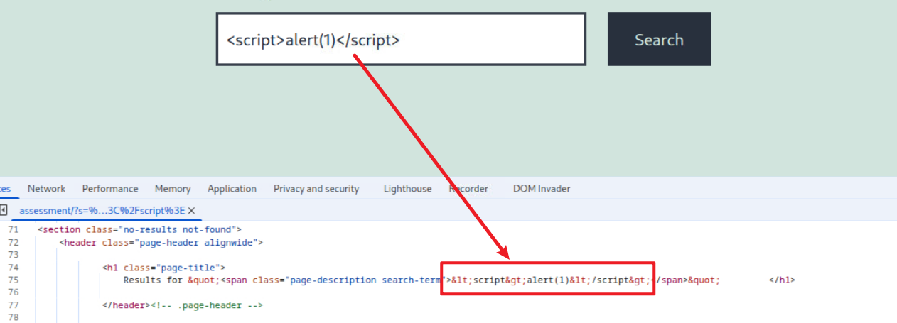
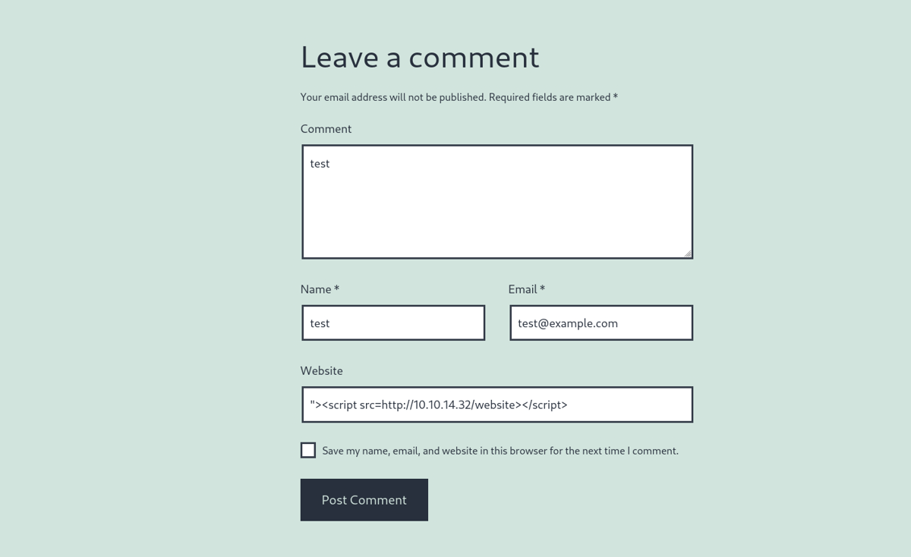
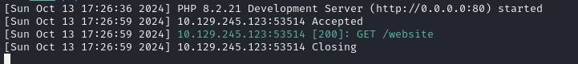

我们正在为一家聘请您的公司执行 Web 应用程序渗透测试任务，该公司刚刚发布了新的 Security Blog 。在我们的 Web 应用程序渗透测试计划中，我们已经到了测试 Web 应用程序是否存在跨站脚本漏洞（XSS）的部分。

启动以下服务器，确保已连接到 VPN，然后使用浏览器访问服务器上的 /assessment 目录：

运用你在本模块中学到的技能，完成以下目标：

识别存在 XSS 漏洞的用户输入字段

找到一个有效的 XSS 攻击载荷，该载荷可以在目标浏览器上执行 JavaScript 代码。

利用 Session Hijacking 技术，尝试窃取受害者的 cookie，其中应该包含 flag。

在评论提交页面,提示我们评论将被管理员审查后才能公布,这说明是一个盲注,我们尝试各种payload

发现的易受攻击的有效载荷是：

`">`

我们的有效载荷返回了 200 响应！
