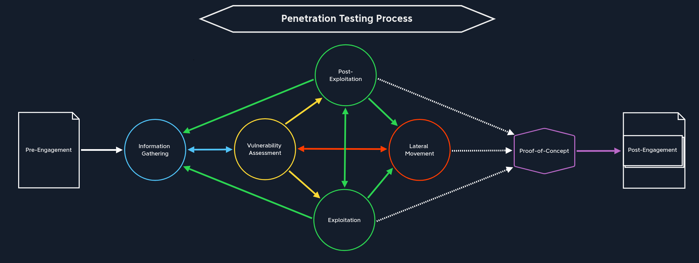
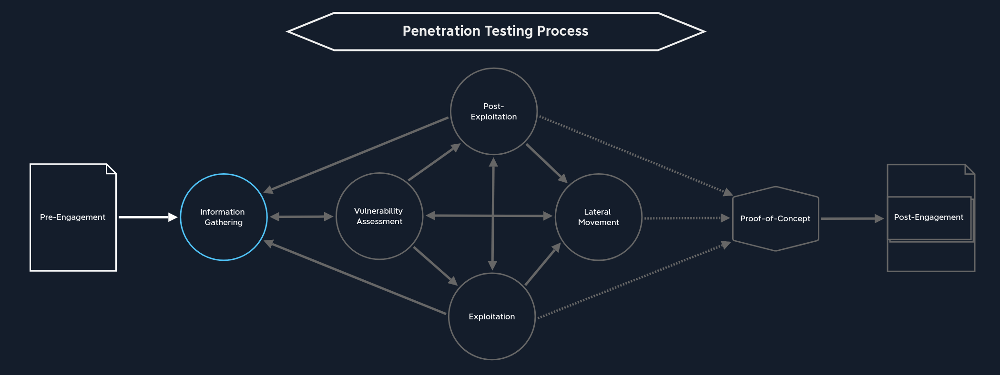
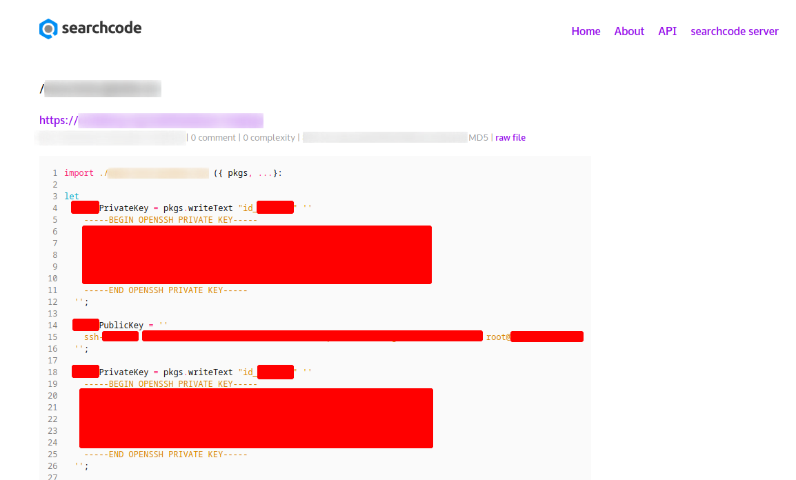

# 一、背景和准备

## 1、渗透测试概述
信息技术（IT）几乎是每家公司不可或缺的一部分。IT系统中存储的关键与机密数据数量持续增长，企业对在用IT系统不间断运行的依赖程度也在不断加深。因此，针对企业网络的攻击、系统可用性破坏，以及其他会给企业造成重大损失的手段（如勒索软件攻击）正变得越来越普遍。通过安全漏洞与网络攻击获取的重要企业信息，可能被出售给竞争对手、在公开论坛泄露，或被用于其他不法目的。攻击者蓄意制造系统故障，因为这类行为的防范难度正不断加大。

渗透测试（Pentest）是一种有组织、有针对性且经过授权的攻击尝试，用于检验IT基础设施及其防护能力，判断其是否存在IT安全漏洞。渗透测试会采用真实攻击者所使用的方法与技术。作为渗透测试人员，我们会运用各类技术与分析手段，评估某一漏洞或一系列漏洞组合，可能对机构IT系统与数据的**保密性、完整性、可用性**造成的影响。

渗透测试的目标是发现并识别被测系统中的**所有**安全漏洞，并提升被测系统的安全防护水平。
其他评估方式（如红队评估）则可能基于特定场景，仅聚焦于为达成某一最终目标所需利用的漏洞（例如攻入CEO邮箱、获取关键服务器上预置的Flag）。

### 1.1、风险管理
总体而言，渗透测试也是企业风险管理的一部分。IT安全风险管理的核心目标，是识别、评估并缓解任何可能损害机构信息系统与数据保密性、完整性、可用性的潜在风险，并将整体风险降至可接受水平。这包括识别潜在威胁、评估风险等级，并采取必要措施降低或消除风险，具体通过实施合适的安全控制措施与策略实现，例如访问控制、加密及其他安全防护手段。通过妥善管理机构IT系统的安全风险，能够有效保障数据安全。

但我们无法消除所有风险。即便机构已采取所有合理的风险管理措施，安全漏洞依然存在**固有风险**，因此部分风险会持续存在。固有风险指即便已部署合适的安全控制措施，系统依然存在的风险等级。企业可通过多种方式接受、转移、规避或缓解风险。例如，企业可购买保险覆盖特定风险（如自然灾害、意外事故）；通过签订合同，将风险转移给第三方服务提供商等其他方。此外，企业可部署预防措施降低特定风险的发生概率；若风险确实发生，也可建立流程将影响降至最低。最后，企业还可利用衍生品等金融工具，减轻特定风险带来的经济损失。这些策略均能帮助企业有效管理风险。

在渗透测试过程中，我们会对执行步骤与测试结果编写详细文档。但修复所发现漏洞的责任，在于客户或被测系统的运营方。我们的角色是作为可信顾问，上报漏洞、提供详细复现步骤并给出合理的修复建议，但不会直接进入系统打补丁、修改代码等。需要明确的是，渗透测试并非对IT基础设施或系统进行持续监控，而是对安全状态的**瞬时快照**。这一说明应体现在我们最终交付的渗透测试报告中。

### 1.2、漏洞评估
漏洞分析是一个通用术语，涵盖漏洞/安全评估与渗透测试。与渗透测试不同，漏洞或安全评估完全依靠自动化工具完成。通过运行Nessus、Qualys、OpenVAS等扫描工具，对照已知问题与安全漏洞对系统进行检测。在大多数情况下，这类自动化检测无法根据目标系统配置调整攻击方式，这也是由经验丰富的测试人员开展人工测试至关重要的原因。

与之相对，渗透测试是自动化与人工测试/验证相结合的方式，且通常在大量人工信息收集之后开展，会根据被测系统进行个性化定制与调整。渗透测试的规划、执行与工具选择要复杂得多。
渗透测试与其他安全评估，**必须**在委托企业与聘用渗透测试人员的机构双方达成一致后方可执行。若测试人员未获得针对客户系统发起攻击的明确书面授权，渗透测试期间开展的各类测试与操作可能会被认定为刑事犯罪。委托渗透测试的机构仅可针对自有资产申请测试；若其使用第三方托管网站或其他基础设施，在绝大多数情况下需获得这些第三方实体的明确书面批准。部分企业（如亚马逊）已出台政策，对使用AWS托管部分或全部基础设施的公司，特定服务测试无需提前授权。不同服务商政策存在差异，因此在范围界定阶段与客户确认资产归属，并核查其使用的第三方是否要求在测试前提交书面申请，始终是最佳做法。

一次成功的渗透测试需要大量的组织与准备工作。必须遵循清晰的流程模型，同时根据客户需求灵活调整，因为我们遇到的每一个环境都各不相同，存在自身特点。部分客户可能从未接受过渗透测试，我们需要详细讲解整个流程，确保其清晰理解我们的计划操作，并协助其精准界定评估范围。

原则上，不会提前将渗透测试计划告知企业员工，但管理层可自主决定是否告知员工。因为员工有权知晓自身隐私不受保障的场景。

作为渗透测试人员，我们可能会发现姓名、地址、薪资等个人数据。遵守数据保护法案的最佳做法，就是对这类信息严格保密。再例如，若我们获取了包含信用卡号、姓名与CVV码的数据库，应建议客户尽快修改并强化密码，并对数据库中的数据进行加密。

### 1.3、测试方式
渗透测试流程的关键环节之一，是确定测试的起始视角。每次渗透测试可从两种不同视角开展：

#### 1.3.1、外部渗透测试

多数渗透测试从外部视角开展，即以互联网上匿名用户的身份进行。大多数客户希望尽可能防范针对外部网络边界的攻击。我们可在自有主机（建议使用VPN连接，避免网络服务提供商拦截）或VPS上执行测试。部分客户不要求隐蔽性，而另一些客户则要求我们尽可能低调，以规避防火墙封禁、入侵检测/防御系统（IDS/IPS）检测与告警触发的方式接近目标系统。他们可能要求采用隐蔽或“混合”模式，逐步提高攻击特征的明显程度，以检验其检测能力。我们的最终目标是攻入对外暴露的主机、获取敏感数据，或接入内部网络。

#### 1.3.2、内部渗透测试

与外部渗透测试相反，内部渗透测试在企业网络内部开展。这一阶段可在通过外部测试成功攻入企业网络后执行，也可从假设已被攻破的场景直接开始。内部渗透测试还可能针对完全无互联网访问的隔离系统，这种情况通常需要我们亲临客户现场。

### 1.4、渗透测试类型

无论以何种方式启动渗透测试，测试类型都至关重要，它决定了我们可获取的信息量级，主要可分为以下几类：

| 测试类型 | 可获取信息 |
|---------|-----------|
| 黑盒测试 | 信息极少。仅提供IP地址、域名等基础必要信息。 |
| 灰盒测试 | 信息较全面。会提供特定URL、主机名、子网等额外信息。 |
| 白盒测试 | 信息完全开放。所有信息均对我们公开，可从内部视角了解整体架构，利用内部信息规划攻击。可能会提供详细配置、管理员凭证、Web应用源代码等。 |
| 红队测试 | 可包含物理测试、社会工程学等内容，可与上述任意类型结合。 |
| 紫队测试 | 可与上述任意类型结合，核心是与防守方紧密协作。 |

提供的信息越少，测试方案的耗时越长、复杂度越高。例如，黑盒渗透测试需要先梳理基础设施中的服务器、主机与服务分布，尤其是对整个网络进行测试时。这类侦察工作可能耗费大量时间，若客户要求采用更隐蔽的测试方式则尤为明显。

### 1.5、测试环境类型
除测试方式与测试类型外，还需明确测试对象，主要可分为以下类别：

网络、Web应用、移动端、API、富客户端
物联网、云环境、源代码、物理安全、企业员工
主机、服务器、安全策略、防火墙、入侵检测/防御系统

需要注意的是，这些类别通常可混合开展，具体包含哪些测试组件，取决于执行的测试类型。接下来我们将深入讲解渗透测试流程，了解每个阶段的划分方式及其与前序阶段的依赖关系。

## 2、法律法规
每个国家都有专门的法律，分别对计算机相关活动、版权保护、电子通信截获、受保护健康信息的使用与披露，以及向未成年人收集个人信息等行为进行规范。

遵守这些法律至关重要，这能保护个人数据免遭未授权访问与滥用，并保障个人隐私。我们必须了解这些法律，以确保自身研究活动合法合规，不违反任何法律条款。违反这些法律可能导致民事或刑事处罚，因此每个人都必须熟悉法律内容，理解自身行为可能带来的后果。此外，确保研究活动符合法律要求，对保护个人隐私、防范数据滥用也至关重要。安全研究人员遵守法律并在研究中保持审慎，有助于保障个人数据安全、维护个人合法权益。以下是部分国家和地区相关法律法规的概要：

| 规范类别 | 美国 | 欧洲 | 英国 | 印度 | 中国 |
|---------|------|------|------|------|------|
| 保护关键信息基础设施与个人数据 | 《网络安全信息共享法案》(CISA) | 《通用数据保护条例》(GDPR) | 《2018年数据保护法》 | 《2000年信息技术法》 | 《网络安全法》 |
| 将恶意使用计算机与未授权访问计算机系统入刑 | 《计算机欺诈与滥用法》(CFAA) | 《网络与信息系统指令》(NISD 2) | 《1990年计算机滥用法》 | 《2000年信息技术法》 | 《国家安全法》 |
| 禁止规避受版权保护作品的技术保护措施 | 《数字千年版权法》(DMCA) | 《欧洲委员会网络犯罪公约》 |  |  | 《反恐怖主义法》 |
| 规范电子通信截获行为 | 《电子通信隐私法》(ECPA) | 《2002/58/EC号电子隐私指令》 | 《1998年人权法》(HRA) | 《1872年印度证据法》 | — |
| 规范受保护健康信息的使用与披露 | 《健康保险流通与责任法案》(HIPAA) | — | 《2006年警察与司法法》 | 《1860年印度刑法典》 | — |
| 规范向未成年人收集个人信息 | 《儿童在线隐私保护法》(COPPA) | — | 《2016年调查权力法》(IPA) | — | — |
| 各国间调查和起诉网络犯罪的合作框架 | — | — | 《2000年调查权力规范法》(RIPA) | — | — |
| 明确个人对自身数据的合法权利与保护 | — | — | — | 《数字个人数据保护法》 | 《个人信息和重要数据出境安全评估办法》 |
| 明确个人基本权利与自由 | — | — | — | — | 《关键信息基础设施安全保护条例》 |

### 2.1、美国
《计算机欺诈与滥用法》（CFAA）是一项联邦法律，将未授权访问计算机行为定为刑事犯罪。该法适用于黑客攻击、身份盗窃、传播恶意软件等各类计算机相关活动。CFAA长期饱受争议与批评，有观点认为其条款范围过广，可能将合法的安全研究行为入刑。此外，批评者指出，该法对计算机相关活动的定义过于宽泛，可能导致本不应被认定为犯罪的行为遭到起诉。同时，该法部分术语含义模糊，使公众难以明晰自身在法律下的权利与义务。基于以上原因，个人必须熟悉该法律，了解自身行为的潜在法律后果。

《数字千年版权法》（DMCA）包含禁止规避用于保护版权作品的技术措施的条款，这类措施包括数字锁、加密与认证协议等，用于保护软件、固件及其他数字内容。安全研究人员应了解DMCA相关条款，确保研究活动不触犯法律。需要注意的是，即便出于研究或教育目的，规避版权保护措施仍可能面临民事或刑事处罚。因此，研究人员必须保持审慎、尽职核查，避免无意中违反DMCA。

《电子通信隐私法》（ECPA）对包括互联网传输在内的电子通信截获行为进行规范，禁止在未获得通信一方或双方同意的情况下，截获、访问、监控或存储通信内容。该法同时禁止将截获的通信内容作为法庭证据。ECPA还规定了服务提供商的责任，禁止其向收发双方以外的任何人泄露通信内容。因此，该法保护了电子通信隐私，防止个人通信遭到非法截获与滥用。

《健康保险流通与责任法案》（HIPAA）规范受保护健康信息的使用与披露，并制定了一系列规则，用于保护电子化存储的个人健康信息。研究人员应了解相关要求，确保研究活动符合HIPAA规定，包括采取数据加密、详细记录数据访问与共享记录等措施。此外，研究必须遵循机构政策与流程，任何变更均需获得相关管理机构批准。研究人员还需警惕数据泄露风险，采取措施保障个人健康信息安全。违反HIPAA规定将面临严厉的法律与经济处罚，因此研究人员必须确保研究活动合规。

《儿童在线隐私保护法》（COPPA）是一项重要立法，规范向13岁以下儿童收集个人信息的行为。我们必须了解COPPA条款，采取防范措施确保研究活动不违反该法要求。为遵守COPPA，研究人员需保持审慎，采取特殊措施避免收集、使用或披露13岁以下儿童的任何个人信息。违反COPPA可能引发法律诉讼与处罚，因此安全研究人员必须熟悉该法并遵守相关条款。

### 2.2、欧洲
《通用数据保护条例》（GDPR）规范个人数据处理行为，强化个人对自身数据的控制权，对违规行为可处以全球年营业额4%或2000万欧元罚款（以较高者为准）。安全研究人员应了解相关条款，确保研究不违反GDPR。需要注意的是，GDPR适用于任何处理欧盟公民个人数据的公司，无论其所在地位于何处。

《网络与信息系统指令》（NISD）要求关键服务运营商与数字服务提供商采取适当安全措施，并上报特定安全事件。该指令适用于各类机构与个人，包括开展渗透测试与安全研究的人员。

《欧洲委员会网络犯罪公约》是全球首项针对互联网及其他计算机网络犯罪的国际条约，为各国调查、起诉网络犯罪提供了合作框架。

《2002/58/EC号电子隐私指令》规范电子通信领域的个人数据处理行为，适用于欧盟境内提供公开电子通信服务过程中的个人数据处理活动。

### 2.3、英国
《1990年计算机滥用法》旨在打击恶意使用计算机行为，将未授权访问计算机系统、擅自修改数据、利用计算机实施诈骗及其他非法活动定为刑事犯罪。该法允许没收用于实施计算机滥用犯罪的计算机及其他设备，并鼓励向执法部门上报计算机滥用事件，同时制定多项预防措施，包括设立专门执法队伍、落实相应安全防护措施等。

《2018年数据保护法》是一项重要立法，赋予个人针对自身数据的多项合法权利与保护，明确了个人访问自身数据、要求更正数据、反对数据处理等权利。此外，该法规定了个人数据处理方的义务，要求处理行为安全、透明，并向个人清晰易懂地告知数据使用方式。安全研究人员遵循该法开展工作，可确保研究行为负责任、合法合规。

《1998年人权法》（HRA）是英国重要法律，明确了个人的基本权利与自由，将《欧洲人权公约》纳入英国法律体系，保障个人在各领域获得公平平等待遇，包括公平审判权、私人与家庭生活受保护权、言论自由权等。该法赋予个人在权利遭受侵害时寻求司法救济的权利，也允许个人对侵犯其基本权利与自由的法律或行政行为的合法性提出质疑。人权法是保护个人免遭权力滥用、维护个人权利的重要法律。

《2006年警察与司法法》为英国议会通过的法案，旨在构建刑事司法体系与警务改革的综合框架。该法增设多项新罪名，包括煽动宗教仇恨罪，并制定保护儿童免遭剥削、关爱弱势成年人的措施；同时设立严重有组织犯罪署与国家DNA数据库，出台整治反社会行为的新举措，引入反社会行为令等。此外，该法对验尸制度进行现代化改革，赋予警方打击恐怖主义的更多权力，完善犯罪受害者权利保障，加强家庭暴力受害者保护力度。

《2016年调查权力法》（IPA）规范执法与情报机构使用调查权力的行为，包括黑客攻击及其他形式的数字监控。该法还要求互联网及其他通信服务商在规定期限内留存特定类型数据。

《2000年调查权力规范法》（RIPA）规范公共机构使用秘密调查技术的行为，包括黑客攻击及其他形式的数字监控。

### 2.4、印度
《2000年信息技术法》为使用电子数据交换及其他电子通信方式开展的交易提供法律认可，同时将黑客攻击及其他未授权访问计算机系统的行为定为刑事犯罪，并对此类行为处以处罚。

《数字个人数据保护法》为拟议立法，旨在保护个人数据并对违规行为处以处罚。

《1872年印度证据法》与《1860年印度刑法典》包含可适用于网络犯罪案件的条款，涵盖黑客攻击、未授权访问计算机系统等行为。安全研究人员应了解这些法律，确保研究活动合法合规。

### 2.5、中国
《网络安全法》构建了保护关键信息基础设施与个人数据的法律框架，要求机构落实特定安全措施并上报特定类型安全事件。

《国家安全法》将危害国家安全的行为定为刑事犯罪，包括黑客攻击及其他未授权访问计算机系统的行为。

《反恐怖主义法》将支持或宣扬恐怖主义的行为定为刑事犯罪，包括黑客攻击及其他未授权访问计算机系统的行为。

《个人信息和重要数据出境安全评估办法》规范个人信息与重要数据的出境行为，要求机构在传输此类数据前开展安全评估并获得相关部门批准。

《关键信息基础设施安全保护条例》规范关键信息基础设施保护工作，要求机构落实特定安全措施并上报特定类型安全事件。

---

### 2.6、渗透测试期间的防范措施
为避免触犯大多数国家法律，我们整理了一份在每次渗透测试中强烈建议遵守的防范措施清单。此外，部分国家针对特定场景还有额外法规，我们应自行了解或咨询律师。

### 2.7、防范措施
☐ 获得被测计算机或网络所有者或授权代表的**书面授权**
☐ 仅在授权范围内开展测试，遵守所有明确限定的要求
☐ 采取措施避免对被测系统或网络造成损害
☐ 未经许可，不访问、使用或披露测试过程中获取的个人数据及其他任何信息
☐ 未获得通信一方同意，不截获电子通信内容
☐ 未取得 proper 授权，不对受《健康保险流通与责任法案》（HIPAA）管辖的系统或网络开展测试

## 3、渗透测试流程

在社会科学中，**流程（Process）** 指有明确方向的事件序列。在运营与组织场景下，流程更精确地被称为工作流程、业务流程、生产流程或价值创造流程。在计算机系统中，流程也是运行中程序的别称，这类程序通常属于系统软件的一部分。

同时，区分**确定性过程（Deterministic Process）**与**随机性过程（Stochastic Process）**也十分重要。确定性过程中，每个状态都与先前的状态和事件存在因果关联并由其决定。随机性过程中，一个状态仅以一定概率由其他状态推导而来，此时只能假定统计层面的条件。对我们而言，上述多种定义存在重叠。我们采用社会科学中对渗透测试流程的定义，将其表示为与确定性过程相关联的事件进程。这是因为我们所有的操作步骤，都基于能够发现或主动触发的事件与结果。

**渗透测试流程**由渗透测试人员执行的一系列连续步骤与事件构成，旨在找到一条通往预设目标的路径。

流程描述了特定时间范围内、可导向预期结果的一系列操作序列。同时必须明确，流程并非固定不变的“配方”，也不是按部就班的操作指南。因此，我们的渗透测试流程必须具备概括性与灵活性。毕竟每个客户都拥有独一无二的基础设施、需求与期望。

### 3.1、渗透测试阶段

对这些流程最有效的呈现与定义方式，是通过相互依赖的**阶段（Stages）**来划分。我们在研究中常发现，这类流程多以**循环流程**形式呈现。但仔细推敲便会发现，只要循环流程中的任意一个环节不适用，整个流程就会被打乱；严格来说，整个流程将失效。如果我们基于新获取的信息从头开始执行流程，这实际上已是一种全新的流程思路，并不会撤销此前的流程。

问题在于，这类呈现方式与思路往往无法为拓展渗透测试流程提供参考。正如前文所述，不存在可照搬的分步指南，只有允许根据获取的结果与信息灵活调整、适配具体步骤与思路的阶段。我们可以针对渗透测试不同阶段尝试的各类操作制定专属操作手册，但每个环境都存在差异，因此需要持续调整。

渗透测试流程包含：**Pre-Engagement（测试前期准备）、Information Gathering（信息收集）、Vulnerability Assessment（漏洞评估）、Exploitation（漏洞利用）、Post-Exploitation（利用后操作）、Lateral Movement（横向移动）、Proof-of-Concept（概念验证）、Post-Engagement（测试后期收尾）**。

我们将在后续章节详细讲解每个阶段的具体内容，并介绍一份可选学习计划，指导如何学习各类**战术、技术与流程（Tactics, Techniques, and Procedures, TTPs）**，通过结构化方式展示各阶段如何相互依托、循环推进。首先，我们先了解渗透测试流程的核心组成部分，逐一讲解各模块及其重要性。

这份可选学习计划以各阶段对应的模块组为基础，建议完成当前阶段学习后再进入下一阶段。几乎所有模块中，我们都会反复执行信息收集、横向移动、数据搜刮（Pillaging）等不同阶段的操作。模块的划分旨在聚焦对应主题，这些主题涉及不可跳过的专项知识。即便自认为已掌握相关内容，任何知识缺口都可能导致学习过程中出现理解偏差或困难。据此，包含各阶段的渗透测试流程如下：

#### 3.1.1、Pre-Engagement（测试前期准备）

测试前期准备的核心是对客户进行说明并完善合同条款。所有必要的测试内容及其组成部分都会被严格界定并写入合同。通过面对面会议或电话会议，双方会达成多项约定，包括：
- 保密协议（Non-Disclosure Agreement, NDA）
- 测试目标
- 测试范围
- 时间预估
- 交战规则（Rules of Engagement, RoE）

#### 3.1.2、Information Gathering（信息收集）

信息收集指通过多种方式获取目标相关组件的信息。我们会搜集目标公司、在用软硬件的相关资料，寻找可利用的潜在安全漏洞以建立立足点。

#### 3.1.3、Vulnerability Assessment（漏洞评估）

进入漏洞评估阶段后，我们会分析信息收集环节的结果，排查系统、应用及其对应版本中的已知漏洞，挖掘可行的攻击向量。漏洞评估通过人工与自动化结合的方式，对潜在漏洞进行研判，以此判定威胁等级，以及企业网络基础设施对网络攻击的脆弱程度。

#### 3.1.4、Exploitation（漏洞利用）
在漏洞利用阶段，我们基于前述结果，针对潜在攻击向量开展攻击测试，对目标系统执行利用操作，获取对目标系统的初始访问权限。

#### 3.1.5、Post-Exploitation（利用后操作）
此阶段我们已获取被攻陷主机的访问权限，需确保即便系统发生修改、配置变更，仍能维持访问。期间我们会尝试**权限提升（Privilege Escalation）**以获取最高权限，并搜寻敏感数据，如凭证或客户重点保护的其他数据（即Pillaging，数据搜刮）。执行利用后操作，有时是为了向客户展示获取权限后可造成的影响，有时则是为后续的横向移动环节铺垫。

#### 3.1.6、Lateral Movement（横向移动）
横向移动指在目标公司内部网络中进行迁移，以相同或更高权限访问其他主机。这通常是与利用后操作结合的循环过程，直至达成测试目标。例如：我们在Web服务器建立立足点，完成权限提升并在注册表中发现密码；进一步枚举后发现该密码可作为本地管理员登录数据库服务器；随后便可从数据库中搜刮敏感数据，获取其他凭证，进一步深入网络内部。此阶段通常会基于被攻陷主机或服务器上的信息，运用多种技术手段。

#### 3.1.7、Proof-of-Concept（概念验证，PoC）
此阶段我们会逐步骤记录攻陷网络或获取某类权限的操作过程。目标是清晰呈现如何串联多个安全漏洞达成目标，让客户直观理解各漏洞的关联逻辑，助力其优先开展修复工作。若步骤记录不完整，客户将难以理解测试内容，进而增加修复难度。条件允许时，我们可编写脚本自动化复现测试步骤，方便客户复现漏洞。相关内容会在**Documentation & Reporting（文档与报告）**模块中深入讲解。

### 3.1.8、Post-Engagement（测试后期收尾）
测试后期收尾阶段，我们会编制详细文档，帮助客户方管理员与管理层理解所发现漏洞的危害程度。同时清理所有主机与服务器上的操作痕迹。此阶段还需为客户交付成果物、召开报告解读会议，有时还需向客户高管或董事会进行专项汇报。最后，按照合同约定与公司政策归档测试数据，通常会留存固定时长，或留存至开展修复后复测（Post-remediation Assessment / Retest）为止。

### 3.2 重要性

我们必须内化这套流程，并将其作为所有技术测试项目的基础。通过各阶段的组成内容，可精准定位需要提升的能力方向，以及自身存在的主要难点与知识缺口。以目标网站测试为例：

| 阶段 | 说明 |
|------|------|
| 1. Pre-Engagement | 完成所有必要文档编制，沟通评估目标，明确各项疑问 |
| 2. Information Gathering | 前期准备完成后，调研目标公司网站，识别所用技术，梳理Web应用运行逻辑 |
| 3. Vulnerability Assessment | 基于收集的信息排查已知漏洞，研究可能导致非预期操作的可疑功能 |
| 4. Exploitation | 发现潜在漏洞后，准备利用代码、工具与环境，对Web服务器开展漏洞测试 |
| 5. Post-Exploitation | 成功攻陷目标后，再次开展信息收集，从内部分析Web服务器；若发现敏感信息，尝试权限提升（依系统与配置而定） |
| 6. Lateral Movement | 若内部网络其他服务器、主机在测试范围内，利用已获取信息在网络中迁移并访问这些设备 |
| 7. Proof-of-Concept | 制作概念验证证明漏洞存在，甚至可自动化实现触发漏洞的步骤 |
| 8. Post-Engagement | 完成文档编制并以正式报告形式交付客户；后续可召开报告解读会议，解答测试相关疑问，为修复人员提供必要支持 |
# 二、测试前期准备
测试前期准备是为实际渗透测试做筹备的阶段。在此阶段，双方会沟通诸多问题，并达成若干合同约定。客户告知我们其希望测试的内容，我们则详细说明如何尽可能高效地开展测试。

整个前期准备流程包含三个核心部分：
- 范围界定问卷
- 前期准备会议
- 项目启动会议

在详细讨论任何内容之前，各方必须签署**保密协议（Non-Disclosure Agreement, NDA）**。保密协议分为以下几种：

| 类型 | 说明 |
|------|------|
| 单边保密协议（Unilateral NDA） | 仅要求一方承担保密义务，允许另一方向第三方共享所获信息。 |
| 双边保密协议（Bilateral NDA） | 双方均需对测试过程中产生及获取的信息保密，这是最常用的NDA类型，用于保护渗透测试人员的工作成果。 |
| 多边保密协议（Multilateral NDA） | 由两方以上主体共同签署的保密承诺。若我们为合作网络开展渗透测试，所有相关责任方均需签署此文件。 |

在紧急情况下也可例外，直接进入项目启动会议，该会议也可通过线上会议形式进行。

明确企业中**谁有权委托我们开展渗透测试**至关重要，因为我们不能接受任何人的测试委托。例如，假设某公司员工以检查企业网络安全为由聘请我们进行测试，但在评估完成后发现该员工意在损害公司利益，且并未获得授权委托测试。从法律角度看，这会使我们陷入极其危险的境地。

以下是有权委托渗透测试的企业人员示例清单（并非穷尽），不同公司情况有所差异：大型企业可能不由高管层直接参与，而由IT、审计或IT安全高级管理层等承担相关责任。

- 首席执行官（CEO）
- 首席技术官（CTO）
- 首席信息安全官（CISO）
- 首席安全官（CSO）
- 首席风险官（CRO）
- 首席信息官（CIO）
- 内部审计副总裁
- 审计经理
- IT/信息安全副总裁或总监

在流程早期就必须明确：谁拥有合同、交战规则文件的签署权，以及谁担任主要、次要联系人、技术支持人员和问题升级对接人。

此阶段还需准备若干份文件，经客户与我们双方签署后，方可开展渗透测试，以便在需要时以书面形式呈现授权声明，否则渗透测试可能违反《计算机滥用法》等相关法律。这些文件包括但不限于：

| 文件 | 制定时间 |
|------|----------|
| 1. 保密协议（NDA） | 初次沟通后 |
| 2. 范围界定问卷 | 前期准备会议前 |
| 3. 范围界定文档 | 前期准备会议期间 |
| 4. 渗透测试方案（合同/工作范围说明书 SoW） | 前期准备会议期间 |
| 5. 交战规则（RoE） | 项目启动会议前 |
| 6. 承包商协议（物理安全评估适用） | 项目启动会议前 |
| 7. 测试报告 | 渗透测试期间及完成后 |

注：客户可能单独提供一份范围界定文档，列明测试范围内的IP地址/网段/URL及必要凭证，但此类信息也应作为附录写入交战规则文件。

**重要提示**：
上述文件编制完成后，应由律师审核并调整。

---

## 1、范围界定问卷

与客户初步沟通后，我们通常会向其发送一份范围界定问卷，以便更清晰地了解其所需服务。问卷应明确说明我们的服务内容，一般会让客户从以下选项中选择一项或多项：

☐ 内部漏洞评估　　　☐ 外部漏洞评估
☐ 内部渗透测试　　　☐ 外部渗透测试
☐ 无线安全评估　　　☐ 应用安全评估
☐ 物理安全评估　　　☐ 社会工程学评估
☐ 红队评估　　　　　☐ Web应用安全评估

在每项服务下方，问卷应允许客户明确具体需求：例如需要Web应用还是移动应用评估？是否需要安全代码审计？内部渗透测试是否采用黑盒模式、半规避模式？社会工程学评估是否仅包含钓鱼测试，还是也包含语音钓鱼？借此机会，我们可清晰说明服务的深度与广度，确保准确理解客户需求与预期，保证能按要求完成评估。

除评估类型、客户名称、地址及核心人员联系方式外，其他关键信息还包括：

- 预计存活主机数量？
- 测试范围内IP/CIDR网段数量？
- 测试范围内域名/子域名数量？
- 测试范围内无线SSID数量？
- Web/移动应用数量？若为认证测试，包含多少角色（普通用户、管理员等）？
- 钓鱼评估的目标用户数量？客户是否提供名单，还是需我们通过开源情报（OSINT）收集？
- 若客户申请物理安全评估，涉及多少个地点？若有多个站点，是否地理分散？
- 红队评估的目标是什么？哪些行为（如钓鱼、物理攻击）不在测试范围内？
- 是否需要单独开展活动目录安全评估？
- 网络测试从匿名用户身份还是标准域用户身份发起？
- 是否需要绕过网络访问控制（NAC）？

最后，我们还需询问信息披露程度与规避测试要求（视评估类型而定）：

- 渗透测试为黑盒（无信息提供）、灰盒（仅提供IP/CIDR/URL）还是白盒（提供详细信息）？
- 客户希望我们采用非规避、混合规避（初始低调，逐步提高特征明显度，以测试客户安全人员的检测水平）还是完全规避模式？

这些信息有助于我们合理分配资源，并按客户预期交付项目，同时也能为制定包含项目时间线与费用的精准方案提供依据（例如漏洞评估耗时远少于红队评估；针对10个IP的外部渗透测试费用，显著低于包含30个/24网段的内部渗透测试）。

基于范围界定问卷回收的信息，我们会整理汇总并形成范围界定文档。

---

## 2、前期准备会议
初步明确客户项目需求后，即可进入前期准备会议。在此会议中，我们与客户沟通并讲解渗透测试前所有相关核心内容。本阶段收集的信息，连同范围界定问卷数据，将作为编制**渗透测试方案（合同/工作范围说明书 SoW）**的依据。整个流程可类比为就医问诊，向医生说明计划检查的项目。本阶段一般通过邮件、线上会议或线下面谈完成。

注：工作中可能遇到首次接受渗透测试的客户，或客户对接人不熟悉测试流程。在前期准备会议中，部分或逐步梳理范围界定问卷内容是很常见的情况。

---

## 3、合同——核对清单
| 核对项 | 说明 |
|--------|------|
| ☐ NDA | 保密协议是客户与承包商之间，针对订单/项目相关所有书面或口头信息签订的保密合同。承包商承诺对所有涉密信息严格保密，即便订单/项目完成后依然有效。协议还应约定保密例外条款、权利义务可转让性及违约处罚。NDA最迟应在项目启动会议上、详细信息沟通前签署。 |
| ☐ 测试目标 | 订单/项目期间必须达成的里程碑，先确定核心目标，再细化细分目标。 |
| ☐ 测试范围 | 沟通并界定具体测试组件，包括域名、IP网段、独立主机、特定账号、安全系统等。客户可能期望我们自行发掘部分内容，但**各组件的测试法律依据优先级最高**。 |
| ☐ 渗透测试类型 | 向客户展示各类测试选项并说明优劣。结合已知目标与范围，我们可并应给出专业建议及理由，最终测试类型由客户决定。 |
| ☐ 测试方法论 | 例如：OSSTMM、OWASP、内外网组件自动化+手动未认证分析、网络组件与Web应用漏洞评估、漏洞威胁向量化、验证与利用、开发可规避检测的利用代码。 |
| ☐ 测试位置 | 外部测试：远程（通过安全VPN）；内部测试：内网环境或远程（通过安全VPN）。 |
| ☐ 时间预估 | 明确渗透测试起止日期，划定精准时间窗口，便于规划流程。同时必须明确漏洞利用、利用后操作、横向移动等各攻击阶段的时间窗口，可安排在工作时间或非工作时间。非工作时间测试更侧重检验安全方案与系统抵御攻击的能力。 |
| ☐ 第三方 | 明确客户通过哪些第三方服务商获取服务（如云厂商、网络运营商、托管服务商等）。客户必须获得这些第三方的书面授权，确认其知晓并同意部分服务将接受模拟黑客攻击。强烈建议要求客户转发第三方授权文件，确保我们获得真实授权证明。 |
| ☐ 规避测试 | 规避测试指绕过客户基础设施中的安全流量检测与安全系统，寻找可获取内网组件信息并实施攻击的技术。需确认客户是否要求使用此类技术。 |
| ☐ 风险告知 | 必须向客户说明测试涉及的风险及潜在后果，据此共同设定限制条件并采取防范措施。 |
| ☐ 范围限制与约束 | 明确哪些服务器、工作站或其他网络组件对客户及其业务正常运行至关重要，必须避开且不得影响，避免引发可能波及生产业务的严重技术故障。 |
| ☐ 信息处理规范 | 如HIPAA、PCI、HITRUST、FISMA/NIST等合规要求。 |
| ☐ 联系方式 | 整理所有对接人员姓名、职位、邮箱、电话、办公电话及问题升级优先级。 |
| ☐ 沟通渠道 | 书面记录双方信息互通的渠道，包括邮件、电话、面谈等。 |
| ☐ 报告要求 | 沟通报告结构、客户特定需求，以及报告交付形式与是否需要结果汇报。 |
| ☐ 付款条款 | 说明报价与付款方式。 |

本次会议最重要的内容，是向客户详细介绍渗透测试及其核心重点。每套基础设施大多具有独特性，每位客户也有其高度重视的偏好，明确这些优先级是会议的核心环节。

这就好比在餐厅点餐：我们想要三分熟牛排，而厨师出于自认为更好的考虑做成全熟，结果必然不符合预期。因此我们应以客户意愿为先，按其要求提供服务。

基于合同核对清单与范围界定阶段的信息，我们编制**渗透测试方案（合同）**及配套的**交战规则（RoE）**。

---

## 4、交战规则——核对清单
| 核对项 | 内容 |
|--------|------|
| ☐ 引言 | 文档说明 |
| ☐ 委托方 | 公司名称、委托方全称、职位 |
| ☐ 渗透测试人员 | 公司名称、测试人员全称 |
| ☐ 联系方式 | 所有客户方与测试人员的通讯地址、邮箱、电话 |
| ☐ 测试目的 | 本次渗透测试的目的描述 |
| ☐ 测试目标 | 本次渗透测试需达成的目标说明 |
| ☐ 测试范围 | 所有IP、域名、URL、CIDR网段 |
| ☐ 沟通渠道 | 线上会议、电话、面谈或邮件 |
| ☐ 时间预估 | 起止日期 |
| ☐ 测试时段 | 每日允许测试的时间 |
| ☐ 渗透测试类型 | 内部/外部渗透测试、漏洞评估、社会工程学等 |
| ☐ 测试位置 | 接入客户网络的方式说明 |
| ☐ 测试方法论 | OSSTMM、PTES、OWASP等 |
| ☐ 目标/Flag | 指定用户、特定文件、特定信息等 |
| ☐ 证据处理 | 加密方式、安全协议 |
| ☐ 系统备份 | 配置文件、数据库等 |
| ☐ 信息处理 | 高强度数据加密 |
| ☐ 事件处理与上报 | 对接场景、测试中断情形、报告类型 |
| ☐ 状态会议 | 会议频次、日期、时间、参与人员 |
| ☐ 报告 | 报告类型、阅读对象、核心重点 |
| ☐ 复测 | 复测起止日期 |
| ☐ 免责声明与责任限制 | 系统损坏、数据丢失相关约定 |
| ☐ 测试授权 | 已签署合同、承包商协议 |

---

## 5、项目启动会议

项目启动会议通常在所有合同文件签署完毕后，于约定时间线下召开。参会人员一般包括：客户对接人（内部审计、信息安全、IT、治理与风险部门等，依客户而定）、客户技术支持人员（开发人员、系统管理员、网络工程师等）及渗透测试团队（业务负责人如技术总监、实际测试人员，有时还包括项目经理或销售客户经理等）。

会上我们会说明渗透测试的性质与执行方式，通常**不包含拒绝服务（DoS）测试**。同时明确：若发现高危漏洞，渗透测试工作将暂停，编制漏洞通知报告并联系紧急对接人。此类紧急通知一般仅在外部渗透测试中出现，例如未认证远程代码执行（RCE）、SQL注入或其他可导致敏感数据泄露的严重漏洞。通知目的是让客户内部评估风险，决定是否需要紧急修复。

仅在以下情形，我们才会暂停内部渗透测试并通知客户：系统无响应、发现非法活动证据（如文件共享中的非法内容）、网络中存在外部威胁攻击者或此前已发生过数据泄露。

我们还必须向客户告知渗透测试期间的潜在风险，例如测试会在安全设备中产生大量日志与告警；若使用暴力破解等攻击方式，可能意外锁定部分用户账号；若测试对网络造成负面影响，客户需立即联系我们。

讲解渗透测试流程能让所有参会人员清晰了解整体工作，体现我们的专业性，让质疑者信服我们的专业能力。因为除技术人员、CTO、CISO外，非技术人员很难理解这类专业内容，所以我们必须关注沟通对象，用最通俗易懂的方式讲解，确保所有人都能理解。

所有与测试相关的事项均需沟通明确，精准响应客户的意愿与预期至关重要。每家公司的组织架构与网络环境各不相同，需采用适配方案。每位客户的目标也存在差异，测试工作应贴合其需求。通常在会议初期就能判断客户的渗透测试经验，进而调整沟通重点：或详细讲解、耐心答疑，或快速高效完成会议。

---

## 6、承包商协议

若渗透测试包含**物理安全评估**，则需额外签署承包商协议。物理测试不仅涉及虚拟环境，还包含物理入侵，适用完全不同的法律规定。此外，多数员工可能并未获知测试事宜。若在物理攻击与社会工程学尝试中，遇到安全意识极高的员工并被识破，对方大概率会报警。这份额外的承包商协议便是此类情形下的“免责保障”。

### 6.1、物理安全评估承包商协议——核对清单

☐ 引言
☐ 委托方
☐ 测试目的
☐ 测试目标
☐ 渗透测试人员
☐ 联系方式
☐ 物理地址
☐ 楼宇名称
☐ 楼层
☐ 房间编号
☐ 物理组件
☐ 时间线
☐ 公证
☐ 测试授权

---

## 7、前期筹备

完成上述所有事项并获取必要信息后，我们便开始规划执行方案并完成所有准备工作。此时渗透测试结果虽未知，但我们可针对所有场景准备虚拟机、VPS及其他工具/系统。更多系统准备相关内容，详见《前期筹备》模块。

好的，我直接**全文翻译成简体中文**，并且统一把 **Information Gathering 译为“信息收集”**（不使用“数据收集”），专业术语保留原文。

---

# 三、信息收集
当测试前期准备阶段完成，并且所有相关方签署完所有合同条款后，信息收集阶段就开始了。信息收集是任何安全评估中必不可少的一部分。在这个阶段，我们收集关于目标公司、员工、基础设施及其组织方式的所有可用信息。信息收集是整个渗透测试过程中最频繁、也最重要的阶段，我们会反复回到这一步。

我们为利用漏洞所采取的所有步骤，都建立在对目标进行枚举所得到的信息之上。这个阶段可以被视为所有渗透测试的基石。我们可以通过许多不同的方式获取对我们有用的关键信息，不过可以将其分为以下几类：

- 开源情报收集
- 基础设施枚举
- 服务枚举
- 主机枚举

这四类工作在每一次渗透测试中都**必须**完成。因为信息是引导我们成功完成渗透测试、发现安全漏洞的核心要素。我们可以从任何地方获取这些信息，无论是社交媒体、招聘信息、单个主机和服务器，甚至是员工本身。信息在各处不断被传播和共享。

毕竟，人类通过交换信息进行沟通，而网络组件和服务的通信方式也是类似的。任何信息交换都带有特定目的。对于计算机网络来说，其目的始终是触发某个特定流程——无论是在数据库中存储数据、用户注册、生成特定值，还是转发信息。

## 1、开源情报收集

假设客户希望我们看看能在互联网上找到哪些关于其公司的信息。为此，我们会使用所谓的**开源情报（OSINT）**。OSINT 是一种搜集目标公司或个人公开信息的过程，可用于识别相关事件（如公开和非公开会议）、内外部依赖关系以及关联情况。OSINT 从免费公开的来源获取信息，以得到想要的结果。我们常常能从中发现公司及其员工的安全相关敏感信息。通常，分享这类信息的人并没有意识到，能访问这些信息的不只有他们自己。

我们甚至可能在短短几分钟内就找到密码、哈希值、密钥、令牌等高度敏感信息，从而直接获得网络访问权限。GitHub 或其他开发平台上的代码仓库往往配置不当，外部访问者可以看到这些信息。如果在测试初期就发现这类敏感信息，应按照《交战规则》中事件处理与上报部分的流程，对这类高危安全漏洞进行报告。公开发布的密码或 SSH 密钥如果没有被及时删除或修改，属于严重的安全漏洞。因此，在我们继续测试之前，客户的管理员必须对这些信息进行核查。

开发人员经常在 StackOverflow 上分享整段代码，向其他开发者更清晰地展示自己的代码逻辑，以帮助解决问题。这类信息也很容易被快速找到，并被用来针对该公司发动攻击。我们的任务就是发现这类安全漏洞并推动修复。在《企业侦察》模块中，我们还能学到更多 OSINT 知识，了解多种查找这类信息的技术。

## 2、基础设施枚举

在基础设施枚举阶段，我们会梳理目标公司在互联网和内网中的整体布局。为此，我们结合 OSINT 和第一轮主动扫描，利用 DNS 等服务绘制客户服务器和主机的拓扑图，了解其基础设施结构，包括域名服务器、邮件服务器、Web 服务器、云实例等。我们会整理一份精确的主机及其 IP 地址清单，并与测试范围进行比对，确认其是否在授权测试范围内。

在这个阶段，我们还会尝试识别公司的安全防护措施。这些信息越精确，我们就越容易伪装攻击行为（规避测试）。识别防火墙（如 Web 应用防火墙）也能让我们清楚了解：哪些技术可能触发客户的告警，哪些方法可以用来规避告警。

无论我们身处“何处”——是从外部尝试梳理基础设施，还是从网络内部进行探查——思路都是一样的。从内网进行枚举可以让我们清晰掌握可作为**密码喷洒攻击**目标的主机和服务器，即用一个密码尝试匹配尽可能多的不同用户名，希望通过一次成功认证获得网络立足点。所有用于此目的的方法和技术都会在各个独立模块中详细讲解。

## 3、服务枚举
在服务枚举阶段，我们识别那些允许我们通过网络（或从内网视角本地）与主机或服务器交互的服务。因此，查明服务名称、版本、提供的信息及其部署用途至关重要。一旦理解了该服务的部署背景，我们就可以做出合理推断，得到多种攻击思路。

许多服务都有版本历史记录，这可以帮助我们判断主机或服务器上安装的版本是否为最新版本，进而发现大多数旧版本中遗留的安全漏洞。许多管理员不敢改动正常运行的应用，担心破坏整个基础设施，因此往往选择承担漏洞未修复的风险，保留系统功能而不去封堵安全漏洞。

## 4、主机枚举
当我们拿到客户基础设施的详细清单后，会逐一检查范围文档中列出的每一台主机。我们会识别主机或服务器运行的操作系统、使用的服务、服务版本等更多信息。同样，除主动扫描外，我们还可以使用多种 OSINT 方法来判断该主机或服务器可能的配置情况。

我们可能会发现各种各样的服务，例如公司用于员工之间数据交换、甚至允许匿名访问的 FTP 服务器。即使在今天，仍有许多主机和服务器已经不再被厂商支持。然而，这些老旧操作系统和服务的漏洞仍在不断被发现，并且长期存在，危及客户的整个基础设施。

无论我们是从外部还是内部检查每一台主机或服务器，思路都是一样的。但从内网视角，我们会发现许多外部无法访问的服务。因此许多管理员会变得松懈，常常认为这些服务“很安全”，因为它们不能直接从互联网访问。于是，这类假设或松懈的管理方式往往会导致大量配置错误。在主机枚举阶段，我们会判断这台主机或服务器的角色，以及它与哪些网络组件通信。此外，我们还必须识别它为此使用了哪些服务以及对应的端口。

在内网主机枚举阶段（大多数情况下发生在成功利用一个或多个漏洞之后），我们还会从内部检查这台主机或服务器。这意味着我们会查找敏感文件、本地服务、脚本、应用程序、信息以及其他可能存储在主机上的内容。这也是**利用后操作**阶段的重要部分，我们会在此尝试进一步利用系统并进行权限提升。

## 5、数据搜刮
另一个重要步骤是**数据搜刮（Pillaging）**。进入利用后操作阶段后，我们会在已经攻陷的主机上本地收集敏感信息，例如员工姓名、客户数据等。但这类信息收集只发生在目标主机被成功利用并获得访问权限之后。

我们在攻陷主机上能获取的信息种类繁多、差异很大，取决于主机的用途及其在企业网络中的位置，负责这些主机安全配置的管理员也有很大影响。尽管如此，这类信息可以直观展示潜在攻击对客户的影响，并可用于后续权限提升或在网络中进一步横向移动。

注意：HTB Academy 没有专门专注于数据搜刮的独立模块。
这是有意设计的，原因如下：数据搜刮本身并不像许多资料描述的那样是一个独立阶段或子类别，而是信息收集和权限提升阶段中，在目标系统上必然会执行的整合性操作。

数据搜刮会在其他模块中分别讲解，我们会在相应步骤中将其视为有价值且必要的内容。
以下是部分包含数据搜刮内容的模块（该主题也会在许多其他模块中出现）：

- 使用 Nmap 进行网络枚举
- 入门指南
- 密码攻击
- 活动目录枚举与攻击
- Linux 权限提升
- Windows 权限提升
- 攻击常见服务
- 攻击常见应用程序
- 攻击企业网络

在渗透测试工程师职业路径中，我们将与超过 150 个目标交互，并完成 9 场模拟小型渗透测试，获得大量练习数据搜刮的机会。此外，各类操作系统专项模块也应从数据搜刮的角度学习，因为其中展示的许多内容都可用于在目标系统上获取信息或提升权限。

---

# 四、漏洞评估
在**漏洞评估（Vulnerability Assessment）**阶段，我们会对信息收集阶段获取的信息进行检查与分析。漏洞评估是基于已有发现开展的分析过程。

渗透测试流程：测试前期准备、信息收集、漏洞评估、漏洞利用、利用后操作、横向移动、概念验证、测试后期收尾。

**分析是对某一事件或流程的详细检视，描述其成因与影响；借助特定防范措施与操作，可触发相应行为以支持或防范同类事件再次发生。**

任何分析都可能十分复杂，因为许多不同因素及其相互关联都会起到重要作用。在每次分析中，我们不仅要处理过去、现在、未来三个时间维度，事件的起源与目标也至关重要。分析主要分为四种类型：

| 分析类型 | 说明 |
|---------|------|
| 描述性分析 | 描述性分析是所有数据分析的基础。一方面，它基于各项特征描述数据集，有助于发现数据收集中的潜在错误或数据集中的异常值。 |
| 诊断性分析 | 诊断性分析用于厘清各类状况的成因、影响与相互作用，通过相关性分析与解读得出深层结论。与描述性分析类似，它需要回溯过往，但细微区别在于我们会尝试挖掘事件与发展变化的根本原因。 |
| 预测性分析 | 预测性分析通过评估历史与当前数据，构建未来概率的预测模型。基于描述性与诊断性分析结果，该方法可识别趋势、尽早发现与预期值的偏差，并尽可能精准地预测未来事件。 |
| 规范性分析 | 规范性分析旨在明确应采取何种操作，以消除或防范未来问题，或触发特定活动与流程。 |

我们会基于目前得到的结果与信息展开分析，进而得出结论。结论的推导范围可以很广，但随后必须对其进行验证或推翻。例如，假设我们在信息收集阶段发现某台主机开放了 TCP 2121 端口。

除端口开放外，Nmap 并未提供其他信息。此时我们需要思考，从这一结果能推导出哪些结论。我们从哪个问题开始推导并不重要，但必须提出精准的问题，并明确已知与未知信息。首先要厘清我们“看到的”与“实际拥有的”信息，因为二者并不等同：

- 存在 TCP 2121 端口。TCP 意味着该服务是面向连接的。
- 这是标准端口吗？不是，标准端口为 0–1023，即知名端口/[系统端口](https://www.iana.org/assignments/service-names-port-numbers/service-names-port-numbers.xhtml)。
- 端口号中是否有熟悉的数字？有，TCP 21 端口对应 FTP 服务。根据经验，我们会接触大量标准端口及其对应服务，管理员常试图伪装端口，但往往会选用“好记”的替代端口。

基于这一猜测，我们可使用 Netcat 或 FTP 客户端尝试连接该服务，通过建立连接来验证或推翻假设。

在连接过程中，我们发现连接耗时比平常更长（约 15 秒）。部分服务的连接速度或响应时间是可配置的。确认该端口运行 FTP 服务后，我们便可推断此前扫描“未成功”的原因。我们也可在 Nmap 中设置最小探测往返超时时间（`--min-rtt-timeout`）为 15 或 20 秒，重新扫描以再次验证。

## 1、漏洞研究与分析

信息收集与漏洞研究可归为描述性分析的一部分。在此环节，我们识别所调研的各类网络或系统组件。在漏洞研究中，我们会查找已被发现并公开的已知漏洞、利用代码与安全缺陷。因此，如果我们通过信息收集确定了某服务或应用的版本，并检索到对应的**[通用漏洞披露（CVE）](https://www.cve.org/ResourcesSupport/FAQs)**，那么该漏洞大概率真实存在。

我们可通过多种渠道查找各组件的漏洞披露信息，包括但不限于：
- [CVEdetails](https://www.cvedetails.com/)
- [Exploit DB](https://www.exploit-db.com/)
- [Vulners](https://vulners.com/)
- [Packet Storm Security](https://packetstormsecurity.com/)
- [NIST](https://nvd.nist.gov/vuln/search?execution=e2s1)

这一环节会用到诊断性分析与预测性分析。找到此类已公开漏洞后，我们可对其进行诊断，定位漏洞产生的原因。此时需要尽可能理解**概念验证（PoC）**代码、应用或服务本身的运行逻辑，因为管理员的许多手动配置会要求我们对 PoC 进行适配调整。每个 PoC 都是针对特定场景编写的，大多数情况下我们都需要根据实际环境修改。

## 2、可行攻击向量评估
**漏洞评估**还包含实际测试环节，这属于**预测性分析**。我们会分析历史信息，并将其与已发现的当前信息结合。无论客户是否提出特定的规避检测要求，我们都会在**本地或目标系统**上对发现的服务与应用进行测试。若需要隐蔽测试、避免触发告警，应尽可能在本地精准复刻目标系统环境——即使用信息收集阶段获取的信息搭建模拟环境，再在本地部署的系统中查找漏洞。

## 3、流程回溯
如果通过分析无法发现或识别潜在漏洞，我们就需要**回溯到信息收集阶段**，搜集比此前更深入的信息。需要注意的是，**信息收集与漏洞评估这两个阶段**经常相互重叠，因此会在二者之间反复切换。在许多 HTB 靶机或 CTF 题解视频中都能看到这种情况。需要牢记：这类场景通常追求最快解题，速度优先于质量。CTF 的目标是尽快以最高权限进入目标机器获取 Flag，而非暴露系统中所有潜在弱点。

**真实的渗透测试不等同于 CTF。**
在真实项目中，渗透测试及其分析的质量与深度是首要考量。没有什么比客户被一个我们本应发现的简单攻击向量成功入侵更糟糕的情况了。

# 五、漏洞利用
在**漏洞利用（Exploitation）**阶段，我们会寻找适配当前场景的方式，利用这些安全缺陷获取目标权限（如系统立足点、权限提升等）。若我们想要获得反弹 Shell，就需要修改概念验证（PoC）代码以执行指令，让目标系统通过加密连接（理想情况下）回连到我们指定的 IP 地址。因此，漏洞利用代码的编写与调试主要属于**漏洞利用阶段**的工作。

渗透测试流程：测试前期准备、信息收集、漏洞评估、漏洞利用、利用后操作、横向移动、概念验证、测试后期收尾。

这些阶段不应被严格割裂，它们彼此紧密关联。但明确当前所处阶段及其核心目标依然十分重要。因为在后续更复杂的流程与海量信息中，我们很容易迷失已执行的步骤，尤其是在渗透测试持续数周、覆盖范围极大的情况下。

## 1、可行攻击的优先级排序
在**漏洞评估阶段**发现可用于目标网络/系统的一至两个漏洞后，我们便可对这些攻击方式进行优先级排序。攻击优先级的高低取决于以下因素：
- 成功概率
- 利用复杂度
- 造成破坏的可能性

首先，我们需要评估针对目标执行特定攻击的**成功概率**。**[通用漏洞评分系统（CVSS）](https://nvd.nist.gov/vuln-metrics/cvss)** 可为此提供参考，通过国家漏洞数据库（[NVD](https://nvd.nist.gov/vuln-metrics/cvss/v3-calculator)）的评分计算器能更精准地计算各类攻击的成功概率。

**利用复杂度**代表利用某一特定漏洞所需投入的精力，用于估算在目标系统上成功执行攻击所需的时间、精力与研究成本。个人经验在此起到关键作用——若要执行从未用过的攻击方式，势必需要投入更多研究与精力，因为在实际应用前，我们必须透彻理解攻击逻辑与利用代码结构。

评估执行漏洞利用可能**造成破坏的概率**至关重要，我们必须避免对目标系统造成任何损害。通常情况下，除非客户明确要求，否则我们不会执行拒绝服务（DoS）攻击。无论何时，都要杜绝使用可能损坏软件或操作系统的漏洞利用代码，攻击正在运行的线上服务。

此外，我们可以为这些因素设定自定义计分规则，基于自身技术能力与知识储备更精准地完成优先级评估：

### 1.1、优先级排序示例
| 评估因素 | 分值 | 远程文件包含（RFI） | 缓冲区溢出 |
|--------|------|--------------------|------------|
| 1. 成功概率 | 10 | 10 | 8 |
| 2. 复杂度 - 简单 | 5 | 4 | 0 |
| 3. 复杂度 - 中等 | 3 | 0 | 3 |
| 4. 复杂度 - 困难 | 1 | 0 | 0 |
| 5. 造成破坏的可能性 | -5 | 0 | -5 |
| 总分 | 满分15 | 14 | 6 |

基于上述示例，我们会优先选择远程文件包含攻击。该攻击易于准备与执行，且只要操作谨慎，基本不会造成系统损坏。

## 2、攻击前准备
有时我们无法找到成熟可用、经过验证的 PoC 漏洞利用代码。这种情况下，就需要在虚拟机中本地复现目标主机环境，明确需要调整和修改的内容。在本地搭建与目标高度一致的系统环境（如相同版本的服务/应用）后，便可按照漏洞利用说明逐步完成代码准备，再在本地虚拟机中测试，确保利用代码可正常运行且不会造成严重破坏。

另一些场景中，我们会遇到高频出现的配置错误与漏洞，清楚该使用何种工具或利用代码，也知晓该利用方式是否“安全”、是否会导致系统不稳定。

若在执行攻击前存在任何疑虑，最佳做法是与客户沟通，提供所有必要信息，由客户做出是否执行漏洞利用的决策。若客户选择不执行利用，我们可在报告中注明该漏洞未被主动验证，但大概率是需要修复的安全问题。

渗透测试过程中我们拥有一定的灵活空间，当某一攻击风险过高、可能导致业务中断时，务必做出最审慎的判断。心存疑虑时就及时沟通——你的团队负责人、客户，几乎都宁愿增加沟通频次，也不愿遭遇因漏洞利用失败导致系统瘫痪的情况。

成功利用目标漏洞并获得初始访问权限后（同时为报告做好清晰记录、在操作日志中完整留存所有行为），我们将进入利用后操作与横向移动阶段。

# 六、利用后操作
假设我们在**漏洞利用**阶段成功攻陷了目标系统。与漏洞利用阶段一样，我们必须再次考虑是否在利用后操作阶段采用**规避测试**。此时我们已经进入系统内部，规避告警的难度会大幅提升。
利用后操作阶段的目标，是从**本地视角**获取敏感与安全相关信息，以及业务相关信息——这类信息在大多数情况下需要**高于普通用户**的权限才能访问。该阶段包含以下核心内容：

- 规避测试
- 信息收集
- 信息搜刮（Pillaging）
- 漏洞评估
- 权限提升
- 持久化
- 数据外带

渗透测试流程：测试前期准备、信息收集、漏洞评估、漏洞利用、利用后操作、横向移动、概念验证、测试后期收尾。

---

## 1、规避测试
若经验丰富的管理员正在监控系统，任何修改甚至单条命令都可能触发告警，暴露我们的行踪。很多情况下，我们会被直接踢出网络，随后对方会以我们为目标开展**威胁狩猎**。我们还可能失去对主机的访问权限（主机被隔离）或用户账号（账号被禁用、密码被修改）。
这场渗透测试看似失败，但从某种意义上也是成功的，因为客户能够检测到部分攻击行为。此时我们依然可以通过梳理完整攻击链，帮助客户定位监控与流程中的盲区，为客户创造价值。对我们自身而言，则可以研究被检测的原因，以此提升规避能力。比如可能是我们没有充分测试Payload，或是疏忽执行了`net user`、`whoami`这类常被EDR监控并标记为异常的命令。

如果我们的命令或工具被客户防御机制拦截或检测，反而能帮助客户验证防御效果，证明防护手段有效。要记住：我们是在**模拟攻击者**，因此部分攻击被发现并非完全是坏事。
但在执行规避测试时，我们的目标应是**尽可能不被发现**，从而找出客户网络里的所有“盲点”。

规避测试分为三类：
- 规避型（Evasive）
- 混合规避型（Hybrid Evasive）
- 非规避型（Non-Evasive）

这并不意味着只能用一种方式。如果客户希望做深度渗透测试，获取最全面信息，我们会采用**非规避测试**，哪怕会被安全设备限制甚至拦截。这种方式也可以和规避测试结合，用同样的命令分别做两种测试，看安全设备能否识别和响应。
**混合规避测试**通常用于客户只想测试特定部门或服务器，检验其抗攻击能力的场景。

---

## 2、信息收集
在漏洞利用阶段拿到权限后，我们相当于进入了一个全新的内部环境。之前的信息都来自**外部视角**，现在必须从**本地视角**重新熟悉系统、重新收集信息。
因此在利用后操作阶段，我们会**再次执行信息收集与漏洞评估**，这两步也属于本阶段的一部分。

从内部视角，我们有更多途径访问敏感信息，信息收集会重新开始。我们会尽可能搜集各类信息，重点还包括枚举**本地网络与本地服务**，如打印机、数据库服务器、虚拟化服务等。我们常会发现员工用于共享文件的共享目录。对这些服务和组件的探查，就是**信息搜刮**。

---

### 2.1、信息搜刮（Pillaging）
信息搜刮是研判目标主机在企业网络中**角色定位**的阶段。我们会分析网络配置，包括但不限于：

- 网络接口、路由、DNS
- ARP 表、服务、VPN
- IP 子网、共享目录、网络流量

**了解当前系统的角色**，能让我们清楚它与其他设备如何通信、承担什么业务。我们可以由此发现：是否存在其他子域名、是否有多网卡、是否和其他主机互通、管理员是否从这台机器登录其他服务器、能否**复用凭证**或**窃取SSH密钥**以扩大权限、建立持久化等。这能帮助我们快速梳理整体网络结构。

举例来说，我们可通过该系统上部署的安全策略，判断网络内其他主机的配置情况。因为管理员通常会采用特定的规则架构来保障网络安全，限制用户对系统的修改操作。例如，若我们发现该系统的密码策略仅要求密码长度为 8 位，且无需包含特殊字符，便可推断出我们猜测该系统及其他主机上其他用户密码的成功率会相对较高。

在信息搜刮阶段，我们还会重点搜寻各类敏感数据：
- 共享目录、本地主机中的密码
- 脚本、配置文件、密码库
- Excel/Word/txt 等文档
- 邮件内容

信息搜刮的核心目标：
1. 展示漏洞被成功利用后的实际危害；
2. 若未完成测试目标，搜集密码等信息，为**横向移动**做准备。

---

## 3、持久化（Persistence）
在摸清系统概况后，我们的**首要任务是维持访问权限**，避免连接断开后无法再次进入。这一步非常关键，通常会放在**信息收集和搜刮**之前完成。

每个系统配置都不同，因此不要用固定流程，而要灵活适配环境。
例如，如果我们用缓冲区溢出拿下了某个服务，该服务很可能崩溃，我们就必须**尽快建立持久化**，避免多次重打导致业务中断。很多时候一旦掉线，就再也无法用同样方式拿到权限。

---

## 4、漏洞评估
在维持住访问并掌握系统全貌后，我们会基于内部视角，再次对系统、服务和存储数据做**漏洞评估**，分析信息并划分优先级，下一目标通常是**权限提升**。

在此过程中，依然要严格区分：
- 可能破坏系统/业务的利用方式
- 不会造成中断的安全攻击

---

## 5、权限提升
权限提升是整个渗透测试中**最关键的节点之一**，往往能打开大量新入口。
我们的目标通常是拿到系统或域的最高权限：
- Linux：`root`
- Windows：本地管理员、域管理员、`SYSTEM`

拥有最高权限后，我们基本可以在整个内网无限制移动。

需要注意：权限提升**不一定要在本地提权**。
如果我们在信息搜刮阶段拿到了高权限用户的凭证，直接用这些账号登录，同样属于**权限提升**。

---

## 6、数据外带
在 `Information Gathering` 和 `Pillaging` 阶段，我们通常能够获取大量个人信息和客户数据。一些客户会希望验证是否可以窃取这类数据。这意味着我们会尝试将这些信息从目标系统传输到我们自己的系统。 `Data Loss Prevention` ( `DLP` ) 和端点检测与响应 ( `EDR` ) 等安全系统有助于检测和阻止数据泄露。除了 `Network Monitoring` 之外，许多公司还会对硬盘进行加密，以防止外部人员查看此类信息。在窃取任何实际数据之前，我们应该与客户和我们的经理确认。通常，只需创建一些虚假数据（例如伪造的信用卡号或社保号码）并将其窃取到我们的系统即可。这样，我们就可以测试用于检测网络数据泄露模式的保护机制，但我们不会对测试机器上的任何真实敏感数据负责。

常见防护手段：
- DLP（数据防泄漏）
- EDR（终端检测与响应）
- 硬盘加密
- 网络流量监控

但对我们而言，关键在于如何处理这些信息。数据类型本身并不重要，重要的是围绕数据类型所需的控制措施。如前所述，我们可以模拟从网络窃取数据，以此验证其可行性。我们应该与客户确认，确保他们的系统能够识别我们尝试窃取的模拟数据类型，以免在报告中出现任何误导性信息。

对于此类关键步骤，养成录制屏幕（以及截屏）的良好习惯，可以作为额外的证据。如果我们只有终端访问权限，可以显示主机名、IP 地址、用户名以及客户文件的相应路径，并进行屏幕截图或录屏。这有助于我们证明数据的来源，以及我们已成功将其从环境中移除。

如果发现此类敏感数据，我们当然会立即通知客户。考虑到我们可能提升权限并窃取个人数据，客户可能会希望暂停、终止或调整渗透测试的重点，尤其是在数据窃取是主要目标的情况下。然而，这完全取决于客户的决定，许多客户更希望我们继续测试，以识别其环境中所有潜在的安全漏洞。

常用安全框架：NIST、CIS、ISO、PCI-DSS、GDPR、COBIT、FedRAMP、ITAR 等

# 七、横向移动
如果一切顺利，我们成功渗透进企业内网（漏洞利用）、收集本地存储信息并提升权限（利用后操作），接下来就进入**横向移动（Lateral Movement）**阶段。本阶段的目标是模拟攻击者在整个网络中能够实施的行为。毕竟，渗透测试的核心目的不只是成功攻陷一个对外开放的系统，还要获取敏感数据，或找出攻击者可能导致整个网络瘫痪的所有途径。最常见的例子之一就是**勒索软件**。一旦企业网络中的某台设备感染勒索软件，它就可能在全网扩散，通过多种加密方式锁定所有系统，导致整个企业无法正常使用，直至输入解密密钥。

这类攻击通常以勒索企业财物牟利。往往只有到这时，企业才会意识到IT安全的重要性。如果此前有专业渗透测试人员完成过测试，并建立了完善的流程与多层防御体系，这类局面以及由此造成的经济（甚至法律）损失大概率是可以避免的。人们常常忽略一点：在许多国家，CEO会因未妥善保护客户数据而承担法律责任。

渗透测试流程：前期准备、信息收集、漏洞评估、漏洞利用、利用后操作、横向移动、概念验证、测试收尾。

在本阶段，我们要测试自己能在全网范围内手动渗透到何种程度，并从内部视角发现可被利用的漏洞。为此，我们会再次经历多个子阶段：

- 跳板代理（Pivoting）
- 规避测试
- 信息收集
- 漏洞评估
- （权限）漏洞利用
- 利用后操作

如上图所示，我们可以从漏洞利用阶段或利用后操作阶段进入横向移动。有时我们无法在目标系统本身上直接提权，但可以通过其他方式在网络内移动，这正是横向移动的作用。

## 1、跳板代理（Pivoting）
大多数情况下，我们攻陷的系统并不具备高效枚举内网的工具。某些技术可以让我们**将已攻陷主机作为代理**，并在攻击机或虚拟机上执行所有扫描操作。在此过程中，被攻陷的系统会充当中转，将我们攻击机发出的所有网络请求转发至内网及其网络组件。

通过这种方式，我们可以访问那些不可路由、因此公网无法触及的网络，对其进行漏洞扫描并向网络深处渗透。这一过程也被称为**跳板代理（Pivoting）**或**隧道转发（Tunneling）**。

举一个基础例子：家里有一台无法从互联网访问的打印机，但我们可以在家庭网络内发送打印任务。如果家庭网络中的某台主机被攻陷，就可以被利用来向打印机发送任务。虽然这是一个简单且不太现实的例子，但它清晰说明了跳板代理的目标：**通过中转系统访问原本不可达的系统**。

## 2、规避测试
在本阶段，我们同样需要确认规避测试是否在评估范围内。每种战术都有对应的操作方式，帮助我们伪装请求，避免在管理员与蓝队监测中触发内网告警。

针对横向移动有许多防护手段，包括网络（微）分段、威胁监测、IPS/IDS、EDR等。为有效绕过这些防护，我们必须理解其工作原理与响应规则，再调整并使用能够规避检测的方法与策略。

## 3、信息收集
在对内网展开攻击前，我们必须先摸清从当前系统可以访问到哪些、多少台系统。这些信息可能已在上一轮利用后操作阶段获取，当时我们已详细查看过系统设置与配置。

我们会再次进入信息收集阶段，但这一次是从网络内部、以完全不同的视角进行。发现所有主机与服务器后，即可对其逐一枚举。

## 4、漏洞评估
从内网开展的漏洞评估与此前流程有所不同。因为内网中出现的配置错误，远多于暴露在互联网上的主机与服务器。用户所属的用户组、对不同系统组件的权限在此至关重要。此外，用户之间共享信息、文档并协同工作也是常态。

这类信息对我们规划攻击极具价值。例如，如果我们攻陷了一个属于开发人员组的用户账号，就可能访问到企业开发人员使用的大部分资源，这很可能为我们提供关于系统的关键内部信息，帮助我们发现缺陷或进一步扩大权限。

## 5、（权限）漏洞利用
找到并优先确定这些攻击路径后，我们就可以利用它们访问其他系统。我们常会找到破解密码与哈希、获取更高权限的方法。另一种常用手段是在其他系统上复用已有凭证。某些情况下，我们甚至无需破解哈希，可直接使用。例如，使用[Responder工具](https://github.com/lgandx/Responder)拦截NTLMv2哈希，若截获到管理员哈希，就可以通过**pass-the-hash**技术，在多台主机与服务器上以该管理员身份登录（多数情况下）。

归根结底，横向移动阶段的目标就是在内网中持续移动。已获取的数据与信息用途广泛，可通过多种方式加以利用。

## 6、利用后操作
攻陷一台或多台主机/服务器后，我们会对每台新系统重新执行利用后操作步骤。再次收集系统信息、已创建用户的数据以及可作为证据的业务信息。但我们必须再次遵守合同中关于敏感数据处理的规则与要求。

最后，我们就可以进入**概念验证（Proof-of-Concept）**阶段，展示我们的全部测试成果，帮助客户与修复负责人高效复现我们的操作结果。

# 八、概念验证
**概念验证（Proof of Concept, PoC）**，也称原理验证，是一个项目管理术语。在项目管理中，它用于证明一个项目在原理上具备可行性，其判定标准可以来自技术或业务层面。因此，它是后续工作的基础——对我们而言，就是通过确认已发现的漏洞，为加固企业网络提供必要依据。换句话说，它为后续行动方案提供决策基础，同时能够帮助识别并最小化风险。

渗透测试流程：前期准备、信息收集、漏洞评估、漏洞利用、利用后操作、横向移动、概念验证、测试收尾。

这一项目环节通常被集成到新应用软件（原型开发）或IT安全解决方案的开发流程中。对我们信息安全领域而言，PoC 的作用是**证明操作系统或应用软件中存在漏洞**。我们通过 PoC 证实安全问题真实存在，以便开发人员或管理员对漏洞进行验证、复现、观察影响，并测试修复效果。用于证明软件漏洞最常见的例子之一，就是在目标系统上成功运行计算器（Windows 上为 calc.exe）。从本质上讲，PoC 也用于评估通过实际漏洞利用获取系统访问权限的成功概率。

PoC 可以有多种呈现形式。例如，对已发现漏洞的文档记录也可构成 PoC。更具实操性的 PoC 形式是**脚本或代码**，能够自动利用发现的漏洞，展示漏洞可被完美利用。这种形式对管理员或开发人员非常直观，因为他们可以清晰看到脚本利用漏洞的完整步骤。

不过，这种方式有时会出现一个明显的弊端。一旦管理员和开发人员从我们这里拿到这类脚本，很容易只针对这份脚本做“对抗性修复”——他们会专注于修改系统，让我们编写的脚本失效。但关键在于：**这份脚本只是利用该漏洞的其中一种方式**。因此，只针对脚本做封堵、通过调整系统让脚本无法运行，并不代表通过该漏洞获取信息的其他途径也被阻断。这是一个必须与管理员和开发人员沟通、并明确指出和强调的重要点。

我们提供给他们的报告应帮助其看清全局、聚焦更广泛的问题，并给出清晰的修复建议。在内网评估中，如果出现域控沦陷的情况，在报告中加入**完整攻击链梳理**，是非常好的方式，可以展示多个漏洞如何被组合利用，以及修复其中一个漏洞虽能打断攻击链，但其他漏洞依然存在。如果这些漏洞不一并修复，攻击者仍可能通过其他路径抵达已修复节点并继续深入。我们在报告评审会议中也应着重强调这一点。

举个例子：如果某个用户使用密码 Password123，其根本漏洞并非这个密码本身，而是**密码策略**。如果发现域管理员使用了该密码并进行修改，虽然这个账号会拥有更强的密码，但弱密码问题很可能在组织内依然普遍存在。

如果密码策略遵循高标准，用户根本无法设置如此简单的密码。管理员与开发人员对其系统和应用程序的功能及质量负有责任。此外，高质量意味着高标准，这一点我们应通过修复建议重点强调。

# 九、测试收尾
与正式开始测试前需要完成大量前期工作一样，在扫描、漏洞利用、横向移动和利用后操作全部完成后，我们也必须执行多项工作（其中许多具有合同约束力）。没有任何两次渗透测试项目完全相同，因此这些工作内容可能略有差异，但通常都需要完成，才能正式完结项目。

渗透测试流程：前期准备、信息收集、漏洞评估、漏洞利用、利用后操作、横向移动、概念验证、测试收尾。

## 1、环境清理
测试完成后，我们应执行所有必要的清理工作，例如删除上传到目标系统的工具/脚本、恢复我们所做的任何（小幅）配置更改等。我们应当对所有操作留有详细记录，使清理工作简单高效。如果我们无法访问需要删除遗留文件或恢复配置的系统，应及时通知客户，并在报告附录中列出这些问题。即使我们能够删除所有上传的文件并恢复更改（例如新建的本地管理员账号），也应在报告附录中记录这些操作，以防客户收到告警需要跟进，并确认相关行为属于授权测试的一部分。

## 2、文档记录与报告编写
在完成评估、断开与客户内网的连接，或发送“测试结束”通知邮件（表示不再与客户主机进行任何交互）之前，我们必须确保为计划写入报告的所有漏洞发现准备好充分的文档材料，包括命令执行输出、截图、受影响主机清单，以及其他与客户环境或漏洞相关的特定信息。如果客户在其基础设施中为内网渗透测试提供了虚拟机，我们还应确保已取回所有扫描和日志输出，以及其他可作为报告内容或补充文档的数据。测试过程中发现的任何个人身份信息（PII）、潜在涉密信息或其他敏感数据，均不应保留。

我们应已整理好将纳入报告的漏洞清单，以及所有用于适配客户环境的必要细节。最终交付的报告（在《文档与报告》模块中有详细说明）应包含以下内容：

- 完整攻击链（在内网全面沦陷或从外网攻入内网的情况下），详细说明实现攻陷的步骤
- 通俗易懂、适合非技术受众的高质量执行摘要
- 针对客户环境的详细漏洞说明，包括风险等级、漏洞影响、修复建议和与问题相关的高质量外部参考资料
- 每个漏洞的完整复现步骤，以便负责修复的团队在实施修复时能够理解并测试问题
- 针对该环境的短期、中期和长期安全建议
- 附录，包括目标范围、OSINT 数据（如与项目相关）、密码破解分析（如相关）、发现的端口/服务、攻陷主机、沦陷账号、传输到客户系统的文件、所有账号创建/系统修改记录、Active Directory 安全分析（如相关）、相关扫描数据/补充文档，以及其他用于进一步解释特定漏洞或建议的必要信息

在此阶段，我们将编写报告初稿，作为交付给客户的第一版成果。之后客户可对报告提出意见，并要求进行必要的说明或修改。

## 3、报告评审会议
报告初稿交付后，待客户完成内部分发和深度审阅，通常会召开**报告评审会议**，共同梳理评估结果。参会人员一般与前期对接的客户方及评估执行方人员一致。根据漏洞类型，客户可能会安排相关技术专家参会，尤其是漏洞涉及他们负责的系统或应用时。我们通常不会逐字朗读整篇报告，而是简要梳理每个漏洞并从专业角度进行解释。客户可就报告中的任何内容提问、要求澄清，或指出需要修正的问题。客户通常会带着针对特定漏洞的问题清单参会，而不会希望详细讨论每一项（例如低风险漏洞）。

## 4、成果验收
工作说明书（SOW）中应明确规定项目成果的验收标准。在渗透测试评估中，我们通常先交付标注为“初稿”的报告，供客户审阅并提出意见。客户通过邮件或（理想情况下）在报告评审会议中提交反馈（如管理回复、澄清/修改请求、补充证据等）后，我们可向其发布标注为“最终版”的新版报告。部分客户所依赖的审计机构不接受标注“初稿”的渗透测试报告，其他公司则无此要求，但最好对所有客户保持统一流程。

## 5、修复后复测
大多数项目会将**修复后复测**纳入总费用范围。在此阶段，我们会审阅客户提供的修复证明文档或已修复漏洞清单。需要重新接入目标环境，对每个问题进行测试，确保已得到恰当修复。我们会出具一份修复后复测报告，清晰展示环境在复测前后的状态。例如可使用如下表格：

#| 漏洞等级 | 漏洞名称 | 状态
---|---------|---------|------
1 | 高 | SQL 注入 | 已修复
2 | 高 | 身份认证失效 | 已修复
3 | 高 | 无限制文件上传 | 已修复
4 | 高 | Web 与出口过滤不足 | 未修复
5 | 中 | 未启用 SMB 签名 | 未修复
6 | 低 | 开启目录浏览 | 未修复

在可行情况下，我们会针对每个漏洞通过扫描输出或原利用方式失效的证明，来证实问题已不再存在。

## 6、渗透测试人员在修复中的角色
由于渗透测试本质上属于审计行为，我们必须保持中立第三方身份，**不得自行执行漏洞修复**（例如修复代码、给系统打补丁或修改 AD 配置）。我们必须保持一定的独立性，以可信顾问的身份提供通用修复建议，说明如何解决特定问题，或进一步解释、演示漏洞，帮助负责修复的团队更好地理解问题。我们不应亲自实施更改，甚至不应提供过于具体的修复代码（例如对于 SQL 注入，我们可建议“过滤用户输入”，但不会提供改写后的代码）。这有助于保持评估的公正性，避免在流程中引入潜在利益冲突。

## 7、数据留存
渗透测试结束后，我们会持有大量客户专属数据，如扫描结果、日志输出、凭证、截图等。数据留存与销毁要求因国家、公司而异，相关流程应在工作说明书和授权规则的合同条款中明确写明。根据 PCI 数据安全标准（PCI DSS）的[渗透测试指南](https://www.pcisecuritystandards.org/documents/Penetration_Testing_Guidance_March_2015.pdf)：

“尽管目前 PCI DSS 没有对渗透测试人员收集的证据留存作出强制要求，但推荐最佳实践是：测试人员（无论为机构内部人员还是第三方服务商）在遵守当地、地区或公司相关证据留存法律的前提下，留存此类证据一段时间。此类证据应可根据目标机构或授权规则中定义的其他授权机构要求提供。”

我们应在渗透测试结束后留存一段时间证据，以防出现针对特定漏洞的疑问，或在客户完成修复后协助复测“已关闭”的漏洞。评估结束后留存的所有数据，应存储在公司拥有并管控的安全位置，并进行静态加密。评估完成后，所有数据应从测试人员设备中彻底清除。如需进行修复后复测或解答客户疑问相关的漏洞调查，应新建专用于该客户的虚拟机。

## 8、项目完结
在交付最终报告、为客户解答修复相关问题、完成修复后复测并出具新报告后，我们即可正式完结项目。在此阶段，应确保所有用于连接客户系统或处理数据的设备已彻底清理或销毁，项目遗留的所有文件均按照公司政策和对客户的合同义务安全存储（加密）。最后步骤为向客户开具发票并收取服务费用。此外，最好在评估后进行客户满意度调查，使团队尤其是管理层了解项目中做得好的地方，以及从公司流程和项目顾问个人层面可改进的部分。如果客户对我们的工作和日常沟通满意，可能会在数周或数月后提出后续合作需求。

在持续提升技术能力的同时，我们也应不断提升软技能，成为更全面的专业顾问。最终，客户通常记住的是评估期间的沟通互动、服务态度以及在合作中感受到的重视程度，而非测试人员使用了多么花哨的攻击链攻陷系统。借此机会自我反思，持续提升作为专业渗透测试人员各方面的能力。

# 实践
如果我们无法将世界上所有的理论转化为实践，并将知识应用到真实场景、动手实操中，那么这些理论对我们将毫无用处。频繁运用我们在渗透测试工程师学习路径中学过的**战术、技术与流程（TTPs）**，是保持技术敏锐度的最佳方式，也能确保在客户环境中实战时，我们对自身操作及潜在影响有充分把握。不过，技术能力只占成功的一半。想要成为一名出色的渗透测试人员，我们还需要优秀的书面与口头沟通能力。这包括一些看似细微的能力，比如撰写清晰专业的邮件、在客户会议中展示并阐述自己的工作成果，以及通过专业报告呈现内容。

在这个行业中，你常常需要与团队协作。作为一个团队，我们可以互相帮助、共同成长、打磨技能。需要练习主持与客户的项目启动会议？可以让朋友或队友扮演虚拟客户。利用这段时间练习提出初始范围界定问题，并明确你计划交付的渗透测试内容。这些练习方式同样适用于模拟向客户进行测试收尾报告的讲解演示。

渗透测试很有趣。我们可以在一段时间内攻击网络，扮演真实世界中的黑客。然而，有些人可能觉得枯燥的部分却是至关重要的：**严谨的文档记录与出色的报告撰写能力**。一份只有两页、内容含糊的报告对客户毫无帮助（就像一个只有两小节的课程模块对你作用有限一样）。如果我们受雇于一家世界500强企业，并在未触发告警的情况下控制了其整个域，我们必须能够证明这一点。如果无法用清晰的证据支撑结论，我们就会失去可信度，工作成果也会受到质疑。

同样，如果我们拥有50页以上的文档记录，就有更充足的证据佐证工作，也更有可能给客户公司的决策者留下深刻印象。话虽如此，如果演示粗糙、报告晦涩难懂、漏洞复现步骤不够深入、修复建议不明确，或是执行摘要撰写糟糕，我们的努力也不会得到认可。文档记录与报告撰写（包括如何编写高质量报告）将在另一模块中详细讲解。本模块也会为练习这一关键软技能提供诸多建议与资源。

注意：在渗透测试团队工作时，我们经常互相练习客户项目启动会议与报告评审会议。我们练习梳理结果，互相提问考核报告内容与给客户的修复建议。当客户提出疑问或对建议表示异议时，我们能从容应对，并当场清晰解释为何推荐特定修复方案。这类练习无疑会让你显得更加专业、成熟。

尽管渗透测试中面向客户的环节至关重要，但如果不练习实操键盘技能，这些环节也就失去了意义。练习能帮我们发现哪些能力是自己的强项，哪些领域需要提升。阅读无法替代动手实践（尽管理论知识对于深入理解众多知识点至关重要）。通过大量练习让某些任务成为本能后，我们就能节省时间与精力，投入到客户评估的深度挖掘或自身研究分析中。

我们可能在Web漏洞利用方面十分擅长，却在面对Active Directory环境时感到吃力。理想情况下，你应在与客户环境匹配的实验环境中练习。（如果你经常为医疗等使用特定设备的行业机构做渗透测试，最好能搭建常见设备的模拟环境进行测试。）以下步骤可指导我们练习所学内容：

---

## 练习步骤
思考你已掌握的技能，以及其中最感兴趣的部分。在此基础上，我们可以挑选若干模块扩充知识、选择靶机练习，并通过专业实验室或终极挑战检验自己。以下数量是很好的起步示例：
- 2个课程模块
- 3台退役靶机
- 5台现役靶机
- 1个专业实验室 / 终极挑战

### 课程模块
所选模块应按**技术难度**与**攻击难度**两个维度分类。我们通过这些模块熟悉攻击方式与可能性，建立对攻击的准确认知与理解。随后利用配套练习与靶机学习应用这些技术，同时为精准记录整理高效笔记与截图。以下是学习一个模块的优质流程：

| 步骤 | 任务 |
|------|------|
| 1 | 阅读模块内容 |
| 2 | 完成配套练习 |
| 3 | 学完整个模块 |
| 4 | 从头重做模块练习 |
| 5 | 重做练习时记录笔记 |
| 6 | 基于笔记编写技术文档 |
| 7 | 基于笔记编写非技术文档 |

选择多个模块能让我们接触不同技术与可能遇到的问题。我们会发现各类需要考量的细节，有时需要比以往更详细地记录。这些笔记在职业生涯中会极具价值。部分技术与攻击向量的组合在实战中较为罕见，因此留存与这些系统交互时的详细笔记，能帮你在评估中遇到它们时更快推进。

完成模块后，我们应编写简短的技术与非技术文档（即撰写可纳入报告的示例技术漏洞说明、复现步骤与执行摘要内容）。重点练习编写**可直接交付客户**的文档。许多人低估了撰写文档所能沉淀的知识与技能。练习文档撰写能帮我们巩固知识点，更轻松地向技术与非技术人员解释概念。

### 退役靶机
完成至少两个模块，且对笔记与文档满意后，我们可以选择三台不同的退役靶机。难度也应有所区分，建议选择两台简单、一台中等难度。每个模块末尾都会推荐适配的退役靶机，帮你练习模块涉及的特定工具与知识点。这些靶机包含与模块关联的一种或多种攻击向量。

退役靶机的一大优势是，我们能在网上找到众多作者撰写的现成Write-up（思路解析），风格与方法各不相同，可用来对比自己的笔记。如果在HTB主站购买VIP会员，还能查看官方Write-up，获取另一视角思路，且通常包含防御层面的思考。我们可以用这些解析核对是否记录了所有关键内容、有无遗漏。练习退役靶机的参考流程如下：

| 步骤 | 任务 |
|------|------|
| 1 | 独立获取用户Flag |
| 2 | 独立获取Root Flag |
| 3 | 编写技术文档 |
| 4 | 编写非技术文档 |
| 5 | 将笔记与官方Write-up对比（无VIP则对比社区解析） |
| 6 | 整理遗漏信息清单 |
| 7 | 观看Ippsec的视频讲解，与自己笔记对比 |
| 8 | 补充遗漏内容，完善笔记与文档 |

最后，我们应再次编写技术与非技术文档。你会发现这份文档通常比之前更全面，因为需要覆盖与记录的知识点更多。这种方式的最大优势是，我们完整走完渗透测试流程，优化关键信息采集方式，并能基于实操经历与笔记完成所有文档准备。

### 现役靶机
在模块与退役靶机中打好基础后，我们可以挑战两台简单、两台中等、一台高难度的现役靶机。也可选择Academy每个模块末尾推荐的对应靶机。

这种方式的优势是，我们以**黑盒模式**模拟最真实的场景：面对完全陌生、无任何公开文档的单台主机。只要靶机处于现役状态，就不会发布官方Write-up。这意味着我们无法通过官方渠道核对内容完整性，只能依靠自身能力。现役靶机的理想练习步骤如下：

| 步骤 | 任务 |
|------|------|
| 1 | 获取用户与Root Flag |
| 2 | 编写技术文档 |
| 3 | 编写非技术文档 |
| 4 | 请技术与非技术人员校对 |

校对能让我们首次了解不同读者对两类文档的接受度，从而明确需要为技术与非技术受众分别优化的部分。可想而知，很少有非技术人员愿意阅读这类文档。因此，非技术文档需做到信息详实、质量上乘、简洁有力，且避免使用高度专业的技术术语。更多相关内容将在《文档与报告》模块中讲解。

### 专业实验室 / 终极挑战
当你能熟练攻克单台主机并记录成果后，就可以挑战专业实验室与终极挑战。这些实验室是大型多主机环境，通常模拟不同规模的企业网络，与我们为客户执行真实渗透测试时遇到的环境类似。这会带来不同于以往的挑战：我们不再专注于单台主机，而是需要考虑不同主机间的交互关系。这些交互也会产生全新的有趣攻击向量供我们练习。例如，在模拟网络中使用Responder等工具抓取流量、获取用户密码哈希，远比攻击单台主机更贴近实战。攻击由多台互联主机与网络组件构成的基础设施时，文档中需要体现更多关联内容。我们不再只需展示单台主机的完整渗透流程，而是要练习梳理**完整攻击链**，记录从获取立足点到攻陷整个网络的路径。这部分内容同样会在《文档与报告》模块中讲解。前期任务的练习积累会让这部分工作变得轻松，因为所有内容都是层层递进的。

---

## 总结
本模块涵盖了大量内容。如果你刚开始学习渗透测试工程师职业路径，建议按模块呈现顺序依次学习。如果是零基础新手，跳跃学习可能导致知识断层，让部分模块因缺乏前置知识而难以完成。如果你已学习部分路径内容，不妨回顾已完成的模块，结合本模块讲解的渗透测试流程梳理各环节步骤。

无论你处于学习的哪个阶段，**持续练习与提升**都至关重要。我们可以不断优化现有方法、换种方式学习、掌握新知识点。信息技术领域发展迅猛，新攻击层出不穷，我们必须紧跟最新的TTPs，才能高效工作，并为客户提供所需信息，助力其在不断演变的威胁环境中加固防御。永远不要停止学习与进步，每天挑战自己，适时休息，享受这段学习之旅，别忘了**跳出思维定式**！