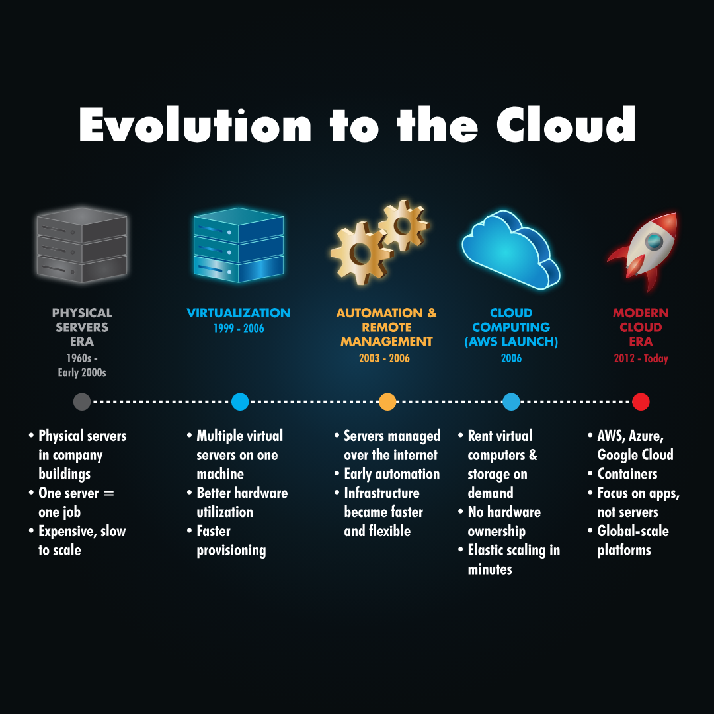
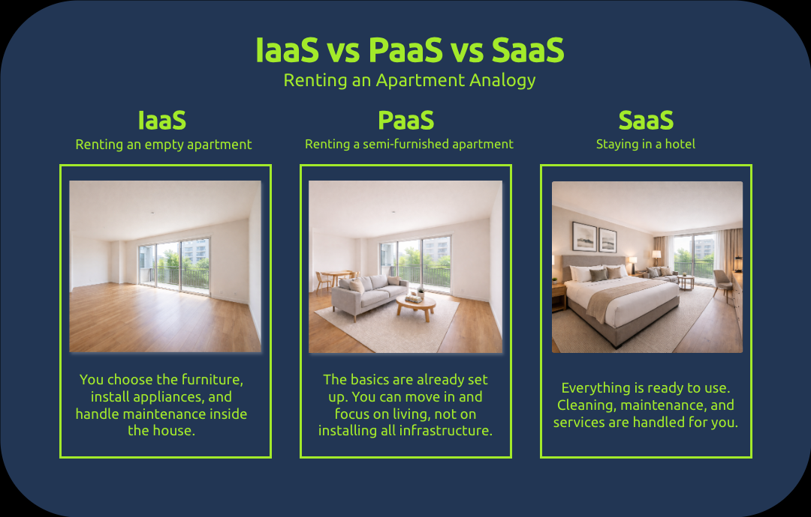
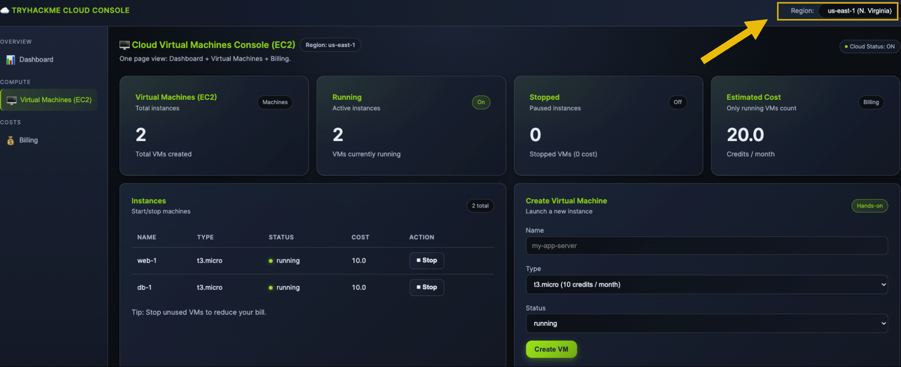
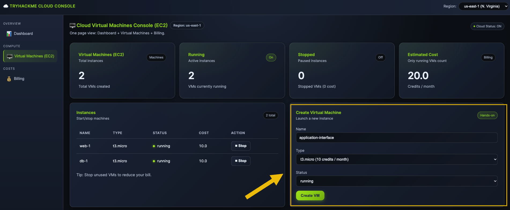
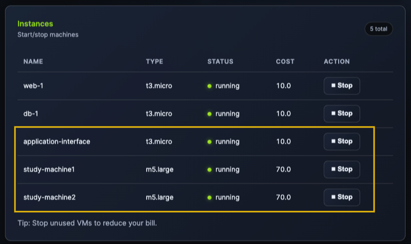
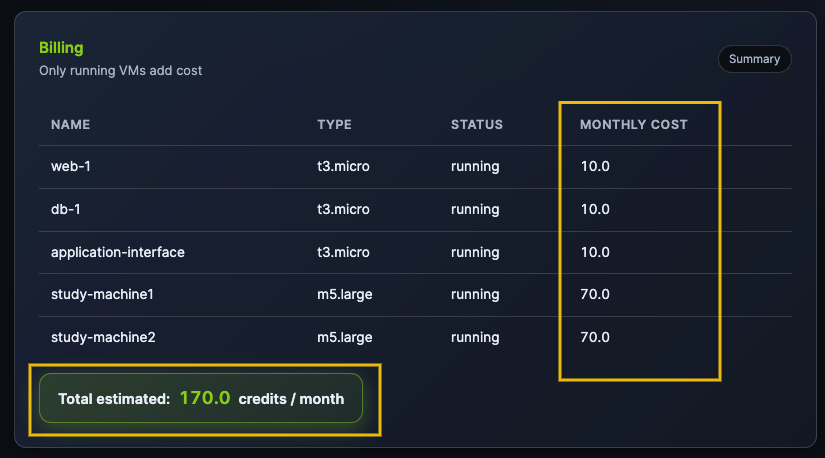
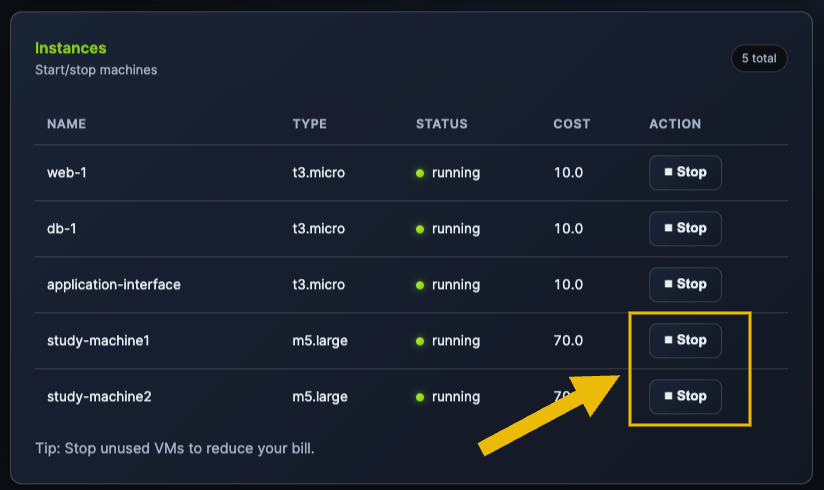
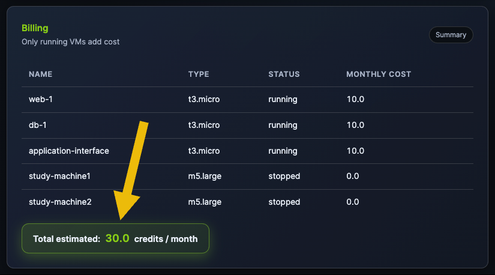

# Introduction

Imagine you have a fantastic idea for an app that helps students practice cyber security, and you host it on your own computer in your country. But what can you do when users from other parts of the world try to access it and experience lag? What if many students connect at the same time, or your computer is turned off? These limits make it hard for the app to grow.
想象一下，你有一个绝妙的应用程序创意，可以帮助学生练习网络安全，并且你把它托管在你本国的电脑上。但是，当世界其他地区的用户尝试访问它并遇到延迟时，你该怎么办？如果很多学生同时连接，或者你的电脑关机了怎么办？这些限制使得应用程序难以发展壮大。
That's when cloud computing comes to play and solves these problems!
这时云计算就派上了用场，解决了这些问题！

The cloud is built on top of technologies you already learned, like virtualization and containers. These enable running many applications efficiently on shared infrastructure and quickly creating or changing environments when needed.
云计算建立在您已经掌握的技术之上，例如虚拟化和容器。这些技术使得在共享基础设施上高效运行多个应用程序成为可能，并可根据需要快速创建或更改环境。

In this room, we will explore the basics of cloud computing and how this impacts the way modern applications are built, deployed, and used every day.
在这个房间里，我们将探讨云计算的基础知识，以及它如何影响现代应用程序的构建、部署和日常使用方式。

Learning Objectives  学习目标
What is cloud computing
什么是云计算
Service models of cloud (IaaS, PaaS, SaaS)
云服务模式（IaaS、PaaS、 SaaS ）
Cloud Types (Private/Public/Hybrid)
云类型（私有云/公有云/混合云）
Benefits of cloud computing
云计算的优势
How big companies are using the cloud
大型企业如何使用云
Prerequisites  先决条件
Virtualisation Basics room
虚拟化基础知识室

# Cloud Computing Overview

Cloud computing is the perfect solution for the challenges in the application you’ve designed, such as moving your files from a single laptop to online storage that you can access anywhere. Instead of running your app on one computer in one country, the cloud lets you use computing resources over the internet. This makes your application easier to access, more reliable, and ready to grow as more students start using it.
云计算是解决您设计的应用所面临挑战的完美方案，例如将文件从一台笔记本电脑迁移到可随时随地访问的在线存储空间。云计算让您无需在单一国家/地区的单台计算机上运行应用，而是通过互联网使用计算资源。这使得您的应用更易于访问、更可靠，并且能够随着更多学生的使用而扩展。

## How Servers Evolved to Cloud
服务器如何演进到云端

Before we start diving into cloud details, it’s helpful to understand that cloud computing did not appear suddenly. It is the result of many years of changes in how servers were used and managed. At each step, businesses looked for ways to reduce costs, use resources more efficiently, and make their applications easier to run and scale. The timeline below shows this evolution, from physical servers to the cloud we use today:
在深入探讨云计算的细节之前，了解云计算并非一蹴而就至关重要。它是服务器使用和管理方式多年来不断变革的结果。在每个阶段，企业都在寻求降低成本、更高效地利用资源以及简化应用程序运行和扩展的方法。以下时间线展示了从物理服务器到我们今天使用的云计算的演变过程：

## Cloud Benefits and Characteristics
云的优势和特点

After seeing how applications evolved from physical servers to the cloud, it's becoming clear why cloud computing is so widely used today. The cloud was designed to address common problems, including limited capacity, high costs, and slow growth.
了解了应用程序从物理服务器到云端的演变过程后，就不难理解为什么云计算如今如此普及。云计算旨在解决一些常见问题，例如容量有限、成本高昂和增长缓慢。
The following benefits and characteristics explain how cloud computing makes applications easier to run, scale, and manage:
以下优势和特点解释了云计算如何使应用程序的运行、扩展和管理更加便捷：

Scalability: Easily scale up or down as your application's needs change.
可扩展性： 可根据应用程序的需求变化轻松扩展或缩减规模。
On-demand self-service: Create or remove servers and storage instantly, without waiting for hardware.
按需自助服务： 无需等待硬件，即可立即创建或删除服务器和存储。
Pay only for what you use: You are charged based on usage, not upfront costs.
按需付费： 按使用量收费，无需预付费用。
Security: Cloud providers protect the infrastructure with strong security measures.
安全性： 云服务提供商通过强大的安全措施保护基础设施。
High availability: Applications keep running even if part of the system fails.
高可用性： 即使系统部分发生故障，应用程序也能继续运行。
Global access: Your application can be accessed by users anywhere in the world.
全球访问： 世界各地的用户都可以访问您的应用程序。
In simple terms, the cloud enables IT resources to be flexible, cost-effective, and easier to manage.
简而言之，云计算使 IT 资源更加灵活、经济高效且更易于管理。

## Types of Cloud  云的类型

The flexibility provided by cloud computing allows applications to be run in different ways, depending on your needs and level of control. Because of this, cloud providers offer multiple models for deploying and using applications, each suited to different scenarios.
云计算的灵活性允许应用程序根据您的需求和控制级别以不同的方式运行。因此，云服务提供商提供多种应用程序部署和使用模型，每种模型都适用于不同的场景。

Let’s start with the deployment types you can choose for a cloud environment:
我们先来看看您可以选择的云环境部署类型 ：

Public Cloud: Used by startups, websites, and global apps because it is affordable, easy to scale, and requires no infrastructure management. Public cloud services are preferable for nearly every use case.
公有云： 由于其价格实惠、易于扩展且无需基础设施管理，因此被初创公司、网站和全球应用程序广泛使用。公有云服务几乎适用于所有应用场景。
Private Cloud: Used by banks, healthcare, and government organizations because it offers greater control, customization, and compliance for sensitive data.
私有云： 被银行、医疗机构和政府组织使用，因为它能更好地控制、定制和合规敏感数据。
Hybrid Cloud: Used by companies like e-commerce platforms that need to keep sensitive data private while still scaling publicly during high demand.
混合云： 适用于像电子商务平台这样的公司，这些公司需要在需求高峰期保持敏感数据的私密性，同时还要能够公开扩展。
Just like there are different ways to deploy a cloud environment, there are also different ways to use cloud services. Depending on your experience and needs, you can choose the level of responsibility that fits your application.
正如部署云环境有多种方式一样， 使用云服务也有多种方式 。您可以根据自身的经验和需求，选择适合您应用程序的职责级别。

Let’s look at the main cloud service models:
我们来看看主要的云服务模型：

Infrastructure as a Service (IaaS): You rent basic computing resources such as virtual servers, storage, and networking. You are responsible for managing the operating system and your application, while the provider manages the physical hardware.
基础设施即服务 (IaaS)： 您租用基本的计算资源，例如虚拟服务器、存储和网络。您负责管理操作系统和应用程序，而服务提供商则负责管理物理硬件。
Platform as a Service (PaaS): The cloud provider manages the infrastructure and the operating system. You focus on building, deploying, and running your application without worrying about servers.
平台即服务 (PaaS)： 云服务提供商负责管理基础设施和操作系统。您只需专注于构建、部署和运行应用程序，无需担心服务器问题。
Software as a Service (SaaS): You use a complete application over the internet. The provider manages everything, and you access the software through a browser or app, for example, Gmail or Zoom.
软件即服务 ( SaaS )： 您通过互联网使用完整的应用程序。服务提供商管理一切，您通过浏览器或应用程序（例如 Gmail 或 Zoom）访问该软件。
Think of cloud service models like different ways of renting a place to live:
把云服务模式想象成不同的租房方式：

An analogy image showing how cloud service models can be compared to renting an apartment.

## Major Cloud Vendors  主要云供应商

There are several cloud vendors offering a variety of services, but Amazon Web Services (AWS) is the industry leader, with the most extensive offerings and global reach. Other well-known cloud providers include:
虽然有多家云服务供应商提供各种服务，但亚马逊网络服务 ( AWS ) 是行业领导者，拥有最广泛的产品和服务以及全球覆盖范围。其他知名的云服务提供商包括：

Microsoft Azure: A strong competitor, especially in enterprise and hybrid cloud environments.
微软 Azure： 一个强大的竞争对手，尤其是在企业和混合云环境中。
Google Cloud Platform (GCP): Known for powerful data analytics, AI, and machine learning tools.
Google Cloud Platform (GCP)： 以其强大的数据分析、 人工智能和机器学习工具而闻名。
Alibaba Cloud: A major player in Asia, offering competitive cloud services globally.
阿里云： 亚洲领先的云服务提供商，在全球范围内提供具有竞争力的云服务。
IBM Cloud: Focuses on hybrid cloud and AI-driven solutions for businesses.
IBM Cloud： 专注于为企业提供混合云和人工智能驱动的解决方案。
Oracle Cloud: Focuses on enterprise applications and databases.
Oracle 云： 专注于企业应用和数据库。
Each of these vendors offers a range of services, but AWS remains the most popular due to its vast infrastructure and support for businesses of all sizes.
这些供应商都提供一系列服务，但 AWS 凭借其庞大的基础设施和对各种规模企业的支持，仍然是最受欢迎的。

## How Companies Are Using the Cloud
企业如何使用云

Netflix runs its entire platform on AWS so it can scale globally, stay online during peak demand, and stream content reliably to millions of users at once.
Netflix 的整个平台都运行在 AWS 上，因此它可以实现全球扩展，在高峰需求期间保持在线，并同时可靠地向数百万用户传输内容。
Spotify uses the cloud to handle millions of songs and users, scaling quickly when new music or features are released.
Spotify 利用云技术处理数百万首歌曲和用户，并在发布新音乐或功能时快速扩展。
Instagram relies on the cloud to store massive amounts of photos and videos and deliver them fast to users around the world.
Instagram 依靠云技术存储海量的照片和视频，并快速将其发送给世界各地的用户。
Online stores use the cloud to handle traffic spikes during black friday without buying permanent infrastructure.
在线商店利用云技术来应对黑色星期五期间的流量高峰，而无需购买永久性基础设施。
These companies use the cloud because it lets them scale easily, reduce costs, stay reliable, and focus on improving their products instead of managing hardware.
这些公司使用云服务是因为它能让他们轻松扩展规模、降低成本、保持可靠性，并专注于改进产品而不是管理硬件 。

Next, you’ll apply these same ideas by deploying your cyber security training app in a simulated cloud environment!
接下来，您将运用这些相同的理念，在模拟云环境中部署您的网络安全培训应用程序！

# Deploying a Cloud Instance

So far, you’ve learned what cloud computing is and why companies use it. Now it’s time to see those ideas in action by deploying a cloud environment to launch your cyber security app training!
到目前为止，您已经了解了什么是云计算以及企业为什么要使用它。现在是时候通过部署云环境来启动您的网络安全应用程序培训，从而将这些理念付诸实践了！
In this exercise, you’ll use a cloud interface similar to the AWS platform. The goal is not to memorize buttons, but to understand how cloud resources are easily created and managed in a real-world scenario.
在本练习中，您将使用类似于 AWS 平台的云界面。目标不是记住按钮，而是了解如何在实际场景中轻松创建和管理云资源 。

Open the Cloud Console site by clicking the View Site button below, and let's create your cloud environment!
点击下面的 View Site 按钮打开云控制台站点，让我们一起创建您的云环境吧！

View Site  查看网站
Basic Cloud Terminology  云计算基本术语
To complete this exercise, you only need to understand a few basic concepts from AWS:
要完成这项练习，您只需要了解 AWS 的一些基本概念：

EC2 (Virtual Computer / Server): EC2 represents a virtual computer in the cloud. Just like a real computer, it has a CPU and memory (RAM) and can run applications. Whenever you add an EC2 instance, you are adding a computer to your environment.
EC2（虚拟计算机/服务器）： EC2 代表云端的虚拟计算机。它就像一台真正的计算机一样，拥有 CPU 和内存 (RAM)，并且可以运行应用程序。添加 EC2 实例就相当于在您的环境中添加了一台计算机。
Instance Type (for example: t2, t3, m5): Instance types describe how powerful the virtual computer is. Some have more CPU and RAM and are therefore more expensive. You choose the Instance Type based on your needs, knowing that:
实例类型（例如：t2、t3、m5）： 实例类型描述了虚拟机的性能。有些实例拥有更多的 CPU 和内存，因此价格更高。您可以根据自身需求选择实例类型，但需注意以下几点：
Bigger instances = more power + higher cost
更大的实例 = 更高的算力 + 更高的成本
Minor instances = less power + lower cost
小实例 = 更少的功耗 + 更低的成本
Deploying Your Environment
部署您的环境
You will create three virtual computers (EC2 instances) to host your cyber security training application. This aligns with the Infrastructure as a Service (IaaS) model you previously learned, as cyber security practices often require full access to the operating system. This allows you to install tools, configure the system, and safely simulate attacks and defenses, just like in real-world environments!
您将创建三台虚拟计算机（EC2 实例）来托管您的网络安全培训应用程序。这与您之前学习的基础设施即服务 (IaaS) 模型相符，因为网络安全实践通常需要对操作系统拥有完全访问权限。这样，您就可以安装工具、配置系统，并安全地模拟攻击和防御，就像在真实环境中一样！

Picking a Region  选择一个区域
First, you need to choose a region where your resources will live. You can do it in the top right of your screen:
首先，您需要选择资源存放的区域。您可以在屏幕右上角进行选择：

A region represents a geographical location, for example, Europe or North America.
区域代表地理位置，例如欧洲或北美。

Creating Virtual Machines
创建虚拟机
Now, go to the Create Virtual Machine block on the right side of the page to create the virtual machines for your application.
现在，转到页面右侧的 Create Virtual Machine 模块，为您的应用程序创建虚拟机。
First, let's create your application interface machine. Set the following configuration:
首先，我们来创建应用程序接口机器。请进行以下配置：

Instance Name: application-interface
实例名称： application-interface
Instance Type: t3.micro
实例类型： t3.micro
Status: running
状态： running

Now, let's create two testing computers for users to practice their cyber security skills.
现在，让我们创建两台测试电脑，供用户练习网络安全技能。
Since these are test machines, let's use a more powerful instance type: m5.large.
由于这些是测试机器，让我们使用更强大的实例类型： m5.large 。

Machine 1:  机器 1：

Instance Name: study-machine-1
实例名称： study-machine-1
Instance Type: m5.large
实例类型： m5.large
Status: running
状态： running
Machine 2:  机器 2：

Instance Name: study-machine-2
实例名称： study-machine-2
Instance Type: m5.large
实例类型： m5.large
Status: running
状态： running
After creating the two new machines, your Instances block should look like this:
创建两台新机器后，您的 Instances 块应如下所示：

Billing Analysis  计费分析
Let's analyze how much credit is costing our environment by navigating to the Billing section at the bottom of the page.
让我们通过导航到页面底部的 Billing 部分来分析一下信贷对我们的环境造成了多大的影响。
There, you can check how much each type of instance is costing you, as well as the total.
在那里，您可以查看每种实例类型的费用以及总费用。

Currently, you are still developing your application, so users have not yet accessed your platform. We can optimize costs by stopping the two study machines and reviewing the new cost of your environment.
目前，您的应用程序仍在开发中，因此用户尚未访问过您的平台。我们可以通过停止使用两台测试机并重新评估您环境的新成本来优化费用。

Go to the Instances block and click the Stop button for both study-machine-1 and study-machine-2.
转到 Instances 块，然后单击 study-machine-1 和 study-machine-2 的 Stop 按钮。

Go back to the Billing section, and you should see that your cost was reduced considerably:
返回 Billing 部分，您应该会看到您的费用已大幅降低：

This exercise is a clear example of how easily you can change and manage your costs in a cloud environment.
这个例子清楚地说明了在云环境中更改和管理成本是多么容易。

Answer the following questions to conclude your learning about cloud computing!

# Conclusion

In this room, you explored the core ideas behind cloud computing and how it enables flexible, scalable, and cost-effective access to computing resources.
在这个房间里，你们探索了云计算背后的核心理念，以及它如何实现对计算资源的灵活、可扩展和经济高效的访问。

Key Terminology  关键术语
Let's quickly review some concepts we learned in this room:
让我们快速回顾一下我们在这个房间里学到的一些概念：

Public Cloud
公有云
Cloud services you access over the internet that many people and companies share.
您通过互联网访问的、由许多人和公司共享的云服务。
Private Cloud
私有云
A cloud built just for one company, so they have more control and security.
专为一家公司打造的云平台，让该公司拥有更大的控制权和安全性。
Hybrid Cloud  混合云
A mix of public and private clouds that can work together and share data.
公有云和私有云的混合体，可以协同工作并共享数据。
IaaS
A service where you rent basic computer parts like servers and storage from the cloud.
一项可以从云端租用服务器和存储设备等基本计算机部件的服务。
PaaS
A service that gives you a ready-to-use environment to build and run apps without managing servers.
这项服务为您提供一个即用型环境，让您无需管理服务器即可构建和运行应用程序。
SaaS  软件即服务
Software you use online without installing anything, like Gmail or Zoom.
无需安装即可在线使用的软件，例如 Gmail 或 Zoom。
EC2
Amazon’s cloud computers that you can quickly create, use, and resize whenever you need them.
亚马逊的云计算机，您可以随时根据需要快速创建、使用和调整大小。
We also concluded that the key benefits of cloud computing are:
我们还得出结论，云计算的主要优势包括：

Scalability  可扩展性
On-demand self-service  按需自助服务
Pay only for what you use
只为使用的服务付费
Security  安全
High availability  高可用性
Global access  全球访问
Further Learning  进一步学习
You are now ready to explore the next key area: Operating Systems. In the Operating Systems Introduction room, you will learn how OS components manage hardware, processes, memory, and security. This knowledge is essential for understanding how cloud systems run applications behind the scenes!
现在，您已准备好探索下一个关键领域：操作系统。在 “操作系统入门”课程中，您将学习操作系统组件如何管理硬件、进程、内存和安全。这些知识对于理解云系统如何在后台运行应用程序至关重要！
