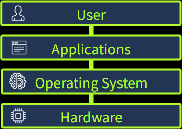

# TryHackMe | Operating Systems:

An **operating system** (OS) is the core software that coordinates everything happening on a computer. It sits between the user, applications, and the system’s physical hardware, acting as the invisible manager that keeps the entire machine running as one unified system.

**操作系统** （ OS ）是协调计算机上所有操作的核心软件。它位于用户、应用程序和系统物理硬件之间，充当着无形的管理器，使整个机器作为一个统一的系统运行。

A helpful analogy is to think of your computer as a busy airport, with all its components functioning together.

一个便于理解的比喻是，把你的电脑想象成一个繁忙的机场，它的所有组件都在协同运作。

- Your **hardware** (CPU, RAM, storage, connected devices): The runways, airplanes, fuel systems, radar, and other physical infrastructure.

  您的**硬件** （ CPU 、 RAM 、存储、连接设备）：跑道、飞机、燃油系统、雷达和其他物理基础设施。
- Your **applications** (web browser, game launcher): The various airlines and their passengers, all trying to take off, land, and request services.

  您的**应用程序** （网页浏览器、游戏启动器）：各航空公司及其乘客，都在尝试起飞、降落和请求服务。
- Your **operating system** (Windows, Linux, macOS): The entire air traffic control system, directing all of this activity. It schedules resources, manages traffic, resolves conflicts, and ensures safety.

  您的**操作系统** （Windows、 Linux 、macOS）：整个空中交通管制系统，指挥着所有这些活动。它安排资源、管理交通、解决冲突并确保安全。

We need an operating system because it provides this all-important job of coordination and structuring that makes modern computing possible. Without an OS, each application would need direct control over the CPU, memory, files, devices, and security. This would quickly cause conflicts, and the OS handles this by acting as the central organizer. In the Computer Fundamentals module (coming soon), you learned about various computer components and their duties. Now, we will see how the operating system manages and allocates these resources when you use your PC.

我们需要操作系统，因为它提供了至关重要的协调和组织工作，使现代计算成为可能。如果没有操作系统 ，每个应用程序都需要直接控制 CPU 、内存、文件、设备和安全资源。这很快就会导致冲突，而操作系统通过充当中央组织者来处理这些问题。在即将推出的“计算机基础”模块中，您学习了各种计算机组件及其功能。现在，我们将了解当您使用电脑时，操作系统是如何管理和分配这些资源的。

## System Privilege Layers  系统特权层

Inside a modern computer, different parts of the system operate at various permission levels. Some components can communicate directly with the hardware, while regular applications run in a safer, restricted environment. This separation is intentional and helps prevent conflicts and security issues.

在现代计算机内部，系统的不同部分以不同的权限级别运行。某些组件可以直接与硬件通信，而常规应用程序则在更安全、受限的环境中运行。这种分离是有意为之，有助于防止冲突和安全问题。

- **Kernel space**: The privileged, locked-down core of the OS. This is where the kernel, the part of the operating system that directly manages hardware and system resources, runs. It has unrestricted access to the CPU, memory, storage, and all hardware components.

  **内核空间** ： 操作系统中享有特权且受到严格控制的核心区域。内核（操作系统中直接管理硬件和系统资源的部分）就运行在这里。它拥有对 CPU 、内存、存储以及所有硬件组件的完全访问权限。
- **User space**: Where all standard applications run. Applications in the user space are deliberately prevented from accessing hardware directly. Whenever they need to open or save a file, play a sound, or connect to Wi-Fi, they must make a system call and request that the kernel act on their behalf.

  **用户空间** ：所有标准应用程序运行的地方。用户空间中的应用程序被刻意限制不能直接访问硬件。每当它们需要打开或保存文件、播放声音或连接 Wi-Fi 时，都必须发出系统调用，请求内核代表它们执行这些操作。

Building on our airport analogy, let's zoom in on the concept of privilege separation. The kernel space is the control tower, a strictly secured area where only trusted air-traffic controllers (the kernel) work. They alone can directly control the runways, radar, and other hardware. Applications in the user space are like airlines and passengers on the ground. They can't enter the tower or touch the equipment. Instead, they radio requests (system calls) to the tower, which handles them safely. This separation keeps the OS reliable: one faulty app can't crash the whole system, just as no airline can operate safely without the tower's control.

沿用机场的比喻，让我们深入探讨权限分离的概念。内核空间就像控制塔，是一个高度安全的区域，只有受信任的空中交通管制员（内核）才能在那里工作。只有他们才能直接控制跑道、雷达和其他硬件。用户空间中的应用程序就像地面上的飞机和乘客。它们不能进入塔台或触碰设备。相反，它们通过无线电（系统调用）向塔台发送请求，由塔台安全地处理。这种分离保证了操作系统的可靠性：一个有缺陷的应用程序不会导致整个系统崩溃，就像没有塔台的控制，任何航空公司都无法安全运营一样。

## Operating System Duties  操作系统职责

Now that you know what an operating system is and how system privilege is separated, let’s look at what it actually does behind the scenes. Every OS is responsible for a few core duties that allow your computer to run safely, efficiently, and predictably.

既然您已经了解了操作系统是什么以及系统权限是如何划分的，接下来我们来看看它在幕后究竟做了些什么。每个操作系统都负责一些核心功能，以确保您的计算机安全、高效且稳定地运行。

| OS Responsibility      | What the OS Does                                                                                                                                                                               | Example                                                                                                                             |
| :--------------------- | :--------------------------------------------------------------------------------------------------------------------------------------------------------------------------------------------- | :---------------------------------------------------------------------------------------------------------------------------------- |
| Process Management     | Creates, schedules, prioritizes, and terminates running programs. The OS decides how much CPU time each process gets, making multitasking feel seamless                                        | Opening multiple apps, like your browser, music player, and social media, without your computer freezing                            |
| Memory Management      | Allocates RAM to processes, protects the app's memory from other processes, and reclaims memory when apps are closed. When RAM runs low, the OS uses virtual memory to keep your system stable | Opening multiple app at once, the OS allocates RAM to each one and keeps them isolated so they don’t interfere or crash each other |
| File System Management | Organizes files into directories, handles naming, paths, permissions, metadata (name, size, type, timestamps)                                                                                  | Creating a new folder, saving a photo, or setting a file to "read only"                                                             |
| User Management        | Handles multiple user accounts, authentication, and permissions to determine who can access what                                                                                               | Logging in with your password and keeping your files inaccessible to other user accounts                                            |
| Device Management      | Loads drivers and provides a universal interface (hardware abstraction layer), so apps can say “print this” or “play this sound”                                                           | Plugging in a new mouse, printer, or external hard drive and having it work immediately                                             |

## Operating System Security

操作系统安全

It is important to understand that every OS also acts as a security foundation. Before any antivirus, firewall, or security tool is introduced, the OS is already enforcing protections in the background, some of which we covered above.

需要注意的是，每个操作系统本身也扮演着安全基础的角色。在安装任何杀毒软件、 防火墙或其他安全工具之前， 操作系统就已经在后台实施了一系列保护措施，我们前面已经介绍过其中一些。

At a basic level, your operating system handles

从根本上讲，你的操作系统负责处理

- **Authentication**: Verifies who you are through login passwords and biometrics

  **身份验证** ：通过登录密码和生物识别技术验证您的身份
- **Permissions**: Controls exactly what each user and app is allowed to read, write, or execute

  **权限** ：精确控制每个用户和应用被允许读取、写入或执行哪些内容。
- **Isolation**: Keeps every process in its own protected box (kernel/user space separation)

  **隔离** ：将每个进程置于其自身的保护空间内（内核/用户空间分离）
- **System Protection**: Safeguards critical system files and settings from unauthorized changes

  **系统保护** ：防止关键系统文件和设置被未经授权的更改
